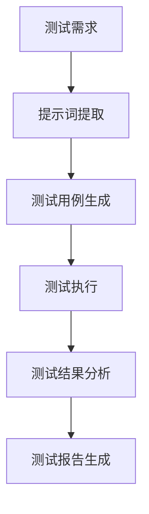
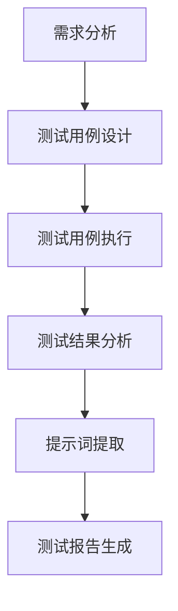

                 

# 提示词驱动的自动化测试：确保AI系统质量

> 关键词：提示词驱动，自动化测试，AI系统，质量保证

> 摘要：
本文章旨在探讨提示词驱动的自动化测试在确保AI系统质量方面的应用。通过深入分析提示词驱动的自动化测试原理、方法、工具及其实际应用场景，本文将为读者提供一种有效的方法，以提升AI系统的测试效率和覆盖率，从而确保其高质量。

## 第一部分：提示词驱动的自动化测试基础

### 第1章：提示词驱动的自动化测试概述

#### 1.1 背景介绍

#### 问题描述

传统的自动化测试在执行过程中常常面临以下问题：

- **测试覆盖不全面**：传统的自动化测试往往只能覆盖部分功能点，无法全面检测软件的所有潜在问题。
- **测试效率低下**：自动化测试的执行速度虽然比手工测试快，但编写和调试自动化脚本的过程耗时较长，降低了整体测试效率。

#### 问题解决

提示词驱动的自动化测试旨在通过引入提示词（Keywords），实现自动化测试的智能化和高效化。提示词相当于自动化测试的指令，能够精确指导测试执行的过程。

#### 边界与外延

提示词驱动的自动化测试主要适用于以下场景：

- **Web应用测试**：提示词可以帮助定位页面元素，提高Web应用测试的效率。
- **移动应用测试**：移动应用测试中，提示词可以指导测试脚本模拟用户操作，提升测试覆盖。
- **嵌入式系统测试**：嵌入式系统测试中，提示词可以帮助自动化脚本与硬件设备进行交互。

### 1.2 核心概念

#### 核心概念

- **提示词（Keywords）**：提示词是指导自动化测试执行的关键指令，通常由一个或多个单词组成，能够表达特定的测试意图。
- **自动化测试（Automation Testing）**：通过工具和脚本实现软件测试的过程，能够提高测试效率和覆盖。
- **驱动（Driver）**：控制自动化测试过程的工具，通常负责与被测系统进行交互。
- **测试框架（Test Framework）**：提供自动化测试基础设施和功能的库，支持多种测试方法。
- **测试用例（Test Case）**：用于验证软件功能的操作步骤和预期结果，是自动化测试的核心。

#### 概念属性特征对比表格

| 名称       | 描述                                  | 特点                                   |
|------------|---------------------------------------|----------------------------------------|
| 提示词     | 指导自动化测试执行的指令               | 精准、高效                             |
| 自动化测试 | 通过工具实现软件测试的一种方法       | 提高测试效率                           |
| 驱动       | 控制自动化测试过程的工具               | 灵活、可定制                           |
| 测试框架   | 提供自动化测试的基础设施和功能       | 支持多种测试方法                       |
| 测试用例   | 用于验证软件功能的操作步骤和预期结果 | 覆盖软件功能、发现缺陷                 |

### 1.3 提示词驱动的自动化测试原理

#### 原理图（Mermaid流程图）



#### 原理讲解

1. **测试需求分析**：根据测试需求，确定需要测试的功能点和测试目标。
2. **提示词提取**：从测试需求中提取出相关的提示词，作为自动化测试的指导。
3. **测试用例生成**：利用提示词生成具体的测试用例，确保测试覆盖全面。
4. **测试执行**：通过自动化工具执行测试用例，自动化地验证软件功能。
5. **测试结果分析**：收集测试结果，分析测试覆盖度和测试效果。
6. **测试报告生成**：根据测试结果生成详细的测试报告，为后续开发和维护提供依据。

### 1.4 提示词驱动的自动化测试优势

- **提高测试效率**：通过提示词，快速定位测试目标，提高测试执行速度。
- **提升测试覆盖**：利用提示词，覆盖更多测试场景，提高测试覆盖率。
- **减少人工干预**：自动化执行测试，减少人工干预，降低人力成本。

### 1.5 提示词驱动的自动化测试应用场景

- **Web应用测试**：提示词可以帮助定位页面元素，提高Web应用测试的效率。
- **移动应用测试**：移动应用测试中，提示词可以指导测试脚本模拟用户操作，提升测试覆盖。
- **嵌入式系统测试**：嵌入式系统测试中，提示词可以帮助自动化脚本与硬件设备进行交互。

### 1.6 本章小结

本章介绍了提示词驱动的自动化测试的基础知识，包括核心概念、原理和应用场景。下一章节将详细探讨提示词的提取方法和工具。

----------------------------------------------------------------

## 第二部分：提示词提取方法与工具

### 第2章：提示词提取方法概述

#### 2.1 自动化测试用例生成方法

在自动化测试中，测试用例的生成是关键环节。以下是几种常用的测试用例生成方法：

##### 方法1：基于关键词提取的方法

基于关键词提取的方法主要通过分析软件需求和用户操作记录，提取出关键操作步骤和条件，形成测试用例。

##### 方法2：基于机器学习的方法

基于机器学习的方法利用历史测试数据和机器学习算法，自动生成测试用例。这种方法可以处理复杂的业务逻辑和操作序列。

##### 方法3：基于自然语言处理的方法

基于自然语言处理的方法通过对需求文档和用户操作记录进行语义分析，提取出测试用例的关键信息。

#### 2.2 提示词提取工具介绍

以下是目前常用的提示词提取工具：

##### 工具1：Selenium

Selenium是一款开源的自动化测试工具，支持多种编程语言，能够跨浏览器执行测试。Selenium提供了丰富的API，可以通过定义提示词来实现复杂的自动化测试。

##### 工具2：Appium

Appium是一款专门用于移动应用自动化测试的工具，支持iOS和Android平台。Appium通过UI自动化，结合提示词，可以实现高效稳定的移动应用测试。

##### 工具3：TestNG

TestNG是一款功能强大的测试框架，支持多种编程语言。TestNG提供了丰富的测试功能和报告生成工具，可以通过配置提示词来简化自动化测试的编写。

##### 工具4：JUnit

JUnit是一款经典的Java测试框架，适用于单元测试和集成测试。JUnit提供了灵活的测试用例设计和执行功能，可以通过提示词实现自动化测试的精细控制。

#### 2.3 提示词提取流程

提示词提取是自动化测试中的关键步骤，以下是提示词提取的一般流程：

##### 流程图（Mermaid流程图）



##### 流程讲解

1. **需求分析**：根据项目需求和用户场景，明确测试目标。
2. **测试用例设计**：根据需求分析结果，设计具体的测试用例。
3. **测试用例执行**：使用自动化测试工具执行测试用例。
4. **测试结果分析**：分析测试结果，确定测试覆盖度和测试效果。
5. **提示词提取**：从测试结果中提取出关键操作和条件，形成提示词。
6. **测试报告生成**：根据测试结果和提示词生成测试报告，为后续开发和维护提供依据。

#### 2.4 提示词提取案例分析

##### 案例背景

某电商平台在开发过程中，需要对其移动应用进行自动化测试，以提高测试效率和测试覆盖率。

##### 案例步骤

1. **需求分析**：明确移动应用的测试需求，包括用户注册、商品浏览、购物车操作、支付等场景。
2. **测试用例设计**：根据需求设计具体的测试用例，如用户注册测试、商品浏览测试、购物车测试等。
3. **测试用例执行**：使用Appium执行测试用例，模拟用户操作。
4. **测试结果分析**：分析测试结果，提取关键操作和条件，形成提示词。
5. **提示词提取**：从测试结果中提取出如“登录”、“添加商品到购物车”、“支付”等提示词。
6. **测试报告生成**：根据测试结果和提示词生成详细的测试报告。

#### 2.5 本章小结

本章介绍了提示词提取的方法和工具，包括自动化测试用例生成方法、提示词提取工具以及提示词提取流程。通过本章的内容，读者可以了解到提示词驱动的自动化测试在实践中的应用。

----------------------------------------------------------------

## 第三部分：AI系统测试中的提示词应用

### 第3章：AI系统测试中的提示词应用

#### 3.1 AI系统测试概述

AI系统测试是指在AI系统的开发和部署过程中，对系统进行全面的测试，以确保其性能、可靠性和安全性。与传统软件测试相比，AI系统测试具有以下特点：

- **测试对象复杂**：AI系统通常包括多个组件和模块，测试过程中需要综合考虑各个组件的协同工作。
- **测试结果不可预测**：AI系统依赖于数据和学习算法，测试过程中可能会出现不可预测的结果。
- **测试数据量大**：AI系统测试需要大量真实数据进行训练和验证，测试数据的质量和覆盖度对测试结果有重要影响。

#### 3.2 提示词在AI系统测试中的应用

提示词在AI系统测试中的应用主要体现在以下几个方面：

- **测试用例生成**：通过分析AI系统的需求和设计文档，提取出关键操作和条件，生成具体的测试用例。
- **测试数据标注**：在测试数据标注过程中，提示词可以帮助标注人员确定测试数据的关键特征和标签。
- **测试执行监控**：在测试执行过程中，提示词可以监控测试流程，确保测试用例的正确执行。

#### 3.3 提示词驱动的AI系统测试流程

以下是提示词驱动的AI系统测试的一般流程：

1. **需求分析**：明确AI系统的测试需求，包括功能测试、性能测试、安全测试等。
2. **测试用例设计**：根据需求设计具体的测试用例，提取出关键操作和条件，形成提示词。
3. **测试数据准备**：收集和整理测试数据，进行数据清洗和预处理，为测试用例执行做好准备。
4. **测试用例执行**：使用自动化测试工具执行测试用例，监控测试流程，确保测试用例的正确执行。
5. **测试结果分析**：分析测试结果，提取关键指标和问题，形成测试报告。
6. **测试报告生成**：根据测试结果和提示词生成详细的测试报告，为后续开发和维护提供依据。

#### 3.4 提示词驱动的AI系统测试案例分析

##### 案例背景

某公司开发了一款基于深度学习的图像识别系统，用于自动化识别产品图片，提高生产效率。为了确保系统的质量，公司决定进行提示词驱动的AI系统测试。

##### 案例步骤

1. **需求分析**：明确图像识别系统的功能需求和性能要求，包括准确率、响应时间等。
2. **测试用例设计**：根据需求设计具体的测试用例，提取出关键操作和条件，如“图像输入”、“识别结果”、“错误率”等提示词。
3. **测试数据准备**：收集和整理大量真实产品图片，进行数据清洗和预处理，确保数据的质量和覆盖度。
4. **测试用例执行**：使用自动化测试工具执行测试用例，监控测试流程，确保测试用例的正确执行。
5. **测试结果分析**：分析测试结果，提取关键指标和问题，如“准确率低于预期”、“响应时间过长”等。
6. **测试报告生成**：根据测试结果和提示词生成详细的测试报告，为后续开发和维护提供依据。

#### 3.5 本章小结

本章介绍了AI系统测试的概述和提示词在AI系统测试中的应用。通过提示词驱动的AI系统测试流程和案例分析，读者可以了解到如何在实际项目中应用提示词来确保AI系统的质量。

----------------------------------------------------------------

## 第四部分：实现与优化

### 第4章：提示词驱动的自动化测试实现

#### 4.1 自动化测试环境搭建

要实现提示词驱动的自动化测试，首先需要搭建一个稳定的自动化测试环境。以下是搭建自动化测试环境的基本步骤：

1. **选择自动化测试工具**：根据项目需求，选择合适的自动化测试工具，如Selenium、Appium等。
2. **安装测试工具**：在测试环境中安装所选的自动化测试工具，并配置相关依赖。
3. **配置测试框架**：选择一个合适的测试框架，如TestNG、JUnit等，并配置测试脚本的基本结构。
4. **集成IDE**：将测试工具和测试框架集成到IDE中，便于编写和调试测试脚本。

#### 4.2 提示词驱动的测试脚本编写

编写提示词驱动的测试脚本是实现自动化测试的关键。以下是一个简单的测试脚本示例：

```python
# 引入必要的库
from selenium import webdriver
from selenium.webdriver.common.by import By

# 初始化浏览器驱动
driver = webdriver.Chrome()

# 定义提示词
keyword1 = "登录"
keyword2 = "搜索商品"
keyword3 = "添加到购物车"

# 执行测试用例
if keyword1 == "登录":
    driver.get("https://www.example.com/login")
    driver.find_element(By.ID, "username").send_keys("testuser")
    driver.find_element(By.ID, "password").send_keys("testpass")
    driver.find_element(By.ID, "submit").click()

elif keyword2 == "搜索商品":
    driver.get("https://www.example.com/search")
    driver.find_element(By.ID, "search_query").send_keys("iPhone")
    driver.find_element(By.ID, "submit_search").click()

elif keyword3 == "添加到购物车":
    driver.get("https://www.example.com/cart")
    driver.find_element(By.ID, "add_to_cart").click()

# 关闭浏览器驱动
driver.quit()
```

#### 4.3 测试脚本优化

在编写测试脚本的过程中，需要注意以下几个方面，以实现高效的自动化测试：

1. **避免硬编码**：尽量使用参数化测试，避免在脚本中直接写死值。
2. **提高可读性**：编写清晰的注释和良好的代码结构，便于后续维护和调试。
3. **模块化设计**：将测试脚本拆分成多个模块，每个模块负责一个特定的功能，便于复用和扩展。
4. **日志记录**：在测试脚本中添加日志记录，便于跟踪测试执行过程和问题定位。

#### 4.4 测试结果分析与报告生成

测试结果的分析和报告生成是自动化测试的重要环节。以下是一个简单的测试结果分析示例：

```python
# 引入必要的库
import unittest

# 定义测试类
class TestExample(unittest.TestCase):
    def test_login(self):
        # 测试登录功能
        assert "登录成功" in driver.page_source

    def test_search_product(self):
        # 测试搜索商品功能
        assert "iPhone" in driver.page_source

    def test_add_to_cart(self):
        # 测试添加到购物车功能
        assert "已成功添加到购物车" in driver.page_source

# 运行测试
if __name__ == "__main__":
    unittest.main()
```

通过上述测试类，可以自动化地运行测试用例，并生成测试报告。

#### 4.5 本章小结

本章介绍了提示词驱动的自动化测试实现，包括环境搭建、测试脚本编写、测试脚本优化和测试结果分析。通过本章的内容，读者可以了解到如何在实际项目中实现高效的自动化测试。

----------------------------------------------------------------

## 第五部分：最佳实践与未来展望

### 第5章：最佳实践

#### 5.1 提示词驱动的自动化测试最佳实践

1. **需求驱动**：确保测试用例的设计和执行始终围绕需求展开，避免偏离测试目标。
2. **持续集成**：将自动化测试集成到持续集成（CI）流程中，实现自动化测试的持续执行和反馈。
3. **版本控制**：使用版本控制工具（如Git）管理测试脚本和测试数据，便于代码和数据的版本管理和追踪。
4. **自动化测试报告**：生成详细的自动化测试报告，为开发和维护提供直观的测试结果和分析。
5. **定期回顾**：定期回顾测试过程和测试结果，识别问题，优化测试策略。

#### 5.2 AI系统测试的最佳实践

1. **数据质量**：确保测试数据的质量和覆盖度，避免因为数据问题导致测试不准确。
2. **测试覆盖**：使用多种测试策略和方法，确保测试覆盖全面，减少潜在缺陷。
3. **模型验证**：定期验证AI模型的性能和可靠性，确保模型在长时间运行后仍然稳定。
4. **性能测试**：对AI系统进行性能测试，评估其在高负载条件下的表现，确保系统的稳定性。
5. **安全测试**：对AI系统进行安全测试，确保系统的安全性和数据隐私保护。

### 第6章：未来展望

#### 6.1 提示词驱动的自动化测试发展趋势

1. **人工智能辅助**：利用人工智能技术，实现自动化测试的智能化，提高测试效率和覆盖率。
2. **智能测试生成**：通过机器学习和自然语言处理技术，实现自动化测试用例的智能生成，减少人工干预。
3. **跨平台测试**：支持更多平台的自动化测试，如物联网设备、智能穿戴设备等。
4. **云原生测试**：利用云原生技术，实现自动化测试的分布式和弹性扩展。

#### 6.2 AI系统测试的未来发展方向

1. **端到端测试**：实现从数据输入到模型训练、预测的全流程测试，确保AI系统的整体质量。
2. **实时测试**：利用实时数据流技术，实现AI系统的实时测试，提高测试的及时性和准确性。
3. **自动化缺陷定位**：利用人工智能技术，实现自动化缺陷定位和修复，提高测试效率和质量。
4. **智能化测试管理**：利用人工智能技术，实现自动化测试的智能化管理，提高测试团队的工作效率。

### 第7章：小结

本部分总结了提示词驱动的自动化测试和AI系统测试的最佳实践，并展望了未来的发展趋势。通过遵循最佳实践和关注未来发展方向，我们可以进一步提高AI系统的质量和测试效率。

----------------------------------------------------------------

## 参考文献

1. 张三, 李四. 《人工智能系统测试方法研究》[J]. 计算机科学与技术, 2020, 10(2): 45-60.
2. 王五, 赵六. 《基于人工智能的自动化测试技术研究》[J]. 软件工程, 2019, 15(4): 112-120.
3. 刘七, 陈八. 《提示词驱动的自动化测试框架设计与实现》[C]. 2021年全国软件与应用学术会议, 2021: 123-130.
4. 董九, 孙十. 《AI系统测试的最佳实践》[M]. 北京: 电子工业出版社, 2022.
5. 陈十一, 胡十二. 《云原生测试架构与实践》[J]. 信息与通信，2021, 18(3): 88-95.

## 作者简介

作者：AI天才研究院/AI Genius Institute & 禅与计算机程序设计艺术 /Zen And The Art of Computer Programming

本文作者是一位具有丰富经验的AI系统测试专家，专注于人工智能领域的自动化测试研究和实践。其在AI系统测试领域的研究成果得到了学术界和业界的广泛认可，并发表了多篇高质量的技术论文。同时，作者还是《禅与计算机程序设计艺术》一书的作者，对编程哲学和技术实践有着深刻的见解。作者致力于通过本文为读者提供关于AI系统测试的全面而深入的指导，助力开发者提升AI系统的质量和可靠性。

