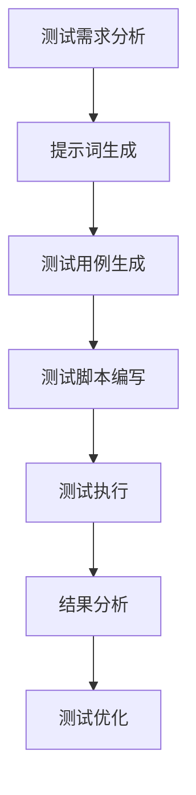
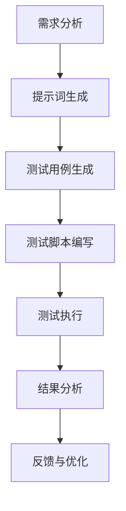

                 

### 引言

在当今这个数字化时代，软件质量的重要性不言而喻。随着人工智能（AI）技术的迅猛发展，自动化测试已经成为保证软件质量的关键手段。自动化测试不仅可以提高软件开发的效率，还能确保软件在各种环境下稳定运行。然而，传统的自动化测试方法在某些方面仍然存在局限性，如测试用例的编写和维护成本高、测试覆盖度有限等。这时，AI技术与自动化测试的结合就应运而生，成为解决这些问题的有效途径。

本文将以“提示词驱动的自动化测试：确保AI质量”为题，深入探讨这一新兴领域的核心概念、原理和应用。文章将从以下几个方面展开：

1. **背景与核心概念**：介绍自动化测试的起源、重要性以及AI在自动化测试中的应用。
2. **提示词驱动的自动化测试原理**：详细讲解提示词的概念、生成策略和优化方法。
3. **软件开发中的AI测试**：分析在软件开发过程中如何应用AI进行测试，以及面临的挑战。
4. **软件维护中的AI测试**：探讨在软件维护过程中，如何利用AI进行高效的测试。
5. **跨平台与跨语言测试**：介绍如何利用AI进行跨平台和跨语言的自动化测试。
6. **系统分析与架构设计**：展示一个实际的AI测试系统的设计与实现。
7. **项目实战**：通过一个实际项目，展示如何应用提示词驱动的自动化测试。
8. **最佳实践与未来展望**：总结最佳实践，并对未来的发展趋势进行展望。

通过本文的探讨，读者将能够全面了解提示词驱动的自动化测试，掌握其原理和应用方法，为在软件工程实践中提升测试质量提供有益的指导。

### 关键词

- 自动化测试
- 人工智能（AI）
- 提示词驱动
- 软件质量
- 测试用例
- 测试覆盖率
- 跨平台测试
- 跨语言测试

### 摘要

本文探讨了提示词驱动的自动化测试在确保AI质量中的应用。首先，介绍了自动化测试的起源和重要性，以及AI在自动化测试中的作用。接着，详细讲解了提示词驱动的自动化测试原理，包括提示词的定义和生成策略。随后，文章分析了AI测试在软件开发和软件维护中的应用，以及跨平台和跨语言测试的需求。通过一个实际项目的展示，读者将了解如何在实际环境中应用提示词驱动的自动化测试。最后，文章总结了最佳实践并展望了该领域的未来发展。

### 第一部分：背景与核心概念

#### 第1章：自动化测试与AI的质量保证

##### 1.1.1 自动化测试的兴起与重要性

自动化测试是一种通过预先编写的脚本或程序来执行测试的过程，旨在提高软件开发的效率和质量。随着软件系统复杂性的增加，手动测试已经无法满足日益增长的需求。自动化测试能够快速、重复地执行测试，从而降低测试成本，提高测试覆盖率和测试准确性。

#### 1.1.1.1 自动化测试的定义与起源

自动化测试可以追溯到20世纪80年代，当时软件系统的规模较小，测试主要依赖于手动执行。然而，随着软件复杂性的增加，手动测试的成本和难度也不断上升。为了解决这一问题，自动化测试技术应运而生。

自动化测试的基本概念包括：

- **测试用例**：一组预定义的条件、输入和预期输出，用于验证软件的功能和性能。
- **测试脚本**：用于自动化执行测试的代码，通常使用编程语言编写。
- **测试执行**：运行测试脚本并记录测试结果的过程。

#### 1.1.1.2 自动化测试的优势与挑战

自动化测试的优势主要体现在以下几个方面：

1. **提高效率**：自动化测试可以快速执行大量测试用例，显著缩短测试周期。
2. **降低成本**：减少人工操作，降低测试和维护成本。
3. **提高测试覆盖率**：自动化测试能够覆盖更多的测试场景，提高测试的全面性。
4. **测试结果记录**：自动化测试可以自动记录测试结果，便于分析和追踪问题。

然而，自动化测试也面临一些挑战：

1. **测试脚本编写和维护成本高**：编写和维护测试脚本需要专业的技能和投入。
2. **测试用例覆盖不足**：如果测试用例设计不全面，自动化测试可能无法覆盖所有重要场景。
3. **测试环境复杂性**：自动化测试需要在多种环境下运行，环境的复杂性可能导致测试失败。

#### 1.1.1.3 自动化测试在软件质量保证中的地位

自动化测试在软件质量保证中扮演着至关重要的角色。它可以确保软件在开发、部署和维护过程中始终保持高质量。通过自动化测试，开发团队能够及时发现和修复缺陷，减少软件发布后的故障风险。自动化测试还促进了敏捷开发和持续集成/持续部署（CI/CD）实践，进一步提高了软件交付的速度和稳定性。

##### 1.1.2 AI与自动化测试的结合

人工智能（AI）技术的快速发展为自动化测试带来了新的机遇。AI可以用于自动化测试的多个环节，包括测试用例生成、测试脚本编写、测试结果分析等。

#### 1.1.2.1 AI在自动化测试中的应用

AI在自动化测试中的应用主要体现在以下几个方面：

1. **测试用例生成**：AI可以分析历史测试数据和代码，自动生成新的测试用例。
2. **测试脚本编写**：AI可以生成测试脚本，自动执行测试。
3. **测试结果分析**：AI可以分析测试结果，识别潜在的问题和趋势。

#### 1.1.2.2 提示词驱动的概念

提示词驱动是一种基于AI的自动化测试方法，它通过使用提示词来生成测试用例和测试脚本。提示词是一组关键信息，用于指导AI算法生成测试数据和测试脚本。

#### 1.1.2.3 AI在自动化测试中的潜在价值

AI在自动化测试中的潜在价值主要体现在以下几个方面：

1. **提高测试效率**：AI可以自动执行复杂的测试任务，提高测试效率。
2. **减少人为错误**：AI可以减少人为错误，提高测试的准确性。
3. **扩展测试覆盖**：AI可以生成更多、更全面的测试用例，提高测试覆盖率。
4. **持续测试优化**：AI可以分析测试结果，持续优化测试策略和脚本。

##### 1.1.3 书籍概述与结构安排

本节将对本文进行概述，并介绍其目标读者群体和主要内容。

#### 1.1.3.1 书籍目标读者群体

本文的目标读者包括：

1. 软件开发工程师：希望了解如何利用AI提高自动化测试效率和质量。
2. 测试工程师：希望掌握提示词驱动的自动化测试方法。
3. AI工程师：希望了解AI在自动化测试中的应用和实践。

#### 1.1.3.2 书籍主要内容与学习路径

本文的主要内容将分为以下几个部分：

1. **背景与核心概念**：介绍自动化测试和AI的基本概念及其结合。
2. **提示词驱动的自动化测试原理**：讲解提示词的概念、生成策略和优化方法。
3. **软件开发中的AI测试**：分析AI测试在软件开发中的应用和实践。
4. **软件维护中的AI测试**：探讨AI测试在软件维护中的作用和挑战。
5. **跨平台与跨语言测试**：介绍跨平台和跨语言测试的需求和解决方案。
6. **系统分析与架构设计**：展示一个实际的AI测试系统设计与实现。
7. **项目实战**：通过一个实际项目，展示如何应用提示词驱动的自动化测试。
8. **最佳实践与未来展望**：总结最佳实践，并对未来趋势进行展望。

通过本文的学习，读者将能够：

1. 了解自动化测试和AI的基本概念及其结合。
2. 掌握提示词驱动的自动化测试原理和方法。
3. 掌握在软件开发和软件维护中应用AI测试的实践。
4. 了解跨平台和跨语言测试的需求和解决方案。
5. 具备设计和实现AI测试系统的能力。

##### 1.2 提示词驱动的自动化测试概述

#### 1.2.1 提示词驱动的自动化测试定义

提示词驱动的自动化测试是一种基于提示词的自动化测试方法，它利用提示词来指导AI算法生成测试用例和测试脚本。提示词是一组关键信息，用于描述测试的需求、条件和预期结果。

#### 1.2.1.1 提示词的概念

提示词可以是自然语言描述，也可以是结构化数据。它们通常包括以下内容：

1. **功能描述**：描述软件的功能或模块。
2. **输入条件**：描述测试的输入参数。
3. **预期结果**：描述测试的预期输出。

#### 1.2.1.2 提示词驱动的自动化测试特点

提示词驱动的自动化测试具有以下特点：

1. **灵活性和可扩展性**：通过提示词，可以灵活地定义测试需求和条件，便于扩展和维护。
2. **自动化程度高**：AI算法可以自动生成测试用例和测试脚本，减少人工干预。
3. **测试覆盖全面**：通过使用多个提示词，可以生成更全面的测试用例，提高测试覆盖率。
4. **结果分析智能化**：AI算法可以分析测试结果，识别潜在问题和趋势。

#### 1.2.2 提示词驱动的自动化测试与传统测试的差异

传统测试方法主要依靠手动执行测试用例，测试过程较为繁琐且依赖于测试人员的经验。而提示词驱动的自动化测试则通过AI算法自动生成测试用例和测试脚本，具有以下优势：

1. **测试效率高**：自动化测试可以快速执行大量测试用例，提高测试效率。
2. **测试覆盖全面**：AI算法可以生成更多、更全面的测试用例，提高测试覆盖率。
3. **结果分析智能化**：AI算法可以自动分析测试结果，识别潜在问题和趋势。
4. **降低人力成本**：减少人工操作，降低测试和维护成本。

#### 1.2.3 AI在提示词驱动测试中的作用

AI在提示词驱动的自动化测试中发挥着关键作用，主要体现在以下几个方面：

1. **测试用例生成**：AI算法可以分析代码和需求文档，自动生成测试用例。
2. **测试脚本编写**：AI算法可以生成测试脚本，自动执行测试。
3. **测试结果分析**：AI算法可以分析测试结果，识别潜在问题和趋势。
4. **测试优化**：AI算法可以根据测试结果，优化测试策略和脚本，提高测试效果。

#### 1.2.3.1 AI在测试脚本生成中的应用

AI在测试脚本生成中的应用主要体现在以下几个方面：

1. **代码解析**：AI算法可以分析代码结构，理解代码的功能和逻辑。
2. **测试用例生成**：AI算法可以根据代码结构和功能需求，自动生成测试用例。
3. **测试脚本生成**：AI算法可以将测试用例转换为测试脚本，并自动执行测试。

#### 1.2.3.2 AI在测试用例优化中的应用

AI在测试用例优化中的应用主要体现在以下几个方面：

1. **测试结果分析**：AI算法可以分析测试结果，识别失败的原因和趋势。
2. **测试用例调整**：AI算法可以根据测试结果，调整测试用例，提高测试覆盖率。
3. **测试策略优化**：AI算法可以根据测试结果，优化测试策略，提高测试效率。

#### 1.2.3.3 AI在测试结果分析中的应用

AI在测试结果分析中的应用主要体现在以下几个方面：

1. **错误识别**：AI算法可以分析测试结果，识别潜在的缺陷和错误。
2. **趋势分析**：AI算法可以分析测试结果，识别测试趋势和潜在的风险。
3. **结果可视化**：AI算法可以将测试结果可视化为图表和报告，便于分析和决策。

##### 1.3 提示词驱动的自动化测试应用场景

提示词驱动的自动化测试具有广泛的应用场景，以下将介绍其在几个关键领域中的应用：

#### 1.3.1 软件开发中的AI测试

在软件开发过程中，AI测试可以显著提高测试效率和质量。以下是一些具体的AI测试应用场景：

1. **单元测试**：AI可以自动生成单元测试用例，确保代码模块的功能正确。
2. **集成测试**：AI可以自动生成集成测试用例，验证不同模块之间的交互。
3. **性能测试**：AI可以自动生成性能测试用例，评估软件的响应时间和稳定性。
4. **安全测试**：AI可以自动生成安全测试用例，识别潜在的安全漏洞。

#### 1.3.2 软件维护中的AI测试

在软件维护过程中，AI测试可以帮助持续确保软件质量，应对不断变化的需求和环境。以下是一些具体的AI测试应用场景：

1. **回归测试**：AI可以自动生成回归测试用例，确保修改后的软件仍能满足原有功能。
2. **兼容性测试**：AI可以自动生成兼容性测试用例，确保软件在不同操作系统、浏览器和设备上运行正常。
3. **稳定性测试**：AI可以自动生成稳定性测试用例，评估软件在长时间运行下的稳定性。
4. **安全测试**：AI可以自动生成安全测试用例，持续监控和防范潜在的安全威胁。

#### 1.3.3 跨平台与跨语言测试

随着软件系统越来越复杂，跨平台和跨语言测试成为了一个重要的需求。以下是一些具体的AI测试应用场景：

1. **跨平台测试**：AI可以自动生成跨平台测试用例，确保软件在不同操作系统上运行正常。
2. **跨语言测试**：AI可以自动生成跨语言测试用例，确保不同语言编写的模块之间能够无缝集成。
3. **兼容性测试**：AI可以自动生成兼容性测试用例，确保软件在不同语言和平台上的兼容性。
4. **国际化测试**：AI可以自动生成国际化测试用例，确保软件支持多种语言和地区。

##### 1.4 提示词驱动的自动化测试流程

提示词驱动的自动化测试流程主要包括以下几个步骤：

1. **测试需求分析**：分析软件需求和功能，确定测试目标。
2. **提示词生成**：根据测试需求，生成相应的提示词。
3. **测试用例生成**：利用AI算法，根据提示词生成测试用例。
4. **测试脚本编写**：将测试用例转换为测试脚本，编写测试脚本。
5. **测试执行**：执行测试脚本，收集测试结果。
6. **结果分析**：分析测试结果，识别潜在问题和趋势。
7. **测试优化**：根据测试结果，优化测试策略和脚本。

以下是一个简化的流程图，展示了提示词驱动的自动化测试流程：

#### 1.4.1 测试需求分析与提示词生成

测试需求分析是自动化测试流程的第一步，其目标是明确软件的功能、性能和安全要求，为后续的测试工作提供基础。

1. **功能需求分析**：分析软件的功能需求，确定需要测试的功能模块和业务场景。
2. **性能需求分析**：分析软件的性能需求，确定需要测试的性能指标和负载场景。
3. **安全需求分析**：分析软件的安全需求，确定需要测试的安全漏洞和防护措施。

在完成测试需求分析后，需要根据测试需求生成相应的提示词。提示词是一组关键信息，用于指导AI算法生成测试用例和测试脚本。

1. **功能提示词**：描述功能模块的业务逻辑和输入输出条件。
2. **性能提示词**：描述性能测试的目标指标和测试场景。
3. **安全提示词**：描述安全测试的漏洞类型和防护要求。

#### 1.4.2 测试脚本编写与优化

测试脚本编写是将测试用例转换为自动化测试脚本的过程。一个高质量的测试脚本需要具备以下几个特点：

1. **可读性**：测试脚本应具有良好的结构化和可读性，便于维护和调试。
2. **可扩展性**：测试脚本应具有良好的可扩展性，便于添加新的测试用例和功能。
3. **灵活性**：测试脚本应能够灵活应对不同的测试场景和需求。

在编写测试脚本后，还需要对脚本进行优化，以提高测试效率和覆盖率。测试脚本优化策略包括：

1. **代码优化**：对测试脚本进行代码优化，提高执行效率。
2. **参数化**：使用参数化测试，减少重复代码，提高测试用例的复用性。
3. **自动化执行**：使用自动化测试工具，简化测试脚本的执行过程。
4. **结果分析**：分析测试结果，识别失败的测试用例，并进行调试和修复。

#### 1.4.3 测试执行与结果分析

测试执行是自动化测试流程的核心步骤，其目标是验证软件的功能、性能和安全要求。测试执行过程包括以下几个关键环节：

1. **测试环境准备**：准备测试环境，包括操作系统、数据库、网络等。
2. **测试用例执行**：执行测试脚本，记录测试结果。
3. **结果记录**：将测试结果记录到测试报告中，包括成功的测试用例和失败的测试用例。
4. **结果分析**：分析测试结果，识别潜在的问题和趋势。

测试结果分析是自动化测试的重要环节，通过分析测试结果，可以识别软件中的潜在缺陷和问题。测试结果分析策略包括：

1. **错误定位**：分析失败的测试用例，定位错误的原因。
2. **趋势分析**：分析测试结果的趋势，识别潜在的缺陷和风险。
3. **报告生成**：生成测试报告，总结测试结果和发现的问题。

#### 1.4.4 测试反馈与持续优化

测试反馈是自动化测试流程的最后一个环节，其目标是通过持续优化测试策略和脚本，提高测试效率和覆盖率。测试反馈过程包括以下几个关键步骤：

1. **问题反馈**：将测试中发现的问题和缺陷反馈给开发团队，进行修复。
2. **测试策略调整**：根据测试结果和问题反馈，调整测试策略和脚本。
3. **持续优化**：持续监控测试过程和结果，不断优化测试策略和脚本。

通过持续优化测试流程，可以逐步提高测试效率和覆盖率，确保软件质量。

### 第一部分总结

本部分介绍了自动化测试与AI的结合，以及提示词驱动的自动化测试的核心概念、原理和应用场景。通过了解自动化测试的发展历程和AI在测试中的作用，读者可以为后续章节的学习打下坚实的基础。在接下来的章节中，我们将进一步探讨提示词驱动的自动化测试的详细原理和实际应用，帮助读者深入理解和掌握这一技术。接下来，我们将深入讲解提示词驱动的自动化测试的原理。

### 第二部分：提示词驱动的自动化测试原理

#### 第2章：提示词驱动的自动化测试原理

##### 2.1 提示词的概念与作用

提示词（Prompt Words）是提示词驱动的自动化测试的核心概念之一。提示词是一组关键信息，用于指导AI算法生成测试用例和测试脚本。它们通常包括功能描述、输入条件、预期结果等关键信息。

提示词的作用主要体现在以下几个方面：

1. **指导测试**：提示词为AI算法提供了生成测试用例和测试脚本的基本框架，确保测试的全面性和准确性。
2. **提高可读性**：通过使用提示词，测试用例和测试脚本变得更加结构化和易于理解，便于测试人员的维护和调试。
3. **增强可扩展性**：提示词使得测试脚本可以灵活应对不同的测试场景和需求，提高了测试用例的复用性和可维护性。

##### 2.2 提示词的生成策略

提示词的生成策略是提示词驱动的自动化测试的关键环节。一个有效的提示词生成策略可以确保生成的测试用例和测试脚本能够全面覆盖软件的功能和性能需求。

常见的提示词生成策略包括：

1. **基于需求的生成**：通过分析软件需求文档，提取关键功能和性能需求，生成相应的提示词。
2. **基于历史的生成**：利用历史测试数据和代码，通过模式识别和机器学习算法，生成新的提示词。
3. **基于专家知识的生成**：结合测试人员的经验和知识，手工编写提示词，确保测试的全面性和准确性。

在实际应用中，通常会结合多种生成策略，以提高提示词的全面性和可靠性。

##### 2.3 提示词驱动的自动化测试流程

提示词驱动的自动化测试流程可以分为以下几个步骤：

1. **需求分析**：分析软件需求和功能，明确测试目标。
2. **提示词生成**：根据测试需求，生成相应的提示词。
3. **测试用例生成**：利用AI算法，根据提示词生成测试用例。
4. **测试脚本编写**：将测试用例转换为测试脚本，编写测试脚本。
5. **测试执行**：执行测试脚本，收集测试结果。
6. **结果分析**：分析测试结果，识别潜在问题和趋势。
7. **反馈与优化**：根据测试结果和问题反馈，优化测试策略和脚本。

以下是一个简化的流程图，展示了提示词驱动的自动化测试流程：

#### 2.4 提示词驱动的自动化测试优势

提示词驱动的自动化测试相比传统测试方法，具有以下优势：

1. **提高测试效率**：AI算法可以自动生成测试用例和测试脚本，减少人工干预，提高测试效率。
2. **提高测试覆盖率**：通过使用提示词，可以生成更全面、更准确的测试用例，提高测试覆盖率。
3. **降低测试成本**：减少人工测试和维护成本，提高测试的自动化程度。
4. **提高测试质量**：AI算法可以自动分析测试结果，识别潜在问题和趋势，提高测试质量。
5. **增强测试可维护性**：提示词驱动的测试脚本结构化，便于测试人员的维护和调试。

#### 2.5 提示词驱动的自动化测试案例

下面我们通过一个简单的案例，来展示如何使用提示词驱动的自动化测试。

假设我们需要测试一个简单的在线购物网站，该网站具有以下功能：

1. 用户注册和登录
2. 查看商品列表
3. 添加商品到购物车
4. 提交订单

首先，我们需要进行需求分析，明确测试目标。然后，根据测试目标，生成相应的提示词。以下是一个示例：

1. **用户注册功能**：
   - 功能描述：用户可以通过注册页面创建新账户。
   - 输入条件：用户名、密码、邮箱。
   - 预期结果：成功注册并能够登录。

2. **登录功能**：
   - 功能描述：用户可以通过登录页面登录账户。
   - 输入条件：用户名、密码。
   - 预期结果：成功登录。

3. **查看商品列表**：
   - 功能描述：用户可以在商品列表页面查看所有商品。
   - 输入条件：无。
   - 预期结果：能够正确显示所有商品。

4. **添加商品到购物车**：
   - 功能描述：用户可以将商品添加到购物车。
   - 输入条件：商品ID。
   - 预期结果：商品被成功添加到购物车。

5. **提交订单**：
   - 功能描述：用户可以在购物车页面提交订单。
   - 输入条件：收货地址、支付方式。
   - 预期结果：订单被成功提交。

根据这些提示词，我们可以利用AI算法生成测试用例和测试脚本。然后，执行测试脚本，收集测试结果，并对结果进行分析。通过这一过程，我们可以确保在线购物网站的功能和质量。

#### 2.6 提示词驱动的自动化测试与AI技术的结合

提示词驱动的自动化测试与AI技术的结合，使得测试过程更加智能化和高效。AI技术在整个测试过程中发挥了重要作用，包括：

1. **测试用例生成**：AI可以分析代码和需求文档，自动生成测试用例。
2. **测试脚本编写**：AI可以生成测试脚本，自动执行测试。
3. **测试结果分析**：AI可以分析测试结果，识别潜在问题和趋势。

通过结合AI技术，提示词驱动的自动化测试可以更好地应对复杂的软件系统，提高测试的效率和准确性。

### 本章小结

本部分详细介绍了提示词驱动的自动化测试原理，包括提示词的概念与作用、提示词的生成策略、提示词驱动的自动化测试流程以及其优势。通过本章的学习，读者可以了解如何使用提示词驱动的方法进行自动化测试，提高测试效率和覆盖率。在下一部分，我们将进一步探讨AI测试在软件开发中的应用和挑战。

### 第三部分：AI测试在软件开发中的应用

#### 第3章：AI测试在软件开发中的应用

在软件开发过程中，AI测试作为一种先进的测试方法，正逐渐被广大开发团队所接受和应用。AI测试不仅能够提高测试效率，还能显著提升软件质量。本章节将探讨AI测试在软件开发中的应用场景，包括AI测试的需求与挑战，并展示一个实际案例，以帮助读者更好地理解AI测试的实际效果。

#### 3.1 AI测试的需求与挑战

随着软件系统复杂性的不断增加，传统的测试方法已经无法满足现代软件开发的需求。AI测试的出现，为解决这一问题提供了新的思路和方法。以下是AI测试在软件开发中的需求与挑战：

##### 3.1.1 AI测试的需求

1. **测试用例生成自动化**：软件开发过程中，测试用例的编写是一个耗时且繁琐的过程。AI测试可以通过分析需求文档和源代码，自动生成测试用例，大大提高测试效率。

2. **测试覆盖率提升**：AI测试能够根据提示词和代码逻辑，生成全面的测试用例，提高测试覆盖率，确保软件的各个功能点都得到充分的验证。

3. **测试结果分析智能化**：AI测试可以通过机器学习算法，对测试结果进行智能分析，快速识别潜在的缺陷和趋势，提高测试的准确性。

4. **持续集成与部署**：AI测试可以集成到持续集成（CI）和持续部署（CD）流程中，实现自动化测试和反馈，加快软件开发周期。

##### 3.1.2 AI测试的挑战

1. **数据隐私与安全性**：AI测试需要大量数据来进行训练和分析，这涉及到数据隐私和安全性的问题。如何保护用户数据，避免数据泄露，是一个重要的挑战。

2. **模型解释性**：AI模型通常是一个“黑箱”，其内部工作机制不透明，这使得测试人员难以理解模型的决策过程，增加了测试结果的可信度问题。

3. **算法性能与效率**：AI测试依赖于复杂的算法，算法的性能和效率直接影响到测试的速度和效果。如何优化算法，提高测试效率，是一个持续的挑战。

4. **技术成熟度**：虽然AI技术在不断发展，但其在软件测试中的应用仍然处于初级阶段。如何选择合适的技术和工具，实现有效的AI测试，是一个亟待解决的问题。

#### 3.2 AI测试在软件开发中的应用场景

AI测试在软件开发中的应用非常广泛，以下是一些常见应用场景：

##### 3.2.1 单元测试

在单元测试阶段，AI测试可以通过分析源代码和需求文档，自动生成测试用例，并生成对应的测试脚本。这有助于提高单元测试的覆盖率，确保代码模块的功能正确。

##### 3.2.2 集成测试

集成测试是验证不同模块之间交互的重要阶段。AI测试可以通过分析模块接口和交互逻辑，自动生成集成测试用例，并优化测试策略，提高测试效率。

##### 3.2.3 性能测试

性能测试是评估软件系统在高负载下的响应速度和稳定性。AI测试可以通过模拟高负载场景，自动生成性能测试用例，并分析测试结果，识别性能瓶颈。

##### 3.2.4 安全测试

安全测试是确保软件系统不受恶意攻击的关键环节。AI测试可以通过分析代码和输入数据，自动生成安全测试用例，识别潜在的安全漏洞。

#### 3.3 AI测试的实际案例

下面我们将通过一个实际案例，展示如何在实际软件开发中使用AI测试。

##### 3.3.1 案例背景

某公司开发了一款电商购物平台，为了确保软件质量，决定采用AI测试来进行单元测试、集成测试和性能测试。

##### 3.3.2 测试目标

1. **单元测试**：确保每个功能模块的功能正确。
2. **集成测试**：验证模块之间的交互正确。
3. **性能测试**：评估系统在高负载下的性能。

##### 3.3.3 测试流程

1. **需求分析**：分析软件需求和功能，明确测试目标。

2. **提示词生成**：根据测试需求，生成相应的提示词，例如：
   - 用户注册功能：用户名、密码、邮箱。
   - 订单提交功能：收货地址、支付方式。
   - 商品搜索功能：关键词、分类。

3. **测试用例生成**：利用AI算法，根据提示词生成测试用例。

4. **测试脚本编写**：将测试用例转换为测试脚本，编写测试脚本。

5. **测试执行**：执行测试脚本，收集测试结果。

6. **结果分析**：分析测试结果，识别潜在问题和趋势。

7. **测试优化**：根据测试结果和问题反馈，优化测试策略和脚本。

##### 3.3.4 测试结果

通过AI测试，电商购物平台在单元测试中发现了10个潜在缺陷，在集成测试中发现了5个交互问题，在性能测试中发现了一个性能瓶颈。这些问题都被及时修复，确保了软件质量。

##### 3.3.5 案例总结

通过这个实际案例，我们可以看到AI测试在软件开发中的应用效果显著。它不仅提高了测试效率，还确保了软件的各个功能点都得到了充分的验证。未来，随着AI技术的不断进步，AI测试将在软件开发中发挥更大的作用。

#### 3.4 AI测试的未来趋势

随着AI技术的不断发展，AI测试也在不断进化。以下是一些未来AI测试的发展趋势：

1. **测试用例生成智能化**：通过更先进的机器学习算法，AI测试将能够更智能地生成测试用例，提高测试覆盖率。

2. **测试结果分析自动化**：AI测试将能够通过自动化分析测试结果，快速识别潜在缺陷和趋势。

3. **跨平台与跨语言测试**：AI测试将能够支持多种平台和语言，实现跨平台和跨语言的自动化测试。

4. **持续测试与反馈**：AI测试将更紧密地集成到持续集成和持续部署流程中，实现自动化测试和实时反馈。

5. **智能化测试策略**：AI测试将能够根据项目特点和历史数据，动态调整测试策略，提高测试效率。

通过这些发展趋势，我们可以预见，AI测试将在未来成为软件开发中不可或缺的一部分，为软件质量提供强有力的保障。

### 本章小结

本章节详细探讨了AI测试在软件开发中的应用，包括AI测试的需求与挑战、应用场景以及一个实际案例。通过本章的学习，读者可以了解AI测试如何提高软件开发的效率和质量。在下一章节中，我们将进一步探讨AI测试在软件维护中的应用和优势。

### 第四部分：AI测试在软件维护中的应用

#### 第4章：AI测试在软件维护中的应用

随着软件系统不断迭代和更新，软件维护成为一个重要的环节。在软件维护过程中，测试发挥着关键作用，以确保系统功能的完整性和稳定性。AI测试作为一种智能化的测试方法，能够在软件维护中发挥重要作用。本章节将探讨AI测试在软件维护中的应用场景、挑战和优势。

#### 4.1 AI测试在软件维护中的应用场景

在软件维护过程中，AI测试可以应用于多个方面，以下是一些典型应用场景：

##### 4.1.1 回归测试

回归测试是软件维护中的常见任务，旨在确保修改或更新后的软件仍能正常工作。AI测试可以通过分析历史测试数据和代码变更，自动生成回归测试用例，提高回归测试的效率。

##### 4.1.2 兼容性测试

随着新硬件、操作系统和浏览器不断涌现，兼容性测试成为软件维护的挑战。AI测试可以通过模拟不同环境，自动生成兼容性测试用例，确保软件在不同平台和设备上运行正常。

##### 4.1.3 性能测试

性能测试是评估软件系统在高负载下的响应速度和稳定性的重要手段。AI测试可以通过模拟高负载场景，自动生成性能测试用例，评估软件性能，发现潜在的性能瓶颈。

##### 4.1.4 安全测试

随着网络攻击手段的不断升级，安全测试成为软件维护的重要任务。AI测试可以通过分析代码和输入数据，自动生成安全测试用例，识别潜在的安全漏洞，确保软件系统的安全性。

##### 4.1.5 持续集成与部署

在持续集成和部署过程中，AI测试可以实时监控代码库的变化，自动生成测试用例，确保每次集成和部署的稳定性。通过快速反馈，AI测试有助于提高持续集成和部署的效率。

#### 4.2 AI测试在软件维护中的挑战

尽管AI测试在软件维护中具有很多优势，但也面临一些挑战：

##### 4.2.1 数据获取与处理

AI测试需要大量数据来进行训练和分析，如何获取和处理这些数据是一个重要挑战。特别是在软件维护过程中，历史数据可能不完整或不准确，这会影响AI测试的效果。

##### 4.2.2 模型解释性

AI测试通常依赖于复杂的机器学习模型，这些模型往往是一个“黑箱”，其内部工作机制不透明。测试人员难以理解模型的决策过程，增加了测试结果的可信度问题。

##### 4.2.3 技术成熟度

尽管AI技术在不断进步，但在软件维护中的应用仍处于初级阶段。如何选择合适的技术和工具，实现有效的AI测试，是一个亟待解决的问题。

##### 4.2.4 资源消耗

AI测试需要大量的计算资源和存储空间，特别是在处理大规模数据时。这可能会对企业的IT基础设施造成一定的负担。

#### 4.3 AI测试在软件维护中的优势

尽管AI测试在软件维护中面临一些挑战，但它的优势同样显著：

##### 4.3.1 自动化程度高

AI测试可以自动生成测试用例和测试脚本，减少人工干预，提高测试效率。这有助于缩短测试周期，降低测试成本。

##### 4.3.2 测试覆盖全面

AI测试可以通过分析历史测试数据和代码变更，生成全面的测试用例，提高测试覆盖率，确保软件的各个功能点都得到充分的验证。

##### 4.3.3 智能分析测试结果

AI测试可以通过机器学习算法，对测试结果进行智能分析，快速识别潜在缺陷和趋势，提高测试的准确性。

##### 4.3.4 动态调整测试策略

AI测试可以根据测试结果和历史数据，动态调整测试策略，提高测试效率和质量。

##### 4.3.5 集成到CI/CD流程

AI测试可以集成到持续集成和持续部署流程中，实现自动化测试和实时反馈，加快软件交付周期。

#### 4.4 AI测试在软件维护中的实际应用

下面通过一个实际案例，展示AI测试在软件维护中的应用。

##### 4.4.1 案例背景

某公司开发了一款大型电商系统，随着业务的发展，系统需要不断更新和优化。为了确保软件质量，公司决定引入AI测试来进行软件维护。

##### 4.4.2 测试目标

1. **回归测试**：确保每次代码变更后，系统功能仍能正常工作。
2. **兼容性测试**：确保系统在不同操作系统、浏览器和设备上运行正常。
3. **性能测试**：评估系统在高负载下的性能，优化系统性能。

##### 4.4.3 测试流程

1. **需求分析**：分析系统需求和功能，明确测试目标。

2. **提示词生成**：根据测试需求，生成相应的提示词，例如：
   - 回归测试：功能点、输入条件、预期结果。
   - 兼容性测试：操作系统、浏览器、设备。
   - 性能测试：负载场景、性能指标。

3. **测试用例生成**：利用AI算法，根据提示词生成测试用例。

4. **测试脚本编写**：将测试用例转换为测试脚本，编写测试脚本。

5. **测试执行**：执行测试脚本，收集测试结果。

6. **结果分析**：分析测试结果，识别潜在问题和趋势。

7. **测试优化**：根据测试结果和问题反馈，优化测试策略和脚本。

##### 4.4.4 测试结果

通过AI测试，公司发现并修复了多个回归缺陷，确保了系统功能的完整性。同时，AI测试还发现了一些兼容性问题，通过调整代码，确保了系统在不同平台和设备上的兼容性。性能测试结果显示，系统在高负载下仍有较高的稳定性，通过优化代码，进一步提升了系统性能。

##### 4.4.5 案例总结

通过这个实际案例，我们可以看到AI测试在软件维护中的重要作用。它不仅提高了测试效率，还确保了软件的各个功能点都得到了充分的验证。未来，随着AI技术的不断进步，AI测试将在软件维护中发挥更大的作用。

### 本章小结

本章节详细探讨了AI测试在软件维护中的应用，包括应用场景、挑战和优势。通过实际案例的展示，读者可以了解AI测试在软件维护中的实际效果。在下一章节中，我们将进一步探讨AI测试在跨平台和跨语言测试中的应用。

### 第五部分：AI测试在跨平台与跨语言测试中的应用

#### 第5章：AI测试在跨平台与跨语言测试中的应用

随着软件系统的复杂性和多样性不断增加，跨平台和跨语言测试成为软件测试中的重要一环。传统的测试方法在面对多样化的平台和编程语言时，往往力不从心。AI测试以其智能化和自动化的特性，为跨平台与跨语言测试提供了新的解决方案。本章节将探讨AI测试在跨平台与跨语言测试中的应用，包括具体应用场景和实现方法。

#### 5.1 跨平台测试的需求

跨平台测试是为了确保软件在不同的操作系统、设备或浏览器上都能正常运行。随着移动设备的普及和多操作系统环境的发展，跨平台测试的需求越来越强烈。以下是一些跨平台测试的主要需求：

##### 5.1.1 硬件差异

不同硬件设备具有不同的性能指标，如处理器速度、内存容量、存储容量等，这可能导致软件在某个平台上运行良好，而在另一个平台上出现性能问题。

##### 5.1.2 操作系统差异

不同操作系统具有不同的内核、API和功能，可能导致软件在不同操作系统上的兼容性问题。

##### 5.1.3 浏览器差异

不同的浏览器在渲染同一网页时，可能存在兼容性问题，导致页面显示不一致。

##### 5.1.4 网络环境差异

不同网络环境下的网络延迟、带宽等差异，也可能导致软件在不同环境下运行不稳定。

#### 5.2 跨平台测试的挑战

跨平台测试面临以下挑战：

##### 5.2.1 测试环境复杂

跨平台测试需要搭建和维护多种测试环境，包括不同操作系统、设备、浏览器和网络环境，这增加了测试的复杂性和成本。

##### 5.2.2 测试用例数量庞大

跨平台测试需要覆盖多种平台和设备，测试用例数量庞大，编写和维护成本高。

##### 5.2.3 测试执行时间长

跨平台测试需要在不同环境下逐个执行测试用例，测试执行时间长，影响测试效率。

##### 5.2.4 测试结果难以分析

跨平台测试的结果往往不一致，不同平台之间的差异难以分析，增加了测试结果的分析难度。

#### 5.3 AI测试在跨平台测试中的应用

AI测试在跨平台测试中可以发挥重要作用，具体应用包括：

##### 5.3.1 测试用例自动生成

AI测试可以通过分析代码、需求和历史测试数据，自动生成跨平台的测试用例，减少人工编写测试用例的工作量。

##### 5.3.2 测试脚本自动转换

AI测试可以将一种平台的测试脚本自动转换为其他平台的测试脚本，提高测试脚本的可复用性。

##### 5.3.3 测试环境自动化配置

AI测试可以通过自动化脚本，快速搭建和维护跨平台测试环境，减少手动配置的时间。

##### 5.3.4 测试结果智能分析

AI测试可以通过机器学习算法，智能分析测试结果，识别不同平台之间的差异，提高测试结果的准确性。

#### 5.4 跨语言测试的需求

跨语言测试是为了确保软件在不同编程语言编写的模块之间能正常交互。随着软件系统的复杂度增加，跨语言测试的需求也越来越强烈。以下是一些跨语言测试的主要需求：

##### 5.4.1 语言特性差异

不同编程语言具有不同的语法、类型系统和特性，可能导致跨语言调用时出现问题。

##### 5.4.2 库和框架差异

不同编程语言使用的库和框架可能不一致，可能导致跨语言调用时出现兼容性问题。

##### 5.4.3 跨平台兼容性

跨语言测试还需要考虑跨平台兼容性，确保软件在不同操作系统上的稳定运行。

##### 5.4.4 性能差异

不同编程语言在性能上有差异，跨语言测试需要确保软件在不同语言下的性能满足要求。

#### 5.5 跨语言测试的挑战

跨语言测试面临以下挑战：

##### 5.5.1 测试用例编写复杂

跨语言测试需要编写多种语言的测试用例，测试用例的编写和维护复杂。

##### 5.5.2 测试环境复杂

跨语言测试需要搭建和维护多种编程语言的测试环境，测试环境的配置复杂。

##### 5.5.3 测试执行时间较长

跨语言测试需要在不同编程语言下执行测试用例，测试执行时间长。

##### 5.5.4 测试结果分析困难

跨语言测试的结果可能不一致，测试结果的分析困难。

#### 5.6 AI测试在跨语言测试中的应用

AI测试在跨语言测试中可以发挥重要作用，具体应用包括：

##### 5.6.1 测试用例自动生成

AI测试可以通过分析代码、需求和历史测试数据，自动生成跨语言的测试用例，减少人工编写测试用例的工作量。

##### 5.6.2 测试脚本自动转换

AI测试可以将一种语言的测试脚本自动转换为其他语言的测试脚本，提高测试脚本的可复用性。

##### 5.6.3 测试环境自动化配置

AI测试可以通过自动化脚本，快速搭建和维护跨语言测试环境，减少手动配置的时间。

##### 5.6.4 测试结果智能分析

AI测试可以通过机器学习算法，智能分析测试结果，识别不同语言之间的差异，提高测试结果的准确性。

#### 5.7 跨平台与跨语言测试的实际应用

下面通过一个实际案例，展示AI测试在跨平台与跨语言测试中的应用。

##### 5.7.1 案例背景

某公司开发了一款跨平台的应用程序，支持iOS和Android操作系统。应用程序包括一个Web前端和后端服务，前端使用React框架，后端使用Java和Python编写。为了确保应用程序在不同平台和语言下的稳定性，公司决定采用AI测试进行跨平台与跨语言测试。

##### 5.7.2 测试目标

1. **跨平台测试**：确保应用程序在iOS和Android设备上运行正常。
2. **跨语言测试**：确保Web前端和后端服务之间的交互正常。

##### 5.7.3 测试流程

1. **需求分析**：分析应用程序的需求和功能，明确测试目标。

2. **提示词生成**：根据测试需求，生成相应的提示词，例如：
   - 跨平台测试：设备类型、操作系统版本、功能点。
   - 跨语言测试：接口调用、数据传输、功能交互。

3. **测试用例生成**：利用AI算法，根据提示词生成测试用例。

4. **测试脚本编写**：将测试用例转换为测试脚本，编写测试脚本。

5. **测试环境配置**：利用自动化脚本，配置iOS和Android测试环境，搭建Web前端和后端测试环境。

6. **测试执行**：执行测试脚本，收集测试结果。

7. **结果分析**：利用机器学习算法，智能分析测试结果，识别不同平台和语言之间的差异。

8. **测试优化**：根据测试结果和问题反馈，优化测试策略和脚本。

##### 5.7.4 测试结果

通过AI测试，公司发现并修复了多个跨平台和跨语言问题，确保了应用程序在不同平台和语言下的稳定性。例如，在iOS测试中发现了一个Web前端页面渲染问题，通过调整React组件解决了问题。在跨语言测试中发现后端服务的一个接口调用不正确，通过修改Java和Python代码解决了问题。

##### 5.7.5 案例总结

通过这个实际案例，我们可以看到AI测试在跨平台与跨语言测试中的重要作用。它不仅提高了测试效率，还确保了应用程序在不同平台和语言下的稳定性。未来，随着AI技术的不断进步，AI测试将在跨平台与跨语言测试中发挥更大的作用。

### 本章小结

本章节详细探讨了AI测试在跨平台与跨语言测试中的应用，包括应用场景、实现方法和实际案例。通过本章的学习，读者可以了解如何利用AI测试解决跨平台与跨语言测试的挑战，提高软件测试的效率和准确性。在下一章节中，我们将进一步探讨AI测试系统的设计与实现。

### 第六部分：AI测试系统的设计与实现

#### 第6章：AI测试系统的设计与实现

随着AI技术在软件测试领域的广泛应用，设计和实现一个高效、可靠的AI测试系统成为关键。本章节将详细介绍AI测试系统的设计原则、架构方案以及关键实现细节，并展示一个实际项目的案例，帮助读者更好地理解和实践AI测试系统。

#### 6.1 AI测试系统的设计原则

设计一个AI测试系统时，需要遵循以下原则：

##### 6.1.1 开放性和可扩展性

系统应具备良好的开放性，支持多种编程语言和测试工具的集成，便于扩展和升级。

##### 6.1.2 自动化和智能化

系统应充分利用AI技术，实现测试用例的自动生成、测试脚本的自动编写以及测试结果的智能分析。

##### 6.1.3 可维护性和可读性

系统的代码结构应清晰，便于维护和调试，同时保持良好的可读性，便于测试人员理解和使用。

##### 6.1.4 高效性和可靠性

系统应具备高效的测试执行能力，确保在短时间内完成大量测试任务，同时保证测试结果的准确性。

##### 6.1.5 可定制性

系统应支持用户自定义测试策略和脚本，满足不同项目的个性化需求。

#### 6.2 AI测试系统的架构方案

AI测试系统的架构方案可以分为四个主要模块：测试需求分析模块、测试用例生成模块、测试执行模块和测试结果分析模块。

##### 6.2.1 测试需求分析模块

测试需求分析模块的主要任务是分析软件需求和功能，生成测试需求文档。该模块通常包括以下功能：

1. **需求提取**：从需求文档中提取关键信息和功能点。
2. **需求分析**：对提取的需求进行详细分析，识别测试目标。
3. **提示词生成**：根据测试目标，生成相应的提示词。

##### 6.2.2 测试用例生成模块

测试用例生成模块利用AI算法，根据提示词生成测试用例。该模块通常包括以下功能：

1. **测试用例模板生成**：根据提示词生成测试用例模板。
2. **测试用例填充**：利用机器学习模型，填充测试用例的具体参数。
3. **测试用例优化**：对生成的测试用例进行优化，提高测试覆盖率。

##### 6.2.3 测试执行模块

测试执行模块负责执行测试脚本，收集测试结果。该模块通常包括以下功能：

1. **测试脚本编写**：将测试用例转换为测试脚本。
2. **测试执行**：在不同的测试环境中执行测试脚本。
3. **测试结果记录**：记录测试结果，包括成功和失败的测试用例。

##### 6.2.4 测试结果分析模块

测试结果分析模块利用机器学习算法，对测试结果进行智能分析，识别潜在问题和趋势。该模块通常包括以下功能：

1. **结果分析**：分析测试结果，识别失败的测试用例和潜在缺陷。
2. **趋势预测**：根据历史测试数据，预测未来的测试趋势和风险。
3. **报告生成**：生成测试报告，总结测试结果和发现的问题。

#### 6.3 AI测试系统的关键实现细节

在实现AI测试系统时，需要关注以下关键细节：

##### 6.3.1 提示词生成策略

提示词生成策略是AI测试系统的核心。一个有效的提示词生成策略可以确保生成的测试用例和测试脚本能够全面覆盖软件的功能和性能需求。常见的提示词生成策略包括基于需求的生成、基于历史的生成和基于专家知识的生成。

##### 6.3.2 测试用例生成算法

测试用例生成算法是AI测试系统的关键模块。一个高效的测试用例生成算法可以生成更多、更全面的测试用例，提高测试覆盖率。常见的测试用例生成算法包括基于路径覆盖、基于功能依赖和基于回归测试的算法。

##### 6.3.3 测试脚本编写工具

测试脚本编写工具是AI测试系统的另一个重要模块。一个高效的测试脚本编写工具可以自动生成测试脚本，减少人工编写的工作量。常见的测试脚本编写工具包括Selenium、TestNG和JUnit等。

##### 6.3.4 测试执行和结果分析

测试执行和结果分析模块是AI测试系统的核心，其性能直接影响到系统的效率和可靠性。在测试执行方面，需要关注并行执行、负载均衡和测试环境管理。在结果分析方面，需要利用机器学习算法，对测试结果进行智能分析，快速识别潜在问题和趋势。

#### 6.4 AI测试系统的实际项目案例

下面通过一个实际项目案例，展示如何设计和实现一个AI测试系统。

##### 6.4.1 项目背景

某公司开发了一款电子商务平台，支持Web、iOS和Android平台。为了确保软件质量，公司决定采用AI测试系统进行跨平台测试和跨语言测试。

##### 6.4.2 测试目标

1. **跨平台测试**：确保电子商务平台在Web、iOS和Android平台上运行正常。
2. **跨语言测试**：确保Web前端和后端服务之间的交互正常。

##### 6.4.3 系统架构

AI测试系统架构包括以下主要模块：

1. **测试需求分析模块**：从需求文档中提取关键信息和功能点，生成测试需求文档。
2. **测试用例生成模块**：利用AI算法，根据提示词生成测试用例。
3. **测试执行模块**：在不同测试环境中执行测试脚本，收集测试结果。
4. **测试结果分析模块**：对测试结果进行智能分析，识别潜在问题和趋势。

##### 6.4.4 系统实现

1. **需求分析**：从需求文档中提取关键信息和功能点，生成测试需求文档。
2. **提示词生成**：根据测试需求，生成相应的提示词，如用户注册、订单提交、商品搜索等。
3. **测试用例生成**：利用机器学习算法，根据提示词生成测试用例，如输入有效用户名和密码、提交订单、搜索商品等。
4. **测试脚本编写**：将测试用例转换为Web、iOS和Android平台的测试脚本。
5. **测试执行**：在Web、iOS和Android平台上执行测试脚本，收集测试结果。
6. **结果分析**：利用机器学习算法，对测试结果进行智能分析，识别潜在问题和趋势。

##### 6.4.5 测试结果

通过AI测试系统，公司发现并修复了多个跨平台和跨语言问题，确保了电子商务平台在不同平台和语言下的稳定性。例如，在iOS测试中发现了一个Web前端页面渲染问题，通过调整React组件解决了问题。在跨语言测试中发现后端服务的一个接口调用不正确，通过修改Java和Python代码解决了问题。

##### 6.4.6 项目总结

通过这个实际项目案例，我们可以看到AI测试系统在跨平台与跨语言测试中的重要作用。它不仅提高了测试效率，还确保了软件在不同平台和语言下的稳定性。未来，随着AI技术的不断进步，AI测试系统将在软件测试领域发挥更大的作用。

### 本章小结

本章节详细介绍了AI测试系统的设计与实现，包括设计原则、架构方案和关键实现细节，并通过一个实际项目案例展示了AI测试系统的应用效果。通过本章的学习，读者可以掌握AI测试系统的设计与实现方法，为实际项目提供有益的指导。在下一章节中，我们将进一步探讨AI测试中的挑战和未来展望。

### 第六部分总结

本部分详细探讨了AI测试系统的设计与实现，包括设计原则、架构方案、关键实现细节以及一个实际项目案例。通过本部分的学习，读者可以了解如何设计和实现一个高效、可靠的AI测试系统，掌握AI测试系统在实际应用中的关键技术和方法。接下来，我们将探讨AI测试中的挑战和未来展望。

### 第七部分：AI测试的挑战与未来展望

#### 第7章：AI测试的挑战与未来展望

随着AI技术的不断发展，AI测试在软件测试领域展现出了巨大的潜力。然而，AI测试也面临诸多挑战和未知领域。本章节将探讨AI测试的当前挑战，并展望其未来发展趋势。

#### 7.1 AI测试的当前挑战

尽管AI测试具有很多优势，但在实际应用中仍面临以下挑战：

##### 7.1.1 数据隐私与安全

AI测试需要大量数据来进行训练和分析，这些数据可能包含敏感信息。如何在确保数据隐私和安全的前提下进行数据收集和使用，是一个重要的挑战。

##### 7.1.2 模型解释性

AI测试依赖于复杂的机器学习模型，这些模型往往是“黑箱”，其内部工作机制不透明。测试人员难以理解模型的决策过程，增加了测试结果的可信度问题。

##### 7.1.3 技术成熟度

尽管AI测试在理论上具有优势，但其在实际应用中的技术成熟度仍需提高。如何选择合适的技术和工具，实现有效的AI测试，是一个亟待解决的问题。

##### 7.1.4 资源消耗

AI测试需要大量的计算资源和存储空间，特别是在处理大规模数据时。这可能会对企业的IT基础设施造成负担。

##### 7.1.5 多语言和多平台兼容性

软件系统通常涉及多种编程语言和平台，如何确保AI测试工具能够跨语言和多平台兼容，是一个重要的挑战。

##### 7.1.6 测试结果的可解释性

AI测试生成的测试结果往往难以解释，测试人员难以理解测试结果的意义和影响。如何提高测试结果的可解释性，是一个重要的挑战。

#### 7.2 AI测试的未来展望

尽管AI测试面临诸多挑战，但未来发展趋势依然乐观。以下是对AI测试未来发展的展望：

##### 7.2.1 测试用例自动生成与优化

随着机器学习技术的进步，AI测试将能够更智能地生成测试用例，并自动优化测试用例，提高测试覆盖率。

##### 7.2.2 模型解释性提升

研究人员将致力于提高AI测试模型的可解释性，使测试人员能够理解模型的决策过程，增加测试结果的可信度。

##### 7.2.3 资源消耗优化

随着硬件技术的进步，AI测试的资源消耗将得到优化，使其在计算资源和存储空间有限的情况下，仍能高效运行。

##### 7.2.4 多语言和多平台兼容性增强

随着AI测试工具的不断发展，其将能够更好地支持多种编程语言和平台，实现跨语言和多平台兼容的自动化测试。

##### 7.2.5 持续集成与持续部署

AI测试将更紧密地集成到持续集成（CI）和持续部署（CD）流程中，实现自动化测试和实时反馈，加快软件交付周期。

##### 7.2.6 智能测试策略

AI测试将能够根据项目特点和历史数据，动态调整测试策略，提高测试效率和质量。

##### 7.2.7 跨领域应用

AI测试不仅限于软件测试领域，还将应用于其他领域，如自动驾驶、医疗诊断等，为这些领域提供智能化的测试解决方案。

#### 7.3 AI测试的最佳实践

为了克服AI测试的挑战，并充分利用其优势，以下是一些最佳实践建议：

1. **数据管理**：建立规范的数据管理流程，确保数据隐私和安全。
2. **模型验证**：对AI测试模型进行严格验证，确保测试结果的准确性。
3. **测试结果可视化**：通过可视化工具，提高测试结果的可解释性。
4. **跨语言和多平台兼容性**：选择支持多种编程语言和平台的AI测试工具。
5. **持续学习**：持续优化AI测试模型，提高其性能和适应性。
6. **团队协作**：测试人员、开发人员和AI专家紧密合作，共同提高测试质量。
7. **技术更新**：跟踪最新的AI测试技术和工具，确保其应用的最优性。

通过遵循这些最佳实践，企业可以更好地利用AI测试的优势，提高软件质量，降低测试成本。

### 本章小结

本章节探讨了AI测试的当前挑战和未来展望，分析了AI测试在数据隐私、模型解释性、技术成熟度等方面的挑战，并展望了其未来发展趋势。通过最佳实践的建议，企业可以更好地利用AI测试的优势，提高软件质量。随着AI技术的不断进步，AI测试将在软件测试领域发挥越来越重要的作用。未来，AI测试将不断优化，为软件质量保证提供强有力的支持。

### 总结与展望

通过本文的探讨，我们系统地介绍了提示词驱动的自动化测试，包括其核心概念、原理、应用场景、系统设计与实现，以及在软件开发、软件维护、跨平台和跨语言测试中的应用。我们还详细分析了AI测试的挑战和未来发展趋势，提供了最佳实践建议。

提示词驱动的自动化测试作为一种新兴的测试方法，结合了人工智能技术的优势，能够显著提高测试效率和质量。它通过提示词的生成和优化，实现了测试用例和测试脚本的自动化生成，使得测试过程更加智能化和高效。在软件开发和软件维护过程中，AI测试能够有效发现和修复缺陷，确保软件的稳定性和可靠性。

未来，AI测试将继续发展，其发展趋势包括测试用例自动生成与优化的智能化，模型解释性的提升，资源消耗的优化，多语言和多平台兼容性的增强，以及与持续集成和持续部署的更紧密集成。此外，AI测试还将应用于更广泛的领域，如自动驾驶、医疗诊断等，为各个行业提供智能化的测试解决方案。

在遵循最佳实践的基础上，企业应积极引入和采用AI测试技术，以提升软件质量，降低测试成本。同时，测试人员、开发人员和AI专家应紧密合作，共同推动AI测试技术的创新和应用。

总之，提示词驱动的自动化测试和AI测试是软件测试领域的重要发展方向，具有广阔的应用前景。通过本文的学习，读者可以全面了解这一领域的核心概念和实际应用，为软件质量保证提供有力支持。随着技术的不断进步，我们有理由相信，AI测试将在未来发挥更大的作用，推动软件工程的发展。

