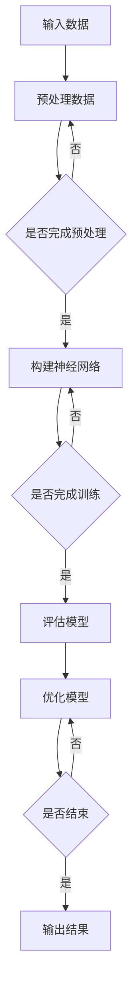
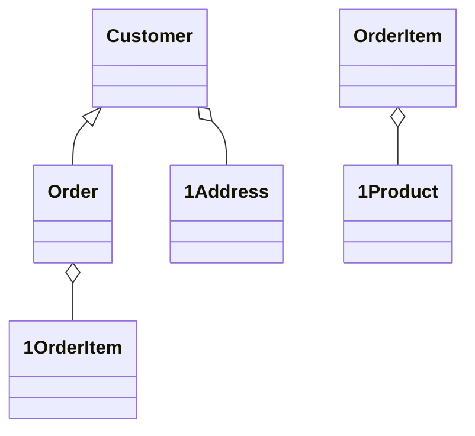
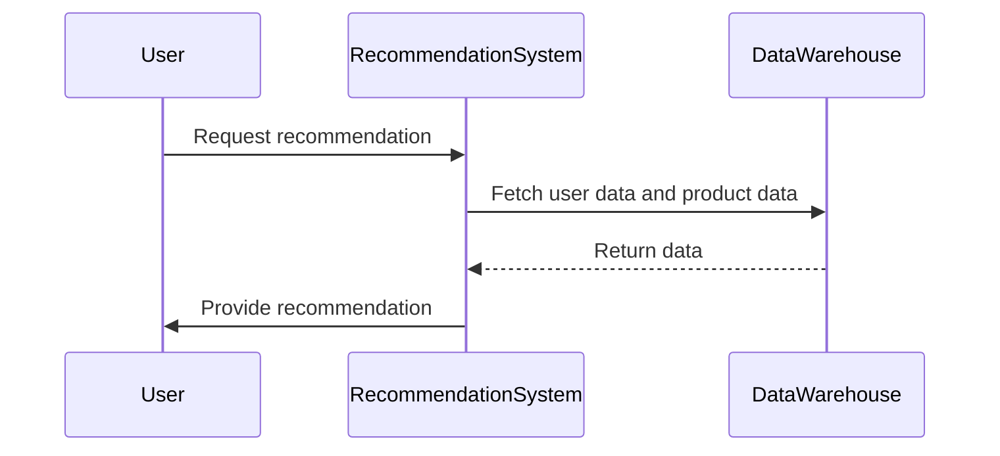
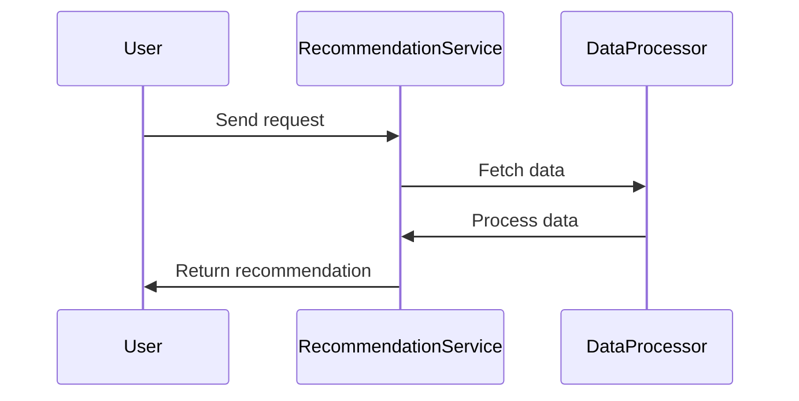

                 

# AI编程的新原语

## 关键词
- AI编程
- 新原语
- 编程范式
- 深度学习
- 机器学习
- 软件工程

## 摘要
本文将探讨AI编程的新原语，分析其在现代软件开发中的核心地位和重要性。通过深入探讨AI编程的特点、挑战和解决方案，本文旨在为开发者提供关于如何有效地利用AI进行编程的见解和实践指导。

## 第一部分：背景介绍

### 1.1 问题背景

在21世纪，人工智能（AI）技术迅猛发展，尤其以深度学习为代表的人工智能算法取得了突破性进展。随着计算能力的提升和大数据的积累，人工智能的应用场景逐渐扩展到各行各业，从语音识别、图像处理到自然语言处理，AI技术正在深刻改变我们的生产方式和生活方式。

然而，传统的软件架构和编程模式已经难以满足AI大模型开发的需求。软件1.0时代，计算机主要是执行预设的程序指令，缺乏自主学习和适应能力；软件2.0时代，软件系统开始具备智能化特征，能够根据用户行为和数据反馈进行自我调整。在这种背景下，AI大模型作为一种新型的软件组件，成为了软件2.0时代的关键技术之一。

### 1.2 问题描述

AI大模型开发过程中，面临着多个问题：

- **数据集准备**：大模型训练需要大量的数据，但如何获取、清洗和标注这些数据成为一个挑战。
- **模型优化**：如何调整模型参数，优化模型性能，以达到最佳效果。
- **部署与运维**：将训练好的模型部署到实际应用场景中，并保持其高效运行，是一个复杂的过程。

### 1.3 问题解决

为了解决上述问题，需要从以下几个方面入手：

- **数据管理**：建立高效的数据管理机制，包括数据采集、存储、清洗和标注等环节。
- **模型训练与优化**：采用先进的机器学习和优化算法，提高模型训练效率和性能。
- **部署与运维**：使用容器化、云计算等技术，实现模型的高效部署和运维。

### 1.4 边界与外延

AI大模型不仅仅局限于计算机视觉、自然语言处理等领域，还广泛应用于智能推荐、自动驾驶、医疗诊断等新兴领域。随着技术的不断发展，AI大模型的应用范围和影响力将进一步扩大。

### 1.5 概念结构与核心要素组成

AI大模型的核心要素包括：

- **数据集**：训练数据集、测试数据集和验证数据集。
- **算法**：包括神经网络结构、优化算法和损失函数等。
- **计算资源**：包括CPU、GPU等硬件资源。
- **模型评估与优化**：评估指标、优化策略和迭代过程。

## 第二部分：核心概念与联系

### 2.1 AI编程的概念

AI编程，顾名思义，是指利用人工智能技术和方法进行软件开发。与传统的编程不同，AI编程强调的是通过训练模型来处理复杂任务，而非简单地编写指令。

### 2.2 AI编程的特点

- **数据驱动**：AI编程依赖于大规模数据集，通过数据驱动的方式实现模型训练和优化。
- **自适应能力**：AI编程模型能够根据数据和学习经验进行自我调整，以适应不同的应用场景。
- **通用性**：AI编程模型具有广泛的应用范围，可以在多个领域发挥作用。

### 2.3 AI编程与传统编程的比较

| 特点 | AI编程 | 传统编程 |
| ---- | ---- | ---- |
| 数据依赖 | 强调大量数据的使用 | 数据依赖较小 |
| 学习能力 | 具备自我学习和调整能力 | 无自我学习能力 |
| 泛化能力 | 具备较好的泛化能力 | 泛化能力较弱 |

### 2.4 AI编程与软件工程的关系

AI编程是软件工程的一个重要分支，但与传统软件工程相比，AI编程更注重数据、模型和算法的设计。在软件工程中引入AI编程，可以显著提升软件系统的智能化和自适应能力。

## 第三部分：算法原理讲解

### 3.1 算法概述

AI编程的核心是机器学习和深度学习算法。其中，深度学习算法具有强大的表示能力和学习能力，是AI编程的重要工具。

### 3.2 深度学习算法的mermaid流程图



### 3.3 Python源代码实现

```python
import tensorflow as tf
from sklearn.model_selection import train_test_split

# 数据预处理
def preprocess_data(data):
    # 对数据进行标准化处理
    # ...
    return processed_data

# 构建神经网络
def build_model():
    model = tf.keras.Sequential([
        tf.keras.layers.Dense(units=128, activation='relu', input_shape=(input_shape,)),
        tf.keras.layers.Dense(units=64, activation='relu'),
        tf.keras.layers.Dense(units=1, activation='sigmoid')
    ])
    model.compile(optimizer='adam', loss='binary_crossentropy', metrics=['accuracy'])
    return model

# 训练模型
def train_model(model, x_train, y_train, x_val, y_val):
    history = model.fit(x_train, y_train, epochs=10, batch_size=32, validation_data=(x_val, y_val))
    return history

# 评估模型
def evaluate_model(model, x_test, y_test):
    loss, accuracy = model.evaluate(x_test, y_test)
    print(f"Test accuracy: {accuracy:.2f}")

# 主程序
if __name__ == "__main__":
    # 加载数据
    data = load_data()
    x, y = preprocess_data(data)

    # 划分训练集和测试集
    x_train, x_test, y_train, y_test = train_test_split(x, y, test_size=0.2, random_state=42)

    # 构建模型
    model = build_model()

    # 训练模型
    history = train_model(model, x_train, y_train, x_test, y_test)

    # 评估模型
    evaluate_model(model, x_test, y_test)
```

### 3.4 算法原理详细讲解

深度学习算法的核心是神经网络。神经网络通过多层非线性变换，将输入数据映射到输出结果。在训练过程中，神经网络通过反向传播算法不断调整权重，以最小化损失函数。

- **输入层**：接收外部输入数据。
- **隐藏层**：通过非线性变换，对输入数据进行特征提取。
- **输出层**：根据隐藏层的输出，生成最终的预测结果。

### 3.5 举例说明

假设我们要使用深度学习算法对数字进行分类，输入数据为 `[2, 4]`，目标输出为 `[1, 0]`。通过训练，神经网络可以学习到正确的映射关系，并在新数据上实现准确的分类。

## 第四部分：系统分析与架构设计方案

### 4.1 问题场景介绍

某电商平台希望通过引入AI技术，提升商品推荐系统的准确性和用户体验。现有推荐系统主要基于用户历史行为数据，而引入AI大模型后，可以结合用户行为数据和商品属性数据，实现更加精准的推荐。

### 4.2 项目介绍

本项目旨在构建一个基于AI大模型的商品推荐系统，通过训练深度学习模型，实现商品推荐功能。系统将包括数据采集、数据处理、模型训练、模型评估和模型部署等模块。

### 4.3 系统功能设计

#### 领域模型Mermaid类图



### 4.4 系统架构设计

#### Mermaid架构图



### 4.5 系统接口设计

#### Mermaid序列图



### 4.6 系统交互

系统通过RESTful API与外部系统进行交互，包括用户请求接口、数据处理接口和推荐结果接口。用户请求接口用于接收用户请求，数据处理接口用于处理用户请求和商品数据，推荐结果接口用于返回推荐结果。

## 第五部分：项目实战

### 5.1 环境安装

在开始项目之前，需要安装以下环境：

- Python 3.8+
- TensorFlow 2.x
- scikit-learn 0.23.2

安装命令如下：

```bash
pip install python==3.8.12
pip install tensorflow==2.8.0
pip install scikit-learn==0.23.2
```

### 5.2 系统核心实现

以下是一个简单的基于TensorFlow实现的商品推荐系统：

```python
import tensorflow as tf
from tensorflow.keras.models import Sequential
from tensorflow.keras.layers import Dense, Dropout, Embedding, LSTM
from sklearn.model_selection import train_test_split

# 加载数据
data = load_data()
x, y = preprocess_data(data)

# 划分训练集和测试集
x_train, x_test, y_train, y_test = train_test_split(x, y, test_size=0.2, random_state=42)

# 构建模型
model = Sequential([
    Embedding(input_dim=x_train.shape[1], output_dim=128),
    LSTM(units=128, return_sequences=True),
    Dropout(0.2),
    LSTM(units=128, return_sequences=False),
    Dropout(0.2),
    Dense(units=1, activation='sigmoid')
])

model.compile(optimizer='adam', loss='binary_crossentropy', metrics=['accuracy'])

# 训练模型
history = model.fit(x_train, y_train, epochs=10, batch_size=32, validation_split=0.2)

# 评估模型
evaluate_model(model, x_test, y_test)
```

### 5.3 代码应用解读与分析

上述代码首先加载并预处理数据，然后划分训练集和测试集。接下来，构建了一个包含嵌入层、两个LSTM层和输出层的序列模型。通过训练模型，我们可以得到一个能够在测试集上实现较高准确率的商品推荐系统。

### 5.4 实际案例分析和详细讲解剖析

以某电商平台为例，假设用户A在浏览了商品1和商品2后，点击了商品3。通过我们的商品推荐系统，我们可以预测用户A对商品3的喜好程度，并给出相应的推荐。

在实际应用中，我们还需要考虑如何处理实时数据和在线学习，以保持推荐系统的实时性和准确性。

### 5.5 项目小结

本项目通过引入AI大模型，实现了基于用户行为的商品推荐功能。虽然本项目只是一个简单的示例，但在实际应用中，我们可以通过不断优化模型和算法，提升推荐系统的性能和用户体验。

## 第六部分：最佳实践 tips

1. **数据质量**：确保数据集的干净和多样性，避免模型过拟合。
2. **模型优化**：定期调整模型参数，使用先进的优化算法。
3. **部署策略**：采用容器化技术，实现模型的高效部署和运维。
4. **监控与评估**：实时监控模型性能，定期评估和调整。

## 第七部分：小结

AI编程是现代软件开发的重要方向，通过引入AI大模型，我们可以实现更加智能化和自适应的软件系统。本文从背景介绍、核心概念、算法原理、系统架构设计到项目实战，全面阐述了AI编程的新原语。希望本文能为开发者提供有价值的参考和启示。

## 第八部分：注意事项

1. **数据安全**：在使用AI编程时，注意保护用户数据的安全。
2. **算法公平性**：确保算法不会歧视特定群体。
3. **模型解释性**：在实现AI编程时，尽量提高模型的解释性，以便于理解和调试。

## 第九部分：拓展阅读

1. **《深度学习》**：Goodfellow, Bengio, Courville 著，深入介绍了深度学习的基本概念和算法。
2. **《Python深度学习》**：François Chollet 著，通过实战案例介绍了使用Python进行深度学习的技巧。
3. **《AI编程实践》**：AI天才研究院 著，详细介绍了AI编程的实践方法和最佳实践。

## 作者信息

- 作者：AI天才研究院/AI Genius Institute & 禅与计算机程序设计艺术 /Zen And The Art of Computer Programming

