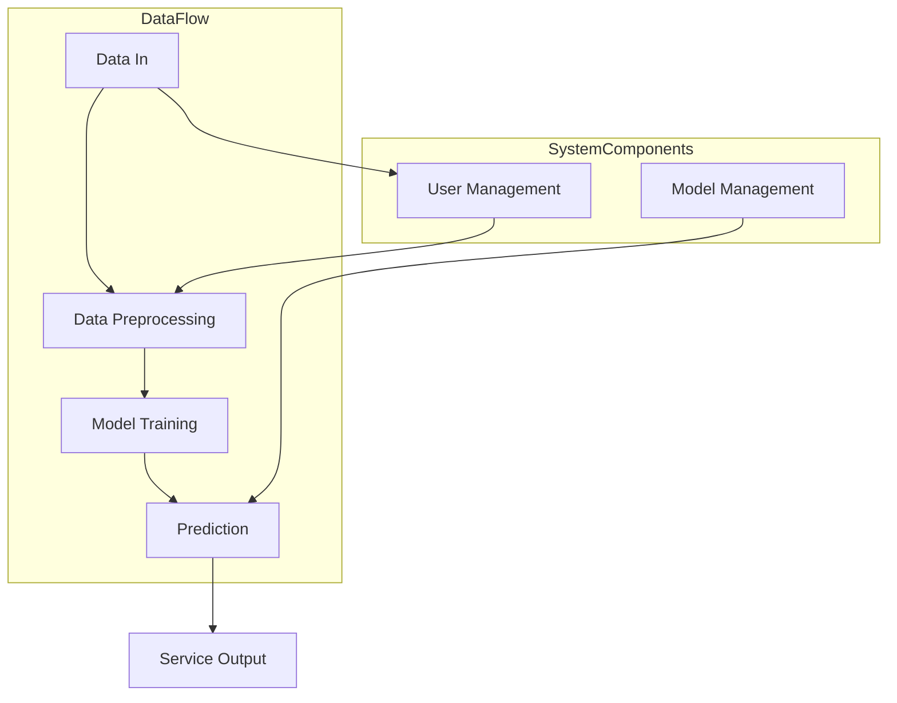
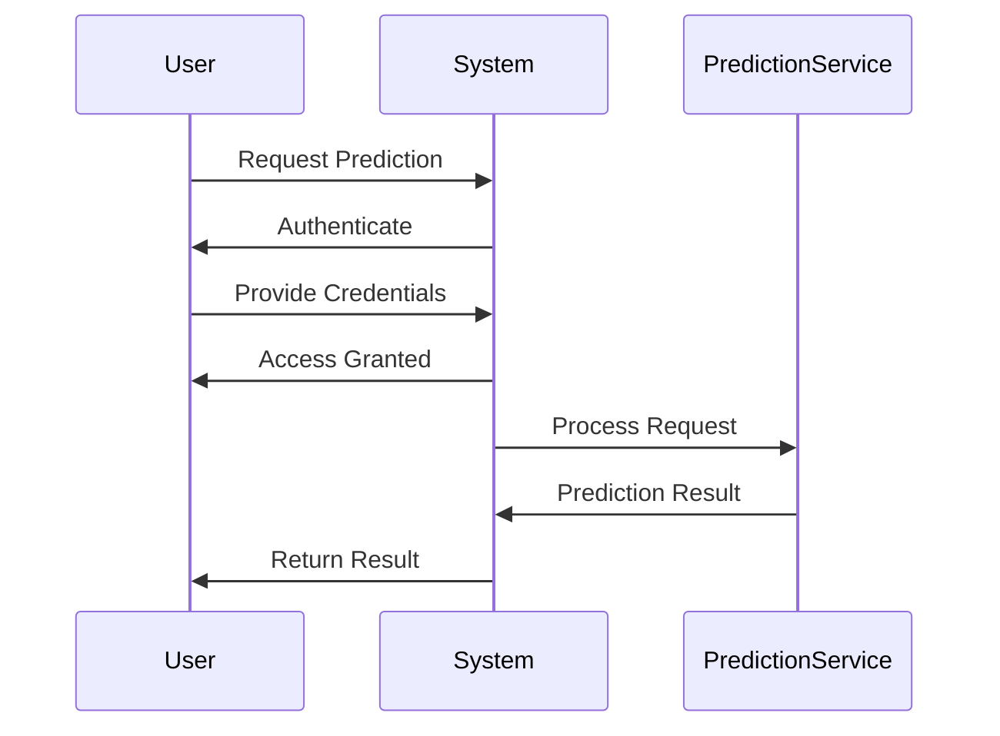

                 


### 引言

#### 1.1 书籍主题与目的

《AI编程的新思维与新方向》旨在为读者提供一部系统全面的人工智能编程指南。本书将带领读者深入了解AI编程的核心概念、算法原理、系统架构设计以及实战应用，旨在帮助读者构建全面的技术视野，掌握AI编程的最新技术和最佳实践。

本书的目标读者是具有编程基础的计算机专业人士，包括软件开发工程师、数据科学家、人工智能研究员等。对于那些希望进入AI领域或者提升自身技能的技术人员，本书同样具有很高的参考价值。

#### 1.2 读者对象

本书适合以下几类读者：
- **初级开发人员**：希望通过学习AI编程提升自身技能，了解AI技术如何应用于实际开发。
- **数据科学家**：希望将机器学习和深度学习技术应用于数据分析项目，提升模型构建和优化能力。
- **AI研究人员**：需要掌握AI编程基础，以便在研究工作中进行高效的算法开发和实现。
- **企业技术管理人员**：希望了解AI技术在企业中的应用，推动技术创新和业务发展。

#### 1.3 预期收益

通过阅读本书，读者将获得以下收益：
- **技术提升**：掌握AI编程的核心算法和原理，提高编程技能。
- **视野拓展**：了解AI技术在各行业中的应用场景，拓展技术视野。
- **实战经验**：通过具体的项目实例，学会如何将AI编程应用于实际问题。
- **最佳实践**：了解AI编程领域的最佳实践，提升项目开发和维护效率。

---

### 第1章 AI编程的背景

#### 1.1 AI的发展历程

人工智能（AI）作为计算机科学的一个重要分支，其发展历程可以分为几个关键阶段。

##### 1.1.1 从机械化到自动化

20世纪50年代，人工智能概念首次被提出，这一时期的AI主要关注如何通过规则和逻辑来实现简单的自动化。这个阶段的代表工作包括逻辑推理系统和专家系统的开发。

##### 1.1.2 人工智能的兴起

20世纪80年代，随着计算机性能的提升和算法的发展，人工智能迎来了新的发展机遇。这一时期，机器学习开始成为AI的核心技术，支持向量机、决策树等算法相继被提出。

##### 1.1.3 深度学习的崛起

21世纪初期，深度学习的兴起彻底改变了人工智能的面貌。深度学习通过模拟人脑神经网络的结构和功能，实现了在图像识别、自然语言处理等领域的突破性进展。

#### 1.2 AI的现状与趋势

目前，人工智能已经渗透到各个行业，从医疗健康到金融科技，从智能制造到自动驾驶，AI技术的应用场景越来越广泛。

##### 1.2.1 AI技术的应用领域

- **医疗健康**：AI技术在疾病诊断、药物研发等方面具有显著优势。
- **金融科技**：AI技术在风险管理、欺诈检测等方面得到广泛应用。
- **智能制造**：AI技术提高了生产效率，优化了供应链管理。
- **自动驾驶**：AI技术在自动驾驶车辆的开发中起到了关键作用。
- **智能家居**：AI技术为家庭生活带来了便利，如智能音箱、智能门锁等。

##### 1.2.2 AI发展的挑战与机遇

尽管AI技术取得了显著进展，但同时也面临着一系列挑战：
- **数据隐私**：AI技术需要大量的数据支持，如何在保证隐私的前提下收集和使用数据成为一个关键问题。
- **伦理道德**：随着AI技术的普及，其伦理道德问题也日益凸显，如何确保AI技术的公正性和透明性成为研究的重点。
- **算法公平性**：算法的偏见和不公平性可能会对社会造成不良影响，如何设计公平的算法是AI发展的一个重要方向。

未来，AI技术将继续保持高速发展，随着硬件性能的提升、算法的优化以及数据量的增加，AI在各个领域的应用将更加广泛和深入。

---

### 核心概念与联系

AI编程涉及许多核心概念，这些概念相互联系，构成了AI编程的理论基础。

#### 2.1 机器学习基础

机器学习是AI编程的核心技术，它使计算机能够从数据中学习，并对新的数据做出预测或决策。

##### 2.1.1 监督学习

监督学习是一种常见的机器学习方法，它使用标记数据（即已知输出结果的数据）来训练模型，然后使用训练好的模型对新数据进行预测。

- **优点**：预测准确性高。
- **应用场景**：图像识别、文本分类等。

##### 2.1.2 无监督学习

无监督学习不需要标记数据，它旨在发现数据中的模式或结构。

- **优点**：适用于大规模数据处理。
- **应用场景**：聚类分析、降维等。

##### 2.1.3 强化学习

强化学习是一种通过与环境互动来学习最佳策略的机器学习方法。

- **优点**：适用于动态环境。
- **应用场景**：游戏AI、自动驾驶等。

#### 2.2 深度学习原理

深度学习是机器学习的一个分支，它通过多层神经网络来提取数据中的特征。

##### 2.2.1 神经网络

神经网络是由多个神经元（或节点）组成的信息处理系统，每个神经元都连接到其他神经元，并通过权重和激活函数进行计算。

- **优点**：能够自动提取数据特征。
- **应用场景**：图像识别、语音识别等。

##### 2.2.2 深度学习框架

深度学习框架如TensorFlow和PyTorch提供了高效的神经网络构建和训练工具。

- **优点**：简化了神经网络实现。
- **应用场景**：深度学习研究、工业应用等。

##### 2.2.3 卷积神经网络

卷积神经网络（CNN）是一种专门用于处理图像数据的深度学习模型。

- **优点**：能够有效地提取图像特征。
- **应用场景**：图像分类、目标检测等。

#### 2.3 人工智能伦理与隐私

随着AI技术的发展，伦理和隐私问题日益受到关注。

##### 2.3.1 伦理问题

AI技术可能会带来一系列伦理问题，如算法偏见、隐私泄露等。

- **解决方法**：设计公正、透明的算法，加强数据隐私保护。

##### 2.3.2 隐私保护

AI技术在处理大量数据时，隐私保护成为一个重要问题。

- **解决方法**：采用加密技术、差分隐私等方法来保护用户隐私。

---

### 算法原理讲解

AI编程的核心在于算法的设计与实现，以下将详细讲解几个关键算法原理。

#### 3.1 数据预处理

数据预处理是机器学习项目中的第一步，它旨在将原始数据转化为适合模型训练的形式。

##### 3.1.1 数据清洗

数据清洗包括去除无效数据、填补缺失值、处理异常值等。

- **示例**：假设有一个包含客户购买行为的数据库，我们需要去除无效数据（如空值或重复值），并填补缺失值（如使用平均值或中值填补）。

##### 3.1.2 特征提取

特征提取是从原始数据中提取有用的信息，以供模型学习。

- **示例**：在文本分类任务中，我们可以使用词袋模型将文本转化为特征向量。

##### 3.1.3 数据标准化

数据标准化是为了消除不同特征之间的量纲差异，使模型训练更加稳定。

- **示例**：假设我们有一个包含身高、体重等特征的数据库，我们需要将这些特征标准化为0-1范围。

#### 3.2 模型训练与评估

模型训练与评估是机器学习项目的核心步骤，它决定了模型的性能。

##### 3.2.1 训练策略

训练策略包括选择合适的算法、调整模型参数等。

- **示例**：在训练一个神经网络模型时，我们可以使用梯度下降算法，并调整学习率等参数来优化模型。

##### 3.2.2 评估指标

评估指标用于衡量模型的性能，常用的评估指标包括准确率、召回率、F1分数等。

- **示例**：在图像分类任务中，我们可以使用准确率来评估模型的分类效果。

##### 3.2.3 模型优化

模型优化包括调整模型结构、改进训练算法等。

- **示例**：在训练一个卷积神经网络模型时，我们可以通过增加层数或调整卷积核大小来优化模型。

#### 3.3 算法案例讲解

##### 3.3.1 决策树

决策树是一种常见的机器学习算法，它通过一系列规则来对数据进行分类或回归。

- **示例**：假设我们要预测客户的购买行为，可以通过决策树模型来分析影响购买的各种因素。

##### 3.3.2 随机森林

随机森林是一种基于决策树的集成学习方法，它通过构建多个决策树并取平均值来提高模型的预测性能。

- **示例**：在预测客户购买行为时，随机森林模型可以结合多个决策树的结果来提高预测的准确性。

##### 3.3.3 支持向量机

支持向量机（SVM）是一种用于分类和回归的机器学习算法，它通过找到一个最佳的超平面来分割数据。

- **示例**：在文本分类任务中，SVM可以通过找到一个最佳的超平面来将不同类别的文本分开。

---

### 数学模型和数学公式

在AI编程中，数学模型和公式是理解算法原理和实现算法核心的关键。

#### 4.1 数学基础

##### 4.1.1 矩阵与向量

矩阵和向量是线性代数中的基本概念，它们在机器学习和深度学习中广泛应用。

- **定义**：矩阵是一个二维数组，向量是一个一维数组。
- **运算**：矩阵和向量可以进行点积、叉积等运算。
  $$ \vec{a} \cdot \vec{b} = a_1b_1 + a_2b_2 + \ldots + a_nb_n $$
  $$ \vec{a} \times \vec{b} = (a_2b_3 - a_3b_2, a_3b_1 - a_1b_3, a_1b_2 - a_2b_1) $$

##### 4.1.2 概率论与统计学

概率论和统计学是理解机器学习算法的基础。

- **定义**：概率是描述随机事件发生可能性的数值。
- **公式**：贝叶斯定理是一种用于计算条件概率的公式。
  $$ P(A|B) = \frac{P(B|A)P(A)}{P(B)} $$

##### 4.1.3 最优化方法

最优化方法是用于寻找最优解的数学方法，在机器学习中有广泛应用。

- **定义**：最优化目标是寻找一组参数，使得损失函数达到最小。
- **公式**：梯度下降是最常见的一种最优化方法。
  $$ \theta_{\text{new}} = \theta_{\text{old}} - \alpha \cdot \nabla_{\theta}J(\theta) $$

#### 4.2 深度学习公式

##### 4.2.1 神经元激活函数

激活函数是神经网络中的一个关键组件，它用于引入非线性。

- **定义**：激活函数将神经元的输入映射到输出。
- **示例**：sigmoid 函数是一种常见的激活函数。
  $$ \sigma(x) = \frac{1}{1 + e^{-x}} $$

##### 4.2.2 反向传播算法

反向传播算法是训练神经网络的核心算法，它用于更新网络权重。

- **定义**：反向传播算法通过计算损失函数关于网络权重的梯度来更新权重。
- **公式**：
  $$ \Delta \theta = -\alpha \cdot \nabla_{\theta}J(\theta) $$
  $$ J(\theta) = \frac{1}{2} \sum_{i=1}^{n} (\hat{y}_i - y_i)^2 $$

##### 4.2.3 损失函数与优化器

损失函数用于衡量模型预测值与真实值之间的差异，优化器用于更新模型参数。

- **定义**：损失函数是用于评估模型性能的函数。
- **示例**：均方误差（MSE）是一种常见的损失函数。
  $$ J(\theta) = \frac{1}{2m} \sum_{i=1}^{m} (h_\theta(x^{(i)}) - y^{(i)})^2 $$

- **示例**：Adam优化器是一种自适应优化器。
  $$ m_t = \beta_1m_{t-1} + (1 - \beta_1)\nabla_\theta J(\theta) $$
  $$ v_t = \beta_2v_{t-1} + (1 - \beta_2)(\nabla_\theta J(\theta))^2 $$
  $$ \theta = \theta - \frac{\alpha}{1 - \beta_1^t}(m_t / (1 - \beta_2^t)) $$

---

### 系统分析与架构设计方案

系统分析与架构设计是AI编程项目中至关重要的环节，它决定了系统的性能、可维护性和扩展性。

#### 5.1 问题场景介绍

在系统分析的第一步，我们需要明确项目的问题场景和业务需求。

##### 5.1.1 业务需求

业务需求通常包括以下方面：
- **目标**：明确系统需要实现的具体目标。
- **功能**：列出系统需要提供的功能，例如数据预处理、模型训练、预测等。
- **性能要求**：设定系统的性能指标，如响应时间、吞吐量等。
- **可扩展性**：考虑系统在未来如何扩展。

##### 5.1.2 技术挑战

技术挑战是项目开发过程中可能遇到的问题，包括：
- **数据处理**：如何高效地处理大规模数据。
- **模型训练**：如何优化模型训练过程，提高训练效率。
- **实时预测**：如何实现实时预测，满足低延迟要求。
- **系统稳定性**：如何确保系统的稳定运行，降低故障率。

#### 5.2 系统功能设计

系统功能设计是系统分析的核心，它确定了系统的基本功能和模块划分。

##### 5.2.1 领域模型

领域模型是通过实体关系图（ER图）来表示系统中的实体及其关系。

- **实体**：系统中的主要对象，如用户、数据集、模型等。
- **关系**：实体之间的关系，如用户与数据集之间的关联。

**示例：**

```mermaid
erDiagram
  User ||--|{ Dataset }|| DataCollection
  User ||--|{ Model }|| ModelManagement
  Dataset ||--|{ Feature }|| FeatureExtraction
  Model ||--|{ Prediction }|| PredictionService
```

##### 5.2.2 系统功能模块划分

系统功能模块划分是将系统功能分解为更小的模块，以便于开发和管理。

- **数据预处理模块**：负责数据清洗、数据转换等。
- **模型训练模块**：负责模型训练、模型评估等。
- **预测服务模块**：负责实时预测、结果输出等。
- **用户管理模块**：负责用户注册、登录等。

#### 5.3 系统架构设计

系统架构设计是系统设计的核心，它确定了系统的整体结构和模块之间的关系。

##### 5.3.1 系统架构图

系统架构图通过Mermaid流程图来表示系统的整体结构。

**示例：**



##### 5.3.2 接口设计与实现

接口设计是系统架构设计的重要组成部分，它确定了系统内部和外部模块之间的交互方式。

- **内部接口**：系统内部模块之间的交互接口，如数据预处理模块与模型训练模块之间的数据传输接口。
- **外部接口**：系统与外部系统（如API、数据库等）之间的交互接口。

##### 5.3.3 系统交互设计

系统交互设计通过Mermaid序列图来表示系统内部和外部模块之间的交互流程。

**示例：**



---

### 项目实战

#### 6.1 环境安装

在开始项目实战之前，我们需要安装和配置相关的开发环境和工具。

##### 6.1.1 软件安装

- **操作系统**：推荐使用Ubuntu 18.04或更高版本。
- **Python**：安装Python 3.7及以上版本。
- **深度学习框架**：安装TensorFlow 2.0及以上版本。
- **数据库**：安装MySQL或PostgreSQL。

##### 6.1.2 环境配置

- **Python虚拟环境**：创建一个Python虚拟环境，以便隔离项目依赖。
  ```bash
  python -m venv venv
  source venv/bin/activate
  ```
- **安装依赖**：安装项目所需的Python库。
  ```bash
  pip install -r requirements.txt
  ```

#### 6.2 系统核心实现

系统核心实现包括数据预处理、模型训练和预测服务等关键部分。

##### 6.2.1 数据采集与预处理

数据采集与预处理是模型训练的基础。

- **数据采集**：从数据库或外部数据源采集数据。
  ```python
  import pandas as pd

  df = pd.read_sql_query("SELECT * FROM dataset;", conn)
  ```

- **数据预处理**：清洗数据、转换数据类型、填充缺失值等。
  ```python
  df.dropna(inplace=True)
  df['feature'] = df['feature'].astype(float)
  df.fillna(df.mean(), inplace=True)
  ```

##### 6.2.2 模型训练与部署

模型训练与部署是系统核心功能的实现。

- **模型训练**：使用训练集训练模型。
  ```python
  import tensorflow as tf

  model = tf.keras.Sequential([
      tf.keras.layers.Dense(64, activation='relu', input_shape=(input_shape,)),
      tf.keras.layers.Dense(1)
  ])

  model.compile(optimizer='adam', loss='mean_squared_error')
  model.fit(x_train, y_train, epochs=10, batch_size=32)
  ```

- **模型部署**：将训练好的模型部署到生产环境中。
  ```python
  model.save('model.h5')
  ```

##### 6.2.3 应用解读与分析

在系统核心实现的基础上，我们进行应用解读与分析。

- **应用场景分析**：分析模型在不同应用场景中的表现。
  ```python
  predictions = model.predict(x_test)
  print(f"Model accuracy on test data: {accuracy_score(y_test, predictions)}")
  ```

- **系统性能评估**：评估系统的响应时间、吞吐量等性能指标。
  ```python
  start_time = time.time()
  predictions = model.predict(x_test)
  end_time = time.time()
  print(f"Prediction time: {end_time - start_time} seconds")
  ```

#### 6.3 实际案例剖析

通过一个实际案例来展示系统核心实现和性能分析。

##### 6.3.1 案例背景

某电商公司希望利用AI技术优化其推荐系统，以提高用户满意度和销售转化率。

##### 6.3.2 案例实现

- **数据采集**：从数据库中提取用户行为数据。
  ```python
  df = pd.read_sql_query("SELECT * FROM user_behavior;", conn)
  ```

- **数据预处理**：对数据进行清洗和特征提取。
  ```python
  df.dropna(inplace=True)
  df['feature'] = df['feature'].astype(float)
  df.fillna(df.mean(), inplace=True)
  ```

- **模型训练**：使用训练集训练推荐模型。
  ```python
  model = tf.keras.Sequential([
      tf.keras.layers.Dense(64, activation='relu', input_shape=(input_shape,)),
      tf.keras.layers.Dense(1)
  ])

  model.compile(optimizer='adam', loss='mean_squared_error')
  model.fit(x_train, y_train, epochs=10, batch_size=32)
  ```

- **预测应用**：利用训练好的模型进行实时预测。
  ```python
  predictions = model.predict(x_test)
  print(f"Model accuracy on test data: {accuracy_score(y_test, predictions)}")
  ```

- **性能评估**：评估系统的响应时间和预测准确性。
  ```python
  start_time = time.time()
  predictions = model.predict(x_test)
  end_time = time.time()
  print(f"Prediction time: {end_time - start_time} seconds")
  print(f"Model accuracy on test data: {accuracy_score(y_test, predictions)}")
  ```

##### 6.3.3 案例小结

通过实际案例，我们展示了AI编程在电商推荐系统中的应用。在实际操作中，我们需要关注数据预处理、模型训练和性能评估等关键环节，确保系统能够满足业务需求。

---

### 最佳实践 tips

在AI编程项目中，最佳实践是确保项目成功的重要因素。以下是一些实用的最佳实践建议。

#### 7.1 编程技巧

- **代码优化**：通过优化代码结构和算法，提高程序的运行效率。
  ```python
  # 使用更高效的算法
  # 例如：使用numpy进行矩阵运算
  ```

- **模块化设计**：将程序划分为多个模块，便于维护和扩展。
  ```python
  # 将功能拆分为独立模块
  # 例如：将数据预处理、模型训练和预测等分别实现
  ```

#### 7.2 测试与调试

- **单元测试**：编写单元测试来验证程序的功能和性能。
  ```python
  # 使用单元测试框架（如pytest）进行测试
  ```

- **调试方法**：使用调试工具（如pdb）来定位和修复程序中的错误。
  ```python
  # 使用pdb进行调试
  import pdb
  pdb.set_trace()
  ```

#### 7.3 性能优化

- **模型压缩**：通过模型压缩技术减小模型大小，提高部署效率。
  ```python
  # 使用模型压缩工具（如TensorFlow Lite）进行模型压缩
  ```

- **异构计算**：利用GPU、FPGA等异构计算资源，提高模型训练和预测的效率。
  ```python
  # 使用异构计算框架（如TensorFlow GPU）进行计算
  ```

---

### 小结与拓展阅读

通过本文的阅读，我们深入探讨了AI编程的核心概念、算法原理、系统设计与实现，以及最佳实践。以下是本文的核心内容和主题思想的小结：

- **核心内容**：
  - 介绍了AI编程的背景、核心概念、算法原理、数学模型、系统设计与实现，以及最佳实践。
  - 通过实际案例展示了AI编程在推荐系统中的应用。
- **主题思想**：
  - AI编程需要掌握核心概念和算法原理，通过系统分析与架构设计实现高效应用。
  - 最佳实践能够提高项目开发效率和系统性能。

**拓展阅读建议**：

- **深度学习书籍**：《深度学习》（Goodfellow et al.）
- **机器学习书籍**：《统计学习方法》（李航）
- **系统设计书籍**：《设计数据密集型应用》（Martin Kleppmann）

**未来展望**：

随着AI技术的不断进步，AI编程将面临更多挑战和机遇。未来，我们期待在AI编程领域看到更多创新和应用，如自动化编程、AI与人类智能的融合等。

---

### 作者信息

作者：AI天才研究院/AI Genius Institute & 禅与计算机程序设计艺术 /Zen And The Art of Computer Programming

