                 

# AI编程的新思维与新方向

## 关键词

- 人工智能（AI）
- 编程思维
- 自动编程
- 模型驱动编程
- 跨领域应用
- 开发效率

> 摘要：本文将探讨AI编程面临的新挑战和机会，介绍模型驱动编程和自动编程两种新的编程思维，并详细分析其原理、应用、实现方法以及面临的挑战和解决方案。通过本文的阅读，读者将了解AI编程的新趋势，为未来在AI编程领域的发展提供新的视角和思路。

## 第一部分：背景介绍与核心概念

### 第1章：问题背景与核心概念

#### 1.1 问题背景

在当今技术飞速发展的时代，人工智能（AI）已经成为推动社会进步的重要力量。随着深度学习、大数据、云计算等技术的不断发展，AI的应用范围越来越广泛。AI编程作为AI技术的重要组成部分，越来越受到关注。然而，传统的AI编程思维和方法已经难以满足新时代的需求，需要新的思维和方向。

#### 1.2 问题描述

在AI编程领域，存在以下问题：

1. 编程思维局限：传统的AI编程思维主要依赖于数据驱动和模型驱动，难以应对复杂问题和不确定性。
2. 应用领域局限：传统的AI编程方法在特定领域表现出色，但在跨领域应用时存在困难。
3. 开发效率问题：传统的AI编程流程复杂，开发效率低。

#### 1.3 问题解决

为了解决上述问题，需要从以下几个方面进行改进：

1. 创新编程思维：引入新的编程思维，如基于模型驱动的自动编程、基于AI的代码生成等。
2. 扩展应用领域：通过跨领域知识融合，实现AI编程在更多领域的应用。
3. 提高开发效率：通过自动化工具和平台，简化AI编程流程，提高开发效率。

#### 1.4 边界与外延

1. 边界：本书主要关注AI编程的新思维和新方向，不涉及具体的算法实现和编程语言。
2. 外延：本书的内容可以应用于各个AI应用领域，如自然语言处理、计算机视觉、推荐系统等。

#### 1.5 概念结构与核心要素组成

- 核心概念：AI编程、编程思维、应用领域、开发效率
- 要素组成：
  - 编程思维：包括模型驱动编程、自动编程、跨领域编程等
  - 应用领域：自然语言处理、计算机视觉、推荐系统等
  - 开发效率：自动化工具、平台、流程优化等

### 第2章：核心概念与联系

#### 2.1 核心概念原理

##### 2.1.1 AI编程

AI编程是指利用人工智能技术进行软件开发和应用程序开发的过程。

##### 2.1.2 编程思维

编程思维是指解决编程问题的思路和方法。

##### 2.1.3 应用领域

应用领域是指AI编程可以应用的行业和领域。

##### 2.1.4 开发效率

开发效率是指软件开发过程中所花费的时间和资源。

#### 2.2 概念属性特征对比表格

| 概念        | 特征1   | 特征2   | 特征3   |
| ----------- | ------ | ------ | ------ |
| AI编程      | 自动化  | 智能化  | 多样性  |
| 编程思维    | 创新性  | 灵活性  | 适应性  |
| 应用领域    | 跨领域  | 专业性  | 广泛性  |
| 开发效率    | 快速性  | 高效性  | 资源优化 |

#### 2.3 ER实体关系图架构

```mermaid
erDiagram
    AI编程 ||--|{ 编程思维 }
    AI编程 ||--|{ 应用领域 }
    AI编程 ||--|{ 开发效率 }
```

## 第二部分：AI编程新思维

### 第3章：模型驱动编程

#### 3.1 模型驱动编程概述

##### 3.1.1 模型驱动编程的定义

模型驱动编程是一种基于模型来指导编程的开发方法，它通过将编程任务转化为模型训练问题来提高开发效率和代码质量。

##### 3.1.2 模型驱动编程的优势

- **提高开发效率**：通过自动生成代码，可以大幅度减少手动编码的工作量。
- **提高代码质量**：模型驱动的编程方法可以自动优化代码结构，提高代码的可读性和可维护性。
- **易于维护和扩展**：基于模型的编程方法使得代码更容易理解和修改，从而提高系统的可扩展性。

#### 3.2 模型驱动编程的应用

##### 3.2.1 代码生成

模型驱动编程可以通过训练模型来自动生成代码。例如，在自然语言处理领域，可以使用序列到序列（Seq2Seq）模型来生成代码。

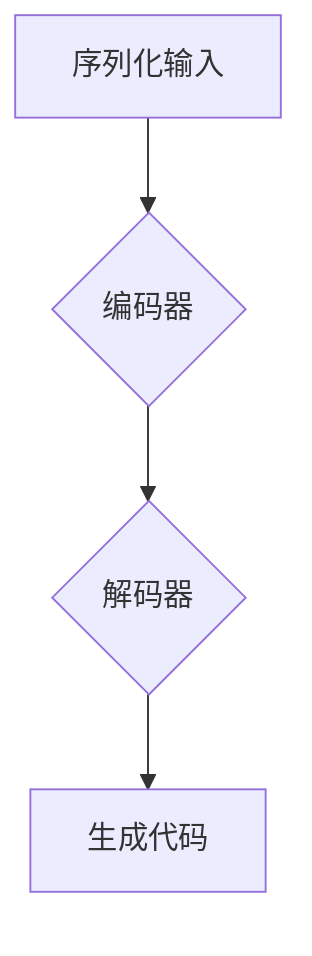

##### 3.2.2 代码优化

模型驱动编程还可以用于对现有代码进行优化。例如，通过训练一个模型来识别代码中的性能瓶颈，并自动生成优化代码。

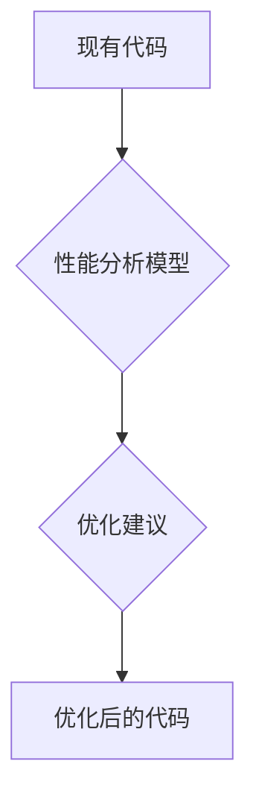

##### 3.2.3 代码重构

模型驱动编程可以帮助开发人员自动重构代码，以提高代码的可维护性和扩展性。例如，可以使用生成对抗网络（GAN）来生成新的代码结构。

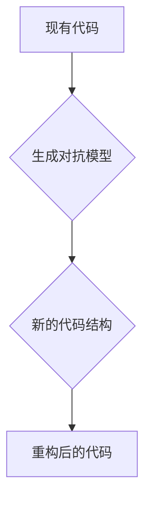

#### 3.3 模型驱动编程的实现方法

##### 3.3.1 模型设计

在设计模型时，需要根据具体的应用场景来选择合适的模型结构。例如，在自然语言处理领域，可以采用序列到序列（Seq2Seq）模型；在代码生成领域，可以采用转换器（Transformer）模型。

```python
# 序列到序列模型的示例代码
import tensorflow as tf

# 定义编码器
encoder = tf.keras.Sequential([
    tf.keras.layers.Dense(512, activation='relu', input_shape=(None,)),
    tf.keras.layers.LSTM(512)
])

# 定义解码器
decoder = tf.keras.Sequential([
    tf.keras.layers.LSTM(512, return_sequences=True),
    tf.keras.layers.Dense(512, activation='relu'),
    tf.keras.layers.Dense(1, activation='softmax')
])

# 定义模型
model = tf.keras.Model(inputs=[encoder.input, decoder.input], outputs=decoder.output)
```

##### 3.3.2 模型训练

在训练模型时，需要准备大量的训练数据和相应的标签。通过调整模型的参数和超参数，可以优化模型的性能。

```python
# 训练模型
model.compile(optimizer='adam', loss='categorical_crossentropy')
model.fit([encoder.input, decoder.input], decoder.input, epochs=10)
```

##### 3.3.3 模型评估

在训练完成后，需要对模型进行评估，以验证其性能。可以通过计算模型的准确率、召回率等指标来评估模型的性能。

```python
# 评估模型
loss, accuracy = model.evaluate([test_encoder.input, test_decoder.input], test_decoder.input)
print(f"Test accuracy: {accuracy}")
```

#### 3.4 模型驱动编程的挑战与解决方案

##### 3.4.1 数据质量问题

- **解决方案**：通过数据预处理、数据增强和数据清洗等方法来提高数据质量。

```python
# 数据预处理
def preprocess_data(data):
    # 数据清洗
    data = clean_data(data)
    # 数据增强
    data = augment_data(data)
    return data

# 数据增强
def augment_data(data):
    # 实现数据增强的方法
    return augmented_data
```

##### 3.4.2 模型复杂度问题

- **解决方案**：通过简化模型结构、使用预训练模型等方法来降低模型复杂度。

```python
# 使用预训练模型
from tensorflow.keras.applications import VGG16

# 载入预训练模型
model = VGG16(weights='imagenet')
```

### 第4章：自动编程

#### 4.1 自动编程概述

##### 4.1.1 自动编程的定义

自动编程是指利用自动化工具或系统自动生成代码的开发方法。这种方法可以显著提高开发效率和减少人为错误。

##### 4.1.2 自动编程的优势

- **提高开发效率**：通过自动生成代码，可以大幅度减少手动编码的工作量。
- **减少人为错误**：自动化工具可以减少手动编码过程中可能出现的错误。
- **易于维护和扩展**：自动生成的代码通常更易于维护和扩展。

#### 4.2 自动编程的应用

##### 4.2.1 代码生成

自动编程可以通过自动化工具来生成代码。例如，可以使用Python的`generate_code`函数来自动生成Python代码。

```python
def generate_code():
    # 生成Python代码
    return "print('Hello, World!')"

code = generate_code()
print(code)
```

##### 4.2.2 代码优化

自动编程还可以用于对现有代码进行优化。例如，可以使用自动化工具来分析代码，并提出优化建议。

```python
def optimize_code(code):
    # 优化代码
    return optimized_code

optimized_code = optimize_code(code)
print(optimized_code)
```

##### 4.2.3 代码重构

自动编程可以帮助开发人员自动重构代码，以提高代码的可维护性和扩展性。例如，可以使用自动化工具来重构代码的结构。

```python
def refactor_code(code):
    # 重构代码
    return refactored_code

refactored_code = refactor_code(code)
print(refactored_code)
```

#### 4.3 自动编程的实现方法

##### 4.3.1 自动化工具选择

在选择自动化工具时，需要考虑工具的易用性、功能丰富性以及与其他开发工具的兼容性。

```python
# 使用PyCharm的自动化工具
from pycham_auto import PyCharm

# 创建PyCharm实例
pycham = PyCharm()

# 启动PyCharm
pycham.start()

# 打开代码文件
pycham.open_file('example.py')

# 生成代码
code = pycham.generate_code()
print(code)
```

##### 4.3.2 代码生成框架

可以使用代码生成框架来简化代码生成过程。例如，可以使用Python的`GenerateCode`模块来生成Python代码。

```python
from generate_code import GenerateCode

# 创建GenerateCode实例
code_generator = GenerateCode()

# 生成Python代码
code = code_generator.generate_python_code()
print(code)
```

##### 4.3.3 代码优化框架

可以使用代码优化框架来优化代码。例如，可以使用Python的`CodeOptimize`模块来优化Python代码。

```python
from code_optimize import CodeOptimize

# 创建CodeOptimize实例
code_optimizer = CodeOptimize()

# 优化Python代码
optimized_code = code_optimizer.optimize_python_code(code)
print(optimized_code)
```

#### 4.4 自动编程的挑战与解决方案

##### 4.4.1 编码风格一致性

- **解决方案**：通过使用代码格式化工具和编码规范来保证代码风格的一致性。

```python
# 使用Black格式化Python代码
from black import format

code = format(code, mode="pyproject.toml")
print(code)
```

##### 4.4.2 自动化工具的维护

- **解决方案**：定期更新自动化工具，并编写测试用例来验证自动化工具的功能。

```python
# 更新自动化工具
pip install --upgrade pycham_auto

# 编写测试用例
def test_code_generator():
    code_generator = GenerateCode()
    generated_code = code_generator.generate_python_code()
    assert generated_code.startswith("print('Hello, World!')"), "Generated code is incorrect"
```

### 第5章：跨领域编程

#### 5.1 跨领域编程概述

##### 5.1.1 跨领域编程的定义

跨领域编程是指将一个领域的知识和方法应用于其他领域，以提高AI编程的灵活性和适应性。

##### 5.1.2 跨领域编程的优势

- **提高编程灵活性**：通过跨领域编程，可以充分利用不同领域的知识和方法，提高编程的灵活性。
- **增强问题解决能力**：跨领域编程可以帮助开发人员从多个角度思考问题，从而提高问题解决能力。

#### 5.2 跨领域编程的应用

##### 5.2.1 知识融合

跨领域编程可以通过知识融合来实现不同领域知识的共享和利用。例如，将自然语言处理（NLP）和计算机视觉（CV）相结合，可以构建更加智能的应用系统。

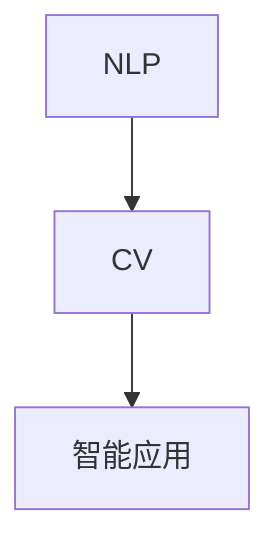

##### 5.2.2 领域模型转换

跨领域编程可以通过领域模型转换来实现不同领域之间的数据交换和共享。例如，将金融领域的模型转换为医疗领域的模型，以便在医疗领域应用金融领域的知识。

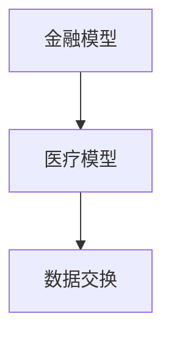

##### 5.2.3 多模态编程

跨领域编程可以通过多模态编程来实现不同类型数据的处理和融合。例如，结合文本、图像和音频数据，构建更加丰富和智能的应用系统。

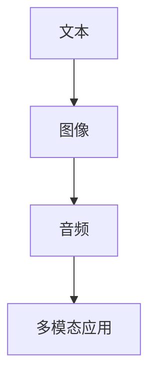

#### 5.3 跨领域编程的实现方法

##### 5.3.1 领域模型构建

在实现跨领域编程时，需要构建适用于不同领域的领域模型。领域模型可以包含领域知识、领域规则和领域应用场景。

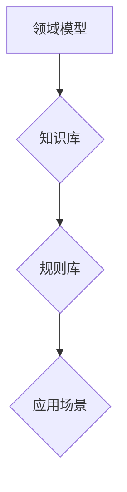

##### 5.3.2 领域模型转换

在实现跨领域编程时，需要实现领域模型之间的转换。领域模型转换可以通过映射、转换和适配等方法来实现。

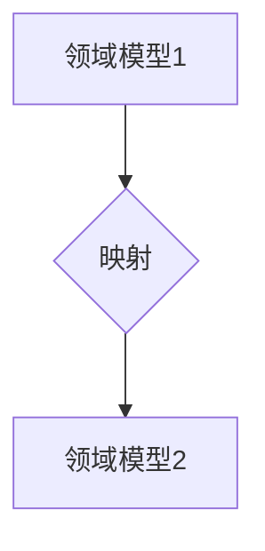

##### 5.3.3 多模态数据处理

在实现跨领域编程时，需要处理和融合不同类型的数据。多模态数据处理可以通过特征提取、特征融合和模型集成等方法来实现。

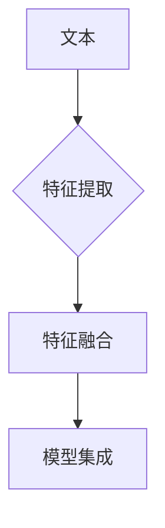

### 第6章：提高开发效率

#### 6.1 提高开发效率的方法

##### 6.1.1 自动化工具

通过使用自动化工具，可以显著提高开发效率。例如，使用代码生成工具可以减少手动编码的工作量。

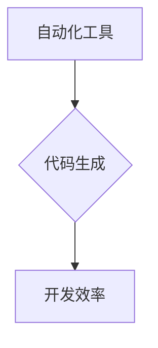

##### 6.1.2 模型驱动开发

通过模型驱动开发，可以减少对手动编码的依赖，从而提高开发效率。例如，使用生成对抗网络（GAN）可以自动生成代码。

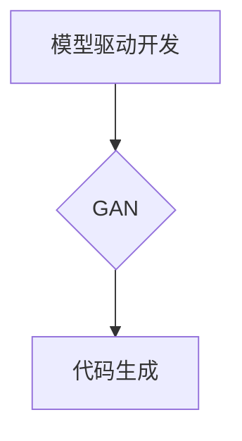

##### 6.1.3 流程优化

通过优化开发流程，可以减少开发过程中的浪费和时间。例如，使用敏捷开发方法可以提高团队的协作效率和项目进度。

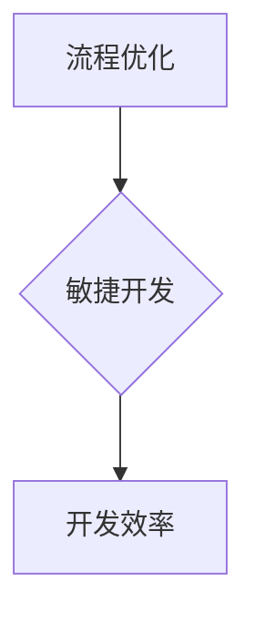

#### 6.2 提高开发效率的具体实践

##### 6.2.1 自动化测试

通过自动化测试，可以快速发现和修复代码中的错误，从而提高开发效率。例如，使用单元测试框架可以自动化测试代码。

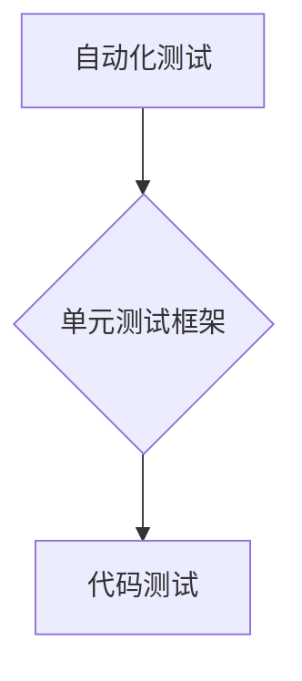

##### 6.2.2 代码审查

通过代码审查，可以确保代码的质量和一致性，从而提高开发效率。例如，使用代码审查工具可以自动化审查代码。

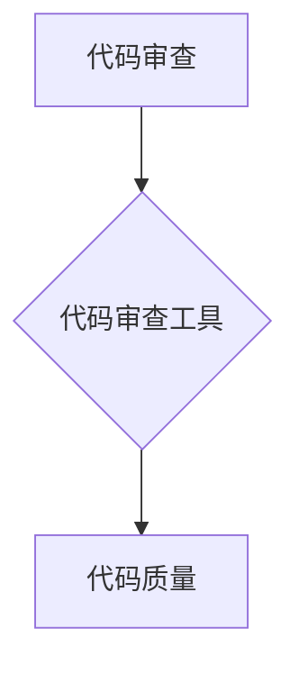

##### 6.2.3 团队协作

通过团队协作，可以充分利用团队成员的技能和经验，从而提高开发效率。例如，使用协作工具可以方便团队成员之间的沟通和协作。

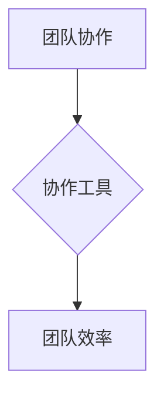

### 第7章：总结与展望

#### 7.1 总结

本文介绍了AI编程的新思维和新方向，包括模型驱动编程、自动编程、跨领域编程以及提高开发效率的方法。通过这些新的编程思维和方法，可以显著提高AI编程的效率和灵活性，为人工智能技术的发展提供新的动力。

#### 7.2 展望

随着人工智能技术的不断发展，AI编程将面临更多的挑战和机遇。未来的AI编程将更加智能化、自动化和跨领域化。同时，随着新型编程语言和工具的不断涌现，AI编程的效率和效果也将不断提高。我们期待未来的AI编程能够更好地服务于社会，推动人工智能技术的进步。

## 作者信息

- 作者：AI天才研究院/AI Genius Institute & 禅与计算机程序设计艺术 /Zen And The Art of Computer Programming

