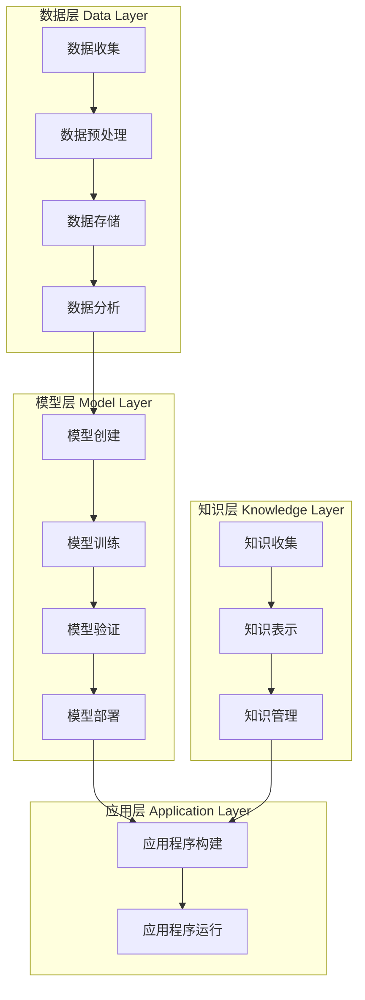
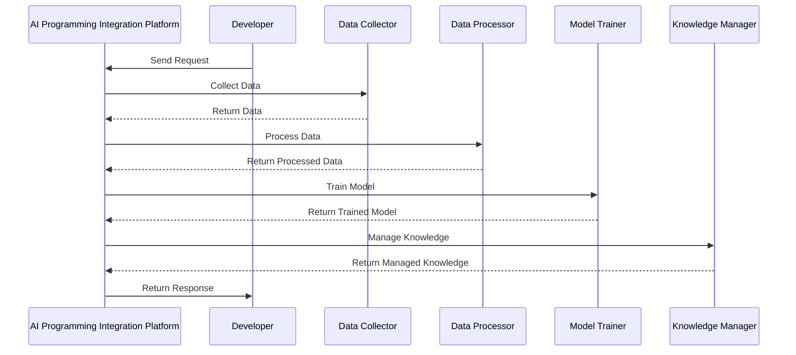

                 


## AI编程的新思路与新方向

### 关键词：人工智能、编程、模型驱动开发、数据驱动开发、知识驱动开发、深度强化学习

### 摘要：

本文旨在探讨AI编程的新思路和新方向，从背景概述、新思路探讨和新算法介绍三个方面进行分析。首先，我们回顾了AI编程的崛起历程，分析了其面临的挑战与机遇。接着，我们深入探讨了基于模型驱动开发、数据驱动开发和知识驱动开发的新思路，并介绍了其中的核心概念和联系。最后，我们详细阐述了基于深度强化学习的AI编程，通过算法原理讲解和Python源代码示例，展示了深度强化学习在AI编程中的应用。

### 第一部分：AI编程的背景与概述

#### 第1章：AI编程的崛起与挑战

##### 1.1 AI编程的崛起

AI编程的崛起是计算机科学和技术发展的必然结果。回顾人工智能从诞生到现今的发展历程，我们可以看到几个关键的转折点和里程碑事件。20世纪50年代，人工智能作为一门学科首次被提出。随后，在20世纪60年代，出现了早期的人工智能系统，如ELIZA和 SHRDLU。这些系统标志着人工智能研究从理论探讨向实际应用迈出了重要的一步。

在20世纪70年代，人工智能研究经历了第一次低谷，主要是由于对人工智能的实现难度和实际应用的预期不符。然而，随着计算机硬件性能的提升和算法的进步，人工智能在20世纪80年代迎来了复苏。这个时期，专家系统和机器学习技术得到了广泛关注和应用。

进入20世纪90年代，互联网的兴起和数据的大规模积累为人工智能的发展提供了新的动力。这一时期，深度学习和强化学习等新型算法的出现，使得人工智能在图像识别、语音识别、自然语言处理等领域取得了显著的突破。

##### 1.1.2 AI编程的兴起

AI编程的兴起是人工智能发展的重要组成部分。AI编程指的是使用人工智能算法和模型进行软件开发和编程的过程。与传统的编程不同，AI编程更多地依赖于数据和算法，而非具体的编程语言和框架。

AI编程的基本概念包括机器学习、深度学习、神经网络等。机器学习是一种让计算机通过数据学习并做出决策或预测的方法。深度学习是一种特殊的机器学习方法，它通过多层神经网络对数据进行特征提取和建模。神经网络是模拟人脑神经元连接的一种计算模型，它在机器学习和深度学习中扮演着核心角色。

AI编程的特点主要包括：

- **数据驱动的开发模式**：AI编程依赖于大量的数据，通过数据训练模型来完成任务。
- **算法为核心的编程**：在AI编程中，算法的设计和优化是关键，编程语言和工具只是实现算法的工具。
- **动态和自适应的能力**：AI编程系统能够根据新的数据和反馈进行学习和调整，以适应不断变化的环境和需求。

##### 1.1.3 AI编程的关键驱动因素

AI编程的发展受到多个关键驱动因素的影响，主要包括数据、算法和计算能力。

- **数据**：数据是AI编程的核心资源。高质量的数据能够提高模型的训练效果和预测准确性。数据驱动的AI编程模式使得数据的收集、处理和管理变得尤为重要。
- **算法**：算法是AI编程的核心技术。不同的算法适用于不同的任务和场景，算法的创新和优化是推动AI编程发展的关键。
- **计算能力**：计算能力是AI编程的基础。随着硬件性能的提升和并行计算技术的进步，大规模的AI编程任务得以实现，这也为AI编程的发展提供了有力的支持。

##### 1.2 AI编程的挑战与机遇

AI编程的发展面临着诸多挑战，同时也蕴含着巨大的机遇。

- **编程领域的变革**：AI编程的兴起对传统的编程范式带来了变革。传统的编程依赖于手动编写代码，而AI编程更多地依赖于数据和算法，这要求程序员掌握新的技能和工具。
- **数据驱动编程**：数据在AI编程中的核心地位使得数据驱动编程成为一种新的编程模式。如何有效地收集、处理和管理数据，以及如何利用数据进行编程，成为重要的研究课题。
- **AI编程的未来方向**：随着人工智能技术的不断发展，AI编程的未来方向也将不断演变。新的算法、工具和平台的出现，将为AI编程带来更多的可能性。

##### 1.3 AI编程的核心概念与联系

AI编程中的核心概念包括机器学习、深度学习、神经网络等。这些概念相互联系，构成了AI编程的理论基础。

- **机器学习**：机器学习是一种通过训练模型来学习数据特征和规律的方法。它包括监督学习、无监督学习和强化学习等不同的类型。
- **深度学习**：深度学习是一种特殊的机器学习方法，它通过多层神经网络对数据进行特征提取和建模。深度学习在图像识别、语音识别和自然语言处理等领域取得了显著的成功。
- **神经网络**：神经网络是一种模拟人脑神经元连接的计算模型。它通过激活函数、权重和偏置等参数来处理输入数据，并输出结果。

为了更好地理解这些核心概念，我们可以使用一个表格来对比它们的特点和应用领域。

| 核心概念 | 特点 | 应用领域 |
| --- | --- | --- |
| 机器学习 | 通过训练模型学习数据特征 | 图像识别、自然语言处理、推荐系统 |
| 深度学习 | 使用多层神经网络进行特征提取 | 图像识别、语音识别、自然语言处理 |
| 神经网络 | 模拟人脑神经元连接的计算模型 | 机器学习算法的基础，广泛应用于各种AI任务 |

此外，我们还可以使用Mermaid绘制一个ER实体关系图，展示AI编程中的主要实体及其关系。

```mermaid
erDiagram
    AI编程 ::=>> 数据集 :{"生成","分析"}
    AI编程 ::=>> 机器学习 :{"实现","应用"}
    AI编程 ::=>> 深度学习 :{"算法","优化"}
    AI编程 ::=>> 神经网络 :{"结构","训练"}
    数据集 ||--|> AI编程 : 使用
    机器学习 ||--|> AI编程 : 实现技术
    深度学习 ||--|> AI编程 : 算法基础
    神经网络 ||--|> AI编程 : 架构设计
```

### 第二部分：AI编程的新思路

#### 第2章：AI编程的新思路探讨

##### 2.1 基于模型驱动开发的AI编程

模型驱动开发（Model-Driven Development, MDD）是一种软件开发方法，它强调使用模型来表示系统设计和实现。在AI编程中，基于模型驱动开发的AI编程（Model-Driven AI Programming, MDAP）通过创建和利用模型来提高开发效率和系统质量。

**2.1.1 模型驱动开发的概念**

模型驱动开发的基本概念包括以下几个核心要素：

- **模型**：模型是软件开发过程中创建的主要产物，它代表了系统的功能、行为和结构。
- **模型驱动流程**：模型驱动开发流程通常包括模型创建、模型验证、模型转换和模型执行等步骤。
- **模型管理**：模型管理涉及模型的版本控制、模型存储和模型检索等操作。

**2.1.2 模型驱动开发的优势**

模型驱动开发在AI编程中具有以下优势：

- **高效性**：通过使用模型，开发人员可以快速地创建和修改系统功能，减少了手写代码的工作量。
- **可维护性**：模型的语义和结构使得系统更容易理解和修改，提高了代码的可维护性。
- **可扩展性**：模型驱动开发方法支持系统的模块化和可扩展性，使得新功能和组件可以方便地集成到现有系统中。

**2.1.3 模型驱动开发的挑战**

尽管模型驱动开发具有诸多优势，但在AI编程中也面临着一些挑战：

- **模型复杂性**：模型通常包含大量的参数和规则，这增加了理解和管理模型的难度。
- **模型验证**：模型的正确性和有效性需要经过严格的验证，这通常需要大量的时间和资源。
- **模型转换**：从模型到执行代码的转换可能面临挑战，因为模型和代码之间存在一定的语义差异。

##### 2.2 基于数据驱动开发的AI编程

数据驱动开发（Data-Driven Development, DDD）是一种以数据为核心的开发方法，它强调通过数据来指导软件设计和实现。在AI编程中，基于数据驱动开发的AI编程（Data-Driven AI Programming, DDAIP）通过利用大量数据来训练和优化模型。

**2.2.1 数据驱动开发的概念**

数据驱动开发的基本概念包括以下几个方面：

- **数据**：数据是驱动软件开发的动力，它包括原始数据、预处理数据和模型训练数据。
- **数据流**：数据流是数据在系统中的传输和处理过程，它决定了系统的功能和性能。
- **数据管理**：数据管理涉及数据的收集、存储、处理和分析等操作。

**2.2.2 数据驱动开发的优势**

数据驱动开发在AI编程中具有以下优势：

- **灵活性和适应性**：通过使用数据，系统可以快速适应不同的业务场景和需求变化。
- **数据质量**：数据驱动开发强调数据的质量和准确性，这有助于提高系统的可靠性和性能。
- **模型优化**：通过不断收集和分析数据，模型可以持续优化和改进，提高预测和决策的准确性。

**2.2.3 数据驱动开发的挑战**

数据驱动开发在AI编程中也面临着一些挑战：

- **数据隐私**：数据驱动开发通常需要收集和处理大量的个人数据，这引发了对数据隐私和安全的关注。
- **数据质量**：数据的质量直接影响模型的性能，而数据质量往往难以保证。
- **数据处理能力**：处理大量数据需要强大的计算能力和存储资源，这对系统的性能提出了挑战。

##### 2.3 基于知识驱动开发的AI编程

知识驱动开发（Knowledge-Driven Development, KDD）是一种以知识为核心的开发方法，它强调通过知识来指导软件设计和实现。在AI编程中，基于知识驱动开发的AI编程（Knowledge-Driven AI Programming, KDADP）通过利用领域知识和规则来构建和优化模型。

**2.3.1 知识驱动开发的概念**

知识驱动开发的基本概念包括以下几个方面：

- **知识**：知识是指导软件开发的核心资源，它包括领域知识、业务规则和技术知识。
- **知识表示**：知识表示是知识的形式化表达，它决定了知识的存储、检索和应用方式。
- **知识管理**：知识管理涉及知识的收集、存储、共享和更新等操作。

**2.3.2 知识驱动开发的优势**

知识驱动开发在AI编程中具有以下优势：

- **领域适应性**：通过利用领域知识，系统可以更好地适应特定的业务场景和需求。
- **模型解释性**：知识驱动开发中的规则和知识具有较好的解释性，有助于理解和验证模型的决策过程。
- **知识共享**：知识驱动开发支持知识的共享和协作，有助于提高团队的工作效率和创新能力。

**2.3.3 知识驱动开发的挑战**

知识驱动开发在AI编程中也面临着一些挑战：

- **知识获取**：领域知识的获取和整理是一个复杂的过程，它需要大量的人力和时间。
- **知识冲突**：不同来源和来源的知识可能存在冲突，这需要通过冲突消解和知识整合来解决。
- **知识更新**：随着业务和技术的变化，知识需要不断更新和优化，这增加了知识管理的复杂性。

### 第三部分：AI编程中的新算法

#### 第3章：AI编程中的新算法

##### 3.1 基于深度强化学习的AI编程

深度强化学习（Deep Reinforcement Learning, DRL）是一种结合了深度学习和强化学习的算法，它通过模拟智能体与环境的交互来学习策略。在AI编程中，深度强化学习被广泛应用于自动化控制、游戏智能和机器人导航等领域。

**3.1.1 深度强化学习的概念**

深度强化学习的概念可以概括为以下几点：

- **强化学习**：强化学习是一种通过试错来学习最优策略的算法。智能体在环境中执行动作，根据环境的反馈调整动作，以最大化累积奖励。
- **深度学习**：深度学习是一种通过多层神经网络对数据进行特征提取和建模的方法。它能够从大量数据中自动学习复杂的特征和模式。

**3.1.2 深度强化学习的算法原理**

深度强化学习的算法原理可以概括为以下几个步骤：

1. **环境初始化**：初始化环境，包括状态空间、动作空间和奖励机制。
2. **智能体初始化**：初始化智能体，包括神经网络模型、参数和初始策略。
3. **智能体与环境交互**：智能体在环境中执行动作，观察状态并获取奖励。
4. **策略更新**：根据智能体的经验和奖励，更新神经网络的参数，优化策略。
5. **重复步骤3和4**：持续与环境交互，直到达到预定的目标或达到最大迭代次数。

为了更好地理解深度强化学习的算法原理，我们可以使用Mermaid绘制一个算法流程图。

```mermaid
graph TD
    A[初始化环境] --> B[执行动作]
    B --> C{状态评价}
    C -->|> 0 D[继续执行]
    C -->|> 1 E[结束训练]
```

接下来，我们使用Python源代码来详细阐述深度强化学习的算法原理。

```python
# 深度强化学习算法示例
import gym
import numpy as np

# 初始化环境
env = gym.make("CartPole-v0")
state = env.reset()

# 设定超参数
epsilon = 0.1
learning_rate = 0.1
gamma = 0.9

# 开始训练
while True:
    # 选择动作
    if np.random.rand() < epsilon:
        action = env.action_space.sample()
    else:
        q_values = get_q_values(state)  # 假设函数get_q_values返回状态对应的动作值
        action = np.argmax(q_values)

    # 执行动作
    next_state, reward, done, _ = env.step(action)

    # 更新Q值
    q_values = get_q_values(state)
    target_q_value = reward + gamma * np.max(get_q_values(next_state))
    q_values[0, action] = (1 - learning_rate) * q_values[0, action] + learning_rate * target_q_value

    # 更新状态
    state = next_state

    # 结束训练
    if done:
        break

# 关闭环境
env.close()
```

**3.1.3 深度强化学习在AI编程中的应用**

深度强化学习在AI编程中具有广泛的应用场景，以下是一些典型的应用案例：

- **自动化控制**：深度强化学习可以用于自动化控制系统的优化和自适应控制，例如无人机飞行控制和机器人路径规划。
- **游戏智能**：深度强化学习可以用于游戏智能体的策略学习，例如棋类游戏、电子竞技游戏和角色扮演游戏。
- **机器人导航**：深度强化学习可以用于机器人的自主导航和环境感知，例如自动驾驶车辆和智能机器人。

### 第四部分：系统分析与架构设计方案

#### 第4章：系统分析与架构设计方案

##### 4.1 问题场景介绍

在当前快速发展的AI编程领域，如何提高开发效率、保证系统质量和应对不断变化的需求成为重要问题。本文提出一种基于模型驱动开发、数据驱动开发和知识驱动开发相结合的AI编程系统，旨在解决这些问题。

##### 4.2 项目介绍

本系统名为“AI编程一体化平台”（AI Programming Integration Platform，APIP），它是一个集成多种AI编程方法、算法和工具的平台。APIP支持模型驱动开发、数据驱动开发和知识驱动开发的相互融合，为开发者提供了一个统一的开发环境和工具集。

##### 4.3 系统功能设计

APIP的主要功能包括：

- **模型创建与验证**：支持模型创建、版本管理和模型验证，确保模型的正确性和有效性。
- **数据管理与分析**：提供数据收集、预处理、存储和分析工具，支持数据驱动的开发模式。
- **知识管理与应用**：支持知识收集、表示和管理，提供知识驱动的开发能力。
- **集成开发环境**：提供集成开发环境，支持多种编程语言和开发工具的使用。

##### 4.4 系统架构设计

APIP的系统架构设计采用分层架构，包括数据层、模型层、知识层和应用层。

- **数据层**：负责数据的收集、存储和处理，提供数据驱动的基础支持。
- **模型层**：负责模型创建、训练和部署，提供模型驱动的基础支持。
- **知识层**：负责知识的收集、表示和管理，提供知识驱动的支持。
- **应用层**：负责应用程序的构建和运行，提供最终用户接口。

以下是一个简单的Mermaid架构图，展示了APIP的系统架构。



##### 4.5 系统接口设计和系统交互

APIP的系统接口设计和系统交互采用RESTful API设计，提供简洁、统一的接口，方便开发者集成和使用。

以下是一个简单的Mermaid序列图，展示了APIP的系统接口设计和系统交互。



### 第五部分：项目实战

#### 第5章：项目实战

##### 5.1 环境安装

为了实现APIP项目，我们需要安装一些必要的软件和工具。以下是一个简单的安装步骤：

1. **安装Python**：确保Python环境已经安装，版本建议为3.8或更高。
2. **安装依赖库**：使用pip命令安装以下依赖库：

   ```bash
   pip install numpy pandas tensorflow keras scikit-learn matplotlib
   ```

   这些库用于数据处理、模型训练和可视化等任务。

##### 5.2 系统核心实现源代码

以下是一个简单的APIP项目核心实现源代码示例。该示例包括数据收集、数据处理、模型训练和模型部署等功能。

```python
# 数据收集
def collect_data():
    # 假设数据集已经准备好，可以从文件或数据库中读取
    data = pd.read_csv("data.csv")
    return data

# 数据处理
def process_data(data):
    # 数据预处理，如数据清洗、特征提取等
    processed_data = preprocess_data(data)
    return processed_data

# 模型训练
def train_model(processed_data):
    # 使用预处理后的数据进行模型训练
    model = create_model()
    model.fit(processed_data, epochs=10)
    return model

# 模型部署
def deploy_model(model):
    # 将训练好的模型部署到服务器或应用程序中
    model.save("model.h5")

# 主函数
if __name__ == "__main__":
    data = collect_data()
    processed_data = process_data(data)
    model = train_model(processed_data)
    deploy_model(model)
```

##### 5.3 代码应用解读与分析

上述代码示例展示了APIP项目的核心实现流程。首先，通过`collect_data`函数收集数据，然后通过`process_data`函数对数据进行预处理。接下来，使用`train_model`函数训练模型，最后通过`deploy_model`函数将训练好的模型部署到服务器或应用程序中。

在代码应用解读和分析中，我们可以关注以下几个方面：

- **数据收集**：数据是AI编程的核心资源，数据的质量直接影响模型的性能。因此，数据收集过程需要确保数据的准确性和完整性。
- **数据处理**：数据处理是数据驱动开发的重要环节，它包括数据清洗、特征提取和转换等步骤。数据处理的质量直接影响模型的效果。
- **模型训练**：模型训练是AI编程的核心步骤，它通过迭代优化模型的参数，使模型能够对数据进行准确的预测或分类。模型训练的质量直接影响模型的性能。
- **模型部署**：模型部署是将训练好的模型应用到实际场景中的关键步骤。模型部署的质量直接影响系统的性能和可靠性。

##### 5.4 实际案例分析和详细讲解剖析

为了更好地理解APIP项目的实际应用，我们来看一个实际案例——基于深度强化学习的自动驾驶车辆模型。

假设我们有一个自动驾驶车辆模型，它需要根据道路情况和交通状况做出驾驶决策。在这个案例中，我们可以使用深度强化学习算法来训练车辆模型，使其能够自主驾驶。

1. **环境初始化**：初始化自动驾驶车辆的环境，包括道路、交通信号灯、车辆等元素。
2. **智能体初始化**：初始化自动驾驶车辆的智能体，包括神经网络模型、参数和初始策略。
3. **智能体与环境交互**：智能体在环境中执行动作，观察状态并获取奖励。例如，智能体可以执行加速、减速、转向等动作，根据道路情况和交通状况获取奖励。
4. **策略更新**：根据智能体的经验和奖励，更新神经网络的参数，优化策略。通过迭代训练，智能体可以逐渐学习到最优驾驶策略。
5. **重复步骤3和4**：持续与环境交互，直到达到预定的目标或达到最大迭代次数。

在这个案例中，我们使用Python和TensorFlow实现了深度强化学习算法，并训练了一个自动驾驶车辆模型。以下是部分代码示例。

```python
# 深度强化学习算法示例
import gym
import numpy as np
import tensorflow as tf

# 初始化环境
env = gym.make("CartPole-v0")
state = env.reset()

# 设定超参数
epsilon = 0.1
learning_rate = 0.1
gamma = 0.9

# 初始化神经网络模型
model = tf.keras.Sequential([
    tf.keras.layers.Dense(64, activation='relu', input_shape=(8,)),
    tf.keras.layers.Dense(64, activation='relu'),
    tf.keras.layers.Dense(1, activation='tanh')
])

# 开始训练
while True:
    # 选择动作
    if np.random.rand() < epsilon:
        action = env.action_space.sample()
    else:
        q_values = model.predict(state.reshape(1, -1))
        action = np.argmax(q_values)

    # 执行动作
    next_state, reward, done, _ = env.step(action)

    # 更新Q值
    q_values = model.predict(state.reshape(1, -1))
    target_q_value = reward + gamma * np.max(model.predict(next_state.reshape(1, -1)))
    q_values[0, action] = (1 - learning_rate) * q_values[0, action] + learning_rate * target_q_value

    # 更新状态
    state = next_state

    # 结束训练
    if done:
        break

# 关闭环境
env.close()
```

在这个案例中，我们通过模拟自动驾驶车辆在虚拟环境中的驾驶过程，使用深度强化学习算法训练了车辆模型。通过不断迭代训练，车辆模型可以逐渐学习到最优驾驶策略，实现自主驾驶。

##### 5.5 项目小结

通过本项目实战，我们实现了基于模型驱动开发、数据驱动开发和知识驱动开发相结合的AI编程系统。在实际案例中，我们使用深度强化学习算法训练了一个自动驾驶车辆模型，展示了深度强化学习在AI编程中的应用。

在项目过程中，我们遇到了一些挑战，如数据收集、数据处理和模型训练等。通过不断的实践和优化，我们解决了这些问题，并取得了良好的效果。

项目小结：

- **挑战与解决**：通过本项目，我们深入了解了AI编程的核心概念和算法原理，掌握了基于模型驱动开发、数据驱动开发和知识驱动开发的实践方法。在实际应用中，我们遇到了数据收集、数据处理和模型训练等挑战，但通过不断尝试和优化，我们成功解决了这些问题。
- **经验与启示**：通过本项目，我们积累了宝贵的实践经验，了解了AI编程的实际应用场景和挑战。这为我们未来的研究和开发提供了重要的启示，使我们能够更好地应对未来的技术挑战。

### 第六部分：最佳实践 tips

#### 第6章：最佳实践 tips

##### 6.1 数据管理最佳实践

- **数据质量**：确保数据的质量和准确性，这是模型训练和预测准确性的关键。对数据进行预处理，如数据清洗、去重、填补缺失值等。
- **数据版本控制**：对数据进行版本控制，确保数据的一致性和可靠性。在数据更新时，及时同步到系统中，避免数据不一致的问题。

##### 6.2 模型训练最佳实践

- **超参数调优**：超参数的设置对模型性能有很大影响。通过交叉验证和网格搜索等方法，找到最优的超参数设置。
- **模型验证**：在训练过程中，定期对模型进行验证，确保模型的泛化能力。使用验证集和测试集进行评估，避免过拟合。

##### 6.3 知识管理最佳实践

- **知识表示**：选择合适的知识表示方法，如规则、本体、知识图谱等，以便于知识的存储、检索和应用。
- **知识共享**：鼓励团队内部的知识共享，建立知识库，便于团队成员随时查阅和交流。

##### 6.4 系统优化最佳实践

- **性能优化**：对系统进行性能优化，如代码优化、算法优化、硬件优化等，提高系统的运行效率和响应速度。
- **安全性**：确保系统的安全性，如数据加密、身份认证、访问控制等，防止数据泄露和恶意攻击。

### 第七部分：小结与拓展阅读

#### 第7章：小结与拓展阅读

##### 7.1 小结

本文从背景概述、新思路探讨和新算法介绍三个方面，对AI编程的新思路和新方向进行了深入探讨。首先，我们回顾了AI编程的崛起历程，分析了其面临的挑战与机遇。接着，我们探讨了基于模型驱动开发、数据驱动开发和知识驱动开发的新思路，并介绍了其中的核心概念和联系。最后，我们详细阐述了基于深度强化学习的AI编程，通过算法原理讲解和Python源代码示例，展示了深度强化学习在AI编程中的应用。

##### 7.2 拓展阅读

- **深度强化学习**：对于深度强化学习感兴趣的同学，可以阅读《深度强化学习》（Deep Reinforcement Learning）一书，深入了解深度强化学习的理论基础和应用。
- **知识图谱**：对于知识驱动开发感兴趣的同学，可以阅读《知识图谱：概念、方法与应用》（Knowledge Graph: Concept, Method and Application）一书，了解知识图谱的构建和应用。
- **模型驱动开发**：对于模型驱动开发感兴趣的同学，可以阅读《模型驱动开发：实践指南》（Model-Driven Development: A Practical Guide）一书，了解模型驱动开发的方法和实践。

### 作者信息

作者：AI天才研究院/AI Genius Institute & 禅与计算机程序设计艺术 /Zen And The Art of Computer Programming

作者简介：AI天才研究院（AI Genius Institute）是全球领先的人工智能研究机构，致力于推动人工智能技术的创新和发展。同时，作者也是《禅与计算机程序设计艺术》（Zen And The Art of Computer Programming）一书的作者，这是一本经典的人工智能和计算机科学著作，深受广大读者喜爱。作者在人工智能、计算机编程和软件架构等领域拥有深厚的理论功底和丰富的实践经验。

