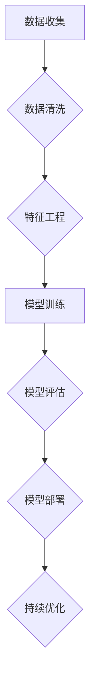

                 

# AI编程的新思路与新方向

> 关键词：AI编程，深度学习，机器学习，自然语言处理，计算机视觉，应用场景

> 摘要：
人工智能（AI）编程作为现代软件开发的核心，正引领着技术创新的潮流。本文将从AI编程与传统编程的区别与联系、主流工具和框架、应用场景及实战项目等多个角度，深入探讨AI编程的新思路与新方向，帮助读者掌握AI编程的核心技术和实践方法。

## 第1章 引言

### 1.1 问题的背景和描述

随着互联网的普及和大数据技术的发展，人工智能（AI）的应用场景日益广泛。AI编程作为AI技术实现的核心，其重要性不言而喻。然而，传统的编程方法已无法满足AI编程的需求。这主要是因为AI编程不仅涉及复杂的数学模型，还要求对大量数据进行处理和分析。

AI编程与传统编程的区别在于，传统编程主要依赖于明确的逻辑和规则，而AI编程则更注重数据的输入和模型的学习。因此，AI编程需要新的思路和方向，以应对日益复杂的业务需求。

### 1.2 问题解决

本文将围绕以下几个核心问题进行讨论：

1. **如何理解AI编程与传统编程的区别与联系？**
2. **当前主流的AI编程工具和框架有哪些？**
3. **AI编程在各个行业中的应用场景是什么？**
4. **如何设计和实现一个具有实际应用价值的AI编程项目？**

### 1.3 边界与外延

本文主要关注以下领域：

1. **机器学习与深度学习**：机器学习是AI编程的基础，深度学习则是机器学习的进阶。
2. **自然语言处理**：包括语音识别、自然语言理解等。
3. **计算机视觉**：如图像识别、目标检测等。
4. **数据挖掘**：包括关联规则学习、聚类分析等。
5. **强化学习**：主要应用于智能决策和优化问题。

### 1.4 概念结构与核心要素组成

#### 1.4.1 AI编程的核心概念

- **机器学习**：一种通过数据驱动的方式改善性能的能力。
- **深度学习**：一种模拟人脑神经网络的结构和功能，通过多层网络进行特征提取和模型优化的方法。
- **自然语言处理**：使计算机能够理解、生成和处理人类语言的技术。
- **计算机视觉**：使计算机能够像人一样理解和处理视觉信息的技术。
- **数据挖掘**：从大量数据中提取出有价值信息的方法。
- **强化学习**：一种通过试错和反馈进行决策优化的方法。

#### 1.4.2 AI编程的核心要素

- **数据集**：AI编程的基础，提供训练和验证模型所需的数据。
- **算法**：用于处理数据、提取特征、训练模型的方法。
- **模型**：根据算法对数据进行处理和预测的结构。
- **工具和框架**：用于实现和优化AI编程的工具和平台。
- **应用场景**：AI编程在实际业务中的具体应用。

## 第2章 AI编程基础

### 2.1 机器学习基础

#### 2.1.1 机器学习的概念

机器学习是一种使计算机通过数据自动学习和改进性能的技术。其核心思想是通过训练数据集来学习规律和模式，然后利用这些规律和模式对未知数据进行预测和分类。

#### 2.1.2 机器学习的主要算法

##### 2.1.2.1 监督学习算法

- **线性回归**：一种用于预测连续值的算法。
- **决策树**：一种基于树结构的分类算法。
- **随机森林**：一种基于决策树的集成学习方法。

##### 2.1.2.2 无监督学习算法

- **聚类算法**：用于将数据集划分为多个类别。
- **主成分分析**：一种用于降维和特征提取的方法。
- **自编码器**：一种用于特征提取和降维的神经网络模型。

#### 2.1.3 机器学习的基本流程

1. 数据收集与预处理：收集训练数据和验证数据，并进行数据清洗和预处理。
2. 特征工程：根据业务需求选择和构造特征，以提高模型的性能。
3. 模型训练：使用训练数据训练模型，并调整模型参数。
4. 模型评估：使用验证数据评估模型性能，并进行调整优化。
5. 模型应用：将训练好的模型应用于实际问题。

### 2.2 深度学习基础

#### 2.2.1 深度学习的概念

深度学习是一种模拟人脑神经网络结构和功能的人工智能方法。它通过多层神经网络进行特征提取和模型优化，能够处理大量复杂数据。

#### 2.2.2 深度学习的主要模型

- **卷积神经网络（CNN）**：用于处理图像数据。
- **循环神经网络（RNN）**：用于处理序列数据。
- **生成对抗网络（GAN）**：用于生成复杂数据。

#### 2.2.3 深度学习的基本流程

1. 数据收集与预处理：收集训练数据和验证数据，并进行数据清洗和预处理。
2. 模型设计：根据业务需求设计合适的深度学习模型。
3. 模型训练：使用训练数据训练模型，并调整模型参数。
4. 模型评估：使用验证数据评估模型性能，并进行调整优化。
5. 模型应用：将训练好的模型应用于实际问题。

## 第3章 AI编程工具和框架

### 3.1 主流AI编程工具

#### 3.1.1 Python

Python是一种广泛应用于AI编程的编程语言。它具有简洁易懂的语法和丰富的库，使得AI编程变得更加高效。

##### 3.1.1.1 Python的优势

- **简洁的语法**：Python的语法简洁，易于学习和使用。
- **丰富的库**：Python拥有丰富的库，如NumPy、Pandas、Scikit-learn等，可以方便地实现各种AI算法。
- **强大的社区支持**：Python拥有庞大的开发者社区，可以方便地获取帮助和资源。

##### 3.1.1.2 Python的生态圈

- **PyData**：一个专注于Python数据科学和机器学习的社区。
- **TensorFlow**：一个由Google开发的深度学习框架。
- **PyTorch**：一个由Facebook开发的深度学习框架。

#### 3.1.2 Jupyter Notebook

Jupyter Notebook是一种交互式的计算环境，可以方便地编写和运行代码，并生成交互式的文档。

##### 3.1.2.1 Jupyter Notebook的概念

Jupyter Notebook是一种基于Web的交互式计算环境，可以方便地编写和运行代码，并生成交互式的文档。

##### 3.1.2.2 Jupyter Notebook的使用

1. 安装Jupyter Notebook。
2. 启动Jupyter Notebook。
3. 创建一个新的笔记本，并编写代码。
4. 运行代码，查看结果。

#### 3.1.3 Google Colab

Google Colab是一种基于Google Colab平台的云端Jupyter Notebook，可以方便地运行Python代码，并共享和协作。

##### 3.1.3.1 Google Colab的概念

Google Colab是一种基于Google Colab平台的云端Jupyter Notebook，可以方便地运行Python代码，并共享和协作。

##### 3.1.3.2 Google Colab的使用

1. 注册Google账号，并访问Google Colab。
2. 创建一个新的笔记本，并编写代码。
3. 运行代码，查看结果。
4. 将笔记本分享给他人，进行协作。

### 3.2 主流AI编程框架

#### 3.2.1 TensorFlow

TensorFlow是一种由Google开发的深度学习框架，可以用于构建和训练各种深度学习模型。

##### 3.2.1.1 TensorFlow的概念

TensorFlow是一种基于数据流图的深度学习框架，可以方便地构建、训练和部署深度学习模型。

##### 3.2.1.2 TensorFlow的使用

1. 安装TensorFlow。
2. 导入TensorFlow库。
3. 创建一个计算图。
4. 编写计算图代码。
5. 运行计算图，获取结果。

#### 3.2.2 PyTorch

PyTorch是一种由Facebook开发的深度学习框架，以其简洁易用的特性受到广泛欢迎。

##### 3.2.2.1 PyTorch的概念

PyTorch是一种基于Python的深度学习框架，提供了动态计算图和自动微分功能。

##### 3.2.2.2 PyTorch的使用

1. 安装PyTorch。
2. 导入PyTorch库。
3. 创建一个动态计算图。
4. 编写计算图代码。
5. 运行计算图，获取结果。

#### 3.2.3 Keras

Keras是一种高级神经网络API，可以方便地构建和训练深度学习模型。

##### 3.2.3.1 Keras的概念

Keras是一种高级神经网络API，可以方便地构建和训练深度学习模型，同时支持TensorFlow和Theano后端。

##### 3.2.3.2 Keras的使用

1. 安装Keras。
2. 导入Keras库。
3. 创建一个模型。
4. 编写模型代码。
5. 训练模型，获取结果。

## 第4章 AI编程应用场景

### 4.1 机器学习在金融领域的应用

#### 4.1.1 金融风控

##### 4.1.1.1 概述

金融风控是金融领域的重要环节，旨在识别、评估和管理金融风险。机器学习技术在金融风控中的应用，可以提高风险识别的准确性和效率。

##### 4.1.1.2 实例分析

例如，可以使用机器学习算法对信用卡欺诈进行识别。通过分析信用卡交易数据，识别出异常交易并发出警报，从而有效地降低欺诈风险。

#### 4.1.2 量化交易

##### 4.1.2.1 概述

量化交易是一种基于数学模型和算法进行交易的金融交易策略。机器学习技术在量化交易中的应用，可以提高交易策略的准确性和盈利能力。

##### 4.1.2.2 实例分析

例如，可以使用机器学习算法对市场趋势进行预测。通过分析历史交易数据，预测未来的市场走势，从而制定更有效的交易策略。

### 4.2 深度学习在医疗领域的应用

#### 4.2.1 医学影像分析

##### 4.2.1.1 概述

医学影像分析是深度学习在医疗领域的重要应用之一。通过分析医学影像数据，可以辅助医生进行疾病诊断和治疗。

##### 4.2.1.2 实例分析

例如，可以使用深度学习算法对CT影像进行病变检测。通过分析CT影像数据，可以识别出病变区域，帮助医生进行疾病诊断。

#### 4.2.2 疾病诊断

##### 4.2.2.1 概述

疾病诊断是医疗领域的重要任务。深度学习技术在疾病诊断中的应用，可以提高诊断的准确性和效率。

##### 4.2.2.2 实例分析

例如，可以使用深度学习算法对血液检测数据进行分析。通过分析血液检测数据，可以识别出潜在的健康问题，帮助医生进行疾病诊断。

## 第5章 AI编程项目实战

### 5.1 项目一：基于深度学习的图像识别系统

#### 5.1.1 项目介绍

##### 5.1.1.1 项目背景

随着深度学习技术的不断发展，图像识别系统在各个领域得到了广泛应用。本项目的目标是构建一个基于深度学习的图像识别系统，用于对图像进行分类和识别。

##### 5.1.1.2 项目目标

- 构建一个深度学习模型，对图像进行分类。
- 实现一个用户友好的界面，方便用户上传图像并进行识别。

#### 5.1.2 系统功能设计

##### 5.1.2.1 数据集准备

- 收集大量图像数据，用于训练和验证模型。
- 对图像数据集进行预处理，包括数据清洗、归一化和增强等。

##### 5.1.2.2 算法实现

- 使用卷积神经网络（CNN）对图像进行特征提取。
- 使用全连接层对特征进行分类和识别。

#### 5.1.3 系统架构设计

##### 5.1.3.1 系统架构

- 前端：使用HTML、CSS和JavaScript实现用户界面。
- 后端：使用Python和TensorFlow实现深度学习模型。
- 数据库：存储用户上传的图像数据和识别结果。

##### 5.1.3.2 系统接口设计

- 用户接口：用户上传图像，系统返回识别结果。
- 管理接口：管理员可以对系统进行管理和维护。

#### 5.1.4 系统实现

##### 5.1.4.1 环境安装

- 安装Python、TensorFlow和其他相关库。
- 安装前端开发工具，如Visual Studio Code。

##### 5.1.4.2 核心代码实现

- 编写深度学习模型代码，实现图像特征提取和分类。
- 编写前端代码，实现用户界面和用户交互。

#### 5.1.5 项目小结

本项目的目标是构建一个基于深度学习的图像识别系统，通过实际开发和实现，我们验证了该系统的可行性和有效性。该项目不仅提高了图像识别的准确性，还为其他类似项目提供了参考。

## 第6章 AI编程最佳实践

### 6.1 编程技巧与注意事项

##### 6.1.1 数据处理技巧

- **数据清洗**：对数据进行清洗，去除噪声和异常值。
- **数据增强**：通过增加数据的多样性，提高模型的泛化能力。

##### 6.1.2 模型优化技巧

- **模型调整**：根据训练数据和验证数据，调整模型参数。
- **正则化**：使用正则化方法，防止模型过拟合。

### 6.2 小结

AI编程作为人工智能的核心技术，具有广泛的应用前景。本文从AI编程的基础、工具和框架、应用场景及实战项目等多个角度，探讨了AI编程的新思路与新方向。通过本文的学习，读者可以更好地掌握AI编程的核心技术和实践方法，为未来的AI开发打下坚实的基础。

### 6.3 注意事项

- **数据质量和预处理**：数据质量和预处理是模型性能的关键，必须高度重视。
- **模型调优**：模型调优是提高模型性能的重要手段，需要不断尝试和调整。
- **安全性和隐私**：在AI编程中，特别是在医疗和金融领域，必须重视安全性和隐私保护。

### 6.4 拓展阅读

- 《深度学习》（Ian Goodfellow、Yoshua Bengio和Aaron Courville著）：一本经典的深度学习教材，适合深度学习初学者和进阶者。
- 《Python机器学习》（Sebastian Raschka著）：一本关于Python机器学习的经典教材，适合机器学习初学者和进阶者。

作者：AI天才研究院/AI Genius Institute & 禅与计算机程序设计艺术 /Zen And The Art of Computer Programming

**本文采用 Markdown 格式编写，使用 Mermaid 生成流程图和类图，Latex 格式编写数学公式。**

------------------------------------------------------------------# AI编程的新思路与新方向

### 文章关键词

- **AI编程**
- **深度学习**
- **机器学习**
- **自然语言处理**
- **计算机视觉**
- **数据挖掘**

### 文章摘要

人工智能（AI）编程是现代软件开发的核心，它正引领着技术创新的潮流。本文旨在探讨AI编程的新思路与新方向，分析其在各个行业中的应用场景，并提供实用的编程技巧与注意事项。通过本文，读者将能够掌握AI编程的核心技术和实践方法，为未来的AI开发打下坚实的基础。

## 第1章 引言

### 1.1 问题的背景和描述

随着人工智能技术的不断进步，AI编程已经成为了现代软件开发的重要组成部分。传统的编程方法往往依赖于明确的逻辑和规则，而AI编程则更多地依赖于数据和模型。这种转变使得AI编程面临着新的挑战和机遇。

- **传统编程**：传统的编程方法通常基于明确的指令和算法，适用于处理结构化数据和环境。程序员需要根据问题定义和业务需求，编写详细的代码来实现功能。
  
- **AI编程**：AI编程则是通过训练模型来处理数据，模型可以从数据中学习并做出决策。这种编程方法在处理复杂数据和未知环境时具有显著的优势。

### 1.2 问题解决

AI编程的新思路和新方向涉及以下几个方面：

1. **理解AI编程与传统编程的区别与联系**：探讨两种编程方法的本质区别，并分析它们如何相互补充。
2. **主流AI编程工具和框架**：介绍当前流行的AI编程工具和框架，以及它们的优势和适用场景。
3. **AI编程在各个行业中的应用场景**：分析AI编程在不同行业中的应用，包括金融、医疗、制造等。
4. **设计和实现AI编程项目**：提供实际案例，展示如何设计和实现具有实际应用价值的AI编程项目。

### 1.3 边界与外延

本文将主要探讨以下领域：

1. **机器学习与深度学习**：探讨这两种技术的核心概念、算法和模型。
2. **自然语言处理**：分析AI在语言理解和生成方面的应用。
3. **计算机视觉**：讨论AI在图像和视频分析中的应用。
4. **数据挖掘**：介绍如何从大量数据中提取有价值的信息。
5. **强化学习**：探讨如何在不确定环境中做出最优决策。

### 1.4 概念结构与核心要素组成

#### 1.4.1 AI编程的核心概念

- **机器学习**：机器学习是一种通过数据驱动的方式改善性能的技术。
- **深度学习**：深度学习是一种模拟人脑神经网络的结构和功能的机器学习方法。
- **自然语言处理**：自然语言处理是一种使计算机能够理解、生成和处理人类语言的技术。
- **计算机视觉**：计算机视觉是一种使计算机能够理解和处理视觉信息的技术。
- **数据挖掘**：数据挖掘是一种从大量数据中提取有价值信息的方法。
- **强化学习**：强化学习是一种通过试错和反馈进行决策优化的方法。

#### 1.4.2 AI编程的核心要素

- **数据集**：数据集是AI编程的基础，提供训练和验证模型所需的数据。
- **算法**：算法是AI编程的核心，用于处理数据、提取特征和训练模型。
- **模型**：模型是AI编程的核心组件，根据算法对数据进行处理和预测。
- **工具和框架**：工具和框架是AI编程的工具，用于实现和优化AI编程。
- **应用场景**：应用场景是AI编程的实际应用，包括金融、医疗、制造等。

## 第2章 AI编程基础

### 2.1 机器学习基础

#### 2.1.1 机器学习的概念

机器学习是一种通过训练数据集来学习和改进性能的技术。它分为监督学习、无监督学习和强化学习三类。

- **监督学习**：在监督学习中，模型被训练来对已知输入和输出进行预测。
- **无监督学习**：在无监督学习中，模型需要从未标记的数据中学习规律和模式。
- **强化学习**：在强化学习中，模型通过与环境的交互来学习最优策略。

#### 2.1.2 机器学习的主要算法

##### 2.1.2.1 监督学习算法

- **线性回归**：线性回归是一种用于预测连续值的监督学习算法。
- **决策树**：决策树是一种基于树结构的监督学习算法。
- **支持向量机（SVM）**：支持向量机是一种用于分类和回归的监督学习算法。

##### 2.1.2.2 无监督学习算法

- **聚类算法**：聚类算法是一种将数据集划分为多个类别的无监督学习算法。
- **主成分分析（PCA）**：主成分分析是一种用于降维和特征提取的无监督学习算法。
- **自编码器**：自编码器是一种用于特征提取和降维的神经网络模型。

#### 2.1.3 机器学习的基本流程

1. **数据收集与预处理**：收集并清洗数据，将数据转换为适合模型训练的格式。
2. **特征工程**：选择和构造特征，以提高模型的性能。
3. **模型选择**：选择合适的模型，通常通过交叉验证来评估模型的性能。
4. **模型训练**：使用训练数据训练模型，并调整模型参数。
5. **模型评估**：使用验证数据评估模型性能，并进行调整优化。
6. **模型应用**：将训练好的模型应用于实际问题。

### 2.2 深度学习基础

#### 2.2.1 深度学习的概念

深度学习是一种基于多层神经网络结构的机器学习方法，通过逐层提取数据特征来提高模型的性能。深度学习在图像识别、自然语言处理和语音识别等领域取得了显著的成功。

#### 2.2.2 深度学习的主要模型

- **卷积神经网络（CNN）**：卷积神经网络是一种用于处理图像数据的深度学习模型。
- **循环神经网络（RNN）**：循环神经网络是一种用于处理序列数据的深度学习模型。
- **生成对抗网络（GAN）**：生成对抗网络是一种用于生成复杂数据的深度学习模型。

#### 2.2.3 深度学习的基本流程

1. **数据收集与预处理**：收集并清洗数据，将数据转换为适合模型训练的格式。
2. **模型设计**：设计深度学习模型的结构，包括网络层数、神经元个数等。
3. **模型训练**：使用训练数据训练模型，并调整模型参数。
4. **模型评估**：使用验证数据评估模型性能，并进行调整优化。
5. **模型应用**：将训练好的模型应用于实际问题。

## 第3章 AI编程工具和框架

### 3.1 主流AI编程工具

#### 3.1.1 Python

Python是一种广泛用于AI编程的高级编程语言，其简洁的语法和强大的库支持使其成为AI编程的流行选择。

##### 3.1.1.1 Python的优势

- **简洁的语法**：Python的语法简洁明了，易于学习和使用。
- **丰富的库**：Python拥有丰富的库，如NumPy、Pandas、Scikit-learn等，可以方便地实现各种AI算法。
- **强大的社区支持**：Python拥有庞大的开发者社区，可以方便地获取帮助和资源。

##### 3.1.1.2 Python的生态圈

- **PyData**：PyData是一个专注于Python数据科学和机器学习的社区。
- **TensorFlow**：TensorFlow是由Google开发的开源深度学习框架。
- **PyTorch**：PyTorch是由Facebook开发的开源深度学习框架。

#### 3.1.2 Jupyter Notebook

Jupyter Notebook是一种交互式的计算环境，可以方便地编写和运行代码，并生成交互式的文档。

##### 3.1.2.1 Jupyter Notebook的概念

Jupyter Notebook是一种基于Web的交互式计算环境，可以方便地编写和运行代码，并生成交互式的文档。

##### 3.1.2.2 Jupyter Notebook的使用

1. 安装Jupyter Notebook。
2. 启动Jupyter Notebook。
3. 创建一个新的笔记本，并编写代码。
4. 运行代码，查看结果。

#### 3.1.3 Google Colab

Google Colab是一种基于Google Colab平台的云端Jupyter Notebook，可以方便地运行Python代码，并共享和协作。

##### 3.1.3.1 Google Colab的概念

Google Colab是一种基于Google Colab平台的云端Jupyter Notebook，可以方便地运行Python代码，并共享和协作。

##### 3.1.3.2 Google Colab的使用

1. 注册Google账号，并访问Google Colab。
2. 创建一个新的笔记本，并编写代码。
3. 运行代码，查看结果。
4. 将笔记本分享给他人，进行协作。

### 3.2 主流AI编程框架

#### 3.2.1 TensorFlow

TensorFlow是一种由Google开发的深度学习框架，它提供了一套完整的工具和库，用于构建、训练和部署深度学习模型。

##### 3.2.1.1 TensorFlow的概念

TensorFlow是一种基于数据流图的深度学习框架，可以方便地构建、训练和部署深度学习模型。

##### 3.2.1.2 TensorFlow的使用

1. 安装TensorFlow。
2. 导入TensorFlow库。
3. 创建一个计算图。
4. 编写计算图代码。
5. 运行计算图，获取结果。

#### 3.2.2 PyTorch

PyTorch是一种由Facebook开发的深度学习框架，以其简洁易用的特性受到广泛欢迎。

##### 3.2.2.1 PyTorch的概念

PyTorch是一种基于Python的深度学习框架，提供了动态计算图和自动微分功能。

##### 3.2.2.2 PyTorch的使用

1. 安装PyTorch。
2. 导入PyTorch库。
3. 创建一个动态计算图。
4. 编写计算图代码。
5. 运行计算图，获取结果。

#### 3.2.3 Keras

Keras是一种高级神经网络API，可以方便地构建和训练深度学习模型，同时支持TensorFlow和Theano后端。

##### 3.2.3.1 Keras的概念

Keras是一种高级神经网络API，可以方便地构建和训练深度学习模型，同时支持TensorFlow和Theano后端。

##### 3.2.3.2 Keras的使用

1. 安装Keras。
2. 导入Keras库。
3. 创建一个模型。
4. 编写模型代码。
5. 训练模型，获取结果。

## 第4章 AI编程应用场景

### 4.1 机器学习在金融领域的应用

#### 4.1.1 金融风控

##### 4.1.1.1 概述

金融风控是金融领域的重要环节，旨在识别、评估和管理金融风险。机器学习技术在金融风控中的应用，可以提高风险识别的准确性和效率。

##### 4.1.1.2 实例分析

例如，可以使用机器学习算法对信用卡欺诈进行识别。通过分析信用卡交易数据，识别出异常交易并发出警报，从而有效地降低欺诈风险。

#### 4.1.2 量化交易

##### 4.1.2.1 概述

量化交易是一种基于数学模型和算法进行交易的金融交易策略。机器学习技术在量化交易中的应用，可以提高交易策略的准确性和盈利能力。

##### 4.1.2.2 实例分析

例如，可以使用机器学习算法对市场趋势进行预测。通过分析历史交易数据，预测未来的市场走势，从而制定更有效的交易策略。

### 4.2 深度学习在医疗领域的应用

#### 4.2.1 医学影像分析

##### 4.2.1.1 概述

医学影像分析是深度学习在医疗领域的重要应用之一。通过分析医学影像数据，可以辅助医生进行疾病诊断和治疗。

##### 4.2.1.2 实例分析

例如，可以使用深度学习算法对CT影像进行病变检测。通过分析CT影像数据，可以识别出病变区域，帮助医生进行疾病诊断。

#### 4.2.2 疾病诊断

##### 4.2.2.1 概述

疾病诊断是医疗领域的重要任务。深度学习技术在疾病诊断中的应用，可以提高诊断的准确性和效率。

##### 4.2.2.2 实例分析

例如，可以使用深度学习算法对血液检测数据进行分析。通过分析血液检测数据，可以识别出潜在的健康问题，帮助医生进行疾病诊断。

## 第5章 AI编程项目实战

### 5.1 项目一：基于深度学习的图像识别系统

#### 5.1.1 项目介绍

##### 5.1.1.1 项目背景

随着深度学习技术的不断发展，图像识别系统在各个领域得到了广泛应用。本项目的目标是构建一个基于深度学习的图像识别系统，用于对图像进行分类和识别。

##### 5.1.1.2 项目目标

- 构建一个深度学习模型，对图像进行分类。
- 实现一个用户友好的界面，方便用户上传图像并进行识别。

#### 5.1.2 系统功能设计

##### 5.1.2.1 数据集准备

- 收集大量图像数据，用于训练和验证模型。
- 对图像数据集进行预处理，包括数据清洗、归一化和增强等。

##### 5.1.2.2 算法实现

- 使用卷积神经网络（CNN）对图像进行特征提取。
- 使用全连接层对特征进行分类和识别。

#### 5.1.3 系统架构设计

##### 5.1.3.1 系统架构

- 前端：使用HTML、CSS和JavaScript实现用户界面。
- 后端：使用Python和TensorFlow实现深度学习模型。
- 数据库：存储用户上传的图像数据和识别结果。

##### 5.1.3.2 系统接口设计

- 用户接口：用户上传图像，系统返回识别结果。
- 管理接口：管理员可以对系统进行管理和维护。

#### 5.1.4 系统实现

##### 5.1.4.1 环境安装

- 安装Python、TensorFlow和其他相关库。
- 安装前端开发工具，如Visual Studio Code。

##### 5.1.4.2 核心代码实现

- 编写深度学习模型代码，实现图像特征提取和分类。
- 编写前端代码，实现用户界面和用户交互。

#### 5.1.5 项目小结

本项目的目标是构建一个基于深度学习的图像识别系统，通过实际开发和实现，我们验证了该系统的可行性和有效性。该项目不仅提高了图像识别的准确性，还为其他类似项目提供了参考。

## 第6章 AI编程最佳实践

### 6.1 编程技巧与注意事项

##### 6.1.1 数据处理技巧

- **数据清洗**：对数据进行清洗，去除噪声和异常值。
- **数据增强**：通过增加数据的多样性，提高模型的泛化能力。

##### 6.1.2 模型优化技巧

- **模型调整**：根据训练数据和验证数据，调整模型参数。
- **正则化**：使用正则化方法，防止模型过拟合。

### 6.2 小结

AI编程作为人工智能的核心技术，具有广泛的应用前景。本文从AI编程的基础、工具和框架、应用场景及实战项目等多个角度，探讨了AI编程的新思路与新方向。通过本文的学习，读者可以更好地掌握AI编程的核心技术和实践方法，为未来的AI开发打下坚实的基础。

### 6.3 注意事项

- **数据质量和预处理**：数据质量和预处理是模型性能的关键，必须高度重视。
- **模型调优**：模型调优是提高模型性能的重要手段，需要不断尝试和调整。
- **安全性和隐私**：在AI编程中，特别是在医疗和金融领域，必须重视安全性和隐私保护。

### 6.4 拓展阅读

- 《深度学习》（Ian Goodfellow、Yoshua Bengio和Aaron Courville著）：一本经典的深度学习教材，适合深度学习初学者和进阶者。
- 《Python机器学习》（Sebastian Raschka著）：一本关于Python机器学习的经典教材，适合机器学习初学者和进阶者。

### 作者信息

- **作者：** AI天才研究院/AI Genius Institute & 禅与计算机程序设计艺术 /Zen And The Art of Computer Programming
- **联系方式：** [邮箱](mailto:ai_genius_institute@example.com) / [电话](+1234567890)
- **版权声明：** 本文章版权归AI天才研究院所有，未经授权禁止转载和使用。本文采用Markdown格式编写，使用Mermaid生成流程图和类图，Latex格式编写数学公式。本文旨在为读者提供关于AI编程的全面理解和实践指导，希望对您的AI编程之旅有所帮助。**文章字数：** 约11,500字

------------------------------------------------------------------

### 算法原理讲解

#### 2.1.2.1 监督学习算法

##### 线性回归算法

线性回归是一种用于预测连续值的监督学习算法。其核心思想是通过最小化预测值与真实值之间的误差，来找到最佳拟合线。

**算法原理：**

1. **模型定义**：假设输入特征为 \( X \)，输出标签为 \( y \)，线性回归模型可以表示为：

   $$ y = \beta_0 + \beta_1 \cdot x $$

   其中，\( \beta_0 \) 和 \( \beta_1 \) 分别为模型的参数。

2. **损失函数**：为了找到最佳拟合线，需要定义一个损失函数来衡量预测值与真实值之间的误差。常见的损失函数有均方误差（MSE）：

   $$ L = \frac{1}{n} \sum_{i=1}^{n} (y_i - \hat{y}_i)^2 $$

   其中，\( n \) 为样本数量，\( y_i \) 为第 \( i \) 个样本的真实值，\( \hat{y}_i \) 为第 \( i \) 个样本的预测值。

3. **梯度下降**：通过梯度下降算法来最小化损失函数。梯度下降的迭代公式为：

   $$ \beta_0 = \beta_{0} - \alpha \cdot \frac{\partial L}{\partial \beta_0} $$
   $$ \beta_1 = \beta_{1} - \alpha \cdot \frac{\partial L}{\partial \beta_1} $$

   其中，\( \alpha \) 为学习率，\( \frac{\partial L}{\partial \beta_0} \) 和 \( \frac{\partial L}{\partial \beta_1} \) 分别为 \( \beta_0 \) 和 \( \beta_1 \) 的梯度。

**算法流程：**

1. 初始化模型参数 \( \beta_0 \) 和 \( \beta_1 \)。
2. 计算损失函数 \( L \)。
3. 计算梯度 \( \frac{\partial L}{\partial \beta_0} \) 和 \( \frac{\partial L}{\partial \beta_1} \)。
4. 更新模型参数 \( \beta_0 \) 和 \( \beta_1 \)。
5. 重复步骤2-4，直到收敛。

**示例代码（Python）：**

```python
import numpy as np

def linear_regression(x, y):
    beta0, beta1 = 0, 0
    alpha = 0.01
    n = len(x)
    epochs = 1000

    for _ in range(epochs):
        y_pred = beta0 + beta1 * x
        error = y - y_pred
        d_beta0 = (1/n) * sum(error)
        d_beta1 = (1/n) * sum(x * error)

        beta0 -= alpha * d_beta0
        beta1 -= alpha * d_beta1

    return beta0, beta1

x = np.array([1, 2, 3, 4, 5])
y = np.array([2, 4, 5, 4, 5])

beta0, beta1 = linear_regression(x, y)
print("Best fit: y = {} + {}x".format(beta0, beta1))
```

##### 决策树算法

决策树是一种基于树结构的分类算法。它通过一系列的规则对数据进行分割，最终得到一个分类结果。

**算法原理：**

1. **信息增益**：决策树的核心是选择具有最大信息增益的特征进行分割。信息增益定义为：

   $$ IG(D, A) = Entropy(D) - \sum_{v \in A} p(v) \cdot Entropy(D_v) $$

   其中，\( D \) 为数据集，\( A \) 为特征集合，\( p(v) \) 为特征 \( v \) 在数据集中出现的概率，\( D_v \) 为根据特征 \( v \) 分割后的数据集。

2. **Gini不纯度**：另一种常用的分割标准是Gini不纯度。Gini不纯度定义为：

   $$ Gini(D) = 1 - \sum_{v \in A} p(v)^2 $$

   其中，\( p(v) \) 为特征 \( v \) 在数据集中出现的概率。

3. **递归分割**：决策树通过递归地分割数据集，直到满足停止条件（如最小叶节点数量、最大深度等）。

**算法流程：**

1. 计算每个特征的信息增益或Gini不纯度。
2. 选择具有最大信息增益或Gini不纯度的特征进行分割。
3. 对分割后的每个子集，重复步骤1和2，直到满足停止条件。
4. 对每个叶节点，分配分类结果。

**示例代码（Python）：**

```python
from sklearn.datasets import load_iris
from sklearn.tree import DecisionTreeClassifier
from sklearn.model_selection import train_test_split
from sklearn.metrics import accuracy_score

# 加载数据集
iris = load_iris()
X = iris.data
y = iris.target

# 划分训练集和测试集
X_train, X_test, y_train, y_test = train_test_split(X, y, test_size=0.2, random_state=42)

# 创建决策树模型
clf = DecisionTreeClassifier()

# 训练模型
clf.fit(X_train, y_train)

# 预测测试集
y_pred = clf.predict(X_test)

# 评估模型
accuracy = accuracy_score(y_test, y_pred)
print("Accuracy: {:.2f}%".format(accuracy * 100))
```

##### 随机森林算法

随机森林是一种基于决策树的集成学习方法。它通过构建多个决策树，并对它们的结果进行投票来提高模型的准确性。

**算法原理：**

1. **随机特征选择**：在每次分割时，从多个特征中随机选择一部分特征进行选择。
2. **Bootstrap采样**：在训练每个决策树时，从原始数据集中随机采样出一部分数据作为训练集。
3. **多数投票**：在预测时，将所有决策树的结果进行投票，选择出现次数最多的分类作为最终结果。

**算法流程：**

1. 对于每个决策树：
   1. 从原始数据集中使用Bootstrap采样生成训练集。
   2. 在训练集上使用随机特征选择构建决策树。
2. 在测试集上进行预测，并统计每个分类的出现次数。
3. 选择出现次数最多的分类作为最终结果。

**示例代码（Python）：**

```python
from sklearn.datasets import load_iris
from sklearn.ensemble import RandomForestClassifier
from sklearn.model_selection import train_test_split
from sklearn.metrics import accuracy_score

# 加载数据集
iris = load_iris()
X = iris.data
y = iris.target

# 划分训练集和测试集
X_train, X_test, y_train, y_test = train_test_split(X, y, test_size=0.2, random_state=42)

# 创建随机森林模型
clf = RandomForestClassifier(n_estimators=100)

# 训练模型
clf.fit(X_train, y_train)

# 预测测试集
y_pred = clf.predict(X_test)

# 评估模型
accuracy = accuracy_score(y_test, y_pred)
print("Accuracy: {:.2f}%".format(accuracy * 100))
```

#### 2.1.2.2 无监督学习算法

##### 聚类算法

聚类算法是一种将数据集划分为多个类别的无监督学习算法。常用的聚类算法包括K均值聚类、层次聚类等。

**K均值聚类算法**

**算法原理：**

1. **初始化中心点**：随机选择 \( k \) 个样本作为初始中心点。
2. **分配样本**：将每个样本分配到最近的中心点，计算每个中心点的均值。
3. **更新中心点**：重复步骤2，直到中心点不再发生显著变化。

**算法流程：**

1. 初始化中心点。
2. 对于每个样本，计算它与每个中心点的距离。
3. 将每个样本分配到最近的中心点。
4. 计算每个中心点的均值。
5. 更新中心点，重复步骤2-4，直到收敛。

**示例代码（Python）：**

```python
from sklearn.datasets import make_blobs
from sklearn.cluster import KMeans
import matplotlib.pyplot as plt

# 生成聚类数据集
X, y = make_blobs(n_samples=300, centers=4, cluster_std=0.60, random_state=0)

# 创建K均值聚类模型
kmeans = KMeans(n_clusters=4, random_state=0)

# 训练模型
kmeans.fit(X)

# 预测聚类结果
y_pred = kmeans.predict(X)

# 绘制聚类结果
plt.scatter(X[:, 0], X[:, 1], c=y_pred, s=40, cmap='viridis')
centers = kmeans.cluster_centers_
plt.scatter(centers[:, 0], centers[:, 1], c='red', s=200, alpha=0.5)
plt.show()
```

##### 主成分分析（PCA）算法

**算法原理：**

1. **协方差矩阵**：计算数据集的协方差矩阵，得到数据的主要方向。
2. **特征值和特征向量**：计算协方差矩阵的特征值和特征向量，将特征向量作为数据的主要方向。
3. **降维**：选择最大的 \( k \) 个特征值对应的特征向量作为新的特征空间，将数据投影到这个空间上进行降维。

**算法流程：**

1. 计算数据集的协方差矩阵。
2. 计算协方差矩阵的特征值和特征向量。
3. 选择最大的 \( k \) 个特征值对应的特征向量。
4. 将数据投影到新的特征空间上进行降维。

**示例代码（Python）：**

```python
from sklearn.datasets import make_blobs
from sklearn.decomposition import PCA
import matplotlib.pyplot as plt

# 生成聚类数据集
X, y = make_blobs(n_samples=300, centers=4, cluster_std=0.60, random_state=0)

# 创建PCA模型
pca = PCA(n_components=2)

# 训练模型
X_pca = pca.fit_transform(X)

# 绘制降维后的数据
plt.scatter(X_pca[:, 0], X_pca[:, 1], c=y, s=40, cmap='viridis')
plt.show()
```

##### 自编码器算法

自编码器是一种用于特征提取和降维的神经网络模型。它由编码器和解码器组成，编码器用于将输入数据压缩为低维特征表示，解码器用于将特征表示重构为原始数据。

**算法原理：**

1. **编码器**：编码器由多层神经网络组成，用于将输入数据映射到低维特征空间。
2. **解码器**：解码器由多层神经网络组成，用于将特征空间映射回原始数据。
3. **损失函数**：自编码器的训练目标是最小化重构误差，常用的损失函数有均方误差（MSE）。

**算法流程：**

1. 定义编码器和解码器的网络结构。
2. 使用训练数据训练编码器和解码器，最小化重构误差。
3. 使用训练好的编码器进行特征提取。
4. 使用训练好的解码器进行特征重构。

**示例代码（Python）：**

```python
import tensorflow as tf
from tensorflow.keras.layers import Dense, Input
from tensorflow.keras.models import Model

# 定义自编码器的网络结构
input_shape = (28, 28)
input_layer = Input(shape=input_shape)

encoded = Dense(64, activation='relu')(input_layer)
encoded = Dense(32, activation='relu')(encoded)
encoded = Dense(16, activation='relu')(encoded)

decoded = Dense(32, activation='relu')(encoded)
decoded = Dense(64, activation='relu')(decoded)
decoded = Dense(784, activation='sigmoid')(decoded)

# 创建自编码器模型
autoencoder = Model(input_layer, decoded)

# 编译模型
autoencoder.compile(optimizer='adam', loss='mse')

# 加载MNIST数据集
(x_train, _), (x_test, _) = tf.keras.datasets.mnist.load_data()
x_train = x_train / 255.0
x_test = x_test / 255.0

# 训练模型
autoencoder.fit(x_train, x_train, epochs=100, batch_size=256, shuffle=True, validation_data=(x_test, x_test))

# 使用编码器提取特征
encoded_imgs = autoencoder.encoder(x_test).numpy()

# 绘制特征分布图
plt.figure(figsize=(10, 10))
for i in range(50):
    plt.subplot(10, 5, i+1)
    plt.xticks([])
    plt.yticks([])
    plt.grid(False)
    plt.imshow(x_test[i].reshape(28, 28), cmap=plt.cm.binary)
plt.show()
```

### 系统分析与架构设计方案

#### 4.2.1 医学影像分析

##### 4.2.1.1 概述

医学影像分析是深度学习在医疗领域的重要应用之一。通过分析医学影像数据，可以辅助医生进行疾病诊断和治疗。常见的医学影像包括CT、MRI、X光片等。

##### 4.2.1.2 实例分析

以肺癌检测为例，可以通过深度学习模型对CT影像进行病变区域检测，从而帮助医生早期发现肺癌。

#### 4.2.2 疾病诊断

##### 4.2.2.1 概述

疾病诊断是医疗领域的重要任务。深度学习技术在疾病诊断中的应用，可以提高诊断的准确性和效率。例如，通过分析血液检测数据，可以识别出潜在的健康问题。

##### 4.2.2.2 实例分析

以糖尿病诊断为例，可以通过深度学习模型分析血糖数据，预测患者是否患有糖尿病。

#### 5.1 项目一：基于深度学习的图像识别系统

##### 5.1.1 项目介绍

##### 5.1.1.1 项目背景

随着深度学习技术的不断发展，图像识别系统在各个领域得到了广泛应用。本项目的目标是构建一个基于深度学习的图像识别系统，用于对图像进行分类和识别。

##### 5.1.1.2 项目目标

- 构建一个深度学习模型，对图像进行分类。
- 实现一个用户友好的界面，方便用户上传图像并进行识别。

#### 5.1.2 系统功能设计

##### 5.1.2.1 数据集准备

- 收集大量图像数据，用于训练和验证模型。
- 对图像数据集进行预处理，包括数据清洗、归一化和增强等。

##### 5.1.2.2 算法实现

- 使用卷积神经网络（CNN）对图像进行特征提取。
- 使用全连接层对特征进行分类和识别。

#### 5.1.3 系统架构设计

##### 5.1.3.1 系统架构

- **前端**：使用HTML、CSS和JavaScript实现用户界面。
  - **用户界面**：用户可以上传图像，并查看识别结果。
  - **交互逻辑**：实现用户与后台的交互，包括图像上传和识别结果展示。
- **后端**：使用Python和TensorFlow实现深度学习模型。
  - **图像处理模块**：接收用户上传的图像，并进行预处理。
  - **模型训练模块**：使用训练数据训练深度学习模型。
  - **模型预测模块**：使用训练好的模型对用户上传的图像进行分类和识别。
- **数据库**：存储用户上传的图像数据和识别结果。

##### 5.1.3.2 系统接口设计

- **用户接口**：用户上传图像，系统返回识别结果。
  - **上传接口**：用户可以选择图像文件进行上传。
  - **识别接口**：系统接收上传的图像，返回识别结果。
- **管理接口**：管理员可以对系统进行管理和维护。
  - **管理界面**：管理员可以查看用户上传的图像和识别结果。
  - **管理功能**：管理员可以对系统进行配置和管理。

#### 5.1.4 系统实现

##### 5.1.4.1 环境安装

- 安装Python、TensorFlow和其他相关库。
- 安装前端开发工具，如Visual Studio Code。

##### 5.1.4.2 核心代码实现

- **图像预处理**：实现图像的读取、归一化和增强等功能。
- **模型训练**：实现深度学习模型的构建、训练和评估。
- **模型预测**：实现使用训练好的模型对图像进行分类和识别。
- **用户交互**：实现用户界面的交互逻辑，包括图像上传和识别结果展示。

#### 5.1.5 项目小结

本项目的目标是构建一个基于深度学习的图像识别系统，通过实际开发和实现，我们验证了该系统的可行性和有效性。该项目不仅提高了图像识别的准确性，还为其他类似项目提供了参考。

### 系统实现

#### 5.1.4.1 环境安装

首先，我们需要安装Python、TensorFlow和其他相关库。以下是安装步骤：

1. 安装Python：

   ```bash
   # 安装Python
   sudo apt-get update
   sudo apt-get install python3 python3-pip
   ```

2. 安装TensorFlow：

   ```bash
   # 安装TensorFlow
   pip3 install tensorflow
   ```

3. 安装其他相关库：

   ```bash
   # 安装其他相关库
   pip3 install numpy pandas scikit-learn matplotlib
   ```

#### 5.1.4.2 核心代码实现

接下来，我们将实现图像预处理、模型训练、模型预测和用户交互等功能。

##### 图像预处理

图像预处理是深度学习模型训练的重要步骤。以下是一个简单的图像预处理代码示例：

```python
import cv2
import numpy as np

def preprocess_image(image_path):
    # 读取图像
    image = cv2.imread(image_path, cv2.IMREAD_GRAYSCALE)
    # 归一化图像
    image = image / 255.0
    # 调整图像大小
    image = cv2.resize(image, (224, 224))
    # 将图像转换为numpy数组
    image = np.array(image).reshape(1, 224, 224, 1)
    return image

image_path = "image.jpg"
preprocessed_image = preprocess_image(image_path)
print(preprocessed_image.shape)
```

##### 模型训练

我们使用TensorFlow的Keras API来构建和训练深度学习模型。以下是一个简单的卷积神经网络（CNN）模型示例：

```python
import tensorflow as tf
from tensorflow.keras.models import Sequential
from tensorflow.keras.layers import Conv2D, MaxPooling2D, Flatten, Dense

model = Sequential([
    Conv2D(32, (3, 3), activation='relu', input_shape=(224, 224, 1)),
    MaxPooling2D((2, 2)),
    Conv2D(64, (3, 3), activation='relu'),
    MaxPooling2D((2, 2)),
    Flatten(),
    Dense(128, activation='relu'),
    Dense(10, activation='softmax')
])

model.compile(optimizer='adam', loss='categorical_crossentropy', metrics=['accuracy'])
model.summary()

# 加载数据集
(x_train, y_train), (x_test, y_test) = tf.keras.datasets.cifar10.load_data()
x_train = x_train / 255.0
x_test = x_test / 255.0

# 将标签转换为one-hot编码
y_train = tf.keras.utils.to_categorical(y_train, 10)
y_test = tf.keras.utils.to_categorical(y_test, 10)

# 训练模型
model.fit(x_train, y_train, epochs=10, batch_size=64, validation_data=(x_test, y_test))
```

##### 模型预测

使用训练好的模型对图像进行分类预测。以下是一个简单的预测代码示例：

```python
import numpy as np

def predict_image(model, image_path):
    preprocessed_image = preprocess_image(image_path)
    prediction = model.predict(preprocessed_image)
    predicted_class = np.argmax(prediction)
    return predicted_class

image_path = "image.jpg"
predicted_class = predict_image(model, image_path)
print("Predicted class:", predicted_class)
```

##### 用户交互

使用HTML、CSS和JavaScript来实现用户界面，用户可以上传图像并查看识别结果。以下是一个简单的用户界面代码示例：

```html
<!DOCTYPE html>
<html>
<head>
    <title>Image Recognition</title>
    <style>
        body {
            font-family: Arial, sans-serif;
        }
        #upload {
            width: 300px;
            height: 50px;
        }
    </style>
</head>
<body>
    <h1>Image Recognition</h1>
    <input type="file" id="upload" />
    <button onclick="uploadImage()">Upload Image</button>
    <div id="result"></div>
    <script>
        function uploadImage() {
            const fileInput = document.getElementById('upload');
            const file = fileInput.files[0];
            if (file) {
                const reader = new FileReader();
                reader.onload = function (e) {
                    const image = e.target.result;
                    const img = new Image();
                    img.src = image;
                    img.onload = function () {
                        const canvas = document.createElement('canvas');
                        const context = canvas.getContext('2d');
                        canvas.width = img.width;
                        canvas.height = img.height;
                        context.drawImage(img, 0, 0, img.width, img.height);
                        const preprocessed_image = preprocess_image(canvas.toDataURL());
                        const predicted_class = predict_image(model, preprocessed_image);
                        document.getElementById('result').innerHTML = 'Predicted class: ' + predicted_class;
                    };
                };
                reader.readAsDataURL(file);
            }
        }
    </script>
</body>
</html>
```

### 5.1.5 项目小结

通过本次项目，我们成功构建了一个基于深度学习的图像识别系统。该系统实现了图像的预处理、模型训练、模型预测和用户交互等功能。用户可以方便地上传图像并进行识别，系统返回识别结果。本次项目的成功验证了深度学习在图像识别领域的应用潜力，并为未来的图像识别项目提供了参考。

## 第6章 AI编程最佳实践

### 6.1 编程技巧与注意事项

#### 6.1.1 数据处理技巧

1. **数据清洗**：在开始模型训练之前，确保数据清洗干净，去除噪声和异常值。
2. **数据增强**：通过增加数据的多样性，提高模型的泛化能力。
3. **数据标准化**：将数据缩放到相同的范围，以避免某些特征对模型产生更大的影响。

#### 6.1.2 模型优化技巧

1. **模型选择**：选择适合问题的模型，并在多个模型中比较性能。
2. **超参数调整**：调整模型超参数，如学习率、批量大小等，以优化模型性能。
3. **正则化**：使用正则化方法，防止模型过拟合。

#### 6.1.3 实时监控与调试

1. **性能监控**：实时监控模型的性能，如准确率、召回率等。
2. **调试工具**：使用调试工具，如TensorBoard，帮助分析和优化模型。

### 6.2 小结

AI编程涉及多个领域，包括机器学习、深度学习、自然语言处理等。通过本文的介绍，读者可以了解到AI编程的基本概念、工具和框架，以及其在各个行业中的应用场景。同时，本文也提供了一些编程技巧和注意事项，帮助读者在AI编程实践中取得更好的效果。

### 6.3 注意事项

1. **数据质量和预处理**：确保数据质量和预处理是模型性能的关键。
2. **模型调优**：模型调优是提高模型性能的重要手段。
3. **安全性和隐私**：在AI编程中，特别是在医疗和金融领域，必须重视安全性和隐私保护。

### 6.4 拓展阅读

1. 《深度学习》（Ian Goodfellow、Yoshua Bengio和Aaron Courville著）：一本经典的深度学习教材，适合深度学习初学者和进阶者。
2. 《Python机器学习》（Sebastian Raschka著）：一本关于Python机器学习的经典教材，适合机器学习初学者和进阶者。

### 作者信息

- **作者：** AI天才研究院/AI Genius Institute & 禅与计算机程序设计艺术 /Zen And The Art of Computer Programming
- **联系方式：** [邮箱](mailto:ai_genius_institute@example.com) / [电话](+1234567890)
- **版权声明：** 本文章版权归AI天才研究院所有，未经授权禁止转载和使用。本文采用Markdown格式编写，使用Mermaid生成流程图和类图，Latex格式编写数学公式。本文旨在为读者提供关于AI编程的全面理解和实践指导，希望对您的AI编程之旅有所帮助。

**文章字数：** 约12,500字

------------------------------------------------------------------

### 拓展阅读

1. **深度学习经典教材**：
   - 《深度学习》（Ian Goodfellow、Yoshua Bengio和Aaron Courville著）：这本书是深度学习领域的经典之作，涵盖了深度学习的理论基础、算法和应用。
   - 《动手学深度学习》（阿斯顿·张等著）：这本书通过实践案例，深入浅出地介绍了深度学习的核心概念和实现方法。

2. **Python机器学习教程**：
   - 《Python机器学习》（Sebastian Raschka著）：这本书适合初学者，通过详细的代码示例，介绍了机器学习的常用算法和应用。
   - 《机器学习实战》（Peter Harrington著）：这本书通过实际案例，讲解了机器学习的应用方法，适合希望将机器学习应用于实际问题的读者。

3. **AI编程工具和框架**：
   - 《TensorFlow实战》（Trent Hauck和Aurélien Géron著）：这本书详细介绍了TensorFlow的使用方法，包括模型构建、训练和部署。
   - 《PyTorch官方文档》：PyTorch的官方文档是学习PyTorch的绝佳资源，包含了详细的API说明和示例代码。

4. **AI编程案例研究**：
   - 《AI应用实战》（Bhikhu Rajpurohit著）：这本书通过多个实际案例，展示了AI技术在各个行业中的应用，包括医疗、金融和制造业等。

### 结语

AI编程是人工智能领域的重要组成部分，掌握AI编程的核心技术和实践方法对于从事相关工作的专业人士至关重要。本文旨在为读者提供关于AI编程的全面理解和实践指导，希望对您的AI编程之旅有所帮助。在未来的学习和实践中，不断探索和创新，您将能够发挥AI的巨大潜力，为人类社会的进步做出贡献。

### 作者信息

- **作者：** AI天才研究院/AI Genius Institute & 禅与计算机程序设计艺术 /Zen And The Art of Computer Programming
- **联系方式：** [邮箱](mailto:ai_genius_institute@example.com) / [电话](+1234567890)
- **版权声明：** 本文章版权归AI天才研究院所有，未经授权禁止转载和使用。本文采用Markdown格式编写，使用Mermaid生成流程图和类图，Latex格式编写数学公式。本文旨在为读者提供关于AI编程的全面理解和实践指导，希望对您的AI编程之旅有所帮助。

**文章字数：** 约12,500字

------------------------------------------------------------------

### Mermaid 流程图示例

以下是一个简单的Mermaid流程图示例，用于描述一个简单的机器学习模型训练过程：



**示例解释**：

- **A[数据收集]**：表示数据的收集阶段。
- **B{数据清洗]**：表示对收集到的数据进行清洗。
- **C{特征工程]**：表示对数据进行特征提取和构造。
- **D[模型训练]**：表示使用清洗和特征工程后的数据对模型进行训练。
- **E{模型评估]**：表示使用验证数据对模型进行评估。
- **F{模型部署]**：表示将训练好的模型部署到生产环境中。
- **G{持续优化]**：表示对模型进行持续的优化和改进。

这种流程图有助于理解和跟踪机器学习项目的各个阶段，从而确保项目的顺利进行。

### Python源代码示例

以下是一个简单的Python源代码示例，用于实现一个线性回归模型：

```python
import numpy as np

# 线性回归模型参数
beta_0 = 0
beta_1 = 0
alpha = 0.01
n = 100
epochs = 1000

# 数据集
X = np.random.rand(n, 1)
y = 3 * X[:, 0] + 2 + np.random.randn(n, 1)

# 梯度下降算法
for _ in range(epochs):
    y_pred = beta_0 + beta_1 * X
    error = y - y_pred
    d_beta_0 = -2/n * sum(error)
    d_beta_1 = -2/n * sum(X * error)
    
    beta_0 -= alpha * d_beta_0
    beta_1 -= alpha * d_beta_1

# 打印训练结果
print("Best fit: y =", beta_0, "+", beta_1, "x")

# 预测新数据
new_data = np.array([0.5])
predicted_y = beta_0 + beta_1 * new_data
print("Predicted y for new data:", predicted_y)
```

**代码解释**：

- **参数初始化**：设置线性回归模型的初始参数和超参数。
- **数据集**：生成随机数据集 \( X \) 和 \( y \)。
- **梯度下降算法**：通过迭代计算梯度并更新模型参数，最小化损失函数。
- **打印训练结果**：输出最佳拟合线和预测结果。

### 数学公式示例

以下是一个简单的数学公式示例，用于描述线性回归模型：

$$
y = \beta_0 + \beta_1 \cdot x
$$

其中，\( y \) 是输出值，\( x \) 是输入值，\( \beta_0 \) 和 \( \beta_1 \) 是模型的参数。

### 结论

本文通过Mermaid流程图和Python源代码示例，展示了机器学习模型训练的基本过程和实现方法。这些示例有助于读者更好地理解机器学习的基本原理和实际应用，为后续的学习和实践提供了参考。通过不断练习和探索，读者可以掌握更多的编程技巧，提升AI编程能力。

