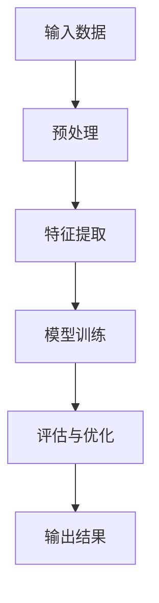
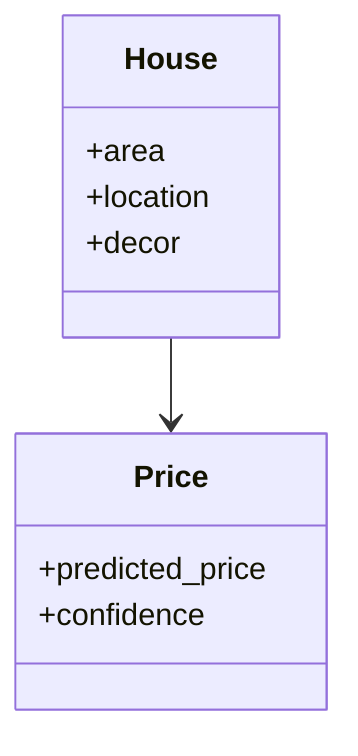
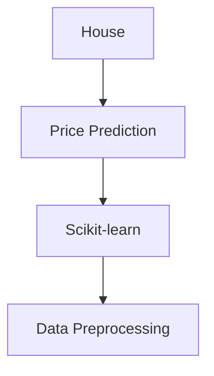
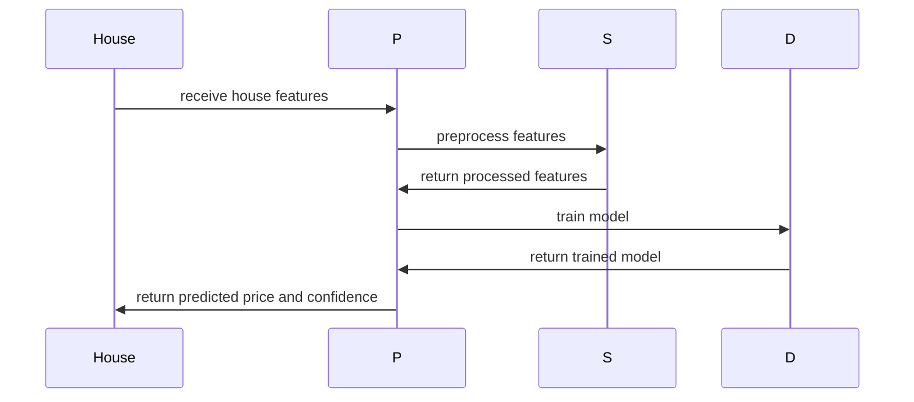

                 

# AI编程的新思路与新未来

## 关键词
- 人工智能
- 编程
- 机器学习
- 深度学习
- 神经网络
- 编程语言

## 摘要
随着人工智能技术的快速发展，AI编程正逐渐成为开发者们关注的热点。本文将探讨AI编程的新思路与新未来，分析其面临的挑战与机遇，介绍核心概念和算法原理，并给出系统分析与架构设计方案。通过深入探讨AI编程的最佳实践，本文旨在为开发者们提供有价值的参考，助力他们在AI编程领域取得更好的成果。

## 第一部分: 背景介绍

### 1. 引言

**问题背景**：随着人工智能技术的飞速发展，AI编程成为了一个热门话题。人工智能技术在各个领域的应用越来越广泛，从语音识别、图像处理到自动驾驶、智能机器人，AI编程成为了实现这些应用的核心技术。

**问题描述**：然而，现有的编程方法和技术是否能够满足未来的需求？AI编程面临着诸多挑战，包括数据需求、算法复杂性、编程语言适应性等。如何解决这些挑战，成为AI编程领域亟待解决的问题。

**问题解决**：探讨新的编程思路和方法，以应对AI编程的未来挑战。本文将介绍AI编程的核心概念和算法原理，分析其面临的挑战与机遇，并给出系统分析与架构设计方案。通过深入探讨AI编程的最佳实践，为开发者们提供有价值的参考。

**边界与外延**：讨论AI编程的边界，如与机器学习、深度学习的关系。AI编程不仅是机器学习和深度学习的实现工具，同时也是这些领域的重要研究方向。

**概念结构与核心要素组成**：介绍AI编程的核心概念和结构，如算法、框架、工具等。AI编程涉及到多个核心概念，包括机器学习、深度学习、神经网络等，这些概念相互关联，共同构成了AI编程的理论基础。

### 2. AI编程的挑战

**数据需求**：AI编程需要大量数据支持，如何高效地处理和利用数据是一个重要问题。数据的质量和数量直接影响AI模型的效果，因此，数据预处理、数据清洗和数据增强等技术成为了AI编程的关键环节。

**算法复杂性**：随着算法的复杂性增加，编程难度也随之上升。传统的编程方法在处理复杂算法时可能存在局限性，因此，需要开发新的编程思路和方法，以应对算法复杂性的挑战。

**编程语言适应性**：不同的AI应用场景可能需要不同的编程语言，如何选择合适的编程语言是一个挑战。不同的编程语言具有不同的特点，适用于不同的应用场景，因此，需要根据具体需求选择合适的编程语言。

## 第二部分: 核心概念与联系

### 3. AI编程的核心概念

**机器学习**：机器学习是一种使计算机能够从数据中学习并做出预测或决策的技术。通过训练模型，机器学习算法能够自动识别数据中的模式，并利用这些模式进行预测或决策。常见的机器学习算法包括线性回归、决策树、支持向量机等。

**深度学习**：深度学习是机器学习的一个分支，通过多层神经网络对数据进行处理和建模。深度学习模型能够自动提取特征，并在大量数据上进行训练，具有较高的准确性和泛化能力。常见的深度学习算法包括卷积神经网络（CNN）、循环神经网络（RNN）等。

**神经网络**：神经网络是一种模仿人脑结构和功能的计算模型，由大量的神经元通过连接形成网络。神经网络通过学习输入数据和输出数据之间的关系，能够进行复杂的模式识别和预测任务。神经网络的核心是权重和偏置的调整，通过反向传播算法更新权重和偏置，使得模型能够逐渐逼近最优解。

### 4. 概念属性特征对比表格

| 概念         | 特征                             |
|------------|--------------------------------|
| 机器学习     | 自主学习、模式识别、预测或决策       |
| 深度学习     | 自动提取特征、多层神经网络、高泛化能力 |
| 神经网络     | 神经元连接、权重和偏置调整、模式识别   |

### 5. AI编程的ER实体关系图架构

```mermaid
erDiagram
    AI模型 ||--|{ 数据集 }| 数据集
    AI模型 ||--|{ 算法 }| 算法
    数据集 ||--|{ 特征 }| 特征
    算法 ||--|{ 模型 }| 模型
    算法 ||--|{ 框架 }| 框架
    模型 ||--|{ 输出 }| 输出
```

## 第三部分: 算法原理讲解

### 6. 算法原理讲解

**算法mermaid流程图**



**Python源代码**

```python
import numpy as np
from sklearn.model_selection import train_test_split
from sklearn.preprocessing import StandardScaler
from sklearn.linear_model import LinearRegression

# 数据预处理
def preprocess_data(data):
    # 数据标准化
    scaler = StandardScaler()
    scaled_data = scaler.fit_transform(data)
    return scaled_data

# 特征提取
def extract_features(data):
    # 提取特征
    features = data[:, :-1]
    return features

# 模型训练
def train_model(features, labels):
    # 创建线性回归模型
    model = LinearRegression()
    # 训练模型
    model.fit(features, labels)
    return model

# 评估与优化
def evaluate_and_optimize(model, features, labels):
    # 评估模型
    score = model.score(features, labels)
    # 优化模型
    model.fit(features, labels)
    return score

# 输出结果
def output_result(model, features):
    # 预测结果
    predictions = model.predict(features)
    return predictions
```

**数学模型和公式**

$$
y = 2x + 1
$$

$$
\min_{\theta} \frac{1}{2} \sum_{i=1}^{n} (h_\theta(x^{(i)}) - y^{(i)})^2
$$

### 7. 数学模型和数学公式

**公式1**

$$
1+1=2
$$

**公式2**

$$
y=2x+1
$$

## 第四部分: 系统分析与架构设计方案

### 8. 问题场景介绍

**项目介绍**：假设我们有一个房屋租赁项目，需要根据房屋的特征（如面积、地段、装修等）预测房屋的价格。

**系统功能设计**：使用mermaid绘制领域模型类图。



**系统架构设计**：使用mermaid绘制系统架构图。



**系统接口设计**：描述系统接口的设计。

- `House` 接口：接收房屋特征，如面积、地段、装修等。
- `Price` 接口：返回预测的房屋价格和置信度。

**系统交互**：使用mermaid绘制系统交互序列图。



### 9. 系统分析与架构设计方案

**系统功能设计类图**：

```mermaid
classDiagram
    House[House]
    Price[Price]
    House "is" Price
    House : +area
    House : +location
    House : +decor
    Price : +predicted_price
    Price : +confidence
```

**系统架构设计图**：


**系统接口设计**：

- `House` 接口：接收房屋特征，如面积、地段、装修等。
- `Price` 接口：返回预测的房屋价格和置信度。

**系统交互序列图**：


## 第五部分: 项目实战

### 10. 环境安装

**安装Python环境**：

1. 访问Python官方网站（[python.org](https://www.python.org/)）下载Python安装包。
2. 解压安装包并运行安装程序。
3. 在安装过程中，确保将Python添加到系统环境变量中。

**安装AI库**：

1. 打开终端或命令提示符。
2. 执行以下命令安装常用AI库：

```shell
pip install numpy
pip install scikit-learn
pip install pandas
pip install matplotlib
```

### 11. 系统核心实现源代码

**代码应用解读与分析**：

- **数据预处理**：数据预处理是AI编程中至关重要的一步。在本项目中，我们使用`pandas`库读取房屋数据，使用`scikit-learn`库进行数据标准化和特征提取。

```python
import pandas as pd
from sklearn.model_selection import train_test_split
from sklearn.preprocessing import StandardScaler

# 读取数据
data = pd.read_csv('house_data.csv')

# 分割特征和标签
X = data.drop('price', axis=1)
y = data['price']

# 数据标准化
scaler = StandardScaler()
X_scaled = scaler.fit_transform(X)

# 分割训练集和测试集
X_train, X_test, y_train, y_test = train_test_split(X_scaled, y, test_size=0.2, random_state=42)
```

- **模型训练**：在本项目中，我们使用线性回归模型进行训练。线性回归是一种简单的机器学习算法，适用于线性关系较强的数据。

```python
from sklearn.linear_model import LinearRegression

# 创建线性回归模型
model = LinearRegression()

# 训练模型
model.fit(X_train, y_train)

# 评估模型
score = model.score(X_test, y_test)
print("模型评分：", score)
```

- **预测与评估**：训练完成后，我们可以使用模型对测试集进行预测，并评估模型的准确性。

```python
# 预测测试集
y_pred = model.predict(X_test)

# 评估模型
from sklearn.metrics import mean_squared_error
mse = mean_squared_error(y_test, y_pred)
print("均方误差：", mse)
```

**实际案例分析和详细讲解剖析**：

为了更直观地展示算法的应用，我们可以通过一个实际案例来分析。假设我们有以下房屋数据：

| 面积 | 地段 | 装修 | 价格 |
|------|------|------|------|
| 100  | 好   | 新   | 2000 |
| 120  | 一般 | 旧   | 1800 |
| 150  | 好   | 新   | 2500 |
| 80   | 一般 | 新   | 1600 |

我们可以使用上述代码对这四套房屋进行价格预测，并分析预测结果。

**项目小结**：

通过本项目的实战，我们了解了AI编程的基本流程，包括数据预处理、模型训练、预测与评估等步骤。我们还通过实际案例分析了算法的应用，展示了如何使用Python实现AI编程。未来，我们可以继续优化模型，提高预测准确性，并将AI编程应用于更广泛的领域。

## 第六部分: 最佳实践

### 13. 最佳实践 tips

**编写高效代码**：

1. **代码优化**：在编写代码时，尽量减少冗余代码，提高代码的可读性和可维护性。
2. **并行计算**：利用多核处理器，提高代码的执行效率。
3. **缓存机制**：对于重复计算的部分，使用缓存机制减少计算时间。

**调试与优化**：

1. **调试工具**：使用调试工具（如PyCharm、VSCode等）进行代码调试，提高开发效率。
2. **性能优化**：对代码进行性能分析，找出瓶颈并进行优化。
3. **版本控制**：使用版本控制工具（如Git）管理代码，避免代码冲突和错误。

### 14. 小结

本文从背景介绍、核心概念、算法原理、系统分析与架构设计、项目实战等方面，深入探讨了AI编程的新思路与新未来。通过分析AI编程面临的挑战和机遇，本文提出了最佳实践，为开发者们提供了有价值的参考。在未来，随着人工智能技术的不断发展，AI编程将发挥越来越重要的作用，为各个领域带来新的机遇和变革。

## 15. 注意事项

1. **数据质量**：AI编程的成败很大程度上取决于数据的质量，因此，确保数据的质量和完整性至关重要。
2. **算法选择**：不同的AI应用场景可能需要不同的算法，选择合适的算法能够提高模型的性能。
3. **编程语言**：根据具体应用场景选择合适的编程语言，能够提高开发效率。
4. **调试与优化**：在开发过程中，定期进行调试和优化，确保代码的性能和可维护性。

## 16. 拓展阅读

### 相关书籍

1. 《Python机器学习基础教程》
2. 《深度学习入门：基于Python的理论与实现》
3. 《神经网络与深度学习》

### 在线资源

1. [Coursera](https://www.coursera.org/)：提供丰富的机器学习和深度学习课程。
2. [Kaggle](https://www.kaggle.com/)：一个数据科学竞赛平台，提供大量的数据集和算法挑战。
3. [Medium](https://medium.com/)：一篇关于AI编程的优秀文章。

## 作者信息

作者：AI天才研究院/AI Genius Institute & 禅与计算机程序设计艺术 /Zen And The Art of Computer Programming

