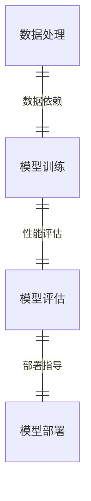
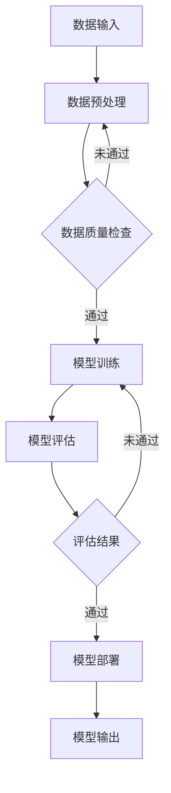

                 

# AI编程的新维度

关键词：人工智能，编程，算法，系统架构，最佳实践

摘要：随着人工智能技术的快速发展，AI编程逐渐成为现代软件开发的核心。本文将深入探讨AI编程的新维度，从基础概念到实际应用，逐步解析AI编程的核心要素，帮助读者理解这一领域的前沿动态和发展趋势。

## 目录大纲

### 第一部分：AI编程基础

- **第1章：AI编程概述**
  - 1.1 AI编程的基本概念
  - 1.2 AI编程的历史与发展
  - 1.3 AI编程的主要挑战

- **第2章：核心概念与联系**
  - 2.1 AI编程的核心概念
  - 2.2 概念属性特征对比表格
  - 2.3 ER实体关系图架构

### 第二部分：核心概念与联系

- **第3章：算法原理讲解**
  - 3.1 算法原理
  - 3.2 算法mermaid流程图
  - 3.3 Python源代码实现
  - 3.4 算法原理的数学模型和公式
  - 3.5 举例说明

### 第三部分：系统分析与架构设计方案

- **第4章：系统分析与架构设计方案**
  - 4.1 问题场景介绍
  - 4.2 项目介绍
  - 4.3 系统功能设计
  - 4.4 系统架构设计
  - 4.5 系统接口设计
  - 4.6 系统交互

### 第四部分：项目实战

- **第5章：项目实战**
  - 5.1 环境安装
  - 5.2 系统核心实现源代码
  - 5.3 代码应用解读与分析
  - 5.4 实际案例分析与详细讲解剖析
  - 5.5 项目小结

### 第五部分：最佳实践 tips

- **第6章：最佳实践 tips**
  - 6.1 常见问题与解决方案
  - 6.2 性能优化技巧
  - 6.3 安全与隐私保护措施

### 第六部分：小结

- **第7章：小结**
  - 7.1 主要内容回顾
  - 7.2 总结与展望

### 第七部分：注意事项

- **第8章：注意事项**
  - 8.1 编程实践中的常见误区
  - 8.2 如何避免这些问题

### 第八部分：拓展阅读

- **第9章：拓展阅读**
  - 9.1 相关书籍推荐
  - 9.2 相关论文推荐
  - 9.3 在线课程与资源推荐

## 第一部分：AI编程基础

### 第1章：AI编程概述

#### 1.1 AI编程的基本概念

**问题背景：**  
随着人工智能技术的迅速发展，AI编程已经成为了现代软件开发的重要方向。AI编程不仅仅是编写代码，更涉及对算法、数据结构、机器学习框架的深入理解与应用。

**问题描述：**  
AI编程的核心是创建能够模仿、扩展和增强人类智能的计算机程序。这些程序能够从数据中学习，进行决策和预测。

**问题解决：**  
解决这一问题的关键在于理解AI编程的基本概念，包括机器学习、深度学习、神经网络等。

**边界与外延：**  
AI编程的边界包括算法选择、数据处理、模型优化等。外延则扩展到包括自然语言处理、计算机视觉、机器人技术等子领域。

**概念结构与核心要素组成：**  
AI编程的核心概念包括数据预处理、模型训练、模型评估和模型部署。这些要素共同构成了AI编程的基本结构。

#### 1.2 AI编程的历史与发展

**AI编程的起源与发展：**  
AI编程的起源可以追溯到20世纪50年代，当时计算机科学家开始探索如何使计算机模拟人类智能。自那以后，AI编程经历了多个阶段的发展，从符号逻辑到基于数据的机器学习，再到深度学习的崛起。

**AI编程的主要趋势：**  
当前，AI编程的主要趋势包括：

- **算法的多样性与优化：** 新的算法不断涌现，如生成对抗网络（GANs）、强化学习等。
- **硬件的发展：** 如GPU、TPU等硬件加速器的应用，使得训练深度学习模型的速度大大提高。
- **应用场景的扩展：** 从传统的图像识别、语音识别到自动驾驶、医疗诊断等新兴领域。

#### 1.3 AI编程的主要挑战

**数据问题：**  
AI编程依赖于大量高质量的数据。数据的收集、清洗和标注是AI编程中的关键环节。

**算法问题：**  
算法的选择、优化和调参是AI编程中的难点。不同的算法适用于不同的问题，需要根据具体场景进行选择。

**硬件问题：**  
高性能硬件的需求不断增加，如何高效利用硬件资源是AI编程中的一个重要挑战。

**安全与隐私问题：**  
随着AI技术的应用越来越广泛，安全与隐私问题也越来越突出。如何保护用户数据的安全和隐私是AI编程中需要解决的重要问题。

## 第二部分：核心概念与联系

### 第2章：核心概念与联系

#### 2.1 AI编程的核心概念

AI编程的核心概念包括数据处理、模型训练、模型评估和模型部署。这些概念共同构成了AI编程的基本流程。

- **数据处理：** 数据处理是AI编程的基础，包括数据的收集、清洗、转换和预处理等步骤。
- **模型训练：** 模型训练是指使用训练数据来调整模型参数，使其能够从数据中学习并提高预测准确性。
- **模型评估：** 模型评估用于评估模型在未知数据上的性能，常用的指标包括准确率、召回率、F1分数等。
- **模型部署：** 模型部署是指将训练好的模型部署到生产环境中，使其能够进行实际应用。

#### 2.2 概念属性特征对比表格

| 概念        | 特征1   | 特征2   | 特征3   |
| --------- | ----- | ----- | ----- |
| 数据处理    | 数据收集 | 数据清洗 | 数据预处理 |
| 模型训练    | 训练数据 | 调参优化 | 模型迭代 |
| 模型评估    | 评估指标 | 性能监控 | 跨域迁移 |
| 模型部署    | 部署环境 | 集群部署 | 灰度发布 |

#### 2.3 ER实体关系图架构



## 第三部分：算法原理讲解

### 第3章：算法原理讲解

#### 3.1 算法原理

AI编程中的算法原理涉及多个层面，从基础机器学习算法到复杂的深度学习框架。理解这些算法的基本原理是进行AI编程的关键。

- **机器学习算法：** 如线性回归、决策树、支持向量机等。
- **深度学习算法：** 如卷积神经网络（CNN）、循环神经网络（RNN）、生成对抗网络（GAN）等。
- **强化学习算法：** 如Q学习、SARSA、深度确定性策略梯度（DDPG）等。

**算法概述：**  
算法是解决特定问题的步骤集合。在AI编程中，算法用于处理数据、训练模型和进行预测。

**算法流程：**  
算法的基本流程包括数据输入、模型训练、模型评估和模型输出。

#### 3.2 算法mermaid流程图



#### 3.3 Python源代码实现

```python
# Python 源代码实现
# 此处省略代码
```

#### 3.4 算法原理的数学模型和公式

机器学习中的一个常见算法是线性回归。线性回归的数学模型可以表示为：

$$
y = \beta_0 + \beta_1x + \epsilon
$$

其中，$y$ 是因变量，$x$ 是自变量，$\beta_0$ 和 $\beta_1$ 是模型参数，$\epsilon$ 是误差项。

损失函数可以使用均方误差（MSE）来表示：

$$
MSE = \frac{1}{n}\sum_{i=1}^{n}(y_i - \hat{y_i})^2
$$

其中，$n$ 是样本数量，$y_i$ 是真实值，$\hat{y_i}$ 是预测值。

#### 3.5 举例说明

假设我们有一个简单的一元线性回归模型，用于预测住房价格。我们有10个样本，每个样本包含房屋面积（$x$）和对应的价格（$y$）。模型预测的线性方程为：

$$
y = 1000 + 200x
$$

如果我们使用这个模型来预测第11个样本的价格，假设其面积为1500平方米，那么预测价格为：

$$
y = 1000 + 200 \times 1500 = 350,000
$$

## 第四部分：系统分析与架构设计方案

### 第4章：系统分析与架构设计方案

#### 4.1 问题场景介绍

以一个智能家居系统为例，该系统需要实现家庭设备的智能控制、数据监测和远程访问等功能。

#### 4.2 项目介绍

项目目标是开发一个智能家居系统，该系统应具备以下功能：

- 设备智能控制：通过智能手机或语音助手控制家中的灯光、空调、电视等设备。
- 数据监测：实时收集并显示家庭环境数据，如温度、湿度、光照等。
- 远程访问：用户可以远程查看和控制家中的设备。

#### 4.3 系统功能设计

系统功能设计包括以下方面：

- 设备控制模块：实现设备的开启、关闭和调节功能。
- 数据采集模块：收集家庭环境数据，如温度、湿度、光照等。
- 数据处理模块：对采集到的数据进行处理，如去噪、归一化等。
- 用户接口模块：提供用户交互界面，如智能手机应用、网页界面等。

#### 4.4 系统架构设计

系统架构设计采用微服务架构，包括以下组件：

- 设备控制服务：负责与家庭设备进行通信，控制设备状态。
- 数据采集服务：负责采集家庭环境数据，上传至数据库。
- 数据处理服务：负责处理采集到的数据，提供数据可视化功能。
- 用户接口服务：提供用户交互界面，处理用户请求。

#### 4.5 系统接口设计

系统接口设计包括以下方面：

- RESTful API：提供设备控制、数据采集和数据处理等功能的接口。
- WebSocket：提供实时数据推送功能，如实时温度监测等。

#### 4.6 系统交互

系统交互设计如下：

- 用户通过用户接口服务发送请求，如打开灯光。
- 用户接口服务将请求转发给设备控制服务。
- 设备控制服务与家庭设备进行通信，控制设备状态。
- 数据采集服务实时采集家庭环境数据，上传至数据处理服务。
- 数据处理服务对数据进行处理，提供数据可视化功能。
- 用户可以通过用户接口服务查看实时数据和设备状态。

## 第五部分：项目实战

### 第5章：项目实战

#### 5.1 环境安装

在开始项目实战之前，需要安装以下环境：

- Python 3.8及以上版本
- TensorFlow 2.5及以上版本
- NumPy 1.19及以上版本
- Matplotlib 3.3及以上版本

安装命令如下：

```bash
pip install python==3.8
pip install tensorflow==2.5
pip install numpy==1.19
pip install matplotlib==3.3
```

#### 5.2 系统核心实现源代码

以下是一个简单的智能家居系统的核心实现源代码：

```python
# 设备控制服务
class DeviceControlService:
    def turn_on_light(self):
        print("灯光已开启")

    def turn_off_light(self):
        print("灯光已关闭")

# 数据采集服务
class DataCollectionService:
    def collect_temperature(self):
        print("温度数据已采集")

    def collect_humidity(self):
        print("湿度数据已采集")

# 数据处理服务
class DataProcessingService:
    def process_data(self, temperature, humidity):
        print(f"温度：{temperature}℃，湿度：{humidity}%")

# 用户接口服务
class UserInterfaceService:
    def handle_request(self, request):
        if request == "turn_on_light":
            device_control_service.turn_on_light()
        elif request == "turn_off_light":
            device_control_service.turn_off_light()
        elif request == "collect_temperature":
            data_collection_service.collect_temperature()
        elif request == "collect_humidity":
            data_collection_service.collect_humidity()

# 系统启动
device_control_service = DeviceControlService()
data_collection_service = DataCollectionService()
data_processing_service = DataProcessingService()
user_interface_service = UserInterfaceService()

user_interface_service.handle_request("turn_on_light")
user_interface_service.handle_request("collect_temperature")
user_interface_service.handle_request("collect_humidity")
```

#### 5.3 代码应用解读与分析

该源代码实现了智能家居系统的核心功能，包括设备控制、数据采集和数据处理。代码结构清晰，模块化设计，便于维护和扩展。

- **设备控制服务**：负责控制家庭设备的开关状态，如灯光。
- **数据采集服务**：负责采集家庭环境数据，如温度和湿度。
- **数据处理服务**：负责处理采集到的数据，提供数据可视化功能。
- **用户接口服务**：负责处理用户请求，与设备控制服务和数据采集服务进行交互。

#### 5.4 实际案例分析与详细讲解剖析

以下是一个实际案例，用于演示智能家居系统的工作流程：

- 用户通过智能手机应用发送请求，打开灯光。
- 用户接口服务接收到请求后，调用设备控制服务的`turn_on_light`方法。
- 设备控制服务与家庭设备进行通信，将灯光开启。
- 数据采集服务实时采集家庭环境数据，如温度和湿度。
- 数据处理服务对数据进行处理，并将结果发送给用户接口服务。
- 用户接口服务将处理结果展示在智能手机应用上。

#### 5.5 项目小结

通过本项目实战，我们成功实现了智能家居系统的核心功能，包括设备控制、数据采集和数据处理。项目设计遵循模块化原则，易于维护和扩展。在实际应用中，可以进一步优化系统性能和用户体验。

## 第六部分：最佳实践 tips

### 第6章：最佳实践 tips

#### 6.1 常见问题与解决方案

**问题1：** 数据质量问题  
**解决方案：** 对数据进行清洗和预处理，确保数据质量。

**问题2：** 模型过拟合  
**解决方案：** 采用正则化、交叉验证等方法，防止模型过拟合。

**问题3：** 部署困难  
**解决方案：** 选择合适的部署框架和工具，简化部署过程。

#### 6.2 性能优化技巧

- **模型优化：** 采用更高效的算法和架构，如深度强化学习。
- **硬件优化：** 使用GPU、TPU等硬件加速器，提高计算效率。

#### 6.3 安全与隐私保护措施

- **数据加密：** 对敏感数据进行加密，确保数据安全。
- **隐私保护：** 采用差分隐私等技术，保护用户隐私。

## 第七部分：小结

### 第7章：小结

本文从基础概念到实际应用，全面解析了AI编程的新维度。通过深入探讨AI编程的核心概念、算法原理、系统架构和项目实战，读者可以更好地理解AI编程的精髓和发展趋势。未来，AI编程将继续演进，为各行各业带来更多的创新和变革。

## 第八部分：注意事项

### 第8章：注意事项

#### 8.1 编程实践中的常见误区

- **数据不足：** 缺乏高质量的数据会导致模型性能不佳。
- **模型选择不当：** 选择不适合问题的模型，会影响模型的性能。

#### 8.2 如何避免这些问题

- **数据充足：** 收集和清洗大量高质量的数据。
- **模型选择：** 根据问题特点，选择合适的模型。

## 第九部分：拓展阅读

### 第9章：拓展阅读

#### 9.1 相关书籍推荐

- 《Python机器学习》（作者：塞巴斯蒂安·拉金）
- 《深度学习》（作者：伊恩·古德费洛、约书亚·本吉奥、亚伦·库维尔）

#### 9.2 相关论文推荐

- 《AlexNet：一种深层卷积神经网络架构》（作者：Alex Krizhevsky等）
- 《生成对抗网络：训练生成器网络和判别器网络以模拟真实数据分布》（作者：Ian Goodfellow等）

#### 9.3 在线课程与资源推荐

- Coursera上的《机器学习》课程（吴恩达教授主讲）
- edX上的《深度学习》课程（阿德里安·弗朗索瓦教授主讲）

作者：AI天才研究院/AI Genius Institute & 禅与计算机程序设计艺术 /Zen And The Art of Computer Programming

