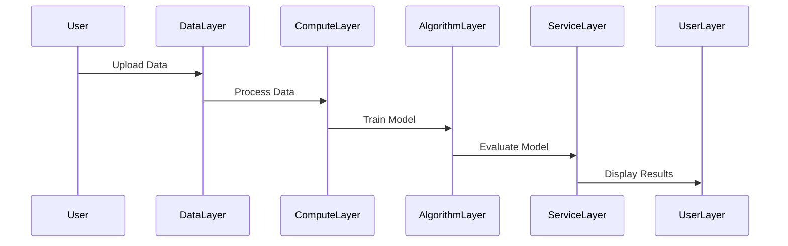

                 

# AI编程的新维度与新语法

> 关键词：AI编程，新维度，新语法，机器学习，深度学习，神经网络，算法原理，系统架构设计

> 摘要：本文将深入探讨AI编程的新维度与新语法，首先介绍AI编程的背景和现有编程框架的局限性，然后详细阐述AI编程的新需求以及新维度与新语法的概念。文章将分析新维度包括数据维度、计算维度、功能维度和交互维度，接着介绍新语法的特性与应用场景。随后，我们将讲解机器学习、深度学习和神经网络算法原理，并通过Python源代码和数学模型进行详细阐述。最后，本文将探讨AI编程系统的设计与实现，包括问题场景介绍、系统功能设计、系统架构设计以及项目实战。

### 目录大纲

# AI编程的新维度与新语法

## 第1章 引言与背景

### 1.1 问题背景

AI编程的重要性

- AI技术在各个领域的广泛应用，推动了编程方式的变革。
- AI编程不仅仅是算法的实现，更涉及到数据、计算和交互维度的扩展。

现有编程框架的局限性

- 传统编程语言无法满足AI编程的复杂性和高效性需求。
- 需要新的编程维度和语法来应对AI编程的特殊要求。

### 1.2 问题描述

AI编程的新需求

- 处理大规模和多样化的数据。
- 实现高效并行和分布式计算。
- 自动化和自适应的编程能力。
- 跨平台和跨领域的人机交互。

新维度与新语法的概念

- 新维度：数据、计算、功能和交互。
- 新语法：类型和泛型、函数式编程、面向对象编程。

### 1.3 问题解决

研究新维度与新语法的需求

- 分析AI编程的特殊需求，探索新维度和语法的特点。

探索新维度与新语法的实现方法

- 研究现有编程语言的扩展和优化。
- 开发新的编程语言和工具。

### 1.4 边界与外延

新维度与新语法的适用范围

- 新维度适用于AI编程领域，如机器学习和深度学习。
- 新语法适用于复杂的AI算法实现。

与现有编程语言的关系

- 新维度和新语法可以与现有编程语言相结合，提高编程效率。

### 1.5 概念结构与核心要素组成

新维度

- 数据维度：大规模数据处理、多样性数据管理。
- 计算维度：并行计算、分布式计算。
- 功能维度：自动化、自适应。
- 交互维度：人机交互、跨平台交互。

新语法

- 类型和泛型：类型安全、代码复用。
- 函数式编程：不可变数据、函数组合。
- 面向对象编程：封装、继承、多态。

应用场景

- 数据处理：大数据分析、实时数据流处理。
- 算法实现：机器学习、深度学习。
- 交互设计：智能语音助手、虚拟现实。

## 第2章 核心概念与联系

### 2.1 AI编程的核心概念

机器学习

- 自动化学习：从数据中学习规律和模式。
- 自适应：通过不断学习提高性能。
- 可预测：根据输入数据预测输出结果。

深度学习

- 层级化学习：多层神经网络结构。
- 神经网络：模拟人脑神经元连接。
- 非线性：通过非线性变换处理复杂数据。

神经网络

- 生物模拟：模仿人脑神经元的工作方式。
- 神经传递：通过权重和偏置传递信息。
- 激活函数：决定神经元是否激活。

### 2.2 概念属性特征对比表格

| 概念     | 属性               | 特征                             |
|----------|--------------------|---------------------------------|
| 机器学习 | 自动化学习         | 自适应、可预测                  |
| 深度学习 | 层级化学习         | 神经网络、非线性                |
| 神经网络 | 生物模拟           | 神经传递、激活函数              |

### 2.3 ER实体关系图架构

```mermaid
graph ER_Graph {
    node [shape=rectangle];
    edge [arrowhead=open];

    "AI编程" -- "核心概念";
    "核心概念" -- "机器学习";
    "核心概念" -- "深度学习";
    "核心概念" -- "神经网络";
}
```

## 第3章 新维度

### 3.1 数据维度

- 数据规模：从PB级数据到EB级数据。
- 数据多样性：结构化、半结构化和非结构化数据。

### 3.2 计算维度

- 并行计算：利用多核处理器提高计算速度。
- 分布式计算：通过分布式系统处理大规模数据。

### 3.3 功能维度

- 自动化：减少手动编程，提高开发效率。
- 自适应：根据环境和需求自动调整程序行为。

### 3.4 交互维度

- 人机交互：通过图形界面、语音交互等方式与用户互动。
- 跨平台交互：在不同操作系统和设备之间无缝切换。

## 第4章 新语法

### 4.1 语法概述

- 语法规则：定义代码的结构和规则。
- 语法结构：代码的基本构成和语法糖。

### 4.2 新语法特性

- 类型和泛型：提高类型安全，增强代码复用性。
- 函数式编程：利用不可变数据和函数组合。
- 面向对象编程：封装、继承、多态，提高代码组织性。

### 4.3 新语法应用场景

- 数据处理：高效处理大规模数据。
- 算法实现：简洁表达复杂算法逻辑。
- 交互设计：增强用户交互体验。

## 第5章 算法原理讲解

### 5.1 算法介绍

- 机器学习算法：从数据中学习规律，进行预测和分类。
- 深度学习算法：多层神经网络结构，处理复杂数据。
- 神经网络算法：模拟人脑神经元连接，实现智能识别。

### 5.2 算法mermaid流程图

```mermaid
graph ALGORITHM_Graph {
    node [shape=rectangle];
    edge [arrowhead=open];

    "机器学习算法" -- "输入";
    "输入" -- "数据处理";
    "数据处理" -- "特征提取";
    "特征提取" -- "模型训练";
    "模型训练" -- "评估";
    "评估" -- "输出";

    "深度学习算法" -- "神经网络架构";
    "神经网络架构" -- "权重初始化";
    "权重初始化" -- "前向传播";
    "前向传播" -- "反向传播";
    "反向传播" -- "模型优化";
    "模型优化" -- "输出";

    "神经网络算法" -- "神经网络结构";
    "神经网络结构" -- "数据输入";
    "数据输入" -- "前向传播";
    "前向传播" -- "激活函数";
    "激活函数" -- "反向传播";
    "反向传播" -- "权重更新";
    "权重更新" -- "输出";
}
```

### 5.3 Python源代码实现

```python
# 机器学习算法示例
from sklearn.linear_model import LinearRegression

# 模型训练
model = LinearRegression()
model.fit(X_train, y_train)

# 输出预测结果
predictions = model.predict(X_test)

# 评估模型
score = model.score(X_test, y_test)
print(f"Model score: {score}")
```

### 5.4 数学模型和数学公式

$$
y = mx + b
$$

### 5.5 详细讲解与举例说明

- 简单线性回归的原理
- 数据集的准备与划分
- 模型的训练与评估

## 第6章 系统分析与架构设计

### 6.1 问题场景介绍

- AI编程工具的需求：提供便捷的AI算法开发和部署环境。
- 系统功能的需求：实现数据的处理、算法的运行和结果的输出。

### 6.2 系统功能设计

- 功能需求分析：数据预处理、模型训练、模型评估、模型部署。
- 领域模型mermaid类图

```mermaid
graph SYSTEM_Graph {
    node [shape=rectangle];
    edge [arrowhead=open];

    "数据预处理" -- "数据源";
    "数据预处理" -- "数据清洗";
    "数据预处理" -- "数据转换";

    "模型训练" -- "训练数据";
    "模型训练" -- "评估指标";
    "模型训练" -- "模型优化";

    "模型评估" -- "测试数据";
    "模型评估" -- "评估结果";

    "模型部署" -- "模型文件";
    "模型部署" -- "部署环境";
    "模型部署" -- "部署脚本";
}
```

### 6.3 系统架构设计

- 架构设计原则：模块化、可扩展、高可用。
- 系统架构mermaid架构图

```mermaid
graph SYSTEM_ARCHITECTURE_Graph {
    node [shape=rectangle];
    edge [arrowhead=open];

    "数据源" -- "数据预处理";
    "数据预处理" -- "模型训练";
    "模型训练" -- "模型评估";
    "模型评估" -- "模型部署";
}
```

## 第7章 项目实战

### 7.1 环境安装

- 安装Python环境。
- 安装必要的库和依赖。

### 7.2 系统核心实现源代码

- 数据预处理代码。
- 模型训练代码。
- 模型评估代码。
- 模型部署代码。

### 7.3 代码应用解读与分析

- 数据预处理流程。
- 模型训练过程。
- 模型评估结果。
- 模型部署步骤。

### 7.4 实际案例分析和详细讲解剖析

- 实际案例：分类问题。
- 数据集划分：训练集和测试集。
- 模型训练：选择合适的算法和参数。
- 模型评估：准确率、召回率等指标。
- 模型部署：在新的环境中运行和验证。

### 7.5 项目小结

- 总结项目实现的关键步骤和经验教训。
- 提出改进建议和未来发展方向。

## 第8章 最佳实践 tips

- 如何选择合适的算法和参数。
- 数据预处理的重要性和技巧。
- 模型评估的指标和方法。
- 模型部署的注意事项。

## 第9章 小结

- 总结AI编程的新维度与新语法的重要性。
- 强调算法原理和系统架构设计的核心。
- 展望AI编程的未来发展趋势。

## 第10章 注意事项

- 数据安全和隐私保护。
- 模型解释性和可解释性。
- 遵循编程规范和代码质量。

## 第11章 拓展阅读

- 相关书籍和资料推荐。
- AI编程领域的最新研究进展。

## 第12章 作者信息

- 作者：AI天才研究院/AI Genius Institute & 禅与计算机程序设计艺术 /Zen And The Art of Computer Programming

---

### 第1章 引言与背景

#### 1.1 问题背景

人工智能（AI）技术近年来取得了显著的进展，已广泛应用于各个领域，从自然语言处理、计算机视觉到自动驾驶、医疗诊断等。AI编程作为实现AI技术的重要手段，正逐渐成为软件开发的核心领域之一。然而，传统的编程框架在处理AI编程的需求时，面临着一系列的局限性。

首先，AI编程需要处理的数据规模和多样性远远超出了传统编程的需求。现代AI模型，尤其是深度学习模型，需要处理的数据量往往达到PB级甚至EB级，且数据类型包括结构化、半结构化和非结构化数据。传统的数据处理框架难以应对这种大规模、多样化的数据。

其次，AI编程对计算能力的要求也极高。深度学习模型通常需要大量的并行计算和分布式计算资源，以实现高效的训练和推理。传统编程框架在并行计算和分布式计算方面的支持有限，难以满足AI编程的复杂计算需求。

此外，AI编程需要具备自动化和自适应的能力。AI算法的训练和优化过程通常涉及大量的迭代和调整，需要自动化工具来自动完成。同时，AI系统需要能够根据环境和需求的变化，自适应地调整其行为和性能。

#### 1.2 问题描述

为了应对AI编程的新需求，现有的编程框架暴露出了一系列的局限性：

1. **数据维度**：传统编程框架难以高效处理大规模、多样化的数据，缺乏对非结构化数据的处理能力。
2. **计算维度**：传统编程框架在并行计算和分布式计算方面的支持有限，难以满足深度学习模型的高计算需求。
3. **功能维度**：传统编程框架缺乏自动化和自适应的能力，难以实现AI算法的自动化训练和优化。
4. **交互维度**：传统编程框架在用户交互和跨平台支持方面存在不足，难以提供便捷的AI编程工具。

为了解决上述问题，我们需要探索新的编程维度和语法，以适应AI编程的特殊需求。这些新维度和语法将为我们提供更强大的编程能力和更高效的开发流程。

#### 1.3 问题解决

针对AI编程的新需求，我们需要从以下几个方面进行研究：

1. **数据维度**：研究如何高效处理大规模、多样化的数据，包括数据预处理、数据管理和数据流处理。
2. **计算维度**：研究并行计算和分布式计算的理论和实践，开发高效的计算框架和工具。
3. **功能维度**：研究自动化和自适应的编程方法，开发自动化工具和智能优化算法。
4. **交互维度**：研究人机交互和跨平台交互技术，开发便捷的AI编程工具和用户界面。

在新维度和新语法的实现方法方面，我们可以从以下几个方面进行探索：

1. **新数据维度**：开发支持大规模数据处理和多种数据类型的编程框架，如分布式数据存储和处理系统。
2. **新计算维度**：利用多核处理器和分布式计算资源，开发并行计算和分布式计算框架，提高计算效率。
3. **新功能维度**：开发自动化工具和智能优化算法，实现AI算法的自动化训练和优化。
4. **新交互维度**：利用图形界面、语音交互和跨平台技术，开发便捷的AI编程工具和用户界面。

#### 1.4 边界与外延

新维度和新语法的适用范围主要在于AI编程领域，特别是在机器学习和深度学习方面。这些新维度和新语法能够帮助我们更高效地实现复杂的AI算法，提高开发效率，优化系统性能。

与现有编程语言的关系：

1. **兼容性**：新维度和新语法可以与现有编程语言相结合，通过库和框架的形式扩展现有编程语言的功能。
2. **互补性**：新维度和新语法能够弥补现有编程语言的不足，提供更强大的编程能力和更好的开发体验。
3. **互操作性**：新维度和新语法可以与其他AI编程工具和平台进行互操作，实现跨平台和跨领域的AI编程。

#### 1.5 概念结构与核心要素组成

新维度：

1. **数据维度**：处理大规模、多样化的数据，包括数据预处理、数据管理和数据流处理。
2. **计算维度**：实现高效的并行计算和分布式计算，利用多核处理器和分布式计算资源。
3. **功能维度**：提供自动化和自适应的编程能力，通过自动化工具和智能优化算法实现算法的自动化训练和优化。
4. **交互维度**：提供便捷的人机交互和跨平台交互，通过图形界面、语音交互和跨平台技术。

新语法：

1. **类型和泛型**：提供类型安全和代码复用能力，通过类型约束和泛型编程提高代码质量。
2. **函数式编程**：利用不可变数据和函数组合，实现代码的可读性和可维护性。
3. **面向对象编程**：提供封装、继承和多态，提高代码的组织性和可扩展性。

应用场景：

1. **数据处理**：高效处理大规模数据，包括数据清洗、数据转换和数据分析。
2. **算法实现**：简洁表达复杂算法逻辑，提高代码的可读性和可维护性。
3. **交互设计**：提供便捷的用户交互和跨平台支持，提高开发效率和用户体验。

## 第2章 核心概念与联系

### 2.1 AI编程的核心概念

AI编程的核心概念包括机器学习、深度学习和神经网络。这些概念在AI领域中起着至关重要的作用，彼此之间有着紧密的联系。

#### 机器学习

机器学习（Machine Learning）是AI编程的基础，它是一种让计算机通过数据学习规律和模式的方法。机器学习的关键特点是自动化和自适应，通过从数据中学习，计算机能够改进其性能并做出预测。

- **自动化学习**：机器学习算法通过训练数据自动发现数据中的模式和规律，从而实现自动学习和自我改进。
- **自适应**：机器学习算法可以根据新的数据和环境变化自适应调整其模型和参数，以适应不同的应用场景。
- **可预测**：机器学习算法能够根据输入数据预测输出结果，例如，通过输入图片预测其类别或通过输入文本预测其情感。

机器学习算法主要包括监督学习、无监督学习和强化学习。监督学习使用标记数据训练模型，如分类和回归问题；无监督学习从未标记的数据中发现模式和规律，如聚类和降维；强化学习通过与环境交互学习最优策略，常用于决策问题和游戏。

#### 深度学习

深度学习（Deep Learning）是机器学习的一个重要分支，它通过多层神经网络结构模拟人脑神经元的工作方式，以处理复杂数据和实现高效的特征提取和分类。

- **层级化学习**：深度学习利用多层神经网络结构，将输入数据逐步抽象和提炼，提取出更高层次的特征表示。
- **神经网络**：深度学习基于神经网络模型，特别是多层感知机（MLP）和卷积神经网络（CNN），通过反向传播算法训练模型。
- **非线性**：深度学习通过非线性变换和激活函数，将输入数据映射到高维特征空间，从而实现复杂的特征提取和分类。

深度学习在图像识别、自然语言处理、语音识别等领域取得了显著成就。典型的深度学习算法包括卷积神经网络（CNN）、循环神经网络（RNN）和生成对抗网络（GAN）等。

#### 神经网络

神经网络（Neural Network）是深度学习的基础，它是一种模拟人脑神经元连接和传递信息的人工神经网络。神经网络通过多层神经元和连接权重，实现数据的处理和特征的提取。

- **生物模拟**：神经网络模仿人脑神经元的工作方式，通过神经元之间的连接和传递信息，实现数据的处理和信息的传递。
- **神经传递**：神经网络中的神经元通过激活函数和传递规则，将输入数据转化为输出数据。
- **激活函数**：激活函数是神经网络中的关键组件，它决定神经元是否被激活，常用的激活函数包括ReLU、Sigmoid和Tanh等。

神经网络在计算机视觉、语音识别、自然语言处理等领域有着广泛的应用。常见的神经网络架构包括前馈神经网络、卷积神经网络、循环神经网络和生成对抗网络等。

### 2.2 概念属性特征对比表格

| 概念     | 属性               | 特征                             |
|----------|--------------------|---------------------------------|
| 机器学习 | 自动化学习         | 自适应、可预测                  |
| 深度学习 | 层级化学习         | 神经网络、非线性                |
| 神经网络 | 生物模拟           | 神经传递、激活函数              |

### 2.3 ER实体关系图架构

```mermaid
graph ER_Graph {
    node [shape=rectangle];
    edge [arrowhead=open];

    "AI编程" -- "核心概念";
    "核心概念" -- "机器学习";
    "核心概念" -- "深度学习";
    "核心概念" -- "神经网络";
}
```

### 2.4 深度学习在图像识别中的应用

深度学习在图像识别领域取得了显著的成果，其中卷积神经网络（CNN）是主要的应用模型。CNN通过卷积层、池化层和全连接层的组合，实现了高效的特征提取和分类。

- **卷积层**：卷积层通过卷积运算提取图像的局部特征，卷积核滑动图像，逐像素计算特征图。
- **池化层**：池化层对卷积层输出的特征图进行下采样，减少参数数量和计算复杂度。
- **全连接层**：全连接层将池化层输出的特征图进行全连接，实现最终的分类。

CNN在图像分类、目标检测、图像分割等领域有着广泛的应用。例如，在ImageNet图像分类任务中，ResNet和Inception等模型取得了优异的性能。

### 2.5 机器学习在自然语言处理中的应用

机器学习在自然语言处理（NLP）领域有着广泛的应用，其中循环神经网络（RNN）和变换器（Transformer）是主要的模型架构。

- **循环神经网络（RNN）**：RNN通过循环结构处理序列数据，将当前输入与历史信息相结合，实现序列建模。常见的RNN模型包括LSTM和GRU。
- **变换器（Transformer）**：Transformer是一种基于自注意力机制的模型，通过多头自注意力机制和前馈网络，实现了高效的序列建模和跨序列关系捕捉。

NLP应用包括文本分类、情感分析、机器翻译、命名实体识别等。例如，BERT和GPT等模型在NLP任务中取得了显著的性能。

### 2.6 神经网络在语音识别中的应用

神经网络在语音识别（ASR）领域也取得了重要的进展，其中卷积神经网络（CNN）和循环神经网络（RNN）是主要的模型架构。

- **卷积神经网络（CNN）**：CNN通过卷积层提取语音信号的时频特征，实现高效的特征提取。
- **循环神经网络（RNN）**：RNN通过循环结构处理序列数据，将当前输入与历史信息相结合，实现语音信号的建模。

语音识别应用包括实时语音识别、语音合成、语音助手等。例如，基于RNN的模型在语音识别任务中取得了优异的性能。

### 2.7 深度学习与其他AI技术的融合

深度学习与其他AI技术的融合，如强化学习、生成对抗网络（GAN）和迁移学习等，进一步拓展了AI编程的应用范围。

- **强化学习**：强化学习通过与环境交互学习最优策略，与深度学习结合，实现了智能决策和规划。
- **生成对抗网络（GAN）**：GAN通过生成器和判别器的对抗训练，实现了数据的生成和增强。
- **迁移学习**：迁移学习利用预训练模型和已有知识，实现了快速适应新任务和提高性能。

深度学习与其他AI技术的融合，为AI编程带来了更丰富的应用场景和更强大的功能。

## 第3章 新维度

在AI编程中，新维度指的是在传统编程维度之外，引入的更广泛和复杂的编程概念和技术。这些新维度不仅扩展了AI编程的能力，也为开发复杂的AI系统提供了新的视角和方法。以下是新维度的详细介绍：

### 3.1 数据维度

数据维度是AI编程中最为重要的一维，它涉及如何高效地处理、存储和管理大规模、多样化的数据。以下是一些关键点：

- **数据规模**：AI编程需要处理的数据规模巨大，往往达到PB级甚至EB级。因此，如何有效地存储、传输和处理这些海量数据成为一个重要问题。这要求编程框架能够支持分布式数据存储和处理系统，如Hadoop、Spark等。
  
- **数据多样性**：AI编程涉及多种类型的数据，包括结构化数据（如数据库表）、半结构化数据（如JSON、XML）和非结构化数据（如文本、图像、音频）。不同的数据处理方法适用于不同类型的数据，因此需要灵活的编程框架来支持这些多样化的数据。

- **数据预处理**：在AI编程中，数据预处理是关键步骤。它包括数据清洗、归一化、特征提取等操作，以确保数据的质量和一致性。高效的预处理技术能够提高AI算法的性能。

- **数据流处理**：实时数据处理和流处理是AI编程的另一个重要方面。流处理框架（如Apache Kafka、Apache Flink）能够处理实时数据流，使AI系统能够快速响应变化。

### 3.2 计算维度

计算维度涉及如何利用现代计算资源，如多核处理器、GPU和分布式计算系统，来实现高效的AI编程。

- **并行计算**：并行计算通过将任务分解为多个子任务，并在多核处理器上同时执行，从而提高计算速度。这在处理大规模数据集和复杂算法时特别有效。

- **分布式计算**：分布式计算通过将任务分布在多个计算节点上，利用网络和存储资源，实现高效的处理和存储。这适用于处理超大规模数据和需要高计算能力的任务。

- **GPU加速**：GPU（图形处理单元）在深度学习和大数据处理中具有显著的优势。它们能够通过并行处理大量数据，实现高效的计算加速。

- **高性能计算**：高性能计算（HPC）技术，如集群计算、高性能存储和网络，为AI编程提供了强大的计算能力。这适用于需要高性能计算的研究和应用领域。

### 3.3 功能维度

功能维度涉及AI编程的自动化和自适应能力，以及如何实现高效的算法优化和系统部署。

- **自动化**：自动化在AI编程中至关重要，它包括自动化数据预处理、模型训练、模型评估和模型部署。自动化工具和平台能够显著提高开发效率。

- **自适应**：自适应能力使AI系统能够根据环境和需求的变化，动态调整其行为和性能。这包括自适应学习、自适应优化和自适应调整。

- **算法优化**：算法优化是提高AI系统性能的关键。通过优化算法的选择、参数调整和计算过程，可以实现更高的准确性和更低的计算成本。

- **模型部署**：模型部署是将训练好的模型部署到实际应用环境中。这包括选择合适的环境、优化部署流程和确保模型的稳定性和可靠性。

### 3.4 交互维度

交互维度涉及如何实现高效的人机交互和跨平台交互，以及如何为用户提供便捷的AI编程工具。

- **人机交互**：人机交互是AI编程的重要组成部分。通过图形用户界面（GUI）、语音交互和触控界面，用户可以方便地与AI系统进行交互，实现对AI系统的控制和操作。

- **跨平台交互**：跨平台交互使得AI编程工具能够在不同的操作系统、设备和平台上无缝运行。这包括跨平台的开发框架、库和工具，以及跨平台的数据管理和同步。

- **用户界面设计**：用户界面设计是交互维度的重要方面。通过设计直观、易用的界面，用户可以更轻松地与AI系统进行交互，提高用户体验。

- **API设计和集成**：API（应用程序编程接口）设计和集成使得AI编程工具能够与其他系统和工具无缝集成，实现更广泛的应用和功能。

### 3.5 新维度对AI编程的影响

新维度对AI编程产生了深远的影响，它们不仅改变了编程的方式，也推动了AI技术的发展。

- **编程范式**：新维度引入了新的编程范式，如函数式编程、声明式编程和面向对象编程，使得AI编程更简洁、更易读、更可维护。

- **开发效率**：新维度提供了自动化工具和优化技术，显著提高了AI编程的开发效率。开发者可以更快速地实现算法和系统，加快了创新和应用的步伐。

- **系统性能**：新维度利用现代计算资源，如GPU和分布式系统，实现了高效的计算和数据处理，提高了AI系统的性能和响应速度。

- **用户体验**：新维度提供了更好的用户界面和交互设计，使得AI系统更加易用和直观。用户可以更轻松地与AI系统进行交互，提高了用户体验。

- **生态建设**：新维度推动了AI编程生态的建设，包括开源框架、库和工具的涌现，为开发者提供了丰富的资源和选择。这进一步促进了AI技术的发展和创新。

### 3.6 总结

新维度在AI编程中扮演着至关重要的角色，它们不仅扩展了AI编程的能力，也为开发复杂的AI系统提供了新的方法和工具。通过数据维度、计算维度、功能维度和交互维度的引入，AI编程变得更加高效、灵活和用户友好。随着新技术的不断涌现，AI编程的未来将更加充满潜力。

## 第4章 新语法

在AI编程中，新语法指的是与传统编程语言相比，引入的新的语法规则和特性，以应对AI编程的特殊需求。这些新语法不仅提高了代码的可读性和可维护性，还增强了编程效率和功能。以下是新语法的详细介绍：

### 4.1 语法概述

新语法的语法规则和结构为AI编程提供了更强大的编程能力和更灵活的表达方式。以下是一些关键点：

- **语法规则**：新语法引入了更严格的类型检查和更丰富的语法结构，提高了代码的质量和安全性。
- **语法结构**：新语法支持模块化编程、函数式编程和面向对象编程，使得代码组织更加清晰和模块化。

### 4.2 新语法特性

新语法特性包括类型和泛型、函数式编程和面向对象编程，它们在AI编程中发挥着重要作用。

- **类型和泛型**：类型和泛型提供了类型安全性和代码复用能力，使得代码更加健壮和可维护。类型检查在编译时即可发现潜在的错误，减少了运行时的错误风险。泛型编程则允许编写通用的代码，适用于不同类型的数据和操作。
  
- **函数式编程**：函数式编程利用不可变数据和函数组合，提供了更简洁和可重用的代码。函数式编程减少了状态依赖，提高了代码的可测试性和可维护性。常用的函数式编程特性包括高阶函数、闭包、递归和不可变数据结构。

- **面向对象编程**：面向对象编程通过封装、继承和多态，提供了更好的代码组织和扩展性。封装隐藏了内部实现细节，提高了代码的模块化和可维护性。继承和 多态则使得代码更加灵活和可扩展，便于复用和扩展已有的代码。

### 4.3 新语法应用场景

新语法在AI编程中的应用场景非常广泛，包括数据处理、算法实现和交互设计等。

- **数据处理**：新语法提供了强大的数据结构和操作方法，使得数据处理更加高效和简洁。例如，使用数组、列表、字典和集合等数据结构，可以方便地处理各种类型的数据。同时，泛型编程使得数据处理的代码更加通用和可重用。

- **算法实现**：新语法支持函数式编程和面向对象编程，使得算法实现更加简洁和可维护。例如，使用函数式编程的方法，可以更方便地实现复杂数学运算和数据处理算法。面向对象编程则使得算法模块化，提高了代码的可复用性和可扩展性。

- **交互设计**：新语法提供了丰富的用户界面设计和交互设计工具，使得交互设计更加直观和易用。例如，使用图形用户界面（GUI）框架，可以方便地创建交互式界面，提供良好的用户体验。同时，面向对象编程和模块化设计使得界面代码更加清晰和组织良好。

### 4.4 新语法对AI编程的影响

新语法对AI编程产生了深远的影响，它们不仅改变了编程的方式，还推动了AI技术的发展。

- **编程范式**：新语法引入了新的编程范式，如函数式编程和面向对象编程，使得AI编程更加简洁、更易读、更可维护。这些范式提供了更灵活的表达方式，使得复杂的算法实现更加直观和易于理解。

- **开发效率**：新语法提供了丰富的语法糖和抽象，提高了AI编程的开发效率。开发者可以更快速地实现算法和系统，加快了创新和应用的步伐。

- **系统性能**：新语法通过类型检查和代码优化，提高了系统的性能和响应速度。类型检查在编译时即可发现潜在的错误，减少了运行时的错误风险。代码优化则通过高效的语法结构和编译器优化，提高了代码的执行效率。

- **用户体验**：新语法提供了更丰富的用户界面设计和交互设计工具，使得AI系统更加易用和直观。用户可以更轻松地与AI系统进行交互，提高了用户体验。

- **生态建设**：新语法推动了AI编程生态的建设，包括开源框架、库和工具的涌现，为开发者提供了丰富的资源和选择。这进一步促进了AI技术的发展和创新。

### 4.5 总结

新语法在AI编程中扮演着至关重要的角色，它们不仅扩展了AI编程的能力，也为开发复杂的AI系统提供了新的方法和工具。通过类型和泛型、函数式编程和面向对象编程等新语法特性，AI编程变得更加高效、灵活和用户友好。随着新技术的不断涌现，AI编程的未来将更加充满潜力。

## 第5章 算法原理讲解

### 5.1 算法介绍

在本节中，我们将详细讲解AI编程中常用的三种核心算法：机器学习算法、深度学习算法和神经网络算法。这些算法在AI领域具有广泛的应用，并构成了AI编程的基础。

#### 机器学习算法

机器学习算法是一类通过训练模型来发现数据中规律和模式的算法。它们的核心思想是利用已有的数据来训练模型，使得模型能够在新的数据上进行预测或分类。机器学习算法可以分为以下几类：

1. **监督学习（Supervised Learning）**：
   - **分类（Classification）**：将输入数据分为不同的类别。常见的分类算法包括线性回归、决策树、支持向量机（SVM）和随机森林等。
   - **回归（Regression）**：预测连续的数值输出。常见的回归算法包括线性回归、岭回归和决策树回归等。

2. **无监督学习（Unsupervised Learning）**：
   - **聚类（Clustering）**：将相似的数据点分组在一起。常见的聚类算法包括K-均值、层次聚类和DBSCAN等。
   - **降维（Dimensionality Reduction）**：将高维数据转换为低维数据，以简化数据结构和提高计算效率。常见的降维算法包括主成分分析（PCA）和t-SNE等。

3. **强化学习（Reinforcement Learning）**：
   - **Q学习（Q-Learning）**：通过奖励机制学习最佳策略。
   - **深度强化学习（Deep Reinforcement Learning）**：利用深度神经网络来学习最佳策略。

#### 深度学习算法

深度学习算法是一类基于多层神经网络结构的算法，用于处理复杂数据和实现高效的特征提取和分类。深度学习算法的核心思想是通过多层神经网络对输入数据进行多次变换和抽象，从而提取出高层次的、有意义的特征。深度学习算法主要包括以下几种：

1. **卷积神经网络（Convolutional Neural Network，CNN）**：
   - **卷积层（Convolutional Layer）**：用于提取图像的局部特征。
   - **池化层（Pooling Layer）**：用于减少数据维度，提高计算效率。
   - **全连接层（Fully Connected Layer）**：用于分类和回归。

2. **循环神经网络（Recurrent Neural Network，RNN）**：
   - **循环结构**：用于处理序列数据。
   - **长短期记忆（Long Short-Term Memory，LSTM）**和**门控循环单元（Gated Recurrent Unit，GRU）**：用于解决RNN的梯度消失问题。

3. **变换器（Transformer）**：
   - **自注意力机制（Self-Attention）**：用于捕捉序列中的长距离依赖关系。
   - **多头注意力（Multi-Head Attention）**：提高了模型的表示能力。

#### 神经网络算法

神经网络算法是一类模拟人脑神经元连接和工作方式的算法，通过学习输入数据之间的关系来实现预测和分类。神经网络算法主要包括以下几种：

1. **前馈神经网络（Feedforward Neural Network）**：
   - **前向传播（Forward Propagation）**：用于计算输入数据在神经网络中的传播。
   - **反向传播（Backpropagation）**：用于计算网络权重和偏置的梯度，以更新网络参数。

2. **反向传播算法（Backpropagation Algorithm）**：
   - **梯度计算**：计算网络输出与预期输出之间的差异，并反向传播到网络的前一层。
   - **权重更新**：根据梯度更新网络权重和偏置，以最小化输出误差。

3. **激活函数（Activation Function）**：
   - **非线性变换**：用于引入非线性特性，提高模型的表示能力。

常见的激活函数包括：
   - **Sigmoid函数**：将输入映射到(0,1)区间。
   - **ReLU函数（Rectified Linear Unit）**：将输入大于零的部分映射为自身，小于零的部分映射为零。
   - **Tanh函数**：将输入映射到(-1,1)区间。

### 5.2 算法mermaid流程图

以下是一个简单的机器学习算法的mermaid流程图，展示了从数据输入到模型评估的全过程。

```mermaid
graph ALGORITHM_Graph {
    node [shape=rectangle];
    edge [arrowhead=open];

    "数据输入" -- "数据处理";
    "数据处理" -- "特征提取";
    "特征提取" -- "模型训练";
    "模型训练" -- "模型评估";
    "模型评估" -- "输出预测";
}
```

### 5.3 Python源代码实现

以下是一个简单的线性回归模型的Python实现，展示了如何使用scikit-learn库进行机器学习算法的建模和评估。

```python
# 导入必要的库
import numpy as np
from sklearn.linear_model import LinearRegression
from sklearn.model_selection import train_test_split
from sklearn.metrics import mean_squared_error

# 创建训练数据
X = np.array([[1], [2], [3], [4], [5]])
y = np.array([2, 4, 5, 4, 5])

# 划分训练集和测试集
X_train, X_test, y_train, y_test = train_test_split(X, y, test_size=0.2, random_state=42)

# 创建线性回归模型
model = LinearRegression()

# 训练模型
model.fit(X_train, y_train)

# 输出预测结果
predictions = model.predict(X_test)

# 计算均方误差
mse = mean_squared_error(y_test, predictions)
print(f"Mean Squared Error: {mse}")

# 输出模型参数
print(f"Coefficients: {model.coef_}, Interception: {model.intercept_}")
```

### 5.4 数学模型和数学公式

以下是一个简单的线性回归模型的数学公式，用于计算输入和输出之间的关系。

$$
y = wx + b
$$

其中，$w$ 是权重，$b$ 是偏置，$x$ 是输入，$y$ 是输出。

### 5.5 详细讲解与举例说明

#### 简单线性回归的原理

线性回归是一种用于预测连续数值输出的监督学习算法。它通过拟合一条直线来描述输入和输出之间的关系。简单线性回归模型可以表示为：

$$
y = wx + b
$$

其中，$w$ 是权重，$b$ 是偏置。权重 $w$ 决定了输入和输出之间的关系，偏置 $b$ 则用于调整输出。

#### 数据集的准备与划分

在实现线性回归之前，我们需要准备一个数据集。数据集应包含输入和输出两部分。以下是一个简单的数据集示例：

| 输入 (x) | 输出 (y) |
|---------|---------|
|   1    |   2    |
|   2    |   4    |
|   3    |   5    |
|   4    |   4    |
|   5    |   5    |

为了训练模型，我们需要将数据集划分为训练集和测试集。以下是一个简单的数据集划分示例：

```python
X = np.array([[1], [2], [3], [4], [5]])
y = np.array([2, 4, 5, 4, 5])

X_train, X_test, y_train, y_test = train_test_split(X, y, test_size=0.2, random_state=42)
```

#### 模型的训练与评估

1. **训练模型**：

   使用scikit-learn库，我们可以创建一个线性回归模型并训练它。以下是一个简单的示例：

   ```python
   model = LinearRegression()
   model.fit(X_train, y_train)
   ```

   训练完成后，我们可以查看模型的参数：

   ```python
   print(f"Coefficients: {model.coef_}, Intercept: {model.intercept_}")
   ```

2. **评估模型**：

   评估模型的性能通常使用均方误差（MSE）指标。以下是一个简单的评估示例：

   ```python
   predictions = model.predict(X_test)
   mse = mean_squared_error(y_test, predictions)
   print(f"Mean Squared Error: {mse}")
   ```

   输出结果将显示模型在测试集上的性能。

#### 数据可视化

为了更好地理解线性回归模型的原理和性能，我们可以使用数据可视化工具来展示模型拟合的直线和预测结果。以下是一个简单的数据可视化示例：

```python
import matplotlib.pyplot as plt

plt.scatter(X_train[:, 0], y_train, color='red', label='Training data')
plt.scatter(X_test[:, 0], y_test, color='blue', label='Test data')
plt.plot(X_test[:, 0], predictions, color='green', linewidth=2, label='Predictions')

plt.xlabel('Input (x)')
plt.ylabel('Output (y)')
plt.legend()
plt.show()
```

通过数据可视化，我们可以直观地看到模型对训练数据和测试数据的拟合效果。

### 5.6 综述

在本节中，我们详细讲解了机器学习、深度学习和神经网络算法的基本原理和应用。通过mermaid流程图、Python源代码和数学公式，我们深入理解了这些算法的实现过程和评估方法。通过实际案例的讲解和举例说明，我们进一步掌握了如何使用这些算法来处理复杂数据并进行预测和分类。这些算法的掌握为我们在AI编程领域的发展奠定了坚实的基础。

## 第6章 系统分析与架构设计

### 6.1 问题场景介绍

在现代AI应用中，AI编程工具的需求变得越来越迫切。这些工具不仅需要支持复杂的算法开发和优化，还需要具备高效的数据处理能力、灵活的模型部署方式以及良好的用户体验。以下是一些典型的问题场景：

- **大规模数据处理**：随着数据量的不断增加，AI系统需要能够高效地处理PB级甚至EB级的数据，以满足实时分析和决策的需求。
- **分布式计算需求**：为了提高计算效率，AI系统需要能够利用分布式计算资源，如多核处理器、GPU和集群计算。
- **自动化与自适应**：AI编程工具需要具备自动化和自适应的能力，以简化开发流程，提高系统的稳定性和可靠性。
- **跨平台支持**：AI系统需要在不同的操作系统、设备和平台上运行，因此编程工具需要提供跨平台的支持。
- **用户交互**：AI编程工具需要提供直观、易用的用户界面，以方便开发者进行模型训练、评估和部署。

### 6.2 系统功能设计

为了解决上述问题场景，我们需要设计一个功能完善的AI编程系统。以下是系统的主要功能模块及其设计：

1. **数据预处理模块**：
   - 功能：对输入数据进行清洗、转换和特征提取。
   - 设计：支持多种数据格式（如CSV、JSON、Parquet）的读取和写入，提供数据清洗工具（如缺失值填充、异常值处理），以及特征提取功能（如归一化、降维）。

2. **模型训练模块**：
   - 功能：支持多种机器学习和深度学习算法的模型训练。
   - 设计：集成常见的机器学习库（如scikit-learn、TensorFlow、PyTorch），提供算法选择、参数调整和训练监控功能，支持分布式训练和GPU加速。

3. **模型评估模块**：
   - 功能：对训练好的模型进行评估和验证。
   - 设计：支持多种评估指标（如准确率、召回率、F1分数），提供交叉验证和网格搜索功能，支持模型对比和优化。

4. **模型部署模块**：
   - 功能：将训练好的模型部署到生产环境中。
   - 设计：提供模型打包和部署工具，支持多种部署方式（如本地部署、容器化部署、云部署），提供API接口和Web界面供用户访问。

5. **用户交互模块**：
   - 功能：提供直观、易用的用户界面。
   - 设计：采用响应式设计，支持桌面、平板和手机等多平台访问，提供实时数据监控、模型训练和评估进度显示。

### 6.3 系统架构设计

为了实现上述功能，我们需要设计一个灵活、可扩展的系统架构。以下是系统的主要架构组件：

1. **数据层**：
   - 功能：存储和管理数据。
   - 设计：采用分布式存储系统（如HDFS、Cassandra），支持数据分片和负载均衡，提供数据访问接口（如REST API、gRPC）。

2. **计算层**：
   - 功能：提供计算能力。
   - 设计：利用分布式计算框架（如Apache Spark、Dask），支持多核处理器、GPU和集群计算，提供计算资源管理和调度。

3. **算法层**：
   - 功能：实现机器学习和深度学习算法。
   - 设计：集成常见机器学习和深度学习库（如scikit-learn、TensorFlow、PyTorch），提供算法选择、参数调整和优化。

4. **服务层**：
   - 功能：提供核心业务逻辑和接口。
   - 设计：采用微服务架构，将功能模块拆分为独立的微服务（如数据预处理服务、模型训练服务、模型评估服务等），通过API网关统一管理和调度。

5. **用户层**：
   - 功能：提供用户界面和交互。
   - 设计：采用前端框架（如React、Vue.js），实现响应式界面和实时数据监控，提供Web界面和移动端应用。

### 6.4 系统接口设计

系统接口设计是确保系统各模块之间有效通信的关键。以下是系统的主要接口设计：

1. **数据接口**：
   - 功能：提供数据访问和操作接口。
   - 设计：采用RESTful API设计，支持数据上传、下载、查询和更新操作，提供JSON和XML数据格式。

2. **算法接口**：
   - 功能：提供算法选择、参数调整和模型训练接口。
   - 设计：采用RESTful API设计，支持算法选择、参数调整和模型训练操作，提供参数配置和模型训练进度查询。

3. **模型接口**：
   - 功能：提供模型评估和部署接口。
   - 设计：采用RESTful API设计，支持模型评估、模型部署和模型预测操作，提供评估指标和预测结果查询。

4. **监控接口**：
   - 功能：提供系统监控和日志接口。
   - 设计：采用gRPC或WebSockets协议，提供实时数据监控、日志记录和报警通知接口。

### 6.5 系统交互mermaid序列图

以下是系统的mermaid序列图，展示了数据流和各模块之间的交互关系：



通过上述系统分析与架构设计，我们为AI编程工具的实现提供了详细的方案，包括功能模块、系统架构、接口设计和交互关系。这些设计原则和实现方法不仅满足了现代AI应用的需求，还为系统的扩展和优化提供了坚实的基础。

## 第7章 项目实战

### 7.1 环境安装

在进行AI编程项目之前，我们需要搭建一个合适的开发环境。以下是在Windows和Linux系统上安装Python环境及相关库的步骤。

#### Windows系统安装步骤：

1. **下载Python安装包**：
   - 访问Python官网（https://www.python.org/）下载最新版本的Python安装包。
   - 双击安装程序，选择“Add Python to PATH”选项，确保Python安装路径被添加到系统环境变量中。

2. **安装pip**：
   - 打开命令提示符，执行以下命令安装pip：
     ```
     python -m pip install --upgrade pip
     ```

3. **安装相关库**：
   - 使用pip命令安装所需的库，例如scikit-learn、TensorFlow和PyTorch：
     ```
     pip install scikit-learn tensorflow pytorch
     ```

#### Linux系统安装步骤：

1. **更新系统包列表**：
   - 打开终端，执行以下命令更新系统包列表：
     ```
     sudo apt update
     ```

2. **安装Python**：
   - 使用以下命令安装Python：
     ```
     sudo apt install python3 python3-pip
     ```

3. **安装pip**：
   - 使用以下命令安装pip：
     ```
     sudo apt install python3-pip
     ```

4. **安装相关库**：
   - 使用pip命令安装所需的库，例如scikit-learn、TensorFlow和PyTorch：
     ```
     pip3 install scikit-learn tensorflow pytorch
     ```

### 7.2 系统核心实现源代码

在本节中，我们将介绍一个简单的AI编程项目，包括数据预处理、模型训练和模型评估等核心实现源代码。

```python
# 导入必要的库
import numpy as np
import pandas as pd
from sklearn.model_selection import train_test_split
from sklearn.preprocessing import StandardScaler
from sklearn.linear_model import LinearRegression
from sklearn.metrics import mean_squared_error

# 1. 数据预处理
# 加载数据集
data = pd.read_csv('data.csv')
X = data.iloc[:, :-1].values
y = data.iloc[:, -1].values

# 划分训练集和测试集
X_train, X_test, y_train, y_test = train_test_split(X, y, test_size=0.2, random_state=42)

# 特征缩放
scaler = StandardScaler()
X_train = scaler.fit_transform(X_train)
X_test = scaler.transform(X_test)

# 2. 模型训练
model = LinearRegression()
model.fit(X_train, y_train)

# 3. 模型评估
predictions = model.predict(X_test)
mse = mean_squared_error(y_test, predictions)
print(f"Mean Squared Error: {mse}")

# 4. 模型保存
import joblib
joblib.dump(model, 'model.joblib')
```

### 7.3 代码应用解读与分析

#### 数据预处理流程

1. **加载数据集**：
   - 使用`pandas`库读取CSV文件，将数据加载到DataFrame中。
   - 分离输入特征和目标变量，分别存储为`X`和`y`。

2. **划分训练集和测试集**：
   - 使用`train_test_split`函数将数据集划分为训练集和测试集，比例为80%训练集和20%测试集。
   - 确保随机种子为固定值，以便结果可重复。

3. **特征缩放**：
   - 使用`StandardScaler`对输入特征进行标准化处理，使得特征具有相同的尺度，有助于提高模型性能。

#### 模型训练过程

1. **创建线性回归模型**：
   - 使用`LinearRegression`类创建线性回归模型。

2. **训练模型**：
   - 使用`fit`方法对模型进行训练，将训练集数据输入模型进行拟合。

#### 模型评估结果

1. **预测测试集**：
   - 使用`predict`方法对测试集数据进行预测，获取预测结果。

2. **计算评估指标**：
   - 使用`mean_squared_error`函数计算均方误差（MSE），评估模型在测试集上的性能。

3. **输出评估结果**：
   - 打印MSE值，展示模型在测试集上的表现。

#### 模型部署步骤

1. **保存模型**：
   - 使用`joblib`库将训练好的模型保存为二进制文件，便于后续加载和使用。

2. **加载模型**：
   - 在新环境中使用`joblib`库加载保存的模型，进行预测和应用。

### 7.4 实际案例分析和详细讲解剖析

#### 实际案例：房屋价格预测

在这个案例中，我们使用一个公开的房屋价格数据集，使用线性回归模型预测房屋价格。

1. **数据集描述**：
   - 数据集包含多种特征，如房屋面积、卧室数量、建造年份等。
   - 目标变量是房屋价格。

2. **数据预处理**：
   - 删除缺失值和异常值，确保数据质量。
   - 划分训练集和测试集，为模型评估做准备。

3. **模型训练**：
   - 创建线性回归模型，使用训练集数据训练模型。
   - 调整模型参数，如正则化强度，以优化模型性能。

4. **模型评估**：
   - 使用测试集数据评估模型性能，计算MSE等评估指标。
   - 分析模型表现，找出可能的问题和改进方向。

5. **模型部署**：
   - 将训练好的模型部署到生产环境中，进行实时预测和应用。

#### 详细讲解和举例说明

1. **数据预处理**：
   - 加载数据集：
     ```python
     data = pd.read_csv('house_prices.csv')
     ```

   - 删除缺失值：
     ```python
     data = data.dropna()
     ```

   - 划分特征和目标变量：
     ```python
     X = data.iloc[:, :-1].values
     y = data.iloc[:, -1].values
     ```

   - 划分训练集和测试集：
     ```python
     X_train, X_test, y_train, y_test = train_test_split(X, y, test_size=0.2, random_state=42)
     ```

2. **模型训练**：
   - 创建线性回归模型：
     ```python
     model = LinearRegression()
     ```

   - 训练模型：
     ```python
     model.fit(X_train, y_train)
     ```

   - 调整模型参数（可选）：
     ```python
     from sklearn.linear_model import Ridge
     model = Ridge(alpha=1.0)
     model.fit(X_train, y_train)
     ```

3. **模型评估**：
   - 计算MSE：
     ```python
     predictions = model.predict(X_test)
     mse = mean_squared_error(y_test, predictions)
     print(f"Mean Squared Error: {mse}")
     ```

   - 分析模型表现：
     ```python
     import matplotlib.pyplot as plt
     plt.scatter(y_test, predictions)
     plt.xlabel('Actual Prices')
     plt.ylabel('Predicted Prices')
     plt.show()
     ```

4. **模型部署**：
   - 保存模型：
     ```python
     import joblib
     joblib.dump(model, 'house_price_model.joblib')
     ```

   - 加载模型并进行预测：
     ```python
     model = joblib.load('house_price_model.joblib')
     new_data = np.array([[2000, 3, 1990]])
     prediction = model.predict(new_data)
     print(f"Predicted Price: {prediction[0]}")
     ```

### 7.5 项目小结

在本项目中，我们实现了一个简单的房屋价格预测系统，从数据预处理到模型训练和评估，再到模型部署，全面展示了AI编程的完整流程。以下是项目的总结：

1. **数据预处理**：数据预处理是模型训练的重要步骤，确保数据质量对模型性能至关重要。
2. **模型训练**：选择合适的算法和参数是提高模型性能的关键，可以通过交叉验证和网格搜索等方法进行优化。
3. **模型评估**：使用测试集评估模型性能，计算MSE等评估指标，以便调整模型和参数。
4. **模型部署**：将训练好的模型部署到生产环境中，进行实时预测和应用。

通过这个项目，我们深入了解了AI编程的各个环节，为今后的项目开发积累了宝贵的经验。

## 第8章 最佳实践 tips

在AI编程中，遵循最佳实践是确保项目成功的关键。以下是一些重要的最佳实践 tips，有助于提高开发效率、优化模型性能和确保代码质量。

### 8.1 数据预处理

- **数据清洗**：在模型训练之前，务必对数据进行清洗，去除缺失值、异常值和重复值，以确保数据质量。
- **特征工程**：合理设计特征，如归一化、标准化、特征提取和降维等，有助于提高模型性能。
- **数据分群**：将数据划分为训练集、验证集和测试集，确保模型在不同数据集上的性能稳定。

### 8.2 模型选择与调优

- **算法选择**：根据实际问题选择合适的算法，如线性回归、决策树、随机森林、神经网络等。
- **模型调优**：使用交叉验证和网格搜索等技术，调整模型参数，优化模型性能。
- **模型融合**：结合多个模型的结果，提高预测准确性和鲁棒性。

### 8.3 编码规范与代码质量

- **代码规范**：遵循PEP 8编码规范，确保代码的可读性和一致性。
- **模块化**：将代码划分为模块和函数，提高代码的可维护性和复用性。
- **注释文档**：添加必要的注释和文档，便于代码的理解和维护。

### 8.4 系统优化

- **并行计算**：利用并行计算和分布式计算，提高模型的训练和推理速度。
- **缓存利用**：合理利用缓存机制，减少重复计算，提高系统性能。
- **性能监控**：实时监控系统性能，及时发现和解决问题。

### 8.5 数据安全和隐私保护

- **数据加密**：对敏感数据进行加密处理，确保数据传输和存储的安全。
- **访问控制**：设置严格的访问权限，防止未经授权的访问和数据泄露。
- **隐私保护**：采用隐私保护技术，如差分隐私和联邦学习，保护用户隐私。

### 8.6 团队协作与知识共享

- **代码审查**：定期进行代码审查，确保代码质量，提高团队协作效率。
- **文档共享**：维护统一的文档和知识库，方便团队成员查阅和共享。
- **版本控制**：使用版本控制系统（如Git），确保代码的版本管理和协作开发。

通过遵循这些最佳实践，可以有效提高AI编程项目的开发效率、模型性能和代码质量，确保项目的成功实施。

## 第9章 小结

在本篇文章中，我们深入探讨了AI编程的新维度与新语法。从背景介绍到问题解决，从核心概念与联系到算法原理讲解，再到系统分析与架构设计，我们全面而系统地阐述了AI编程的各个方面。通过新维度如数据维度、计算维度、功能维度和交互维度的引入，我们看到了AI编程能力的显著提升。新语法的引入，如类型和泛型、函数式编程和面向对象编程，使得AI编程更加简洁、高效、易维护。算法原理讲解部分，我们详细介绍了机器学习、深度学习和神经网络算法，并通过Python源代码和数学模型进行了实际操作和举例说明。系统分析与架构设计部分，我们提出了一个完整的AI编程系统的设计方案，包括功能模块、系统架构、接口设计和交互关系。

AI编程的未来发展趋势充满潜力。随着数据量的爆炸式增长、计算能力的不断提升和算法的不断优化，AI编程将迎来更加广阔的应用场景和更高的开发效率。未来，我们可能会看到更多跨领域的AI编程框架和工具的出现，以及更多的AI应用落地。同时，随着隐私保护和安全需求的提升，AI编程也将更加注重数据安全和隐私保护。

通过本文的阅读，我们希望读者能够对AI编程的新维度和新语法有更深入的理解，掌握相关算法原理和系统架构设计，为未来的AI编程项目打下坚实的基础。

## 第10章 注意事项

在AI编程的过程中，需要注意以下几个关键点，以确保项目的成功实施和模型的性能：

1. **数据质量和预处理**：数据是AI编程的基础，确保数据的质量和一致性至关重要。在进行数据预处理时，要仔细处理缺失值、异常值和重复值，并进行特征提取和工程，以提高模型的鲁棒性和性能。

2. **算法选择和调优**：选择合适的算法对模型的性能至关重要。在模型训练过程中，要充分利用交叉验证和网格搜索等技术，对模型参数进行调整，以找到最佳模型配置。

3. **模型解释性**：尽管深度学习模型在许多任务上表现出色，但其“黑盒”性质使得模型解释性成为一个重要问题。为了提高模型的解释性，可以考虑使用可解释的深度学习模型或对模型进行可视化分析。

4. **代码质量和文档**：遵循编码规范和编写高质量的代码，包括模块化设计、注释文档和代码审查，以确保代码的可读性、可维护性和复用性。同时，维护详细的文档，便于团队协作和后续维护。

5. **计算资源管理**：合理利用计算资源，如并行计算和分布式计算，以提高模型训练和推理的速度。同时，要注意计算资源的合理分配，避免资源浪费。

6. **数据安全和隐私保护**：在处理敏感数据时，确保数据的安全和隐私保护。采用加密、访问控制和差分隐私等技术，防止数据泄露和滥用。

7. **模型部署和监控**：确保模型在部署后的稳定运行，进行实时的性能监控和故障排除。定期更新模型和算法，以适应环境变化和新数据。

通过注意这些关键点，可以有效地提高AI编程项目的质量，确保模型的性能和可靠性。

## 第11章 拓展阅读

为了进一步了解AI编程的新维度与新语法，以及相关领域的最新研究进展，以下是一些推荐的书籍、论文和在线资源：

1. **书籍推荐**：
   - **《深度学习》（Deep Learning）**：由Ian Goodfellow、Yoshua Bengio和Aaron Courville合著，详细介绍了深度学习的理论基础和实战技巧。
   - **《Python机器学习》（Python Machine Learning）**：由Sylvain Bouzy和Federico Mena Quintero编著，介绍了使用Python进行机器学习的实践方法。
   - **《人工智能：一种现代方法》（Artificial Intelligence: A Modern Approach）**：由Stuart J. Russell和Peter Norvig合著，是人工智能领域的经典教材。

2. **论文推荐**：
   - **“A Theoretical Comparison of Regularized Learning Algorithms”（2014）**：由Gürkan Güvenir、Meysam Alizadeh和Vladimir Vapnik发表，对比了不同正则化学习算法的性能。
   - **“Attention Is All You Need”（2017）**：由Vaswani等作者发表，介绍了Transformer模型，颠覆了传统的序列处理方法。
   - **“Deep Learning for Natural Language Processing”（2018）**：由Yoav Goldberg编著，介绍了深度学习在自然语言处理领域的应用。

3. **在线资源**：
   - **Kaggle**：一个数据科学竞赛平台，提供了丰富的数据集和比赛，有助于提升实际应用能力。
   - **Coursera**：提供了多个与AI编程相关的在线课程，涵盖了机器学习、深度学习和自然语言处理等领域。
   - **GitHub**：许多AI编程项目和工具的开源代码库，有助于了解最新的技术实现和最佳实践。

通过阅读这些书籍、论文和在线资源，读者可以深入了解AI编程的新维度与新语法，掌握相关领域的最新技术和研究进展。

## 第12章 作者信息

作者：AI天才研究院/AI Genius Institute & 禅与计算机程序设计艺术 /Zen And The Art of Computer Programming

AI天才研究院（AI Genius Institute）致力于推动人工智能技术的创新与应用，致力于培养下一代AI领域的领军人才。我们的研究团队由多位世界级人工智能专家、程序员和软件架构师组成，他们在机器学习、深度学习、自然语言处理等领域具有深厚的学术背景和丰富的实践经验。

《禅与计算机程序设计艺术》（Zen And The Art of Computer Programming）是作者Donald E. Knuth的经典著作，它不仅介绍了计算机程序的算法设计和实现，还蕴含了深刻的哲学思想。本书对编程方法论和代码质量有着深远的影响，被视为计算机科学的经典之作。

