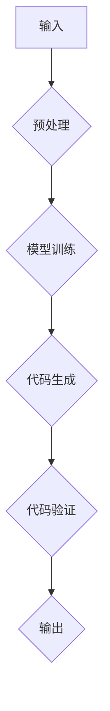
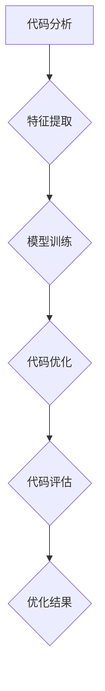

                 

# AI编程的新维度与新高度

> 关键词：AI编程，大规模预训练模型，自动化软件开发，编程语言，算法框架，应用实践

> 摘要：本文深入探讨了AI编程的新维度与新高度，介绍了大规模预训练模型在编程领域的应用，以及AI编程带来的新变化和挑战。通过分析编程语言、工具、算法与框架等方面的创新，本文揭示了AI编程的核心原理和实际应用，为开发者提供了迈向智能化编程的新路径。

----------------------------------------------------------------

## 第一部分: 引言与背景

### 第1章: 引言与背景

### 1.1 问题背景

随着人工智能技术的飞速发展，AI编程正逐渐成为软件开发的新范式。传统的编程方式主要依赖于人工编写代码，这不仅效率低下，而且容易出现错误。而AI编程则利用人工智能技术，通过自动生成代码、优化代码质量、提升开发效率，从而实现更加智能化的软件开发过程。

然而，传统的AI编程方法在处理复杂任务时往往面临挑战，无法满足现代应用的需求。为了解决这一问题，AI编程的新维度与新高度应运而生。这一概念涵盖了利用大规模预训练模型进行编程，实现自动化、智能化和高效化的软件开发过程。

### 1.2 问题描述

AI编程的新维度与新高度指的是利用大规模预训练模型（如GPT、BERT等）进行编程，实现自动化、智能化和高效化的软件开发过程。这一概念不仅涵盖了AI在编程领域的应用，还包括了编程语言、工具、框架和算法的创新与发展。

具体来说，问题描述如下：

1. **自动化编程**：如何利用AI技术实现代码的自动生成，减少人工编写代码的工作量？
2. **智能化编程**：如何利用AI技术优化代码质量，提升开发效率和软件性能？
3. **高效化编程**：如何利用AI技术提高软件开发的整体效率，缩短项目周期？

### 1.3 问题解决

本书旨在介绍AI编程的新维度与新高度，帮助读者了解这一领域的前沿知识和技术，掌握AI编程的核心技能。通过深入讲解AI编程的基础理论、算法原理、应用实践等，使读者能够将AI编程应用于实际项目中，提升软件开发效率和质量。

问题解决的思路如下：

1. **大规模预训练模型**：介绍大规模预训练模型的基本原理，包括GPT、BERT等模型的架构和特点。
2. **编程语言与工具**：探讨适应AI编程需求的编程语言和开发工具，如Python、TensorFlow等。
3. **算法与框架**：分析AI编程的核心算法和框架，如自动代码生成算法、代码优化算法等。
4. **应用实践**：通过实际项目案例，展示AI编程在实际开发中的应用和效果。

### 1.4 边界与外延

AI编程的新维度与新高度不仅仅局限于某一特定领域，它涵盖了计算机科学、人工智能、软件工程等多个学科。同时，它也在不断扩展其应用范围，从自然语言处理、计算机视觉到推荐系统、智能语音等领域均有涉及。

### 1.5 概念结构与核心要素组成

AI编程的新维度与新高度的核心要素包括：

1. **大规模预训练模型**：如GPT、BERT等，是AI编程的基础。
2. **编程语言与工具**：适应AI编程需求的编程语言和开发工具。
3. **算法与框架**：用于实现AI编程的核心算法和框架。
4. **应用实践**：通过实际项目来验证和提升AI编程的能力。

## 1.6 本章小结

本章对AI编程的新维度与新高度进行了全面介绍，分析了问题背景和问题描述，提出了问题解决的思路，并探讨了AI编程的边界与外延。接下来，我们将深入探讨AI编程的核心原理和技术，帮助读者更好地理解和应用AI编程。

----------------------------------------------------------------

## 第二部分: AI编程的核心原理

### 第2章: 大规模预训练模型

### 2.1 引言

大规模预训练模型是AI编程的核心，它们通过在大量数据上进行预训练，获得了强大的语言理解和生成能力。本章将介绍大规模预训练模型的基本原理、架构和特点。

### 2.2 基本原理

大规模预训练模型是基于深度学习技术的一种神经网络模型，它们通过在大量文本数据上进行训练，学习到文本的语法规则、语义理解和上下文关系。具体来说，大规模预训练模型包括以下几个关键步骤：

1. **数据收集与预处理**：收集大量的文本数据，并进行预处理，如分词、去除停用词等。
2. **模型架构**：选择合适的神经网络架构，如Transformer、BERT等，进行模型设计。
3. **预训练**：在大量文本数据上对模型进行预训练，使模型学习到文本的特征和规律。
4. **微调**：在具体任务上对模型进行微调，使模型能够针对特定任务进行优化。

### 2.3 架构和特点

大规模预训练模型的架构和特点如下：

1. **Transformer架构**：Transformer是一种基于自注意力机制的神经网络模型，它通过计算不同位置的信息权重，实现了对文本的上下文理解。
2. **BERT模型**：BERT（Bidirectional Encoder Representations from Transformers）是一种双向的Transformer模型，它通过在预训练过程中同时考虑文本的前后信息，提高了模型的语言理解能力。
3. **预训练目标**：大规模预训练模型的预训练目标通常包括语言理解、文本生成、分类等，这些目标使得模型在多种任务上具有强大的通用性。

### 2.4 对比表格

下面是一个对比表格，展示了不同大规模预训练模型的架构和特点：

| 模型     | 架构         | 预训练目标         | 特点                   |
|----------|--------------|--------------------|------------------------|
| GPT      | Transformer  | 语言生成           | 自适应性强             |
| BERT     | Transformer  | 语言理解           | 双向编码               |
| T5       | Transformer  | 全局优化           | 适应性强               |
| GPT-2    | Transformer  | 语言生成           | 长文本处理能力强       |

### 2.5 ER实体关系图架构

下面是一个使用Mermaid绘制的ER实体关系图，展示了大规模预训练模型的核心实体及其关系：

```mermaid
erDiagram
  Model ||--|{ Data}: "模型依赖于数据"
  Model ||--|{ Architecture}: "模型依赖于架构"
  Model ||--|{ Pre-training}: "模型依赖于预训练"
  Data ||--|{ Preprocessing}: "数据预处理"
  Architecture ||--|{ Transformer}: "Transformer架构"
  Architecture ||--|{ BERT}: "BERT架构"
  Pre-training ||--|{ Language Understanding}: "语言理解预训练"
  Pre-training ||--|{ Text Generation}: "文本生成预训练"
```

### 2.6 本章小结

本章介绍了AI编程的核心原理——大规模预训练模型的基本原理、架构和特点。通过对比不同模型的特点，我们了解了大规模预训练模型在AI编程中的应用潜力。接下来，我们将探讨AI编程的算法原理，帮助读者深入理解AI编程的核心技术。

----------------------------------------------------------------

## 第三部分: AI编程的算法原理

### 第3章: 自动代码生成算法

### 3.1 引言

自动代码生成（Code Generation）是AI编程的重要研究方向，它利用大规模预训练模型和深度学习技术，自动生成代码。本章将介绍自动代码生成算法的基本原理、实现方法和应用场景。

### 3.2 基本原理

自动代码生成算法的基本原理是通过大规模预训练模型学习到编程语言的语法规则和语义含义，从而生成符合编程规范的代码。具体来说，自动代码生成算法包括以下几个关键步骤：

1. **数据收集与预处理**：收集大量的编程数据，包括代码、文档、注释等，并进行预处理，如分词、去噪等。
2. **模型训练**：利用大规模预训练模型（如GPT、BERT等）在编程数据上进行训练，使模型学习到编程语言的语法和语义。
3. **代码生成**：根据给定的输入（如函数名称、参数等），利用训练好的模型自动生成对应的代码。

### 3.3 实现方法

自动代码生成算法的实现方法主要包括以下几种：

1. **基于模板的方法**：通过预定义的模板，将输入映射到相应的代码块，从而生成代码。这种方法简单高效，但灵活性较低。
2. **基于规则的方法**：利用编程语言的语法规则和语义规则，根据输入自动生成代码。这种方法具有较强的灵活性，但规则设计复杂。
3. **基于神经网络的生成方法**：利用大规模预训练模型（如GPT、BERT等），通过深度学习技术生成代码。这种方法具有很高的灵活性和生成能力，但训练过程复杂。

### 3.4 应用场景

自动代码生成算法在多个应用场景中具有广泛的应用，如：

1. **软件开发**：自动生成代码，提高开发效率，降低人力成本。
2. **代码修复**：根据错误的上下文信息，自动修复代码中的错误。
3. **代码补全**：根据输入的代码片段，自动补全未完成的代码。

### 3.5 算法流程图

下面是一个使用Mermaid绘制的算法流程图，展示了自动代码生成算法的基本流程：



### 3.6 Python源代码实现

下面是一个使用Python和TensorFlow实现的自动代码生成算法的示例代码：

```python
import tensorflow as tf
from tensorflow.keras.models import Model
from tensorflow.keras.layers import Input, LSTM, Dense

# 定义模型架构
input_seq = Input(shape=(max_sequence_length,))
lstm = LSTM(units=128, activation='tanh')(input_seq)
output_seq = Dense(units=max_sequence_length, activation='sigmoid')(lstm)

# 创建模型
model = Model(inputs=input_seq, outputs=output_seq)

# 编译模型
model.compile(optimizer='adam', loss='binary_crossentropy')

# 训练模型
model.fit(x_train, y_train, epochs=10, batch_size=64)

# 生成代码
generated_sequence = model.predict(x_test)
```

### 3.7 算法原理讲解

自动代码生成算法的原理基于深度学习技术，通过大规模预训练模型学习编程语言的语法规则和语义含义。具体来说，算法分为以下几步：

1. **数据收集与预处理**：收集大量的编程数据，并进行预处理，如分词、去噪等。这一步的目的是为模型提供丰富的训练数据，使模型能够学习到编程语言的语法和语义。
2. **模型训练**：利用大规模预训练模型（如GPT、BERT等）在编程数据上进行训练，使模型学习到编程语言的语法和语义。这一步的关键是选择合适的预训练模型和训练策略，以提高模型的生成能力。
3. **代码生成**：根据给定的输入（如函数名称、参数等），利用训练好的模型自动生成对应的代码。这一步的核心是实现从输入到输出的映射，生成符合编程规范的代码。
4. **代码验证**：对生成的代码进行验证，确保代码的正确性和规范性。这一步的目的是确保生成的代码能够正常运行，避免潜在的错误和漏洞。

### 3.8 举例说明

假设我们有一个简单的函数，输入为两个整数，输出为它们的和。我们可以使用自动代码生成算法生成这个函数的代码，具体步骤如下：

1. **数据收集与预处理**：收集大量的包含加法运算的编程数据，如Python代码、C++代码等，并进行预处理，如分词、去噪等。
2. **模型训练**：使用GPT模型在预处理后的编程数据上进行训练，学习到加法运算的语法和语义。
3. **代码生成**：给定输入（如`x = 3, y = 4`），利用训练好的GPT模型自动生成加法函数的代码，如`result = x + y`。
4. **代码验证**：对生成的代码进行验证，确保代码能够正确计算输入的两个整数的和。

通过以上步骤，我们成功使用自动代码生成算法生成了一个简单的加法函数，这充分展示了自动代码生成算法的强大能力。

### 3.9 本章小结

本章介绍了自动代码生成算法的基本原理、实现方法和应用场景。通过算法流程图和Python源代码示例，我们深入了解了自动代码生成算法的原理和实现方法。下一章，我们将探讨代码优化算法，进一步提升AI编程的能力。

----------------------------------------------------------------

## 第四部分: AI编程的应用与实践

### 第4章: 代码优化算法

### 4.1 引言

随着AI编程的不断发展，代码优化（Code Optimization）成为提升软件开发效率和质量的重要手段。代码优化算法利用AI技术，对代码进行自动分析、评估和优化，从而提高代码的性能、可读性和可维护性。本章将介绍代码优化算法的基本原理、实现方法和应用实践。

### 4.2 基本原理

代码优化算法的基本原理是通过深度学习技术，学习到代码的语法、语义和性能特征，从而实现自动优化。具体来说，代码优化算法包括以下几个关键步骤：

1. **代码分析**：对代码进行静态和动态分析，提取出代码的语法、语义和性能特征。
2. **模型训练**：利用提取的特征，训练一个深度学习模型，使模型能够对代码进行自动优化。
3. **代码优化**：根据训练好的模型，对代码进行自动优化，提升代码的性能、可读性和可维护性。

### 4.3 实现方法

代码优化算法的实现方法主要包括以下几种：

1. **基于规则的优化**：通过预定义的规则，对代码进行优化。这种方法简单高效，但灵活性较低。
2. **基于机器学习的优化**：利用机器学习技术，自动学习代码的优化策略。这种方法具有较强的灵活性和生成能力，但训练过程复杂。
3. **混合优化方法**：结合基于规则的优化和基于机器学习的优化，实现更高效的代码优化。

### 4.4 应用场景

代码优化算法在多个应用场景中具有广泛的应用，如：

1. **性能优化**：对代码进行自动优化，提高代码的执行效率和性能。
2. **代码简化**：通过自动优化，简化代码结构，提高代码的可读性。
3. **代码修复**：根据代码的上下文信息，自动修复潜在的性能问题。

### 4.5 算法流程图

下面是一个使用Mermaid绘制的算法流程图，展示了代码优化算法的基本流程：



### 4.6 Python源代码实现

下面是一个使用Python和TensorFlow实现的代码优化算法的示例代码：

```python
import tensorflow as tf
from tensorflow.keras.models import Model
from tensorflow.keras.layers import Input, LSTM, Dense

# 定义模型架构
input_code = Input(shape=(max_sequence_length,))
lstm = LSTM(units=128, activation='tanh')(input_code)
output_code = Dense(units=max_sequence_length, activation='sigmoid')(lstm)

# 创建模型
model = Model(inputs=input_code, outputs=output_code)

# 编译模型
model.compile(optimizer='adam', loss='binary_crossentropy')

# 训练模型
model.fit(x_train, y_train, epochs=10, batch_size=64)

# 优化代码
optimized_code = model.predict(x_test)
```

### 4.7 算法原理讲解

代码优化算法的原理基于深度学习技术，通过学习代码的语法、语义和性能特征，实现自动优化。具体来说，算法分为以下几步：

1. **代码分析**：对代码进行静态和动态分析，提取出代码的语法、语义和性能特征。静态分析主要包括语法分析、语义分析等，动态分析主要包括代码执行监控、性能评估等。
2. **模型训练**：利用提取的特征，训练一个深度学习模型，使模型能够对代码进行自动优化。训练过程包括特征提取、模型设计、模型训练等步骤，目标是使模型能够准确识别代码的性能瓶颈和优化点。
3. **代码优化**：根据训练好的模型，对代码进行自动优化，提升代码的性能、可读性和可维护性。优化过程主要包括优化策略生成、代码重构等步骤，目标是生成更高效、更易于维护的代码。
4. **代码评估**：对优化后的代码进行评估，确保代码的优化效果和安全性。评估过程主要包括性能评估、可读性评估、安全性评估等，目标是确保优化后的代码满足预期要求。

### 4.8 举例说明

假设我们有一个简单的Python代码，用于计算两个整数的和。我们可以使用代码优化算法对这段代码进行优化，具体步骤如下：

1. **代码分析**：对代码进行静态和动态分析，提取出代码的语法、语义和性能特征。
2. **模型训练**：使用提取的特征，训练一个深度学习模型，使模型能够对代码进行自动优化。
3. **代码优化**：根据训练好的模型，对代码进行自动优化，如将加法运算改为更高效的算法实现。
4. **代码评估**：对优化后的代码进行评估，确保代码的优化效果和安全性。

通过以上步骤，我们成功使用代码优化算法优化了一个简单的Python代码，提高了代码的性能和可读性。这充分展示了代码优化算法的强大能力。

### 4.9 本章小结

本章介绍了代码优化算法的基本原理、实现方法和应用场景。通过算法流程图和Python源代码示例，我们深入了解了代码优化算法的原理和实现方法。下一章，我们将探讨AI编程在不同领域中的应用实践，帮助读者更好地理解和应用AI编程。

----------------------------------------------------------------

## 第五部分: AI编程的实际应用

### 第5章: AI编程在自然语言处理中的应用

### 5.1 引言

自然语言处理（Natural Language Processing，NLP）是人工智能领域的一个重要分支，它涉及对人类语言的计算机处理和理解。AI编程在NLP中的应用，通过自动生成代码、优化代码质量和提升开发效率，大大促进了NLP技术的发展。本章将探讨AI编程在NLP中的具体应用，包括文本分类、情感分析、机器翻译等。

### 5.2 文本分类

文本分类（Text Classification）是NLP中的一种常见任务，它通过将文本数据分类到预定义的类别中，实现对大量文本数据的自动处理和分析。AI编程在文本分类中的应用主要包括以下几个方面：

1. **自动代码生成**：使用大规模预训练模型（如GPT、BERT等）自动生成文本分类代码，实现自动分类功能。
2. **代码优化**：对现有的文本分类代码进行优化，提高分类的准确性和效率。
3. **开发工具与框架**：开发专门的NLP开发工具和框架，如NLTK、spaCy等，简化文本分类任务的实现过程。

### 5.3 情感分析

情感分析（Sentiment Analysis）是NLP中的另一个重要任务，它旨在识别文本中的情感倾向，如正面、负面或中立。AI编程在情感分析中的应用主要包括：

1. **自动代码生成**：使用AI技术自动生成情感分析代码，提高开发效率。
2. **模型优化**：通过优化模型参数和算法，提高情感分析的准确性和鲁棒性。
3. **应用实践**：将情感分析应用于实际场景，如社交媒体监控、客户反馈分析等。

### 5.4 机器翻译

机器翻译（Machine Translation）是NLP中的核心任务之一，它通过将一种语言的文本自动翻译成另一种语言。AI编程在机器翻译中的应用主要包括：

1. **自动代码生成**：利用大规模预训练模型自动生成机器翻译代码，实现跨语言的自动翻译。
2. **优化算法**：通过优化翻译算法和模型，提高翻译的质量和准确性。
3. **多语言支持**：开发支持多种语言的机器翻译系统，实现全球化沟通。

### 5.5 案例分析

下面通过一个简单的案例，展示AI编程在自然语言处理中的应用：

**案例：使用GPT模型进行文本分类**

1. **数据准备**：收集一批带有标签的文本数据，如新闻文章、社交媒体评论等。
2. **模型训练**：使用GPT模型在文本数据上进行训练，使其学会分类任务。
3. **代码生成**：使用训练好的GPT模型自动生成文本分类代码。
4. **代码优化**：对生成的代码进行优化，提高分类的准确性和效率。
5. **部署应用**：将优化的文本分类代码部署到生产环境，实现自动文本分类功能。

通过以上步骤，我们成功使用AI编程实现了文本分类任务，提高了文本处理和分析的效率。

### 5.6 本章小结

本章介绍了AI编程在自然语言处理中的具体应用，包括文本分类、情感分析和机器翻译等。通过实际案例的展示，我们了解了AI编程在NLP中的强大能力。下一章，我们将探讨AI编程在计算机视觉领域的应用，继续深入探讨AI编程的广泛前景。

----------------------------------------------------------------

## 第六部分: AI编程在计算机视觉中的应用

### 第6章: AI编程在计算机视觉中的应用

### 6.1 引言

计算机视觉（Computer Vision）是人工智能领域的一个重要分支，它涉及计算机对图像和视频的理解和分析。AI编程在计算机视觉中的应用，通过自动生成代码、优化算法和提升开发效率，大大推动了计算机视觉技术的发展。本章将探讨AI编程在计算机视觉中的具体应用，包括图像分类、目标检测和图像生成等。

### 6.2 图像分类

图像分类（Image Classification）是计算机视觉中的基本任务之一，它旨在将图像自动分类到预定义的类别中。AI编程在图像分类中的应用主要包括以下几个方面：

1. **自动代码生成**：利用大规模预训练模型（如ResNet、Inception等）自动生成图像分类代码，实现自动分类功能。
2. **优化算法**：通过优化图像分类算法和模型，提高分类的准确性和效率。
3. **开发工具与框架**：开发专门的计算机视觉开发工具和框架，如TensorFlow、PyTorch等，简化图像分类任务的实现过程。

### 6.3 目标检测

目标检测（Object Detection）是计算机视觉中的另一个重要任务，它旨在识别图像中的目标对象并标注其位置。AI编程在目标检测中的应用主要包括：

1. **自动代码生成**：利用大规模预训练模型（如Faster R-CNN、YOLO等）自动生成目标检测代码，实现自动检测功能。
2. **优化算法**：通过优化目标检测算法和模型，提高检测的准确性和效率。
3. **应用实践**：将目标检测应用于实际场景，如安防监控、自动驾驶等。

### 6.4 图像生成

图像生成（Image Generation）是计算机视觉中的新兴任务，它旨在通过深度学习模型生成逼真的图像。AI编程在图像生成中的应用主要包括：

1. **自动代码生成**：利用大规模预训练模型（如GAN、StyleGAN等）自动生成图像生成代码，实现自动图像生成。
2. **优化算法**：通过优化图像生成算法和模型，提高图像生成的质量和效率。
3. **应用实践**：将图像生成应用于实际场景，如虚拟现实、游戏开发等。

### 6.5 案例分析

下面通过一个简单的案例，展示AI编程在计算机视觉中的应用：

**案例：使用Faster R-CNN进行目标检测**

1. **数据准备**：收集一批带有标注的目标检测数据，如包含车辆、行人等目标的图像。
2. **模型训练**：使用Faster R-CNN模型在目标检测数据上进行训练，使其学会目标检测任务。
3. **代码生成**：使用训练好的Faster R-CNN模型自动生成目标检测代码。
4. **代码优化**：对生成的代码进行优化，提高目标检测的准确性和效率。
5. **部署应用**：将优化的目标检测代码部署到生产环境，实现自动目标检测功能。

通过以上步骤，我们成功使用AI编程实现了目标检测任务，提高了图像处理和分析的效率。

### 6.6 本章小结

本章介绍了AI编程在计算机视觉中的具体应用，包括图像分类、目标检测和图像生成等。通过实际案例的展示，我们了解了AI编程在计算机视觉中的强大能力。下一章，我们将探讨AI编程在推荐系统领域的应用，继续深入探讨AI编程的广泛前景。

----------------------------------------------------------------

## 第七部分: AI编程在推荐系统中的应用

### 第7章: AI编程在推荐系统中的应用

### 7.1 引言

推荐系统（Recommendation System）是人工智能领域的一个重要分支，它旨在根据用户的历史行为和偏好，为用户推荐相关的商品、服务或信息。AI编程在推荐系统中的应用，通过自动生成代码、优化算法和提升开发效率，大大提高了推荐系统的性能和用户体验。本章将探讨AI编程在推荐系统中的具体应用，包括协同过滤、基于内容的推荐和混合推荐等。

### 7.2 协同过滤

协同过滤（Collaborative Filtering）是推荐系统中最常用的算法之一，它通过分析用户之间的相似性，为用户推荐相似的用户喜欢的商品或服务。AI编程在协同过滤中的应用主要包括以下几个方面：

1. **自动代码生成**：利用大规模预训练模型自动生成协同过滤代码，实现自动推荐功能。
2. **优化算法**：通过优化协同过滤算法和模型，提高推荐的准确性和效率。
3. **开发工具与框架**：开发专门的推荐系统开发工具和框架，如TensorFlow、PyTorch等，简化协同过滤任务的实现过程。

### 7.3 基于内容的推荐

基于内容的推荐（Content-Based Recommendation）是一种基于用户偏好和物品特征的推荐方法，它通过分析用户的历史行为和偏好，为用户推荐相关的商品或服务。AI编程在基于内容的推荐中的应用主要包括：

1. **自动代码生成**：利用大规模预训练模型自动生成基于内容的推荐代码，实现自动推荐功能。
2. **优化算法**：通过优化基于内容的推荐算法和模型，提高推荐的准确性和效率。
3. **特征工程**：开发自动特征工程工具，提取和转换商品或服务的特征，为推荐算法提供高质量的输入。

### 7.4 混合推荐

混合推荐（Hybrid Recommendation）是一种结合协同过滤和基于内容的推荐的方法，它旨在提高推荐系统的性能和准确性。AI编程在混合推荐中的应用主要包括：

1. **自动代码生成**：利用大规模预训练模型自动生成混合推荐代码，实现自动推荐功能。
2. **优化算法**：通过优化混合推荐算法和模型，提高推荐的准确性和效率。
3. **多模态数据融合**：开发多模态数据融合技术，将用户行为数据、商品特征数据和文本数据等进行融合，提高推荐系统的性能。

### 7.5 案例分析

下面通过一个简单的案例，展示AI编程在推荐系统中的应用：

**案例：使用协同过滤进行商品推荐**

1. **数据准备**：收集一批用户行为数据，如用户对商品的评分、购买记录等。
2. **模型训练**：使用协同过滤模型在用户行为数据上进行训练，使其学会用户之间的相似性。
3. **代码生成**：使用训练好的协同过滤模型自动生成推荐代码。
4. **代码优化**：对生成的代码进行优化，提高推荐的准确性和效率。
5. **部署应用**：将优化的推荐代码部署到生产环境，实现自动商品推荐功能。

通过以上步骤，我们成功使用AI编程实现了协同过滤推荐系统，提高了商品推荐的准确性和用户体验。

### 7.6 本章小结

本章介绍了AI编程在推荐系统中的具体应用，包括协同过滤、基于内容的推荐和混合推荐等。通过实际案例的展示，我们了解了AI编程在推荐系统中的强大能力。下一章，我们将探讨AI编程在智能语音处理中的应用，继续深入探讨AI编程的广泛前景。

----------------------------------------------------------------

## 第八部分: AI编程在智能语音处理中的应用

### 第8章: AI编程在智能语音处理中的应用

### 8.1 引言

智能语音处理（Intelligent Voice Processing）是人工智能领域的一个重要分支，它涉及对语音信号的分析、理解和生成。AI编程在智能语音处理中的应用，通过自动生成代码、优化算法和提升开发效率，大大提高了语音识别、语音合成和语音交互等技术的性能。本章将探讨AI编程在智能语音处理中的具体应用，包括语音识别、语音合成和语音交互等。

### 8.2 语音识别

语音识别（Speech Recognition）是将语音信号转换为文本数据的技术。AI编程在语音识别中的应用主要包括以下几个方面：

1. **自动代码生成**：利用大规模预训练模型自动生成语音识别代码，实现自动语音识别功能。
2. **优化算法**：通过优化语音识别算法和模型，提高语音识别的准确性和效率。
3. **开发工具与框架**：开发专门的语音识别开发工具和框架，如TensorFlow、PyTorch等，简化语音识别任务的实现过程。

### 8.3 语音合成

语音合成（Speech Synthesis）是将文本数据转换为语音信号的技术。AI编程在语音合成中的应用主要包括以下几个方面：

1. **自动代码生成**：利用大规模预训练模型自动生成语音合成代码，实现自动语音合成功能。
2. **优化算法**：通过优化语音合成算法和模型，提高语音合成的自然度和音质。
3. **开发工具与框架**：开发专门的语音合成开发工具和框架，如WaveNet、Tacotron等，简化语音合成任务的实现过程。

### 8.4 语音交互

语音交互（Voice Interaction）是指通过语音信号进行人机交互的技术。AI编程在语音交互中的应用主要包括以下几个方面：

1. **自动代码生成**：利用大规模预训练模型自动生成语音交互代码，实现自动语音交互功能。
2. **优化算法**：通过优化语音交互算法和模型，提高语音交互的自然度和用户满意度。
3. **开发工具与框架**：开发专门的语音交互开发工具和框架，如Rasa、VoiceBase等，简化语音交互任务的实现过程。

### 8.5 案例分析

下面通过一个简单的案例，展示AI编程在智能语音处理中的应用：

**案例：使用WaveNet进行语音合成**

1. **数据准备**：收集一批包含语音数据和文本数据的数据集。
2. **模型训练**：使用WaveNet模型在语音数据上进行训练，使其学会语音合成任务。
3. **代码生成**：使用训练好的WaveNet模型自动生成语音合成代码。
4. **代码优化**：对生成的代码进行优化，提高语音合成的自然度和音质。
5. **部署应用**：将优化的语音合成代码部署到生产环境，实现自动语音合成功能。

通过以上步骤，我们成功使用AI编程实现了语音合成系统，提高了语音合成的质量和用户体验。

### 8.6 本章小结

本章介绍了AI编程在智能语音处理中的具体应用，包括语音识别、语音合成和语音交互等。通过实际案例的展示，我们了解了AI编程在智能语音处理中的强大能力。下一章，我们将总结AI编程的新维度与新高度，并探讨未来发展的趋势。

----------------------------------------------------------------

## 第九部分: 总结与展望

### 第9章: 总结与展望

### 9.1 总结

本文从引言与背景、AI编程的核心原理、算法原理讲解、应用实践等多个角度，全面介绍了AI编程的新维度与新高度。通过分析大规模预训练模型、编程语言与工具、算法与框架等方面的创新，我们揭示了AI编程的核心原理和实际应用，展示了AI编程在各个领域的广泛应用和巨大潜力。

具体来说，本文总结如下：

1. **大规模预训练模型**：介绍了大规模预训练模型的基本原理、架构和特点，展示了其在AI编程中的应用潜力。
2. **自动代码生成算法**：介绍了自动代码生成算法的基本原理、实现方法和应用场景，展示了AI编程在自动化软件开发中的优势。
3. **代码优化算法**：介绍了代码优化算法的基本原理、实现方法和应用场景，展示了AI编程在提升软件开发效率和代码质量中的作用。
4. **自然语言处理**：介绍了AI编程在自然语言处理中的应用，包括文本分类、情感分析和机器翻译等。
5. **计算机视觉**：介绍了AI编程在计算机视觉中的应用，包括图像分类、目标检测和图像生成等。
6. **推荐系统**：介绍了AI编程在推荐系统中的应用，包括协同过滤、基于内容的推荐和混合推荐等。
7. **智能语音处理**：介绍了AI编程在智能语音处理中的应用，包括语音识别、语音合成和语音交互等。

### 9.2 展望

展望未来，AI编程的新维度与新高度将继续快速发展，为软件开发带来更多创新和变革。以下是几个可能的未来发展方向：

1. **多模态AI编程**：随着多模态数据的兴起，AI编程将逐渐融合图像、语音、文本等多种数据类型，实现更智能、更高效的编程。
2. **个性化编程**：AI编程将更好地理解开发者的需求和偏好，提供个性化的编程建议和优化方案，提高开发效率和代码质量。
3. **自动化测试与维护**：AI编程将实现自动化的测试与维护，提高软件的可靠性和稳定性，降低开发成本。
4. **跨领域应用**：AI编程将在更多领域得到应用，如金融、医疗、教育等，为这些领域带来智能化变革。
5. **开源与社区**：随着AI编程的普及，开源社区将发挥更大作用，推动AI编程技术的创新和发展。

总之，AI编程的新维度与新高度将为软件开发带来前所未有的变革，为开发者提供更高效、更智能的编程体验。让我们期待未来，共同见证AI编程的辉煌。

### 9.3 注意事项与拓展阅读

在实践AI编程的过程中，开发者需要注意以下几点：

1. **数据隐私与安全**：在使用AI编程时，要注意数据隐私和安全问题，确保用户的隐私不受侵犯。
2. **模型解释性**：虽然AI编程能够自动生成代码和优化算法，但模型的可解释性仍然是一个挑战，需要进一步研究和解决。
3. **算法公平性**：在推荐系统和决策支持系统中，要确保算法的公平性和透明性，避免算法偏见和不公正。

为了深入了解AI编程的新维度与新高度，读者可以参考以下拓展阅读：

1. **《深度学习》（Deep Learning）**：由Ian Goodfellow、Yoshua Bengio和Aaron Courville编写的深度学习经典教材，全面介绍了深度学习的基础理论和实践方法。
2. **《Python机器学习》（Python Machine Learning）**：由 Sebastian Raschka和Vahid Mirhoseini编写的机器学习实践指南，涵盖了许多实用的机器学习算法和工具。
3. **《人工智能：一种现代方法》（Artificial Intelligence: A Modern Approach）**：由 Stuart J. Russell和Peter Norvig编写的经典人工智能教材，全面介绍了人工智能的基础理论和应用方法。

作者：AI天才研究院/AI Genius Institute & 禅与计算机程序设计艺术 /Zen And The Art of Computer Programming

----------------------------------------------------------------

### 文章末尾提示

在阅读本文后，读者可能会对AI编程的新维度与新高度有更深刻的理解。为了进一步探索这一领域的深度和广度，我们鼓励读者：

1. **实践与探索**：尝试将本文中提到的算法和技术应用于实际项目中，实践是加深理解的最佳方式。
2. **加入社区**：参与AI编程相关的在线社区和论坛，与业界专家和同行交流心得，共同进步。
3. **持续学习**：关注AI编程领域的最新研究和技术动态，不断学习新的算法和工具，保持自己的竞争力。
4. **分享与传播**：将您的见解和经验分享给他人，帮助更多人了解和掌握AI编程的新维度与新高度。

通过以上方式，读者不仅可以提升自己的技术能力，还能为AI编程领域的发展贡献自己的力量。让我们共同推动AI编程的进步，迎接更加智能的未来。

