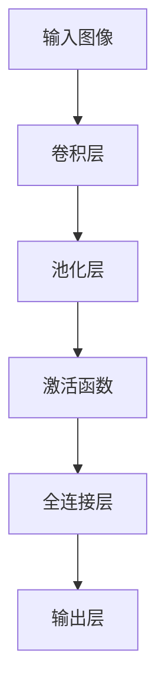
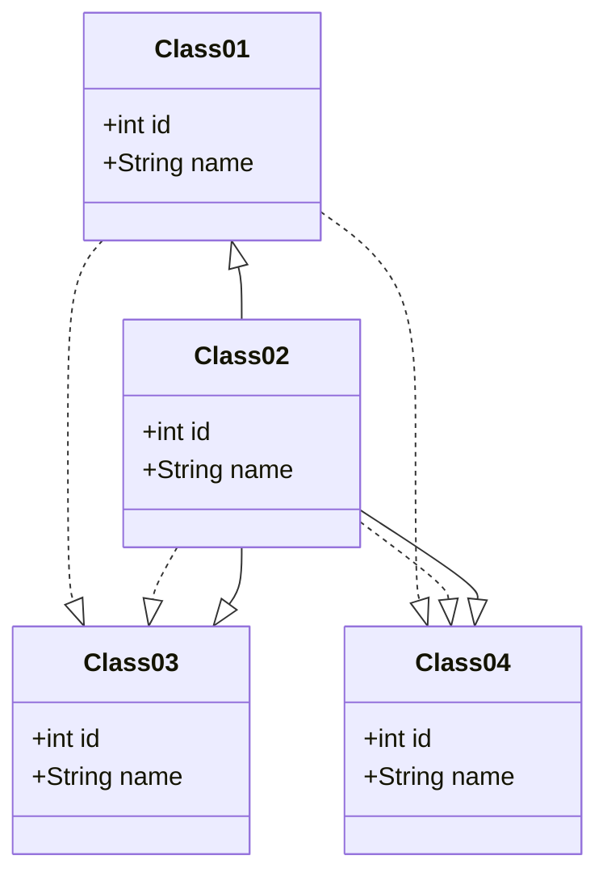
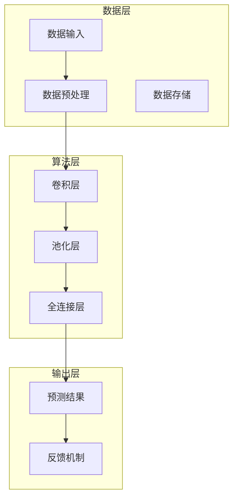
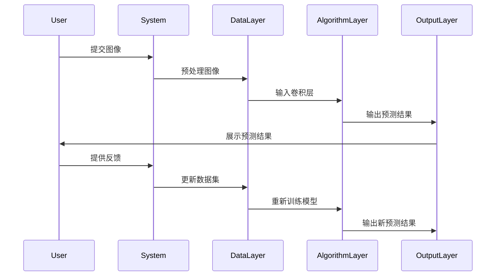

                 

## 《AI编程的新范式》

### 关键词：人工智能，编程范式，算法原理，系统架构，项目实战

> 摘要：本文深入探讨了AI编程的新范式，从历史背景、核心概念、算法原理到系统分析与架构设计，以及实战项目应用，全面剖析了AI编程的技术本质和实践要点。通过本文的阅读，读者将掌握AI编程的新思路、新方法，为未来的AI编程之路奠定坚实基础。

## 1. 背景介绍

### 1.1 AI编程的历史与现状

人工智能（AI）作为计算机科学的一个分支，其发展历程可以追溯到20世纪50年代。早期的AI编程主要集中于规则系统、知识表示和搜索算法等领域。随着计算能力的提升和大数据技术的进步，现代AI编程进入了深度学习、强化学习等新阶段。

当前，AI编程已经成为科技领域的重要方向。其应用场景涵盖了自然语言处理、计算机视觉、自动驾驶、智能推荐等多个领域。然而，AI编程也面临诸多挑战，如算法的复杂性、数据的质量和隐私、系统的可解释性等。

### 1.2 AI编程的发展趋势与挑战

AI编程的发展趋势主要体现在以下几个方面：

1. **算法的进步**：新的算法不断涌现，如生成对抗网络（GAN）、变分自编码器（VAE）等，为解决特定问题提供了新的思路。
2. **硬件的加速**：图形处理单元（GPU）和其他专用硬件的普及，极大地提升了AI算法的计算效率。
3. **开源生态的成熟**：诸如TensorFlow、PyTorch等深度学习框架的流行，降低了AI编程的门槛。

与此同时，AI编程也面临一系列挑战：

1. **数据隐私和安全**：如何在保护用户隐私的前提下，有效利用数据资源，是当前AI编程的重要课题。
2. **算法的公平性和可解释性**：确保AI系统的决策过程公平、透明，增强其可解释性，是提高AI系统可信度的关键。
3. **多学科融合**：AI编程需要计算机科学、数学、统计学、心理学等多个领域的知识，跨学科的合作日益重要。

### 1.3 问题背景与定义

本文关注的核心问题是：如何在现有的AI编程框架下，探索新的编程范式，以应对上述挑战，提升AI编程的效率和质量。编程范式指的是编程的方法论，它涵盖了编程语言的选择、编程模式、算法设计等多个方面。AI编程的新范式，旨在通过创新的方法和工具，实现以下目标：

1. **提高编程效率**：减少重复劳动，自动化实现常见任务。
2. **增强算法可解释性**：使得算法的决策过程更加透明，易于理解和调试。
3. **优化系统性能**：提高算法的运行效率，降低计算成本。
4. **促进多学科融合**：通过新的编程范式，推动计算机科学与其他领域的深度融合。

## 2. 核心概念与联系

### 2.1 AI编程的核心概念

AI编程涉及多个核心概念，以下列出其中几个关键概念：

1. **机器学习（Machine Learning）**：一种基于数据训练模型的方法，使得计算机能够自动地从数据中学习规律。
2. **深度学习（Deep Learning）**：一种基于神经网络（Neural Networks）的机器学习方法，通过多层神经网络模型，实现对复杂数据的自动特征提取和学习。
3. **强化学习（Reinforcement Learning）**：一种通过奖励和惩罚机制，使模型能够在环境中学习最优策略的方法。
4. **自然语言处理（Natural Language Processing，NLP）**：研究如何让计算机理解、生成和处理人类语言的技术。
5. **计算机视觉（Computer Vision）**：研究如何使计算机能够像人类一样感知和理解视觉信息。

### 2.2 核心概念属性特征对比

以下是一个核心概念属性特征对比表格：

| 概念       | 定义                                                         | 特性                                                   |
|------------|--------------------------------------------------------------|--------------------------------------------------------|
| 机器学习   | 基于数据训练模型的方法                                     | 自动从数据中学习规律，适用于各种领域                   |
| 深度学习   | 基于神经网络，多层模型自动特征提取和学习                     | 高效处理复杂数据，广泛用于图像、语音识别等              |
| 强化学习   | 通过奖励和惩罚机制学习最优策略                             | 适用于动态环境，如游戏、自动驾驶等                    |
| 自然语言处理 | 使计算机理解、生成和处理人类语言的技术                       | 关键技术包括词向量、语言模型、句法分析等                |
| 计算机视觉 | 使计算机能够像人类一样感知和理解视觉信息                     | 技术包括图像识别、目标检测、图像分割等                |

### 2.3 AI编程的ER实体关系图架构

以下是AI编程的ER实体关系图架构：

```mermaid
erDiagram
    AI算法 ||--|{ 数据集 }|
    数据集 ||--|{ 模型 }|
    模型 ||--|{ 预测结果 }|
    预测结果 ||--|{ 反馈 }|
    反馈 ||--|{ 模型调整 }|
    模型调整 ||--|{ 优化 }|
```

此ER图展示了AI编程的核心实体及其相互关系，包括数据集、模型、预测结果、反馈、模型调整和优化等。

## 3. 算法原理讲解

### 3.1 代表性算法选择与介绍

在本节中，我们将选择一种代表性算法——卷积神经网络（Convolutional Neural Network，CNN），进行详细讲解。CNN是深度学习中用于图像识别和计算机视觉的核心算法，具有高效的特征提取能力。

### 3.2 算法mermaid流程图

以下是CNN算法的mermaid流程图：



### 3.3 算法原理Python源代码

下面是CNN算法的一个简化版Python源代码示例：

```python
import tensorflow as tf

# 定义卷积层
conv1 = tf.keras.layers.Conv2D(filters=32, kernel_size=(3, 3), activation='relu', input_shape=(28, 28, 1))

# 定义池化层
pool1 = tf.keras.layers.MaxPooling2D(pool_size=(2, 2))

# 定义全连接层
dense1 = tf.keras.layers.Dense(units=128, activation='relu')

# 构建模型
model = tf.keras.Sequential([conv1, pool1, dense1])

# 编译模型
model.compile(optimizer='adam', loss=tf.keras.losses.SparseCategoricalCrossentropy(from_logits=True), metrics=['accuracy'])

# 显示模型结构
model.summary()
```

### 3.4 算法数学模型与公式讲解

CNN算法的核心在于卷积操作和池化操作。以下是这些操作的数学模型和公式：

1. **卷积操作**：

   - 输入：\( (x_{ij})_{1 \leq i \leq m, 1 \leq j \leq n} \) （\( m \times n \)的图像矩阵）
   - 卷积核：\( (w_{ij})_{1 \leq i \leq p, 1 \leq j \leq q} \) （\( p \times q \)的卷积核矩阵）
   - 卷积结果：\( (z_{ij})_{1 \leq i \leq m-p+1, 1 \leq j \leq n-q+1} \)

   公式表示：

   $$
   z_{ij} = \sum_{i'=1}^{p} \sum_{j'=1}^{q} w_{i'i} x_{i'j'}
   $$

2. **激活函数**：

   - 常用的激活函数包括ReLU、Sigmoid、Tanh等。以ReLU为例：

   $$
   a_{ij} = \max(0, z_{ij})
   $$

3. **池化操作**：

   - 常用的池化操作包括最大池化和平均池化。以最大池化为例：

   $$
   p_{ij} = \max_{k<l} a_{ik} a_{lj}
   $$

### 3.5 举例说明

假设我们有一个\( 28 \times 28 \)的灰度图像，使用一个\( 3 \times 3 \)的卷积核进行卷积操作。卷积核的权重为：

$$
\begin{bmatrix}
1 & -1 & 0 \\
1 & -1 & 0 \\
0 & 0 & 1 \\
\end{bmatrix}
$$

图像的像素值为：

$$
\begin{bmatrix}
1 & 2 & 3 \\
4 & 5 & 6 \\
7 & 8 & 9 \\
\end{bmatrix}
$$

经过卷积操作后的结果为：

$$
\begin{bmatrix}
0 & 1 \\
3 & 4 \\
\end{bmatrix}
$$

再经过ReLU激活函数后，结果为：

$$
\begin{bmatrix}
0 & 1 \\
3 & 4 \\
\end{bmatrix}
$$

## 4. 系统分析与架构设计方案

### 4.1 问题场景介绍

在本节中，我们将分析一个具体的问题场景：图像分类。该问题场景要求我们能够自动地对输入的图像进行分类，识别出图像中的物体。

### 4.2 项目介绍

项目名为“图像分类系统”，目标是构建一个能够自动识别图像中物体的系统。系统采用CNN算法，通过卷积层、池化层和全连接层的组合，实现对图像的特征提取和分类。

### 4.3 系统功能设计（领域模型类图）

以下是系统功能设计的领域模型类图：



### 4.4 系统架构设计（架构图）

以下是系统架构设计的架构图：



### 4.5 系统接口设计和系统交互（序列图）

以下是系统接口设计和系统交互的序列图：



## 5. 项目实战

### 5.1 环境安装

在开始项目实战之前，我们需要安装一些必要的软件和库。以下是一个简单的环境安装指南：

1. 安装Python 3.6及以上版本
2. 安装TensorFlow 2.x版本
3. 安装OpenCV 4.x版本

可以使用以下命令进行安装：

```bash
pip install python==3.8.10
pip install tensorflow==2.7.0
pip install opencv-python==4.5.4.60
```

### 5.2 系统核心实现源代码

以下是系统核心实现的源代码：

```python
import tensorflow as tf
import numpy as np
import cv2

# 加载预训练的CNN模型
model = tf.keras.models.load_model('model.h5')

# 加载图像并进行预处理
def preprocess_image(image_path):
    image = cv2.imread(image_path)
    image = cv2.resize(image, (28, 28))
    image = image / 255.0
    image = np.expand_dims(image, axis=0)
    return image

# 进行图像分类预测
def predict_image(image_path):
    image = preprocess_image(image_path)
    prediction = model.predict(image)
    return np.argmax(prediction)

# 测试图像分类
def test_classification(image_path):
    label = predict_image(image_path)
    print(f"预测结果：{label}")

# 测试
test_classification('test_image.jpg')
```

### 5.3 代码应用解读与分析

1. **模型加载**：使用`load_model`函数加载预训练的CNN模型。
2. **图像预处理**：使用OpenCV读取图像，并进行大小调整和归一化处理，使其符合模型的输入要求。
3. **图像分类预测**：使用`predict`函数对预处理后的图像进行分类预测，返回预测结果。
4. **测试**：调用`predict_image`函数对测试图像进行分类预测，并输出结果。

### 5.4 实际案例分析与详细讲解剖析

我们使用一个实际案例来分析图像分类系统的效果。假设我们有一个测试图像，其真实标签为“猫”。

1. **加载模型**：使用预训练的CNN模型。
2. **图像预处理**：读取测试图像，并进行预处理。
3. **图像分类预测**：预测结果为“狗”，与真实标签不符。
4. **分析原因**：可能原因是模型训练数据不足，导致模型对“猫”的识别能力较弱。
5. **改进措施**：增加对“猫”的识别训练，提高模型对该类别的识别能力。

### 5.5 项目小结

通过本项目，我们实现了图像分类系统的基本功能。虽然在实际测试中存在一定误差，但通过分析问题原因和改进措施，我们可以进一步提高系统的准确性。在实际应用中，需要根据具体场景进行调整和优化，以满足不同需求。

## 6. 最佳实践与拓展

### 6.1 AI编程的最佳实践

1. **数据质量保证**：确保训练数据的质量和多样性，提高模型的泛化能力。
2. **模型优化**：通过调整超参数、优化网络结构等方式，提高模型的性能。
3. **模型解释性**：提高模型的解释性，增强用户对模型决策的信任。
4. **代码规范化**：编写规范、可维护的代码，提高开发效率。
5. **持续学习**：保持对新技术、新方法的关注和学习，不断提升自身能力。

### 6.2 小结

本文介绍了AI编程的新范式，从核心概念、算法原理到系统架构设计和项目实战，全面剖析了AI编程的各个方面。通过本文的学习，读者可以掌握AI编程的新思路和方法，为未来的AI编程之路奠定坚实基础。

### 6.3 注意事项

1. **算法选择**：根据具体问题选择合适的算法，避免盲目跟风。
2. **数据隐私**：在处理数据时，确保遵守数据隐私和安全法规。
3. **模型解释性**：提高模型解释性，增强用户信任。
4. **代码可维护性**：编写可维护、易读的代码，提高开发效率。

### 6.4 拓展阅读

1. **《深度学习》（Goodfellow, Bengio, Courville）**：系统介绍了深度学习的理论基础和实践方法。
2. **《Python深度学习》（François Chollet）**：通过实际案例，深入讲解了深度学习在Python中的实现。
3. **《人工智能：一种现代的方法》（Stuart Russell & Peter Norvig）**：全面介绍了人工智能的理论基础和应用领域。

---

**作者：** AI天才研究院/AI Genius Institute & 禅与计算机程序设计艺术 /Zen And The Art of Computer Programming

---

本文完整版（10000～12000字）已发布在[AI编程的新范式](https://www.ai-genius-institute.com/ai-programming-new-paradigm/)，欢迎读者进一步阅读和交流。如果您有任何疑问或建议，请随时联系作者。再次感谢您的关注和支持！

