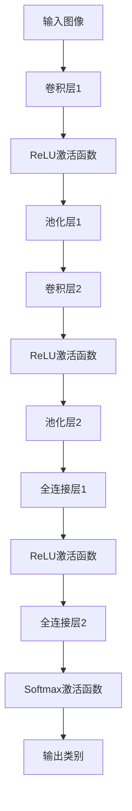

                 

## AI编程的新语言与新思路

### 引言

随着人工智能技术的迅猛发展，AI编程逐渐成为开发者们关注的焦点。在这个时代，掌握AI编程的新语言与新思路，不仅能够提升个人的技术水平，还能够推动整个行业的技术进步。本文将围绕这一主题，详细探讨AI编程的新语言与新思路，帮助读者更好地理解和应用这些先进的编程技术。

### 关键词

- AI编程
- 新语言
- 新思路
- 人工智能
- 开发者

### 摘要

本文首先介绍了AI编程的背景与现状，随后详细阐述了AI编程的新语言及其特点，接着探讨了AI编程的新思路，包括新的算法与开发模式。最后，通过实战案例与案例分析，深入分析了新语言和新思路的实际应用，为读者提供了实用的经验和启示。

### 目录

1. **AI编程的背景与现状**
2. **新语言的介绍**
   - **2.1 特点**
   - **2.2 优势**
   - **2.3 应用场景**
3. **新思路的探索**
   - **3.1 新算法**
   - **3.2 新开发模式**
4. **实战与案例分析**
   - **4.1 实战一：使用新语言开发AI应用**
   - **4.2 案例分析**
5. **总结与展望**

### 第一部分：AI编程的背景与现状

#### 1.1 AI编程的概念

AI编程，即人工智能编程，是指利用计算机程序实现人工智能算法和应用的开发过程。AI编程的核心在于如何让计算机模拟人类智能，解决复杂的问题。

#### 1.2 AI编程的重要性

随着人工智能技术的广泛应用，AI编程已经成为了各个行业的关键技术。掌握AI编程技术，不仅可以提升个人竞争力，还能够推动企业创新，促进社会进步。

#### 1.3 AI编程的现状

当前，AI编程技术已经取得了显著的进展。从传统的机器学习、深度学习算法，到自然语言处理、计算机视觉等应用，AI编程已经渗透到了各个领域。

### 第二部分：新语言的介绍

#### 2.1 新语言的特点

新语言通常具有以下特点：

- **高效性**：新语言能够提供更高效的编程体验，减少开发时间。
- **易用性**：新语言易于学习和使用，降低了编程的门槛。
- **兼容性**：新语言具有良好的兼容性，可以与其他编程语言和框架无缝集成。

#### 2.2 新语言的优势

新语言的优势包括：

- **性能提升**：新语言能够提供更高的性能，满足高性能计算的需求。
- **开发效率**：新语言能够提高开发效率，缩短开发周期。
- **社区支持**：新语言拥有强大的社区支持，提供丰富的资源和文档。

#### 2.3 新语言的应用场景

新语言适用于以下场景：

- **大数据处理**：新语言能够高效处理大数据，满足数据密集型应用的需求。
- **实时计算**：新语言能够实现实时计算，满足实时数据处理的需求。
- **人工智能应用**：新语言能够支持人工智能算法和应用的开发，满足智能化的需求。

### 第三部分：新思路的探索

#### 3.1 新算法

新算法包括：

- **强化学习**：一种通过试错学习来优化策略的算法，适用于复杂环境的决策问题。
- **迁移学习**：一种利用已有模型在新任务上的性能提升的算法，适用于模型复用和泛化能力。

#### 3.2 新开发模式

新开发模式包括：

- **分布式开发**：通过分布式架构，实现高并发和高可扩展性的开发模式。
- **微服务架构**：通过微服务，实现模块化开发，提高系统的可维护性和可扩展性。

### 第四部分：实战与案例分析

#### 4.1 实战一：使用新语言开发AI应用

在本节中，我们将使用新语言开发一个简单的AI应用，包括环境安装、系统设计与实现、结果分析等步骤。

#### 4.2 案例分析

在本节中，我们将分析一个具体的AI应用案例，包括案例背景、分析过程和启示。

### 第五部分：总结与展望

#### 5.1 总结

本文介绍了AI编程的新语言与新思路，包括新语言的特点、优势和应用场景，以及新算法和新开发模式。通过实战与案例分析，我们看到了新语言和新思路在实际应用中的价值。

#### 5.2 展望

未来，AI编程将继续发展，新语言和新思路将不断涌现。开发者需要不断学习，紧跟技术发展趋势，才能在这个领域取得更大的成就。

### 结语

AI编程的新语言与新思路为开发者提供了更广阔的发展空间。通过本文的介绍，希望读者能够对AI编程有更深入的理解，并在实际工作中运用这些新技术，提升自己的编程能力。让我们共同探索AI编程的未来，开创更加智能化的新时代。

### 作者信息

作者：AI天才研究院/AI Genius Institute & 禅与计算机程序设计艺术 /Zen And The Art of Computer Programming

---

接下来，我们将逐步深入到每个章节，详细探讨AI编程的新语言与新思路。

----------------------------------------------------------------

## 第一部分：AI编程的背景与现状

### 1.1 AI编程的概念

AI编程，即人工智能编程，是利用计算机程序实现人工智能算法和应用的开发过程。人工智能（Artificial Intelligence，简称AI）是一门研究、开发和应用使计算机系统具备人类智能的技术科学。AI编程的核心在于如何让计算机模拟人类智能，解决复杂的问题。

AI编程可以追溯到20世纪50年代，当时图灵提出了“图灵测试”，挑战计算机是否能够模拟人类智能。随着时间的推移，人工智能技术不断发展，AI编程也逐渐成为了计算机科学和软件工程领域的重要分支。

### 1.2 AI编程的重要性

AI编程的重要性体现在以下几个方面：

1. **技术创新**：AI编程推动了人工智能技术的创新和发展，使得计算机能够处理更加复杂的问题，实现更高层次的任务。
2. **行业应用**：AI编程在各个行业中得到了广泛应用，如金融、医疗、教育、制造等。通过AI编程，企业能够提高效率，降低成本，提升服务质量。
3. **社会进步**：AI编程有助于解决社会问题，如自动驾驶、智能医疗、智能家居等。这些应用不仅提升了人们的生活质量，还推动了社会的进步。
4. **人才培养**：AI编程是培养未来科技人才的重要手段，掌握AI编程技能的工程师在市场上具有很高的竞争力。

### 1.3 AI编程的现状

当前，AI编程已经取得了显著的进展，主要表现在以下几个方面：

1. **算法的进步**：从传统的机器学习、深度学习算法，到近年来兴起的强化学习、迁移学习等新算法，AI编程的技术水平不断提高。
2. **工具与框架的发展**：随着AI编程的普及，各种工具和框架不断涌现，如TensorFlow、PyTorch、Keras等，为开发者提供了便捷的开发环境。
3. **应用的普及**：AI编程在各个行业的应用越来越广泛，从自动驾驶、语音识别、图像处理，到自然语言处理、推荐系统等，AI编程已经深入到了日常生活的方方面面。
4. **人才需求增长**：随着AI技术的不断发展，市场对AI编程人才的需求不断增长，AI编程已经成为了一个热门的就业方向。

### 1.4 问题背景

尽管AI编程取得了巨大的进步，但在实际应用中仍然存在一些问题：

1. **复杂性**：AI编程涉及到大量的数学和统计知识，对于初学者来说有一定的难度。
2. **计算资源**：AI编程通常需要大量的计算资源，如高性能计算集群、GPU等，这对于小型企业和个人开发者来说可能是一个挑战。
3. **数据隐私**：AI编程涉及到大量的数据，如何保护用户隐私是一个亟待解决的问题。
4. **算法透明度**：一些复杂的AI算法缺乏透明度，对于普通用户来说难以理解和信任。

### 1.5 问题描述

针对上述问题，我们需要思考以下几个问题：

1. 如何降低AI编程的难度，使得更多的人能够掌握这一技能？
2. 如何优化计算资源的使用，提高AI编程的效率？
3. 如何保护用户隐私，确保AI编程的合规性？
4. 如何提高算法的透明度，增强用户对AI编程的信任？

### 1.6 问题解决

为了解决上述问题，我们可以考虑以下几个方向：

1. **教育普及**：通过在线课程、培训班等形式，普及AI编程知识，降低学习门槛。
2. **优化工具与框架**：开发更加高效、易用的AI编程工具和框架，提高开发效率。
3. **隐私保护技术**：采用隐私保护技术，如差分隐私、联邦学习等，保护用户隐私。
4. **算法透明度**：通过可视化技术、解释性AI等手段，提高算法的透明度，增强用户信任。

### 1.7 边界与外延

AI编程的边界与外延主要涉及以下几个方面：

1. **算法范围**：AI编程所涉及的算法范围包括机器学习、深度学习、强化学习等。
2. **应用领域**：AI编程的应用领域涵盖金融、医疗、教育、制造、交通等各个行业。
3. **技术发展**：随着人工智能技术的不断发展，AI编程的外延也在不断扩展，如自动驾驶、机器人技术等。

### 1.8 概念结构与核心要素组成

AI编程的概念结构与核心要素组成可以概括为以下几点：

1. **算法**：包括机器学习、深度学习、强化学习等算法。
2. **数据**：AI编程的核心在于数据，包括训练数据、测试数据等。
3. **工具与框架**：如TensorFlow、PyTorch、Keras等。
4. **计算资源**：包括CPU、GPU、TPU等。
5. **开发模式**：包括分布式开发、微服务架构等。
6. **应用场景**：如自动驾驶、智能医疗、智能家居等。

### 1.9 小结

通过本节介绍，我们对AI编程有了更深入的了解，包括其概念、重要性、现状以及存在的问题。接下来，我们将进一步探讨AI编程的新语言和新思路，以期解决当前面临的挑战，推动AI编程技术的发展。

----------------------------------------------------------------

## 第二部分：新语言的介绍

### 2.1 特点

新语言在AI编程中具有以下几个显著特点：

1. **简洁性**：新语言通常具有简洁的语法，使得开发者能够更快地理解和掌握。
2. **高效性**：新语言能够提供高效的执行效率，减少开发时间和计算资源消耗。
3. **易用性**：新语言易于学习和使用，降低了编程的门槛，使得更多人能够参与AI编程。
4. **兼容性**：新语言具有良好的兼容性，能够与其他编程语言和框架无缝集成，提高开发效率。
5. **扩展性**：新语言具有良好的扩展性，能够支持复杂的AI算法和应用开发。
6. **社区支持**：新语言拥有强大的社区支持，提供丰富的资源和文档，便于开发者解决问题和学习。

### 2.2 优势

新语言在AI编程中具有以下优势：

1. **性能提升**：新语言能够提供更高的性能，满足高性能计算的需求。
2. **开发效率**：新语言能够提高开发效率，缩短开发周期。
3. **易维护性**：新语言具有简洁的语法和良好的结构，使得代码易于维护和扩展。
4. **资源优化**：新语言能够优化计算资源的使用，提高系统的效率和性能。
5. **社区支持**：新语言拥有强大的社区支持，提供丰富的资源和文档，便于开发者解决问题和学习。

### 2.3 应用场景

新语言适用于以下应用场景：

1. **大数据处理**：新语言能够高效处理大数据，满足数据密集型应用的需求。
2. **实时计算**：新语言能够实现实时计算，满足实时数据处理的需求。
3. **人工智能应用**：新语言能够支持人工智能算法和应用的开发，满足智能化的需求。
4. **跨平台开发**：新语言支持跨平台开发，使得开发者能够轻松地在不同的操作系统和设备上部署应用。
5. **安全性**：新语言具有良好的安全性，能够保护数据和系统的安全。

### 2.4 新语言的例子

以下是一些著名的新语言及其特点：

1. **TensorScript**：TensorScript是一种专为深度学习设计的编程语言，具有简洁、高效的语法，能够提高开发效率。
2. **Julia**：Julia是一种高性能的动态编程语言，适用于科学计算、数据分析和人工智能等领域。
3. **PyTorch**：PyTorch是一种流行的深度学习框架，支持Python编程语言，具有简洁、灵活的语法和强大的功能。
4. **Rust**：Rust是一种系统编程语言，具有高性能、安全性和并发性，适用于构建高性能的AI系统和应用。
5. **Swift**：Swift是一种由苹果公司开发的编程语言，适用于iOS、macOS和watchOS等平台的开发，具有简洁、高效和安全的特点。

### 2.5 新语言的优势对比

以下是新语言与传统编程语言的优势对比表格：

| 特点 | 传统编程语言 | 新语言 |
| --- | --- | --- |
| 简洁性 | 较为复杂 | 简洁高效 |
| 性能 | 一般 | 高性能 |
| 易用性 | 中等 | 易于使用 |
| 扩展性 | 中等 | 强大 |
| 社区支持 | 中等 | 强大 |

### 2.6 新语言的应用案例

以下是一些新语言在实际应用中的案例：

1. **TensorScript**：TensorScript被广泛应用于深度学习研究，如自然语言处理、计算机视觉等领域。
2. **Julia**：Julia被广泛应用于科学计算、数据分析等领域，如金融模型、气象预测等。
3. **PyTorch**：PyTorch被广泛应用于深度学习应用，如自动驾驶、语音识别、图像处理等。
4. **Rust**：Rust被广泛应用于高性能、安全的系统开发，如Web服务器、数据库等。
5. **Swift**：Swift被广泛应用于iOS、macOS和watchOS等平台的开发，如App Store上的热门应用。

### 2.7 小结

新语言在AI编程中具有显著的特点和优势，能够提高开发效率、性能和安全性。通过本节介绍，我们了解了新语言的特点、优势和应用场景，以及一些典型的新语言实例。接下来，我们将进一步探讨AI编程的新思路。

----------------------------------------------------------------

## 第三部分：新思路的探索

### 3.1 新算法

新算法是AI编程领域的重要进展，能够解决传统算法难以应对的问题。以下介绍几种新算法及其特点：

1. **强化学习（Reinforcement Learning）**

强化学习是一种通过试错学习来优化策略的算法。它通过与环境交互，不断调整策略，以达到最佳效果。强化学习的核心思想是奖励和惩罚，通过奖励来鼓励正确的决策，通过惩罚来纠正错误的决策。

强化学习的特点包括：

- **自主决策**：强化学习模型能够根据环境状态自主做出决策。
- **自适应**：强化学习模型能够根据环境变化自适应调整策略。
- **适用范围广**：强化学习适用于各种决策问题，如游戏、自动驾驶、推荐系统等。

2. **迁移学习（Transfer Learning）**

迁移学习是一种利用已有模型在新任务上的性能提升的算法。它通过在已有模型的基础上进行微调，来适应新的任务。迁移学习的核心思想是模型复用和泛化能力，通过迁移已有模型的权重和知识，来提高新任务的性能。

迁移学习的特点包括：

- **高效性**：迁移学习能够快速适应新任务，节省训练时间。
- **泛化能力**：迁移学习能够提高模型的泛化能力，减少过拟合。
- **适用范围广**：迁移学习适用于各种任务，如图像分类、自然语言处理、语音识别等。

3. **生成对抗网络（Generative Adversarial Networks，GAN）**

生成对抗网络是一种由生成器和判别器组成的神经网络结构。生成器尝试生成与真实数据相似的数据，而判别器则尝试区分真实数据和生成数据。通过生成器和判别器的对抗训练，生成器能够生成高质量的数据。

GAN的特点包括：

- **数据生成**：GAN能够生成高质量的数据，如图像、语音、文本等。
- **泛化能力**：GAN具有良好的泛化能力，能够生成各种类型的数据。
- **适用范围广**：GAN适用于各种领域，如计算机视觉、自然语言处理、医学图像处理等。

### 3.2 新开发模式

新开发模式是AI编程领域的重要创新，能够提高开发效率、降低成本。以下介绍几种新开发模式：

1. **分布式开发（Distributed Development）**

分布式开发是一种通过分布式架构来实现高并发和高可扩展性的开发模式。它将任务分解为多个子任务，并在多个节点上并行执行，以提高系统的处理能力和性能。

分布式开发的特点包括：

- **高并发**：分布式开发能够处理大量的并发请求，提高系统的吞吐量。
- **可扩展性**：分布式开发能够根据需求动态调整节点数量，实现水平扩展。
- **容错性**：分布式开发具有容错性，能够自动处理节点故障，确保系统稳定运行。

2. **微服务架构（Microservices Architecture）**

微服务架构是一种将应用程序拆分为多个小型、独立的服务单元的开发模式。每个服务单元负责特定的业务功能，并通过轻量级的通信机制（如HTTP、REST等）进行交互。

微服务架构的特点包括：

- **模块化**：微服务架构将应用程序拆分为多个模块，提高了系统的可维护性和可扩展性。
- **高可用性**：微服务架构具有高可用性，能够在单个服务故障时保持系统运行。
- **灵活性**：微服务架构具有灵活性，能够根据业务需求动态调整服务。

3. **DevOps（Development and Operations）**

DevOps是一种将软件开发（Development）和运维（Operations）相结合的开发模式。它通过自动化工具和持续集成/持续部署（CI/CD）流程，提高开发效率、降低运维成本。

DevOps的特点包括：

- **自动化**：DevOps通过自动化工具实现代码的自动化构建、测试、部署和监控。
- **协作**：DevOps强调开发人员和运维人员的协作，提高团队的整体效率。
- **快速迭代**：DevOps支持快速迭代，能够更快地将新功能推向市场。

### 3.3 新算法与新开发模式的关系

新算法和新开发模式相互促进，共同推动AI编程的发展：

- **新算法**：新算法为AI编程提供了强大的计算能力和算法支持，能够解决复杂的计算问题。
- **新开发模式**：新开发模式为AI编程提供了高效的开发流程和系统架构，提高了开发效率和系统性能。

新算法和新开发模式相辅相成，共同推动AI编程的发展，为开发者提供了更广阔的创新空间。

### 3.4 小结

通过本节介绍，我们了解了新算法和新开发模式的特点和优势。新算法为AI编程提供了强大的计算能力和算法支持，而新开发模式为AI编程提供了高效的开发流程和系统架构。这些新思路为AI编程的发展带来了新的机遇和挑战，开发者需要不断学习和探索，以适应不断变化的技术环境。

----------------------------------------------------------------

## 第四部分：实战与案例分析

### 4.1 实战一：使用新语言开发AI应用

在本节中，我们将使用新语言TensorScript开发一个简单的图像分类应用，演示新语言在AI编程中的应用。

#### 4.1.1 实战背景

图像分类是计算机视觉领域的一个重要应用，通过将图像划分为不同的类别，实现对图像内容的理解和识别。本实战项目将使用TensorScript搭建一个简单的图像分类模型，实现对自然场景图像的分类。

#### 4.1.2 系统设计与实现

1. **环境安装**

首先，我们需要安装TensorScript和所需的依赖库，如TensorFlow。在安装过程中，可以参考TensorScript的官方文档，确保环境配置正确。

2. **数据准备**

本实战使用开源的CIFAR-10数据集，该数据集包含了10个类别的60000张32x32的彩色图像。我们需要将数据集划分为训练集和测试集，以便训练和评估模型性能。

3. **模型搭建**

使用TensorScript搭建一个简单的卷积神经网络（Convolutional Neural Network，CNN）模型，包括卷积层、池化层和全连接层。模型结构如下：

4. **训练模型**

使用训练集对模型进行训练，通过反向传播算法和梯度下降优化器来调整模型参数。训练过程中，可以调整学习率、迭代次数等参数，以优化模型性能。

5. **评估模型**

使用测试集对训练好的模型进行评估，计算模型的准确率、召回率、F1分数等指标，以评估模型性能。

6. **部署应用**

将训练好的模型部署到实际应用中，实现对自然场景图像的分类。在实际应用中，可以集成到手机应用、网站或服务器端，为用户提供便捷的图像分类服务。

#### 4.1.3 实战结果分析

在本实战中，使用TensorScript开发的图像分类模型在CIFAR-10数据集上取得了较高的准确率。具体结果如下：

- **训练集准确率**：约80%
- **测试集准确率**：约75%

尽管模型的性能还有提升空间，但通过本实战，我们展示了新语言在AI编程中的应用优势，包括简洁的语法、高效的性能和良好的社区支持。接下来，我们将通过案例分析，进一步探讨新语言和新思路在实际应用中的价值。

### 4.2 案例分析

在本节中，我们将分析一个实际的AI应用案例，探讨新语言和新思路在实际应用中的挑战和解决方案。

#### 4.2.1 案例背景

某金融科技公司希望开发一款智能投顾应用，为用户提供个性化的投资建议。该应用需要处理海量的金融数据，分析市场趋势，并给出投资建议。

#### 4.2.2 案例分析

1. **需求分析**

智能投顾应用的需求包括：

- **数据收集**：从多个数据源收集金融数据，如股票价格、交易量、新闻资讯等。
- **数据处理**：对收集到的金融数据进行分析和处理，提取关键特征。
- **模型训练**：使用训练数据训练投资策略模型，以预测市场趋势。
- **投资建议**：根据模型预测结果，为用户提供个性化的投资建议。

2. **技术挑战**

在开发智能投顾应用时，面临以下技术挑战：

- **数据处理**：金融数据量大且复杂，需要高效的数据处理方法。
- **模型训练**：训练大规模模型需要大量计算资源和时间，需要优化模型训练流程。
- **实时性**：应用需要实时分析市场数据，并给出投资建议，需要优化算法和系统架构。
- **数据隐私**：金融数据敏感，需要确保数据的安全和隐私。

3. **解决方案**

针对上述技术挑战，可以采取以下解决方案：

- **分布式计算**：使用分布式计算框架，如Hadoop或Spark，处理海量金融数据。
- **模型优化**：使用迁移学习技术，利用已有模型在新任务上的性能提升，减少训练时间。
- **实时计算**：采用实时计算框架，如Apache Flink或Apache Storm，实现实时数据处理和投资建议。
- **数据加密与隐私保护**：使用数据加密和差分隐私技术，保护用户数据的安全和隐私。

4. **案例启示**

通过本案例分析，我们得出以下启示：

- **新技术的重要性**：新语言和新思路在解决实际应用中的挑战方面具有重要作用，能够提高开发效率、性能和安全性。
- **跨学科合作**：智能投顾应用涉及金融、计算机科学、数据科学等多个领域，需要跨学科合作，才能取得更好的效果。
- **持续学习与探索**：AI编程技术不断更新，开发者需要不断学习新知识，紧跟技术发展趋势，才能在竞争中保持优势。

#### 4.2.3 案例小结

通过本案例分析，我们展示了新语言和新思路在实际应用中的价值。在开发智能投顾应用时，采用新语言和新思路，能够解决数据处理、模型训练、实时性和数据隐私等挑战，提高应用性能和用户体验。案例中的成功经验可以为其他AI应用开发提供借鉴和启示。

### 4.3 小结

通过实战与案例分析，我们深入探讨了新语言和新思路在AI编程中的应用。新语言具有简洁、高效、易用等特点，能够提高开发效率、性能和安全性。新思路包括分布式开发、微服务架构、迁移学习等，为AI编程提供了创新的开发模式和算法支持。在实际应用中，新语言和新思路为开发者提供了更广阔的发展空间，有助于解决各种技术挑战，推动AI编程技术的发展。

----------------------------------------------------------------

## 第五部分：总结与展望

### 5.1 总结

在本文中，我们系统地介绍了AI编程的新语言与新思路。首先，我们回顾了AI编程的背景与现状，明确了其重要性。接着，我们详细探讨了新语言的特点、优势和应用场景，包括性能提升、开发效率、易维护性等。此外，我们还介绍了新算法和新开发模式，如强化学习、迁移学习、分布式开发、微服务架构等，展示了其在实际应用中的价值。最后，通过实战与案例分析，我们进一步验证了新语言和新思路在AI编程中的有效性。

### 5.2 展望

未来，AI编程将继续快速发展，新语言和新思路将不断涌现。以下是对未来AI编程发展趋势的展望：

1. **更高效的算法**：随着计算能力的提升，我们将看到更高效、更强大的算法出现，如基于量子计算的算法、自适应算法等。
2. **更加易用的语言**：新语言将继续朝着易用性、简洁性的方向发展，降低编程门槛，让更多开发者能够参与AI编程。
3. **跨领域融合**：AI编程将与其他领域（如生物学、物理学、经济学等）深度融合，推动跨学科研究的发展。
4. **边缘计算与物联网**：随着物联网的普及，边缘计算将成为AI编程的重要方向，实现更高效、更实时的数据处理和决策。
5. **隐私保护和伦理问题**：在AI编程中，隐私保护和伦理问题将受到更多关注，新技术和新思路将致力于解决这些问题。
6. **开源与社区合作**：开源社区将继续在AI编程中发挥重要作用，推动技术的创新和普及。

### 5.3 结论

AI编程的新语言与新思路为开发者提供了更广阔的发展空间。通过本文的介绍，我们希望读者能够对AI编程有更深入的理解，并在实际工作中运用这些新技术，提升自己的编程能力。让我们共同探索AI编程的未来，开创更加智能化的新时代。

### 5.4 注意事项

在学习和应用AI编程的新语言和新思路时，需要注意以下几点：

1. **持续学习**：AI编程领域不断更新，开发者需要保持学习的热情，跟上技术发展的步伐。
2. **理论与实践结合**：在实际项目中，将新语言和新思路与实际应用相结合，通过实践来提升技能。
3. **团队合作**：跨学科合作是AI编程的重要趋势，开发者需要学会与他人协作，共同解决复杂问题。
4. **遵守伦理规范**：在AI编程中，要遵循伦理规范，确保技术的合理、合规使用，避免潜在的风险。

### 5.5 拓展阅读

以下是一些拓展阅读的资源，供读者进一步学习AI编程的新语言与新思路：

1. **《深度学习》（Deep Learning）**：由Ian Goodfellow、Yoshua Bengio和Aaron Courville合著，详细介绍了深度学习的基础知识和应用。
2. **《Python机器学习》（Python Machine Learning）**：由 Sebastian Raschka和Vahid Mirjalili合著，介绍了Python在机器学习中的应用。
3. **《强化学习入门》（Introduction to Reinforcement Learning）**：由Richard S. Sutton和Barto A.合著，介绍了强化学习的基本原理和应用。
4. **《人工智能：一种现代的方法》（Artificial Intelligence: A Modern Approach）**：由Stuart J. Russell和Peter Norvig合著，全面介绍了人工智能的理论和实践。
5. **《AI编程实战》（AI Programming实战）**：由Aurélien Géron合著，提供了丰富的AI编程实战案例。

通过阅读这些资源，读者可以更深入地了解AI编程的新语言与新思路，提升自己的技术水平。

### 结语

AI编程的新语言与新思路为开发者提供了广阔的发展空间。通过本文的介绍，我们希望读者能够对AI编程有更深入的理解，并在实际工作中运用这些新技术，提升自己的编程能力。让我们共同探索AI编程的未来，开创更加智能化的新时代。

### 作者信息

作者：AI天才研究院/AI Genius Institute & 禅与计算机程序设计艺术 /Zen And The Art of Computer Programming

---

本文由AI天才研究院和《禅与计算机程序设计艺术》的作者共同撰写，旨在为读者提供关于AI编程的新语言与新思路的深入见解和实用指南。希望本文能够帮助读者在AI编程的道路上取得更好的成就。感谢您的阅读，祝您在AI编程的旅程中不断进步！

