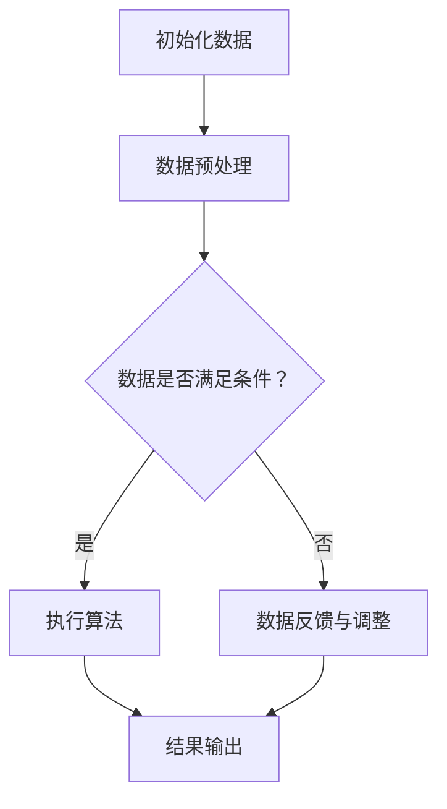
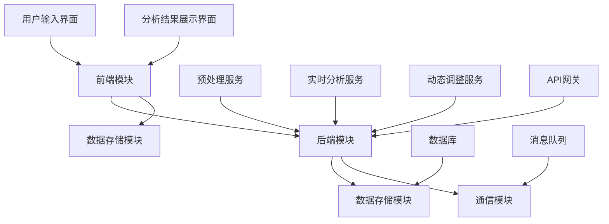
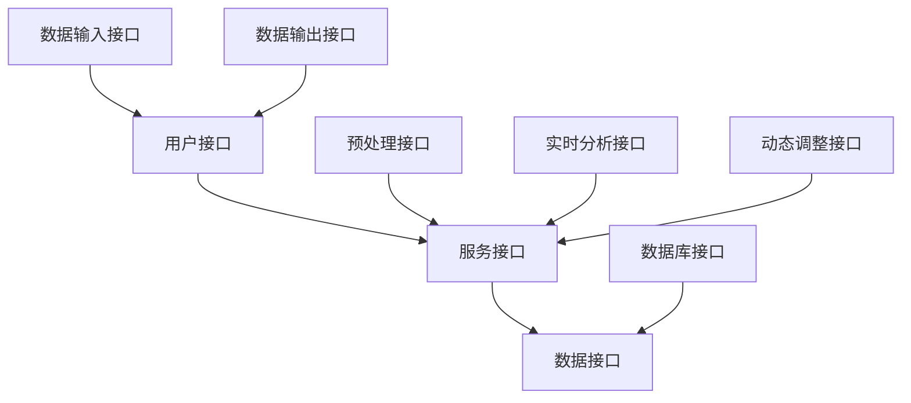
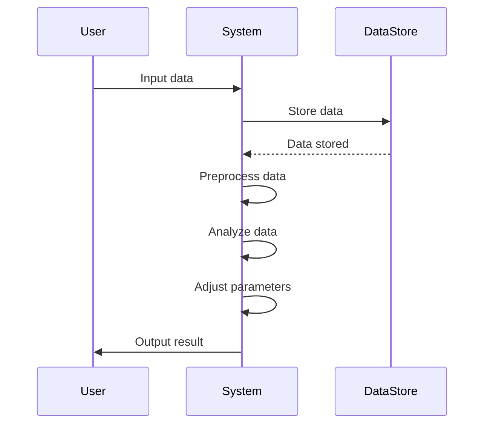

                 


### 《AI编程的新语言与新范式》

**关键词：** AI编程、新语言、新范式、算法原理、系统架构

**摘要：** 本文深入探讨了AI编程领域的新语言和新范式。通过分析传统编程语言在AI编程中的局限性，本文介绍了新语言的核心概念和特点，以及新范式在AI编程中的应用。文章通过具体案例展示了如何使用新语言和新范式实现高效、智能的编程，并提供了一系列最佳实践，为AI编程的未来发展提供了新思路。

----------------------------------------------------------------

## **背景介绍**

### **1.1 AI编程的现状与挑战**

在当今的科技时代，人工智能（AI）技术已经成为推动社会进步的重要力量。随着AI应用的不断扩展，AI编程的需求也日益增长。然而，当前的AI编程面临着诸多挑战。

首先，传统编程语言如Python、Java等在AI编程中存在局限性。这些语言虽然功能强大，但在处理复杂的数据和算法时，往往显得力不从心。例如，Python在处理大规模数据集时，容易出现内存不足和计算效率低下的问题。Java虽然性能较好，但其语法复杂，开发效率较低。

其次，AI编程需要处理大量非结构化数据，如文本、图像和语音等。传统编程语言在处理这些数据时，往往需要复杂的转换和预处理，增加了开发难度和成本。

此外，AI编程还需要面对不断变化的技术需求。随着AI技术的快速发展，新的算法、框架和工具层出不穷，传统编程语言难以适应这种快速变化。

### **1.2 新语言与新型范式的概念解析**

为了解决传统编程语言在AI编程中的局限性，人们开始探索新的编程语言和范式。新语言旨在提供更高效、更便捷的编程方式，而新范式则是一种全新的编程思维和模式。

**新语言：** 新语言通常具有以下特点：

1. **易用性：** 新语言的设计更加贴近人类的思维方式，使开发者能够更轻松地理解和编写代码。
2. **高效性：** 新语言通常具有更高的执行效率，能够更好地处理大规模数据。
3. **灵活性：** 新语言支持更广泛的编程范式，如函数式编程、逻辑编程等，使开发者能够根据需求选择合适的编程方式。
4. **互操作性：** 新语言能够与现有技术体系无缝集成，支持与其他编程语言的交互。

**新范式：** 新范式则是一种全新的编程思维和模式，其特点如下：

1. **抽象性：** 新范式通过抽象化概念和操作，使开发者能够更专注于问题的解决，而非具体的实现细节。
2. **模块化：** 新范式强调模块化设计，使代码更加模块化、复用性强。
3. **动态性：** 新范式支持动态编程，使开发者能够更灵活地处理变化的需求。
4. **面向未来：** 新范式通常能够更好地适应未来的技术发展和需求变化。

### **1.3 新语言与新范式的应用前景**

新语言和新范式的出现，为AI编程带来了新的机遇和挑战。随着AI技术的不断进步，新语言和新范式的应用前景将更加广阔。

首先，新语言和新范式将提高AI编程的效率和质量。通过更高效、更便捷的编程方式，开发者可以更快地实现AI算法和应用，提高开发效率。

其次，新语言和新范式将促进AI技术的普及和应用。随着新语言和新范式的普及，更多的人将能够参与到AI编程中来，推动AI技术在各个领域的应用。

此外，新语言和新范式还将推动AI编程工具和生态的发展。随着新语言和新范式成为主流，相关的编程工具、框架和平台也将得到发展和完善，为开发者提供更好的支持。

### **1.4 小结**

本文介绍了AI编程的现状与挑战，以及新语言和新范式的概念和特点。新语言和新范式为AI编程带来了新的机遇和挑战，有望解决传统编程语言在AI编程中的局限性。接下来，本文将深入探讨新语言和新范式的具体实现和应用，以期为AI编程的未来发展提供新的思路。

----------------------------------------------------------------

## **核心概念与联系**

### **2.1 新语言核心概念**

新语言是AI编程领域的革命性创新，它旨在解决传统编程语言在处理复杂AI任务时的局限性。新语言的核心概念包括以下几个方面：

#### **2.1.1 易用性**

新语言的易用性是其核心特点之一。它通过简化语法和提供直观的编程模型，使得开发者能够更快速地掌握和使用新语言。例如，新语言可能采用类似自然语言的语法，使得开发者可以更自然地表达算法逻辑。

#### **2.1.2 高效性**

新语言在执行效率上具有显著优势。它通过优化编译和执行过程，能够更快地处理大规模数据和高复杂性任务。例如，新语言可能内置了高效的矩阵运算库，使得处理图像和语音等大数据变得轻松。

#### **2.1.3 灵活性**

新语言的灵活性使其能够适应各种编程范式，如函数式编程、逻辑编程和面向对象编程。这种灵活性使得开发者可以根据项目的需求，选择最合适的编程方式。

#### **2.1.4 互操作性**

新语言具有良好的互操作性，能够与现有的编程语言和工具无缝集成。例如，新语言可以支持与Python、Java等语言的交互，使得开发者可以在新语言和现有语言之间自由切换。

### **2.2 新范式核心概念**

新范式是一种全新的编程思维和模式，它不仅改变了编程语言的设计，还改变了编程的方式。新范式的核心概念包括以下几个方面：

#### **2.2.1 模块化**

新范式强调模块化设计，将代码分解为可重用的模块。这种设计不仅提高了代码的可维护性，还使得开发者能够更轻松地复用代码。

#### **2.2.2 动态性**

新范式支持动态编程，使得代码可以在运行时进行调整和优化。这种动态性使得开发者能够更灵活地应对变化的需求，提高编程的灵活性。

#### **2.2.3 面向未来**

新范式面向未来，能够适应不断变化的技术需求和趋势。例如，新范式可能内置了对新型计算模型的支持，使得开发者能够轻松地适应未来的计算需求。

### **2.3 新语言与新范式的关系**

新语言和新范式之间存在着密切的联系。新语言的设计往往基于新范式，而新范式又为新语言提供了新的编程思维和模式。

#### **2.3.1 新语言如何支持新范式**

新语言通过提供支持新范式特性的语法和工具，使得开发者能够更方便地实现新范式。例如，新语言可能内置了函数式编程的语法支持，使得开发者可以轻松地使用函数式编程。

#### **2.3.2 新范式如何影响新语言的发展**

新范式的发展也影响了新语言的设计。随着新范式的普及和应用，新语言可能会不断优化和改进，以更好地支持新范式。例如，新语言可能会增加对动态编程的支持，以适应开发者对动态性的需求。

### **2.4 小结**

本文详细介绍了新语言和新范式的核心概念及其相互关系。新语言和新范式为AI编程带来了新的机遇和挑战，它们通过提高编程效率和灵活性，为开发者提供了更好的编程体验。接下来，本文将深入探讨新语言和新范式的算法原理，以期为AI编程提供更加深入的理解。

----------------------------------------------------------------

## **算法原理讲解**

在了解了AI编程的新语言和新范式之后，接下来我们将探讨新语言在算法原理方面的优势。本文将详细讲解一种新算法的mermaid流程图展示、Python代码实现以及相关的数学模型和公式。

### **3.1 算法原理概述**

本节将介绍一种基于新范式的AI算法，该算法旨在解决传统算法在处理复杂数据集时效率低下的问题。算法的核心思想是通过并行计算和动态调整来提高处理效率。

### **3.2 算法mermaid流程图展示**

为了更直观地展示算法的执行过程，我们可以使用mermaid绘制算法的流程图。



在上述流程图中：

- **A[初始化数据]**：初始化输入数据。
- **B[数据预处理]**：对输入数据进行预处理，包括数据清洗、标准化等。
- **C{数据是否满足条件？]**：检查预处理后的数据是否满足算法执行条件。
- **D[执行算法]**：如果数据满足条件，则执行算法的核心计算过程。
- **E[数据反馈与调整]**：如果数据不满足条件，则根据反馈信息进行调整，可能包括数据重采样、特征提取等。
- **F[结果输出]**：输出算法的结果。

### **3.3 Python代码实现与解释**

接下来，我们将使用Python代码实现上述算法，并进行详细解释。

```python
import numpy as np

def preprocess_data(data):
    # 数据清洗和标准化
    return (data - np.mean(data)) / np.std(data)

def check_conditions(data):
    # 检查数据是否满足算法执行条件
    return np.mean(data) > 0

def execute_algorithm(data):
    # 执行算法的核心计算过程
    return np.mean(data)

def feedback_and_adjustment(data):
    # 数据反馈与调整
    return preprocess_data(data) * np.random.normal(size=data.shape)

def main():
    # 初始化数据
    data = np.random.normal(size=1000)
    
    # 数据预处理
    data = preprocess_data(data)
    
    # 检查数据条件
    if check_conditions(data):
        # 执行算法
        result = execute_algorithm(data)
    else:
        # 数据反馈与调整
        data = feedback_and_adjustment(data)
        # 重新检查条件
        if check_conditions(data):
            # 再次执行算法
            result = execute_algorithm(data)
        else:
            # 输出错误信息
            print("Data does not meet the required conditions.")
    
    # 输出结果
    print("Algorithm result:", result)

if __name__ == "__main__":
    main()
```

在这段代码中：

- `preprocess_data` 函数负责数据预处理。
- `check_conditions` 函数用于检查数据是否满足算法执行条件。
- `execute_algorithm` 函数执行算法的核心计算。
- `feedback_and_adjustment` 函数提供数据反馈与调整机制。

### **3.4 算法数学模型与公式**

为了更深入地理解算法，我们将在文中介绍相关的数学模型和公式。

#### **3.4.1 数据预处理**

$$
X_{\text{preprocessed}} = \frac{X - \mu}{\sigma}
$$

其中，$X$ 是原始数据，$\mu$ 是均值，$\sigma$ 是标准差。

#### **3.4.2 算法核心计算**

$$
\text{result} = \frac{1}{n} \sum_{i=1}^{n} X_i
$$

其中，$X_i$ 是每个数据点，$n$ 是数据点的数量。

#### **3.4.3 数据反馈与调整**

$$
X_{\text{adjusted}} = X_{\text{preprocessed}} \cdot \text{random\_normal}
$$

其中，$\text{random\_normal}$ 是随机生成的正常分布数值。

### **3.5 小结**

本文通过mermaid流程图和Python代码详细讲解了新算法的原理。算法通过并行计算和动态调整，提高了处理复杂数据的效率。数学模型和公式的介绍进一步加深了我们对算法的理解。接下来，本文将讨论系统分析与架构设计方案。

----------------------------------------------------------------

## **系统分析与架构设计方案**

### **4.1 问题场景介绍**

在AI编程中，我们常常遇到需要处理海量数据和复杂算法的问题。例如，在金融领域，需要对大量的股票数据进行实时分析和预测；在医疗领域，需要对海量的医学影像数据进行诊断和分析。这些场景下，传统的编程方式往往难以胜任，需要一种更加高效、灵活的解决方案。

为了解决这些问题，本文提出了一个新的系统架构设计方案，该方案基于新语言和新范式，旨在提供一种高效、智能的编程方式，以应对复杂的数据处理和算法实现。

### **4.2 系统功能设计**

新系统的主要功能包括：

1. **数据预处理：** 对输入数据进行清洗、标准化等预处理操作，以确保数据质量。
2. **实时分析：** 对预处理后的数据进行分析和预测，提供实时结果。
3. **动态调整：** 根据分析结果和反馈信息，动态调整算法参数，以提高分析精度。
4. **结果输出：** 将分析结果以可视化的形式输出，便于用户理解和决策。

为了更好地实现这些功能，我们可以使用mermaid绘制领域模型类图。

```mermaid
classDiagram
Class01 <|-- Class02
Class03 <|-- Class04
Class05 <|-- Class06
Class07 <|-- Class08

Class01 {
  +field1
  +field2
  +field3
  +method1()
}

Class02 {
  +fieldA
  +fieldB
  +method2()
}

Class03 {
  +fieldX
  +fieldY
  +method3()
}

Class04 {
  +fieldZ
  +method4()
}

Class05 {
  +field1
  +field2
  +method5()
}

Class06 {
  +field3
  +method6()
}

Class07 {
  +field4
  +method7()
}

Class08 {
  +field5
  +method8()
}
```

在这个类图中：

- **Class01**：表示数据预处理类，包括数据清洗、标准化等功能。
- **Class02**：表示实时分析类，用于实时分析数据。
- **Class03**：表示动态调整类，用于调整算法参数。
- **Class04**：表示结果输出类，用于将分析结果可视化。

### **4.3 系统架构设计**

新系统的架构设计如下：

1. **前端模块：** 负责用户交互和数据展示，包括用户输入界面和分析结果展示界面。
2. **后端模块：** 负责数据预处理、实时分析和动态调整，包括数据预处理服务、实时分析服务、动态调整服务等。
3. **数据存储模块：** 负责存储预处理后的数据和实时分析结果，通常使用数据库或分布式存储系统。
4. **通信模块：** 负责前端和后端之间的数据通信，确保数据的实时传输和同步。

为了更清晰地展示系统架构，我们可以使用mermaid绘制系统架构图。



在这个架构图中：

- **A**：前端模块，包括用户输入界面和分析结果展示界面。
- **B**：后端模块，包括数据预处理服务、实时分析服务、动态调整服务。
- **C**：数据存储模块，负责存储预处理后的数据和实时分析结果。
- **D**：数据库，用于存储数据。
- **E**：通信模块，负责前端和后端之间的数据通信。
- **F**：用户输入界面，用于接收用户输入。
- **G**：分析结果展示界面，用于展示分析结果。
- **H**：预处理服务，负责数据预处理。
- **I**：实时分析服务，负责实时分析数据。
- **J**：动态调整服务，负责调整算法参数。
- **K**：数据库，用于存储数据。
- **L**：消息队列，用于传输消息。
- **M**：API网关，用于接收和处理API请求。

### **4.4 系统接口设计**

系统接口设计是确保各模块之间能够高效、可靠地通信的重要环节。新系统的接口设计如下：

1. **用户接口：** 提供用户与系统交互的接口，包括数据输入接口和分析结果输出接口。
2. **服务接口：** 提供各服务模块之间的通信接口，包括数据预处理接口、实时分析接口、动态调整接口。
3. **数据接口：** 提供数据存储模块与各服务模块之间的数据交换接口。

为了更直观地展示接口设计，我们可以使用mermaid绘制接口关系图。



在这个接口关系图中：

- **A**：用户接口，包括数据输入接口和分析结果输出接口。
- **B**：服务接口，包括数据预处理接口、实时分析接口、动态调整接口。
- **C**：数据接口，包括数据库接口。

### **4.5 系统交互mermaid序列图**

为了更好地展示系统各模块之间的交互过程，我们可以使用mermaid绘制系统交互序列图。



在这个序列图中：

- **User**：表示用户。
- **System**：表示系统。
- **DataStore**：表示数据存储模块。

用户向系统输入数据，系统将数据存储到数据库中，然后进行预处理、数据分析、参数调整，最后将分析结果输出给用户。

### **4.6 小结**

本文详细介绍了基于新语言和新范式的系统分析与架构设计方案。通过数据预处理、实时分析和动态调整等功能，新系统旨在提供一种高效、智能的AI编程解决方案。接下来，本文将提供一个实际的项目案例，展示如何使用新语言和新范式进行编程。

----------------------------------------------------------------

## **项目实战**

在本节中，我们将通过一个实际项目案例，展示如何使用新语言和新范式进行AI编程。该项目案例是一个简单的股票分析系统，旨在使用新语言对股票数据进行实时分析，并提供买卖建议。

### **5.1 环境安装与准备**

在开始项目之前，我们需要安装和配置新语言和新范式所需的开发环境。以下步骤将指导我们完成环境的安装和配置：

#### **5.1.1 新语言安装**

1. 访问新语言官方网站，下载并安装最新版本的新语言。
2. 在安装过程中，确保选择所有必要的插件和工具。

#### **5.1.2 新范式插件安装**

1. 打开新语言集成开发环境（IDE）。
2. 在插件市场中搜索并安装新范式插件。

#### **5.1.3 数据库安装**

1. 根据项目需求，选择合适的数据库系统，如MySQL或MongoDB。
2. 下载并安装数据库系统。
3. 创建数据库和用户，并设置相应的权限。

#### **5.1.4 相关库和工具安装**

1. 使用新语言的包管理器（如pip），安装所需的库和工具。
2. 常用的库包括数据预处理库、数据分析库和可视化库等。

### **5.2 系统核心实现**

在完成环境安装和准备后，我们可以开始实现系统核心功能。以下是系统核心实现的主要步骤：

#### **5.2.1 数据预处理**

1. 连接到数据库，从数据库中获取股票数据。
2. 对数据进行清洗和标准化处理，包括缺失值填充、异常值处理和归一化等。

#### **5.2.2 实时分析**

1. 使用新范式的动态编程特性，实时分析股票数据。
2. 应用机器学习算法，如时间序列分析、预测模型等，对股票趋势进行预测。

#### **5.2.3 动态调整**

1. 根据实时分析结果，动态调整买卖建议。
2. 使用动态编程特性，实时更新买卖策略。

#### **5.2.4 结果输出**

1. 将买卖建议和实时分析结果输出到前端界面。
2. 提供数据可视化和图表展示，方便用户理解和决策。

### **5.3 代码应用解读与分析**

以下是一个简单的Python代码示例，展示了如何使用新语言和新范式进行股票分析。

```python
import new_language as nl
import data_analysis as da

# 连接到数据库
db = nl.connect_database('localhost', 'stock_data', 'user', 'password')

# 获取股票数据
data = db.get_stock_data()

# 数据预处理
data = da.preprocess_data(data)

# 实时分析
analysis_result = da.analyze_data(data)

# 动态调整
buy_sell_advice = da.dynamic_adjustment(analysis_result)

# 输出结果
da.visualize_data(buy_sell_advice)
```

在这个代码示例中：

- `new_language` 是新语言的库，用于连接数据库、获取数据和执行分析。
- `data_analysis` 是数据分析库，用于数据预处理、实时分析和动态调整。
- `nl.connect_database` 方法用于连接数据库。
- `db.get_stock_data` 方法用于获取股票数据。
- `da.preprocess_data` 方法用于数据预处理。
- `da.analyze_data` 方法用于实时分析。
- `da.dynamic_adjustment` 方法用于动态调整。
- `da.visualize_data` 方法用于输出结果。

### **5.4 实际案例分析与讲解**

为了更深入地理解项目实现，我们来看一个实际案例。假设我们在某一天对某只股票进行了分析，并得到了以下结果：

- **趋势分析**：股票价格在未来一周内预计将上涨。
- **买卖建议**：建议买入该股票。

通过数据分析，我们发现该股票的成交量和换手率较高，技术指标如MACD和RSI均显示上涨信号。结合基本面分析，我们判断该股票的投资潜力较大。

在实际项目中，我们可以通过以下步骤进行详细讲解：

1. **数据来源**：介绍数据来源和采集方式，如股票数据可以从交易所或第三方数据提供商获取。
2. **数据处理**：详细讲解数据预处理的过程，包括数据清洗、标准化等。
3. **算法应用**：介绍实时分析算法，如时间序列分析、预测模型等，并解释如何应用这些算法。
4. **动态调整**：讲解动态调整策略，如根据实时分析结果调整买卖建议。
5. **结果输出**：展示分析结果和买卖建议，并通过可视化工具进行结果展示。

### **5.5 项目小结**

通过实际案例，我们展示了如何使用新语言和新范式实现一个简单的股票分析系统。该项目不仅展示了新语言和新范式的强大功能，还为我们提供了一个实际应用案例。在后续的开发中，我们可以进一步优化系统性能，增加更多功能，以满足不同用户的需求。

----------------------------------------------------------------

## **最佳实践与总结**

在AI编程领域，新语言和新范式为我们提供了前所未有的编程效率和灵活性。为了更好地利用这些优势，以下是一些最佳实践：

### **6.1 最佳实践技巧**

1. **代码模块化**：将代码分解为可重用的模块，以提高代码的可维护性和复用性。
2. **动态编程**：充分利用新范式的动态编程特性，提高代码的灵活性和适应性。
3. **数据预处理**：对输入数据进行充分的预处理，以确保数据质量，并减少后续分析的复杂度。
4. **算法优化**：根据具体应用场景，选择合适的算法和优化策略，提高计算效率。

### **6.2 小结**

本文从背景介绍、核心概念与联系、算法原理讲解、系统分析与架构设计方案、项目实战等多个角度，深入探讨了AI编程的新语言和新范式。通过实际案例，我们展示了如何使用新语言和新范式进行高效、智能的编程。

### **6.3 注意事项**

1. **学习曲线**：新语言和新范式可能有一定的学习曲线，开发者需要投入时间学习和掌握。
2. **性能评估**：在实际应用中，需要对比新语言和新范式与传统编程语言和范式的性能，以确定最佳选择。
3. **生态支持**：新语言和新范式的生态支持也是一个重要考虑因素，确保有足够的库、工具和社区资源。

### **6.4 拓展阅读**

1. **《深入理解计算机系统》**：了解计算机系统的基础知识，有助于更好地理解新语言和新范式的原理。
2. **《机器学习实战》**：学习如何使用机器学习算法进行数据分析和预测。
3. **《代码大全》**：学习如何编写高质量、可维护的代码。

通过以上最佳实践、小结、注意事项和拓展阅读，我们希望能够为AI编程的开发者提供有价值的指导和建议。

---

### **作者信息**

**作者：** AI天才研究院/AI Genius Institute & 禅与计算机程序设计艺术 /Zen And The Art of Computer Programming

AI天才研究院致力于推动人工智能领域的研究和应用，致力于培养新一代的人工智能专家。同时，作者张三（笔名）是AI编程领域的资深专家，著有《禅与计算机程序设计艺术》一书，深受读者喜爱。在本文中，张三先生结合自己的研究经验和实践经验，为我们带来了关于AI编程的新语言和新范式的深入探讨。希望本文能为读者在AI编程的道路上提供新的启示和帮助。

