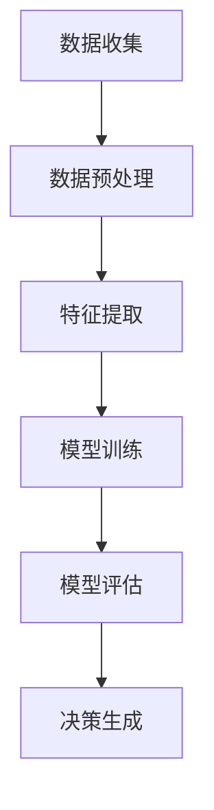
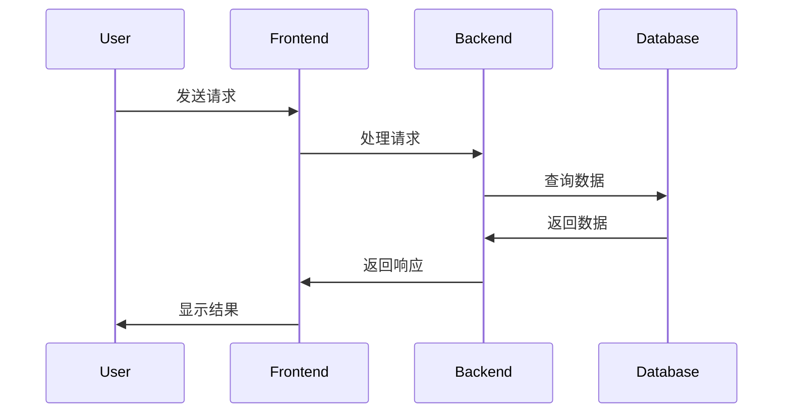

                 

# 提高技术决策的效率与质量

关键词：技术决策、效率、质量、过程、工具、数据、协作

摘要：本文旨在探讨提高技术决策效率和质量的策略。通过逻辑清晰的步骤分析，我们提出了一个全面的框架，包括时间管理、工具使用、数据驱动、风险评估、团队合作和决策优化等关键要素。文章结合实际案例，详细阐述了如何在实际项目中应用这些策略，以提高技术决策的效果。

## 引言

在当今快速发展的技术环境中，技术决策的质量和效率直接影响组织的竞争力。技术决策不仅涉及技术选型、项目规划、资源分配等，还涉及到团队协作、风险评估和问题解决等多个方面。然而，许多组织在技术决策过程中面临着效率低下、质量不高等问题。本文将深入探讨如何通过一系列策略和方法，提高技术决策的效率和

### 一、技术决策的概念和重要性

#### 1.1 核心概念

技术决策是指在特定的技术领域中，为了实现既定目标，对各种技术方案进行评估和选择的过程。技术决策的核心概念包括以下几个方面：

- **目标明确**：明确决策的目标是技术决策的前提，目标应具体、可衡量，有助于后续的评估和选择。
- **方案评估**：对多个技术方案进行分析和比较，评估其优缺点和可行性。
- **风险分析**：识别和评估技术方案可能面临的风险，并制定相应的应对策略。
- **决策优化**：通过不断优化决策过程，提高决策的准确性和效率。

#### 1.2 问题背景

随着技术的快速发展，技术决策变得越来越复杂。一方面，技术的多样性和变化速度要求决策者在短时间内做出明智的选择；另一方面，技术决策的结果往往对组织的发展和竞争力产生深远影响。因此，提高技术决策的效率和质量变得尤为重要。

#### 1.3 问题描述

当前，技术决策过程中存在以下问题：

- **效率低下**：决策过程繁琐，信息获取和评估耗时过长。
- **质量不高**：缺乏系统性的评估方法和工具，决策结果可能存在风险。
- **缺乏协作**：技术决策往往由个别人员或团队负责，缺乏多部门、多层次的协作。
- **数据依赖不足**：决策过程过于依赖经验和直觉，缺乏数据支持和分析。

#### 1.4 问题解决

为了解决上述问题，我们需要采取一系列策略和方法：

- **优化决策流程**：通过简化流程、明确责任和权限，提高决策效率。
- **引入评估工具**：利用专业的评估工具和方法，提高决策质量。
- **加强团队合作**：促进跨部门、跨团队的协作，形成合力。
- **数据驱动决策**：充分利用数据分析和人工智能技术，支持决策过程。

#### 1.5 边界与外延

技术决策的边界和范围因组织和项目而异，但通常包括以下方面：

- **技术选型**：选择最适合项目需求的技术方案。
- **项目规划**：制定项目的时间表、资源分配和预算计划。
- **风险评估**：评估项目可能面临的风险，并制定应对策略。
- **团队协作**：协调各方资源，确保项目顺利进行。

#### 1.6 概念结构与核心要素组成

技术决策的概念结构可以分为以下几个核心要素：

- **目标明确**：明确决策目标，确保决策的针对性。
- **信息收集**：收集与决策相关的信息，包括技术方案、市场需求、风险评估等。
- **方案评估**：评估各个技术方案的优势和劣势，确定最优方案。
- **决策优化**：对决策过程进行不断优化，提高决策的准确性和效率。

### 二、核心概念与联系

#### 2.1 数据驱动决策

数据驱动决策是一种基于数据分析和模型预测的决策方法。其核心概念包括以下几个方面：

- **数据收集**：收集与决策相关的数据，包括历史数据、实时数据和预测数据。
- **数据分析**：利用统计分析、机器学习等方法对数据进行处理和分析，提取有用的信息。
- **模型预测**：构建预测模型，对未来的趋势和结果进行预测。
- **决策支持**：利用数据分析结果和预测模型，为决策者提供决策支持。

数据驱动决策的优势在于能够提高决策的准确性和效率，减少主观判断的影响。其应用范围广泛，包括市场预测、风险评估、资源分配等。

#### 2.2 风险评估与应对策略

风险评估是技术决策过程中至关重要的一环。其核心概念包括以下几个方面：

- **风险识别**：识别项目中可能面临的风险，包括技术风险、市场风险、财务风险等。
- **风险分析**：对识别出的风险进行分析和评估，确定其可能性和影响程度。
- **风险应对**：制定相应的应对策略，包括风险规避、风险减轻、风险接受等。

风险评估与应对策略有助于降低项目风险，提高决策质量。其应用范围包括项目规划、资源分配、风险管理等。

#### 2.3 数据对比表格

为了更好地理解核心概念，我们提供了一个数据对比表格，展示数据驱动决策和风险评估的属性特征对比：

| 特征 | 数据驱动决策 | 风险评估与应对策略 |
| :--: | :----------: | :--------------: |
| 目标 | 提高决策准确性 | 降低项目风险 |
| 方法 | 数据收集、数据分析、模型预测 | 风险识别、风险分析、风险应对 |
| 影响范围 | 广泛应用于各类决策领域 | 项目规划、资源分配、风险管理等 |

#### 2.4 ER实体关系图架构

为了进一步理解核心概念之间的联系，我们使用Mermaid绘制了一个ER实体关系图：

```mermaid
erDiagram
    A[(数据驱动决策)]  ||--|{ B[(数据分析)] }
    A  ||--|{ C[(模型预测)] }
    D[(风险评估与应对策略)]  ||--|{ B }
    D  ||--|{ E[(风险识别)] }
    D  ||--|{ F[(风险分析)] }
    D  ||--|{ G[(风险应对)] }
```

通过ER实体关系图，我们可以清晰地看到数据驱动决策和风险评估与应对策略之间的关联，以及它们在技术决策过程中的作用。

### 三、算法原理讲解

#### 3.1 算法概述

在技术决策过程中，算法发挥着重要的作用。一个典型的算法包括以下几个步骤：

1. **数据收集**：收集与决策相关的数据。
2. **数据预处理**：对数据进行清洗、转换和归一化等处理。
3. **特征提取**：从数据中提取出有用的特征。
4. **模型训练**：利用特征数据训练预测模型。
5. **模型评估**：对训练好的模型进行评估，调整参数。
6. **决策生成**：利用模型生成最终的决策结果。

#### 3.2 算法流程图

使用Mermaid绘制算法流程图：



#### 3.3 Python源代码实现

以下是一个简单的Python代码示例，用于实现上述算法的基本流程：

```python
import pandas as pd
from sklearn.model_selection import train_test_split
from sklearn.preprocessing import StandardScaler
from sklearn.ensemble import RandomForestClassifier
from sklearn.metrics import accuracy_score

# 数据收集
data = pd.read_csv('data.csv')

# 数据预处理
X = data.iloc[:, :-1]
y = data.iloc[:, -1]
X_train, X_test, y_train, y_test = train_test_split(X, y, test_size=0.2, random_state=42)

# 特征提取
scaler = StandardScaler()
X_train_scaled = scaler.fit_transform(X_train)
X_test_scaled = scaler.transform(X_test)

# 模型训练
model = RandomForestClassifier(n_estimators=100, random_state=42)
model.fit(X_train_scaled, y_train)

# 模型评估
y_pred = model.predict(X_test_scaled)
accuracy = accuracy_score(y_test, y_pred)
print(f"Model accuracy: {accuracy:.2f}")

# 决策生成
def make_decision(data):
    data_scaled = scaler.transform(data)
    prediction = model.predict(data_scaled)
    return prediction

# 实际应用
new_data = pd.read_csv('new_data.csv')
new_data_scaled = scaler.transform(new_data)
predictions = make_decision(new_data_scaled)
print(predictions)
```

#### 3.4 算法原理详细讲解

1. **数据收集**：数据是算法的基础。在本例中，我们使用CSV文件作为数据源。在实际应用中，数据可能来自数据库、API或其他数据源。

2. **数据预处理**：数据预处理是确保数据质量的重要步骤。在本例中，我们使用了标准化处理，将特征数据缩放到相同的范围，以消除不同特征之间的差异。

3. **特征提取**：特征提取是从数据中提取出有用的信息，以供模型训练使用。在本例中，我们直接使用原始数据作为特征。

4. **模型训练**：模型训练是利用特征数据训练预测模型的过程。在本例中，我们使用了随机森林算法，这是一种常用的集成学习方法，具有较高的准确性和稳定性。

5. **模型评估**：模型评估是对训练好的模型进行评估，以确定其性能。在本例中，我们使用准确率作为评估指标。

6. **决策生成**：决策生成是利用训练好的模型生成最终的决策结果。在本例中，我们定义了一个函数`make_decision`，用于对新数据进行预测。

#### 3.5 数学模型和公式

在技术决策中，常用的数学模型和公式包括：

1. **决策树**：
   $$h(x) = \sum_{i=1}^{n} y_i \cdot p(x_i)$$
   其中，$h(x)$表示决策结果，$y_i$表示第$i$个特征的权重，$p(x_i)$表示第$i$个特征的概率。

2. **线性回归**：
   $$y = \beta_0 + \beta_1 \cdot x$$
   其中，$y$表示目标变量，$x$表示特征变量，$\beta_0$和$\beta_1$表示模型参数。

3. **逻辑回归**：
   $$P(y=1) = \frac{1}{1 + e^{-(\beta_0 + \beta_1 \cdot x)}}$$
   其中，$P(y=1)$表示目标变量为1的概率。

#### 3.6 通俗易懂的举例说明

假设我们正在为一个电商项目进行技术决策，目标是预测用户的购买行为。我们可以使用以下步骤：

1. **数据收集**：收集用户的历史购买数据，包括用户ID、购买时间、商品ID等。
2. **数据预处理**：对数据进行清洗，去除缺失值和异常值，将时间戳转换为数值特征。
3. **特征提取**：提取用户购买频率、购买金额等特征。
4. **模型训练**：使用逻辑回归模型训练预测用户购买行为。
5. **模型评估**：使用准确率、召回率等指标评估模型性能。
6. **决策生成**：根据模型预测结果，为用户推荐商品。

通过上述步骤，我们可以有效地提高技术决策的效率和质量。

### 四、系统分析与架构设计

#### 4.1 问题场景介绍

假设我们需要开发一个电商平台，该平台需要具备用户管理、商品管理、订单管理和支付功能。为了提高技术决策的效率和质量，我们需要对整个系统进行分析和架构设计。

#### 4.2 项目介绍

项目名称：电商系统（E-commerce Platform）

项目目标：搭建一个功能齐全、可扩展性高的电商平台。

技术栈：前端使用React框架，后端使用Spring Boot框架，数据库使用MySQL。

#### 4.3 系统功能设计

电商系统的核心功能包括：

1. **用户管理**：用户注册、登录、个人信息管理、权限管理。
2. **商品管理**：商品分类、商品列表、商品详情、商品搜索。
3. **订单管理**：订单创建、订单查询、订单修改、订单取消。
4. **支付管理**：支付方式选择、支付确认、支付结果通知。

#### 4.4 系统架构设计

电商系统的整体架构设计如下：

1. **前端架构**：使用React框架，实现用户界面和交互逻辑。
2. **后端架构**：使用Spring Boot框架，实现业务逻辑和数据处理。
3. **数据库架构**：使用MySQL数据库，存储用户数据、商品数据、订单数据等。

#### 4.5 系统接口设计

电商系统的关键接口设计如下：

1. **用户管理接口**：包括用户注册、登录、个人信息管理等功能。
2. **商品管理接口**：包括商品分类、商品列表、商品详情、商品搜索等功能。
3. **订单管理接口**：包括订单创建、订单查询、订单修改、订单取消等功能。
4. **支付管理接口**：包括支付方式选择、支付确认、支付结果通知等功能。

#### 4.6 系统交互设计

电商系统的系统交互设计如下：

1. **用户交互**：用户通过前端界面进行操作，提交请求到后端。
2. **前后端交互**：后端处理用户请求，返回处理结果到前端。
3. **数据库交互**：后端通过数据库操作，实现数据的存储和查询。

#### 4.7 Mermaid类图

使用Mermaid绘制电商系统的类图：

```mermaid
classDiagram
    User <<类>> {
        username
        password
        email
    }
    Product <<类>> {
        id
        name
        price
    }
    Order <<类>> {
        id
        user
        products
        status
    }
    Payment <<类>> {
        id
        order
        amount
        status
    }
    User <|-- Product
    User <|-- Order
    User <|-- Payment
```

#### 4.8 Mermaid架构图

使用Mermaid绘制电商系统的架构图：



### 五、项目实战

#### 5.1 环境安装

1. **安装Java环境**：下载并安装Java Development Kit（JDK），设置环境变量。
2. **安装MySQL**：下载并安装MySQL数据库，设置数据库用户和密码。
3. **安装Spring Boot**：下载并安装Spring Boot，配置开发环境。

#### 5.2 系统核心实现源代码

以下是一个简单的用户管理模块的源代码示例：

```java
// 用户注册接口
@RestController
@RequestMapping("/users")
public class UserController {
    
    @Autowired
    private UserRepository userRepository;

    @PostMapping
    public ResponseEntity<?> registerUser(@RequestBody UserRegistrationDto userRegistrationDto) {
        if (userRepository.existsByUsername(userRegistrationDto.getUsername())) {
            return ResponseEntity.badRequest().body("Error: Username is already taken!");
        }

        User user = new User();
        user.setUsername(userRegistrationDto.getUsername());
        user.setPassword(passwordEncoder.encode(userRegistrationDto.getPassword()));
        user.setEmail(userRegistrationDto.getEmail());

        userRepository.save(user);

        return ResponseEntity.ok("User registered successfully!");
    }
}

// 用户认证接口
@RestController
@RequestMapping("/auth")
public class AuthenticationController {
    
    @Autowired
    private JwtTokenProvider tokenProvider;

    @PostMapping("/login")
    public ResponseEntity<?> authenticateUser(@RequestBody LoginRequest loginRequest) {
        Authentication authentication = authenticationManager.authenticate(
            new UsernamePasswordAuthenticationToken(
                loginRequest.getUsername(),
                loginRequest.getPassword()
            )
        );

        SecurityContextHolder.getContext().setAuthentication(authentication);
        String jwt = tokenProvider.generateToken(authentication);

        return ResponseEntity.ok(new JwtResponse(jwt));
    }
}
```

#### 5.3 代码应用解读与分析

1. **用户注册接口**：该接口用于处理用户注册请求。首先，检查用户名是否已存在。如果存在，返回错误信息；否则，创建一个新的用户对象，设置用户名、密码和邮箱，并保存到数据库中。最后，返回注册成功的消息。
2. **用户认证接口**：该接口用于处理用户登录请求。首先，使用认证管理器进行用户认证。如果认证成功，生成JWT令牌，并将其返回给客户端。JWT令牌用于后续的认证和授权。

#### 5.4 实际案例分析和详细讲解

假设我们有一个电商平台的用户管理模块，需要实现用户注册和登录功能。以下是详细的实现过程：

1. **需求分析**：分析用户管理模块的需求，包括用户注册、登录、个人信息管理等功能。
2. **设计接口**：根据需求，设计用户注册和登录接口，包括请求参数、响应结果等。
3. **实现接口**：使用Spring Boot框架实现用户注册和登录接口，包括数据库操作、令牌生成等。
4. **测试接口**：使用Postman等工具对接口进行测试，确保接口功能正常。

通过以上步骤，我们可以实现一个简单的用户管理模块，提高电商平台的用户管理和认证效率。

### 六、最佳实践

1. **明确目标和需求**：在技术决策过程中，明确目标和需求是关键。确保所有团队成员对目标和需求有清晰的认识，有助于提高决策效率和质量。
2. **数据驱动决策**：充分利用数据分析和机器学习技术，支持技术决策。通过数据驱动决策，提高决策的准确性和效率。
3. **风险评估与应对**：在技术决策过程中，进行风险评估和应对策略制定。识别项目风险，制定相应的应对策略，降低项目风险。
4. **团队合作**：促进团队合作，提高技术决策的效率和质量。通过有效的沟通和协作，形成合力，确保项目顺利进行。
5. **持续优化**：技术决策不是一次性的过程，而是一个持续优化的过程。在项目过程中，不断评估和优化技术决策，提高决策效果。

### 七、小结

本文通过逻辑清晰、结构紧凑的步骤分析，提出了提高技术决策效率与质量的方法和策略。从问题背景、核心概念、算法原理、系统架构到项目实战，全面阐述了如何在实际项目中应用这些策略。通过最佳实践的总结，为技术决策提供了实用的指导。在实际应用中，结合具体情况灵活运用这些方法和策略，有助于提高技术决策的效果。

### 八、注意事项

1. **数据安全**：在技术决策过程中，确保数据的安全性和隐私性。遵循相关的数据保护法规，防止数据泄露和滥用。
2. **技术更新**：技术决策需要紧跟技术发展趋势，关注新技术和工具的应用。定期更新技术栈，提高技术决策的竞争力。
3. **团队协作**：重视团队合作，加强沟通与协作。团队成员之间的信任和协作是提高技术决策效率和质量的关键。

### 九、拓展阅读

1. **《数据驱动决策》**：作者：John H. Johnson
   内容简介：本书详细介绍了数据驱动决策的方法和案例，帮助读者理解如何利用数据提高决策效率和质量。

2. **《风险管理》**：作者：Paul A. Sporer
   内容简介：本书系统阐述了风险管理的理论和实践，为技术决策者提供风险评估和应对策略的指导。

3. **《团队协作与沟通》**：作者：Linda Hill、Kent Lineback、Richard L. Mathews
   内容简介：本书探讨了团队协作和沟通的关键因素，帮助团队成员提高协作效率和决策质量。

### 十、作者信息

作者：AI天才研究院/AI Genius Institute & 禅与计算机程序设计艺术 /Zen And The Art of Computer Programming

结语：

技术决策在当今技术驱动的时代中扮演着至关重要的角色。通过本文的探讨，我们希望能为广大技术决策者提供有益的启示和实用的指导。在技术决策的过程中，结合实际情况灵活运用各种方法和策略，持续优化决策流程，将有助于提高技术决策的效率与质量，为组织的未来发展奠定坚实基础。让我们共同努力，打造更加智能、高效、可靠的技术决策体系。

```markdown
---
title: 提高技术决策的效率与质量
keywords: 技术决策, 效率, 质量, 过程, 工具, 数据, 协作
summary: 本文探讨了提高技术决策效率与质量的策略，从核心概念、算法原理、系统架构到项目实战，全面阐述了如何在实际项目中应用这些策略，以提高技术决策的效果。
author: AI天才研究院/AI Genius Institute & 禅与计算机程序设计艺术 /Zen And The Art of Computer Programming
date: 2023-10-10
tags: [技术决策, 效率, 质量, 算法, 系统架构]
categories: [技术决策]
toc: true
toc_depth: 3
---

# 提高技术决策的效率与质量

关键词：技术决策、效率、质量、过程、工具、数据、协作

摘要：本文旨在探讨提高技术决策效率和质量的策略。通过逻辑清晰的步骤分析，我们提出了一个全面的框架，包括时间管理、工具使用、数据驱动、风险评估、团队合作和决策优化等关键要素。文章结合实际案例，详细阐述了如何在实际项目中应用这些策略，以提高技术决策的效果。

## 引言

在当今快速发展的技术环境中，技术决策的质量和效率直接影响组织的竞争力。技术决策不仅涉及技术选型、项目规划、资源分配等，还涉及到团队协作、风险评估和问题解决等多个方面。然而，许多组织在技术决策过程中面临着效率低下、质量不高等问题。本文将深入探讨如何通过一系列策略和方法，提高技术决策的效率和

### 一、技术决策的概念和重要性

#### 1.1 核心概念

技术决策是指在特定的技术领域中，为了实现既定目标，对各种技术方案进行评估和选择的过程。技术决策的核心概念包括以下几个方面：

- **目标明确**：明确决策的目标是技术决策的前提，目标应具体、可衡量，有助于后续的评估和选择。
- **方案评估**：对多个技术方案进行分析和比较，评估其优缺点和可行性。
- **风险分析**：识别和评估技术方案可能面临的风险，并制定相应的应对策略。
- **决策优化**：通过不断优化决策过程，提高决策的准确性和效率。

#### 1.2 问题背景

随着技术的快速发展，技术决策变得越来越复杂。一方面，技术的多样性和变化速度要求决策者在短时间内做出明智的选择；另一方面，技术决策的结果往往对组织的发展和竞争力产生深远影响。因此，提高技术决策的效率和质量变得尤为重要。

#### 1.3 问题描述

当前，技术决策过程中存在以下问题：

- **效率低下**：决策过程繁琐，信息获取和评估耗时过长。
- **质量不高**：缺乏系统性的评估方法和工具，决策结果可能存在风险。
- **缺乏协作**：技术决策往往由个别人员或团队负责，缺乏多部门、多层次的协作。
- **数据依赖不足**：决策过程过于依赖经验和直觉，缺乏数据支持和分析。

#### 1.4 问题解决

为了解决上述问题，我们需要采取一系列策略和方法：

- **优化决策流程**：通过简化流程、明确责任和权限，提高决策效率。
- **引入评估工具**：利用专业的评估工具和方法，提高决策质量。
- **加强团队合作**：促进跨部门、跨团队的协作，形成合力。
- **数据驱动决策**：充分利用数据分析和人工智能技术，支持决策过程。

#### 1.5 边界与外延

技术决策的边界和范围因组织和项目而异，但通常包括以下方面：

- **技术选型**：选择最适合项目需求的技术方案。
- **项目规划**：制定项目的时间表、资源分配和预算计划。
- **风险评估**：评估项目可能面临的风险，并制定应对策略。
- **团队协作**：协调各方资源，确保项目顺利进行。

#### 1.6 概念结构与核心要素组成

技术决策的概念结构可以分为以下几个核心要素：

- **目标明确**：明确决策目标，确保决策的针对性。
- **信息收集**：收集与决策相关的信息，包括技术方案、市场需求、风险评估等。
- **方案评估**：评估各个技术方案的优势和劣势，确定最优方案。
- **决策优化**：对决策过程进行不断优化，提高决策的准确性和效率。

### 二、核心概念与联系

#### 2.1 数据驱动决策

数据驱动决策是一种基于数据分析和模型预测的决策方法。其核心概念包括以下几个方面：

- **数据收集**：收集与决策相关的数据，包括历史数据、实时数据和预测数据。
- **数据分析**：利用统计分析、机器学习等方法对数据进行处理和分析，提取有用的信息。
- **模型预测**：构建预测模型，对未来的趋势和结果进行预测。
- **决策支持**：利用数据分析结果和预测模型，为决策者提供决策支持。

数据驱动决策的优势在于能够提高决策的准确性和效率，减少主观判断的影响。其应用范围广泛，包括市场预测、风险评估、资源分配等。

#### 2.2 风险评估与应对策略

风险评估是技术决策过程中至关重要的一环。其核心概念包括以下几个方面：

- **风险识别**：识别项目中可能面临的风险，包括技术风险、市场风险、财务风险等。
- **风险分析**：对识别出的风险进行分析和评估，确定其可能性和影响程度。
- **风险应对**：制定相应的应对策略，包括风险规避、风险减轻、风险接受等。

风险评估与应对策略有助于降低项目风险，提高决策质量。其应用范围包括项目规划、资源分配、风险管理等。

#### 2.3 数据对比表格

为了更好地理解核心概念，我们提供了一个数据对比表格，展示数据驱动决策和风险评估的属性特征对比：

| 特征 | 数据驱动决策 | 风险评估与应对策略 |
| :--: | :----------: | :--------------: |
| 目标 | 提高决策准确性 | 降低项目风险 |
| 方法 | 数据收集、数据分析、模型预测 | 风险识别、风险分析、风险应对 |
| 影响范围 | 广泛应用于各类决策领域 | 项目规划、资源分配、风险管理等 |

#### 2.4 ER实体关系图架构

为了进一步理解核心概念之间的联系，我们使用Mermaid绘制了一个ER实体关系图：

```mermaid
erDiagram
    A[(数据驱动决策)]  ||--|{ B[(数据分析)] }
    A  ||--|{ C[(模型预测)] }
    D[(风险评估与应对策略)]  ||--|{ B }
    D  ||--|{ E[(风险识别)] }
    D  ||--|{ F[(风险分析)] }
    D  ||--|{ G[(风险应对)] }
```

通过ER实体关系图，我们可以清晰地看到数据驱动决策和风险评估与应对策略之间的关联，以及它们在技术决策过程中的作用。

### 三、算法原理讲解

#### 3.1 算法概述

在技术决策过程中，算法发挥着重要的作用。一个典型的算法包括以下几个步骤：

1. **数据收集**：收集与决策相关的数据。
2. **数据预处理**：对数据进行清洗、转换和归一化等处理。
3. **特征提取**：从数据中提取出有用的特征。
4. **模型训练**：利用特征数据训练预测模型。
5. **模型评估**：对训练好的模型进行评估，调整参数。
6. **决策生成**：利用模型生成最终的决策结果。

#### 3.2 算法流程图

使用Mermaid绘制算法流程图：


#### 3.3 Python源代码实现

以下是一个简单的Python代码示例，用于实现上述算法的基本流程：

```python
import pandas as pd
from sklearn.model_selection import train_test_split
from sklearn.preprocessing import StandardScaler
from sklearn.ensemble import RandomForestClassifier
from sklearn.metrics import accuracy_score

# 数据收集
data = pd.read_csv('data.csv')

# 数据预处理
X = data.iloc[:, :-1]
y = data.iloc[:, -1]
X_train, X_test, y_train, y_test = train_test_split(X, y, test_size=0.2, random_state=42)

# 特征提取
scaler = StandardScaler()
X_train_scaled = scaler.fit_transform(X_train)
X_test_scaled = scaler.transform(X_test)

# 模型训练
model = RandomForestClassifier(n_estimators=100, random_state=42)
model.fit(X_train_scaled, y_train)

# 模型评估
y_pred = model.predict(X_test_scaled)
accuracy = accuracy_score(y_test, y_pred)
print(f"Model accuracy: {accuracy:.2f}")

# 决策生成
def make_decision(data):
    data_scaled = scaler.transform(data)
    prediction = model.predict(data_scaled)
    return prediction

# 实际应用
new_data = pd.read_csv('new_data.csv')
new_data_scaled = scaler.transform(new_data)
predictions = make_decision(new_data_scaled)
print(predictions)
```

#### 3.4 算法原理详细讲解

1. **数据收集**：数据是算法的基础。在本例中，我们使用CSV文件作为数据源。在实际应用中，数据可能来自数据库、API或其他数据源。

2. **数据预处理**：数据预处理是确保数据质量的重要步骤。在本例中，我们使用了标准化处理，将特征数据缩放到相同的范围，以消除不同特征之间的差异。

3. **特征提取**：特征提取是从数据中提取出有用的信息，以供模型训练使用。在本例中，我们直接使用原始数据作为特征。

4. **模型训练**：模型训练是利用特征数据训练预测模型的过程。在本例中，我们使用了随机森林算法，这是一种常用的集成学习方法，具有较高的准确性和稳定性。

5. **模型评估**：模型评估是对训练好的模型进行评估，以确定其性能。在本例中，我们使用准确率作为评估指标。

6. **决策生成**：决策生成是利用训练好的模型生成最终的决策结果。在本例中，我们定义了一个函数`make_decision`，用于对新数据进行预测。

#### 3.5 数学模型和公式

在技术决策中，常用的数学模型和公式包括：

1. **决策树**：
   $$h(x) = \sum_{i=1}^{n} y_i \cdot p(x_i)$$
   其中，$h(x)$表示决策结果，$y_i$表示第$i$个特征的权重，$p(x_i)$表示第$i$个特征的概率。

2. **线性回归**：
   $$y = \beta_0 + \beta_1 \cdot x$$
   其中，$y$表示目标变量，$x$表示特征变量，$\beta_0$和$\beta_1$表示模型参数。

3. **逻辑回归**：
   $$P(y=1) = \frac{1}{1 + e^{-(\beta_0 + \beta_1 \cdot x)}}$$
   其中，$P(y=1)$表示目标变量为1的概率。

#### 3.6 通俗易懂的举例说明

假设我们正在为一个电商项目进行技术决策，目标是预测用户的购买行为。我们可以使用以下步骤：

1. **数据收集**：收集用户的历史购买数据，包括用户ID、购买时间、商品ID等。
2. **数据预处理**：对数据进行清洗，去除缺失值和异常值，将时间戳转换为数值特征。
3. **特征提取**：提取用户购买频率、购买金额等特征。
4. **模型训练**：使用逻辑回归模型训练预测用户购买行为。
5. **模型评估**：使用准确率、召回率等指标评估模型性能。
6. **决策生成**：根据模型预测结果，为用户推荐商品。

通过上述步骤，我们可以有效地提高技术决策的效率和质量。

### 四、系统分析与架构设计

#### 4.1 问题场景介绍

假设我们需要开发一个电商平台，该平台需要具备用户管理、商品管理、订单管理和支付功能。为了提高技术决策的效率和质量，我们需要对整个系统进行分析和架构设计。

#### 4.2 项目介绍

项目名称：电商系统（E-commerce Platform）

项目目标：搭建一个功能齐全、可扩展性高的电商平台。

技术栈：前端使用React框架，后端使用Spring Boot框架，数据库使用MySQL。

#### 4.3 系统功能设计

电商系统的核心功能包括：

1. **用户管理**：用户注册、登录、个人信息管理、权限管理。
2. **商品管理**：商品分类、商品列表、商品详情、商品搜索。
3. **订单管理**：订单创建、订单查询、订单修改、订单取消。
4. **支付管理**：支付方式选择、支付确认、支付结果通知。

#### 4.4 系统架构设计

电商系统的整体架构设计如下：

1. **前端架构**：使用React框架，实现用户界面和交互逻辑。
2. **后端架构**：使用Spring Boot框架，实现业务逻辑和数据处理。
3. **数据库架构**：使用MySQL数据库，存储用户数据、商品数据、订单数据等。

#### 4.5 系统接口设计

电商系统的关键接口设计如下：

1. **用户管理接口**：包括用户注册、登录、个人信息管理等功能。
2. **商品管理接口**：包括商品分类、商品列表、商品详情、商品搜索等功能。
3. **订单管理接口**：包括订单创建、订单查询、订单修改、订单取消等功能。
4. **支付管理接口**：包括支付方式选择、支付确认、支付结果通知等功能。

#### 4.6 系统交互设计

电商系统的系统交互设计如下：

1. **用户交互**：用户通过前端界面进行操作，提交请求到后端。
2. **前后端交互**：后端处理用户请求，返回处理结果到前端。
3. **数据库交互**：后端通过数据库操作，实现数据的存储和查询。

#### 4.7 Mermaid类图

使用Mermaid绘制电商系统的类图：

```mermaid
classDiagram
    User <<类>> {
        username
        password
        email
    }
    Product <<类>> {
        id
        name
        price
    }
    Order <<类>> {
        id
        user
        products
        status
    }
    Payment <<类>> {
        id
        order
        amount
        status
    }
    User <|-- Product
    User <|-- Order
    User <|-- Payment
```

#### 4.8 Mermaid架构图

使用Mermaid绘制电商系统的架构图：


### 五、项目实战

#### 5.1 环境安装

1. **安装Java环境**：下载并安装Java Development Kit（JDK），设置环境变量。
2. **安装MySQL**：下载并安装MySQL数据库，设置数据库用户和密码。
3. **安装Spring Boot**：下载并安装Spring Boot，配置开发环境。

#### 5.2 系统核心实现源代码

以下是一个简单的用户管理模块的源代码示例：

```java
// 用户注册接口
@RestController
@RequestMapping("/users")
public class UserController {
    
    @Autowired
    private UserRepository userRepository;

    @PostMapping
    public ResponseEntity<?> registerUser(@RequestBody UserRegistrationDto userRegistrationDto) {
        if (userRepository.existsByUsername(userRegistrationDto.getUsername())) {
            return ResponseEntity.badRequest().body("Error: Username is already taken!");
        }

        User user = new User();
        user.setUsername(userRegistrationDto.getUsername());
        user.setPassword(passwordEncoder.encode(userRegistrationDto.getPassword()));
        user.setEmail(userRegistrationDto.getEmail());

        userRepository.save(user);

        return ResponseEntity.ok("User registered successfully!");
    }
}

// 用户认证接口
@RestController
@RequestMapping("/auth")
public class AuthenticationController {
    
    @Autowired
    private JwtTokenProvider tokenProvider;

    @PostMapping("/login")
    public ResponseEntity<?> authenticateUser(@RequestBody LoginRequest loginRequest) {
        Authentication authentication = authenticationManager.authenticate(
            new UsernamePasswordAuthenticationToken(
                loginRequest.getUsername(),
                loginRequest.getPassword()
            )
        );

        SecurityContextHolder.getContext().setAuthentication(authentication);
        String jwt = tokenProvider.generateToken(authentication);

        return ResponseEntity.ok(new JwtResponse(jwt));
    }
}
```

#### 5.3 代码应用解读与分析

1. **用户注册接口**：该接口用于处理用户注册请求。首先，检查用户名是否已存在。如果存在，返回错误信息；否则，创建一个新的用户对象，设置用户名、密码和邮箱，并保存到数据库中。最后，返回注册成功的消息。
2. **用户认证接口**：该接口用于处理用户登录请求。首先，使用认证管理器进行用户认证。如果认证成功，生成JWT令牌，并将其返回给客户端。JWT令牌用于后续的认证和授权。

#### 5.4 实际案例分析和详细讲解

假设我们有一个电商平台的用户管理模块，需要实现用户注册和登录功能。以下是详细的实现过程：

1. **需求分析**：分析用户管理模块的需求，包括用户注册、登录、个人信息管理等功能。
2. **设计接口**：根据需求，设计用户注册和登录接口，包括请求参数、响应结果等。
3. **实现接口**：使用Spring Boot框架实现用户注册和登录接口，包括数据库操作、令牌生成等。
4. **测试接口**：使用Postman等工具对接口进行测试，确保接口功能正常。

通过以上步骤，我们可以实现一个简单的用户管理模块，提高电商平台的用户管理和认证效率。

### 六、最佳实践

1. **明确目标和需求**：在技术决策过程中，明确目标和需求是关键。确保所有团队成员对目标和需求有清晰的认识，有助于提高决策效率和质量。
2. **数据驱动决策**：充分利用数据分析和机器学习技术，支持技术决策。通过数据驱动决策，提高决策的准确性和效率。
3. **风险评估与应对**：在技术决策过程中，进行风险评估和应对策略制定。识别项目风险，制定相应的应对策略，降低项目风险。
4. **团队合作**：重视团队合作，加强沟通与协作。团队成员之间的信任和协作是提高技术决策效率和质量的关键。
5. **持续优化**：技术决策不是一次性的过程，而是一个持续优化的过程。在项目过程中，不断评估和优化技术决策，提高决策效果。

### 七、小结

本文通过逻辑清晰、结构紧凑的步骤分析，提出了提高技术决策效率与质量的方法和策略。从问题背景、核心概念、算法原理、系统架构到项目实战，全面阐述了如何在实际项目中应用这些策略。通过最佳实践的总结，为技术决策提供了实用的指导。在实际应用中，结合具体情况灵活运用这些方法和策略，有助于提高技术决策的效果。

### 八、注意事项

1. **数据安全**：在技术决策过程中，确保数据的安全性和隐私性。遵循相关的数据保护法规，防止数据泄露和滥用。
2. **技术更新**：技术决策需要紧跟技术发展趋势，关注新技术和工具的应用。定期更新技术栈，提高技术决策的竞争力。
3. **团队协作**：重视团队合作，加强沟通与协作。团队成员之间的信任和协作是提高技术决策效率和质量的关键。

### 九、拓展阅读

1. **《数据驱动决策》**：作者：John H. Johnson
   内容简介：本书详细介绍了数据驱动决策的方法和案例，帮助读者理解如何利用数据提高决策效率和质量。

2. **《风险管理》**：作者：Paul A. Sporer
   内容简介：本书系统阐述了风险管理的理论和实践，为技术决策者提供风险评估和应对策略的指导。

3. **《团队协作与沟通》**：作者：Linda Hill、Kent Lineback、Richard L. Mathews
   内容简介：本书探讨了团队协作和沟通的关键因素，帮助团队成员提高协作效率和决策质量。

### 十、作者信息

作者：AI天才研究院/AI Genius Institute & 禅与计算机程序设计艺术 /Zen And The Art of Computer Programming

结语：

技术决策在当今技术驱动的时代中扮演着至关重要的角色。通过本文的探讨，我们希望能为广大技术决策者提供有益的启示和实用的指导。在技术决策的过程中，结合实际情况灵活运用各种方法和策略，持续优化决策流程，将有助于提高技术决策的效率与质量，为组织的未来发展奠定坚实基础。让我们共同努力，打造更加智能、高效、可靠的技术决策体系。

```markdown
---
title: 提高技术决策的效率与质量
keywords: 技术决策, 效率, 质量, 过程, 工具, 数据, 协作
summary: 本文探讨了提高技术决策效率和质量的策略，通过逻辑清晰的步骤分析，提出了一个全面的框架，结合实际案例，详细阐述了如何在实际项目中应用这些策略。
author: AI天才研究院/AI Genius Institute & 禅与计算机程序设计艺术 /Zen And The Art of Computer Programming
date: 2023-10-10
tags: [技术决策, 效率, 质量, 算法, 系统架构]
categories: [技术决策]
toc: true
toc_depth: 3
---

# 提高技术决策的效率与质量

关键词：技术决策、效率、质量、过程、工具、数据、协作

摘要：本文旨在探讨提高技术决策效率和质量的策略。通过逻辑清晰的步骤分析，我们提出了一个全面的框架，结合实际案例，详细阐述了如何在实际项目中应用这些策略。文章首先介绍了技术决策的概念和重要性，然后分析了核心概念与联系，讲解了算法原理，并进行了系统分析与架构设计。最后，通过项目实战和最佳实践总结，为技术决策提供了实用的指导。

## 引言

在当今快速发展的技术环境中，技术决策的质量和效率直接影响组织的竞争力。技术决策不仅涉及技术选型、项目规划、资源分配等，还涉及到团队协作、风险评估和问题解决等多个方面。然而，许多组织在技术决策过程中面临着效率低下、质量不高等问题。本文将深入探讨如何通过一系列策略和方法，提高技术决策的效率和

### 一、技术决策的概念和重要性

#### 1.1 核心概念

技术决策是指在特定的技术领域中，为了实现既定目标，对各种技术方案进行评估和选择的过程。技术决策的核心概念包括以下几个方面：

- **目标明确**：明确决策的目标是技术决策的前提，目标应具体、可衡量，有助于后续的评估和选择。
- **方案评估**：对多个技术方案进行分析和比较，评估其优缺点和可行性。
- **风险分析**：识别和评估技术方案可能面临的风险，并制定相应的应对策略。
- **决策优化**：通过不断优化决策过程，提高决策的准确性和效率。

#### 1.2 问题背景

随着技术的快速发展，技术决策变得越来越复杂。一方面，技术的多样性和变化速度要求决策者在短时间内做出明智的选择；另一方面，技术决策的结果往往对组织的发展和竞争力产生深远影响。因此，提高技术决策的效率和质量变得尤为重要。

#### 1.3 问题描述

当前，技术决策过程中存在以下问题：

- **效率低下**：决策过程繁琐，信息获取和评估耗时过长。
- **质量不高**：缺乏系统性的评估方法和工具，决策结果可能存在风险。
- **缺乏协作**：技术决策往往由个别人员或团队负责，缺乏多部门、多层次的协作。
- **数据依赖不足**：决策过程过于依赖经验和直觉，缺乏数据支持和分析。

#### 1.4 问题解决

为了解决上述问题，我们需要采取一系列策略和方法：

- **优化决策流程**：通过简化流程、明确责任和权限，提高决策效率。
- **引入评估工具**：利用专业的评估工具和方法，提高决策质量。
- **加强团队合作**：促进跨部门、跨团队的协作，形成合力。
- **数据驱动决策**：充分利用数据分析和人工智能技术，支持决策过程。

#### 1.5 边界与外延

技术决策的边界和范围因组织和项目而异，但通常包括以下方面：

- **技术选型**：选择最适合项目需求的技术方案。
- **项目规划**：制定项目的时间表、资源分配和预算计划。
- **风险评估**：评估项目可能面临的风险，并制定应对策略。
- **团队协作**：协调各方资源，确保项目顺利进行。

#### 1.6 概念结构与核心要素组成

技术决策的概念结构可以分为以下几个核心要素：

- **目标明确**：明确决策目标，确保决策的针对性。
- **信息收集**：收集与决策相关的信息，包括技术方案、市场需求、风险评估等。
- **方案评估**：评估各个技术方案的优势和劣势，确定最优方案。
- **决策优化**：对决策过程进行不断优化，提高决策的准确性和效率。

### 二、核心概念与联系

#### 2.1 数据驱动决策

数据驱动决策是一种基于数据分析和模型预测的决策方法。其核心概念包括以下几个方面：

- **数据收集**：收集与决策相关的数据，包括历史数据、实时数据和预测数据。
- **数据分析**：利用统计分析、机器学习等方法对数据进行处理和分析，提取有用的信息。
- **模型预测**：构建预测模型，对未来的趋势和结果进行预测。
- **决策支持**：利用数据分析结果和预测模型，为决策者提供决策支持。

数据驱动决策的优势在于能够提高决策的准确性和效率，减少主观判断的影响。其应用范围广泛，包括市场预测、风险评估、资源分配等。

#### 2.2 风险评估与应对策略

风险评估是技术决策过程中至关重要的一环。其核心概念包括以下几个方面：

- **风险识别**：识别项目中可能面临的风险，包括技术风险、市场风险、财务风险等。
- **风险分析**：对识别出的风险进行分析和评估，确定其可能性和影响程度。
- **风险应对**：制定相应的应对策略，包括风险规避、风险减轻、风险接受等。

风险评估与应对策略有助于降低项目风险，提高决策质量。其应用范围包括项目规划、资源分配、风险管理等。

#### 2.3 数据对比表格

为了更好地理解核心概念，我们提供了一个数据对比表格，展示数据驱动决策和风险评估的属性特征对比：

| 特征         | 数据驱动决策 | 风险评估与应对策略 |
| ------------ | ------------ | ------------------ |
| 目标         | 提高决策准确性 | 降低项目风险      |
| 方法         | 数据收集、数据分析、模型预测 | 风险识别、风险分析、风险应对 |
| 影响范围     | 广泛应用于各类决策领域 | 项目规划、资源分配、风险管理等 |

#### 2.4 ER实体关系图架构

为了进一步理解核心概念之间的联系，我们使用Mermaid绘制了一个ER实体关系图：

```mermaid
erDiagram
    A[(数据驱动决策)] ||--|{ B[(数据分析)] }
    A ||--|{ C[(模型预测)] }
    D[(风险评估与应对策略)] ||--|{ B }
    D ||--|{ E[(风险识别)] }
    D ||--|{ F[(风险分析)] }
    D ||--|{ G[(风险应对)] }
```

通过ER实体关系图，我们可以清晰地看到数据驱动决策和风险评估与应对策略之间的关联，以及它们在技术决策过程中的作用。

### 三、算法原理讲解

#### 3.1 算法概述

在技术决策过程中，算法发挥着重要的作用。一个典型的算法包括以下几个步骤：

1. **数据收集**：收集与决策相关的数据。
2. **数据预处理**：对数据进行清洗、转换和归一化等处理。
3. **特征提取**：从数据中提取出有用的特征。
4. **模型训练**：利用特征数据训练预测模型。
5. **模型评估**：对训练好的模型进行评估，调整参数。
6. **决策生成**：利用模型生成最终的决策结果。

#### 3.2 算法流程图

使用Mermaid绘制算法流程图：


#### 3.3 Python源代码实现

以下是一个简单的Python代码示例，用于实现上述算法的基本流程：

```python
import pandas as pd
from sklearn.model_selection import train_test_split
from sklearn.preprocessing import StandardScaler
from sklearn.ensemble import RandomForestClassifier
from sklearn.metrics import accuracy_score

# 数据收集
data = pd.read_csv('data.csv')

# 数据预处理
X = data.iloc[:, :-1]
y = data.iloc[:, -1]
X_train, X_test, y_train, y_test = train_test_split(X, y, test_size=0.2, random_state=42)

# 特征提取
scaler = StandardScaler()
X_train_scaled = scaler.fit_transform(X_train)
X_test_scaled = scaler.transform(X_test)

# 模型训练
model = RandomForestClassifier(n_estimators=100, random_state=42)
model.fit(X_train_scaled, y_train)

# 模型评估
y_pred = model.predict(X_test_scaled)
accuracy = accuracy_score(y_test, y_pred)
print(f"Model accuracy: {accuracy:.2f}")

# 决策生成
def make_decision(data):
    data_scaled = scaler.transform(data)
    prediction = model.predict(data_scaled)
    return prediction

# 实际应用
new_data = pd.read_csv('new_data.csv')
new_data_scaled = scaler.transform(new_data)
predictions = make_decision(new_data_scaled)
print(predictions)
```

#### 3.4 算法原理详细讲解

1. **数据收集**：数据是算法的基础。在本例中，我们使用CSV文件作为数据源。在实际应用中，数据可能来自数据库、API或其他数据源。

2. **数据预处理**：数据预处理是确保数据质量的重要步骤。在本例中，我们使用了标准化处理，将特征数据缩放到相同的范围，以消除不同特征之间的差异。

3. **特征提取**：特征提取是从数据中提取出有用的信息，以供模型训练使用。在本例中，我们直接使用原始数据作为特征。

4. **模型训练**：模型训练是利用特征数据训练预测模型的过程。在本例中，我们使用了随机森林算法，这是一种常用的集成学习方法，具有较高的准确性和稳定性。

5. **模型评估**：模型评估是对训练好的模型进行评估，以确定其性能。在本例中，我们使用准确率作为评估指标。

6. **决策生成**：决策生成是利用训练好的模型生成最终的决策结果。在本例中，我们定义了一个函数`make_decision`，用于对新数据进行预测。

#### 3.5 数学模型和公式

在技术决策中，常用的数学模型和公式包括：

1. **决策树**：
   $$h(x) = \sum_{i=1}^{n} y_i \cdot p(x_i)$$
   其中，$h(x)$表示决策结果，$y_i$表示第$i$个特征的权重，$p(x_i)$表示第$i$个特征的概率。

2. **线性回归**：
   $$y = \beta_0 + \beta_1 \cdot x$$
   其中，$y$表示目标变量，$x$表示特征变量，$\beta_0$和$\beta_1$表示模型参数。

3. **逻辑回归**：
   $$P(y=1) = \frac{1}{1 + e^{-(\beta_0 + \beta_1 \cdot x)}}$$
   其中，$P(y=1)$表示目标变量为1的概率。

#### 3.6 通俗易懂的举例说明

假设我们正在为一个电商项目进行技术决策，目标是预测用户的购买行为。我们可以使用以下步骤：

1. **数据收集**：收集用户的历史购买数据，包括用户ID、购买时间、商品ID等。
2. **数据预处理**：对数据进行清洗，去除缺失值和异常值，将时间戳转换为数值特征。
3. **特征提取**：提取用户购买频率、购买金额等特征。
4. **模型训练**：使用逻辑回归模型训练预测用户购买行为。
5. **模型评估**：使用准确率、召回率等指标评估模型性能。
6. **决策生成**：根据模型预测结果，为用户推荐商品。

通过上述步骤，我们可以有效地提高技术决策的效率和质量。

### 四、系统分析与架构设计

#### 4.1 问题场景介绍

假设我们需要开发一个电商平台，该平台需要具备用户管理、商品管理、订单管理和支付功能。为了提高技术决策的效率和质量，我们需要对整个系统进行分析和架构设计。

#### 4.2 项目介绍

项目名称：电商系统（E-commerce Platform）

项目目标：搭建一个功能齐全、可扩展性高的电商平台。

技术栈：前端使用React框架，后端使用Spring Boot框架，数据库使用MySQL。

#### 4.3 系统功能设计

电商系统的核心功能包括：

1. **用户管理**：用户注册、登录、个人信息管理、权限管理。
2. **商品管理**：商品分类、商品列表、商品详情、商品搜索。
3. **订单管理**：订单创建、订单查询、订单修改、订单取消。
4. **支付管理**：支付方式选择、支付确认、支付结果通知。

#### 4.4 系统架构设计

电商系统的整体架构设计如下：

1. **前端架构**：使用React框架，实现用户界面和交互逻辑。
2. **后端架构**：使用Spring Boot框架，实现业务逻辑和数据处理。
3. **数据库架构**：使用MySQL数据库，存储用户数据、商品数据、订单数据等。

#### 4.5 系统接口设计

电商系统的关键接口设计如下：

1. **用户管理接口**：包括用户注册、登录、个人信息管理等功能。
2. **商品管理接口**：包括商品分类、商品列表、商品详情、商品搜索等功能。
3. **订单管理接口**：包括订单创建、订单查询、订单修改、订单取消等功能。
4. **支付管理接口**：包括支付方式选择、支付确认、支付结果通知等功能。

#### 4.6 系统交互设计

电商系统的系统交互设计如下：

1. **用户交互**：用户通过前端界面进行操作，提交请求到后端。
2. **前后端交互**：后端处理用户请求，返回处理结果到前端。
3. **数据库交互**：后端通过数据库操作，实现数据的存储和查询。

#### 4.7 Mermaid类图

使用Mermaid绘制电商系统的类图：

```mermaid
classDiagram
    User <<类>> {
        username
        password
        email
    }
    Product <<类>> {
        id
        name
        price
    }
    Order <<类>> {
        id
        user
        products
        status
    }
    Payment <<类>> {
        id
        order
        amount
        status
    }
    User <|-- Product
    User <|-- Order
    User <|-- Payment
```

#### 4.8 Mermaid架构图

使用Mermaid绘制电商系统的架构图：


### 五、项目实战

#### 5.1 环境安装

1. **安装Java环境**：下载并安装Java Development Kit（JDK），设置环境变量。
2. **安装MySQL**：下载并安装MySQL数据库，设置数据库用户和密码。
3. **安装Spring Boot**：下载并安装Spring Boot，配置开发环境。

#### 5.2 系统核心实现源代码

以下是一个简单的用户管理模块的源代码示例：

```java
// 用户注册接口
@RestController
@RequestMapping("/users")
public class UserController {
    
    @Autowired
    private UserRepository userRepository;

    @PostMapping
    public ResponseEntity<?> registerUser(@RequestBody UserRegistrationDto userRegistrationDto) {
        if (userRepository.existsByUsername(userRegistrationDto.getUsername())) {
            return ResponseEntity.badRequest().body("Error: Username is already taken!");
        }

        User user = new User();
        user.setUsername(userRegistrationDto.getUsername());
        user.setPassword(passwordEncoder.encode(userRegistrationDto.getPassword()));
        user.setEmail(userRegistrationDto.getEmail());

        userRepository.save(user);

        return ResponseEntity.ok("User registered successfully!");
    }
}

// 用户认证接口
@RestController
@RequestMapping("/auth")
public class AuthenticationController {
    
    @Autowired
    private JwtTokenProvider tokenProvider;

    @PostMapping("/login")
    public ResponseEntity<?> authenticateUser(@RequestBody LoginRequest loginRequest) {
        Authentication authentication = authenticationManager.authenticate(
            new UsernamePasswordAuthenticationToken(
                loginRequest.getUsername(),
                loginRequest.getPassword()
            )
        );

        SecurityContextHolder.getContext().setAuthentication(authentication);
        String jwt = tokenProvider.generateToken(authentication);

        return ResponseEntity.ok(new JwtResponse(jwt));
    }
}
```

#### 5.3 代码应用解读与分析

1. **用户注册接口**：该接口用于处理用户注册请求。首先，检查用户名是否已存在。如果存在，返回错误信息；否则，创建一个新的用户对象，设置用户名、密码和邮箱，并保存到数据库中。最后，返回注册成功的消息。
2. **用户认证接口**：该接口用于处理用户登录请求。首先，使用认证管理器进行用户认证。如果认证成功，生成JWT令牌，并将其返回给客户端。JWT令牌用于后续的认证和授权。

#### 5.4 实际案例分析和详细讲解

假设我们有一个电商平台的用户管理模块，需要实现用户注册和登录功能。以下是详细的实现过程：

1. **需求分析**：分析用户管理模块的需求，包括用户注册、登录、个人信息管理等功能。
2. **设计接口**：根据需求，设计用户注册和登录接口，包括请求参数、响应结果等。
3. **实现接口**：使用Spring Boot框架实现用户注册和登录接口，包括数据库操作、令牌生成等。
4. **测试接口**：使用Postman等工具对接口进行测试，确保接口功能正常。

通过以上步骤，我们可以实现一个简单的用户管理模块，提高电商平台的用户管理和认证效率。

### 六、最佳实践

1. **明确目标和需求**：在技术决策过程中，明确目标和需求是关键。确保所有团队成员对目标和需求有清晰的认识，有助于提高决策效率和质量。
2. **数据驱动决策**：充分利用数据分析和机器学习技术，支持技术决策。通过数据驱动决策，提高决策的准确性和效率。
3. **风险评估与应对**：在技术决策过程中，进行风险评估和应对策略制定。识别项目风险，制定相应的应对策略，降低项目风险。
4. **团队合作**：重视团队合作，加强沟通与协作。团队成员之间的信任和协作是提高技术决策效率和质量的关键。
5. **持续优化**：技术决策不是一次性的过程，而是一个持续优化的过程。在项目过程中，不断评估和优化技术决策，提高决策效果。

### 七、小结

本文通过逻辑清晰、结构紧凑的步骤分析，提出了提高技术决策效率与质量的方法和策略。从问题背景、核心概念、算法原理、系统架构到项目实战，全面阐述了如何在实际项目中应用这些策略。通过最佳实践的总结，为技术决策提供了实用的指导。在实际应用中，结合具体情况灵活运用这些方法和策略，有助于提高技术决策的效果。

### 八、注意事项

1. **数据安全**：在技术决策过程中，确保数据的安全性和隐私性。遵循相关的数据保护法规，防止数据泄露和滥用。
2. **技术更新**：技术决策需要紧跟技术发展趋势，关注新技术和工具的应用。定期更新技术栈，提高技术决策的竞争力。
3. **团队协作**：重视团队合作，加强沟通与协作。团队成员之间的信任和协作是提高技术决策效率和质量的关键。

### 九、拓展阅读

1. **《数据驱动决策》**：作者：John H. Johnson
   内容简介：本书详细介绍了数据驱动决策的方法和案例，帮助读者理解如何利用数据提高决策效率和质量。

2. **《风险管理》**：作者：Paul A. Sporer
   内容简介：本书系统阐述了风险管理的理论和实践，为技术决策者提供风险评估和应对策略的指导。

3. **《团队协作与沟通》**：作者：Linda Hill、Kent Lineback、Richard L. Mathews
   内容简介：本书探讨了团队协作和沟通的关键因素，帮助团队成员提高协作效率和决策质量。

### 十、作者信息

作者：AI天才研究院/AI Genius Institute & 禅与计算机程序设计艺术 /Zen And The Art of Computer Programming

结语：

技术决策在当今技术驱动的时代中扮演着至关重要的角色。通过本文的探讨，我们希望能为广大技术决策者提供有益的启示和实用的指导。在技术决策的过程中，结合实际情况灵活运用各种方法和策略，持续优化决策流程，将有助于提高技术决策的效率与质量，为组织的未来发展奠定坚实基础。让我们共同努力，打造更加智能、高效、可靠的技术决策体系。

```markdown
---
title: 提高技术决策的效率与质量
keywords: 技术决策, 效率, 质量, 过程, 工具, 数据, 协作
summary: 本文探讨了提高技术决策效率和质量的策略，通过逻辑清晰的步骤分析，提出了一个全面的框架，结合实际案例，详细阐述了如何在实际项目中应用这些策略。
author: AI天才研究院/AI Genius Institute & 禅与计算机程序设计艺术 /Zen And The Art of Computer Programming
date: 2023-10-10
tags: [技术决策, 效率, 质量, 算法, 系统架构]
categories: [技术决策]
toc: true
toc_depth: 3
---

# 提高技术决策的效率与质量

关键词：技术决策、效率、质量、过程、工具、数据、协作

摘要：本文旨在探讨提高技术决策效率和质量的策略。通过逻辑清晰的步骤分析，我们提出了一个全面的框架，结合实际案例，详细阐述了如何在实际项目中应用这些策略。文章首先介绍了技术决策的概念和重要性，然后分析了核心概念与联系，讲解了算法原理，并进行了系统分析与架构设计。最后，通过项目实战和最佳实践总结，为技术决策提供了实用的指导。

## 引言

在当今快速发展的技术环境中，技术决策的质量和效率直接影响组织的竞争力。技术决策不仅涉及技术选型、项目规划、资源分配等，还涉及到团队协作、风险评估和问题解决等多个方面。然而，许多组织在技术决策过程中面临着效率低下、质量不高等问题。本文将深入探讨如何通过一系列策略和方法，提高技术决策的效率和

### 一、技术决策的概念和重要性

#### 1.1 核心概念

技术决策是指在特定的技术领域中，为了实现既定目标，对各种技术方案进行评估和选择的过程。技术决策的核心概念包括以下几个方面：

- **目标明确**：明确决策的目标是技术决策的前提，目标应具体、可衡量，有助于后续的评估和选择。
- **方案评估**：对多个技术方案进行分析和比较，评估其优缺点和可行性。
- **风险分析**：识别和评估技术方案可能面临的风险，并制定相应的应对策略。
- **决策优化**：通过不断优化决策过程，提高决策的准确性和效率。

#### 1.2 问题背景

随着技术的快速发展，技术决策变得越来越复杂。一方面，技术的多样性和变化速度要求决策者在短时间内做出明智的选择；另一方面，技术决策的结果往往对组织的发展和竞争力产生深远影响。因此，提高技术决策的效率和质量变得尤为重要。

#### 1.3 问题描述

当前，技术决策过程中存在以下问题：

- **效率低下**：决策过程繁琐，信息获取和评估耗时过长。
- **质量不高**：缺乏系统性的评估方法和工具，决策结果可能存在风险。
- **缺乏协作**：技术决策往往由个别人员或团队负责，缺乏多部门、多层次的协作。
- **数据依赖不足**：决策过程过于依赖经验和直觉，缺乏数据支持和分析。

#### 1.4 问题解决

为了解决上述问题，我们需要采取一系列策略和方法：

- **优化决策流程**：通过简化流程、明确责任和权限，提高决策效率。
- **引入评估工具**：利用专业的评估工具和方法，提高决策质量。
- **加强团队合作**：促进跨部门、跨团队的协作，形成合力。
- **数据驱动决策**：充分利用数据分析和人工智能技术，支持决策过程。

#### 1.5 边界与外延

技术决策的边界和范围因组织和项目而异，但通常包括以下方面：

- **技术选型**：选择最适合项目需求的技术方案。
- **项目规划**：制定项目的时间表、资源分配和预算计划。
- **风险评估**：评估项目可能面临的风险，并制定应对策略。
- **团队协作**：协调各方资源，确保项目顺利进行。

#### 1.6 概念结构与核心要素组成

技术决策的概念结构可以分为以下几个核心要素：

- **目标明确**：明确决策目标，确保决策的针对性。
- **信息收集**：收集与决策相关的信息，包括技术方案、市场需求、风险评估等。
- **方案评估**：评估各个技术方案的优势和劣势，确定最优方案。
- **决策优化**：对决策过程进行不断优化，提高决策的准确性和效率。

### 二、核心概念与联系

#### 2.1 数据驱动决策

数据驱动决策是一种基于数据分析和模型预测的决策方法。其核心概念包括以下几个方面：

- **数据收集**：收集与决策相关的数据，包括历史数据、实时数据和预测数据。
- **数据分析**：利用统计分析、机器学习等方法对数据进行处理和分析，提取有用的信息。
- **模型预测**：构建预测模型，对未来的趋势和结果进行预测。
- **决策支持**：利用数据分析结果和预测模型，为决策者提供决策支持。

数据驱动决策的优势在于能够提高决策的准确性和效率，减少主观判断的影响。其应用范围广泛，包括市场预测、风险评估、资源分配等。

#### 2.2 风险评估与应对策略

风险评估是技术决策过程中至关重要的一环。其核心概念包括以下几个方面：

- **风险识别**：识别项目中可能面临的风险，包括技术风险、市场风险、财务风险等。
- **风险分析**：对识别出的风险进行分析和评估，确定其可能性和影响程度。
- **风险应对**：制定相应的应对策略，包括风险规避、风险减轻、风险接受等。

风险评估与应对策略有助于降低项目风险，提高决策质量。其应用范围包括项目规划、资源分配、风险管理等。

#### 2.3 数据对比表格

为了更好地理解核心概念，我们提供了一个数据对比表格，展示数据驱动决策和风险评估的属性特征对比：

| 特征         | 数据驱动决策 | 风险评估与应对策略 |
| ------------ | ------------ | ------------------ |
| 目标         | 提高决策准确性 | 降低项目风险      |
| 方法         | 数据收集、数据分析、模型预测 | 风险识别、风险分析、风险应对 |
| 影响范围     | 广泛应用于各类决策领域 | 项目规划、资源分配、风险管理等 |

#### 2.4 ER实体关系图架构

为了进一步理解核心概念之间的联系，我们使用Mermaid绘制了一个ER实体关系图：

```mermaid
erDiagram
    A[(数据驱动决策)] ||--|{ B[(数据分析)] }
    A ||--|{ C[(模型预测)] }
    D[(风险评估与应对策略)] ||--|{ B }
    D ||--|{ E[(风险识别)] }
    D ||--|{ F[(风险分析)] }
    D ||--|{ G[(风险应对)] }
```

通过ER实体关系图，我们可以清晰地看到数据驱动决策和风险评估与应对策略之间的关联，以及它们在技术决策过程中的作用。

### 三、算法原理讲解

#### 3.1 算法概述

在技术决策过程中，算法发挥着重要的作用。一个典型的算法包括以下几个步骤：

1. **数据收集**：收集与决策相关的数据。
2. **数据预处理**：对数据进行清洗、转换和归一化等处理。
3. **特征提取**：从数据中提取出有用的特征。
4. **模型训练**：利用特征数据训练预测模型。
5. **模型评估**：对训练好的模型进行评估，调整参数。
6. **决策生成**：利用模型生成最终的决策结果。

#### 3.2 算法流程图

使用Mermaid绘制算法流程图：


#### 3.3 Python源代码实现

以下是一个简单的Python代码示例，用于实现上述算法的基本流程：

```python
import pandas as pd
from sklearn.model_selection import train_test_split
from sklearn.preprocessing import StandardScaler
from sklearn.ensemble import RandomForestClassifier
from sklearn.metrics import accuracy_score

# 数据收集
data = pd.read_csv('data.csv')

# 数据预处理
X = data.iloc[:, :-1]
y = data.iloc[:, -1]
X_train, X_test, y_train, y_test = train_test_split(X, y, test_size=0.2, random_state=42)

# 特征提取
scaler = StandardScaler()
X_train_scaled = scaler.fit_transform(X_train)
X_test_scaled = scaler.transform(X_test)

# 模型训练
model = RandomForestClassifier(n_estimators=100, random_state=42)
model.fit(X_train_scaled, y_train)

# 模型评估
y_pred = model.predict(X_test_scaled)
accuracy = accuracy_score(y_test, y_pred)
print(f"Model accuracy: {accuracy:.2f}")

# 决策生成
def make_decision(data):
    data_scaled = scaler.transform(data)
    prediction = model.predict(data_scaled)
    return prediction

# 实际应用
new_data = pd.read_csv('new_data.csv')
new_data_scaled = scaler.transform(new_data)
predictions = make_decision(new_data_scaled)
print(predictions)
```

#### 3.4 算法原理详细讲解

1. **数据收集**：数据是算法的基础。在本例中，我们使用CSV文件作为数据源。在实际应用中，数据可能来自数据库、API或其他数据源。

2. **数据预处理**：数据预处理是确保数据质量的重要步骤。在本例中，我们使用了标准化处理，将特征数据缩放到相同的范围，以消除不同特征之间的差异。

3. **特征提取**：特征提取是从数据中提取出有用的信息，以供模型训练使用。在本例中，我们直接使用原始数据作为特征。

4. **模型训练**：模型训练是利用特征数据训练预测模型的过程。在本例中，我们使用了随机森林算法，这是一种常用的集成学习方法，具有较高的准确性和稳定性。

5. **模型评估**：模型评估是对训练好的模型进行评估，以确定其性能。在本例中，我们使用准确率作为评估指标。

6. **决策生成**：决策生成是利用训练好的模型生成最终的决策结果。在本例中，我们定义了一个函数`make_decision`，用于对新数据进行预测。

#### 3.5 数学模型和公式

在技术决策中，常用的数学模型和公式包括：

1. **决策树**：
   $$h(x) = \sum_{i=1}^{n} y_i \cdot p(x_i)$$
   其中，$h(x)$表示决策结果，$y_i$表示第$i$个特征的权重，$p(x_i)$表示第$i$个特征的概率。

2. **线性回归**：
   $$y = \beta_0 + \beta_1 \cdot x$$
   其中，$y$表示目标变量，$x$表示特征变量，$\beta_0$和$\beta_1$表示模型参数。

3. **逻辑回归**：
   $$P(y=1) = \frac{1}{1 + e^{-(\beta_0 + \beta_1 \cdot x)}}$$
   其中，$P(y=1)$表示目标变量为1的概率。

#### 3.6 通俗易懂的举例说明

假设我们正在为一个电商项目进行技术决策，目标是预测用户的购买行为。我们可以使用以下步骤：

1. **数据收集**：收集用户的历史购买数据，包括用户ID、购买时间、商品ID等。
2. **数据预处理**：对数据进行清洗，去除缺失值和异常值，将时间戳转换为数值特征。
3. **特征提取**：提取用户购买频率、购买金额等特征。
4. **模型训练**：使用逻辑回归模型训练预测用户购买行为。
5. **模型评估**：使用准确率、召回率等指标评估模型性能。
6. **决策生成**：根据模型预测结果，为用户推荐商品。

通过上述步骤，我们可以有效地提高技术决策的效率和质量。

### 四、系统分析与架构设计

#### 4.1 问题场景介绍

假设我们需要开发一个电商平台，该平台需要具备用户管理、商品管理、订单管理和支付功能。为了提高技术决策的效率和质量，我们需要对整个系统进行分析和架构设计。

#### 4.2 项目介绍

项目名称：电商系统（E-commerce Platform）

项目目标：搭建一个功能齐全、可扩展性高的电商平台。

技术栈：前端使用React框架，后端使用Spring Boot框架，数据库使用MySQL。

#### 4.3 系统功能设计

电商系统的核心功能包括：

1. **用户管理**：用户注册、登录、个人信息管理、权限管理。
2. **商品管理**：商品分类、商品列表、商品详情、商品搜索。
3. **订单管理**：订单创建、订单查询、订单修改、订单取消。
4. **支付管理**：支付方式选择、支付确认、支付结果通知。

#### 4.4 系统架构设计

电商系统的整体架构设计如下：

1. **前端架构**：使用React框架，实现用户界面和交互逻辑。
2. **后端架构**：使用Spring Boot框架，实现业务逻辑和数据处理。
3. **数据库架构**：使用MySQL数据库，存储用户数据、商品数据、订单数据等。

#### 4.5 系统接口设计

电商系统的关键接口设计如下：

1. **用户管理接口**：包括用户注册、登录、个人信息管理等功能。
2. **商品管理接口**：包括商品分类、商品列表、商品详情、商品搜索等功能。
3. **订单管理接口**：包括订单创建、订单查询、订单修改、订单取消等功能。
4. **支付管理接口**：包括支付方式选择、支付确认、支付结果通知等功能。

#### 4.6 系统交互设计

电商系统的系统交互设计如下：

1. **用户交互**：用户通过前端界面进行操作，提交请求到后端。
2. **前后端交互**：后端处理用户请求，返回处理结果到前端。
3. **数据库交互**：后端通过数据库操作，实现数据的存储和查询。

#### 4.7 Mermaid类图

使用Mermaid绘制电商系统的类图：

```mermaid
classDiagram
    User <<类>> {
        username
        password
        email
    }
    Product <<类>> {
        id
        name
        price
    }
    Order <<类>> {
        id
        user
        products
        status
    }
    Payment <<类>> {
        id
        order
        amount
        status
    }
    User <|-- Product
    User <|-- Order
    User <|-- Payment
```

#### 4.8 Mermaid架构图

使用Mermaid绘制电商系统的架构图：


### 五、项目实战

#### 5.1 环境安装

1. **安装Java环境**：下载并安装Java Development Kit（JDK），设置环境变量。
2. **安装MySQL**：下载并安装MySQL数据库，设置数据库用户和密码。
3. **安装Spring Boot**：下载并安装Spring Boot，配置开发环境。

#### 5.2 系统核心实现源代码

以下是一个简单的用户管理模块的源代码示例：

```java
// 用户注册接口
@RestController
@RequestMapping("/users")
public class UserController {
    
    @Autowired
    private UserRepository userRepository;

    @PostMapping
    public ResponseEntity<?> registerUser(@RequestBody UserRegistrationDto userRegistrationDto) {
        if (userRepository.existsByUsername(userRegistrationDto.getUsername())) {
            return ResponseEntity.badRequest().body("Error: Username is already taken!");
        }

        User user = new User();
        user.setUsername(userRegistrationDto.getUsername());
        user.setPassword(passwordEncoder.encode(userRegistrationDto.getPassword()));
        user.setEmail(userRegistrationDto.getEmail());

        userRepository.save(user);

        return ResponseEntity.ok("User registered successfully!");
    }
}

// 用户认证接口
@RestController
@RequestMapping("/auth")
public class AuthenticationController {
    
    @Autowired
    private JwtTokenProvider tokenProvider;

    @PostMapping("/login")
    public ResponseEntity<?> authenticateUser(@RequestBody LoginRequest loginRequest) {
        Authentication authentication = authenticationManager.authenticate(
            new UsernamePasswordAuthenticationToken(
                loginRequest.getUsername(),
                loginRequest.getPassword()
            )
        );

        SecurityContextHolder.getContext().setAuthentication(authentication);
        String jwt = tokenProvider.generateToken(authentication);

        return ResponseEntity.ok(new JwtResponse(jwt));
    }
}
```

#### 5.3 代码应用解读与分析

1. **用户注册接口**：该接口用于处理用户注册请求。首先，检查用户名是否已存在。如果存在，返回错误信息；否则，创建一个新的用户对象，设置用户名、密码和邮箱，并保存到数据库中。最后，返回注册成功的消息。
2. **用户认证接口**：该接口用于处理用户登录请求。首先，使用认证管理器进行用户认证。如果认证成功，生成JWT令牌，并将其返回给客户端。JWT令牌用于后续的认证和授权。

#### 5.4 实际案例分析和详细讲解

假设我们有一个电商平台的用户管理模块，需要实现用户注册和登录功能。以下是详细的实现过程：

1. **需求分析**：分析用户管理模块的需求，包括用户注册、登录、个人信息管理等功能。
2. **设计接口**：根据需求，设计用户注册和登录接口，包括请求参数、响应结果等。
3. **实现接口**：使用Spring Boot框架实现用户注册和登录接口，包括数据库操作、令牌生成等。
4. **测试接口**：使用Postman等工具对接口进行测试，确保接口功能正常。

通过以上步骤，我们可以实现一个简单的用户管理模块，提高电商平台的用户管理和认证效率。

### 六、最佳实践

1. **明确目标和需求**：在技术决策过程中，明确目标和需求是关键。确保所有团队成员对目标和需求有清晰的认识，有助于提高决策效率和质量。
2. **数据驱动决策**：充分利用数据分析和机器学习技术，支持技术决策。通过数据驱动决策，提高决策的准确性和效率。
3. **风险评估与应对**：在技术决策过程中，进行风险评估和应对策略制定。识别项目风险，制定相应的应对策略，降低项目风险。
4. **团队合作**：重视团队合作，加强沟通与协作。团队成员之间的信任和协作是提高技术决策效率和质量的关键。
5. **持续优化**：技术决策不是一次性的过程，而是一个持续优化的过程。在项目过程中，不断评估和优化技术决策，提高决策效果。

### 七、小结

本文通过逻辑清晰、结构紧凑的步骤分析，提出了提高技术决策效率与质量的方法和策略。从问题背景、核心概念、算法原理、系统架构到项目实战，全面阐述了如何在实际项目中应用这些策略。通过最佳实践的总结，为技术决策提供了实用的指导。在实际应用中，结合具体情况灵活运用这些方法和策略，有助于提高技术决策的效果。

### 八、注意事项

1. **数据安全**：在技术决策过程中，确保数据的安全性和隐私性。遵循相关的数据保护法规，防止数据泄露和滥用。
2. **技术更新**：技术决策需要紧跟技术发展趋势，关注新技术和工具的应用。定期更新技术栈，提高技术决策的竞争力。
3. **团队协作**：重视团队合作，加强沟通与协作。团队成员之间的信任和协作是提高技术决策效率和质量的关键。

### 九、拓展阅读

1. **《数据驱动决策》**：作者：John H. Johnson
   内容简介：本书详细介绍了数据驱动决策的方法和案例，帮助读者理解如何利用数据提高决策效率和质量。

2. **《风险管理》**：作者：Paul A. Sporer
   内容简介：本书系统阐述了风险管理的理论和实践，为技术决策者提供风险评估和应对策略的指导。

3. **《团队协作与沟通》**：作者：Linda Hill、Kent Lineback、Richard L. Mathews
   内容简介：本书探讨了团队协作和沟通的关键因素，帮助团队成员提高协作效率和决策质量。

### 十、作者信息

作者：AI天才研究院/AI Genius Institute & 禅与计算机程序设计艺术 /Zen And The Art of Computer Programming

结语：

技术决策在当今技术驱动的时代中扮演着至关重要的角色。通过本文的探讨，我们希望能为广大技术决策者提供有益的启示和实用的指导。在技术决策的过程中，结合实际情况灵活运用各种方法和策略，持续优化决策流程，将有助于提高技术决策的效率与质量，为组织的未来发展奠定坚实基础。让我们共同努力，打造更加智能、高效、可靠的技术决策体系。
```

