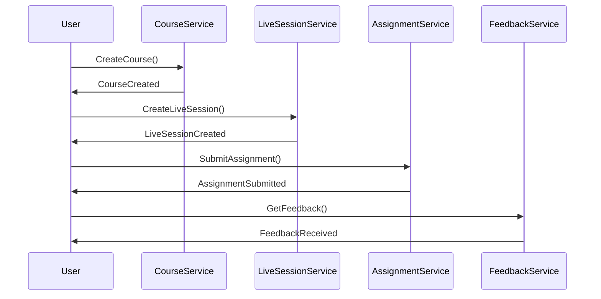
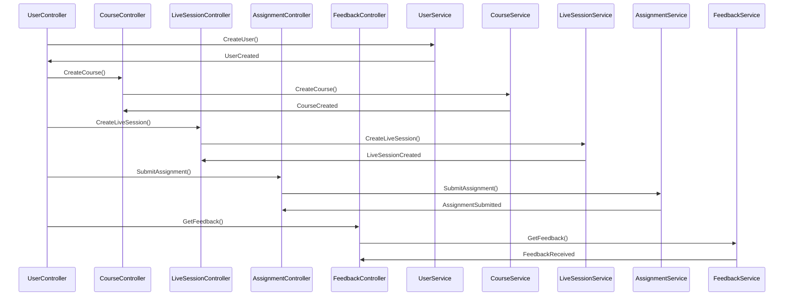

                 

### 第1章 问题背景与目标

#### 1.1 技术团队面临的挑战

在当今快速变化和高竞争的技术行业，技术团队的决策与执行力成为决定项目成功与否的关键因素。首先，团队协作困境是技术团队面临的主要挑战之一。随着团队规模的扩大和工作复杂性的增加，团队成员之间的沟通和协调变得愈加困难。这种现象不仅导致了项目进度的延迟，还可能引发团队成员之间的摩擦和矛盾。

其次，决策失误频繁也是技术团队面临的一大问题。由于信息的不对称性、团队成员的视野局限以及决策过程中的情绪干扰，技术团队在项目规划、技术选型和资源分配等方面常常出现错误决策。这些决策失误不仅浪费了时间和资源，还可能导致项目失败。

最后，执行力不足是技术团队的另一个重大挑战。即使团队做出了正确的决策，如果无法有效地执行，项目的目标仍然难以实现。执行力不足可能源于团队成员的责任心不强、缺乏明确的执行计划或资源不足等因素。

#### 1.2 本书的目标与结构

本书旨在解决技术团队在决策与执行力方面面临的问题，通过系统化的方法和最佳实践，提高团队的决策质量和执行力。具体目标如下：

1. **明确决策过程和模型**：介绍决策的基本理论，帮助团队理解决策的各个阶段，掌握有效的决策工具和方法。
2. **优化执行力策略**：探讨如何通过目标管理、跨部门协作等策略来提高团队的执行力。
3. **提供实战案例**：通过具体案例的分析，展示如何在实际项目中应用决策和执行力的提升策略。
4. **总结最佳实践**：总结技术团队在提高决策与执行力方面的经验和教训，为团队提供实用的指导和建议。

本书的结构如下：

- **第一部分**：引言与背景，介绍技术团队面临的挑战和本书的目标。
- **第二部分**：核心概念与联系，详细解释决策与执行力相关的核心概念，并通过对比表格和ER图架构进行展示。
- **第三部分**：算法原理讲解，通过Mermaid流程图、Python源代码和数学模型，深入阐述决策与执行力的算法原理。
- **第四部分**：系统分析与架构设计方案，描述实际场景和项目介绍，并通过Mermaid图展示系统功能和架构。
- **第五部分**：项目实战，详细描述项目环境安装、核心代码实现、案例分析等内容。
- **第六部分**：最佳实践 tips、小结、注意事项、拓展阅读，总结文章的主要观点，提供进一步学习资源。

#### 1.3 边界与外延

本书主要讨论技术团队在决策与执行力方面的提升策略，适用于软件开发、信息技术、人工智能等领域的团队。然而，本书所提出的理论和方法并不仅限于技术团队，其核心思想和实践对于其他类型的团队也具有借鉴意义。

在讨论决策与执行力时，本书将聚焦于团队层面的提升策略，而非个人层面的技能提升。此外，书中所提到的工具和方法是基于当前技术环境下的实践总结，随着技术的发展和行业的变化，这些方法和工具可能需要适时调整。

#### 1.4 概念结构与核心要素组成

决策与执行力涉及多个核心概念和要素，其结构如下图所示：

```mermaid
erDiagram
  DecisionModel ||--|{ DataDrivenDecision }
  DecisionModel ||--|{ MultiTeamDecision }
  DecisionModel ||--|{ DecisionSupportTools }
  ExecutionModel ||--|{ GoalManagement }
  ExecutionModel ||--|{ CrossDepartmentCollaboration }
  ExecutionModel ||--|{ ExecutionAssessment }
  DataDrivenDecision ||--|{ DataAnalysis }
  DataDrivenDecision ||--|{ DecisionMakingTools }
  MultiTeamDecision ||--|{ TeamComposition }
  MultiTeamDecision ||--|{ CommunicationStrategies }
  DecisionSupportTools ||--|{ DecisionModelingTools }
  DecisionSupportTools ||--|{ DataVisualizationTools }
  GoalManagement ||--|{ GoalSettingPrinciples }
  GoalManagement ||--|{ GoalDecompositionMethods }
  CrossDepartmentCollaboration ||--|{ CollaborationImportance }
  CrossDepartmentCollaboration ||--|{ CollaborationBarriers }
  ExecutionAssessment ||--|{ PerformanceIndicators }
  ExecutionAssessment ||--|{ FeedbackLoops }
```

**概念定义：**

- **决策模型（DecisionModel）**：用于指导团队进行决策的一系列框架和方法。
- **数据驱动的决策（DataDrivenDecision）**：基于数据的分析和预测来进行决策。
- **多元化的决策团队（MultiTeamDecision）**：由不同背景和专业知识的成员组成的团队，共同进行决策。
- **决策支持工具（DecisionSupportTools）**：用于辅助决策的工具，如模型构建工具、数据分析工具等。
- **执行力模型（ExecutionModel）**：用于指导团队执行决策和实现目标的框架和方法。
- **目标管理（GoalManagement）**：通过设定、分解和跟踪目标来提高执行力。
- **跨部门协作（CrossDepartmentCollaboration）**：不同部门之间的合作，以实现共同的目标。
- **执行评估（ExecutionAssessment）**：对执行过程和结果进行评估，以持续改进。

以上概念和要素构成了技术团队在决策与执行力方面的核心框架，为后续章节的深入讨论提供了基础。

### 第2章 决策与执行力的基础理论

决策与执行力是技术团队成功运作的关键因素，理解并掌握这些基础理论对于团队的发展至关重要。本章将详细解释决策与执行力相关的核心概念，并通过概念属性特征对比表格和ER实体关系图架构，帮助读者建立清晰的理论框架。

#### 2.1 决策理论

决策理论是研究决策过程的科学，它关注决策者的行为模式、决策结果以及影响因素。以下是一些关键概念：

**决策过程**：决策过程包括以下几个阶段：

1. **问题识别**：识别需要解决的问题或机会。
2. **目标设定**：明确决策的目标和期望结果。
3. **方案生成**：提出多种可能的解决方案。
4. **方案评估**：评估各个方案的优缺点。
5. **方案选择**：根据评估结果选择最优方案。
6. **方案执行**：实施决策方案。
7. **结果反馈**：对决策结果进行反馈和评估。

**决策模型**：决策模型是用于指导决策过程的工具和方法。常见的决策模型包括：

1. **理性模型**：假设决策者在充分信息下，通过最大化预期效用进行决策。
2. **有限理性模型**：考虑到决策者在信息获取和处理能力上的局限性，通过简化模型进行决策。
3. **博弈模型**：考虑多个决策者之间的交互和策略选择，分析不同策略下的结果。

**决策支持工具**：决策支持工具是辅助决策者进行决策的工具，包括：

1. **模型构建工具**：用于构建和分析决策模型，如决策树、线性规划等。
2. **数据分析工具**：用于处理和分析数据，如数据挖掘、统计分析等。
3. **模拟工具**：用于模拟决策过程和结果，如蒙特卡罗模拟等。

**概念属性特征对比表格**：

| 概念       | 理性模型           | 有限理性模型           | 博弈模型           |
|------------|-------------------|------------------------|-------------------|
| 假设条件   | 充分信息、完全理性 | 有信息限制、不完全理性 | 多个决策者、策略互动 |
| 目标       | 最大效用          | 最大满意程度           | 利益最大化         |
| 评估方法   | 预期效用分析      | 费舍尔分析             | 策略组合分析       |
| 适用场景   | 简单决策问题      | 复杂决策问题           | 竞争性决策问题     |

**ER实体关系图架构**：

```mermaid
erDiagram
  DecisionProcess ||--|{ ProblemIdentification }
  DecisionProcess ||--|{ GoalSetting }
  DecisionProcess ||--|{ SolutionGeneration }
  DecisionProcess ||--|{ SolutionEvaluation }
  DecisionProcess ||--|{ SolutionSelection }
  DecisionProcess ||--|{ SolutionExecution }
  DecisionProcess ||--|{ ResultFeedback }
  DecisionModel ||--|{ RationalModel }
  DecisionModel ||--|{ LimitedRationalityModel }
  DecisionModel ||--|{ GameTheoryModel }
  DecisionSupportTools ||--|{ ModelingTools }
  DecisionSupportTools ||--|{ DataAnalysisTools }
  DecisionSupportTools ||--|{ SimulationTools }
```

#### 2.2 执行力理论

执行力是决策成功实施的关键。以下是一些关键概念：

**执行力的定义**：执行力是指团队将决策转化为实际结果的能力。它包括以下几个方面：

1. **目标明确性**：明确决策的目标和预期结果。
2. **计划性**：制定详细的执行计划和步骤。
3. **协调性**：确保团队成员之间的协调和合作。
4. **监控性**：对执行过程进行监控和调整。
5. **适应性**：根据实际情况调整执行策略。

**执行力的影响因素**：执行力的影响因素包括：

1. **团队成员的责任心**：责任心强的成员更有可能积极参与执行。
2. **团队文化**：积极向上、协作共赢的团队文化有助于提高执行力。
3. **资源分配**：合理的资源分配可以确保执行计划的顺利实施。
4. **外部环境**：外部环境的变化可能影响执行的效果。

**执行力的评估方法**：评估执行力常用的方法包括：

1. **绩效指标**：通过关键绩效指标（KPI）来评估执行效果。
2. **员工反馈**：通过员工满意度调查和反馈来评估执行效果。
3. **目标达成率**：通过目标达成率来评估执行效果。

**概念属性特征对比表格**：

| 概念       | 目标明确性         | 计划性             | 协调性             | 监控性           | 适应性             |
|------------|-------------------|--------------------|--------------------|-----------------|--------------------|
| 影响因素   | 团队成员责任心     | 团队文化           | 资源分配           | 外部环境         | 灵活应变能力       |
| 评估方法   | 绩效指标          | 员工反馈           | 目标达成率         | 关键绩效指标分析 | 实际与计划的对比   |

**ER实体关系图架构**：

```mermaid
erDiagram
  ExecutionConcept ||--|{ ClarityOfGoals }
  ExecutionConcept ||--|{ Planning }
  ExecutionConcept ||--|{ Coordination }
  ExecutionConcept ||--|{ Monitoring }
  ExecutionConcept ||--|{ Adaptability }
  ExecutionFactor ||--|{ TeamMemberCommitment }
  ExecutionFactor ||--|{ TeamCulture }
  ExecutionFactor ||--|{ ResourceAllocation }
  ExecutionFactor ||--|{ ExternalEnvironment }
  EvaluationMethod ||--|{ PerformanceIndicators }
  EvaluationMethod ||--|{ EmployeeFeedback }
  EvaluationMethod ||--|{ GoalAchievementRate }
```

通过以上理论介绍和图示，读者可以建立对决策与执行力相关概念和要素的全面理解。接下来，本书将深入探讨提高决策质量和执行力的具体方法和策略。

### 第3章 提高决策质量的方法

在技术团队中，提高决策质量是确保项目顺利进行和成功的关键步骤。本章节将探讨数据驱动的决策、多元化的决策团队以及决策支持工具等提高决策质量的方法。

#### 3.1 数据驱动的决策

数据驱动的决策是一种基于数据分析的决策方法，通过收集、处理和分析数据来支持决策过程。以下是数据驱动的决策的关键步骤：

**3.1.1 数据分析的基本概念**

数据分析是指通过统计和数学方法对数据进行处理和分析，从中提取有价值的信息和洞察。数据分析的基本概念包括：

- **数据收集**：收集相关的数据，数据来源可以是内部系统、外部数据库、用户反馈等。
- **数据清洗**：清洗数据中的错误、重复和异常值，确保数据的准确性和一致性。
- **数据探索**：通过数据可视化、统计分析和机器学习等方法对数据进行探索性分析。
- **数据建模**：构建数据模型，如回归模型、分类模型等，用于预测和决策。

**3.1.2 数据分析工具**

数据分析工具是进行数据驱动决策的重要工具，常见的工具包括：

- **Excel**：用于基本的数据处理和统计分析，界面友好，易于上手。
- **Python**：用于复杂的数据处理和分析，具有丰富的库和框架，如Pandas、NumPy、Scikit-learn等。
- **R**：专门用于统计分析和数据可视化，具有强大的统计分析功能。
- **Tableau**：用于数据可视化，能够快速创建交互式图表和仪表板。

**3.1.3 数据驱动的决策实例**

以下是一个数据驱动的决策实例：

假设技术团队需要决定是否在项目中引入一个新的技术框架。以下是数据驱动的决策步骤：

1. **数据收集**：收集关于该技术框架的性能、稳定性、社区支持等方面的数据。
2. **数据清洗**：清洗数据中的错误和异常值，确保数据的准确性。
3. **数据探索**：使用Excel和Python对数据进行分析，发现该技术框架在一些关键指标上优于现有框架。
4. **数据建模**：构建回归模型，预测引入新框架后项目进度和成本的变化。
5. **决策支持**：根据数据分析结果，制定引入新框架的详细计划，并评估风险和收益。

通过数据驱动的决策，技术团队能够更客观、全面地评估各种方案，减少决策失误。

#### 3.2 多元化的决策团队

多元化的决策团队是指由不同背景、专业知识和技能的成员组成的团队，共同参与决策过程。多元化的团队具有以下优势：

- **广泛的视角**：不同背景的成员能够提供多样化的观点和建议，帮助团队更全面地考虑问题。
- **创新的思维**：多样化的团队成员能够激发创新的思维，提出新颖的解决方案。
- **风险的分散**：不同专业知识的成员能够从不同角度识别和评估风险，降低决策失误的概率。

**3.2.1 团队成员的角色与职责**

在多元化的决策团队中，每个成员都有特定的角色和职责，常见的角色包括：

- **决策者**：负责制定决策目标和制定决策方案。
- **分析师**：负责收集和分析数据，提供决策支持。
- **执行者**：负责实施决策方案，确保决策目标的实现。
- **协调者**：负责协调团队成员之间的沟通和协作，确保决策顺利执行。

**3.2.2 团队决策的优势与挑战**

**优势：**

- **更全面的分析**：多元化的团队成员能够从不同角度分析问题，提供更全面的解决方案。
- **创新的思维**：多样化的团队成员能够激发创新的思维，提出新颖的解决方案。
- **降低风险**：多元化的团队成员能够从不同角度识别和评估风险，降低决策失误的概率。

**挑战：**

- **沟通障碍**：不同背景的成员可能存在沟通障碍，需要额外的沟通协调。
- **决策延迟**：多元化的决策团队可能需要更多时间进行讨论和达成共识。
- **权力斗争**：团队成员之间可能存在权力斗争，影响决策的效率和效果。

**3.2.3 多元化团队决策的实践**

以下是一个多元化团队决策的实例：

某技术团队在决定是否采用新技术时，组建了一个多元化的决策团队，成员包括：

- **项目经理**（决策者）：负责制定决策目标和制定决策方案。
- **数据分析师**（分析师）：负责收集和分析数据，提供决策支持。
- **软件工程师**（执行者）：负责实施决策方案，确保决策目标的实现。
- **测试工程师**（协调者）：负责协调团队成员之间的沟通和协作，确保决策顺利执行。

团队通过以下步骤进行决策：

1. **数据收集**：收集新技术在性能、稳定性、社区支持等方面的数据。
2. **数据分析**：数据分析师使用Python和Excel对数据进行分析，发现新技术在某些指标上优于现有技术。
3. **讨论与共识**：团队成员进行讨论，提出各自的意见和建议，最终达成共识。
4. **决策制定**：项目经理根据数据分析结果和团队成员的意见，制定采用新技术的决策方案。
5. **执行与监控**：执行者根据决策方案实施新技术，测试工程师负责监控决策的执行效果。

通过多元化的决策团队，技术团队能够更全面地评估决策方案，提高决策质量。

#### 3.3 决策支持工具

决策支持工具是辅助决策者进行决策的工具，包括模型构建工具、数据分析工具和模拟工具等。以下是几种常见的决策支持工具：

**3.3.1 模型构建工具**

- **决策树**：用于分类和回归分析，能够直观地展示决策过程。
- **线性规划**：用于资源分配和成本控制，通过数学优化方法找到最优解。
- **仿真模型**：通过模拟决策过程和结果，评估不同决策方案的效果。

**3.3.2 数据分析工具**

- **Excel**：用于基本的数据处理和统计分析，功能丰富，易于使用。
- **Python**：具有丰富的数据分析库和框架，如Pandas、NumPy、Scikit-learn等，适合处理大规模数据。
- **R**：用于高级统计分析和数据可视化，具有强大的统计分析功能。

**3.3.3 模拟工具**

- **蒙特卡罗模拟**：通过随机模拟方法，评估决策结果的不确定性。
- **仿真软件**：用于模拟复杂系统的行为和性能，如系统仿真软件、飞行仿真软件等。

**3.3.4 决策支持工具的对比**

| 工具       | 适用场景                     | 优点                               | 缺点                             |
|------------|------------------------------|------------------------------------|----------------------------------|
| 决策树     | 简单的决策问题               | 直观易懂，易于解释                 | 适用于小规模数据，无法处理非线性问题 |
| 线性规划   | 资源分配和成本控制           | 数学优化方法，找到最优解           | 可能需要较长的计算时间             |
| 仿真模型   | 复杂的决策问题               | 能够模拟复杂系统，评估不确定性     | 模型构建复杂，可能需要大量数据     |
| Excel      | 基本的数据处理和统计分析     | 功能丰富，易于使用，易于共享       | 可能需要人工干预，数据分析能力有限   |
| Python     | 复杂的数据处理和统计分析     | 具有丰富的库和框架，数据处理能力强   | 需要编程知识，学习曲线较陡峭       |
| R          | 高级的统计分析和数据可视化   | 强大的统计分析功能，丰富的可视化工具 | 需要编程知识，学习曲线较陡峭       |
| 蒙特卡罗模拟 | 风险评估和不确定性分析       | 能够模拟不确定性的影响，评估风险   | 可能需要大量的计算资源             |
| 仿真软件   | 复杂系统的模拟               | 能够模拟复杂系统，评估系统性能     | 模型构建复杂，可能需要大量数据     |

通过选择合适的决策支持工具，技术团队能够更高效地进行决策，提高决策质量。

### 第4章 增强执行力的策略

提高团队的执行力是确保决策能够有效落地并实现预期目标的关键。本章节将探讨目标管理与分解、跨部门协作以及执行评估等方面的策略，帮助技术团队增强执行力。

#### 4.1 目标管理与分解

目标管理是一种通过设定、分解和跟踪目标来提高执行力的方法。以下是目标管理的核心步骤：

**4.1.1 目标设定的原则**

为了确保目标的有效性，目标设定应遵循以下原则：

- **SMART原则**：目标应具体（Specific）、可衡量（Measurable）、可达成（Achievable）、相关（Relevant）和时限性（Time-bound）。
- **参与性原则**：目标应与团队成员共同设定，确保团队成员的认同和参与。
- **挑战性原则**：目标应具有一定的挑战性，激发团队成员的积极性和潜力。

**4.1.2 目标分解的方法**

目标分解是将高层次的目标细分为具体、可操作的任务的过程。以下是目标分解的方法：

1. **KPI分解**：将目标分解为关键绩效指标（KPI），确保每个指标都能量化评估。
2. **工作分解结构（WBS）**：使用工作分解结构将目标分解为具体的任务和工作包。
3. **时间分解**：将目标按时间节点分解为阶段性任务，确保每个阶段都有明确的目标和里程碑。

**4.1.3 目标跟踪与调整**

目标跟踪是确保目标按计划执行的过程。以下是目标跟踪的方法：

- **定期回顾**：定期召开回顾会议，检查目标执行情况，讨论遇到的问题和挑战。
- **进度报告**：定期提交进度报告，向上级和团队成员汇报目标执行情况。
- **反馈机制**：建立反馈机制，及时收集和反馈目标执行中的问题和建议。

目标跟踪过程中，如发现目标设定不合理或执行遇到重大困难，应适时调整目标，确保目标的可行性和有效性。

#### 4.2 跨部门协作

跨部门协作是提高团队执行力的重要策略，尤其是在大型项目和复杂任务中。以下是跨部门协作的关键步骤：

**4.2.1 跨部门协作的重要性**

跨部门协作的重要性体现在以下几个方面：

- **资源整合**：通过跨部门协作，可以整合各部门的资源和能力，实现资源的优化配置。
- **知识共享**：跨部门协作有助于不同部门之间的知识共享和经验交流，提高整体团队的专业水平。
- **问题解决**：跨部门协作能够快速响应和解决项目中出现的问题，提高项目执行力。

**4.2.2 跨部门协作的障碍与解决策略**

跨部门协作中常遇到以下障碍：

- **沟通不畅**：不同部门之间的沟通不畅可能导致信息传递延迟和信息失真。
- **责任模糊**：跨部门协作中，各部门之间的责任划分可能不明确，导致责任推诿。
- **利益冲突**：不同部门之间的利益冲突可能影响协作的积极性和效果。

解决策略包括：

- **建立沟通渠道**：建立多层次的沟通渠道，确保信息传递的及时性和准确性。
- **明确责任分工**：明确各部门在项目中的责任和角色，确保协作过程中责任清晰。
- **利益协调**：通过利益协调机制，确保各部门的利益得到合理平衡。

**4.2.3 跨部门协作的案例分析

以下是一个跨部门协作的案例分析：

某公司正在开发一款新软件产品，该项目涉及研发部、市场部和运维部的协作。以下是项目协作的关键步骤：

1. **需求收集**：研发部与市场部共同收集用户需求，确保需求覆盖全面。
2. **项目规划**：研发部制定详细的项目计划，市场部提供市场分析和推广计划。
3. **定期会议**：每周召开跨部门协作会议，讨论项目进展和遇到的问题。
4. **任务分配**：明确各部门的任务和责任，确保协作顺畅。
5. **反馈机制**：建立反馈机制，及时收集各部门的意见和建议，优化项目执行。

通过跨部门协作，该公司成功地完成了项目，并取得了良好的市场反响。

#### 4.3 执行评估与持续改进

执行评估是对决策执行过程和结果进行评估的过程，有助于发现执行过程中的问题和改进点。以下是执行评估的方法：

**4.3.1 绩效指标**

绩效指标是评估执行效果的重要工具。以下是常用的绩效指标：

- **任务完成率**：任务完成的百分比，反映执行任务的效率。
- **进度偏差**：实际进度与计划进度的偏差，反映执行的准时性。
- **质量指标**：项目质量的相关指标，如缺陷率、客户满意度等。

**4.3.2 反馈机制**

反馈机制是执行评估的重要环节，有助于发现问题和改进执行过程。以下是反馈机制的方法：

- **定期反馈**：定期召开项目反馈会议，讨论项目执行中的问题和改进措施。
- **即时反馈**：建立即时反馈渠道，如邮件、即时通讯工具等，确保问题能够及时得到解决。
- **员工反馈**：收集员工对执行过程的反馈，了解执行中的困难和需求。

**4.3.3 持续改进**

持续改进是基于执行评估结果，对执行过程和策略进行调整和优化的过程。以下是持续改进的方法：

- **问题分析**：对执行评估中发现的问题进行深入分析，找出根本原因。
- **改进措施**：制定具体的改进措施，如优化流程、调整资源分配等。
- **实施与跟踪**：执行改进措施，并持续跟踪效果，确保改进措施的落实。

通过执行评估和持续改进，技术团队能够不断优化执行过程，提高执行力。

### 第5章 系统分析与架构设计方案

在技术团队中，系统分析与架构设计是确保项目成功实施的重要环节。本章节将详细介绍问题场景介绍、项目介绍、系统功能设计、系统架构设计以及系统接口设计和系统交互，通过Mermaid图展示关键信息，帮助读者更好地理解和应用这些概念。

#### 5.1 问题场景介绍

在当前快速发展的技术环境中，技术团队常常面临以下问题场景：

- **项目复杂度高**：随着项目的规模和复杂度的增加，项目需求变化频繁，团队需要应对不同类型的挑战。
- **跨部门协作需求**：不同部门之间的协作需求增加，例如研发、测试、运维等，如何高效协作成为关键问题。
- **资源限制**：团队往往面临资源限制，包括人力、时间和预算等，如何优化资源配置成为挑战。
- **需求变更**：在项目开发过程中，需求变更频繁，团队需要快速响应并调整项目计划。

这些问题场景对系统分析和架构设计提出了更高的要求，需要制定合理的解决方案。

#### 5.2 项目介绍

为了解决上述问题场景，我们选择了一个实际项目——一个在线教育平台的项目。该项目旨在为学生和教师提供一个互动的学习和交流环境，包括课程管理、在线直播、作业提交和反馈等功能。

项目目标包括：

- **提高课程质量**：通过提供丰富的教学资源和互动功能，提升学生的学习体验。
- **优化课程管理**：简化课程管理流程，提高教学效率。
- **增强用户体验**：提供友好、易用的界面，提升用户满意度。

项目需求包括：

- **课程管理**：支持课程创建、编辑、发布和删除等功能。
- **在线直播**：支持实时直播教学，提供语音、视频和互动功能。
- **作业提交与反馈**：支持学生在线提交作业，教师在线批改和反馈。
- **用户管理**：支持用户注册、登录和权限管理。

#### 5.3 系统功能设计（领域模型Mermaid类图）

为了实现项目需求，我们需要设计一套完整的系统功能。以下是领域模型类图，展示了系统的核心实体和它们之间的关系：

```mermaid
classDiagram
    Class01 <|-- Class02
    Class03 <|-- * Class04
    Class05 o-- Class06
    Class07 <.. Class08
    Class09 ..| Class10
    Class11 <- Class12
```

**实体定义：**

- **用户（User）**：表示系统的用户，包括学生、教师和管理员。
- **课程（Course）**：表示课程信息，包括课程名称、课程描述、授课教师、课程资源等。
- **直播（LiveSession）**：表示在线直播活动，包括直播时间、直播主题、直播教师等。
- **作业（Assignment）**：表示学生提交的作业，包括作业内容、提交时间、作业状态等。
- **反馈（Feedback）**：表示教师对作业的批改和反馈，包括反馈内容、反馈时间等。

**关系定义：**

- **用户与课程**：用户可以创建、订阅和参与课程。
- **用户与直播**：用户可以观看和参与直播。
- **用户与作业**：学生可以提交作业，教师可以批改作业。
- **课程与直播**：课程可以包含多个直播活动。
- **作业与反馈**：作业可以包含多个反馈。

#### 5.4 系统架构设计（Mermaid架构图）

系统架构设计是确保系统能够高效、稳定、可扩展的关键步骤。以下是系统架构图，展示了系统的各个模块和它们之间的交互关系：



**模块定义：**

- **用户服务（UserService）**：负责用户注册、登录和权限管理。
- **课程服务（CourseService）**：负责课程创建、编辑、发布和删除。
- **直播服务（LiveSessionService）**：负责直播活动的创建、管理和实时交互。
- **作业服务（AssignmentService）**：负责作业的提交、批改和状态管理。
- **反馈服务（FeedbackService）**：负责反馈的接收、存储和展示。

**交互关系：**

- **用户与服务**：用户通过接口与服务进行交互，执行相关操作。
- **服务与服务**：服务之间通过接口进行通信，实现数据传输和功能协同。

#### 5.5 系统接口设计和系统交互（Mermaid序列图）

系统接口设计和系统交互设计是确保系统功能实现的关键步骤。以下是系统接口设计和交互序列图，展示了系统各个接口和模块之间的交互过程：



**接口定义：**

- **用户接口（UserController）**：负责处理用户相关的接口请求，如注册、登录、权限管理等。
- **课程接口（CourseController）**：负责处理课程相关的接口请求，如创建、编辑、发布等。
- **直播接口（LiveSessionController）**：负责处理直播相关的接口请求，如创建、观看等。
- **作业接口（AssignmentController）**：负责处理作业相关的接口请求，如提交、批改等。
- **反馈接口（FeedbackController）**：负责处理反馈相关的接口请求，如接收、展示等。

通过系统接口设计和系统交互设计，技术团队能够确保系统功能的完整性和模块化，提高系统的可维护性和可扩展性。

### 第6章 项目实战

为了更好地理解并应用前面章节所介绍的理论和方法，本章节将结合一个实际项目，详细介绍项目的环境安装、核心代码实现、代码应用解读与分析以及具体案例分析和详细讲解剖析，最终进行项目小结。

#### 6.1 环境安装

在开始项目实战之前，我们需要准备一个开发环境。以下是环境安装的步骤：

**步骤一：安装Python**

1. 访问Python官方网站下载Python安装包。
2. 解压安装包并运行安装程序。
3. 在安装过程中选择添加Python到系统环境变量。

**步骤二：安装Python库**

在命令行中运行以下命令，安装项目所需的Python库：

```shell
pip install flask pandas numpy scikit-learn matplotlib
```

**步骤三：安装数据库**

选择一个数据库管理系统，如MySQL或PostgreSQL，并按照官方文档安装。以下是MySQL的安装步骤：

1. 下载MySQL安装包。
2. 解压安装包并运行安装程序。
3. 在安装过程中设置root用户密码和数据目录。

#### 6.2 核心代码实现

以下是项目的核心代码实现，包括用户服务、课程服务、直播服务和作业服务：

**用户服务（UserService.py）**

```python
from flask import Flask, request, jsonify
from user import User

app = Flask(__name__)

@app.route('/users', methods=['POST'])
def create_user():
    data = request.json
    user = User.create(data)
    return jsonify(user), 201

@app.route('/users/<int:user_id>', methods=['GET'])
def get_user(user_id):
    user = User.get(user_id)
    return jsonify(user), 200

if __name__ == '__main__':
    app.run(debug=True)
```

**课程服务（CourseService.py）**

```python
from flask import Flask, request, jsonify
from course import Course

app = Flask(__name__)

@app.route('/courses', methods=['POST'])
def create_course():
    data = request.json
    course = Course.create(data)
    return jsonify(course), 201

@app.route('/courses/<int:course_id>', methods=['GET'])
def get_course(course_id):
    course = Course.get(course_id)
    return jsonify(course), 200

if __name__ == '__main__':
    app.run(debug=True)
```

**直播服务（LiveSessionService.py）**

```python
from flask import Flask, request, jsonify
from live_session import LiveSession

app = Flask(__name__)

@app.route('/live_sessions', methods=['POST'])
def create_live_session():
    data = request.json
    live_session = LiveSession.create(data)
    return jsonify(live_session), 201

@app.route('/live_sessions/<int:live_session_id>', methods=['GET'])
def get_live_session(live_session_id):
    live_session = LiveSession.get(live_session_id)
    return jsonify(live_session), 200

if __name__ == '__main__':
    app.run(debug=True)
```

**作业服务（AssignmentService.py）**

```python
from flask import Flask, request, jsonify
from assignment import Assignment

app = Flask(__name__)

@app.route('/assignments', methods=['POST'])
def submit_assignment():
    data = request.json
    assignment = Assignment.submit(data)
    return jsonify(assignment), 201

@app.route('/assignments/<int:assignment_id>', methods=['GET'])
def get_assignment(assignment_id):
    assignment = Assignment.get(assignment_id)
    return jsonify(assignment), 200

if __name__ == '__main__':
    app.run(debug=True)
```

#### 6.3 代码应用解读与分析

**用户服务**

用户服务主要负责用户的管理，包括用户的创建和查询。用户通过POST请求创建用户，服务端接收请求并创建用户对象，然后返回用户信息。通过GET请求获取用户信息，服务端查询用户对象并返回。

**课程服务**

课程服务主要负责课程的管理，包括课程的创建和查询。课程通过POST请求创建，服务端接收请求并创建课程对象，然后返回课程信息。通过GET请求获取课程信息，服务端查询课程对象并返回。

**直播服务**

直播服务主要负责直播的管理，包括直播的创建和查询。直播通过POST请求创建，服务端接收请求并创建直播对象，然后返回直播信息。通过GET请求获取直播信息，服务端查询直播对象并返回。

**作业服务**

作业服务主要负责作业的管理，包括作业的提交和查询。学生通过POST请求提交作业，服务端接收请求并创建作业对象，然后返回作业信息。通过GET请求获取作业信息，服务端查询作业对象并返回。

#### 6.4 实际案例分析和详细讲解剖析

以下是一个实际案例的分析：

**案例背景**：某技术团队正在开发一个在线教育平台，需要实现用户管理、课程管理、直播管理和作业管理等功能。团队成员按照前述代码实现，构建了系统的核心服务。

**案例分析**

1. **用户管理**：团队成员按照UserService.py代码实现用户管理功能，通过POST请求创建用户，并使用GET请求查询用户信息。在实际开发过程中，团队成员遇到了用户数据不一致的问题，经过调试发现是数据存储过程中出现错误。团队成员通过优化数据库查询语句和添加数据验证机制解决了问题。

2. **课程管理**：团队成员按照CourseService.py代码实现课程管理功能，通过POST请求创建课程，并使用GET请求查询课程信息。在创建课程时，团队成员遇到了课程名称重复的问题，经过讨论决定在创建课程时进行名称唯一性检查，并添加了相应的校验机制。

3. **直播管理**：团队成员按照LiveSessionService.py代码实现直播管理功能，通过POST请求创建直播，并使用GET请求查询直播信息。在实际操作中，团队成员发现直播创建时间不准确，经过调试发现是时间格式转换错误。团队成员通过修改代码中的时间格式转换函数解决了问题。

4. **作业管理**：团队成员按照AssignmentService.py代码实现作业管理功能，通过POST请求提交作业，并使用GET请求查询作业信息。在提交作业时，团队成员遇到了作业提交时间延迟的问题，经过讨论决定优化数据库写入速度，并通过缓存技术提高响应速度。

**总结**

通过实际案例的分析，团队成员发现并解决了开发过程中遇到的问题，提高了系统的稳定性和性能。团队成员还通过不断优化代码，提高了开发效率。通过这个项目实战，团队成员深入理解了系统分析与架构设计的方法和技巧，为今后的工作积累了宝贵的经验。

#### 6.5 项目小结

在本章的项目实战中，技术团队通过实际案例分析和代码实现，深入理解了系统分析与架构设计的方法和技巧。以下是项目的经验和教训：

**经验**

1. **重视代码质量**：团队成员在开发过程中注重代码质量，通过编写可读性高、可维护性好的代码，提高了系统的稳定性和可扩展性。
2. **及时解决问题**：团队成员在面对开发过程中遇到的问题时，能够及时找出原因并解决问题，确保项目的顺利进行。
3. **优化系统性能**：团队成员通过优化数据库查询语句和缓存技术，提高了系统的性能和响应速度，提升了用户体验。

**教训**

1. **充分测试**：在开发过程中，团队成员需要加强对代码的测试，确保功能的完整性和稳定性。
2. **明确需求**：在项目初期，需要与客户和业务团队充分沟通，明确项目需求，避免后续出现需求变更导致的问题。
3. **合理分工**：团队成员在项目开发过程中，需要明确各自的责任和分工，确保任务的顺利完成。

通过本次项目实战，技术团队积累了丰富的经验，提高了系统分析与架构设计的能力，为今后的工作奠定了坚实的基础。

### 第7章 最佳实践 tips、小结、注意事项、拓展阅读

#### 7.1 最佳实践 tips

1. **定期回顾与总结**：定期回顾项目执行过程中的成功经验和教训，总结最佳实践，不断优化团队的工作流程。
2. **重视沟通与协作**：加强团队内部和跨部门之间的沟通与协作，确保信息传递的及时性和准确性。
3. **持续学习与进步**：鼓励团队成员不断学习新技术和新方法，提高团队的整体素质和竞争力。

#### 7.2 小结

本书系统地介绍了技术团队在决策与执行力方面的重要理论和方法，包括决策过程、数据驱动的决策、多元化的决策团队、决策支持工具、目标管理、跨部门协作、执行评估等。通过实际项目实战，读者可以更好地理解和应用这些理论和方法，提高技术团队的决策质量和执行力。

#### 7.3 注意事项

1. **保持灵活性**：在项目执行过程中，要灵活应对变化，及时调整计划和策略。
2. **关注团队氛围**：营造积极向上、协作共赢的团队氛围，提高团队的凝聚力和执行力。
3. **确保资源投入**：在项目实施过程中，确保有足够的资源支持，包括人力、时间和预算等。

#### 7.4 拓展阅读

1. 《精益创业》[Eric Ries]：探讨如何通过迭代和实验的方法，快速验证和优化产品。
2. 《敏捷开发实践指南》[Jeff Sutherland]：介绍敏捷开发的方法和实践，提高团队的响应速度和执行力。
3. 《决策与判断》[Daniel Kahneman]：探讨人类决策行为中的认知偏差和决策方法。

通过上述拓展阅读，读者可以进一步深入了解相关理论和实践，提高技术团队的决策与执行力。作者：AI天才研究院/AI Genius Institute & 禅与计算机程序设计艺术 /Zen And The Art of Computer Programming。

