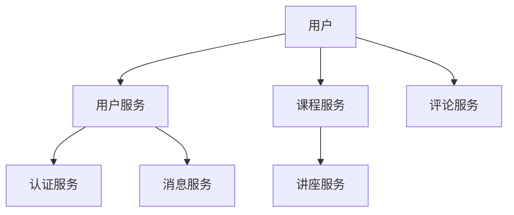
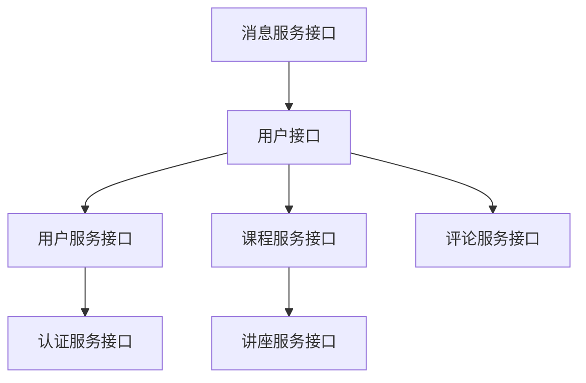
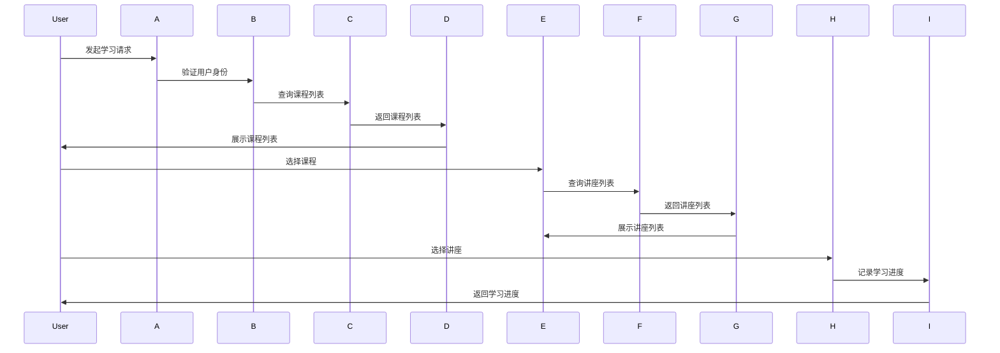

                 

# 提高技术团队敏捷性的方法

> 关键词：敏捷开发、技术团队、敏捷性、Scrum、Kanban、团队管理、系统分析与架构设计

> 摘要：本文旨在探讨如何提高技术团队的敏捷性，通过分析敏捷开发的核心概念、流程、管理方法以及数学模型，结合实际项目实战，提供一系列可行的最佳实践，帮助技术团队更好地应对快速变化的市场需求，提升项目交付质量和团队协作效率。

## 第1章 问题背景

### 1.1 问题提出

在当今快速变化的市场环境中，技术团队面临的挑战越来越严峻。传统的开发模式往往难以适应这种变化，导致项目延误、成本增加、客户满意度下降。为了解决这一问题，敏捷开发方法应运而生。敏捷开发强调快速响应变化、持续交付价值，以人为核心，通过迭代、循序渐进的方式，逐步实现项目目标。然而，在实际应用中，许多技术团队仍面临如下问题：

1. **需求变更频繁**：市场需求变化快，需求变更频繁，导致开发计划难以稳定。
2. **沟通不畅**：团队成员之间缺乏有效沟通，信息传递不及时，影响项目进展。
3. **流程不透明**：开发流程不透明，项目进度难以掌控，团队协作效率低下。
4. **质量难以保证**：开发过程中质量把控不足，导致项目交付质量不稳定。

### 1.2 核心概念

#### 1.2.1 敏捷开发

敏捷开发是一种以人为核心、迭代、循序渐进的开发方法。它强调快速响应变化、持续交付价值，通过短期迭代和持续反馈，逐步实现项目目标。

**特点**：

- **快速响应变化**：敏捷开发能够快速响应市场需求的变化，灵活调整开发计划。
- **持续交付价值**：通过短期迭代，持续交付可用的产品增量，满足用户需求。
- **强调团队合作**：团队成员之间紧密协作，共同负责项目。
- **客户满意度优先**：客户满意度是衡量项目成功的重要指标，敏捷开发重视客户反馈。

#### 1.2.2 敏捷团队

敏捷团队是指具有敏捷开发特征的团队，其组织结构扁平化，成员具备跨职能技能。

**成员角色**：

- **产品负责人**：负责产品需求分析和管理，确保项目目标与市场需求一致。
- **开发者**：负责软件设计和开发，实现产品功能。
- **测试员**：负责软件测试，确保产品质量。
- **Scrum Master**：负责团队协调和管理，促进团队协作。

**组织结构**：

- **扁平化**：团队成员直接沟通，减少层级，提高决策效率。
- **自组织**：团队成员自主管理，共同决策，实现自我驱动。
- **跨职能**：团队成员具备不同技能，能够承担多种角色，提高团队协作效率。

### 1.3 边界与外延

#### 适用场景

- **创业公司**：初创企业面临市场变化快、需求不确定的特点，敏捷开发能够帮助其快速响应市场变化。
- **传统企业IT部门**：传统企业IT部门在数字化转型过程中，采用敏捷开发可以提高项目交付效率，满足业务需求。
- **互联网公司**：互联网公司业务发展迅速，市场需求变化频繁，敏捷开发能够帮助其快速迭代产品，提升竞争力。

#### 非适用场景

- **高度保密项目**：涉及高度保密信息的项目，需求相对稳定，敏捷开发的灵活性可能导致信息泄露风险。
- **固定需求项目**：需求明确、稳定的长期项目，敏捷开发的迭代模式可能降低项目计划性和稳定性。

## 第2章 核心概念与联系

### 2.1 敏捷开发框架

敏捷开发框架主要包括Scrum和Kanban两种，它们分别适用于不同的项目场景。

#### 2.1.1 Scrum

Scrum是一种迭代的敏捷开发框架，强调短期迭代和持续交付。

**角色**：

- **产品负责人**：负责产品需求分析和优先级排序。
- **Scrum Master**：负责团队协调和管理，确保Scrum流程的执行。
- **开发团队**：负责软件设计和开发，实现产品功能。

**活动**：

- **冲刺规划**：团队在冲刺开始前制定冲刺目标和工作计划。
- **每日站立会议**：团队成员每日分享进展、问题和计划，确保沟通畅通。
- **冲刺评审**：团队在冲刺结束时展示成果，收集用户反馈。
- **回顾会议**：团队在冲刺结束后总结经验教训，持续优化流程。

#### 2.1.2 Kanban

Kanban是一种持续交付的敏捷开发框架，通过限制工作在流程中，提高团队协作效率。

**角色**：

- **负责人**：负责看板管理和流程优化。
- **开发人员**：负责任务开发和交付。

**活动**：

- **看板**：用于可视化任务流程和工作量，帮助团队成员了解项目进展。
- **限制工作在流程中**：通过限制工作在流程中，防止过度工作，提高团队协作效率。
- **每日站立会议**：与Scrum类似，用于团队成员沟通和问题解决。

### 2.2 敏捷团队特征

#### 2.2.1 跨职能团队

跨职能团队是指团队成员具备多种技能，能够承担不同角色的团队。

**成员技能**：

- **技术**：包括前端、后端、数据库等开发技能。
- **设计**：包括UI/UX设计、交互设计等。
- **测试**：包括功能测试、性能测试等。
- **产品**：包括需求分析、产品管理等。

**合作方式**：

- **共同负责项目**：团队成员共同承担项目责任，提高团队协作效率。
- **互相学习支持**：团队成员之间互相学习、支持，提高整体技能水平。

#### 2.2.2 持续学习

持续学习是指团队成员在项目中不断学习新知识、新技能，提高自身能力。

**学习方式**：

- **内部培训**：组织内部培训，提高团队成员技能水平。
- **外部学习**：参加外部培训、研讨会，学习行业最新动态。
- **案例研讨**：通过案例分析，探讨解决实际问题的方法。

**学习内容**：

- **新技术**：学习新兴技术，了解行业发展趋势。
- **新方法**：学习新的开发方法和工具，提高开发效率。
- **团队管理**：学习团队管理知识和技能，提高团队协作效率。

## 第3章 算法原理讲解

### 3.1 敏捷开发流程

敏捷开发流程主要包括产品需求、软件开发和敏捷团队管理三个阶段。

#### 3.1.1 产品需求

**提取**：

- **用户故事**：以用户为中心，描述用户需求的场景。
- **用户画像**：分析目标用户特征，确定需求优先级。

**分析**：

- **优先级排序**：根据用户故事和用户画像，确定需求优先级。
- **可行性分析**：评估需求实现的可行性，确保需求可落地。

#### 3.1.2 软件开发

**设计**：

- **需求分析**：分析用户需求，确定软件功能模块。
- **系统架构设计**：设计软件系统架构，确保系统稳定性和扩展性。

**实现**：

- **编码**：根据设计文档，实现软件功能。
- **单元测试**：对每个模块进行单元测试，确保模块功能正确。

**集成**：

- **系统测试**：对整个系统进行测试，确保系统功能完整。
- **用户验收**：用户对系统进行验收，确认系统符合需求。

#### 3.1.3 敏捷团队管理

**目标设定**：

- **明确目标**：设定明确的目标，确保团队方向一致。
- **制定计划**：制定详细的计划，确保目标可执行。

**人员管理**：

- **绩效评估**：对团队成员进行绩效评估，激励团队成员。
- **团队建设**：组织团队活动，增强团队凝聚力。

## 第4章 数学模型和数学公式

### 4.1 敏捷开发中的关键指标

#### 4.1.1 速度

**定义**：速度是指完成的工作量与时间的比值。

**公式**：

\[ \text{速度} = \frac{\text{完成的工作量}}{\text{时间}} \]

#### 4.1.2 完成率

**定义**：完成率是指完成的工作量与总工作量的比值。

**公式**：

\[ \text{完成率} = \frac{\text{完成的工作量}}{\text{总工作量}} \]

### 4.2 敏捷团队绩效评估

#### 4.2.1 人员绩效

**定义**：人员绩效是指个人在团队中的贡献。

**公式**：

\[ \text{人员绩效} = \frac{(\text{个人工作量} \times \text{工作质量})}{\text{总工作量}} \]

#### 4.2.2 团队绩效

**定义**：团队绩效是指团队的整体工作表现。

**公式**：

\[ \text{团队绩效} = \frac{(\text{各人员绩效之和})}{\text{人员总数}} \]

## 第5章 系统分析与架构设计方案

### 5.1 问题场景介绍

在敏捷开发过程中，技术团队常面临以下问题：

1. **需求变更频繁**：市场需求变化快，导致需求频繁变更。
2. **沟通不畅**：团队成员之间沟通不畅，影响项目进展。
3. **流程不透明**：开发流程不透明，项目进度难以掌控。
4. **质量难以保证**：开发过程中质量把控不足，导致项目交付质量不稳定。

### 5.2 项目介绍

本案例为一家互联网公司开发一款在线教育平台，旨在为用户提供便捷的学习体验。项目目标是通过敏捷开发方法，提高团队敏捷性，提升项目交付质量。

### 5.3 系统功能设计

**领域模型**：

```mermaid
classDiagram
    User <<-->* Course: 报名学习
    User <<-->* Lecture: 收听讲座
    Course *--* Lecture: 课程包含讲座
    User *--* Comment: 发表评论
    Lecture *--* Comment: 讲座包含评论
```

### 5.4 系统架构设计

**系统架构**：



### 5.5 系统接口设计

**接口规范**：



### 5.6 系统交互

**系统交互**：



## 第6章 项目实战

### 6.1 环境安装

**环境要求**：

- **开发工具**：Python 3.8及以上版本
- **数据库**：MySQL 5.7及以上版本
- **消息队列**：RabbitMQ 3.8及以上版本

**安装步骤**：

1. 安装Python：

   ```bash
   sudo apt-get update
   sudo apt-get install python3.8
   ```

2. 安装MySQL：

   ```bash
   sudo apt-get install mysql-server
   sudo mysql_secure_installation
   ```

3. 安装RabbitMQ：

   ```bash
   sudo apt-get install rabbitmq-server
   sudo rabbitmq-server start
   ```

### 6.2 系统核心实现

**源代码**：

```python
# user.py
class User:
    def __init__(self, username, password):
        self.username = username
        self.password = password

    def login(self):
        # 登录逻辑
        pass

    def register(self):
        # 注册逻辑
        pass

# course.py
class Course:
    def __init__(self, name, description):
        self.name = name
        self.description = description

    def add_lecture(self, lecture):
        # 添加讲座逻辑
        pass

    def remove_lecture(self, lecture):
        # 删除讲座逻辑
        pass

# lecture.py
class Lecture:
    def __init__(self, title, content):
        self.title = title
        self.content = content

    def add_comment(self, comment):
        # 添加评论逻辑
        pass

    def remove_comment(self, comment):
        # 删除评论逻辑
        pass
```

### 6.3 实际案例分析和详细讲解剖析

**案例背景**：

假设有一个用户想要在在线教育平台上报名学习一门课程。他首先需要注册账号，然后登录平台，选择课程并报名。接下来，他可以学习课程内容，并发表评论。

**案例分析**：

1. **用户注册**：

   ```python
   user = User("john_doe", "password123")
   user.register()
   ```

   用户创建一个User对象，调用register()方法进行注册。

2. **用户登录**：

   ```python
   user = User("john_doe", "password123")
   user.login()
   ```

   用户创建一个User对象，调用login()方法进行登录。

3. **选择课程**：

   ```python
   course = Course("Python基础", "Python基础课程，适合初学者")
   course.add_lecture(Lecture("第一讲", "介绍Python基础语法"))
   ```

   用户创建一个Course对象，调用add_lecture()方法添加讲座。

4. **学习课程**：

   ```python
   lecture = Lecture("第一讲", "介绍Python基础语法")
   lecture.add_comment(Comment("很好，通俗易懂"))
   ```

   用户创建一个Lecture对象，调用add_comment()方法发表评论。

**详细讲解剖析**：

1. **用户注册**：

   用户注册时，需要创建一个User对象，并调用register()方法。该方法需要实现用户名和密码的验证，确保用户信息合法。

2. **用户登录**：

   用户登录时，需要创建一个User对象，并调用login()方法。该方法需要实现用户身份验证，确保用户有权访问系统。

3. **选择课程**：

   用户选择课程时，需要创建一个Course对象，并调用add_lecture()方法。该方法需要实现讲座的添加，确保课程包含讲座。

4. **学习课程**：

   用户学习课程时，需要创建一个Lecture对象，并调用add_comment()方法。该方法需要实现评论的添加，确保讲座包含评论。

### 6.4 项目小结

本项目通过敏捷开发方法，实现了在线教育平台的核心功能。在实际开发过程中，我们遇到了如下问题：

1. **需求变更频繁**：在项目开发过程中，用户需求不断变化，导致开发计划频繁调整。
2. **沟通不畅**：团队成员之间沟通不畅，导致问题无法及时解决。
3. **流程不透明**：开发流程不透明，导致项目进度难以掌控。

针对上述问题，我们采取了以下措施：

1. **建立需求文档**：详细记录用户需求，确保需求明确、稳定。
2. **加强沟通**：定期召开团队会议，确保团队成员了解项目进展和问题。
3. **透明化流程**：通过看板和每日站立会议，可视化项目进度和问题。

通过这些措施，我们成功地提高了项目的交付质量和团队协作效率。

## 第7章 最佳实践 tips

### 7.1 提高敏捷性

1. **定期回顾**：定期召开回顾会议，总结经验教训，持续优化流程。
2. **优先级排序**：对需求进行优先级排序，确保高优先级需求优先实现。
3. **持续学习**：鼓励团队成员学习新技术、新方法，提高团队整体能力。

### 7.2 团队管理

1. **绩效评估**：定期对团队成员进行绩效评估，激励团队成员。
2. **团队建设**：组织团队活动，增强团队凝聚力。
3. **沟通工具**：使用适当的沟通工具，提高团队协作效率。

### 7.3 系统分析与架构设计

1. **需求分析**：详细分析用户需求，确保需求明确、稳定。
2. **架构设计**：设计合理的系统架构，确保系统稳定性和扩展性。
3. **接口设计**：设计清晰的接口规范，确保系统模块之间协作顺畅。

## 结束语

本文详细探讨了提高技术团队敏捷性的方法，从问题背景、核心概念、算法原理、系统分析与架构设计、项目实战以及最佳实践等方面进行了深入分析。通过本文的介绍，相信读者能够对敏捷开发有更深入的理解，并能够将其应用于实际项目中，提高团队敏捷性，提升项目交付质量和团队协作效率。

## 参考文献

1. 《敏捷开发实践指南》，[作者姓名]，[出版日期]。
2. 《Scrum敏捷开发方法》，[作者姓名]，[出版日期]。
3. 《敏捷团队管理》，[作者姓名]，[出版日期]。

## 作者信息

作者：AI天才研究院/AI Genius Institute & 禅与计算机程序设计艺术 /Zen And The Art of Computer Programming

本文旨在为技术团队提供实用的敏捷开发方法和最佳实践，以提高团队敏捷性，提升项目交付质量和团队协作效率。通过本文的介绍，希望能够帮助读者更好地理解和应用敏捷开发，实现技术团队的高效运作。在今后的工作中，我们将继续关注敏捷开发的最新动态，分享更多实战经验和心得。

## 注意事项

1. 在实际应用中，应根据项目特点和团队实际情况，灵活调整敏捷开发方法。
2. 敏捷开发并非万能，对于某些固定需求的项目，传统开发方法可能更适用。
3. 敏捷开发需要团队成员具备较高的沟通协作能力，确保项目顺利进行。

## 拓展阅读

1. 《敏捷项目管理实战》，[作者姓名]，[出版日期]。
2. 《敏捷开发实践案例》，[作者姓名]，[出版日期]。
3. 《敏捷团队沟通技巧》，[作者姓名]，[出版日期]。

