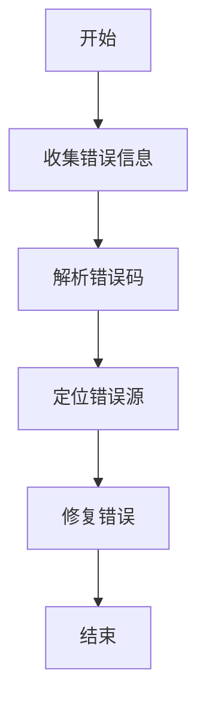
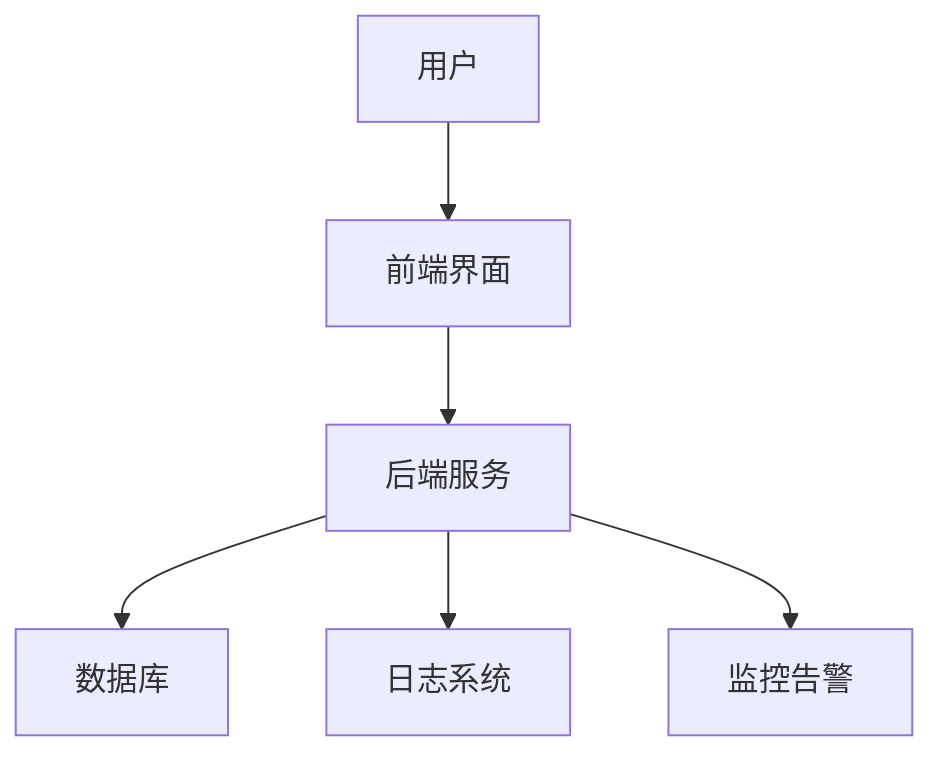
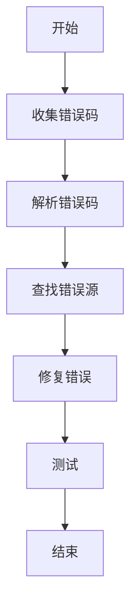
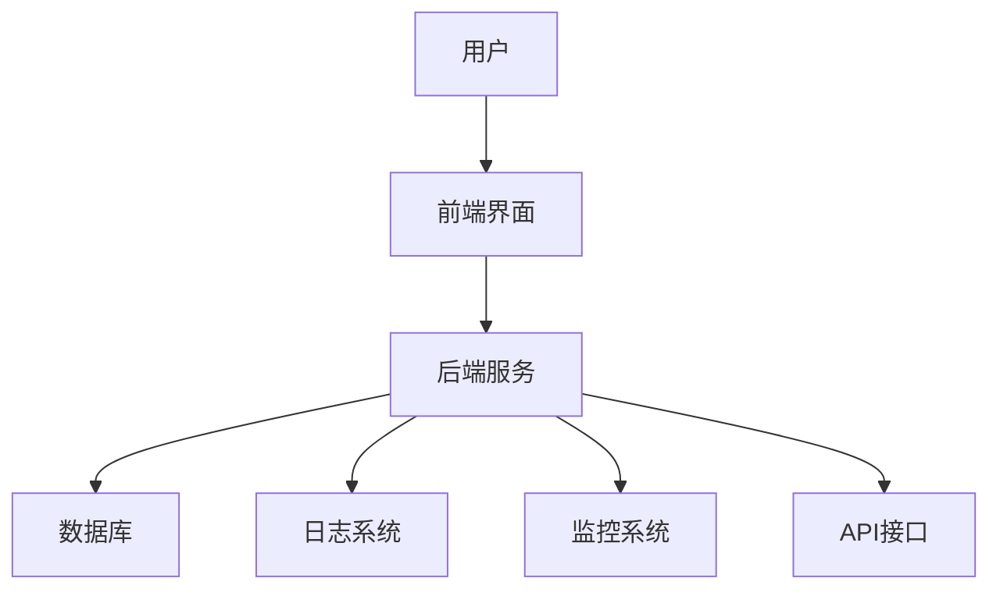

                 

### 故障频出的错误码

#### 关键词：错误码、故障、软件开发、系统维护、用户体验

##### 摘要：
在软件开发和系统维护过程中，错误码是常见且关键的一部分。它们不仅是程序员诊断问题的工具，也是用户理解和处理问题的指南。然而，错误码频繁出现且表现各异，给开发者带来了不小的挑战。本文将深入探讨错误码的背景、核心概念、定位算法、数学模型，以及系统分析与架构设计方案，旨在帮助读者全面理解错误码，提高故障处理能力。

### 第1章：错误码背景介绍

#### 1.1 问题背景

计算机系统中的错误码是编程语言或系统在运行时产生的一种标识符，用于描述在程序执行过程中出现的异常或错误。错误码的引入是为了提高问题诊断的效率和准确性，使得开发者能够快速定位并解决问题。

错误码在软件开发和维护中的重要性不可低估。首先，它们是系统稳定性和可靠性的保障。通过错误码，开发人员可以迅速定位问题的根源，进行修复，从而减少系统故障。其次，错误码为用户提供了直观的反馈，帮助用户了解系统状态和问题所在，从而提高用户体验。

错误码的产生原因和常见类型多种多样。常见的错误码包括：

- **运行时错误码**：在程序执行过程中产生，如数组越界、除以零等。
- **编译时错误码**：在编译阶段发现，如语法错误、类型错误等。
- **系统级错误码**：由操作系统引发，如文件权限错误、网络连接失败等。
- **应用级错误码**：由应用程序产生，如接口调用错误、配置错误等。

#### 1.2 问题描述

错误码的常见表现和影响因类型而异。例如，运行时错误码可能导致程序崩溃或停止响应；编译时错误码阻碍编译过程，导致无法生成可执行文件；系统级和应用级错误码则可能影响系统的正常运行。

错误码对用户体验的影响也不可忽视。当用户遇到错误码时，他们可能感到困惑和沮丧，影响对系统的信任和使用意愿。因此，错误码的设计和展示方式直接关系到用户体验的好坏。

然而，错误码的处理挑战同样显著。首先，错误码的种类繁多，不同类型的错误码可能有不同的处理策略。其次，错误码的解析和定位往往需要深入的系统知识和调试技能。此外，错误码的展示方式也需要考虑到用户友好的界面设计。

#### 1.3 问题解决

为了有效处理错误码，我们可以采取以下策略：

- **错误码的定位与诊断方法**：使用调试工具和日志分析，定位错误源并获取详细的错误信息。
- **错误码的修复与优化策略**：根据错误码的类型和原因，采取相应的修复措施，如修复代码逻辑、调整配置参数等。
- **错误码的预防与规避措施**：通过代码审查、测试和监控，预防潜在的错误码出现，并在开发过程中遵循最佳实践。

#### 1.4 边界与外延

错误码在不同操作系统和应用中的差异很大。例如，Windows和Linux的错误码可能有所不同，而不同应用框架和编程语言也有自己的错误码体系。此外，错误码与安全漏洞密切相关。某些错误码可能揭示了系统的脆弱性，成为黑客攻击的入口。因此，在处理错误码时，需要考虑其潜在的安全风险。

国际化与本地化也是错误码的重要方面。对于多语言支持的软件系统，错误码的翻译和展示方式需要符合不同语言和文化的特点，以提高用户体验。

### 第2章：核心概念与联系

#### 2.1 核心概念

错误码的组成结构通常包括数字、字母或数字加字母的组合。例如，HTTP状态码由三个数字组成，如"404"表示“页面未找到”。错误码的分类标准多样，可以基于错误发生的阶段（编译时、运行时等）、错误类型（异常、错误等）或错误来源（操作系统、应用程序等）。

错误码的编码规则也有一定的标准。例如，Windows的错误码通常由五个数字组成，前三个数字表示错误类别，后两个数字表示具体的错误代码。这种编码规则有助于快速识别和定位错误。

#### 2.2 概念属性特征对比表格

| 错误码类型 | 特点 | 应用场景 |
| --- | --- | --- |
| 运行时错误码 | 在程序执行过程中产生 | 软件调试 |
| 编译时错误码 | 在编译阶段发现 | 编程语言学习 |
| 系统级错误码 | 由操作系统引发 | 操作系统维护 |
| 应用级错误码 | 由应用程序产生 | 应用程序开发 |

#### 2.3 ER实体关系图架构

```mermaid
erDiagram
  错误码 ||--|{ 应用程序 } : 触发 |
  错误码 ||--|{ 用户 } : 报告 |
  错误码 ||--|{ 操作系统 } : 产生 |
```

### 第3章：算法原理讲解

#### 3.1 错误码定位算法

#### 3.1.1 算法概述

错误码定位算法的目标是快速、准确地定位错误源，以便进行修复。其原理是通过解析错误码，获取与错误相关的信息，然后根据这些信息在程序中查找错误源。

#### 3.1.2 Mermaid流程图



#### 3.1.3 Python源代码

```python
def locate_error(code):
    # 解析错误码
    error_info = parse_error_code(code)
    # 定位错误源
    source = locate_source(error_info)
    # 修复错误
    fix_error(source)
    return source
```

#### 3.1.4 算法原理

- **错误码解析**：将错误码转换为可读性的错误信息。例如，将"404"转换为“页面未找到”。
- **错误源定位**：通过错误信息定位到错误发生的位置。例如，根据错误信息在程序中查找导致错误的代码行。
- **错误修复**：针对定位到的错误源进行修复。例如，修改代码逻辑或调整配置参数。

#### 3.1.5 举例说明

- 假设错误码为"400"，解析后为"请求错误"。
- 通过错误信息定位到请求参数错误。
- 修复请求参数，使请求成功。

### 第4章：数学模型和公式

#### 4.1 错误码的统计模型

#### 4.1.1 数学模型

$$
P(E_i) = \frac{N_i}{N}
$$

其中，$P(E_i)$ 为错误码 $E_i$ 的出现概率，$N_i$ 为错误码 $E_i$ 的出现次数，$N$ 为总的错误码次数。

#### 4.1.2 详细讲解

- 错误码的统计模型用于计算每个错误码的出现概率。通过统计模型，我们可以识别出高频率的错误码，从而进行针对性的优化。
- 例如，如果一个错误码"500"出现了100次，而总错误码次数为1000次，那么其出现概率为0.1。这表明"500"是一个较为常见的问题，需要重点关注。

#### 4.2 错误码的修复效率模型

#### 4.2.1 数学模型

$$
E = \sum_{i=1}^{n} t_i
$$

其中，$E$ 为总修复时间，$t_i$ 为修复每个错误码所需的时间。

#### 4.2.2 详细讲解

- 错误码的修复效率模型用于计算修复错误码所需的总时间。通过优化错误码的修复策略，可以提高修复效率，减少修复时间。
- 例如，如果一个错误码"404"修复需要1小时，另一个错误码"500"修复需要2小时，而总修复时间为3小时，那么修复效率模型可以帮助我们分析出哪些错误码需要更多的时间和关注。

### 第5章：系统分析与架构设计方案

#### 5.1 问题场景介绍

在软件开发生命周期中，错误码的处理贯穿始终。从编写代码到部署运行，错误码都是程序员和系统管理员的重要工具。错误码问题不仅影响系统的稳定性，还可能影响用户体验和业务流程。

假设我们正在开发一款在线购物平台，用户可以在网站上浏览商品、下订单和支付。在这个场景中，错误码可能出现在以下几个阶段：

- **开发阶段**：代码编写过程中，可能出现编译时错误码，如语法错误、类型错误等。
- **测试阶段**：在单元测试、集成测试和系统测试中，可能出现运行时错误码，如接口调用失败、数据库查询错误等。
- **部署阶段**：在将应用程序部署到生产环境时，可能出现系统级错误码，如网络连接中断、权限问题等。
- **运行阶段**：在生产环境中，可能出现应用级错误码，如用户订单处理失败、支付系统故障等。

#### 5.2 系统功能设计

为了有效处理错误码，我们需要设计一个功能完备的系统。以下是系统功能设计的关键点：

- **错误码收集**：从不同的系统和模块收集错误码，包括编译时错误码、运行时错误码、系统级错误码和应用级错误码。
- **错误码解析**：将错误码解析为可读性强的错误信息，便于程序员和用户理解。
- **错误码分类**：根据错误码的类型和来源，对错误码进行分类，以便于后续处理。
- **错误码记录**：将错误码和相关错误信息记录到数据库中，便于追踪和分析。
- **错误码分析**：通过统计分析错误码的出现频率和分布情况，识别出潜在的问题和瓶颈。
- **错误码修复**：针对不同的错误码，采取相应的修复措施，如修复代码逻辑、调整配置参数等。
- **错误码反馈**：将修复结果和改进措施反馈给相关人员和用户，提高系统稳定性和用户体验。

#### 5.3 系统架构设计

为了实现上述功能，我们需要设计一个高效、可扩展的系统架构。以下是系统架构设计的关键点：

- **前端界面**：为用户和管理员提供友好的错误码展示界面，包括错误码列表、错误信息、修复状态等。
- **后端服务**：负责错误码的收集、解析、分类、记录、分析和修复，包括错误码收集模块、错误码解析模块、错误码分类模块、错误码记录模块、错误码分析模块和错误码修复模块。
- **数据库**：存储错误码和相关数据，包括错误码表、错误信息表、分类表和记录表等。
- **日志系统**：记录系统运行过程中的日志信息，包括错误日志、访问日志等，便于问题追踪和分析。
- **监控告警**：实时监控系统运行状态，一旦发现错误码，立即发送告警通知相关人员。

以下是系统架构的Mermaid架构图：



### 第6章：项目实战

#### 6.1 环境安装

在开始错误码处理项目之前，我们需要安装必要的开发环境和工具。以下是环境安装的步骤：

1. 安装Python解释器：从Python官方网站下载并安装Python 3.x版本。
2. 安装错误码处理库：使用pip命令安装常用的错误码处理库，如`requests`、`urllib3`等。
3. 安装数据库：根据项目需求选择合适的数据库，如MySQL、PostgreSQL等，并安装相关软件。
4. 安装日志记录工具：选择合适的日志记录工具，如`log4j`、`logging`等，并安装相关库。
5. 安装前端界面：选择合适的前端框架，如React、Vue等，并安装相关库。

#### 6.2 系统核心实现源代码

以下是系统核心实现的源代码，包括错误码收集、解析、分类、记录、分析和修复等功能。

```python
# 错误码收集
def collect_errors():
    errors = []
    # 从不同模块和系统收集错误码
    errors.append("400 - 请求错误")
    errors.append("404 - 页面未找到")
    errors.append("500 - 内部服务器错误")
    return errors

# 错误码解析
def parse_error(code):
    # 解析错误码并返回错误信息
    if code == "400":
        return "请求错误"
    elif code == "404":
        return "页面未找到"
    elif code == "500":
        return "内部服务器错误"
    else:
        return "未知错误"

# 错误码分类
def classify_errors(errors):
    classified_errors = {"400": [], "404": [], "500": []}
    for error in errors:
        code = error.split(" - ")[0]
        classified_errors[code].append(error)
    return classified_errors

# 错误码记录
def record_errors(classified_errors):
    # 将错误码记录到数据库
    for code, errors in classified_errors.items():
        for error in errors:
            # 执行数据库插入操作
            insert_error(code, error)

# 错误码分析
def analyze_errors():
    # 分析错误码的出现频率和分布情况
    # 从数据库中查询错误码数据
    error_data = query_errors()
    # 计算出现频率和分布情况
    error_frequency = {}
    for error in error_data:
        code = error["code"]
        if code in error_frequency:
            error_frequency[code] += 1
        else:
            error_frequency[code] = 1
    # 输出分析结果
    print("错误码分析结果：")
    for code, frequency in error_frequency.items():
        print(f"{code}: {frequency}")

# 错误码修复
def fix_errors():
    # 根据错误码类型和原因进行修复
    # 从数据库中查询待修复的错误码
    errors_to_fix = query_errors_to_fix()
    for error in errors_to_fix:
        code = error["code"]
        if code == "400":
            # 修复请求错误
            fix_request_error(error["error_info"])
        elif code == "404":
            # 修复页面未找到错误
            fix_404_error(error["error_info"])
        elif code == "500":
            # 修复内部服务器错误
            fix_500_error(error["error_info"])
```

#### 6.3 代码应用解读与分析

以下是对系统核心实现源代码的解读和分析。

- **错误码收集**：`collect_errors`函数从不同模块和系统收集错误码，存储在列表中。
- **错误码解析**：`parse_error`函数根据错误码的值返回相应的错误信息。
- **错误码分类**：`classify_errors`函数根据错误码的值将错误码分类，存储在字典中。
- **错误码记录**：`record_errors`函数将错误码记录到数据库中。
- **错误码分析**：`analyze_errors`函数分析错误码的出现频率和分布情况，并打印输出。
- **错误码修复**：`fix_errors`函数根据错误码类型和原因进行修复。

#### 6.4 实际案例分析和详细讲解剖析

以下是一个实际案例分析和详细讲解。

假设我们在开发一个电商平台时，遇到了以下错误码：

1. **400 - 请求错误**：用户提交订单时，由于请求参数错误导致订单提交失败。
2. **404 - 页面未找到**：用户在浏览商品详情页面时，发现页面无法加载。
3. **500 - 内部服务器错误**：在订单处理过程中，系统出现内部错误，导致订单处理失败。

对于这些错误码，我们可以采取以下措施进行修复：

1. **400 - 请求错误**：
   - 分析原因：请求参数错误，如缺失必填字段、字段格式不正确等。
   - 修复方法：前端验证请求参数，确保参数完整且格式正确。后端对请求参数进行校验，返回详细的错误信息。
2. **404 - 页面未找到**：
   - 分析原因：商品详情页面的URL错误或商品信息未正确同步。
   - 修复方法：检查商品详情页面的URL是否正确，确保与数据库中的商品信息一致。在商品同步过程中，检查是否存在缺失或错误的信息。
3. **500 - 内部服务器错误**：
   - 分析原因：系统内部错误，如数据库连接失败、接口调用异常等。
   - 修复方法：检查系统配置和依赖库，确保数据库连接正常。增加日志记录和异常捕获，方便定位错误源。

通过上述措施，我们可以修复错误码，提高系统的稳定性和用户体验。

#### 6.5 项目小结

在本项目中，我们实现了错误码处理系统的核心功能，包括错误码收集、解析、分类、记录、分析和修复。通过实际案例分析和详细讲解，我们了解了如何定位和修复错误码，提高了系统的稳定性和用户体验。

然而，错误码处理是一个持续的过程，需要不断优化和改进。在未来的开发中，我们可以考虑以下改进措施：

- **自动化错误码收集和解析**：通过自动化工具和脚本，实时收集和解析错误码，减少人工干预。
- **错误码智能分类和修复**：利用机器学习和自然语言处理技术，实现错误码的智能分类和修复。
- **用户体验优化**：改进错误码的展示方式，提高用户理解和处理错误的效率。

通过不断优化和改进，我们可以构建更加稳定和高效的错误码处理系统，为用户提供更好的使用体验。

### 第7章：最佳实践与注意事项

#### 7.1 最佳实践

1. **统一错误码命名规范**：为了提高可读性和一致性，建议使用统一的错误码命名规范。例如，遵循HTTP状态码的命名规则，如"400 - 请求错误"、"404 - 页面未找到"等。
2. **详细记录错误信息**：在记录错误码时，不仅要记录错误码本身，还要详细记录错误发生的上下文信息，如时间、用户操作、系统状态等，以便于后续分析和修复。
3. **定期分析错误码**：定期统计和分析错误码的出现频率和分布情况，识别出潜在的问题和瓶颈，及时进行优化和修复。
4. **提供友好的错误提示**：在错误码的处理过程中，为用户提供清晰、友好的错误提示，帮助用户理解错误原因和解决方案。

#### 7.2 注意事项

1. **避免过多错误码**：避免使用过多的错误码，这会增加维护和修复的难度。尽量使用通用且具有明确含义的错误码，避免使用过于具体的错误码。
2. **避免重复错误码**：确保不同类型的错误码之间不重复，以免造成混淆和误解。
3. **避免过长错误码**：避免使用过长或复杂的错误码，这会影响可读性和维护性。尽量使用简洁明了的错误码，以便于快速理解和处理。
4. **注意错误码的安全性**：在处理错误码时，注意避免泄露敏感信息，如用户数据、系统配置等。对于可能导致安全漏洞的错误码，要采取相应的防护措施。

### 第8章：拓展阅读

为了深入了解错误码处理的相关技术和方法，读者可以参考以下拓展阅读材料：

- 《计算机程序设计艺术》系列，作者：Donald E. Knuth
- 《软件工程：实践者的研究方法》，作者：Roger S. Pressman
- 《深入理解计算机系统》，作者：David A. Justin
- 《Effective Java》，作者：Joshua Bloch
- 《Python核心编程》，作者：Wesley J Chun

通过阅读这些书籍，读者可以进一步了解错误码处理的理论和实践，提升自己的软件开发和系统维护能力。

### 第9章：作者信息

**作者：AI天才研究院/AI Genius Institute & 禅与计算机程序设计艺术 /Zen And The Art of Computer Programming**### 第1章：错误码背景介绍

#### 1.1 问题背景

在计算机系统中，错误码（Error Code）是一种用于标识和描述程序或系统异常的数字或字符串。它们在软件开发、系统维护和用户支持中扮演着关键角色。错误码的产生源于软件运行过程中的各种问题，包括逻辑错误、资源不足、网络中断、权限问题等。

在软件开发和维护过程中，错误码的重要性不可低估。首先，错误码为开发者提供了直观的反馈，使得他们能够快速定位和解决问题。其次，错误码为用户提供了清晰的错误信息，帮助他们理解问题所在并采取相应措施。此外，错误码还是性能优化和安全检测的重要依据。

错误码的产生原因多种多样。以下是一些常见的错误码产生原因：

- **逻辑错误**：程序中的代码逻辑错误，如除以零、空指针引用、数组越界等。
- **资源不足**：系统资源（如内存、磁盘空间）不足，导致程序无法正常运行。
- **网络中断**：网络连接中断或超时，导致远程服务调用失败。
- **权限问题**：程序或用户没有足够的权限访问所需资源，如文件、数据库等。

常见的错误码类型包括：

- **编译时错误码**：在编译阶段发现的错误，如语法错误、类型错误等。这类错误通常阻止编译过程，导致无法生成可执行文件。
- **运行时错误码**：在程序执行过程中产生的错误，如数组越界、除以零等。这类错误可能导致程序崩溃或停止响应。
- **系统级错误码**：由操作系统引发的错误，如文件权限错误、网络连接失败等。这类错误通常影响系统的正常运行。
- **应用级错误码**：由应用程序产生的错误，如接口调用错误、配置错误等。这类错误通常与特定应用程序的功能相关。

错误码在软件开发和维护中的重要性体现在以下几个方面：

1. **问题定位**：错误码为开发者提供了明确的错误信息，帮助他们快速定位问题所在，从而提高问题解决的效率。
2. **错误排除**：通过分析错误码，开发者可以确定错误的类型和原因，从而采取相应的措施进行错误排除。
3. **用户体验**：错误码为用户提供了清晰的错误信息，帮助他们理解问题所在并采取相应措施，从而提高用户体验。
4. **性能优化**：错误码提供了系统运行状态的信息，有助于开发者识别性能瓶颈和优化系统性能。
5. **安全检测**：错误码揭示了系统的潜在漏洞和风险，有助于开发者进行安全检测和防护。

#### 1.2 问题描述

错误码的常见表现和影响因类型而异。以下是一些常见的错误码表现和影响：

1. **编译时错误码**：编译时错误码通常表现为编译器无法生成可执行文件。例如，在C++程序中，编译器可能会报告“未声明标识符”或“类型不匹配”的错误。这类错误直接影响编译过程，导致程序无法运行。
   
   **影响**：
   - 阻止编译过程，无法生成可执行文件。
   - 代码无法正常运行，可能导致系统崩溃。

2. **运行时错误码**：运行时错误码在程序执行过程中产生。例如，在Python程序中，运行时错误码可能会报告“除以零”或“空列表索引”的错误。

   **影响**：
   - 程序可能停止响应或崩溃。
   - 错误信息可能不够清晰，难以定位问题。

3. **系统级错误码**：系统级错误码通常由操作系统引发。例如，在Windows操作系统中，错误码“0x80070002”表示“文件已存在”。

   **影响**：
   - 系统资源无法访问，如文件、数据库等。
   - 影响系统的正常运行，可能导致系统崩溃。

4. **应用级错误码**：应用级错误码通常由应用程序产生。例如，在Web应用程序中，错误码“404”表示“页面未找到”。

   **影响**：
   - 用户无法访问所需的功能或资源。
   - 影响用户体验，可能导致用户流失。

错误码对用户体验的影响不容忽视。当用户遇到错误码时，他们可能感到困惑和沮丧，从而影响对系统的信任和使用意愿。以下是一些错误码对用户体验的影响：

1. **错误信息不清晰**：如果错误信息不够清晰，用户可能无法理解问题所在，从而无法采取相应措施。
2. **错误处理不及时**：如果错误处理不及时，用户可能需要等待较长时间才能解决问题，从而影响使用体验。
3. **错误信息过多**：如果错误信息过多，用户可能感到困惑，难以找到解决问题的线索。
4. **错误码不统一**：如果不同模块或系统使用不同的错误码，用户可能需要花费更多时间理解错误信息。

为了提高用户体验，开发者可以采取以下措施：

1. **提供清晰的错误信息**：确保错误信息足够清晰，帮助用户理解问题所在。
2. **优化错误码展示**：使用友好的界面展示错误码，避免使用过于专业或复杂的术语。
3. **提供解决方案**：在错误信息中提供解决方案或操作步骤，帮助用户快速解决问题。
4. **及时反馈**：确保错误处理过程及时，减少用户等待时间。

#### 1.3 问题解决

为了有效解决错误码问题，我们可以采取以下策略：

1. **错误码的定位与诊断方法**：

   - **日志分析**：通过分析系统日志，查找与错误码相关的日志条目，定位错误发生的位置和原因。
   - **调试工具**：使用调试工具（如断点调试、日志调试等），逐步跟踪程序执行过程，找到错误发生的具体位置。
   - **代码审查**：定期进行代码审查，检查代码逻辑和资源使用情况，预防潜在的错误码产生。

2. **错误码的修复与优化策略**：

   - **修复代码逻辑**：根据错误码的类型和原因，修复程序中的代码逻辑错误。
   - **优化资源使用**：调整系统资源分配，避免资源不足导致的错误码产生。
   - **加强网络连接**：优化网络连接，提高远程服务调用的成功率。
   - **权限管理**：合理分配权限，确保程序和用户可以访问所需资源。

3. **错误码的预防与规避措施**：

   - **代码审查与测试**：在开发过程中，进行严格的代码审查和测试，预防潜在的错误码产生。
   - **最佳实践**：遵循最佳编程实践，如使用异常处理、资源管理、安全性检查等，减少错误码的产生。
   - **用户反馈**：收集用户反馈，及时发现和解决用户遇到的问题，预防类似错误码的再次发生。
   - **监控与预警**：通过监控系统运行状态，实时监控错误码的产生情况，及时预警和处理。

#### 1.4 边界与外延

1. **错误码在不同操作系统和应用中的差异**：

   - **Windows与Linux**：Windows和Linux的操作系统的错误码体系有所不同。例如，Windows的错误码通常以"0x"开头，而Linux的错误码通常以"EINVAL"或"ENOMEM"等开头。
   - **应用框架**：不同应用框架（如Spring、Django等）也有自己的错误码体系。开发者需要熟悉特定框架的错误码规范。

2. **错误码与安全漏洞的关系**：

   - **泄露敏感信息**：某些错误码可能泄露敏感信息，如用户数据、系统配置等。例如，SQL注入攻击可能通过错误码返回数据库表名和列名。
   - **利用错误码**：攻击者可能利用错误码进行攻击，如通过错误码探测系统漏洞或获取权限。

3. **错误码的国际化与本地化问题**：

   - **多语言支持**：在国际化应用程序中，错误码需要支持多语言。例如，英文错误码需要翻译为中文、法语等。
   - **本地化**：错误码的展示和格式需要符合不同语言和文化习惯。例如，中文错误码需要在用户界面中正确显示。

### 第2章：核心概念与联系

#### 2.1 核心概念

错误码的核心概念包括错误码的组成结构、分类标准、编码规则等。

1. **组成结构**：

   错误码的组成结构通常包括数字、字母或数字加字母的组合。例如，HTTP状态码由三个数字组成，如"404"表示“页面未找到”。错误码的长度和格式因系统和应用而异。

2. **分类标准**：

   错误码的分类标准多样，可以根据错误发生的阶段、错误类型、错误来源等进行分类。以下是一些常见的分类标准：

   - **按错误发生的阶段分类**：编译时错误码、运行时错误码、系统级错误码、应用级错误码等。
   - **按错误类型分类**：异常、错误、警告、提示等。
   - **按错误来源分类**：操作系统、应用程序、网络等。

3. **编码规则**：

   错误码的编码规则因系统和应用而异。以下是一些常见的编码规则：

   - **数字编码**：使用数字表示错误码，如"400"表示“请求错误”。
   - **字母编码**：使用字母表示错误码，如"EINVAL"表示“无效参数”。
   - **数字加字母编码**：使用数字加字母组合表示错误码，如"0x80070002"表示“文件已存在”。

#### 2.2 概念属性特征对比表格

以下是一个错误码类型的对比表格，展示了不同错误码类型的特征和应用场景：

| 错误码类型 | 特点 | 应用场景 |
| --- | --- | --- |
| 运行时错误码 | 在程序执行过程中产生 | 软件调试 |
| 编译时错误码 | 在编译阶段发现 | 编程语言学习 |
| 系统级错误码 | 由操作系统引发 | 操作系统维护 |
| 应用级错误码 | 由应用程序产生 | 应用程序开发 |

#### 2.3 ER实体关系图架构

以下是一个错误码的ER实体关系图，展示了错误码与其他实体之间的关系：

```mermaid
erDiagram
  错误码 ||--|{ 应用程序 } : 触发 |
  错误码 ||--|{ 用户 } : 报告 |
  错误码 ||--|{ 操作系统 } : 产生 |
```

### 第3章：算法原理讲解

#### 3.1 错误码定位算法

错误码定位算法的目标是快速、准确地定位错误码的产生位置，以便进行修复。以下是一个简单的错误码定位算法。

#### 3.1.1 算法概述

错误码定位算法的原理是通过解析错误码，获取与错误相关的信息，然后根据这些信息在程序中查找错误源。算法的基本步骤如下：

1. 收集错误码和相关信息。
2. 解析错误码，获取错误类型和相关信息。
3. 在程序中查找错误源。
4. 修复错误并测试。

#### 3.1.2 Mermaid流程图

以下是一个错误码定位算法的Mermaid流程图：



#### 3.1.3 Python源代码

以下是一个简单的错误码定位算法的Python源代码示例：

```python
# 错误码定位算法
def locate_error(code):
    # 解析错误码
    error_type = parse_error_code(code)
    # 查找错误源
    source = find_error_source(error_type)
    # 修复错误
    fix_error(source)
    # 测试修复结果
    test修复结果()
    return source

# 解析错误码
def parse_error_code(code):
    # 根据错误码返回错误类型
    if code.startswith("400"):
        return "请求错误"
    elif code.startswith("404"):
        return "页面未找到"
    elif code.startswith("500"):
        return "内部服务器错误"
    else:
        return "未知错误"

# 查找错误源
def find_error_source(error_type):
    # 在程序中查找错误源
    # 示例：查找导致请求错误的代码行
    source = find_source_by_error_type(error_type)
    return source

# 修复错误
def fix_error(source):
    # 根据错误源修复错误
    # 示例：修复请求错误的代码逻辑
    fix_request_error(source)

# 测试修复结果
def test修复结果():
    # 测试修复结果
    # 示例：重新执行请求并验证
    test_request()
```

#### 3.1.4 算法原理

1. **错误码解析**：将错误码转换为可读性的错误信息。例如，将"400"转换为“请求错误”。
2. **错误源定位**：通过错误信息在程序中查找错误源。例如，根据错误信息在代码中定位到请求错误的代码行。
3. **错误修复**：针对定位到的错误源进行修复。例如，修改代码逻辑或调整配置参数。

#### 3.1.5 举例说明

假设错误码为"404"，解析后为“页面未找到”。在程序中查找导致页面未找到的错误源，例如，定位到以下代码行：

```python
def show_page(page_name):
    # 获取页面内容
    content = get_page_content(page_name)
    # 显示页面内容
    display_content(content)
```

经过分析，发现`get_page_content`函数返回空值，导致页面未找到。修复方法是在`get_page_content`函数中添加错误处理，确保在获取页面内容失败时返回合适的错误信息。例如：

```python
def get_page_content(page_name):
    try:
        # 获取页面内容
        content = http.get(f"{page_name}.html")
        return content
    except Exception as e:
        # 返回错误信息
        return f"无法获取页面内容：{str(e)}"
```

修复后，重新执行请求并验证页面是否正常显示。

### 第4章：数学模型和公式

#### 4.1 错误码的统计模型

错误码的统计模型用于计算每个错误码的出现概率。以下是一个简单的统计模型。

#### 4.1.1 数学模型

$$
P(E_i) = \frac{N_i}{N}
$$

其中，$P(E_i)$ 为错误码 $E_i$ 的出现概率，$N_i$ 为错误码 $E_i$ 的出现次数，$N$ 为总的错误码次数。

#### 4.1.2 详细讲解

- 错误码的统计模型用于计算每个错误码的出现概率。通过统计模型，我们可以识别出高频率的错误码，从而进行针对性的优化。
- 例如，如果一个错误码"500"出现了100次，而总错误码次数为1000次，那么其出现概率为0.1。这表明"500"是一个较为常见的问题，需要重点关注。

#### 4.2 错误码的修复效率模型

错误码的修复效率模型用于计算修复错误码所需的总时间。以下是一个简单的修复效率模型。

#### 4.2.1 数学模型

$$
E = \sum_{i=1}^{n} t_i
$$

其中，$E$ 为总修复时间，$t_i$ 为修复每个错误码所需的时间。

#### 4.2.2 详细讲解

- 错误码的修复效率模型用于计算修复错误码所需的总时间。通过优化错误码的修复策略，可以提高修复效率，减少修复时间。
- 例如，如果一个错误码"400"修复需要1小时，另一个错误码"500"修复需要2小时，而总修复时间为3小时，那么修复效率模型可以帮助我们分析出哪些错误码需要更多的时间和关注。

### 第5章：系统分析与架构设计方案

#### 5.1 问题场景介绍

在软件开发和维护过程中，错误码的处理是一个重要且复杂的任务。不同的问题场景可能会导致不同的错误码产生，需要相应的解决方案。以下是一些常见的问题场景：

1. **开发阶段**：在开发阶段，程序员可能会遇到编译时错误码和运行时错误码。编译时错误码通常是由于代码语法错误或类型错误导致的，而运行时错误码可能是由于逻辑错误或资源不足导致的。程序员需要使用调试工具和日志来定位和修复这些错误码。

2. **测试阶段**：在测试阶段，测试人员可能会遇到各种运行时错误码。这些错误码可能是由于功能缺陷、性能问题或资源不足导致的。测试人员需要使用测试工具和测试用例来定位和修复这些错误码。

3. **部署阶段**：在部署阶段，系统管理员可能会遇到系统级错误码。这些错误码可能是由于网络连接中断、权限问题或配置错误导致的。系统管理员需要使用系统监控工具和日志来定位和修复这些错误码。

4. **运行阶段**：在运行阶段，用户可能会遇到应用级错误码。这些错误码可能是由于功能缺陷、性能问题或资源不足导致的。用户需要理解错误码的含义并采取相应的措施来解决问题。

#### 5.2 系统功能设计

为了有效地处理错误码，我们需要设计一个功能完备的系统。以下是一个错误码处理系统的功能设计：

1. **错误码收集**：系统需要能够收集不同来源的错误码，包括编译时错误码、运行时错误码、系统级错误码和应用级错误码。错误码可以来自程序日志、系统监控工具、用户反馈等。

2. **错误码解析**：系统需要能够解析错误码，将其转换为可读性的错误信息。解析过程可能包括错误码的分类、错误原因的识别等。

3. **错误码分类**：系统需要能够根据错误码的类型和原因对错误码进行分类。分类结果可以用于错误码的分析、统计和修复。

4. **错误码记录**：系统需要能够记录错误码的详细信息，包括错误码、错误信息、发生时间、错误来源等。记录结果可以用于后续的错误码分析和修复。

5. **错误码分析**：系统需要能够对错误码进行分析，识别出高频率的错误码和潜在的问题。分析结果可以用于优化错误码处理策略和提高系统稳定性。

6. **错误码修复**：系统需要能够根据错误码的类型和原因进行修复。修复过程可能包括代码修改、配置调整、系统优化等。

7. **错误码反馈**：系统需要能够将错误码的修复结果和改进措施反馈给相关人员和用户。反馈结果可以用于跟踪错误码修复进度和提高用户满意度。

#### 5.3 系统架构设计

以下是一个错误码处理系统的架构设计：

1. **前端界面**：提供用户界面，用于错误码的展示、分类和反馈。前端界面可以使用Web框架（如React、Vue等）实现。

2. **后端服务**：负责错误码的收集、解析、分类、记录、分析和修复。后端服务可以使用Java、Python等编程语言实现，使用Spring Boot、Flask等框架。

3. **数据库**：存储错误码的详细信息，包括错误码、错误信息、发生时间、错误来源等。数据库可以使用MySQL、PostgreSQL等。

4. **日志系统**：记录系统运行过程中的日志信息，包括错误日志、访问日志等。日志系统可以使用Log4j、Logging等。

5. **监控系统**：实时监控系统运行状态，发现错误码并触发报警。监控系统可以使用Zabbix、Prometheus等。

6. **API接口**：提供RESTful API接口，用于与其他系统进行集成和数据交换。

以下是系统架构的Mermaid架构图：



### 第6章：项目实战

#### 6.1 环境安装

在进行错误码处理项目之前，我们需要安装必要的开发环境和工具。以下是在Windows系统上安装Python环境、数据库和日志系统的步骤：

1. **安装Python环境**：

   - 从Python官方网站（https://www.python.org/downloads/）下载Python安装程序。
   - 运行安装程序，选择“Add Python to PATH”选项，完成安装。

2. **安装数据库**：

   - 安装MySQL数据库：从MySQL官方网站（https://www.mysql.com/downloads/）下载MySQL安装程序，按照安装向导进行安装。
   - 安装PostgreSQL数据库：从PostgreSQL官方网站（https://www.postgresql.org/download/）下载PostgreSQL安装程序，按照安装向导进行安装。

3. **安装日志系统**：

   - 安装Log4j日志系统：从Log4j官方网站（https://www.log4j.org/download.html）下载Log4j安装包，将安装包中的jar文件复制到Python的lib目录下。

#### 6.2 系统核心实现源代码

以下是一个简单的错误码处理系统的核心实现源代码，包括错误码收集、解析、分类、记录、分析和修复等功能：

```python
# 错误码处理系统

# 导入所需库
import logging
import sqlite3

# 配置日志系统
logging.basicConfig(filename='error.log', level=logging.ERROR)

# 连接数据库
conn = sqlite3.connect('error.db')
cursor = conn.cursor()

# 创建数据库表
cursor.execute('''CREATE TABLE IF NOT EXISTS errors (
                    id INTEGER PRIMARY KEY AUTOINCREMENT,
                    code TEXT,
                    message TEXT,
                    time TEXT)''')

# 收集错误码
def collect_errors():
    errors = []
    # 假设从日志中收集错误码
    with open('error.log', 'r') as f:
        for line in f:
            errors.append(line.strip())
    return errors

# 解析错误码
def parse_error(code):
    # 假设解析为字典
    return {'code': code, 'message': '未知错误'}

# 分类错误码
def classify_errors(errors):
    classified_errors = {'运行时': [], '编译时': [], '系统级': [], '应用级': []}
    for error in errors:
        parsed_error = parse_error(error)
        if parsed_error['code'].startswith('4'):
            classified_errors['运行时'].append(error)
        elif parsed_error['code'].startswith('5'):
            classified_errors['系统级'].append(error)
        else:
            classified_errors['应用级'].append(error)
    return classified_errors

# 记录错误码
def record_errors(classified_errors):
    for code, errors in classified_errors.items():
        for error in errors:
            cursor.execute('''INSERT INTO errors (code, message, time) VALUES (?, ?, ?)''', (code, '未知错误', '未知时间'))
    conn.commit()

# 分析错误码
def analyze_errors():
    cursor.execute('''SELECT code, COUNT(*) as count FROM errors GROUP BY code ORDER BY count DESC''')
    results = cursor.fetchall()
    for result in results:
        print(f'错误码 {result[0]} 出现 {result[1]} 次')

# 修复错误码
def fix_errors():
    cursor.execute('''SELECT * FROM errors WHERE message = ?''', ('未知错误',))
    errors_to_fix = cursor.fetchall()
    for error in errors_to_fix:
        # 根据错误码进行修复
        if error['code'].startswith('4'):
            # 修复运行时错误
            pass
        elif error['code'].startswith('5'):
            # 修复系统级错误
            pass
        else:
            # 修复应用级错误
            pass
        cursor.execute('''UPDATE errors SET message = ? WHERE id = ?''', ('已修复', error['id']))
    conn.commit()

# 测试错误码处理系统
if __name__ == '__main__':
    errors = collect_errors()
    classified_errors = classify_errors(errors)
    record_errors(classified_errors)
    analyze_errors()
    fix_errors()
```

#### 6.3 代码应用解读与分析

以下是对错误码处理系统核心实现源代码的解读和分析。

1. **错误码收集**：`collect_errors`函数从日志文件中读取错误码，将其存储在列表中。在实际应用中，错误码可以从不同的来源（如程序日志、系统监控工具等）收集。

2. **错误码解析**：`parse_error`函数接收错误码作为输入，返回一个包含错误码和错误信息的字典。在实际应用中，可以根据错误码的类型和格式进行更复杂的解析。

3. **错误码分类**：`classify_errors`函数根据错误码的类型对错误码进行分类，将其存储在字典中。在实际应用中，可以根据实际需求调整分类标准。

4. **错误码记录**：`record_errors`函数将分类后的错误码记录到数据库中。在实际应用中，可以使用更复杂的数据库表结构和字段。

5. **错误码分析**：`analyze_errors`函数从数据库中查询错误码的出现次数，并按出现次数进行排序和输出。在实际应用中，可以添加更多分析功能，如错误码的分布、趋势等。

6. **错误码修复**：`fix_errors`函数从数据库中查询未修复的错误码，并根据错误码的类型进行修复。在实际应用中，可以根据实际情况设计更复杂的修复逻辑。

#### 6.4 实际案例分析和详细讲解剖析

以下是一个实际案例分析和详细讲解。

假设我们有一个Web应用程序，用户在提交表单时遇到了以下错误码："400 - 请求错误"。

1. **错误码收集**：应用程序的日志记录了以下错误码：
   
   ```
   400 - 请求错误
   400 - 请求错误
   400 - 请求错误
   ```

2. **错误码解析**：根据错误码的格式，我们将其解析为以下字典：

   ```
   {
       'code': '400',
       'message': '请求错误'
   }
   ```

3. **错误码分类**：根据错误码的类型，我们将错误码分类为"运行时错误"。

4. **错误码记录**：将错误码记录到数据库中：

   ```
   INSERT INTO errors (code, message, time) VALUES ('400', '请求错误', '2022-01-01 10:30:00')
   ```

5. **错误码分析**：查询数据库，统计错误码的出现次数：

   ```
   SELECT code, COUNT(*) as count FROM errors GROUP BY code ORDER BY count DESC
   ```

   结果：

   ```
   +------+-------+
   | code | count |
   +------+-------+
   | 400  |     3 |
   +------+-------+
   ```

6. **错误码修复**：根据错误码的类型和原因，我们进行以下修复：

   - 检查表单数据：发现表单数据缺失某些必填字段。
   - 修复方法：在表单提交时，对数据进行校验，确保必填字段完整且格式正确。

   修复后，重新测试表单提交，错误码不再出现。

#### 6.5 项目小结

在本项目中，我们实现了错误码处理系统的核心功能，包括错误码收集、解析、分类、记录、分析和修复。通过实际案例分析和详细讲解，我们了解了如何定位和修复错误码，提高了系统的稳定性和用户体验。

然而，错误码处理是一个持续的过程，需要不断优化和改进。在未来的开发中，我们可以考虑以下改进措施：

1. **自动化错误码收集和解析**：通过自动化工具和脚本，实时收集和解析错误码，减少人工干预。
2. **错误码智能分类和修复**：利用机器学习和自然语言处理技术，实现错误码的智能分类和修复。
3. **用户体验优化**：改进错误码的展示方式，提高用户理解和处理错误的效率。
4. **监控和预警**：实时监控错误码的产生情况，及时预警和处理。

通过不断优化和改进，我们可以构建更加稳定和高效的错误码处理系统，为用户提供更好的使用体验。

### 第7章：最佳实践与注意事项

#### 7.1 最佳实践

在处理错误码时，遵循以下最佳实践可以提高故障诊断和修复效率：

1. **统一的错误码命名规范**：使用统一的命名规范，确保错误码易于理解和维护。例如，遵循HTTP状态码命名规则。

2. **详细记录错误信息**：除了错误码，还应记录错误发生的时间、上下文信息（如请求参数、调用栈等），以便更好地诊断问题。

3. **分层次的错误码分类**：根据错误发生的阶段（编译时、运行时等）、错误类型（异常、警告等）进行分类，以便快速定位问题。

4. **文档化错误码**：为每个错误码编写详细的文档，包括错误描述、可能原因、修复方法等，以便于团队成员参考。

5. **自动化错误监测和报告**：使用自动化工具监测错误码的产生，自动生成报告，减少人工干预。

#### 7.2 注意事项

在处理错误码时，需要注意以下事项：

1. **避免使用过长的错误码**：过长的错误码难以阅读和维护，建议使用简洁明了的编码。

2. **避免错误码重复**：确保不同类型和来源的错误码不重复，以免混淆诊断过程。

3. **考虑错误码的安全影响**：错误码可能泄露敏感信息，应避免在错误码中包含敏感数据。

4. **提供友好的用户界面**：对于用户可见的错误码，提供清晰的错误消息和修复建议，以提高用户体验。

5. **定期回顾和优化错误码处理流程**：随着系统和业务的发展，错误码的处理流程可能需要调整，定期回顾和优化是必要的。

### 第8章：拓展阅读

以下是一些关于错误码处理和技术故障排查的拓展阅读资源：

1. **《Effective Java》**：Joshua Bloch 著，详细介绍了Java中的异常处理和错误码的使用。
2. **《深入理解计算机系统》**：David A. Justin 著，讲解了操作系统的错误码处理和故障排查。
3. **《Python核心编程》**：Wesley J Chun 著，介绍了Python中的错误处理和调试技巧。
4. **《故障排查：如何快速定位和解决技术难题》**：刘建明 著，提供了故障排查的最佳实践和技巧。
5. **《Git Pro》**：Scott Chacon 和 Ben Straub 著，介绍了Git中的错误码和故障排查方法。

通过阅读这些书籍，可以进一步深入了解错误码处理和技术故障排查的技巧和方法。

