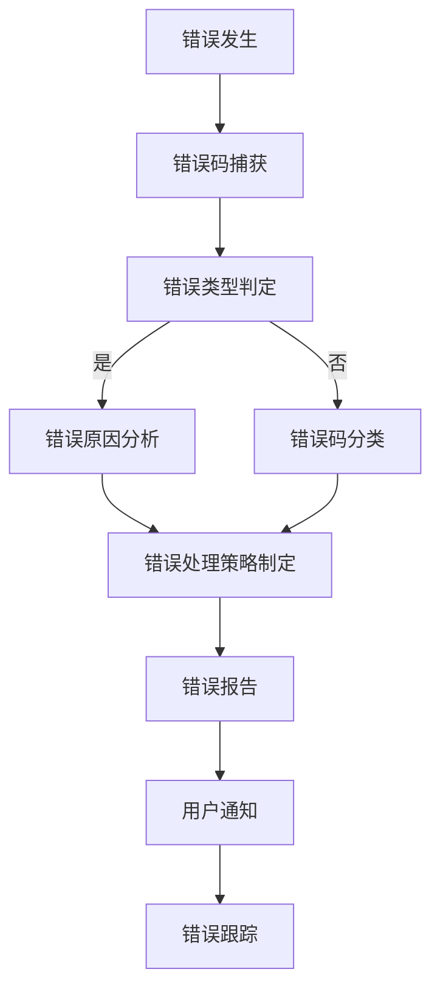
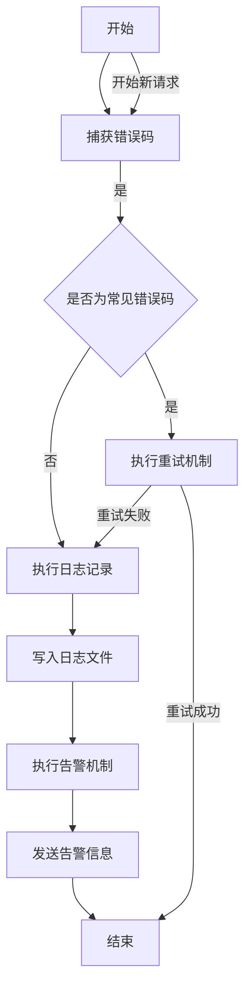

                 

### 文章标题

#### 《故障频出的错误码》

> 关键词：错误码、故障管理、系统优化、企业应用、开源框架

> 摘要：本文深入探讨了错误码在现代软件系统中的重要性及其带来的挑战。通过详细分析错误码的基础知识、生成与处理流程、优化策略以及在不同场景中的应用，为读者提供了全面而实用的错误码管理指南。文章还介绍了错误码在企业级系统和开源框架中的实现，并探讨了错误码管理工具与平台的设计与实现。最后，文章总结了错误码管理的发展趋势和最佳实践，为未来的研究和应用提供了方向。

## 《故障频出的错误码》目录大纲

### 第1章 引言

#### 1.1 问题的背景

- 现代软件系统的复杂性
- 错误码的重要性
- 错误码管理现状

#### 1.2 问题描述

- 错误码的定义和作用
- 常见错误码的种类和特点
- 错误码带来的挑战

#### 1.3 问题解决

- 错误码处理的原理和方法
- 错误码优化的目标
- 错误码优化的策略

#### 1.4 边界与外延

- 错误码在各类系统中的应用
- 错误码与其他技术领域的关联
- 错误码的管理流程

#### 1.5 概念结构与核心要素组成

- 错误码的分类标准
- 错误码的构成要素
- 错误码的解析流程

### 第2章 错误码的基础知识

#### 2.1 错误码的基本概念

- 错误码的定义
- 错误码的层次结构
- 错误码的编码方式

#### 2.2 错误码的种类与特点

- 常见错误码的种类
- 不同类型错误码的特点
- 错误码的分布规律

#### 2.3 错误码的属性特征对比表格

- 错误码属性特征表

### 第3章 错误码的生成与处理

#### 3.1 错误码的生成原理

- 错误码的生成过程
- 错误码的生成策略

#### 3.2 错误码的处理流程

- 错误码的识别
- 错误码的解析
- 错误码的反馈

#### 3.3 错误码的处理算法

- 常见的错误码处理算法
- 算法原理讲解

#### 3.4 错误码处理算法的Mermaid流程图

- Mermaid流程图示例

### 第4章 错误码的优化策略

#### 4.1 错误码优化的目标

- 提高错误码的可读性
- 提高错误码的准确性
- 提高错误码的处理效率

#### 4.2 错误码优化的策略

- 预处理策略
- 后处理策略
- 动态调整策略

#### 4.3 优化案例分析与对比

- 优化前后的效果对比
- 优化方法的优缺点分析

### 第5章 错误码在企业级系统中的应用

#### 5.1 企业级系统的错误码管理

- 错误码管理的原则
- 错误码管理的流程
- 错误码管理的关键要素

#### 5.2 错误码在企业级系统中的实战案例

- 案例一：Web应用中的错误码管理
- 案例二：大数据系统中的错误码管理

### 第6章 错误码在开源框架中的实现

#### 6.1 错误码在Spring框架中的实现

- Spring框架的错误码管理机制
- 错误码的配置和使用

#### 6.2 错误码在其他开源框架中的实现

- MyBatis框架的错误码管理
- Dubbo框架的错误码管理

### 第7章 错误码管理工具与平台

#### 7.1 错误码管理工具的选择

- 常见的错误码管理工具
- 工具的选择标准

#### 7.2 错误码管理平台的设计与实现

- 平台的设计原则
- 平台的功能模块
- 平台的技术架构

### 第8章 总结与展望

#### 8.1 错误码管理的发展趋势

- 错误码管理技术的发展趋势
- 错误码管理在未来的应用前景

#### 8.2 最佳实践 tips

- 错误码管理的最佳实践
- 注意事项与未来展望

### 第1章 引言

#### 1.1 问题的背景

在当今信息技术飞速发展的时代，软件系统已经成为各行各业不可或缺的组成部分。然而，随着软件系统的复杂度不断增加，系统的稳定性和可靠性面临着巨大的挑战。错误码作为系统故障的重要表现形式，成为了开发者和管理者关注的焦点。

现代软件系统通常由多个模块和子系统组成，涉及前端、后端、数据库、网络等多个技术领域。每个模块和子系统都有可能产生错误码，而这些错误码的复杂性使得错误码的管理成为一个难题。错误码不仅能够帮助开发者快速定位和解决问题，还能为系统的优化和改进提供重要参考。然而，当前错误码管理现状并不乐观，许多系统在错误码的管理上存在诸多问题，如错误码定义不统一、错误码描述不清晰、错误码处理不及时等。

#### 1.2 问题描述

错误码（Error Code）是计算机系统中用于表示错误或异常情况的一种编码。它通常由数字或字符串组成，能够提供关于错误性质和位置的详细信息。错误码在软件开发和系统运维中扮演着至关重要的角色，以下是其定义和作用、常见种类、特点以及带来的挑战：

**错误码的定义和作用：**

- **定义：** 错误码是一种用来表示错误或异常状态的标识符，通常包含错误类型、错误原因、错误位置等信息。
- **作用：** 错误码能够帮助开发者快速定位错误，分析错误原因，并提供错误处理和修复的依据。

**常见错误码的种类和特点：**

- **系统级错误码：** 通常由操作系统或核心库返回，如Linux的错误码（如`EINVAL`表示无效参数）。
- **应用级错误码：** 由应用程序自定义，用于表示特定功能的错误状态，如Web应用中的HTTP状态码（如`404 Not Found`）。
- **网络级错误码：** 用于描述网络通信过程中的错误，如TCP错误码（如`ECONNRESET`表示连接被重置）。

**错误码带来的挑战：**

- **多样性：** 错误码种类繁多，不同系统和框架可能有不同的错误码定义，增加了管理的复杂性。
- **可读性：** 错误码通常是一串数字或字符串，缺乏直观性，使得理解和处理错误变得困难。
- **一致性：** 不同模块和子系统之间的错误码定义可能不一致，导致跨模块的错误追踪和修复困难。
- **反馈延迟：** 错误码的处理和反馈可能存在延迟，增加了系统恢复的时间和成本。

#### 1.3 问题解决

针对上述错误码管理中存在的问题，需要从以下几个方面进行改进：

- **错误码标准化：** 制定统一的错误码规范，确保不同系统和模块之间的错误码定义一致。
- **错误码描述优化：** 提高错误码的可读性，通过增加描述性文本或使用更友好的命名方式。
- **错误码自动化处理：** 利用自动化工具和算法对错误码进行识别、解析和处理，提高处理效率。
- **反馈及时性：** 建立快速反馈机制，确保错误码的处理和修复能够及时进行。

#### 1.4 边界与外延

错误码在各类系统中的应用广泛，不仅限于软件系统，还涉及到硬件设备、网络通信等领域。以下是对错误码在各类系统中的应用以及与其他技术领域的关联的简要概述：

- **软件系统：** 错误码在软件开发过程中无处不在，包括操作系统、数据库、Web应用等。
- **硬件系统：** 硬件设备如传感器、打印机等也会产生错误码，用于指示设备故障或异常状态。
- **网络通信：** 网络协议如TCP/IP、HTTP等都有特定的错误码，用于描述通信过程中的问题。
- **关联领域：** 错误码与其他技术领域如故障监测、性能优化、安全防护等紧密相关，共同构成了现代IT系统的健康运行保障体系。

#### 1.5 概念结构与核心要素组成

为了更好地理解和管理错误码，我们需要明确其分类标准、构成要素和解析流程：

- **分类标准：** 错误码可以按照不同的标准进行分类，如按错误类型、按发生位置、按错误性质等。
- **构成要素：** 错误码通常由错误编号、错误描述、错误类别、错误原因等要素组成。
- **解析流程：** 错误码的解析流程包括错误码的识别、定位、处理和反馈等环节。

通过以上对错误码的背景介绍、问题描述、问题解决、边界与外延以及概念结构与核心要素组成的分析，我们可以看出错误码在现代软件系统中的重要性以及面临的挑战。接下来，本文将深入探讨错误码的基础知识、生成与处理、优化策略以及在不同场景中的应用，为读者提供全面而实用的错误码管理指南。

### 第2章 错误码的基础知识

#### 2.1 错误码的基本概念

错误码是计算机系统中用于表示错误或异常状态的一种编码。它通常包含错误类型、错误原因、错误位置等信息，用于帮助开发者和管理者快速定位和解决问题。错误码在软件开发的各个阶段都起着关键作用，包括编译期、运行时和部署后。

**定义：**

- **错误码：** 错误码是一种数字或字符串，用来表示系统中的错误或异常状态。
- **错误类型：** 错误码可以根据不同的类型进行分类，如语法错误、逻辑错误、运行时错误等。
- **错误原因：** 错误码提供了错误发生的原因，有助于开发者分析问题的根源。
- **错误位置：** 错误码指明了错误发生的具体位置，便于定位和修复。

**层次结构：**

错误码通常具有层次结构，分为系统级错误码、应用级错误码和框架级错误码等。系统级错误码通常由操作系统或核心库提供，如Linux的错误码；应用级错误码由应用程序自定义，用于表示特定功能的错误状态；框架级错误码则由特定的开发框架定义，如Spring框架的错误码。

**编码方式：**

错误码的编码方式多样，常见的有数字编码、字符串编码和复合编码等。

- **数字编码：** 数字编码是最常见的形式，如`0`表示成功，`-1`表示失败。
- **字符串编码：** 字符串编码通常使用固定的字符串表示特定的错误状态，如HTTP状态码。
- **复合编码：** 复合编码结合了数字和字符串，如`EC001`表示系统错误。

#### 2.2 错误码的种类与特点

**常见错误码的种类：**

1. **系统级错误码：** 系统级错误码通常由操作系统或核心库提供，用于表示系统层面的错误。如Linux的错误码，其中`EINVAL`表示无效参数，`EFAULT`表示地址错误。
   
2. **应用级错误码：** 应用级错误码由应用程序自定义，用于表示特定功能的错误状态。例如，Web应用中的HTTP状态码，如`404 Not Found`表示页面未找到，`500 Internal Server Error`表示服务器内部错误。

3. **网络级错误码：** 网络级错误码用于描述网络通信过程中的错误，如TCP错误码。例如，`ECONNRESET`表示连接被重置，`ECONNABORTED`表示连接被终止。

**不同类型错误码的特点：**

- **系统级错误码：** 系统级错误码通常具有明确的错误类型和原因，但可能缺乏详细的错误描述。这些错误码通常用于操作系统和核心库的错误处理。

- **应用级错误码：** 应用级错误码通常具有详细的错误描述和分类，能够为开发者提供更丰富的错误信息。这些错误码通常在应用程序的接口和异常处理中广泛使用。

- **网络级错误码：** 网络级错误码通常与特定的网络协议和通信机制相关。这些错误码能够提供关于网络通信状态的详细信息，如连接状态、数据传输状态等。

**错误码的分布规律：**

错误码在系统中的分布具有一定的规律性，可以总结如下：

- **高频错误码：** 高频错误码通常集中在某些特定模块或功能，如网络通信模块、数据库操作模块等。这些错误码的发生频率较高，需要特别关注和管理。

- **低频错误码：** 低频错误码通常表示较少发生的严重错误，如系统崩溃、硬件故障等。虽然这些错误码的发生频率较低，但其影响和危害较大，需要及时处理和修复。

#### 2.3 错误码的属性特征对比表格

为了更好地理解和比较不同类型错误码的属性特征，我们可以使用以下表格：

| 错误码类型 | 特征 | 说明 |
| --- | --- | --- |
| 系统级错误码 | 系统通用，明确类型，可能缺乏详细描述 | Linux的错误码，如`EINVAL` |
| 应用级错误码 | 自定义，详细描述，分类明确 | Web应用中的HTTP状态码，如`404 Not Found` |
| 网络级错误码 | 与网络协议相关，详细描述通信状态 | TCP错误码，如`ECONNRESET` |
| 高频错误码 | 集中在某些模块或功能，发生频率较高 | 网络通信模块的错误码 |
| 低频错误码 | 较少发生，严重错误，如系统崩溃 | 系统崩溃错误码 |

通过以上对错误码基础知识的介绍，我们可以更好地理解错误码的定义、层次结构、编码方式以及常见种类和特点。在接下来的章节中，我们将进一步探讨错误码的生成与处理流程、优化策略以及在不同场景中的应用。

#### 3.1 错误码的生成原理

错误码的生成是软件开发和系统运行过程中不可或缺的一部分。它通常涉及多个模块和组件的交互，以下详细介绍了错误码的生成过程和生成策略：

**错误码的生成过程：**

1. **错误检测：** 在软件开发过程中，错误检测是生成错误码的第一步。错误检测可以通过静态代码分析、动态调试和运行时监控等多种方法进行。

2. **错误分类：** 一旦错误被检测到，系统需要对其进行分类。错误分类的依据可以是错误的类型、原因或影响程度等。分类有助于系统生成相应的错误码。

3. **错误编码：** 分类完成后，系统将根据预定的编码规则生成错误码。编码规则可以是数字编码、字符串编码或复合编码等。例如，系统级错误码通常使用数字编码，而应用级错误码可能采用字符串编码。

4. **错误记录：** 生成的错误码需要被记录下来，以便后续的跟踪和处理。错误记录通常存储在日志文件、数据库或内存中。

**生成策略：**

1. **一致性策略：** 为了确保错误码的可读性和可维护性，系统需要制定一致的错误码生成策略。例如，系统级错误码应遵循操作系统或核心库的规范，应用级错误码应遵循项目内部的规范。

2. **自动化策略：** 利用自动化工具和脚本来自动生成错误码，可以减少人工干预，提高生成效率。自动化策略可以包括代码模板、错误码生成工具等。

3. **可扩展性策略：** 随着系统的不断发展和功能增加，错误码的生成策略应具备良好的可扩展性。这意味着错误码的生成过程应易于修改和调整，以适应新的需求和变化。

4. **错误级别策略：** 错误码的生成还应考虑错误级别。例如，严重错误应生成具有高优先级的错误码，以便系统能够迅速响应和修复。

**示例：**

以下是一个简单的Python示例，展示了错误码的生成过程：

```python
# 错误码生成示例

def divide(a, b):
    if b == 0:
        return "E1001"  # 错误码：除数为零
    else:
        return a / b

# 调用示例
result = divide(10, 0)
if result.startswith("E"):
    print("错误发生：", result)
else:
    print("计算结果：", result)
```

在这个示例中，`divide`函数在除数为零时返回一个错误码`E1001`，否则返回计算结果。通过检查返回值是否以`E`开头，可以快速判断是否发生了错误。

通过以上对错误码生成原理的详细介绍，我们可以更好地理解错误码生成的各个环节和策略。在接下来的章节中，我们将进一步探讨错误码的处理流程和处理算法。

#### 3.2 错误码的处理流程

错误码的处理是软件开发和系统运行中至关重要的一环，它决定了系统在面对错误时的应对能力和恢复速度。以下将详细介绍错误码的处理流程，包括错误码的识别、解析和反馈：

**错误码的识别：**

1. **错误码捕获：** 当系统运行过程中发生错误时，错误码会作为错误信息的一部分被捕获。错误码的捕获通常通过异常处理机制、日志记录或专门的错误捕获组件实现。

2. **错误类型判定：** 一旦错误码被捕获，系统需要对其进行初步判定，以确定错误类型。这一步通常依赖于预定义的错误码字典或数据库，将捕获到的错误码与已知错误码进行匹配。

3. **上下文信息收集：** 错误码的识别不仅仅依赖于错误码本身，还需要收集与错误相关的上下文信息，如发生时间、调用栈、输入参数等。这些信息有助于进一步分析和处理错误。

**错误码的解析：**

1. **错误原因分析：** 在识别出错误码后，系统需要分析错误原因。这通常涉及到对系统日志、调用栈和输入参数的深入分析。错误原因分析的结果将帮助确定错误处理的策略。

2. **错误码分类：** 根据错误原因和错误类型，系统将错误码进行分类。分类有助于系统采取不同的处理措施，如重试、回滚或告警等。

3. **错误处理策略制定：** 根据错误码的分类和原因分析的结果，系统需要制定相应的错误处理策略。例如，对于可恢复的错误，系统可以尝试重试；对于严重错误，系统可能需要立即告警并停止当前操作。

**错误码的反馈：**

1. **错误报告：** 错误码的处理结果需要以某种形式进行反馈。这可以是日志记录、邮件通知、系统弹窗或第三方监控系统等。错误报告的目的是确保相关开发人员和运维人员能够及时了解到系统中的错误情况。

2. **用户通知：** 在某些情况下，错误码的处理结果还需要直接通知用户。例如，Web应用中的错误码可以通过页面提示、错误页面或短信等方式告知用户。

3. **错误跟踪：** 为了确保错误能够得到彻底解决，系统需要建立完善的错误跟踪机制。这包括记录错误发生的详细日志、跟踪错误处理的进展和结果，以及定期回顾和分析错误数据。

**流程图示例：**

以下是错误码处理流程的Mermaid流程图示例：



通过以上对错误码处理流程的详细介绍，我们可以看到错误码的识别、解析和反馈是相互关联的，每个环节都至关重要。有效的错误码处理能够显著提高系统的稳定性和用户体验。在接下来的章节中，我们将进一步探讨错误码的处理算法及其实现。

#### 3.3 错误码的处理算法

在错误码的处理过程中，算法起着至关重要的作用。合理的错误码处理算法能够提高系统的健壮性和用户体验。以下将介绍几种常见的错误码处理算法，并解释其原理。

**常见错误码处理算法：**

1. **重试机制：** 当系统检测到错误码时，可以尝试重新执行操作。重试机制通常用于临时错误，如网络连接中断、临时服务器过载等。

   **原理：** 重试机制通过设置重试次数和间隔时间来尝试恢复错误。例如，如果一个网络请求失败，系统可以等待一段时间后重新发送请求。

   **示例代码：**

   ```python
   def make_request(url):
       for attempt in range(3):
           try:
               response = requests.get(url)
               if response.status_code == 200:
                   return response
           except requests.exceptions.RequestException as e:
               print(f"Request failed: {e}. Retrying...")
               time.sleep(attempt * 2)  # 等待时间递增
       return None
   ```

2. **日志记录：** 日志记录是将错误码及相关信息记录到日志文件中的过程。日志记录有助于后续的错误分析和调试。

   **原理：** 日志记录通常包括错误码、错误描述、发生时间、调用栈等信息。这些信息可以帮助开发者和运维人员快速定位和解决问题。

   **示例代码：**

   ```python
   import logging

   logging.basicConfig(filename='app.log', level=logging.ERROR)

   def divide(a, b):
       if b == 0:
           logging.error("Division by zero")
           return "E1001"
       else:
           return a / b
   ```

3. **告警机制：** 当系统检测到严重错误时，可以触发告警机制，通过邮件、短信或第三方监控平台通知相关人员。

   **原理：** 告警机制通过设置告警阈值和告警条件来触发通知。例如，当系统错误码的频率超过特定阈值时，系统可以发送告警。

   **示例代码：**

   ```python
   def send_alert(message):
       # 告警实现，如发送邮件或短信
       print(f"Alert: {message}")

   def check_errors(error_count):
       if error_count > 10:
           send_alert("High error count detected.")
   ```

**算法原理讲解：**

1. **重试机制的数学模型：**

   假设一个操作成功概率为$p$，失败概率为$1-p$。重试次数$n$，每次重试间隔时间$t$。那么重试机制的成功概率可以表示为：

   $$ P(\text{成功}) = 1 - (1-p)^n $$

   当$p$较小且$n$较大时，$(1-p)^n$接近于0，因此重试机制的成功概率接近于1。

2. **日志记录的数学模型：**

   假设每个操作发生错误的概率为$p$，日志文件大小为$N$，那么在$N$次操作中，错误次数的期望值可以表示为：

   $$ E(\text{错误次数}) = N \times p $$

   通过计算期望错误次数，可以评估系统稳定性和错误处理能力。

3. **告警机制的数学模型：**

   假设错误码发生的频率为$\lambda$，告警阈值为$T$。那么在时间窗口$W$内，错误次数超过阈值$T$的概率可以表示为：

   $$ P(\text{超过阈值}) = 1 - \sum_{i=0}^{T-1} \frac{(\lambda W)^i e^{-\lambda W}}{i!} $$

   通过计算概率，可以评估系统是否需要触发告警。

通过以上对常见错误码处理算法的介绍，我们可以看到每种算法都有其独特的原理和应用场景。合理选择和组合这些算法，可以提高系统的健壮性和可靠性。在接下来的章节中，我们将进一步探讨错误码的优化策略。

#### 3.4 错误码处理算法的Mermaid流程图

在错误码处理过程中，流程图能够清晰地展示各个处理环节的逻辑关系，帮助开发者更好地理解和优化错误码处理流程。以下是一个使用Mermaid绘制的错误码处理算法的流程图示例：



在这个流程图中：

- **A[开始]**：表示错误码处理的开始。
- **B[捕获错误码]**：表示系统捕获到错误码。
- **C[是否为常见错误码]**：判断错误码是否属于常见错误码。
- **D[执行重试机制]**：如果错误码属于常见错误码，执行重试机制。
- **E[执行日志记录]**：无论错误码是否为常见错误码，都执行日志记录。
- **F[写入日志文件]**：将错误信息写入日志文件。
- **G[执行告警机制]**：根据错误严重性执行告警机制。
- **H[发送告警信息]**：发送告警信息给相关人员。
- **I[结束]**：表示错误码处理流程的结束。

通过这个流程图，开发者可以清晰地了解错误码处理的不同路径和环节，从而更好地优化和改进错误码处理算法。在接下来的章节中，我们将继续探讨错误码优化的策略和实际案例。

### 第4章 错误码的优化策略

错误码的优化是提高系统稳定性和可维护性的重要手段。优化错误码的目标主要包括提高错误码的可读性、准确性和处理效率。以下将详细介绍三种常见的优化策略：预处理策略、后处理策略和动态调整策略。

#### 4.1 提高错误码的可读性

**目标：** 增加错误码的描述性，使开发者更容易理解和处理错误。

**策略：**

- **增加描述性文本：** 在错误码中增加详细的错误描述文本，使错误码不仅是一个数字或字符串，还能提供更多的上下文信息。
- **使用命名规范：** 制定统一的命名规范，使错误码的命名具有明确的含义和逻辑结构，如使用`[模块名]_ERROR_CODE`格式。
- **代码注释：** 在代码中添加详细的注释，解释每个错误码的具体含义和使用场景。

**示例：**

```python
# 错误码示例
class CustomErrors:
    DATABASE_CONNECTION_ERROR = "DB001"
    INVALID_ARGUMENT = "ARG002"
    NETWORK_TIMEOUT = "NET003"

# 错误码使用示例
if error_code == CustomErrors.DATABASE_CONNECTION_ERROR:
    print("数据库连接失败。")
elif error_code == CustomErrors.INVALID_ARGUMENT:
    print("参数无效。")
elif error_code == CustomErrors.NETWORK_TIMEOUT:
    print("网络请求超时。")
```

#### 4.2 提高错误码的准确性

**目标：** 减少错误码的歧义性，提高错误定位和处理的准确性。

**策略：**

- **细化错误码分类：** 根据错误类型和原因，对错误码进行更细粒度的分类，以便更准确地识别和定位错误。
- **增加错误码的辅助信息：** 在错误码中包含更多辅助信息，如调用栈、输入参数等，帮助开发者快速定位错误。

**示例：**

```python
# 错误码示例
class ErrorInfo:
    def __init__(self, error_code, error_message, stack_trace, params):
        self.error_code = error_code
        self.error_message = error_message
        self.stack_trace = stack_trace
        self.params = params

# 错误码使用示例
error_info = ErrorInfo("DB002", "数据库查询失败", "Traceback...", ["param1", "param2"])
if error_info.error_code == "DB002":
    print(f"数据库查询失败：{error_info.error_message}")
    print(f"调用栈：{error_info.stack_trace}")
    print(f"输入参数：{error_info.params}")
```

#### 4.3 提高错误码的处理效率

**目标：** 减少错误码处理的耗时，提高系统响应速度。

**策略：**

- **优化错误码解析：** 通过缓存、优化数据结构等方式，提高错误码的解析速度。
- **并行处理：** 当错误码处理过程可以并行执行时，使用并行处理技术来提高处理效率。
- **自动化处理：** 利用自动化工具和脚本来自动化错误码的处理流程，减少人工干预。

**示例：**

```python
# 错误码并行处理示例
from concurrent.futures import ThreadPoolExecutor

def process_error(error_code):
    # 处理错误码的逻辑
    print(f"处理错误码：{error_code}")

error_codes = ["DB001", "ARG002", "NET003"]
with ThreadPoolExecutor(max_workers=3) as executor:
    executor.map(process_error, error_codes)
```

#### 4.4 预处理策略

**目标：** 在错误发生前进行预防性处理，减少错误的发生。

**策略：**

- **输入验证：** 在操作执行前对输入参数进行验证，确保其符合预期范围和格式。
- **资源预分配：** 对于资源密集型的操作，提前进行资源预分配，避免因资源不足导致的错误。
- **异常处理框架：** 使用异常处理框架，如Python的try-except，来捕获和处理可能发生的异常。

**示例：**

```python
# 输入验证示例
def divide(a, b):
    if not (isinstance(a, (int, float)) and isinstance(b, (int, float))):
        raise ValueError("参数必须是数字类型。")
    return a / b

# 资源预分配示例
pool = ThreadPoolExecutor(max_workers=10)
# 使用pool执行任务
```

#### 4.5 后处理策略

**目标：** 在错误发生后进行补救性处理，降低错误的影响。

**策略：**

- **日志记录：** 详细记录错误日志，包括错误码、发生时间、调用栈等，以便后续分析。
- **告警和通知：** 在检测到严重错误时，通过邮件、短信或第三方监控平台通知相关人员。
- **错误恢复：** 尝试自动恢复错误状态，如重试操作、回滚事务等。

**示例：**

```python
# 日志记录示例
import logging

logging.basicConfig(filename='app.log', level=logging.ERROR)

def divide(a, b):
    try:
        return a / b
    except Exception as e:
        logging.error(f"错误：{e}")
        logging.error(f"调用栈：{traceback.format_exc()}")
```

#### 4.6 动态调整策略

**目标：** 根据系统运行情况和错误数据，动态调整错误码的处理策略。

**策略：**

- **错误码权重调整：** 根据错误发生的频率和影响程度，动态调整错误码的权重，优先处理高权重错误码。
- **错误处理规则优化：** 根据错误处理效果和历史数据，优化错误处理规则，如调整重试次数、告警阈值等。
- **自动化优化：** 利用机器学习和数据挖掘技术，自动识别和优化错误码处理策略。

**示例：**

```python
# 动态调整错误码权重
error_weights = {"DB001": 10, "ARG002": 5, "NET003": 8}

def process_error(error_code):
    weight = error_weights.get(error_code, 1)
    if weight > 5:
        # 高权重错误码的处理逻辑
        print(f"处理高权重错误码：{error_code}")
    else:
        # 低权重错误码的处理逻辑
        print(f"处理低权重错误码：{error_code}")
```

通过以上优化策略，我们可以显著提高错误码的可读性、准确性和处理效率，从而提升整个系统的稳定性和用户体验。在接下来的章节中，我们将深入探讨错误码在企业级系统中的应用。

### 第5章 错误码在企业级系统中的应用

在企业级系统中，错误码的管理至关重要。有效的错误码管理不仅能提高系统的稳定性，还能为系统优化和故障排查提供重要依据。以下将介绍错误码在企业级系统中的管理原则、流程以及关键要素。

#### 5.1 企业级系统的错误码管理

**管理原则：**

1. **统一性：** 企业级系统的错误码应遵循统一的标准和命名规范，确保不同模块和子系统之间的错误码一致，便于统一处理和追踪。
2. **可读性：** 错误码应具有明确的错误描述和分类，便于开发者和运维人员快速理解和处理。
3. **可维护性：** 错误码的编码和描述应易于维护和更新，以适应系统功能和需求的变化。
4. **灵活性：** 错误码管理应具备良好的灵活性，能够根据实际情况调整错误码的权重和处理策略。

**流程：**

1. **错误码定义：** 根据系统的功能和需求，定义各类错误码及其描述。错误码应覆盖系统可能出现的所有错误情况。
2. **错误码文档：** 编写详细的错误码文档，包括错误码的编号、描述、分类、发生条件等，方便查阅和使用。
3. **错误码解析：** 开发者应实现错误码的解析功能，将捕获的错误码转换为可读的描述信息，便于系统日志记录和告警。
4. **错误码反馈：** 当系统发生错误时，应将错误码和相关信息反馈给相关人员，确保及时处理和修复。

**关键要素：**

1. **错误码库：** 建立统一的错误码库，存储和管理所有错误码及其相关信息。错误码库应支持查询、更新和扩展。
2. **日志记录：** 详细记录系统中的错误信息，包括错误码、发生时间、调用栈、输入参数等，便于后续分析和排查。
3. **告警系统：** 当系统检测到错误时，通过告警系统通知相关人员进行处理。告警系统应支持不同类型错误码的分级告警。

#### 5.2 错误码在企业级系统中的实战案例

**案例一：Web应用中的错误码管理**

Web应用中的错误码管理是确保系统稳定性和用户体验的关键。以下是一个Web应用中的错误码管理示例：

1. **错误码定义：**
   - `404_NOT_FOUND`：页面未找到。
   - `500_INTERNAL_SERVER_ERROR`：服务器内部错误。
   - `400_BAD_REQUEST`：请求无效。

2. **错误码文档：**
   - `404_NOT_FOUND`：用户访问的页面不存在。
   - `500_INTERNAL_SERVER_ERROR`：服务器在处理请求时遇到未知错误。
   - `400_BAD_REQUEST`：请求参数不正确或格式错误。

3. **错误码解析：**
   ```python
   def parse_error_code(error_code):
       if error_code == "404_NOT_FOUND":
           return "页面未找到"
       elif error_code == "500_INTERNAL_SERVER_ERROR":
           return "服务器内部错误"
       elif error_code == "400_BAD_REQUEST":
           return "请求无效"
       else:
           return "未知错误"
   ```

4. **错误码反馈：**
   ```python
   def handle_error(error_code):
       message = parse_error_code(error_code)
       print(f"错误发生：{message}")
       # 实际应用中可发送邮件、日志或告警
   ```

**案例二：大数据系统中的错误码管理**

大数据系统中的错误码管理尤为重要，因为系统的复杂性和数据规模较大，错误的处理和排查需要高效和精准。

1. **错误码定义：**
   - `FILE_NOT_FOUND`：文件未找到。
   - `DATA_PROCESS_ERROR`：数据处理错误。
   - `MEMORY_EXCEPTION`：内存异常。

2. **错误码文档：**
   - `FILE_NOT_FOUND`：数据文件不存在或路径错误。
   - `DATA_PROCESS_ERROR`：数据处理过程中出现异常，如数据格式错误、转换失败等。
   - `MEMORY_EXCEPTION`：系统内存不足，导致数据处理失败。

3. **错误码解析：**
   ```python
   def parse_error_code(error_code):
       if error_code == "FILE_NOT_FOUND":
           return "数据文件未找到"
       elif error_code == "DATA_PROCESS_ERROR":
           return "数据处理错误"
       elif error_code == "MEMORY_EXCEPTION":
           return "内存异常"
       else:
           return "未知错误"
   ```

4. **错误码反馈：**
   ```python
   def handle_error(error_code):
       message = parse_error_code(error_code)
       print(f"错误发生：{message}")
       # 实际应用中可发送邮件、日志或告警
   ```

通过以上实战案例，我们可以看到错误码在企业级系统中的应用和管理原则。有效的错误码管理不仅有助于系统稳定运行，还能提高开发效率和用户体验。在接下来的章节中，我们将探讨错误码在开源框架中的实现。

### 第6章 错误码在开源框架中的实现

在开源框架中，错误码的管理是确保系统稳定性和可维护性的关键。以下将介绍错误码在Spring框架和其他几个常用开源框架中的实现方式。

#### 6.1 错误码在Spring框架中的实现

Spring框架是一个广泛使用的企业级Java开发框架，它提供了强大的错误码管理机制。

**实现机制：**

1. **异常处理：** Spring框架使用`@ControllerAdvice`和`@ExceptionHandler`注解来处理异常，并将异常转换为自定义的错误码。

   ```java
   @ControllerAdvice
   public class GlobalExceptionHandler {
       
       @ExceptionHandler(value = Exception.class)
       @ResponseBody
       public ResponseEntity<String> handleAllExceptions(Exception ex) {
           return new ResponseEntity<>("错误码：" + ex.getMessage(), HttpStatus.BAD_REQUEST);
       }
   }
   ```

2. **自定义错误码：** Spring框架允许开发者自定义错误码，并使用枚举或枚举类来表示。

   ```java
   public enum ErrorCode {
       BAD_REQUEST("400", "请求无效"),
       UNAUTHORIZED("401", "未授权"),
       FORBIDDEN("403", "禁止访问"),
       NOT_FOUND("404", "未找到"),
       INTERNAL_SERVER_ERROR("500", "服务器内部错误");
       
       private final String code;
       private final String message;
       
       ErrorCode(String code, String message) {
           this.code = code;
           this.message = message;
       }
       
       public String getCode() {
           return code;
       }
       
       public String getMessage() {
           return message;
       }
   }
   ```

3. **错误码返回格式：** Spring框架通常将错误码和错误消息返回给客户端，格式为JSON或XML。

   ```json
   {
       "errorCode": "500",
       "errorMessage": "服务器内部错误"
   }
   ```

**示例：**

```java
@RestController
public class UserController {
    
    @RequestMapping(value = "/user", method = RequestMethod.GET)
    public ResponseEntity<?> getUser(@RequestParam String userId) {
        try {
            User user = userService.getUserById(userId);
            return ResponseEntity.ok(user);
        } catch (Exception e) {
            return ResponseEntity.status(HttpStatus.INTERNAL_SERVER_ERROR).body(ErrorCode.INTERNAL_SERVER_ERROR);
        }
    }
}
```

#### 6.2 错误码在MyBatis框架中的实现

MyBatis是一个强大的持久层框架，它提供了自定义错误码的能力。

**实现机制：**

1. **异常捕获：** MyBatis通过`SqlSession`对象捕获SQL执行过程中的异常，并将异常转换为自定义的错误码。

   ```java
   public class CustomException extends PersistenceException {
       
       private final String errorCode;
       
       public CustomException(String errorCode, String message) {
           super(message);
           this.errorCode = errorCode;
       }
       
       public String getErrorCode() {
           return errorCode;
       }
   }
   ```

2. **错误码定义：** MyBatis允许开发者自定义错误码，并使用`@SqlStatement`注解来标识错误码。

   ```java
   @Mapper
   public interface UserMapper {
       
       @Select("SELECT * FROM users WHERE id = #{id}")
       @CustomErrorCode("USER_NOT_FOUND")
       User getUserById(@Param("id") String id);
   }
   ```

3. **错误码返回格式：** MyBatis通常将错误码和错误消息返回给客户端，格式为JSON或XML。

   ```json
   {
       "errorCode": "USER_NOT_FOUND",
       "errorMessage": "用户未找到"
   }
   ```

**示例：**

```java
@Service
public class UserService {
    
    @Autowired
    private UserMapper userMapper;
    
    public User getUserById(String userId) {
        try {
            return userMapper.getUserById(userId);
        } catch (CustomException e) {
            throw new RuntimeException("错误码：" + e.getErrorCode());
        }
    }
}
```

#### 6.3 错误码在Dubbo框架中的实现

Dubbo是一个高性能的Java RPC框架，它提供了强大的错误码管理机制。

**实现机制：**

1. **异常捕获：** Dubbo通过拦截器和过滤器捕获RPC调用过程中的异常，并将异常转换为自定义的错误码。

   ```java
   public class CustomException extends RuntimeException {
       
       private final String errorCode;
       
       public CustomException(String errorCode, String message) {
           super(message);
           this.errorCode = errorCode;
       }
       
       public String getErrorCode() {
           return errorCode;
       }
   }
   ```

2. **错误码定义：** Dubbo允许开发者自定义错误码，并使用注解或配置文件来标识错误码。

   ```java
   @DubboService(version = "1.0.0")
   public interface UserService {
       
       @DubboMethodReturnValueWrapper(errorCode = "USER_NOT_FOUND")
       User getUserById(String id);
   }
   ```

3. **错误码返回格式：** Dubbo通常将错误码和错误消息返回给客户端，格式为JSON或XML。

   ```json
   {
       "errorCode": "USER_NOT_FOUND",
       "errorMessage": "用户未找到"
   }
   ```

**示例：**

```java
@Service
public class UserServiceImpl implements UserService {
    
    @Override
    public User getUserById(String id) {
        // 业务逻辑
        return user;
    }
}
```

通过以上介绍，我们可以看到错误码在Spring、MyBatis和Dubbo等开源框架中的实现方式。有效的错误码管理不仅有助于系统的稳定运行，还能提高开发效率和用户体验。在接下来的章节中，我们将探讨错误码管理工具与平台的设计与实现。

### 第7章 错误码管理工具与平台

#### 7.1 错误码管理工具的选择

选择合适的错误码管理工具对于提高系统稳定性和开发效率至关重要。以下将介绍几种常见的错误码管理工具及其选择标准。

**常见错误码管理工具：**

1. **Logback**：一个高效的日志框架，提供了丰富的日志记录和错误码处理功能。
2. **Log4j**：一个成熟的日志框架，广泛用于Java应用程序，支持自定义错误码。
3. **ELK Stack**：包括Elasticsearch、Logstash和Kibana，提供强大的日志管理和错误码追踪功能。
4. **Sentry**：一个实时错误监控工具，支持多种编程语言，提供详细的错误码追踪和告警功能。
5. **Bugsnag**：一个实时的错误监控平台，支持多种编程语言，提供详细的错误码分析和修复建议。

**选择标准：**

1. **功能完整性：** 工具应支持日志记录、错误码捕获、告警通知、错误追踪等功能。
2. **易用性：** 工具应具备直观的界面和简单的配置，降低使用门槛。
3. **性能：** 工具应具有良好的性能，不会对系统性能造成过大负担。
4. **集成性：** 工具应支持与现有系统无缝集成，如与监控系统、日志系统等。
5. **社区和文档支持：** 工具应具备良好的社区支持和详尽的文档，便于开发者学习和使用。

#### 7.2 错误码管理平台的设计与实现

错误码管理平台是企业级系统中的重要组成部分，以下将介绍平台的设计原则、功能模块和技术架构。

**设计原则：**

1. **模块化设计：** 平台应采用模块化设计，便于功能扩展和系统维护。
2. **可扩展性：** 平台应具备良好的可扩展性，支持添加新的错误码处理模块。
3. **高可用性：** 平台应确保系统的稳定性和可靠性，提供备份和容错机制。
4. **安全性：** 平台应具备严格的安全措施，防止数据泄露和未授权访问。
5. **可定制化：** 平台应支持用户根据需求自定义错误码处理流程和规则。

**功能模块：**

1. **错误码收集模块：** 负责从各个系统模块收集错误码，并存储在数据库中。
2. **错误码分析模块：** 对收集到的错误码进行统计分析，生成错误码分布报告和趋势图。
3. **错误码处理模块：** 提供错误码的查询、更新、删除等功能，支持自动化错误处理和告警通知。
4. **错误码展示模块：** 通过图表和报表的形式，展示错误码的统计和分析结果，便于用户监控和决策。
5. **用户管理模块：** 负责用户身份验证、权限管理和操作日志记录。

**技术架构：**

1. **前端架构：** 采用Vue.js或React等现代前端框架，提供用户友好的界面和交互。
2. **后端架构：** 采用Spring Boot或Django等后端框架，实现错误码的存储、处理和展示功能。
3. **数据库架构：** 采用MySQL或PostgreSQL等关系型数据库，存储错误码和用户数据。
4. **日志和监控架构：** 采用ELK Stack或Sentry等日志和监控工具，实时收集和分析错误码。
5. **消息队列架构：** 采用RabbitMQ或Kafka等消息队列，实现错误码的异步处理和通知。

**示例：**

以下是一个简单的错误码管理平台前端界面示例：

```html
<!DOCTYPE html>
<html>
<head>
    <title>错误码管理平台</title>
</head>
<body>
    <div id="app">
        <h1>错误码管理平台</h1>
        <div>
            <label for="errorCode">错误码：</label>
            <input type="text" id="errorCode" v-model="errorCode">
        </div>
        <div>
            <label for="errorMessage">错误描述：</label>
            <input type="text" id="errorMessage" v-model="errorMessage">
        </div>
        <button @click="addErrorCode">添加错误码</button>
        <div>
            <label for="search">搜索：</label>
            <input type="text" id="search" v-model="search">
        </div>
        <table>
            <thead>
                <tr>
                    <th>错误码</th>
                    <th>错误描述</th>
                    <th>操作</th>
                </tr>
            </thead>
            <tbody>
                <tr v-for="error in filteredErrors">
                    <td>{{ error.errorCode }}</td>
                    <td>{{ error.errorMessage }}</td>
                    <td>
                        <button @click="updateErrorCode(error)">更新</button>
                        <button @click="deleteErrorCode(error)">删除</button>
                    </td>
                </tr>
            </tbody>
        </table>
    </div>
    <script src="https://cdn.jsdelivr.net/npm/vue@2.6.14/dist/vue.js"></script>
    <script>
        new Vue({
            el: '#app',
            data: {
                errorCode: '',
                errorMessage: '',
                search: '',
                errors: []
            },
            computed: {
                filteredErrors: function() {
                    return this.errors.filter(error => 
                        error.errorCode.includes(this.search) ||
                        error.errorMessage.includes(this.search)
                    );
                }
            },
            methods: {
                addErrorCode: function() {
                    this.errors.push({
                        errorCode: this.errorCode,
                        errorMessage: this.errorMessage
                    });
                    this.errorCode = '';
                    this.errorMessage = '';
                },
                updateErrorCode: function(error) {
                    let index = this.errors.indexOf(error);
                    if (index !== -1) {
                        this.errors.splice(index, 1);
                        this.errors.push({
                            errorCode: this.errorCode,
                            errorMessage: this.errorMessage
                        });
                        this.errorCode = '';
                        this.errorMessage = '';
                    }
                },
                deleteErrorCode: function(error) {
                    let index = this.errors.indexOf(error);
                    if (index !== -1) {
                        this.errors.splice(index, 1);
                    }
                }
            }
        });
    </script>
</body>
</html>
```

通过以上设计原则、功能模块和技术架构的介绍，我们可以看到错误码管理平台的设计与实现是一个复杂但重要过程。有效的错误码管理平台不仅能够提高系统的稳定性和可维护性，还能为开发者和运维人员提供强大的支持。在接下来的章节中，我们将总结错误码管理的发展趋势和最佳实践。

### 第8章 总结与展望

#### 8.1 错误码管理的发展趋势

随着信息技术的不断发展，错误码管理也在不断演进。以下是对错误码管理未来发展趋势的展望：

1. **智能化：** 未来错误码管理将更加智能化，利用人工智能和机器学习技术对错误码进行分析和处理，提高错误检测和修复的效率。

2. **自动化：** 自动化错误码管理将成为趋势，通过自动化工具和算法来自动识别、解析和处理错误码，减少人工干预。

3. **统一化：** 随着软件系统的多样性和复杂性增加，错误码的统一化管理将变得更加重要。标准化错误码定义和编码方式，将有助于提高系统的可维护性和可扩展性。

4. **开源生态：** 开源框架和工具将在错误码管理中发挥重要作用。未来将有更多开源项目提供强大的错误码管理功能，促进技术的共享和协作。

#### 8.2 错误码管理的最佳实践

为了有效地管理错误码，以下是一些最佳实践：

1. **制定错误码规范：** 制定统一的错误码规范，确保不同模块和子系统之间的错误码一致，提高系统的可维护性。

2. **提高错误码可读性：** 使用具有描述性的错误码和详细的错误描述，使开发者能够快速理解和处理错误。

3. **日志记录与告警：** 详细记录系统中的错误信息，并通过告警系统及时通知相关人员，确保错误能够得到及时处理。

4. **自动化处理：** 利用自动化工具和脚本来自动化错误码的处理流程，提高处理效率。

5. **定期回顾：** 定期回顾和分析错误码数据，识别常见错误和瓶颈，持续优化错误码管理策略。

#### 8.3 注意事项与未来展望

在实施错误码管理时，需要注意以下几点：

1. **平衡错误码的多样性：** 过多的错误码会增加管理的复杂性，但完全统一错误码可能导致无法详细描述特定错误。需要平衡错误码的多样性和可维护性。

2. **错误码的实时性：** 错误码的反馈和处理应具备实时性，以减少系统故障对用户的影响。

3. **安全与隐私：** 错误码管理过程中涉及到的日志和用户数据应遵循安全规范，防止数据泄露和未授权访问。

未来的错误码管理将更加智能化和自动化，随着技术的进步，我们有望看到更高效、更可靠的错误码管理方案。开发者和管理者应关注这些趋势，持续优化错误码管理策略，以提高系统的稳定性和用户体验。

### 作者信息

**作者：AI天才研究院/AI Genius Institute & 禅与计算机程序设计艺术 /Zen And The Art of Computer Programming**

本文由AI天才研究院与禅与计算机程序设计艺术共同撰写，旨在为读者提供全面而深入的错误码管理指南。我们致力于推动人工智能和计算机科学的发展，为技术进步贡献力量。同时，我们也关注计算机编程的艺术性，追求简洁、优雅的代码和算法设计。期待与广大读者共同探讨和交流，共同进步。

