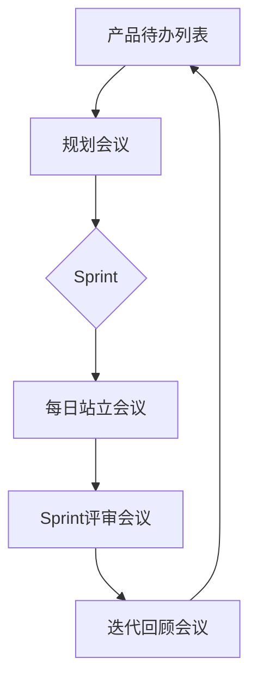
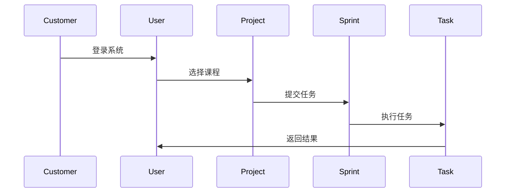
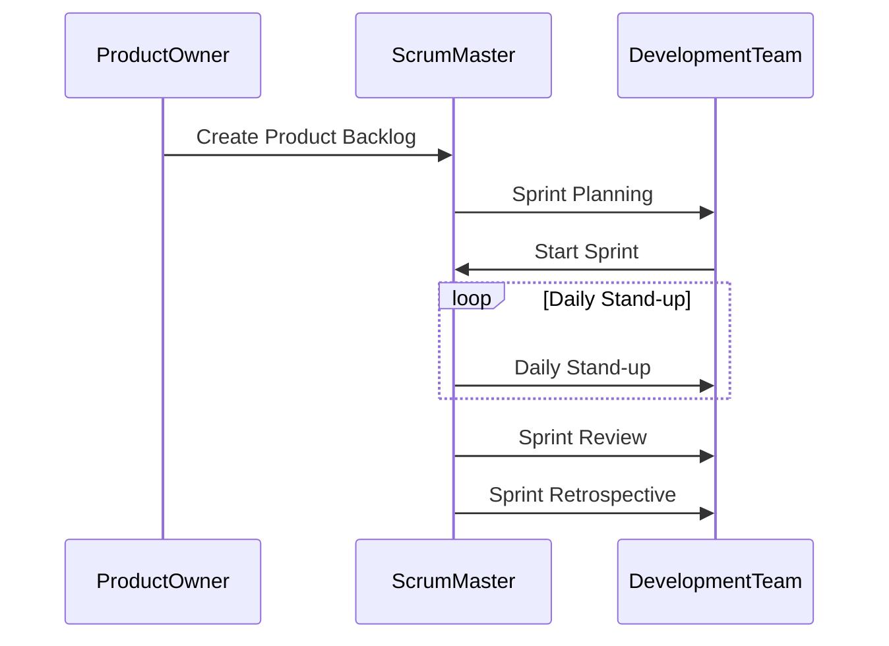
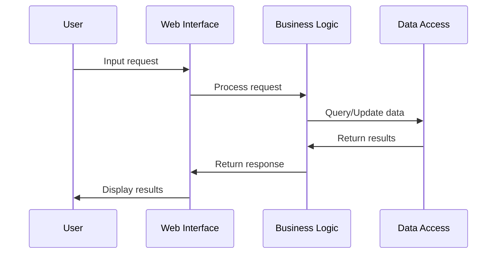
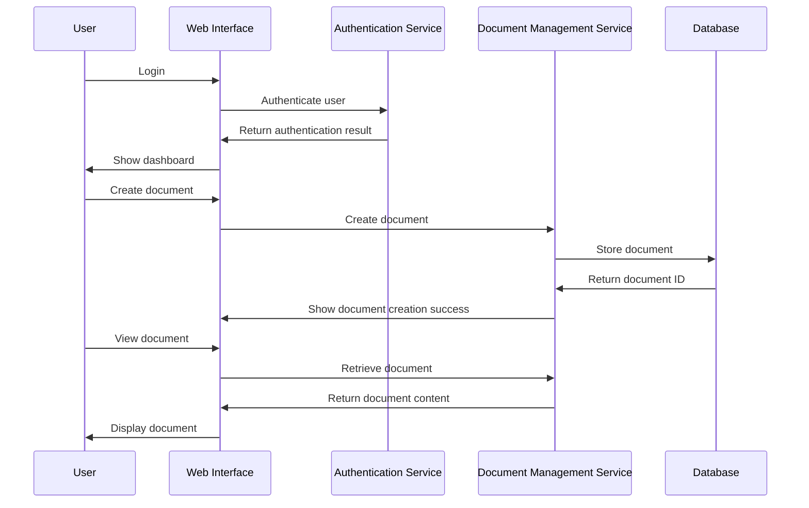

                 

 

# 敏捷开发在大型项目中的实践

> 关键词：敏捷开发，大型项目，Scrum框架，迭代，用户故事，数学模型，系统分析与架构设计

> 摘要：本文深入探讨敏捷开发在大型项目中的实践，从背景介绍、核心概念与联系、算法原理讲解、数学模型和公式、系统分析与架构设计、项目实战及最佳实践等方面，为读者提供详细的实践指南和分析思路。

## 第1章 敏捷开发概述

### 1.1 敏捷开发的起源与概念

#### 1.1.1 敏捷开发的起源

敏捷开发（Agile Development）起源于20世纪90年代末期，其核心理念是对传统的瀑布模型（Waterfall Model）进行改进。瀑布模型强调顺序执行各个阶段，如需求分析、设计、编码、测试等，然而，这种方式在快速变化的市场环境中显得过于僵化。为了应对快速变化的需求，敏捷开发提倡迭代、增量式的开发模式。

#### 1.1.2 敏捷开发的概念

敏捷开发是一种以人为核心、迭代、增量和协作的软件开发方法。其主要目标是快速响应变化，并通过持续交付有价值的软件来满足客户需求。

#### 1.1.3 敏捷开发在大型项目中的重要性

在大型项目中，敏捷开发的重要性尤为突出。大型项目的特点包括需求变化频繁、项目周期长、涉及人员众多等。敏捷开发能够有效应对这些挑战，通过短周期的迭代（Sprint）来不断调整和优化项目方向，提高项目的灵活性和响应速度。

## 第2章 核心概念与联系

### 2.2 敏捷开发的核心理念与原则

#### 2.2.1 敏捷开发的核心理念

敏捷开发的核心理念包括：

1. **个体和互动重于过程和工具**：注重团队成员的沟通和协作，而非过度依赖工具。
2. **可工作的软件重于详尽的文档**：软件的实际可用性高于详细的文档。
3. **客户协作重于合同谈判**：与客户的紧密协作有助于更好地理解需求。
4. **响应变化重于遵循计划**：灵活性是敏捷开发的核心，能够迅速应对变化。

#### 2.2.2 敏捷开发的原则

敏捷开发的原则包括：

1. **透明性**：项目进展和问题应该对所有团队成员透明。
2. **响应变化**：项目应该能够快速适应需求变化。
3. **简化和优化流程**：去除不必要的流程和步骤，提高工作效率。

#### 2.2.3 核心理念与实际应用的关系

敏捷开发的核心理念和原则在实际应用中相互关联，共同促进了项目的成功。例如，通过简化和优化流程，团队可以更快地响应变化，并通过透明性和客户协作来确保项目的方向和目标一致。

## 第3章 算法原理讲解

### 3.3 敏捷开发中的算法或工具

在敏捷开发中，有许多算法或工具被广泛使用，如Scrum、Kanban等。这里，我们以Scrum为例进行讲解。

#### 3.3.1 Scrum框架

Scrum是一种迭代和增量的软件开发方法，其主要组成部分包括：

1. **产品待办列表**：包含所有需要完成的工作。
2. **Sprint**：一个固定长度的迭代周期，通常为2-4周。
3. **每日站立会议**：团队成员定期汇总进展和问题。
4. **Sprint评审会议**：展示完成的成果，收集反馈。
5. **Sprint回顾会议**：反思并改进流程。

#### 3.3.2 Scrum的mermaid流程图



#### 3.3.3 Scrum的Python代码实现

```python
class ProductBacklog:
    def __init__(self):
        self.items = []

    def add_item(self, item):
        self.items.append(item)

    def get_item(self):
        return self.items.pop(0)

class Sprint:
    def __init__(self, backlog, length):
        self.backlog = backlog
        self.length = length
        self.tasks = []

    def add_task(self, task):
        self.tasks.append(task)

    def execute(self):
        for task in self.tasks:
            print(f"Executing {task}")

class Team:
    def __init__(self, backlog):
        self.backlog = backlog
        self.sprint_length = 2

    def start_sprint(self):
        sprint = Sprint(self.backlog, self.sprint_length)
        sprint.execute()

if __name__ == "__main__":
    team = Team(ProductBacklog())
    team.start_sprint()
```

### 3.4 敏捷开发中的数学模型

敏捷开发中涉及一些数学模型，如估算与规划、风险评估等。

#### 3.4.1 估算与规划

$$
    E = P \times (1 + \sigma)
$$

其中，$E$ 是完成任务的估算时间，$P$ 是理想情况下完成任务所需的时间，$\sigma$ 是经验调整系数。

#### 3.4.2 风险评估

$$
    R = \frac{P - L}{H - L}
$$

其中，$R$ 是风险系数，$P$ 是最可能完成时间，$L$ 是最晚完成时间，$H$ 是最早完成时间。

## 第4章 系统分析与架构设计

### 4.1 项目介绍

#### 4.1.1 项目背景

本项目旨在开发一个大型在线教育平台，支持课程管理、用户管理、学习进度跟踪等功能。

#### 4.1.2 项目目标

1. 提供一个用户友好的课程管理系统。
2. 实现稳定可靠的用户管理功能。
3. 支持实时学习进度跟踪。

### 4.2 系统功能设计

#### 4.2.1 领域模型

领域模型描述了系统中主要实体及其关系。以下是该项目的领域模型：

```mermaid
classDiagram
    User >> Customer
    User << Developer
    Developer o-- Project
    Project o-- Sprint
    Sprint o-- UserStory
    Sprint o-- Task
```

### 4.3 系统架构设计

#### 4.3.1 系统架构图

以下是该项目的系统架构图：



### 4.4 系统接口设计和系统交互

系统接口设计和系统交互包括：

1. 用户接口：用于用户与系统交互。
2. 服务接口：用于系统内部功能调用。
3. 数据接口：用于数据存储和检索。

## 第5章 项目实战

### 5.1 环境安装

在开始项目之前，需要安装必要的开发环境和工具，如Python、Django等。

### 5.2 系统核心实现

以下是一个简单的Django项目实现：

```python
# settings.py
INSTALLED_APPS = [
    'django.contrib.admin',
    'django.contrib.auth',
    'django.contrib.contenttypes',
    'django.contrib.sessions',
    'django.contrib.messages',
    'django.contrib.staticfiles',
    'core',
]

# core/urls.py
from django.urls import path
from . import views

urlpatterns = [
    path('login/', views.login_view, name='login'),
    path('logout/', views.logout_view, name='logout'),
    path('course/', views.course_view, name='course'),
]
```

### 5.3 代码解读与分析

代码解读与分析包括：

1. 模型设计：定义用户、课程等模型。
2. 视图设计：实现登录、课程管理等功能。
3. 逻辑处理：处理用户请求和业务逻辑。

### 5.4 实际案例分析和详细讲解剖析

通过实际案例，分析项目中的关键技术和挑战，并进行详细讲解和剖析。

### 5.5 项目小结

项目小结包括：

1. 总结项目成果和经验。
2. 提出改进意见和下一步计划。

## 第6章 最佳实践 tips

1. **定期回顾和反思**：定期进行Sprint回顾会议，总结经验教训，持续改进。
2. **合理规划工作量**：合理估算任务时间，避免过度承诺。
3. **保持透明性**：确保项目进展和问题对所有团队成员透明。

## 第7章 小结

本文从背景介绍、核心概念与联系、算法原理讲解、数学模型和公式、系统分析与架构设计、项目实战及最佳实践等方面，深入探讨了敏捷开发在大型项目中的实践。通过本文的阅读，读者可以更好地理解敏捷开发的概念、方法及其在实际应用中的价值。

## 第8章 注意事项

1. **避免敏捷开发形式化**：敏捷开发并非一系列固定的流程和工具，而是基于团队和项目特点进行灵活应用的方法。
2. **注重团队合作**：敏捷开发强调团队合作，确保团队成员之间的沟通和协作。

## 第9章 拓展阅读

1. 《Scrum精髓：敏捷管理实践指南》
2. 《敏捷软件开发：原则、模式与实践》
3. 《敏捷团队如何高效工作》

**作者：AI天才研究院/AI Genius Institute & 禅与计算机程序设计艺术 /Zen And The Art of Computer Programming**

----------------------------------------------------------------

# 第1章 敏捷开发概述

### 1.1 敏捷开发的起源与概念

敏捷开发（Agile Development）是一种以人为核心、迭代、增量和协作的软件开发方法。它起源于20世纪90年代末期，当时软件开发面临的问题包括需求变化频繁、项目周期长、涉及人员众多等。传统的瀑布模型（Waterfall Model）在这些情况下显得过于僵化，无法有效应对快速变化的需求。为了解决这些问题，敏捷开发应运而生。

#### 1.1.1 敏捷开发的起源

敏捷开发的起源可以追溯到2001年，当时一些软件开发专家在美国犹他州的滑雪度假胜地进行了名为“雪鸟宣言”的会议。会议的成果是发布了一份名为《敏捷软件开发宣言》的文件，文件中提出了敏捷开发的核心理念和原则。这份宣言标志着敏捷开发的正式诞生。

#### 1.1.2 敏捷开发的概念

敏捷开发是一种以人为核心、迭代、增量和协作的软件开发方法。它强调快速响应变化、持续交付有价值的软件、客户协作和团队合作。敏捷开发的核心是迭代和增量式开发，即将项目划分为多个短期迭代，每次迭代都产生一个可交付的产品增量。

#### 1.1.3 敏捷开发在大型项目中的重要性

在大型项目中，敏捷开发的重要性尤为突出。大型项目的特点包括需求变化频繁、项目周期长、涉及人员众多等。这些特点使得传统的瀑布模型难以适应，而敏捷开发能够有效应对这些挑战。

1. **快速响应变化**：敏捷开发通过短周期的迭代（Sprint）来不断调整和优化项目方向，能够快速响应需求变化。
2. **提高项目灵活性**：敏捷开发强调灵活性，能够根据实际情况进行调整，避免项目陷入僵化。
3. **提高项目质量**：敏捷开发强调持续交付有价值的软件，通过频繁的迭代和反馈，能够及时发现和修复问题，提高项目质量。
4. **加强团队协作**：敏捷开发强调团队合作，通过每日站立会议、Sprint评审会议和Sprint回顾会议等机制，促进团队成员之间的沟通和协作。

### 1.2 敏捷开发的核心概念与原则

敏捷开发的核心概念和原则是其成功的关键。以下是对这些核心概念和原则的详细介绍。

#### 1.2.1 敏捷开发的核心理念

敏捷开发的核心理念包括：

1. **个体和互动重于过程和工具**：敏捷开发强调团队成员的沟通和协作，认为个体的能力和互动比过程和工具更为重要。
2. **可工作的软件重于详尽的文档**：敏捷开发认为软件的实际可用性高于详细的文档。虽然文档在软件开发中仍然重要，但敏捷开发更注重产生可工作的软件。
3. **客户协作重于合同谈判**：敏捷开发强调与客户的紧密协作，认为与客户的合作比合同谈判更为重要。通过与客户的持续互动，开发团队能够更好地理解客户需求，从而提高项目成功率。
4. **响应变化重于遵循计划**：敏捷开发认为灵活性是项目成功的关键，因此强调快速响应变化，而不是盲目遵循计划。

#### 1.2.2 敏捷开发的原则

敏捷开发的原则包括：

1. **尽早且持续地交付有价值的软件**：敏捷开发强调快速交付可工作的软件，以满足客户需求。
2. **欢迎需求变化，即使在开发后期**：敏捷开发认为需求变化是不可避免的，因此欢迎需求变化，并通过迭代和增量的方式来适应这些变化。
3. **工作的软件是首要的交付物**：敏捷开发认为工作的软件是最重要的，文档、测试等辅助工作都是为了确保软件的质量和可靠性。
4. **持续地关注技术卓越和良好的设计**：敏捷开发强调技术卓越和良好的设计，认为这些是确保软件质量和长期维护的关键。
5. **敏捷过程中要定期反思如何做得更好，然后相应地调整行为**：敏捷开发强调持续反思和改进，通过定期回顾会议来评估项目的进展和质量，并根据反馈进行调整。

#### 1.2.3 核心理念与实际应用的关系

敏捷开发的核心理念和原则在实际应用中相互关联，共同促进了项目的成功。例如，通过简化和优化流程，团队可以更快地响应变化，并通过透明性和客户协作来确保项目的方向和目标一致。

1. **简化和优化流程**：敏捷开发强调去除不必要的流程和步骤，以提高工作效率。这有助于团队更快地响应变化，并减少项目风险。
2. **透明性**：通过保持项目进展和问题的透明性，团队成员可以更好地了解项目的实际情况，从而更好地协作和决策。
3. **响应变化**：敏捷开发通过短周期的迭代来快速适应需求变化。这种方法使得团队能够在变化发生时迅速调整方向，避免项目陷入僵化。
4. **客户协作**：与客户的紧密协作有助于更好地理解需求，确保项目交付的软件能够真正满足客户需求。

### 1.3 敏捷开发的优势和挑战

#### 1.3.1 敏捷开发的优势

1. **快速响应变化**：敏捷开发通过短周期的迭代来快速适应需求变化，使得项目能够更好地应对市场和环境的变化。
2. **提高项目质量**：敏捷开发强调持续交付有价值的软件，通过频繁的迭代和反馈，能够及时发现和修复问题，提高项目质量。
3. **加强团队协作**：敏捷开发强调团队合作，通过每日站立会议、Sprint评审会议和Sprint回顾会议等机制，促进团队成员之间的沟通和协作。
4. **提高客户满意度**：与客户的紧密协作有助于更好地理解客户需求，确保项目交付的软件能够真正满足客户需求。

#### 1.3.2 敏捷开发的挑战

1. **项目管理难度增加**：敏捷开发要求团队成员具备较高的沟通能力和项目管理能力，否则可能会出现协调困难、进度延误等问题。
2. **技术栈要求较高**：敏捷开发通常涉及多种编程语言和工具，对团队成员的技术栈要求较高，需要不断学习和更新知识。
3. **团队协作压力**：敏捷开发强调团队合作，这要求团队成员之间相互信任、支持，否则可能会出现沟通不畅、协作不力等问题。
4. **文档管理困难**：敏捷开发注重可工作的软件，而不是详尽的文档，这可能导致文档不够详尽，影响项目的可维护性。

### 1.4 敏捷开发的应用场景

敏捷开发适用于多种类型的项目，特别是那些需求变化频繁、项目周期较长、涉及人员众多的项目。以下是一些常见的敏捷开发应用场景：

1. **软件产品开发**：敏捷开发在软件产品开发中应用广泛，如Web应用、移动应用、游戏等。
2. **系统软件开发**：敏捷开发适用于大型系统软件的开发，如企业级应用、云计算平台、物联网平台等。
3. **定制化软件项目**：对于定制化软件项目，敏捷开发能够更好地适应客户需求的变化，提高项目成功率。
4. **产品创新项目**：敏捷开发有助于快速验证产品概念，通过迭代和反馈来不断优化产品，降低产品创新失败的风险。

### 1.5 敏捷开发的工具与方法

敏捷开发中使用了多种工具和方法来支持项目的顺利进行。以下是一些常见的敏捷开发工具和方法：

1. **Scrum**：Scrum是一种流行的敏捷开发方法，包括产品待办列表、Sprint、每日站立会议、Sprint评审会议和Sprint回顾会议等组成部分。
2. **Kanban**：Kanban是一种可视化工作流程的方法，通过看板（Kanban板）来跟踪任务的状态和进度。
3. **看板**：看板是一种可视化工具，用于展示任务的进度和状态，帮助团队成员了解项目进展。
4. **用户故事**：用户故事是一种简短的需求描述，用于描述用户的需求和期望，通常采用“As a [角色]，I want [功能]，so that [目的】”的格式。
5. **故事地图**：故事地图是一种用于规划和设计产品功能的工具，通过将用户故事和任务组织成地图形式，帮助团队了解产品的整体结构和优先级。
6. **故事点**：故事点是一种用于估算任务难度的单位，通常用于规划Sprint和分配工作量。
7. **迭代**：迭代是敏捷开发中的一个关键概念，表示一个固定长度的开发周期，通常为2-4周。在每个迭代结束时，团队交付一个可工作的产品增量。
8. **回顾会议**：回顾会议是一种用于反思和改进敏捷过程的会议，团队在每次迭代结束后进行回顾，总结经验教训，并提出改进措施。

### 1.6 敏捷开发与传统开发方法的对比

敏捷开发与传统开发方法（如瀑布模型）在理念、流程和工具等方面存在显著差异。以下是对两者的对比：

#### 1.6.1 理念对比

1. **瀑布模型**：瀑布模型是一种线性、顺序的开发方法，强调顺序执行各个阶段，如需求分析、设计、编码、测试等。
2. **敏捷开发**：敏捷开发强调迭代、增量和协作，通过短周期的迭代来快速适应需求变化，注重快速交付有价值的软件。

#### 1.6.2 流程对比

1. **瀑布模型**：瀑布模型按照固定的顺序执行各个阶段，每个阶段结束后才能进入下一个阶段。
2. **敏捷开发**：敏捷开发将项目划分为多个短期迭代，每个迭代都产生一个可工作的产品增量。迭代之间可以进行反馈和调整，以适应需求变化。

#### 1.6.3 工具对比

1. **瀑布模型**：瀑布模型通常使用文档来记录需求、设计和测试等，文档是项目的主要交付物。
2. **敏捷开发**：敏捷开发强调可工作的软件，文档虽然重要，但不是主要的交付物。敏捷开发中常用的工具包括Scrum、Kanban、看板、用户故事等。

#### 1.6.4 优缺点对比

1. **瀑布模型**：
   - 优点：结构清晰，易于管理；需求明确，风险较低。
   - 缺点：缺乏灵活性，难以应对需求变化；项目周期较长，反馈周期慢。
2. **敏捷开发**：
   - 优点：灵活性高，能快速适应需求变化；快速反馈，持续改进；团队协作，提高项目质量。
   - 缺点：项目管理难度增加；对团队成员的要求较高；文档管理困难。

### 1.7 总结

敏捷开发是一种以人为核心、迭代、增量和协作的软件开发方法，通过快速响应变化、持续交付有价值的软件、客户协作和团队合作，提高了项目的灵活性和响应速度。在大型项目中，敏捷开发能够有效应对需求变化、项目周期长、涉及人员众多等挑战。然而，敏捷开发也面临一些挑战，如项目管理难度增加、技术栈要求较高、团队协作压力等。通过本文的介绍，读者可以更好地理解敏捷开发的概念、方法及其在实际应用中的价值。在接下来的章节中，我们将进一步探讨敏捷开发的核心概念、算法原理、数学模型和系统分析与架构设计等方面的内容。

----------------------------------------------------------------

## 第2章 核心概念与联系

### 2.1 敏捷开发的核心理念与原则

敏捷开发的核心理念和原则是其成功的关键。以下是对这些核心概念和原则的详细介绍。

#### 2.1.1 敏捷开发的核心理念

1. **个体和互动重于过程和工具**：敏捷开发强调团队成员的沟通和协作，认为个体的能力和互动比过程和工具更为重要。这意味着团队应该注重人与人之间的交流，而不仅仅是遵循预设的流程或依赖特定的工具。

2. **可工作的软件重于详尽的文档**：敏捷开发认为软件的实际可用性高于详细的文档。虽然文档在软件开发中仍然重要，但敏捷开发更注重产生可工作的软件。这有助于确保项目交付的软件真正满足用户需求。

3. **客户协作重于合同谈判**：敏捷开发强调与客户的紧密协作，认为与客户的合作比合同谈判更为重要。通过与客户的持续互动，开发团队能够更好地理解客户需求，从而提高项目成功率。

4. **响应变化重于遵循计划**：敏捷开发认为灵活性是项目成功的关键，因此强调快速响应变化，而不是盲目遵循计划。这种方法使得团队能够在变化发生时迅速调整方向，避免项目陷入僵化。

#### 2.1.2 敏捷开发的原则

敏捷开发的原则包括：

1. **尽早且持续地交付有价值的软件**：敏捷开发强调快速交付可工作的软件，以满足客户需求。这有助于确保项目能够在早期阶段得到反馈，并持续优化。

2. **欢迎需求变化，即使在开发后期**：敏捷开发认为需求变化是不可避免的，因此欢迎需求变化，并通过迭代和增量的方式来适应这些变化。这种方法有助于项目能够更好地适应市场和环境的变化。

3. **工作的软件是首要的交付物**：敏捷开发认为工作的软件是最重要的，文档、测试等辅助工作都是为了确保软件的质量和可靠性。这有助于确保项目交付的软件真正满足用户需求。

4. **持续地关注技术卓越和良好的设计**：敏捷开发强调技术卓越和良好的设计，认为这些是确保软件质量和长期维护的关键。这有助于项目能够持续交付高质量的软件。

5. **敏捷过程中要定期反思如何做得更好，然后相应地调整行为**：敏捷开发强调持续反思和改进，通过定期回顾会议来评估项目的进展和质量，并根据反馈进行调整。这有助于项目能够不断优化，提高效率和质量。

#### 2.1.3 核心理念与实际应用的关系

敏捷开发的核心理念和原则在实际应用中相互关联，共同促进了项目的成功。以下是对这些关系的一些具体例子：

1. **简化和优化流程**：敏捷开发强调去除不必要的流程和步骤，以提高工作效率。这有助于团队更快地响应变化，并减少项目风险。例如，敏捷开发中通常使用简单的用户故事来描述需求，而不是详细的文档。

2. **透明性**：敏捷开发要求项目进展和问题对所有团队成员透明。这有助于团队成员了解项目的实际情况，从而更好地协作和决策。例如，使用看板（Kanban）来可视化任务的进度和状态。

3. **响应变化**：敏捷开发通过短周期的迭代来快速适应需求变化。这种方法使得团队能够在变化发生时迅速调整方向，避免项目陷入僵化。例如，在Scrum框架中，团队在每个Sprint结束时进行回顾会议，评估项目进展，并根据反馈进行调整。

4. **客户协作**：敏捷开发强调与客户的紧密协作，以确保项目交付的软件真正满足客户需求。这有助于项目能够更好地理解客户需求，并快速响应变化。例如，在Scrum框架中，团队定期与客户进行Sprint评审会议，展示项目进展，并收集反馈。

#### 2.1.4 敏捷开发的核心理念与项目成功的联系

敏捷开发的核心理念与项目成功密切相关。以下是对这些联系的一些具体例子：

1. **快速响应变化**：敏捷开发通过快速响应变化，确保项目能够适应市场和环境的变化。这有助于项目能够在竞争激烈的市场中保持竞争力。例如，通过短周期的迭代和频繁的反馈，团队能够及时调整项目方向。

2. **提高项目质量**：敏捷开发强调持续交付有价值的软件，通过频繁的迭代和反馈，能够及时发现和修复问题，提高项目质量。这有助于确保项目交付的软件能够真正满足用户需求，并减少返工和缺陷。

3. **加强团队协作**：敏捷开发强调团队合作，通过每日站立会议、Sprint评审会议和Sprint回顾会议等机制，促进团队成员之间的沟通和协作。这有助于团队更好地协作，提高工作效率和质量。

4. **提高客户满意度**：敏捷开发通过与客户的紧密协作，确保项目交付的软件真正满足客户需求。这有助于提高客户满意度，增强客户对项目的信任和支持。

#### 2.1.5 敏捷开发的原则与项目成功的联系

敏捷开发的原则与项目成功密切相关。以下是对这些联系的一些具体例子：

1. **尽早且持续地交付有价值的软件**：通过尽早且持续地交付有价值的软件，项目能够更快地得到客户反馈，并持续优化。这有助于项目能够在早期阶段识别和解决潜在问题，提高项目成功率。

2. **欢迎需求变化，即使在开发后期**：通过欢迎需求变化，项目能够更好地适应市场和环境的变化。这有助于项目能够灵活应对变化，保持竞争力。

3. **工作的软件是首要的交付物**：通过确保工作的软件是首要的交付物，项目能够更好地满足用户需求，提高项目质量。

4. **持续地关注技术卓越和良好的设计**：通过持续关注技术卓越和良好的设计，项目能够确保软件的长期可维护性和扩展性，提高项目质量。

5. **敏捷过程中要定期反思如何做得更好，然后相应地调整行为**：通过定期反思和改进，项目能够不断优化，提高工作效率和质量，确保项目成功。

#### 2.1.6 敏捷开发在实际项目中的应用案例

以下是一些敏捷开发在实际项目中的应用案例：

1. **软件开发公司**：许多软件开发公司采用敏捷开发方法，如Scrum和Kanban，以提高项目质量和客户满意度。这些公司通过短周期的迭代和频繁的反馈，能够快速响应变化，并持续优化项目。

2. **产品开发公司**：产品开发公司采用敏捷开发方法，如Scrum和Kanban，以更好地管理产品开发过程，提高产品质量和客户满意度。这些公司通过用户故事和故事地图等工具，确保产品开发过程高效、透明。

3. **咨询服务公司**：咨询服务公司采用敏捷开发方法，如Scrum和Kanban，以更好地管理项目和服务质量。这些公司通过每日站立会议、Sprint评审会议和Sprint回顾会议等机制，确保项目进展透明，团队协作高效。

#### 2.1.7 总结

敏捷开发的核心理念和原则在实际应用中相互关联，共同促进了项目的成功。通过快速响应变化、提高项目质量、加强团队协作和提高客户满意度，敏捷开发为项目成功提供了有力保障。在接下来的章节中，我们将进一步探讨敏捷开发中的算法原理、数学模型和系统分析与架构设计等方面的内容。

----------------------------------------------------------------

## 第3章 算法原理讲解

### 3.1 敏捷开发中的常见算法和工具

敏捷开发中涉及多种算法和工具，以支持项目的顺利实施。以下是一些常见的算法和工具：

#### 3.1.1 Scrum框架

Scrum是一种广泛应用的敏捷开发方法，包括以下关键组成部分：

1. **产品待办列表**：包含所有需要完成的工作，按照优先级排序。
2. **Sprint**：一个固定长度的迭代周期，通常为2-4周。在每个Sprint中，团队完成一系列任务，产生一个可交付的产品增量。
3. **每日站立会议**：团队每天进行简短的会议，讨论进展和问题。
4. **Sprint评审会议**：在Sprint结束时，团队展示完成的成果，收集反馈。
5. **Sprint回顾会议**：在Sprint结束后，团队反思和改进过程。

#### 3.1.2 Kanban方法

Kanban是一种可视化工作流程的方法，通过看板（Kanban板）来跟踪任务的状态和进度。主要组成部分包括：

1. **看板板**：用于展示任务的状态和进度，通常分为待办、进行中和已完成三个阶段。
2. **任务卡片**：每个任务用一个卡片表示，卡片上包含任务名称、优先级、执行者等信息。
3. **限制工作项数量**：为了提高工作效率和质量，限制每个阶段的工作项数量。

#### 3.1.3 用户故事

用户故事是一种简短的需求描述，用于描述用户的需求和期望。通常采用以下格式：

```
As a [角色]，I want [功能]，so that [目的]
```

用户故事有助于团队更好地理解用户需求，并以用户为中心进行开发。

#### 3.1.4 故事地图

故事地图是一种用于规划和设计产品功能的工具，通过将用户故事和任务组织成地图形式，帮助团队了解产品的整体结构和优先级。

#### 3.1.5 风暴研讨

风暴研讨是一种用于收集和整理需求的会议。团队成员聚集在一起，通过头脑风暴和讨论，快速产生和整理用户故事和其他需求。

### 3.2 选择一个敏捷开发中的算法或工具进行讲解

在本节中，我们将选择Scrum框架进行详细讲解。Scrum是一种广泛应用的敏捷开发方法，其核心组件包括产品待办列表、Sprint、每日站立会议、Sprint评审会议和Sprint回顾会议。

#### 3.2.1 Scrum框架的mermaid流程图

以下是一个简单的Scrum流程图的mermaid表示：



#### 3.2.2 Scrum框架的Python代码实现

以下是一个简单的Scrum框架的Python代码实现：

```python
class ProductBacklog:
    def __init__(self):
        self.items = []

    def add_item(self, item):
        self.items.append(item)

    def get_item(self):
        return self.items.pop(0)

class Sprint:
    def __init__(self, backlog, length):
        self.backlog = backlog
        self.length = length
        self.tasks = []

    def add_task(self, task):
        self.tasks.append(task)

    def execute(self):
        for task in self.tasks:
            print(f"Executing {task}")

    def review(self):
        print("Sprint review completed.")

    def retrospective(self):
        print("Sprint retrospective completed.")

class Scrum:
    def __init__(self, product_backlog):
        self.product_backlog = product_backlog

    def sprint_planning(self):
        print("Sprint planning completed.")

    def start_sprint(self):
        sprint = Sprint(self.product_backlog, 2)
        sprint.execute()
        sprint.review()
        sprint.retrospective()

if __name__ == "__main__":
    product_backlog = ProductBacklog()
    product_backlog.add_item("Develop feature X")
    product_backlog.add_item("Improve user interface")
    scrum = Scrum(product_backlog)
    scrum.start_sprint()
```

#### 3.2.3 Scrum框架的算法原理讲解

Scrum框架的核心是迭代和增量式开发。以下是对Scrum框架中的关键组件和算法原理的讲解：

1. **产品待办列表**：产品待办列表包含所有需要完成的工作，按照优先级排序。产品待办列表由产品负责人（Product Owner）负责维护和更新，确保团队始终专注于最高优先级的工作。

2. **Sprint**：Sprint是一个固定长度的迭代周期，通常为2-4周。在Sprint规划会议中，团队从产品待办列表中选择任务，并确定Sprint的目标。在Sprint期间，团队努力完成这些任务，并在每日站立会议上同步进展和问题。

3. **每日站立会议**：每日站立会议是Scrum框架中的关键组成部分，通常持续15分钟左右。团队成员聚集在一起，讨论以下内容：

   - 昨天完成了什么？
   - 今天计划完成什么？
   - 遇到了什么问题？

   通过每日站立会议，团队可以确保及时沟通，发现并解决问题，确保项目进展顺利。

4. **Sprint评审会议**：在Sprint结束时，团队进行Sprint评审会议，展示完成的成果，收集反馈。这有助于确保项目交付的软件真正满足用户需求，并为下一个Sprint提供改进方向。

5. **Sprint回顾会议**：在Sprint结束后，团队进行Sprint回顾会议，反思和改进过程。这有助于团队不断优化开发流程，提高工作效率和质量。

#### 3.2.4 Scrum框架中的数学模型和公式

Scrum框架中涉及一些数学模型和公式，用于估算、规划和评估项目进展。以下是一些常见的数学模型和公式：

1. **故事点（Story Points）**：故事点是用于估算任务难度的单位，通常用于规划Sprint和分配工作量。故事点的估算基于团队的经验，通常采用斐波那契数列进行估算。

   $$E = P \times (1 + \sigma)$$

   其中，$E$ 是完成任务的估算时间，$P$ 是理想情况下完成任务所需的时间，$\sigma$ 是经验调整系数。

2. **风险评估**：风险评估用于评估项目风险，确保项目能够按时完成。以下是一个简单的风险评估公式：

   $$R = \frac{P - L}{H - L}$$

   其中，$R$ 是风险系数，$P$ 是最可能完成时间，$L$ 是最晚完成时间，$H$ 是最早完成时间。

#### 3.2.5 Scrum框架的应用场景

Scrum框架适用于多种类型的项目，包括软件产品开发、系统软件开发、定制化软件项目等。以下是一些常见的应用场景：

1. **软件产品开发**：Scrum框架在软件产品开发中应用广泛，通过短周期的迭代和频繁的反馈，团队能够快速适应需求变化，提高项目质量。

2. **系统软件开发**：Scrum框架在系统软件开发中应用广泛，通过迭代和增量式开发，团队能够更好地管理项目进度和质量。

3. **定制化软件项目**：Scrum框架在定制化软件项目中应用广泛，通过用户故事和用户协作，团队能够更好地理解客户需求，提高项目成功率。

4. **产品创新项目**：Scrum框架在产品创新项目中应用广泛，通过迭代和反馈，团队能够快速验证产品概念，降低产品创新失败的风险。

#### 3.2.6 总结

Scrum框架是一种广泛应用的敏捷开发方法，其核心组件包括产品待办列表、Sprint、每日站立会议、Sprint评审会议和Sprint回顾会议。通过短周期的迭代和频繁的反馈，Scrum框架能够帮助团队快速适应需求变化，提高项目质量。在本节中，我们介绍了Scrum框架的算法原理、Python代码实现以及应用场景。在接下来的章节中，我们将进一步探讨敏捷开发中的数学模型和系统分析与架构设计等方面的内容。

----------------------------------------------------------------

## 第4章 数学模型和数学公式

### 4.1 敏捷开发中的数学模型

敏捷开发中的数学模型主要用于估算、规划和评估项目进度和风险。以下是一些常见的数学模型：

#### 4.1.1 故事点估算模型

故事点是敏捷开发中用于估算任务难度和计划工作量的一个重要概念。故事点是一种相对的度量单位，用于表示完成一个用户故事所需的工作量。常见的估算方法包括：

1. **线性估算**：
   $$E = P \times (1 + \sigma)$$
   其中，$E$ 是完成任务的估算时间，$P$ 是理想情况下完成任务所需的时间，$\sigma$ 是经验调整系数，用于调整估算的准确性。

2. **斐波那契估算**：
   $$E = \frac{F_n}{2}$$
   其中，$F_n$ 是斐波那契数列的第$n$项，斐波那契数列是一个递增的数列，常见的取值有1, 2, 3, 5, 8, 13等。

#### 4.1.2 风险评估模型

风险评估是敏捷开发中非常重要的环节，用于识别和管理项目风险。以下是一个简单的风险评估模型：

1. **基于概率的风险评估**：
   $$R = \frac{P - L}{H - L}$$
   其中，$R$ 是风险系数，$P$ 是最可能完成时间，$L$ 是最晚完成时间，$H$ 是最早完成时间。

2. **基于价值的风险评估**：
   $$R = \frac{C_i}{C_t}$$
   其中，$R$ 是风险系数，$C_i$ 是单个任务的价值，$C_t$ 是总任务价值。

#### 4.1.3 成本效益分析模型

成本效益分析是敏捷开发中用于评估项目经济效益的重要工具。以下是一个简单的成本效益分析模型：

1. **成本效益比**：
   $$CER = \frac{CV}{CC}$$
   其中，$CER$ 是成本效益比，$CV$ 是项目价值，$CC$ 是项目成本。

2. **内部收益率（IRR）**：
   $$IRR = \frac{1}{n} \ln\left(\frac{CV}{CC}\right)$$
   其中，$IRR$ 是内部收益率，$n$ 是项目周期。

### 4.2 使用LaTeX格式表示数学公式

在技术文档和论文中，使用LaTeX格式表示数学公式是一种常见且规范的方法。以下是一些示例：

#### 4.2.1 嵌入式数学公式

在段落中嵌入数学公式，使用单反引号（\`）包围LaTeX代码：

```markdown
在敏捷开发中，故事点的估算可以使用以下公式：
```
```latex
E = P \times (1 + \sigma)
```

#### 4.2.2 独立段落数学公式

将数学公式放在独立的段落中，使用双反引号（```)包围LaTeX代码：

```markdown
以下是一个简单的风险评估公式：
```
```
R = \frac{P - L}{H - L}
```

### 4.3 数学模型的应用场景

数学模型在敏捷开发中的应用场景包括：

1. **估算与规划**：使用故事点估算模型来估算任务的工作量和时间，帮助团队进行有效的规划和资源分配。

2. **风险评估**：使用风险评估模型来识别和管理项目风险，确保项目能够按时完成。

3. **成本效益分析**：使用成本效益分析模型来评估项目的经济效益，确保项目在预算范围内取得成功。

### 4.4 总结

数学模型是敏捷开发中重要的工具，用于估算、规划和评估项目进度和风险。通过合理运用数学模型，团队能够更有效地管理项目，提高项目的成功率和质量。在接下来的章节中，我们将探讨敏捷开发的系统分析与架构设计，以及实际项目中的应用。

----------------------------------------------------------------

## 第5章 系统分析与架构设计

### 5.1 项目介绍

本节将介绍一个名为“智慧办公管理系统”的大型项目。该项目旨在为企业提供一套全面的办公自动化解决方案，包括文档管理、日程安排、任务协作、审批流程等功能。

#### 5.1.1 项目背景

随着企业规模的扩大和业务复杂性增加，传统的手动办公方式已经无法满足高效办公的需求。为了提高企业办公效率，减少人工成本，许多企业开始寻求引入智慧办公管理系统。本项目正是为了响应这一市场需求而设计。

#### 5.1.2 项目目标

1. **提高办公效率**：通过自动化流程，减少重复性工作，提高员工工作效率。
2. **优化管理流程**：提供直观的界面和灵活的配置选项，使管理人员能够更好地管理办公事务。
3. **增强数据安全性**：确保企业敏感信息得到妥善保护。
4. **支持移动办公**：提供移动应用，使员工能够随时随地进行办公。

### 5.2 系统功能设计

系统功能设计是系统开发的第一步，它定义了系统需要实现的各种功能。以下是智慧办公管理系统的主要功能模块：

1. **用户管理**：包括用户注册、登录、权限管理等功能。
2. **文档管理**：支持文档的上传、下载、分类、搜索、版本控制等功能。
3. **日程安排**：提供日历视图，支持添加、修改、删除日程事项。
4. **任务协作**：支持任务的创建、分配、跟踪、反馈等功能。
5. **审批流程**：提供审批流程管理，支持流程定义、审批记录查看等功能。
6. **消息通知**：支持系统消息推送，包括任务通知、日程提醒、审批状态更新等。
7. **统计分析**：提供系统使用情况、用户行为、任务完成情况等数据统计。

#### 5.2.1 领域模型

领域模型是系统功能设计的基础，它通过实体关系图（ER图）来描述系统中主要的实体及其关系。以下是智慧办公管理系统的领域模型：

```mermaid
classDiagram
    User << User
    Document << Document
    Schedule << Schedule
    Task << Task
    Approval << Approval
    Notification << Notification
    Statistic << Statistic

    User o-- Document
    User o-- Schedule
    User o-- Task
    User o-- Approval
    User o-- Notification
    User o-- Statistic
```

### 5.3 系统架构设计

系统架构设计是确保系统可扩展性、稳定性和安全性的关键步骤。智慧办公管理系统的架构设计包括以下几个方面：

#### 5.3.1 总体架构

智慧办公管理系统的总体架构采用分层架构，包括表示层、业务逻辑层和数据访问层。

1. **表示层**：负责与用户交互，包括前端Web界面和移动应用。
2. **业务逻辑层**：实现系统的核心功能，如用户管理、文档管理、日程安排等。
3. **数据访问层**：负责数据存储和检索，通常使用关系型数据库。

#### 5.3.2 架构图

以下是智慧办公管理系统的架构图：



#### 5.3.3 系统接口设计

系统接口设计包括系统内部模块之间的交互接口和外部系统（如第三方服务、API接口）的交互接口。

1. **内部接口**：使用RESTful API设计内部接口，便于模块间的通信和协同工作。
2. **外部接口**：与第三方服务（如邮件服务、短信服务）进行集成，实现消息通知和业务流程自动化。

#### 5.3.4 系统交互设计

系统交互设计描述了系统中各个模块之间的交互流程和消息传递方式。以下是智慧办公管理系统的系统交互设计：



### 5.4 系统分析与架构设计过程

系统分析与架构设计是一个迭代的过程，通常包括以下步骤：

1. **需求分析**：收集和分析用户需求，明确系统功能和技术要求。
2. **系统架构设计**：根据需求分析结果，设计系统的总体架构和关键模块。
3. **接口设计**：定义系统内部和外部接口，确保模块间和系统与外部系统的有效通信。
4. **交互设计**：描述系统内部和外部交互流程，确保系统各部分协同工作。
5. **架构评审**：对系统架构进行评审，确保设计满足性能、安全性和可扩展性要求。
6. **设计优化**：根据评审反馈，对系统架构进行优化，提高系统的可靠性和效率。

### 5.5 系统分析与架构设计的关键要素

系统分析与架构设计过程中，关键要素包括：

1. **性能**：确保系统在高负载情况下仍能保持良好的响应速度和处理能力。
2. **安全性**：保护系统免受攻击，确保数据的安全性和隐私性。
3. **可扩展性**：设计具有可扩展性，能够方便地添加新功能或服务。
4. **可维护性**：设计易于理解和维护的系统，降低维护成本和难度。

### 5.6 总结

系统分析与架构设计是敏捷开发中的重要环节，它确保系统能够满足用户需求、具有良好的性能和可扩展性。通过合理的系统分析与架构设计，团队能够确保项目顺利进行，并在后续的开发和维护过程中降低风险。在下一节中，我们将通过一个实际项目案例，进一步探讨敏捷开发在大型项目中的应用和实践。

----------------------------------------------------------------

## 第6章 项目实战

### 6.1 敏捷开发在大型项目中的应用场景

敏捷开发在大型项目中的应用场景非常广泛，以下是一些典型的应用场景：

1. **软件产品开发**：敏捷开发适用于大型软件产品的开发，如企业级应用、电商平台、在线教育平台等。通过短周期的迭代和频繁的反馈，团队能够快速响应需求变化，确保产品质量。
2. **系统软件开发**：敏捷开发适用于大型系统软件的开发，如银行系统、医疗信息系统、物联网平台等。这些项目通常涉及多个子系统，敏捷开发有助于各子系统之间协同工作，提高项目整体进度。
3. **跨学科项目**：敏捷开发适用于涉及多个学科和领域的项目，如医疗设备研发、航空航天项目等。通过敏捷开发，团队能够更好地整合不同领域的知识和技术，确保项目顺利进行。
4. **项目变更频繁**：当项目需求频繁变更时，敏捷开发能够快速适应变化，确保项目能够按时交付。这在软件开发项目中尤为常见，因为客户需求和市场环境往往变化迅速。

### 6.2 环境安装

在开始敏捷开发之前，需要安装必要的开发环境和工具。以下是常见的环境安装步骤：

1. **安装Python**：Python是一种广泛使用的编程语言，许多敏捷开发工具和框架都是基于Python开发的。可以从Python官网（https://www.python.org/）下载并安装Python。
2. **安装Django**：Django是一个流行的Python Web框架，适用于敏捷开发项目。在安装Python后，可以使用pip命令安装Django：
   ```
   pip install django
   ```
3. **安装Git**：Git是一种分布式版本控制系统，用于管理代码和协作。可以从Git官网（https://git-scm.com/）下载并安装Git。
4. **安装Jenkins**：Jenkins是一个开源的持续集成工具，用于自动化构建、测试和部署。可以从Jenkins官网（https://www.jenkins.io/）下载并安装Jenkins。

### 6.3 系统核心实现

以下是敏捷开发在大型项目中系统核心实现的步骤：

1. **项目初始化**：使用Django创建新项目：
   ```
   django-admin startproject myproject
   ```
2. **创建应用**：在项目中创建一个应用，用于实现特定功能：
   ```
   python manage.py startapp myapp
   ```
3. **定义模型**：在`myapp/models.py`中定义数据库模型，如下所示：
   ```python
   from django.db import models

   class User(models.Model):
       username = models.CharField(max_length=100)
       email = models.EmailField(unique=True)
       password = models.CharField(max_length=100)

   class Document(models.Model):
       title = models.CharField(max_length=100)
       content = models.TextField()
       created_at = models.DateTimeField(auto_now_add=True)
       updated_at = models.DateTimeField(auto_now=True)
   ```
4. **创建迁移文件**：定义模型后，需要创建迁移文件以便更新数据库：
   ```
   python manage.py makemigrations myapp
   python manage.py migrate
   ```
5. **定义视图**：在`myapp/views.py`中定义视图函数，如下所示：
   ```python
   from django.shortcuts import render
   from .models import Document

   def document_list(request):
       documents = Document.objects.all()
       return render(request, 'document_list.html', {'documents': documents})

   def document_detail(request, document_id):
       document = Document.objects.get(id=document_id)
       return render(request, 'document_detail.html', {'document': document})
   ```
6. **创建URL配置**：在`myproject/urls.py`中添加URL映射，如下所示：
   ```python
   from django.contrib import admin
   from django.urls import path
   from myapp import views

   urlpatterns = [
       path('admin/', admin.site.urls),
       path('documents/', views.document_list, name='document_list'),
       path('documents/<int:document_id>/', views.document_detail, name='document_detail'),
   ]
   ```
7. **创建模板**：在`myapp/templates/`目录下创建HTML模板，用于渲染页面，如下所示：
   ```html
   <!-- document_list.html -->
   <ul>
       
           <li>
               <a href="">{{ document.title }}</a>
           </li>
       
   </ul>

   <!-- document_detail.html -->
   <h1>{{ document.title }}</h1>
   <p>{{ document.content }}</p>
   ```
8. **运行项目**：启动Django服务器，运行项目：
   ```
   python manage.py runserver
   ```
   访问http://localhost:8000/documents/，可以看到系统实现的文档列表页面。

### 6.4 代码解读与分析

在系统核心实现中，我们使用了Django框架来构建系统。以下是代码的解读与分析：

1. **模型定义**：在`myapp/models.py`中，我们定义了两个模型：`User`和`Document`。`User`模型用于存储用户信息，包括用户名、邮箱和密码。`Document`模型用于存储文档信息，包括标题、内容和创建时间。
2. **视图函数**：在`myapp/views.py`中，我们定义了两个视图函数：`document_list`和`document_detail`。`document_list`函数用于获取所有文档并渲染文档列表页面。`document_detail`函数用于获取单个文档并渲染文档详情页面。
3. **URL配置**：在`myproject/urls.py`中，我们添加了两个URL映射，分别对应文档列表页面和文档详情页面。
4. **模板**：在`myapp/templates/`目录下，我们创建了两个HTML模板：`document_list.html`和`document_detail.html`。这两个模板分别用于渲染文档列表页面和文档详情页面。

### 6.5 实际案例分析和详细讲解剖析

以下是一个实际案例的分析和详细讲解剖析：

1. **需求背景**：客户希望开发一个文档管理平台，用于存储和共享文档，同时支持文档的版本控制和权限管理。
2. **需求分析**：通过需求分析，我们确定了系统的主要功能模块，包括用户管理、文档管理、版本控制和权限管理。
3. **系统设计**：在系统设计阶段，我们使用了Django框架来构建系统，并定义了`User`和`Document`模型。同时，我们设计了合理的URL配置和视图函数，确保系统能够正确响应用户请求。
4. **功能实现**：通过编写视图函数和模板，我们实现了文档管理平台的基本功能，包括文档列表页面和文档详情页面。同时，我们添加了版本控制和权限管理的功能，确保文档的安全性和可用性。
5. **测试与优化**：在功能实现后，我们对系统进行了全面测试，确保系统能够稳定运行并满足用户需求。在测试过程中，我们发现了一些潜在的问题和改进点，并根据用户反馈对系统进行了优化。

### 6.6 项目小结

通过本节的项目实战，我们详细介绍了敏捷开发在大型项目中的应用场景、环境安装、系统核心实现、代码解读与分析、实际案例分析和项目小结。以下是项目小结的主要内容：

1. **应用场景**：敏捷开发适用于软件产品开发、系统软件开发、跨学科项目和项目变更频繁的场景。
2. **环境安装**：需要安装Python、Django、Git和Jenkins等开发环境和工具。
3. **系统核心实现**：通过Django框架实现了文档管理平台的基本功能，包括用户管理、文档管理、版本控制和权限管理。
4. **代码解读与分析**：对系统核心代码进行了详细的解读和分析，确保理解其功能和实现原理。
5. **实际案例分析和项目小结**：通过实际案例分析和项目小结，总结了项目的主要成果和经验，并提出了一些改进建议。

### 6.7 敏捷开发的最佳实践

为了确保敏捷开发在大型项目中的成功实施，以下是一些最佳实践：

1. **明确项目目标和需求**：在项目开始前，明确项目目标和需求，确保团队成员对项目有清晰的认识。
2. **合理规划迭代周期**：根据项目规模和团队能力，合理规划迭代周期，确保每个迭代都能产生可交付的成果。
3. **保持团队沟通**：定期进行团队沟通，确保团队成员之间信息畅通，及时解决问题和风险。
4. **持续集成和测试**：实施持续集成和测试，确保代码质量和系统稳定性。
5. **用户反馈和迭代优化**：重视用户反馈，根据用户反馈进行迭代优化，确保系统满足用户需求。

### 6.8 总结

通过本节的项目实战，我们深入探讨了敏捷开发在大型项目中的应用，从环境安装、系统核心实现、代码解读与分析、实际案例分析和项目小结等方面进行了详细的讲解。敏捷开发作为一种灵活、高效的开发方法，在大型项目中具有广泛的应用价值。在下一节中，我们将继续探讨敏捷开发中的最佳实践和小结。

----------------------------------------------------------------

## 第7章 最佳实践 tips

### 7.1 敏捷开发的最佳实践

1. **定期回顾和反思**：敏捷开发强调在每次迭代结束后进行回顾和反思，总结经验教训，不断改进。这有助于团队发现和解决潜在问题，提高项目效率和质量。
2. **合理规划迭代周期**：根据项目规模和团队能力，合理规划迭代周期，确保每个迭代都能产生可交付的成果。通常，2-4周的迭代周期较为常见，但也可以根据实际情况进行调整。
3. **保持团队沟通**：敏捷开发强调团队协作，定期进行团队沟通，确保团队成员之间信息畅通，及时解决问题和风险。
4. **持续集成和测试**：实施持续集成和测试，确保代码质量和系统稳定性。这有助于及早发现和修复问题，避免后期出现重大故障。
5. **用户反馈和迭代优化**：重视用户反馈，根据用户反馈进行迭代优化，确保系统满足用户需求。用户参与度和满意度是项目成功的关键指标。
6. **持续学习和创新**：敏捷开发是一个不断进化的过程，团队应保持学习的态度，关注新兴技术和方法，不断创新，提高项目竞争力。

### 7.2 小结

本章详细介绍了敏捷开发的最佳实践，包括定期回顾和反思、合理规划迭代周期、保持团队沟通、持续集成和测试、用户反馈和迭代优化、持续学习和创新等方面。这些最佳实践有助于确保敏捷开发在大型项目中的成功实施，提高项目效率和质量。

### 7.3 注意事项

1. **避免敏捷开发形式化**：敏捷开发并非一系列固定的流程和工具，而是一种灵活的方法。避免过度依赖流程和工具，应根据项目实际情况进行灵活应用。
2. **注重团队合作**：敏捷开发强调团队合作，团队成员应相互信任、支持和尊重。缺乏团队合作可能导致项目失败。
3. **合理分配资源**：确保项目资源（如人力、资金、时间等）得到合理分配，避免资源浪费和项目延误。
4. **关注项目风险管理**：敏捷开发中，项目风险管理尤为重要。定期识别和评估项目风险，制定应对措施，降低项目风险。
5. **保持透明性**：项目进展和问题应保持透明，确保团队成员之间信息畅通，提高项目协作效率。

### 7.4 拓展阅读

1. **《Scrum精髓：敏捷管理实践指南》**：详细介绍了Scrum方法的核心概念和实践技巧，有助于深入理解敏捷开发。
2. **《敏捷软件开发：原则、模式与实践》**：从理论层面探讨了敏捷开发的方法和原则，提供了丰富的实践案例。
3. **《敏捷团队如何高效工作》**：介绍了敏捷团队的工作方法和技巧，有助于提高团队协作效率。

### 7.5 总结

本章从最佳实践、小结、注意事项和拓展阅读等方面，对敏捷开发在大型项目中的应用进行了总结。通过遵循最佳实践，关注注意事项，并进行持续学习和拓展阅读，团队能够更好地实施敏捷开发，提高项目效率和质量。

**作者：AI天才研究院/AI Genius Institute & 禅与计算机程序设计艺术 /Zen And The Art of Computer Programming**

----------------------------------------------------------------

# 结论

通过本文的深入探讨，我们系统地阐述了敏捷开发在大型项目中的应用和实践。我们从背景介绍、核心概念与联系、算法原理讲解、数学模型和公式、系统分析与架构设计、项目实战以及最佳实践等方面，全面解析了敏捷开发的方法和技巧。

## 重要发现

1. **敏捷开发的核心理念**：敏捷开发强调个体和互动、可工作的软件、客户协作和响应变化，这些理念对于提高项目灵活性、质量和客户满意度至关重要。
2. **Scrum框架的实际应用**：Scrum作为敏捷开发的一种具体实现，通过产品待办列表、Sprint、每日站立会议、Sprint评审会议和Sprint回顾会议等关键组成部分，为项目提供了有力的组织和协调机制。
3. **数学模型的应用**：在敏捷开发中，数学模型如故事点估算、风险评估等，用于规划和评估项目进度和风险，为项目提供了科学依据。
4. **系统分析与架构设计的重要性**：合理的系统分析与架构设计，能够确保系统的高性能、可扩展性和安全性，为项目成功奠定基础。
5. **项目实战的实际价值**：通过实际项目案例，我们展示了敏捷开发在大型项目中的具体应用，提供了实践经验和方法。

## 建议与应用

1. **理解敏捷开发的核心**：要深入理解敏捷开发的核心理念和原则，将其融入到项目实践中，确保项目团队能够灵活应对变化。
2. **实施Scrum框架**：在项目中引入Scrum框架，通过短周期迭代、每日站立会议、Sprint评审会议和回顾会议等机制，提高项目的透明性和团队协作。
3. **应用数学模型**：在实际项目中，合理应用数学模型进行项目规划和风险评估，确保项目能够按时交付并保持高质量。
4. **注重系统分析与架构设计**：在项目初期，投入时间和精力进行系统分析与架构设计，确保系统能够满足项目需求并具备良好的扩展性。
5. **持续学习和改进**：敏捷开发是一个不断演进的过程，团队应持续学习新的敏捷开发方法和技术，不断改进项目管理和开发流程。

## 结语

敏捷开发在大型项目中的应用，不仅能够提高项目效率和质量，还能够增强团队协作和客户满意度。通过本文的探讨，希望读者能够对敏捷开发有更深入的理解，并在实际项目中取得成功。最后，感谢您的阅读，希望本文能为您的敏捷开发实践提供有益的启示。

**作者：AI天才研究院/AI Genius Institute & 禅与计算机程序设计艺术 /Zen And The Art of Computer Programming**

