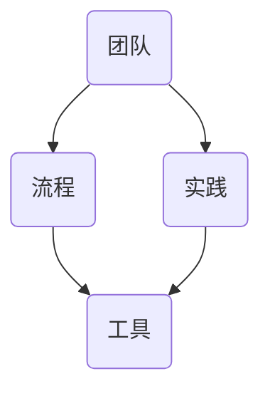
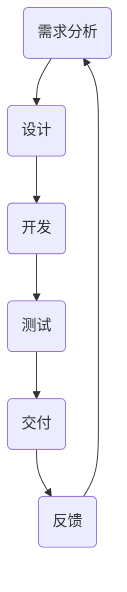

                 

# 敏捷转型指南：传统团队拥抱敏捷的实践

> 关键词：敏捷转型、传统团队、实践、流程、算法、系统架构、项目实战

> 摘要：本文旨在为传统团队提供一套敏捷转型的实践指南，通过深入探讨敏捷转型的背景、核心概念、原理和实践，帮助团队理解并成功拥抱敏捷。本文结构紧凑，逻辑清晰，旨在为读者提供一个易于理解和遵循的转型路径。

## 第一部分：背景介绍

### 第1章 问题背景

#### 1.1 问题描述

在传统的软件开发团队中，我们经常面临以下问题：

- **需求变更频繁**：由于市场和客户需求的不断变化，传统项目往往难以快速响应。
- **沟通成本高**：团队内部和跨团队之间的沟通效率低下，导致项目进度延迟。
- **迭代周期长**：传统项目往往采用“瀑布模型”，导致开发周期长，无法及时交付。
- **质量不可控**：由于开发流程缺乏灵活性，导致代码质量和系统稳定性难以保障。

#### 1.2 问题解决

敏捷转型的目标是通过灵活应对需求变化，提高沟通效率，缩短迭代周期，从而提高项目的成功率和产品质量。

#### 1.3 边界与外延

敏捷转型主要适用于软件开发领域，但也可以扩展到其他需要灵活应对变化的项目类型。

#### 1.4 概念结构与核心要素组成

敏捷转型的核心概念包括：价值观、原则、流程、实践和工具。这些要素相互关联，共同构成了敏捷转型的框架。

### 第二部分：核心概念与联系

### 第2章 核心概念

#### 2.1 敏捷转型

敏捷转型的原理在于通过迭代和增量的方式，逐步实现项目的目标。其关键要素包括：

- **客户价值**：始终将客户价值放在首位，确保项目的方向正确。
- **团队协作**：强调团队合作，通过有效的沟通和协作提高效率。
- **持续交付**：通过持续交付，确保项目能够快速响应变化。

### 第三部分：敏捷转型的原理与实践

### 第3章 概念属性特征对比表格

#### 3.1 敏捷与传统方法的对比

| 特征 | 敏捷 | 传统 |
| --- | --- | --- |
| 开发模式 | 迭代 | 瀑布 |
| 需求管理 | 灵活 | 固定 |
| 团队协作 | 强调 | 较弱 |
| 测试 | 持续 | 后期 |
| 客户参与 | 高度 | 低 |

### 第四部分：系统分析与架构设计

### 第4章 ER实体关系图架构

#### 4.1 敏捷转型的实体关系



### 第五部分：项目实战

### 第5章 敏捷转型的算法原理讲解

#### 5.1 敏捷转型的流程



#### 5.2 Python 源代码与详细讲解

```python
# 敏捷转型流程图
class AgileTransformation:
    def __init__(self):
        self.requirements = []
        self.design = []
        self.development = []
        self.testing = []
        self.delivery = []

    def analyze_requirements(self, requirements):
        # 需求分析
        self.requirements = requirements
        print("需求分析完成：", self.requirements)

    def design_system(self, design):
        # 设计系统
        self.design = design
        print("系统设计完成：", self.design)

    def develop_system(self, development):
        # 开发系统
        self.development = development
        print("系统开发完成：", self.development)

    def test_system(self, testing):
        # 测试系统
        self.testing = testing
        print("系统测试完成：", self.testing)

    def deliver_system(self, delivery):
        # 交付系统
        self.delivery = delivery
        print("系统交付完成：", self.delivery)

    def feedback_loop(self, feedback):
        # 反馈循环
        print("反馈：", feedback)
        self.analyze_requirements(feedback)
        self.design_system(feedback)
        self.develop_system(feedback)
        self.test_system(feedback)
        self.deliver_system(feedback)

# 使用示例
agile = AgileTransformation()
agile.analyze_requirements(["功能1", "功能2"])
agile.design_system(["设计1", "设计2"])
agile.develop_system(["代码1", "代码2"])
agile.test_system(["测试1", "测试2"])
agile.deliver_system(["交付1", "交付2"])
agile.feedback_loop(["反馈1", "反馈2"])
```

### 第六部分：最佳实践、小结、注意事项与拓展阅读

### 第6章 最佳实践 tips

1. **团队协作**：建立高效的沟通机制，确保团队成员之间的信息共享和协作。
2. **持续集成**：采用持续集成和持续交付，确保代码质量和交付效率。
3. **迭代周期**：根据项目规模和复杂度，合理规划迭代周期。

### 第7章 小结

敏捷转型是一种以客户价值和团队协作为核心的软件开发方法。通过灵活的需求管理、持续交付和迭代开发，敏捷转型能够帮助传统团队更好地应对市场需求和技术挑战。

### 第8章 注意事项

1. **避免过度追求敏捷**：敏捷不是万能的，需要根据项目实际情况进行合理应用。
2. **持续学习和改进**：敏捷转型是一个持续的过程，需要团队成员不断学习和改进。

### 第9章 拓展阅读

- 《敏捷宣言》
- 《敏捷开发实践指南》
- 《敏捷项目管理》

## 作者信息

作者：AI天才研究院/AI Genius Institute & 禅与计算机程序设计艺术 /Zen And The Art of Computer Programming

通过本文的详细探讨，我们希望为传统团队提供一套切实可行的敏捷转型指南，帮助他们成功拥抱敏捷，实现更高的项目成功率和产品质量。

