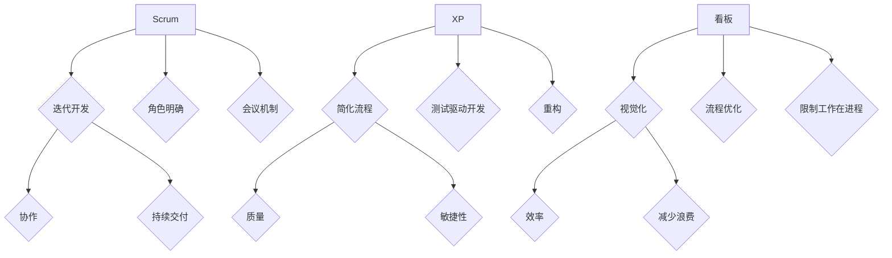

                 

### 敏捷转型：传统团队的敏捷之路

#### 关键词：敏捷转型、传统团队、敏捷方法、Scrum、看板、持续交付

> 摘要：本文深入探讨敏捷转型在传统团队中的应用，分析了敏捷转型的背景、核心概念、实施步骤、案例分析以及持续改进的方法。通过系统的梳理和实践指导，帮助传统团队成功迈向敏捷之路，提升工作效率和项目交付能力。

### 一、背景介绍

#### 1.1 敏捷转型的意义

在当今快速变化的市场环境中，敏捷转型已经成为许多传统团队追求的目标。敏捷转型的意义主要体现在以下几个方面：

1. **快速响应市场需求**：敏捷转型可以帮助团队快速响应市场变化，及时交付高质量的产品。
2. **提高工作效率**：通过缩短开发周期和减少浪费，敏捷转型能够显著提高工作效率。
3. **提升团队协作能力**：敏捷方法强调团队合作和沟通，有助于提升团队的协作能力。
4. **增强客户满意度**：敏捷转型使得团队能够更好地理解客户需求，提供更加符合客户期望的产品。

#### 1.2 传统团队面临的挑战

传统团队在项目管理、团队协作、产品质量等方面面临以下挑战：

1. **项目周期长**：传统团队往往采用瀑布模型，项目周期较长，无法快速响应市场需求。
2. **沟通不畅**：团队成员之间的沟通不畅，导致信息传递延迟和误解。
3. **质量难以保障**：在传统项目中，质量往往是在项目后期集中进行，导致问题难以发现和解决。
4. **资源浪费**：传统项目往往存在大量的资源浪费，如重复工作、不必要的会议等。

### 二、核心概念与联系

#### 2.1 敏捷转型的核心概念

敏捷转型的核心概念包括：

1. **Scrum**：一种迭代式增量软件开发过程管理技术。
2. **XP**：一种面向对象的软件开发方法。
3. **看板**：一种视觉管理工具，用于优化工作流程。

#### 2.2 敏捷转型的原则

敏捷转型的基本原则包括：

1. **持续交付**：确保软件产品能够持续交付和交付高质量的产品。
2. **客户满意度**：将满足客户需求作为项目的核心目标。
3. **响应变化**：比遵循计划更加重视应对变化。
4. **团队合作**：鼓励团队成员之间的紧密合作和沟通。
5. **自我管理团队**：团队成员自我管理，自主规划和决策。

#### 2.3 概念属性特征对比表格

| 概念       | 特征                            | 比较                     |
|------------|---------------------------------|--------------------------|
| Scrum      | 迭代开发、角色明确、会议机制 | 强调协作、持续交付       |
| XP         | 简化流程、测试驱动开发、重构 | 强调质量、敏捷性         |
| 看板       | 视觉化、流程优化、限制工作在进程 | 提高效率、减少浪费       |

#### 2.4 ER实体关系图架构

### 三、实施步骤

#### 3.1 准备阶段

在敏捷转型之前，团队需要做好以下准备工作：

1. **制定敏捷转型计划**：明确转型的目标和时间表。
2. **组建敏捷团队**：选择合适的人员组成敏捷团队。
3. **敏捷转型培训**：对团队成员进行敏捷方法和工具的培训。
4. **沟通与宣传**：确保团队成员了解敏捷转型的意义和目标。

#### 3.2 启动阶段

在启动阶段，团队需要实施以下敏捷流程：

1. **Scrum会议**：包括每日站会、迭代评审和迭代回顾。
2. **迭代规划**：确定每个迭代的目标和任务。
3. **看板管理**：使用看板进行工作流程的视觉化管理。

#### 3.3 执行阶段

在执行阶段，团队需要确保以下关键点：

1. **团队协作**：确保团队成员之间的紧密协作和沟通。
2. **项目进度监控**：监控项目进度，确保按时交付。
3. **风险管理**：及时发现和解决问题，避免项目风险。

#### 3.4 监控与调整

在敏捷转型的过程中，团队需要不断监控和调整：

1. **效果监控**：评估敏捷转型的效果，包括项目交付质量、工作效率等。
2. **反馈与调整**：根据反馈进行调整，优化工作流程和方法。

### 四、案例分析

#### 4.1 成功案例

**案例一：某互联网公司敏捷转型**

某互联网公司通过敏捷转型，显著提高了项目交付质量和团队协作效率。以下是成功原因：

1. **明确转型目标**：公司明确了敏捷转型的目标和预期效果。
2. **全员参与**：全体员工积极参与敏捷转型，包括高层管理人员。
3. **持续培训**：定期进行敏捷方法和工具的培训，提升团队技能。
4. **激励机制**：建立激励机制，鼓励团队成员积极参与敏捷转型。

#### 4.2 失败案例

**案例二：某传统制造业公司敏捷转型**

某传统制造业公司在敏捷转型过程中遇到了挫折，原因如下：

1. **缺乏理解**：团队成员对敏捷转型缺乏深刻理解，导致执行不到位。
2. **流程过度简化**：过度追求流程简化，导致项目管理失控。
3. **培训不足**：缺乏全面的敏捷转型培训，导致团队成员技能不足。

### 五、持续改进

#### 5.1 如何保持敏捷转型

为了保持敏捷转型的活力，团队需要采取以下措施：

1. **持续学习与改进**：鼓励团队成员不断学习敏捷方法和工具，持续改进工作流程。
2. **迭代优化**：定期进行迭代回顾，识别问题和改进点，持续优化工作流程。

#### 5.2 团队文化建设

敏捷转型对团队文化产生了深远影响，团队需要建立以下文化：

1. **开放沟通**：鼓励团队成员之间进行开放、坦诚的沟通。
2. **协作共赢**：强调团队合作，共同实现项目目标。
3. **持续改进**：倡导持续改进的精神，不断优化工作流程和方法。

### 六、总结与展望

#### 6.1 敏捷转型的未来趋势

随着市场环境的不断变化，敏捷转型将继续成为趋势。未来，敏捷转型将更加注重：

1. **数字化转型**：结合数字化转型，实现敏捷与数字化的深度融合。
2. **人工智能应用**：将人工智能技术应用于敏捷转型，提高敏捷转型的效率和效果。

#### 6.2 敏捷转型对团队文化的影响

敏捷转型将深刻影响团队文化，推动团队向更加开放、协作和持续改进的方向发展。这将有助于团队在快速变化的市场环境中保持竞争优势。

### 作者

作者：AI天才研究院/AI Genius Institute & 禅与计算机程序设计艺术 /Zen And The Art of Computer Programming

---

通过本文的深入探讨，希望传统团队能够找到适合自己的敏捷转型之路，实现团队的高效协作和项目的顺利交付。在敏捷转型的道路上，持续学习和改进是关键，只有不断优化工作流程和方法，才能在竞争激烈的市场中立于不败之地。

