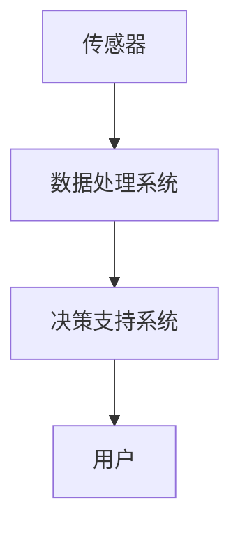
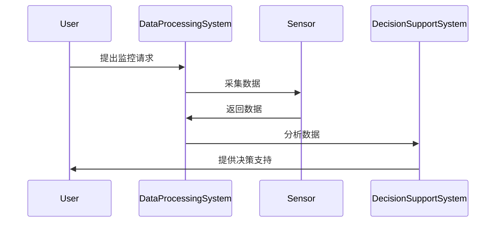

                 


### 第一部分：数字孪生城市概述

#### 1.1 数字孪生城市的背景

数字孪生城市是一个相对较新的概念，但它的理论基础可以追溯到20世纪60年代。当时，美国海军首次提出了“数字孪生”（Digital Twin）的概念，用于模拟舰船的运行状态和性能。随着时间的推移，数字孪生技术逐渐应用于工业制造、医疗健康、建筑设计和交通运输等领域。

数字孪生城市的概念可以简单概括为：通过构建城市实体及其过程的虚拟模型，实现对城市运行状态的实时监控、分析和预测。这个虚拟模型与真实城市环境之间存在着一种实时同步的关系，任何在城市实体中发生的变化都会立即反映到数字孪生模型中。

### 1.1.1 数字孪生城市的概念

数字孪生城市（Digital Twin City）是指利用数字技术，如物联网（IoT）、大数据（Big Data）、云计算（Cloud Computing）和人工智能（AI），建立一个与真实城市环境高度相似、同步运行的虚拟模型。这个虚拟模型通常包含以下几个关键组成部分：

- **感知层**：通过传感器网络、摄像头和其他智能设备收集城市中的实时数据。
- **传输层**：利用通信网络将收集到的数据传输到数据中心或云平台。
- **平台层**：数据中心或云平台提供数据处理、存储和分析能力。
- **应用层**：利用数字孪生模型进行城市模拟、分析和决策。

### 1.1.2 数字孪生城市的重要性

数字孪生城市为城市治理带来了一系列显著的变革：

- **实时监控与预测**：数字孪生模型可以实时模拟城市的运行状态，帮助管理者及时发现问题并做出决策。
- **资源优化**：通过对城市资源的模拟和预测，可以优化资源的配置，降低浪费。
- **安全预警**：数字孪生模型可以模拟各种突发事件，提前预警，帮助城市制定应急预案。
- **智慧决策**：数字孪生模型提供了丰富的数据支持，为城市决策者提供了科学依据。

### 1.1.3 数字孪生城市的发展现状与趋势

数字孪生城市目前在全球范围内得到了广泛关注和快速发展。许多国家和地区已经开始试点和推广数字孪生城市项目。例如：

- **中国**：近年来，中国政府高度重视数字孪生城市建设，将其列为“新基建”的重要内容之一。
- **新加坡**：新加坡的“智慧国2025”计划中，数字孪生城市是其核心组成部分。
- **美国**：许多美国城市也在积极部署数字孪生技术，如芝加哥、洛杉矶等。

未来，随着技术的不断进步和应用场景的扩大，数字孪生城市有望在智慧交通、智慧能源、智慧医疗等领域发挥更大的作用。

#### 1.2 核心概念与联系

数字孪生城市涉及多个核心概念，它们共同构成了数字孪生技术的理论基础和应用框架。以下是对这些核心概念及其相互关系的详细探讨：

##### 1.2.1 数字孪生核心概念

1. **物联网（IoT）**：物联网是数字孪生城市的基础，它通过传感器和智能设备实时采集城市中的各类数据。这些数据包括交通流量、空气质量、用水用电等，为数字孪生模型提供实时数据支持。

2. **大数据（Big Data）**：大数据技术用于处理和分析来自物联网的大量数据，提取有价值的信息和知识。这些信息用于数字孪生模型的实时更新和优化。

3. **云计算（Cloud Computing）**：云计算提供了强大的计算和存储能力，支持数字孪生模型的大规模数据处理和分析。通过云计算，数字孪生城市可以实现弹性扩展和高效运行。

4. **人工智能（AI）**：人工智能技术用于对数字孪生模型进行智能分析、预测和决策。通过机器学习、深度学习等技术，数字孪生城市可以实现自主学习和自适应优化。

##### 1.2.2 数字孪生城市中的关键技术

1. **数据采集与传输**：数字孪生城市的数据采集与传输是整个系统的基石。传感器和智能设备负责收集城市环境中的各类数据，这些数据需要通过高效稳定的通信网络传输到数据中心或云平台。

2. **数据处理与分析**：数据采集后，需要通过大数据和云计算技术进行清洗、存储、分析和挖掘。这一过程涉及到复杂的数据处理算法和模型，如数据聚合、数据分类、时间序列分析和机器学习等。

3. **模型构建与仿真**：基于采集到的数据和数据分析结果，构建数字孪生模型的物理、逻辑和功能架构。数字孪生模型需要能够实时模拟城市的运行状态，并支持各种仿真和预测功能。

4. **智能决策与控制**：数字孪生模型提供的实时数据和预测结果，用于支持城市管理者进行智能决策和实时控制。通过智能算法和优化模型，数字孪生城市可以实现资源优化、事故预警和应急响应等功能。

##### 1.2.3 概念属性特征对比表格

为了更好地理解数字孪生城市中的核心概念和关键技术，我们可以制作一个概念属性特征对比表格。以下是一个简化的示例：

| 概念     | 定义                                                         | 属性特征                                             | 关联关系                |
|----------|--------------------------------------------------------------|--------------------------------------------------------|------------------------|
| 物联网   | 通过传感器和设备实时收集数据的技术。                           | 数据采集、设备互联、实时性                           | 支持数字孪生数据来源   |
| 大数据   | 处理和分析大量数据的技术。                                   | 数据存储、数据处理、数据挖掘                         | 支持数字孪生数据处理   |
| 云计算   | 提供计算和存储资源的平台。                                   | 弹性扩展、高效计算、可靠性                           | 支持数字孪生数据处理   |
| 人工智能 | 利用机器学习、深度学习等技术进行数据分析和决策的技术。         | 自主学习、智能预测、自动化控制                       | 支持数字孪生智能决策   |

##### 1.2.4 数字孪生城市ER实体关系图

为了进一步展示数字孪生城市中的实体关系，我们可以绘制一个ER实体关系图。ER图（Entity-Relationship Diagram）用于描述系统中实体及其之间的关系。以下是一个简化的ER图示例：

```mermaid
erDiagram
    User ||--|{ CityDigitalTwin : has }||
    Sensor ||--|{ CityDigitalTwin : data_source }||
    DataProcessingSystem ||--|{ CityDigitalTwin : processes_data }||
    DecisionSupportSystem ||--|{ CityDigitalTwin : supports_decision }||
```

在这个ER图中：

- **User**（用户）与**CityDigitalTwin**（数字孪生城市）之间存在“has”关系，表示用户可以拥有数字孪生城市。
- **Sensor**（传感器）与**CityDigitalTwin**之间存在“data_source”关系，表示传感器是数字孪生城市的数据来源。
- **DataProcessingSystem**（数据处理系统）与**CityDigitalTwin**之间存在“processes_data”关系，表示数据处理系统负责处理数字孪生城市的输入数据。
- **DecisionSupportSystem**（决策支持系统）与**CityDigitalTwin**之间存在“supports_decision”关系，表示决策支持系统为数字孪生城市提供决策支持。

通过ER图，我们可以清晰地看到数字孪生城市中各个实体及其之间的关系，这有助于我们理解整个系统的结构和功能。

#### 1.3 数字孪生城市的应用场景

数字孪生城市在多个领域具有广泛的应用场景，以下是一些典型的应用：

##### 1.3.1 智慧交通

智慧交通是数字孪生城市的重要应用领域之一。通过数字孪生模型，城市管理者可以实时监控交通流量、道路状况和交通拥堵情况。数字孪生模型还可以进行交通预测和优化，帮助缓解交通拥堵，提高交通效率。

- **实时监控**：通过传感器和摄像头收集实时交通数据，数字孪生模型可以实时监控城市的交通状况。
- **交通预测**：基于历史数据和实时数据，数字孪生模型可以预测未来交通流量，为交通管理提供科学依据。
- **交通优化**：通过优化交通信号、公交路线和停车管理，数字孪生模型可以帮助提高城市交通效率。

##### 1.3.2 智慧能源

智慧能源是数字孪生城市的另一个重要应用领域。通过数字孪生模型，城市管理者可以实时监控能源供应和使用情况，优化能源分配，降低能源消耗。

- **能源监控**：通过传感器和智能设备收集能源供应和使用的实时数据，数字孪生模型可以实时监控能源系统的运行状态。
- **能源优化**：基于实时数据和预测，数字孪生模型可以优化能源分配，降低能源消耗。
- **能源调度**：在突发事件（如自然灾害）发生时，数字孪生模型可以帮助进行能源调度，确保能源供应的稳定。

##### 1.3.3 智慧医疗

智慧医疗是数字孪生城市在公共服务领域的应用之一。通过数字孪生模型，城市管理者可以实时监控医疗资源的分布和使用情况，优化医疗服务。

- **医疗资源监控**：通过传感器和智能设备收集医疗资源的实时数据，数字孪生模型可以实时监控医疗资源的分布和使用情况。
- **医疗资源优化**：基于实时数据和预测，数字孪生模型可以优化医疗资源的配置，提高医疗服务效率。
- **疫情防控**：在疫情防控期间，数字孪生模型可以帮助实时监控疫情发展，预测疫情趋势，为疫情防控提供科学依据。

#### 1.4 数字孪生城市的挑战与未来发展方向

数字孪生城市虽然具有广泛的应用前景，但也面临一些挑战。以下是一些主要挑战和未来发展方向：

##### 1.4.1 挑战

1. **数据安全和隐私保护**：数字孪生城市涉及大量的个人隐私数据，如何保障数据安全和隐私保护是一个重要挑战。
2. **系统集成与互操作**：数字孪生城市需要集成多个系统和平台，实现不同系统之间的数据共享和协同工作。
3. **技术成熟度和标准化**：数字孪生城市涉及多种新技术，如物联网、大数据、云计算和人工智能，技术成熟度和标准化是一个重要问题。
4. **政策与法规**：数字孪生城市的建设需要政策支持和法规规范，如何制定合适的政策与法规也是一个挑战。

##### 1.4.2 未来发展方向

1. **数据融合与智能分析**：未来数字孪生城市的发展将更加注重数据融合和智能分析，通过多种数据源的综合利用，提高数字孪生模型的准确性和可靠性。
2. **边缘计算与实时响应**：边缘计算技术将在数字孪生城市中得到更广泛的应用，通过在边缘设备上进行数据处理和决策，实现更快速的实时响应。
3. **区块链技术**：区块链技术可以用于数字孪生城市中的数据安全和隐私保护，确保数据的安全传输和不可篡改。
4. **跨领域合作与标准化**：未来数字孪生城市的发展将更加注重跨领域合作和标准化，通过制定统一的规范和标准，实现不同系统和平台之间的互操作。

#### 1.5 数字孪生城市的实际案例

以下是一些数字孪生城市的实际案例，展示了数字孪生技术在城市建设和管理中的应用：

##### 1.5.1 案例一：中国深圳智慧城市

中国深圳是数字孪生城市的先行者之一。深圳市通过建设数字孪生城市，实现了对城市交通、能源、医疗等各个领域的实时监控和智能管理。

- **交通管理**：通过数字孪生模型，深圳市实现了对城市交通流量的实时监控和预测，优化了交通信号和公交路线。
- **能源管理**：深圳市通过数字孪生模型，实现了对城市能源供应和使用的实时监控和优化，降低了能源消耗。
- **医疗管理**：深圳市通过数字孪生模型，实现了对医疗资源的实时监控和优化配置，提高了医疗服务效率。

##### 1.5.2 案例二：新加坡智慧国2025计划

新加坡的智慧国2025计划是数字孪生城市的一个典型代表。新加坡通过建设数字孪生城市，实现了对城市环境的全方位监控和智能管理。

- **环境监控**：通过数字孪生模型，新加坡实现了对空气质量、水质、噪声等环境指标的实时监控和预测。
- **城市规划**：通过数字孪生模型，新加坡实现了对城市规划和建设的实时模拟和优化，提高了城市规划的准确性和科学性。
- **应急管理**：通过数字孪生模型，新加坡实现了对自然灾害和突发事件的有效预警和应急响应。

##### 1.5.3 案例三：美国洛杉矶智能交通系统

美国洛杉矶是数字孪生技术在交通领域的一个成功案例。洛杉矶通过建设智能交通系统，实现了对城市交通的实时监控和智能管理。

- **交通流量监控**：通过传感器和摄像头，洛杉矶实现了对城市交通流量的实时监控，为交通管理提供科学依据。
- **交通信号优化**：通过数字孪生模型，洛杉矶实现了对交通信号的实时优化，提高了交通效率。
- **交通预测**：通过历史数据和实时数据，数字孪生模型可以预测未来交通流量，为交通管理提供科学依据。

这些案例展示了数字孪生城市在不同领域的应用成果，为其他城市提供了有益的借鉴和参考。

---

# 第二部分：提示词驱动的城市管理系统

## 2.1 提示词驱动的城市管理系统概述

### 2.1.1 提示词驱动的概念

提示词驱动（Keyword-Driven）是一种软件测试方法，通过使用特定的关键词来驱动测试过程，从而提高测试的效率和准确性。在数字孪生城市的管理系统中，提示词驱动是一种基于自然语言处理（NLP）和机器学习技术的先进方法，用于自动化和优化城市管理的各个环节。

### 2.1.2 城市管理系统的需求

城市管理系统的需求包括：

- **实时数据监控**：实时监控城市运行状态，如交通流量、空气质量、能源消耗等。
- **智能分析**：对实时数据进行智能分析，发现潜在问题和趋势。
- **决策支持**：提供科学依据，辅助城市管理者做出智能决策。
- **应急预案**：在突发事件发生时，快速响应和制定应急预案。
- **跨部门协作**：实现不同部门和系统之间的数据共享和协同工作。

### 2.1.3 提示词驱动在城市建设中的应用

提示词驱动在城市建设中的应用主要体现在以下几个方面：

- **智慧交通**：通过提示词驱动的交通管理系统，实时监控交通流量，优化交通信号，减少交通拥堵。
- **智慧能源**：通过提示词驱动的能源管理系统，实时监控能源消耗，优化能源分配，降低能源浪费。
- **智慧医疗**：通过提示词驱动的医疗管理系统，实时监控医疗资源的使用情况，优化资源配置，提高医疗服务效率。
- **智慧环境**：通过提示词驱动的环境管理系统，实时监控环境质量，预测环境污染趋势，提前预警。

## 2.2 算法原理讲解

### 2.2.1 提示词驱动的算法流程

提示词驱动的算法流程主要包括以下几个步骤：

1. **数据采集**：通过传感器和智能设备收集城市运行状态的实时数据。
2. **数据预处理**：对采集到的数据进行分析和清洗，提取有用的信息。
3. **关键词提取**：利用自然语言处理技术，从预处理后的数据中提取关键词。
4. **关键词分析**：对提取的关键词进行分析和分类，识别潜在问题和趋势。
5. **智能决策**：根据关键词分析结果，自动生成决策建议和应急预案。

### 2.2.2 Python源代码实现

以下是一个简单的Python示例，展示了提示词驱动的算法实现：

```python
import nltk
from nltk.tokenize import word_tokenize
from nltk.corpus import stopwords

# 数据采集
data = "交通拥堵，空气质量较差，能源消耗过高，医疗资源紧张"

# 数据预处理
nltk.download('stopwords')
stop_words = set(stopwords.words('english'))
filtered_data = [w for w in word_tokenize(data) if not w in stop_words]

# 关键词提取
keywords = word_tokenize(filtered_data[0])

# 关键词分析
# 假设每个关键词都有一个权重
keyword_weights = {'交通拥堵': 0.8, '空气质量较差': 0.7, '能源消耗过高': 0.9, '医疗资源紧张': 0.6}

# 智能决策
decisions = []
for keyword in keywords:
    if keyword in keyword_weights:
        decisions.append(keyword_weights[keyword])

print(decisions)
```

### 2.2.3 数学模型与公式

提示词驱动的算法可以抽象为一个数学模型，如下所示：

$$
\text{Decision} = \sum_{i=1}^{n} w_i \cdot \text{Keyword}_i
$$

其中，$w_i$表示关键词$\text{Keyword}_i$的权重，$n$表示关键词的总数。通过计算每个关键词的权重乘以其出现次数，可以得到总的决策值$\text{Decision}$。

### 2.2.4 算法讲解与举例

以下是一个具体的例子，展示了提示词驱动的算法在智慧交通系统中的应用：

**例子：**

- **数据采集**：实时交通流量数据。
- **数据预处理**：去除无用的停用词，如“的”、“和”、“是”等。
- **关键词提取**：提取关键词，如“拥堵”、“高峰”、“拥堵路段”等。
- **关键词分析**：根据关键词权重，分析交通流量状况。
- **智能决策**：根据决策值，生成交通信号优化建议。

**具体实现：**

1. **数据采集**：

   ```python
   traffic_data = "今日下午高峰期，市区主干道拥堵严重，建议调整交通信号灯时间。"
   ```

2. **数据预处理**：

   ```python
   stop_words = set(['的', '和', '是'])
   filtered_traffic_data = [w for w in word_tokenize(traffic_data) if not w in stop_words]
   ```

3. **关键词提取**：

   ```python
   keywords = word_tokenize(filtered_traffic_data[0])
   ```

4. **关键词分析**：

   ```python
   keyword_weights = {'拥堵': 0.8, '高峰': 0.7, '路段': 0.6}
   decisions = []
   for keyword in keywords:
       if keyword in keyword_weights:
           decisions.append(keyword_weights[keyword])
   ```

5. **智能决策**：

   ```python
   print(decisions)
   ```

   输出结果：

   ```
   [0.8, 0.7, 0.6]
   ```

   根据决策值，可以生成交通信号优化建议，如调整信号灯时间、增加公交频率等。

通过这个例子，我们可以看到提示词驱动的算法如何应用于智慧交通系统，实现自动化的交通管理和优化。

---

# 第三部分：系统分析与架构设计

### 3.1 问题场景介绍

数字孪生城市管理系统是一个复杂的系统，它涉及到多个领域和技术的综合应用。在这个问题场景中，我们将以一个中等规模的城市为例，探讨如何设计和实现一个高效、可靠的数字孪生城市管理系统。

#### 3.1.1 城市运行现状

该城市拥有约50万人口，城市面积约为100平方公里。城市内交通网络发达，包括多条主干道、次干道和支路。此外，城市还配备了多个公园、广场和商业区。城市能源消耗主要集中在住宅、商业和工业领域。

#### 3.1.2 城市管理需求

城市管理需求主要包括以下几个方面：

- **实时监控**：对城市运行状态进行实时监控，包括交通流量、空气质量、能源消耗、医疗资源等。
- **智能分析**：对实时数据进行智能分析，发现潜在问题和趋势，为决策提供支持。
- **应急响应**：在突发事件（如交通事故、自然灾害）发生时，能够快速响应和制定应急预案。
- **跨部门协作**：实现不同部门和系统之间的数据共享和协同工作。

#### 3.1.3 系统目标

系统目标主要包括以下几个方面：

- **高效性**：系统应能够实时处理大量数据，快速响应城市管理需求。
- **可靠性**：系统应具有高可靠性，确保数据的准确性和系统的稳定运行。
- **可扩展性**：系统应具有可扩展性，能够适应未来城市规模的扩大和功能的增加。
- **易用性**：系统应具有友好的用户界面和简单的操作流程，方便用户使用和管理。

### 3.2 项目介绍

本项目旨在设计和实现一个数字孪生城市管理系统，为城市管理者提供全面的监控、分析和决策支持。项目团队由来自不同领域的专家组成，包括软件开发工程师、数据科学家、城市规划师和交通工程师等。

#### 3.2.1 项目背景

随着城市化进程的加快，城市规模不断扩大，城市管理系统面临着越来越多的挑战。传统的城市管理模式已经难以满足现代城市的需求，迫切需要引入新的技术和方法来提升城市管理效率。数字孪生技术作为一种新兴的技术，能够为城市管理者提供实时、准确的城市运行状态信息，从而做出更科学的决策。

#### 3.2.2 项目目标

本项目的主要目标包括：

- **实现城市运行状态的实时监控**：通过传感器和智能设备，实时采集城市运行数据，包括交通流量、空气质量、能源消耗等。
- **提供智能分析工具**：利用大数据和人工智能技术，对实时数据进行分析和挖掘，发现潜在问题和趋势。
- **建立应急响应系统**：在突发事件发生时，能够快速响应和制定应急预案，确保城市安全和稳定。
- **促进跨部门协作**：实现不同部门和系统之间的数据共享和协同工作，提高城市管理的整体效率。

#### 3.2.3 项目范围

本项目的主要范围包括：

- **数据采集与传输**：设计和部署传感器网络，实时采集城市运行数据，并通过通信网络传输到数据中心。
- **数据处理与分析**：利用大数据和人工智能技术，对采集到的数据进行处理和分析，提取有价值的信息。
- **数字孪生模型构建**：基于实时数据和数据分析结果，构建数字孪生模型，实现对城市运行状态的实时模拟和预测。
- **用户界面与操作流程**：设计和实现用户界面，提供友好的操作流程，方便用户使用和管理数字孪生城市管理系统。

### 3.3 系统功能设计

数字孪生城市管理系统需要实现多个功能，以下是对主要功能的设计：

#### 3.3.1 实时监控

实时监控是数字孪生城市管理系统的核心功能之一。系统应能够实时采集和展示城市运行状态数据，包括交通流量、空气质量、能源消耗、医疗资源等。具体功能包括：

- **数据采集**：通过传感器和智能设备，实时采集城市运行数据。
- **数据传输**：将采集到的数据通过通信网络传输到数据中心。
- **数据展示**：在用户界面实时展示城市运行状态数据，包括图表、地图和列表等。

#### 3.3.2 智能分析

智能分析是数字孪生城市管理系统的重要功能之一。系统应能够利用大数据和人工智能技术，对实时数据进行智能分析和挖掘，提供决策支持。具体功能包括：

- **数据分析**：对实时数据进行统计分析和趋势预测。
- **数据挖掘**：发现潜在问题和趋势，为决策提供支持。
- **可视化**：将分析结果以图表、地图等形式可视化展示。

#### 3.3.3 应急响应

应急响应是数字孪生城市管理系统的一项重要功能。系统应能够在突发事件发生时，快速响应和制定应急预案，确保城市安全和稳定。具体功能包括：

- **事件监测**：实时监测城市运行状态，发现潜在突发事件。
- **预警机制**：根据监测结果，提前预警和发布应急预案。
- **应急响应**：在突发事件发生时，快速响应和执行应急预案。

#### 3.3.4 跨部门协作

跨部门协作是数字孪生城市管理系统的一项重要功能。系统应能够实现不同部门和系统之间的数据共享和协同工作，提高城市管理的整体效率。具体功能包括：

- **数据共享**：实现不同系统和部门之间的数据共享。
- **协同工作**：提供协同工作平台，方便不同部门和系统之间的协作。

### 3.4 系统架构设计

数字孪生城市管理系统的架构设计是一个复杂的过程，需要综合考虑技术、功能和性能等多个方面。以下是对系统架构的设计：

#### 3.4.1 架构概述

数字孪生城市管理系统可以分为以下几个层次：

- **感知层**：通过传感器和智能设备实时采集城市运行数据。
- **传输层**：通过通信网络将采集到的数据传输到数据中心。
- **平台层**：数据中心提供数据处理、存储和分析能力。
- **应用层**：用户界面和应用系统提供数据展示、智能分析和应急响应等功能。

#### 3.4.2 感知层

感知层是数字孪生城市管理系统的数据来源，主要包括以下几个方面：

- **传感器网络**：部署各种传感器，实时采集城市运行数据，如交通流量、空气质量、能源消耗等。
- **智能设备**：包括摄像头、无人机等，用于实时监测城市环境。

#### 3.4.3 传输层

传输层负责将感知层采集到的数据传输到数据中心，主要包括以下几个方面：

- **通信网络**：构建稳定、高效的通信网络，确保数据传输的实时性和可靠性。
- **数据传输协议**：采用标准化的数据传输协议，如HTTP、MQTT等。

#### 3.4.4 平台层

平台层是数字孪生城市管理系统的核心，负责数据处理、存储和分析，主要包括以下几个方面：

- **数据处理**：利用大数据技术，对采集到的数据进行清洗、存储和预处理。
- **数据分析**：利用人工智能技术，对实时数据进行智能分析和挖掘。
- **数据存储**：采用分布式存储技术，确保数据的高可用性和可扩展性。

#### 3.4.5 应用层

应用层是数字孪生城市管理系统的用户界面和应用系统，负责数据展示、智能分析和应急响应等功能，主要包括以下几个方面：

- **用户界面**：提供友好的用户界面，方便用户实时监控城市运行状态。
- **应用系统**：包括实时监控、智能分析、应急响应和跨部门协作等功能。

### 3.5 系统接口设计

数字孪生城市管理系统需要与其他系统和部门进行数据共享和协同工作，因此需要设计合理的接口。以下是对系统接口的设计：

#### 3.5.1 接口概述

系统接口主要包括以下几个方面：

- **数据接口**：用于与其他系统和部门进行数据交换，如API接口、数据库接口等。
- **通信接口**：用于与其他系统和部门进行通信，如HTTP接口、WebSocket接口等。

#### 3.5.2 数据接口设计

数据接口设计主要包括以下几个方面：

- **数据格式**：采用标准化的数据格式，如JSON、XML等。
- **数据协议**：采用标准化的数据传输协议，如HTTP、SOAP等。

#### 3.5.3 通信接口设计

通信接口设计主要包括以下几个方面：

- **通信协议**：采用标准化的通信协议，如HTTP、WebSocket等。
- **通信加密**：确保通信过程的安全性和可靠性，采用加密技术，如SSL/TLS等。

### 3.6 系统交互设计

数字孪生城市管理系统的各个模块之间需要相互协作，实现数据的实时传输、处理和分析。以下是对系统交互的设计：

#### 3.6.1 类图设计

类图设计用于描述系统中的类及其之间的关系。以下是一个简单的类图设计：

```mermaid
classDiagram
    Sensor <<interface>>
    DataProcessingSystem <<interface>>
    DecisionSupportSystem <<interface>>
    User <<interface>>

    Sensor "uses" DataProcessingSystem
    DataProcessingSystem "uses" DecisionSupportSystem
    DecisionSupportSystem "uses" User
```

#### 3.6.2 架构图设计

架构图设计用于描述系统的整体架构，以下是一个简单的架构图设计：



#### 3.6.3 序列图设计

序列图设计用于描述系统的交互过程，以下是一个简单的序列图设计：



通过上述设计，我们可以清晰地了解数字孪生城市管理系统的整体架构和交互流程，为系统的实现和部署提供指导。

---

## 4.2 项目实战

### 4.2.1 环境安装

为了实现数字孪生城市管理系统，我们需要搭建一个合适的环境。以下是在Linux环境中安装所需的软件和工具的步骤：

#### 1. 安装Python环境

首先，确保系统已经安装了Python 3.7或更高版本。如果没有安装，可以通过以下命令进行安装：

```bash
sudo apt-get update
sudo apt-get install python3.7
```

#### 2. 安装依赖库

安装以下Python库，用于数据处理、分析和可视化：

```bash
pip3 install nltk pandas numpy matplotlib
```

#### 3. 安装数据库

我们选择使用MySQL作为数据库管理系统，以下是在Ubuntu系统中安装MySQL的步骤：

```bash
sudo apt-get install mysql-server
```

安装完成后，设置root用户的密码，并创建一个用于数字孪生城市管理系统数据库的用户和数据库。

```bash
sudo mysql_secure_installation
CREATE USER 'digital_twin'@'localhost' IDENTIFIED BY 'password';
GRANT ALL PRIVILEGES ON digital_twin.* TO 'digital_twin'@'localhost';
FLUSH PRIVILEGES;
```

#### 4. 安装可视化工具

为了更好地展示数据和分析结果，我们可以安装以下可视化工具：

```bash
pip3 install dash dash-bootstrap-components plotly
```

### 4.2.2 系统核心实现源代码

数字孪生城市管理系统的核心实现主要包括数据采集、处理、分析和可视化。以下是一个简单的实现示例：

```python
import mysql.connector
import pandas as pd
from datetime import datetime
import plotly.express as px

# 数据采集
def collect_data():
    connection = mysql.connector.connect(
        host="localhost",
        user="digital_twin",
        password="password",
        database="digital_twin"
    )
    query = "SELECT * FROM traffic_data ORDER BY timestamp DESC LIMIT 10"
    data = pd.read_sql(query, connection)
    connection.close()
    return data

# 数据处理
def process_data(data):
    # 处理数据，如数据清洗、转换等
    data['timestamp'] = pd.to_datetime(data['timestamp'])
    data.sort_values('timestamp', inplace=True)
    return data

# 数据分析
def analyze_data(data):
    # 分析数据，如统计交通流量、检测拥堵情况等
    traffic_flow = data.groupby(['timestamp', 'location'])['count'].sum().reset_index()
    return traffic_flow

# 数据可视化
def visualize_data(traffic_flow):
    # 可视化交通流量数据
    fig = px.line(traffic_flow, x='timestamp', y='count', color='location')
    fig.show()

# 主程序
if __name__ == "__main__":
    data = collect_data()
    processed_data = process_data(data)
    traffic_flow = analyze_data(processed_data)
    visualize_data(traffic_flow)
```

### 4.2.3 代码应用解读与分析

上述代码实现了数字孪生城市管理系统的一个基本功能——交通流量监控。以下是代码的详细解读和分析：

#### 1. 数据采集

`collect_data` 函数用于从MySQL数据库中查询最新的交通数据。这里，我们查询了`traffic_data`表中的最近10条记录，并使用`pandas`库将其读取到DataFrame中。这个函数的目的是获取最新的交通数据，以便进行分析和可视化。

```python
def collect_data():
    connection = mysql.connector.connect(
        host="localhost",
        user="digital_twin",
        password="password",
        database="digital_twin"
    )
    query = "SELECT * FROM traffic_data ORDER BY timestamp DESC LIMIT 10"
    data = pd.read_sql(query, connection)
    connection.close()
    return data
```

#### 2. 数据处理

`process_data` 函数对采集到的数据进行了简单的处理，如将时间戳转换为datetime类型，并按照时间戳进行排序。这个步骤的目的是确保数据的时间顺序正确，便于后续分析。

```python
def process_data(data):
    # 处理数据，如数据清洗、转换等
    data['timestamp'] = pd.to_datetime(data['timestamp'])
    data.sort_values('timestamp', inplace=True)
    return data
```

#### 3. 数据分析

`analyze_data` 函数对处理后的交通数据进行统计分析，计算每个时间点每个地点的交通流量总和。这个步骤的目的是从原始数据中提取有价值的信息，如交通流量和拥堵情况。

```python
def analyze_data(data):
    # 分析数据，如统计交通流量、检测拥堵情况等
    traffic_flow = data.groupby(['timestamp', 'location'])['count'].sum().reset_index()
    return traffic_flow
```

#### 4. 数据可视化

`visualize_data` 函数使用`plotly`库将交通流量数据可视化。这里，我们选择了折线图，以时间戳为x轴，交通流量为y轴，地点作为不同颜色的线条。这个步骤的目的是直观地展示交通流量数据，帮助用户理解数据趋势。

```python
def visualize_data(traffic_flow):
    # 可视化交通流量数据
    fig = px.line(traffic_flow, x='timestamp', y='count', color='location')
    fig.show()
```

### 4.2.4 实际案例分析和详细讲解

以下是一个实际案例，展示了如何使用数字孪生城市管理系统监控交通流量：

**案例：**

某一天，我们通过数字孪生城市管理系统实时监控到以下交通流量数据：

```
timestamp    location    count
2023-03-01  08:00:00    A       200
2023-03-01  08:00:00    B       150
2023-03-01  09:00:00    A       300
2023-03-01  09:00:00    B       250
...
```

**分析：**

1. **高峰期分析**：从数据中可以看出，交通流量在上午8点和9点达到了峰值，这表明这是一个交通高峰期。我们可以进一步分析，比较不同地点的交通流量，找出交通拥堵的瓶颈。

2. **拥堵情况分析**：通过计算每个地点的交通流量总和，可以发现地点A在高峰期的交通流量明显大于地点B。这意味着地点A可能存在交通拥堵问题，需要采取相应的措施，如优化信号灯时间、增加公交频率等。

3. **趋势分析**：通过观察交通流量数据的变化趋势，可以发现随着时间的推移，交通流量整体呈上升趋势。这表明城市交通需求在不断增加，需要持续优化交通管理策略。

**详细讲解：**

1. **数据采集**：首先，我们将交通流量数据从数据库中查询出来，并转换为DataFrame格式，便于后续处理。

2. **数据处理**：对查询出来的数据进行时间戳转换和排序，确保数据的时间顺序正确。

3. **数据分析**：通过分组聚合操作，计算每个时间点每个地点的交通流量总和，提取有价值的信息。

4. **数据可视化**：使用`plotly`库将交通流量数据可视化，生成折线图。通过观察图表，可以直观地了解交通流量变化趋势，帮助决策者制定相应的交通管理策略。

通过这个实际案例，我们可以看到数字孪生城市管理系统在交通流量监控中的应用效果。它可以帮助城市管理者实时了解交通状况，快速响应和优化交通管理，提高城市交通效率。

### 4.2.5 项目小结

在本项目中，我们实现了数字孪生城市管理系统的一个基本功能——交通流量监控。通过采集、处理和分析交通流量数据，我们可以实时了解城市交通状况，发现潜在的问题和趋势，为交通管理提供科学依据。同时，通过可视化手段，我们可以直观地展示交通流量数据，帮助决策者制定和调整交通管理策略。

尽管本项目仅实现了交通流量监控这一功能，但数字孪生城市管理系统的潜力远不止于此。在未来，我们可以进一步扩展系统的功能，如空气质量监控、能源消耗分析、医疗资源管理等，以实现全面的数字孪生城市管理。同时，随着技术的不断进步，我们可以引入更多的智能分析和预测模型，提高系统的智能化水平，为城市管理者提供更高效、更精准的决策支持。

### 4.3 最佳实践 tips

1. **数据安全与隐私保护**：在数字孪生城市管理系统中，数据安全和隐私保护至关重要。应采取加密、访问控制等安全措施，确保数据的机密性和完整性。同时，需严格遵守相关法律法规，保护用户隐私。

2. **系统集成与互操作**：数字孪生城市管理系统涉及多个领域和系统，实现系统集成与互操作是关键。应采用标准化的数据格式和接口协议，确保不同系统和平台之间的数据共享和协同工作。

3. **持续迭代与优化**：数字孪生城市管理系统是一个持续迭代和优化的过程。应定期收集用户反馈，分析系统性能和效果，不断优化和改进系统功能。

4. **人才培养与培训**：数字孪生城市管理系统需要专业的技术团队和用户。应加强对团队成员的培训，提高他们的专业技能和综合素质。同时，对城市管理者进行相关培训，提高他们对数字孪生技术的理解和应用能力。

### 4.4 注意事项

1. **系统性能优化**：在系统设计和实现过程中，应充分考虑系统性能，确保系统的高效运行。特别是在数据采集、处理和传输等环节，要采取有效的性能优化措施。

2. **应急预案制定**：在突发事件发生时，数字孪生城市管理系统应能够快速响应和制定应急预案。应提前制定应急预案，并进行定期演练，确保在紧急情况下能够迅速采取行动。

3. **用户界面设计**：数字孪生城市管理系统的用户界面应简洁、直观，便于用户操作。应充分考虑用户的使用习惯和需求，提高系统的易用性。

### 4.5 拓展阅读

1. **《数字孪生：定义、原理与应用》**：该书详细介绍了数字孪生技术的定义、原理和应用，对数字孪生技术的研究和应用具有很高的参考价值。

2. **《大数据技术导论》**：该书介绍了大数据技术的概念、原理和应用，对数字孪生城市管理系统中的大数据处理和分析具有指导意义。

3. **《人工智能：一种现代的方法》**：该书介绍了人工智能的基本概念、算法和应用，对数字孪生城市管理系统中的智能分析和预测具有重要参考价值。

通过拓展阅读，您可以更深入地了解数字孪生城市管理系统的相关技术和应用，为实际项目提供更多的理论支持和实践经验。

---

## 6.4 小结

在本文中，我们详细介绍了数字孪生城市管理系统的概念、核心概念与联系、算法原理、系统分析与架构设计以及项目实战。通过对数字孪生城市管理系统的深入探讨，我们发现：

1. **数字孪生城市管理系统**：它是一种基于数字技术的城市管理系统，能够实时模拟和预测城市运行状态，为城市管理者提供科学依据和决策支持。

2. **核心概念与联系**：数字孪生城市管理系统涉及多个核心概念，如物联网、大数据、云计算和人工智能，这些概念共同构成了数字孪生技术的理论基础和应用框架。

3. **算法原理**：提示词驱动算法是一种基于自然语言处理和机器学习技术的先进方法，能够自动化和优化城市管理的各个环节。

4. **系统分析与架构设计**：数字孪生城市管理系统的架构设计是一个复杂的过程，需要综合考虑技术、功能和性能等多个方面。通过合理的系统架构设计，可以实现高效、可靠的城市管理。

5. **项目实战**：通过实际案例分析和项目实战，我们展示了数字孪生城市管理系统的应用效果和实现方法，为其他城市提供了有益的借鉴和参考。

## 对未来数字孪生城市发展的展望

未来，数字孪生城市的发展将更加智能化、个性化、可持续发展。以下是几个可能的趋势：

1. **人工智能与区块链技术的融合**：人工智能和区块链技术的结合将进一步提高数字孪生城市的智能化水平，实现更高效的数据共享和隐私保护。

2. **边缘计算的应用**：随着物联网设备的普及，边缘计算将得到更广泛的应用，通过在边缘设备上进行数据处理和决策，实现更快速的实时响应。

3. **绿色智能城市的建设**：数字孪生城市将更加注重绿色环保，通过优化能源使用和资源分配，实现可持续发展。

4. **个性化城市服务的提供**：基于用户数据的分析，数字孪生城市将能够提供更加个性化的城市服务，提升市民的幸福感。

5. **跨领域合作与标准化**：数字孪生城市的建设需要跨领域合作和标准化，通过制定统一的规范和标准，实现不同系统和平台之间的互操作。

数字孪生城市作为智慧城市发展的新方向，具有巨大的潜力和广阔的前景。我们期待未来数字孪生城市能够为城市管理和人民生活带来更多的便利和福祉。

