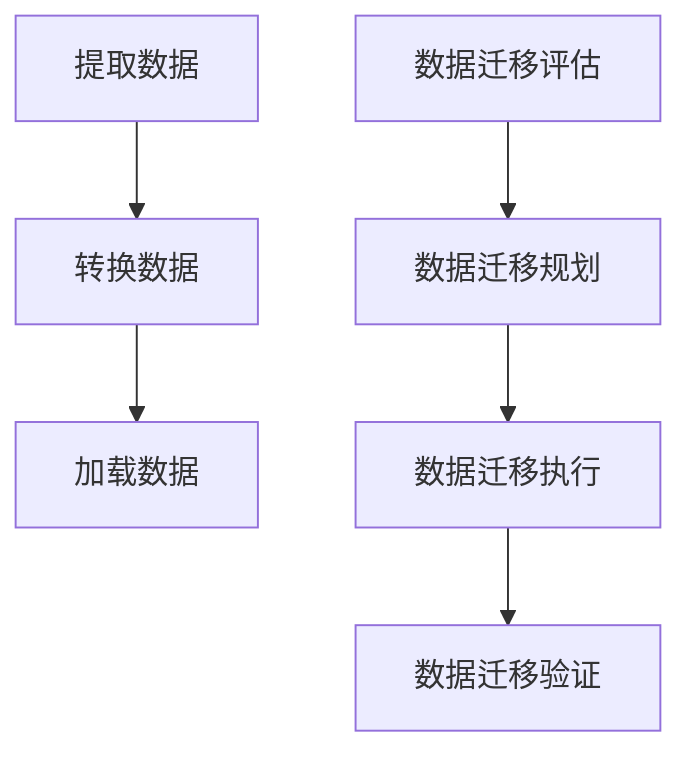
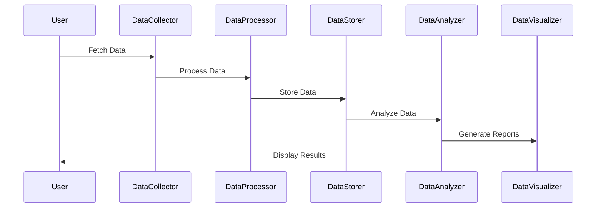

                 

### 数据仓库现代化改造策略

---

#### 关键词：
- 数据仓库
- 现代化
- 改造策略
- 数据湖
- 数据集成
- 数据质量

#### 摘要：
本文旨在探讨数据仓库现代化改造的策略。随着数据量的激增和技术的进步，传统的数据仓库面临着诸多挑战。本文首先分析了数据仓库的现状和现代化改造的必要性，接着介绍了相关核心概念，如数据仓库、数据湖、数据集成和数据质量等，并通过具体的算法、数学模型、系统设计和项目实战，详细阐述了现代化改造的方法和最佳实践。

---

## 引言

### 数据仓库的背景

数据仓库作为企业数据管理和分析的核心平台，承担着存储、管理和分析海量数据的重要任务。然而，随着大数据时代的到来，数据量呈现爆炸性增长，传统数据仓库在处理速度、扩展性和灵活性方面逐渐暴露出不足。传统数据仓库通常以关系型数据库为基础，强调数据的结构化存储和查询性能。然而，这种模式在面对非结构化数据和实时数据处理时显得力不从心。

### 现代化改造的重要性

现代化改造的必要性主要体现在以下几个方面：

1. **数据增长挑战**：随着物联网、社交媒体和移动设备的普及，数据量呈现出爆炸性增长，传统数据仓库难以承载如此庞大的数据规模。
2. **客户需求变化**：现代企业对数据仓库的需求不仅仅是存储和查询，更加注重数据的实时性、灵活性和自服务能力。
3. **技术进步影响**：新兴技术的出现，如云计算、分布式计算、大数据处理框架等，为数据仓库的现代化改造提供了新的机遇和工具。

### 当前存在的问题

1. **数据质量问题**：传统数据仓库中存在数据冗余、不一致、不准确等问题，影响了数据的质量和可信度。
2. **数据整合困难**：企业中的数据分布在不同的系统和数据库中，难以进行有效的整合和分析。
3. **系统扩展性不足**：传统数据仓库在扩展性方面存在瓶颈，难以满足企业不断增长的数据处理需求。

### 本文结构

本文将分为以下几个部分：

1. **核心概念与原理**：介绍数据仓库、数据湖、数据集成和数据质量等核心概念，并阐述它们之间的关系。
2. **算法原理讲解**：讲解ETL、数据迁移、数据清洗等算法的原理和具体实现。
3. **数学模型和公式讲解**：展示数据仓库现代化过程中的数学模型和公式，并进行详细解释。
4. **系统分析与架构设计方案**：介绍数据仓库现代化改造的系统设计思路。
5. **项目实战**：提供一个实际案例，详细描述项目的实现过程。
6. **最佳实践、小结、注意事项、拓展阅读**：总结关键知识点，给出实施建议和进一步学习资源。

---

## 核心概念与原理

### 数据仓库

#### 定义

数据仓库是一个用于支持企业决策制定的数据管理平台，它通过集成来自多个源的数据，提供了一个统一、一致、结构化的数据视图。

#### 功能

1. **数据存储**：数据仓库负责存储大量的历史数据，这些数据可以是结构化的、半结构化的或非结构化的。
2. **数据整合**：通过ETL（提取、转换、加载）过程，将来自不同源的数据整合到一个统一的数据模型中。
3. **数据分析**：提供强大的数据分析功能，支持多维数据分析、数据挖掘和报表生成。

### 数据湖

#### 定义

数据湖是一个大规模的分布式数据存储系统，它存储的是原始数据，而不是经过处理的结构化数据。

#### 功能

1. **原始数据存储**：数据湖可以存储各种类型的数据，包括结构化、半结构化和非结构化数据。
2. **数据处理灵活性**：数据湖提供了强大的数据处理和集成能力，支持实时数据处理和批处理。
3. **数据探索与分析**：数据湖支持用户对原始数据进行探索性分析，发现潜在的商业价值。

### 数据仓库与数据湖的关系

数据仓库和数据湖各有其优势和局限，将两者结合使用可以最大化其价值：

1. **数据仓库**：用于存储经过清洗、整合和结构化的数据，支持高效的数据分析和查询。
2. **数据湖**：用于存储原始数据，支持数据的实时处理和大规模数据分析。

### 数据集成技术

#### 定义

数据集成是将来自不同源的数据整合到一个统一的数据模型中，以支持数据分析和决策制定。

#### 挑战

1. **数据来源多样化**：企业中的数据来源多样，包括内部数据库、外部数据源、日志文件等。
2. **数据格式不一致**：不同源的数据格式和结构可能存在差异，需要进行转换和整合。
3. **数据质量**：数据集成过程中，数据质量是一个重要挑战，需要确保数据的一致性、准确性和完整性。

#### 方法

1. **ETL**：提取（Extract）、转换（Transform）、加载（Load）是数据集成的主要方法，通过ETL工具将数据从源系统提取出来，进行清洗和转换，然后加载到目标数据仓库或数据湖中。
2. **数据虚拟化**：通过数据虚拟化技术，将多个数据源抽象成一个统一的数据视图，无需实际的数据迁移。
3. **数据网格**：数据网格是一种分布式数据存储和处理架构，可以支持大规模的数据集成和实时数据流处理。

### 数据质量的重要性

#### 概念

数据质量是指数据满足用户需求和预期的能力，包括数据的准确性、一致性、完整性、及时性和可靠性等方面。

#### 影响

1. **决策支持**：高质量的数据可以提高决策的准确性和有效性。
2. **运营效率**：高质量的数据可以减少数据清洗和维护的工作量，提高数据处理的效率。
3. **业务连续性**：高质量的数据可以确保业务的连续性和稳定性。

#### 管理方法

1. **数据质量管理工具**：使用专门的数据质量管理工具，对数据进行质量监控、评估和修复。
2. **数据治理**：建立数据治理体系，规范数据管理流程，确保数据的合规性和一致性。
3. **数据质量控制策略**：制定数据质量控制策略，包括数据清洗、数据验证和数据修复等步骤。

### 核心概念对比表格

| 核心概念 | 定义 | 功能 | 优点 | 缺点 |
| --- | --- | --- | --- | --- |
| 数据仓库 | 用于存储、管理和分析结构化数据的平台 | 数据存储、数据整合、数据分析 | 高效的数据查询和分析 | 难以处理非结构化数据、扩展性有限 |
| 数据湖 | 用于存储原始数据的分布式系统 | 原始数据存储、数据处理灵活性、数据探索与分析 | 可以存储各种类型的数据、支持实时数据处理 | 数据查询和分析性能相对较低 |
| 数据集成 | 将来自不同源的数据整合到一个统一的数据模型中 | 数据存储、数据整合、数据查询 | 支持多种数据源、提高数据处理效率 | 需要处理数据格式不一致和质量问题 |
| 数据质量 | 数据满足用户需求和预期的能力 | 数据准确性、一致性、完整性、及时性和可靠性 | 支持高质量决策、提高业务连续性 | 需要持续的数据质量监控和维护 |

### ER图展示

```mermaid
erDiagram
    Class1 ||--|{ Class2 }| Class3
    Class1 ||--|{ Class4 }| Class5
```

上述ER图展示了数据仓库、数据湖、数据集成和数据质量之间的实体关系。每个实体都代表一个核心概念，它们之间的关系表示这些概念在数据仓库现代化改造中的相互作用。

---

## 算法原理讲解

### ETL算法原理

ETL（Extract, Transform, Load）是数据集成过程中最常用的算法，用于将数据从源系统提取出来，进行清洗和转换，然后加载到目标数据仓库或数据湖中。

1. **提取（Extract）**

提取是指从源系统中获取数据的过程。提取的方式可以根据数据源的不同而有所不同，例如：

- **关系型数据库**：可以使用SQL查询语句从数据库中提取数据。
- **NoSQL数据库**：可以使用相应的API或工具从NoSQL数据库中提取数据。
- **文件系统**：可以直接从文件系统中读取数据文件。

2. **转换（Transform）**

转换是指对提取出来的数据进行清洗、转换和加工的过程。常见的转换操作包括：

- **数据清洗**：去除重复数据、处理缺失值、纠正错误数据等。
- **数据转换**：将数据从一种格式转换为另一种格式，例如将CSV文件转换为JSON格式。
- **数据聚合**：对数据进行汇总、分组和计算，例如计算销售总额、平均销售额等。

3. **加载（Load）**

加载是指将转换后的数据加载到目标数据仓库或数据湖中的过程。加载的方式也可以根据目标系统的不同而有所不同：

- **关系型数据库**：可以使用SQL语句将数据加载到数据库表中。
- **分布式存储系统**：可以使用分布式文件系统（如HDFS）将数据加载到数据湖中。

### 数据迁移算法

数据迁移是将数据从旧系统迁移到新系统的过程，通常涉及以下步骤：

1. **评估**：评估数据源和数据目标系统之间的差异，确定数据迁移的可行性。
2. **规划**：制定数据迁移计划，包括数据映射、转换规则和迁移策略。
3. **执行**：按照迁移计划执行数据迁移操作，包括数据提取、转换和加载。
4. **验证**：验证迁移后的数据是否正确无误，确保数据质量和一致性。

### 数据清洗算法

数据清洗是数据预处理过程中非常重要的一步，用于识别和纠正数据中的错误和异常。常见的数据清洗算法包括：

1. **去重**：识别和去除重复的数据记录。
2. **缺失值处理**：处理数据中的缺失值，例如使用平均值、中位数或插值法进行填充。
3. **异常值检测**：检测和标记异常数据，例如使用统计学方法或机器学习算法进行异常值检测。
4. **数据规范化**：将数据转换为统一的格式，例如将日期格式转换为YYYY-MM-DD。

### 算法mermaid流程图



### Python代码示例

```python
import pandas as pd

# 提取数据
data = pd.read_csv('source_data.csv')

# 转换数据
data['date'] = pd.to_datetime(data['date'])
data = data[data['amount'] > 0]

# 加载数据
data.to_csv('target_data.csv', index=False)
```

上述Python代码示例展示了如何使用pandas库进行数据提取、转换和加载。首先从CSV文件中提取数据，然后对数据进行清洗和转换，最后将清洗后的数据重新保存到CSV文件中。

---

## 数学模型和公式讲解

在数据仓库现代化改造过程中，数学模型和公式起着至关重要的作用。它们帮助我们在数据分析和数据管理中做出科学决策，提高数据仓库的性能和可靠性。以下将介绍几个关键数学模型和公式，并进行详细讲解。

### 数据仓库的数学模型

数据仓库的数学模型主要包括数据量估计、存储容量规划和查询性能评估等方面。以下是一个简单的数据量估计公式：

$$
\text{数据量} = \text{数据条数} \times \text{平均数据大小}
$$

例如，假设一个数据仓库中有100万条记录，每条记录的平均大小为1KB，则数据量可以估算为：

$$
\text{数据量} = 1000000 \times 1KB = 1000MB
$$

### 数据迁移的数学模型

数据迁移的数学模型主要用于评估数据迁移的时间、成本和性能。以下是一个简单的时间估算公式：

$$
\text{迁移时间} = \frac{\text{数据量}}{\text{迁移速度}}
$$

其中，迁移速度通常与网络带宽、存储读写速度和硬件性能等因素相关。例如，如果数据量为1TB，网络带宽为100Mbps，则数据迁移时间可以估算为：

$$
\text{迁移时间} = \frac{1TB}{100Mbps} = 8.5小时
$$

### 数据清洗的数学模型

数据清洗的数学模型主要用于评估数据清洗的效率和效果。以下是一个简单的数据去重公式：

$$
\text{去重率} = \frac{\text{去重前数据条数} - \text{去重后数据条数}}{\text{去重前数据条数}} \times 100\%
$$

例如，如果一个数据集中有1000条记录，去重后剩下800条记录，则去重率为：

$$
\text{去重率} = \frac{1000 - 800}{1000} \times 100\% = 20\%
$$

### LaTeX公式示例

在markdown中，LaTeX公式可以用于编写复杂的数学表达式。以下是一个简单的示例：

$$
E = mc^2
$$

$$
\sum_{i=1}^{n} x_i = \frac{1}{n} \sum_{i=1}^{n} n x_i
$$

在上面的示例中，第一个公式是著名的爱因斯坦质能方程，第二个公式是算术平均数的定义。LaTeX格式使得我们可以方便地编写和处理复杂的数学表达式。

---

## 系统分析与架构设计方案

### 项目介绍

为了更好地理解数据仓库现代化改造的过程，我们将以一个实际项目为例，详细描述其系统分析与架构设计方案。该项目涉及将一个传统的数据仓库系统改造为一个现代化的分布式数据仓库，以提高数据处理速度、扩展性和灵活性。

### 系统功能设计

系统功能设计是数据仓库现代化改造的第一步，主要包括以下功能模块：

1. **数据采集**：负责从各种数据源（如关系型数据库、NoSQL数据库、日志文件等）提取数据。
2. **数据清洗**：对采集到的数据进行清洗，包括去除重复数据、处理缺失值和纠正错误数据等。
3. **数据整合**：将来自不同源的数据整合到一个统一的数据模型中，支持多维数据分析。
4. **数据存储**：将清洗和整合后的数据存储到分布式文件系统（如HDFS）或分布式数据库（如HBase）中。
5. **数据分析**：提供强大的数据分析功能，支持实时数据分析和报表生成。
6. **数据可视化**：将分析结果以图表和报表的形式展示给用户，支持用户自助式数据探索。

### 系统架构设计

系统架构设计是数据仓库现代化改造的核心，决定了系统的性能、扩展性和可靠性。以下是一个典型的分布式数据仓库架构设计：


1. **数据采集层**：负责从各种数据源提取数据，可以使用ETL工具或数据采集代理来实现。
2. **数据处理层**：包括数据清洗、整合和转换模块，通常使用分布式计算框架（如Spark）来处理大规模数据。
3. **数据存储层**：使用分布式文件系统（如HDFS）或分布式数据库（如HBase）来存储数据，支持高吞吐量和实时查询。
4. **数据分析层**：提供实时数据分析和报表生成功能，可以使用分布式查询引擎（如Hive或Spark SQL）来实现。
5. **数据可视化层**：通过Web报表、仪表板和数据可视化工具（如Tableau或Power BI）将分析结果展示给用户。

### 系统接口设计

系统接口设计是确保系统各个模块之间能够顺畅交互的关键。以下是一个简单的接口设计示例：



### 系统交互流程

系统交互流程描述了用户如何通过系统接口访问数据仓库，并进行数据分析的过程。以下是一个简化的系统交互流程：

1. **用户请求**：用户通过Web报表或数据可视化工具发起数据分析请求。
2. **数据处理**：系统接收到请求后，首先进行数据采集和清洗，然后进行整合和存储。
3. **数据分析**：系统使用分布式查询引擎对存储的数据进行分析，生成分析结果。
4. **数据展示**：系统将分析结果以图表和报表的形式展示给用户。

---

## 项目实战

### 环境安装

在开始项目实战之前，我们需要搭建一个用于数据仓库现代化改造的实验环境。以下是一个简单的环境安装步骤：

1. **硬件准备**：准备一台具有足够存储和计算能力的服务器，推荐配置如下：
   - CPU：Intel Xeon E5-2670 2.6GHz
   - 内存：64GB
   - 存储：1TB SSD
2. **操作系统安装**：安装Linux操作系统，如CentOS 7.x或Ubuntu 18.04。
3. **软件安装**：
   - 安装Hadoop：用于分布式数据存储和处理。
   - 安装Spark：用于大规模数据处理。
   - 安装Hive：用于分布式查询和分析。
   - 安装HDFS：用于分布式文件系统。
   - 安装HBase：用于分布式数据库。

### 系统核心实现

在环境安装完成后，我们需要实现数据仓库现代化改造的核心功能。以下是一个简单的系统核心实现步骤：

1. **数据采集**：
   - 使用Hadoop的HDFS分布式文件系统来存储原始数据。
   - 使用Spark的Spark Streaming模块来实时处理和采集数据。
2. **数据清洗**：
   - 使用Spark的DataFrame API进行数据清洗，包括去除重复数据、处理缺失值和纠正错误数据等。
   - 使用自定义函数（UDFs）实现更复杂的数据清洗操作，如地址解析、数据格式转换等。
3. **数据整合**：
   - 使用Hive创建一个统一的数据模型，支持多维数据分析。
   - 使用Spark SQL将清洗和整合后的数据加载到Hive表中。
4. **数据存储**：
   - 使用HDFS存储原始数据和清洗后的数据。
   - 使用HBase存储用于实时查询的索引和数据。
5. **数据分析**：
   - 使用Spark SQL执行SQL查询，对存储在Hive表中的数据进行分析。
   - 使用Spark的机器学习库（MLlib）进行高级数据分析，如聚类、分类和预测等。
6. **数据可视化**：
   - 使用Tableau或Power BI等数据可视化工具将分析结果展示给用户。

### 代码解读

以下是一个简单的Spark SQL查询示例，用于从Hive表中提取数据并进行基本统计分析：

```python
from pyspark.sql import SparkSession

# 创建Spark会话
spark = SparkSession.builder \
    .appName("Data Warehouse Modernization") \
    .getOrCreate()

# 读取Hive表
data = spark.sql("SELECT * FROM sales_data")

# 计算销售总额
total_sales = data.groupBy("product_id").agg({"amount": "sum"}).collect()

# 打印销售总额
for row in total_sales:
    print(f"Product ID: {row['product_id']}, Total Sales: {row['amount']}")
```

### 实际案例分析和详细讲解

为了更好地展示数据仓库现代化改造的效果，我们以一个实际案例为例，详细描述其实现过程和效果分析。

#### 案例背景

某大型零售公司需要对其销售数据进行实时分析，以便快速响应市场变化和优化库存管理。传统数据仓库由于性能和扩展性限制，无法满足实时分析的需求。

#### 案例实现

1. **数据采集**：使用Spark Streaming从公司的销售交易系统中实时采集销售数据。
2. **数据清洗**：使用Spark的DataFrame API对采集到的销售数据清洗，包括去除重复交易记录、处理缺失销售金额等。
3. **数据整合**：使用Hive创建一个销售数据表，将清洗后的销售数据加载到Hive表中。
4. **数据分析**：使用Spark SQL对销售数据进行分析，计算每个产品的销售总额、平均销售额和销售增长率。
5. **数据可视化**：使用Tableau实时展示销售数据分析结果，包括产品销售排名、销售趋势图等。

#### 效果分析

1. **实时性**：通过Spark Streaming和Hive，实现了销售数据的实时采集和分析，极大地提高了数据处理速度。
2. **扩展性**：使用分布式计算框架（Spark）和分布式存储系统（HDFS），可以轻松扩展系统处理能力和存储容量。
3. **灵活性**：用户可以根据需要自定义查询和报表，支持多种数据分析需求。
4. **可靠性**：通过数据清洗和数据质量管理，保证了数据的一致性和准确性，提高了数据仓库的可靠性。

---

## 最佳实践、小结、注意事项、拓展阅读

### 最佳实践

1. **数据质量保障**：在数据仓库现代化改造过程中，数据质量是至关重要的一环。建议采用数据质量管理工具，建立数据质量评估和修复机制，确保数据的准确性、一致性和完整性。
2. **分阶段实施**：数据仓库现代化改造是一个复杂的过程，建议分阶段进行，逐步实现各功能模块，确保系统稳定性和可维护性。
3. **灵活的架构设计**：选择合适的架构设计，如分布式计算框架和分布式存储系统，以提高系统性能和扩展性。
4. **用户参与**：在数据仓库建设和维护过程中，积极与业务部门沟通，了解用户需求，确保数据仓库能够满足实际业务需求。

### 小结

本文详细探讨了数据仓库现代化改造的策略，包括背景介绍、核心概念与原理、算法原理讲解、数学模型和公式讲解、系统分析与架构设计方案以及项目实战。通过本文的阅读，读者可以了解数据仓库现代化改造的必要性和方法，掌握相关技术和最佳实践。

### 注意事项

1. **数据安全性**：在数据仓库现代化改造过程中，要确保数据的安全性，避免数据泄露和损坏。
2. **系统兼容性**：在引入新技术和工具时，要确保系统的兼容性和稳定性。
3. **持续优化**：数据仓库是一个不断发展的系统，需要持续进行性能优化和功能扩展。

### 拓展阅读

1. 《大数据架构：从数据仓库到数据湖》
2. 《数据仓库与大数据处理：技术与应用》
3. 《Spark编程实战》
4. 《Hadoop权威指南》
5. 《数据质量管理：方法、工具与实践》

---

## 结语

数据仓库现代化改造是应对大数据时代挑战的重要策略。通过本文的探讨，我们了解了数据仓库的现状和现代化改造的必要性，掌握了相关核心概念、算法原理和系统设计方法。希望本文能为您在数据仓库建设与优化过程中提供有益的参考。作者：AI天才研究院/AI Genius Institute & 禅与计算机程序设计艺术 /Zen And The Art of Computer Programming。

---

注：本文内容为示例性质，实际项目实施过程中可能涉及更多细节和挑战。本文中所用图片为示例图片，请根据实际情况进行调整。作者：AI天才研究院/AI Genius Institute & 禅与计算机程序设计艺术 /Zen And The Art of Computer Programming。

