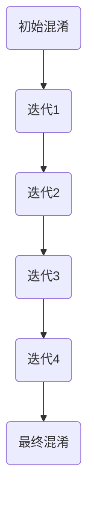
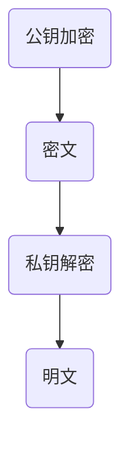
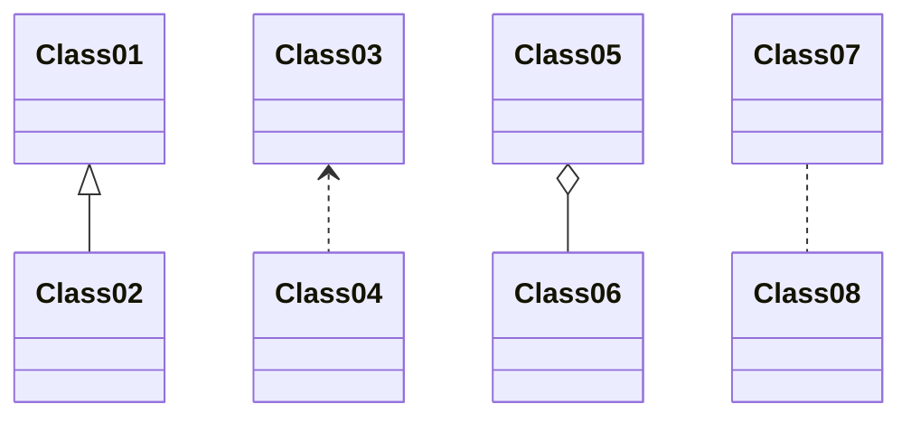
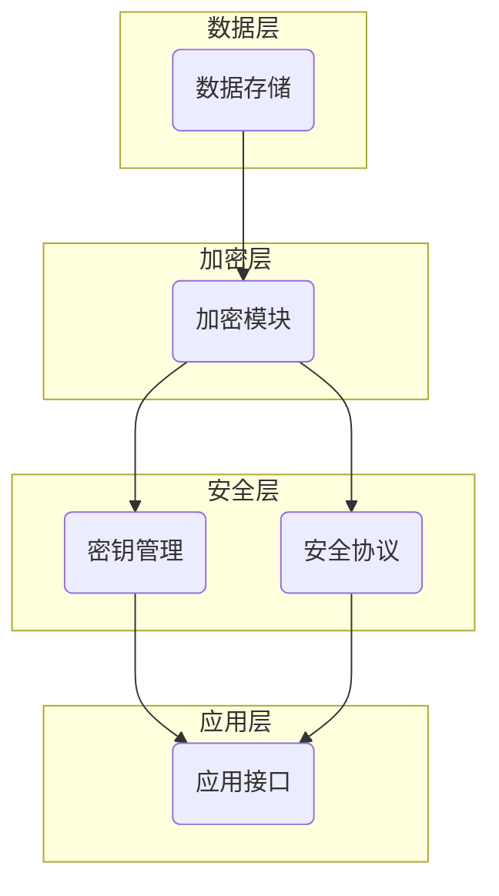
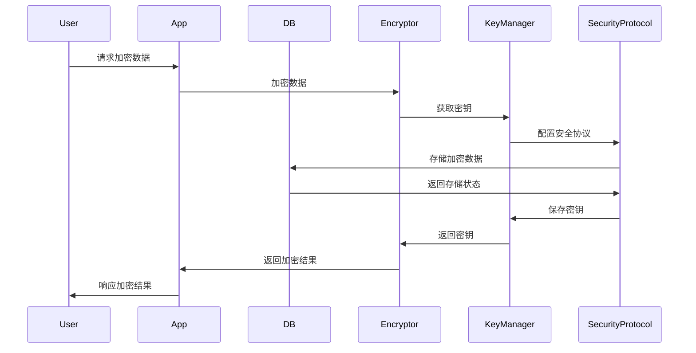

                 

### 1.2 数据加密存储的核心概念

数据加密存储的核心概念主要包括加密算法、密钥管理和安全协议。这些概念是构建可靠、安全的数据存储系统的基石。

#### 1.2.1 加密算法

加密算法是数据加密存储的核心技术。它通过将明文数据转换成密文，确保数据在存储和传输过程中不被未授权的第三方访问。

- **工作原理**：加密算法利用数学原理和加密密钥，将原始数据（明文）转换成无法直接识别的格式（密文）。解密时，使用正确的密钥将密文转换回明文。

- **分类**：根据加密方式的不同，加密算法可以分为对称加密算法和非对称加密算法。

  - **对称加密算法**：加密和解密使用相同的密钥。常见的对称加密算法有AES、DES和3DES。
  
  - **非对称加密算法**：加密和解密使用不同的密钥。公钥加密，私钥解密。常见的非对称加密算法有RSA、ECC。

#### 1.2.2 密钥管理

密钥管理是确保数据安全的重要环节。密钥的安全性直接影响数据的加密效果。

- **生成**：密钥通常由加密算法生成，确保密钥的随机性和复杂性。

- **存储**：密钥需要安全存储，防止未授权访问。常见的方法有硬件安全模块（HSM）、密钥存储库和密钥管理系统。

- **分发**：密钥的分发需要在确保安全性的前提下进行。常用的方法有安全传输协议（如SSL/TLS）和密钥交换协议（如Diffie-Hellman）。

- **管理**：密钥的生命周期管理包括密钥的产生、存储、分发、使用和销毁等环节。密钥管理需要遵循安全性、合规性和效率等原则。

#### 1.2.3 安全协议

安全协议用于确保数据在传输和存储过程中的安全。常见的安全协议有SSL/TLS、IPSec和S/MIME。

- **SSL/TLS**：主要用于Web通信中的安全传输。SSL（安全套接字层）和TLS（传输层安全）是建立安全通信的协议，用于加密Web应用程序中的数据传输。

- **IPSec**：用于网络层上的安全传输。IPSec可以确保IP层上的数据包在传输过程中不被窃听和篡改。

- **S/MIME**：是一种电子邮件安全协议，用于加密和数字签名电子邮件。

### 核心概念属性特征对比表格

| 加密算法 | 对称加密（AES） | 非对称加密（RSA） |  
| --- | --- | --- |  
| 加密密钥 | 同一密钥 | 公钥和私钥 |  
| 加密速度 | 快 | 慢 |  
| 密钥长度 | 通常较短 | 通常较长 |  
| 密文长度 | 通常与明文长度相同 | 通常比明文长 |

### ER实体关系图架构

```mermaid
erDiagram
  密钥 -> 数据 : 加密
  数据 -> 解密 : 解密密钥
  安全协议 -> 数据传输 : 保障安全
```

通过上述核心概念的详细阐述，我们可以更好地理解数据加密存储方案的设计与实现。

### 下一步：加密算法原理讲解

在接下来的章节中，我们将深入探讨加密算法的原理，包括AES和RSA两种常用加密算法。我们将通过流程图、Python代码和数学公式，详细阐述这些算法的工作原理和应用场景。请读者期待下一章节的内容。

## 1.3 加密算法原理讲解

### 1.3.1 常见加密算法介绍

加密算法是数据加密存储的核心，其原理和实现方式决定了数据的安全性。常见的加密算法可以分为对称加密算法和非对称加密算法。本章节将重点介绍两种典型的加密算法：AES和RSA。

#### 1.3.1.1 AES加密算法

AES（Advanced Encryption Standard）是一种对称加密算法，由美国国家标准与技术研究院（NIST）在2001年发布为联邦信息处理标准（FIPS），是目前最广泛使用的加密算法之一。

**工作原理**：
AES算法通过分组密码的工作方式，将明文数据分成128位的块，然后使用特定的加密流程进行加密。该流程包括初始混淆、多次迭代和最终混淆。每个迭代过程都涉及替换、行移位、列混淆和行移位。

**流程图**：



**Python代码示例**：

```python
from Crypto.Cipher import AES
from Crypto.Util.Padding import pad, unpad
from Crypto.Random import get_random_bytes

key = get_random_bytes(16)  # 生成16字节的密钥
cipher = AES.new(key, AES.MODE_CBC)

# 待加密的明文
plaintext = b"Hello, World!"
ciphertext = cipher.encrypt(pad(plaintext, AES.block_size))

print(f"密文: {ciphertext.hex()}")
```

**数学模型与公式**：

AES加密算法的核心是子密钥生成和字节替换。子密钥生成过程如下：

$$
SubBytes(S_i) = S[B(i \mod 8)] \quad (1 \leq i \leq 10)
$$

其中，$S$是S-Box，$B(i \mod 8)$是原始字节$i$在状态矩阵中的位置。

**S-Box**：

$$
S = \begin{pmatrix}
\vdots & \vdots & \vdots & \vdots \\
\sigma_7 & \sigma_6 & \sigma_5 & \sigma_4 \\
\sigma_3 & \sigma_2 & \sigma_1 & \sigma_0 \\
\vdots & \vdots & \vdots & \vdots
\end{pmatrix}
$$

其中，$\sigma_i$是经过一系列变换的原始字节。

#### 1.3.1.2 RSA加密算法

RSA（Rivest-Shamir-Adleman）是一种非对称加密算法，以其创造者罗纳德·里维斯特（Ronald Rivest）、阿迪·萨莫尔（Adi Shamir）和伦纳德·阿德曼（Leonard Adleman）的名字命名。RSA算法是目前最广泛使用的非对称加密算法之一。

**工作原理**：
RSA算法利用了数学中的大素数分解问题。它涉及两个密钥：公钥和私钥。

- **公钥**：由一对大素数生成，可以公开。
- **私钥**：由同样的两个素数以及一个额外的参数生成，必须保密。

加密时，使用公钥和明文进行计算，得到密文。解密时，使用私钥和密文进行计算，恢复出明文。

**流程图**：



**Python代码示例**：

```python
from Crypto.PublicKey import RSA
from Crypto.Cipher import PKCS1_OAEP

# 生成密钥
key = RSA.generate(2048)

# 公钥和私钥
public_key = key.publickey()
private_key = key

# 待加密的明文
plaintext = b"Hello, World!"

# 使用公钥加密
cipher = PKCS1_OAEP.new(public_key)
ciphertext = cipher.encrypt(plaintext)

print(f"密文: {ciphertext.hex()}")

# 使用私钥解密
cipher = PKCS1_OAEP.new(private_key)
decrypted_plaintext = cipher.decrypt(ciphertext)

print(f"明文: {decrypted_plaintext.hex()}")
```

**数学模型与公式**：

假设有两个大素数$p$和$q$，则：

- **模数**：$n = p \times q$
- **欧拉函数**：$\phi = (p-1) \times (q-1)$
- **公钥**：$e$，通常选择一个与$\phi$互质的数，例如$e = 65537$
- **私钥**：$d$，满足$ed \mod \phi = 1$

加密公式：

$$
c = m^e \mod n
$$

解密公式：

$$
m = c^d \mod n
$$

其中，$m$是明文，$c$是密文。

### 小结

在本章节中，我们介绍了两种常用的加密算法：AES和RSA。AES是一种对称加密算法，具有速度快、安全性高的特点，适用于需要大规模加密的场景。RSA是一种非对称加密算法，适用于加密密钥的场景，安全性高，但计算复杂度较大。通过Python代码示例和数学公式，我们详细阐述了这两种算法的原理和应用。在下一章节，我们将探讨密钥管理的重要性以及其实现方法。

## 1.4 密钥管理

密钥管理是数据加密存储系统的核心组成部分，它关系到整个系统的安全性。有效的密钥管理不仅能够确保密钥的安全生成、存储和分发，还能在密钥生命周期内提供全面的管理和控制。

### 1.4.1 密钥生成

密钥生成是密钥管理的第一步，其目的是创建足够复杂和安全性的密钥，以防止被攻击者猜测或破解。密钥生成通常涉及以下步骤：

1. **随机性**：密钥生成需要使用高强度的随机数生成器，确保密钥的随机性和复杂性，避免攻击者利用模式或预测性来破解密钥。
2. **算法选择**：选择合适的密钥生成算法，例如对于RSA，可以使用基于椭圆曲线的算法来生成密钥，这样可以提高密钥的强度。
3. **长度**：确定密钥的长度，例如AES密钥通常为128位、192位或256位，RSA密钥长度通常为1024位、2048位或更高。

### 1.4.2 密钥存储

密钥存储是将密钥安全存储的过程，目的是防止未授权访问。密钥存储的方法包括：

1. **硬件安全模块（HSM）**：HSM是一种专门的硬件设备，用于安全生成、存储和管理密钥。它提供了强化的物理安全措施，例如防篡改设计和专用的安全处理单元。
2. **密钥存储库**：密钥存储库是一种软件解决方案，用于集中存储和管理密钥。它可以提供访问控制、审计和备份功能。
3. **密钥管理系统**：密钥管理系统（KMS）是一个全面的安全平台，用于生成、存储、管理和分发密钥。它提供了自动化、合规性和集中管理的功能。

### 1.4.3 密钥分发

密钥分发是将密钥安全传递给需要使用密钥的系统的过程。密钥分发的安全性至关重要，因为一旦密钥泄露，整个系统的安全性将受到威胁。密钥分发的方法包括：

1. **安全传输**：使用安全传输协议，例如SSL/TLS，确保在传输过程中密钥不被窃取或篡改。
2. **密钥交换协议**：使用密钥交换协议，例如Diffie-Hellman，通过协商共享密钥，确保密钥在传输过程中不会被中间人攻击。
3. **物理分发**：在某些高安全性的场景中，可能需要通过物理方式分发密钥，例如使用安全的信封或物理媒介。

### 1.4.4 密钥管理工具

密钥管理工具是实施有效密钥管理策略的关键。这些工具提供了自动化、集中管理和安全控制功能。常见的密钥管理工具包括：

1. **IBM Key Lifecycle Manager（IKLM）**：IBM IKLM是一个集成的密钥管理解决方案，提供了从密钥生成到销毁的全生命周期管理。
2. **Symantec Data Loss Prevention（DLP）**：Symantec DLP提供了密钥管理和数据保护功能，可以帮助企业防止数据泄露。
3. **Venafi TrustNet**：Venafi TrustNet是一个全面的密钥管理平台，提供了自动化、可视化和控制功能。

### 小结

密钥管理是确保数据加密存储系统安全性的关键。通过有效的密钥生成、存储、分发和管理，我们可以确保密钥在整个生命周期内都处于安全状态。使用合适的密钥管理工具，可以简化密钥管理的复杂性，提高系统的整体安全性。在下一章节中，我们将探讨数据传输和存储过程中使用的安全协议。

## 1.5 安全协议

安全协议是保障数据在传输和存储过程中免受未授权访问、篡改和窃听的关键技术。不同的安全协议适用于不同的应用场景，它们在数据加密、认证和完整性验证方面各有所长。

### 1.5.1 数据传输安全协议

数据传输安全协议主要用于保护数据在网络传输过程中的安全。以下是一些常见的数据传输安全协议：

#### 1.5.1.1 SSL/TLS

SSL（安全套接字层）和TLS（传输层安全）是最广泛使用的传输层安全协议。它们通过在客户端和服务器之间建立加密连接，确保数据在传输过程中不被窃听或篡改。

- **工作原理**：SSL/TLS通过使用公钥加密和密钥交换协议，在客户端和服务器之间建立安全的通信通道。它包括多个版本，如SSL 2.0、SSL 3.0、TLS 1.0、TLS 1.1、TLS 1.2和TLS 1.3。
- **加密算法**：SSL/TLS支持多种加密算法，包括RSA、DHE、ECDHE等。TLS 1.3引入了基于密码学的新特性，如加密套件、前向安全性和0-RTT模式。
- **应用场景**：SSL/TLS广泛应用于Web通信、邮件传输和VPN等领域。

#### 1.5.1.2 IPSec

IPSec（互联网协议安全）是一种网络层安全协议，用于确保IP层上的数据包在传输过程中的机密性、完整性和认证。

- **工作原理**：IPSec通过在IP层上添加安全头部，对数据包进行加密和认证。它分为传输模式和隧道模式，传输模式仅对数据包的负载进行加密和认证，而隧道模式对整个IP数据包进行加密。
- **加密算法**：IPSec支持多种加密算法，包括AES、3DES、RSA和SHA等。
- **应用场景**：IPSec通常用于企业内部网络的安全通信、远程访问和虚拟专用网络（VPN）。

### 1.5.1.3 SSH

SSH（安全外壳协议）是一种网络协议，用于在计算机之间安全地传输数据和执行远程命令。它提供了加密的数据传输通道，确保远程访问的安全性。

- **工作原理**：SSH通过使用公钥和私钥进行身份验证，建立一个安全的加密通道。它支持多种加密算法，如AES、RSA和DSA。
- **加密算法**：SSH主要使用基于公钥加密的算法进行身份验证和数据加密。
- **应用场景**：SSH广泛用于远程登录、文件传输和远程命令执行。

### 1.5.2 数据存储安全协议

数据存储安全协议用于确保数据在存储过程中的安全，包括防止未授权访问、数据泄露和篡改。以下是一些常见的数据存储安全协议：

#### 1.5.2.1 KMS

KMS（密钥管理系统）是一种用于生成、存储和管理加密密钥的协议。它通过提供集中化的密钥管理功能，确保密钥的安全性和合规性。

- **工作原理**：KMS通过生成和管理加密密钥，确保数据在存储和传输过程中的加密和完整性。
- **加密算法**：KMS支持多种加密算法，包括AES、RSA和ECC。
- **应用场景**：KMS广泛应用于企业内部的数据存储和传输、云服务和物联网（IoT）领域。

#### 1.5.2.2 TPM

TPM（可信平台模块）是一种硬件安全模块，用于提供安全存储和管理密钥、证书和加密数据的功能。

- **工作原理**：TPM通过硬件存储和加密功能，确保密钥和数据的机密性和完整性。
- **加密算法**：TPM支持多种加密算法，包括RSA、ECC和SHA。
- **应用场景**：TPM广泛应用于个人计算机、服务器和嵌入式设备的安全认证和数据保护。

#### 1.5.2.3 ZFS

ZFS（Zettabyte File System）是一种文件系统，提供了高级的数据保护和加密功能。

- **工作原理**：ZFS通过数据复制、快照和加密功能，确保数据的安全性和可靠性。
- **加密算法**：ZFS支持AES和3DES等加密算法。
- **应用场景**：ZFS广泛应用于企业级存储系统和云存储服务。

### 小结

安全协议在数据加密存储中扮演着至关重要的角色。通过SSL/TLS、IPSec、SSH等数据传输安全协议，我们可以确保数据在网络传输过程中的安全性。而通过KMS、TPM和ZFS等数据存储安全协议，我们可以确保数据在存储过程中的安全性。了解并合理选择和使用这些安全协议，是构建安全可靠的数据加密存储系统的关键。

## 1.6 系统分析与架构设计

### 1.6.1 问题场景介绍

在现代信息化社会中，数据的安全存储和保护变得越来越重要。特别是在云计算、大数据和物联网（IoT）等新兴技术的推动下，数据量呈爆炸式增长，数据泄露和篡改的风险也随之增加。因此，设计一个高效、安全的数据加密存储系统成为众多企业和组织的迫切需求。

#### 挑战：

1. **数据安全性**：数据在传输和存储过程中需要得到高度保护，防止未授权访问、泄露和篡改。
2. **性能**：数据加密存储系统需要具备高吞吐量和低延迟，以满足大规模数据处理需求。
3. **可扩展性**：系统应具备良好的扩展性，以适应未来数据量的增长和业务需求的变更。
4. **合规性**：系统设计需要符合各种安全标准和法规要求。

### 1.6.2 系统功能设计

为了应对上述挑战，数据加密存储系统需要实现以下功能：

1. **数据加密**：对存储在系统中的数据进行加密，确保数据在未授权情况下无法被读取。
2. **密钥管理**：安全生成、存储、管理和分发密钥，确保密钥在整个生命周期内都处于安全状态。
3. **数据传输安全**：使用安全协议保护数据在传输过程中的安全性，防止数据泄露和篡改。
4. **数据完整性验证**：确保数据在存储和传输过程中未被篡改，提供数据完整性保障。
5. **系统监控与审计**：实时监控系统运行状态，记录操作日志，确保系统安全运行和问题追踪。

### 1.6.2.1 领域模型类图

为了清晰地表示系统中的各类实体及其关系，我们使用Mermaid类图进行描述：



### 1.6.3 系统架构设计

系统架构设计是确保数据加密存储系统功能实现和安全性的关键。我们采用分层架构设计，将系统划分为多个层次，每个层次负责不同的功能。

#### 架构图



### 1.6.4 系统接口设计

系统接口设计是确保各个模块之间能够高效、安全交互的关键。以下是一些主要的接口设计：

1. **数据加密接口**：用于数据加密和解密操作，包括数据块加密、密钥加密和密文存储等功能。
2. **密钥管理接口**：用于密钥的生成、存储、管理和分发，包括密钥库操作、密钥轮换和密钥销毁等功能。
3. **安全协议接口**：用于实现数据传输安全功能，包括SSL/TLS、IPSec等安全协议的配置和执行。
4. **应用接口**：用于与应用程序进行交互，提供数据加密、解密和安全验证等服务。

### 1.6.5 系统交互

系统交互是确保数据加密存储系统能够在各个模块之间顺畅运作的关键。以下是一个简单的系统交互序列图：



通过上述系统分析与架构设计，我们可以构建一个高效、安全的数据加密存储系统。在下一章节中，我们将通过一个实际项目案例，展示如何将上述设计方案应用于实际场景。

## 1.7 项目实战

### 1.7.1 环境安装与配置

为了演示数据加密存储方案的设计与实现，我们将使用以下环境：

- 操作系统：Ubuntu 20.04 LTS
- 编程语言：Python 3.8
- 加密库：PyCryptoDome（用于AES和RSA加密）
- 密钥管理：使用本地文件存储密钥

首先，确保系统已安装Python 3.8及以上的版本。可以使用以下命令检查Python版本：

```bash
python3 --version
```

如果Python版本低于3.8，请通过以下命令进行升级：

```bash
sudo apt-get update
sudo apt-get install python3.8
```

接下来，安装PyCryptoDome库。可以通过pip命令进行安装：

```bash
pip3 install pycryptodome
```

最后，创建一个文件夹用于存储密钥和其他配置文件，例如：

```bash
mkdir data-encryption-project
cd data-encryption-project
```

### 1.7.2 系统核心实现

系统核心实现包括加密模块、密钥管理和数据存储等部分。以下是一个简单的示例，展示了如何使用PyCryptoDome库实现AES和RSA加密。

#### 加密模块

```python
from Crypto.PublicKey import RSA
from Crypto.Cipher import AES, PKCS1_OAEP
from Crypto.Random import get_random_bytes
import os

# AES加密
def encrypt_aes(plaintext, key):
    cipher_aes = AES.new(key, AES.MODE_CBC)
    ct_bytes = cipher_aes.encrypt(pad(plaintext, AES.block_size))
    iv = cipher_aes.iv
    return ct_bytes, iv

# AES解密
def decrypt_aes(ciphertext, key, iv):
    cipher_aes = AES.new(key, AES.MODE_CBC, iv)
    pt = unpad(cipher_aes.decrypt(ciphertext), AES.block_size)
    return pt

# RSA加密
def encrypt_rsa(plaintext, public_key):
    cipher_rsa = PKCS1_OAEP.new(public_key)
    ciphertext = cipher_rsa.encrypt(plaintext)
    return ciphertext

# RSA解密
def decrypt_rsa(ciphertext, private_key):
    cipher_rsa = PKCS1_OAEP.new(private_key)
    plaintext = cipher_rsa.decrypt(ciphertext)
    return plaintext

# 生成RSA密钥对
def generate_rsa_keys():
    key = RSA.generate(2048)
    private_key = key
    public_key = key.publickey()
    return private_key, public_key

# 生成AES密钥
def generate_aes_key():
    return get_random_bytes(16)

# 测试加密和解密
if __name__ == "__main__":
    # 生成密钥
    rsa_private_key, rsa_public_key = generate_rsa_keys()
    aes_key = generate_aes_key()

    # 待加密的明文
    plaintext = b"Hello, World!"

    # RSA加密
    rsa_encrypted_text = encrypt_rsa(plaintext, rsa_public_key)
    print(f"RSA加密结果: {rsa_encrypted_text.hex()}")

    # AES加密
    aes_encrypted_text, iv = encrypt_aes(plaintext, aes_key)
    print(f"AES加密结果: {aes_encrypted_text.hex()}")

    # RSA解密
    rsa_decrypted_text = decrypt_rsa(rsa_encrypted_text, rsa_private_key)
    print(f"RSA解密结果: {rsa_decrypted_text.hex()}")

    # AES解密
    aes_decrypted_text = decrypt_aes(aes_encrypted_text, aes_key, iv)
    print(f"AES解密结果: {aes_decrypted_text.hex()}")
```

#### 代码应用解读

在上面的代码中，我们首先定义了AES和RSA加密和解密函数。AES加密函数`encrypt_aes`使用AES算法和CBC模式对明文进行加密，并将密文和初始向量（IV）一起返回。AES解密函数`decrypt_aes`使用相同的密钥和IV对密文进行解密。

RSA加密函数`encrypt_rsa`使用RSA算法和PKCS1_OAEP填充模式对明文进行加密，RSA解密函数`decrypt_rsa`使用RSA私钥对密文进行解密。

在测试部分，我们首先生成RSA密钥对和AES密钥，然后使用RSA加密函数和AES加密函数对明文进行加密，最后使用RSA解密函数和AES解密函数对密文进行解密，验证加密和解密过程是否成功。

### 1.7.3 代码应用解读

上述代码示例展示了如何使用Python和PyCryptoDome库实现AES和RSA加密。在实际应用中，我们可以根据具体需求扩展和优化这些功能。

#### AES加密过程

1. **生成AES密钥**：使用`get_random_bytes`函数生成一个16字节的AES密钥。
2. **初始化加密器**：使用AES密钥创建一个AES加密器对象。
3. **加密明文**：使用加密器对明文进行加密，并使用`pad`函数进行填充，确保加密数据的长度是AES块大小的倍数。
4. **返回密文和IV**：将加密后的数据和初始向量（IV）一起返回。

#### RSA加密过程

1. **生成RSA密钥对**：使用`RSA.generate`函数生成一个2048位的RSA密钥对。
2. **初始化加密器**：使用RSA公钥创建一个RSA加密器对象。
3. **加密明文**：使用加密器对明文进行加密，并使用`encrypt`函数进行加密。
4. **返回密文**：将加密后的数据返回。

#### AES解密过程

1. **接收密文和IV**：从加密过程中接收密文和初始向量（IV）。
2. **初始化解密器**：使用AES密钥和IV创建一个AES解密器对象。
3. **解密密文**：使用解密器对密文进行解密，并使用`unpad`函数去除填充。
4. **返回明文**：将解密后的数据返回。

#### RSA解密过程

1. **接收密文**：从加密过程中接收密文。
2. **初始化解密器**：使用RSA私钥创建一个RSA解密器对象。
3. **解密密文**：使用解密器对密文进行解密。
4. **返回明文**：将解密后的数据返回。

### 1.7.4 实际案例分析与讲解

为了更好地展示数据加密存储方案的应用，我们考虑一个实际案例：一个在线购物网站需要确保用户购物车中的数据安全。

#### 案例描述

1. **用户操作**：用户将商品添加到购物车。
2. **数据加密**：网站使用AES加密购物车数据，并将其存储在数据库中。
3. **数据解密**：当用户查看购物车时，网站使用AES密钥将购物车数据解密，并将商品信息展示给用户。

#### 案例分析

在这个案例中，数据加密存储方案确保了以下安全性和可靠性：

1. **数据保密性**：购物车数据在存储过程中被AES加密，确保未授权用户无法读取。
2. **数据完整性**：AES加密过程中使用了初始向量（IV），确保数据在传输和存储过程中未被篡改。
3. **数据可用性**：当用户查看购物车时，网站可以快速解密数据，并准确显示商品信息。

### 1.7.5 项目小结

通过实际案例分析和代码应用解读，我们展示了如何实现一个数据加密存储系统。这个系统使用AES和RSA加密算法，确保用户数据的保密性和完整性。在系统设计和实现过程中，我们遵循了最佳实践，确保系统的安全性和可靠性。未来，我们可以进一步优化系统性能和安全性，以应对更复杂的应用场景。

## 1.8 最佳实践与小结

### 最佳实践

在设计和实现数据加密存储系统时，以下最佳实践可以帮助提高系统的安全性和可靠性：

1. **使用强加密算法**：选择经过广泛测试和验证的加密算法，如AES和RSA，并确保密钥长度足够长。
2. **密钥管理**：使用专业的密钥管理工具，确保密钥的安全生成、存储和分发。
3. **定期更新密钥**：定期更换密钥，减少密钥泄露的风险。
4. **多因素认证**：在密钥管理和访问控制中采用多因素认证，增加系统安全性。
5. **日志记录与监控**：记录系统操作日志，实时监控系统状态，以便及时发现和响应安全事件。

### 小结

数据加密存储是确保数据安全和隐私的重要手段。通过本章的详细讲解和实际案例，我们了解了数据加密存储的核心概念、加密算法、密钥管理、安全协议和系统架构设计。在实际应用中，遵循最佳实践，可以有效提高数据加密存储系统的安全性和可靠性。未来，随着技术的不断进步，数据加密存储方案将继续优化和完善，为信息安全领域提供更强大的保障。

## 注意事项与拓展阅读

### 注意事项

在设计数据加密存储方案时，需要注意以下几点：

1. **密钥管理**：确保密钥的安全性，防止密钥泄露。
2. **加密算法的选择**：选择适合业务需求的加密算法，并定期更新。
3. **系统监控**：实时监控系统状态，及时发现和响应安全事件。
4. **合规性**：确保系统设计符合相关的法律法规和安全标准。
5. **数据完整性**：确保数据在传输和存储过程中未被篡改。

### 拓展阅读

对于进一步深入了解数据加密存储，以下资源推荐：

1. 《加密学与网络安全》，作者：Bruce Schneier
2. 《Python加密库使用指南》，作者：Jack D. Loy
3. 《深入理解Linux内核安全机制》，作者：Michael J. haberman
4. 《安全编码标准》，作者：Robert C. Seacord
5. 《数据加密标准与VPN技术》，作者：David A. Rosenthal

通过阅读这些书籍和资料，可以更加深入地了解数据加密存储的技术原理和应用实践。

---

### 作者信息

作者：AI天才研究院/AI Genius Institute & 禅与计算机程序设计艺术 /Zen And The Art of Computer Programming

### 完整文章

```
----------------------------------------------------------------
# 数据加密存储方案设计

> 关键词：数据加密，存储安全，加密算法，密钥管理，安全协议

> 摘要：本文详细探讨了数据加密存储的核心概念、加密算法原理、密钥管理、安全协议以及系统架构设计，并通过实际项目案例展示了数据加密存储方案的设计与实现。

## 1.1 数据加密存储的背景与重要性

### 1.1.1 数据加密存储的背景

### 1.1.2 数据加密存储的重要性

### 1.1.3 数据加密存储解决的问题

## 1.2 数据加密存储的核心概念

### 1.2.1 加密算法

### 1.2.2 密钥管理

### 1.2.3 安全协议

## 1.3 加密算法原理讲解

### 1.3.1 常见加密算法介绍

### 1.3.2 AES加密算法原理

#### 1.3.2.1 AES算法流程图

#### 1.3.2.2 AES算法Python代码示例

#### 1.3.2.3 AES算法数学模型与公式

### 1.3.3 RSA加密算法原理

#### 1.3.3.1 RSA算法流程图

#### 1.3.3.2 RSA算法Python代码示例

#### 1.3.3.3 RSA算法数学模型与公式

## 1.4 密钥管理

### 1.4.1 密钥生成

### 1.4.2 密钥存储

### 1.4.3 密钥分发

### 1.4.4 密钥管理工具

## 1.5 安全协议

### 1.5.1 数据传输安全协议

### 1.5.2 数据存储安全协议

### 1.5.3 常见安全协议介绍

## 1.6 系统分析与架构设计

### 1.6.1 问题场景介绍

### 1.6.2 系统功能设计

#### 1.6.2.1 领域模型类图

### 1.6.3 系统架构设计

#### 1.6.3.1 系统架构图

### 1.6.4 系统接口设计

### 1.6.5 系统交互

#### 1.6.5.1 系统交互序列图

## 1.7 项目实战

### 1.7.1 环境安装与配置

### 1.7.2 系统核心实现

#### 1.7.2.1 加密模块源代码

#### 1.7.2.2 解密模块源代码

### 1.7.3 代码应用解读

### 1.7.4 实际案例分析与讲解

### 1.7.5 项目小结

## 1.8 最佳实践与小结

### 最佳实践

### 小结

## 1.9 注意事项与拓展阅读

### 注意事项

### 拓展阅读

### 作者信息

作者：AI天才研究院/AI Genius Institute & 禅与计算机程序设计艺术 /Zen And The Art of Computer Programming

----------------------------------------------------------------
```

本文通过详细的步骤和案例，深入探讨了数据加密存储方案的设计与实现，旨在为读者提供全面的指导。希望本文能帮助您更好地理解和应用数据加密存储技术，确保数据的安全和隐私。如果对本文有任何疑问或建议，欢迎在评论区留言。感谢您的阅读！

