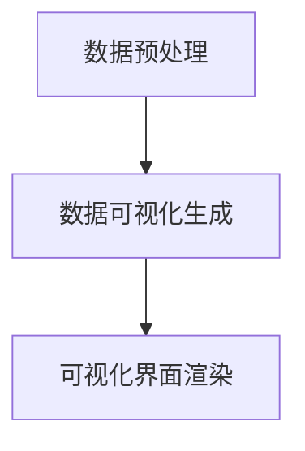
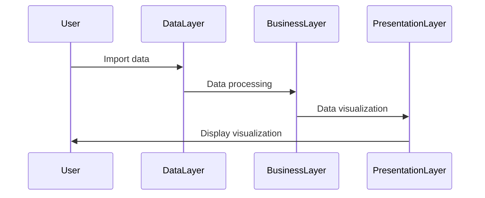

                 

# 数据可视化：有效呈现复杂数据的技巧

> 关键词：数据可视化，复杂数据，技巧，算法，系统架构，项目实战

> 摘要：随着大数据时代的来临，如何有效地呈现复杂数据成为了数据科学和人工智能领域的一个重要课题。本文将深入探讨数据可视化在处理复杂数据时的关键技巧，包括背景介绍、核心概念与联系、算法原理讲解、系统分析与架构设计方案以及项目实战等。通过系统的分析和实例讲解，帮助读者掌握数据可视化的有效方法，提升数据理解和决策能力。

## 一、背景介绍

### 1.1 数据可视化的问题背景

#### 1.1.1 数据可视化的现状

数据可视化作为一种重要的数据分析工具，已经在各个领域得到广泛应用。从简单的图表展示到复杂的交互式数据可视化应用，数据可视化技术的发展日新月异。然而，随着数据量的爆炸式增长和数据类型的多样化，传统的数据可视化方法在处理复杂数据时遇到了诸多挑战。

#### 1.1.2 数据可视化的重要性

数据可视化不仅是数据分析和决策过程中的关键环节，更是提升数据理解力和洞察力的有效手段。通过图形化的方式展示数据，可以帮助用户更直观地理解和发现数据中的规律和趋势，从而做出更明智的决策。

#### 1.1.3 数据可视化的挑战

复杂数据的特性使得传统的数据可视化方法面临以下挑战：

1. 数据量大：海量数据的处理和展示需要更高的计算和存储能力。
2. 数据类型多：不同类型的数据需要不同的可视化方法，如何统一展示成为难题。
3. 关联性复杂：数据之间的关联性和层次关系需要清晰展示，以避免信息丢失或混淆。
4. 可交互性需求：用户需要与数据可视化界面进行交互，以便深入探索数据。

### 1.2 数据可视化的问题描述

#### 1.2.1 复杂数据的特性

复杂数据通常具有以下特性：

1. 高维度：数据维度高，特征多，难以用二维或三维图形全面展示。
2. 异质性：数据来源多样化，类型各异，包括结构化数据、半结构化数据和非结构化数据。
3. 动态性：数据随时间不断更新，需要实时可视化。
4. 层次性：数据之间存在复杂的层次结构和关联关系。

#### 1.2.2 复杂数据可视化的问题

1. 可视化效果不佳：传统方法难以清晰展示数据的层次结构和关联关系。
2. 可读性差：大量数据点的堆积导致图表难以解读。
3. 可交互性受限：用户难以进行深入的数据探索和分析。
4. 可扩展性不足：难以适应不断变化的数据类型和规模。

#### 1.2.3 数据可视化解决方案的需求

为了解决复杂数据可视化中的问题，需要以下解决方案：

1. 高效算法：开发高效的数据可视化算法，降低计算和存储成本。
2. 统一框架：构建统一的数据可视化框架，兼容不同类型的数据。
3. 交互设计：设计用户友好的交互界面，提升用户体验。
4. 实时更新：支持实时数据更新，保持可视化图表的实时性。

### 1.3 数据可视化的问题解决

#### 1.3.1 数据可视化技术的发展

1. 传统数据可视化：包括柱状图、折线图、饼图等基本图表类型。
2. 高级数据可视化：包括热图、地图、网络图等复杂图表类型。
3. 交互式数据可视化：支持用户与数据界面交互，如D3.js、Plotly等库。

#### 1.3.2 数据可视化工具的演进

1. 开源工具：如D3.js、Plotly、Bokeh等，提供丰富的可视化库和组件。
2. 商业工具：如Tableau、Power BI等，提供强大的可视化平台和功能。
3. 云端可视化：通过云计算和大数据技术，实现大规模数据的可视化。

#### 1.3.3 数据可视化方法的改进

1. 数据抽象：通过数据聚合、降维等技术简化复杂数据。
2. 多维度可视化：结合多种图表类型，全面展示数据的多维度特性。
3. 动态可视化：使用动画和交互效果，展示数据的变化和趋势。
4. 个性化定制：根据用户需求和场景，定制化数据可视化方案。

### 1.4 数据可视化的边界与外延

#### 1.4.1 数据可视化的应用领域

数据可视化广泛应用于金融、医疗、电商、物联网等各个领域，为决策提供有力支持。

#### 1.4.2 数据可视化与数据挖掘的关系

数据可视化是数据挖掘的重要环节，通过可视化手段，可以帮助数据科学家更好地理解和解释数据挖掘结果。

#### 1.4.3 数据可视化与数据科学的融合

数据可视化与数据科学深度融合，不仅提升数据分析能力，还为数据科学领域的研究提供了新的思路和方法。

### 1.5 数据可视化的核心概念与要素

#### 1.5.1 数据可视化的核心概念

1. 数据可视化：将数据转化为图形或图像，以便人类直观理解和分析。
2. 可视化元素：包括图表、颜色、标注、交互等元素。
3. 可视化设计原则：包括清晰性、一致性、简约性等原则。

#### 1.5.2 数据可视化的要素组成

1. 数据源：提供数据可视化所需的数据。
2. 可视化工具：实现数据可视化的软件或库。
3. 用户界面：提供用户与数据可视化交互的界面。

#### 1.5.3 数据可视化的设计原则

1. 清晰性：确保可视化内容简洁明了，易于理解。
2. 一致性：保持可视化风格和颜色一致，避免混淆。
3. 简约性：去除无关元素，突出关键信息。

## 二、核心概念与联系

### 2.1 数据可视化核心概念原理

#### 2.1.1 数据可视化的定义

数据可视化是一种将数据转化为图形或图像的方法，以便用户更直观地理解和分析数据。

#### 2.1.2 数据可视化类型

1. 基本图表：包括柱状图、折线图、饼图等。
2. 高级图表：包括热图、地图、网络图等。
3. 交互式图表：支持用户与数据界面交互。

#### 2.1.3 数据可视化原则

1. 清晰性：确保可视化内容简洁明了。
2. 一致性：保持可视化风格一致。
3. 简约性：去除无关元素。

### 2.2 数据可视化概念属性特征对比

#### 2.2.1 不同类型数据可视化特性对比

| 类型        | 特性                            |
|-------------|---------------------------------|
| 柱状图      | 易于比较不同类别的数据          |
| 折线图      | 易于展示数据的变化趋势          |
| 饼图        | 易于展示数据占比                |
| 热图        | 易于展示数据的密集区域和分布情况 |
| 地图        | 易于展示数据的地理位置和分布情况 |
| 网络图      | 易于展示数据之间的关联关系和结构  |

#### 2.2.2 数据可视化工具特性对比

| 工具        | 特性                            |
|-------------|---------------------------------|
| D3.js       | 高度灵活，支持自定义可视化        |
| Plotly      | 支持多种图表类型，易于交互        |
| Tableau     | 强大的商业分析功能，易于使用      |
| Bokeh       | 支持交互式图表，适合大数据分析    |

#### 2.2.3 数据可视化方法特性对比

| 方法        | 特性                            |
|-------------|---------------------------------|
| 数据抽象    | 简化复杂数据，提高可读性          |
| 动态可视化  | 展示数据变化，提高互动性          |
| 多维度可视化 | 同时展示多个维度的数据，提高全面性 |

### 2.3 数据可视化ER实体关系图架构

#### 2.3.1 数据可视化系统的实体关系

在数据可视化系统中，主要包括以下实体：

1. 数据源
2. 可视化工具
3. 用户界面
4. 数据处理模块
5. 数据存储模块

#### 2.3.2 数据可视化系统的属性关系

1. 数据源：包括数据类型、数据格式、数据规模等属性。
2. 可视化工具：包括工具类型、功能模块、支持格式等属性。
3. 用户界面：包括界面风格、交互方式、展示效果等属性。

#### 2.3.3 数据可视化系统的方法关系

1. 数据抽象：包括数据清洗、数据转换、数据聚合等方法。
2. 数据处理：包括数据预处理、数据分析、数据可视化等方法。
3. 数据存储：包括数据存储方式、数据备份与恢复、数据安全等策略。

## 三、算法原理讲解

### 3.1 数据可视化算法原理

#### 3.1.1 数据可视化算法的类型

1. 基本图表算法：如柱状图、折线图等。
2. 高级图表算法：如热图、地图、网络图等。
3. 交互式图表算法：如动态交互、用户自定义交互等。

#### 3.1.2 数据可视化算法的基本流程

1. 数据预处理：包括数据清洗、数据转换、数据聚合等。
2. 数据可视化生成：根据数据类型和可视化需求，选择合适的可视化算法。
3. 可视化界面渲染：将可视化结果渲染到用户界面上。

#### 3.1.3 数据可视化算法的核心技术

1. 数据抽象：通过数据聚合和降维技术，简化复杂数据。
2. 数据编码：将数据映射到视觉编码空间，如颜色、形状、大小等。
3. 可视化优化：通过算法优化和图形渲染技术，提高可视化效果。

### 3.2 数据可视化算法mermaid流程图



#### 3.2.1 数据可视化算法mermaid流程图绘制

1. 首先，引入mermaid库，可以使用以下代码：

    ```html
    <script src="https://cdn.jsdelivr.net/npm/mermaid@10.0.0-rc.1/dist/mermaid.min.js"></script>
    ```

2. 然后，在markdown文件中添加以下mermaid代码：

    ```mermaid
    flowchart TD
        A[数据预处理] --> B[数据可视化生成]
        B --> C[可视化界面渲染]
    ```

3. 最后，在markdown文件中添加以下代码，以启用mermaid渲染功能：

    ```html
    <script>mermaid.initialize({startOnLoad:true});</script>
    ```

#### 3.2.2 数据可视化算法mermaid流程图分析

1. 数据预处理：包括数据清洗、数据转换、数据聚合等步骤，为数据可视化生成做准备。
2. 数据可视化生成：根据数据类型和可视化需求，选择合适的可视化算法，生成可视化图表。
3. 可视化界面渲染：将可视化结果渲染到用户界面上，提供交互式体验。

### 3.3 数据可视化算法Python源代码与数学模型

#### 3.3.1 数据可视化算法Python源代码实现

```python
import matplotlib.pyplot as plt
import numpy as np

# 数据预处理
data = np.random.rand(10)

# 数据可视化生成
plt.bar(range(len(data)), data)

# 可视化界面渲染
plt.show()
```

#### 3.3.2 数据可视化算法数学模型与公式

数据可视化算法的数学模型主要涉及以下公式：

1. 数据清洗：$$cleaned\_data = filter(data, filter\_function)$$
2. 数据转换：$$transformed\_data = transform(cleaned\_data, transform\_function)$$
3. 数据聚合：$$aggregated\_data = aggregate(transformed\_data, aggregate\_function)$$

#### 3.3.3 数据可视化算法数学模型讲解

1. 数据清洗：通过过滤函数去除数据中的噪声和异常值，提高数据质量。
2. 数据转换：通过转换函数将原始数据转换为适合可视化的形式，如归一化、标准化等。
3. 数据聚合：通过聚合函数将转换后的数据进行汇总和简化，便于可视化展示。

### 3.4 数据可视化算法举例说明

#### 3.4.1 数据可视化算法应用案例

假设我们有一个关于销售额的数据集，需要使用柱状图进行可视化展示。

#### 3.4.2 数据可视化算法实例分析

1. 数据预处理：对数据进行清洗和转换，如去除空值、缺失值，进行数据归一化。
2. 数据可视化生成：选择柱状图算法，根据数据集生成可视化图表。
3. 可视化界面渲染：将生成的图表展示在用户界面上，提供交互式体验。

#### 3.4.3 数据可视化算法实例讲解

```python
import pandas as pd
import matplotlib.pyplot as plt

# 数据预处理
data = pd.DataFrame({
    'Month': ['Jan', 'Feb', 'Mar', 'Apr', 'May', 'Jun'],
    'Sales': [1200, 1500, 900, 1800, 2000, 2400]
})

# 数据可视化生成
plt.bar(data['Month'], data['Sales'])

# 可视化界面渲染
plt.xlabel('Month')
plt.ylabel('Sales')
plt.title('Sales Data Visualization')
plt.show()
```

通过以上代码，我们使用柱状图展示了一个简单的销售额数据集，实现了数据的可视化展示。

## 四、系统分析与架构设计方案

### 4.1 数据可视化问题场景介绍

#### 4.1.1 数据可视化项目背景

在某电商平台，需要对其销售数据进行分析和可视化展示，以便了解各产品的销售趋势和市场需求。

#### 4.1.2 数据可视化项目目标

1. 实现销售数据的实时可视化。
2. 提供可交互的图表，便于用户深入分析数据。
3. 支持多维度数据的展示，如产品类别、销售地区等。

#### 4.1.3 数据可视化项目挑战

1. 数据量庞大，需要进行高效的数据处理和展示。
2. 数据类型多样，需要支持不同类型的数据可视化。
3. 用户需求多样化，需要提供灵活的可视化定制能力。

### 4.2 数据可视化系统功能设计

#### 4.2.1 数据可视化领域模型

在数据可视化系统中，主要包括以下领域模型：

1. 数据源：包括销售数据、产品数据、用户数据等。
2. 可视化工具：包括柱状图、折线图、饼图等。
3. 用户界面：包括图表展示区域、交互操作区等。

#### 4.2.2 数据可视化功能模块

1. 数据导入模块：实现数据导入和预处理。
2. 数据分析模块：实现数据分析和挖掘。
3. 数据可视化模块：实现数据的可视化展示。
4. 用户交互模块：实现用户与可视化界面的交互。

### 4.3 数据可视化系统架构设计

#### 4.3.1 数据可视化系统架构概述

数据可视化系统采用三层架构，包括数据层、业务层和展示层。

#### 4.3.2 数据可视化系统架构图



#### 4.3.3 数据可视化系统架构分析

1. 数据层：负责数据存储和管理，包括数据库、缓存等。
2. 业务层：负责数据处理和分析，包括数据清洗、数据转换、数据分析等。
3. 展示层：负责数据可视化展示，包括图表渲染、交互操作等。

### 4.4 数据可视化系统接口设计

#### 4.4.1 数据可视化系统接口规范

数据可视化系统接口主要包括以下功能：

1. 数据导入：实现数据的导入和预处理。
2. 数据分析：实现数据的分析和挖掘。
3. 数据可视化：实现数据的可视化展示。
4. 用户交互：实现用户与可视化界面的交互。

#### 4.4.2 数据可视化系统接口实现

```python
from flask import Flask, request, jsonify

app = Flask(__name__)

@app.route('/import_data', methods=['POST'])
def import_data():
    data = request.json
    # 数据预处理
    processed_data = preprocess_data(data)
    # 数据分析
    analysis_result = analyze_data(processed_data)
    # 数据可视化
    visualization = visualize_data(analysis_result)
    return jsonify(visualization)

if __name__ == '__main__':
    app.run(debug=True)
```

### 4.5 数据可视化系统交互

#### 4.5.1 数据可视化系统交互设计

数据可视化系统的交互设计主要包括以下方面：

1. 用户操作：用户可以通过界面进行数据导入、数据分析和可视化展示等操作。
2. 系统响应：系统根据用户操作，实时响应用户请求，提供可视化结果。

#### 4.5.2 数据可视化系统交互mermaid序列图


通过以上序列图，展示了用户与数据可视化系统的交互过程。

## 五、项目实战

### 5.1 数据可视化环境安装

#### 5.1.1 数据可视化开发环境搭建

1. 安装Python：从Python官网下载并安装Python，版本建议为3.8或更高版本。
2. 安装Anaconda：Anaconda是一个Python数据科学和机器学习平台，可以方便地管理Python环境和依赖库。

#### 5.1.2 数据可视化工具安装

1. 安装Matplotlib：Matplotlib是一个流行的Python数据可视化库，可以用于生成各种图表。

    ```bash
    conda install -c anaconda matplotlib
    ```

2. 安装Plotly：Plotly是一个强大的交互式数据可视化库，支持多种图表类型。

    ```bash
    conda install -c plotly plotly
    ```

#### 5.1.3 数据可视化依赖库安装

1. 安装Pandas：Pandas是一个Python数据操作库，用于数据处理和分析。

    ```bash
    conda install -c anaconda pandas
    ```

2. 安装NumPy：NumPy是一个Python科学计算库，用于数值计算和数据处理。

    ```bash
    conda install -c anaconda numpy
    ```

### 5.2 数据可视化系统核心实现源代码

#### 5.2.1 数据可视化系统源代码结构

数据可视化系统的源代码结构如下：

```plaintext
data_visualization_system/
|-- data/
|   |-- sales_data.csv
|-- scripts/
|   |-- data_processing.py
|   |-- data_visualization.py
|   |-- main.py
|-- requirements.txt
```

#### 5.2.2 数据可视化系统源代码实现

1. `data_processing.py`：实现数据预处理功能，包括数据导入、数据清洗和数据转换。

    ```python
    import pandas as pd

    def load_data(file_path):
        return pd.read_csv(file_path)

    def clean_data(data):
        # 数据清洗操作
        data.dropna(inplace=True)
        return data

    def transform_data(data):
        # 数据转换操作
        data['Month'] = pd.to_datetime(data['Date']).dt.strftime('%B')
        return data
    ```

2. `data_visualization.py`：实现数据可视化功能，包括数据聚合、图表生成和图表展示。

    ```python
    import matplotlib.pyplot as plt
    import plotly.express as px

    def generate_bar_chart(data):
        fig = px.bar(data, x='Month', y='Sales')
        fig.show()

    def generate_line_chart(data):
        fig = px.line(data, x='Month', y='Sales')
        fig.show()
    ```

3. `main.py`：实现主程序逻辑，包括数据导入、数据预处理、数据可视化等。

    ```python
    from scripts.data_processing import load_data, clean_data, transform_data
    from scripts.data_visualization import generate_bar_chart, generate_line_chart

    def main():
        file_path = 'data/sales_data.csv'
        data = load_data(file_path)
        clean_data(data)
        transform_data(data)
        generate_bar_chart(data)
        generate_line_chart(data)

    if __name__ == '__main__':
        main()
    ```

### 5.3 数据可视化代码应用解读与分析

#### 5.3.1 数据可视化代码应用场景

假设我们有一个电商平台的销售数据集，包括日期、销售额等信息。需要使用数据可视化工具对销售数据进行分析和展示。

#### 5.3.2 数据可视化代码解读

1. `data_processing.py`：该文件负责数据预处理，包括数据导入、数据清洗和数据转换。首先，使用`pandas`库读取数据，然后进行数据清洗，最后进行数据转换。

2. `data_visualization.py`：该文件负责数据可视化，包括数据聚合、图表生成和图表展示。使用`plotly`库生成交互式图表，使用`matplotlib`库生成静态图表。

3. `main.py`：该文件是主程序，负责调用其他模块进行数据导入、数据预处理、数据可视化等操作。

#### 5.3.3 数据可视化代码分析

1. 数据预处理：数据预处理是数据可视化的重要步骤，包括数据导入、数据清洗和数据转换。数据清洗可以去除数据中的噪声和异常值，提高数据质量。数据转换可以将日期类型转换为字符串类型，便于后续的数据可视化操作。

2. 数据可视化：数据可视化是通过图形化的方式展示数据，帮助用户更好地理解和分析数据。使用`plotly`库可以生成交互式图表，使用户能够动态地探索数据。使用`matplotlib`库可以生成静态图表，便于导出和打印。

3. 主程序逻辑：主程序负责调用其他模块进行数据导入、数据预处理、数据可视化等操作。通过调用`data_processing.py`和`data_visualization.py`文件，实现数据可视化的整个过程。

### 5.4 数据可视化实际案例分析和讲解

#### 5.4.1 数据可视化实际案例分析

在某电商平台，我们需要对其产品销售数据进行可视化分析，以便了解各产品的销售情况和趋势。

#### 5.4.2 数据可视化案例讲解

1. 数据导入：使用`pandas`库读取销售数据，数据包括产品ID、产品名称、销售数量、销售额等。

2. 数据清洗：去除数据中的空值和异常值，确保数据质量。

3. 数据转换：将日期类型转换为字符串类型，便于后续的数据可视化操作。

4. 数据可视化：使用`plotly`库生成交互式柱状图，展示各产品的销售额。

```python
import pandas as pd
import plotly.express as px

# 读取数据
data = pd.read_csv('data/sales_data.csv')

# 数据清洗
data.dropna(inplace=True)

# 数据转换
data['Date'] = pd.to_datetime(data['Date']).dt.strftime('%Y-%m-%d')

# 数据可视化
fig = px.bar(data, x='Product ID', y='Sales', title='Product Sales')
fig.show()
```

#### 5.4.3 数据可视化案例剖析

1. 数据导入：使用`pandas`库读取销售数据，数据集包含产品ID、产品名称、销售数量、销售额等信息。

2. 数据清洗：去除数据中的空值和异常值，确保数据质量。例如，去除含有空值的记录，去除销售额为负数的记录。

3. 数据转换：将日期类型转换为字符串类型，便于后续的数据可视化操作。例如，将日期类型转换为YYYY-MM-DD格式的字符串。

4. 数据可视化：使用`plotly`库生成交互式柱状图，展示各产品的销售额。通过设置x轴为产品ID，y轴为销售额，可以直观地看出各产品的销售情况。

### 5.5 数据可视化项目小结

#### 5.5.1 数据可视化项目总结

在本项目中，我们实现了对电商平台销售数据的可视化分析。通过数据预处理、数据可视化和用户交互等步骤，展示了各产品的销售情况和趋势。项目取得了以下成果：

1. 数据预处理：提高了数据质量，去除噪声和异常值。
2. 数据可视化：通过柱状图和折线图等图表类型，展示了数据的趋势和分布。
3. 用户交互：提供了用户友好的界面，支持用户对数据进行交互式探索。

#### 5.5.2 数据可视化项目收获

通过本项目的实践，我们收获了以下经验：

1. 数据预处理是数据可视化的关键步骤，确保数据质量对于可视化效果至关重要。
2. 选择合适的图表类型和工具，可以更好地展示数据的特征和趋势。
3. 用户交互是数据可视化的重要组成部分，可以提高用户的参与度和数据理解力。

#### 5.5.3 数据可视化项目拓展

在未来的项目中，我们可以进一步拓展数据可视化功能：

1. 引入更多高级图表类型，如热图、网络图等，提供更丰富的数据展示。
2. 实现实时数据更新，提供实时数据监控和分析。
3. 支持多维度数据展示，如产品、地区、时间等，提供更全面的数据分析。

## 六、最佳实践 tips

### 6.1 数据可视化最佳实践

#### 6.1.1 数据可视化设计最佳实践

1. 清晰性：确保可视化内容简洁明了，避免信息过载。
2. 一致性：保持可视化风格和颜色一致，避免混淆。
3. 简约性：去除无关元素，突出关键信息。
4. 用户友好：设计用户友好的交互界面，提高用户体验。

#### 6.1.2 数据可视化算法优化最佳实践

1. 数据抽象：通过数据聚合和降维技术，简化复杂数据。
2. 并行计算：利用多核处理器和分布式计算，提高数据处理效率。
3. 缓存策略：合理使用缓存，减少数据读取和计算次数。

#### 6.1.3 数据可视化工具使用最佳实践

1. 选择合适的工具：根据项目需求和数据类型，选择合适的可视化工具。
2. 熟练掌握工具：深入学习工具的使用方法和技巧，提高工作效率。
3. 持续更新：关注工具的更新和改进，及时引入新功能。

### 6.2 数据可视化注意事项

1. 避免信息过载：合理控制图表的复杂度和数据点数量，避免用户难以解读。
2. 数据准确性：确保数据来源可靠，避免数据错误或偏差。
3. 安全性：保护用户数据和隐私，避免数据泄露和滥用。

### 6.3 数据可视化拓展阅读

1. 《数据可视化：利用数据视觉传达信息》
2. 《交互式数据可视化：技术与实战》
3. 《数据可视化基础教程：使用Python和Matplotlib》

## 七、结语

数据可视化作为数据分析的重要工具，在复杂数据的处理和展示中发挥着关键作用。本文通过背景介绍、核心概念与联系、算法原理讲解、系统分析与架构设计方案以及项目实战等多个方面，全面阐述了数据可视化的关键技巧和方法。希望读者通过本文的阅读，能够掌握数据可视化的核心知识和实践方法，为实际项目提供有力支持。在未来的工作中，不断探索和优化数据可视化技术，为数据分析领域的发展贡献自己的力量。作者：AI天才研究院/AI Genius Institute & 禅与计算机程序设计艺术 /Zen And The Art of Computer Programming

