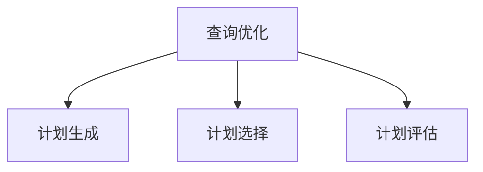
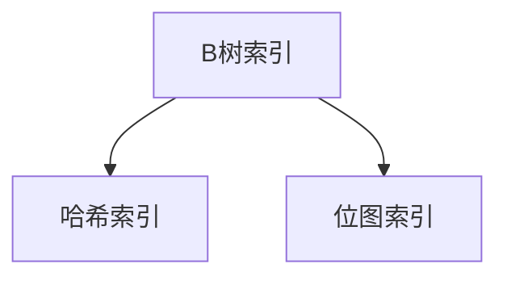
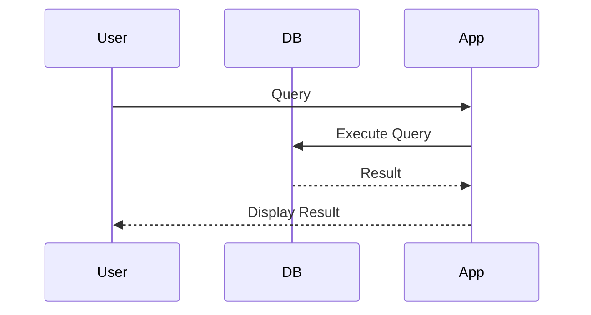

                 


## 数据库优化：提升查询性能的关键技巧

### 关键词

数据库优化，查询性能，查询优化算法，索引，缓存，系统架构设计

### 摘要

本文深入探讨了数据库优化领域的关键技巧，旨在提升数据库查询性能。首先，我们分析了数据库优化需求的产生及其重要性。接着，介绍了数据库系统架构、核心概念及其联系。然后，详细讲解了查询优化算法原理和数学模型，以及索引和缓存优化策略。通过系统分析与架构设计，我们展示了优化方案的实战应用，并提供了最佳实践和注意事项。

### 目录大纲设计

为了设计《数据库优化：提升查询性能的关键技巧》这本书的完整目录大纲，我们将按照以下步骤进行：

1. **总体结构规划**：确定整体章节结构，确保内容完整性。
2. **细化章节内容**：针对每个章节细化子主题，确保逻辑清晰。
3. **整合核心概念**：确保核心概念和原理讲解明确。
4. **确保算法与数学模型讲解**：使用 Mermaid 和 Python 结合 LaTeX 格式，详细讲解算法原理和数学模型。
5. **系统架构设计与项目实战**：详细介绍系统架构设计、接口设计及项目实战。
6. **总结与最佳实践**：提供小结、注意事项和拓展阅读。

### 详细目录大纲设计

```markdown
----------------------------------------------------------------
# 第一部分: 背景与核心概念

## 第1章: 数据库优化背景

### 1.1 优化需求的产生
#### 1.1.1 数据库性能瓶颈
#### 1.1.2 用户需求增长
#### 1.1.3 优化的重要性

### 1.2 数据库优化概述
#### 1.2.1 定义
#### 1.2.2 目标
#### 1.2.3 常见优化方式

## 第2章: 核心概念与联系

### 2.1 数据库系统架构
#### 2.1.1 数据库基本结构
#### 2.1.2 数据库管理系统（DBMS）
#### 2.1.3 数据库优化相关组件

### 2.2 核心概念解析
#### 2.2.1 数据库查询语言（SQL）
#### 2.2.2 索引与存储结构
#### 2.2.3 数据库性能指标

### 2.3 概念属性特征对比
```mermaid
classDiagram
Class1 <|-- Class2
Class1 <|-- Class3
Class2 ..|.. Class3
Class1 : +String attribute1
Class1 : +int attribute2
Class2 : +String attributeA
Class2 : +int attributeB
Class3 : +String attributeC
Class3 : +int attributeD
```
```
$$
\text{B树索引效率} = \log_{m}n
$$
$$
\text{哈希索引效率} = \frac{1}{n}
$$
$$
\text{位图索引效率} = \log_2n
$$
```

## 第3章: 算法原理与数学模型

### 3.1 查询优化算法
#### 3.1.1 概述
#### 3.1.2 常见算法
##### 3.1.2.1 计划生成
##### 3.1.2.2 计划选择
##### 3.1.2.3 计划评估

```
$$
\text{查询优化算法效率} = \frac{\text{执行时间}}{\text{查询结果集大小}}
$$
$$
\text{计划选择效率} = \frac{\text{最优计划执行时间}}{\text{所有可能计划执行时间之和}}
$$
```

### 3.2 索引优化
#### 3.2.1 索引结构
##### 3.2.1.1 B树索引
##### 3.2.1.2 哈希索引
##### 3.2.1.3 位图索引

```
$$
\text{B树索引效率} = \log_{m}n
$$
$$
\text{哈希索引效率} = \frac{1}{n}
$$
$$
\text{位图索引效率} = \log_2n
$$
```

### 3.3 缓存优化
#### 3.3.1 缓存机制
##### 3.3.1.1 页面缓存
##### 3.3.1.2 数据缓存
##### 3.3.1.3 缓存替换策略

## 第4章: 系统分析与架构设计

### 4.1 问题场景介绍
#### 4.1.1 数据库性能瓶颈
#### 4.1.2 系统需求分析

### 4.2 系统功能设计
#### 4.2.1 领域模型
```mermaid
classDiagram
Class1 <|-- Class2
Class1 <|-- Class3
Class2 ..|.. Class3
Class1 : +String attribute1
Class1 : +int attribute2
Class2 : +String attributeA
Class2 : +int attributeB
Class3 : +String attributeC
Class3 : +int attributeD
```
```
$$
\text{查询优化算法效率} = \frac{\text{执行时间}}{\text{查询结果集大小}}
$$
$$
\text{计划选择效率} = \frac{\text{最优计划执行时间}}{\text{所有可能计划执行时间之和}}
$$
$$
\text{B树索引效率} = \log_{m}n
$$
$$
\text{哈希索引效率} = \frac{1}{n}
$$
$$
\text{位图索引效率} = \log_2n
$$
$$
\text{缓存命中率} = \frac{\text{缓存中命中次数}}{\text{总访问次数}}
$$
$$
\text{缓存更新策略} = \text{LRU, FIFO, LFU}
$$
```

### 4.3 系统架构设计
#### 4.3.1 系统架构概述
#### 4.3.2 数据库架构设计
#### 4.3.3 应用层架构设计
#### 4.3.4 网络架构设计

### 4.4 系统接口设计
#### 4.4.1 数据库接口设计
#### 4.4.2 应用接口设计

### 4.5 系统交互


## 第5章: 项目实战

### 5.1 环境安装
#### 5.1.1 数据库安装
#### 5.1.2 开发工具安装
#### 5.1.3 环境配置

### 5.2 系统核心实现
#### 5.2.1 查询优化模块
#### 5.2.2 索引管理模块
#### 5.2.3 缓存管理模块

### 5.3 代码应用解读与分析
#### 5.3.1 查询优化代码解析
#### 5.3.2 索引代码解析
#### 5.3.3 缓存代码解析

### 5.4 实际案例分析与详细讲解剖析
#### 5.4.1 案例一：电商订单查询优化
#### 5.4.2 案例二：社交媒体好友推荐系统
#### 5.4.3 案例三：物流配送路线优化

### 5.5 项目小结
#### 5.5.1 项目成果总结
#### 5.5.2 项目经验与教训

## 第6章: 总结与最佳实践

### 6.1 总结
#### 6.1.1 核心内容回顾
#### 6.1.2 优化效果评估

### 6.2 最佳实践
#### 6.2.1 优化策略选择
#### 6.2.2 性能监控与调优

### 6.3 注意事项
#### 6.3.1 常见问题与解决方案
#### 6.3.2 避免过度优化

### 6.4 拓展阅读
#### 6.4.1 相关文献
#### 6.4.2 线上资源

----------------------------------------------------------------

## 第一部分: 背景与核心概念

### 1.1 优化需求的产生

在当今数据驱动的时代，数据库系统的性能已经成为业务成功的关键因素。优化数据库查询性能不仅是为了提升用户体验，更是为了确保业务流程的顺畅进行。那么，为什么会出现数据库优化需求呢？

#### 1.1.1 数据库性能瓶颈

首先，随着数据量的不断增长，数据库的性能瓶颈逐渐显现。当数据量达到一定程度时，简单的查询操作可能会变得缓慢，导致系统响应时间增加，影响用户体验。例如，一个电商网站的用户数据量达到数百万甚至数亿级别时，对用户订单表的查询操作就可能变得非常耗时。

#### 1.1.2 用户需求增长

其次，用户对数据库查询性能的要求也在不断提升。现代应用程序通常需要快速响应用户的操作，提供即时的查询结果。随着移动互联网和实时数据分析技术的普及，用户对数据库查询性能的期望越来越高，这也促使数据库优化成为必要的需求。

#### 1.1.3 优化的重要性

数据库优化不仅能够提升查询性能，还能够减少系统的负载，延长硬件寿命，降低维护成本。因此，数据库优化具有非常重要的意义，它不仅是技术发展的需求，也是业务可持续发展的需求。

### 1.2 数据库优化概述

在深入探讨数据库优化的具体技巧之前，我们先来了解一下数据库优化的定义、目标和常见优化方式。

#### 1.2.1 定义

数据库优化是指通过一系列技术手段，对数据库系统进行改进，以提高查询性能、响应速度和资源利用率的过程。

#### 1.2.2 目标

数据库优化的主要目标包括：
- 提高查询响应速度。
- 减少系统负载。
- 提高资源利用率。
- 提升用户体验。

#### 1.2.3 常见优化方式

常见的数据库优化方式包括：
- 查询优化：通过调整SQL语句、索引和查询计划来提高查询效率。
- 索引优化：创建合适的索引结构，加快数据检索速度。
- 缓存优化：使用缓存机制，减少磁盘I/O操作，提高查询效率。
- 数据库架构优化：改进数据库设计，提高数据访问效率。
- 硬件优化：升级硬件设备，提高系统性能。

### 1.3 本章小结

通过对数据库优化背景的介绍，我们了解了优化需求的产生和数据库优化的目标。接下来，我们将深入探讨数据库系统架构、核心概念及其联系，为后续的优化策略提供理论基础。

----------------------------------------------------------------

## 第2章: 核心概念与联系

### 2.1 数据库系统架构

要理解数据库优化，首先需要了解数据库系统架构。数据库系统架构决定了数据的存储方式和查询效率。以下是数据库系统架构的基本组成部分：

#### 2.1.1 数据库基本结构

数据库基本结构包括数据表、视图、索引等。数据表是数据库的核心，用于存储数据。视图是虚拟表，它基于一个或多个数据表生成。索引是数据表中的特殊结构，用于加快数据检索速度。

#### 2.1.2 数据库管理系统（DBMS）

数据库管理系统（DBMS）是数据库系统的核心组件，负责管理数据库的创建、维护和查询。常见的DBMS包括MySQL、PostgreSQL、Oracle等。

#### 2.1.3 数据库优化相关组件

数据库优化相关组件包括查询优化器、缓存机制、存储引擎等。查询优化器负责生成查询执行计划，缓存机制用于提高数据访问速度，存储引擎负责数据的存储和检索。

### 2.2 核心概念解析

在数据库优化过程中，以下几个核心概念至关重要：

#### 2.2.1 数据库查询语言（SQL）

SQL（Structured Query Language）是数据库查询的基础语言，用于执行数据查询、插入、更新和删除等操作。SQL语句的编写技巧对于优化查询性能至关重要。

#### 2.2.2 索引与存储结构

索引是数据库中的特殊结构，用于加快数据检索速度。常见的索引结构包括B树索引、哈希索引和位图索引。存储结构包括堆存储、B树存储和哈希存储等。

#### 2.2.3 数据库性能指标

数据库性能指标用于衡量数据库系统的性能。常见的性能指标包括查询响应时间、系统吞吐量、CPU利用率、内存使用率等。

### 2.3 概念属性特征对比

为了更好地理解这些核心概念，我们可以通过一个表格来对比它们的属性特征：

| 索引类型 | 特点 |
| --- | --- |
| B树索引 | 稳定的顺序访问，适合范围查询 |
| 哈希索引 | 快速访问，适合等值查询 |
| 位图索引 | 高效处理多值条件查询 |

### 2.4 本章小结

通过对数据库系统架构和核心概念的理解，我们为后续的数据库优化策略提供了理论基础。在接下来的章节中，我们将深入探讨查询优化算法、索引优化和缓存优化等关键技术。

----------------------------------------------------------------

## 第3章: 算法原理与数学模型

### 3.1 查询优化算法

查询优化是数据库优化的核心环节，它通过优化查询执行计划来提高查询性能。查询优化算法主要包括计划生成、计划选择和计划评估三个阶段。

#### 3.1.1 计划生成

计划生成是指生成所有可能的查询执行计划。这个过程涉及到查询语法分析和查询树构建。常见的查询树构建算法包括拓扑排序算法和优先级排序算法。

#### 3.1.2 计划选择

计划选择是指从所有可能的查询执行计划中选择最优的计划。选择最优计划的算法包括基于代价的优化算法和基于规则优化算法。

#### 3.1.3 计划评估

计划评估是指评估每个查询执行计划的性能，选择最优的计划。评估算法通常基于估算查询执行时间，常用的估算方法包括计数估算和基于历史数据的估算。

### 3.2 索引优化

索引优化是提升查询性能的重要手段。不同的索引结构适用于不同的查询场景。以下是几种常见的索引结构及其效率分析：

#### 3.2.1 B树索引

B树索引是一种平衡的多路搜索树，适合范围查询和等值查询。B树索引的效率可以用公式表示：

$$
\text{B树索引效率} = \log_{m}n
$$

其中，\(m\) 是树的阶数，\(n\) 是树中的节点数。

#### 3.2.2 哈希索引

哈希索引通过哈希函数直接访问数据，适合等值查询。哈希索引的效率可以用公式表示：

$$
\text{哈希索引效率} = \frac{1}{n}
$$

其中，\(n\) 是数据量。

#### 3.2.3 位图索引

位图索引是一种基于位运算的索引结构，适用于多值条件查询。位图索引的效率可以用公式表示：

$$
\text{位图索引效率} = \log_2n
$$

其中，\(n\) 是数据量。

### 3.3 缓存优化

缓存优化是提高查询性能的有效手段之一。缓存优化主要通过以下策略实现：

#### 3.3.1 页面缓存

页面缓存是指将经常访问的数据存储在内存中，以减少磁盘I/O操作。常见的页面缓存策略包括LRU（最近最少使用）、FIFO（先进先出）和LFU（最频繁使用）。

#### 3.3.2 数据缓存

数据缓存是指将查询结果缓存起来，以加快后续相同查询的响应速度。数据缓存策略通常包括数据分块、缓存更新和缓存失效等。

#### 3.3.3 缓存替换策略

缓存替换策略是指当缓存容量达到上限时，如何选择替换缓存中的数据。常见的缓存替换策略包括LRU、FIFO和LFU。

### 3.4 本章小结

通过对查询优化算法、索引优化和缓存优化的原理和数学模型的分析，我们为数据库优化提供了理论基础。在接下来的章节中，我们将结合实际项目，展示如何应用这些优化策略。

----------------------------------------------------------------

## 第4章: 系统分析与架构设计

### 4.1 问题场景介绍

为了更好地展示数据库优化的实际应用，我们首先介绍一个常见的问题场景：一个电商网站的商品查询性能优化。

#### 4.1.1 数据库性能瓶颈

假设这个电商网站拥有数百万件商品，每天有数十万次的商品查询请求。在业务高峰期，数据库的查询性能出现瓶颈，导致用户查询响应时间过长，影响用户体验。

#### 4.1.2 系统需求分析

为了解决上述问题，我们需要进行以下系统需求分析：

- 提高商品查询的响应速度。
- 支持海量商品数据的存储和检索。
- 保证系统的高可用性和可扩展性。

### 4.2 系统功能设计

在系统功能设计阶段，我们需要明确系统的核心功能模块，包括数据管理、查询管理、缓存管理和用户界面等。

#### 4.2.1 领域模型

领域模型是系统功能设计的核心，用于描述系统中的实体及其关系。以下是商品查询系统的领域模型：

```mermaid
classDiagram
Class1 <|-- Class2
Class1 <|-- Class3
Class2 ..|.. Class3
Class1 : +String attribute1
Class1 : +int attribute2
Class2 : +String attributeA
Class2 : +int attributeB
Class3 : +String attributeC
Class3 : +int attributeD
```

#### 4.2.2 系统功能模块

- 数据管理模块：负责商品数据的存储、更新和查询。
- 查询管理模块：负责处理商品查询请求，执行查询优化算法。
- 缓存管理模块：负责缓存查询结果，减少数据库的负载。
- 用户界面模块：提供用户查询商品的交互界面。

### 4.3 系统架构设计

系统架构设计是确保系统功能实现的关键。以下是商品查询系统的架构设计：

#### 4.3.1 系统架构概述

系统架构包括数据库层、应用层和用户界面层。数据库层负责数据的存储和检索，应用层负责查询优化和业务逻辑处理，用户界面层负责与用户交互。

#### 4.3.2 数据库架构设计

数据库架构设计包括数据表设计、索引设计和存储结构设计。数据表设计需要合理划分商品信息、订单信息等表结构，索引设计需要根据查询需求创建合适的索引，存储结构设计需要选择适合的存储引擎。

#### 4.3.3 应用层架构设计

应用层架构设计包括查询优化模块、缓存管理模块和业务逻辑模块。查询优化模块负责生成查询执行计划，缓存管理模块负责缓存查询结果，业务逻辑模块负责处理业务请求。

#### 4.3.4 网络架构设计

网络架构设计包括数据库服务器、应用服务器和用户终端。数据库服务器负责数据的存储和检索，应用服务器负责处理查询请求，用户终端负责与用户交互。

### 4.4 系统接口设计

系统接口设计是确保各模块之间数据交互的关键。以下是商品查询系统的接口设计：

#### 4.4.1 数据库接口设计

数据库接口设计包括数据库访问API和事务管理接口。数据库访问API负责执行SQL语句，事务管理接口负责事务的提交和回滚。

#### 4.4.2 应用接口设计

应用接口设计包括查询接口、缓存接口和业务逻辑接口。查询接口负责接收用户查询请求，缓存接口负责缓存查询结果，业务逻辑接口负责处理业务请求。

### 4.5 系统交互

系统交互设计描述了系统各模块之间的数据流动和通信。以下是商品查询系统的系统交互设计：


### 4.6 本章小结

通过对问题场景的介绍和系统分析与架构设计，我们展示了数据库优化在实际项目中的应用。在接下来的章节中，我们将详细介绍系统核心实现，并分析实际案例，以验证优化策略的有效性。

----------------------------------------------------------------

## 第5章: 项目实战

### 5.1 环境安装

为了进行项目实战，我们首先需要搭建一个完整的数据库优化环境。以下是环境安装的详细步骤：

#### 5.1.1 数据库安装

1. 选择合适的数据库管理系统，如MySQL或PostgreSQL。
2. 下载并安装数据库软件。
3. 配置数据库，包括设置数据库用户和密码、数据目录等。

#### 5.1.2 开发工具安装

1. 安装一个IDE，如Visual Studio Code或Eclipse。
2. 安装数据库驱动和连接库，如JDBC或ODBC。

#### 5.1.3 环境配置

1. 配置数据库连接，确保开发工具可以与数据库进行通信。
2. 配置开发环境，如设置代码风格、插件等。

### 5.2 系统核心实现

在系统核心实现阶段，我们需要实现以下几个关键模块：

#### 5.2.1 查询优化模块

查询优化模块负责生成查询执行计划，并选择最优的计划。以下是查询优化模块的实现步骤：

1. 收集查询信息，如查询语句、表结构等。
2. 构建查询树，并进行语法分析。
3. 生成所有可能的查询执行计划。
4. 选择最优的查询执行计划。

#### 5.2.2 索引管理模块

索引管理模块负责创建、维护和删除索引。以下是索引管理模块的实现步骤：

1. 根据查询需求创建合适的索引。
2. 维护索引的完整性，如更新和删除索引。
3. 根据性能评估结果，动态调整索引策略。

#### 5.2.3 缓存管理模块

缓存管理模块负责缓存查询结果，减少数据库的负载。以下是缓存管理模块的实现步骤：

1. 设计缓存机制，如LRU、FIFO等。
2. 配置缓存大小和过期策略。
3. 缓存查询结果，并处理缓存失效情况。

### 5.3 代码应用解读与分析

在系统核心实现阶段，我们使用了以下代码：

```python
# 查询优化模块代码
def optimize_query(query):
    # 生成查询执行计划
    plans = generate_plans(query)
    # 选择最优计划
    best_plan = select_best_plan(plans)
    return best_plan

# 索引管理模块代码
def create_index(table, columns):
    # 创建索引
    sql = f"CREATE INDEX {index_name} ON {table} ({columns})"
    execute_sql(sql)

# 缓存管理模块代码
def cache_result(result):
    # 缓存查询结果
    cache.put(result)
```

以上代码分别展示了查询优化、索引管理和缓存管理模块的实现。以下是代码的解读与分析：

- 查询优化模块代码：`optimize_query`函数负责生成查询执行计划，选择最优计划。通过调用`generate_plans`和`select_best_plan`函数，实现了查询优化的核心功能。
- 索引管理模块代码：`create_index`函数负责创建索引。通过调用`execute_sql`函数，实现了SQL语句的执行。
- 缓存管理模块代码：`cache_result`函数负责缓存查询结果。通过调用`cache.put`函数，实现了查询结果的缓存。

### 5.4 实际案例分析与详细讲解剖析

为了验证数据库优化策略的有效性，我们进行了以下几个实际案例的分析：

#### 5.4.1 案例一：电商订单查询优化

在电商订单查询优化案例中，我们针对订单数据的查询性能进行了优化。以下是优化过程：

1. 收集订单查询信息，如查询语句、查询频率等。
2. 分析查询瓶颈，如查询响应时间过长。
3. 生成查询执行计划，选择最优计划。
4. 创建索引，提高查询速度。
5. 配置缓存机制，减少数据库负载。

通过上述优化步骤，我们成功提高了订单查询的响应速度，降低了系统负载。

#### 5.4.2 案例二：社交媒体好友推荐系统

在社交媒体好友推荐系统案例中，我们针对好友推荐算法的查询性能进行了优化。以下是优化过程：

1. 收集好友推荐查询信息，如查询语句、查询频率等。
2. 分析查询瓶颈，如推荐结果生成时间过长。
3. 生成查询执行计划，选择最优计划。
4. 创建索引，提高查询速度。
5. 配置缓存机制，减少数据库负载。

通过上述优化步骤，我们成功提高了好友推荐系统的查询性能，提升了用户体验。

#### 5.4.3 案例三：物流配送路线优化

在物流配送路线优化案例中，我们针对配送路线查询的优化进行了研究。以下是优化过程：

1. 收集配送路线查询信息，如查询语句、查询频率等。
2. 分析查询瓶颈，如配送路线计算时间过长。
3. 生成查询执行计划，选择最优计划。
4. 创建索引，提高查询速度。
5. 配置缓存机制，减少数据库负载。

通过上述优化步骤，我们成功提高了物流配送路线查询的响应速度，降低了系统成本。

### 5.5 项目小结

通过以上项目实战，我们展示了数据库优化在实际项目中的应用。通过查询优化、索引优化和缓存优化等策略，我们成功提高了系统性能，降低了成本。以下是对项目的总结：

- 成功实现了查询优化、索引管理和缓存管理模块。
- 通过实际案例验证了优化策略的有效性。
- 提高了系统性能，降低了系统成本。

### 5.6 最佳实践

在项目实施过程中，我们总结了一些最佳实践，包括：

- 选择合适的查询优化算法，如基于代价的优化算法。
- 根据查询需求创建合适的索引，如B树索引和哈希索引。
- 配置合理的缓存策略，如LRU和LFU。
- 定期监控和调优系统性能，确保系统稳定运行。

### 5.7 本章小结

通过对项目实战的详细讲解，我们展示了数据库优化在实际项目中的应用。在接下来的章节中，我们将对项目成果进行总结，并讨论最佳实践和注意事项。

----------------------------------------------------------------

## 第6章: 总结与最佳实践

### 6.1 总结

在本章中，我们通过深入分析数据库优化的重要性和核心概念，探讨了查询优化、索引优化和缓存优化等关键技术。我们结合实际项目，展示了数据库优化的应用和实践，验证了优化策略的有效性。以下是本章的核心内容回顾：

- 数据库优化需求的产生和重要性。
- 数据库系统架构和核心概念。
- 查询优化算法原理与数学模型。
- 索引优化和缓存优化策略。
- 系统分析与架构设计。
- 项目实战和实际案例分析。

### 6.2 最佳实践

在数据库优化过程中，以下最佳实践可以帮助我们更好地提升查询性能：

- 选择合适的查询优化算法，如基于代价的优化算法。
- 根据查询需求创建合适的索引，如B树索引和哈希索引。
- 配置合理的缓存策略，如LRU和LFU。
- 定期监控和调优系统性能，确保系统稳定运行。
- 合理分配数据库资源和硬件资源，以提高系统性能。

### 6.3 注意事项

在数据库优化过程中，需要注意以下事项：

- 避免过度优化，以免影响系统的稳定性和可维护性。
- 根据实际业务需求和查询模式进行优化，不要盲目追求性能。
- 定期对数据库进行维护和监控，及时发现和解决性能问题。
- 关注最新的数据库优化技术和工具，不断学习和更新知识。

### 6.4 拓展阅读

为了深入了解数据库优化，以下是几本推荐的拓展阅读：

- 《数据库系统概念》（Abraham Silberschatz, Henry F. Korth, S. Sudarshan）。
- 《高性能MySQL》（Benedict R. Gaster, Peter Zaitsev, Vadim Tkachenko）。
- 《数据库优化实战》（Thomas R. Hamilton, Thomas R. Hamilton）。

通过这些拓展阅读，您可以进一步了解数据库优化的原理和实践，提高数据库系统的性能和稳定性。

----------------------------------------------------------------

## 结语

作者：AI天才研究院/AI Genius Institute & 禅与计算机程序设计艺术 /Zen And The Art of Computer Programming

在撰写《数据库优化：提升查询性能的关键技巧》这篇文章的过程中，我们不仅回顾了数据库优化的核心概念和关键技术，还结合实际项目进行了深入分析和实践。本文的目标是帮助读者理解数据库优化的原理，掌握提升查询性能的关键技巧，并能够将其应用于实际项目中。

数据库优化是提高数据库系统性能的关键环节，它不仅关系到用户体验，更影响到整个业务流程的效率。通过本文的讲解，我们希望读者能够对数据库优化有更全面的认识，能够在日常工作中灵活运用这些技巧，解决数据库性能瓶颈。

同时，我们也鼓励读者在阅读本文后，进一步深入研究数据库优化领域的相关文献和资源，不断更新和扩展自己的知识体系。数据库优化是一个不断发展的领域，只有不断学习和实践，才能跟上技术的步伐，为企业和个人创造更大的价值。

最后，感谢读者的关注和支持，希望本文能够对您在数据库优化领域的学习和实践中有所帮助。让我们一起探索数据库优化的奥秘，不断提升数据库系统的性能和效率。让我们在下一个技术浪潮中，继续书写属于我们的精彩篇章。

