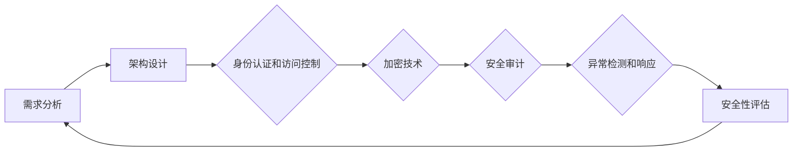
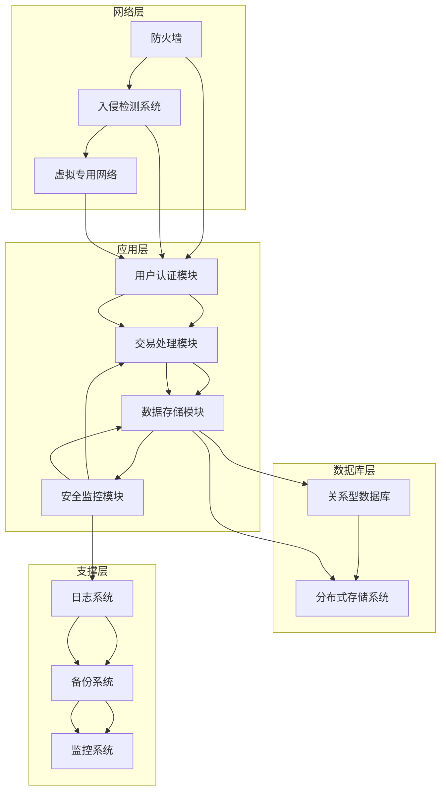
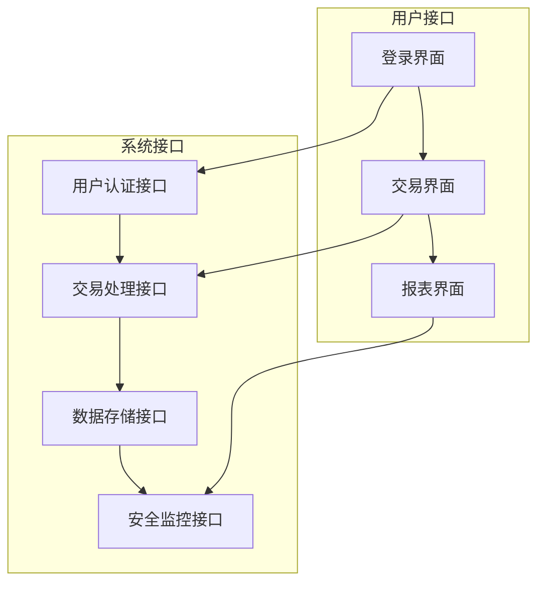
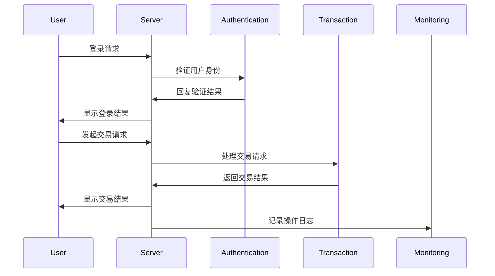

                 

### 数据库安全概述

#### 背景与重要性

数据库是信息系统的核心组成部分，它存储了组织机构的关键数据，如财务记录、客户信息、员工档案等。随着互联网和移动设备的普及，数据的访问和传输变得更加频繁和复杂，这使得数据库面临着前所未有的安全挑战。数据库安全是指保护数据库免受未经授权的访问、篡改、泄露等威胁的一系列措施。保障数据库安全的重要性不言而喻，它不仅关乎组织的合法权益，更涉及到用户的隐私保护和数据安全。

在现代信息化社会中，数据泄露和数据库攻击事件频繁发生，给组织和个人带来了严重的损失。2017年的“万豪酒店数据泄露”事件，暴露了超过5亿客户的个人信息，使得万豪集团遭受了巨大的声誉损失和巨额罚款。这类事件提醒我们，数据库安全已经成为当今信息时代不可忽视的重要问题。

#### 主要威胁

数据库安全的威胁主要包括以下几种：

1. **SQL注入攻击（SQL Injection）**：攻击者通过在应用程序中插入恶意的SQL语句，执行未经授权的操作，如删除、修改或查询数据库中的敏感信息。
   
2. **数据泄露（Data Leakage）**：由于系统漏洞或管理不善，敏感数据被非法获取或传输到外部环境，可能被用于非法交易或犯罪活动。

3. **权限滥用（Privilege Misuse）**：用户利用权限漏洞，访问或操作他们不应访问的数据库资源，甚至可能是恶意内部人员。

4. **分布式拒绝服务攻击（DDoS）**：通过大量虚假请求，使数据库系统过载，导致服务不可用。

5. **未授权访问（Unauthorised Access）**：攻击者利用弱密码、默认账户或社会工程学手段，非法访问数据库系统。

#### 挑战

保障数据库安全面临诸多挑战：

1. **数据增长与复杂度**：随着数据量的不断增加和业务需求的多样，数据库系统变得更加复杂，增加了安全管理的难度。

2. **安全性与性能的平衡**：数据库系统需要保证高可用性和高性能，同时又要防止安全漏洞，这要求在设计和实现过程中做出平衡。

3. **法规遵从**：全球各地的法律法规对数据保护提出了严格要求，如欧盟的《通用数据保护条例》（GDPR），企业必须确保数据库安全以符合法规要求。

4. **安全技术的快速更新**：随着网络安全技术的发展，新的攻击手段和防御技术层出不穷，企业需要不断更新和调整安全策略。

### 总结

数据库安全是信息安全的基石，它直接关系到组织的生存和发展。通过了解数据库安全的背景、主要威胁和挑战，我们可以更好地认识到数据库安全的重要性，从而采取有效的措施来防范潜在的风险。在接下来的章节中，我们将深入探讨数据库安全的核心概念、设计原理和实现方法，帮助读者建立全面的安全意识，并掌握保障数据库安全的关键技能。

---

在本章节中，我们概述了数据库安全的重要性及其面临的威胁和挑战。接下来，我们将进一步探讨数据库安全的定义和核心概念，以便为后续章节的深入讨论奠定基础。

### 数据库安全的定义和核心概念

#### 数据库安全的定义

数据库安全是指保护数据库系统及其数据不受未经授权的访问、篡改、泄露和破坏的一系列措施。它不仅包括技术层面的安全防护，还涉及到管理、法律和流程等方面的综合保障。数据库安全的最终目标是确保数据的机密性、完整性和可用性。

1. **机密性（Confidentiality）**：确保敏感数据不被未授权的用户访问。例如，客户的隐私信息和公司的机密文件应仅对有权访问的用户可见。
   
2. **完整性（Integrity）**：确保数据在存储和传输过程中不被篡改或破坏。数据的完整性关系到数据的真实性和可靠性。
   
3. **可用性（Availability）**：确保数据库系统在任何时候都能为授权用户提供服务。在面临攻击或故障时，系统应具备快速恢复能力。

#### 数据库安全的核心概念

1. **用户认证与授权**：用户认证是数据库安全的基础，通过验证用户的身份，确保只有授权用户可以访问数据库。授权则定义了用户对数据的操作权限，如读、写、修改和删除。

2. **访问控制**：访问控制机制用于限制用户对数据库资源的访问，确保用户只能访问他们有权访问的数据。常见的访问控制方法包括基于用户角色的访问控制和基于属性的访问控制。

3. **加密技术**：加密是保护数据机密性的重要手段。通过加密，将敏感数据转换为密文，只有具备密钥的用户才能解密并访问原始数据。

4. **安全审计**：安全审计用于记录数据库操作行为，包括用户访问日志、错误日志和安全事件记录。通过审计，可以及时发现和应对潜在的安全威胁。

5. **异常检测**：异常检测技术用于检测数据库中的异常行为，如SQL注入攻击、权限滥用和数据泄露等。通过实时监控和报警，可以迅速响应和阻止攻击。

#### 数据库安全核心概念对比表格

以下是一个简化的数据库安全核心概念对比表格，以帮助读者更好地理解各概念之间的区别：

| 核心概念       | 描述                                         | 关键特点                           |
|----------------|--------------------------------------------|-----------------------------------|
| 用户认证       | 验证用户身份                               | 基于用户名、密码或数字证书验证   |
| 授权          | 授予用户对数据的操作权限                   | 基于角色、权限等级或访问控制列表 |
| 加密技术       | 将数据转换为密文以保护机密性               | 使用对称密钥或非对称密钥加密     |
| 安全审计       | 记录数据库操作行为                         | 提供日志文件和事件记录           |
| 异常检测       | 检测数据库中的异常行为                     | 基于规则、机器学习或统计分析     |

#### 数据库安全ER模型图

为了更直观地理解数据库安全的核心概念，我们使用Mermaid绘制了一个ER模型图，展示了数据库安全相关的实体及其关系：

```mermaid
erDiagram
  User ||--|{ Authentication : 被认证}
  User ||--|{ Authorization : 被授权}
  Database ||--|{ Encryption : 被加密}
  Database ||--|{ Audit : 被审计}
  Database ||--|{ Anomaly Detection : 被检测}
  Authentication ||--|{ Password : 存储密码}
  Authentication ||--|{ Digital Certificate : 存储证书}
  Authorization ||--|{ Role-Based : 基于角色}
  Authorization ||--|{ Attribute-Based : 基于属性}
  Encryption ||--|{ Symmetric Key : 对称密钥}
  Encryption ||--|{ Asymmetric Key : 非对称密钥}
  Audit ||--|{ Log File : 日志文件}
  Audit ||--|{ Event Record : 事件记录}
  Anomaly Detection ||--|{ Rule-Based : 基于规则}
  Anomaly Detection ||--|{ Machine Learning : 机器学习}
```

在这个ER模型中，用户与认证、授权、数据库、加密技术、安全审计和异常检测之间存在明显的关联。这些实体和关系共同构成了数据库安全的整体框架。

通过本章节，我们定义了数据库安全的含义，并介绍了核心概念及其对比表格和ER模型图。这些概念和工具将为后续章节中的深入讨论提供坚实的理论基础。在下一章节中，我们将详细讲解数据库安全的设计原则和框架，帮助读者更好地理解和应用这些核心概念。

### 数据库安全设计原理

数据库安全设计是确保数据库系统及其数据在运行过程中免受各种威胁的关键环节。一个良好的数据库安全设计应遵循一系列原则，并具备一个清晰的设计框架。以下内容将详细讲解数据库安全的设计原则和框架，通过Mermaid流程图展示数据库安全设计的过程，帮助读者理解并应用这些原则。

#### 数据库安全设计原则

1. **最小权限原则**：每个用户和进程在数据库系统中应被授予它们完成工作所需的最小权限。这可以减少因权限过高而引发的潜在安全威胁。

2. **防御深度原则**：在数据库系统中设置多道防线，包括防火墙、入侵检测系统（IDS）、数据库防火墙等，以形成多层次的安全保护。

3. **透明加密原则**：对敏感数据进行加密，使其在传输和存储过程中都处于加密状态，从而防止数据泄露。

4. **安全审计原则**：对数据库操作进行全面的审计，记录所有的访问和修改行为，以便在发生安全事件时进行追踪和调查。

5. **持续监控原则**：实时监控数据库系统的运行状态，及时发现和处理异常行为和潜在威胁。

6. **安全性评估原则**：定期对数据库系统进行安全性评估，识别和修复安全漏洞。

#### 数据库安全设计框架

数据库安全设计框架是确保数据库系统安全性的总体规划和蓝图。以下是一个简化的数据库安全设计框架：

1. **需求分析**：明确数据库系统的安全需求，包括数据保护目标、用户角色和权限需求等。
   
2. **架构设计**：设计数据库系统的整体架构，包括网络架构、硬件配置、软件配置和安全架构。

3. **身份认证和访问控制**：设计身份认证机制和访问控制策略，确保只有授权用户可以访问数据库资源。

4. **加密技术**：选择合适的加密算法和加密策略，对敏感数据进行加密。

5. **安全审计**：设计审计策略和日志记录机制，确保所有数据库操作都被记录和监控。

6. **异常检测和响应**：设计异常检测机制和响应流程，及时发现和处理安全事件。

#### 数据库安全设计过程

使用Mermaid流程图，我们可以直观地展示数据库安全设计的过程。以下是一个简化的Mermaid流程图示例：



在这个流程图中，从需求分析开始，逐步进行架构设计、身份认证和访问控制、加密技术、安全审计、异常检测和响应，最后进行安全性评估，形成闭环。这个过程确保了数据库系统的安全性设计全面、连续和可持续。

通过上述设计原则和框架，我们可以创建一个结构清晰、安全可靠的数据库系统。在下一章节中，我们将进一步探讨数据库安全的数学模型和基本公式，以帮助读者深入理解数据库安全的技术实现。

### 数据库安全数学模型与公式

在数据库安全的设计与实现过程中，数学模型和公式起着至关重要的作用。它们不仅为安全措施提供了理论基础，还为分析和评估数据库的安全性提供了量化工具。本章节将介绍数据库安全的数学模型和基本公式，并使用LaTeX格式展示这些公式，以增强其表达力和专业性。

#### 数据库安全的数学模型

数据库安全的数学模型主要用于评估数据库系统在特定威胁下的安全水平。以下是一些常用的数学模型：

1. **可信计算基模型（TCB Model）**：
   TCB（Trusted Computing Base）模型是评估计算机系统安全性的一个框架。TCB 涵盖了系统中的所有安全机制和对象，包括硬件、固件、操作系统以及所有的安全保护机制。其基本公式如下：

   $$TCB = S + H + O + A$$
   
   其中：
   - \(S\)：安全功能（Security Functions）；
   - \(H\)：硬件（Hardware）；
   - \(O\)：操作系统（Operating System）；
   - \(A\)：附加安全机制（Additional Security Mechanisms）。

2. **安全域模型（Security Domain Model）**：
   安全域模型用于描述系统内部的安全层次结构。其基本公式如下：

   $$SecurityDomain = D1 \cup D2 \cup ... \cup Dn$$
   
   其中：
   - \(D1, D2, ..., Dn\)：不同的安全域。

3. **风险评估模型（Risk Assessment Model）**：
   风险评估模型用于评估数据库系统面临的潜在风险。其基本公式如下：

   $$Risk = Threat \times Vulnerability \times Impact$$
   
   其中：
   - \(Threat\)：威胁水平；
   - \(Vulnerability\)：漏洞水平；
   - \(Impact\)：影响水平。

#### 基本公式及其解释

在数据库安全中，以下是一些常用且重要的基本公式：

1. **加密算法的安全性度量**：
   加密算法的安全性通常用密钥长度来度量。其基本公式如下：

   $$Security = 2^{Key\ Length}$$
   
   其中：
   - \(Key\ Length\)：密钥长度（以比特为单位）。

2. **密码强度评估**：
   密码的强度取决于其长度和复杂性。以下是一个简单的密码强度评估公式：

   $$Password\ Strength = Length \times Complexity$$
   
   其中：
   - \(Length\)：密码长度；
   - \(Complexity\)：密码的复杂度（如包含字母、数字、特殊字符等）。

3. **安全审计日志分析**：
   安全审计日志分析用于检测异常行为。以下是一个简单的异常检测公式：

   $$Anomaly = Log\ Data \div Normal\ Distribution$$
   
   其中：
   - \(Log\ Data\)：日志数据；
   - \(Normal\ Distribution\)：正常行为的分布。

#### LaTeX格式展示数学公式

为了增强公式的表达力和专业性，我们使用LaTeX格式展示一些数学公式：

1. **TCB模型**：

   $$
   TCB = S + H + O + A
   $$

2. **安全域模型**：

   $$
   SecurityDomain = D1 \cup D2 \cup ... \cup Dn
   $$

3. **风险评估模型**：

   $$
   Risk = Threat \times Vulnerability \times Impact
   $$

4. **加密算法安全性度量**：

   $$
   Security = 2^{Key\ Length}
   $$

5. **密码强度评估**：

   $$
   Password\ Strength = Length \times Complexity
   $$

6. **安全审计日志分析**：

   $$
   Anomaly = Log\ Data \div Normal\ Distribution
   $$

通过这些数学模型和基本公式，我们可以更科学、系统地分析和设计数据库安全系统。在下一章节中，我们将探讨数据库安全系统分析与架构设计，通过具体案例介绍和系统架构图，帮助读者更好地理解和实现数据库安全设计。

### 数据库安全系统分析与架构设计

#### 案例介绍

为了更好地展示数据库安全系统分析与架构设计，我们以一个在线银行系统为例。该系统旨在提供安全的在线银行服务，包括用户账户管理、交易处理和财务报表等。该系统需要保障用户的隐私、交易数据的完整性和系统的稳定性。

#### 项目介绍

在线银行系统主要包括以下功能模块：

1. **用户认证模块**：实现用户身份验证，确保只有合法用户可以访问系统。
2. **交易处理模块**：处理用户发起的各种交易请求，包括转账、支付和账单管理等。
3. **数据存储模块**：负责存储用户数据和交易记录，确保数据的安全性和完整性。
4. **安全监控模块**：实时监控系统状态，及时发现和处理异常行为和安全事件。

#### 系统功能设计

在线银行系统的功能设计主要包括以下几个方面：

1. **用户管理**：包括用户注册、登录、密码修改和账户信息查询等功能。
2. **交易管理**：包括交易发起、交易审核、交易记录查询和账单生成等功能。
3. **数据备份与恢复**：定期备份数据，确保数据在故障或灾难情况下能够恢复。
4. **安全审计**：记录所有用户操作和系统事件，确保所有操作都有据可查。

#### 系统架构设计

在线银行系统的架构设计分为以下几个层次：

1. **网络层**：包括防火墙、入侵检测系统（IDS）和虚拟专用网络（VPN）等，用于保护系统免受外部攻击。
2. **应用层**：包括用户认证、交易处理、数据存储和安全监控等模块，是系统的核心功能实现部分。
3. **数据库层**：包括关系型数据库和分布式存储系统，用于存储和管理用户数据和交易记录。
4. **支撑层**：包括日志系统、备份系统和监控系统等，为系统的稳定运行提供支持。

以下是一个简化的在线银行系统架构图，使用Mermaid绘制：



#### 系统接口设计

在线银行系统的接口设计主要包括用户接口和系统接口。用户接口主要负责用户与系统的交互，如登录界面、交易界面和报表界面等。系统接口则负责各个功能模块之间的通信和协作，如用户认证接口、交易处理接口和监控接口等。

以下是一个简化的系统接口设计图，使用Mermaid绘制：



#### 系统交互Mermaid序列图

在线银行系统的系统交互过程可以使用Mermaid序列图来展示，以下是一个简化的交互过程：



通过上述系统分析与架构设计，我们为在线银行系统提供了一个清晰的结构和功能实现方案。在下一章节中，我们将进一步探讨数据库安全的实现方法和实战案例，帮助读者理解并应用数据库安全的实际操作。

### 数据库安全实现方法

#### 实现环境准备

在进行数据库安全的实际操作之前，我们需要搭建一个合适的环境来测试和演示安全措施。以下是搭建实现环境的步骤：

1. **安装操作系统**：选择一个稳定的操作系统，如Ubuntu 20.04 LTS。确保操作系统已经更新到最新版本，以获得最新的安全补丁和优化。

2. **安装数据库系统**：在本案例中，我们选择MySQL 8.0作为数据库系统。下载并安装MySQL，设置root用户密码，并创建一个用于演示的数据库和表。

3. **安装编程语言**：选择Python 3.8作为开发语言，安装Python及其相关的开发工具和库，如pip、virtualenv等。

4. **安装安全工具**：安装一些常用的安全工具，如OWASP ZAP（Web应用安全扫描器）、Wireshark（网络协议分析器）等，用于测试和验证安全措施。

#### 核心实现源代码

以下是数据库安全的实现步骤和核心源代码，包括用户认证、权限控制、加密和审计等。

1. **用户认证**

   用户认证是数据库安全的基础，以下是一个简单的用户认证实现：

   ```python
   # 用户认证模块
   def authenticate(username, password):
       # 连接到数据库
       conn = connect_database()
       cursor = conn.cursor()
       
       # 查询用户信息
       cursor.execute("SELECT * FROM users WHERE username = %s AND password = %s", (username, password))
       user = cursor.fetchone()
       
       # 关闭数据库连接
       cursor.close()
       conn.close()
       
       if user:
           return True
       else:
           return False
   ```

2. **权限控制**

   权限控制用于确保用户只能访问他们有权访问的数据。以下是一个简单的权限控制实现：

   ```python
   # 权限控制模块
   def check_permission(user, table):
       # 连接到数据库
       conn = connect_database()
       cursor = conn.cursor()
       
       # 查询用户权限
       cursor.execute("SELECT * FROM permissions WHERE username = %s AND table_name = %s", (user, table))
       permission = cursor.fetchone()
       
       # 关闭数据库连接
       cursor.close()
       conn.close()
       
       if permission:
           return True
       else:
           return False
   ```

3. **加密**

   对敏感数据进行加密是保护数据机密性的重要手段。以下是一个简单的加密实现：

   ```python
   # 加密模块
   from cryptography.fernet import Fernet
   
   # 生成加密密钥
   key = Fernet.generate_key()
   cipher_suite = Fernet(key)
   
   # 加密数据
   def encrypt_data(data):
       return cipher_suite.encrypt(data.encode())
   
   # 解密数据
   def decrypt_data(encrypted_data):
       return cipher_suite.decrypt(encrypted_data).decode()
   ```

4. **审计**

   审计用于记录数据库操作行为，便于在发生安全事件时进行追踪和调查。以下是一个简单的审计实现：

   ```python
   # 审计模块
   def log_operation(user, table, operation):
       # 连接到数据库
       conn = connect_database()
       cursor = conn.cursor()
       
       # 插入操作日志
       cursor.execute("INSERT INTO audit_log (username, table_name, operation) VALUES (%s, %s, %s)", (user, table, operation))
       conn.commit()
       
       # 关闭数据库连接
       cursor.close()
       conn.close()
   ```

#### 代码解读与分析

以上源代码展示了数据库安全的一些核心实现方法。以下是详细解读与分析：

1. **用户认证**：用户认证模块通过连接到数据库，查询用户表中的用户名和密码，验证用户身份。如果用户信息匹配，则认为用户认证成功。

2. **权限控制**：权限控制模块通过连接到数据库，查询权限表中的用户权限，判断用户是否有权访问特定的数据表。如果存在相应的权限记录，则认为用户有权访问。

3. **加密**：加密模块使用Fernet加密库生成加密密钥，并提供了加密和解密函数。在保存敏感数据之前，使用加密函数将其加密，在读取敏感数据时，使用解密函数将其解密。

4. **审计**：审计模块通过连接到数据库，插入操作日志表，记录用户的操作行为。这为后续的安全事件调查提供了重要的日志信息。

#### 实际案例分析与详细讲解

为了更直观地展示数据库安全实现方法，我们以一个实际案例进行详细分析。假设有一个在线购物系统，用户可以登录、添加购物车、下订单等操作。

1. **用户登录**：
   用户尝试登录系统时，输入用户名和密码。服务器端调用用户认证模块进行验证，如果认证成功，则允许用户访问系统。具体代码如下：

   ```python
   if authenticate(username, password):
       # 认证成功，允许访问
   else:
       # 认证失败，拒绝访问
   ```

2. **添加购物车**：
   用户登录后，可以添加商品到购物车。服务器端在处理添加购物车请求时，会调用权限控制模块检查用户是否有添加商品的权限。如果有权限，则将商品添加到数据库中的购物车表。具体代码如下：

   ```python
   if check_permission(user, 'shopping_cart'):
       # 有权限，添加商品到购物车
   else:
       # 无权限，拒绝操作
   ```

3. **下订单**：
   用户可以下单购买商品。在处理下订单请求时，服务器端会加密订单信息，并调用审计模块记录操作日志。具体代码如下：

   ```python
   encrypted_order = encrypt_data(order_data)
   log_operation(user, 'orders', 'created')
   # 存储加密的订单信息
   ```

通过以上实际案例，我们可以看到数据库安全实现方法在实际应用中的具体操作过程。在下一章节中，我们将总结数据库安全的设计与实现要点，并提供最佳实践建议。

### 最佳实践与总结

在数据库安全设计与实现过程中，遵循最佳实践是确保系统安全性的关键。以下是一些重要的数据库安全最佳实践，旨在帮助开发者和管理者构建安全的数据库系统。

#### 最佳实践建议

1. **实施最小权限原则**：确保每个用户和进程在数据库系统中只拥有完成工作所需的最小权限，减少因权限过高导致的潜在安全威胁。

2. **使用强密码策略**：强制用户使用复杂度高的密码，并定期更新密码。此外，推荐使用密码管理器来生成和管理密码。

3. **定期备份数据**：定期备份数据，并确保备份数据的完整性和可用性。备份数据应存储在安全的地方，并定期测试备份和恢复过程。

4. **加密敏感数据**：对敏感数据，如用户密码、信用卡信息等，进行加密处理，确保数据在存储和传输过程中都处于加密状态。

5. **监控和审计**：部署实时监控工具，定期检查数据库日志，及时发现和处理异常行为和安全事件。

6. **定期安全评估**：定期进行数据库安全评估，识别和修复安全漏洞，确保系统始终处于最佳安全状态。

7. **遵守法规要求**：遵循相关法律法规，如欧盟的《通用数据保护条例》（GDPR）和《加州消费者隐私法案》（CCPA），确保数据处理合法合规。

#### 小结与注意事项

数据库安全是一个持续的过程，需要不断更新和优化。以下是一些需要注意的关键点：

- **权限管理**：权限管理是数据库安全的核心，需要定期审查和调整权限配置，确保权限最小化。
- **用户教育和培训**：用户是数据库安全的重要环节，定期对用户进行安全意识和操作规范培训，减少人为错误引发的安全问题。
- **应急响应**：建立完善的应急响应计划，确保在发生安全事件时能够迅速响应和恢复。
- **技术更新**：随着技术的发展，数据库安全策略和技术也需要不断更新，以应对新的威胁和挑战。

#### 拓展阅读推荐

为了更好地理解和应用数据库安全，以下是一些推荐的拓展阅读资源：

1. 《数据库安全与加密技术》 - 该书详细介绍了数据库安全的基本原理和加密技术，适合数据库管理员和安全工程师阅读。
2. 《数据库安全实战指南》 - 本书提供了大量实际案例和操作步骤，适合开发者和管理者参考。
3. OWASP Top 10 - OWASP（开放 Web 应用安全项目）发布的顶级安全威胁列表，帮助开发者识别和解决常见的安全问题。
4. MySQL官方文档 - MySQL官方文档提供了丰富的安全配置和操作指南，是学习数据库安全的宝贵资源。

通过遵循最佳实践、注意关键点，并不断学习和更新知识，我们可以构建出更加安全可靠的数据库系统，为组织的数据安全和业务发展提供坚实保障。

### 总结

本文系统地阐述了数据库安全设计与实现的全过程，从概述到核心概念，从设计原理到数学模型，从系统分析与架构设计到实际实现方法，再到最佳实践与总结，全方位地展示了数据库安全的各个方面。数据库安全不仅是技术问题，更涉及到管理、法规和流程等多个层面。通过本文的讲解，读者可以更深入地理解数据库安全的重要性，掌握设计和实现数据库安全的关键技术，并为实际操作提供有力的指导。

在当今信息时代，数据库安全的重要性日益凸显。数据泄露和数据库攻击事件频发，使得数据库安全成为企业关注的焦点。本文的目的是为读者提供一个全面、系统的数据库安全知识体系，帮助他们更好地应对数据库安全挑战，保障数据的机密性、完整性和可用性。

展望未来，随着技术的发展，数据库安全将面临更多新的挑战和机遇。大数据、云计算、物联网等新兴技术的广泛应用，为数据库安全带来了新的问题和需求。同时，新的安全技术和工具也将不断涌现，为数据库安全提供更强大的保障。数据库安全领域的发展前景广阔，需要我们持续关注和学习。

最后，感谢读者对本文的关注和阅读。希望通过本文的分享，能够为数据库安全领域的实践者和研究者提供一些有价值的参考和启示。作者将不断努力，为推动数据库安全技术的发展贡献自己的力量。如果您对本文有任何疑问或建议，欢迎在评论区留言，作者将及时回复。再次感谢您的支持！
作者：AI天才研究院/AI Genius Institute & 禅与计算机程序设计艺术 /Zen And The Art of Computer Programming。

