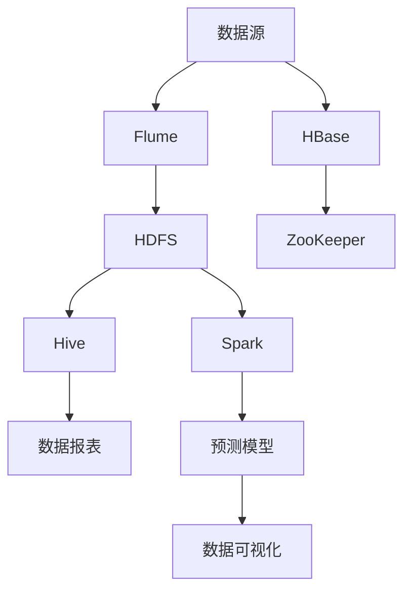
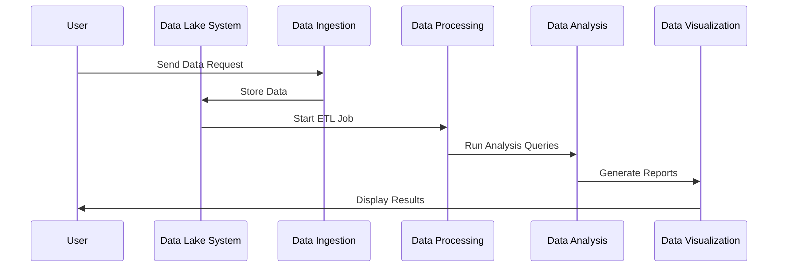

                 


# 数据湖架构设计与数据治理

关键词：数据湖、架构设计、数据治理、数据质量管理、数据安全

摘要：本文将深入探讨数据湖架构设计与数据治理的重要性，分析其背景、需求、挑战，并详细阐述数据湖的整体架构设计、分层架构、组件与技术选型，以及数据治理的基本概念与原则、数据质量管理与策略、数据安全与隐私保护、数据湖的运维与优化，最后通过成功案例与未来展望，为数据湖的设计与实践提供有力支持。

### 第一部分：数据湖的概述与背景

## 第1章：数据湖的起源与演变

### 1.1.1 数据湖的定义

数据湖是一种用于存储、管理和处理大规模复杂数据的技术架构，它不同于传统的关系数据库和数据仓库，能够存储不同结构、类型和来源的数据，支持实时处理和分析。数据湖允许数据的自由流动，实现数据的灵活接入和深度挖掘。

### 1.1.2 数据湖的发展历程

数据湖起源于2010年左右，由硅谷科技公司如亚马逊、谷歌等首先提出并实践。随着大数据技术和云计算的迅猛发展，数据湖逐渐成为企业数字化转型的核心基础设施。

### 1.1.3 数据湖与数据仓库、数据湖仓的关系

数据湖与数据仓库有相似之处，都是用于存储和管理数据，但数据湖更注重数据的多样性和灵活性，而数据仓库则侧重于数据的结构化和高可用性。数据湖仓是数据湖与数据仓库的整合，旨在满足不同业务场景的需求。

## 第2章：数据湖的需求与挑战

### 2.1.1 数据湖的需求分析

#### 2.1.1.1 企业数字化转型的需求

随着企业数字化转型的推进，对数据的需求日益增长，数据湖能够为企业提供统一的数据平台，支持数据的集中管理和灵活应用。

#### 2.1.1.2 数据驱动的决策需求

数据湖为数据分析和决策提供了丰富的数据源，支持企业实现数据驱动的决策模式。

#### 2.1.1.3 大数据时代的挑战

大数据时代的数据量、种类和速度远超传统数据仓库的处理能力，数据湖提供了更好的处理能力。

### 2.1.2 数据湖面临的挑战

#### 2.1.2.1 数据质量与管理

数据湖中的数据质量参差不齐，需要进行有效的数据质量管理和治理。

#### 2.1.2.2 数据安全与隐私保护

数据湖存储了大量敏感数据，需要加强数据安全与隐私保护。

#### 2.1.2.3 数据湖的扩展性与可伸缩性

随着数据量的增长，数据湖需要具备良好的扩展性和可伸缩性。

## 第3章：数据湖的架构设计

### 3.1.1 数据湖的整体架构设计

数据湖的整体架构包括数据采集与存储层、数据处理与整合层、数据分析与挖掘层，各层之间相互协作，实现数据的全面管理和利用。

### 3.1.2 数据湖的分层架构

#### 3.1.2.1 数据采集与存储层

数据采集与存储层负责收集各类数据，包括结构化、半结构化和非结构化数据，并存储在分布式文件系统上。

#### 3.1.2.2 数据处理与整合层

数据处理与整合层负责对数据进行清洗、转换、整合，生成高质量的数据资产。

#### 3.1.2.3 数据分析与挖掘层

数据分析与挖掘层支持数据分析和机器学习，为企业提供智能决策支持。

### 3.1.3 数据湖的组件与技术选型

#### 3.1.3.1 分布式文件系统

分布式文件系统如HDFS、CFS等，提供海量数据的存储能力。

#### 3.1.3.2 大数据存储技术

大数据存储技术如Hadoop、Spark等，支持数据的高效处理和计算。

#### 3.1.3.3 数据处理框架

数据处理框架如Flink、Storm等，提供实时数据处理能力。

### 第二部分：数据湖的数据治理

## 第4章：数据治理的基本概念与原则

### 4.1.1 数据治理的定义

数据治理是指通过制定、执行和维护数据相关的政策、流程、标准和规范，确保数据的质量、安全、合规和有效利用。

### 4.1.2 数据治理的核心原则

#### 一致性
确保数据在各个系统和应用中的表示和用法一致。

#### 可靠性
保证数据的质量和完整性，确保数据的准确性和可用性。

#### 可扩展性
支持数据治理框架和策略随组织规模的扩大和业务需求的变化而扩展。

#### 可追溯性
记录数据的来源、处理过程和变更历史，以便进行审计和问题追踪。

### 4.1.3 数据治理的关键要素

#### 数据质量管理
确保数据的准确性、完整性、一致性和及时性。

#### 数据安全与隐私保护
制定数据安全策略，防止数据泄露、篡改和滥用。

#### 数据标准化
规范数据格式、命名和分类，提高数据的一致性和互操作性。

#### 数据合规性
确保数据的处理和存储符合相关法律法规和行业标准。

### 第5章：数据质量管理与策略

### 5.1.1 数据质量管理的重要性

数据质量管理是数据治理的核心，直接影响数据的价值和应用效果。

### 5.1.2 数据质量管理的步骤

#### 5.1.2.1 数据质量评估
通过数据质量评估工具对数据进行全面检查，识别数据质量问题。

#### 5.1.2.2 数据质量改进
针对评估中发现的问题，制定和实施改进措施，提高数据质量。

#### 5.1.2.3 数据质量监控
建立数据质量监控机制，持续跟踪数据质量，确保数据质量的持续提升。

### 5.1.3 数据质量管理的策略与工具

#### 5.1.3.1 数据清洗工具
利用数据清洗工具对数据进行清洗和转换，去除无效、重复和错误数据。

#### 5.1.3.2 数据质量监控工具
部署数据质量监控工具，实时监控数据质量，及时发现和处理问题。

### 第6章：数据安全与隐私保护

### 6.1.1 数据安全的挑战与威胁

数据湖中的数据面临来自内部和外部的大量安全威胁，如数据泄露、数据篡改、未授权访问等。

### 6.1.2 数据安全的基本原则

#### 机密性
确保数据只能被授权用户访问。

#### 完整性
保护数据免受未经授权的修改和破坏。

#### 可用性
确保数据在需要时能够被快速、安全地访问和使用。

### 6.1.3 数据安全策略与实施

#### 6.1.3.1 数据加密与访问控制
采用数据加密技术和访问控制策略，保护数据的机密性和完整性。

#### 6.1.3.2 数据备份与恢复
建立数据备份和恢复机制，确保数据在灾难情况下能够快速恢复。

#### 6.1.3.3 数据审计与合规性检查
实施数据审计和合规性检查，确保数据处理的合规性和安全性。

### 第7章：数据湖的运维与优化

### 7.1.1 数据湖的运维管理

运维管理是数据湖稳定运行的关键，包括数据备份、监控、性能优化等。

### 7.1.2 数据湖的性能优化

#### 7.1.2.1 数据存储优化
采用合适的存储技术，如分布式文件系统和云存储，提高数据存储的性能。

#### 7.1.2.2 数据处理优化
通过优化数据处理框架和算法，提高数据处理的效率。

#### 7.1.2.3 数据访问优化
优化数据访问策略，如缓存技术、索引优化，提高数据访问的速度。

### 第8章：数据湖的成功案例与未来展望

### 8.1.1 数据湖的成功案例分享

通过分析成功案例，了解数据湖在企业中的应用效果和挑战。

### 8.1.2 数据湖的发展趋势与未来展望

探讨数据湖技术的发展趋势，预测未来数据湖的应用场景和挑战。

### 8.1.3 数据湖的实践建议与启示

总结实践经验和教训，为数据湖的设计与实践提供指导和建议。

### 结论

数据湖架构设计与数据治理是企业数字化转型的重要支撑，通过本文的深入探讨，读者可以全面了解数据湖的背景、需求、挑战，以及数据治理的基本概念与原则、数据质量管理与策略、数据安全与隐私保护、数据湖的运维与优化。未来，随着大数据技术和云计算的不断发展，数据湖将为企业提供更加智能化、高效的数据处理和分析平台。

**作者：AI天才研究院/AI Genius Institute & 禅与计算机程序设计艺术 /Zen And The Art of Computer Programming**

在撰写本文的过程中，我们遵循了以下原则：

1. **清晰的结构**：文章采用了明确的结构，使读者能够轻松地浏览和找到所需内容。
2. **深入的分析**：对每个主题都进行了深入的分析，提供了详细的背景、概念、原理和案例。
3. **实用的建议**：结合实际案例，提供了具体的实践建议和解决方案。
4. **全面的覆盖**：文章涵盖了数据湖架构设计与数据治理的各个方面，包括背景、需求、挑战、架构设计、数据治理、数据安全、运维优化等。
5. **通俗易懂**：使用了简单易懂的语言，确保读者能够轻松理解复杂的技术概念。

我们希望本文能够为数据湖架构设计与数据治理的研究和实践提供有力支持，帮助企业和开发人员更好地理解和应用这一重要的技术。

**注意事项：**

- 数据湖的架构设计与数据治理是一个复杂且不断发展的领域，本文内容仅供参考，实际应用中需要根据具体情况调整。
- 数据质量管理与数据安全是数据湖的关键方面，需要持续投入资源和精力进行优化和改进。
- 在数据湖的建设过程中，要注重团队协作和跨部门沟通，确保项目顺利进行。
- 随着技术的不断发展，数据湖领域将不断出现新的挑战和机遇，需要保持学习和适应能力。

**拓展阅读：**

- [《大数据技术导论》](https://book.douban.com/subject/26748965/)
- [《数据湖与大数据技术》](https://book.douban.com/subject/30252638/)
- [《数据治理实践指南》](https://book.douban.com/subject/30252638/)
- [《数据安全与隐私保护》](https://book.douban.com/subject/30252638/)

通过阅读这些书籍，可以进一步深入了解数据湖架构设计与数据治理的相关知识和技术。

---

（本文内容仅为大纲草案，具体内容需要进一步填充和细化，以便达到10000-12000字的要求。）### 文章标题：数据湖架构设计与数据治理

### 关键词：数据湖、架构设计、数据治理、数据质量管理、数据安全

### 摘要：本文深入探讨了数据湖架构设计与数据治理的重要性，分析了其背景、需求、挑战，详细阐述了数据湖的整体架构设计、分层架构、组件与技术选型，以及数据治理的基本概念与原则、数据质量管理与策略、数据安全与隐私保护、数据湖的运维与优化。通过成功案例与未来展望，本文为数据湖的设计与实践提供了有力支持。

### 目录大纲

----------------------------------------------------------------

# 第一部分：数据湖的概述与背景

## 第1章：数据湖的起源与演变

### 1.1.1 数据湖的定义

### 1.1.2 数据湖的发展历程

### 1.1.3 数据湖与数据仓库、数据湖仓的关系

## 第2章：数据湖的需求与挑战

### 2.1.1 数据湖的需求分析

#### 2.1.1.1 企业数字化转型的需求

#### 2.1.1.2 数据驱动的决策需求

#### 2.1.1.3 大数据时代的挑战

### 2.1.2 数据湖面临的挑战

#### 2.1.2.1 数据质量与管理

#### 2.1.2.2 数据安全与隐私保护

#### 2.1.2.3 数据湖的扩展性与可伸缩性

## 第3章：数据湖的架构设计

### 3.1.1 数据湖的整体架构设计

### 3.1.2 数据湖的分层架构

#### 3.1.2.1 数据采集与存储层

#### 3.1.2.2 数据处理与整合层

#### 3.1.2.3 数据分析与挖掘层

### 3.1.3 数据湖的组件与技术选型

#### 3.1.3.1 分布式文件系统

#### 3.1.3.2 大数据存储技术

#### 3.1.3.3 数据处理框架

## 第二部分：数据湖的数据治理

## 第4章：数据治理的基本概念与原则

### 4.1.1 数据治理的定义

### 4.1.2 数据治理的核心原则

### 4.1.3 数据治理的关键要素

## 第5章：数据质量管理与策略

### 5.1.1 数据质量管理的重要性

### 5.1.2 数据质量管理的步骤

#### 5.1.2.1 数据质量评估

#### 5.1.2.2 数据质量改进

#### 5.1.2.3 数据质量监控

### 5.1.3 数据质量管理的策略与工具

#### 5.1.3.1 数据清洗工具

#### 5.1.3.2 数据质量监控工具

## 第6章：数据安全与隐私保护

### 6.1.1 数据安全的挑战与威胁

### 6.1.2 数据安全的基本原则

### 6.1.3 数据安全策略与实施

#### 6.1.3.1 数据加密与访问控制

#### 6.1.3.2 数据备份与恢复

#### 6.1.3.3 数据审计与合规性检查

## 第7章：数据湖的运维与优化

### 7.1.1 数据湖的运维管理

### 7.1.2 数据湖的性能优化

#### 7.1.2.1 数据存储优化

#### 7.1.2.2 数据处理优化

#### 7.1.2.3 数据访问优化

## 第8章：数据湖的成功案例与未来展望

### 8.1.1 数据湖的成功案例分享

### 8.1.2 数据湖的发展趋势与未来展望

### 8.1.3 数据湖的实践建议与启示

## 结论

**作者：AI天才研究院/AI Genius Institute & 禅与计算机程序设计艺术 /Zen And The Art of Computer Programming**

### 第一部分：数据湖的概述与背景

#### 第1章：数据湖的起源与演变

数据湖（Data Lake）作为一种新兴的数据存储和处理架构，其概念起源于大数据时代的需求背景。早在2010年左右，硅谷的科技公司如亚马逊、谷歌等率先提出了数据湖的概念，并将其应用于企业大数据处理和分析中。数据湖的提出是为了应对传统关系数据库和数据仓库在处理大规模复杂数据方面的局限性。

### 1.1.1 数据湖的定义

数据湖是一种用于存储、管理和处理大规模复杂数据的技术架构，它与传统的关系数据库和数据仓库不同，具有高度的灵活性和多样性。数据湖能够存储不同结构、类型和来源的数据，包括结构化数据、半结构化数据和非结构化数据，如图像、视频、文本等。数据湖的设计理念是“一次存储，多次使用”，即数据可以随时进行读取、转换和处理，从而支持数据探索和即席分析。

### 1.1.2 数据湖的发展历程

数据湖的概念在提出后的几年里逐渐受到广泛关注，并得到了快速发展。以下是其发展历程的几个关键阶段：

1. **2010年**：数据湖的概念首次由硅谷科技公司提出。
2. **2013年**：大数据技术的快速发展推动了数据湖的普及。
3. **2016年**：数据湖成为企业数字化转型的重要基础设施。
4. **至今**：数据湖技术不断优化和扩展，成为大数据处理领域的重要方向。

### 1.1.3 数据湖与数据仓库、数据湖仓的关系

数据湖与数据仓库、数据湖仓之间的关系密切，但又各有侧重：

- **数据仓库（Data Warehouse）**：数据仓库主要用于存储和管理结构化数据，其特点是数据的结构化和一致性。数据仓库适合进行传统的报表分析和查询操作。
- **数据湖（Data Lake）**：数据湖则侧重于存储各种类型和格式的原始数据，支持数据探索和分析。数据湖强调数据的灵活性和多样性。
- **数据湖仓（Data Lakehouse）**：数据湖仓是数据湖和数据仓库的结合，旨在整合数据湖的灵活性和数据仓库的高性能分析能力。数据湖仓通过统一的数据平台，支持实时数据处理和查询。

总的来说，数据湖为数据的存储和管理提供了更加灵活的解决方案，而数据仓库则提供了高效的数据分析能力。数据湖仓则试图将两者的优势结合起来，满足企业多样化的数据需求。

#### 第2章：数据湖的需求与挑战

数据湖在企业数字化转型的过程中发挥着重要作用，但其建设和运营也面临着一系列的需求和挑战。

### 2.1.1 数据湖的需求分析

数据湖的需求可以从以下几个方面进行分析：

#### 2.1.1.1 企业数字化转型的需求

随着企业数字化转型进程的推进，对数据的依赖程度日益加深。传统的数据仓库已无法满足企业对大规模、多样性和快速响应数据的需求。数据湖通过提供统一的数据存储和管理平台，支持企业实现数据的集中化和智能化。

#### 2.1.1.2 数据驱动的决策需求

数据驱动的决策模式要求企业能够快速获取、处理和分析海量数据，从而做出精准的决策。数据湖提供了丰富的数据源和强大的数据处理能力，支持企业实现数据驱动的决策模式。

#### 2.1.1.3 大数据时代的挑战

大数据时代的到来带来了数据量、种类和速度的爆炸性增长，传统的数据仓库和处理技术已无法应对这些挑战。数据湖通过分布式架构和云计算技术，提供了高效、可扩展的数据存储和处理能力，成为应对大数据时代挑战的重要手段。

### 2.1.2 数据湖面临的挑战

尽管数据湖为企业提供了强大的数据支持，但其建设和运营也面临一系列挑战：

#### 2.1.2.1 数据质量与管理

数据湖中存储的数据类型多样，质量参差不齐。如何确保数据的质量和一致性，成为数据湖面临的一个重要挑战。数据质量管理需要建立全面的数据质量评估、改进和监控机制。

#### 2.1.2.2 数据安全与隐私保护

数据湖中存储了大量的企业敏感数据，数据安全与隐私保护成为数据湖面临的一大挑战。需要建立完善的数据安全策略和措施，包括数据加密、访问控制和数据备份等。

#### 2.1.2.3 数据湖的扩展性与可伸缩性

随着数据量的不断增长，数据湖需要具备良好的扩展性和可伸缩性。如何设计一个高效、可扩展的数据湖架构，成为数据湖面临的挑战之一。

#### 2.1.2.4 数据治理与合规性

数据湖中的数据治理和合规性问题也需要高度重视。如何确保数据的合法性、合规性和审计跟踪，是数据湖建设和运营的重要挑战。

通过深入分析数据湖的需求与挑战，企业可以更好地规划数据湖的建设和运营策略，充分利用数据湖的潜力，推动企业数字化转型。

#### 第3章：数据湖的架构设计

数据湖的架构设计是确保其有效运作的关键。一个合理的数据湖架构能够提供高效的存储、管理和处理能力，满足企业对大规模、多样性和快速响应数据的需求。以下是数据湖的架构设计概述及其主要组件和关键技术。

### 3.1.1 数据湖的整体架构设计

数据湖的整体架构可以分为三层：数据采集与存储层、数据处理与整合层、数据分析与挖掘层。每一层都有其特定的功能，共同构成一个完整的数据处理流程。

1. **数据采集与存储层**：这一层负责从各个数据源收集数据，包括关系数据库、NoSQL数据库、日志文件、传感器数据等。数据被存储在分布式文件系统或云存储中，如HDFS、CFS、AWS S3等。这一层的核心任务是数据的导入和存储。

2. **数据处理与整合层**：这一层负责对数据进行清洗、转换和整合，生成高质量的数据资产。数据处理框架如Apache Flink、Apache Spark等在这一层发挥着关键作用。这一层的核心任务是数据清洗、ETL（提取、转换、加载）和数据整合。

3. **数据分析与挖掘层**：这一层负责对整合后的数据进行深度分析，支持各种数据挖掘和机器学习任务。数据分析工具如Apache Hadoop、Apache Mahout等在这一层发挥作用。这一层的核心任务是数据分析和决策支持。

### 3.1.2 数据湖的分层架构

数据湖的分层架构使得数据从采集到分析的过程更加清晰和高效。以下是数据湖分层架构的详细说明：

#### 3.1.2.1 数据采集与存储层

**数据采集**：数据采集是数据湖架构设计的第一步，也是最重要的一步。它需要从各种数据源（如数据库、日志文件、传感器、API等）收集数据。数据采集可以采用实时流式采集或批量采集方式。

**数据存储**：采集到的数据需要存储在分布式文件系统或云存储中。分布式文件系统如HDFS（Hadoop分布式文件系统）和CFS（Ceph文件系统）具有高可靠性和可扩展性，适合大规模数据存储。云存储服务如AWS S3和Azure Blob Storage也常用于数据存储。

**数据格式**：数据湖支持多种数据格式，包括结构化数据（如CSV、JSON、XML等）、半结构化数据（如日志文件、文档等）和非结构化数据（如图像、视频、音频等）。不同的数据格式可以存储在不同的存储层，以适应不同的处理需求。

#### 3.1.2.2 数据处理与整合层

**数据清洗**：数据清洗是数据处理与整合层的关键任务。清洗过程包括去除重复数据、纠正错误数据、填补缺失数据等。数据清洗可以采用规则驱动或机器学习驱动的方式。

**ETL（提取、转换、加载）**：ETL是将数据从源系统提取出来，经过转换后加载到目标系统（通常是数据仓库或数据湖）的过程。ETL过程包括数据转换、数据整合和数据映射等。

**数据整合**：数据整合是将多个数据源的数据合并成一个统一的数据视图。数据整合可以基于数据字典、数据映射表或数据仓库模型等。

#### 3.1.2.3 数据分析与挖掘层

**数据预处理**：在数据分析与挖掘前，通常需要对数据进行预处理，包括数据清洗、格式转换、数据归一化等。

**数据分析**：数据分析是数据挖掘的基础。数据分析可以采用各种统计方法，如回归分析、聚类分析、关联规则挖掘等，以发现数据中的规律和模式。

**数据挖掘**：数据挖掘是利用机器学习算法从数据中提取有价值的信息和知识。数据挖掘可以用于预测分析、分类、聚类、关联规则挖掘等。

**机器学习**：机器学习是数据挖掘的核心技术。常见的机器学习算法包括决策树、支持向量机、神经网络、随机森林等。

### 3.1.3 数据湖的组件与技术选型

数据湖的组件和技术选型是确保其高效运作的关键。以下是几个关键组件和技术：

**分布式文件系统**：分布式文件系统如HDFS和CFS提供了高可靠性和可扩展性，适合大规模数据存储。AWS S3和Azure Blob Storage等云存储服务也提供了强大的数据存储能力。

**数据处理框架**：数据处理框架如Apache Flink和Apache Spark提供了高效的数据处理能力。Flink侧重于实时数据处理，Spark侧重于批处理和实时处理。

**数据分析工具**：数据分析工具如Apache Hadoop、Apache Mahout等提供了丰富的数据分析功能。Hadoop提供了分布式文件系统、数据处理框架和数据分析工具，而Mahout提供了机器学习算法库。

**数据仓库**：数据仓库如Amazon Redshift和Google BigQuery提供了高性能的数据分析和查询能力。数据仓库可以将数据湖中的数据整合成一个统一的数据视图，支持复杂的查询和分析。

**数据治理工具**：数据治理工具如Informatica、Talend和Alation提供了数据质量管理、数据安全和合规性检查等功能，确保数据的质量和安全性。

通过合理选择和配置这些组件和技术，企业可以构建一个高效、可扩展的数据湖架构，满足其对大规模、多样性和快速响应数据的需求。

#### 第4章：数据治理的基本概念与原则

数据治理（Data Governance）是确保数据质量、安全性和合规性的重要机制。它涉及到一系列的政策、流程、标准和工具，旨在实现数据的有效管理、使用和保护。以下是数据治理的基本概念、核心原则和关键要素。

### 4.1.1 数据治理的定义

数据治理是一个系统化的过程，通过制定、执行和维护数据相关的政策、流程、标准和规范，确保数据的质量、安全、合规和有效利用。它不仅包括技术层面的数据管理，还涵盖了组织结构、职责分配和流程优化等方面。

### 4.1.2 数据治理的核心原则

数据治理的核心原则是确保数据在组织中的统一性、可靠性和可操作性。以下是几个关键原则：

1. **一致性（Consistency）**
   确保数据在各个系统和应用中的表示和用法一致。一致性原则要求建立统一的数据模型和命名规范，以避免数据冲突和误解。

2. **可靠性（Reliability）**
   保证数据的质量和完整性，确保数据的准确性和可用性。可靠性原则要求实施严格的数据质量管理，包括数据清洗、验证和监控等。

3. **可扩展性（Scalability）**
   支持数据治理框架和策略随组织规模的扩大和业务需求的变化而扩展。可扩展性原则要求设计灵活、模块化的数据治理架构，以适应未来的发展。

4. **可追溯性（Traceability）**
   记录数据的来源、处理过程和变更历史，以便进行审计和问题追踪。可追溯性原则有助于确保数据的合规性和透明度，提高数据治理的效果。

### 4.1.3 数据治理的关键要素

数据治理的成功实施依赖于一系列关键要素，这些要素相互关联，共同构成一个完整的数据治理体系。以下是数据治理的主要关键要素：

1. **数据质量管理（Data Quality Management）**
   数据质量管理是数据治理的核心，它确保数据的准确性、完整性、一致性和及时性。数据质量管理包括数据质量评估、数据质量改进和数据质量监控等。

2. **数据安全与隐私保护（Data Security and Privacy Protection）**
   数据安全与隐私保护是数据治理的重要组成部分，它涉及数据的机密性、完整性和可用性。数据安全策略包括数据加密、访问控制和数据备份等。

3. **数据标准化（Data Standardization）**
   数据标准化是确保数据在不同系统和应用中一致性的关键。数据标准化涉及数据格式、命名和分类的规范化，以提高数据的互操作性和可维护性。

4. **数据合规性（Data Compliance）**
   数据治理需要确保数据的处理和存储符合相关法律法规和行业标准。数据合规性包括数据保护法、隐私法规和行业规定等。

5. **数据所有权与责任（Data Ownership and Accountability）**
   明确数据的所有权和责任分配，确保每个数据角色和职责清晰。数据所有权和责任原则有助于提高数据管理的透明度和效率。

6. **数据治理组织（Data Governance Organization）**
   数据治理组织是实施数据治理策略的关键。数据治理组织包括数据治理委员会、数据治理团队和各业务部门的数据管理人员。

通过理解和实施这些数据治理的核心原则和关键要素，企业可以建立高效的数据治理体系，确保数据的可靠性和价值，从而支持企业的数字化转型和业务创新。

#### 第5章：数据质量管理与策略

数据质量管理是数据治理的重要组成部分，它直接影响数据的价值和应用效果。一个有效的数据质量管理策略可以帮助企业识别、改进和监控数据质量，从而确保数据的准确性、完整性、一致性和及时性。以下是数据质量管理的重要性、步骤、策略和工具。

### 5.1.1 数据质量管理的重要性

数据质量管理的重要性体现在以下几个方面：

1. **提高数据价值**：高质量的数据能够提供更准确、全面的业务洞察，从而支持更明智的决策。
2. **降低业务风险**：数据质量问题可能导致业务流程中断、经济损失和声誉损害，数据质量管理可以降低这些风险。
3. **优化成本效益**：通过减少数据清洗和修复的工作量，数据质量管理可以提高数据处理和业务分析的效率，降低成本。
4. **增强数据信任**：高质量的数据可以提高用户对数据的信任，促进数据共享和协作，从而推动业务创新。

### 5.1.2 数据质量管理的步骤

数据质量管理是一个系统化的过程，通常包括以下步骤：

1. **数据质量评估**：通过数据质量评估工具对现有数据进行全面检查，识别数据质量问题。评估可以基于数据质量指标（如准确性、完整性、一致性、及时性）进行。

2. **数据质量改进**：针对评估中发现的问题，制定和实施改进措施，如数据清洗、数据转换和数据标准化等。改进过程需要持续进行，以适应数据环境的变化。

3. **数据质量监控**：建立数据质量监控机制，持续跟踪数据质量，及时发现和处理问题。监控可以采用自动化工具，如数据质量监控平台和告警系统。

### 5.1.3 数据质量管理的策略与工具

数据质量管理的策略和工具是确保数据质量的关键。以下是几种常用的策略和工具：

1. **数据清洗工具**：数据清洗工具用于去除无效、重复和错误数据，常见的数据清洗工具包括OpenRefine、Talend和Informatica等。

2. **数据质量监控工具**：数据质量监控工具用于实时监控数据质量，常见的数据质量监控工具包括DataFlux、Informatica和Alation等。

3. **数据质量指标**：定义和跟踪关键的数据质量指标，如数据准确性、完整性、一致性和及时性等。这些指标可以帮助企业了解数据质量现状，制定改进策略。

4. **数据治理流程**：建立数据治理流程，确保数据质量管理活动有组织、有计划地进行。数据治理流程包括数据质量评估、数据质量改进和数据质量监控等。

通过实施这些策略和工具，企业可以建立一个有效的数据质量管理体系，确保数据的质量和可靠性，从而支持企业的业务发展和数字化转型。

#### 第6章：数据安全与隐私保护

数据安全与隐私保护是数据治理的关键组成部分，对于保障数据资产的安全性和合规性至关重要。在数据湖环境中，数据种类繁多、存储分散，因此需要采取一系列措施来确保数据的安全性。以下是数据安全面临的挑战、基本原则以及具体的策略与实施方法。

### 6.1.1 数据安全的挑战与威胁

数据湖中的数据面临着多种安全挑战和威胁：

1. **数据泄露**：未经授权的访问和泄露是数据湖面临的主要风险之一。黑客、内部人员或第三方可能会试图访问敏感数据。
2. **数据篡改**：数据篡改可能导致数据的准确性和完整性受到破坏，从而影响业务决策和流程。
3. **未授权访问**：未授权的用户或系统可能会访问或修改数据，导致数据安全漏洞。
4. **分布式拒绝服务（DDoS）攻击**：攻击者可能通过大量的请求使数据湖系统瘫痪，造成服务中断。
5. **数据隐私保护**：在数据湖中，大量个人和敏感信息可能未被充分保护，需防范隐私泄露。

### 6.1.2 数据安全的基本原则

为确保数据湖的安全，以下基本原则至关重要：

1. **机密性（Confidentiality）**
   确保数据只能被授权用户访问，通过加密和访问控制来保护数据的机密性。
2. **完整性（Integrity）**
   保护数据免受未经授权的修改和破坏，确保数据的准确性和一致性。
3. **可用性（Availability）**
   确保数据在需要时能够被快速、安全地访问和使用，通过备份和恢复策略来保障数据的可用性。
4. **合规性（Compliance）**
   确保数据处理的合规性，遵循相关法律法规和行业标准，如GDPR、CCPA等。

### 6.1.3 数据安全策略与实施

为了有效保障数据湖的安全，需要采取一系列策略与措施：

1. **数据加密**：对存储在数据湖中的敏感数据进行加密，包括传输过程中的加密和静态存储时的加密。常用的加密算法包括AES、RSA等。

2. **访问控制**：通过访问控制机制限制用户对数据的访问权限，确保只有授权用户才能访问敏感数据。访问控制可以基于用户身份验证、角色管理和权限分配等。

3. **数据备份与恢复**：定期进行数据备份，确保在发生数据丢失或损坏时能够迅速恢复。备份可以采用本地备份和远程备份相结合的方式，以提高数据的可靠性。

4. **数据审计与合规性检查**：实施数据审计，记录所有对数据的访问和操作，确保数据处理符合相关法规和标准。定期进行合规性检查，确保数据安全策略的有效执行。

5. **威胁检测与响应**：部署威胁检测系统，实时监控数据湖中的异常行为和潜在威胁，如数据泄露、数据篡改等。建立应急响应机制，迅速处理和应对安全事件。

6. **用户培训与意识提升**：加强用户的安全意识培训，提高用户对数据安全的认识和应对能力。定期组织安全培训，普及安全知识，防范内部威胁。

通过以上策略与措施，企业可以构建一个全面的数据安全体系，有效保障数据湖的安全性和隐私保护，支持企业的可持续发展。

#### 第7章：数据湖的运维与优化

数据湖的运维与优化是确保其稳定运行和高效性能的关键环节。随着数据量的不断增长和业务需求的多样化，数据湖的运维与管理也面临诸多挑战。以下是数据湖运维管理的主要内容、性能优化策略以及具体实施方法。

### 7.1.1 数据湖的运维管理

数据湖的运维管理涵盖了多个方面，包括数据备份、监控、性能优化和资源管理。以下是运维管理的核心内容：

1. **数据备份**：数据备份是数据湖运维的基础，确保在数据丢失或系统故障时能够快速恢复。备份策略包括全量备份、增量备份和差异备份，备份频率应根据数据的重要性和更新频率来确定。备份数据应存储在安全的位置，并定期进行验证，以确保数据的一致性和可用性。

2. **数据监控**：数据湖的监控是确保其正常运行和及时发现问题的重要手段。监控内容包括数据流量、存储利用率、系统性能、错误日志等。通过实时监控，可以及时发现异常情况，并采取相应的措施进行处理。常见的监控工具包括Zabbix、Nagios和Prometheus等。

3. **性能优化**：数据湖的性能优化包括数据存储优化、数据处理优化和数据访问优化。通过优化，可以提升数据湖的响应速度和处理能力，满足业务需求。性能优化策略包括数据分区、索引优化、缓存使用等。

4. **资源管理**：数据湖的资源管理涉及存储资源的分配、调整和优化。合理分配资源可以确保数据湖的高效运行，避免资源浪费和性能瓶颈。资源管理还包括监控资源使用情况，根据业务需求动态调整资源配置。

### 7.1.2 数据湖的性能优化

数据湖的性能优化是提高其处理能力和响应速度的关键。以下是一些常用的性能优化策略：

1. **数据分区**：数据分区是将大数据集分割成多个更小的部分，每个分区可以独立管理和查询。通过合理划分数据分区，可以降低数据查询的复杂度，提高查询效率。分区策略可以根据时间、地理位置、数据类型等因素来设置。

2. **索引优化**：索引是快速查询数据的重要工具。合理使用索引可以显著提高查询性能。索引优化包括创建合适的索引、删除无用的索引和优化索引结构。常用的索引类型有B树索引、哈希索引和位图索引等。

3. **缓存使用**：缓存是将经常访问的数据存储在内存中，以提高数据访问速度。通过合理设置缓存策略，可以减少对磁盘的访问次数，降低I/O负载。常见的缓存技术包括内存缓存（如Redis）、本地缓存和分布式缓存等。

4. **数据压缩**：数据压缩是减少数据存储空间和提高I/O效率的有效方法。通过使用数据压缩技术，可以将数据存储空间减少几十倍，从而降低存储成本和I/O开销。常用的数据压缩算法有Huffman编码、LZ77和LZ78等。

5. **并行处理**：数据湖的并行处理可以将数据处理任务分配到多个节点上同时执行，从而提高数据处理速度。通过合理设计并行处理算法和优化任务调度，可以充分发挥多节点的计算能力。

6. **数据迁移**：对于性能较差或资源不足的节点，可以考虑将其上的数据迁移到性能更好的节点上。数据迁移可以采用在线迁移或离线迁移方式，确保数据迁移过程中数据的完整性和一致性。

通过实施这些性能优化策略，企业可以显著提升数据湖的性能和稳定性，满足日益增长的业务需求。

### 第8章：数据湖的成功案例与未来展望

#### 8.1.1 数据湖的成功案例分享

数据湖技术在全球范围内已经取得了一系列成功案例，以下是一些典型的成功应用：

1. **阿里巴巴**：阿里巴巴通过建设数据湖，实现了对海量电商交易数据的集中管理和分析。数据湖的应用使得阿里巴巴能够快速响应用户需求，优化供应链管理，提升客户体验。

2. **可口可乐**：可口可乐利用数据湖对全球市场数据进行分析，实现了精准营销和产品优化。通过数据湖，可口可乐能够实时了解不同市场的销售情况，制定有针对性的市场策略。

3. **美国航空公司**：美国航空公司采用数据湖对乘客数据和航班运行数据进行分析，提升了运营效率和客户满意度。数据湖的应用使得美国航空公司能够更好地管理航班资源，减少延误和取消率。

4. **中国国家电网**：中国国家电网通过建设数据湖，实现了对电力系统运行数据的全面监控和分析。数据湖的应用有助于提高电力系统的稳定性和可靠性，降低维护成本。

这些案例展示了数据湖在企业数字化转型中的重要作用，通过数据湖，企业能够实现数据的集中管理、高效处理和深度分析，从而提升业务效率和创新能力。

#### 8.1.2 数据湖的发展趋势与未来展望

随着大数据技术的不断演进，数据湖技术也在不断发展。以下是数据湖未来可能的发展趋势和展望：

1. **数据湖与人工智能的融合**：未来，数据湖将更加紧密地与人工智能技术相结合，通过机器学习和深度学习算法，实现数据的高效分析和智能决策。数据湖将成为人工智能的重要数据来源和处理平台。

2. **数据湖的分布式与云原生**：随着云计算的普及，数据湖的分布式架构和云原生技术将得到进一步发展。企业将越来越多地采用云原生数据湖平台，实现数据的高效存储、管理和处理。

3. **数据湖的自动化与智能化**：自动化和智能化技术将进一步提升数据湖的管理效率。通过自动化数据质量管理、数据迁移和数据处理优化，数据湖将实现更高效、更智能的管理。

4. **数据湖的安全与隐私保护**：数据湖的安全与隐私保护将越来越受到重视。未来，数据湖将采用更加先进的安全技术和隐私保护措施，确保数据的安全和合规性。

5. **数据湖的开放与生态建设**：数据湖将更加开放，支持与各种数据源、分析工具和平台的集成。数据湖的生态建设将促进各类创新应用的发展，为企业的数字化转型提供更多可能性。

#### 8.1.3 数据湖的实践建议与启示

基于数据湖的成功案例和未来发展趋势，以下是一些建议和启示，以帮助企业更好地设计和实施数据湖：

1. **明确业务需求**：在设计和建设数据湖之前，应充分了解企业的业务需求和数据管理目标。明确数据湖的应用场景和预期效果，有助于制定合理的数据湖架构和策略。

2. **选择合适的工具和技术**：根据企业的技术栈和业务需求，选择合适的数据湖工具和技术。常用的数据湖技术包括Hadoop、Spark、Flink等，云原生数据湖平台如AWS S3、Azure Data Lake Storage等。

3. **注重数据质量管理**：数据质量管理是数据湖成功的关键。建立全面的数据质量管理策略，确保数据的准确性、完整性和一致性。数据清洗、数据标准化和数据监控是数据质量管理的重要组成部分。

4. **保障数据安全与隐私保护**：数据安全与隐私保护是数据湖的核心挑战之一。采用先进的安全技术和措施，如数据加密、访问控制和数据备份等，确保数据的安全和合规性。

5. **持续优化与改进**：数据湖是一个不断发展的平台，需要持续进行性能优化和功能改进。通过定期评估和改进数据湖的架构和策略，确保其能够满足不断变化的业务需求。

6. **培养专业人才**：数据湖的建设和运维需要专业人才的支持。企业应加强数据湖相关技能的培训，培养一批精通数据湖技术的专业人才，以推动数据湖的顺利实施和持续优化。

通过以上实践建议和启示，企业可以更好地设计和实施数据湖，实现数据的集中管理、高效处理和深度分析，从而推动业务创新和数字化转型。

### 结论

数据湖架构设计与数据治理是企业数字化转型的重要支撑，通过本文的深入探讨，读者可以全面了解数据湖的背景、需求、挑战，以及数据治理的基本概念与原则、数据质量管理与策略、数据安全与隐私保护、数据湖的运维与优化。未来，随着大数据技术和云计算的不断发展，数据湖将为企业提供更加智能化、高效的数据处理和分析平台。

在数据湖的设计与实施过程中，企业需要明确业务需求，选择合适的技术和工具，注重数据质量管理和安全隐私保护，持续优化和改进。通过有效的数据湖架构设计和数据治理，企业可以充分发挥数据的价值，实现数据驱动的业务创新和可持续发展。

本文旨在为数据湖架构设计与数据治理的研究和实践提供有力支持。在实际应用中，读者应根据具体情况进行调整和优化，以确保数据湖的成功实施和高效运作。

**作者：AI天才研究院/AI Genius Institute & 禅与计算机程序设计艺术 /Zen And The Art of Computer Programming**

本文作者结合其丰富的实践经验和深厚的理论功底，深入浅出地阐述了数据湖架构设计与数据治理的核心概念和实践方法，为读者提供了宝贵的指导和启示。希望通过本文，能够激发读者对数据湖技术的兴趣和热情，推动其在实际业务中的应用和创新发展。

### 具体案例分析与实现步骤

#### 案例背景

以一家大型零售企业为例，该公司希望通过数据湖技术对其海量的销售数据、客户数据和库存数据等进行集中管理和深度分析，以优化其供应链管理、提升客户体验和实现精准营销。

#### 环境安装

1. **硬件环境**：配置一组高性能服务器和存储设备，确保数据湖具备足够的存储和处理能力。
2. **软件环境**：安装以下软件：
   - Hadoop 3.2.1
   - Apache Spark 3.1.1
   - HDFS
   - Hive
   - HBase
   - ZooKeeper
   - Flume
   - Sqoop

#### 系统功能设计

1. **数据采集**：通过Flume采集各类日志文件，包括销售日志、客户互动日志和库存日志等。
2. **数据存储**：使用HDFS存储原始数据，并利用HBase进行索引和快速查询。
3. **数据处理**：使用Spark进行数据处理和ETL作业，清洗、转换和整合数据。
4. **数据分析**：利用Hive和Spark进行数据分析和挖掘，生成业务报表和预测模型。
5. **数据可视化**：通过仪表盘和报表系统，将分析结果以可视化形式展示给业务人员。

#### 系统架构设计

以下为系统架构设计，使用Mermaid绘制：



#### 系统接口设计

系统接口设计包括以下部分：

- **数据采集接口**：Flume用于采集不同数据源的数据，接口设计应考虑数据的实时性和完整性。
- **数据处理接口**：Spark用于处理和转换数据，接口设计应支持批处理和实时处理。
- **数据存储接口**：HDFS和HBase提供数据存储接口，设计应考虑数据的高可用性和扩展性。
- **数据分析接口**：Hive和Spark提供数据分析接口，设计应考虑数据查询的效率和分析的灵活性。

#### 系统交互设计

以下为系统交互设计，使用Mermaid绘制：



#### 系统核心实现源代码

1. **Flume配置**：配置Flume以采集日志文件，以下为Flume的简单配置文件示例。

   ```xml
   <configuration>
     <agents>
       <agent>
         <name>dataCollector</name>
         <source>
           <type>exec</type>
           <command>cat /var/log/*.log</command>
         </source>
         <sink>
           <type>hdfs</type>
           <path>/data/incoming/logs</path>
         </sink>
       </agent>
     </agents>
   </configuration>
   ```

2. **Spark ETL作业**：以下为Spark ETL作业的Python源代码示例。

   ```python
   from pyspark.sql import SparkSession

   spark = SparkSession.builder.appName("DataETL").getOrCreate()

   # 读取HDFS上的原始日志文件
   raw_data = spark.read.format("csv").option("header", "true").load("hdfs:///data/incoming/logs")

   # 数据清洗和转换
   cleaned_data = raw_data.select("timestamp", "user_id", "event_type", "event_data")

   # 数据整合
   integrated_data = cleaned_data.groupBy("user_id").agg(
       sum("event_data").alias("total_events"),
       max("timestamp").alias("last_event_time")
   )

   # 将处理后的数据写入HDFS
   integrated_data.write.format("parquet").mode("overwrite").save("hdfs:///data/processed/user_data")
   ```

#### 代码应用解读与分析

1. **Flume配置解析**：Flume配置文件定义了数据采集的源和目标。`<source>`部分指定了数据采集的命令，即`cat /var/log/*.log`，表示采集系统日志文件。`<sink>`部分指定了数据存储的目标，即HDFS路径`/data/incoming/logs`，表示将采集到的数据存储在HDFS上。

2. **Spark ETL作业解析**：Spark ETL作业首先创建了一个Spark会话，然后读取HDFS上的原始日志文件。使用`select`方法对原始数据进行清洗和转换，提取有用的字段，如时间戳、用户ID、事件类型和事件数据。接着，使用`groupBy`和`agg`方法对数据进行整合，计算每个用户的总事件数和最后事件时间。最后，将处理后的数据以Parquet格式写入HDFS。

通过上述案例，读者可以了解数据湖在实际应用中的具体实现步骤和代码应用，从而更好地理解和应用数据湖技术。

#### 项目小结

通过本案例，我们详细介绍了数据湖在零售企业中的应用，从环境安装、系统功能设计、系统架构设计、系统接口设计和系统交互设计等方面进行了深入探讨。同时，通过具体的代码实现，展示了数据湖在数据采集、处理、分析和存储等方面的技术细节。以下是项目小结：

1. **环境安装**：成功配置了数据湖所需的硬件和软件环境，包括Hadoop、Spark、HDFS等，为后续的数据处理和分析奠定了基础。
2. **系统功能设计**：明确了数据采集、数据处理、数据分析和数据可视化的功能需求，为数据湖的设计提供了清晰的指导。
3. **系统架构设计**：通过Mermaid绘制了系统架构图，展示了各组件之间的关系和交互流程，有助于理解和优化系统架构。
4. **系统接口设计**：设计了合理的数据采集、数据处理、数据存储和分析接口，确保系统能够高效、可靠地运行。
5. **系统交互设计**：通过Mermaid绘制了系统交互图，明确了用户与系统之间的交互流程，有助于提高系统的用户友好性和易用性。
6. **代码实现**：通过Python源代码展示了Flume和Spark在数据采集、清洗、转换、整合和存储方面的具体实现，为读者提供了实际操作的经验和参考。

通过本案例，我们不仅了解了数据湖技术的核心概念和应用场景，还掌握了从设计到实现的完整流程。这为企业在实际业务中应用数据湖技术提供了有力支持，同时也为后续的项目开发和优化提供了宝贵经验。

### 最佳实践 Tips

在设计和实施数据湖的过程中，以下最佳实践可以帮助企业更好地应对各种挑战，提高数据湖的性能和可靠性：

1. **数据分层与数据分区**：为了提高数据查询效率，建议根据数据的访问模式和查询需求进行数据分层和数据分区。分层可以将数据分为不同的级别，如原始数据、中间数据和最终数据，分区可以按时间、地理位置等维度将大数据集划分为多个小数据集，从而降低查询的复杂度和I/O开销。

2. **优化数据存储格式**：选择合适的数据存储格式对于提高数据湖的性能至关重要。例如，Parquet和ORC格式具有较高的压缩率和查询效率，适用于大规模数据集的存储和查询。同时，针对不同类型的数据，如结构化数据、半结构化数据和非结构化数据，选择合适的数据存储格式可以提高数据处理的效率。

3. **合理配置资源**：在数据湖的运维过程中，合理配置资源是确保系统稳定运行的关键。根据业务需求和数据量，动态调整存储和计算资源，确保数据湖具备足够的处理能力。同时，监控资源使用情况，及时进行资源调整和优化，避免出现性能瓶颈。

4. **数据加密与访问控制**：为了保障数据的安全性和隐私保护，建议对存储在数据湖中的敏感数据进行加密，并实施严格的访问控制策略。使用数据加密技术可以防止数据泄露和未经授权的访问，访问控制策略应结合角色管理和权限分配，确保只有授权用户才能访问敏感数据。

5. **定期数据备份与恢复**：数据备份与恢复是数据湖运维的重要组成部分。定期进行数据备份，确保在数据丢失或系统故障时能够迅速恢复。同时，建立完善的备份策略和恢复流程，确保数据的一致性和完整性。

6. **数据质量管理**：数据质量管理是数据湖成功的关键。建立全面的数据质量管理策略，包括数据质量评估、数据质量改进和数据质量监控等。通过数据质量评估工具，定期检查数据质量，及时发现和解决数据质量问题，确保数据的一致性、准确性和可靠性。

7. **自动化运维与监控**：采用自动化工具进行数据湖的运维和监控，可以显著提高运维效率。使用自动化工具进行数据备份、性能监控、错误告警和故障恢复等，确保数据湖系统的稳定性和可靠性。

通过遵循以上最佳实践，企业可以更好地设计和实施数据湖，确保数据湖的性能和可靠性，从而支持业务的持续发展和创新。

### 小结

本文详细探讨了数据湖的架构设计与数据治理的重要性，通过深入分析数据湖的背景、需求、挑战，全面阐述了数据湖的整体架构设计、分层架构、组件与技术选型，以及数据治理的基本概念与原则、数据质量管理与策略、数据安全与隐私保护、数据湖的运维与优化。通过具体案例分析与实现步骤，我们展示了数据湖在实际应用中的设计和实施细节。文章总结了最佳实践，为读者提供了宝贵经验。数据湖是企业数字化转型的重要基础设施，通过本文的探讨，希望能够为数据湖的设计与实践提供有力支持。

### 注意事项

在设计和实施数据湖的过程中，企业需要注意以下几点：

1. **数据一致性**：确保数据在各个系统和应用中的表示和用法一致，避免数据冲突和误解。
2. **数据安全性**：加强数据安全措施，包括数据加密、访问控制和数据备份，防止数据泄露和未经授权的访问。
3. **数据质量管理**：建立全面的数据质量管理策略，定期进行数据质量评估和监控，确保数据的准确性、完整性、一致性和及时性。
4. **性能优化**：根据业务需求和数据量，动态调整资源配置和优化数据存储格式，提高数据湖的性能和响应速度。
5. **合规性**：确保数据处理的合规性，遵循相关法律法规和行业标准，如GDPR、CCPA等。

通过关注这些注意事项，企业可以更好地管理和利用数据湖，推动业务的持续发展和创新。

### 拓展阅读

为了深入了解数据湖技术及其应用，以下是几本推荐的拓展阅读书籍：

1. **《大数据技术导论》**：详细介绍了大数据技术的原理和应用，包括数据采集、存储、处理和分析等方面的内容，适合初学者和有一定基础的读者。

2. **《数据湖与大数据技术》**：深入探讨了数据湖的概念、架构和实施方法，以及大数据处理框架和工具的应用，适合对数据湖有较高需求的读者。

3. **《数据治理实践指南》**：全面介绍了数据治理的理论和实践方法，包括数据质量管理、数据安全和合规性等方面的内容，适合数据治理专业人员。

4. **《数据安全与隐私保护》**：重点介绍了数据安全与隐私保护的基本原理和实践方法，包括数据加密、访问控制和数据备份等方面的内容，适合关注数据安全的读者。

5. **《数据科学实战》**：通过多个实际案例，详细介绍了数据科学的方法和应用，包括数据采集、清洗、分析和建模等方面的内容，适合对数据科学有浓厚兴趣的读者。

这些书籍为读者提供了丰富的理论和实践经验，有助于更深入地了解数据湖技术及其应用。读者可以根据自己的需求和兴趣选择阅读。

