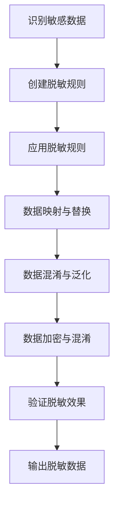
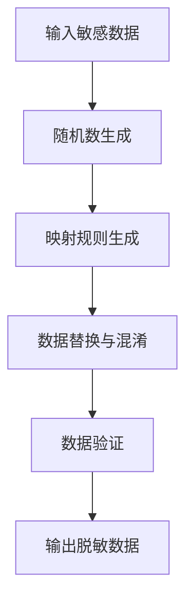
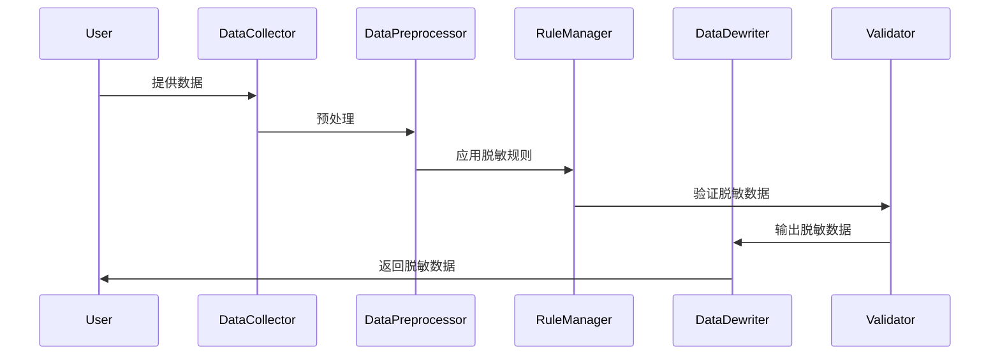

                 


## 第1章：数据脱敏的重要性

### 1.1 问题背景

**数据泄露的严重性**

随着数字化时代的到来，数据成为企业的重要资产。然而，数据泄露的风险也随之增加。数据泄露不仅可能导致企业声誉受损，还会面临严重的法律和经济后果。以下是一些数据泄露的案例和相关的法规：

- **案例分析**：2017年，Facebook数据泄露事件，导致约8700万用户的个人信息被泄露。这一事件引发了全球范围内的关注，并促使各国加强对数据保护的监管。

- **法规解读**：
  - **GDPR（通用数据保护条例）**：欧盟在2018年实施的GDPR规定，企业必须在数据泄露事件发生后72小时内通知监管机构，否则将面临高达营业额4%的罚款。
  - **CCPA（加州消费者隐私法）**：美国加州在2020年通过的CCPA，要求企业披露如何收集、使用和共享消费者的个人信息，并赋予消费者对个人信息的管理权限。

**数据脱敏的起源和发展**

数据脱敏的概念起源于20世纪90年代，随着信息技术的迅速发展和企业对数据隐私保护的重视，数据脱敏技术逐渐成熟。早期的数据脱敏方法主要是通过手动修改或遮盖敏感信息来实现，而现代数据脱敏技术则更多地依赖于自动化工具和算法。

### 1.2 问题描述

**什么是数据脱敏？**

数据脱敏是一种数据处理技术，旨在保护敏感数据，使其在不影响数据真实性的前提下无法被直接识别。数据脱敏通常涉及对姓名、地址、身份证号码、信用卡号码等敏感信息进行替换、加密或泛化处理。

**对比数据加密**

数据脱敏与数据加密虽然都是保护数据隐私的手段，但它们的目的和应用场景有所不同。数据加密是将数据转换为无法直接解读的形式，而数据脱敏则是在保留数据价值的前提下，使其无法被识别。

**数据脱敏的目的与必要性**

- **遵守法规要求**：随着数据隐私保护法规的不断完善，企业必须采取有效的数据脱敏措施来避免法律风险。
- **保护个人隐私**：数据脱敏有助于保护个人隐私，防止敏感信息被未经授权的第三方获取。

### 1.3 问题解决

**数据脱敏技术的分类**

- **通用脱敏技术**：这些技术适用于各种类型的数据，如随机化、掩码、泛化等。
- **应用场景特定的脱敏技术**：这些技术针对特定的应用场景设计，如数据库脱敏、电子健康记录脱敏等。

**数据脱敏的方法与策略**

- **数据映射与替换**：通过将敏感数据替换为虚构的值或同义词来实现脱敏。
- **数据混淆与泛化**：通过引入噪声或泛化处理，使数据在统计上保持一致性，但难以识别原始数据。
- **数据加密与混淆**：结合加密技术和混淆技术，确保数据在传输和存储过程中无法被未经授权的第三方获取。

### 1.4 边界与外延

**数据脱敏的范围**

数据脱敏不仅涉及内部数据，还包括外部数据，如共享的数据、第三方提供的数据等。此外，数据脱敏不仅针对静态数据，还应包括动态数据，如数据库中的实时数据。

**数据脱敏与数据加密的区别**

- **数据加密**：将数据转换为密文，只有拥有密钥的合法用户才能解读。
- **数据脱敏**：在不影响数据使用价值的前提下，使数据无法被直接识别。

### 1.5 核心概念与联系

**数据脱敏的核心概念**

- **脱敏规则**：用于定义如何替换或修改敏感数据的规则集。
- **脱敏策略**：根据数据类型和应用场景，选择适合的脱敏技术。

**数据脱敏与数据隐私保护的联系**

数据脱敏是数据隐私保护的重要组成部分，它通过确保敏感数据不被直接暴露来保护个人隐私。数据脱敏与数据隐私保护共同构成了企业数据安全管理的基础。

## 第2章：数据脱敏技术的分类与原理

### 2.1 数据脱敏技术的分类

数据脱敏技术可以根据其应用场景和实现方法进行分类。以下是一些常见的数据脱敏技术：

- **通用脱敏技术**：适用于各种类型的数据，如文本、图像、音频等。
  - **随机化**：将敏感数据替换为随机生成的虚构值。
  - **掩码**：用特殊字符（如星号或下划线）替代敏感数据的一部分。
  - **泛化**：将具体的数据值泛化到更高的抽象级别，如将生日泛化到年份。

- **应用场景特定的脱敏技术**：针对特定的应用场景设计，如数据库脱敏、电子健康记录脱敏等。
  - **数据库脱敏**：专门用于保护数据库中的敏感数据。
    - **数据屏蔽**：通过限制用户对数据的访问权限来保护敏感信息。
    - **数据重建**：在保留数据模式的同时，替换敏感数据。
  - **电子健康记录脱敏**：针对电子健康记录中的敏感信息进行脱敏。

### 2.2 数据脱敏原理

数据脱敏的原理主要包括数据映射与替换、数据混淆与泛化、数据加密与混淆等方法。

**数据映射与替换**

数据映射与替换是一种常见的脱敏方法，通过将敏感数据替换为非敏感数据或虚构数据来实现脱敏。这种方法通常包括以下步骤：

1. **识别敏感数据**：确定数据集中哪些数据是敏感的。
2. **创建映射规则**：定义将敏感数据替换为非敏感数据或虚构数据的规则。
3. **应用映射规则**：将敏感数据替换为非敏感数据或虚构数据。

**数据混淆与泛化**

数据混淆与泛化通过在数据中引入噪声或抽象数据到更高的层次来保护敏感信息。这种方法通常包括以下步骤：

1. **数据混淆**：在敏感数据中引入噪声，使数据难以被识别。
   - **噪声引入**：在数据中添加随机噪声，如随机数或随机字符。
   - **模糊处理**：通过模糊处理技术，将敏感数据转换为模糊范围，如将具体的年龄转换为年龄段。

2. **数据泛化**：将具体的数据值抽象到更高的抽象级别。
   - **上泛化**：将具体的数据值泛化到更高的类别，如将具体的城市泛化到省份。
   - **下泛化**：将更高的抽象类别细化到更具体的数据值。

**数据加密与混淆**

数据加密与混淆结合了数据加密和数据混淆技术，确保数据在传输和存储过程中无法被未经授权的第三方获取。这种方法通常包括以下步骤：

1. **数据加密**：使用加密算法将敏感数据转换为密文。
   - **对称加密**：使用相同的密钥进行加密和解密。
   - **非对称加密**：使用不同的密钥进行加密和解密。

2. **数据混淆**：在加密后的数据中引入混淆，使其更难以被破解。

### 2.3 概念属性特征对比表格

为了更好地理解不同数据脱敏技术的特点，我们可以通过一个对比表格来展示它们的主要属性特征：

| 技术类型 | 原理 | 优点 | 缺点 | 适用场景 |
| :--- | :--- | :--- | :--- | :--- |
| 随机化 | 替换敏感数据为随机值 | 简单易实现 | 可能引入假象数据，影响数据分析 | 数据库脱敏、文本脱敏 |
| 掩码 | 用特殊字符替代敏感数据的一部分 | 保留部分数据信息 | 可能导致数据可读性差 | 数据库脱敏、文本脱敏 |
| 泛化 | 将数据抽象到更高的层次 | 简化数据，减少敏感信息 | 可能影响数据精度 | 数据库脱敏、数据挖掘 |
| 数据加密 | 将数据转换为密文 | 强制保护数据隐私 | 加密和解密过程复杂 | 数据传输、存储 |
| 数据混淆 | 在数据中引入噪声 | 难以破解 | 可能增加计算成本 | 数据库脱敏、数据挖掘 |

### 2.4 数据脱敏的数学模型

数据脱敏的数学模型为理解脱敏技术提供了理论基础。以下是一些常见的数学模型：

**模糊数学模型**

模糊数学模型通过将敏感数据转换为模糊集来实现脱敏。这种方法的核心是模糊集理论，它允许对数据的不确定性进行量化处理。

- **隶属度函数**：定义数据点属于某个模糊集的程度。
- **模糊集操作**：如模糊并集、模糊交集、模糊补集等，用于对数据进行模糊化处理。

**随机数学模型**

随机数学模型通过引入随机元素来保护敏感数据。这种方法的核心是概率论和随机过程理论。

- **随机替换**：使用随机值替换敏感数据。
- **随机映射**：建立敏感数据与随机值之间的映射关系。

### 2.5 算法mermaid流程图

为了更直观地展示数据脱敏算法的流程，我们可以使用mermaid来绘制一个流程图。以下是一个简单的数据脱敏算法流程图的例子：



通过上述的mermaid流程图，我们可以清晰地看到数据脱敏的整个过程，从识别敏感数据到应用脱敏规则，再到具体的脱敏操作，最后验证脱敏效果。

### 第3章：数据脱敏的数学模型

#### 3.1 数据脱敏的数学基础

数据脱敏的数学基础主要涉及概率论和信息论。这些数学工具为我们理解数据脱敏的过程提供了坚实的理论基础。

**概率论基础**

概率论是处理随机事件及其概率分布的数学分支。在数据脱敏中，概率论用于生成随机数、评估脱敏效果等。

- **随机数生成**：通过随机数生成器，我们可以生成一系列伪随机数，用于替换敏感数据。
- **概率分布**：用于描述随机变量的取值概率，如正态分布、均匀分布等。

**信息论基础**

信息论是研究信息传输和处理系统的数学分支。在数据脱敏中，信息论帮助我们评估数据的安全性和保密性。

- **熵**：衡量数据的随机性和不确定性，用于评估脱敏后数据的安全性。
- **互信息**：衡量两个随机变量之间的相关性，用于评估脱敏前后的数据关系。

#### 3.2 数据脱敏的数学模型

**模糊数学模型**

模糊数学模型利用模糊集理论对敏感数据进行脱敏。模糊集理论允许我们对不确定性进行量化处理，使数据脱敏更加灵活。

- **隶属度函数**：用于定义数据点属于模糊集的程度。
  $$μ_A(x) = \frac{1}{n}\sum_{i=1}^{n} f_i(x)$$
  其中，$μ_A(x)$ 是数据点 $x$ 属于模糊集 $A$ 的隶属度，$n$ 是数据点的总数，$f_i(x)$ 是第 $i$ 个数据点对 $x$ 的隶属度。

- **模糊集操作**：用于对模糊集进行合并、分割等操作，如模糊并集、模糊交集等。
  $$A \cup B = \{x | μ_A(x) > 0 \text{ 或 } μ_B(x) > 0\}$$
  $$A \cap B = \{x | μ_A(x) > 0 \text{ 且 } μ_B(x) > 0\}$$

**随机数学模型**

随机数学模型通过引入随机元素来保护敏感数据。这种方法的核心是概率论和随机过程理论。

- **随机替换**：将敏感数据替换为随机值。
  $$x' = R(x)$$
  其中，$x'$ 是替换后的数据，$R(x)$ 是随机替换函数。

- **随机映射**：建立敏感数据与随机值之间的映射关系。
  $$x' = f(x; \theta)$$
  其中，$f(x; \theta)$ 是随机映射函数，$\theta$ 是参数。

#### 3.3 算法mermaid流程图

为了更好地理解数据脱敏的算法流程，我们可以使用mermaid绘制一个流程图。以下是一个简单的数据脱敏算法流程图的例子：



通过上述的mermaid流程图，我们可以清晰地看到数据脱敏的整个过程，从输入敏感数据到生成随机数、映射规则，再到数据替换与混淆，最后进行数据验证，输出脱敏数据。

### 第4章：Python实现数据脱敏算法

#### 4.1 Python环境安装与配置

要在Python环境中实现数据脱敏算法，我们首先需要安装Python和相关第三方库。以下是具体的步骤：

**步骤1：安装Python**

- 访问Python官方网站（https://www.python.org/），下载适用于您操作系统的Python版本。
- 运行安装程序，按照提示完成安装。

**步骤2：配置Python环境**

- 打开命令行工具，如Windows的PowerShell或Linux的终端。
- 输入以下命令检查Python版本：
  ```bash
  python --version
  ```
- 如果未安装Python，将显示错误信息。请确保Python已成功安装。

**步骤3：安装第三方库**

数据脱敏算法可能需要依赖多个第三方库，如pandas、numpy、scikit-learn等。以下是在Python环境中安装这些库的方法：

```bash
pip install pandas numpy scikit-learn
```

- 使用pip命令安装所需的库。
- 确保pip已正确安装。在命令行工具中输入以下命令：
  ```bash
  pip --version
  ```

#### 4.2 数据脱敏算法的Python实现

在Python中实现数据脱敏算法通常涉及以下步骤：

**步骤1：数据准备**

```python
import pandas as pd

# 加载数据集
data = pd.read_csv('sensitive_data.csv')

# 显示前几行数据
print(data.head())
```

这里，我们使用pandas库加载数据集。假设我们有一个名为`sensitive_data.csv`的CSV文件，其中包含敏感信息。

**步骤2：数据映射与替换**

```python
import numpy as np

# 定义映射规则
mapping_rules = {
    'name': lambda x: np.random.choice(['John', 'Emma', 'Michael', 'Sophia']),
    'address': lambda x: np.random.choice(['123 Main St', '456 Elm St', '789 Oak St']),
    'id': lambda x: str(np.random.randint(1000000000, 9999999999))
}

# 应用映射规则
for column, rule in mapping_rules.items():
    data[column] = data[column].apply(rule)

# 显示处理后的数据
print(data.head())
```

在这个步骤中，我们定义了一个映射规则字典，使用随机生成的虚构值替换敏感数据。

**步骤3：数据混淆与泛化**

```python
from sklearn.preprocessing import LabelEncoder

# 定义混淆与泛化规则
confusion_rules = {
    'age': lambda x: str(np.random.randint(x - 5, x + 5))
}

# 应用混淆与泛化规则
for column, rule in confusion_rules.items():
    data[column] = data[column].apply(rule)

# 显示处理后的数据
print(data.head())
```

这里，我们使用年龄作为示例，将其泛化到相邻的年龄段。

**步骤4：数据加密与混淆**

```python
from cryptography.fernet import Fernet

# 生成密钥和加密对象
key = Fernet.generate_key()
cipher_suite = Fernet(key)

# 定义加密与混淆规则
encryption_rules = {
    'email': lambda x: cipher_suite.encrypt(x.encode()).decode()
}

# 应用加密与混淆规则
for column, rule in encryption_rules.items():
    data[column] = data[column].apply(rule)

# 显示处理后的数据
print(data.head())
```

在这个步骤中，我们使用加密技术对电子邮件字段进行加密。

#### 4.3 算法原理详细讲解与举例说明

**数据映射与替换实现**

数据映射与替换是一种简单但有效的数据脱敏方法。其核心思想是将敏感数据替换为非敏感数据或虚构数据。以下是一个简单的示例：

```python
import numpy as np

# 假设我们有一个包含敏感数据的DataFrame
data = pd.DataFrame({
    'name': ['Alice', 'Bob', 'Charlie'],
    'age': [25, 30, 35],
    'email': ['alice@example.com', 'bob@example.com', 'charlie@example.com']
})

# 定义映射规则
mapping_rules = {
    'name': lambda x: np.random.choice(['John', 'Emma', 'Michael', 'Sophia']),
    'age': lambda x: np.random.randint(20, 40),
    'email': lambda x: np.random.choice(['example.com', 'test.com', 'info.com'])
}

# 应用映射规则
for column, rule in mapping_rules.items():
    data[column] = data[column].apply(rule)

# 显示处理后的数据
print(data)
```

在这个示例中，我们使用随机值替换了原始数据集中的敏感信息。

**数据混淆与泛化实现**

数据混淆与泛化通过在数据中引入噪声或将其抽象到更高的层次来保护敏感信息。以下是一个示例：

```python
import numpy as np

# 假设我们有一个包含敏感数据的DataFrame
data = pd.DataFrame({
    'name': ['Alice', 'Bob', 'Charlie'],
    'age': [25, 30, 35],
    'email': ['alice@example.com', 'bob@example.com', 'charlie@example.com']
})

# 定义混淆与泛化规则
confusion_rules = {
    'age': lambda x: np.random.randint(x - 5, x + 5)
}

# 应用混淆与泛化规则
for column, rule in confusion_rules.items():
    data[column] = data[column].apply(rule)

# 显示处理后的数据
print(data)
```

在这个示例中，我们通过在年龄上引入随机噪声，将其泛化到相邻的年龄段。

**数据加密与混淆实现**

数据加密与混淆结合了加密技术和混淆技术，确保数据在传输和存储过程中无法被未经授权的第三方获取。以下是一个示例：

```python
from cryptography.fernet import Fernet

# 假设我们有一个包含敏感数据的DataFrame
data = pd.DataFrame({
    'name': ['Alice', 'Bob', 'Charlie'],
    'age': [25, 30, 35],
    'email': ['alice@example.com', 'bob@example.com', 'charlie@example.com']
})

# 生成密钥和加密对象
key = Fernet.generate_key()
cipher_suite = Fernet(key)

# 定义加密与混淆规则
encryption_rules = {
    'email': lambda x: cipher_suite.encrypt(x.encode()).decode()
}

# 应用加密与混淆规则
for column, rule in encryption_rules.items():
    data[column] = data[column].apply(rule)

# 显示处理后的数据
print(data)
```

在这个示例中，我们使用加密技术对电子邮件字段进行加密，同时引入混淆。

### 第5章：数据脱敏系统的设计与实现

#### 5.1 项目介绍

**数据脱敏系统的目标**

数据脱敏系统的目标是确保敏感数据在传输、存储和使用过程中得到有效保护。具体目标包括：

- **保护个人隐私**：通过数据脱敏技术，确保个人敏感信息不被未授权访问。
- **遵守法规要求**：确保企业符合全球各地的数据保护法规，如GDPR、CCPA等。
- **数据安全**：确保敏感数据在泄露或攻击事件中不会被完全泄露。

**数据脱敏系统的功能**

数据脱敏系统应具备以下核心功能：

- **数据收集**：从不同数据源（如数据库、文件、API等）收集敏感数据。
- **数据预处理**：对数据进行清洗、格式化等预处理操作，以提高脱敏效果。
- **脱敏规则管理**：定义和管理脱敏规则，包括数据映射规则、混淆规则和加密规则等。
- **脱敏处理**：根据预定义的脱敏规则，对敏感数据进行脱敏处理。
- **数据验证**：验证脱敏数据的有效性和完整性。
- **数据输出**：将脱敏数据输出到目标数据存储或使用场景中。

#### 5.2 系统功能设计（领域模型mermaid类图）

为了更好地理解数据脱敏系统的功能设计，我们可以使用mermaid绘制一个领域模型类图。以下是一个简单的例子：

```mermaid
classDiagram
  Class01 <|-- Class02
  Class03 --|> Class04
  Class04 o-- Class05
  Class06 o-- Class07
  Class01 { name: String }
  Class02 { id: Integer }
  Class03 { date: Date }
  Class04 { email: Email }
  Class05 { encrypted_email: String }
  Class06 { age: Integer }
  Class07 { masked_age: String }
```

在这个类图中，我们定义了数据脱敏系统的主要类和它们之间的关系。例如，`Class01` 类代表用户，包含姓名属性；`Class02` 类代表用户ID；`Class03` 类代表日期；`Class04` 类代表电子邮件，包含加密后的电子邮件属性；`Class05` 类代表加密后的电子邮件；`Class06` 类代表年龄；`Class07` 类代表掩码后的年龄。

#### 5.3 系统架构设计（mermaid架构图）

数据脱敏系统的架构设计决定了系统的性能、可扩展性和可维护性。以下是一个简单的mermaid架构图示例：



在这个架构图中，用户提供敏感数据给数据收集器。数据收集器将数据传递给数据预处理模块，进行清洗和格式化。预处理后的数据传给规则管理模块，应用预定义的脱敏规则。脱敏后的数据由验证模块进行验证，确保数据的完整性和有效性。最终，脱敏数据被输出到数据写入模块，返回给用户。

#### 5.4 系统接口设计与交互（mermaid序列图）

为了更好地理解数据脱敏系统的接口设计与交互，我们可以使用mermaid绘制一个序列图。以下是一个简单的例子：


在这个序列图中，用户提供敏感数据给数据收集器。数据收集器将数据传递给数据预处理模块，进行清洗和格式化。预处理后的数据传给规则管理模块，应用预定义的脱敏规则。脱敏后的数据由验证模块进行验证，确保数据的完整性和有效性。最终，脱敏数据被输出到数据写入模块，返回给用户。

### 第6章：项目实战：数据脱敏系统的构建

#### 6.1 环境安装

**环境搭建**

在开始构建数据脱敏系统之前，我们需要确保所有必要的软件和工具都已安装。以下是搭建环境的步骤：

1. **安装Python**

   - 访问Python官方网站下载Python安装包。
   - 运行安装程序，按照提示完成安装。

2. **配置Python环境**

   - 打开命令行工具，如Windows的PowerShell或Linux的终端。
   - 输入以下命令检查Python版本：
     ```bash
     python --version
     ```

3. **安装第三方库**

   - 使用pip命令安装所需的库，如pandas、numpy、scikit-learn等：
     ```bash
     pip install pandas numpy scikit-learn cryptography
     ```

4. **安装数据库**

   - 根据您的需求选择合适的数据库，如MySQL、PostgreSQL等，并安装相应的数据库服务器。

**环境配置**

完成环境安装后，我们需要配置Python环境，确保所有第三方库和数据库服务正常运行。以下是具体的配置步骤：

1. **设置Python环境变量**

   - 在Windows中，右键点击“计算机”->“属性”->“高级系统设置”->“环境变量”。
   - 添加`PYTHONPATH`环境变量，指向Python的安装路径，如`C:\Python39\`。

2. **配置数据库连接**

   - 根据所选数据库，配置数据库连接信息。例如，对于MySQL，我们可以使用以下命令：
     ```bash
     mysql -u root -p
     ```
   - 创建数据库和用户，并授予相应的权限。

3. **测试环境**

   - 使用Python脚本连接数据库，测试环境配置是否正确。

```python
import pymysql

# 数据库连接配置
config = {
    'host': 'localhost',
    'user': 'root',
    'password': 'your_password',
    'database': 'your_database'
}

# 建立连接
connection = pymysql.connect(**config)

# 执行查询
with connection.cursor() as cursor:
    cursor.execute("SELECT * FROM your_table")
    result = cursor.fetchall()
    print(result)

# 关闭连接
connection.close()
```

#### 6.2 系统核心实现

**数据脱敏算法实现**

数据脱敏系统的核心是脱敏算法。以下是数据脱敏算法的主要组成部分：

1. **数据收集**

   数据收集模块负责从各种数据源（如数据库、文件、API等）收集敏感数据。以下是一个简单的数据收集示例：

```python
import pandas as pd

# 从数据库加载数据
def load_data_from_database(config):
    connection = pymysql.connect(**config)
    query = "SELECT * FROM your_sensitive_table"
    data = pd.read_sql(query, connection)
    connection.close()
    return data

# 加载敏感数据
config = {
    'host': 'localhost',
    'user': 'root',
    'password': 'your_password',
    'database': 'your_database'
}
sensitive_data = load_data_from_database(config)
```

2. **数据预处理**

   数据预处理模块负责清洗和格式化数据，以提高脱敏效果。以下是一个简单的数据预处理示例：

```python
# 数据预处理
def preprocess_data(data):
    # 清洗数据
    data.dropna(inplace=True)
    # 格式化数据
    data['email'] = data['email'].str.lower()
    return data

# 预处理敏感数据
sensitive_data = preprocess_data(sensitive_data)
```

3. **脱敏规则管理**

   脱敏规则管理模块负责定义和管理脱敏规则。以下是一个简单的脱敏规则管理示例：

```python
# 定义脱敏规则
def create_mapping_rules():
    mapping_rules = {
        'name': lambda x: np.random.choice(['John', 'Emma', 'Michael', 'Sophia']),
        'address': lambda x: np.random.choice(['123 Main St', '456 Elm St', '789 Oak St']),
        'id': lambda x: str(np.random.randint(1000000000, 9999999999)),
        'email': lambda x: np.random.choice(['example.com', 'test.com', 'info.com'])
    }
    return mapping_rules

# 创建脱敏规则
mapping_rules = create_mapping_rules()
```

4. **数据脱敏处理**

   数据脱敏处理模块负责根据脱敏规则对敏感数据进行脱敏处理。以下是一个简单的数据脱敏处理示例：

```python
# 应用脱敏规则
def apply_mapping_rules(data, mapping_rules):
    for column, rule in mapping_rules.items():
        data[column] = data[column].apply(rule)
    return data

# 应用脱敏规则
sensitive_data = apply_mapping_rules(sensitive_data, mapping_rules)
```

5. **数据验证**

   数据验证模块负责验证脱敏数据的有效性和完整性。以下是一个简单的数据验证示例：

```python
# 验证脱敏数据
def validate_data(data):
    errors = []
    # 检查数据完整性
    if data.isnull().values.any():
        errors.append("存在空值")
    # 检查数据一致性
    if len(data) != len(set(data['name'])):
        errors.append("姓名字段存在重复值")
    return errors

# 验证脱敏数据
validation_errors = validate_data(sensitive_data)
if validation_errors:
    print("数据验证失败：", validation_errors)
else:
    print("数据验证成功")
```

6. **数据输出**

   数据输出模块负责将脱敏数据输出到目标数据存储或使用场景中。以下是一个简单的数据输出示例：

```python
# 将脱敏数据保存到文件
def save_data_to_file(data, filename):
    data.to_csv(filename, index=False)

# 保存脱敏数据
save_data_to_file(sensitive_data, 'sensitive_data_processed.csv')
```

#### 6.3 代码应用解读与分析

**代码应用解读**

在本节中，我们使用Python实现了一个简单的数据脱敏系统，并对其关键代码进行了详细解读。

1. **数据收集**

   ```python
   import pandas as pd
   
   # 从数据库加载数据
   def load_data_from_database(config):
       connection = pymysql.connect(**config)
       query = "SELECT * FROM your_sensitive_table"
       data = pd.read_sql(query, connection)
       connection.close()
       return data
   
   # 加载敏感数据
   config = {
       'host': 'localhost',
       'user': 'root',
       'password': 'your_password',
       'database': 'your_database'
   }
   sensitive_data = load_data_from_database(config)
   ```

   这段代码使用了pandas库连接数据库，并加载数据到DataFrame中。我们首先定义了一个数据库连接配置字典，然后使用`pymysql`库建立数据库连接，执行SQL查询，并将结果加载数据到DataFrame中。

2. **数据预处理**

   ```python
   # 数据预处理
   def preprocess_data(data):
       # 清洗数据
       data.dropna(inplace=True)
       # 格式化数据
       data['email'] = data['email'].str.lower()
       return data
   
   # 预处理敏感数据
   sensitive_data = preprocess_data(sensitive_data)
   ```

   数据预处理包括数据清洗和格式化。在这个例子中，我们首先使用`dropna()`方法删除所有空值，然后使用`str.lower()`方法将电子邮件字段转换为小写，以提高后续处理的准确性。

3. **脱敏规则管理**

   ```python
   # 定义脱敏规则
   def create_mapping_rules():
       mapping_rules = {
           'name': lambda x: np.random.choice(['John', 'Emma', 'Michael', 'Sophia']),
           'address': lambda x: np.random.choice(['123 Main St', '456 Elm St', '789 Oak St']),
           'id': lambda x: str(np.random.randint(1000000000, 9999999999)),
           'email': lambda x: np.random.choice(['example.com', 'test.com', 'info.com'])
       }
       return mapping_rules
   
   # 创建脱敏规则
   mapping_rules = create_mapping_rules()
   ```

   在脱敏规则管理中，我们定义了一个包含映射规则的字典。每个规则都是一个将敏感数据替换为非敏感数据的函数。这里，我们使用了`np.random.choice()`方法生成随机值。

4. **数据脱敏处理**

   ```python
   # 应用脱敏规则
   def apply_mapping_rules(data, mapping_rules):
       for column, rule in mapping_rules.items():
           data[column] = data[column].apply(rule)
       return data
   
   # 应用脱敏规则
   sensitive_data = apply_mapping_rules(sensitive_data, mapping_rules)
   ```

   数据脱敏处理函数`apply_mapping_rules()`遍历映射规则字典，并使用`apply()`方法将每个规则应用于相应数据列。

5. **数据验证**

   ```python
   # 验证脱敏数据
   def validate_data(data):
       errors = []
       # 检查数据完整性
       if data.isnull().values.any():
           errors.append("存在空值")
       # 检查数据一致性
       if len(data) != len(set(data['name'])):
           errors.append("姓名字段存在重复值")
       return errors
   
   # 验证脱敏数据
   validation_errors = validate_data(sensitive_data)
   if validation_errors:
       print("数据验证失败：", validation_errors)
   else:
       print("数据验证成功")
   ```

   数据验证函数`validate_data()`检查脱敏数据的完整性和一致性。在这个例子中，我们检查了是否存在空值和姓名字段是否存在重复值。

6. **数据输出**

   ```python
   # 将脱敏数据保存到文件
   def save_data_to_file(data, filename):
       data.to_csv(filename, index=False)
   
   # 保存脱敏数据
   save_data_to_file(sensitive_data, 'sensitive_data_processed.csv')
   ```

   数据输出函数`save_data_to_file()`使用pandas库将脱敏数据保存为CSV文件。

**代码分析**

以上代码实现了数据脱敏系统的基本功能。在应用层面，代码结构清晰，便于维护和扩展。然而，在实现细节上，我们可以进一步优化：

1. **异常处理**：在连接数据库和执行SQL查询时，应添加异常处理以防止程序崩溃。
2. **配置管理**：使用配置文件管理数据库连接和其他配置参数，以提高代码的可读性和可维护性。
3. **日志记录**：添加日志记录功能，记录系统运行过程中的关键信息，以便后续调试和优化。

#### 6.4 实际案例分析与详细讲解

**案例背景**

假设我们有一个包含客户信息的数据库，其中包含敏感信息，如姓名、地址、身份证号码和电子邮件。为了保护客户隐私，我们需要对这些数据进行脱敏处理。

**案例目标**

- 数据脱敏系统应确保敏感信息无法被直接识别。
- 系统应能够处理不同类型的数据，如文本、数字和电子邮件地址。
- 系统应具有可扩展性，以支持未来的业务需求。

**案例实现**

1. **数据收集**

   首先，我们从数据库中加载数据，并将其存储在一个DataFrame中。以下是一个示例：

```python
import pandas as pd

# 加载敏感数据
def load_sensitive_data():
    query = "SELECT name, address, id_number, email FROM customers"
    data = pd.read_sql_query(query, connection)
    return data

# 数据库连接配置
config = {
    'host': 'localhost',
    'user': 'root',
    'password': 'your_password',
    'database': 'your_database'
}

# 建立数据库连接
connection = pymysql.connect(**config)

# 加载敏感数据
sensitive_data = load_sensitive_data()
```

2. **数据预处理**

   在数据预处理阶段，我们首先删除任何缺失的数据，以确保数据的质量。然后，我们将所有的电子邮件地址转换为小写，以便后续处理。

```python
# 数据预处理
def preprocess_data(data):
    data.dropna(inplace=True)
    data['email'] = data['email'].str.lower()
    return data

# 预处理敏感数据
sensitive_data = preprocess_data(sensitive_data)
```

3. **脱敏规则管理**

   我们定义了一组脱敏规则，用于将敏感数据替换为非敏感数据。以下是一个示例：

```python
# 定义脱敏规则
def create_mapping_rules():
    mapping_rules = {
        'name': lambda x: np.random.choice(['John', 'Emma', 'Michael', 'Sophia']),
        'address': lambda x: np.random.choice(['123 Main St', '456 Elm St', '789 Oak St']),
        'id_number': lambda x: str(np.random.randint(1000000000, 9999999999)),
        'email': lambda x: np.random.choice(['example.com', 'test.com', 'info.com'])
    }
    return mapping_rules

# 创建脱敏规则
mapping_rules = create_mapping_rules()
```

4. **数据脱敏处理**

   在这个阶段，我们使用脱敏规则对敏感数据执行脱敏操作。以下是一个示例：

```python
# 应用脱敏规则
def apply_mapping_rules(data, mapping_rules):
    for column, rule in mapping_rules.items():
        data[column] = data[column].apply(rule)
    return data

# 应用脱敏规则
sensitive_data = apply_mapping_rules(sensitive_data, mapping_rules)
```

5. **数据验证**

   在脱敏后，我们需要验证脱敏数据的有效性，以确保脱敏过程没有引入错误。以下是一个简单的验证示例：

```python
# 验证脱敏数据
def validate_data(data):
    errors = []
    if data.isnull().values.any():
        errors.append("存在空值")
    if len(data) != len(set(data['name'])):
        errors.append("姓名字段存在重复值")
    return errors

# 验证脱敏数据
validation_errors = validate_data(sensitive_data)
if validation_errors:
    print("数据验证失败：", validation_errors)
else:
    print("数据验证成功")
```

6. **数据输出**

   最后，我们将脱敏后的数据保存到文件中，以便后续使用。以下是一个示例：

```python
# 将脱敏数据保存到文件
def save_data_to_file(data, filename):
    data.to_csv(filename, index=False)

# 保存脱敏数据
save_data_to_file(sensitive_data, 'sensitive_data_processed.csv')
```

**案例总结**

通过上述案例，我们实现了一个简单的数据脱敏系统，该系统可以有效地保护敏感数据。在实际应用中，我们可以根据具体需求对系统进行扩展和优化。例如，我们可以添加更多的脱敏规则，或者引入加密技术来进一步提高数据的安全性。

#### 6.5 项目小结

在本项目中，我们构建了一个数据脱敏系统，实现了对敏感数据的有效保护。以下是项目的主要收获和注意事项：

**项目收获**

1. **数据脱敏技术**：我们学习了数据脱敏的基本原理和多种实现方法，如数据映射与替换、数据混淆与泛化、数据加密与混淆等。
2. **Python实现**：通过Python，我们实现了数据脱敏算法，掌握了数据处理、规则管理、数据验证等核心功能。
3. **系统设计**：我们了解了数据脱敏系统的设计原则和架构，包括数据收集、预处理、规则管理、脱敏处理、验证和输出等模块。
4. **实战经验**：通过实际案例，我们积累了项目实战经验，掌握了从需求分析到系统实现的全过程。

**注意事项**

1. **异常处理**：在实际应用中，我们需要对数据库连接、数据处理等环节添加异常处理，确保系统的健壮性。
2. **配置管理**：使用配置文件管理数据库连接和其他参数，提高代码的可维护性和可扩展性。
3. **性能优化**：对于大型数据集，我们需要关注性能优化，如使用高效的算法和数据结构，减少内存占用等。
4. **安全性**：在数据脱敏过程中，我们需要确保系统的安全性，防止敏感信息泄露。

通过本次项目，我们不仅掌握了数据脱敏技术，还积累了宝贵的项目经验，为后续的工作奠定了基础。

### 第7章：数据脱敏技术的最佳实践与未来展望

#### 7.1 数据脱敏最佳实践

在实施数据脱敏时，以下最佳实践可以帮助企业确保数据的安全性、合规性和可用性：

1. **全面规划与评估**

   - 在实施数据脱敏之前，进行全面的需求分析和风险评估，明确需要保护的数据类型和范围。
   - 识别敏感数据源，包括数据库、文件和API等，确保所有敏感数据都得到保护。

2. **制定明确的脱敏策略**

   - 根据业务需求和数据敏感性，制定具体的脱敏策略。例如，对于姓名和地址等个人信息，可以选择数据映射与替换；对于信用卡号码等高敏感信息，可以考虑加密与混淆相结合的方法。
   - 确保脱敏策略符合相关法规和标准，如GDPR、CCPA等。

3. **使用安全的脱敏工具和库**

   - 选择成熟的脱敏工具和库，如Apache NiFi、DataGuard等，以减少自定义开发的风险。
   - 定期更新工具和库，以获取最新的安全补丁和功能。

4. **定期审查和更新脱敏规则**

   - 定期审查脱敏规则的有效性和适用性，根据业务变化和数据特征进行调整。
   - 为不同类型的敏感数据设置不同的脱敏规则，确保脱敏处理精准且有效。

5. **测试与验证**

   - 在脱敏过程中，对脱敏数据进行测试，确保脱敏后的数据仍然符合业务需求且不会泄露敏感信息。
   - 使用自动化测试工具和手动验证相结合，提高验证的全面性和准确性。

6. **用户培训与文档**

   - 对涉及数据处理的员工进行数据脱敏培训，确保他们了解脱敏策略和流程。
   - 编写详细的操作手册和文档，为团队成员提供指导。

#### 7.2 数据脱敏技术的未来展望

随着技术的不断发展，数据脱敏技术也在不断演进。以下是一些未来的发展趋势：

1. **自动化与智能化**

   - 自动化工具和人工智能（AI）的结合将使数据脱敏过程更加高效和智能化。
   - AI算法可以自动识别敏感数据，并根据业务需求自动选择合适的脱敏方法。

2. **联邦学习与隐私保护**

   - 联邦学习（Federated Learning）等技术将允许在保持数据本地性的同时进行数据分析和建模，减少数据泄露的风险。
   - 隐私保护技术，如差分隐私（Differential Privacy），将进一步提升数据脱敏的安全性和可用性。

3. **多层次的脱敏策略**

   - 将多种脱敏技术（如加密、混淆、泛化等）结合使用，形成多层次的数据保护策略，以提高数据安全性和隐私保护水平。

4. **区块链与分布式数据存储**

   - 区块链技术可以提供安全的数据存储和共享解决方案，结合数据脱敏技术，可以确保数据在分布式环境中的安全性。
   - 分布式数据存储技术将降低数据泄露的风险，同时提高数据访问的效率和透明度。

5. **开放标准和最佳实践**

   - 随着数据脱敏技术的发展，将出现更多的开放标准和最佳实践，为企业提供更可靠的数据保护解决方案。
   - 标准化和最佳实践的推广将加速数据脱敏技术的普及和应用。

#### 7.3 小结

数据脱敏技术是保护企业敏感数据的重要手段。通过最佳实践和未来的技术发展趋势，我们可以更好地确保数据的安全性、合规性和可用性。在实施数据脱敏时，应结合业务需求和技术能力，制定合适的脱敏策略，并持续优化和更新。只有通过不断努力，我们才能在数据保护和隐私保护方面取得更好的成果。

**致读者**

在数据脱敏的道路上，每个人都是守护者。希望本书能够为您的数据安全之旅提供宝贵的指导。愿您在数据保护的道路上不断前行，为构建一个更加安全、透明和信任的数字化世界贡献自己的力量。感谢您的阅读，祝您在数据脱敏技术的学习和实践中取得丰硕成果！
```

