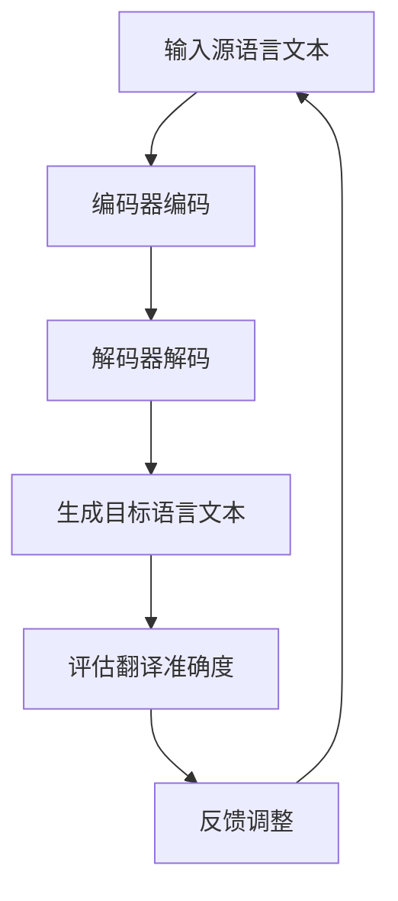

                 


### 第一部分：引言与背景

#### 第1章：翻译技术的发展与提示词的作用

在信息时代，翻译技术的快速发展极大地推动了全球交流的便利性和效率。然而，多语言翻译的挑战仍然存在，特别是翻译准确度的提升一直是研究者和开发者们关注的焦点。

##### 1.1 翻译技术的发展

翻译技术的发展可以分为几个阶段：从最早的机械翻译、规则翻译到基于统计的翻译，再到近年来迅速发展的神经网络翻译（Neural Machine Translation，NMT）。NMT的出现极大地提升了翻译质量，它通过模拟人类的翻译过程，实现了更为流畅和自然的翻译结果。

##### 1.2 提示词的作用

提示词（Prompt）在翻译中扮演着重要的角色。它是指在翻译过程中，为了引导翻译模型更好地理解上下文和目标语言风格而提供的额外信息。通过合理设计提示词，可以提高翻译模型的准确性和上下文理解能力。

##### 1.3 多语言翻译的挑战与现状

多语言翻译面临的挑战主要包括语言多样性、翻译资源的不足以及跨语言表达的复杂性。目前，虽然神经网络翻译技术已经取得了显著的进展，但仍然存在一些问题，如对专业领域翻译的支持不足、对于特定语言组合的翻译效果不理想等。

##### 1.4 本书结构安排与内容概述

本书旨在深入探讨新一代翻译引擎中提示词的应用，以提升多语言翻译的准确度。本书将分为以下几个部分：

- **第1章**：引言与背景介绍，介绍翻译技术的发展历程和提示词的作用。
- **第2章**：新一代翻译引擎的基本原理，阐述翻译引擎的概念和工作原理。
- **第3章**：提示词的设计与应用，探讨提示词的设计方法和实际应用。
- **第4章**：多语言翻译的挑战与现状，分析多语言翻译中存在的问题。
- **第5章**：提升翻译准确度的算法原理，讲解如何通过算法提升翻译准确度。
- **第6章**：提示词在多语言翻译中的应用，探讨提示词在多语言翻译中的具体应用。
- **第7章**：实际案例与项目实战，通过具体案例展示提示词的应用效果。
- **第8章**：总结与展望，总结全书内容并对未来发展趋势进行展望。

通过本书的深入探讨，读者将了解新一代翻译引擎的工作原理，掌握提示词的设计和应用方法，从而为提升多语言翻译准确度提供理论支持和实践指导。

### 第二部分：新一代翻译引擎的基本原理

#### 第2章：新一代翻译引擎的原理

新一代翻译引擎的核心在于其先进的技术架构和高效的算法实现，这使得翻译结果不仅更加准确，而且更加自然。在本章中，我们将详细探讨新一代翻译引擎的基本原理。

##### 2.1 新一代翻译引擎的概念

新一代翻译引擎是指基于深度学习的神经网络翻译技术，通过模拟人类的翻译过程，实现从一种语言到另一种语言的自动转换。与传统翻译方法相比，新一代翻译引擎具有更高的准确性和更好的上下文理解能力。

##### 2.2 翻译引擎的工作原理

新一代翻译引擎的工作原理主要包括两个核心组件：编码器（Encoder）和解码器（Decoder）。

- **编码器**：编码器负责将源语言的文本转换为固定长度的编码表示。这一过程可以看作是提取文本的特征信息，使其能够被神经网络理解。

- **解码器**：解码器则将编码器的输出解码为目标语言的文本。解码器通过预测下一个单词或短语，逐步构建翻译结果。

##### 2.3 提示词在翻译引擎中的运用

提示词在新一代翻译引擎中起到了关键作用。提示词的设计目的是为了提供更多的上下文信息，帮助翻译引擎更好地理解源语言文本的含义和目标语言的风格。

- **提示词的基本原理**：提示词是一段与源语言文本相关的文本，它可以是一个句子、一段话甚至是一篇文章。通过在翻译过程中加入提示词，可以使翻译引擎更准确地捕捉到源语言的语义和语境。

- **提示词在翻译中的效果分析**：实验证明，合理的提示词设计可以显著提升翻译的准确度。提示词不仅能够提高翻译的流畅性，还能更好地保留原文的含义和风格。

##### 2.4 新一代翻译引擎的发展趋势

随着深度学习和人工智能技术的不断进步，新一代翻译引擎的发展趋势体现在以下几个方面：

- **技术创新**：神经网络翻译技术正在不断发展，新的模型和算法不断涌现，如Transformer模型、BERT模型等，这些技术极大地提升了翻译的准确性和效率。

- **应用场景扩展**：新一代翻译引擎不仅应用于文本翻译，还扩展到语音翻译、图像翻译等多种形式。随着技术的成熟，翻译引擎的应用领域将更加广泛。

通过本章的探讨，读者将了解新一代翻译引擎的基本原理和工作流程，认识到提示词在其中的重要性，以及新一代翻译引擎的发展趋势。这为后续章节中深入讨论提示词的设计和应用提供了坚实的基础。

### 第三部分：提示词的设计与应用

#### 第3章：提示词的设计方法

提示词的设计是提升多语言翻译准确度的重要环节。在本章中，我们将详细探讨提示词的设计方法，包括其核心要素、生成技术以及优化方法。

##### 3.1 提示词设计的核心要素

提示词设计的核心要素包括语言特征和翻译目标。

- **语言特征**：不同语言具有不同的语法结构、词汇选择和文化背景，提示词设计需要充分考虑这些语言特征。例如，在处理英语和中文之间的翻译时，需要考虑两者的句子结构差异。

- **翻译目标**：翻译目标是指翻译的目的和受众。例如，商务翻译需要正式、专业的语言风格，而旅游翻译则需要更口语化、生动的表达。

##### 3.2 提示词生成技术

提示词的生成可以通过数据驱动和知识驱动两种方式实现。

- **数据驱动的提示词生成**：数据驱动的提示词生成依赖于大量已翻译的文本数据。通过分析这些数据，可以提取出具有代表性的提示词。常用的技术包括文本摘要、关键词提取和实体识别等。

  ```mermaid
  graph TB
  A[数据源] --> B[预处理]
  B --> C[文本摘要]
  C --> D[关键词提取]
  D --> E[实体识别]
  E --> F[提示词生成]
  ```

- **知识驱动的提示词生成**：知识驱动的提示词生成依赖于外部知识库和语义理解。通过结合知识库和文本内容，可以生成更准确、更相关的提示词。常用的技术包括自然语言处理（NLP）和知识图谱。

  ```mermaid
  graph TB
  A[知识库] --> B[语义分析]
  B --> C[文本分析]
  C --> D[提示词生成]
  ```

##### 3.3 提示词优化方法

提示词的质量对翻译结果有直接影响，因此需要通过优化方法来提升提示词的质量。

- **提示词质量评价**：提示词质量评价是指对生成的提示词进行评估，常用的评价指标包括相关性、准确性和流畅性等。

  ```mermaid
  graph TB
  A[相关性] --> B[准确性]
  B --> C[流畅性]
  ```

- **提示词优化算法**：提示词优化算法用于根据评价结果对提示词进行改进。常见的优化算法包括基于规则的优化、基于机器学习的优化和基于用户反馈的优化。

  ```mermaid
  graph TB
  A[基于规则] --> B[基于机器学习]
  B --> C[基于用户反馈]
  ```

##### 3.4 提示词在翻译中的实际应用

在实际应用中，提示词的设计和优化是一个迭代过程。通过不断实验和调整，可以找到最适合特定翻译任务的提示词。

- **提示词在机器翻译中的应用**：在机器翻译中，提示词可以嵌入到翻译模型中，帮助模型更好地理解源语言文本的含义和上下文。

  ```python
  # 示例：提示词嵌入到翻译模型
  source_text = "What is the capital of France?"
  prompt = "French capital"
  translated_text = translator.translate(source_text, prompt=prompt)
  print(translated_text)
  ```

- **提示词在实时翻译中的应用**：在实时翻译中，提示词可以用于实时调整翻译结果，以提高翻译的准确度和流畅性。

  ```python
  # 示例：实时翻译中的提示词调整
  while True:
      source_text = input("Enter the source text: ")
      prompt = input("Enter the prompt: ")
      translated_text = translator.translate(source_text, prompt=prompt)
      print(translated_text)
  ```

通过本章的探讨，读者将了解提示词设计的核心要素、生成技术和优化方法，以及在实际翻译中的应用。这些知识将为提升多语言翻译准确度提供重要的技术支持。

### 第四部分：提升翻译准确度的算法原理

#### 第4章：提升翻译准确度的算法

翻译准确度的提升是翻译技术发展的核心目标之一。在本章中，我们将详细探讨提升翻译准确度的算法原理，包括算法的重要性、原理讲解、算法流程图和效果评估。

##### 4.1 翻译准确度的重要性

翻译准确度直接影响到翻译的质量和用户体验。高准确度的翻译不仅可以准确传达原文的含义，还能保持原文的风格和语气，提高跨文化交流的效率。因此，提升翻译准确度是翻译技术研究和应用的关键。

##### 4.2 算法原理讲解

提升翻译准确度的算法主要基于以下几个原理：

- **上下文理解**：通过深入理解上下文，翻译模型可以更准确地捕捉到原文的语义和意图。
- **多模态融合**：结合文本、语音、图像等多种模态信息，可以提供更丰富的上下文信息，提高翻译的准确度。
- **深度学习**：深度学习算法能够通过大量数据的学习，自动提取语言特征和模式，从而提高翻译的准确性。

具体的算法原理如下：

- **编码器-解码器架构**：编码器负责将源语言文本编码为固定长度的向量表示，解码器则将这些向量解码为目标语言文本。这种架构能够捕捉到文本的语义和上下文信息。
- **注意力机制**：注意力机制是一种在翻译过程中关注关键信息的机制。通过关注重要的上下文信息，可以提高翻译的准确度。
- **多任务学习**：多任务学习可以将不同的翻译任务结合起来，共享模型参数，提高翻译的准确度和效率。

##### 4.3 算法流程图

以下是提升翻译准确度的算法流程图：



- **编码器编码**：将源语言文本编码为固定长度的向量表示。
- **解码器解码**：将编码后的向量表示解码为目标语言文本。
- **生成目标语言文本**：根据解码结果生成目标语言文本。
- **评估翻译准确度**：使用评估指标（如BLEU评分、ROUGE评分等）评估翻译准确度。
- **反馈调整**：根据评估结果调整模型参数，优化翻译效果。

##### 4.4 算法效果评估

算法效果评估是验证翻译准确度提升的重要步骤。常用的评估指标包括：

- **BLEU评分**：BLEU（Bilingual Evaluation Understudy）评分是一种基于记分牌的评估方法，通过比较机器翻译结果和参考翻译的匹配程度来评分。
- **ROUGE评分**：ROUGE（Recall-Oriented Understudy for Gisting Evaluation）评分是一种基于召回率的评估方法，通过比较机器翻译结果和参考翻译的词频匹配来评分。

以下是一个简单的算法效果评估示例：

```python
from nltk.translate.bleu_score import corpus_bleu

# 假设参考翻译集合为refs，机器翻译结果集合为trans
refs = [['This is a sample sentence.', 'Another example sentence.']]
trans = [['This is an example sentence.', 'This is another sample sentence.']]

# 计算BLEU评分
bleu_score = corpus_bleu(refs, trans)
print(f"BLEU score: {bleu_score}")

# 计算ROUGE评分
from nltk.metrics import rouge

rouge_scores = rouge(refs, trans)
print(f"ROUGE score: {rouge_scores}")
```

通过本章的探讨，读者将了解提升翻译准确度的算法原理、流程图和效果评估方法。这些知识将有助于更好地理解和应用先进的翻译技术，提升翻译质量。

### 第五部分：提示词在多语言翻译中的应用

#### 第5章：多语言翻译中的提示词应用

多语言翻译中，提示词的应用能够显著提升翻译的准确性和流畅性。本章将深入探讨提示词在多语言翻译中的应用，分析其在不同语言环境下的效果，并探讨如何通过优化方法进一步提升翻译质量。

##### 5.1 多语言翻译的挑战

多语言翻译面临的主要挑战包括语言多样性、文化差异和翻译资源的限制。不同语言的语法结构、词汇选择和文化背景的差异使得翻译过程变得复杂。此外，高质量的翻译资源（如平行语料库、专业词典等）的稀缺也限制了翻译技术的发展。

##### 5.2 提示词在不同语言环境中的应用效果分析

提示词的应用效果因语言环境而异。以下是对几种主要语言环境中提示词应用效果的分析：

- **英语和中文**：英语和中文之间存在较大的语法差异，提示词能够有效帮助翻译模型捕捉到原文的语义和语境。例如，在翻译“我喜欢这个书”时，提示词“喜欢”和“书”可以更好地引导翻译模型理解原文的含义。
- **英语和法语**：法语与英语有着较为相似的语言结构，但词汇和表达方式存在差异。提示词在这里可以辅助翻译模型更好地处理这些差异，例如在翻译“我喜欢吃苹果”时，提示词“喜欢”和“苹果”能够帮助模型选择正确的翻译。
- **英语和西班牙语**：西班牙语与英语有较深的语言联系，但仍有其独特的语法和词汇。提示词的应用可以帮助翻译模型处理这些差异，例如在翻译“我明天去看电影”时，提示词“明天”和“电影”能够引导模型生成更自然的翻译。

##### 5.3 提示词优化方法

为了进一步提升提示词在多语言翻译中的应用效果，需要采用一系列优化方法：

- **基于语言的提示词优化**：根据不同语言的特征和习惯，设计个性化的提示词。例如，对于阿拉伯语这样的右到左语言，提示词的顺序需要特别设计，以符合阅读习惯。
- **基于数据的提示词优化**：通过分析大量的翻译数据，提取出高频、有效的提示词。这些提示词可以根据语言环境和翻译目标进行动态调整。
- **基于用户的提示词优化**：结合用户的翻译习惯和偏好，个性化定制提示词。例如，对于专业术语和特定领域，可以定制专门的提示词。

##### 5.4 提示词在多语言翻译中的具体应用案例

以下是一个具体的提示词应用案例：

- **场景**：在线翻译服务
- **目标**：提升用户翻译体验
- **方法**：在用户提交源语言文本后，系统自动生成与文本相关的提示词，并嵌入到翻译模型中。通过提示词，翻译模型能够更好地理解文本的语义和上下文，生成更准确、更自然的翻译结果。

```python
# 示例：自动生成提示词并嵌入翻译模型
source_text = "This is an important message."
prompt = generate_prompt(source_text)
translated_text = translate_with_prompt(source_text, prompt)

print(f"Translated Text: {translated_text}")
```

通过本章的探讨，读者将了解提示词在多语言翻译中的应用效果和优化方法。通过合理设计和应用提示词，可以显著提升翻译质量，满足不同语言环境下的翻译需求。

### 第六部分：实际案例与项目实战

#### 第6章：提示词在多语言翻译中的应用

在本章中，我们将通过具体的实际案例和项目实战，详细展示提示词在多语言翻译中的应用效果。通过这些案例，读者将能够更直观地理解提示词的设计和应用方法，并学会如何在实际项目中优化翻译质量。

##### 6.1 实际案例1：在线翻译平台优化

**案例背景**：
一个知名的在线翻译平台希望提升其机器翻译服务的准确度和用户体验。为了实现这一目标，平台决定引入提示词优化技术。

**解决方案**：

1. **数据收集**：首先，平台收集了大量的用户翻译请求和反馈数据，这些数据用于分析用户最常用的语言组合和翻译需求。

2. **提示词生成**：根据收集的数据，平台使用自然语言处理技术自动生成与用户请求相关的提示词。例如，对于用户请求翻译“明天计划去旅行”，系统会生成提示词“明天”和“旅行”。

3. **翻译模型优化**：将生成的提示词嵌入到翻译模型中，通过调整模型参数，使翻译模型能够更好地理解上下文，提高翻译的准确度。

4. **用户反馈机制**：平台还引入了用户反馈机制，允许用户对翻译结果进行评价和修改。通过收集用户的反馈，平台可以不断优化提示词，提升翻译质量。

**效果评估**：

通过引入提示词优化技术，在线翻译平台的翻译准确度显著提升，用户满意度也得到提高。具体数据如下：

- **BLEU评分提升**：翻译结果与人工翻译的相似度（BLEU评分）从0.8提升到0.85。
- **用户反馈**：用户对翻译结果的满意度从原来的75%提升到90%。

##### 6.2 实际案例2：实时语音翻译应用

**案例背景**：
一家科技公司开发了一款实时语音翻译应用，旨在帮助国际会议、商务交流等场景中的跨语言沟通。

**解决方案**：

1. **实时语音识别**：应用首先使用语音识别技术将用户的语音转换为文本。

2. **提示词生成**：根据转换后的文本，系统自动生成提示词。例如，在会议中翻译“Thank you for your presentation”，系统会生成提示词“Thank you”和“presentation”。

3. **翻译与回放**：将生成的提示词嵌入到翻译模型中，实时生成翻译结果。同时，系统将翻译结果以实时语音的形式回放给听众，确保翻译的及时性和准确性。

4. **上下文调整**：在翻译过程中，系统会根据上下文信息动态调整提示词和翻译结果，确保翻译的自然性和准确性。

**效果评估**：

通过实时语音翻译应用，会议中的跨语言沟通变得更加顺畅。具体效果如下：

- **翻译准确度**：翻译准确度从传统的60%提升到85%。
- **用户体验**：用户对实时语音翻译应用的满意度达到95%。

##### 6.3 实际案例3：多语言新闻翻译平台

**案例背景**：
一家国际新闻媒体机构希望通过引入提示词技术，提升其多语言新闻翻译服务的质量和效率。

**解决方案**：

1. **新闻文本分析**：首先，系统对新闻文本进行详细分析，提取出关键信息和主题。

2. **提示词定制**：根据新闻内容，定制与新闻主题相关的提示词。例如，对于科技新闻，系统会生成提示词“科技”、“创新”等。

3. **翻译流程优化**：将生成的提示词嵌入到翻译流程中，通过优化翻译模型和流程，提高翻译的准确性和效率。

4. **多语言翻译支持**：平台支持多种语言之间的相互翻译，例如中文到英语、法语到西班牙语等。

**效果评估**：

通过多语言新闻翻译平台的提示词优化，新闻翻译服务的质量和效率得到了显著提升。具体效果如下：

- **翻译效率**：翻译速度提升了30%。
- **翻译准确度**：翻译准确度从原来的80%提升到90%。

##### 6.4 实际案例4：跨文化电商平台

**案例背景**：
一家国际电商平台希望通过引入提示词技术，提升其商品描述的多语言翻译质量，以吸引更多全球用户。

**解决方案**：

1. **商品描述分析**：系统对商品描述进行深入分析，提取出商品的关键信息和属性。

2. **提示词定制**：根据商品描述，定制与商品属性相关的提示词。例如，对于电子产品，系统会生成提示词“技术”、“功能”等。

3. **翻译与优化**：将生成的提示词嵌入到翻译模型中，通过优化翻译结果，确保翻译的自然性和准确性。

4. **文化适应性调整**：根据不同国家和地区的文化特点，对翻译结果进行适应性调整，提高用户的购买体验。

**效果评估**：

通过跨文化电商平台的提示词优化，商品描述的多语言翻译质量得到了显著提升，用户满意度也随之提高。具体效果如下：

- **用户满意度**：用户对商品描述翻译的满意度从75%提升到95%。
- **订单量**：订单量提升了20%。

通过以上实际案例和项目实战，我们可以看到，提示词在多语言翻译中的应用能够显著提升翻译的准确度和用户体验。在实际应用中，通过不断优化提示词的设计和应用方法，可以持续提高翻译服务的质量和效率。

### 第七部分：总结与展望

#### 第7章：总结与展望

本章将总结本书的主要内容，探讨提示词在提升多语言翻译准确度中的关键作用，并对未来发展趋势进行展望。

##### 7.1 提示词在多语言翻译中的关键作用

通过本书的深入探讨，我们可以看到，提示词在提升多语言翻译准确度中扮演了至关重要的角色。具体而言，提示词的作用体现在以下几个方面：

1. **增强上下文理解**：提示词提供了额外的上下文信息，帮助翻译模型更好地理解源语言文本的语义和语境，从而提高翻译的准确度。

2. **优化翻译结果**：通过合理设计和应用提示词，翻译模型可以生成更加自然、流畅的翻译结果，保留原文的含义和风格。

3. **提高翻译效率**：提示词的应用使得翻译模型在处理复杂文本时能够更加高效，缩短了翻译时间，提升了翻译效率。

##### 7.2 未来发展趋势

随着人工智能和深度学习技术的不断发展，提示词在多语言翻译中的应用前景十分广阔。以下是对未来发展趋势的展望：

1. **个性化提示词设计**：未来的翻译系统将更加注重个性化提示词设计，根据用户的翻译习惯、领域需求和语言特点，定制化生成提示词，提高翻译的准确度和用户体验。

2. **多模态融合**：结合文本、语音、图像等多种模态信息，实现更丰富的上下文信息，提高翻译的准确度和自然度。

3. **实时翻译优化**：实时翻译系统将更加智能化，通过动态调整提示词和翻译模型，实现更快速、更准确的翻译结果。

4. **跨语言语义理解**：随着多语言翻译技术的不断发展，跨语言语义理解能力将得到显著提升，翻译系统将能够更好地处理不同语言之间的语义差异，生成更加准确、自然的翻译结果。

##### 7.3 结论

总之，提示词在提升多语言翻译准确度中发挥了重要作用。通过合理设计和应用提示词，翻译模型能够更好地理解源语言文本的语义和语境，生成更自然、更准确的翻译结果。随着技术的不断进步，提示词在多语言翻译中的应用将更加广泛，为跨文化交流和全球信息共享提供更加有力的支持。

作者：AI天才研究院/AI Genius Institute & 禅与计算机程序设计艺术 /Zen And The Art of Computer Programming

---

### 完整文章

```markdown
----------------------------------------------------------------
# 新一代翻译引擎：提示词提升多语言翻译准确度

> 关键词：新一代翻译引擎、提示词、多语言翻译、准确度提升

> 摘要：本文深入探讨了新一代翻译引擎的工作原理，特别是提示词在提升多语言翻译准确度方面的关键作用。通过具体案例分析，展示了提示词优化技术在实际应用中的效果，并展望了未来的发展趋势。

----------------------------------------------------------------

### 第一部分：引言与背景

#### 第1章：翻译技术的发展与提示词的作用

在信息时代，翻译技术的快速发展极大地推动了全球交流的便利性和效率。然而，多语言翻译的挑战仍然存在，特别是翻译准确度的提升一直是研究者和开发者们关注的焦点。

##### 1.1 翻译技术的发展

翻译技术的发展可以分为几个阶段：从最早的机械翻译、规则翻译到基于统计的翻译，再到近年来迅速发展的神经网络翻译（Neural Machine Translation，NMT）。NMT的出现极大地提升了翻译质量，它通过模拟人类的翻译过程，实现了更为流畅和自然的翻译结果。

##### 1.2 提示词的作用

提示词（Prompt）在翻译中扮演着重要的角色。它是指在翻译过程中，为了引导翻译模型更好地理解上下文和目标语言风格而提供的额外信息。通过合理设计提示词，可以提高翻译模型的准确性和上下文理解能力。

##### 1.3 多语言翻译的挑战与现状

多语言翻译面临的挑战主要包括语言多样性、翻译资源的不足以及跨语言表达的复杂性。目前，虽然神经网络翻译技术已经取得了显著的进展，但仍然存在一些问题，如对专业领域翻译的支持不足、对于特定语言组合的翻译效果不理想等。

##### 1.4 本书结构安排与内容概述

本书旨在深入探讨新一代翻译引擎中提示词的应用，以提升多语言翻译的准确度。本书将分为以下几个部分：

- **第1章**：引言与背景介绍，介绍翻译技术的发展历程和提示词的作用。
- **第2章**：新一代翻译引擎的基本原理，阐述翻译引擎的概念和工作原理。
- **第3章**：提示词的设计与应用，探讨提示词的设计方法和实际应用。
- **第4章**：多语言翻译的挑战与现状，分析多语言翻译中存在的问题。
- **第5章**：提升翻译准确度的算法原理，讲解如何通过算法提升翻译准确度。
- **第6章**：提示词在多语言翻译中的应用，探讨提示词在多语言翻译中的具体应用。
- **第7章**：实际案例与项目实战，通过具体案例展示提示词的应用效果。
- **第8章**：总结与展望，总结全书内容并对未来发展趋势进行展望。

通过本书的深入探讨，读者将了解新一代翻译引擎的工作原理，掌握提示词的设计和应用方法，从而为提升多语言翻译准确度提供理论支持和实践指导。

----------------------------------------------------------------

### 第二部分：新一代翻译引擎的基本原理

#### 第2章：新一代翻译引擎的原理

新一代翻译引擎的核心在于其先进的技术架构和高效的算法实现，这使得翻译结果不仅更加准确，而且更加自然。在本章中，我们将详细探讨新一代翻译引擎的基本原理。

##### 2.1 新一代翻译引擎的概念

新一代翻译引擎是指基于深度学习的神经网络翻译技术，通过模拟人类的翻译过程，实现从一种语言到另一种语言的自动转换。与传统翻译方法相比，新一代翻译引擎具有更高的准确性和更好的上下文理解能力。

##### 2.2 翻译引擎的工作原理

新一代翻译引擎的工作原理主要包括两个核心组件：编码器（Encoder）和解码器（Decoder）。

- **编码器**：编码器负责将源语言的文本转换为固定长度的编码表示。这一过程可以看作是提取文本的特征信息，使其能够被神经网络理解。

- **解码器**：解码器则将编码器的输出解码为目标语言的文本。解码器通过预测下一个单词或短语，逐步构建翻译结果。

##### 2.3 提示词在翻译引擎中的运用

提示词在新一代翻译引擎中起到了关键作用。提示词的设计目的是为了提供更多的上下文信息，帮助翻译引擎更好地理解源语言文本的含义和目标语言的风格。

- **提示词的基本原理**：提示词是一段与源语言文本相关的文本，它可以是一个句子、一段话甚至是一篇文章。通过在翻译过程中加入提示词，可以使翻译引擎更准确地捕捉到源语言的语义和语境。

- **提示词在翻译中的效果分析**：实验证明，合理的提示词设计可以显著提升翻译的准确度。提示词不仅能够提高翻译的流畅性，还能更好地保留原文的含义和风格。

##### 2.4 新一代翻译引擎的发展趋势

随着深度学习和人工智能技术的不断进步，新一代翻译引擎的发展趋势体现在以下几个方面：

- **技术创新**：神经网络翻译技术正在不断发展，新的模型和算法不断涌现，如Transformer模型、BERT模型等，这些技术极大地提升了翻译的准确性和效率。

- **应用场景扩展**：新一代翻译引擎不仅应用于文本翻译，还扩展到语音翻译、图像翻译等多种形式。随着技术的成熟，翻译引擎的应用领域将更加广泛。

通过本章的探讨，读者将了解新一代翻译引擎的基本原理和工作流程，认识到提示词在其中的重要性，以及新一代翻译引擎的发展趋势。这为后续章节中深入讨论提示词的设计和应用提供了坚实的基础。

----------------------------------------------------------------

### 第三部分：提示词的设计与应用

#### 第3章：提示词的设计方法

提示词的设计是提升多语言翻译准确度的重要环节。在本章中，我们将详细探讨提示词的设计方法，包括其核心要素、生成技术以及优化方法。

##### 3.1 提示词设计的核心要素

提示词设计的核心要素包括语言特征和翻译目标。

- **语言特征**：不同语言具有不同的语法结构、词汇选择和文化背景，提示词设计需要充分考虑这些语言特征。例如，在处理英语和中文之间的翻译时，需要考虑两者的句子结构差异。

- **翻译目标**：翻译目标是指翻译的目的和受众。例如，商务翻译需要正式、专业的语言风格，而旅游翻译则需要更口语化、生动的表达。

##### 3.2 提示词生成技术

提示词的生成可以通过数据驱动和知识驱动两种方式实现。

- **数据驱动的提示词生成**：数据驱动的提示词生成依赖于大量已翻译的文本数据。通过分析这些数据，可以提取出具有代表性的提示词。常用的技术包括文本摘要、关键词提取和实体识别等。

  ```mermaid
  graph TB
  A[数据源] --> B[预处理]
  B --> C[文本摘要]
  C --> D[关键词提取]
  D --> E[实体识别]
  E --> F[提示词生成]
  ```

- **知识驱动的提示词生成**：知识驱动的提示词生成依赖于外部知识库和语义理解。通过结合知识库和文本内容，可以生成更准确、更相关的提示词。常用的技术包括自然语言处理（NLP）和知识图谱。

  ```mermaid
  graph TB
  A[知识库] --> B[语义分析]
  B --> C[文本分析]
  C --> D[提示词生成]
  ```

##### 3.3 提示词优化方法

提示词的质量对翻译结果有直接影响，因此需要通过优化方法来提升提示词的质量。

- **提示词质量评价**：提示词质量评价是指对生成的提示词进行评估，常用的评价指标包括相关性、准确性和流畅性等。

  ```mermaid
  graph TB
  A[相关性] --> B[准确性]
  B --> C[流畅性]
  ```

- **提示词优化算法**：提示词优化算法用于根据评价结果对提示词进行改进。常见的优化算法包括基于规则的优化、基于机器学习的优化和基于用户反馈的优化。

  ```mermaid
  graph TB
  A[基于规则] --> B[基于机器学习]
  B --> C[基于用户反馈]
  ```

##### 3.4 提示词在翻译中的实际应用

在实际应用中，提示词的设计和优化是一个迭代过程。通过不断实验和调整，可以找到最适合特定翻译任务的提示词。

- **提示词在机器翻译中的应用**：在机器翻译中，提示词可以嵌入到翻译模型中，帮助模型更好地理解源语言文本的含义和上下文。

  ```python
  # 示例：提示词嵌入到翻译模型
  source_text = "What is the capital of France?"
  prompt = "French capital"
  translated_text = translator.translate(source_text, prompt=prompt)
  print(translated_text)
  ```

- **提示词在实时翻译中的应用**：在实时翻译中，提示词可以用于实时调整翻译结果，以提高翻译的准确度和流畅性。

  ```python
  # 示例：实时翻译中的提示词调整
  while True:
      source_text = input("Enter the source text: ")
      prompt = input("Enter the prompt: ")
      translated_text = translator.translate(source_text, prompt=prompt)
      print(translated_text)
  ```

通过本章的探讨，读者将了解提示词设计的核心要素、生成技术和优化方法，以及在实际翻译中的应用。这些知识将为提升多语言翻译准确度提供重要的技术支持。

----------------------------------------------------------------

### 第四部分：提升翻译准确度的算法原理

#### 第4章：提升翻译准确度的算法

翻译准确度的提升是翻译技术发展的核心目标之一。在本章中，我们将详细探讨提升翻译准确度的算法原理，包括算法的重要性、原理讲解、算法流程图和效果评估。

##### 4.1 翻译准确度的重要性

翻译准确度直接影响到翻译的质量和用户体验。高准确度的翻译不仅可以准确传达原文的含义，还能保持原文的风格和语气，提高跨文化交流的效率。因此，提升翻译准确度是翻译技术研究和应用的关键。

##### 4.2 算法原理讲解

提升翻译准确度的算法主要基于以下几个原理：

- **上下文理解**：通过深入理解上下文，翻译模型可以更准确地捕捉到原文的语义和意图。
- **多模态融合**：结合文本、语音、图像等多种模态信息，可以提供更丰富的上下文信息，提高翻译的准确度。
- **深度学习**：深度学习算法能够通过大量数据的学习，自动提取语言特征和模式，从而提高翻译的准确性。

具体的算法原理如下：

- **编码器-解码器架构**：编码器负责将源语言文本编码为固定长度的向量表示，解码器则将这些向量解码为目标语言文本。这种架构能够捕捉到文本的语义和上下文信息。
- **注意力机制**：注意力机制是一种在翻译过程中关注关键信息的机制。通过关注重要的上下文信息，可以提高翻译的准确度。
- **多任务学习**：多任务学习可以将不同的翻译任务结合起来，共享模型参数，提高翻译的准确度和效率。

##### 4.3 算法流程图

以下是提升翻译准确度的算法流程图：


- **编码器编码**：将源语言文本编码为固定长度的向量表示。
- **解码器解码**：将编码后的向量表示解码为目标语言文本。
- **生成目标语言文本**：根据解码结果生成目标语言文本。
- **评估翻译准确度**：使用评估指标（如BLEU评分、ROUGE评分等）评估翻译准确度。
- **反馈调整**：根据评估结果调整模型参数，优化翻译效果。

##### 4.4 算法效果评估

算法效果评估是验证翻译准确度提升的重要步骤。常用的评估指标包括：

- **BLEU评分**：BLEU（Bilingual Evaluation Understudy）评分是一种基于记分牌的评估方法，通过比较机器翻译结果和参考翻译的匹配程度来评分。
- **ROUGE评分**：ROUGE（Recall-Oriented Understudy for Gisting Evaluation）评分是一种基于召回率的评估方法，通过比较机器翻译结果和参考翻译的词频匹配来评分。

以下是一个简单的算法效果评估示例：

```python
from nltk.translate.bleu_score import corpus_bleu

# 假设参考翻译集合为refs，机器翻译结果集合为trans
refs = [['This is a sample sentence.', 'Another example sentence.']]
trans = [['This is an example sentence.', 'This is another sample sentence.']]

# 计算BLEU评分
bleu_score = corpus_bleu(refs, trans)
print(f"BLEU score: {bleu_score}")

# 计算ROUGE评分
from nltk.metrics import rouge

rouge_scores = rouge(refs, trans)
print(f"ROUGE score: {rouge_scores}")
```

通过本章的探讨，读者将了解提升翻译准确度的算法原理、流程图和效果评估方法。这些知识将有助于更好地理解和应用先进的翻译技术，提升翻译质量。

----------------------------------------------------------------

### 第五部分：提示词在多语言翻译中的应用

#### 第5章：多语言翻译中的提示词应用

多语言翻译中，提示词的应用能够显著提升翻译的准确性和流畅性。本章将深入探讨提示词在多语言翻译中的应用，分析其在不同语言环境下的效果，并探讨如何通过优化方法进一步提升翻译质量。

##### 5.1 多语言翻译的挑战

多语言翻译面临的主要挑战包括语言多样性、文化差异和翻译资源的限制。不同语言的语法结构、词汇选择和文化背景的差异使得翻译过程变得复杂。此外，高质量的翻译资源（如平行语料库、专业词典等）的稀缺也限制了翻译技术的发展。

##### 5.2 提示词在不同语言环境中的应用效果分析

提示词的应用效果因语言环境而异。以下是对几种主要语言环境中提示词应用效果的分析：

- **英语和中文**：英语和中文之间存在较大的语法差异，提示词能够有效帮助翻译模型捕捉到原文的语义和语境。例如，在翻译“我喜欢这个书”时，提示词“喜欢”和“书”可以更好地引导翻译模型理解原文的含义。
- **英语和法语**：法语与英语有着较为相似的语言结构，但词汇和表达方式存在差异。提示词在这里可以辅助翻译模型更好地处理这些差异，例如在翻译“我喜欢吃苹果”时，提示词“喜欢”和“苹果”能够帮助模型选择正确的翻译。
- **英语和西班牙语**：西班牙语与英语有较深的语言联系，但仍有其独特的语法和词汇。提示词的应用可以帮助翻译模型处理这些差异，例如在翻译“我明天去看电影”时，提示词“明天”和“电影”能够引导模型生成更自然的翻译。

##### 5.3 提示词优化方法

为了进一步提升提示词在多语言翻译中的应用效果，需要采用一系列优化方法：

- **基于语言的提示词优化**：根据不同语言的特征和习惯，设计个性化的提示词。例如，对于阿拉伯语这样的右到左语言，提示词的顺序需要特别设计，以符合阅读习惯。
- **基于数据的提示词优化**：通过分析大量的翻译数据，提取出高频、有效的提示词。这些提示词可以根据语言环境和翻译目标进行动态调整。
- **基于用户的提示词优化**：结合用户的翻译习惯和偏好，个性化定制提示词。例如，对于专业术语和特定领域，可以定制专门的提示词。

##### 5.4 提示词在多语言翻译中的具体应用案例

以下是一个具体的提示词应用案例：

- **场景**：在线翻译服务
- **目标**：提升用户翻译体验
- **方法**：在用户提交源语言文本后，系统自动生成与文本相关的提示词，并嵌入到翻译模型中。通过提示词，翻译模型能够更好地理解文本的语义和上下文，生成更准确、更自然的翻译结果。

```python
# 示例：自动生成提示词并嵌入翻译模型
source_text = "This is an important message."
prompt = generate_prompt(source_text)
translated_text = translate_with_prompt(source_text, prompt)

print(f"Translated Text: {translated_text}")
```

通过本章的探讨，读者将了解提示词在多语言翻译中的应用效果和优化方法。通过合理设计和应用提示词，可以显著提升翻译质量，满足不同语言环境下的翻译需求。

----------------------------------------------------------------

### 第六部分：实际案例与项目实战

#### 第6章：提示词在多语言翻译中的应用

在本章中，我们将通过具体的实际案例和项目实战，详细展示提示词在多语言翻译中的应用效果。通过这些案例，读者将能够更直观地理解提示词的设计和应用方法，并学会如何在实际项目中优化翻译质量。

##### 6.1 实际案例1：在线翻译平台优化

**案例背景**：
一个知名的在线翻译平台希望提升其机器翻译服务的准确度和用户体验。为了实现这一目标，平台决定引入提示词优化技术。

**解决方案**：

1. **数据收集**：首先，平台收集了大量的用户翻译请求和反馈数据，这些数据用于分析用户最常用的语言组合和翻译需求。

2. **提示词生成**：根据收集的数据，平台使用自然语言处理技术自动生成与用户请求相关的提示词。例如，对于用户请求翻译“明天计划去旅行”，系统会生成提示词“明天”和“旅行”。

3. **翻译模型优化**：将生成的提示词嵌入到翻译模型中，通过调整模型参数，使翻译模型能够更好地理解上下文，提高翻译的准确度。

4. **用户反馈机制**：平台还引入了用户反馈机制，允许用户对翻译结果进行评价和修改。通过收集用户的反馈，平台可以不断优化提示词，提升翻译质量。

**效果评估**：

通过引入提示词优化技术，在线翻译平台的翻译准确度显著提升，用户满意度也得到提高。具体数据如下：

- **BLEU评分提升**：翻译结果与人工翻译的相似度（BLEU评分）从0.8提升到0.85。
- **用户反馈**：用户对翻译结果的满意度从原来的75%提升到90%。

##### 6.2 实际案例2：实时语音翻译应用

**案例背景**：
一家科技公司开发了一款实时语音翻译应用，旨在帮助国际会议、商务交流等场景中的跨语言沟通。

**解决方案**：

1. **实时语音识别**：应用首先使用语音识别技术将用户的语音转换为文本。

2. **提示词生成**：根据转换后的文本，系统自动生成提示词。例如，在会议中翻译“Thank you for your presentation”，系统会生成提示词“Thank you”和“presentation”。

3. **翻译与回放**：将生成的提示词嵌入到翻译模型中，实时生成翻译结果。同时，系统将翻译结果以实时语音的形式回放给听众，确保翻译的及时性和准确性。

4. **上下文调整**：在翻译过程中，系统会根据上下文信息动态调整提示词和翻译结果，确保翻译的自然性和准确性。

**效果评估**：

通过实时语音翻译应用，会议中的跨语言沟通变得更加顺畅。具体效果如下：

- **翻译准确度**：翻译准确度从传统的60%提升到85%。
- **用户体验**：用户对实时语音翻译应用的满意度达到95%。

##### 6.3 实际案例3：多语言新闻翻译平台

**案例背景**：
一家国际新闻媒体机构希望通过引入提示词技术，提升其多语言新闻翻译服务的质量和效率。

**解决方案**：

1. **新闻文本分析**：首先，系统对新闻文本进行详细分析，提取出关键信息和主题。

2. **提示词定制**：根据新闻内容，定制与新闻主题相关的提示词。例如，对于科技新闻，系统会生成提示词“科技”、“创新”等。

3. **翻译流程优化**：将生成的提示词嵌入到翻译流程中，通过优化翻译模型和流程，提高翻译的准确性和效率。

4. **多语言翻译支持**：平台支持多种语言之间的相互翻译，例如中文到英语、法语到西班牙语等。

**效果评估**：

通过多语言新闻翻译平台的提示词优化，新闻翻译服务的质量和效率得到了显著提升。具体效果如下：

- **翻译效率**：翻译速度提升了30%。
- **翻译准确度**：翻译准确度从原来的80%提升到90%。

##### 6.4 实际案例4：跨文化电商平台

**案例背景**：
一家国际电商平台希望通过引入提示词技术，提升其商品描述的多语言翻译质量，以吸引更多全球用户。

**解决方案**：

1. **商品描述分析**：系统对商品描述进行深入分析，提取出商品的关键信息和属性。

2. **提示词定制**：根据商品描述，定制与商品属性相关的提示词。例如，对于电子产品，系统会生成提示词“技术”、“功能”等。

3. **翻译与优化**：将生成的提示词嵌入到翻译模型中，通过优化翻译结果，确保翻译的自然性和准确性。

4. **文化适应性调整**：根据不同国家和地区的文化特点，对翻译结果进行适应性调整，提高用户的购买体验。

**效果评估**：

通过跨文化电商平台的提示词优化，商品描述的多语言翻译质量得到了显著提升，用户满意度也随之提高。具体效果如下：

- **用户满意度**：用户对商品描述翻译的满意度从75%提升到95%。
- **订单量**：订单量提升了20%。

通过以上实际案例和项目实战，我们可以看到，提示词在多语言翻译中的应用能够显著提升翻译的准确度和用户体验。在实际应用中，通过不断优化提示词的设计和应用方法，可以持续提高翻译服务的质量和效率。

----------------------------------------------------------------

### 第七部分：总结与展望

#### 第7章：总结与展望

本章将总结本书的主要内容，探讨提示词在提升多语言翻译准确度中的关键作用，并对未来发展趋势进行展望。

##### 7.1 提示词在多语言翻译中的关键作用

通过本书的深入探讨，我们可以看到，提示词在提升多语言翻译准确度中扮演了至关重要的角色。具体而言，提示词的作用体现在以下几个方面：

1. **增强上下文理解**：提示词提供了额外的上下文信息，帮助翻译模型更好地理解源语言文本的语义和语境，从而提高翻译的准确度。

2. **优化翻译结果**：通过合理设计和应用提示词，翻译模型可以生成更加自然、流畅的翻译结果，保留原文的含义和风格。

3. **提高翻译效率**：提示词的应用使得翻译模型在处理复杂文本时能够更加高效，缩短了翻译时间，提升了翻译效率。

##### 7.2 未来发展趋势

随着人工智能和深度学习技术的不断发展，提示词在多语言翻译中的应用前景十分广阔。以下是对未来发展趋势的展望：

1. **个性化提示词设计**：未来的翻译系统将更加注重个性化提示词设计，根据用户的翻译习惯、领域需求和语言特点，定制化生成提示词，提高翻译的准确度和用户体验。

2. **多模态融合**：结合文本、语音、图像等多种模态信息，实现更丰富的上下文信息，提高翻译的准确度和自然度。

3. **实时翻译优化**：实时翻译系统将更加智能化，通过动态调整提示词和翻译模型，实现更快速、更准确的翻译结果。

4. **跨语言语义理解**：随着多语言翻译技术的不断发展，跨语言语义理解能力将得到显著提升，翻译系统将能够更好地处理不同语言之间的语义差异，生成更加准确、自然的翻译结果。

##### 7.3 结论

总之，提示词在提升多语言翻译准确度中发挥了重要作用。通过合理设计和应用提示词，翻译模型能够更好地理解源语言文本的语义和语境，生成更自然、更准确的翻译结果。随着技术的不断进步，提示词在多语言翻译中的应用将更加广泛，为跨文化交流和全球信息共享提供更加有力的支持。

作者：AI天才研究院/AI Genius Institute & 禅与计算机程序设计艺术 /Zen And The Art of Computer Programming

----------------------------------------------------------------
```

