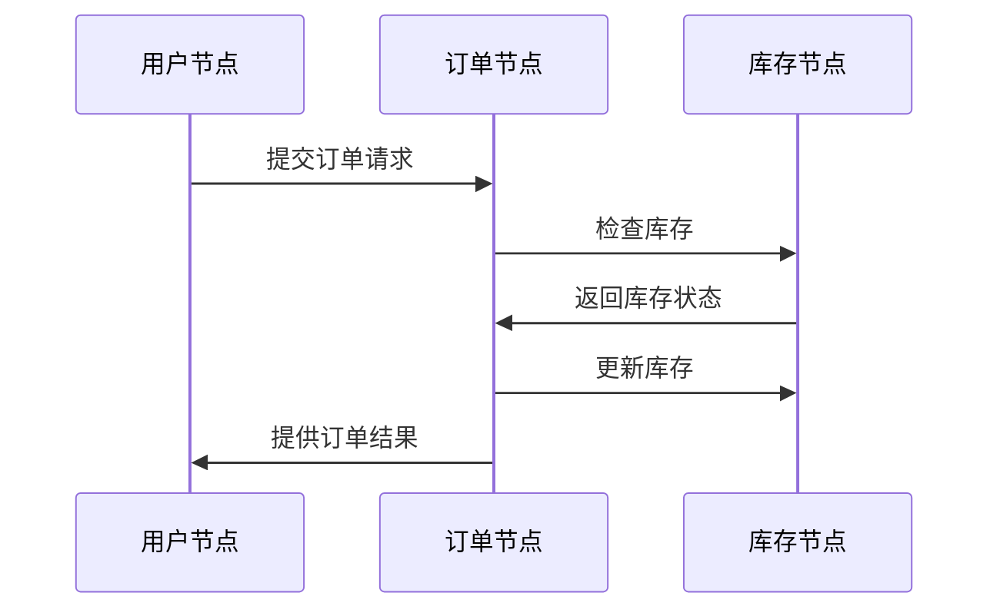
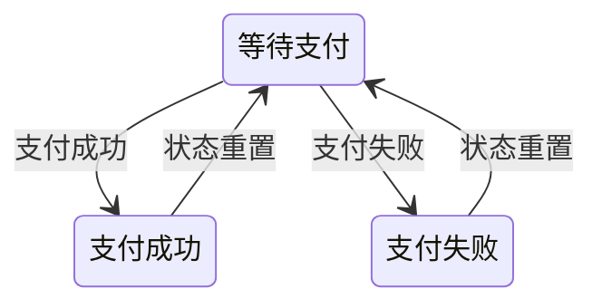
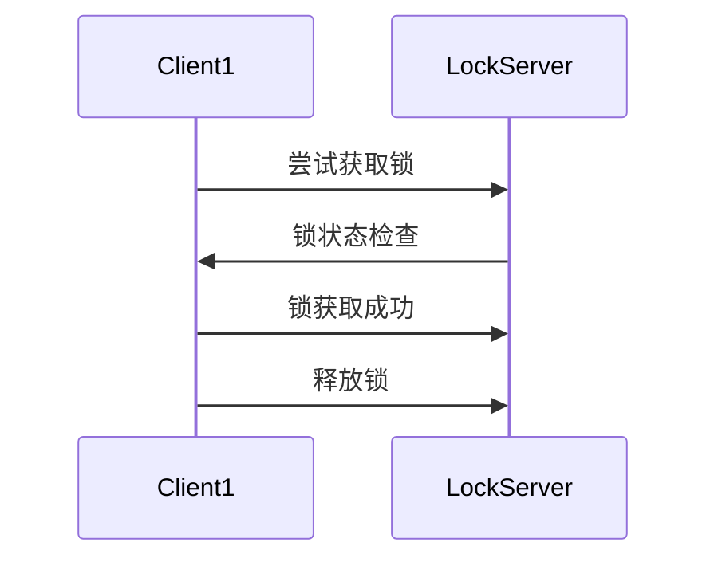
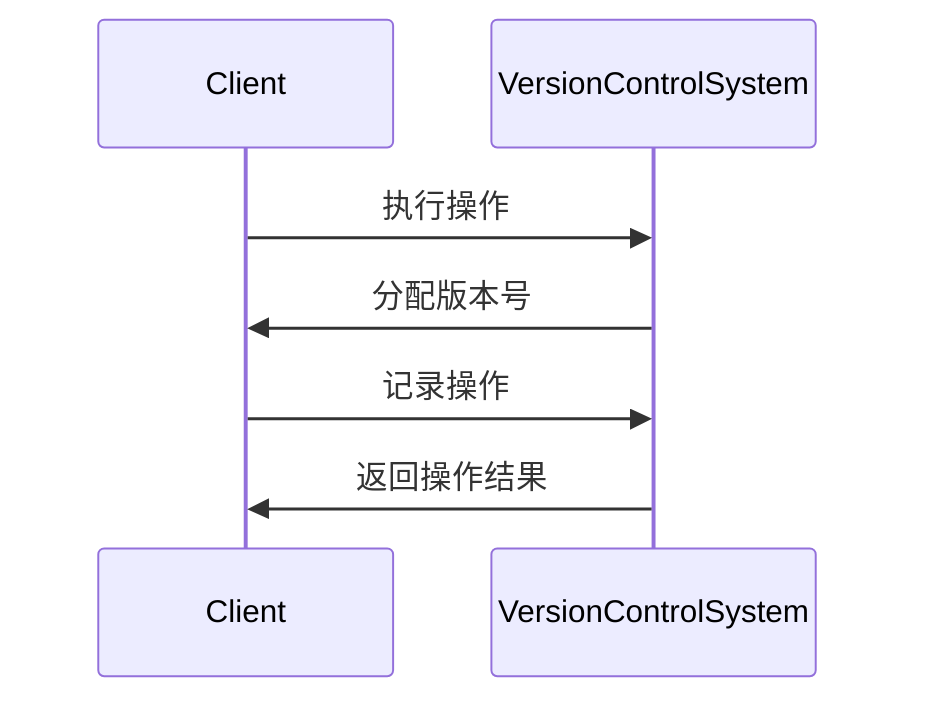

                 

### 1.1 无效的幂等性控制概述

在分布式系统中，幂等性（Idempotence）是一个至关重要的概念，它确保了对同一资源的多重请求不会产生副作用，从而保证了系统的稳定性和一致性。幂等性通常被描述为：“对资源的多次操作，结果与一次操作相同。”这意味着，无论执行多少次某个操作，系统状态都应该最终达到同样的稳定点。

然而，在分布式环境中，由于网络延迟、系统故障、并发请求等原因，幂等性控制可能会失效。这种失效可能导致数据不一致、资源冲突、甚至系统崩溃等问题。因此，理解无效幂等性控制的概念、影响及其核心要素，对于构建稳定可靠的分布式系统至关重要。

#### 1.1.1 问题背景

在分布式系统中，常见的幂等性控制失效场景包括：

- **分布式事务处理**: 由于网络故障或延迟，分布式事务中的多个操作可能无法正确提交，导致数据不一致。
- **状态机设计**: 在状态机中，如果状态转换逻辑不足，可能导致重复触发同一状态，从而破坏系统的稳定性和一致性。
- **并发请求**: 当多个客户端同时对同一资源进行操作时，如果没有适当的幂等性控制，可能会产生冲突和副作用。

**问题描述**: 如何识别和解决分布式系统中的无效幂等性控制问题？

**问题解决**: 通过分析失效原因，提出相应的解决策略，并探讨如何在分布式系统中有效控制幂等性。

#### 1.1.2 无效幂等性控制的影响

无效幂等性控制对系统的稳定性和一致性具有显著的负面影响：

- **数据不一致**: 多次操作导致数据库中的数据与实际不符。
- **系统故障**: 由于冲突和资源竞争，可能导致系统崩溃或性能下降。
- **资源浪费**: 重复执行不必要的操作，浪费系统资源。

为了应对这些挑战，我们需要深入了解无效幂等性控制的核心要素，并探讨如何通过分布式锁、版本控制等机制来提高系统的稳定性。

#### 1.1.3 无效幂等性控制的核心要素

无效幂等性控制的核心要素包括：

- **分布式事务**: 分布式事务是导致幂等性失效的常见原因之一。
- **状态机设计**: 状态机中的状态转换逻辑不足，可能导致幂等性失效。
- **锁机制**: 锁机制用于控制对共享资源的访问，但不当的锁管理可能导致幂等性失效。

在下一节中，我们将进一步探讨幂等性的核心概念，并通过对比表格和ER实体关系图，深入分析有效幂等性与无效幂等性的区别。这将为后续案例分析打下坚实基础。

## 1.2 核心概念与联系

### 1.2.1 幂等性概念

幂等性（Idempotence）是一个在计算机科学中广泛使用的概念，它描述了一个操作，在执行多次时，其效果与执行一次相同。用数学术语来说，如果一个函数 \( f \) 是幂等的，那么对于任何输入 \( x \)，有 \( f(f(x)) = f(x) \)。

在分布式系统中，幂等性是一个关键的概念，它确保了对同一资源的多重请求不会产生副作用，从而保证了系统的稳定性和一致性。具体来说，幂等性具有以下几个核心属性：

1. **响应一致性**: 对同一资源的多次请求应产生相同的响应结果。
2. **状态一致性**: 多次执行同一个操作后，系统状态应与单次执行后的状态相同。
3. **资源一致性**: 资源的使用和释放应保持一致性，不会因为多次请求而产生冲突。

**概念原理**：

幂等性在分布式系统中的重要性主要体现在以下几个方面：

- **避免数据不一致**: 在分布式环境中，多个节点可能同时对同一资源进行操作。幂等性保证了这些操作不会导致数据不一致。
- **提高系统稳定性**: 幂等性控制减少了由于并发请求导致的系统故障和崩溃的可能性。
- **简化错误处理**: 幂等性使得错误处理更加简单，因为系统不必担心多次请求会导致不可恢复的错误。

#### 概念属性特征对比表格

下面是一个对比有效幂等性与无效幂等性特征属性的表格：

| **属性** | **有效幂等性** | **无效幂等性** |
| :----: | :-----------: | :-----------: |
| **响应一致性** | 多次请求产生相同结果 | 多次请求可能产生不同结果 |
| **状态一致性** | 多次操作后状态相同 | 多次操作后状态不同 |
| **资源一致性** | 资源使用和释放一致 | 资源使用和释放不一致 |
| **错误处理** | 错误处理简单 | 错误处理复杂 |
| **系统稳定性** | 提高系统稳定性 | 降低系统稳定性 |

#### 1.2.2 无效幂等性特征

**特征对比**：

无效幂等性具有以下特征：

- **多次请求导致不同结果**：在对同一资源的多次请求中，可能导致不同的响应结果。
- **状态不保持一致性**：多次操作后，系统状态可能发生变化，这与幂等性的核心要求相违背。
- **资源竞争和冲突**：多个请求对同一资源进行操作时，可能导致资源竞争和冲突，从而影响系统的稳定性。

**联系与影响**：

无效幂等性控制对系统稳定性和一致性的影响主要体现在以下几个方面：

- **数据不一致**：无效幂等性可能导致数据库中的数据与实际不符，从而影响系统的正确性。
- **系统故障**：由于幂等性失效，系统可能崩溃或产生不可恢复的错误，影响用户体验。
- **资源浪费**：无效幂等性控制会导致系统资源浪费，因为重复执行不必要的操作会消耗更多的系统资源。

在下一节中，我们将通过具体案例分析，进一步探讨无效幂等性控制在实际分布式系统中的应用和影响。这将帮助我们更好地理解如何识别和解决这些问题。

### 2.1 案例一：分布式事务中的无效幂等性

#### 2.1.1 案例背景

在分布式系统中，事务处理是保证数据一致性的重要机制。然而，由于网络延迟或系统故障等原因，分布式事务中的幂等性控制可能会失效，导致数据不一致或系统故障。本节将介绍一个具体的案例，分析分布式事务中无效幂等性控制的问题。

**问题场景**：

假设有一个电子商务系统，用户可以在多个节点上同时购买商品。每个节点都有一个订单数据库，用于记录用户订单信息。当一个用户提交订单时，系统会进行以下操作：

1. 从订单数据库中查询用户订单信息。
2. 检查库存是否足够。
3. 更新库存信息。
4. 插入订单记录。

如果系统中某个节点发生网络延迟或故障，可能会导致以下问题：

- **数据不一致**：由于网络延迟，一个节点可能在另一个节点更新库存信息之后查询库存，导致库存信息不一致。
- **系统故障**：如果事务在某个节点失败，其他节点的事务可能无法正确提交，导致系统崩溃。

**问题解决**：

为了解决分布式事务中的无效幂等性控制问题，可以采用以下方法：

1. **两阶段提交（2PC）**：两阶段提交是一种分布式事务管理协议，通过两个阶段来确保事务的一致性。第一阶段是准备阶段，第二阶段是提交阶段。在准备阶段，协调者向所有参与者发送准备消息，参与者根据本地日志判断是否能够提交事务。在提交阶段，协调者根据参与者的响应决定是否提交事务。
2. **补偿事务**：在分布式事务中，可以通过补偿事务来恢复因故障导致的事务失败。例如，如果一个订单事务在更新库存时失败，可以通过一个反向操作来恢复库存。
3. **去中心化事务管理**：采用去中心化的事务管理策略，每个节点都可以独立管理事务，并通过日志记录来保证数据一致性。例如，使用分布式快照隔离机制，在每个节点上维护一个本地日志，通过比较日志来确保事务的一致性。

#### 2.1.2 案例分析

**系统架构**：

本案例中的系统架构包括多个节点，每个节点负责处理订单请求和更新库存信息。系统架构如下：

```
+------------+     +-------------+
|  用户节点  |     |   订单节点  |
+------------+     +-------------+
       |               |
       |   订单请求    |
       |               |
+------+               +------+
| 数据库   |
+---------+
```

**算法原理**：

为了分析分布式事务的处理流程，我们可以使用Mermaid画出事务处理的流程图，并用Python源代码详细阐述算法原理。

**流程图**：



**Python源代码**：

```python
# 订单节点处理订单请求
class OrderNode:
    def process_order(self, user_id, product_id):
        # 检查库存
        inventory_status = self.check_inventory(product_id)
        if inventory_status < 0:
            return "库存不足"

        # 更新库存
        self.update_inventory(product_id, inventory_status - 1)

        # 插入订单记录
        self.insert_order_record(user_id, product_id)

        return "订单处理成功"

    def check_inventory(self, product_id):
        # 查询库存信息
        inventory = self.get_inventory(product_id)
        return inventory

    def update_inventory(self, product_id, status):
        # 更新库存信息
        self.set_inventory(product_id, status)

    def insert_order_record(self, user_id, product_id):
        # 插入订单记录
        pass

# 库存节点处理库存请求
class InventoryNode:
    def check_inventory(self, product_id):
        # 查询库存信息
        inventory = self.get_inventory(product_id)
        return inventory

    def update_inventory(self, product_id, status):
        # 更新库存信息
        self.set_inventory(product_id, status)

    def get_inventory(self, product_id):
        # 查询库存信息
        pass

    def set_inventory(self, product_id, status):
        # 更新库存信息
        pass
```

通过上述流程图和源代码，我们可以清晰地看到分布式事务处理的过程，以及如何通过两阶段提交和补偿事务等方法来控制幂等性，确保数据一致性和系统稳定性。

#### 2.1.3 案例总结

通过分析分布式事务中的无效幂等性控制案例，我们得出以下经验：

1. **分布式事务管理**：采用两阶段提交协议和补偿事务等机制，可以有效解决分布式事务中的幂等性控制问题。
2. **网络延迟和故障处理**：在分布式系统中，应充分考虑网络延迟和系统故障，采用去中心化事务管理策略，确保数据一致性。
3. **日志记录和一致性检查**：通过日志记录和一致性检查，可以及时发现和解决分布式事务中的不一致性问题。

在下一节中，我们将探讨另一个案例：状态机设计中的无效幂等性，进一步分析幂等性控制失效的原因和解决方案。

### 2.2 案例二：状态机设计中的无效幂等性

#### 2.2.1 案例背景

状态机（State Machine）是计算机科学中用于描述系统行为的一种重要模型。它由一系列状态和状态转换规则组成，可以用来模拟复杂的系统行为。然而，在状态机设计中，如果状态转换逻辑不足或设计缺陷，可能会导致幂等性控制失效，从而影响系统的稳定性和一致性。

**问题场景**：

假设有一个在线支付系统，用于处理用户支付请求。该系统包含以下状态：

- **等待支付（WaitingForPayment）**：用户尚未完成支付。
- **支付成功（PaymentSuccessful）**：用户支付成功。
- **支付失败（PaymentFailed）**：用户支付失败。

系统设计要求：用户只能从“等待支付”状态转换为“支付成功”或“支付失败”状态，不能重复进入“等待支付”状态。

然而，由于状态机设计缺陷，可能会出现以下问题：

- **重复进入等待支付状态**：如果状态转换逻辑不足，用户支付成功后，系统可能再次将用户状态设为“等待支付”，导致支付流程重复。
- **状态不一致**：重复的状态转换可能导致系统状态不一致，影响后续操作。

**问题解决**：

为了解决状态机设计中的无效幂等性控制问题，可以采用以下方法：

1. **状态验证**：在状态转换前，对当前状态进行验证，确保状态转换符合设计规则。例如，用户支付成功后，不能再次设置为“等待支付”状态。
2. **状态重置机制**：设计状态重置机制，在检测到无效状态转换时，自动将状态重置为有效状态。例如，当用户支付成功后，再次检测到“等待支付”状态时，自动将状态重置为“支付成功”。
3. **日志记录和异常处理**：记录状态转换日志，并在状态转换失败时进行异常处理，确保系统状态的一致性和正确性。

#### 2.2.2 案例分析

**系统架构**：

本案例中的系统架构包括支付接口、状态机管理和日志记录模块。系统架构如下：

```
+-------------+
|   支付接口  |
+-------------+
       |
       v
+-------------+
|   状态机管理|
+-------------+
       |
       v
+-------------+
|   日志记录模块|
+-------------+
```

**算法原理**：

为了分析状态机的设计和状态转换过程，我们可以使用Mermaid画出状态机转换的流程图，并用Python源代码详细阐述算法原理。

**流程图**：



**Python源代码**：

```python
class PaymentStateMachine:
    def __init__(self):
        self.state = "WaitingForPayment"

    def process_payment(self, payment_status):
        if self.state == "WaitingForPayment":
            if payment_status == "Successful":
                self.state = "PaymentSuccessful"
            elif payment_status == "Failed":
                self.state = "PaymentFailed"
        elif self.state == "PaymentSuccessful":
            if payment_status == "Failed":
                self.state = "PaymentFailed"
                # 状态重置
                self.reset_state()
        elif self.state == "PaymentFailed":
            if payment_status == "Successful":
                self.state = "PaymentSuccessful"
                # 状态重置
                self.reset_state()

    def reset_state(self):
        self.state = "WaitingForPayment"

    def get_state(self):
        return self.state
```

通过上述流程图和源代码，我们可以清晰地看到支付系统的状态转换过程，以及如何通过状态验证和重置机制来确保幂等性控制的有效性。

#### 2.2.3 案例总结

通过分析状态机设计中的无效幂等性控制案例，我们得出以下经验：

1. **状态验证和重置机制**：在状态机设计中，应充分考虑状态转换的逻辑，设计状态验证和重置机制，确保状态转换的正确性和幂等性。
2. **异常处理和日志记录**：在状态转换失败时，应进行异常处理，并记录状态转换日志，以便后续分析和调试。
3. **简洁和健壮性**：状态机设计应简洁明了，避免过多的状态转换和复杂的逻辑，确保系统的健壮性和可维护性。

在下一节中，我们将探讨如何通过分布式锁机制和版本控制机制来解决无效幂等性控制问题，进一步提高系统的稳定性和一致性。

### 3.1 解决方案一：分布式锁机制

#### 3.1.1 分布式锁原理

分布式锁（Distributed Lock）是一种用于控制分布式系统中共享资源访问的机制。它确保在多个节点之间，同一资源在同一时间只能被一个节点访问。分布式锁的基本原理是通过锁服务器来维护锁的状态，并确保锁的获取和释放操作的一致性。

**概念原理**：

分布式锁的主要功能包括：

1. **互斥锁**：保证同一时间只有一个进程或线程能够获取锁。
2. **可重入锁**：允许同一个进程或线程多次获取锁，直到锁被完全释放。
3. **读写锁**：区分读操作和写操作，允许多个读操作同时进行，但写操作必须互斥。

**算法原理**：

为了更好地理解分布式锁的工作原理，我们可以使用Mermaid画出分布式锁的流程图，并用Python源代码详细阐述算法原理。

**流程图**：



**Python源代码**：

```python
import threading

class DistributedLock:
    def __init__(self):
        self.lock = threading.Lock()

    def acquire_lock(self):
        self.lock.acquire()

    def release_lock(self):
        self.lock.release()
```

通过上述流程图和源代码，我们可以看到分布式锁的基本操作流程：尝试获取锁、锁状态检查、锁获取成功、释放锁。分布式锁通过锁定资源，防止多个节点同时访问同一资源，从而确保幂等性控制的有效性。

#### 3.1.2 实现与优化

**实现方法**：

分布式锁的实现可以分为以下几个步骤：

1. **锁服务选择**：选择合适的锁服务，如ZooKeeper、Redis、etcd等。
2. **锁资源定义**：定义锁资源，如锁的名称、锁类型（读锁或写锁）等。
3. **锁获取**：通过锁服务获取锁，检查锁状态，确保锁可用。
4. **锁释放**：释放锁资源，确保锁状态恢复。

**实现示例**：

使用Redis作为锁服务，实现分布式锁的示例代码如下：

```python
import redis
import time

class RedisDistributedLock:
    def __init__(self, redis_client, lock_key):
        self.redis_client = redis_client
        self.lock_key = lock_key
        self.timeout = 10  # 锁超时时间

    def acquire_lock(self):
        while True:
            if self.redis_client.set(self.lock_key, "locked", nx=True, ex=self.timeout):
                return True
            time.sleep(1)

    def release_lock(self):
        script = """
        if redis.call("get", KEYS[1]) == ARGV[1] then
            return redis.call("del", KEYS[1])
        else
            return 0
        end
        """
        self.redis_client.eval(script, 1, self.lock_key, "locked")
```

**优化策略**：

为了提高分布式锁的性能和可靠性，可以采用以下优化策略：

1. **锁超时机制**：设置锁的超时时间，确保在锁持有者故障时，锁能够自动释放。
2. **锁重试机制**：在锁获取失败时，进行重试，避免因网络波动等原因导致锁获取失败。
3. **锁持有者监控**：监控锁持有者的状态，确保锁持有者故障时，锁能够及时释放。
4. **锁资源隔离**：为不同的锁资源设置隔离，避免锁资源冲突，提高锁的可靠性。

通过上述实现和优化策略，我们可以有效地构建一个分布式锁机制，确保分布式系统中幂等性控制的有效性和一致性。

### 3.2 解决方案二：版本控制机制

#### 3.2.1 版本控制原理

版本控制（Version Control）是一种用于追踪和管理文档、代码或其他数字资产的机制。在分布式系统中，版本控制机制可以帮助我们确保数据的一致性和完整性。通过为每个操作分配一个唯一的版本号，可以有效地避免数据冲突和重复操作。

**概念原理**：

版本控制的基本原理包括：

1. **版本号分配**：每个操作或变更分配一个唯一的版本号，如递增数字、时间戳等。
2. **操作记录**：记录每个版本的详细信息，如操作类型、操作者、操作时间等。
3. **版本对比**：通过对比不同版本的差异，确保数据的一致性和正确性。

**算法原理**：

为了更好地理解版本控制机制的工作原理，我们可以使用Mermaid画出版本控制的流程图，并用Python源代码详细阐述算法原理。

**流程图**：



**Python源代码**：

```python
class VersionControlSystem:
    def __init__(self):
        self.version_number = 0

    def execute_operation(self, operation):
        self.version_number += 1
        operation['version'] = self.version_number
        self.record_operation(operation)
        return operation

    def record_operation(self, operation):
        # 记录操作信息到日志
        pass

    def compare_versions(self, version1, version2):
        # 对比版本差异
        pass
```

通过上述流程图和源代码，我们可以看到版本控制的基本操作流程：执行操作、分配版本号、记录操作和返回操作结果。版本控制通过为每个操作分配唯一的版本号，确保系统在处理并发请求时，能够正确识别和合并操作，从而确保数据的一致性和完整性。

#### 3.2.2 实现与优化

**实现方法**：

版本控制机制的实现可以分为以下几个步骤：

1. **版本号管理**：为每个操作或变更分配一个唯一的版本号，如使用递增数字或时间戳。
2. **操作记录**：记录每个版本的操作信息，如操作类型、操作者、操作时间等。
3. **版本对比**：通过对比不同版本的差异，确保数据的一致性和正确性。
4. **冲突解决**：在处理并发请求时，如果发生版本冲突，根据一定的策略（如最新版本优先、人工干预等）解决冲突。

**实现示例**：

使用递增数字作为版本号的版本控制实现示例代码如下：

```python
class VersionControlSystem:
    def __init__(self):
        self.current_version = 0

    def execute_operation(self, operation):
        self.current_version += 1
        operation['version'] = self.current_version
        self.record_operation(operation)
        return operation

    def record_operation(self, operation):
        # 记录操作信息到日志
        pass

    def resolve_conflict(self, version1, version2):
        # 解决版本冲突
        pass
```

**优化策略**：

为了提高版本控制机制的性能和可靠性，可以采用以下优化策略：

1. **并发控制**：在处理并发请求时，采用并发控制机制，确保版本分配和操作记录的原子性。
2. **乐观锁与悲观锁**：根据系统需求，选择合适的锁机制，如乐观锁（先操作后锁定）或悲观锁（先锁定再操作）。
3. **版本压缩**：定期压缩版本历史记录，降低存储空间占用。
4. **分布式版本控制**：在分布式系统中，使用分布式版本控制机制，确保多个节点之间的版本同步和一致性。

通过上述实现和优化策略，我们可以有效地构建一个版本控制机制，确保分布式系统中的数据一致性和完整性。

### 4.1 最佳实践一：幂等性控制策略

在分布式系统中，实现有效的幂等性控制策略对于确保系统稳定性和数据一致性至关重要。以下是一些最佳实践策略，帮助我们在实际开发中避免无效幂等性控制问题。

#### 4.1.1 使用分布式锁

分布式锁是控制分布式系统中共享资源访问的一种有效手段。通过分布式锁，可以确保在多个节点之间，同一资源在同一时间只能被一个节点访问。以下是一些具体策略：

1. **选择合适的锁服务**：如ZooKeeper、Redis、etcd等，根据系统需求和性能要求选择合适的锁服务。
2. **设置锁超时时间**：为锁设置合理的超时时间，确保在锁持有者故障时，锁能够自动释放。
3. **锁重试机制**：在锁获取失败时，进行重试，避免因网络波动等原因导致锁获取失败。
4. **监控锁持有者**：监控锁持有者的状态，确保锁持有者故障时，锁能够及时释放。

#### 4.1.2 使用版本控制

版本控制机制可以帮助我们确保数据的一致性和完整性。以下是一些具体策略：

1. **为每个操作分配唯一版本号**：为每个操作或变更分配一个唯一的版本号，如递增数字或时间戳。
2. **记录操作历史**：记录每个版本的详细信息，如操作类型、操作者、操作时间等。
3. **冲突解决策略**：在处理并发请求时，根据最新版本优先、人工干预等策略解决版本冲突。
4. **优化版本存储**：定期压缩版本历史记录，降低存储空间占用。

#### 4.1.3 优化状态机设计

在状态机设计中，充分考虑状态转换逻辑，避免无效幂等性控制。以下是一些具体策略：

1. **状态验证**：在状态转换前，对当前状态进行验证，确保状态转换符合设计规则。
2. **状态重置机制**：设计状态重置机制，在检测到无效状态转换时，自动将状态重置为有效状态。
3. **异常处理**：在状态转换失败时，进行异常处理，并记录状态转换日志，确保系统状态的一致性和正确性。

#### 4.1.4 提高分布式事务管理能力

分布式事务管理是保证分布式系统数据一致性的关键。以下是一些具体策略：

1. **采用两阶段提交协议**：通过两阶段提交协议，确保分布式事务的一致性。
2. **补偿事务机制**：在分布式事务中，通过补偿事务机制恢复因故障导致的事务失败。
3. **去中心化事务管理**：采用去中心化的事务管理策略，每个节点独立管理事务，并通过日志记录保证数据一致性。

#### 4.1.5 最佳实践案例应用

在实际开发中，可以根据具体场景选择合适的幂等性控制策略。以下是一个电子商务系统中的幂等性控制策略案例：

1. **订单处理**：在订单处理过程中，采用分布式锁机制确保库存操作的幂等性。例如，使用Redis分布式锁确保在处理订单时，库存操作不会重复执行。
2. **支付处理**：在支付处理过程中，使用版本控制机制确保支付状态的一致性。例如，为每个支付操作分配唯一版本号，并在支付状态更新时对比版本号，防止重复支付。
3. **状态机设计**：在支付状态机设计中，确保支付状态转换的逻辑正确，并设计状态重置机制。例如，当支付成功后，避免再次进入等待支付状态。

通过以上最佳实践策略，我们可以有效地避免分布式系统中的无效幂等性控制问题，提高系统的稳定性和数据一致性。

### 4.2 总结与展望

通过本文的详细探讨，我们系统地分析了无效幂等性控制的概念、原因、影响和解决方案。首先，我们介绍了幂等性的核心概念和属性，并通过对比表格和ER实体关系图，明确了有效幂等性与无效幂等性的区别。随后，我们通过两个具体案例——分布式事务和状态机设计，深入分析了幂等性控制失效的原因和影响，并提出了相应的解决方案。

**总结经验**：

1. **分布式锁机制**：通过分布式锁，可以有效地控制分布式系统中共享资源的访问，确保幂等性控制的有效性。
2. **版本控制机制**：通过版本控制，可以为每个操作分配唯一版本号，从而避免数据冲突和重复操作。
3. **优化状态机设计**：通过合理的状态验证和重置机制，可以避免无效幂等性控制问题。
4. **分布式事务管理**：通过两阶段提交、补偿事务等机制，可以确保分布式事务的一致性和正确性。

**未来展望**：

随着分布式系统的广泛应用，无效幂等性控制的问题将越来越突出。未来的研究方向包括：

1. **更高效的分布式锁实现**：研究更高效、更可靠的分布式锁实现，降低系统开销。
2. **自适应版本控制**：开发自适应版本控制机制，根据系统负载和操作频率动态调整版本策略。
3. **分布式事务优化**：探索新的分布式事务管理协议，提高事务处理性能和一致性。
4. **跨系统一致性**：研究跨系统的一致性解决方案，确保分布式系统中各组件间的数据一致性。

**展望研究**：

无效幂等性控制的研究不仅对当前分布式系统的稳定性至关重要，而且对未来分布式系统的设计和发展具有深远的影响。通过持续的研究和创新，我们可以构建更加稳定、高效、可靠的分布式系统，为未来的云计算和物联网应用奠定坚实基础。

---

作者：AI天才研究院/AI Genius Institute & 禅与计算机程序设计艺术 /Zen And The Art of Computer Programming

---

在本文中，我们系统地探讨了无效幂等性控制的核心概念、原因、影响和解决方案。通过具体案例的分析，我们了解了如何在分布式事务和状态机设计中避免无效幂等性控制问题，并提出了分布式锁和版本控制等解决方案。展望未来，随着分布式系统应用范围的不断扩大，无效幂等性控制问题的重要性将日益凸显。通过持续的研究和创新，我们可以进一步提高分布式系统的稳定性和一致性，为未来的云计算和物联网应用提供坚实的基础。

