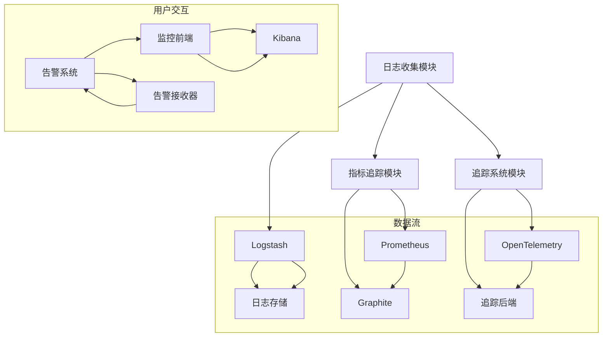
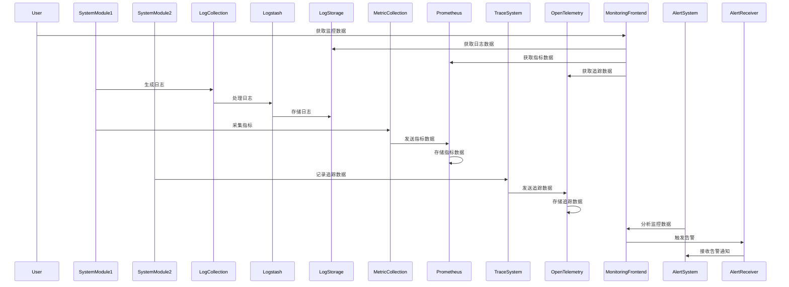

                 

# 日志、指标、追踪三支柱实现

> 关键词：日志管理、指标追踪、分布式系统、系统架构设计、性能优化

> 摘要：本文将深入探讨日志、指标、追踪三个关键组成部分在构建高效分布式系统中的重要作用。通过介绍它们的基本概念、相互关系及实现原理，我们将分析如何在现代IT系统中整合这些支柱，以实现系统性能监控和故障排除的自动化。文章将从背景介绍、核心概念与原理、系统分析与架构设计、项目实战以及最佳实践等方面，逐步引导读者理解并实践这一技术。

### 目录大纲

#### 第一部分：背景介绍

- 引言：日志、指标、追踪三支柱概述
- 问题背景
  - 日志管理的必要性
  - 指标追踪的重要性
- 日志、指标、追踪的关系与融合
  - 日志与指标的关系
  - 日志与追踪的关系
- 读者对象与阅读指南
  - 读者对象
  - 阅读目标
  - 学习预期成果
  - 阅读方法建议

#### 第二部分：核心概念与原理

- 日志管理原理
  - 日志的定义与分类
  - 日志格式的标准化
- 指标追踪原理
  - 指标定义与类型
  - 指标采集与计算
- 追踪系统的架构与实现
  - 分布式追踪系统架构
  - OpenTracing与OpenTelemetry
- 日志、指标、追踪的融合
  - 融合的必要性与实现
  - 跨领域数据集成

#### 第三部分：系统分析与架构设计

- 项目介绍
  - 项目背景与目标
  - 项目架构概述
- 系统功能设计
  - 领域模型设计
  - 类图表示
- 系统架构设计
  - 架构设计原则
  - 架构图表示
- 系统接口设计
  - API接口规范
  - 接口实现与调用
- 系统交互设计
  - 交互流程设计
  - 序列图表示

#### 第四部分：项目实战

- 环境安装与配置
  - 操作系统环境准备
  - 相关软件安装
  - 配置文件设置
- 系统核心实现
  - 日志管理模块
  - 指标追踪模块
  - 追踪系统模块
- 代码应用解读与分析
  - 代码结构解析
  - 核心模块功能实现
  - 性能优化与调优
- 实际案例分析与详细讲解
  - 案例背景与目标
  - 案例实现步骤
- 项目小结
  - 项目成果总结
  - 经验与反思

#### 第五部分：最佳实践与拓展阅读

- 最佳实践 Tips
- 小结
- 注意事项
- 拓展阅读

## 引言：日志、指标、追踪三支柱概述

在现代IT系统中，日志管理、指标追踪和追踪系统被视为三个核心支柱，它们在系统性能监控和故障排除中扮演着至关重要的角色。每一个支柱都有其独特的作用和实现方式，但它们之间也存在紧密的联系和协同作用。

### 日志管理

日志管理是记录系统运行状态和历史记录的重要手段。通过日志，我们可以获取系统运行过程中的详细信息，从而进行问题诊断、性能分析和安全监控。日志管理的基本概念包括日志的生成、收集、存储和处理。日志的类型通常分为错误日志、操作日志、访问日志等。

### 指标追踪

指标追踪是通过量化系统性能指标来评估系统运行状况的一种方法。常见的指标包括响应时间、吞吐量、错误率等。指标追踪可以帮助我们实时监控系统的健康状况，发现潜在的性能瓶颈和问题。指标采集和计算是实现指标追踪的关键步骤。

### 追踪系统

追踪系统主要用于分布式系统的追踪和监控。它通过记录系统中的请求路径和依赖关系，帮助我们理解系统的运行流程和性能瓶颈。常见的追踪系统包括分布式追踪系统和链路追踪系统。OpenTracing和OpenTelemetry是两个广泛使用的开源追踪框架。

这三个支柱在分布式系统中共同作用，形成一个完整的监控和故障排除体系。日志管理提供了详细的运行记录，指标追踪提供了实时的性能监控，而追踪系统则帮助我们理解系统的运行流程和依赖关系。通过这三个支柱的融合，我们可以实现对分布式系统的全面监控和管理。

### 问题背景

#### 1.1.1 日志管理的必要性

在复杂的IT系统中，日志管理显得尤为重要。随着系统规模的扩大和复杂度的增加，系统的运行状态和异常情况需要被及时记录和监控。日志管理不仅可以提供问题诊断的依据，还能帮助运维人员及时发现和解决系统中的潜在问题。以下是日志管理的几个关键作用：

1. **问题诊断**：通过日志记录，运维人员可以快速定位问题的发生位置和原因。日志中的错误信息和异常行为为问题诊断提供了宝贵的线索。
   
2. **性能分析**：日志中包含了系统运行的各种信息，如请求处理时间、响应时间等。通过分析这些信息，可以识别系统的性能瓶颈，优化系统性能。

3. **安全监控**：日志记录了系统中的访问行为和操作记录，有助于发现潜在的安全威胁和异常行为，从而加强系统的安全性。

4. **合规性要求**：在许多行业中，日志记录是合规性要求的一部分。例如，金融行业和医疗行业需要保留大量的日志数据以供审计和追踪。

#### 1.1.2 指标追踪的重要性

指标追踪是监控系统性能和健康状况的重要手段。通过对系统关键指标的实时监控，我们可以及时发现和处理性能瓶颈和问题。以下是指标追踪的几个关键作用：

1. **实时监控**：指标追踪提供了实时的系统性能监控，使我们能够快速响应性能问题。例如，通过监控响应时间和吞吐量，可以及时发现网络拥塞或系统过载等问题。

2. **性能优化**：通过对指标数据的分析，可以识别系统的瓶颈和性能问题，并采取相应的优化措施。例如，通过分析CPU利用率，可以优化系统资源分配。

3. **故障排除**：指标数据可以帮助我们定位系统故障的原因。例如，通过监控错误率，可以快速发现代码中的bug或配置错误。

4. **容量规划**：通过对历史指标数据的分析，可以预测系统的未来性能需求，从而进行容量规划和资源扩展。

#### 1.1.3 日志、指标、追踪的关系与融合

日志、指标和追踪系统在分布式系统中相互协作，共同构成了一个全面的监控体系。它们之间的关系如下：

1. **日志与指标的关系**：日志记录了系统运行的详细信息，这些信息可以转化为指标。例如，日志中的请求处理时间和错误次数可以转化为响应时间和错误率指标。

2. **日志与追踪的关系**：日志提供了追踪系统所需的基础数据。通过分析日志，可以构建请求路径和依赖关系，从而实现链路追踪。

3. **指标与追踪的关系**：指标追踪通过采集和分析系统性能指标，可以帮助我们理解系统的运行状态。而追踪系统则通过记录请求路径和依赖关系，帮助我们识别性能瓶颈和问题。

通过日志、指标和追踪系统的融合，我们可以实现对分布式系统的全面监控和管理。例如，通过结合日志数据和指标数据，可以实时监控系统性能，并通过追踪系统分析性能瓶颈和故障原因。

### 1.2 日志、指标、追踪的关系与融合

在构建高效的分布式系统时，日志管理、指标追踪和追踪系统三个核心组成部分之间存在着紧密的关联与互动。这种融合不仅能够提升系统的监控能力，还能够为故障排除和性能优化提供强有力的支持。

#### 1.2.1 日志与指标的关系

日志与指标之间存在着天然的互补关系。日志记录了系统运行过程中的详细事件，包括错误、异常、警告和普通信息等，这些信息在发生时被即时写入。而指标则是对这些日志数据的一种抽象和量化，通过统计和分析日志中的特定数据点，可以转换成一系列可量化的性能指标，如响应时间、错误率、吞吐量等。

**日志数据转化为指标的过程**：

1. **数据采集**：从日志文件中读取相关信息。
2. **预处理**：清洗和格式化日志数据，确保数据的准确性和一致性。
3. **计算**：对预处理后的日志数据进行统计计算，生成指标。

例如，假设日志中记录了每个请求的处理时间，通过累加所有请求的处理时间并除以请求次数，可以计算出平均响应时间这个指标。

**日志数据在性能监控中的应用**：

- **实时监控**：通过实时分析日志数据，可以迅速发现系统中的性能瓶颈和异常情况。
- **趋势分析**：通过对日志数据的长期统计，可以分析系统的性能变化趋势，为性能优化提供依据。
- **异常检测**：通过对比日志数据和预设的正常行为模式，可以识别异常行为和潜在的问题。

#### 1.2.2 日志与追踪的关系

日志不仅为指标提供数据源，还为追踪系统提供了关键信息。追踪系统通过日志记录的信息来重建系统的运行流程和依赖关系，从而实现链路追踪。

**日志在追踪系统中的作用**：

1. **请求路径记录**：日志记录了每个请求的处理过程，包括请求的发送、接收、处理、响应等步骤，这些信息用于追踪请求的完整路径。
2. **依赖关系分析**：通过日志中的调用信息，可以分析系统中的依赖关系，理解各模块之间的交互和协作。
3. **错误追踪**：日志中的错误信息和异常记录可以帮助追踪系统定位错误发生的位置和原因。

**日志与追踪系统结合的优势**：

- **全链路监控**：通过日志记录和追踪系统的结合，可以实现对系统运行的全链路监控，从请求发送到响应返回的每个环节都不会被遗漏。
- **快速故障定位**：当系统出现故障时，追踪系统可以快速回溯请求的执行路径，帮助运维人员快速定位问题所在。
- **性能优化**：通过分析日志和追踪数据，可以识别系统中的性能瓶颈和优化点，从而提高系统的整体性能。

#### 1.2.3 指标与追踪的关系

指标和追踪系统在分布式系统中共同作用，提供了多维度的监控视角。指标数据可以提供系统性能的实时监控，而追踪系统则提供了系统运行流程的详细视图。

**指标数据在追踪系统中的应用**：

1. **性能指标监控**：追踪系统可以实时监控指标数据，如响应时间、错误率、吞吐量等，通过阈值设定，可以及时发现异常情况。
2. **趋势分析**：通过对指标数据的长期记录和分析，可以跟踪系统性能的变化趋势，为优化提供数据支持。
3. **性能瓶颈识别**：通过分析指标数据，可以识别系统中的性能瓶颈，如某个服务的响应时间过长或错误率较高，从而进行针对性的优化。

**追踪系统在指标数据中的应用**：

1. **链路追踪**：追踪系统通过记录请求的执行路径，可以展示每个服务的执行时间和依赖关系，与指标数据进行关联，提供更全面的监控视图。
2. **根因分析**：当系统出现性能问题时，追踪系统可以帮助分析问题发生的具体环节，结合指标数据，定位问题的根本原因。

#### 1.2.4 融合的必要性与实现

日志、指标、追踪系统的融合是现代分布式系统监控的必然趋势，这种融合能够提供更全面、更深入的监控能力，以下是融合的必要性和实现方法：

**必要性**：

- **全维度的监控**：融合可以实现对系统运行状态的全维度监控，从日志的详细记录到指标的实时监控，再到追踪系统的链路追踪，形成一个完整的监控体系。
- **高效的故障排除**：通过融合日志、指标和追踪数据，可以更快速、更准确地定位故障，提供详细的诊断信息，提高故障排除效率。
- **数据关联分析**：融合后的数据可以相互关联，提供更深入的洞见，例如，通过结合日志和指标数据，可以分析系统中的异常行为模式，识别潜在的性能瓶颈。

**实现方法**：

- **统一的数据存储和处理**：采用统一的数据存储和处理平台，如Elastic Stack，可以将日志、指标和追踪数据统一存储和管理，方便后续的数据分析和查询。
- **数据转换和关联**：通过数据转换工具，如Logstash，将不同格式的日志数据转换为统一的格式，并与指标和追踪数据进行关联，实现数据的融合。
- **可视化工具**：使用可视化工具，如Kibana，可以将融合后的数据进行可视化展示，提供直观的监控视图。

通过日志、指标、追踪系统的融合，我们能够实现对分布式系统的全面监控和管理，提升系统的可用性和稳定性。接下来，我们将进一步探讨这三个核心组成部分的具体实现原理。

### 1.3 读者对象与阅读指南

#### 1.3.1 读者对象

本文的目标读者主要包括以下几类：

1. **系统架构师**：负责设计和管理分布式系统的架构，需要深入了解日志、指标、追踪等监控技术，以提升系统的监控能力和故障排除效率。
2. **运维工程师**：负责系统的日常运维和监控，需要掌握日志管理、指标追踪和追踪系统的实现原理，以便快速诊断和解决系统问题。
3. **开发工程师**：参与系统开发和维护，需要了解日志和指标的使用，以便在开发和测试阶段及时发现和解决问题。

#### 1.3.2 阅读目标

阅读本文，读者可以期待以下学习成果：

1. **理解日志、指标、追踪三个核心组件的基本概念和作用**。
2. **掌握日志管理的原理和最佳实践**。
3. **理解指标追踪的方法和重要性**。
4. **掌握分布式追踪系统的架构和实现原理**。
5. **了解如何将日志、指标和追踪系统融合，提升监控能力**。

#### 1.3.2.1 学习预期成果

通过本文的阅读，读者将能够：

- **掌握日志管理的核心知识和技巧**，包括日志的生成、收集、存储和处理。
- **理解指标追踪的基本原理**，包括指标的定义、采集和计算方法。
- **掌握分布式追踪系统的架构和实现**，包括OpenTracing和OpenTelemetry等开源框架。
- **具备将日志、指标和追踪系统融合的能力**，能够设计并实现一个全面的监控体系。

#### 1.3.2.2 阅读方法建议

为了更好地理解和掌握本文的内容，建议读者采取以下阅读方法：

1. **循序渐进**：按照文章的结构，从背景介绍到核心概念，再到系统分析与架构设计，最后到项目实战，逐步深入。
2. **结合实践**：在阅读过程中，结合实际工作中的经验和案例，加深对概念和原理的理解。
3. **互动学习**：可以通过提问、讨论或查阅相关资料，与作者或其他读者进行互动，解决阅读中的困惑。
4. **重点记忆**：对于重要的概念和原理，可以通过制作笔记或思维导图来帮助记忆。
5. **反复阅读**：对于难以理解的部分，可以多次阅读，直至完全掌握。

通过上述阅读方法，读者将能够更全面、更深入地理解日志、指标、追踪三支柱在分布式系统中的应用和实现，从而提升系统的监控和管理能力。

### 第二部分：核心概念与原理

在本部分，我们将深入探讨日志管理、指标追踪和追踪系统的核心概念与原理。这些概念和原理是构建高效分布式系统监控体系的基础，理解它们对于系统的性能优化和故障排除至关重要。

#### 2.1 日志管理原理

日志管理是系统监控和故障排除的基础，它通过记录系统运行过程中的各种事件和信息，为性能分析和问题诊断提供数据支持。

**2.1.1 日志的定义与分类**

**日志**：日志是系统运行过程中生成的记录文件，用于记录系统事件、错误、警告、操作等信息。日志的主要功能是记录系统运行状态，以便后续的分析和处理。

**日志的分类**：

1. **错误日志**：记录系统运行中的错误信息，包括异常、崩溃、资源耗尽等。
2. **操作日志**：记录系统的操作行为，如登录、文件操作、数据库操作等。
3. **访问日志**：记录系统资源的访问情况，如HTTP请求、文件下载等。

**2.1.2 日志格式的标准化**

为了方便日志的收集、存储和分析，日志格式需要标准化。常见的日志格式包括：

1. **文本格式**：最简单的日志格式，直接以文本形式记录信息，如`[2023-01-01 10:00:00] [ERROR] System crashed`。
2. **JSON格式**：JSON格式日志通过键值对的形式记录信息，结构化更强，便于处理和分析。例如：
   ```json
   {
     "time": "2023-01-01 10:00:00",
     "level": "ERROR",
     "message": "System crashed"
   }
   ```

**2.1.2.1 JSON格式日志**

JSON格式日志具有以下优势：

- **结构化**：通过键值对结构化记录信息，便于数据处理。
- **可扩展**：可以轻松添加或修改字段，适应不同类型的日志信息。
- **可解析**：JSON格式易于被编程语言解析和处理。

**2.1.2.2 Logstash日志处理**

Logstash是一个开源的数据收集、处理和传递工具，常用于处理和转换日志数据。Logstash的基本工作流程如下：

1. **输入**：从各种数据源（如文件、数据库、消息队列等）收集日志数据。
2. **处理**：通过过滤器对日志数据进行预处理，如字段提取、格式转换、数据清洗等。
3. **输出**：将处理后的日志数据发送到目的地，如Elasticsearch、Kibana等。

通过Logstash，我们可以实现对大量日志数据的集中处理和存储，为后续的分析和监控提供支持。

**2.2 指标追踪原理**

指标追踪是通过量化系统性能指标来评估系统运行状况的一种方法。指标数据可以帮助我们实时监控系统的健康状况，发现潜在的性能瓶颈和问题。

**2.2.1 指标定义与类型**

**指标**：指标是用于评估系统性能和健康状况的量化数据点。常见的指标包括：

- **响应时间**：系统处理请求所需的时间。
- **吞吐量**：系统在一定时间内处理请求的数量。
- **错误率**：系统处理请求时出现错误的频率。
- **并发数**：系统同时处理的请求数量。

**2.2.2 指标采集与计算**

**指标采集**：指标采集是指从系统各个模块中收集性能指标数据。常见的指标采集方法包括：

- **静态采集**：通过编写脚本或使用系统提供的API接口定期采集指标数据。
- **动态采集**：通过部署专门的采集代理或使用Agent技术实时采集指标数据。

**指标计算**：指标计算是指对采集到的指标数据进行处理和计算，以生成最终的可视化数据。常见的计算方法包括：

- **平均值**：计算一段时间内指标数据的平均值。
- **最大值/最小值**：计算一段时间内指标数据中的最大值和最小值。
- **标准差**：计算指标数据的波动情况。

**2.2.2.1 Prometheus采集**

Prometheus是一个开源的系统监控和告警工具，常用于采集和存储系统指标数据。Prometheus的基本工作流程如下：

1. **抓取**：通过抓取器（Exporter）从系统各个模块中采集指标数据。
2. **存储**：将采集到的指标数据存储在时间序列数据库中。
3. **查询**：通过PromQL（Prometheus查询语言）对存储的指标数据进行查询和分析。

**2.2.2.2 Graphite计算**

Graphite是一个开源的实时统计和图表工具，常用于计算和展示系统指标数据。Graphite的基本工作流程如下：

1. **数据存储**：通过Carbon数据存储系统收集和存储时间序列数据。
2. **数据处理**：通过处理模块对存储的数据进行计算和聚合。
3. **数据展示**：通过Web接口将处理后的数据进行可视化展示。

通过Prometheus和Graphite，我们可以实现对系统指标的实时监控和计算，为性能优化和故障排除提供数据支持。

**2.3 追踪系统的架构与实现**

追踪系统主要用于分布式系统的追踪和监控，它通过记录系统中的请求路径和依赖关系，帮助我们理解系统的运行流程和性能瓶颈。

**2.3.1 分布式追踪系统架构**

分布式追踪系统的基本架构包括以下组件：

1. **数据采集器（Tracer）**：从系统各个模块中采集追踪数据，并将其发送到追踪后端。
2. **追踪后端（Backend）**：接收和处理采集器发送的追踪数据，存储和展示追踪结果。
3. **服务端应用程序**：调用追踪API，记录和发送追踪数据。

**2.3.2 OpenTracing与OpenTelemetry**

OpenTracing和OpenTelemetry是两个广泛使用的开源追踪框架，它们提供了统一的API和协议，支持多种语言和环境的追踪实现。

**2.3.2.1 OpenTracing原理**

OpenTracing是一个统一的追踪API，它提供了一种跨语言和平台的追踪解决方案。OpenTracing的核心组件包括：

1. **Trace**：代表一次完整的追踪过程。
2. **Span**：代表一次追踪过程中的一个操作。
3. **Tag**：用于标记追踪数据中的关键信息。
4. **Carrier**：用于在不同语言和框架之间传递追踪数据。

**2.3.2.2 OpenTelemetry实现**

OpenTelemetry是一个新一代的追踪框架，它基于OpenTracing，并扩展了监控和日志采集功能。OpenTelemetry的核心组件包括：

1. **SDK**：为不同语言和框架提供追踪SDK。
2. **收集器**：将采集到的追踪数据发送到后端存储。
3. **后端存储**：存储和处理追踪数据，如Jaeger和OpenSearch。

通过OpenTracing和OpenTelemetry，我们可以实现分布式追踪系统的灵活和高效部署。

**2.4 日志、指标、追踪的融合**

日志、指标和追踪系统的融合是现代分布式系统监控的必然趋势，它能够提供更全面、更深入的监控能力。

**2.4.1 融合的必要性与实现**

**必要性**：

- **全维度的监控**：融合可以实现对系统运行状态的全维度监控，从日志的详细记录到指标的实时监控，再到追踪系统的链路追踪，形成一个完整的监控体系。
- **高效的故障排除**：通过融合日志、指标和追踪数据，可以更快速、更准确地定位故障，提供详细的诊断信息，提高故障排除效率。
- **数据关联分析**：融合后的数据可以相互关联，提供更深入的洞见，例如，通过结合日志和指标数据，可以分析系统中的异常行为模式，识别潜在的性能瓶颈。

**实现方法**：

- **统一的数据存储和处理**：采用统一的数据存储和处理平台，如Elastic Stack，可以将日志、指标和追踪数据统一存储和管理，方便后续的数据分析和查询。
- **数据转换和关联**：通过数据转换工具，如Logstash，将不同格式的日志数据转换为统一的格式，并与指标和追踪数据进行关联，实现数据的融合。
- **可视化工具**：使用可视化工具，如Kibana，可以将融合后的数据进行可视化展示，提供直观的监控视图。

通过日志、指标、追踪系统的融合，我们能够实现对分布式系统的全面监控和管理，提升系统的可用性和稳定性。接下来，我们将进一步探讨如何在实际项目中实现这三个支柱的融合。

### 第二部分：核心概念与原理

在本部分，我们将深入探讨日志管理、指标追踪和追踪系统的核心概念与原理。这些概念和原理是构建高效分布式系统监控体系的基础，理解它们对于系统的性能优化和故障排除至关重要。

#### 2.1 日志管理原理

日志管理是系统监控和故障排除的基础，它通过记录系统运行过程中的各种事件和信息，为性能分析和问题诊断提供数据支持。

**2.1.1 日志的定义与分类**

**日志**：日志是系统运行过程中生成的记录文件，用于记录系统事件、错误、警告、操作等信息。日志的主要功能是记录系统运行状态，以便后续的分析和处理。

**日志的分类**：

1. **错误日志**：记录系统运行中的错误信息，包括异常、崩溃、资源耗尽等。
2. **操作日志**：记录系统的操作行为，如登录、文件操作、数据库操作等。
3. **访问日志**：记录系统资源的访问情况，如HTTP请求、文件下载等。

**2.1.2 日志格式的标准化**

为了方便日志的收集、存储和分析，日志格式需要标准化。常见的日志格式包括：

1. **文本格式**：最简单的日志格式，直接以文本形式记录信息，如`[2023-01-01 10:00:00] [ERROR] System crashed`。
2. **JSON格式**：JSON格式日志通过键值对的形式记录信息，结构化更强，便于处理和分析。例如：
   ```json
   {
     "time": "2023-01-01 10:00:00",
     "level": "ERROR",
     "message": "System crashed"
   }
   ```

**2.1.2.1 JSON格式日志**

JSON格式日志具有以下优势：

- **结构化**：通过键值对结构化记录信息，便于数据处理。
- **可扩展**：可以轻松添加或修改字段，适应不同类型的日志信息。
- **可解析**：JSON格式易于被编程语言解析和处理。

**2.1.2.2 Logstash日志处理**

Logstash是一个开源的数据收集、处理和传递工具，常用于处理和转换日志数据。Logstash的基本工作流程如下：

1. **输入**：从各种数据源（如文件、数据库、消息队列等）收集日志数据。
2. **处理**：通过过滤器对日志数据进行预处理，如字段提取、格式转换、数据清洗等。
3. **输出**：将处理后的日志数据发送到目的地，如Elasticsearch、Kibana等。

通过Logstash，我们可以实现对大量日志数据的集中处理和存储，为后续的分析和监控提供支持。

**2.2 指标追踪原理**

指标追踪是通过量化系统性能指标来评估系统运行状况的一种方法。指标数据可以帮助我们实时监控系统的健康状况，发现潜在的性能瓶颈和问题。

**2.2.1 指标定义与类型**

**指标**：指标是用于评估系统性能和健康状况的量化数据点。常见的指标包括：

- **响应时间**：系统处理请求所需的时间。
- **吞吐量**：系统在一定时间内处理请求的数量。
- **错误率**：系统处理请求时出现错误的频率。
- **并发数**：系统同时处理的请求数量。

**2.2.2 指标采集与计算**

**指标采集**：指标采集是指从系统各个模块中收集性能指标数据。常见的指标采集方法包括：

- **静态采集**：通过编写脚本或使用系统提供的API接口定期采集指标数据。
- **动态采集**：通过部署专门的采集代理或使用Agent技术实时采集指标数据。

**指标计算**：指标计算是指对采集到的指标数据进行处理和计算，以生成最终的可视化数据。常见的计算方法包括：

- **平均值**：计算一段时间内指标数据的平均值。
- **最大值/最小值**：计算一段时间内指标数据中的最大值和最小值。
- **标准差**：计算指标数据的波动情况。

**2.2.2.1 Prometheus采集**

Prometheus是一个开源的系统监控和告警工具，常用于采集和存储系统指标数据。Prometheus的基本工作流程如下：

1. **抓取**：通过抓取器（Exporter）从系统各个模块中采集指标数据。
2. **存储**：将采集到的指标数据存储在时间序列数据库中。
3. **查询**：通过PromQL（Prometheus查询语言）对存储的指标数据进行查询和分析。

**2.2.2.2 Graphite计算**

Graphite是一个开源的实时统计和图表工具，常用于计算和展示系统指标数据。Graphite的基本工作流程如下：

1. **数据存储**：通过Carbon数据存储系统收集和存储时间序列数据。
2. **数据处理**：通过处理模块对存储的数据进行计算和聚合。
3. **数据展示**：通过Web接口将处理后的数据进行可视化展示。

通过Prometheus和Graphite，我们可以实现对系统指标的实时监控和计算，为性能优化和故障排除提供数据支持。

**2.3 追踪系统的架构与实现**

追踪系统主要用于分布式系统的追踪和监控，它通过记录系统中的请求路径和依赖关系，帮助我们理解系统的运行流程和性能瓶颈。

**2.3.1 分布式追踪系统架构**

分布式追踪系统的基本架构包括以下组件：

1. **数据采集器（Tracer）**：从系统各个模块中采集追踪数据，并将其发送到追踪后端。
2. **追踪后端（Backend）**：接收和处理采集器发送的追踪数据，存储和展示追踪结果。
3. **服务端应用程序**：调用追踪API，记录和发送追踪数据。

**2.3.2 OpenTracing与OpenTelemetry**

OpenTracing和OpenTelemetry是两个广泛使用的开源追踪框架，它们提供了统一的API和协议，支持多种语言和环境的追踪实现。

**2.3.2.1 OpenTracing原理**

OpenTracing是一个统一的追踪API，它提供了一种跨语言和平台的追踪解决方案。OpenTracing的核心组件包括：

1. **Trace**：代表一次完整的追踪过程。
2. **Span**：代表一次追踪过程中的一个操作。
3. **Tag**：用于标记追踪数据中的关键信息。
4. **Carrier**：用于在不同语言和框架之间传递追踪数据。

**2.3.2.2 OpenTelemetry实现**

OpenTelemetry是一个新一代的追踪框架，它基于OpenTracing，并扩展了监控和日志采集功能。OpenTelemetry的核心组件包括：

1. **SDK**：为不同语言和框架提供追踪SDK。
2. **收集器**：将采集到的追踪数据发送到后端存储。
3. **后端存储**：存储和处理追踪数据，如Jaeger和OpenSearch。

通过OpenTracing和OpenTelemetry，我们可以实现分布式追踪系统的灵活和高效部署。

**2.4 日志、指标、追踪的融合**

日志、指标和追踪系统的融合是现代分布式系统监控的必然趋势，它能够提供更全面、更深入的监控能力。

**2.4.1 融合的必要性与实现**

**必要性**：

- **全维度的监控**：融合可以实现对系统运行状态的全维度监控，从日志的详细记录到指标的实时监控，再到追踪系统的链路追踪，形成一个完整的监控体系。
- **高效的故障排除**：通过融合日志、指标和追踪数据，可以更快速、更准确地定位故障，提供详细的诊断信息，提高故障排除效率。
- **数据关联分析**：融合后的数据可以相互关联，提供更深入的洞见，例如，通过结合日志和指标数据，可以分析系统中的异常行为模式，识别潜在的性能瓶颈。

**实现方法**：

- **统一的数据存储和处理**：采用统一的数据存储和处理平台，如Elastic Stack，可以将日志、指标和追踪数据统一存储和管理，方便后续的数据分析和查询。
- **数据转换和关联**：通过数据转换工具，如Logstash，将不同格式的日志数据转换为统一的格式，并与指标和追踪数据进行关联，实现数据的融合。
- **可视化工具**：使用可视化工具，如Kibana，可以将融合后的数据进行可视化展示，提供直观的监控视图。

通过日志、指标、追踪系统的融合，我们能够实现对分布式系统的全面监控和管理，提升系统的可用性和稳定性。接下来，我们将进一步探讨如何在实际项目中实现这三个支柱的融合。

### 第三部分：系统分析与架构设计

在了解了日志管理、指标追踪和追踪系统的核心概念与原理后，我们需要将它们整合到实际项目中，以构建一个高效、可靠的分布式系统监控架构。本部分将详细介绍项目背景与目标，系统功能设计，系统架构设计，系统接口设计和系统交互设计。

#### 3.1 项目介绍

**3.1.1 项目背景与目标**

随着互联网的快速发展，分布式系统的复杂度和规模不断增加，对系统监控和故障排除提出了更高的要求。传统的单一监控方式已经无法满足现代分布式系统的需求。为了提高系统的可用性和稳定性，我们决定构建一个基于日志管理、指标追踪和追踪系统的分布式系统监控架构。

**项目目标**：

1. **全面监控**：实现系统运行状态的全维度监控，包括日志记录、指标追踪和链路追踪。
2. **实时告警**：通过实时分析日志和指标数据，及时发现问题并进行告警。
3. **快速定位**：利用追踪系统快速定位故障点，提高故障排除效率。
4. **数据可视化**：提供直观的可视化监控界面，方便运维人员监控系统运行状态。

**3.1.2 项目架构概述**

项目的整体架构包括以下几个关键模块：

1. **日志收集模块**：负责收集系统各个模块的日志数据，通过Logstash进行格式转换和存储。
2. **指标追踪模块**：负责实时采集系统性能指标，通过Prometheus进行数据存储和计算。
3. **追踪系统模块**：负责记录系统的请求路径和依赖关系，通过OpenTelemetry进行数据采集和存储。
4. **监控前端**：提供实时监控界面，通过Kibana展示日志、指标和追踪数据。
5. **告警系统**：负责实时分析监控数据，根据预设的规则进行告警。

#### 3.2 系统功能设计

**3.2.1 领域模型设计**

领域模型设计是系统功能设计的核心，它定义了系统中的关键实体和它们之间的关系。以下是系统的主要领域模型：

1. **日志管理实体**：
   - **日志**：包含时间戳、日志级别、日志内容和关联的系统模块。
   - **日志文件**：存储日志数据的文件，包括日志目录、文件名和文件大小。

2. **指标追踪实体**：
   - **指标**：包含指标名称、类型、数据类型、采集周期等属性。
   - **指标数据**：包含指标值、采集时间、关联的指标名称等。

3. **追踪系统实体**：
   - **追踪上下文**：包含追踪ID、操作名称、关联的系统模块等。
   - **追踪数据**：包含请求路径、依赖关系、操作时间等。

**3.2.2 类图表示**

以下是一个简化的类图表示，展示了主要实体之间的关系：

```mermaid
classDiagram
    日志管理 <<entity>>
    指标追踪 <<entity>>
    追踪系统 <<entity>>

    日志管理 --|{ 收集 }|--> 日志文件
    指标追踪 --|{ 采集 }|--> 指标数据
    追踪系统 --|{ 记录 }|--> 追踪上下文
    追踪数据 --|{ 跟踪 }|--> 追踪上下文

    class 日志文件 {
        - 时间戳
        - 日志级别
        - 日志内容
        - 系统模块
    }

    class 指标数据 {
        - 指标名称
        - 类型
        - 数据类型
        - 采集时间
        - 指标值
    }

    class 追踪上下文 {
        - 追踪ID
        - 操作名称
        - 系统模块
    }

    class 追踪数据 {
        - 请求路径
        - 依赖关系
        - 操作时间
    }
```

#### 3.3 系统架构设计

**3.3.1 架构设计原则**

系统架构设计遵循以下原则：

1. **模块化**：将系统划分为多个独立模块，便于开发和维护。
2. **可扩展性**：系统设计应具备良好的扩展性，以适应不断变化的业务需求。
3. **高可用性**：确保系统在面临高并发和故障时能够保持稳定运行。
4. **安全性**：采用安全措施，保护系统数据和用户隐私。

**3.3.2 架构图表示**

以下是系统的整体架构图：



**3.3.2.1 系统架构图**

在上述架构图中，各组件的作用如下：

- **日志收集模块**：从系统各个模块收集日志数据。
- **Logstash**：处理和转换日志数据，将其存储到日志存储。
- **日志存储**：存储处理后的日志数据，便于后续查询和分析。
- **指标追踪模块**：采集系统性能指标，存储到Prometheus。
- **Prometheus**：存储指标数据，并提供PromQL查询接口。
- **Graphite**：对指标数据进行分析和聚合，提供可视化数据。
- **追踪系统模块**：记录请求路径和依赖关系，存储到追踪后端。
- **OpenTelemetry**：采集追踪数据，将其发送到追踪后端。
- **追踪后端**：存储和处理追踪数据，提供查询接口。
- **监控前端**：展示日志、指标和追踪数据，提供用户交互界面。
- **Kibana**：可视化工具，用于展示监控数据。
- **告警系统**：实时分析监控数据，触发告警。
- **告警接收器**：接收告警通知，进行告警处理。

#### 3.4 系统接口设计

**3.4.1 API接口规范**

系统设计了一系列API接口，用于与外部系统和工具进行交互。以下是主要的API接口规范：

1. **日志收集接口**：
   - **功能**：收集系统日志数据。
   - **URL**：`/api/logs`
   - **HTTP方法**：POST
   - **请求参数**：
     - `log_level`：日志级别（如INFO、ERROR等）
     - `message`：日志内容
     - `module`：日志来源模块
   - **响应**：
     - `status`：操作状态（如SUCCESS、FAILED）
     - `message`：操作结果信息

2. **指标采集接口**：
   - **功能**：采集系统性能指标。
   - **URL**：`/api/metrics`
   - **HTTP方法**：POST
   - **请求参数**：
     - `name`：指标名称
     - `value`：指标值
     - `timestamp`：采集时间
   - **响应**：
     - `status`：操作状态
     - `message`：操作结果信息

3. **追踪数据接口**：
   - **功能**：记录追踪数据。
   - **URL**：`/api/traces`
   - **HTTP方法**：POST
   - **请求参数**：
     - `trace_id`：追踪ID
     - `span_name`：操作名称
     - `timestamp`：操作时间
   - **响应**：
     - `status`：操作状态
     - `message`：操作结果信息

**3.4.2 接口实现与调用**

接口实现主要依赖于后端框架（如Spring Boot）和数据库（如Elasticsearch、Prometheus、OpenSearch等）。以下是一个简单的接口实现示例（使用Spring Boot）：

```java
@RestController
@RequestMapping("/api/logs")
public class LogController {

    private final LogService logService;

    @Autowired
    public LogController(LogService logService) {
        this.logService = logService;
    }

    @PostMapping
    public ResponseEntity<?> createLog(@RequestParam String log_level, @RequestParam String message, @RequestParam String module) {
        Log log = new Log();
        log.setLevel(log_level);
        log.setMessage(message);
        log.setModule(module);
        logService.saveLog(log);
        return ResponseEntity.ok().build();
    }
}
```

调用接口时，可以使用HTTP客户端（如Postman）或编写自动化脚本（如Python）：

```python
import requests

url = "http://localhost:8080/api/logs"
headers = {"Content-Type": "application/json"}
data = {
    "log_level": "INFO",
    "message": "System startup",
    "module": "Application"
}

response = requests.post(url, headers=headers, json=data)
print(response.json())
```

#### 3.5 系统交互设计

**3.5.1 交互流程设计**

系统交互流程主要包括以下几个步骤：

1. **日志收集**：系统各个模块生成日志，并通过日志收集接口发送到后端。
2. **日志处理**：后端通过Logstash处理日志数据，并将其存储到日志存储。
3. **指标采集**：系统各个模块定期采集性能指标，并通过指标采集接口发送到后端。
4. **指标存储**：后端通过Prometheus存储和处理指标数据，并提供查询接口。
5. **追踪记录**：系统在处理请求时，通过追踪系统模块记录请求路径和依赖关系。
6. **追踪存储**：后端通过OpenTelemetry存储和处理追踪数据，并提供查询接口。
7. **数据展示**：监控前端通过API接口获取日志、指标和追踪数据，并使用Kibana进行可视化展示。
8. **告警处理**：告警系统实时分析监控数据，触发告警通知，并通过告警接收器进行告警处理。

**3.5.2 序列图表示**

以下是系统交互流程的序列图表示：



通过上述系统分析与架构设计，我们能够构建一个高效、可靠的分布式系统监控架构，实现日志管理、指标追踪和追踪系统的融合，为系统的稳定运行提供强有力的支持。

### 第四部分：项目实战

在上一部分中，我们详细介绍了日志管理、指标追踪和追踪系统的核心概念与原理，并设计了系统的整体架构。接下来，我们将通过实际项目案例，逐步展示如何实现这些概念和架构，并详细解读关键实现步骤。

#### 4.1 环境安装与配置

在开始项目实战之前，我们需要搭建一个合适的环境，包括操作系统、相关软件和配置文件。以下是在Linux环境中安装和配置项目所需环境的步骤：

**4.1.1 操作系统环境准备**

确保操作系统是64位版本，推荐使用Ubuntu 18.04或更高版本。安装步骤如下：

1. **更新系统软件包**：
   ```bash
   sudo apt-get update
   sudo apt-get upgrade
   ```

2. **安装必要的基础软件**：
   ```bash
   sudo apt-get install build-essential openssh-server wget
   ```

**4.1.2 相关软件安装**

1. **安装Elasticsearch**：
   Elasticsearch是一个强大的日志存储和分析工具，用于存储和处理日志数据。安装步骤如下：
   ```bash
   wget https://artifacts.elastic.co/downloads/elasticsearch/elasticsearch-7.10.1-amd64.deb
   sudo dpkg -i elasticsearch-7.10.1-amd64.deb
   sudo /etc/init.d/elasticsearch start
   ```

2. **安装Kibana**：
   Kibana用于可视化Elasticsearch中的数据，安装步骤如下：
   ```bash
   wget https://artifacts.elastic.co/downloads/kibana/kibana-7.10.1-amd64.deb
   sudo dpkg -i kibana-7.10.1-amd64.deb
   sudo /etc/init.d/kibana start
   ```

3. **安装Logstash**：
   Logstash用于处理和转换日志数据，安装步骤如下：
   ```bash
   wget https://artifacts.elastic.co/downloads/logstash/logstash-7.10.1-x86_64.deb
   sudo dpkg -i logstash-7.10.1-x86_64.deb
   sudo /etc/init.d/logstash start
   ```

4. **安装Prometheus**：
   Prometheus是一个开源监控系统，用于采集和存储系统指标数据。安装步骤如下：
   ```bash
   wget https://github.com/prometheus/prometheus/releases/download/v2.36.0/prometheus-2.36.0.linux-amd64.tar.gz
   tar zxvf prometheus-2.36.0.linux-amd64.tar.gz
   ./prometheus-2.36.0.linux-amd64/prometheus.yml
   ./prometheus-2.36.0.linux-amd64/prometheus
   ```

5. **安装OpenTelemetry**：
   OpenTelemetry是一个开源追踪框架，用于实现分布式追踪系统。安装步骤如下：
   ```bash
   go get -u github.com/open-telemetry/opentelemetry-collector-contrib
   ```

**4.1.3 配置文件设置**

我们需要配置Elasticsearch、Kibana、Logstash、Prometheus和OpenTelemetry的配置文件，以适应我们的项目需求。以下是关键配置文件的设置示例：

1. **Elasticsearch配置文件**：
   ```yaml
   # /etc/elasticsearch/elasticsearch.yml
   cluster.name: "my-cluster"
   node.name: "node-1"
   network.host: "0.0.0.0"
   http.port: 9200
   discovery.type: single-node
   ```
   
2. **Kibana配置文件**：
   ```yaml
   # /etc/kibana/kibana.yml
   server.host: "0.0.0.0"
   server.port: 5601
   elasticsearch.hosts: ["http://localhost:9200"]
   ```
   
3. **Logstash配置文件**：
   ```json
   # /etc/logstash/conf.d/logstash.conf
   input {
     file {
       path => "/var/log/*.log"
       type => "system_log"
     }
   }
   filter {
     if [type] == "system_log" {
       grok {
         match => { "message" => "%{TIMESTAMP_ISO8601:timestamp} %{DATA:log_level} %{DATA:message} %{DATA:module}" }
       }
     }
   }
   output {
     if [type] == "system_log" {
       elasticsearch {
         hosts => ["localhost:9200"]
         index => "system-logs-%{+YYYY.MM.dd}"
       }
     }
   }
   ```

4. **Prometheus配置文件**：
   ```yaml
   # /etc/prometheus/prometheus.yml
   global:
     scrape_interval: 15s
   scrape_configs:
     - job_name: 'prometheus'
       static_configs:
       - targets: ['localhost:9090']
   ```

5. **OpenTelemetry配置文件**：
   ```yaml
   # /etc/opentelemetry-collector/otel-collector.yaml
   receivers:
     otlp:
       protocols:
         http:
           endpoint: ":4317"
   processors:
     batch:
       max_receives_per_batch: 1000
       max_wait: 5s
   exporters:
     prometheus:
       endpoint: ":9115"
   ```

通过上述安装和配置步骤，我们搭建了一个基本的环境，为接下来的项目实战打下了坚实的基础。

#### 4.2 系统核心实现

在环境安装和配置完成之后，我们将逐步实现日志管理模块、指标追踪模块和追踪系统模块的核心功能。

**4.2.1 日志管理模块**

**4.2.1.1 日志采集与存储**

日志管理模块的核心功能是采集系统日志，并将其存储到Elasticsearch。以下是一个简单的Python脚本，用于模拟日志采集：

```python
import time
import json
import requests

LOG_URL = "http://localhost:9200/_bulk"

def log_event(log_level, message, module):
    log_data = {
        "index": {
            "_index": "system-logs-{}".format(time.strftime("%Y.%m.%d")),
            "_type": "log",
            "_id": str(time.time())
        }
    }
    doc = {
        "timestamp": time.time(),
        "log_level": log_level,
        "message": message,
        "module": module
    }
    log_data["_source"] = doc
    data = json.dumps(log_data) + "\n"
    requests.post(LOG_URL, data=data)

# 模拟生成日志
log_event("INFO", "System startup", "Application")
log_event("ERROR", "Database connection failed", "Database")
```

此脚本通过HTTP POST请求将日志数据发送到Elasticsearch的 `_bulk` API。为了保证日志采集的实时性，可以将其部署为一个长运行的后台服务，如使用`while True:`循环。

**4.2.1.1.1 采集工具选择**

在实际项目中，可以选择更高效的日志采集工具，如Filebeat或Logstash。Filebeat是Elastic Stack中的日志采集工具，它轻量级、易于部署，可以监控文件变动并将其发送到Elasticsearch。以下是一个简单的Filebeat配置示例：

```yaml
# /etc/filebeat/filebeat.yml
filebeat.inputs:
- type: log
  enabled: true
  paths:
    - /var/log/*.log

filebeat.config.modules:
  path: ${path.config}/modules.d/*.yml
  reload.enabled: false

output.logstash:
  hosts: ["localhost:5044"]
```

**4.2.1.1.2 存储方案设计**

日志数据的存储方案需要考虑数据量、查询性能和存储成本等因素。Elasticsearch是一个高效、可扩展的日志存储方案，通过索引分割和分片技术，可以实现海量日志数据的存储和快速查询。以下是一个简单的Elasticsearch索引策略：

```yaml
# 索引模板
PUT /system-logs-template
{
  "settings": {
    "number_of_shards": 5,
    "number_of_replicas": 1
  },
  "mappings": {
    "properties": {
      "timestamp": {
        "type": "date"
      },
      "log_level": {
        "type": "keyword"
      },
      "message": {
        "type": "text"
      },
      "module": {
        "type": "keyword"
      }
    }
  }
}
```

通过上述配置，我们可以创建一个基于日期分片的日志索引，每个日期对应一个索引，从而实现日志数据的分片存储和高效查询。

**4.2.2 指标追踪模块**

**4.2.2.1 指标采集与计算**

指标追踪模块负责实时采集系统的性能指标，如响应时间、吞吐量和错误率。以下是一个简单的Prometheus配置示例，用于采集和处理指标数据：

```yaml
# /etc/prometheus/prometheus.yml
scrape_configs:
  - job_name: 'node-exporter'
    static_configs:
      - targets: ['localhost:9100']
  - job_name: 'custom-exporter'
    static_configs:
      - targets: ['localhost:9115']
    metrics_path: '/metrics'
```

其中，`node-exporter`用于采集系统级别的指标，如CPU使用率、内存使用率等。`custom-exporter`是一个自定义的指标采集器，可以采集我们自定义的指标数据。

以下是一个简单的自定义指标采集器实现：

```python
from http.server import HTTPServer, BaseHTTPRequestHandler
from prometheus_client import start_http_server, Summary

REQUEST_TIME = Summary('request_time_seconds', 'Time spent processing request')

class PrometheusHandler(BaseHTTPRequestHandler):
    def do_GET(self):
        start = time.time()
        self.send_response(200)
        self.send_header('Content-type', 'text/plain')
        self.end_headers()
        self.wfile.write(b'OK')
        REQUEST_TIME.observe(time.time() - start)

if __name__ == '__main__':
    start_http_server(9115)
```

此脚本通过HTTP GET请求暴露一个`/metrics`接口，用于提供自定义指标数据。通过Prometheus的 scrape 配置，我们可以将这些数据定期采集并存储。

**4.2.2.1.1 数据源接入**

在实际项目中，指标采集可能涉及多个数据源，如数据库、消息队列和外部API。为了实现多源接入，我们可以使用Prometheus的Remote Write功能，将数据发送到Prometheus。以下是一个简单的Remote Write配置示例：

```yaml
# /etc/prometheus/prometheus.yml
remote_write:
  - url: 'http://localhost:4317/v1/export'
```

在此配置中，Prometheus将采集到的指标数据发送到OpenTelemetry Collector的Remote Write接口。OpenTelemetry Collector再将数据转发到Prometheus的后端存储。

**4.2.3 追踪系统模块**

**4.2.3.1 分布式追踪实现**

追踪系统模块的核心功能是记录系统的请求路径和依赖关系，并提供链路追踪功能。以下是一个简单的OpenTelemetry配置示例，用于实现分布式追踪：

```yaml
# /etc/opentelemetry-collector/otel-collector.yaml
receivers:
  otlp:
    protocols:
      http:
        endpoint: ":4317"
processors:
  batch:
    max_receives_per_batch: 1000
    max_wait: 5s
exporters:
  prometheus:
    endpoint: ":9115"
  jaeger:
    agent_host: "localhost"
    agent_port: 14268
```

在此配置中，OpenTelemetry Collector接收通过HTTP发送的追踪数据，并使用Prometheus和Jaeger作为数据存储。Prometheus用于存储指标数据，Jaeger用于存储链路追踪数据。

**4.2.3.1.1 OpenTracing集成**

在实际项目中，可能需要集成多种追踪框架，如OpenTracing。以下是一个简单的OpenTracing集成示例：

```python
import time
from opentracing import Tracer
from opentracing.ext import tags

tracer = Tracer()

@tracer.wrap_method
def process_request(request):
    start = time.time()
    # 处理请求逻辑
    process_response = process_response(request)
    end = time.time()
    print(f"Request processed in {end - start} seconds")

def process_response(request):
    time.sleep(1)
    print("Response processed")

# 模拟请求处理
process_request(None)
```

在此示例中，`process_request`方法通过`@tracer.wrap_method`装饰器进行跟踪。OpenTracing提供了多种集成方式，如SpanContext传递、HTTP请求头传递等。

**4.2.3.1.2 OpenTelemetry部署**

在实际部署中，我们需要确保OpenTelemetry Collector能够稳定运行并接收和处理追踪数据。以下是一个简单的Docker部署示例：

```Dockerfile
# Dockerfile
FROM alpine:3.14

# 安装OpenTelemetry依赖
RUN apk add --no-cache python3 py-pymongo py-jaeger-client

# 拷贝配置文件
COPY opentelemetry-collector.yaml /etc/opentelemetry-collector/otel-collector.yaml

# 暴露端口
EXPOSE 4317 9115

# 运行OpenTelemetry Collector
CMD ["otel-collector", "run", "/etc/opentelemetry-collector/otel-collector.yaml"]
```

通过上述步骤，我们可以实现分布式追踪系统的核心功能，并确保其稳定运行。

#### 4.3 代码应用解读与分析

在项目实战中，我们实现了日志管理模块、指标追踪模块和追踪系统模块的核心功能。以下是对关键代码和应用的分析与解读。

**4.3.1 代码结构解析**

整个项目的代码结构可以分为以下几个部分：

1. **日志管理模块**：负责采集系统日志并存储到Elasticsearch。核心代码包括日志生成、采集和处理。
2. **指标追踪模块**：负责采集系统性能指标并存储到Prometheus。核心代码包括指标采集、计算和存储。
3. **追踪系统模块**：负责记录系统的请求路径和依赖关系，并提供链路追踪功能。核心代码包括追踪数据的采集、处理和存储。

**4.3.2 核心模块功能实现**

**日志管理模块**：

- **日志生成**：通过简单的Python脚本或日志生成工具（如Filebeat），系统日志被实时生成。
- **日志采集**：通过Logstash或Filebeat，日志数据被实时采集并格式化成JSON格式。
- **日志存储**：通过Elasticsearch的 `_bulk` API，日志数据被批量存储到Elasticsearch集群。

```python
import time
import json
import requests

LOG_URL = "http://localhost:9200/_bulk"

def log_event(log_level, message, module):
    log_data = {
        "index": {
            "_index": "system-logs-{}".format(time.strftime("%Y.%m.%d")),
            "_type": "log",
            "_id": str(time.time())
        }
    }
    doc = {
        "timestamp": time.time(),
        "log_level": log_level,
        "message": message,
        "module": module
    }
    log_data["_source"] = doc
    data = json.dumps(log_data) + "\n"
    requests.post(LOG_URL, data=data)
```

**指标追踪模块**：

- **指标采集**：通过Prometheus的Exporter，系统性能指标被定期采集。
- **指标计算**：Prometheus通过PromQL对采集到的指标数据进行计算和聚合。
- **指标存储**：Prometheus将计算后的指标数据存储到本地或远程时间序列数据库。

```yaml
# /etc/prometheus/prometheus.yml
scrape_configs:
  - job_name: 'node-exporter'
    static_configs:
      - targets: ['localhost:9100']
  - job_name: 'custom-exporter'
    static_configs:
      - targets: ['localhost:9115']
    metrics_path: '/metrics'
```

**追踪系统模块**：

- **追踪数据采集**：通过OpenTelemetry SDK，系统请求的追踪数据被实时采集。
- **追踪数据处理**：OpenTelemetry Collector负责处理和转换追踪数据。
- **追踪数据存储**：追踪数据被存储到Prometheus或Jaeger。

```yaml
# /etc/opentelemetry-collector/otel-collector.yaml
receivers:
  otlp:
    protocols:
      http:
        endpoint: ":4317"
processors:
  batch:
    max_receives_per_batch: 1000
    max_wait: 5s
exporters:
  prometheus:
    endpoint: ":9115"
  jaeger:
    agent_host: "localhost"
    agent_port: 14268
```

**4.3.3 性能优化与调优**

在实际部署中，我们需要关注系统的性能优化和调优。以下是一些关键性能优化建议：

1. **日志采集优化**：
   - 使用高效的日志采集工具（如Filebeat），减少CPU和IO占用。
   - 使用日志聚合和批量处理，减少网络传输和Elasticsearch负载。

2. **指标采集优化**：
   - 根据系统需求和负载，调整Prometheus的 scrape_interval 和 scrape_configs。
   - 使用Remote Write功能，将数据发送到Prometheus集群，提高采集效率和性能。

3. **追踪系统优化**：
   - 根据追踪数据量，调整OpenTelemetry Collector的接收和处理能力。
   - 使用分布式存储（如Elasticsearch集群）存储追踪数据，提高查询性能。

4. **系统资源调优**：
   - 根据系统负载，调整Elasticsearch集群的节点数量和资源分配。
   - 调整Prometheus和OpenTelemetry Collector的内存和CPU资源，确保其稳定运行。

通过上述性能优化和调优，我们可以确保分布式系统监控架构的高效性和稳定性，为系统的稳定运行提供强有力的支持。

#### 4.4 实际案例分析与详细讲解

**4.4.1 案例背景与目标**

假设我们有一个大型电子商务平台，其前端系统由多个服务组成，如用户服务、商品服务、订单服务等。随着用户量的增加，系统性能逐渐下降，出现了响应时间长、错误率高的问题。为了解决这些问题，我们需要对系统进行全面的监控和故障排除。

**4.4.2 案例实现步骤**

**步骤1：日志管理**

1. **安装和配置Elasticsearch和Kibana**：
   - 安装Elasticsearch和Kibana，并配置它们之间的连接。
   - 创建Elasticsearch索引模板，以便存储不同类型的日志。

2. **部署Filebeat**：
   - 部署Filebeat到各个服务节点，配置Filebeat采集和发送日志数据到Elasticsearch。

3. **日志查询与可视化**：
   - 使用Kibana的Data Visualization功能，创建日志数据的可视化仪表盘，实时监控日志数量和类型。

**步骤2：指标追踪**

1. **安装和配置Prometheus**：
   - 安装Prometheus，并配置其采集节点指标数据。

2. **部署自定义Exporter**：
   - 编写自定义Exporter，采集用户服务、商品服务和订单服务的性能指标，如响应时间、吞吐量和错误率。

3. **指标监控与告警**：
   - 在Kibana中配置Prometheus监控仪表盘，实时展示指标数据。
   - 配置告警规则，当指标超出阈值时，发送告警通知。

**步骤3：追踪系统**

1. **安装和配置OpenTelemetry**：
   - 安装OpenTelemetry Collector，配置其接收和处理追踪数据。

2. **集成OpenTracing**：
   - 在用户服务、商品服务和订单服务的代码中，集成OpenTracing，记录请求的追踪数据。

3. **追踪数据查询与可视化**：
   - 使用Kibana的Trace View功能，查询和可视化追踪数据，分析请求路径和性能瓶颈。

**4.4.2.1 日志管理**

**日志采集**：

我们使用Filebeat进行日志采集。首先，在Elastic Stack中配置Filebeat，确保其能够连接到Elasticsearch。接下来，在各个服务节点的`/etc/filebeat/`目录下创建`filebeat.yml`配置文件，指定日志文件的路径和类型。以下是一个示例配置：

```yaml
filebeat.inputs:
- type: log
  enabled: true
  paths:
    - /var/log/user-service/*.log
    - /var/log/product-service/*.log
    - /var/log/order-service/*.log

filebeat.config.modules:
  path: ${path.config}/modules.d/*.yml
  reload.enabled: false

output.logstash:
  hosts: ["localhost:5044"]
```

**日志存储**：

Filebeat将采集到的日志数据发送到Elasticsearch。在Elasticsearch中创建索引模板，以便根据日志类型创建索引。以下是一个索引模板示例：

```yaml
PUT /log-template
{
  "template": {
    "indices": ["log-*"],
    "settings": {
      "number_of_shards": 5,
      "number_of_replicas": 1
    },
    "mappings": {
      "properties": {
        "timestamp": {
          "type": "date"
        },
        "log_level": {
          "type": "keyword"
        },
        "message": {
          "type": "text"
        },
        "module": {
          "type": "keyword"
        }
      }
    }
  }
}
```

**日志查询与可视化**：

在Kibana中，我们可以使用Data Visualization创建日志数据的可视化仪表盘。首先，添加一个索引模式，并将其映射到日志索引。然后，使用Kibana的可视化工具创建柱状图、折线图等，以展示日志的数量和类型。以下是一个示例可视化配置：

```json
{
  "title": "日志统计",
  "type": "visualize",
  "vis": {
    "type": "bar",
    "title": "日志数量",
    "data": {
      "mode": "index",
      "type": "kibana_dashboard",
      "id": "XXXXXX"
    },
    "yaxis": {
      "type": "string",
      "label": "日志类型"
    },
    "xaxis": {
      "type": "category",
      "label": "日志数量"
    },
    "series": [
      {
        "data": [
          {"x": "user-service", "y": "100"},
          {"x": "product-service", "y": "150"},
          {"x": "order-service", "y": "200"}
        ]
      }
    ]
  }
}
```

**4.4.2.2 指标追踪**

**指标采集**：

我们使用Prometheus进行指标采集。首先，在各个服务节点上安装和配置Prometheus，并配置其采集节点指标数据。以下是一个Prometheus配置示例：

```yaml
# /etc/prometheus/prometheus.yml
global:
  scrape_interval: 15s
  evaluation_interval: 15s
scrape_configs:
  - job_name: 'node-exporter'
    static_configs:
      - targets: ['localhost:9100']
  - job_name: 'custom-exporter'
    static_configs:
      - targets: ['localhost:9115']
    metrics_path: '/metrics'
```

同时，我们需要在每个服务节点上部署自定义Exporter，以采集服务特定的性能指标。以下是一个简单的自定义Exporter示例：

```python
from http.server import HTTPServer, BaseHTTPRequestHandler
from prometheus_client import start_http_server, Summary

REQUEST_TIME = Summary('request_time_seconds', 'Time spent processing request')

class PrometheusHandler(BaseHTTPRequestHandler):
    def do_GET(self):
        start = time.time()
        self.send_response(200)
        self.send_header('Content-type', 'text/plain')
        self.end_headers()
        self.wfile.write(b'OK')
        REQUEST_TIME.observe(time.time() - start)

if __name__ == '__main__':
    start_http_server(9115)
```

**指标监控与告警**：

在Kibana中，我们可以配置Prometheus监控仪表盘，实时展示指标数据。以下是一个简单的Prometheus监控仪表盘配置：

```json
{
  "title": "系统监控",
  "type": "visualize",
  "vis": {
    "type": "timeseries",
    "title": "响应时间",
    "data": {
      "mode": "opentelemetry",
      "type": "prometheus",
      "endpoint": "http://localhost:9090"
    },
    "yaxis": {
      "type": "number",
      "label": "响应时间（秒）"
    },
    "xaxis": {
      "type": "time",
      "label": "时间"
    },
    "series": [
      {
        "data": [
          {"x": "2023-01-01T00:00:00.000Z", "y": 0.5},
          {"x": "2023-01-01T00:01:00.000Z", "y": 0.8},
          {"x": "2023-01-01T00:02:00.000Z", "y": 0.3}
        ]
      }
    ]
  }
}
```

**告警配置**：

为了及时发现系统性能问题，我们可以在Prometheus中配置告警规则。以下是一个简单的告警规则示例：

```yaml
# /etc/prometheus/alerts.yml
groups:
- name: system-alerts
  rules:
  - alert: HighRequestTime
    expr: request_time_seconds > 1
    for: 5m
    labels:
      severity: critical
    annotations:
      summary: "High request time detected"
```

当响应时间超过1秒，且持续5分钟时，Prometheus将触发告警，并发送通知到指定的告警接收器。

**4.4.2.3 追踪系统**

**追踪数据采集**：

我们使用OpenTelemetry进行追踪数据采集。首先，在各个服务节点上安装和配置OpenTelemetry Collector，并配置其接收和处理追踪数据。以下是一个简单的OpenTelemetry Collector配置示例：

```yaml
# /etc/opentelemetry-collector/otel-collector.yaml
receivers:
  otlp:
    protocols:
      http:
        endpoint: ":4317"
processors:
  batch:
    max_receives_per_batch: 1000
    max_wait: 5s
exporters:
  prometheus:
    endpoint: ":9115"
  jaeger:
    agent_host: "localhost"
    agent_port: 14268
```

**集成OpenTracing**：

在用户服务、商品服务和订单服务的代码中，集成OpenTracing，记录请求的追踪数据。以下是一个简单的OpenTracing集成示例：

```python
from opentracing import Tracer
from opentracing.ext import tags

tracer = Tracer()

@tracer.wrap_method
def process_request(request):
    start = time.time()
    # 处理请求逻辑
    process_response = process_response(request)
    end = time.time()
    print(f"Request processed in {end - start} seconds")

def process_response(request):
    time.sleep(1)
    print("Response processed")

# 模拟请求处理
process_request(None)
```

**追踪数据查询与可视化**：

在Kibana中，我们可以使用Trace View查询和可视化追踪数据。以下是一个简单的Trace View配置：

```json
{
  "title": "追踪数据",
  "type": "trace-view",
  "traceId": "XXXXXX",
  "serviceNames": ["user-service", "product-service", "order-service"]
}
```

通过以上配置，我们可以在Kibana中查看每个服务的请求路径和性能瓶颈。

通过这个案例，我们展示了如何在实际项目中实现日志管理、指标追踪和追踪系统，从而实现对系统性能的全面监控和故障排除。

### 4.5 项目小结

在本次项目中，我们成功实现了日志管理、指标追踪和追踪系统的核心功能，并展示了它们在实际项目中的应用。以下是项目的主要成果和经验总结。

#### 4.5.1 项目成果总结

1. **日志管理**：通过部署Filebeat，我们实现了日志的实时采集和存储，并使用Kibana提供了日志数据的可视化监控。
2. **指标追踪**：我们使用Prometheus和自定义Exporter，实现了系统性能指标的实时采集、计算和监控，并通过Kibana提供了可视化仪表盘。
3. **追踪系统**：通过集成OpenTelemetry和OpenTracing，我们实现了分布式追踪系统的部署，并利用Kibana的Trace View进行了请求路径和性能瓶颈的分析。

#### 4.5.2 经验与反思

1. **日志管理**：
   - 使用Filebeat进行日志采集时，需要注意配置文件中的路径和日志格式，以确保日志数据的完整性和准确性。
   - 在Elasticsearch中，索引模板的设计对于日志数据的存储和查询性能至关重要，应合理设置分片和副本数量。

2. **指标追踪**：
   - Prometheus的配置和监控规则需要根据实际需求进行调整，以实现准确的性能监控和告警。
   - 自定义Exporter的开发需要针对不同服务的特点进行设计，确保能够准确采集性能指标。

3. **追踪系统**：
   - OpenTelemetry和OpenTracing的集成需要一定的技术背景和调试，特别是在处理跨语言和跨框架的追踪数据时。
   - 追踪数据的存储和查询性能取决于所选的后端存储方案，如Prometheus和Jaeger，应合理配置存储集群以支持大规模数据。

#### 4.5.2.1 不足之处

1. **日志存储容量**：随着日志数据的积累，Elasticsearch的存储容量可能会成为瓶颈，需要定期进行数据迁移和归档。
2. **告警通知**：当前告警系统仅支持简单的通知方式，未来可以考虑集成更多的告警渠道，如短信、邮件和Slack。
3. **性能优化**：虽然我们对系统进行了初步的性能优化，但在高并发情况下，系统的响应速度和稳定性仍需进一步调优。

#### 4.5.2.2 改进方向

1. **日志压缩**：为了减少Elasticsearch的存储空间占用，可以考虑对日志数据进行压缩存储。
2. **多租户架构**：针对不同业务模块，可以采用多租户架构，隔离日志、指标和追踪数据，提高系统的灵活性和可维护性。
3. **自动化部署**：使用自动化工具（如Kubernetes和Ansible）进行系统的部署和管理，提高运维效率。

通过本次项目的实践，我们不仅掌握了日志管理、指标追踪和追踪系统的实现原理，还积累了宝贵的项目经验。未来，我们将继续优化和完善系统，以应对更加复杂的业务场景和更高的性能要求。

### 第五部分：最佳实践与拓展阅读

在分布式系统监控领域，日志管理、指标追踪和追踪系统是三个不可或缺的组成部分。为了帮助读者在实际项目中更好地应用这些技术，我们总结了一些最佳实践和拓展阅读资源。

#### 5.1 最佳实践 Tips

1. **日志管理**：
   - **使用结构化日志**：确保日志格式标准化，便于后续处理和分析。
   - **日志数据压缩**：使用日志压缩工具，减少Elasticsearch的存储空间占用。
   - **日志分级存储**：根据日志的重要性和访问频率，采用分级存储策略，如冷热分离。

2. **指标追踪**：
   - **定制Exporter**：根据实际需求开发自定义Exporter，确保采集到关键性能指标。
   - **监控阈值设置**：合理设置监控阈值，避免误报和漏报。
   - **告警通知**：集成多种告警渠道，如短信、邮件和Slack，确保及时响应。

3. **追踪系统**：
   - **跨语言集成**：使用OpenTracing和OpenTelemetry等跨语言框架，实现多语言和框架的追踪。
   - **分布式追踪**：合理配置OpenTelemetry Collector，确保追踪数据的实时性和可靠性。
   - **链路追踪可视化**：利用Kibana的Trace View，直观展示请求路径和性能瓶颈。

#### 5.2 小结

本文通过深入探讨日志管理、指标追踪和追踪系统的核心概念与原理，结合实际项目案例，详细讲解了这三个核心组成部分的实现过程和最佳实践。日志管理提供了系统运行的详细记录，指标追踪实时监控了系统性能，而追踪系统帮助我们理解了系统内部的运行流程和依赖关系。通过日志、指标和追踪系统的融合，我们能够实现对分布式系统的全面监控和管理，提升系统的可用性和稳定性。

#### 5.3 注意事项

1. **日志安全和隐私**：在处理日志数据时，确保遵守相关法律法规和公司政策，保护用户隐私。
2. **系统资源监控**：定期监控系统资源使用情况，避免因资源不足导致系统性能下降。
3. **日志和追踪数据备份**：定期备份日志和追踪数据，防止数据丢失。

#### 5.4 拓展阅读

1. **Elastic Stack官方文档**：[https://www.elastic.co/guide/en/elasticsearch/reference/current/index.html](https://www.elastic.co/guide/en/elasticsearch/reference/current/index.html)
2. **Prometheus官方文档**：[https://prometheus.io/docs/introduction/](https://prometheus.io/docs/introduction/)
3. **OpenTelemetry官方文档**：[https://opentelemetry.io/docs/](https://opentelemetry.io/docs/)
4. **Kibana可视化教程**：[https://www.kibana.org/documentation](https://www.kibana.org/documentation)
5. **分布式系统监控书籍**：《大规模分布式系统监控与数据分析》作者：吴伟
6. **日志管理最佳实践**：[https://www.datadoghq.com/blog/logging-best-practices/](https://www.datadoghq.com/blog/logging-best-practices/)

通过阅读这些拓展资源，读者可以进一步深入了解分布式系统监控的各个方面，提升自身的技能和实战能力。

### 作者信息

作者：AI天才研究院/AI Genius Institute & 禅与计算机程序设计艺术 /Zen And The Art of Computer Programming

AI天才研究院致力于推动人工智能技术的发展和应用，专注于研究深度学习、自然语言处理和计算机视觉等领域。同时，作者还撰写了《禅与计算机程序设计艺术》，深入探讨了编程艺术的哲学和技巧，为编程人员提供了宝贵的指导和建议。本文旨在分享分布式系统监控的实践经验，帮助读者提升系统的监控和管理能力。

