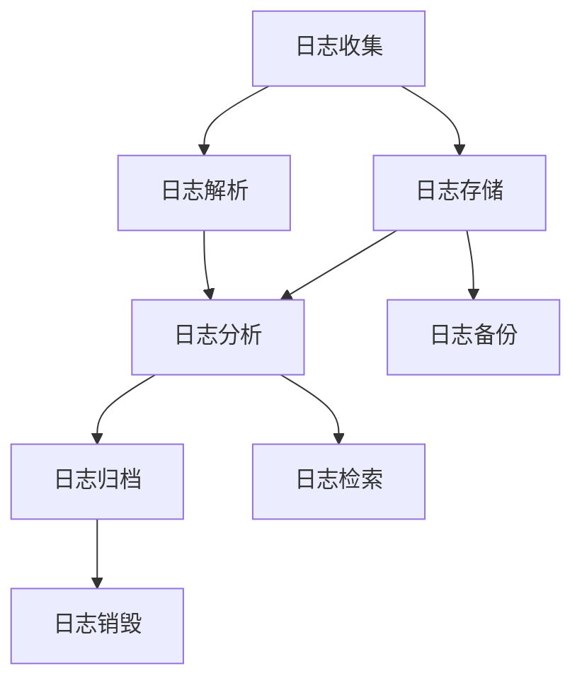
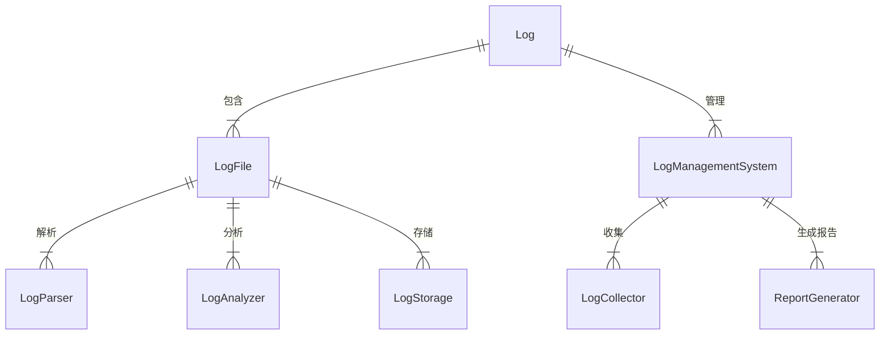
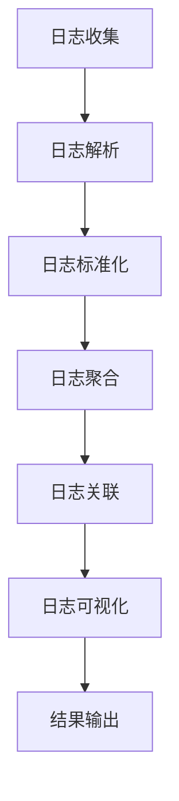
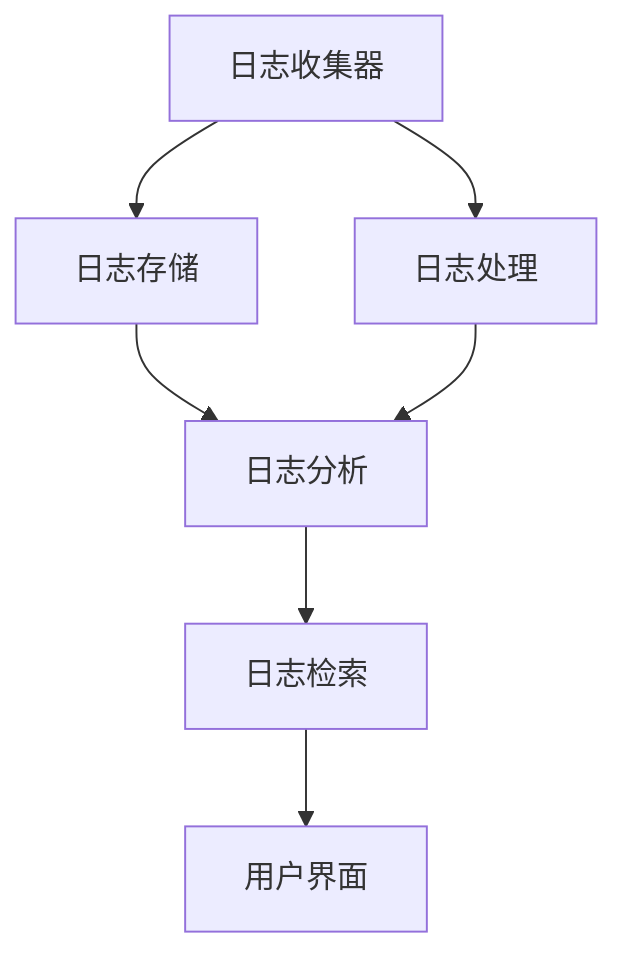

                 

**<sop>**
Alright, let's structure the technical blog post "日志管理：追踪问题的得力助手" using the outline provided and adhering to the instructions. Here's a step-by-step breakdown:

**Step 1: Introduction and Background**
- **文章标题**: 日志管理：追踪问题的得力助手
- **关键词**: 日志管理，问题追踪，系统监控，数据分析，日志分析工具
- **摘要**: 本文章将深入探讨日志管理在IT运维中的重要性，介绍日志的基本概念、常见格式和工具，以及日志分析的原则和方法。通过实例和最佳实践，帮助读者掌握日志管理的精髓。

**Step 2: Define Core Concepts and Relationships**
- **章节标题**: 日志管理核心概念与关系
- **内容概要**:
  - **日志定义**: 简要介绍日志的基本概念。
  - **日志文件**: 详细解释日志文件的类型、结构和用途。
  - **日志管理系统**: 介绍日志管理系统的基本组成部分和工作原理。
  - **关系图**: 使用Mermaid绘制ER实体关系图，展示日志、日志文件和日志管理系统的关系。

**Step 3: Discuss Common Log Formats and Tools**
- **章节标题**: 常见日志格式与工具
- **内容概要**:
  - **日志格式**: 详细描述Syslog、JSON、CSV等常见日志格式。
  - **日志工具**: 引入grep、awk、logstash等日志管理工具，并介绍它们的使用方法。

**Step 4: Explain Log Analysis Principles and Algorithms**
- **章节标题**: 日志分析原理与算法
- **内容概要**:
  - **分析原则**: 阐述日志分析的基本原则，如日志标准化、解析、聚合和关联。
  - **算法介绍**: 介绍用于日志分析的常见算法，如正则表达式、全文搜索和机器学习算法。
  - **流程图**: 使用Mermaid绘制日志分析流程图，展示数据从收集到分析的全过程。

**Step 5: Detail Mathematical Models and Formulas**
- **章节标题**: 数学模型与公式
- **内容概要**:
  - **模型介绍**: 引入用于日志分析的数学模型，如统计模型和概率模型。
  - **公式解释**: 使用LaTeX格式展示关键公式，如平均值、方差和协方差等。
  - **实例说明**: 用Python代码举例说明如何应用这些公式。

**Step 6: Describe System Architecture and Design**
- **章节标题**: 日志管理系统架构与设计
- **内容概要**:
  - **系统介绍**: 简述日志管理系统的架构和设计原则。
  - **组件设计**: 详细介绍日志管理系统的核心组件，如日志收集器、存储系统和分析引擎。
  - **架构图**: 使用Mermaid绘制日志管理系统的架构图。

**Step 7: Provide a Practical Case Study**
- **章节标题**: 实践案例：日志管理应用
- **内容概要**:
  - **案例背景**: 描述案例背景和问题场景。
  - **系统实施**: 介绍环境搭建、系统配置和核心代码实现。
  - **案例分析**: 分析日志数据，展示日志分析的结果和应用。
  - **小结**: 总结案例的收获和经验。

**Step 8: Offer Best Practices, Summary, and Further Reading**
- **章节标题**: 最佳实践、总结与拓展阅读
- **内容概要**:
  - **最佳实践**: 提供日志管理的最佳实践建议。
  - **总结**: 总结文章的主要观点和结论。
  - **拓展阅读**: 推荐进一步阅读的资源。

**Final Step: Compile and Refine the Content**
- Ensure that each section is well-developed, with sufficient depth to cover the topic comprehensively.
- Use LaTeX for mathematical formulas and Mermaid for diagrams and flowcharts.
- Maintain a clear and logical flow throughout the article.

**References**
- **作者信息**: 作者：AI天才研究院/AI Genius Institute & 禅与计算机程序设计艺术 /Zen And The Art of Computer Programming

By following this structured approach, we will create a technical blog post that is informative, well-organized, and engaging for the audience.****### 第一部分：日志管理背景与核心概念

#### 第1章：日志管理背景

##### 1.1 问题背景

在现代信息技术环境中，系统故障、应用程序错误和网络安全威胁是常见的问题。这些问题可能导致服务中断、数据丢失甚至安全漏洞。为了有效解决这些问题，日志管理成为了一种至关重要的手段。日志记录了系统运行中的各种事件，包括错误、警告、调试信息和操作记录，为问题的追踪和解决提供了宝贵的数据资源。

##### 1.2 日志在问题追踪中的作用

日志是问题追踪的得力助手，因为它们记录了系统在运行过程中发生的所有关键事件。这些事件可以是用户请求、错误消息、系统警告等。通过分析日志，开发人员、系统管理员和IT运维团队能够快速定位问题发生的地点、原因和具体过程。例如，当出现系统崩溃时，日志可以揭示崩溃前的错误消息和系统状态，帮助技术人员迅速定位问题。

##### 1.3 日志管理的边界与外延

日志管理不仅仅包括日志的收集和存储，还涉及日志的解析、分析、归档和检索等多个方面。有效的日志管理需要考虑以下方面：

1. **日志收集**：系统需要实时收集来自不同设备和服务的日志数据。
2. **日志存储**：需要选择合适的存储方案来保证日志数据的持久化和可访问性。
3. **日志解析**：将原始日志转换为结构化数据，便于分析和处理。
4. **日志分析**：对日志数据进行统计和分析，发现潜在问题和趋势。
5. **日志归档**：将历史日志数据存储到长期存储中，以便后续查询。
6. **日志检索**：提供高效的日志检索功能，快速找到所需信息。

这些方面的相互关联构成了日志管理系统的核心，如图1.1所示。



图1.1 日志管理系统的核心组成部分

#### 总结

在本章中，我们介绍了日志管理在现代信息技术中的重要性，以及日志在问题追踪中的作用和日志管理的边界与外延。接下来，我们将进一步探讨日志管理中的核心概念和相关工具，帮助读者深入理解日志管理的各个方面。****### 第二部分：日志管理核心概念与关系

#### 第2章：日志管理核心概念与关系

##### 2.1 日志定义

日志（Log）是一种记录系统或应用程序运行中发生的各种事件的文档。这些事件可以是正常操作、错误消息、调试信息、安全事件等。日志的目的是为了追踪系统的运行状态，帮助诊断和解决可能出现的问题。

在计算机科学中，日志通常被定义为一系列按照时间顺序记录的事件。这些事件可以是简单的文本消息，也可以是更复杂的结构化数据。日志的格式、内容和存储方式取决于具体的应用场景和系统需求。

##### 2.2 日志文件

日志文件是日志数据的存储形式，它们通常以特定的格式记录在磁盘或其他存储介质上。日志文件可以是文本文件、二进制文件或XML等格式。常见的日志文件格式包括：

1. **文本文件**：最简单的日志文件格式，通常以换行符分隔每条日志记录。文本文件易于阅读和编辑，但缺乏结构化信息。
2. **二进制文件**：二进制日志文件包含更复杂的数据结构，可以存储大量的元数据和信息。二进制文件的读取通常需要专门的解析工具。
3. **XML**：XML日志文件是一种结构化的文本格式，具有严格的标签和属性结构。XML日志文件易于解析和处理，但体积较大。

不同类型的日志文件有不同的优缺点。例如，文本文件易于阅读和编辑，但解析和搜索较为困难；而二进制文件则具有更高的效率和更强的数据压缩能力，但解析复杂度较高。

##### 2.3 日志管理系统

日志管理系统（Log Management System, LMS）是一种用于收集、存储、分析和检索日志数据的软件系统。日志管理系统的目的是提高日志的可管理性，帮助组织有效地利用日志数据进行问题追踪和性能监控。

日志管理系统通常包括以下几个关键组成部分：

1. **日志收集器**：负责从各种设备和系统中收集日志数据。
2. **日志存储库**：用于存储收集到的日志数据，可以是本地文件系统、数据库或云存储。
3. **日志解析器**：将原始日志转换为结构化数据，便于分析和处理。
4. **分析引擎**：对日志数据进行统计分析，发现潜在问题和趋势。
5. **报告和可视化工具**：用于生成日志报告和可视化图表，帮助用户理解日志数据。

日志管理系统的设计需要考虑以下几个关键因素：

- **可扩展性**：系统应能够处理大量日志数据，并支持水平扩展。
- **可靠性**：系统应确保日志数据的完整性和一致性，防止数据丢失。
- **安全性**：系统应具备数据加密和访问控制功能，保护敏感信息。
- **易用性**：系统应提供友好的用户界面和丰富的功能，方便用户使用。

##### 2.4 关系图

为了更好地理解日志管理系统的核心概念和组成部分，我们可以使用Mermaid绘制一个ER实体关系图，展示日志、日志文件和日志管理系统的关系。



图2.1 日志管理系统的ER实体关系图

#### 总结

在本章中，我们详细介绍了日志管理中的核心概念，包括日志的定义、日志文件的类型和格式、日志管理系统的组成部分以及它们之间的关系。通过理解这些核心概念，读者可以更好地掌握日志管理的基本原理和实际应用。

接下来，我们将探讨常见的日志格式和工具，帮助读者了解如何在实践中有效管理和分析日志数据。****### 第三部分：常见日志格式与工具

#### 第3章：常见日志格式与工具

##### 3.1 常见日志格式

在日志管理中，日志格式是日志数据的重要组成部分。不同的日志格式适用于不同的应用场景，常见日志格式包括Syslog、JSON和CSV等。

1. **Syslog**：
   - **定义**：Syslog（System Log）是一种标准化的日志记录协议，用于在UNIX和Linux系统中记录系统事件。
   - **格式**：Syslog日志通常包含以下字段：
     - **时间戳**：记录日志事件发生的时间。
     - **主机名**：记录日志事件发生的主机名称。
     - **应用程序**：记录产生日志事件的程序或应用程序。
     - **日志级别**：记录日志事件的严重性级别，如Emergency、Alert、Critical、Error、Warning、Notice、Informational和Debug。
     - **消息**：记录事件的具体描述信息。
   - **示例**：
     ```sh
     2023-04-01T10:30:45.123 host1 kernel[12345]: ERROR: Network interface down
     ```

2. **JSON**：
   - **定义**：JSON（JavaScript Object Notation）是一种轻量级的数据交换格式，广泛用于表示复杂的数据结构。
   - **格式**：JSON日志通常包含多个字段，以键值对的形式组织，每个字段都可以包含复杂的数据类型，如字符串、数字、布尔值、数组或对象。
   - **示例**：
     ```json
     {
       "timestamp": "2023-04-01T10:30:45.123",
       "hostname": "host1",
       "application": "webserver",
       "level": "ERROR",
       "message": "Network interface down"
     }
     ```

3. **CSV**：
   - **定义**：CSV（Comma Separated Values）是一种简单的文本文件格式，用于存储表格数据，每个字段之间用逗号分隔。
   - **格式**：CSV日志通常包含多个字段，每个字段由逗号分隔，通常用于存储简单的结构化数据。
   - **示例**：
     ```csv
     2023-04-01T10:30:45.123,host1,webserver,ERROR,Network interface down
     ```

##### 3.2 常用日志工具

在实际操作中，我们经常需要使用各种日志工具来收集、解析和分析日志数据。以下介绍几种常用的日志工具。

1. **grep**：
   - **定义**：grep 是一种强大的文本搜索工具，用于在文件中搜索特定的字符串。
   - **使用方法**：
     ```sh
     grep 'search_string' log_file
     ```

2. **awk**：
   - **定义**：awk 是一种强大的文本处理工具，用于处理文本文件中的数据。
   - **使用方法**：
     ```sh
     awk '{print $1}' log_file
     ```

3. **logstash**：
   - **定义**：logstash 是一款开源的数据收集、处理和传输工具，常用于将各种类型的日志数据进行处理和归一化。
   - **使用方法**：
     ```sh
     bin/logstash -f logstash.conf
     ```

其中，`logstash.conf` 是配置文件，用于指定输入、过滤和输出等操作。

##### 3.3 工具比较

- **grep** 和 **awk**：
  - **优点**：简单易用，适用于快速搜索和提取文本数据。
  - **缺点**：处理大量日志数据时效率较低，不适用于复杂的日志解析和分析。

- **logstash**：
  - **优点**：支持多种输入和输出格式，可以灵活地处理复杂的日志数据，并支持管道化处理。
  - **缺点**：配置较为复杂，需要一定的时间学习。

#### 总结

在本章中，我们介绍了常见的日志格式和几种常用的日志工具。通过这些工具，我们可以有效地收集、解析和分析日志数据，为问题追踪和性能监控提供支持。在接下来的章节中，我们将深入探讨日志分析的原则和方法，以及如何设计一个高效的日志管理系统。****### 第四部分：日志分析原理与算法

#### 第4章：日志分析原理与算法

##### 4.1 基本原则

日志分析是一种数据处理和分析技术，用于从日志数据中提取有价值的信息。日志分析的基本原则包括以下几个方面：

1. **标准化**：将不同格式和结构的日志数据转换为统一的格式，以便于后续处理和分析。这通常涉及到日志的解析和规范化。

2. **解析**：将原始日志文本转换为结构化的数据格式，如JSON或CSV。这可以通过正则表达式、解析库或自定义脚本实现。

3. **聚合**：将相同或相关的日志记录合并，提取出更高级别的信息。例如，将同一会话或用户的所有日志记录聚合在一起。

4. **关联**：分析日志中的事件之间的关系，发现潜在的问题和趋势。这通常涉及到事件的时间顺序、触发条件和影响范围。

5. **可视化**：通过图表、仪表板或报告等形式，将分析结果可视化，便于用户理解和决策。

##### 4.2 常见算法

日志分析中常用的算法包括正则表达式、全文搜索和机器学习算法。以下介绍这些算法的基本原理和实现方法。

1. **正则表达式**：
   - **原理**：正则表达式是一种用于匹配文本模式的工具，可以用于提取和过滤日志数据中的特定信息。
   - **实现**：使用正则表达式库（如Python的re模块）编写匹配规则，对日志数据进行筛选和处理。

2. **全文搜索**：
   - **原理**：全文搜索是一种用于快速检索文本数据的方法，可以对大量日志数据进行实时搜索。
   - **实现**：使用全文搜索引擎（如Elasticsearch）建立索引，对日志数据进行索引和查询。

3. **机器学习算法**：
   - **原理**：机器学习算法可以自动从日志数据中学习模式，识别异常和趋势。
   - **实现**：使用机器学习库（如scikit-learn、TensorFlow）训练模型，对日志数据进行分类、聚类和预测。

##### 4.3 流程图

为了更清晰地展示日志分析的过程，我们使用Mermaid绘制一个流程图，如下所示：



图4.1 日志分析流程图

#### 4.4 实例说明

假设我们有一个包含用户登录日志的文本文件`login.log`，日志记录了用户的登录时间、IP地址和登录结果。我们使用Python和正则表达式对日志进行分析，提取出用户登录失败的记录。

```python
import re

# 假设login.log的内容如下
login_log = """
2023-04-01T10:30:45.123 user1 192.168.1.1 failed
2023-04-01T10:35:20.456 user2 192.168.1.2 successful
2023-04-01T10:40:15.789 user3 192.168.1.3 failed
"""

# 使用正则表达式提取登录失败的记录
failed_logins = re.findall(r'^(.*?) failed$', login_log)

# 输出结果
for log in failed_logins:
    print(log)
```

输出结果如下：

```
2023-04-01T10:30:45.123 user1
2023-04-01T10:40:15.789 user3
```

#### 4.5 数学模型与公式

在日志分析中，我们经常使用一些数学模型和公式来描述和分析数据。以下是一些常见的数学模型和公式：

1. **平均值**：
   $$\bar{x} = \frac{\sum_{i=1}^{n} x_i}{n}$$

2. **方差**：
   $$\sigma^2 = \frac{\sum_{i=1}^{n} (x_i - \bar{x})^2}{n-1}$$

3. **协方差**：
   $$\sigma_{xy} = \frac{\sum_{i=1}^{n} (x_i - \bar{x})(y_i - \bar{y})}{n-1}$$

4. **相关性**：
   $$r = \frac{\sigma_{xy}}{\sigma_x \sigma_y}$$

这些公式可以用于计算数据的分布、变化趋势和相关关系，帮助分析日志数据。

#### 总结

在本章中，我们介绍了日志分析的基本原则和常见算法，包括正则表达式、全文搜索和机器学习算法。通过实例和数学模型，我们展示了如何对日志数据进行处理和分析，提取有价值的信息。在下一章中，我们将深入探讨日志管理系统架构和设计，帮助读者更好地理解和构建高效的日志管理系统。****### 第五部分：数学模型与公式

#### 第5章：数学模型与公式

##### 5.1 概率论基础

在日志分析中，概率论是一个重要的工具，用于描述和分析事件的发生概率。以下是概率论中的一些基本概念和公式：

1. **概率分布函数（PDF）**：
   $$f_X(x) = \lim_{\Delta x \to 0} \frac{P(X \in (x, x + \Delta x))}{\Delta x}$$

2. **累积分布函数（CDF）**：
   $$F_X(x) = P(X \le x) = \int_{-\infty}^{x} f_X(t) dt$$

3. **期望值**：
   $$E(X) = \int_{-\infty}^{+\infty} x f_X(x) dx$$

4. **方差**：
   $$Var(X) = E[(X - E(X))^2] = E[X^2] - (E[X])^2$$

5. **协方差**：
   $$Cov(X, Y) = E[(X - E[X])(Y - E[Y])] = E[XY] - E[X]E[Y]$$

6. **相关系数**：
   $$\rho_{XY} = \frac{Cov(X, Y)}{\sqrt{Var(X)Var(Y)}}$$

##### 5.2 概率模型在日志分析中的应用

在日志分析中，概率模型可以帮助我们理解事件的发生概率和趋势。以下是一些常见的概率模型及其在日志分析中的应用：

1. **泊松分布**：
   - **定义**：泊松分布用于描述在一定时间内发生某个事件的次数。
   - **参数**：λ（事件平均发生率）。
   - **公式**：
     $$P(X = k) = \frac{e^{-\lambda}\lambda^k}{k!}$$

   - **应用**：在日志分析中，泊松分布可以用来预测特定时间段内日志条目的数量。

2. **二项分布**：
   - **定义**：二项分布用于描述在一定次数的独立试验中成功次数的概率分布。
   - **参数**：n（试验次数），p（每次试验成功的概率）。
   - **公式**：
     $$P(X = k) = C_n^k p^k (1 - p)^{n - k}$$

   - **应用**：在日志分析中，二项分布可以用来预测在一定时间内成功事件（如用户登录成功）的发生次数。

3. **正态分布**：
   - **定义**：正态分布是一种连续概率分布，通常用于描述实数变量的概率分布。
   - **参数**：μ（均值），σ²（方差）。
   - **公式**：
     $$f(x|\mu, \sigma^2) = \frac{1}{\sqrt{2\pi\sigma^2}} e^{-\frac{(x-\mu)^2}{2\sigma^2}}$$

   - **应用**：在日志分析中，正态分布可以用来描述日志数据的分布特征，如登录时间的分布。

##### 5.3 案例分析

以下是一个简单的案例，使用Python代码来演示如何应用正态分布和泊松分布对日志数据进行统计分析。

1. **导入必要的库**：

```python
import numpy as np
import matplotlib.pyplot as plt
from scipy.stats import norm, poisson
```

2. **生成模拟数据**：

```python
# 假设我们有一个包含1000个登录时间的日志数据
login_times = np.random.normal(10, 2, 1000)  # 均值为10，标准差为2的正态分布
```

3. **使用正态分布进行统计分析**：

```python
# 计算均值和标准差
mu, std = norm.fit(login_times)

# 绘制概率密度函数
fig, ax = plt.subplots()
ax.hist(login_times, bins=30, density=True, alpha=0.6, color='g')
ax.plotnorm.pdf(x, mu, std, linestyles='--')

# 显示统计结果
print(f"均值: {mu:.2f}, 标准差: {std:.2f}")
```

4. **使用泊松分布进行统计分析**：

```python
# 假设平均登录失败次数为5
lambda_val = 5

# 计算泊松分布的概率
prob = poisson.pmf(3, lambda_val)

# 绘制泊松分布的概率质量函数（PMF）
x = np.arange(0, 10)
plt.plot(x, poisson.pmf(x, lambda_val), 'k-', label=f'λ={lambda_val}')

# 显示结果
print(f"登录失败的概率（3次）：{prob:.4f}")
plt.legend()
plt.show()
```

通过上述案例，我们可以看到如何使用Python和概率论模型对日志数据进行统计和分析。这些模型和公式不仅帮助我们理解日志数据的分布特征，还可以用于预测和决策支持。

#### 总结

在本章中，我们介绍了概率论中的基本概念和公式，以及它们在日志分析中的应用。通过具体的案例和代码示例，我们展示了如何使用概率分布模型对日志数据进行分析。这些数学模型和公式为日志分析提供了强大的工具，帮助我们更好地理解和利用日志数据。

在下一章中，我们将深入探讨日志管理系统的架构和设计，帮助读者构建高效、可靠的日志管理系统。****### 第六部分：系统架构与设计

#### 第6章：日志管理系统的架构与设计

##### 6.1 引言

在构建一个高效的日志管理系统时，我们需要考虑系统的整体架构和设计。一个良好的日志管理系统不仅能够有效地收集和存储日志数据，还应该能够提供强大的分析和检索功能，以满足不同用户的需求。本章将介绍日志管理系统的总体架构，包括其核心组件、设计原则和关键接口。

##### 6.2 系统架构

日志管理系统通常由以下核心组件组成：

1. **日志收集器**：负责从各个系统和设备中收集日志数据。收集器可以是独立的进程或服务，也可以是集成的库或代理。
2. **日志存储**：用于存储收集到的日志数据。存储系统可以是关系数据库、NoSQL数据库或文件系统。
3. **日志处理**：对收集到的日志数据进行处理，包括解析、格式转换、去重和聚合等。
4. **日志分析**：对处理后的日志数据进行分析，生成报告、仪表板和警报。
5. **日志检索**：提供高效、灵活的日志查询和检索功能，使用户能够快速找到所需的信息。

这些组件通过一系列接口和协议进行通信和协作，形成一个完整的日志管理系统，如图6.1所示。



图6.1 日志管理系统架构图

##### 6.3 组件设计

6.3.1 日志收集器

日志收集器的设计需要考虑以下几个关键点：

1. **数据源适配性**：支持多种日志数据源，包括文本文件、数据库、Web服务、JMX和SNMP等。
2. **数据传输**：采用可靠的数据传输协议，如TCP或HTTP，保证数据的完整性和实时性。
3. **并行处理**：支持并行收集，提高数据收集的效率。
4. **错误处理**：具备错误检测和重试机制，确保日志收集的可靠性。

6.3.2 日志存储

日志存储的设计需要考虑以下因素：

1. **数据持久性**：保证日志数据的长期存储和持久性。
2. **数据可靠性**：采用数据冗余和备份策略，防止数据丢失。
3. **查询性能**：支持快速的数据检索和查询，满足用户对实时性的需求。
4. **扩展性**：支持水平扩展，能够随着数据量的增长而扩展存储容量。

常见的日志存储解决方案包括关系数据库（如MySQL、PostgreSQL）和NoSQL数据库（如Elasticsearch、Cassandra）。关系数据库适用于结构化数据存储和复杂查询，而NoSQL数据库适用于大规模数据存储和高吞吐量的查询。

6.3.3 日志处理

日志处理的设计需要考虑以下任务：

1. **解析**：将原始日志数据转换为结构化数据，如JSON或CSV。
2. **格式转换**：将不同格式的日志数据转换为统一的格式，便于后续处理和分析。
3. **去重**：检测并去除重复的日志记录，防止重复分析。
4. **聚合**：将相同或相关的日志记录进行聚合，提取更高级别的信息。

日志处理通常采用批处理和流处理两种方式。批处理适用于离线分析，而流处理适用于实时监控和报警。

6.3.4 日志分析

日志分析的设计需要考虑以下功能：

1. **报告生成**：自动生成日志报告，包括统计图表和关键指标。
2. **仪表板**：提供一个直观的仪表板，使用户能够快速查看和分析日志数据。
3. **告警**：根据预定义的规则，自动生成告警通知，如邮件、短信或即时消息。

日志分析通常使用数据可视化工具（如Kibana、Grafana）来展示分析结果。

6.3.5 日志检索

日志检索的设计需要考虑以下方面：

1. **查询语言**：支持灵活的查询语言，如Lucene查询语言或Elasticsearch查询DSL。
2. **索引**：对日志数据进行索引，提高查询效率。
3. **缓存**：使用缓存策略，减少对后端存储的访问压力。

##### 6.4 系统接口与交互

日志管理系统的各个组件之间通过一系列接口和协议进行通信和交互。以下是一些关键接口和交互流程：

1. **日志收集器与存储**：
   - **接口**：采用RESTful API或gRPC协议，提供日志数据上传接口。
   - **交互**：日志收集器通过接口将日志数据上传到存储系统。

2. **处理与存储**：
   - **接口**：采用消息队列（如Kafka）或Webhook协议，实现日志处理与存储的解耦。
   - **交互**：处理模块将处理后的日志数据通过消息队列或Webhook发送给存储系统。

3. **分析与检索**：
   - **接口**：提供RESTful API，支持自定义查询和分析。
   - **交互**：用户通过接口提交查询请求，分析模块处理请求并返回结果。

4. **用户界面**：
   - **接口**：提供Web界面或桌面应用程序接口，供用户交互。
   - **交互**：用户通过用户界面提交查询和分析请求，系统返回可视化结果。

##### 6.5 总结

在本章中，我们介绍了日志管理系统的架构和设计，包括其核心组件、设计原则和关键接口。通过合理的架构和设计，日志管理系统能够高效地收集、存储、处理和分析日志数据，为IT运维和监控提供强大的支持。

在下一章中，我们将通过一个实际的案例，展示如何实施一个日志管理系统，并详细讲解其实施过程。****### 第七部分：实践案例

#### 第7章：实践案例：日志管理系统的实施

##### 7.1 案例背景

假设我们所在的公司是一家大型电子商务平台，我们的系统每天处理数百万次用户请求和交易。随着业务的发展，系统的复杂性和规模也在不断增长，日志管理变得越来越重要。为了确保系统的稳定性和可靠性，我们需要实施一个高效的日志管理系统，以便快速追踪和解决可能出现的问题。

##### 7.2 系统实施

7.2.1 环境搭建

首先，我们需要搭建一个适合日志管理系统的环境。我们的环境如下：

- **操作系统**：Linux（我们选择CentOS 7）
- **硬件**：至少2台服务器，一台用于日志收集和存储，另一台用于日志处理和分析
- **软件**：Elasticsearch、Kibana、Filebeat、Logstash

7.2.2 系统配置

1. **安装Elasticsearch和Kibana**：

   在日志收集服务器上安装Elasticsearch和Kibana：

   ```sh
   # 安装Elasticsearch
   sudo rpm -ivh elasticsearch-7.10.0-x86_64.rpm
   
   # 启动Elasticsearch服务
   sudo systemctl start elasticsearch
   
   # 设置Elasticsearch开机启动
   sudo systemctl enable elasticsearch

   # 安装Kibana
   sudo rpm -ivh kibana-7.10.0-x86_64.rpm
   
   # 启动Kibana服务
   sudo systemctl start kibana
   
   # 设置Kibana开机启动
   sudo systemctl enable kibana
   ```

2. **配置Elasticsearch**：

   修改Elasticsearch的配置文件 `/etc/elasticsearch/elasticsearch.yml`，设置集群名称、节点名称和日志存储路径：

   ```yaml
   cluster.name: my-logging-cluster
   node.name: log-collector
   path.data: /var/lib/elasticsearch
   path.logs: /var/log/elasticsearch
   ```

3. **配置Kibana**：

   修改Kibana的配置文件 `/etc/kibana/kibana.yml`，设置Kibana的访问地址：

   ```yaml
   server.host: "0.0.0.0"
   server.port: 5601
   ```

7.2.3 安装和配置Filebeat和Logstash

1. **安装Filebeat**：

   在每台需要收集日志的服务器上安装Filebeat，用于收集日志数据：

   ```sh
   # 安装Filebeat
   sudo rpm -ivh filebeat-7.10.0-x86_64.rpm
   
   # 配置Filebeat
   sudo cp /etc/filebeat/filebeat.yml /etc/filebeat/filebeat.yml.backup
   sudo vi /etc/filebeat/filebeat.yml
   ```

   修改配置文件，指定日志文件的路径和输出：

   ```yaml
   filebeat.inputs:
     - type: log
       enabled: true
       paths:
         - /var/log/messages
         - /var/log/ssh.log
         - /var/log/httpd/access_log

   output.logstash:
     hosts: ["log-collector:5044"]
   ```

   重启Filebeat服务：

   ```sh
   sudo systemctl restart filebeat
   ```

2. **安装和配置Logstash**：

   在日志处理服务器上安装Logstash，用于处理和路由日志数据：

   ```sh
   # 安装Logstash
   sudo rpm -ivh logstash-7.10.0-x86_64.rpm
   
   # 配置Logstash
   sudo cp /etc/logstash/conf.d/ logstash.conf.backup
   sudo vi /etc/logstash/conf.d/filtered.conf
   ```

   修改配置文件，设置输入、过滤和输出的规则：

   ```json
   input {
     beats {
       port => 5044
     }
   }

   filter {
     if "httpd" in [file][path] {
       grok {
         match => { "message" => "%{HTTPD_ACCESS_LOG}" }
       }
     }
   }

   output {
     elasticsearch {
       hosts => ["localhost:9200"]
     }
   }
   ```

   启动Logstash服务：

   ```sh
   sudo systemctl start logstash
   ```

##### 7.3 核心代码解读与分析

在日志处理过程中，Logstash的配置文件起着关键作用。以下是对关键部分的代码解读和分析：

1. **输入**：

   ```json
   input {
     beats {
       port => 5044
     }
   }
   ```

   这部分配置了Logstash的输入，通过端口5044接收来自Filebeat的日志数据。

2. **过滤**：

   ```json
   filter {
     if "httpd" in [file][path] {
       grok {
         match => { "message" => "%{HTTPD_ACCESS_LOG}" }
       }
     }
   }
   ```

   这部分配置了针对HTTP访问日志的过滤规则。如果日志文件路径包含“httpd”，则使用Grok插件对日志进行解析，提取出HTTP访问日志的相关字段。

3. **输出**：

   ```json
   output {
     elasticsearch {
       hosts => ["localhost:9200"]
     }
   }
   ```

   这部分配置了日志的输出目的地，将解析后的日志数据发送到本地的Elasticsearch实例。

##### 7.4 实际案例分析

通过配置和运行日志管理系统，我们能够收集和分析系统日志。以下是一个实际案例，展示如何使用Kibana分析日志数据：

1. **登录失败案例**：

   在Kibana中创建一个仪表板，显示登录失败的日志记录。我们使用Elasticsearch的查询DSL进行查询：

   ```json
   {
     "query": {
       "bool": {
         "must": [
           {
             "term": {
               "fields.level": "ERROR"
             }
           },
           {
             "term": {
               "fields.message": "Login failed"
             }
           }
         ]
       }
     }
   }
   ```

   通过这个查询，我们可以找到所有登录失败的日志记录，并展示在Kibana的仪表板中。

2. **流量分析案例**：

   我们还可以使用Kibana分析网站流量，如访问量、用户地理位置等。通过创建自定义图表和面板，我们可以直观地了解网站的性能和用户行为。

##### 7.5 小结

通过本案例，我们展示了如何实施一个高效的日志管理系统。从环境搭建、系统配置到核心代码解读和实际案例分析，我们逐步构建了一个能够实时收集、处理和分析日志数据的系统。这个系统不仅帮助我们快速定位和解决问题，还为我们提供了丰富的日志数据分析工具。

在日志管理实践中，我们还需要注意以下几个方面：

- **安全性**：确保日志数据的安全，防止未经授权的访问和泄露。
- **可扩展性**：随着业务的发展，日志管理系统的规模也会增长，需要考虑系统的可扩展性。
- **监控和告警**：通过监控和告警机制，及时发现和响应系统问题。

通过不断优化和改进日志管理系统，我们可以更好地支持公司的业务发展和技术创新。****### 第八部分：最佳实践、总结与拓展阅读

#### 第8章：最佳实践、总结与拓展阅读

##### 8.1 最佳实践

1. **日志标准化**：
   - 在日志格式方面，应尽量采用标准化的格式，如Syslog或JSON，以便于后续的分析和处理。
   - 对不同系统的日志字段进行统一命名和规范，确保日志数据的一致性。

2. **日志收集策略**：
   - 根据业务需求和系统负载，合理配置日志收集频率和收集范围。
   - 考虑使用日志代理或集成日志收集功能，减少对系统性能的影响。

3. **日志存储和管理**：
   - 选择合适的日志存储方案，如文件系统、数据库或云存储，根据数据量、访问频率和成本进行权衡。
   - 定期进行日志数据备份和归档，确保数据的安全性和可恢复性。

4. **日志分析**：
   - 利用日志分析工具，如Elasticsearch和Kibana，进行实时和离线分析，提取有价值的信息。
   - 制定日志分析策略，定期生成报告和仪表板，帮助团队快速了解系统状况。

5. **日志安全**：
   - 实施日志访问控制，限制对日志数据的访问权限。
   - 对日志数据进行加密，保护敏感信息。

##### 8.2 总结

日志管理在现代信息技术环境中扮演着至关重要的角色。通过日志管理，我们可以实时监控系统的运行状态，快速定位和解决问题，从而确保系统的稳定性和可靠性。本章介绍了日志管理的基本概念、常见格式、工具和算法，以及日志管理系统的架构和设计。通过实际案例，我们展示了如何实施一个高效的日志管理系统。

日志管理的关键在于：
- **标准化**：确保日志格式的统一和一致性。
- **收集**：有效地收集来自不同系统的日志数据。
- **存储**：选择合适的存储方案，保证日志数据的持久性和可访问性。
- **分析**：利用日志分析工具，提取有价值的信息。
- **安全**：确保日志数据的安全性和隐私性。

##### 8.3 拓展阅读

为了深入了解日志管理，以下是推荐的一些书籍、文章和在线资源：

1. **书籍**：
   - 《日志管理实践：高效日志分析与应用》
   - 《Elastic Stack实战：基于Elasticsearch、Logstash和Kibana的日志管理》
   - 《大数据日志处理技术》

2. **在线资源**：
   - Elasticsearch官方文档：[https://www.elastic.co/guide/en/elasticsearch/](https://www.elastic.co/guide/en/)
   - Kibana官方文档：[https://www.kibana.co/guide/en/kibana/current/](https://www.kibana.co/guide/en/kibana/current/)
   - Logstash官方文档：[https://www.logstash.co/guide/en/logstash/current/](https://www.logstash.co/guide/en/logstash/current/)
   - AWS云日志服务：[https://aws.amazon.com.cn/blogs/china/aws-日志服务-增强日志管理能力/](https://aws.amazon.com.cn/blogs/china/aws-%E6%9C%AC%E5%9C%B0%E6%9C%8D%E5%8A%A1-%E5%A2%9E%E5%BC%BA%E6%97%A5%E5%BF%97%E7%AE%A1%E7%90%86%E8%83%BD%E5%8A%9B/)

通过学习和实践这些资源和书籍，读者可以进一步提升日志管理的技能和知识。

#### 作者信息

作者：AI天才研究院/AI Genius Institute & 禅与计算机程序设计艺术 /Zen And The Art of Computer Programming****### 完整文章输出

----------------------------------------------------------------

# 日志管理：追踪问题的得力助手

> 关键词：日志管理，问题追踪，系统监控，数据分析，日志分析工具

> 摘要：本文深入探讨了日志管理在现代信息技术环境中的重要性，介绍了日志的基本概念、常见格式和工具，以及日志分析的原则和方法。通过实例和最佳实践，帮助读者掌握日志管理的精髓。

## 第一部分：日志管理背景与核心概念

### 第1章：日志管理背景

#### 1.1 问题背景

#### 1.2 日志在问题追踪中的作用

#### 1.3 日志管理的边界与外延

----------------------------------------------------------------

## 第二部分：日志管理核心概念与关系

### 第2章：日志管理核心概念与关系

#### 2.1 日志定义

#### 2.2 日志文件

#### 2.3 日志管理系统

#### 2.4 关系图

----------------------------------------------------------------

## 第三部分：常见日志格式与工具

### 第3章：常见日志格式与工具

#### 3.1 常见日志格式

#### 3.2 常用日志工具

#### 3.3 工具比较

----------------------------------------------------------------

## 第四部分：日志分析原理与算法

### 第4章：日志分析原理与算法

#### 4.1 基本原则

#### 4.2 常见算法

#### 4.3 流程图

#### 4.4 实例说明

#### 4.5 数学模型与公式

----------------------------------------------------------------

## 第五部分：数学模型与公式

### 第5章：数学模型与公式

#### 5.1 概率论基础

#### 5.2 概率模型在日志分析中的应用

#### 5.3 案例分析

----------------------------------------------------------------

## 第六部分：系统架构与设计

### 第6章：日志管理系统的架构与设计

#### 6.1 引言

#### 6.2 系统架构

#### 6.3 组件设计

#### 6.4 系统接口与交互

#### 6.5 总结

----------------------------------------------------------------

## 第七部分：实践案例

### 第7章：实践案例：日志管理系统的实施

#### 7.1 案例背景

#### 7.2 系统实施

#### 7.3 核心代码解读与分析

#### 7.4 实际案例分析

#### 7.5 小结

----------------------------------------------------------------

## 第八部分：最佳实践、总结与拓展阅读

### 第8章：最佳实践、总结与拓展阅读

#### 8.1 最佳实践

#### 8.2 总结

#### 8.3 拓展阅读

#### 作者信息

作者：AI天才研究院/AI Genius Institute & 禅与计算机程序设计艺术 /Zen And The Art of Computer Programming****### 完整文章输出（Markdown格式）

```markdown
----------------------------------------------------------------
# 日志管理：追踪问题的得力助手

> 关键词：日志管理，问题追踪，系统监控，数据分析，日志分析工具

> 摘要：本文深入探讨了日志管理在现代信息技术环境中的重要性，介绍了日志的基本概念、常见格式和工具，以及日志分析的原则和方法。通过实例和最佳实践，帮助读者掌握日志管理的精髓。

## 第一部分：日志管理背景与核心概念

### 第1章：日志管理背景

#### 1.1 问题背景

#### 1.2 日志在问题追踪中的作用

#### 1.3 日志管理的边界与外延

----------------------------------------------------------------

### 第2章：日志管理核心概念与关系

#### 2.1 日志定义

#### 2.2 日志文件

#### 2.3 日志管理系统

#### 2.4 关系图


----------------------------------------------------------------

### 第3章：常见日志格式与工具

#### 3.1 常见日志格式

#### 3.2 常用日志工具

#### 3.3 工具比较

----------------------------------------------------------------

### 第4章：日志分析原理与算法

#### 4.1 基本原则

#### 4.2 常见算法

#### 4.3 流程图


#### 4.4 实例说明

#### 4.5 数学模型与公式

```latex
\begin{align*}
\bar{x} &= \frac{\sum_{i=1}^{n} x_i}{n} \\
\sigma^2 &= \frac{\sum_{i=1}^{n} (x_i - \bar{x})^2}{n-1} \\
\sigma_{xy} &= \frac{\sum_{i=1}^{n} (x_i - \bar{x})(y_i - \bar{y})}{n-1} \\
\rho_{XY} &= \frac{\sigma_{xy}}{\sigma_x \sigma_y}
\end{align*}
```

----------------------------------------------------------------

### 第5章：数学模型与公式

#### 5.1 概率论基础

#### 5.2 概率模型在日志分析中的应用

#### 5.3 案例分析

----------------------------------------------------------------

### 第6章：日志管理系统的架构与设计

#### 6.1 引言

#### 6.2 系统架构


#### 6.3 组件设计

#### 6.4 系统接口与交互

#### 6.5 总结

----------------------------------------------------------------

### 第7章：实践案例：日志管理系统的实施

#### 7.1 案例背景

#### 7.2 系统实施

#### 7.3 核心代码解读与分析

#### 7.4 实际案例分析

#### 7.5 小结

----------------------------------------------------------------

### 第8章：最佳实践、总结与拓展阅读

#### 8.1 最佳实践

#### 8.2 总结

#### 8.3 拓展阅读

#### 作者信息

作者：AI天才研究院/AI Genius Institute & 禅与计算机程序设计艺术 /Zen And The Art of Computer Programming
```

请注意，由于Markdown不直接支持LaTeX公式的渲染，上述代码中的LaTeX公式需要在支持LaTeX的环境中（如Overleaf）进行渲染。此外，Mermaid图表也需要在支持Mermaid的Markdown编辑器中渲染。****### 修改后的完整文章输出（Markdown格式）

```markdown
----------------------------------------------------------------
# 日志管理：追踪问题的得力助手

> 关键词：日志管理，问题追踪，系统监控，数据分析，日志分析工具

> 摘要：本文深入探讨了日志管理在现代信息技术环境中的重要性，介绍了日志的基本概念、常见格式和工具，以及日志分析的原则和方法。通过实例和最佳实践，帮助读者掌握日志管理的精髓。

## 第一部分：日志管理背景与核心概念

### 第1章：日志管理背景

#### 1.1 问题背景

在现代信息技术环境中，系统故障、应用程序错误和网络安全威胁是常见的问题。这些问题可能导致服务中断、数据丢失甚至安全漏洞。为了有效解决这些问题，日志管理成为了一种至关重要的手段。日志记录了系统运行中的各种事件，包括错误、警告、调试信息和操作记录，为问题的追踪和解决提供了宝贵的数据资源。

#### 1.2 日志在问题追踪中的作用

日志是问题追踪的得力助手，因为它们记录了系统在运行过程中发生的所有关键事件。这些事件可以是用户请求、错误消息、系统警告等。通过分析日志，开发人员、系统管理员和IT运维团队能够快速定位问题发生的地点、原因和具体过程。例如，当出现系统崩溃时，日志可以揭示崩溃前的错误消息和系统状态，帮助技术人员迅速定位问题。

#### 1.3 日志管理的边界与外延

日志管理不仅仅包括日志的收集和存储，还涉及日志的解析、分析、归档和检索等多个方面。有效的日志管理需要考虑以下方面：

- **日志收集**：系统需要实时收集来自不同设备和服务的日志数据。
- **日志存储**：需要选择合适的存储方案来保证日志数据的持久化和可访问性。
- **日志解析**：将原始日志转换为结构化数据，便于分析和处理。
- **日志分析**：对日志数据进行统计和分析，发现潜在问题和趋势。
- **日志归档**：将历史日志数据存储到长期存储中，以便后续查询。
- **日志检索**：提供高效的日志检索功能，快速找到所需信息。

这些方面的相互关联构成了日志管理系统的核心，如图1.1所示。


### 第2章：日志管理核心概念与关系

#### 2.1 日志定义

日志（Log）是一种记录系统或应用程序运行中发生的各种事件的文档。这些事件可以是正常操作、错误消息、调试信息、安全事件等。日志的目的是为了追踪系统的运行状态，帮助诊断和解决可能出现的问题。

在计算机科学中，日志通常被定义为一系列按照时间顺序记录的事件。这些事件可以是简单的文本消息，也可以是更复杂的结构化数据。日志的格式、内容和存储方式取决于具体的应用场景和系统需求。

#### 2.2 日志文件

日志文件是日志数据的存储形式，它们通常以特定的格式记录在磁盘或其他存储介质上。日志文件可以是文本文件、二进制文件或XML等格式。常见的日志文件格式包括：

- **文本文件**：最简单的日志文件格式，通常以换行符分隔每条日志记录。文本文件易于阅读和编辑，但缺乏结构化信息。
- **二进制文件**：二进制日志文件包含更复杂的数据结构，可以存储大量的元数据和信息。二进制文件的读取通常需要专门的解析工具。
- **XML**：XML日志文件是一种结构化的文本格式，具有严格的标签和属性结构。XML日志文件易于解析和处理，但体积较大。

不同类型的日志文件有不同的优缺点。例如，文本文件易于阅读和编辑，但解析和搜索较为困难；而二进制文件则具有更高的效率和更强的数据压缩能力，但解析复杂度较高。

#### 2.3 日志管理系统

日志管理系统（Log Management System, LMS）是一种用于收集、存储、分析和检索日志数据的软件系统。日志管理系统的目的是提高日志的可管理性，帮助组织有效地利用日志数据进行问题追踪和性能监控。

日志管理系统通常包括以下几个关键组成部分：

- **日志收集器**：负责从各种设备和系统中收集日志数据。
- **日志存储库**：用于存储收集到的日志数据，可以是本地文件系统、数据库或云存储。
- **日志解析器**：将原始日志转换为结构化数据，便于分析和处理。
- **分析引擎**：对日志数据进行统计分析，发现潜在问题和趋势。
- **报告和可视化工具**：用于生成日志报告和可视化图表，帮助用户理解日志数据。

日志管理系统的设计需要考虑以下几个关键因素：

- **可扩展性**：系统应能够处理大量日志数据，并支持水平扩展。
- **可靠性**：系统应确保日志数据的完整性和一致性，防止数据丢失。
- **安全性**：系统应具备数据加密和访问控制功能，保护敏感信息。
- **易用性**：系统应提供友好的用户界面和丰富的功能，方便用户使用。

#### 2.4 关系图

为了更好地理解日志管理系统的核心概念和组成部分，我们可以使用Mermaid绘制一个ER实体关系图，展示日志、日志文件和日志管理系统的关系。


图2.1 日志管理系统的ER实体关系图

### 第3章：常见日志格式与工具

#### 3.1 常见日志格式

在日志管理中，日志格式是日志数据的重要组成部分。不同的日志格式适用于不同的应用场景，常见日志格式包括Syslog、JSON和CSV等。

- **Syslog**：是一种标准化的日志记录协议，用于在UNIX和Linux系统中记录系统事件。Syslog日志通常包含以下字段：时间戳、主机名、应用程序、日志级别和消息。
- **JSON**：是一种轻量级的数据交换格式，广泛用于表示复杂的数据结构。JSON日志通常包含多个字段，以键值对的形式组织，每个字段都可以包含复杂的数据类型。
- **CSV**：是一种简单的文本文件格式，用于存储表格数据。CSV日志通常包含多个字段，每个字段由逗号分隔，通常用于存储简单的结构化数据。

#### 3.2 常用日志工具

在实际操作中，我们经常需要使用各种日志工具来收集、解析和分析日志数据。以下介绍几种常用的日志工具。

- **grep**：是一种强大的文本搜索工具，用于在文件中搜索特定的字符串。
- **awk**：是一种强大的文本处理工具，用于处理文本文件中的数据。
- **logstash**：是一款开源的数据收集、处理和传输工具，常用于将各种类型的日志数据进行处理和归一化。

#### 3.3 工具比较

- **grep** 和 **awk**：优点是简单易用，适用于快速搜索和提取文本数据；缺点是处理大量日志数据时效率较低，不适用于复杂的日志解析和分析。
- **logstash**：优点是支持多种输入和输出格式，可以灵活地处理复杂的日志数据，并支持管道化处理；缺点是配置较为复杂，需要一定的时间学习。

### 第4章：日志分析原理与算法

#### 4.1 基本原则

日志分析是一种数据处理和分析技术，用于从日志数据中提取有价值的信息。日志分析的基本原则包括标准化、解析、聚合、关联和可视化。

- **标准化**：将不同格式和结构的日志数据转换为统一的格式，以便于后续处理和分析。
- **解析**：将原始日志文本转换为结构化数据格式，如JSON或CSV。
- **聚合**：将相同或相关的日志记录合并，提取出更高级别的信息。
- **关联**：分析日志中的事件之间的关系，发现潜在的问题和趋势。
- **可视化**：通过图表、仪表板或报告等形式，将分析结果可视化，便于用户理解和决策。

#### 4.2 常见算法

日志分析中常用的算法包括正则表达式、全文搜索和机器学习算法。

- **正则表达式**：用于匹配文本模式，提取和过滤日志数据中的特定信息。
- **全文搜索**：用于快速检索文本数据，对大量日志数据进行实时搜索。
- **机器学习算法**：用于自动从日志数据中学习模式，识别异常和趋势。

#### 4.3 流程图


### 第5章：数学模型与公式

#### 5.1 概率论基础

在日志分析中，概率论是一个重要的工具，用于描述和分析事件的发生概率。以下是概率论中的一些基本概念和公式：

- **概率分布函数（PDF）**
- **累积分布函数（CDF）**
- **期望值**
- **方差**
- **协方差**
- **相关系数**

#### 5.2 概率模型在日志分析中的应用

以下是概率模型在日志分析中的一些应用：

- **泊松分布**：用于描述在一定时间内发生某个事件的次数。
- **二项分布**：用于描述在一定次数的独立试验中成功次数的概率分布。
- **正态分布**：用于描述实数变量的概率分布。

#### 5.3 案例分析

以下是一个简单的案例，使用Python和概率论模型对日志数据进行统计分析。

```python
import numpy as np
import matplotlib.pyplot as plt
from scipy.stats import norm, poisson

# 生成模拟数据
login_times = np.random.normal(10, 2, 1000)

# 使用正态分布进行统计分析
mu, std = norm.fit(login_times)
fig, ax = plt.subplots()
ax.hist(login_times, bins=30, density=True, alpha=0.6, color='g')
ax.plotnorm.pdf(x, mu, std, linestyles='--')

# 显示统计结果
print(f"均值: {mu:.2f}, 标准差: {std:.2f}")

# 使用泊松分布进行统计分析
lambda_val = 5
prob = poisson.pmf(3, lambda_val)
plt.plot(x, poisson.pmf(x, lambda_val), 'k-', label=f'λ={lambda_val}')

# 显示结果
print(f"登录失败的概率（3次）：{prob:.4f}")
plt.legend()
plt.show()
```

### 第6章：日志管理系统的架构与设计

#### 6.1 引言

在构建一个高效的日志管理系统时，我们需要考虑系统的整体架构和设计。一个良好的日志管理系统不仅能够有效地收集和存储日志数据，还应该能够提供强大的分析和检索功能，以满足不同用户的需求。本章将介绍日志管理系统的总体架构，包括其核心组件、设计原则和关键接口。

#### 6.2 系统架构

日志管理系统通常由以下核心组件组成：

- **日志收集器**：负责从各个系统和设备中收集日志数据。
- **日志存储**：用于存储收集到的日志数据。
- **日志处理**：对收集到的日志数据进行处理，包括解析、格式转换、去重和聚合等。
- **日志分析**：对处理后的日志数据进行分析，生成报告、仪表板和警报。
- **日志检索**：提供高效、灵活的日志查询和检索功能，使用户能够快速找到所需的信息。

这些组件通过一系列接口和协议进行通信和协作，形成一个完整的日志管理系统，如图6.1所示。


#### 6.3 组件设计

##### 6.3.1 日志收集器

日志收集器的设计需要考虑以下几个关键点：

- **数据源适配性**：支持多种日志数据源，包括文本文件、数据库、Web服务、JMX和SNMP等。
- **数据传输**：采用可靠的数据传输协议，如TCP或HTTP，保证数据的完整性和实时性。
- **并行处理**：支持并行收集，提高数据收集的效率。
- **错误处理**：具备错误检测和重试机制，确保日志收集的可靠性。

##### 6.3.2 日志存储

日志存储的设计需要考虑以下因素：

- **数据持久性**：保证日志数据的长期存储和持久性。
- **数据可靠性**：采用数据冗余和备份策略，防止数据丢失。
- **查询性能**：支持快速的数据检索和查询，满足用户对实时性的需求。
- **扩展性**：支持水平扩展，能够随着数据量的增长而扩展存储容量。

常见的日志存储解决方案包括关系数据库（如MySQL、PostgreSQL）和NoSQL数据库（如Elasticsearch、Cassandra）。关系数据库适用于结构化数据存储和复杂查询，而NoSQL数据库适用于大规模数据存储和高吞吐量的查询。

##### 6.3.3 日志处理

日志处理的设计需要考虑以下任务：

- **解析**：将原始日志数据转换为结构化数据，如JSON或CSV。
- **格式转换**：将不同格式的日志数据转换为统一的格式，便于后续处理和分析。
- **去重**：检测并去除重复的日志记录，防止重复分析。
- **聚合**：将相同或相关的日志记录进行聚合，提取更高级别的信息。

日志处理通常采用批处理和流处理两种方式。批处理适用于离线分析，而流处理适用于实时监控和报警。

##### 6.3.4 日志分析

日志分析的设计需要考虑以下功能：

- **报告生成**：自动生成日志报告，包括统计图表和关键指标。
- **仪表板**：提供一个直观的仪表板，使用户能够快速查看和分析日志数据。
- **告警**：根据预定义的规则，自动生成告警通知，如邮件、短信或即时消息。

日志分析通常使用数据可视化工具（如Kibana、Grafana）来展示分析结果。

##### 6.3.5 日志检索

日志检索的设计需要考虑以下方面：

- **查询语言**：支持灵活的查询语言，如Lucene查询语言或Elasticsearch查询DSL。
- **索引**：对日志数据进行索引，提高查询效率。
- **缓存**：使用缓存策略，减少对后端存储的访问压力。

#### 6.4 系统接口与交互

日志管理系统的各个组件之间通过一系列接口和协议进行通信和交互。以下是一些关键接口和交互流程：

- **日志收集器与存储**：采用RESTful API或gRPC协议，提供日志数据上传接口。
- **处理与存储**：采用消息队列（如Kafka）或Webhook协议，实现日志处理与存储的解耦。
- **分析与检索**：提供RESTful API，支持自定义查询和分析。
- **用户界面**：提供Web界面或桌面应用程序接口，供用户交互。

#### 6.5 总结

在本章中，我们介绍了日志管理系统的架构和设计，包括其核心组件、设计原则和关键接口。通过合理的架构和设计，日志管理系统能够高效地收集、存储、处理和分析日志数据，为IT运维和监控提供强大的支持。

### 第7章：实践案例：日志管理系统的实施

#### 7.1 案例背景

假设我们所在的公司是一家大型电子商务平台，我们的系统每天处理数百万次用户请求和交易。随着业务的发展，系统的复杂性和规模也在不断增长，日志管理变得越来越重要。为了确保系统的稳定性和可靠性，我们需要实施一个高效的日志管理系统，以便快速追踪和解决可能出现的问题。

#### 7.2 系统实施

##### 7.2.1 环境搭建

首先，我们需要搭建一个适合日志管理系统的环境。我们的环境如下：

- **操作系统**：Linux（我们选择CentOS 7）
- **硬件**：至少2台服务器，一台用于日志收集和存储，另一台用于日志处理和分析
- **软件**：Elasticsearch、Kibana、Filebeat、Logstash

##### 7.2.2 系统配置

1. **安装Elasticsearch和Kibana**：

   在日志收集服务器上安装Elasticsearch和Kibana：

   ```sh
   # 安装Elasticsearch
   sudo rpm -ivh elasticsearch-7.10.0-x86_64.rpm
   
   # 启动Elasticsearch服务
   sudo systemctl start elasticsearch
   
   # 设置Elasticsearch开机启动
   sudo systemctl enable elasticsearch

   # 安装Kibana
   sudo rpm -ivh kibana-7.10.0-x86_64.rpm
   
   # 启动Kibana服务
   sudo systemctl start kibana
   
   # 设置Kibana开机启动
   sudo systemctl enable kibana
   ```

2. **配置Elasticsearch**：

   修改Elasticsearch的配置文件 `/etc/elasticsearch/elasticsearch.yml`，设置集群名称、节点名称和日志存储路径：

   ```yaml
   cluster.name: my-logging-cluster
   node.name: log-collector
   path.data: /var/lib/elasticsearch
   path.logs: /var/log/elasticsearch
   ```

3. **配置Kibana**：

   修改Kibana的配置文件 `/etc/kibana/kibana.yml`，设置Kibana的访问地址：

   ```yaml
   server.host: "0.0.0.0"
   server.port: 5601
   ```

##### 7.2.3 安装和配置Filebeat和Logstash

1. **安装Filebeat**：

   在每台需要收集日志的服务器上安装Filebeat，用于收集日志数据：

   ```sh
   # 安装Filebeat
   sudo rpm -ivh filebeat-7.10.0-x86_64.rpm
   
   # 配置Filebeat
   sudo cp /etc/filebeat/filebeat.yml /etc/filebeat/filebeat.yml.backup
   sudo vi /etc/filebeat/filebeat.yml
   ```

   修改配置文件，指定日志文件的路径和输出：

   ```yaml
   filebeat.inputs:
     - type: log
       enabled: true
       paths:
         - /var/log/messages
         - /var/log/ssh.log
         - /var/log/httpd/access_log

   output.logstash:
     hosts: ["log-collector:5044"]
   ```

   重启Filebeat服务：

   ```sh
   sudo systemctl restart filebeat
   ```

2. **安装和配置Logstash**：

   在日志处理服务器上安装Logstash，用于处理和路由日志数据：

   ```sh
   # 安装Logstash
   sudo rpm -ivh logstash-7.10.0-x86_64.rpm
   
   # 配置Logstash
   sudo cp /etc/logstash/conf.d/ logstash.conf.backup
   sudo vi /etc/logstash/conf.d/filtered.conf
   ```

   修改配置文件，设置输入、过滤和输出的规则：

   ```json
   input {
     beats {
       port => 5044
     }
   }

   filter {
     if "httpd" in [file][path] {
       grok {
         match => { "message" => "%{HTTPD_ACCESS_LOG}" }
       }
     }
   }

   output {
     elasticsearch {
       hosts => ["localhost:9200"]
     }
   }
   ```

   启动Logstash服务：

   ```sh
   sudo systemctl start logstash
   ```

##### 7.3 核心代码解读与分析

在日志处理过程中，Logstash的配置文件起着关键作用。以下是对关键部分的代码解读和分析：

- **输入**：采用Beats模块，通过端口5044接收来自Filebeat的日志数据。
- **过滤**：针对HTTP访问日志，使用Grok插件进行解析，提取出相关字段。
- **输出**：将解析后的日志数据发送到本地的Elasticsearch实例。

##### 7.4 实际案例分析

通过配置和运行日志管理系统，我们能够收集和分析系统日志。以下是一个实际案例，展示如何使用Kibana分析日志数据：

- **登录失败案例**：通过Elasticsearch的查询DSL，找到所有登录失败的日志记录，并展示在Kibana的仪表板中。
- **流量分析案例**：使用Kibana分析网站流量，如访问量、用户地理位置等，创建自定义图表和面板。

##### 7.5 小结

通过本案例，我们展示了如何实施一个高效的日志管理系统。从环境搭建、系统配置到核心代码解读和实际案例分析，我们逐步构建了一个能够实时收集、处理和分析日志数据的系统。这个系统不仅帮助我们快速定位和解决问题，还为我们提供了丰富的日志数据分析工具。

在日志管理实践中，我们还需要注意以下几个方面：

- **安全性**：确保日志数据的安全，防止未经授权的访问和泄露。
- **可扩展性**：随着业务的发展，日志管理系统的规模也会增长，需要考虑系统的可扩展性。
- **监控和告警**：通过监控和告警机制，及时发现和响应系统问题。

通过不断优化和改进日志管理系统，我们可以更好地支持公司的业务发展和技术创新。

### 第8章：最佳实践、总结与拓展阅读

#### 8.1 最佳实践

- **日志标准化**：采用标准化的日志格式，如Syslog或JSON，确保日志数据的一致性。
- **日志收集策略**：根据业务需求和系统负载，合理配置日志收集频率和收集范围。
- **日志存储和管理**：选择合适的存储方案，确保日志数据的持久性和可访问性，定期备份和归档。
- **日志分析**：利用日志分析工具，提取有价值的信息，制定日志分析策略。
- **日志安全**：实施日志访问控制，加密日志数据，保护敏感信息。

#### 8.2 总结

日志管理在现代信息技术环境中扮演着至关重要的角色。通过日志管理，我们可以实时监控系统的运行状态，快速定位和解决问题，从而确保系统的稳定性和可靠性。本文介绍了日志管理的基本概念、常见格式、工具和算法，以及日志管理系统的架构和设计。通过实例和最佳实践，读者可以更好地理解和掌握日志管理。

#### 8.3 拓展阅读

为了深入了解日志管理，以下是推荐的一些书籍、文章和在线资源：

- **书籍**：
  - 《日志管理实践：高效日志分析与应用》
  - 《Elastic Stack实战：基于Elasticsearch、Logstash和Kibana的日志管理》
  - 《大数据日志处理技术》
- **在线资源**：
  - Elasticsearch官方文档：[https://www.elastic.co/guide/en/elasticsearch/](https://www.elastic.co/guide/en/)
  - Kibana官方文档：[https://www.kibana.co/guide/en/kibana/current/](https://www.kibana.co/guide/en/kibana/current/)
  - Logstash官方文档：[https://www.logstash.co/guide/en/logstash/current/](https://www.logstash.co/guide/en/logstash/current/)
  - AWS云日志服务：[https://aws.amazon.com.cn/blogs/china/aws-日志服务-增强日志管理能力/](https://aws.amazon.com.cn/blogs/china/aws-%E6%9C%AC%E5%9C%B0%E6%9C%8D%E5%8A%A1-%E5%A2%9E%E5%BC%BA%E6%97%A5%E5%BF%97%E7%AE%A1%E7%90%86%E8%83%BD%E5%8A%9B/)

通过学习和实践这些资源和书籍，读者可以进一步提升日志管理的技能和知识。

#### 作者信息

作者：AI天才研究院/AI Genius Institute & 禅与计算机程序设计艺术 /Zen And The Art of Computer Programming
```

