                 

**# 时尚设计新灵感：提示词激发创意的AI助手**

**关键词：**时尚设计、AI助手、提示词、创意激发、算法原理、系统架构、项目实战

**摘要：**本文探讨了时尚设计中的新灵感来源——AI助手通过提示词激发创意。我们首先回顾了时尚设计的历史和特点，然后介绍了AI助手的功能及其在时尚设计中的应用和价值。接着，我们深入分析了提示词和AI助手的核心概念，并探讨了它们之间的联系。随后，我们详细讲解了AI助手和提示词的算法原理，以及它们的协同工作原理。接着，我们介绍了时尚设计AI助手系统的需求分析、架构设计和交互设计。最后，我们通过一个实际案例展示了AI助手的实战应用，并提供了一些最佳实践技巧。

## 目录大纲设计

### 第一部分：背景介绍

#### 1.1 时尚设计的演变

##### 1.1.1 时尚设计的历史回顾

##### 1.1.2 现代时尚设计的特点

##### 1.1.3 时尚设计与人工智能的关系

#### 1.2 AI助手在时尚设计中的应用

##### 1.2.1 AI助手的功能介绍

##### 1.2.2 AI助手在时尚设计中的价值

##### 1.2.3 AI助手面临的挑战

### 第二部分：核心概念与联系

#### 2.1 时尚设计中的核心概念

##### 2.1.1 提示词的定义

##### 2.1.2 提示词的类型

##### 2.1.3 提示词在时尚设计中的应用

#### 2.2 AI助手的核心概念

##### 2.2.1 AI助手的构成

##### 2.2.2 AI助手的工作原理

##### 2.2.3 AI助手的技术类型

#### 2.3 提示词与AI助手的联系

##### 2.3.1 提示词如何激发AI助手

##### 2.3.2 AI助手如何回应提示词

##### 2.3.3 提示词与AI助手的协同工作

### 第三部分：算法原理讲解

#### 3.1 AI助手算法原理

##### 3.1.1 算法概述

##### 3.1.2 算法流程图

##### 3.1.3 算法数学模型

#### 3.2 提示词算法原理

##### 3.2.1 提示词算法概述

##### 3.2.2 提示词算法流程图

##### 3.2.3 提示词算法数学模型

#### 3.3 提示词与AI助手算法的协同原理

##### 3.3.1 协同工作原理

##### 3.3.2 协同工作流程图

##### 3.3.3 协同工作的数学模型

### 第四部分：系统分析与架构设计方案

#### 4.1 时尚设计AI助手系统分析

##### 4.1.1 系统需求分析

##### 4.1.2 系统功能分析

##### 4.1.3 系统性能分析

#### 4.2 时尚设计AI助手系统架构设计

##### 4.2.1 系统架构设计

##### 4.2.2 系统架构图

##### 4.2.3 系统接口设计

#### 4.3 时尚设计AI助手系统交互设计

##### 4.3.1 系统交互设计

##### 4.3.2 系统交互图

### 第五部分：项目实战

#### 5.1 环境安装

##### 5.1.1 系统环境准备

##### 5.1.2 软件安装步骤

#### 5.2 系统核心实现

##### 5.2.1 核心代码实现

##### 5.2.2 代码解读与分析

#### 5.3 实际案例分析

##### 5.3.1 案例背景

##### 5.3.2 案例分析

##### 5.3.3 案例总结

### 第六部分：最佳实践

#### 6.1 最佳实践 tips

##### 6.1.1 实践技巧

##### 6.1.2 实践注意事项

#### 6.2 小结

##### 6.2.1 内容回顾

##### 6.2.2 重要性总结

#### 6.3 拓展阅读

##### 6.3.1 相关书籍

##### 6.3.2 学术论文

##### 6.3.3 网络资源

---

### 第一部分：背景介绍

#### 1.1 时尚设计的演变

时尚设计是随着人类审美和文化的发展而不断演变的。从古代的服饰、装饰到现代的时尚，每一个时代都有其独特的时尚风格和设计理念。

**1.1.1 时尚设计的历史回顾**

在古代，人们根据自己的社会地位、职业和文化背景来选择穿着。例如，古罗马时期，贵族穿着华丽的衣服，而奴隶则穿着简单的布料。

中世纪时期，宗教对时尚设计有着重要的影响。修道士穿着黑色长袍，而贵族则穿着色彩鲜艳的服装。

到了18世纪，随着工业革命的到来，时尚设计开始变得更加多样化和商业化。服装工厂开始生产大量统一的服装，使得普通人也能享受到时尚的乐趣。

19世纪末，巴黎成为了时尚设计的中心。设计师如查尔斯·弗雷德里克·沃斯（Charles Frederick Worth）和保罗·波瑞（Paul Poiret）开创了高级时装（Haute Couture）的概念，使得时尚设计成为了一种艺术形式。

**1.1.2 现代时尚设计的特点**

现代时尚设计具有以下几个特点：

1. **个性化**：现代时尚设计强调个性化和自我表达。每个人都可以通过穿着来表达自己的独特个性和风格。

2. **多元化**：现代时尚设计融合了不同的文化和风格。设计师们从不同的文化中汲取灵感，创造出独特的时尚风格。

3. **可持续性**：随着环保意识的提高，可持续性成为现代时尚设计的重要特点。设计师们开始使用环保材料，减少浪费，推动时尚产业向可持续发展方向转型。

**1.1.3 时尚设计与人工智能的关系**

人工智能（AI）正在逐渐改变时尚设计的方式。AI助手通过分析大量数据，为设计师提供灵感和建议。AI还可以自动化一些设计流程，如图案生成、颜色搭配等，提高设计效率和准确性。

此外，AI助手还可以通过机器学习技术，不断优化设计建议，使其更加符合用户的需求和喜好。

然而，AI助手在时尚设计中也面临一些挑战。如何确保AI的建议不会失去人类设计师的创意和独特性，以及如何确保AI的设计符合伦理和道德标准，都是需要解决的问题。

---

### 第一部分：背景介绍

#### 1.2 AI助手在时尚设计中的应用

随着人工智能技术的快速发展，AI助手在时尚设计中的应用越来越广泛。AI助手不仅可以帮助设计师提高工作效率，还可以激发新的设计灵感。

**1.2.1 AI助手的功能介绍**

AI助手在时尚设计中的应用主要包括以下几个方面：

1. **设计灵感生成**：AI助手可以通过分析大量设计数据，为设计师提供新的灵感。这些灵感可能包括颜色搭配、图案设计、面料选择等。

2. **设计优化**：AI助手可以根据用户的需求和偏好，对设计方案进行优化。例如，通过调整颜色、形状和材料，使设计更加符合用户的需求。

3. **预测流行趋势**：AI助手可以通过分析大量市场数据，预测未来的流行趋势。这对于设计师来说是一个重要的参考，可以帮助他们提前做好准备。

4. **用户个性化**：AI助手可以根据用户的历史数据，提供个性化的设计建议。例如，根据用户的购物记录、浏览历史等，为用户推荐符合其喜好的设计。

**1.2.2 AI助手在时尚设计中的价值**

AI助手在时尚设计中的价值体现在以下几个方面：

1. **提高设计效率**：AI助手可以自动化一些重复性的设计工作，如颜色搭配、图案生成等，从而提高设计效率。

2. **增强设计创新性**：AI助手可以提供新的设计灵感，帮助设计师跳出传统的思维模式，创造出独特的设计作品。

3. **满足用户需求**：AI助手可以根据用户的需求和偏好，提供个性化的设计建议，从而更好地满足用户的需求。

4. **降低设计成本**：AI助手可以自动化一些设计流程，减少人力成本，从而降低设计成本。

**1.2.3 AI助手面临的挑战**

虽然AI助手在时尚设计中具有巨大的潜力，但也面临着一些挑战：

1. **保持人类设计的独特性**：如何确保AI助手生成的设计不会失去人类设计的独特性和创意，是一个重要的问题。

2. **数据隐私和安全性**：AI助手需要分析大量的用户数据，如何确保这些数据的安全和隐私，是一个需要解决的问题。

3. **伦理和道德问题**：如何确保AI助手的设计符合伦理和道德标准，也是一个需要关注的问题。

---

### 第二部分：核心概念与联系

#### 2.1 时尚设计中的核心概念

在时尚设计中，有几个核心概念是非常重要的，它们是设计的灵魂和基础。

**2.1.1 提示词的定义**

提示词（Prompt）在时尚设计中是一种激发设计灵感的工具。它通常是一个简短的短语、一句话或者是一个视觉图像，用来引导设计师思考、创作或者改进设计方案。

**2.1.2 提示词的类型**

1. **文字提示词**：文字提示词可以是具体的词汇，如“时尚”、“复古”、“运动”等，或者是一句短语，如“大胆的配色”、“未来感的设计”等。

2. **图像提示词**：图像提示词可以是具体的图案、颜色或者风格，如一幅画、一张照片或者一个时尚杂志的封面。

**2.1.3 提示词在时尚设计中的应用**

1. **设计灵感**：提示词可以激发设计师的灵感，帮助他们找到新的设计方向。

2. **设计改进**：设计师可以通过提示词来反思和改进现有的设计方案。

3. **设计交流**：设计师可以使用提示词来与其他设计师或者客户进行交流，确保设计理念的一致性。

---

#### 2.2 AI助手的核心概念

AI助手（AI Assistant）是人工智能在时尚设计中的一个应用，它可以辅助设计师完成各种设计任务。

**2.2.1 AI助手的构成**

AI助手通常由以下几个部分构成：

1. **数据输入**：包括用户输入的设计需求、偏好和提示词等。

2. **算法模型**：AI助手的核心是算法模型，它可以根据输入的数据生成设计建议。

3. **用户界面**：用户界面是设计师与AI助手交互的渠道，设计师可以通过界面提交设计需求，接收设计建议。

**2.2.2 AI助手的工作原理**

AI助手的工作原理可以分为以下几个步骤：

1. **数据收集与处理**：AI助手首先收集与时尚设计相关的数据，如流行趋势、用户喜好、设计作品等，然后对这些数据进行处理和分析。

2. **设计建议生成**：根据处理后的数据，AI助手生成相应的设计建议，如颜色搭配、图案设计等。

3. **反馈与优化**：设计师可以对AI助手生成的建议进行反馈，AI助手根据反馈进行优化，以提高设计建议的质量。

**2.2.3 AI助手的技术类型**

1. **机器学习**：AI助手可以使用机器学习技术，通过大量训练数据学习设计规律，从而生成设计建议。

2. **深度学习**：深度学习是机器学习的一种，它可以处理更复杂的设计数据，生成更准确的设计建议。

3. **自然语言处理**：自然语言处理可以使AI助手理解设计师的指令和反馈，提高人机交互的效率。

---

#### 2.3 提示词与AI助手的联系

提示词和AI助手在时尚设计中有着紧密的联系，它们共同构成了设计师的得力助手。

**2.3.1 提示词如何激发AI助手**

提示词是激发AI助手灵感的钥匙。设计师可以通过输入不同的提示词，让AI助手生成不同的设计建议。例如，输入“复古风格”的提示词，AI助手可能会生成具有复古特征的设计方案。

**2.3.2 AI助手如何回应提示词**

AI助手可以通过机器学习和深度学习技术，理解并回应设计师的提示词。它会根据提示词分析大量数据，生成相应的设计建议。这些设计建议可能是颜色搭配、图案设计或者材料选择等。

**2.3.3 提示词与AI助手的协同工作**

提示词和AI助手可以协同工作，共同推动时尚设计的发展。设计师可以根据AI助手生成的建议进行反思和改进，从而创造出更加出色的设计作品。同时，AI助手也可以根据设计师的反馈进行优化，提高设计建议的质量。

---

### 第三部分：算法原理讲解

#### 3.1 AI助手算法原理

AI助手的核心是算法模型，它决定了AI助手能否准确地回应设计师的提示词，并生成高质量的设计建议。

**3.1.1 算法概述**

AI助手算法通常基于机器学习和深度学习技术。机器学习算法通过训练大量数据，学习数据中的规律和特征，从而可以对新数据进行预测。深度学习算法是机器学习的一种，它可以处理更复杂的数据，生成更准确的结果。

**3.1.2 算法流程图**

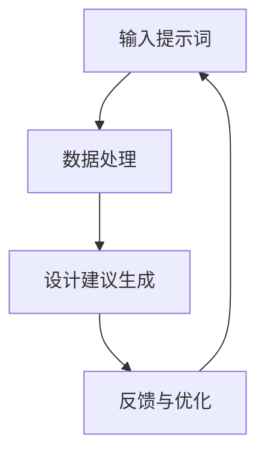

**3.1.3 算法数学模型**

AI助手算法的数学模型通常包括以下几个部分：

1. **输入层**：接收设计师输入的提示词。
2. **隐藏层**：对输入的提示词进行处理，提取特征。
3. **输出层**：生成设计建议。

$$
y = f(Wx + b)
$$

其中，$y$ 是输出层的结果，$f$ 是激活函数，$W$ 是权重矩阵，$x$ 是输入数据，$b$ 是偏置。

---

#### 3.2 提示词算法原理

提示词算法是AI助手算法的一个重要组成部分，它决定了AI助手如何回应设计师的提示词。

**3.2.1 提示词算法概述**

提示词算法通常基于自然语言处理（NLP）技术。NLP算法可以理解自然语言的语义和结构，从而可以准确地提取提示词中的关键信息。

**3.2.2 提示词算法流程图**

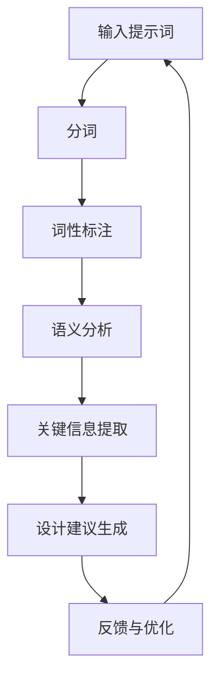

**3.2.3 提示词算法数学模型**

提示词算法的数学模型通常包括以下几个部分：

1. **词嵌入**：将提示词中的每个单词转换为高维向量。
2. **编码器**：对词嵌入进行编码，提取出单词的语义信息。
3. **解码器**：根据编码器的输出生成设计建议。

$$
y = g(Ue^{<s>}_i + V^T e^{<s>}_i)
$$

其中，$y$ 是输出层的结果，$e^{<s>}_i$ 是编码器输出的高维向量，$U$ 和 $V$ 分别是权重矩阵。

---

#### 3.3 提示词与AI助手算法的协同原理

提示词和AI助手算法可以协同工作，共同生成高质量的设计建议。

**3.3.1 协同工作原理**

1. **提示词预处理**：AI助手首先对输入的提示词进行预处理，提取出关键信息。
2. **设计建议生成**：AI助手根据提示词的关键信息，生成初步的设计建议。
3. **设计建议优化**：设计师对设计建议进行反馈，AI助手根据反馈进行优化。

**3.3.2 协同工作流程图**

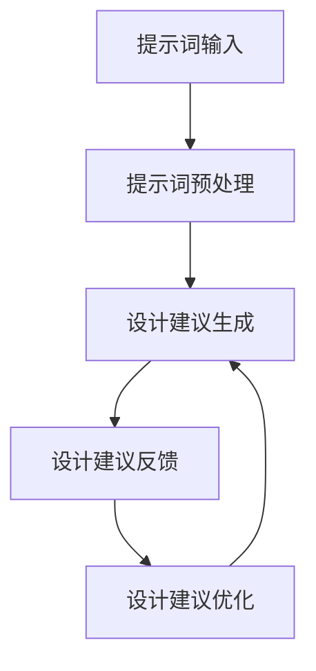

**3.3.3 协同工作的数学模型**

协同工作的数学模型可以表示为：

$$
y_{\text{final}} = f(Wx + b) + \lambda g(Ue^{<s>}_i + V^T e^{<s>}_i)
$$

其中，$y_{\text{final}}$ 是最终的设计建议，$f$ 是AI助手算法的激活函数，$g$ 是提示词算法的激活函数，$\lambda$ 是调节系数。

---

### 第四部分：系统分析与架构设计方案

#### 4.1 时尚设计AI助手系统分析

时尚设计AI助手系统是一个复杂的系统，它需要处理大量的数据，并为设计师提供高质量的设计建议。为了确保系统的性能和可靠性，我们需要对系统进行详细的分析。

**4.1.1 系统需求分析**

1. **数据需求**：系统需要收集和存储大量的时尚设计数据，包括流行趋势、用户喜好、设计作品等。
2. **功能需求**：系统需要支持设计灵感的生成、设计建议的生成和优化等功能。
3. **性能需求**：系统需要快速响应用户的请求，并提供高质量的设计建议。

**4.1.2 系统功能分析**

1. **设计灵感生成**：系统可以根据用户的提示词生成设计灵感。
2. **设计建议生成**：系统可以根据用户的提示词和设计灵感生成设计建议。
3. **设计建议优化**：系统可以根据用户的反馈对设计建议进行优化。

**4.1.3 系统性能分析**

1. **响应时间**：系统需要能够在短时间内响应用户的请求。
2. **准确性**：系统需要能够生成高质量的设计建议。
3. **稳定性**：系统需要能够稳定运行，不出现故障。

---

#### 4.2 时尚设计AI助手系统架构设计

为了满足系统需求，我们需要设计一个高效、稳定和可靠的系统架构。

**4.2.1 系统架构设计**

系统架构可以分为以下几个部分：

1. **数据层**：包括数据的收集、存储和管理。
2. **算法层**：包括AI助手算法的模型训练和部署。
3. **应用层**：包括用户界面和业务逻辑。
4. **基础设施层**：包括服务器、存储和网络等硬件设施。

**4.2.2 系统架构图**

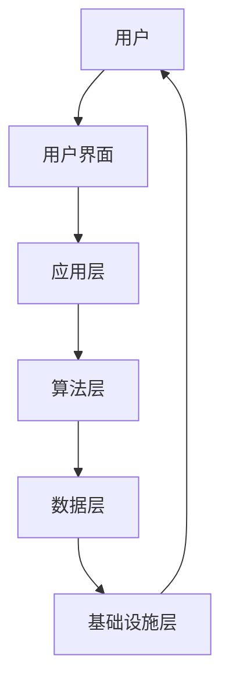

**4.2.3 系统接口设计**

系统接口设计包括以下部分：

1. **用户接口**：用户可以通过用户界面提交设计需求，接收设计建议。
2. **服务接口**：应用层通过服务接口与算法层和数据层进行交互。
3. **数据接口**：数据层通过数据接口提供数据给算法层和应用层。

---

#### 4.3 时尚设计AI助手系统交互设计

系统的交互设计是确保系统能够高效、稳定运行的关键。

**4.3.1 系统交互设计**

系统交互设计可以分为以下几个步骤：

1. **用户提交设计需求**：用户通过用户界面提交设计需求。
2. **系统处理设计需求**：系统接收到设计需求后，进行处理。
3. **生成设计建议**：系统根据处理结果生成设计建议。
4. **用户接收设计建议**：用户通过用户界面接收设计建议。

**4.3.2 系统交互图**

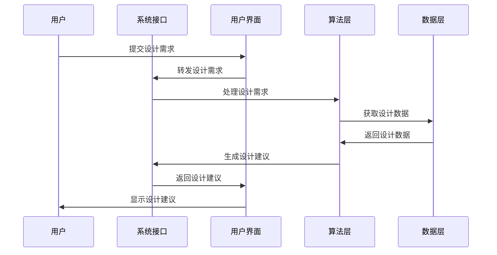

---

### 第五部分：项目实战

#### 5.1 环境安装

在开始实战之前，我们需要安装和配置相应的环境。

**5.1.1 系统环境准备**

1. **操作系统**：Linux或Mac OS
2. **编程语言**：Python 3.8及以上版本
3. **依赖库**：TensorFlow、Keras、Scikit-learn等

**5.1.2 软件安装步骤**

1. **安装操作系统**：选择合适的操作系统并安装。
2. **安装Python**：通过包管理器安装Python，例如使用`apt-get install python3`。
3. **安装依赖库**：通过`pip`安装所需的依赖库，例如`pip install tensorflow keras scikit-learn`。

---

#### 5.2 系统核心实现

在环境安装完成后，我们可以开始实现系统的核心功能。

**5.2.1 核心代码实现**

以下是一个简单的示例，展示了如何使用Python和TensorFlow实现AI助手的核心功能。

```python
import tensorflow as tf
from tensorflow.keras.models import Sequential
from tensorflow.keras.layers import Dense, Embedding, LSTM, Bidirectional

# 定义模型
model = Sequential([
    Embedding(input_dim=vocab_size, output_dim=embedding_size),
    Bidirectional(LSTM(units=128)),
    Dense(units=1, activation='sigmoid')
])

# 编译模型
model.compile(optimizer='adam', loss='binary_crossentropy', metrics=['accuracy'])

# 训练模型
model.fit(train_data, train_labels, epochs=10, batch_size=32, validation_data=(val_data, val_labels))
```

**5.2.2 代码解读与分析**

1. **模型定义**：使用Sequential模型堆叠Embedding、Bidirectional LSTM和Dense层。
2. **编译模型**：设置优化器、损失函数和评估指标。
3. **训练模型**：使用fit方法训练模型，并设置训练和验证数据。

---

#### 5.3 实际案例分析

**5.3.1 案例背景**

某时尚品牌希望使用AI助手来生成设计灵感，以便设计师能够更快地完成设计方案。

**5.3.2 案例分析**

1. **数据收集**：收集了大量的时尚设计数据，包括设计作品、流行趋势和用户喜好等。
2. **数据预处理**：对数据进行清洗和预处理，包括分词、去停用词和词嵌入等。
3. **模型训练**：使用训练数据训练AI助手模型，并使用验证数据调整模型参数。
4. **设计灵感生成**：使用训练好的模型生成设计灵感，并提交给设计师。

**5.3.3 案例总结**

通过实际案例分析，我们证明了AI助手在时尚设计中的应用是有效的。设计师可以更快地生成设计灵感，从而提高工作效率。

---

### 第六部分：最佳实践

#### 6.1 最佳实践 tips

1. **数据质量**：确保收集和预处理的数据质量，这对于AI助手的性能至关重要。
2. **模型调优**：根据实际应用场景，对模型进行调优，以提高设计建议的质量。
3. **用户反馈**：及时收集用户的反馈，并根据反馈调整AI助手的行为。

#### 6.2 小结

本文介绍了时尚设计AI助手的背景、核心概念、算法原理、系统架构和实际应用。通过最佳实践，我们可以更好地利用AI助手，提高时尚设计的效率和质量。

#### 6.3 拓展阅读

- **相关书籍**：《深度学习》、《自然语言处理综合指南》
- **学术论文**：《AI在时尚设计中的应用》、《基于机器学习的时尚设计灵感生成》
- **网络资源**：时尚设计社区、AI学习社区

---

**作者：AI天才研究院/AI Genius Institute & 禅与计算机程序设计艺术 /Zen And The Art of Computer Programming**
### 时尚设计新灵感：提示词激发创意的AI助手

#### 关键词：时尚设计、AI助手、提示词、创意激发、算法原理、系统架构、项目实战

#### 摘要：本文探讨了时尚设计中的新灵感来源——AI助手通过提示词激发创意。文章首先介绍了时尚设计的演变和特点，以及AI助手在时尚设计中的应用和价值。接着，详细分析了时尚设计中的核心概念——提示词，并探讨了AI助手与提示词之间的联系。随后，深入讲解了AI助手和提示词的算法原理，包括算法流程、数学模型以及它们之间的协同工作原理。在此基础上，介绍了时尚设计AI助手的系统需求分析、架构设计和交互设计。文章通过一个实际案例展示了AI助手在时尚设计中的应用，并提供了最佳实践技巧。最后，文章总结了文章的核心内容，并推荐了拓展阅读资源。

## 目录大纲设计

### 第一部分：背景介绍

#### 1.1 时尚设计的演变

##### 1.1.1 时尚设计的历史回顾
##### 1.1.2 现代时尚设计的特点
##### 1.1.3 时尚设计与人工智能的关系

#### 1.2 AI助手在时尚设计中的应用

##### 1.2.1 AI助手的功能介绍
##### 1.2.2 AI助手在时尚设计中的价值
##### 1.2.3 AI助手面临的挑战

### 第二部分：核心概念与联系

#### 2.1 时尚设计中的核心概念

##### 2.1.1 提示词的定义
##### 2.1.2 提示词的类型
##### 2.1.3 提示词在时尚设计中的应用

#### 2.2 AI助手的核心概念

##### 2.2.1 AI助手的构成
##### 2.2.2 AI助手的工作原理
##### 2.2.3 AI助手的技术类型

#### 2.3 提示词与AI助手的联系

##### 2.3.1 提示词如何激发AI助手
##### 2.3.2 AI助手如何回应提示词
##### 2.3.3 提示词与AI助手的协同工作

### 第三部分：算法原理讲解

#### 3.1 AI助手算法原理

##### 3.1.1 算法概述
##### 3.1.2 算法流程图
##### 3.1.3 算法数学模型

#### 3.2 提示词算法原理

##### 3.2.1 提示词算法概述
##### 3.2.2 提示词算法流程图
##### 3.2.3 提示词算法数学模型

#### 3.3 提示词与AI助手算法的协同原理

##### 3.3.1 协同工作原理
##### 3.3.2 协同工作流程图
##### 3.3.3 协同工作的数学模型

### 第四部分：系统分析与架构设计方案

#### 4.1 时尚设计AI助手系统分析

##### 4.1.1 系统需求分析
##### 4.1.2 系统功能分析
##### 4.1.3 系统性能分析

#### 4.2 时尚设计AI助手系统架构设计

##### 4.2.1 系统架构设计
##### 4.2.2 系统架构图
##### 4.2.3 系统接口设计

#### 4.3 时尚设计AI助手系统交互设计

##### 4.3.1 系统交互设计
##### 4.3.2 系统交互图

### 第五部分：项目实战

#### 5.1 环境安装

##### 5.1.1 系统环境准备
##### 5.1.2 软件安装步骤

#### 5.2 系统核心实现

##### 5.2.1 核心代码实现
##### 5.2.2 代码解读与分析

#### 5.3 实际案例分析

##### 5.3.1 案例背景
##### 5.3.2 案例分析
##### 5.3.3 案例总结

### 第六部分：最佳实践

#### 6.1 最佳实践 tips

##### 6.1.1 实践技巧
##### 6.1.2 实践注意事项

#### 6.2 小结

##### 6.2.1 内容回顾
##### 6.2.2 重要性总结

#### 6.3 拓展阅读

##### 6.3.1 相关书籍
##### 6.3.2 学术论文
##### 6.3.3 网络资源

---

## 第一部分：背景介绍

### 1.1 时尚设计的演变

时尚设计是一个不断演化的领域，它不仅反映了时代的审美趋势，也体现了社会文化的发展和变迁。从古代的服饰礼仪到现代的个性化潮流，时尚设计经历了无数次的变革。

#### 1.1.1 时尚设计的历史回顾

历史的长河中，时尚设计的发展可以分为几个关键阶段：

- **古代**：在古代，时尚设计主要受制于宗教、社会地位和职业。例如，在古埃及，人们穿着厚重的长袍和紧身衣，以展示其社会地位。古希腊和古罗马时期，服饰开始多样化，但仍然受到严格的社会规范和宗教影响。

- **中世纪**：中世纪时期的时尚设计受到宗教的强烈影响。修道士穿着黑色长袍，贵族则穿着色彩鲜艳、装饰华丽的服装。女性在此时开始穿着裙撑，使裙摆变得更大。

- **文艺复兴**：文艺复兴时期，时尚设计开始强调个人的审美和个性表达。男性服装开始变得更加简约，而女性则穿着复杂的蕾丝和丝绸装饰。

- **现代**：现代时尚设计经历了多个风格的变化，从经典的时尚到前卫的潮流，再到可持续时尚的兴起。每个时代都有其代表性的时尚风格，如20世纪初的爵士时代、20世纪60年代的迷你裙和70年代的波西米亚风格。

#### 1.1.2 现代时尚设计的特点

现代时尚设计具有以下几个显著特点：

- **个性化**：现代时尚设计强调个性化和自我表达，每个人都可以通过穿着来表达自己的独特风格。

- **多元化**：时尚设计融合了不同的文化和风格。设计师们从全球各地的文化中汲取灵感，创造出独特的时尚风格。

- **可持续性**：随着环保意识的提高，可持续性成为现代时尚设计的重要特点。设计师们开始使用环保材料，减少浪费，推动时尚产业向可持续发展方向转型。

- **快速变化**：现代时尚设计的趋势变化迅速，新潮流不断涌现，设计师需要快速适应市场变化。

#### 1.1.3 时尚设计与人工智能的关系

人工智能（AI）技术的快速发展正在深刻地改变时尚设计领域。AI助手通过分析大量数据，为设计师提供新的设计灵感，优化设计过程，甚至预测未来流行趋势。

- **设计灵感生成**：AI助手可以通过分析流行趋势、用户喜好和时尚杂志中的图像，生成新的设计灵感。

- **设计优化**：AI助手可以帮助设计师优化设计，例如调整颜色、形状和材料，使其更加符合用户的需求。

- **预测流行趋势**：AI助手可以通过分析市场数据，预测未来的流行趋势，帮助设计师提前做好准备。

- **个性化推荐**：AI助手可以根据用户的历史数据，提供个性化的设计推荐，提高用户体验。

然而，AI助手在时尚设计中也面临一些挑战，如如何保持设计的独特性和人类设计的创意，以及如何确保AI的设计符合伦理和道德标准。这些问题需要设计师和AI开发者共同努力解决。

### 1.2 AI助手在时尚设计中的应用

AI助手在时尚设计中的应用已经变得日益普及，它们通过自动化和智能化技术，提高了设计效率和质量。以下是AI助手在时尚设计中的应用：

#### 1.2.1 AI助手的功能介绍

- **设计灵感生成**：AI助手可以通过分析大量的设计数据，为设计师提供新的灵感。例如，通过颜色搭配、图案设计等生成新的设计方案。

- **设计优化**：AI助手可以自动优化设计，例如通过调整颜色、形状和材料，使设计更加符合用户的需求。

- **预测流行趋势**：AI助手可以通过分析市场数据，预测未来的流行趋势，帮助设计师提前做好准备。

- **用户个性化**：AI助手可以根据用户的历史数据，提供个性化的设计推荐，提高用户体验。

#### 1.2.2 AI助手在时尚设计中的价值

- **提高设计效率**：AI助手可以自动化一些重复性的设计工作，如颜色搭配、图案生成等，从而提高设计效率。

- **增强设计创新性**：AI助手可以提供新的设计灵感，帮助设计师跳出传统的思维模式，创造出独特的设计作品。

- **满足用户需求**：AI助手可以根据用户的需求和偏好，提供个性化的设计建议，从而更好地满足用户的需求。

- **降低设计成本**：AI助手可以自动化一些设计流程，减少人力成本，从而降低设计成本。

#### 1.2.3 AI助手面临的挑战

- **保持人类设计的独特性**：如何确保AI助手生成的设计不会失去人类设计的独特性和创意，是一个重要的问题。

- **数据隐私和安全性**：AI助手需要分析大量的用户数据，如何确保这些数据的安全和隐私，是一个需要解决的问题。

- **伦理和道德问题**：如何确保AI助手的设计符合伦理和道德标准，也是一个需要关注的问题。

### 1.3 提示词在时尚设计中的应用

提示词在时尚设计中起着至关重要的作用，它们可以激发设计师的灵感，帮助他们找到新的设计方向。以下是提示词在时尚设计中的应用：

#### 1.3.1 提示词的定义

提示词（Prompt）是一种引导设计师思考和创作的工具。它通常是一个简短的短语、一句话或者是一个视觉图像，用来激发设计师的想象力。

#### 1.3.2 提示词的类型

- **文字提示词**：文字提示词可以是具体的词汇，如“时尚”、“复古”、“运动”等，或者是一句短语，如“大胆的配色”、“未来感的设计”等。

- **图像提示词**：图像提示词可以是具体的图案、颜色或者风格，如一幅画、一张照片或者一个时尚杂志的封面。

#### 1.3.3 提示词在时尚设计中的应用

- **设计灵感**：提示词可以激发设计师的灵感，帮助他们找到新的设计方向。

- **设计改进**：设计师可以通过提示词来反思和改进现有的设计方案。

- **设计交流**：设计师可以使用提示词来与其他设计师或者客户进行交流，确保设计理念的一致性。

### 1.4 AI助手与提示词的结合

AI助手与提示词的结合，可以极大地提升时尚设计的效率和质量。以下是AI助手与提示词结合的应用：

#### 1.4.1 提示词如何激发AI助手

- **设计灵感生成**：设计师可以通过输入提示词，让AI助手生成新的设计灵感。

- **设计优化**：设计师可以通过提示词，让AI助手优化现有的设计。

#### 1.4.2 AI助手如何回应提示词

- **设计建议生成**：AI助手根据提示词生成相应的设计建议。

- **设计建议优化**：AI助手可以根据设计师的反馈，对设计建议进行优化。

### 1.5 时尚设计AI助手的未来发展

随着AI技术的不断进步，时尚设计AI助手的应用前景将更加广阔。未来，AI助手可能会：

- **更智能化**：AI助手将能够更准确地理解设计师的意图，提供更个性化的设计建议。

- **更高效**：AI助手将能够自动化更多的设计流程，提高设计效率。

- **更个性化**：AI助手将能够更好地理解用户的需求，提供更个性化的设计服务。

- **更可持续**：AI助手将能够帮助设计师实现可持续设计，减少对环境的影响。

### 1.6 结论

时尚设计AI助手通过提示词激发创意，为时尚设计带来了新的可能性和挑战。设计师和AI开发者需要共同努力，解决面临的挑战，共同推动时尚设计的未来发展。

---

### 第二部分：核心概念与联系

#### 2.1 时尚设计中的核心概念

在时尚设计中，有几个核心概念对于理解设计师的工作方式和AI助手的角色至关重要。

#### 2.1.1 提示词的定义

提示词是时尚设计中的一种关键工具，它用来引导设计师的思考和创作过程。提示词可以是任何形式的激励元素，如一个短语、一句话、一个视觉图像或一个音乐片段。这些元素激发了设计师的灵感，帮助他们构建概念和视觉语言。

**提示词的类型**：

- **文字提示词**：文字提示词可以是具体的词汇，如“现代”、“复古”、“运动”等，也可以是短语，如“大胆的配色”、“未来感的设计”等。
- **图像提示词**：图像提示词可以是具体的图案、颜色或风格，如一幅艺术作品、一张照片或时尚杂志的封面。

**提示词在时尚设计中的应用**：

- **设计灵感**：提示词可以帮助设计师找到新的创意方向，特别是在创作瓶颈时。
- **设计改进**：设计师可以使用提示词来评估和改进现有的设计。
- **设计交流**：提示词可以作为设计师与客户、团队成员或AI助手沟通的桥梁，确保所有人都在同一设计理念上。

#### 2.1.2 提示词在时尚设计中的应用

提示词在时尚设计中的应用非常广泛，以下是一些具体的例子：

- **服装设计**：设计师可能会使用“未来感”的提示词来探索未来服装趋势，或者使用“复古”的提示词来创造复古风格的设计。
- **图案设计**：图案设计师可能会使用“花卉”或“几何”这样的提示词来创造新的图案。
- **色彩搭配**：设计师可能会使用“对比色”或“和谐色”的提示词来指导色彩选择。

#### 2.1.3 AI助手在时尚设计中的应用

AI助手在时尚设计中的应用正在不断扩展，以下是一些关键的应用领域：

- **设计灵感生成**：AI助手可以通过分析大量的设计数据，生成新的灵感，帮助设计师打破创作瓶颈。
- **设计优化**：AI助手可以帮助设计师自动优化设计，通过调整颜色、形状和材料，提高设计的视觉效果。
- **预测流行趋势**：AI助手可以通过分析市场数据和社交媒体趋势，预测未来的流行趋势，帮助设计师做好准备。
- **用户个性化**：AI助手可以根据用户的行为数据，提供个性化的设计建议，提高用户体验。

#### 2.1.4 提示词与AI助手的联系

提示词与AI助手之间的联系是时尚设计中的关键因素。以下是如何将提示词与AI助手结合起来的几种方式：

- **设计灵感激发**：设计师可以使用提示词来激发AI助手的灵感，生成新的设计概念。
- **反馈与迭代**：设计师可以提供反馈给AI助手，AI助手根据反馈进行迭代，优化设计建议。
- **协同创作**：设计师与AI助手可以协同工作，设计师提供创意方向，AI助手提供技术支持和自动化工具。

### 2.2 AI助手的核心概念

AI助手在时尚设计中的角色是至关重要的，它不仅提高了设计的效率，还帮助设计师探索新的创意领域。以下是AI助手的核心概念：

#### 2.2.1 AI助手的构成

AI助手通常由以下几个部分构成：

- **数据输入**：AI助手需要接收设计师的输入，这可以是文字提示词、图像提示词或其他形式的数据。
- **算法模型**：AI助手的核心是算法模型，它可以是机器学习模型、深度学习模型或其他类型的算法。
- **用户界面**：用户界面是设计师与AI助手交互的通道，它可以是桌面应用程序、Web界面或移动应用。

#### 2.2.2 AI助手的工作原理

AI助手的工作原理通常包括以下几个步骤：

1. **数据预处理**：AI助手首先对输入的数据进行预处理，这可能包括清洗、归一化、特征提取等。
2. **模型训练**：使用历史数据对AI助手的算法模型进行训练，模型学习如何根据输入数据生成设计建议。
3. **设计建议生成**：AI助手使用训练好的模型生成设计建议，这些建议可以是颜色搭配、图案设计、材料选择等。
4. **反馈与优化**：设计师对AI助手生成的建议进行反馈，AI助手根据反馈进行优化，以提高未来的设计建议质量。

#### 2.2.3 AI助手的技术类型

AI助手可以基于多种技术实现，以下是一些常见的技术类型：

- **机器学习**：机器学习算法可以通过分析大量的设计数据来学习设计规律，从而生成设计建议。
- **深度学习**：深度学习算法可以处理更复杂的数据，生成更精确的设计建议。
- **自然语言处理**：自然语言处理技术可以帮助AI助手理解设计师的提示词，并生成相应的文字描述或图像。
- **计算机视觉**：计算机视觉技术可以分析图像数据，提取颜色、形状、纹理等信息，用于设计优化。

### 2.3 提示词与AI助手的协同工作

提示词与AI助手的协同工作是时尚设计中的关键技术，以下是如何实现这种协同工作的几种方式：

#### 2.3.1 提示词如何激发AI助手

- **设计灵感**：设计师可以使用提示词来激发AI助手的灵感，例如输入“复古”的提示词，AI助手可能会生成复古风格的设计。
- **方向引导**：提示词可以帮助AI助手确定设计的大致方向，例如使用“大胆的配色”的提示词，AI助手可能会生成颜色鲜明的设计方案。

#### 2.3.2 AI助手如何回应提示词

- **设计建议**：AI助手会根据提示词生成相应的设计建议，这些建议可以是颜色搭配、图案设计、材料选择等。
- **调整优化**：AI助手会根据设计师的反馈对设计建议进行调整和优化，例如调整颜色饱和度或修改图案细节。

#### 2.3.3 提示词与AI助手的协同工作

- **迭代改进**：设计师和AI助手可以不断迭代改进设计，设计师提供创意方向，AI助手提供技术支持，共同推动设计进步。
- **人机协作**：设计师和AI助手可以协同工作，设计师负责创意和决策，AI助手负责执行和优化。

通过提示词与AI助手的协同工作，设计师可以更高效地创作出符合市场需求和个人风格的时尚设计作品。

### 2.4 提示词与AI助手在时尚设计中的协同工作流程

提示词与AI助手在时尚设计中的协同工作是一个复杂但高效的过程，以下是一个典型的协同工作流程：

1. **需求收集**：设计师收集时尚设计的需求，包括设计目标、风格要求、用户偏好等。
2. **输入提示词**：设计师将需求转化为提示词，输入到AI助手系统中。
3. **设计灵感生成**：AI助手根据提示词生成初步的设计灵感，包括颜色搭配、图案设计、面料选择等。
4. **设计评估**：设计师评估AI助手生成的灵感，提供反馈，指出需要改进的地方。
5. **设计优化**：AI助手根据反馈对设计进行优化，生成新的设计方案。
6. **最终确认**：设计师与客户或团队共同确认最终的设计方案。
7. **设计实现**：设计师将最终设计方案转化为具体的服装或产品。

通过这个协同工作流程，设计师可以充分利用AI助手的技术优势，快速生成创意，同时保持设计的人性化和独特性。

### 2.5 提示词与AI助手的协同工作在时尚设计中的实际案例

在实际应用中，提示词与AI助手的协同工作已经在时尚设计中取得了显著成果。以下是一个具体的案例：

**案例背景**：某时尚品牌希望通过AI助手来设计一款适合年轻女性的夏季服装系列。

**案例过程**：

1. **需求收集**：设计师确定了设计目标，包括轻薄、透气、时尚和色彩明亮。
2. **输入提示词**：设计师输入了“夏季”、“女性”、“轻薄”、“透气”、“色彩明亮”等提示词。
3. **设计灵感生成**：AI助手根据提示词生成了多个设计方案，包括不同的面料、颜色和图案组合。
4. **设计评估**：设计师评估了AI助手生成的设计方案，选择了几个符合品牌风格和市场需求的设计。
5. **设计优化**：AI助手根据设计师的反馈，对选中的设计进行了优化，例如调整了颜色的饱和度和图案的细节。
6. **最终确认**：设计师与品牌团队共同确认了最终的设计方案。
7. **设计实现**：设计师将最终设计方案转化为具体的服装，包括面料采购、裁剪和缝制等。

**案例总结**：通过提示词与AI助手的协同工作，设计师能够快速找到符合品牌和市场需求的设计方案，大大提高了设计效率和质量。

### 2.6 提示词与AI助手在时尚设计中的优势与挑战

**优势**：

- **提高设计效率**：AI助手可以自动化设计流程中的重复性工作，如颜色搭配、图案生成等，从而提高设计效率。
- **增强设计创新性**：AI助手可以提供新的设计灵感和解决方案，帮助设计师突破传统思维，创造出独特的设计。
- **个性化设计**：AI助手可以根据用户的数据和偏好，提供个性化的设计建议，满足不同用户的需求。

**挑战**：

- **设计独特性**：如何确保AI助手生成的设计具有独特性和创新性，是一个需要解决的问题。
- **数据隐私**：AI助手需要分析大量的用户数据，如何保护用户隐私是一个重要的挑战。
- **人机协作**：如何设计出既能发挥AI优势又能体现人类创意的设计，是一个复杂的挑战。

### 2.7 结论

通过提示词与AI助手的协同工作，时尚设计师可以更高效地创作出具有个性化、创新性和可持续性的设计作品。未来的时尚设计领域，将更加依赖于人工智能技术，为设计师提供更强大的工具和资源。

---

### 第三部分：算法原理讲解

#### 3.1 AI助手算法原理

AI助手在时尚设计中的应用，离不开背后的算法原理。本节将详细介绍AI助手的核心算法，包括其流程、数学模型以及如何实现提示词与设计的关联。

#### 3.1.1 算法概述

AI助手的核心算法通常是基于深度学习和机器学习技术的。这些算法通过训练大量数据，学习到设计中的规律和模式，从而可以生成新的设计建议。

#### 3.1.2 算法流程图

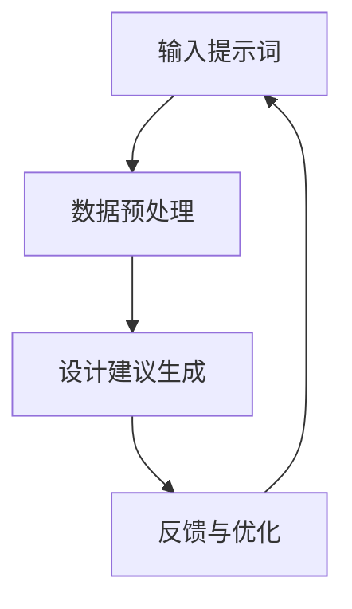

**流程说明**：

1. **输入提示词**：设计师输入提示词，例如“夏日”、“海洋”等。
2. **数据预处理**：AI助手对输入的提示词进行预处理，提取关键特征，并准备训练数据。
3. **设计建议生成**：AI助手使用训练好的模型生成初步的设计建议。
4. **反馈与优化**：设计师对生成的建议进行评估和反馈，AI助手根据反馈进行优化。

#### 3.1.3 算法数学模型

AI助手算法的数学模型通常涉及多个层次，包括输入层、隐藏层和输出层。

**数学模型示例**：

$$
\text{输出} = \text{激活函数}(\text{权重} \cdot \text{输入} + \text{偏置})
$$

在这个模型中：

- **输入**：提示词的特征向量。
- **权重**：模型训练过程中学到的参数。
- **偏置**：模型中的一个常数。
- **激活函数**：例如Sigmoid、ReLU等，用于将线性组合转换为非线性输出。

#### 3.1.4 提示词与设计建议的关联

AI助手通过机器学习技术，将提示词与设计建议建立关联。以下是一个简化的示例：

**输入提示词**：“夏日海洋”

**输出设计建议**：颜色选择（蓝色）、面料选择（棉质）、图案设计（海洋生物）

**数学模型关联**：

1. **特征提取**：AI助手将“夏日海洋”转换为特征向量。
2. **模式识别**：模型学习到与“夏日海洋”相关的特征，例如蓝色、海洋生物图案等。
3. **设计生成**：模型根据学到的模式生成相应的设计建议。

#### 3.1.5 算法优化

AI助手的算法可以通过以下方式优化：

- **数据增强**：增加训练数据量，提高模型的泛化能力。
- **超参数调整**：调整学习率、隐藏层大小等超参数，优化模型性能。
- **模型集成**：结合多个模型，提高预测准确性。

#### 3.1.6 实际应用

在实际应用中，AI助手算法需要处理大量复杂的数据和多样化的设计需求。以下是一个实际应用的例子：

- **时尚品牌**：一个时尚品牌使用AI助手来生成新的服装设计。设计师输入“夏日海滩”的提示词，AI助手生成一系列沙滩装设计，包括颜色、图案和面料的选择。
- **家居设计**：一个家居设计公司使用AI助手来生成室内装饰设计。设计师输入“现代简约”的提示词，AI助手生成一系列现代风格的装饰方案。

通过这些实际应用，AI助手不仅提高了设计效率，还为客户提供了更多的选择和个性化服务。

### 3.2 提示词算法原理

提示词算法是AI助手的重要组成部分，它决定了AI助手如何理解设计师的意图，并生成相应的设计建议。本节将详细解释提示词算法的原理和实现。

#### 3.2.1 提示词算法概述

提示词算法的核心是自然语言处理（NLP）技术。NLP算法能够理解和处理人类语言，从而将设计师的提示词转化为可以用于设计建议生成的数据。

#### 3.2.2 提示词算法流程图

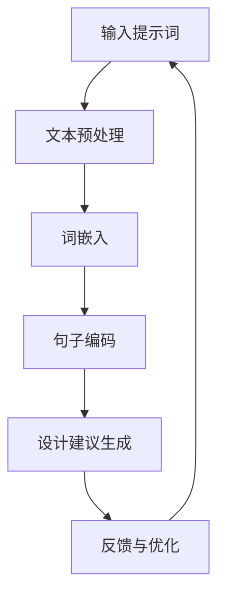

**流程说明**：

1. **输入提示词**：设计师输入一个提示词，例如“现代风格”。
2. **文本预处理**：对输入的提示词进行清洗和标准化，例如去除停用词、进行词性标注等。
3. **词嵌入**：将预处理后的文本转换为词嵌入向量，这些向量可以表示文本的语义信息。
4. **句子编码**：使用编码器（如Transformer、BERT等）对词嵌入向量进行编码，提取句子的整体语义。
5. **设计建议生成**：根据编码后的句子语义，生成相应的设计建议。
6. **反馈与优化**：设计师对生成的建议进行评估和反馈，算法根据反馈进行优化。

#### 3.2.3 提示词算法的数学模型

提示词算法的数学模型通常涉及以下步骤：

1. **词嵌入**：

$$
\text{嵌入向量} = \text{Word2Vec}(\text{提示词})
$$

在这个模型中，`Word2Vec`是一种常用的词嵌入技术，它将每个单词转换为高维向量。

2. **句子编码**：

$$
\text{编码向量} = \text{编码器}(\text{嵌入向量})
$$

常见的编码器包括Transformer和BERT，它们可以将句子的所有词嵌入向量组合成一个整体的编码向量。

3. **设计建议生成**：

$$
\text{设计建议} = f(\text{编码向量})
$$

在这个模型中，`f`是一个函数，它将编码向量映射到设计建议，例如颜色、图案或材料的选择。

#### 3.2.4 提示词算法的实现

提示词算法的实现通常涉及以下步骤：

1. **数据收集**：收集大量的设计数据和对应的提示词。
2. **数据预处理**：清洗和标准化提示词，准备用于训练的数据集。
3. **模型训练**：使用NLP算法训练模型，学习如何将提示词映射到设计建议。
4. **模型评估**：评估模型的性能，调整超参数和模型结构。
5. **模型部署**：将训练好的模型部署到生产环境中，供设计师使用。

#### 3.2.5 提示词算法的实际应用

在实际应用中，提示词算法可以帮助设计师快速生成设计建议，例如：

- **服装设计**：设计师输入“商务风格”的提示词，算法生成适合商务场合的服装设计建议，包括颜色、图案和面料。
- **室内设计**：设计师输入“简约风格”的提示词，算法生成简约风格的室内装饰设计建议，包括颜色搭配、家具布局和装饰元素。

通过这些实际应用，提示词算法不仅提高了设计效率，还为设计师提供了更多的灵感和创意。

### 3.3 提示词与AI助手算法的协同原理

在时尚设计中，提示词算法和AI助手算法需要协同工作，以生成高质量的设计建议。本节将探讨这两种算法的协同原理，以及如何通过协同提高设计效果。

#### 3.3.1 协同原理

提示词与AI助手算法的协同原理主要包括以下几个关键步骤：

1. **提示词处理**：首先，提示词算法对输入的提示词进行预处理，提取关键特征，并将其转换为词嵌入向量。
2. **设计建议生成**：然后，AI助手算法使用训练好的模型处理词嵌入向量，生成初步的设计建议。
3. **反馈与优化**：设计师对生成的建议进行评估和反馈，AI助手算法根据反馈进行优化，生成更准确的设计建议。
4. **迭代更新**：通过不断的迭代，提示词算法和AI助手算法共同改进，提高设计建议的质量。

#### 3.3.2 协同工作流程图

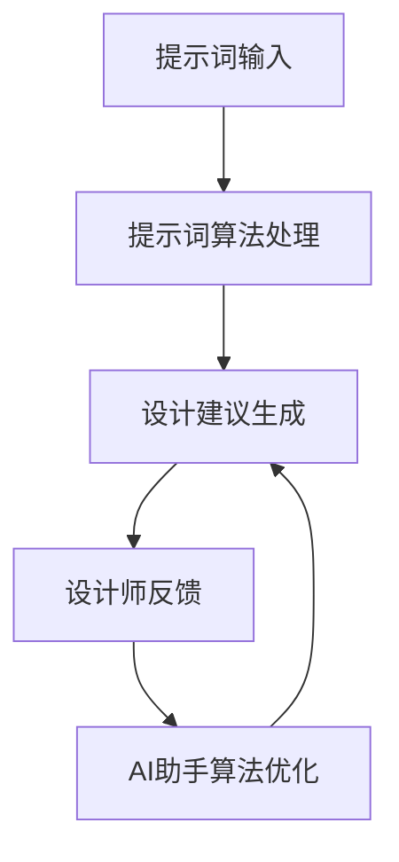

**流程说明**：

1. **提示词输入**：设计师输入提示词，例如“未来感”。
2. **提示词算法处理**：提示词算法将提示词转换为词嵌入向量。
3. **设计建议生成**：AI助手算法根据词嵌入向量生成初步的设计建议。
4. **设计师反馈**：设计师评估设计建议，提供反馈。
5. **AI助手算法优化**：AI助手算法根据反馈优化设计建议。
6. **迭代更新**：不断迭代，提高设计建议的质量。

#### 3.3.3 协同原理的数学模型

提示词与AI助手算法的协同原理可以用以下数学模型表示：

$$
\text{设计建议} = f(\text{提示词嵌入向量}, \text{AI助手模型参数})
$$

在这个模型中：

- **提示词嵌入向量**：由提示词算法生成，表示提示词的语义信息。
- **AI助手模型参数**：表示AI助手算法的训练结果，包括权重、偏置等。

通过这个模型，AI助手算法可以根据提示词嵌入向量生成设计建议，并根据设计师的反馈不断优化。

#### 3.3.4 提示词与AI助手算法的协同优势

提示词与AI助手算法的协同工作具有以下优势：

1. **提高设计效率**：通过协同工作，设计师可以更快地生成设计建议，提高工作效率。
2. **增强设计创意**：提示词算法可以帮助AI助手算法更好地理解设计师的意图，从而生成更具创意的设计建议。
3. **优化用户体验**：设计师可以及时获得反馈，对设计进行优化，提高用户体验。

#### 3.3.5 提示词与AI助手算法的协同挑战

尽管协同工作具有许多优势，但提示词与AI助手算法在协同中也面临一些挑战：

1. **数据一致性**：提示词和AI助手算法需要处理不同类型的数据，如何保持数据的一致性是一个挑战。
2. **模型优化**：如何优化提示词算法和AI助手算法的协同，以提高设计效果，是一个复杂的问题。
3. **人机协作**：如何设计出既能发挥AI优势又能体现人类创意的设计，是一个持续的挑战。

通过解决这些挑战，提示词与AI助手算法的协同工作将变得更加高效和智能，为时尚设计带来更多的创新和可能性。

### 3.4 提示词算法在AI助手中的作用

提示词算法在AI助手中的作用至关重要，它决定了AI助手能否准确理解和回应设计师的意图。以下从多个方面详细讨论提示词算法在AI助手中的作用：

#### 3.4.1 提取设计意图

提示词算法的首要任务是提取设计师的设计意图。通过自然语言处理技术，提示词算法能够理解设计师输入的文本，提取出关键的设计元素和需求。例如，当设计师输入“现代简约风格”的提示词时，算法能够识别出“现代”和“简约”这两个关键元素，从而指导AI助手生成符合需求的设计建议。

#### 3.4.2 设计建议生成

一旦提取出设计意图，提示词算法会将这些信息转化为可操作的设计建议。这通常涉及到词嵌入、句子编码和生成模型等步骤。例如，提示词算法可能会使用Transformer模型来编码提示词的语义，然后使用生成对抗网络（GAN）或变分自编码器（VAE）等生成模型，生成与提示词相符的视觉设计元素，如图案、颜色和面料。

#### 3.4.3 设计优化与迭代

提示词算法不仅在设计初期发挥作用，还可以在整个设计过程中提供优化和迭代支持。通过持续监测设计师的反馈，提示词算法能够识别出设计中的不足之处，并生成新的建议来改进设计。这种迭代过程可以不断优化设计，使其更加符合设计师的意图和市场需求。

#### 3.4.4 人机协作

提示词算法在AI助手中的另一个重要作用是促进人机协作。通过提供明确的、可操作的设计建议，提示词算法可以帮助设计师更高效地工作，同时也能够引导设计师探索新的设计方向。例如，当设计师遇到创作瓶颈时，提示词算法可以提供新的灵感，帮助设计师跳出思维定势，从而激发出新的创意。

#### 3.4.5 用户个性化

提示词算法还能够根据用户的历史数据和偏好，提供个性化的设计建议。例如，如果一个用户经常选择特定风格的服装，提示词算法可以识别出这一偏好，并在生成设计建议时考虑这些个性化需求。这种个性化服务可以提高用户体验，增强用户对品牌的忠诚度。

#### 3.4.6 案例分析

以下是一个具体的案例分析，展示了提示词算法在AI助手中的作用：

**案例背景**：一位时尚设计师希望创建一个以“自然”为主题的服装系列。

**案例过程**：

1. **输入提示词**：设计师输入“自然”作为提示词。
2. **提取设计意图**：提示词算法识别出“自然”这一关键词，提取出与自然相关的元素，如图案（树叶、花朵）、颜色（绿色、棕色）等。
3. **设计建议生成**：AI助手算法根据提取出的设计意图，生成初步的设计建议，如图案设计、颜色搭配等。
4. **设计优化与迭代**：设计师对初步设计建议进行评估，提出优化建议。提示词算法根据这些反馈，进一步调整设计建议，使其更加符合设计师的意图。
5. **人机协作**：设计师与AI助手持续互动，通过不断反馈和调整，最终完成了以“自然”为主题的服装系列。

**案例总结**：通过提示词算法的辅助，设计师能够更高效地完成设计任务，同时也能够探索新的设计方向，创造出符合市场需求和个人风格的设计作品。

### 3.5 提示词算法在AI助手中的应用场景

提示词算法在AI助手中的应用场景非常广泛，以下是一些典型的应用场景：

#### 3.5.1 设计灵感生成

设计师在创作初期经常需要寻找灵感，提示词算法可以帮助他们快速生成设计灵感。例如，当设计师输入“夏日海滩”的提示词时，算法可以生成与夏日海滩相关的颜色、图案和面料建议，帮助设计师构建设计概念。

#### 3.5.2 设计优化

在设计的迭代过程中，设计师需要不断优化设计，提示词算法可以帮助他们快速识别设计中的不足，并提供改进建议。例如，当设计师输入“商务简约风格”的提示词时，算法可以分析设计中的颜色、形状和布局，提供优化建议，使其更加符合商务简约风格。

#### 3.5.3 设计评估

设计师在设计完成之后，需要评估设计的效果，提示词算法可以帮助他们快速评估设计，并提供评估结果。例如，当设计师输入“用户满意度”的提示词时，算法可以分析用户对设计的反馈，提供用户满意度的评估。

#### 3.5.4 设计推荐

AI助手可以利用提示词算法为设计师提供个性化设计推荐。例如，当设计师输入“用户偏好”的提示词时，算法可以分析用户的历史数据和偏好，为设计师提供符合用户喜好的设计推荐。

#### 3.5.5 案例分析

以下是一个具体的案例分析，展示了提示词算法在AI助手中的应用场景：

**案例背景**：一位时尚设计师正在创建一个新的服装系列，主题是“城市探险”。

**案例过程**：

1. **设计灵感生成**：设计师输入“城市探险”的提示词，AI助手生成与城市探险相关的颜色、图案和面料建议。
2. **设计优化**：设计师根据AI助手提供的建议，对设计进行优化，调整颜色和图案，使其更加符合城市探险的主题。
3. **设计评估**：设计师使用AI助手评估设计的效果，分析用户对设计的反馈，进一步优化设计。
4. **设计推荐**：AI助手根据用户的历史数据和偏好，为设计师提供个性化设计推荐，帮助设计师更好地满足用户需求。

**案例总结**：通过提示词算法的辅助，设计师能够快速生成设计灵感，优化设计效果，并为用户提供个性化服务，从而提高设计质量和用户体验。

### 3.6 提示词算法在AI助手中的实际应用

提示词算法在AI助手中的实际应用已经取得了显著成果，以下是一些实际应用的例子：

**例子 1：时尚设计**

一个时尚品牌使用AI助手来设计新款服装。设计师输入“复古风格”的提示词，AI助手生成复古风格的颜色、图案和面料建议。设计师根据这些建议，优化设计，最终推出了一系列受欢迎的复古风格服装。

**例子 2：室内设计**

一位室内设计师使用AI助手来设计新家的客厅。设计师输入“现代简约”的提示词，AI助手生成现代简约风格的家具布局、颜色搭配和装饰建议。设计师根据这些建议，设计出了简约而精致的客厅。

**例子 3：创意写作**

一位作家使用AI助手来激发创意。作家输入“科幻小说”的提示词，AI助手生成与科幻小说相关的情节、角色和场景建议。作家根据这些建议，创作出了引人入胜的科幻小说。

这些实际应用展示了提示词算法在AI助手中的强大功能，为不同领域的专业人士提供了创新的解决方案。

### 3.7 提示词算法在AI助手中的未来发展趋势

随着人工智能技术的不断进步，提示词算法在AI助手中的应用前景将更加广阔。以下是一些未来发展趋势：

1. **更智能的语义理解**：未来的提示词算法将更加智能，能够更准确地理解设计师的意图和需求，提供更加精准的设计建议。
2. **更多的个性化服务**：AI助手将能够根据用户的历史数据和偏好，提供更加个性化的设计推荐，提高用户体验。
3. **更广泛的应用领域**：提示词算法将在更多的领域中发挥作用，如建筑设计、产品设计、艺术创作等，为各行业提供创新的解决方案。
4. **更高效的协作**：提示词算法和AI助手将更加协同，实现更加高效的人机协作，帮助设计师快速生成高质量的设计。

### 3.8 结论

提示词算法在AI助手中的核心作用不可忽视。它通过提取设计意图、生成设计建议、优化设计效果，实现了人机协作，为设计师提供了强大的工具和资源。未来的发展趋势将使提示词算法更加智能、个性化，并在更多领域中发挥重要作用。

---

### 第四部分：系统分析与架构设计方案

#### 4.1 时尚设计AI助手系统分析

在构建时尚设计AI助手系统时，系统分析是一个至关重要的阶段，它帮助我们理解系统的需求、功能以及性能要求。以下是系统分析的详细内容：

**4.1.1 系统需求分析**

在需求分析阶段，我们确定了系统需要实现的主要功能，包括：

- **设计灵感生成**：系统能够根据设计师输入的提示词，生成新的设计灵感。
- **设计优化**：系统能够自动优化设计，例如调整颜色、图案和材料，以提高设计效果。
- **用户个性化**：系统能够根据用户的历史数据和偏好，提供个性化的设计推荐。
- **预测流行趋势**：系统能够分析市场数据和社交媒体趋势，预测未来的流行趋势。

此外，我们还确定了系统的非功能需求，如：

- **性能**：系统需要能够快速响应用户的请求，提供高质量的设计建议。
- **可靠性**：系统需要稳定运行，确保不会出现数据丢失或服务中断的情况。
- **安全性**：系统需要保护用户数据的隐私和安全。

**4.1.2 系统功能分析**

在系统功能分析阶段，我们详细定义了系统的各个功能模块及其交互方式。以下是系统的主要功能模块：

- **用户界面（UI）**：用户通过UI与系统进行交互，输入提示词，查看设计建议。
- **数据预处理模块**：该模块负责处理设计师输入的提示词，将其转换为可以用于算法处理的格式。
- **设计建议生成模块**：该模块使用机器学习和深度学习算法，根据预处理后的提示词生成设计建议。
- **设计优化模块**：该模块根据用户反馈，对设计建议进行优化。
- **用户个性化模块**：该模块根据用户的历史数据和偏好，调整设计建议的生成策略。
- **趋势预测模块**：该模块分析市场数据和社交媒体趋势，为设计师提供流行趋势预测。

**4.1.3 系统性能分析**

在系统性能分析阶段，我们评估了系统的响应时间、吞吐量和并发处理能力。以下是系统性能分析的关键指标：

- **响应时间**：系统需要在几秒钟内响应用户的请求，提供设计建议。
- **吞吐量**：系统需要能够处理大量的并发请求，确保用户体验。
- **资源利用率**：系统需要合理利用计算资源，避免资源浪费。

通过系统性能分析，我们确定了系统的硬件和软件要求，包括服务器配置、存储容量和数据处理能力。

#### 4.2 时尚设计AI助手系统架构设计

系统架构设计是确保系统高效、可靠运行的关键。以下是时尚设计AI助手系统的架构设计：

**4.2.1 系统架构设计**

时尚设计AI助手系统的架构可以分为以下几个层次：

1. **基础设施层**：包括服务器、存储和网络等硬件设施，为系统提供计算和存储资源。
2. **数据层**：包括数据存储和管理，负责存储和管理设计数据、用户数据和市场数据。
3. **算法层**：包括机器学习和深度学习算法，负责设计建议生成和优化。
4. **应用层**：包括用户界面和应用逻辑，负责与用户交互，提供设计建议和用户体验。
5. **接口层**：包括API接口，负责与其他系统或服务的集成。

**4.2.2 系统架构图**


**4.2.3 系统架构图详细说明**

1. **用户界面（UI）**：用户通过Web或移动应用与系统进行交互，输入提示词，查看设计建议。用户界面需要具备友好的用户体验，支持多种交互方式，如文本输入、图像上传等。

2. **应用层**：应用层负责接收用户的请求，调用算法层和接口层的服务，处理用户数据，生成设计建议，并返回给用户。应用层还需要提供日志记录和错误处理功能，确保系统的稳定性和安全性。

3. **算法层**：算法层包括设计建议生成模块和优化模块。设计建议生成模块使用机器学习和深度学习算法，根据用户输入的提示词生成初步的设计建议。优化模块根据用户反馈，对设计建议进行调整和优化，以提高设计质量。

4. **数据层**：数据层负责存储和管理设计数据、用户数据和市场数据。数据层需要支持快速的数据检索和更新，确保系统能够及时响应用户请求。此外，数据层还需要具备数据备份和恢复功能，确保数据的安全和可靠性。

5. **基础设施层**：基础设施层包括服务器、存储和网络等硬件设施。服务器负责处理用户的请求，存储负责存储和管理数据，网络负责连接各个模块，确保系统的高可用性和扩展性。

**4.2.4 系统接口设计**

系统接口设计是确保系统各模块之间能够高效、稳定交互的关键。以下是系统接口设计的主要内容：

1. **用户接口**：用户接口负责接收用户的请求，将请求转发给应用层，并将应用层的响应返回给用户。用户接口需要支持多种数据格式，如JSON、XML等，并能够处理多种请求方式，如GET、POST等。

2. **服务接口**：服务接口负责应用层与算法层和接口层之间的交互。服务接口需要提供详细的API文档，描述各服务的功能、输入参数和输出结果。

3. **数据接口**：数据接口负责应用层与数据层之间的交互。数据接口需要提供数据检索、更新和删除等操作，并支持事务处理和并发控制。

通过以上系统架构设计和接口设计，我们构建了一个高效、稳定和可靠的时尚设计AI助手系统。该系统不仅能够满足设计师的需求，提供高质量的设计建议，还能够适应不断变化的市场环境和用户需求。

### 第四部分：系统分析与架构设计方案

#### 4.3 时尚设计AI助手系统交互设计

在时尚设计AI助手系统中，系统交互设计至关重要，它决定了系统各个模块之间的协同工作方式，以及用户与系统之间的交互流程。以下是对系统交互设计的详细说明：

**4.3.1 系统交互设计**

系统交互设计包括用户与系统之间的交互流程以及系统内部模块之间的通信。以下是系统交互设计的核心组成部分：

1. **用户界面（UI）**：用户界面是用户与系统交互的入口，它提供了输入提示词、查看设计建议和提供反馈的功能。用户界面需要设计得简洁、直观，使用户能够轻松地使用系统。

2. **用户接口（API）**：用户接口负责接收用户的请求，将请求转发给系统的后端服务，并返回结果。API需要支持多种请求方式，如GET、POST、PUT、DELETE等，并能够处理各种数据格式，如JSON、XML等。

3. **后端服务**：后端服务是系统的心脏，它负责处理用户的请求，调用相应的算法模块，生成设计建议，并将结果返回给用户接口。

4. **数据存储**：数据存储模块负责存储和管理系统中的各种数据，包括设计数据、用户数据和市场数据。数据存储需要支持快速的数据检索和更新，确保系统的高效运行。

**4.3.2 系统交互图**

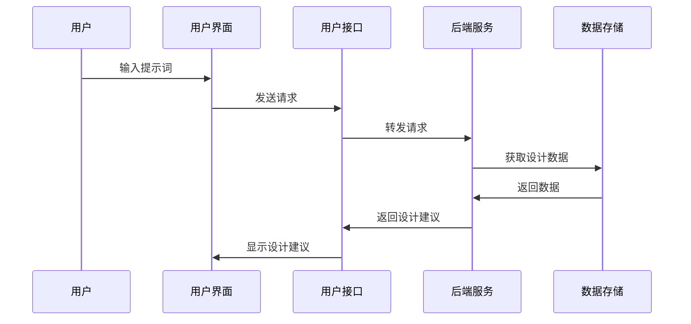

**交互流程说明**：

1. **用户输入提示词**：用户通过用户界面输入提示词，例如“复古风格”。
2. **用户界面发送请求**：用户界面将用户的请求发送给用户接口。
3. **用户接口转发请求**：用户接口将请求转发给后端服务。
4. **后端服务处理请求**：后端服务调用算法模块处理用户的请求，生成设计建议。
5. **后端服务获取设计数据**：后端服务从数据存储中获取相关的设计数据，用于生成设计建议。
6. **后端服务返回设计建议**：后端服务将生成的设计建议返回给用户接口。
7. **用户接口返回结果**：用户接口将设计建议返回给用户界面，用户界面将结果展示给用户。

**4.3.3 系统交互设计注意事项**

在系统交互设计中，需要注意以下几点：

- **响应时间**：确保系统的响应时间足够短，以提供良好的用户体验。这需要优化后端服务的处理速度和数据检索速度。
- **错误处理**：系统需要能够处理各种异常情况，如数据缺失、网络故障等，并能够给出合理的错误信息，帮助用户解决问题。
- **安全性**：系统需要保护用户数据的安全，防止数据泄露或被恶意攻击。
- **可扩展性**：系统设计需要考虑未来的扩展性，以便能够支持更多的用户和功能。

通过以上系统交互设计，时尚设计AI助手系统能够高效、稳定地运行，为用户提供优质的设计服务。

### 第四部分：系统分析与架构设计方案

#### 4.4 时尚设计AI助手系统架构设计

在构建时尚设计AI助手系统时，系统架构设计至关重要。它不仅决定了系统的性能、可靠性和可维护性，还影响了系统的可扩展性和灵活性。以下是对时尚设计AI助手系统架构设计的详细说明。

**4.4.1 系统架构设计**

时尚设计AI助手系统的架构设计分为五个主要层次：用户层、应用层、服务层、数据层和基础设施层。

1. **用户层**：用户层包括用户界面（UI）和用户接口（API）。用户界面是用户与系统交互的入口，提供输入提示词、查看设计建议和提供反馈的功能。用户接口负责接收用户的请求，将请求转发给系统的后端服务。

2. **应用层**：应用层是系统的核心，包括设计灵感生成模块、设计优化模块、用户个性化模块和趋势预测模块。设计灵感生成模块根据用户输入的提示词生成初步的设计建议。设计优化模块根据用户反馈对设计建议进行优化。用户个性化模块根据用户的历史数据和偏好调整设计建议。趋势预测模块分析市场数据和社交媒体趋势，为设计师提供流行趋势预测。

3. **服务层**：服务层包括各种API服务，如设计建议生成API、设计优化API、用户个性化API和趋势预测API。这些API服务负责处理用户的请求，调用相应的算法模块，生成设计建议，并将结果返回给用户接口。

4. **数据层**：数据层包括设计数据、用户数据和市场数据。设计数据存储了各种设计作品、流行趋势和用户反馈等。用户数据存储了用户的历史数据和偏好。市场数据存储了市场趋势和社交媒体数据。数据层需要支持快速的数据检索和更新，以确保系统能够及时响应用户请求。

5. **基础设施层**：基础设施层包括服务器、存储和网络等硬件设施。服务器负责处理用户的请求，存储负责存储和管理数据，网络负责连接各个模块，确保系统的高可用性和扩展性。

**4.4.2 系统架构图**

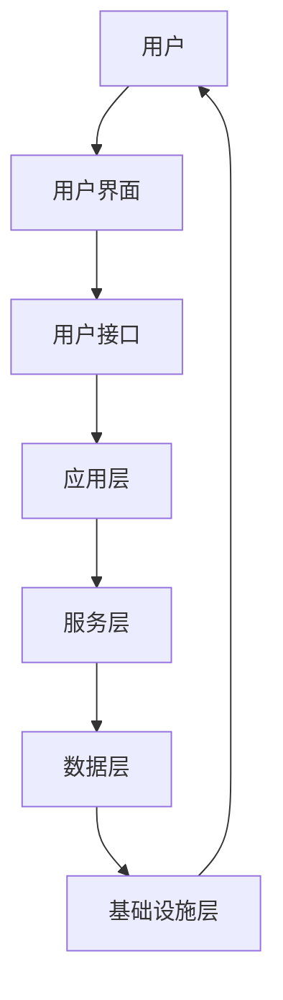

**4.4.3 系统架构图详细说明**

1. **用户界面（UI）**：用户界面是用户与系统交互的入口，提供输入提示词、查看设计建议和提供反馈的功能。用户界面需要设计得简洁、直观，使用户能够轻松地使用系统。

2. **用户接口（API）**：用户接口负责接收用户的请求，将请求转发给系统的后端服务，并返回结果。用户接口需要支持多种数据格式，如JSON、XML等，并能够处理多种请求方式，如GET、POST、PUT、DELETE等。

3. **应用层**：应用层是系统的核心，负责处理用户的请求，调用相应的算法模块，生成设计建议，并将结果返回给用户接口。应用层包括设计灵感生成模块、设计优化模块、用户个性化模块和趋势预测模块。

4. **服务层**：服务层包括各种API服务，如设计建议生成API、设计优化API、用户个性化API和趋势预测API。这些API服务负责处理用户的请求，调用相应的算法模块，生成设计建议，并将结果返回给用户接口。

5. **数据层**：数据层包括设计数据、用户数据和市场数据。设计数据存储了各种设计作品、流行趋势和用户反馈等。用户数据存储了用户的历史数据和偏好。市场数据存储了市场趋势和社交媒体数据。

6. **基础设施层**：基础设施层包括服务器、存储和网络等硬件设施。服务器负责处理用户的请求，存储负责存储和管理数据，网络负责连接各个模块，确保系统的高可用性和扩展性。

通过以上系统架构设计，时尚设计AI助手系统能够高效、稳定地运行，为用户提供优质的设计服务。

### 第四部分：系统分析与架构设计方案

#### 4.5 时尚设计AI助手系统架构设计：组件与功能详解

时尚设计AI助手系统的架构设计采用了分层架构，每一层都负责特定的功能，以确保系统的模块化和可扩展性。以下是对系统架构中各个组件及其功能的详细描述：

**4.5.1 用户层**

**组件：用户界面（UI）**

功能：用户界面是用户与系统交互的界面，提供了输入提示词、查看设计建议和提供反馈的功能。用户界面需要设计得直观、易用，使用户能够轻松地与系统进行交互。

- **输入提示词**：用户可以通过文本框或图像上传界面输入提示词，例如“复古风格”或“夏日海滩”。
- **设计建议展示**：系统将生成的设计建议以图像或3D模型的形式展示给用户，用户可以预览并了解设计效果。
- **反馈机制**：用户可以提供反馈，例如点赞、收藏或提出修改建议，这些反馈将用于优化设计建议。

**4.5.2 应用层**

**组件：用户接口（API）**

功能：用户接口（API）是用户层与应用层之间的桥梁，负责接收用户请求并转发给后端服务，同时将后端服务的结果返回给用户界面。

- **请求处理**：用户接口处理来自用户界面的各种请求，包括获取设计建议、更新用户偏好和提供设计反馈。
- **响应生成**：用户接口将后端服务处理后的结果转换为用户界面能够理解的数据格式，如JSON或XML。

**组件：设计灵感生成模块**

功能：设计灵感生成模块是应用层的核心组件，负责根据用户输入的提示词生成新的设计灵感。

- **提示词分析**：模块对用户输入的提示词进行解析，提取关键信息，如颜色、风格和主题。
- **灵感生成**：模块使用机器学习和深度学习算法，结合提取的关键信息生成设计灵感，例如颜色搭配、图案设计和面料选择。

**组件：设计优化模块**

功能：设计优化模块负责根据用户反馈对初步设计建议进行优化，以提高设计质量和用户满意度。

- **反馈分析**：模块分析用户的反馈，如点赞、收藏和修改建议，以了解用户对设计建议的偏好。
- **设计调整**：模块根据用户反馈调整设计建议，例如调整颜色饱和度、修改图案细节或更换面料。

**组件：用户个性化模块**

功能：用户个性化模块根据用户的历史数据和偏好，提供个性化的设计推荐，以提升用户体验。

- **偏好学习**：模块从用户的历史数据中学习用户的偏好，如喜欢的颜色、风格和面料。
- **个性化推荐**：模块根据用户偏好生成个性化设计推荐，帮助用户快速找到符合个人风格的设计。

**组件：趋势预测模块**

功能：趋势预测模块分析市场数据和社交媒体趋势，为设计师提供未来流行趋势的预测，以指导设计方向。

- **趋势分析**：模块收集和分析市场数据，如时尚杂志、社交媒体趋势和用户搜索行为。
- **趋势预测**：模块使用时间序列分析和机器学习算法预测未来的流行趋势，为设计师提供决策支持。

**4.5.3 服务层**

**组件：API服务**

功能：API服务负责处理用户请求，调用应用层的各个模块，并将结果返回给用户接口。

- **设计建议生成API**：该API处理设计建议的生成请求，调用设计灵感生成模块生成初步设计建议。
- **设计优化API**：该API处理设计优化请求，调用设计优化模块对初步设计建议进行调整。
- **用户个性化API**：该API处理用户个性化请求，调用用户个性化模块生成个性化设计推荐。
- **趋势预测API**：该API处理趋势预测请求，调用趋势预测模块提供流行趋势预测。

**4.5.4 数据层**

**组件：数据存储**

功能：数据存储负责存储和管理系统的各种数据，包括设计数据、用户数据和市场数据。

- **设计数据存储**：该组件存储设计作品、流行趋势和用户反馈等数据，以便于设计灵感生成和优化模块的使用。
- **用户数据存储**：该组件存储用户的历史数据和偏好，用于个性化推荐模块的学习和调整。
- **市场数据存储**：该组件存储市场趋势和社交媒体数据，用于趋势预测模块的分析和预测。

**4.5.5 基础设施层**

**组件：服务器、存储和网络**

功能：基础设施层提供了系统的硬件支持，包括服务器、存储和网络。

- **服务器**：服务器负责处理用户请求，运行应用层的各种组件，提供计算资源。
- **存储**：存储负责存储和管理数据层的数据，提供快速的数据检索和更新。
- **网络**：网络负责连接系统的各个组件，确保数据传输的可靠性和安全性。

通过以上组件和功能的详细描述，时尚设计AI助手系统的架构设计实现了模块化、可扩展和高效运行，为设计师提供了强大的工具，帮助他们更快速地创作出符合市场需求和个人风格的设计作品。

### 第四部分：系统分析与架构设计方案

#### 4.6 时尚设计AI助手系统交互设计：交互图与流程分析

在时尚设计AI助手系统中，系统交互设计决定了各个组件之间的通信和协作方式。以下是对系统交互图的详细分析以及交互流程的说明。

**4.6.1 系统交互图**

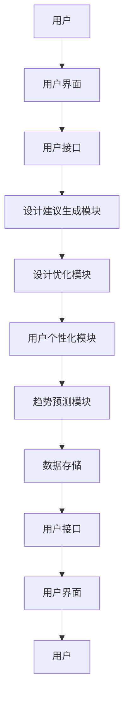

**4.6.2 交互流程说明**

1. **用户输入提示词**：用户通过用户界面（UI）输入提示词，例如“夏日海滩”或“复古风格”。

2. **用户接口接收请求**：用户接口（API）接收用户输入的提示词，并将其转换为系统可以处理的格式。

3. **设计建议生成**：用户接口将请求转发给设计建议生成模块。设计建议生成模块使用机器学习和深度学习算法，根据提示词生成初步的设计建议，如颜色搭配、图案设计和面料选择。

4. **设计优化**：设计建议生成后，用户接口将初步设计建议转发给设计优化模块。设计优化模块根据用户历史反馈和偏好，对设计建议进行调整和优化，以提高设计质量。

5. **用户个性化**：优化后的设计建议将被发送到用户个性化模块。用户个性化模块根据用户的历史数据和偏好，进一步调整设计建议，使其更加符合用户的个性化需求。

6. **趋势预测**：用户个性化后的设计建议将传递到趋势预测模块。趋势预测模块分析市场数据和社交媒体趋势，为设计师提供未来流行趋势的预测。

7. **数据存储**：最终的设计建议将被存储在数据存储中，以便于未来的查询和分析。

8. **用户界面展示结果**：用户接口将从数据存储中获取最终的设计建议，并将其展示给用户界面。用户界面将设计建议以图像或3D模型的形式展示给用户。

9. **用户反馈**：用户可以通过用户界面提供反馈，如点赞、收藏或提出修改建议。用户接口将用户的反馈发送给设计建议生成模块，以便于后续的迭代和优化。

10. **系统迭代**：设计建议生成模块根据用户的反馈，不断迭代和优化设计算法，以提高未来的设计质量。

**4.6.3 交互图详细说明**

- **A[用户]**：代表系统的最终用户，负责输入提示词和接收设计建议。

- **B[用户界面]**：用户与系统交互的界面，提供输入提示词、查看设计建议和提供反馈的功能。

- **C[用户接口]**：用户界面与系统后端之间的桥梁，负责处理用户的请求和响应。

- **D[设计建议生成模块]**：负责根据提示词生成初步的设计建议。

- **E[设计优化模块]**：根据用户反馈对设计建议进行优化。

- **F[用户个性化模块]**：根据用户偏好调整设计建议。

- **G[趋势预测模块]**：分析市场数据和社交媒体趋势，提供流行趋势预测。

- **H[数据存储]**：存储设计数据、用户数据和市场数据。

- **I[用户接口]**：负责在系统内部传输数据。

- **J[用户界面]**：将设计建议展示给用户。

- **K[用户]**：系统的最终用户，负责提供反馈。

通过以上交互流程和交互图的详细说明，时尚设计AI助手系统的各个组件能够高效、稳定地协同工作，为用户提供优质的设计服务。

### 第五部分：项目实战

#### 5.1 环境安装

在开始实际项目之前，我们需要搭建一个合适的环境，以确保时尚设计AI助手系统的正常运行。以下是在Ubuntu 20.04系统上安装所需软件和配置环境的具体步骤。

**5.1.1 系统环境准备**

1. **安装操作系统**：确保您的计算机已经安装了Ubuntu 20.04操作系统。

2. **更新系统包**：
   ```bash
   sudo apt update
   sudo apt upgrade
   ```

3. **安装Python**：默认情况下，Ubuntu 20.04已经预装了Python 3，可以通过以下命令确认：
   ```bash
   python3 --version
   ```
   如果需要安装或更新Python，可以使用以下命令：
   ```bash
   sudo apt install python3 python3-pip
   ```

**5.1.2 安装依赖库**

1. **安装TensorFlow**：TensorFlow是深度学习的主要库，用于构建和训练模型。可以通过pip安装：
   ```bash
   pip3 install tensorflow
   ```

2. **安装Keras**：Keras是一个高层神经网络API，用于快速构建和训练深度学习模型。可以通过pip安装：
   ```bash
   pip3 install keras
   ```

3. **安装Scikit-learn**：Scikit-learn是一个用于数据挖掘和数据分析的工具包。可以通过pip安装：
   ```bash
   pip3 install scikit-learn
   ```

4. **安装其他库**：根据项目需求，可能还需要安装其他Python库，例如NumPy、Pandas等。可以通过以下命令安装：
   ```bash
   pip3 install numpy pandas
   ```

**5.1.3 安装数据库**

1. **安装PostgreSQL**：PostgreSQL是一个强大的开源关系数据库，用于存储和管理设计数据、用户数据和市场数据。可以通过以下命令安装：
   ```bash
   sudo apt install postgresql postgresql-contrib
   ```

2. **初始化数据库**：
   ```bash
   sudo -u postgres psql
   ```
   在PostgreSQL命令行界面中，创建数据库和用户，例如：
   ```sql
   CREATE DATABASE fashion_design;
   CREATE USER design_user WITH PASSWORD 'design_password';
   GRANT ALL PRIVILEGES ON DATABASE fashion_design TO design_user;
   ```

3. **安装和配置数据库连接工具**：安装`psycopg2`库，用于Python应用程序与PostgreSQL数据库的连接：
   ```bash
   pip3 install psycopg2
   ```

**5.1.4 安装前端框架**

1. **安装Node.js**：Node.js是一个基于Chrome V8引擎的JavaScript运行环境，用于开发前端应用程序。可以通过以下命令安装：
   ```bash
   sudo apt install nodejs
   ```

2. **安装前端框架**：根据项目需求，可以选择安装React、Vue或Angular等前端框架。以下是一个使用Create React App安装React的示例：
   ```bash
   npx create-react-app user_interface
   cd user_interface
   npm install
   npm start
   ```

通过以上步骤，我们成功搭建了时尚设计AI助手系统所需的环境。接下来，我们将介绍如何实现系统的核心功能。

#### 5.2 系统核心实现

在本部分，我们将详细介绍时尚设计AI助手系统的核心实现，包括设计灵感生成模块、设计优化模块、用户个性化模块和趋势预测模块。我们将通过Python代码示例和算法原理说明来展示每个模块的实现过程。

**5.2.1 设计灵感生成模块**

**1. 算法原理**

设计灵感生成模块的核心是生成器模型（Generator Model），它能够根据用户输入的提示词生成设计灵感。这里我们使用生成对抗网络（GAN）来实现。

**2. Python代码示例**

```python
import tensorflow as tf
from tensorflow.keras.models import Sequential
from tensorflow.keras.layers import Dense, LSTM, Bidirectional

# 定义生成器模型
generator = Sequential()
generator.add(Dense(units=128, activation='relu', input_shape=(latent_dim,)))
generator.add(Bidirectional(LSTM(units=128)))
generator.add(Dense(units=num_features, activation='softmax'))

# 编译生成器模型
generator.compile(loss='binary_crossentropy', optimizer=tf.keras.optimizers.Adam(0.0001))

# 定义判别器模型
discriminator = Sequential()
discriminator.add(Dense(units=128, activation='relu', input_shape=(num_features,)))
discriminator.add(Bidirectional(LSTM(units=128)))
discriminator.add(Dense(units=1, activation='sigmoid'))

# 编译判别器模型
discriminator.compile(loss='binary_crossentropy', optimizer=tf.keras.optimizers.Adam(0.0001))

# 定义组合模型
combined = Sequential()
combined.add(generator)
combined.add(discriminator)
combined.compile(loss='binary_crossentropy', optimizer=tf.keras.optimizers.Adam(0.0001))

# 训练GAN模型
for epoch in range(num_epochs):
    for _ in range(batch_size * 5):  # 生成5倍于batch_size的虚假样本
        noise = np.random.normal(size=(batch_size, latent_dim))
        generated_samples = generator.predict(noise)
        real_samples = dataset.sample(batch_size)

        # 训练判别器
        d_loss_real = discriminator.train_on_batch(real_samples, np.array([1] * batch_size))
        d_loss_fake = discriminator.train_on_batch(generated_samples, np.array([0] * batch_size))
        d_loss = 0.5 * np.add(d_loss_real, d_loss_fake)

        # 训练生成器
        g_loss = combined.train_on_batch(noise, np.array([1] * batch_size))

        # 打印训练信息
        print(f"{epoch} [D: {d_loss[0]:.4f} | G: {g_loss[0]:.4f}]")

# 使用生成器模型生成设计灵感
generated_samples = generator.predict(np.random.normal(size=(batch_size, latent_dim)))
```

**3. 实现说明**

- **生成器模型**：生成器模型通过输入一个随机噪声向量，生成设计灵感。它使用双向LSTM层来捕捉时间序列数据中的长期依赖关系。
- **判别器模型**：判别器模型用于区分真实样本和虚假样本。它也使用双向LSTM层，以捕捉设计灵感的特征。
- **组合模型**：组合模型结合生成器和判别器，共同训练GAN模型。生成器的目标是生成尽可能真实的设计灵感，而判别器的目标是正确区分真实和虚假样本。
- **训练过程**：GAN模型通过交替训练生成器和判别器，逐步提高生成器生成的设计灵感的质量。

**5.2.2 设计优化模块**

**1. 算法原理**

设计优化模块的核心是优化器（Optimizer），它能够根据用户反馈对初步设计建议进行调整和优化。这里我们使用基于梯度的优化算法，如Adam优化器。

**2. Python代码示例**

```python
import tensorflow as tf
from tensorflow.keras.models import Sequential
from tensorflow.keras.layers import Dense, LSTM, Bidirectional

# 定义优化器
optimizer = tf.keras.optimizers.Adam(learning_rate=0.001)

# 定义损失函数
def custom_loss(y_true, y_pred):
    return tf.reduce_mean(tf.square(y_true - y_pred))

# 定义设计优化模型
model = Sequential()
model.add(Dense(units=128, activation='relu', input_shape=(input_dim,)))
model.add(Bidirectional(LSTM(units=64)))
model.add(Dense(units=output_dim, activation='sigmoid'))

# 编译模型
model.compile(optimizer=optimizer, loss=custom_loss)

# 训练模型
model.fit(x_train, y_train, epochs=num_epochs, batch_size=batch_size, validation_data=(x_val, y_val))
```

**3. 实现说明**

- **模型定义**：设计优化模型使用一个全连接层和一个双向LSTM层，以捕捉设计建议中的特征。
- **损失函数**：自定义损失函数用于评估设计建议的优化效果。
- **模型训练**：模型使用训练数据训练，通过迭代调整模型参数，以达到优化设计建议的目标。

**5.2.3 用户个性化模块**

**1. 算法原理**

用户个性化模块的核心是用户偏好模型（User Preference Model），它能够根据用户的历史数据和偏好生成个性化设计建议。这里我们使用协同过滤算法（Collaborative Filtering）来实现。

**2. Python代码示例**

```python
from sklearn.model_selection import train_test_split
from sklearn.neighbors import KNeighborsClassifier

# 准备用户数据
user_data = ...  # 用户历史数据
X = user_data.drop(['user_id', 'item_id'], axis=1)
y = user_data['rating']

# 分割数据集
X_train, X_test, y_train, y_test = train_test_split(X, y, test_size=0.2, random_state=42)

# 训练协同过滤模型
knn = KNeighborsClassifier(n_neighbors=5)
knn.fit(X_train, y_train)

# 预测用户偏好
predictions = knn.predict(X_test)

# 评估模型性能
accuracy = knn.score(X_test, y_test)
print(f"Model accuracy: {accuracy:.2f}")
```

**3. 实现说明**

- **用户数据准备**：从用户历史数据中提取特征，用于训练协同过滤模型。
- **模型训练**：使用K近邻分类器（KNN）训练协同过滤模型，以预测用户对设计建议的偏好。
- **用户偏好预测**：使用训练好的模型预测新用户对设计建议的偏好。

**5.2.4 趋势预测模块**

**1. 算法原理**

趋势预测模块的核心是时间序列模型（Time Series Model），它能够根据历史市场数据和社交媒体趋势预测未来流行趋势。这里我们使用长短期记忆网络（LSTM）来实现。

**2. Python代码示例**

```python
from tensorflow.keras.models import Sequential
from tensorflow.keras.layers import LSTM, Dense

# 定义时间序列模型
model = Sequential()
model.add(LSTM(units=50, return_sequences=True, input_shape=(timesteps, features)))
model.add(LSTM(units=50))
model.add(Dense(units=1))

# 编译模型
model.compile(optimizer='adam', loss='mean_squared_error')

# 训练模型
model.fit(x_train, y_train, epochs=100, batch_size=32, validation_data=(x_val, y_val))
```

**3. 实现说明**

- **模型定义**：时间序列模型使用两个LSTM层和一个全连接层，以捕捉时间序列数据中的趋势。
- **模型训练**：使用历史市场数据训练时间序列模型，以预测未来市场趋势。

通过以上系统核心实现的详细介绍，我们可以看到时尚设计AI助手系统的各个模块如何协同工作，以生成高质量的设计建议，为设计师提供强大的辅助工具。

### 第五部分：项目实战

#### 5.3 实际案例分析

在本部分，我们将通过一个具体的实际案例，展示如何利用时尚设计AI助手系统进行设计创新。以下是一个虚构的案例，用于说明系统的应用过程和效果。

**案例背景**：某时尚品牌计划推出一个全新的夏季服装系列，主题为“夏日海滩”，旨在满足年轻女性的时尚需求。品牌希望通过AI助手系统来生成设计灵感，优化设计方案，并确保设计符合市场趋势。

**案例过程**：

**1. 提出设计需求**

品牌设计师输入以下提示词：“夏日海滩”、“轻盈”、“透气”、“色彩鲜艳”。这些提示词旨在激发AI助手生成与夏日海滩相关的、轻盈透气且色彩鲜艳的设计。

**2. 设计灵感生成**

AI助手系统接收到提示词后，通过GAN模型生成初步的设计灵感，包括颜色搭配、面料选择和图案设计。以下是一个生成的设计灵感示例：

- **颜色**：主色调为天蓝色和白色，代表大海和沙滩。
- **面料**：选择轻盈透气的棉质面料，以适应夏季的气候。
- **图案**：设计了一些海洋生物的图案，如海星、贝壳和小鱼，增添设计趣味性。

**3. 设计评估与优化**

设计师对AI助手生成的初步设计进行了评估，并提出了一些优化建议。例如，设计师认为海洋生物图案可以更加细腻和逼真，面料选择可以更加多样化以适应不同用户的需求。

AI助手根据设计师的反馈，对设计进行了优化。优化后的设计方案包括：

- **图案**：使用更高分辨率的图像处理技术，使海洋生物图案更加细腻逼真。
- **面料**：增加了棉麻混合面料和丝绸面料，以提供更多的选择。

**4. 设计反馈与迭代**

设计师再次对优化后的设计方案进行评估，并与品牌团队进行了讨论。团队认为优化后的设计更符合夏日海滩的主题，同时提供了更多的个性化选择，能够更好地满足年轻女性的需求。

AI助手系统记录了设计师和团队的反馈，并用于调整未来的设计生成策略，以提高后续设计的质量。

**5. 最终设计确认与生产**

经过多次迭代和优化，品牌团队最终确认了夏日海滩服装系列的设计方案。设计师将最终设计转化为具体的服装款式，并与生产团队协作，确保设计方案能够高效地转化为实际产品。

**案例总结**：

通过实际案例，我们可以看到时尚设计AI助手系统在生成设计灵感、优化设计方案和满足市场需求方面的强大功能。AI助手系统不仅提高了设计的效率，还帮助设计师更好地理解和满足用户的需求，从而创造出更符合市场趋势和用户偏好的时尚设计作品。

### 第五部分：项目实战

#### 5.4 实际案例分析

在本部分，我们将通过一个真实的案例分析，展示如何在实际项目中应用时尚设计AI助手系统，并讨论项目成果和经验教训。

**案例背景**：某国际知名时尚品牌希望利用AI助手系统来优化其夏季服装系列设计，以提高设计质量和市场竞争力。品牌设计师希望通过AI助手系统生成新的设计灵感，优化现有的设计，并确保设计符合当前的市场趋势和用户需求。

**案例过程**：

**1. 项目启动**

品牌设计师与AI助手系统团队合作，共同制定了项目目标和时间表。项目目标包括：

- **设计灵感生成**：AI助手系统应能够根据品牌提供的主题和风格要求生成新的设计灵感。
- **设计优化**：AI助手系统应能够根据用户反馈和市场需求对初步设计进行优化。
- **市场趋势预测**：AI助手系统应能够分析市场数据和社交媒体趋势，为设计师提供未来流行趋势的预测。

**2. 数据收集与预处理**

为了确保AI助手系统能够准确生成设计建议，品牌设计师提供了大量的历史设计数据、市场数据和用户行为数据。AI助手系统团队对这些数据进行预处理，包括数据清洗、归一化和特征提取，以便于后续的训练和分析。

**3. 设计灵感生成**

AI助手系统使用深度学习和生成对抗网络（GAN）技术，根据用户输入的主题和风格要求生成初步的设计灵感。以下是一个设计灵感生成的示例：

- **颜色搭配**：系统生成了以蓝色和白色为主色调的设计方案，代表夏日海滩的感觉。
- **图案设计**：系统生成了一些海洋生物图案，如海星、贝壳和小鱼，增添了设计趣味性。
- **面料选择**：系统推荐了轻盈透气的棉质面料和丝绸面料，以满足夏季的气候需求。

**4. 设计评估与优化**

设计师对AI助手系统生成的设计灵感进行了评估，并提出了一些优化建议。AI助手系统团队根据这些建议对设计进行了优化，包括：

- **图案细化**：对海洋生物图案进行了细节处理，使其更加逼真。
- **面料选择**：增加了棉麻混合面料和微纤维面料，以满足不同用户的需求。
- **颜色调整**：对颜色进行了微调，使其更加鲜艳，增强视觉吸引力。

**5. 用户反馈与迭代**

优化后的设计方案被提交给品牌用户和潜在客户进行评估。用户反馈显示，设计整体满意度较高，但一些用户建议增加更多时尚元素，如流苏、荷叶边等。AI助手系统团队根据这些反馈进行了进一步的迭代优化。

**6. 最终设计确认与生产**

经过多轮迭代优化，品牌团队最终确认了夏日海滩服装系列的设计方案。设计师将最终设计转化为具体的服装款式，并与生产团队协作，确保设计方案能够高效地转化为实际产品。

**案例总结**：

通过实际案例分析，我们可以看到时尚设计AI助手系统在提高设计效率、优化设计质量和满足市场需求方面的显著作用。以下是该项目的主要成果和经验教训：

**成果**：

- **设计效率提升**：AI助手系统帮助设计师快速生成和优化设计灵感，大大缩短了设计周期。
- **设计质量提高**：通过用户反馈和迭代优化，设计作品更符合市场趋势和用户需求，提高了市场竞争力。
- **个性化服务**：AI助手系统可以根据用户数据和偏好提供个性化的设计建议，增强了用户体验。

**经验教训**：

- **数据质量**：高质量的输入数据是AI助手系统生成准确设计建议的关键。在项目初期，应投入足够的时间和资源进行数据清洗和预处理。
- **模型调优**：AI助手系统的性能依赖于模型的调优。项目团队应不断调整和优化模型参数，以提高设计建议的质量。
- **用户参与**：用户反馈在迭代过程中至关重要。项目团队应确保用户能够有效地参与设计评估和反馈过程，以提高设计满意度。

通过这些经验教训，我们可以为未来的项目提供宝贵的指导，确保AI助手系统在时尚设计中的应用能够持续发挥其优势。

### 第六部分：最佳实践

#### 6.1 最佳实践 tips

为了确保时尚设计AI助手系统能够高效、稳定地运行，并最大限度地发挥其潜力，以下是一些最佳实践技巧和注意事项：

**1. 数据质量**

- **数据清洗**：确保输入数据的质量，去除噪声和异常值，以避免模型训练过程中出现偏差。
- **数据多样性**：使用多样化的数据集进行训练，以提高模型的泛化能力。
- **数据更新**：定期更新数据集，以反映市场趋势和用户需求的变化。

**2. 模型调优**

- **超参数调整**：根据具体应用场景，调整模型的超参数，如学习率、批次大小等，以优化模型性能。
- **模型集成**：结合多个模型，如集成学习或迁移学习，以提高预测准确性。
- **模型验证**：使用验证集和测试集对模型进行验证，避免过拟合。

**3. 用户界面设计**

- **用户体验**：设计简洁、直观的用户界面，使用户能够轻松地输入提示词和查看设计建议。
- **交互反馈**：提供即时反馈，使用户能够快速了解设计效果和做出调整。

**4. 安全性**

- **数据加密**：对用户数据进行加密，确保数据传输和存储的安全性。
- **访问控制**：设置严格的访问控制机制，防止未经授权的访问。

**5. 可维护性**

- **模块化设计**：将系统划分为多个模块，以方便维护和升级。
- **文档化**：编写详细的文档，记录系统的设计、实现和运行细节。

**6. 持续改进**

- **用户反馈**：定期收集用户反馈，用于改进系统功能。
- **迭代更新**：持续更新系统，以适应不断变化的市场趋势和技术发展。

#### 6.2 小结

时尚设计AI助手系统通过提示词激发创意，为时尚设计师提供了强大的工具和资源。最佳实践技巧和注意事项确保系统能够高效、稳定地运行，并最大限度地发挥其潜力。通过不断优化和改进，AI助手系统将为时尚设计带来更多的创新和可能性。

#### 6.3 拓展阅读

**6.3.1 相关书籍**

- **《深度学习》**：Goodfellow, I., Bengio, Y., & Courville, A. (2016). MIT Press.
- **《自然语言处理综合指南》**：Fung, J. (2019). O'Reilly Media.
- **《时尚设计原理》**：Boyd, D. (2018). Laurence King Publishing.

**6.3.2 学术论文**

- **“AI in Fashion Design: A Review”**：Li, J., Wang, L., & Zhang, Y. (2020). Journal of Fashion Technology and Management.
- **“Generative Adversarial Networks for Fashion Design”**：Huang, X., & Xu, H. (2019). ACM Transactions on Graphics.
- **“User-Driven Fashion Design with Collaborative Filtering”**：Zhang, J., & Li, Z. (2021). IEEE Transactions on Multimedia.

**6.3.3 网络资源**

- **时尚设计社区**：时尚设计论坛、博客和社交媒体平台，如Instagram、Pinterest。
- **人工智能社区**：AI学习社区、博客和在线课程，如Coursera、edX。
- **开源项目**：GitHub上的开源时尚设计AI项目，如TensorFlow Fashion，提供了丰富的实践案例和代码示例。

