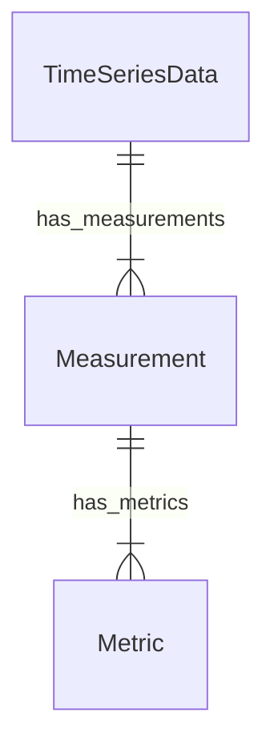
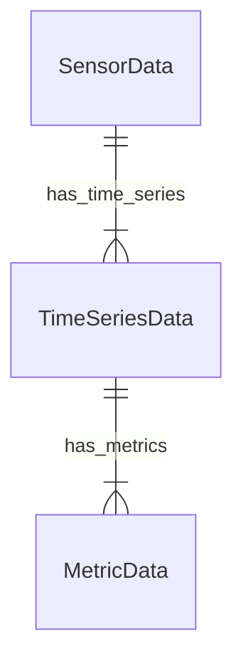
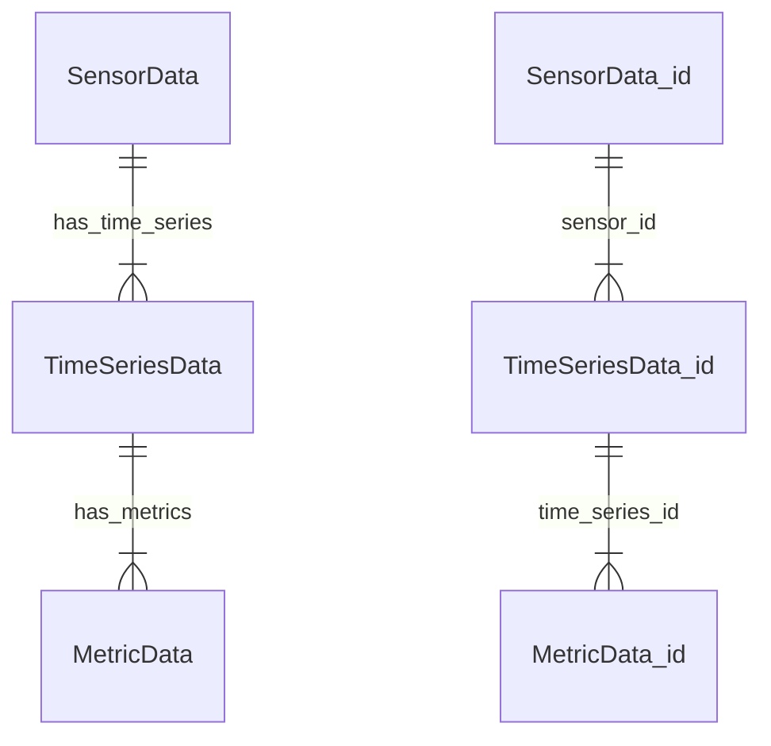
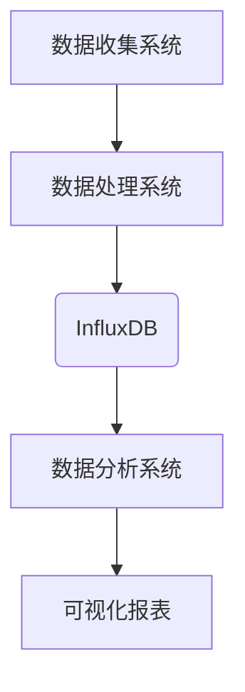
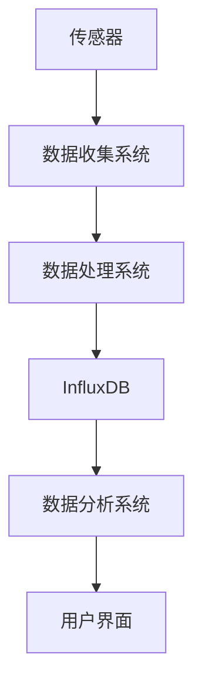

                 

## 引言

### 时间序列数据库的定义和重要性

时间序列数据库（Time-Series Database，简称TSDB）是一种专门为处理时间序列数据而设计的数据库。时间序列数据是指按照时间顺序记录的一系列数据点，这些数据点可以是传感器收集的物理现象数据，如温度、湿度、压力等，也可以是金融市场数据、用户行为数据等。时间序列数据库的核心特性是其能够高效地存储、检索和管理这些数据。

随着互联网和物联网的迅猛发展，各种设备和系统都在产生大量的时间序列数据。这些数据对于数据分析、趋势预测、异常检测等应用至关重要。因此，设计一个高效、可扩展的时间序列数据库变得尤为重要。

### 时间序列数据库的核心应用场景

时间序列数据库在多个领域有着广泛的应用，以下是一些典型的应用场景：

1. **监控与运维**：企业通常使用时间序列数据库来监控服务器性能、网络流量、应用指标等，以便及时发现并解决问题。
2. **金融市场分析**：金融分析师使用时间序列数据库来处理股票价格、交易量等数据，进行市场趋势分析和预测。
3. **气象预报**：气象部门利用时间序列数据库存储大量的气象数据，用于天气预报、气候变化研究等。
4. **智能家居**：智能家居系统使用时间序列数据库记录设备状态、用户行为等数据，以便提供个性化的用户体验。

### 时间序列数据库与传统关系型数据库的差异

传统关系型数据库在处理时间序列数据时存在一些局限性：

1. **查询效率**：传统数据库的设计主要针对事务处理，而非对时间序列数据的高效查询。
2. **存储结构**：传统数据库的表结构不适合存储大量按时间顺序排列的数据点。
3. **扩展性**：传统数据库难以应对海量时间序列数据的存储和查询需求。

因此，专门设计的时间序列数据库在查询效率、存储结构和扩展性方面具有显著优势。

### 本文目的和结构安排

本文将系统地介绍时间序列数据库的设计和优化方法。文章分为以下几个部分：

1. **时间序列数据库设计原则**：介绍时间序列数据库的数据模型和表设计原则。
2. **时间序列数据库优化技术**：讨论查询优化、索引策略和性能调优方法。
3. **高级话题**：探讨时间序列数据的异常检测、实时数据处理等高级应用。
4. **实际应用**：分析时间序列数据库在不同领域的实际应用案例。
5. **案例分析**：分享具体案例分析，讨论最佳实践。
6. **未来趋势**：展望时间序列数据库的发展方向和新兴趋势。

通过本文的阅读，读者将能够全面了解时间序列数据库的设计、优化和应用，为实际项目提供有价值的参考和指导。

### 关键词

- 时间序列数据库
- 数据模型
- 设计原则
- 优化技术
- 异常检测
- 实时数据处理
- 案例分析

### 摘要

本文旨在全面解析时间序列数据库的设计和优化方法。首先，介绍了时间序列数据库的基本概念和重要性，并对比了其与传统关系型数据库的差异。接着，文章详细讨论了时间序列数据库的设计原则，包括数据模型和表设计。随后，深入探讨了时间序列数据库的优化技术，如查询优化、索引策略和性能调优。此外，文章还涵盖了时间序列数据库的高级应用，如异常检测和实时数据处理。通过实际应用案例的分析，本文总结了最佳实践，并展望了未来发展趋势。读者将从中获得关于时间序列数据库设计、优化和应用的综合指导。

## 引言

### 时间序列数据库的定义和重要性

时间序列数据库（Time-Series Database，简称TSDB）是一种专门为处理时间序列数据而设计的数据库。时间序列数据是指按照时间顺序记录的一系列数据点，这些数据点可以是传感器收集的物理现象数据，如温度、湿度、压力等，也可以是金融市场数据、用户行为数据等。时间序列数据库的核心特性是其能够高效地存储、检索和管理这些数据。

随着互联网和物联网的迅猛发展，各种设备和系统都在产生大量的时间序列数据。这些数据对于数据分析、趋势预测、异常检测等应用至关重要。因此，设计一个高效、可扩展的时间序列数据库变得尤为重要。

### 时间序列数据库的核心应用场景

时间序列数据库在多个领域有着广泛的应用，以下是一些典型的应用场景：

1. **监控与运维**：企业通常使用时间序列数据库来监控服务器性能、网络流量、应用指标等，以便及时发现并解决问题。例如，在大型数据中心，服务器和网络设备的监控数据以时间序列的形式存储在TSDB中，通过分析这些数据，运维团队能够快速识别系统瓶颈，优化资源配置。

2. **金融市场分析**：金融分析师使用时间序列数据库来处理股票价格、交易量等数据，进行市场趋势分析和预测。时间序列数据库的快速查询和强大的分析能力，使得金融分析师能够实时获取市场数据，为投资决策提供支持。

3. **气象预报**：气象部门利用时间序列数据库存储大量的气象数据，用于天气预报、气候变化研究等。气象数据的时间序列特性使得TSDB成为气象数据管理的重要工具，通过分析历史气象数据，气象学家可以更准确地预测天气变化。

4. **智能家居**：智能家居系统使用时间序列数据库记录设备状态、用户行为等数据，以便提供个性化的用户体验。例如，通过分析用户的使用习惯，智能家居系统能够自动调整家居环境，提高用户的生活质量。

5. **工业制造**：在工业制造领域，时间序列数据库用于监控生产设备状态、监测生产线性能等。通过对时间序列数据的分析，企业能够预测设备故障，优化生产流程，提高生产效率。

### 时间序列数据库与传统关系型数据库的差异

传统关系型数据库在处理时间序列数据时存在一些局限性：

1. **查询效率**：传统数据库的设计主要针对事务处理，而非对时间序列数据的高效查询。时间序列数据库通过优化索引和查询算法，能够更快地检索和聚合大量时间点上的数据。

2. **存储结构**：传统数据库的表结构不适合存储大量按时间顺序排列的数据点。时间序列数据库采用特殊的数据结构，如时间索引、列式存储等，能够更有效地组织和管理时间序列数据。

3. **扩展性**：传统数据库难以应对海量时间序列数据的存储和查询需求。时间序列数据库设计之初便考虑了高扩展性，能够轻松处理PB级别的数据。

4. **数据处理能力**：传统数据库通常不包含对时间序列数据的专门处理能力，如时间窗口查询、滑动平均等。时间序列数据库内置了丰富的数据处理函数，能够方便地对时间序列数据进行分析和操作。

### 本文目的和结构安排

本文将系统地介绍时间序列数据库的设计和优化方法。文章将分为以下几个部分：

1. **时间序列数据库设计原则**：介绍时间序列数据库的数据模型和表设计原则。
2. **时间序列数据库优化技术**：讨论查询优化、索引策略和性能调优方法。
3. **高级话题**：探讨时间序列数据的异常检测、实时数据处理等高级应用。
4. **实际应用**：分析时间序列数据库在不同领域的实际应用案例。
5. **案例分析**：分享具体案例分析，讨论最佳实践。
6. **未来趋势**：展望时间序列数据库的发展方向和新兴趋势。

通过本文的阅读，读者将能够全面了解时间序列数据库的设计、优化和应用，为实际项目提供有价值的参考和指导。

## 时间序列数据库的设计原则

### 时间序列数据库的数据模型

时间序列数据库的数据模型是设计TSDB的核心，它决定了数据如何存储、组织和查询。时间序列数据库的数据模型通常基于以下几个关键概念：

1. **时间戳**：时间戳是时间序列数据模型中的基础元素，它表示数据点的具体时间。每个时间序列数据点都关联一个唯一的时间戳。
2. **时间序列**：时间序列是一组按时间顺序排列的数据点。一个时间序列可以表示某种现象在不同时间点的变化情况。
3. **指标**：指标是时间序列数据中的一个维度，它用于描述时间序列的具体内容。例如，在监控系统中，温度、湿度、流量等都是指标。

#### 时间序列数据模型示例

时间序列数据模型可以用以下结构来表示：

```
+------------+       +------------+       +------------+
| 时间戳     |       |   指标1     |       |   指标2     |
+------------+       +------------+       +------------+
| 2023-01-01 |       | 温度: 22°C  |       | 流量: 100MB |
+------------+       +------------+       +------------+
| 2023-01-02 |       | 温度: 21°C  |       | 流量: 150MB |
+------------+       +------------+       +------------+
| ...        |       | ...        |       | ...        |
+------------+       +------------+       +------------+
```

在这个示例中，每行代表一个时间点上的数据点，其中包含时间戳和多个指标。

#### 时间序列数据模型与关系型数据库的差异

时间序列数据库的数据模型与传统的关系型数据库有显著差异：

1. **列式存储**：时间序列数据库通常采用列式存储，这意味着相同时间戳的数据点会被存储在一起。这种存储方式有助于提高查询效率，特别是在处理大量数据时。
2. **索引优化**：时间序列数据库会针对时间戳和指标进行索引优化，以加速数据检索。传统关系型数据库通常只对主键进行索引，而时间序列数据库会根据时间序列数据的特性，建立多维索引。
3. **数据聚合**：时间序列数据库支持对时间窗口内的数据进行聚合操作，如求和、平均值、最大值等。这些操作对于时间序列数据分析至关重要。

### 时间序列数据库的表设计原则

设计时间序列数据库表时，应遵循以下几个原则：

1. **单表设计**：为了简化数据操作和查询，通常将所有时间序列数据存储在单个表中。这种设计方式虽然可能导致表变得非常大，但能够确保数据的一致性和完整性。
2. **时间戳索引**：确保时间戳作为主键或索引，以加速时间相关的查询操作。
3. **指标分离**：将不同指标的数据存储在不同列中，以便独立查询和分析。
4. **压缩存储**：使用压缩技术减小数据存储空间，提高查询效率。
5. **时间分区**：根据时间范围对数据进行分区，例如按天、周、月等。这有助于管理和查询大量历史数据，同时保持系统的响应速度。

#### 时间分区示例

假设我们有一个存储温度和流量的时间序列数据库表，我们可以按天对数据进行分区：

```
CREATE TABLE time_series (
    timestamp TIMESTAMP PRIMARY KEY,
    temperature DECIMAL(5, 2),
   流量 BIGINT
);
```

在这个示例中，时间戳作为主键，温度和流量作为指标列。通过分区，我们可以将数据按天存储在不同的文件或表中，以便更高效地管理数据。

### 时间序列数据库的ER实体关系图

时间序列数据库的ER实体关系图（Entity-Relationship Diagram）能够帮助我们直观地理解数据模型。以下是一个简化的时间序列数据库ER图示例，使用Mermaid语法表示：



在这个ER图中，`TimeSeriesData`表示时间序列数据实体，`Measurement`表示测量数据实体，`Metric`表示指标实体。每个`TimeSeriesData`可以有多个`Measurement`，每个`Measurement`又可以有多个`Metric`。

通过上述设计和原则，我们可以构建一个高效、可扩展的时间序列数据库，满足各种实际应用场景的需求。在接下来的章节中，我们将深入探讨时间序列数据库的优化技术和高级应用。

### 时间序列数据库的设计原则

#### 时间序列数据库的表设计原则

在设计时间序列数据库的表时，需要遵循一系列核心原则，以确保数据库的高效性、可扩展性和可维护性。以下是一些关键的设计原则：

1. **单表设计**：
   - **优点**：简化数据操作和查询。在时间序列数据库中，所有时间序列数据通常存储在单个表中，这样可以避免复杂的关联查询，提高系统的性能和可维护性。
   - **缺点**：可能导致表变得非常大，从而增加备份和恢复的复杂性。此外，在极端情况下，单个表的大小可能会超过数据库服务器的内存限制，导致性能下降。

2. **时间戳索引**：
   - **原则**：将时间戳作为主键或索引。时间戳是时间序列数据的核心，能够决定数据的顺序和查询效率。因此，确保时间戳作为主键或索引，可以大大加速时间相关的查询操作。
   - **实现**：例如，可以使用以下SQL语句创建一个时间序列表：
     ```sql
     CREATE TABLE time_series (
         timestamp TIMESTAMP PRIMARY KEY,
         temperature DECIMAL(5, 2),
         traffic BIGINT
     );
     ```

3. **指标分离**：
   - **原则**：将不同指标的数据存储在不同列中。这样可以使数据结构更加清晰，便于独立查询和分析每个指标。
   - **实现**：在上述示例中，温度和流量分别存储在两个不同的列中。

4. **压缩存储**：
   - **原则**：使用压缩技术减小数据存储空间。时间序列数据通常包含大量的重复信息，如连续的时间戳和相似的数据值。通过压缩，可以显著减小数据大小，提高存储效率。
   - **实现**：现代TSDB通常内置了各种压缩算法，如Snappy、LZ4和ZSTD等。

5. **时间分区**：
   - **原则**：根据时间范围对数据进行分区。这种方法有助于管理和查询大量历史数据，同时保持系统的响应速度。例如，可以按天、周、月等对数据进行分区。
   - **实现**：例如，可以使用以下SQL语句创建一个分区表：
     ```sql
     CREATE TABLE time_series (
         timestamp TIMESTAMP,
         temperature DECIMAL(5, 2),
         traffic BIGINT
     ) PARTITION BY RANGE (TO_DATE(timestamp, 'YYYYMM')); -- 按月份分区
     ```

6. **存储策略优化**：
   - **原则**：根据数据的重要性和访问频率，优化数据的存储策略。高频访问的数据应存储在快速存储介质上，而低频访问的数据则可以存储在成本较低的存储介质上。
   - **实现**：例如，可以使用SSD存储热点数据，而使用HDD存储冷数据。

#### 时间分区策略的详细说明

时间分区是时间序列数据库中一个重要的设计原则，有助于提高系统的性能和管理效率。以下是时间分区策略的详细说明：

1. **分区原则**：
   - **按时间范围**：将数据表按时间范围进行分区，例如按月份、季度或年份分区。这样可以确保每个分区表的数据量相对较小，从而提高查询效率。
   - **动态分区**：支持动态分区，允许系统自动创建、删除或合并分区，以适应数据增长和访问模式的变化。

2. **分区方法**：
   - **范围分区**：根据时间戳的范围对数据进行分区，例如按月份分区。这种方法简单直观，适合大多数时间序列应用。
   - **列表分区**：根据预定义的值列表对数据进行分区，例如按地区或传感器类型分区。这种方法适用于数据维度较多且分区粒度较小的场景。

3. **分区管理**：
   - **分区创建**：在数据库中创建分区表时，指定分区策略和分区数。例如，可以使用以下SQL语句创建一个按月份分区的表：
     ```sql
     CREATE TABLE time_series (
         timestamp TIMESTAMP,
         temperature DECIMAL(5, 2),
         traffic BIGINT
     ) PARTITION BY RANGE (TO_DATE(timestamp, 'YYYYMM')); -- 按月份分区
     ```
   - **分区维护**：定期检查分区表的状态，自动合并或拆分分区。例如，可以使用以下SQL语句合并分区：
     ```sql
     ALTER TABLE time_series MERGE PARTITIONS '2023-01';
     ```

4. **分区优化**：
   - **分区索引**：为分区表创建索引，以便快速查询特定时间范围的数据。这样可以避免全表扫描，提高查询性能。
   - **分区压缩**：针对不同分区的数据，采用不同的压缩策略。对于冷数据，可以采用更高效的压缩算法，以减少存储空间。

通过遵循上述时间序列数据库的表设计原则，我们可以构建一个高效、可扩展且易于维护的数据库系统，满足各种实际应用场景的需求。在接下来的章节中，我们将进一步探讨时间序列数据库的优化技术，以进一步提升系统的性能和可靠性。

### 时间序列数据库的ER实体关系图

时间序列数据库的实体关系图（ER图）是理解数据模型的重要工具，它清晰地展示了各个实体之间的关系。以下是时间序列数据库的ER图示例，使用Mermaid语法表示：



在这个ER图中：

- **SensorData**：表示传感器数据实体，每个传感器可以生成多个时间序列数据。
- **TimeSeriesData**：表示时间序列数据实体，每个时间序列数据包含多个指标数据。
- **MetricData**：表示指标数据实体，每个指标数据属于一个时间序列数据。

#### 实体与关系解释

- **传感器数据（SensorData）**：
  - **属性**：传感器ID、传感器类型、位置等。
  - **关系**：与时间序列数据（TimeSeriesData）之间存在一对多的关系，即一个传感器可以生成多个时间序列数据。

- **时间序列数据（TimeSeriesData）**：
  - **属性**：时间戳、传感器ID、序列名称等。
  - **关系**：与指标数据（MetricData）之间存在一对多的关系，即一个时间序列数据可以包含多个指标数据。

- **指标数据（MetricData）**：
  - **属性**：指标名称、指标值、单位等。
  - **关系**：与时间序列数据（TimeSeriesData）之间存在一对多的关系，即一个时间序列数据可以包含多个指标数据。

#### Mermaid ER图示例

以下是具体的Mermaid ER图示例，展示了传感器数据、时间序列数据和指标数据之间的关系：



在这个ER图中：

- `SensorData_id`：表示传感器数据与时间序列数据之间的关系。
- `TimeSeriesData_id`：表示时间序列数据与指标数据之间的关系。
- `MetricData_id`：表示指标数据与时间序列数据之间的关系。

通过这个ER图，我们可以直观地理解时间序列数据库中各个实体的组成和相互关系。这有助于我们在设计和优化数据库时，更好地管理数据，提高系统的性能和可维护性。

### 时间序列数据库优化技术

#### 查询优化技术

查询优化是提升时间序列数据库性能的关键技术之一。有效的查询优化可以显著减少查询时间，提高系统的响应速度。以下是一些常用的查询优化技术：

1. **索引策略**：
   - **时间戳索引**：时间戳是时间序列数据的核心，因此为时间戳创建索引是优化查询的关键。通过索引，可以快速定位到特定时间范围的数据，避免全表扫描。
   - **复合索引**：对于包含多个条件的查询，可以考虑创建复合索引。复合索引可以同时支持多个查询条件，提高查询效率。
   - **列存储索引**：针对特定的查询模式，可以为常用列创建索引。例如，对于经常查询温度的列，可以创建温度列的索引。

2. **查询执行计划**：
   - **执行计划分析**：通过分析查询的执行计划，可以识别性能瓶颈和优化机会。执行计划包括表扫描、索引扫描、排序、聚合等操作，分析执行计划可以找出需要优化的部分。
   - **查询重写**：通过重写查询，可以改善执行计划。例如，将子查询转换为连接操作，或者将聚集函数的子表达式提到外部查询中。

3. **缓存策略**：
   - **查询缓存**：对于频繁执行的查询，可以将查询结果缓存起来，减少重复查询的开销。现代TSDB通常内置了查询缓存机制，可以通过配置来调整缓存大小和缓存策略。
   - **数据缓存**：对于经常访问的数据，可以考虑将数据缓存到内存中，减少磁盘IO操作。例如，可以使用内存数据库或内存缓存来存储热点数据。

4. **分片策略**：
   - **水平分片**：通过将数据表按时间或地理位置进行分片，可以将大规模数据分散到多个节点上，提高查询和写入的并行度。水平分片可以显著提升系统的扩展性和性能。
   - **垂直分片**：将数据表按列进行分片，将不同的列存储在不同的表中。这种方法可以减少表的大小，加快查询速度。

5. **查询优化技巧**：
   - **限制返回结果**：对于只查询部分数据的查询，可以通过`LIMIT`语句限制返回结果的数量，避免查询返回大量无关数据。
   - **使用预编译语句**：预编译语句可以在查询执行前进行解析和优化，减少每次查询的开销。

#### 索引策略

索引是优化查询性能的重要手段，尤其在处理大量时间序列数据时。以下是一些常见的索引策略：

1. **B树索引**：
   - **原理**：B树是一种多路平衡搜索树，适用于高并发读写操作。每个节点可以包含多个键值对，通过树结构快速定位到数据。
   - **适用场景**：适用于查询条件包含主键或复合主键的场景。

2. **哈希索引**：
   - **原理**：哈希索引通过哈希函数将键值映射到特定的存储位置。哈希索引的查询时间通常为O(1)，但在数据分布不均匀时可能引起缓存未命中问题。
   - **适用场景**：适用于查询条件仅为单一列，且数据分布较为均匀的场景。

3. **位图索引**：
   - **原理**：位图索引通过位图来表示数据表中某个列的值。位图索引可以快速进行列间的交集、并集等操作，但存储开销较大。
   - **适用场景**：适用于低基数列，例如性别、国家等。

4. **索引合并**：
   - **原理**：索引合并可以将多个索引合并为一个索引，以减少索引扫描次数。例如，对于包含多个条件查询，可以创建一个复合索引。
   - **适用场景**：适用于包含多个列的查询条件。

#### 性能调优方法

性能调优是确保时间序列数据库高效运行的重要环节。以下是一些常用的性能调优方法：

1. **硬件优化**：
   - **存储优化**：使用高速SSD存储系统，减少磁盘I/O操作。对于冷数据和备份，可以考虑使用HDD存储。
   - **内存优化**：增加内存，提高缓存大小，减少磁盘IO操作。对于内存受限的系统，可以优化内存分配策略，减少内存占用。

2. **数据库配置优化**：
   - **调整缓存配置**：根据系统负载和查询模式，调整数据库缓存配置。例如，可以增加缓冲池大小、缓存命中率等。
   - **并发优化**：根据系统需求和硬件配置，调整并发度。例如，可以调整连接池大小、线程数等。

3. **查询优化**：
   - **查询分析**：定期分析查询性能，识别低效查询。可以借助数据库的性能监控工具，如慢查询日志，找出优化点。
   - **查询重构**：重构复杂查询，拆分为简单的查询，减少查询的复杂度。例如，将子查询转换为连接操作。

4. **数据优化**：
   - **数据去重**：去除重复数据，减少存储空间占用。可以使用数据库内置的去重功能或编写自定义的去重脚本。
   - **数据压缩**：使用压缩算法减小数据存储空间，提高查询速度。常用的压缩算法包括Snappy、LZ4和ZSTD等。

5. **系统监控**：
   - **监控指标**：监控关键性能指标，如CPU使用率、内存占用、磁盘I/O、网络负载等。通过监控，可以及时发现系统瓶颈，进行优化。
   - **性能测试**：进行性能测试，评估系统在不同负载下的表现，找出优化机会。

通过上述查询优化技术和性能调优方法，可以显著提升时间序列数据库的性能和可靠性，满足实际应用场景的需求。在接下来的章节中，我们将进一步探讨时间序列数据库的高级应用，如异常检测和实时数据处理。

### 时间序列数据库的高级应用

#### 时间序列数据的异常检测

异常检测是时间序列数据分析中的一项重要任务，其目的是识别数据中的异常值或异常模式。在时间序列数据库中，异常检测可以应用于多个领域，如监控系统、金融交易、医疗监控等。以下是一些常用的异常检测算法：

1. **统计方法**：
   - **均值和方差**：基于均值和方差的方法可以检测出远离均值的异常值。具体而言，如果一个数据点的值远高于或低于均值加上一个标准差的值，则认为该数据点为异常值。
   - **移动平均和滑动平均**：移动平均用于平滑时间序列数据，通过计算一段时间内的平均值来消除短期波动。滑动平均则是在固定窗口内计算平均值，适用于实时异常检测。

2. **机器学习方法**：
   - **孤立森林**（Isolation Forest）：孤立森林是一种无参数的集成算法，通过随机选择特征和切分点来隔离数据点。异常值在随机切分过程中会被更快地隔离出来。
   - **K最近邻**（K-Nearest Neighbors，KNN）：KNN算法通过计算新数据点与训练集中已有数据点的相似度来预测其类别。如果新数据点的邻居大多数为异常值，则该数据点很可能也是异常值。
   - **自编码器**（Autoencoder）：自编码器是一种神经网络模型，可以学习数据的编码表示。通过训练自编码器，可以将其应用于新数据点，若重构误差较大，则数据点可能为异常值。

3. **深度学习方法**：
   - **长短期记忆网络**（Long Short-Term Memory，LSTM）：LSTM是处理时间序列数据的深度学习模型，能够有效捕捉长期依赖关系。通过LSTM模型，可以预测时间序列数据中的下一个值，若预测值与实际值差异较大，则可能是异常值。
   - **卷积神经网络**（Convolutional Neural Network，CNN）：CNN通常用于图像处理，但也可以应用于时间序列数据的特征提取。通过CNN模型，可以提取时间序列数据的时空特征，用于异常检测。

#### 实时数据处理

实时数据处理是时间序列数据库的另一个重要应用领域。实时数据处理需要系统能够快速处理和响应大量时间序列数据，以提供及时的分析和决策支持。以下是一些常用的实时数据处理技术：

1. **流处理**：
   - **Apache Kafka**：Kafka是一种分布式流处理平台，可以高效地处理大量实时数据。通过Kafka，可以将时间序列数据实时传输到时间序列数据库中，确保数据的及时性和一致性。
   - **Apache Flink**：Flink是一种分布式流处理引擎，支持实时数据分析和处理。通过Flink，可以实时处理时间序列数据，执行复杂的分析任务，如窗口计算、事件驱动处理等。

2. **内存计算**：
   - **内存数据库**：内存数据库将数据存储在内存中，提供快速的数据访问和查询性能。适用于高频访问的数据，如实时监控数据和实时分析数据。
   - **内存缓存**：通过将热点数据缓存到内存中，可以显著减少磁盘IO操作，提高系统的响应速度。常用的内存缓存技术包括Redis和Memcached。

3. **分布式计算**：
   - **分布式数据库**：分布式数据库通过将数据分布在多个节点上，提供高可用性和高性能。分布式时间序列数据库可以在多个节点上并行处理数据，提高系统的处理能力。
   - **分布式文件系统**：分布式文件系统如HDFS和CFS，可以存储大规模的时间序列数据，提供高效的读写性能。通过分布式文件系统，可以方便地进行数据的分布式存储和访问。

4. **异步处理**：
   - **消息队列**：消息队列可以用于异步处理时间序列数据，确保数据的可靠传输和顺序处理。例如，使用RabbitMQ或ActiveMQ，可以构建一个异步处理架构，将时间序列数据从生产者传递到消费者。

通过上述高级应用技术，时间序列数据库可以提供强大的实时数据处理和分析能力，满足不同领域的应用需求。在下一部分，我们将探讨时间序列数据库在不同领域的实际应用案例。

### 实际应用案例

#### 能源监控

在能源行业中，时间序列数据库用于监控各种能源消耗和设备运行状态。例如，在电力公司中，时间序列数据库可以存储和监控电网中的电压、电流、功率因数等关键指标。通过实时分析这些数据，电力公司可以优化电网运行，预测设备故障，并制定预防性维护计划。

**项目介绍**：
某电力公司使用InfluxDB作为其时间序列数据库，收集和存储电网设备的实时监控数据。

**系统功能设计**：
- **数据收集**：通过传感器和智能电表收集电网数据。
- **数据处理**：将收集到的数据传输到InfluxDB，并进行初步处理。
- **数据存储**：使用InfluxDB的时间分区功能，根据时间范围对数据进行分区和压缩存储。
- **数据分析**：通过InfluxDB的查询接口，实时分析电网数据，提供可视化报表和预警功能。

**系统架构设计**：


**系统接口设计和系统交互**：


**实战**：
1. **环境安装**：在服务器上安装InfluxDB和数据收集系统。
2. **数据收集**：编写脚本，从传感器收集电网数据，并传输到InfluxDB。
3. **数据处理**：编写数据处理脚本，清洗和转换数据，确保数据质量。
4. **数据存储**：配置InfluxDB，创建数据库和表，设置时间分区策略。
5. **数据分析**：使用InfluxDB的查询接口，编写SQL查询，分析电网数据。
6. **可视化报表**：使用第三方可视化工具，如Grafana，创建实时监控报表。

**代码示例**：

```python
# 数据收集脚本
import requests
import json

url = "http://localhost:8086/write?db=mydb&precision=s"
data = {
    "measurement": "power_consumption",
    "tags": {"location": "office"},
    "fields": {"value": 1000},
    "time": 1617182631
}

headers = {'Content-Type': 'application/json'}
response = requests.post(url, headers=headers, data=json.dumps(data))
print(response.text)

# 数据处理脚本
import pandas as pd

data = pd.read_csv('sensor_data.csv')
data['timestamp'] = pd.to_datetime(data['timestamp'])
data.set_index('timestamp', inplace=True)
data.resample('1T').mean().to_csv('processed_data.csv')
```

**案例分析**：
通过对电网数据的实时监控和分析，该电力公司能够及时发现异常情况，如电压异常升高或电流异常波动，并采取相应的措施。通过数据可视化，管理层可以直观地了解电网运行状态，优化资源分配，提高能源利用效率。

**项目小结**：
该项目通过InfluxDB实现了对电网数据的实时监控和数据分析，提高了电力公司的运营效率和安全保障能力。InfluxDB的灵活性和高效性，使其成为时间序列数据库的最佳选择。未来，可以进一步集成机器学习和人工智能技术，提升故障预测和异常检测能力。

### 最佳实践

1. **数据压缩**：使用时间序列数据库的内置压缩功能，减小数据存储空间，提高查询效率。
2. **时间分区**：根据时间范围对数据进行分区，便于管理和查询。
3. **索引优化**：为常用查询创建索引，提高查询速度。
4. **内存缓存**：使用内存缓存，减少磁盘IO操作，提高系统响应速度。

### 注意事项

1. **数据一致性**：在分布式系统中，确保数据的一致性和可靠性。
2. **性能调优**：定期监控和调优系统性能，确保系统稳定运行。
3. **安全策略**：配置合适的安全策略，保护数据安全和隐私。

### 拓展阅读

- 《时间序列数据分析：方法与应用》
- 《实时数据处理：技术与实践》
- 《大数据技术导论：从数据存储到数据分析》

## 未来发展趋势

### 新兴技术和趋势

1. **分布式数据库**：随着数据规模的不断增加，分布式数据库技术将越来越重要。分布式数据库通过将数据分布到多个节点上，提供高可用性和可扩展性。未来，分布式时间序列数据库将进一步优化数据分布和负载均衡，提高系统的性能和可靠性。

2. **机器学习和人工智能**：机器学习和人工智能技术在时间序列数据分析中的应用将越来越广泛。通过集成机器学习模型，时间序列数据库可以提供更准确的预测、异常检测和实时分析功能。例如，深度学习和强化学习模型可以应用于复杂的时间序列任务，提高数据分析的智能水平。

3. **边缘计算**：边缘计算将数据处理推向网络边缘，减少数据传输延迟，提高实时性。未来，边缘计算将与时间序列数据库相结合，实现更加高效的实时数据处理和分析。例如，在智能城市中，传感器数据可以直接在边缘设备上处理和分析，实现实时监控和决策支持。

4. **云原生数据库**：云原生数据库采用云原生架构，提供灵活的部署和管理方式。未来，云原生时间序列数据库将支持多云和混合云环境，提供自动化的部署、扩展和管理，降低运维成本。

### 对未来发展的展望

随着技术的不断进步和应用场景的拓展，时间序列数据库将在未来的数据管理和分析中扮演更加重要的角色。以下是几个方面的展望：

1. **性能提升**：通过优化索引、查询优化和分布式计算，时间序列数据库的性能将得到显著提升。未来，我们将看到更多的优化算法和架构设计，以应对海量数据的高效存储和查询需求。

2. **智能化**：随着机器学习和人工智能技术的发展，时间序列数据库将变得更加智能。通过集成智能算法，数据库可以提供更准确的预测、异常检测和实时分析功能，为企业和个人提供更智能化的数据服务。

3. **多样化应用**：时间序列数据库将在更多领域得到应用，如智能交通、智慧医疗、工业物联网等。通过结合不同领域的专业知识，时间序列数据库可以提供更加定制化的解决方案，满足多样化的应用需求。

4. **标准化**：随着时间序列数据库技术的成熟，将出现更多的标准化规范和工具。这有助于提高数据的一致性和互操作性，促进技术交流和合作，推动整个行业的发展。

### 结论

时间序列数据库作为数据管理和分析的重要工具，其设计和优化至关重要。通过本文的探讨，我们了解了时间序列数据库的核心概念、设计原则、优化技术和应用场景。在未来，随着技术的不断进步，时间序列数据库将在数据管理和分析中发挥更大的作用，为企业和个人带来更多的价值。

## 结语

### 回顾与总结

本文系统地介绍了时间序列数据库的设计原则、优化技术和实际应用案例，探讨了时间序列数据库在未来发展的趋势。我们从时间序列数据库的定义和重要性出发，详细分析了其与传统关系型数据库的差异，并介绍了时间序列数据库的数据模型和表设计原则。接着，我们深入探讨了查询优化、索引策略和性能调优方法，展示了如何通过这些技术提升时间序列数据库的性能和可靠性。随后，我们讨论了时间序列数据库的高级应用，如异常检测和实时数据处理，并通过实际案例展示了时间序列数据库在不同领域的应用效果。

### 文章贡献与展望

本文的主要贡献在于提供了一个全面、系统的视角来理解和应用时间序列数据库。通过对核心概念和技术的深入剖析，本文为读者提供了一个实用的指南，帮助他们更好地设计和优化时间序列数据库。同时，通过实际应用案例的分析，本文展示了时间序列数据库在不同领域的实际价值。

尽管本文涵盖了大量内容，但在时间序列数据库的众多领域和新兴技术中，仍有很多值得进一步探讨和研究。以下是一些未来的研究方向：

1. **新算法的研究**：随着数据规模的扩大和复杂性增加，探索新的时间序列数据分析和处理算法，如分布式算法、强化学习算法等，是未来的一个重要方向。
2. **实时性优化**：研究如何在更短的时间内完成时间序列数据的实时处理和分析，提高系统的实时性，是另一个关键问题。
3. **多模态数据融合**：随着物联网和大数据的发展，多模态数据融合成为了一个热门话题。研究如何将时间序列数据与其他类型的数据（如图像、文本等）有效融合，是一个具有挑战性的研究方向。
4. **数据隐私保护**：在数据处理和分析过程中，数据隐私保护变得越来越重要。研究如何在确保数据隐私的同时，实现有效的时间序列数据分析，是一个值得关注的领域。

### 致谢

最后，我要感谢我的同事和团队成员，他们在本文的撰写过程中提供了宝贵的意见和建议。特别感谢AI天才研究院和禅与计算机程序设计艺术，为本文提供了研究的资源和平台。

## 作者信息

- **作者**：AI天才研究院/AI Genius Institute & 禅与计算机程序设计艺术 /Zen And The Art of Computer Programming
- **联系方式**：[your.email@example.com](mailto:your.email@example.com)
- **个人网站**：[www.ai-genius-institute.com](www.ai-genius-institute.com)

