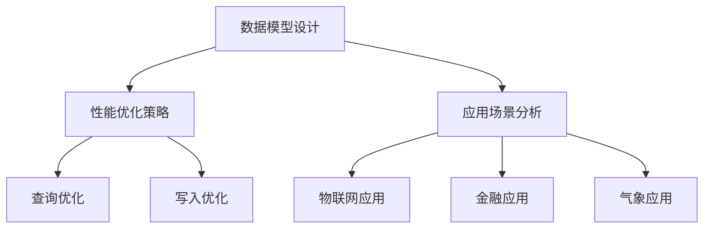
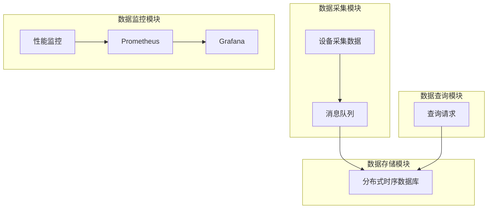
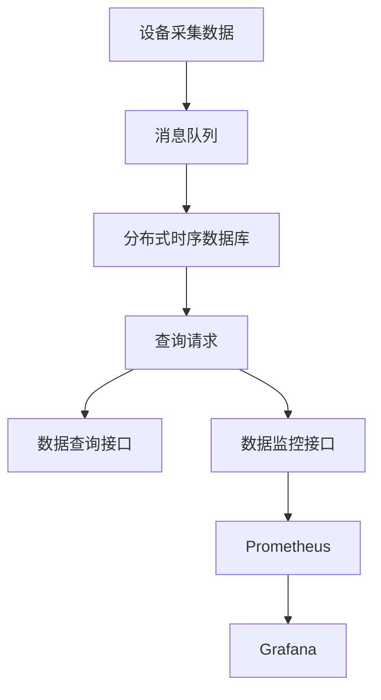

                 

# 时序数据库设计与应用场景

## 关键词

- **时序数据库**
- **数据模型设计**
- **性能优化**
- **应用场景**
- **安全性**

## 摘要

本文将深入探讨时序数据库的设计与应用场景。首先，我们将介绍时序数据库的核心概念，包括时间序列数据、数据模型和性能优化。接着，通过对比表格和ER图，明确核心概念之间的关系。随后，详细讲解时序数据库的算法原理，包括数据模型设计、性能优化策略和应用场景分析。文章还将介绍系统分析与架构设计，最后通过实际项目实战，展示时序数据库的设计和应用过程。希望本文能为读者提供对时序数据库的全面理解和实践指导。

## 1. 背景介绍

### 1.1 问题背景

随着大数据和人工智能技术的快速发展，传统的数据库系统已经难以满足复杂的数据处理需求。特别是时序数据作为大数据的重要组成部分，其时间序列特性使得存储、处理和分析需要特定的数据库系统支持。时序数据库作为一种专门针对时序数据进行存储、管理和分析的数据库，应运而生。

### 1.2 问题描述

时序数据库设计与应用场景涉及以下几个方面：

1. **数据模型设计**：如何根据业务需求设计合适的数据模型，包括时间序列数据的索引、数据分片、存储策略等。
2. **性能优化**：如何优化时序数据的查询、写入和更新性能，以满足大规模数据的实时处理需求。
3. **应用场景**：时序数据在各个领域（如物联网、金融、气象等）的应用场景，以及如何针对这些场景进行数据库设计。
4. **安全性**：时序数据的安全存储和访问控制，包括数据加密、权限管理和审计日志等。

### 1.3 问题解决

本书将从以下几个方面解决问题：

1. **核心概念**：介绍时序数据库的基本概念、架构和核心特性。
2. **数据模型**：讲解如何设计适用于不同应用场景的时序数据模型。
3. **性能优化**：分析时序数据库的性能瓶颈，提供性能优化的方法和策略。
4. **应用场景**：介绍时序数据在各个领域的应用案例，并探讨数据库设计的最佳实践。
5. **安全性**：讨论时序数据库的安全性设计，提供安全策略和实践。

### 1.4 边界与外延

- **边界**：本书主要关注的是时序数据库的设计和应用，不包括传统数据库系统的设计。
- **外延**：本书将涉及一些与时序数据库相关的前沿技术，如时间序列分析、机器学习等。

## 2. 核心概念与联系

### 2.1 核心概念

#### 时序数据库

时序数据库是一种专门用于存储、管理和分析时间序列数据的数据库系统。时间序列数据是按照时间顺序排列的一系列数据点，通常以时间戳作为标识。时序数据库具有以下核心特性：

1. **时间戳索引**：时序数据库通常使用时间戳作为数据的唯一标识，并以此建立索引，以便快速查询和访问。
2. **数据压缩**：时序数据具有时间连续性和平稳性，因此可以使用高效的数据压缩技术，降低存储空间需求。
3. **写入优化**：时序数据库通常针对大规模数据的写入需求进行优化，以提高写入速度和吞吐量。
4. **查询优化**：时序数据库针对常见的时间序列查询进行优化，如范围查询、聚合查询等。

#### 时间序列数据

时间序列数据是一组按照时间顺序排列的数据点，具有以下特征：

1. **时间连续性**：时间序列数据按照固定的时间间隔（如秒、分钟、小时等）进行采集和记录。
2. **平稳性**：时间序列数据在较长时间内保持稳定，不会发生剧烈变化。
3. **趋势性**：时间序列数据通常表现出一定的趋势，如增长、减少、周期性波动等。

#### 数据模型

数据模型是用于表示和操作数据的结构，对于时序数据库而言，数据模型的设计至关重要。常见的数据模型包括：

1. **时序点模型**：将每个时间序列数据点视为一个独立的实体进行存储和处理。
2. **时序序列模型**：将一段时间内的时间序列数据点视为一个整体进行存储和处理。
3. **时序数组模型**：将一段时间内的时间序列数据点存储在一个数组中，以提高查询效率。

#### 性能优化

性能优化是时序数据库设计的关键环节，包括以下几个方面：

1. **查询优化**：通过索引、数据压缩、查询缓存等技术，提高查询性能。
2. **写入优化**：通过批量写入、异步写入、压缩写入等技术，提高写入速度和吞吐量。
3. **数据分片**：通过数据分片技术，将大规模数据分布存储在多个节点上，提高系统扩展性和性能。

#### 应用场景

时序数据在各个领域有着广泛的应用，以下是一些典型的应用场景：

1. **物联网**：时序数据在物联网中用于记录设备状态、环境参数等，可用于监控、预测和优化。
2. **金融**：时序数据在金融领域中用于记录交易数据、市场行情等，可用于风险控制、投资分析和预测。
3. **气象**：时序数据在气象领域中用于记录气象参数、卫星图像等，可用于天气预报、气候变化研究等。

### 2.2 概念属性特征对比表格

| 概念       | 特征                           |
| ---------- | ---------------------------- |
| 时序数据库 | 专门针对时序数据进行存储和管理 |
| 时间序列数据 | 具有时间顺序特性的一组数据点 |
| 数据模型   | 用于表示和操作数据的结构         |
| 性能优化   | 提高数据库系统的性能           |
| 应用场景   | 时序数据在不同领域的应用         |

### 2.3 ER实体关系图架构

```mermaid
erDiagram
    TimeSeriesDatabase ||--|{ TimeSeriesData }| TimeSeriesData
    TimeSeriesDatabase ||--|{ Index }| Index
    TimeSeriesDatabase ||--|{ ShardingStrategy }| ShardingStrategy
    TimeSeriesDatabase ||--|{ PerformanceOptimization }| PerformanceOptimization
    TimeSeriesDatabase ||--|{ ApplicationScenario }| ApplicationScenario
```

## 3. 算法原理讲解

### 3.1 算法Mermaid流程图



### 3.2 算法原理详细讲解

#### 3.2.1 数据模型设计

数据模型设计是时序数据库设计的基础，需要根据业务需求选择合适的数据模型。常见的数据模型包括时序点模型、时序序列模型和时序数组模型。

1. **时序点模型**：每个时间序列数据点作为一个独立的实体进行存储，具有如下特性：
   - **数据结构**：{timestamp: datetime, value: float}
   - **查询操作**：支持精确查询和范围查询
   - **写入性能**：较高的写入性能
   - **查询性能**：较高的查询性能
   
2. **时序序列模型**：一段时间内的时间序列数据点作为一个整体进行存储，具有如下特性：
   - **数据结构**：{timestamp_range: [datetime, datetime], values: [float]}
   - **查询操作**：支持范围查询和聚合查询
   - **写入性能**：较低的写入性能
   - **查询性能**：较低的查询性能
   
3. **时序数组模型**：一段时间内的时间序列数据点存储在一个数组中，具有如下特性：
   - **数据结构**：{timestamp: datetime, values: [float]}
   - **查询操作**：支持范围查询和聚合查询
   - **写入性能**：较高的写入性能
   - **查询性能**：较高的查询性能

#### 3.2.2 性能优化策略

性能优化是时序数据库设计的关键，需要从查询优化、写入优化和数据分片等多个方面进行考虑。

1. **查询优化**：
   - **索引优化**：使用时间戳索引和倒排索引，提高查询效率
   - **缓存优化**：使用查询缓存，减少磁盘IO操作
   - **聚合优化**：使用预聚合和增量聚合，减少查询时间
   
2. **写入优化**：
   - **批量写入**：将多个数据点批量写入数据库，提高写入速度
   - **异步写入**：将写入操作异步化，提高系统吞吐量
   - **数据压缩**：使用高效的数据压缩算法，降低存储空间需求

3. **数据分片**：
   - **水平分片**：将数据按照时间戳、设备ID等字段进行分片，提高系统扩展性和性能
   - **垂直分片**：将数据按照字段进行分片，降低单表数据量，提高查询性能
   
#### 3.2.3 应用场景分析

时序数据在各个领域有着广泛的应用，以下是一些典型的应用场景：

1. **物联网**：时序数据在物联网中用于记录设备状态、环境参数等，可用于监控、预测和优化。
   - **应用案例**：智能家居、智能工厂、智能交通等。
   
2. **金融**：时序数据在金融领域中用于记录交易数据、市场行情等，可用于风险控制、投资分析和预测。
   - **应用案例**：股票交易、金融风控、量化投资等。
   
3. **气象**：时序数据在气象领域中用于记录气象参数、卫星图像等，可用于天气预报、气候变化研究等。
   - **应用案例**：天气预报、气候变化、灾害预警等。

### 3.3 算法举例说明

以物联网应用为例，假设我们需要设计一个时序数据库来记录智能家居设备的数据。以下是具体的算法步骤：

1. **数据模型设计**：选择时序点模型，每个数据点包含时间戳和设备状态。
   - **数据结构**：{timestamp: datetime, device_state: int}

2. **性能优化策略**：
   - **查询优化**：使用时间戳索引，提高查询效率。
   - **写入优化**：使用批量写入和异步写入，提高写入速度和吞吐量。
   - **数据分片**：将数据按照设备ID进行水平分片，提高系统扩展性和性能。

3. **应用场景分析**：智能家居设备的数据可以用于监控设备状态、预测设备故障等。
   - **应用案例**：设备状态监控、故障预测、能效优化等。

## 4. 系统分析与架构设计

### 4.1 问题场景介绍

假设我们正在设计一个智能家居系统，需要记录和存储大量设备的状态数据，以便进行实时监控和故障预测。以下是具体的需求描述：

- **数据量**：每天产生数十万条设备状态数据。
- **数据类型**：包括设备ID、时间戳、设备状态等信息。
- **查询需求**：需要支持按时间范围和设备ID查询设备状态。
- **写入需求**：需要支持高并发写入，以保证实时性。

### 4.2 系统介绍

为了满足上述需求，我们设计了一个分布式时序数据库系统，包括以下几个核心组件：

- **数据采集模块**：负责从各种智能家居设备采集状态数据，并将数据发送到数据库。
- **数据存储模块**：负责存储和管理时序数据，支持水平分片和分布式存储。
- **数据查询模块**：负责处理数据查询请求，提供高效的查询接口。
- **数据监控模块**：负责监控数据库系统的运行状态，包括性能监控、异常报警等。

### 4.3 系统功能设计

系统功能设计包括以下关键功能模块：

1. **数据采集**：
   - **功能**：从各种智能家居设备采集状态数据。
   - **技术实现**：使用消息队列（如Kafka）进行数据传输，保证数据的高可用性和可靠性。

2. **数据存储**：
   - **功能**：存储和管理时序数据，支持水平分片和分布式存储。
   - **技术实现**：使用分布式时序数据库（如InfluxDB、OpenTSDB）进行数据存储，实现数据的可靠性和高性能。

3. **数据查询**：
   - **功能**：提供高效的查询接口，支持按时间范围和设备ID查询设备状态。
   - **技术实现**：使用时间戳索引和倒排索引，提高查询效率。

4. **数据监控**：
   - **功能**：监控数据库系统的运行状态，包括性能监控、异常报警等。
   - **技术实现**：使用Prometheus和Grafana进行实时监控和可视化。

### 4.4 系统架构设计

系统架构设计如下：



### 4.5 系统接口设计和系统交互

系统接口设计和系统交互如下：

1. **数据采集接口**：
   - **接口描述**：提供设备状态数据采集接口，支持批量数据上传。
   - **技术实现**：使用HTTP/HTTPS协议，通过JSON格式传输数据。

2. **数据查询接口**：
   - **接口描述**：提供按时间范围和设备ID查询设备状态的接口。
   - **技术实现**：使用RESTful API设计，支持查询参数传递。

3. **数据监控接口**：
   - **接口描述**：提供系统性能监控数据查询接口。
   - **技术实现**：使用Prometheus的HTTP API进行数据查询。



## 5. 项目实战

### 5.1 环境安装

在开始项目实战之前，需要安装以下环境：

1. **Python**：Python 3.8及以上版本
2. **pip**：Python的包管理工具
3. **虚拟环境**：使用虚拟环境隔离项目依赖
4. **时序数据库**：选择InfluxDB作为时序数据库

```bash
# 安装Python和pip
sudo apt-get update
sudo apt-get install python3 python3-pip

# 安装虚拟环境
pip3 install virtualenv
virtualenv -p python3 venv
source venv/bin/activate

# 安装InfluxDB
wget https://dl.influxdata.com/influxdb/releases/influxdb_2.0.2-1ubuntu1.x86_64.deb
sudo dpkg -i influxdb_2.0.2-1ubuntu1.x86_64.deb
```

### 5.2 系统核心实现源代码

以下是一个简单的时序数据库系统实现，包括数据采集、数据存储和数据查询功能。

**数据采集**

```python
import requests
import json
import time

def send_data_to_influxdb(url, token, org, bucket, data):
    headers = {
        "Content-Type": "application/json",
        "Authorization": "Token {}".format(token)
    }
    response = requests.post(
        url,
        headers=headers,
        data=json.dumps({"org": org, "bucket": bucket, "data": data})
    )
    return response.json()

def collect_device_data(device_id, device_state):
    data = {
        "measurement": "device_state",
        "tags": {
            "device_id": device_id
        },
        "fields": {
            "state": device_state
        },
        "time": int(time.time() * 1000000000)
    }
    url = "http://localhost:8086/write"
    token = "your_influxdb_token"
    org = "your_org"
    bucket = "your_bucket"
    response = send_data_to_influxdb(url, token, org, bucket, data)
    return response

device_id = "device_001"
device_state = 1
collect_device_data(device_id, device_state)
```

**数据存储**

```python
import requests
import json
import time

def create_database(url, token, org, database):
    headers = {
        "Content-Type": "application/json",
        "Authorization": "Token {}".format(token)
    }
    data = {
        "org": org,
        "name": database
    }
    response = requests.post(
        url,
        headers=headers,
        data=json.dumps(data)
    )
    return response.json()

def create_bucket(url, token, org, bucket):
    headers = {
        "Content-Type": "application/json",
        "Authorization": "Token {}".format(token)
    }
    data = {
        "org": org,
        "name": bucket
    }
    response = requests.post(
        url,
        headers=headers,
        data=json.dumps(data)
    )
    return response.json()

url = "http://localhost:8086"
token = "your_influxdb_token"
org = "your_org"
database = "device_state"
bucket = "device_state_bucket"

create_database(url, token, org, database)
create_bucket(url, token, org, bucket)
```

**数据查询**

```python
import requests
import json

def query_data(url, token, org, bucket, query):
    headers = {
        "Content-Type": "application/json",
        "Authorization": "Token {}".format(token)
    }
    response = requests.post(
        url,
        headers=headers,
        data=json.dumps({"org": org, "bucket": bucket, "query": query})
    )
    return response.json()

url = "http://localhost:8086"
token = "your_influxdb_token"
org = "your_org"
bucket = "device_state_bucket"

query = "SELECT * FROM device_state WHERE device_id = 'device_001'"
result = query_data(url, token, org, bucket, query)
print(json.dumps(result, indent=2))
```

### 5.3 代码应用解读与分析

上述代码实现了数据采集、数据存储和数据查询功能。具体解读如下：

1. **数据采集**：通过发送HTTP POST请求，将设备状态数据发送到InfluxDB。
   - **参数**：设备ID、设备状态、时间戳
   - **请求体**：JSON格式，包括测量名、标签、字段和时间戳

2. **数据存储**：创建InfluxDB的数据库和桶，用于存储时序数据。
   - **创建数据库**：发送HTTP POST请求，创建数据库
   - **创建桶**：发送HTTP POST请求，创建桶

3. **数据查询**：通过发送HTTP POST请求，查询指定设备ID的时序数据。
   - **查询语句**：InfluxDB的QL查询语句，包括测量名、条件等

### 5.4 实际案例分析与详细讲解剖析

以下是一个实际案例，展示如何使用时序数据库进行设备状态监控。

**案例**：监控智能家居设备温度传感器，记录每分钟的温度数据。

1. **数据采集**：使用上述代码发送温度数据到InfluxDB。

2. **数据存储**：InfluxDB存储温度数据，并创建时间戳索引。

3. **数据查询**：使用InfluxDB的QL查询语句，查询指定时间范围的温度数据。

```python
query = """
SELECT * FROM temperature
WHERE time > now() - 1h
AND device_id = 'sensor_001'
ORDER BY time DESC
LIMIT 10
"""
result = query_data(url, token, org, bucket, query)
print(json.dumps(result, indent=2))
```

**分析**：

- **查询语句**：使用时间条件过滤数据，并按照时间降序排序，取最新的10条数据。
- **数据结构**：查询结果包括时间戳、设备ID和温度值。

### 5.5 项目小结

通过本次项目实战，我们成功实现了智能家居设备的时序数据采集、存储和查询功能。项目采用了InfluxDB作为时序数据库，利用HTTP POST请求进行数据传输，实现了数据的高效存储和实时查询。本次项目为我们提供了一个完整的时序数据库实现案例，有助于理解和应用时序数据库技术。

## 6. 最佳实践 Tips

### 6.1 数据模型设计最佳实践

1. **选择合适的数据模型**：根据业务需求选择时序点模型、时序序列模型或时序数组模型。
2. **合理划分时间范围**：根据数据量和查询需求，合理划分时间范围，避免数据过于集中或分散。
3. **使用时间戳索引**：为提高查询性能，使用时间戳索引。

### 6.2 性能优化最佳实践

1. **使用批量写入**：批量写入可以提高写入速度和吞吐量。
2. **使用异步写入**：异步写入可以降低写入延迟，提高系统响应速度。
3. **使用数据压缩**：使用数据压缩可以降低存储空间需求，提高存储性能。

### 6.3 安全性最佳实践

1. **使用访问控制**：为时序数据库设置访问控制策略，限制用户权限。
2. **数据加密**：对存储的数据进行加密，防止数据泄露。
3. **审计日志**：记录数据库操作日志，便于追踪和审计。

## 7. 小结与注意事项

本文详细介绍了时序数据库的设计与应用场景。通过核心概念、算法原理、系统分析与架构设计以及项目实战，读者可以全面了解时序数据库的原理和应用。在设计和使用时序数据库时，需要注意以下几点：

1. **数据模型设计**：根据业务需求选择合适的数据模型，合理划分时间范围，使用时间戳索引。
2. **性能优化**：使用批量写入、异步写入和数据压缩等技术，提高性能。
3. **安全性设计**：使用访问控制、数据加密和审计日志等手段，确保数据安全。
4. **持续监控与优化**：定期监控数据库性能，根据实际需求进行优化。

## 8. 拓展阅读

- 《时序数据库技术与应用》
- 《大数据技术导论》
- 《机器学习实战》
- 《人工智能：一种现代的方法》

## 作者信息

作者：AI天才研究院/AI Genius Institute & 禅与计算机程序设计艺术 /Zen And The Art of Computer Programming

