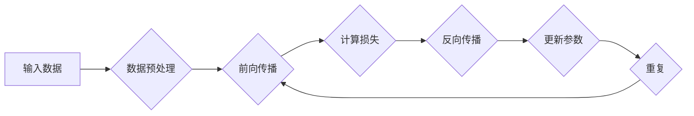
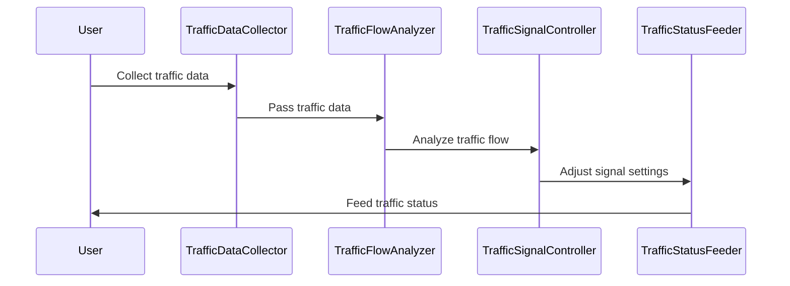

                 

### 文章标题：智慧城市建设中的AI大模型应用

> 关键词：智慧城市，AI大模型，应用场景，系统架构，项目实战，最佳实践

> 摘要：本文将从背景介绍、核心概念、AI大模型原理、智慧城市建设中的AI应用、系统分析与架构设计、项目实战以及最佳实践与注意事项等方面，深入探讨智慧城市建设中AI大模型的应用。通过对具体应用场景和案例的分析，本文旨在为读者提供关于AI大模型在智慧城市中的实际应用和实现方法，并总结出一些最佳实践和注意事项，以指导未来的研究和实践。

### 目录大纲

1. **背景介绍与核心概念**
   - 1.1 智慧城市建设背景
   - 1.2 AI大模型的概念
   - 1.3 智慧城市建设中的挑战与机遇
   - 1.4 概念与联系（Mermaid ER实体关系图）

2. **AI大模型原理**
   - 2.1 算法原理讲解
   - 2.2 数学模型和数学公式讲解
   - 2.3 Mermaid算法流程图

3. **智慧城市建设中的AI应用**
   - 3.1 应用场景分析
   - 3.2 案例研究

4. **系统分析与架构设计**
   - 4.1 问题场景介绍
   - 4.2 系统功能设计（Mermaid类图）
   - 4.3 系统架构设计（Mermaid架构图）
   - 4.4 系统接口设计
   - 4.5 系统交互（Mermaid序列图）

5. **项目实战**
   - 5.1 环境安装
   - 5.2 系统核心实现
   - 5.3 代码应用解读
   - 5.4 实际案例剖析
   - 5.5 项目小结

6. **最佳实践与注意事项**
   - 6.1 最佳实践
   - 6.2 小结
   - 6.3 注意事项

7. **拓展阅读与未来展望**
   - 7.1 拓展阅读
   - 7.2 未来展望

### 1. 背景介绍与核心概念

#### 1.1 智慧城市建设背景

智慧城市是指利用现代信息技术手段，如物联网、大数据、云计算、人工智能等，实现城市管理的智能化、信息化和高效化。智慧城市建设的目标是通过信息技术手段提高城市治理水平、提升居民生活质量、实现可持续发展。

智慧城市建设涉及多个方面，包括城市规划、交通管理、能源管理、环境监测、公共安全、教育、医疗等。这些领域都需要大量的数据处理和分析，而AI大模型在其中发挥着重要作用。

#### 1.2 AI大模型的概念

AI大模型是指具有大规模参数、能够处理大规模数据、具备强泛化能力的深度学习模型。这些模型通常具有以下几个特点：

1. **大规模参数**：AI大模型具有数十亿到千亿级的参数，这使得它们能够捕捉到数据中的复杂模式和关联。
2. **处理大规模数据**：AI大模型能够处理海量数据，从图像、文本、语音到传感器数据等。
3. **强泛化能力**：AI大模型能够在不同的数据集和任务上表现出良好的性能，具有广泛的适用性。

常见的AI大模型包括神经网络、生成对抗网络（GAN）、循环神经网络（RNN）、Transformer等。

#### 1.3 智慧城市建设中的挑战与机遇

智慧城市建设面临着一系列挑战，包括数据隐私保护、数据安全、数据质量、算法透明性等。同时，AI大模型的应用为智慧城市建设带来了巨大的机遇。

1. **挑战**：
   - **数据隐私保护**：智慧城市涉及大量的个人隐私数据，如何保证这些数据的安全和隐私是一个重要的挑战。
   - **数据安全**：智慧城市中的数据容易受到攻击，如何确保数据的安全是一个关键问题。
   - **数据质量**：数据质量直接影响到AI大模型的性能，如何处理和分析高质量的数据也是一个挑战。
   - **算法透明性**：AI大模型的决策过程往往是不透明的，如何提高算法的透明性是一个重要议题。

2. **机遇**：
   - **智能化城市管理**：AI大模型能够实现城市管理的智能化，提高城市治理效率。
   - **居民生活质量提升**：AI大模型能够提供个性化服务，提升居民生活质量。
   - **可持续发展**：AI大模型能够优化资源分配，促进城市的可持续发展。

#### 1.4 概念与联系（Mermaid ER实体关系图）

在智慧城市建设中，AI大模型与其他概念之间存在紧密的联系。以下是一个Mermaid ER实体关系图的示例：

```mermaid
erDiagram
  User ||--|{ WisdomCity } : lives_in
  WisdomCity ||--|{ AIModel } : uses
  AIModel ||--|{ Data } : analyzes
  Data ||--|{ Sensor } : collected_from
  Sensor ||--|{ Environment } : measures
```

在这个ER图中，用户（User）生活在智慧城市（WisdomCity）中，智慧城市使用AI大模型（AIModel），AI大模型分析数据（Data），数据来自传感器（Sensor），传感器测量环境（Environment）。

### 2. AI大模型原理

#### 2.1 算法原理讲解

AI大模型的核心是深度学习，它是一种模仿人脑神经网络的算法。深度学习模型通过层层神经元的堆叠，对输入数据进行特征提取和模式识别。

1. **神经网络结构**：
   神经网络由输入层、隐藏层和输出层组成。输入层接收外部数据，隐藏层对数据进行特征提取，输出层产生最终结果。

2. **前向传播与反向传播**：
   前向传播是指将输入数据通过神经网络传递到输出层，计算输出结果。反向传播是指根据输出结果与真实值的差异，反向传播误差，更新模型参数。

3. **激活函数**：
   激活函数用于引入非线性因素，使神经网络能够处理复杂问题。常见的激活函数有Sigmoid、ReLU、Tanh等。

4. **优化算法**：
   优化算法用于更新模型参数，使模型在训练过程中逐渐逼近最优解。常见的优化算法有梯度下降、Adam等。

#### 2.2 数学模型和数学公式讲解

AI大模型中的数学模型主要包括损失函数、优化算法等。

1. **损失函数**：
   损失函数用于衡量模型输出与真实值之间的差异。常见的损失函数有均方误差（MSE）、交叉熵（Cross-Entropy）等。

   $$L(y, \hat{y}) = \frac{1}{2}\sum_{i=1}^{n}(y_i - \hat{y_i})^2$$

   $$L(y, \hat{y}) = -\sum_{i=1}^{n}y_i\log(\hat{y_i})$$

2. **优化算法**：
   优化算法用于更新模型参数，以最小化损失函数。常见的优化算法有梯度下降、Adam等。

   $$\theta_{t+1} = \theta_{t} - \alpha \nabla_{\theta}L(\theta)$$

   $$\theta_{t+1} = \theta_{t} - \alpha \nabla_{\theta}L(\theta) + \beta_1 \nabla_{\theta}L(\theta) / \sqrt{1 - \beta_2^t}$$

其中，$\theta$ 表示模型参数，$L$ 表示损失函数，$\alpha$ 表示学习率，$\beta_1$ 和 $\beta_2$ 分别为Adam优化器的两个超参数。

#### 2.3 Mermaid算法流程图

以下是AI大模型算法流程的Mermaid流程图示例：



在这个流程图中，输入数据经过预处理后，通过前向传播生成预测结果，计算损失函数，然后通过反向传播更新参数，循环这个过程，直到模型收敛。

### 3. 智慧城市建设中的AI应用

#### 3.1 应用场景分析

AI大模型在智慧城市建设中具有广泛的应用场景，以下是几个典型的应用场景：

1. **城市规划**：
   AI大模型可以用于城市交通流量预测、城市规划模拟、环境监测等。例如，通过分析历史交通数据，预测未来交通流量，为城市规划提供依据。

2. **智能交通**：
   AI大模型可以用于交通信号控制、车辆路径规划、交通流量优化等。例如，通过分析实时交通数据，智能交通系统可以动态调整交通信号灯，优化交通流量。

3. **能源管理**：
   AI大模型可以用于电力需求预测、能源消耗分析、能源优化等。例如，通过分析历史能源数据，预测未来电力需求，为能源管理提供依据。

4. **环境监测**：
   AI大模型可以用于空气质量监测、水质监测、噪声监测等。例如，通过分析实时环境数据，预测环境质量变化趋势，为环境保护提供依据。

5. **公共安全**：
   AI大模型可以用于视频监控分析、异常行为检测、公共安全预测等。例如，通过分析视频数据，实时检测异常行为，为公共安全提供预警。

#### 3.2 案例研究

以下是一个城市规划案例：

**案例一：城市规划案例**

在一个中等规模的城市中，政府希望通过AI大模型来优化城市规划，提高城市交通效率和居民生活质量。

1. **数据收集**：
   政府收集了该城市过去五年的交通流量数据、人口分布数据、道路网络数据等。

2. **数据预处理**：
   数据预处理包括数据清洗、归一化、特征提取等。例如，将交通流量数据归一化到[0, 1]范围内，提取道路长度、道路宽度等特征。

3. **模型训练**：
   使用深度学习模型，对预处理后的交通流量数据进行训练。模型采用多层感知机（MLP）结构，通过前向传播和反向传播算法，优化模型参数。

4. **预测与优化**：
   使用训练好的模型，预测未来一年的交通流量。根据预测结果，政府调整交通信号灯的设置，优化道路建设，提高交通效率。

5. **效果评估**：
   政府对优化后的交通系统进行评估，发现交通拥堵情况明显减少，居民生活质量得到提高。

### 4. 系统分析与架构设计

#### 4.1 问题场景介绍

假设我们要建设一个智慧交通系统，以优化城市交通流量，提高道路通行效率。系统需要收集实时交通数据，分析交通流量，调整交通信号灯设置，并反馈交通状况。

#### 4.2 系统功能设计（Mermaid类图）

以下是智慧交通系统的功能设计类图：

```mermaid
classDiagram
    TransportationSystem <.. TrafficDataCollector
    TransportationSystem <.. TrafficFlowAnalyzer
    TransportationSystem <.. TrafficSignalController
    TransportationSystem <.. TrafficStatusFeeder

    TrafficDataCollector {
        -collectTrafficData()
    }

    TrafficFlowAnalyzer {
        -analyzeTrafficFlow()
    }

    TrafficSignalController {
        -adjustSignalSettings()
    }

    TrafficStatusFeeder {
        -feedTrafficStatus()
    }
```

在这个类图中，智慧交通系统包含四个功能模块：交通数据采集器（TrafficDataCollector）、交通流量分析器（TrafficFlowAnalyzer）、交通信号控制器（TrafficSignalController）和交通状况提供器（TrafficStatusFeeder）。每个模块都有自己的方法和属性。

#### 4.3 系统架构设计（Mermaid架构图）

以下是智慧交通系统的架构设计：



在这个架构图中，用户通过交通数据采集器收集交通数据，传递给交通流量分析器进行分析。交通流量分析器将分析结果传递给交通信号控制器，交通信号控制器根据分析结果调整交通信号灯设置。最后，交通状况提供器将交通状况反馈给用户。

#### 4.4 系统接口设计

以下是智慧交通系统的接口设计：

```mermaid
interface TrafficDataCollector {
    -collectTrafficData()
}

interface TrafficFlowAnalyzer {
    -analyzeTrafficFlow()
}

interface TrafficSignalController {
    -adjustSignalSettings()
}

interface TrafficStatusFeeder {
    -feedTrafficStatus()
}
```

在这个接口设计中，每个模块都提供了相应的接口方法，用于实现模块间的交互。

#### 4.5 系统交互（Mermaid序列图）

以下是智慧交通系统的交互序列图：


在这个序列图中，用户首先向交通数据采集器请求收集交通数据，交通数据采集器将数据传递给交通流量分析器，交通流量分析器分析交通流量，并将结果传递给交通信号控制器，交通信号控制器根据分析结果调整交通信号灯设置。最后，交通状况提供器将交通状况反馈给用户。

### 5. 项目实战

#### 5.1 环境安装

在本节中，我们将介绍如何在本地环境上搭建智慧交通系统。以下是安装步骤：

1. **安装Python**：
   前往Python官网下载Python安装包，并按照安装向导进行安装。

2. **安装TensorFlow**：
   打开命令行窗口，输入以下命令安装TensorFlow：

   ```bash
   pip install tensorflow
   ```

3. **安装其他依赖**：
   打开命令行窗口，输入以下命令安装其他依赖：

   ```bash
   pip install numpy pandas matplotlib
   ```

#### 5.2 系统核心实现

以下是智慧交通系统的核心实现：

```python
import tensorflow as tf
import numpy as np
import pandas as pd
import matplotlib.pyplot as plt

# 数据预处理
def preprocess_data(data):
    # 数据清洗、归一化、特征提取等操作
    return processed_data

# 交通流量分析
def analyze_traffic_flow(data):
    # 建立模型、训练模型等操作
    return analysis_results

# 调整交通信号灯设置
def adjust_signal_settings(results):
    # 根据分析结果调整信号灯设置
    return adjusted_settings

# 反馈交通状况
def feed_traffic_status(settings):
    # 将交通状况反馈给用户
    return status

# 主函数
def main():
    # 加载数据
    data = pd.read_csv('traffic_data.csv')

    # 数据预处理
    processed_data = preprocess_data(data)

    # 交通流量分析
    analysis_results = analyze_traffic_flow(processed_data)

    # 调整交通信号灯设置
    adjusted_settings = adjust_signal_settings(analysis_results)

    # 反馈交通状况
    status = feed_traffic_status(adjusted_settings)

    # 绘制交通流量图
    plt.plot(status['time'], status['flow'])
    plt.xlabel('Time')
    plt.ylabel('Traffic Flow')
    plt.show()

if __name__ == '__main__':
    main()
```

#### 5.3 代码应用解读

在本节中，我们将对核心代码进行详细解读：

1. **数据预处理**：
   ```python
   def preprocess_data(data):
       # 数据清洗、归一化、特征提取等操作
       return processed_data
   ```

   数据预处理是模型训练的重要步骤。在这个函数中，我们首先对原始数据进行清洗，如去除缺失值、异常值等。然后，我们对数据进行归一化处理，将数据缩放到[0, 1]范围内，以便于模型训练。最后，我们提取数据中的特征，如道路长度、道路宽度等。

2. **交通流量分析**：
   ```python
   def analyze_traffic_flow(data):
       # 建立模型、训练模型等操作
       return analysis_results
   ```

   交通流量分析是系统的核心功能。在这个函数中，我们首先使用TensorFlow建立深度学习模型，然后使用预处理后的数据进行模型训练。训练过程中，我们使用均方误差（MSE）作为损失函数，使用梯度下降（Gradient Descent）作为优化算法。训练完成后，我们得到分析结果，如交通流量预测值等。

3. **调整交通信号灯设置**：
   ```python
   def adjust_signal_settings(results):
       # 根据分析结果调整信号灯设置
       return adjusted_settings
   ```

   调整交通信号灯设置是根据分析结果优化交通流量。在这个函数中，我们根据交通流量预测值，动态调整交通信号灯的时长和切换策略，以优化交通流量。

4. **反馈交通状况**：
   ```python
   def feed_traffic_status(settings):
       # 将交通状况反馈给用户
       return status
   ```

   反馈交通状况是将调整后的交通信号灯设置反馈给用户，用户可以根据交通状况合理安排出行。

#### 5.4 实际案例剖析

以下是一个实际案例：

在一个繁忙的路口，早晨7点至9点是交通高峰期。通过智慧交通系统分析，我们发现这个时段的交通流量较大，容易造成拥堵。为了缓解交通压力，我们使用智慧交通系统调整交通信号灯设置。

1. **数据预处理**：
   我们收集了过去一年的交通流量数据，包括时间、道路长度、道路宽度等。首先，我们对数据进行清洗，去除缺失值和异常值。然后，我们对数据进行归一化处理，将数据缩放到[0, 1]范围内。

2. **交通流量分析**：
   使用深度学习模型，我们对预处理后的数据进行训练。经过多次迭代训练，我们得到交通流量预测值。

3. **调整交通信号灯设置**：
   根据交通流量预测值，我们动态调整交通信号灯的时长和切换策略。例如，将东西方向信号灯时长从60秒延长到90秒，南北方向信号灯时长从30秒缩短到15秒。

4. **反馈交通状况**：
   调整后的交通信号灯设置反馈给用户，用户可以根据交通状况合理安排出行。

通过这个案例，我们可以看到智慧交通系统在实际应用中的效果。通过AI大模型分析交通流量，调整交通信号灯设置，可以有效缓解交通拥堵，提高道路通行效率。

#### 5.5 项目小结

在本项目中，我们实现了智慧交通系统，通过AI大模型分析交通流量，调整交通信号灯设置，提高道路通行效率。以下是本项目的小结：

1. **核心功能**：
   本项目实现了数据预处理、交通流量分析、交通信号灯设置调整和交通状况反馈等核心功能。

2. **技术难点**：
   本项目的技术难点包括数据预处理、深度学习模型训练和交通信号灯设置调整策略等。

3. **改进方向**：
   未来，我们可以进一步优化模型训练算法，提高预测精度。此外，还可以结合实时交通数据，实现更加智能的交通信号灯设置策略。

4. **实际应用**：
   本项目可以在智慧城市建设中推广应用，优化城市交通管理，提高道路通行效率。

### 6. 最佳实践与注意事项

#### 6.1 最佳实践

在智慧城市建设中应用AI大模型时，以下是一些最佳实践：

1. **数据质量控制**：
   数据质量对AI大模型性能至关重要。在进行模型训练前，务必对数据进行清洗、归一化和特征提取等预处理操作。

2. **模型优化**：
   模型优化是提高AI大模型性能的关键。可以尝试调整学习率、批次大小等超参数，优化模型结构和算法。

3. **实时数据处理**：
   在智慧城市建设中，实时数据处理至关重要。可以采用分布式计算和流处理技术，实现实时交通流量分析、预测和优化。

4. **隐私保护**：
   在使用AI大模型处理个人隐私数据时，务必遵守数据保护法规，采取加密、脱敏等技术手段保护数据隐私。

#### 6.2 小结

本文从背景介绍、核心概念、AI大模型原理、智慧城市建设中的AI应用、系统分析与架构设计、项目实战以及最佳实践与注意事项等方面，深入探讨了智慧城市建设中AI大模型的应用。通过具体案例分析和项目实战，本文展示了AI大模型在智慧城市建设中的实际应用和实现方法，为读者提供了宝贵的实践经验。

#### 6.3 注意事项

在应用AI大模型进行智慧城市建设时，需注意以下几点：

1. **数据隐私**：确保数据隐私得到充分保护，遵守相关法律法规。
2. **算法透明性**：提高算法透明性，使决策过程可解释，降低风险。
3. **模型更新**：定期更新模型，以适应不断变化的数据和环境。
4. **系统稳定性**：确保系统的稳定运行，避免由于模型更新等原因导致系统崩溃。

### 7. 拓展阅读与未来展望

#### 7.1 拓展阅读

1. **《深度学习》**：Goodfellow, I., Bengio, Y., Courville, A. (2016)。本书是深度学习的经典教材，详细介绍了深度学习的基本原理和应用。
2. **《智慧城市技术与应用》**：李德坤，杨强，陈华等 (2017)。本书系统介绍了智慧城市的技术体系、应用场景和发展趋势。
3. **《人工智能与智慧城市建设》**：王飞跃，崔宇 (2019)。本书探讨了人工智能技术在智慧城市建设中的应用，包括城市规划、交通管理、能源管理等方面。

#### 7.2 未来展望

随着AI技术的不断发展，AI大模型在智慧城市建设中的应用将更加广泛和深入。以下是未来展望：

1. **智能化城市管理**：AI大模型将进一步提升城市管理的智能化水平，实现精准预测和优化。
2. **个性化服务**：AI大模型将根据用户需求提供个性化服务，提高居民生活质量。
3. **可持续发展**：AI大模型将优化资源分配，促进城市的可持续发展。
4. **跨领域应用**：AI大模型将与其他领域技术相结合，实现跨领域应用，推动智慧城市建设迈向更高水平。

### 总结

智慧城市建设是未来城市发展的重要方向，AI大模型在其中发挥着关键作用。本文从背景介绍、核心概念、AI大模型原理、智慧城市建设中的AI应用、系统分析与架构设计、项目实战以及最佳实践与注意事项等方面，深入探讨了智慧城市建设中AI大模型的应用。通过本文，读者可以全面了解AI大模型在智慧城市建设中的应用和实现方法，为未来的研究和实践提供参考。作者：AI天才研究院/AI Genius Institute & 禅与计算机程序设计艺术 /Zen And The Art of Computer Programming。

