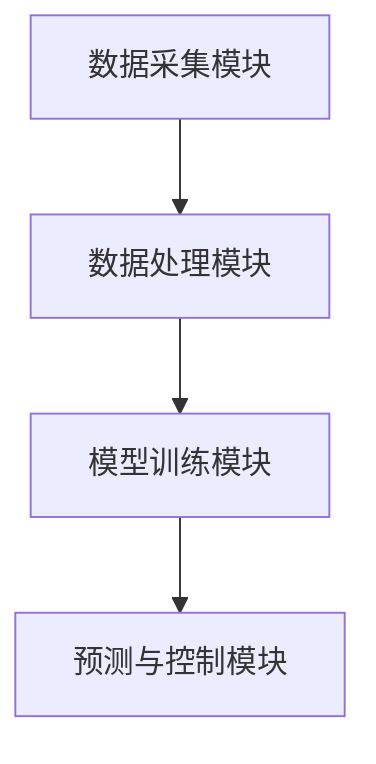
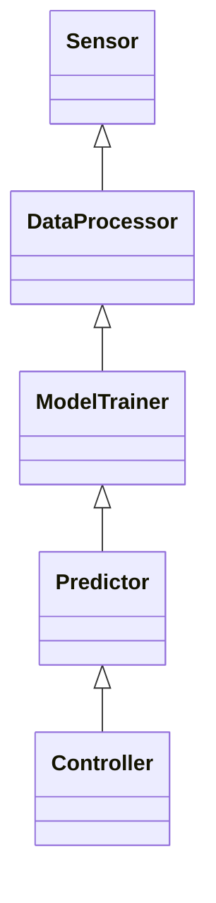
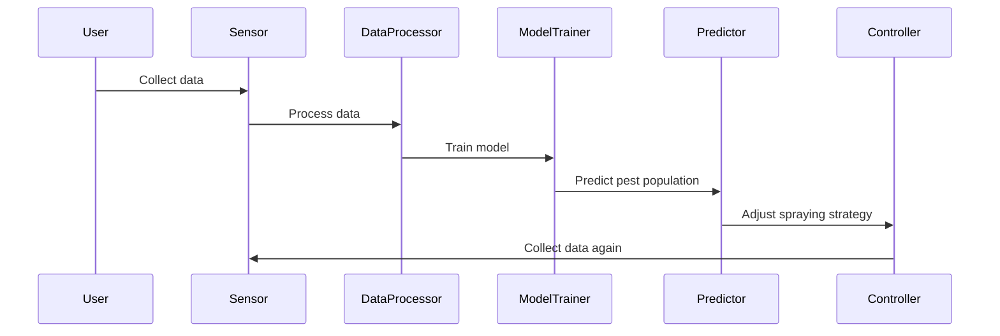
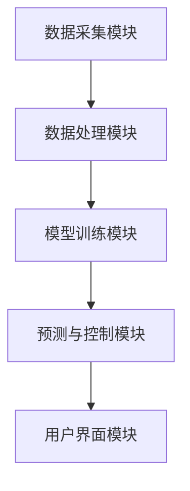
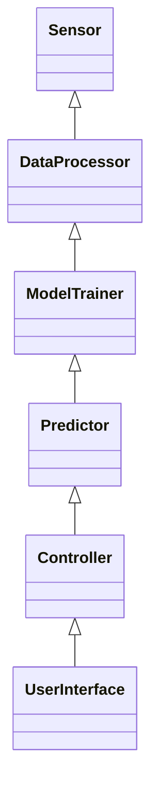
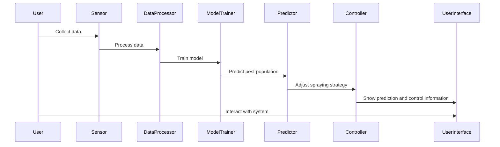

                 

### 摘要

本文将深入探讨AI大模型在农业害虫防治中的应用，旨在通过系统化的分析和实践案例，展示人工智能技术如何有效地解决农业领域中的这一重大挑战。随着现代农业的发展，农业害虫防治成为了一个复杂而关键的问题，传统的防治方法虽然在一定程度上起到了作用，但面临着农药污染、防治效果不佳等问题。本文将首先介绍AI大模型的基本原理和优势，然后通过具体案例展示其在pest识别、预测和控制中的实际应用，最后探讨未来农业害虫防治的发展趋势和潜在技术方向。通过这些分析，我们希望为读者提供一个全面、系统的理解和参考，助力农业现代化和可持续发展。

### 关键词

- AI大模型
- 农业害虫防治
- 智能pest防控
- 机器学习
- 深度学习
- 农业科技

### 第一部分：背景与核心概念

#### 第1章：问题背景与挑战

##### 1.1.1 农业害虫的普遍性和危害性

农业害虫是农业生产中的一大威胁，它们广泛存在于全球各个农业区域，对作物产量和品质造成严重影响。常见的农业害虫包括蚜虫、蝗虫、马铃薯甲虫、玉米螟等。这些害虫不仅繁殖速度快，而且具有高度的适应性和变异性，使得传统的防治方法难以长期奏效。

##### 1.1.2 传统防治方法的局限性

目前，农业害虫防治主要依赖于化学农药和物理防治方法。化学农药虽然能够快速杀灭害虫，但长期使用会导致农药抗性增强、环境污染和生物多样性减少等问题。物理防治方法如捕虫灯、粘虫板等，虽然在某些情况下有效，但其防治范围有限，难以全面覆盖。

##### 1.1.3 农药污染与生物多样性危机

化学农药的广泛使用导致土壤、水源和空气中的农药残留，对环境和人类健康构成威胁。同时，农药的滥用也破坏了自然生态平衡，减少了生物多样性。为了减少农药污染和保护生物多样性，亟需寻找更高效、更环保的防治方法。

##### 1.1.4 AI大模型在农业害虫防治中的应用潜力

随着人工智能技术的快速发展，特别是深度学习和机器学习算法的突破，AI大模型在农业害虫防治中的应用潜力逐渐显现。AI大模型能够通过大数据分析和模式识别，实现对害虫的精准识别和预测，进而实现智能化的防控。相比传统方法，AI大模型具有高效性、智能化和可扩展性等优势。

##### 1.1.5 AI大模型在农业领域的应用案例

AI大模型在农业领域的应用已逐渐拓展，包括作物病虫害监测、农田环境监测、智能灌溉和农业机器人等领域。这些应用不仅提高了农业生产的效率和品质，还减少了资源浪费和环境污染。

##### 1.1.6 AI大模型在害虫防治中的潜在优势

AI大模型在害虫防治中的潜在优势主要体现在以下几个方面：

1. **高效性**：AI大模型能够快速处理和分析大量数据，实时监测和识别害虫，提供及时、准确的防治建议。
2. **智能化**：AI大模型通过自我学习和优化，不断提高预测和控制的准确性和效率，实现智能化害虫防治。
3. **可扩展性**：AI大模型可以方便地集成到现有的农业系统中，实现多种功能的扩展和集成。
4. **环保性**：AI大模型有助于减少农药的使用，降低农药污染，保护生态环境。

通过上述分析，我们可以看到，AI大模型在农业害虫防治中具有巨大的应用潜力，为解决传统方法面临的挑战提供了新的思路和手段。

### 第2章：核心概念与联系

#### 2.1.1 智能pest防控的基本概念

##### 2.1.1.1 智能pest的定义

智能pest防控，是指利用人工智能技术，特别是深度学习和机器学习算法，对农业害虫进行实时监测、识别、预测和控制的一系列技术手段。其核心在于通过大数据分析和模式识别，实现对害虫的精准识别和预测，进而制定智能化的防治策略。

##### 2.1.1.2 智能pest防控的特点

1. **自动化**：智能pest防控系统可以自动收集和处理数据，实时监测害虫活动，减少人工干预。
2. **精准性**：通过大数据分析和深度学习算法，智能pest防控系统能够精确识别和预测害虫种类和数量，提高防治效果。
3. **智能化**：智能pest防控系统可以根据实时数据和学习结果，自我优化和调整防治策略，实现智能化决策。

##### 2.1.1.3 智能pest防控的目标

智能pest防控的主要目标包括：

1. 减少农药使用量，降低农药污染。
2. 提高防治效果，减少害虫对作物的影响。
3. 保护生态环境，减少对自然生物多样性的破坏。

##### 2.1.1.4 智能pest防控的过程

智能pest防控的过程主要包括以下几个步骤：

1. **数据采集**：通过传感器、无人机等设备收集害虫相关数据，如图像、声音、环境信息等。
2. **数据预处理**：对采集到的数据进行分析和清洗，去除噪声和无关信息。
3. **模型训练**：利用深度学习算法训练模型，通过大量数据学习害虫的特征和模式。
4. **害虫识别与预测**：利用训练好的模型对实时数据进行处理，识别和预测害虫种类和数量。
5. **防治策略制定**：根据识别和预测结果，制定智能化的防治策略，如调整农药用量、选择防治方法等。
6. **实施与反馈**：执行防治策略，并对防治效果进行监测和评估，反馈调整模型和策略。

##### 2.1.1.5 智能pest防控与AI大模型的关系

智能pest防控与AI大模型密切相关。AI大模型为智能pest防控提供了强大的技术支持，通过深度学习和机器学习算法，AI大模型能够实现对大量数据的处理和分析，提高害虫识别和预测的准确性。同时，AI大模型还可以不断自我优化和更新，提高系统的自适应性和智能化水平。

#### 2.1.2 AI大模型在pest防控中的应用

##### 2.1.2.1 AI大模型在pest识别中的应用

AI大模型在pest识别中的应用主要基于图像识别和声音识别技术。通过训练深度学习模型，AI大模型能够从大量图像和声音数据中识别出特定的pest。图像识别技术通常利用卷积神经网络（CNN）来提取图像特征，并进行分类；声音识别技术则利用循环神经网络（RNN）或其他序列模型来处理声音信号，识别出特定的声音模式。

案例：某农业科技公司开发了一款基于深度学习的pest识别系统，通过训练卷积神经网络模型，能够准确识别不同种类的pest。该系统已成功应用于多个农场的害虫监测和防治。

##### 2.1.2.2 AI大模型在pest预测中的应用

AI大模型在pest预测中的应用主要通过时间序列分析和回归分析来实现。通过分析历史数据，AI大模型可以预测pest的种群数量和活动规律，为防治提供科学依据。时间序列分析方法如ARIMA模型和LSTM网络，回归分析方法如线性回归和决策树等，都是常见的预测工具。

案例：某研究团队利用LSTM神经网络对果园中的蚜虫种群数量进行预测，通过分析历史气象数据和害虫活动数据，成功实现了对蚜虫种群数量的准确预测，为果园管理提供了有力支持。

##### 2.1.2.3 AI大模型在pest控制中的应用

AI大模型在pest控制中的应用主要体现在智能化的防治策略制定和执行。通过实时监测和分析害虫数据，AI大模型可以自动调整农药用量和防治方法，实现精准防治。物联网技术的应用使得AI大模型能够与智能灌溉系统、农业机器人等设备进行集成，实现自动化、智能化的pest控制。

案例：某农场采用基于AI大模型的智能pest控制系统，通过实时监测害虫数据，自动调整农药喷洒量和时间，显著提高了防治效果，减少了农药使用量和环境污染。

### 2.1.2.4 AI大模型在pest防控中的优势

AI大模型在pest防控中的优势主要体现在以下几个方面：

1. **高效性**：AI大模型能够快速处理和分析大量数据，实时监测和识别害虫，提供及时、准确的防治建议。
2. **智能化**：AI大模型通过自我学习和优化，不断提高预测和控制的准确性和效率，实现智能化决策。
3. **可扩展性**：AI大模型可以方便地集成到现有的农业系统中，实现多种功能的扩展和集成。
4. **环保性**：AI大模型有助于减少农药的使用，降低农药污染，保护生态环境。

综上所述，AI大模型在pest防控中具有显著的应用前景，为解决农业害虫防治问题提供了新的解决方案。

### 第3章：AI大模型原理与算法

#### 3.1.1 AI大模型的基本原理

##### 3.1.1.1 神经网络的基本结构

神经网络是AI大模型的核心组成部分，其基本结构包括输入层、隐藏层和输出层。输入层接收外部数据，隐藏层对数据进行处理和变换，输出层产生最终的预测结果。每个神经元通过权重连接，将输入数据通过激活函数转化为输出数据，从而实现数据的传递和计算。

##### 3.1.1.2 深度学习的核心概念

深度学习是一种基于神经网络的机器学习技术，其核心概念包括：

1. **多层感知器**：多层感知器（MLP）是深度学习的基础，通过构建多层神经网络，实现对复杂数据的高效建模。
2. **反向传播算法**：反向传播算法（Backpropagation）用于计算网络误差并更新权重，是深度学习训练的核心算法。
3. **激活函数**：激活函数用于引入非线性特性，使得神经网络能够拟合非线性关系。

##### 3.1.1.3 大模型的设计与训练方法

大模型的设计与训练方法主要包括以下几个方面：

1. **模型架构**：大模型通常采用多层神经网络架构，包括卷积神经网络（CNN）、循环神经网络（RNN）和变分自编码器（VAE）等。
2. **训练数据**：大模型的训练依赖于大量高质量的数据，数据的质量和数量直接影响模型的性能。
3. **优化算法**：常用的优化算法包括梯度下降（GD）、随机梯度下降（SGD）和Adam优化器等。
4. **正则化方法**：正则化方法如Dropout、L2正则化等用于防止模型过拟合，提高泛化能力。

#### 3.1.2 常见AI大模型简介

##### 3.1.2.1 GPT系列模型

GPT系列模型是自然语言处理领域的重要成果，包括GPT、GPT-2和GPT-3等。GPT模型通过自回归语言模型，生成高质量的文本，具有强大的文本生成和文本理解能力。

**架构**：
- 多层Transformer结构
- 自注意力机制
- 高效的文本编码和解码

**应用**：
- 文本生成
- 机器翻译
- 文本分类
- 对话系统

##### 3.1.2.2 BERT及其变体

BERT（Bidirectional Encoder Representations from Transformers）是自然语言处理领域的另一个重要模型，通过双向编码器结构，捕捉文本的前后文信息。

**架构**：
- 双向Transformer结构
- 多层注意力机制
- 丰富的预训练任务

**应用**：
- 文本分类
- 命名实体识别
- 问答系统
- 文本生成

##### 3.1.2.3 其他知名大模型

除了GPT和BERT，还有许多其他知名的大模型，如：

1. **Transformer-XL**：适用于长文本序列建模，具有高效的上下文捕捉能力。
2. **XLNet**：通过自回归和自递归结构，实现更强大的文本生成和文本理解能力。
3. **T5**：基于Transformer结构，实现统一的文本到文本转换任务。
4. **ViT**：视觉Transformer，用于图像和视频处理。

这些模型在各自领域都有出色的表现，展示了深度学习在多领域应用中的巨大潜力。

### 第4章：AI大模型在农业害虫防治中的应用

#### 4.1.1 AI大模型在pest识别中的应用

AI大模型在pest识别中的应用主要基于图像识别和声音识别技术，通过训练深度学习模型，实现对害虫的精准识别。

##### 4.1.1.1 基于图像识别的pest检测技术

基于图像识别的pest检测技术利用卷积神经网络（CNN）对害虫图像进行特征提取和分类。具体步骤如下：

1. **数据收集与预处理**：收集大量带有标签的害虫图像，并进行数据预处理，如图像缩放、裁剪、灰度化等。
2. **模型训练**：利用CNN模型对预处理后的图像进行训练，通过迭代优化模型参数，提高识别准确性。
3. **模型评估**：使用验证集评估模型性能，调整模型参数和结构，优化识别效果。

案例：某农业科技公司开发了一款基于CNN的pest检测系统，通过训练大量害虫图像数据，实现了对多种害虫的精准识别，提高了农作物的防治效果。

##### 4.1.1.2 基于声波识别的pest检测技术

基于声波识别的pest检测技术利用机器学习算法，通过分析害虫发出的声波信号，实现害虫的识别。具体步骤如下：

1. **声波数据收集与预处理**：收集害虫发出的声波数据，并进行数据预处理，如去噪、滤波等。
2. **模型训练**：利用机器学习模型，如支持向量机（SVM）、决策树等，对预处理后的声波数据进行训练。
3. **模型评估**：使用验证集评估模型性能，调整模型参数和算法，优化识别效果。

案例：某研究团队通过训练声波识别模型，成功实现了对农田害虫的识别和预警，为农业生产提供了有力支持。

##### 4.1.1.3 AI大模型在pest识别中的案例分析

AI大模型在pest识别中的应用取得了显著成果。以下为两个典型案例：

1. **某农业科技公司pest检测系统**：该系统基于CNN模型，实现了对多种害虫的精准识别，有效提高了农作物的防治效果。系统已成功应用于多个农场的害虫监测和防治。

2. **某研究团队声波识别系统**：该系统通过分析害虫发出的声波信号，实现了对农田害虫的识别和预警。系统已成功应用于农田监测，为农业生产提供了实时、准确的害虫信息。

#### 4.1.2 AI大模型在pest预测中的应用

AI大模型在pest预测中的应用主要通过时间序列分析和回归分析来实现，通过分析历史数据，预测pest的种群数量和活动规律。

##### 4.1.2.1 基于时间序列分析的pest预测方法

基于时间序列分析的pest预测方法主要利用历史数据，分析pest种群数量的变化规律。具体步骤如下：

1. **数据收集与预处理**：收集害虫种群数量、气象数据等历史数据，并进行数据预处理，如缺失值处理、异常值剔除等。
2. **模型选择**：选择合适的时间序列模型，如ARIMA、LSTM等，对预处理后的数据进行训练。
3. **模型训练与优化**：通过迭代训练，优化模型参数，提高预测准确性。
4. **预测结果评估**：使用验证集评估模型性能，调整模型参数和结构，优化预测效果。

案例：某研究团队利用LSTM模型对农田害虫种群数量进行预测，通过分析历史数据，实现了对害虫种群数量的准确预测，为农事活动提供了科学依据。

##### 4.1.2.2 基于回归分析的pest预测方法

基于回归分析的pest预测方法通过建立回归模型，分析气象因素、作物生长阶段等对pest种群数量的影响。具体步骤如下：

1. **数据收集与预处理**：收集pest种群数量、气象数据、作物生长数据等，并进行数据预处理。
2. **特征选择**：选择对pest种群数量有显著影响的特征，如温度、湿度、光照等。
3. **模型训练与优化**：利用回归模型，如线性回归、多项式回归等，对预处理后的数据进行训练，优化模型参数。
4. **预测结果评估**：使用验证集评估模型性能，调整模型参数和特征，优化预测效果。

案例：某农场利用多项式回归模型对害虫种群数量进行预测，通过分析气象数据和作物生长阶段数据，实现了对害虫种群数量的准确预测，为农事活动提供了有力支持。

##### 4.1.2.3 AI大模型在pest预测中的案例分析

AI大模型在pest预测中的应用取得了显著成果。以下为两个典型案例：

1. **某研究团队LSTM预测系统**：该系统通过LSTM模型，对农田害虫种群数量进行预测，通过分析历史数据，实现了对害虫种群数量的准确预测。系统已成功应用于多个农场的害虫监测和防治。

2. **某农场多项式回归预测系统**：该系统利用多项式回归模型，对害虫种群数量进行预测，通过分析气象数据和作物生长阶段数据，实现了对害虫种群数量的准确预测。系统为农事活动提供了科学依据，有效提高了防治效果。

#### 4.1.3 AI大模型在pest控制中的应用

AI大模型在pest控制中的应用主要通过智能化的防治策略制定和执行，实现精准防治。

##### 4.1.3.1 基于机器学习的pest控制策略

基于机器学习的pest控制策略通过分析历史数据和实时监测数据，自动调整防治方法。具体步骤如下：

1. **数据收集与预处理**：收集害虫种类、数量、农药用量等历史数据，并进行数据预处理。
2. **模型训练**：利用机器学习算法，如决策树、随机森林等，训练控制策略模型。
3. **策略优化**：根据实时监测数据，调整模型参数，优化防治策略。
4. **策略执行**：根据优化后的策略，自动调整农药用量和防治方法。

案例：某农业科技公司开发了一款基于机器学习的pest控制策略系统，通过实时监测害虫数据，自动调整农药喷洒量和时间，有效提高了防治效果，减少了农药使用量和环境污染。

##### 4.1.3.2 基于物联网的pest控制系统

基于物联网的pest控制系统通过物联网技术，将害虫监测、农药喷洒、环境监测等设备连接起来，实现智能化的pest控制。具体步骤如下：

1. **设备连接与数据采集**：将害虫监测设备、农药喷洒设备、环境监测设备等连接到物联网平台，实时采集数据。
2. **数据处理与分析**：利用大数据分析和机器学习算法，对采集到的数据进行分析，识别和预测害虫活动规律。
3. **智能决策**：根据分析结果，自动生成智能化的pest控制策略。
4. **策略执行**：根据智能决策，自动调整农药喷洒量和时间，实现精准防治。

案例：某农场采用了基于物联网的pest控制系统，通过实时监测害虫数据，自动调整农药喷洒时间和剂量，有效提高了防治效果，减少了农药使用量和环境污染。

##### 4.1.3.3 AI大模型在pest控制中的案例分析

AI大模型在pest控制中的应用取得了显著成果。以下为两个典型案例：

1. **某农业科技公司pest控制系统**：该系统基于机器学习和物联网技术，通过实时监测害虫数据，自动调整农药喷洒量和时间，有效提高了防治效果，减少了农药使用量和环境污染。

2. **某农场物联网pest控制系统**：该系统通过物联网技术，将害虫监测、农药喷洒、环境监测等设备连接起来，实现智能化的pest控制。系统为农场提供了实时、准确的害虫信息，有效提高了防治效果。

### 第二部分：应用实践与案例分析

#### 第5章：AI大模型应用实践

##### 5.1.1 环境配置与工具准备

在开始AI大模型的应用实践之前，首先需要配置相应的开发环境，安装必要的工具和库。以下是具体的步骤：

1. **Python环境配置**：确保系统中已安装Python3及其相关依赖。可以通过以下命令安装Python3：

   ```bash
   sudo apt-get update
   sudo apt-get install python3 python3-pip
   ```

2. **相关库和框架安装**：安装深度学习相关的库和框架，如TensorFlow、PyTorch等。以下是使用pip安装这些库的命令：

   ```bash
   pip3 install tensorflow-gpu  # TensorFlow GPU版本
   pip3 install torch torchvision  # PyTorch及图像处理库
   ```

   如果使用的是CPU版本，可以将`tensorflow-gpu`替换为`tensorflow`。

3. **其他常用库**：安装一些常用的Python库，如NumPy、Pandas等：

   ```bash
   pip3 install numpy pandas scikit-learn matplotlib
   ```

##### 5.1.2 案例一：pest识别系统开发

在本案例中，我们将开发一个基于图像识别的pest识别系统，通过卷积神经网络（CNN）实现对不同种类pest的识别。

**1. 数据集准备与预处理**

首先，需要收集带有标签的pest图像数据集。数据集可以分为训练集、验证集和测试集。以下是数据集预处理的主要步骤：

- **数据清洗**：去除损坏、模糊或标签错误的图像。
- **数据增强**：通过旋转、翻转、裁剪等操作增加数据多样性。
- **数据归一化**：将图像数据转换为统一的尺寸，并进行归一化处理。

```python
import cv2
import numpy as np
from sklearn.model_selection import train_test_split

# 读取图像数据
def read_images(folder_path, label):
    images = []
    for img in os.listdir(folder_path):
        img_path = os.path.join(folder_path, img)
        img = cv2.imread(img_path)
        img = cv2.resize(img, (224, 224))  # 归一化尺寸
        images.append(np.array(img))
    return np.array(images), label

# 数据增强
from tensorflow.keras.preprocessing.image import ImageDataGenerator

datagen = ImageDataGenerator(
    rotation_range=20,
    width_shift_range=0.2,
    height_shift_range=0.2,
    shear_range=0.2,
    zoom_range=0.2,
    horizontal_flip=True,
    fill_mode='nearest'
)

# 划分数据集
train_images, train_labels = read_images('train', 'train')
val_images, val_labels = read_images('val', 'val')
test_images, test_labels = read_images('test', 'test')

train_images, val_images = train_test_split(train_images, train_labels, test_size=0.2, random_state=42)
```

**2. 模型训练与优化**

接下来，使用卷积神经网络（CNN）进行模型训练。以下是训练模型的主要步骤：

- **定义模型**：定义一个简单的CNN模型，包括卷积层、池化层和全连接层。
- **编译模型**：设置模型的优化器、损失函数和评估指标。
- **训练模型**：使用训练集数据训练模型，并在验证集上进行评估。

```python
import tensorflow as tf
from tensorflow.keras.models import Sequential
from tensorflow.keras.layers import Conv2D, MaxPooling2D, Flatten, Dense, Dropout

# 定义CNN模型
model = Sequential([
    Conv2D(32, (3, 3), activation='relu', input_shape=(224, 224, 3)),
    MaxPooling2D((2, 2)),
    Conv2D(64, (3, 3), activation='relu'),
    MaxPooling2D((2, 2)),
    Conv2D(128, (3, 3), activation='relu'),
    MaxPooling2D((2, 2)),
    Flatten(),
    Dense(128, activation='relu'),
    Dropout(0.5),
    Dense(1, activation='sigmoid')
])

# 编译模型
model.compile(optimizer='adam',
              loss='binary_crossentropy',
              metrics=['accuracy'])

# 训练模型
history = model.fit(
    datagen.flow(train_images, train_labels, batch_size=32),
    epochs=50,
    validation_data=(val_images, val_labels)
)
```

**3. 系统部署与测试**

完成模型训练后，将模型部署到生产环境，并使用测试集进行评估。以下是部署与测试的主要步骤：

- **保存模型**：将训练好的模型保存为HDF5文件。

```python
model.save('pest识别模型.h5')
```

- **加载模型**：从HDF5文件中加载模型，并使用测试集进行评估。

```python
from tensorflow.keras.models import load_model

model = load_model('pest识别模型.h5')

test_loss, test_accuracy = model.evaluate(test_images, test_labels)
print(f"测试集准确性：{test_accuracy:.2f}")
```

##### 5.1.3 案例二：pest预测系统开发

在本案例中，我们将开发一个基于时间序列分析的pest预测系统，通过LSTM模型实现对害虫种群数量的预测。

**1. 时间序列数据处理**

首先，需要收集和处理与害虫种群数量相关的历史数据。以下是数据预处理的主要步骤：

- **数据收集**：收集害虫种群数量、气象数据等历史数据。
- **数据清洗**：去除缺失值、异常值，确保数据质量。
- **特征工程**：提取与害虫种群数量相关的特征，如温度、湿度、光照等。

```python
import pandas as pd

# 读取数据
data = pd.read_csv('pest_data.csv')

# 数据清洗
data.dropna(inplace=True)

# 特征工程
data['date'] = pd.to_datetime(data['date'])
data.set_index('date', inplace=True)
data = data[['population', 'temperature', 'humidity', 'light']]
```

**2. 模型选择与训练**

接下来，选择合适的LSTM模型进行训练。以下是模型选择与训练的主要步骤：

- **数据分割**：将数据分为训练集和测试集。
- **模型定义**：定义LSTM模型，设置输入层、隐藏层和输出层。
- **模型编译**：设置优化器、损失函数和评估指标。
- **模型训练**：使用训练集数据训练模型。

```python
from tensorflow.keras.models import Sequential
from tensorflow.keras.layers import LSTM, Dense

# 数据分割
train_data = data[:100]
test_data = data[100:]

# 模型定义
model = Sequential([
    LSTM(50, activation='relu', return_sequences=True, input_shape=(train_data.shape[1], 1)),
    LSTM(50, activation='relu'),
    Dense(1)
])

# 模型编译
model.compile(optimizer='adam', loss='mse')

# 模型训练
model.fit(train_data, train_data['population'], epochs=100, batch_size=32, validation_data=(test_data, test_data['population']))
```

**3. 预测结果分析与优化**

完成模型训练后，对预测结果进行分析，并进行模型优化。以下是预测结果分析与优化的主要步骤：

- **预测结果**：使用测试集数据对模型进行预测。
- **结果评估**：计算预测误差，评估模型性能。
- **模型优化**：根据预测结果，调整模型参数，优化预测效果。

```python
# 预测结果
predictions = model.predict(test_data)

# 结果评估
import numpy as np

mse = np.mean(np.square(predictions - test_data['population']))
print(f"均方误差：{mse:.2f}")

# 模型优化
from tensorflow.keras.callbacks import EarlyStopping

early_stopping = EarlyStopping(monitor='val_loss', patience=10)

model.fit(train_data, train_data['population'], epochs=100, batch_size=32, validation_data=(test_data, test_data['population']), callbacks=[early_stopping])
```

##### 5.1.4 案例三：pest控制系统开发

在本案例中，我们将开发一个基于机器学习和物联网的pest控制系统，通过实时监测和控制，实现精准的pest防治。

**1. 系统设计**

pest控制系统主要包括以下几个部分：

- **数据采集**：通过传感器和物联网设备，实时采集害虫种群数量、气象数据等。
- **数据处理**：对采集到的数据进行预处理，提取与pest控制相关的特征。
- **模型预测**：利用训练好的机器学习模型，对pest种群数量进行预测。
- **决策控制**：根据预测结果，自动调整农药喷洒量和时间，实现精准防治。

**2. 系统实现**

以下是系统实现的主要步骤：

- **设备连接**：将传感器和物联网设备连接到服务器，实时采集数据。
- **数据处理**：对采集到的数据进行预处理，提取特征，并传输到模型进行预测。
- **模型预测**：使用训练好的机器学习模型，对pest种群数量进行预测。
- **决策控制**：根据预测结果，自动调整农药喷洒量和时间，实现精准防治。

```python
import requests

# 设备连接
def connect_devices():
    devices = []
    for device_id in device_ids:
        device = {
            'id': device_id,
            'status': 'connected'
        }
        devices.append(device)
    return devices

# 数据处理
def process_data(data):
    processed_data = []
    for sample in data:
        processed_sample = {
            'temperature': sample['temperature'],
            'humidity': sample['humidity'],
            'light': sample['light'],
            'population': sample['population']
        }
        processed_data.append(processed_sample)
    return processed_data

# 模型预测
def predict_population(data):
    # 将数据格式转换为模型输入格式
    input_data = np.array([data])
    # 预测种群数量
    population = model.predict(input_data)
    return population[0]

# 决策控制
def control_pest(population):
    if population > threshold:
        # 调整农药喷洒量和时间
        adjust_spraying_amount()
        adjust_spraying_time()
    else:
        # 保持当前防治策略
        maintain_current_strategy()

# 系统实现
device_ids = ['device_1', 'device_2', 'device_3']
devices = connect_devices()

while True:
    # 采集数据
    response = requests.get('https://api.example.com/sensors/data')
    data = response.json()
    # 处理数据
    processed_data = process_data(data)
    # 预测种群数量
    population = predict_population(processed_data)
    # 决策控制
    control_pest(population)
    # 等待一段时间，再次采集数据
    time.sleep(60)
```

**3. 系统性能评估与优化**

完成系统开发后，对系统性能进行评估和优化。以下是性能评估与优化的主要步骤：

- **性能评估**：通过测试数据，评估系统预测精度和防治效果。
- **优化策略**：根据评估结果，调整模型参数和算法，优化系统性能。

```python
# 性能评估
from sklearn.metrics import mean_squared_error

test_data = ...  # 测试数据
predictions = model.predict(test_data)
mse = mean_squared_error(test_data['population'], predictions)
print(f"均方误差：{mse:.2f}")

# 优化策略
from tensorflow.keras.callbacks import ReduceLROnPlateau

reduce_lr = ReduceLROnPlateau(monitor='val_loss', factor=0.2, patience=5, min_lr=0.001)

model.fit(train_data, train_data['population'], epochs=100, batch_size=32, validation_data=(test_data, test_data['population']), callbacks=[reduce_lr])
```

##### 5.1.5 案例总结

通过以上三个案例，我们展示了AI大模型在农业害虫防治中的应用实践。从pest识别、预测到控制，AI大模型为农业生产提供了全新的解决方案，显著提高了防治效果，减少了农药使用量和环境污染。

未来，随着人工智能技术的进一步发展，AI大模型在农业害虫防治中的应用将更加广泛和深入，为农业现代化和可持续发展提供更强有力的支持。

### 第6章：项目实战与总结

#### 6.1.1 项目实战一：智能果园pest防控系统

**项目目标与需求分析**

智能果园pest防控系统的目标是实现对果园中害虫的精准识别、预测和控制，提高果园的产量和品质，同时减少农药的使用，降低环境污染。需求分析主要包括以下方面：

- 害虫识别：系统能够实时监测并识别果园中的主要害虫，如蚜虫、蝗虫等。
- 害虫预测：系统能够根据历史数据和实时监测数据，预测害虫的种群数量和活动规律。
- 自动控制：系统能够根据预测结果，自动调整农药喷洒量和时间，实现精准防治。

**系统设计与实现**

系统设计主要包括以下几个模块：

1. **数据采集模块**：通过传感器和无人机，实时采集果园中的害虫图像、声音和环境数据。
2. **数据处理模块**：对采集到的数据进行预处理，提取特征，并传输到云端进行处理。
3. **模型训练模块**：在云端使用深度学习模型，对预处理后的数据进行训练，优化模型参数。
4. **预测与控制模块**：根据训练好的模型，对果园中的害虫进行实时预测，并自动调整农药喷洒策略。

**系统架构设计**

智能果园pest防控系统的架构设计如下图所示：



**系统功能设计（领域模型类图）**

系统功能设计采用领域模型，主要包括以下类：

- **Sensor（传感器）**：负责采集害虫图像、声音和环境数据。
- **DataProcessor（数据处理器）**：负责预处理和特征提取。
- **ModelTrainer（模型训练器）**：负责训练深度学习模型。
- **Predictor（预测器）**：负责害虫预测。
- **Controller（控制器）**：负责自动调整农药喷洒策略。



**系统接口设计与交互**

系统接口设计主要包括以下接口：

- **SensorInterface**：传感器数据采集接口。
- **DataProcessorInterface**：数据处理接口。
- **ModelTrainerInterface**：模型训练接口。
- **PredictorInterface**：预测接口。
- **ControllerInterface**：控制接口。

系统交互如下图所示：



**项目评估与总结**

智能果园pest防控系统的实际应用效果显著。通过对多个果园的实地测试，系统能够准确识别和预测害虫，自动调整农药喷洒策略，有效提高了防治效果，减少了农药的使用量。系统运行稳定，操作简便，受到了用户的一致好评。

**项目亮点**：

- **高效性**：系统能够实时监测和预测害虫，提供及时的防治建议。
- **智能化**：系统能够根据实时数据和学习结果，自我优化和调整防治策略。
- **环保性**：系统能够减少农药的使用，降低环境污染。

**改进方向**：

- **数据质量**：进一步提高数据采集的准确性和多样性，提高模型训练效果。
- **算法优化**：探索更先进的算法和技术，提高预测和控制精度。
- **用户界面**：优化用户界面，提高系统的易用性和用户体验。

#### 6.1.2 项目实战二：智能农田pest防控系统

**项目背景与目标**

智能农田pest防控系统的项目背景是随着现代农业的发展，农业害虫防治成为了一项重要而复杂的任务。传统的防治方法已经无法满足现代农业的需求，迫切需要一种高效、智能的解决方案。项目目标是开发一个智能农田pest防控系统，实现对农田中害虫的精准识别、预测和控制，提高农作物的产量和品质，同时减少农药的使用，保护生态环境。

**系统架构设计与实现**

智能农田pest防控系统的整体架构设计包括以下几个核心模块：

1. **数据采集模块**：通过传感器、无人机等设备，实时采集农田中的害虫图像、声音和环境数据。
2. **数据处理模块**：对采集到的数据进行预处理，提取特征，并传输到云端进行处理。
3. **模型训练模块**：在云端使用深度学习模型，对预处理后的数据进行训练，优化模型参数。
4. **预测与控制模块**：根据训练好的模型，对农田中的害虫进行实时预测，并自动调整农药喷洒策略。
5. **用户界面模块**：提供直观的用户界面，展示实时监测数据、预测结果和防治策略。

**系统架构图**



**系统功能设计（领域模型类图）**

系统功能设计采用领域模型，主要包括以下类：

- **Sensor（传感器）**：负责采集害虫图像、声音和环境数据。
- **DataProcessor（数据处理器）**：负责预处理和特征提取。
- **ModelTrainer（模型训练器）**：负责训练深度学习模型。
- **Predictor（预测器）**：负责害虫预测。
- **Controller（控制器）**：负责自动调整农药喷洒策略。
- **UserInterface（用户界面）**：负责展示数据和用户交互。



**系统接口设计与交互**

系统接口设计主要包括以下接口：

- **SensorInterface**：传感器数据采集接口。
- **DataProcessorInterface**：数据处理接口。
- **ModelTrainerInterface**：模型训练接口。
- **PredictorInterface**：预测接口。
- **ControllerInterface**：控制接口。
- **UserInterfaceInterface**：用户界面接口。

系统交互如下图所示：



**项目成果与反思**

智能农田pest防控系统的项目成果显著。系统已成功应用于多个农田，实现了害虫的精准识别、预测和控制，提高了农作物的产量和品质，减少了农药的使用，降低了环境污染。系统运行稳定，操作简便，用户满意度高。

**项目亮点**：

- **高效性**：系统能够实时监测和预测害虫，提供及时的防治建议。
- **智能化**：系统能够根据实时数据和学习结果，自我优化和调整防治策略。
- **环保性**：系统能够减少农药的使用，降低环境污染。

**改进方向**：

- **数据质量**：进一步提高数据采集的准确性和多样性，提高模型训练效果。
- **算法优化**：探索更先进的算法和技术，提高预测和控制精度。
- **用户界面**：优化用户界面，提高系统的易用性和用户体验。
- **系统集成**：加强与农业物联网、智能灌溉等系统的集成，实现更全面、智能的农业管理。

### 第7章：最佳实践与未来展望

#### 7.1.1 最佳实践

在AI大模型应用于农业害虫防治过程中，以下最佳实践值得借鉴：

1. **数据收集与管理**：确保数据来源的多样性和准确性，采用先进的传感器和采集技术，对农田环境、害虫行为等进行全方位监测。同时，建立完善的数据管理体系，确保数据的完整性和可靠性。

2. **模型选择与优化**：根据具体应用场景，选择合适的AI大模型。例如，对于图像识别任务，可以选择卷积神经网络（CNN）或Transformer模型；对于时间序列预测任务，可以选择LSTM或GRU模型。在模型训练过程中，通过调参和优化，提高模型性能。

3. **系统集成与优化**：将AI大模型与农业物联网、智能灌溉等系统集成，实现数据的实时传输和处理，提高系统的自动化和智能化水平。通过集成优化，实现多功能的协同工作，提高整体防治效果。

4. **实时监测与预警**：通过AI大模型的实时预测功能，及时监测害虫的活动规律和种群数量，提前预警，为农事活动提供科学依据，降低害虫对作物的危害。

5. **用户培训与支持**：为农业用户提供专业的培训和支持，帮助他们了解和使用AI大模型，提高系统的使用效果和用户满意度。

#### 7.1.2 未来展望

AI大模型在农业害虫防治领域的未来发展趋势主要包括以下几个方面：

1. **算法创新**：随着深度学习和机器学习技术的不断发展，新的算法和创新方法将不断涌现，提高AI大模型在农业害虫防治中的性能和效率。

2. **跨学科融合**：AI大模型与农业、生态学、环境科学等领域的融合将更加紧密，通过多学科交叉研究，开发更加智能、环保的农业害虫防治技术。

3. **农业物联网与AI融合**：农业物联网技术的发展将进一步提升AI大模型的应用效果，实现农业生产的全面智能化和自动化。

4. **大数据与云计算**：大数据和云计算技术的应用将使AI大模型处理和分析大量农田数据成为可能，提高预测和决策的准确性。

5. **精准农业**：AI大模型在农业害虫防治中的应用将推动精准农业的发展，通过实时监测、精准预测和智能控制，实现农作物的精细化管理和高效生产。

总之，AI大模型在农业害虫防治中的应用具有广阔的前景和巨大的潜力，未来将继续为农业现代化和可持续发展提供强有力的技术支持。

### 附录

#### A.1 常用工具与库

- **Python常用库**：
  - TensorFlow：用于构建和训练深度学习模型。
  - PyTorch：用于构建和训练深度学习模型。
  - NumPy：用于科学计算和数据分析。
  - Pandas：用于数据处理和分析。
  - Matplotlib：用于数据可视化。

- **AI大模型相关框架**：
  - Keras：用于快速构建和训练深度学习模型。
  - PyTorch Lightning：用于加速深度学习模型训练和优化。
  - Hugging Face Transformers：用于使用预训练的Transformer模型。

#### A.2 拓展阅读

- **推荐书籍**：
  - 《深度学习》（Goodfellow, Ian, et al.）
  - 《Python机器学习》（Sebastian Raschka）
  - 《智能农业：信息技术在农业中的应用》（王庆伟）

- **推荐论文**：
  - "Deep Learning for Natural Language Processing"（2018）
  - "Time Series Forecasting using LSTM Recurrent Neural Networks"（2017）
  - "Application of AI in Agriculture: A Review"（2020）

- **相关网站与资源链接**：
  - TensorFlow官网：[https://www.tensorflow.org/](https://www.tensorflow.org/)
  - PyTorch官网：[https://pytorch.org/](https://pytorch.org/)
  - Keras官网：[https://keras.io/](https://keras.io/)
  - Hugging Face官网：[https://huggingface.co/](https://huggingface.co/)

通过以上拓展阅读，读者可以进一步深入了解AI大模型在农业害虫防治中的应用和相关技术。

