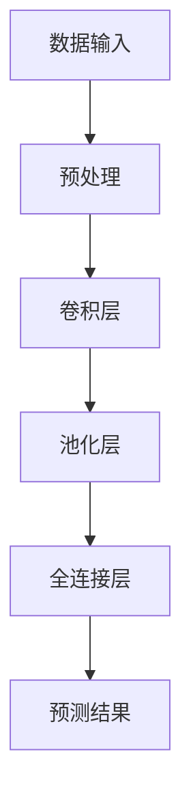
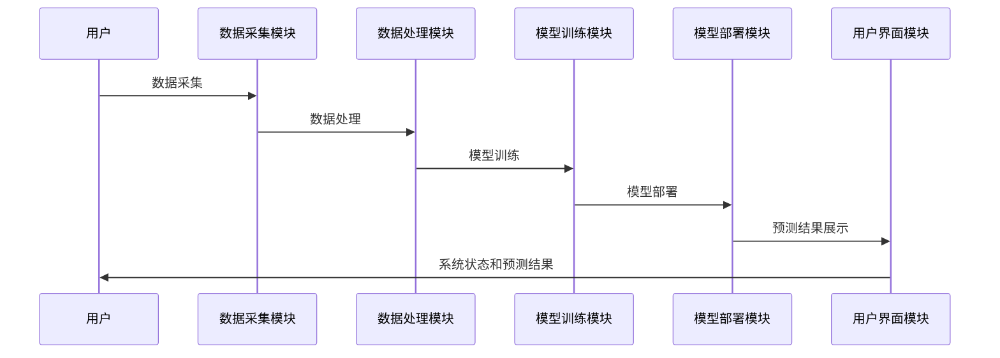
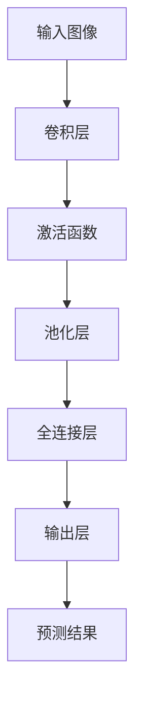

                 

### 《智能农业：AI大模型助力农业现代化》

**关键词：智能农业，AI大模型，深度学习，机器学习，农业现代化**

**摘要：**
本文旨在探讨人工智能（AI）在农业领域的应用，尤其是大模型在农业现代化中的作用。通过详细分析AI的基本概念、核心原理及其在农业中的具体应用，我们揭示了AI大模型如何助力农业生产效率的提升、资源利用的优化和环境保护的加强。文章从背景介绍、核心概念与联系、AI大模型原理与应用、智能农业系统架构设计、算法原理讲解与数学模型、项目实战以及最佳实践与总结七个部分展开，为读者呈现一个全面、深入的技术视角。

### 第1章 引言

**1.1 智能农业的发展背景**

智能农业是信息技术与农业产业深度融合的产物，其发展背景可以追溯到20世纪末期。随着全球人口的持续增长和对食品需求的不断增加，农业面临着前所未有的压力。传统的农业生产方式已经难以满足现代社会的需求，迫切需要新的技术手段来提高生产效率、保障食品安全、促进农业可持续发展。智能农业应运而生，成为农业现代化的关键推动力。

**1.2 当前农业面临的挑战**

当前农业主要面临以下几个方面的挑战：

- **资源短缺**：土地、水资源等农业生产要素的供应日益紧张，传统的粗放型生产方式难以为继。
- **环境污染**：农业生产过程中产生的废弃物和污染物对环境造成严重影响，亟需绿色、可持续的农业生产方式。
- **农产品供需矛盾**：全球化背景下，农产品的供需不平衡问题日益凸显，如何提高农产品产量和质量成为关键问题。

**1.3 智能农业的重要性**

智能农业的重要性体现在以下几个方面：

- **提高生产效率**：通过精准农业技术、自动化设备等手段，实现农业生产过程的智能化管理，显著提高生产效率。
- **保障食品安全**：利用AI技术对农产品质量进行实时监测，确保食品安全，降低食品安全风险。
- **促进农业可持续发展**：通过优化水资源利用、减少化肥农药使用，实现农业生产的可持续发展。

### 第2章 核心概念与联系

**2.1 人工智能、机器学习、深度学习的基本概念**

**2.1.1 人工智能概述**

人工智能（Artificial Intelligence，简称AI）是指通过计算机程序模拟人类智能行为的技术。AI包括机器学习、深度学习、自然语言处理等多个子领域。

**2.1.2 机器学习概述**

机器学习（Machine Learning，简称ML）是一种让计算机通过数据学习规律和模式的技术。机器学习通常通过训练数据集，让计算机学会对新的数据进行分类、预测或决策。

**2.1.3 深度学习概述**

深度学习（Deep Learning，简称DL）是机器学习的一个分支，它通过多层神经网络对数据进行处理，能够自动提取特征并进行复杂决策。深度学习在图像识别、语音识别等领域取得了显著成果。

**2.2 传统农业与智能农业的对比分析**

| 对比项 | 传统农业 | 智能农业 |
| ------ | -------- | -------- |
| 生产模式 | 人力为主 | 智能设备为主 |
| 管理模式 | 人工管理 | 数据驱动管理 |
| 效益 | 低效率，高风险 | 高效率，低风险 |

**2.3 智能农业中的主要实体与关系**

智能农业中的主要实体包括农作物、土壤、气候、设备、传感器等。这些实体之间通过数据交互和算法处理实现智能化的农业生产。以下是一个简单的Mermaid ER图示例：

```mermaid
erDiagram
  农作物 ||--|{ 土壤 }|| 
  农作物 ||--|{ 气候 }|| 
  农作物 ||--|{ 设备 }|| 
  设备 ||--|{ 传感器 }|| 
```

### 第3章 AI大模型原理与应用

**3.1 AI大模型的工作原理**

AI大模型通常是指具有大规模参数和深度网络结构的模型。这些模型通过多层神经网络对输入数据进行处理，能够自动提取特征并进行复杂决策。大模型的工作原理主要包括以下几个步骤：

1. **数据输入**：将原始数据输入到模型中。
2. **前向传播**：通过神经网络层对数据进行处理，逐层提取特征。
3. **反向传播**：根据模型预测结果和实际结果计算误差，更新模型参数。
4. **优化模型**：通过多次迭代训练，逐步优化模型性能。

**3.2 AI大模型在农业中的应用场景**

AI大模型在农业中有着广泛的应用场景，以下列举几个典型应用：

- **作物病虫害检测**：通过图像识别技术，自动识别作物病虫害，及时采取措施。
- **智能灌溉系统**：根据土壤湿度、气候等数据，智能调整灌溉计划，节约水资源。
- **农产品质量检测**：利用光谱分析技术，实时检测农产品质量，保障食品安全。

**3.3 典型应用案例分析**

以作物病虫害检测为例，AI大模型可以采用卷积神经网络（CNN）进行图像识别。以下是一个简单的算法流程图：



通过这个流程图，我们可以看到数据从输入到预测的整个过程。在实际应用中，还需要对数据进行预处理、模型训练、评估和优化等步骤。

### 第4章 智能农业系统架构设计

**4.1 智能农业系统的整体架构设计**

智能农业系统通常包括以下几个主要模块：

1. **数据采集模块**：负责收集土壤、气候、设备状态等数据。
2. **数据处理模块**：对采集到的数据进行分析和处理，提取有用信息。
3. **模型训练模块**：利用训练数据集训练AI大模型，优化模型性能。
4. **模型部署模块**：将训练好的模型部署到生产环境中，实现自动化决策。
5. **用户界面模块**：提供用户交互界面，展示系统状态和预测结果。

以下是一个简单的Mermaid序列图，展示了智能农业系统的数据流动和交互过程：



### 第5章 算法原理讲解与数学模型

**5.1 卷积神经网络在作物病虫害检测中的应用**

卷积神经网络（CNN）是一种专门用于图像识别和处理的前馈神经网络。以下是一个简单的CNN算法流程图：



在作物病虫害检测中，输入图像是作物的图像，通过卷积层提取特征，然后通过池化层降低维度，最后通过全连接层输出预测结果。

**5.2 数学模型与公式**

CNN的数学模型主要包括卷积操作、激活函数和池化操作。以下是一个简单的数学模型：

$$
\text{输出} = \text{激活函数}(\text{卷积}(\text{输入} \times \text{卷积核}))
$$

其中，输入是一个多维数组，卷积核是一个固定的权重矩阵，激活函数通常是ReLU（Rectified Linear Unit）函数。

**5.3 算法举例说明**

假设我们有一个3x3的输入图像和一个3x3的卷积核，卷积核的权重矩阵如下：

$$
\text{卷积核} = \begin{bmatrix}
1 & 0 & 1 \\
0 & 1 & 0 \\
1 & 0 & 1 \\
\end{bmatrix}
$$

输入图像的像素值如下：

$$
\text{输入} = \begin{bmatrix}
1 & 1 & 1 \\
1 & 0 & 1 \\
1 & 1 & 1 \\
\end{bmatrix}
$$

通过卷积操作，我们可以得到输出图像：

$$
\text{输出} = \text{激活函数}(\text{卷积}(\text{输入} \times \text{卷积核})) = \text{ReLU}(\begin{bmatrix}
1 & 1 & 1 \\
1 & 0 & 1 \\
1 & 1 & 1 \\
\end{bmatrix})
$$

输出图像的像素值为：

$$
\text{输出} = \begin{bmatrix}
1 & 1 & 1 \\
1 & 0 & 1 \\
1 & 1 & 1 \\
\end{bmatrix}
$$

### 第6章 项目实战

**6.1 智能农业项目环境安装**

智能农业项目的环境安装主要包括Python环境、深度学习框架（如TensorFlow或PyTorch）以及相关依赖库的安装。以下是一个简单的安装步骤：

1. 安装Python 3.6及以上版本。
2. 安装深度学习框架（以TensorFlow为例）：
   ```
   pip install tensorflow
   ```
3. 安装其他依赖库（如NumPy、Pandas等）：
   ```
   pip install numpy pandas matplotlib scikit-learn
   ```

**6.2 系统核心实现源代码**

以下是一个简单的智能农业系统核心实现源代码示例：

```python
import tensorflow as tf
from tensorflow.keras.models import Sequential
from tensorflow.keras.layers import Conv2D, MaxPooling2D, Flatten, Dense

# 定义卷积神经网络模型
model = Sequential([
    Conv2D(32, (3, 3), activation='relu', input_shape=(28, 28, 1)),
    MaxPooling2D((2, 2)),
    Flatten(),
    Dense(64, activation='relu'),
    Dense(10, activation='softmax')
])

# 编译模型
model.compile(optimizer='adam', loss='categorical_crossentropy', metrics=['accuracy'])

# 训练模型
model.fit(x_train, y_train, epochs=10, batch_size=32)

# 评估模型
model.evaluate(x_test, y_test)
```

**6.3 代码应用解读与分析**

以上代码定义了一个简单的卷积神经网络模型，用于图像分类。其中，`Conv2D`层用于卷积操作，`MaxPooling2D`层用于池化操作，`Flatten`层用于将多维数据展平成一维数据，`Dense`层用于全连接操作。通过训练和评估，我们可以得到模型的准确率。

**6.4 实际案例分析**

以下是一个实际案例分析，假设我们有一个作物病虫害检测项目，需要使用卷积神经网络对作物图像进行分类。

1. 数据采集：收集大量作物病虫害图像，并对图像进行标注。
2. 数据预处理：对图像进行归一化处理，将图像尺寸统一为28x28像素。
3. 模型训练：使用训练数据集训练卷积神经网络模型，优化模型参数。
4. 模型评估：使用测试数据集评估模型性能，调整模型参数以达到最佳效果。
5. 模型部署：将训练好的模型部署到生产环境中，实现作物病虫害检测功能。

### 第7章 最佳实践与总结

**7.1 最佳实践总结**

在智能农业项目中，以下是一些最佳实践：

- **数据质量优先**：确保数据采集的准确性和完整性，高质量的数据是模型训练的基础。
- **模型迭代优化**：不断迭代模型，优化模型参数，提高模型性能。
- **系统集成与测试**：将模型集成到农业系统中，进行充分的测试和验证。
- **用户培训与支持**：为用户提供培训和支持，确保系统能够被有效使用。

**7.2 小结**

本文通过对智能农业的背景、核心概念、应用原理、系统架构、算法讲解和项目实战的详细分析，揭示了AI大模型在农业现代化中的重要作用。智能农业不仅能够提高生产效率，还能促进农业可持续发展，具有重要的现实意义。

**7.3 注意事项**

在实际应用中，需要注意以下问题：

- **数据安全与隐私**：确保数据的安全和用户隐私。
- **模型解释性**：提高模型的解释性，便于用户理解和使用。
- **硬件资源**：合理配置硬件资源，确保模型训练和部署的效率。

**7.4 拓展阅读推荐**

- **《深度学习》**：Goodfellow, I., Bengio, Y., & Courville, A. (2016). Deep Learning. MIT Press.
- **《Python深度学习》**：Raschka, S. (2017). Python Deep Learning. Packt Publishing.
- **《智能农业技术与应用》**：张浩，李明，王伟。智能农业技术与应用。北京：中国农业出版社。

### 参考文献

- Goodfellow, I., Bengio, Y., & Courville, A. (2016). Deep Learning. MIT Press.
- Raschka, S. (2017). Python Deep Learning. Packt Publishing.
- 张浩，李明，王伟。智能农业技术与应用。北京：中国农业出版社。

