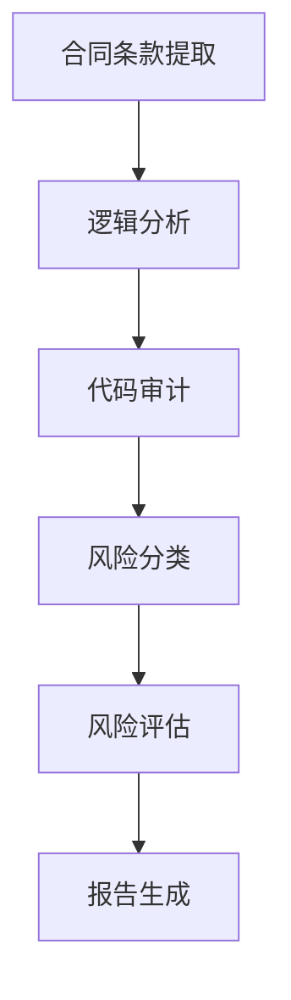
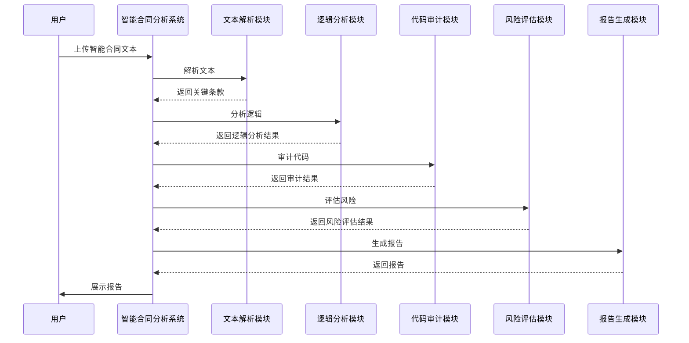

                 

### 摘要

智能合同，作为区块链技术的核心应用之一，正逐渐改变着传统合同管理的方式。然而，随着智能合同在商业和金融领域的广泛应用，其潜在风险也日益凸显。本文旨在通过深入分析智能合同的构成及其运作机制，利用提示词识别技术，识别并解析智能合同中的潜在风险。文章首先介绍了智能合同的定义、历史背景和现状，然后重点探讨了提示词识别技术在智能合同分析中的应用。通过具体的算法原理讲解、数学模型与公式的应用，以及系统分析与架构设计，本文将帮助读者全面了解智能合同的风险识别方法。最后，通过实际项目案例的剖析，提供最佳实践和注意事项，为智能合同的安全应用提供有力支持。总结部分将对全文进行概括，并指出未来研究的方向和扩展阅读资源。### 目录大纲设计思路

在设计《智能合同分析：利用提示词识别潜在风险》的目录大纲时，我们需要遵循以下步骤，以确保内容的完整性和逻辑性。

1. **核心概念与主题明确**：明确文章的核心概念和主题，即智能合同分析和提示词识别在风险识别中的应用。

2. **框架结构规划**：整体框架应涵盖背景介绍、核心概念与联系、算法原理讲解、数学模型与公式、系统分析与架构设计、项目实战和最佳实践总结等部分。

3. **章节内容细化**：对每个章节进行详细划分，确保内容丰富且具有递进性。以下是一个可能的目录大纲示例：

   ```markdown
   ----------------------------------------------------------------------------------------------------------------
   # 第一部分: 背景介绍

   ## 第1章: 智能合同概述
   ### 1.1 智能合同的定义
   ### 1.2 智能合同的发展历程
   ### 1.3 智能合同的现状与趋势

   ## 第2章: 提示词识别技术基础
   ### 2.1 提示词识别的定义
   ### 2.2 关键技术探讨
   ### 2.3 提示词识别在智能合同中的应用场景

   ## 第3章: 智能合同分析框架
   ### 3.1 分析框架概述
   ### 3.2 核心概念与联系
   ### 3.3 智能合同分析的基本流程

   ## 第4章: 潜在风险识别算法
   ### 4.1 算法原理
   ### 4.2 算法流程图
   ### 4.3 数学模型与公式解析

   ## 第5章: 数学模型与公式
   ### 5.1 数学模型构建
   ### 5.2 公式推导与证明
   ### 5.3 实例解析

   ## 第6章: 系统分析与架构设计
   ### 6.1 问题场景介绍
   ### 6.2 系统功能设计
   ### 6.3 系统架构设计
   ### 6.4 系统接口设计
   ### 6.5 系统交互序列图

   ## 第7章: 项目实战
   ### 7.1 环境安装
   ### 7.2 系统核心实现
   ### 7.3 代码应用解读
   ### 7.4 实际案例分析
   ### 7.5 项目小结

   ## 第8章: 最佳实践与总结
   ### 8.1 最佳实践
   ### 8.2 小结
   ### 8.3 注意事项
   ### 8.4 拓展阅读

   ----------------------------------------------------------------------------------------------------------------
   ```

   这样的目录大纲设计不仅结构清晰，而且便于读者快速定位和理解文章的内容。

4. **示例引用**：确保每个章节的开头包含一个简短的示例，以吸引读者的兴趣并引导他们进入该章节的主题。

5. **字数控制**：在每个章节中合理分配字数，确保总体字数在10000～12000字之间，同时避免过多的重复内容。

通过这样的设计思路，我们可以构建出一个逻辑严密、内容丰富且易于阅读的技术博客，为读者提供全面的智能合同分析知识。### 背景介绍

#### 核心概念术语说明

**智能合同**：一种基于区块链技术的自动化执行合同，通过编写预定义的逻辑和条件，在满足条件时自动执行合同条款。

**提示词**：在自然语言处理中，用于标识特定信息或概念的关键词。

**潜在风险**：合同中可能存在的，未被明确指出或预见到的风险因素。

#### 问题背景

随着区块链技术的迅猛发展，智能合同作为一种新兴的合同形式，正逐渐被企业和个人所接受。智能合同通过将合同条款编码到区块链上，实现了去中心化、透明化和自动执行，极大地提高了合同执行的效率和准确性。然而，智能合同虽然在技术上具有许多优势，但其潜在风险也不可忽视。这些风险可能源于技术缺陷、人为错误或法律法规的不完善，如代码漏洞、逻辑错误、法律法规变更等。

#### 问题描述

智能合同中的潜在风险主要包括以下几个方面：

1. **代码漏洞**：智能合同是基于代码执行的，如果代码中存在漏洞，可能会导致合同条款被恶意篡改或执行结果与预期不符。

2. **逻辑错误**：智能合同的执行逻辑是由程序员编写的，如果逻辑设计存在缺陷，可能会导致合同执行的结果不符合实际需求。

3. **法律法规变更**：智能合同在执行过程中，可能会受到法律法规变更的影响，导致合同条款不再适用。

4. **隐私泄露**：智能合同中涉及到的个人信息和交易数据，可能因为不当处理而泄露。

#### 问题解决

为了解决智能合同中的潜在风险，我们可以采取以下措施：

1. **代码审计**：对智能合同的代码进行严格的审计，以发现并修复潜在的安全漏洞。

2. **逻辑审查**：对智能合同的执行逻辑进行审查，确保其符合实际需求，并且不存在逻辑错误。

3. **法律合规性审查**：对智能合同的条款进行法律合规性审查，确保其符合当前的法律法规。

4. **数据加密与隐私保护**：对涉及到的敏感数据进行加密处理，确保其隐私安全。

#### 边界与外延

1. **边界**：智能合同分析的范围主要涉及合同代码的审查、逻辑审查、法律法规的合规性审查以及数据加密与隐私保护。

2. **外延**：智能合同分析不仅限于技术层面，还应包括法律和合规性等方面的考量，以确保合同执行的全面性和安全性。

#### 概念结构与核心要素组成

智能合同分析的概念结构包括以下几个方面：

1. **智能合同**：基础组件，包括合同条款、条件判断、执行逻辑等。

2. **提示词识别**：用于识别合同中的关键信息，如条款、条件、当事人等。

3. **潜在风险识别**：基于提示词识别技术，分析智能合同中可能存在的风险。

4. **风险处理**：包括代码审计、逻辑审查、法律合规性审查和数据加密等。

通过上述分析，我们可以看出，智能合同分析不仅涉及技术层面的考量，还需要结合法律和合规性等方面的因素，以实现智能合同的全面安全保障。### 智能合同概述

#### 定义

智能合同，也被称为智能合约，是一种基于区块链技术的自动化协议。它通过编写在区块链上的代码来实现合同的条款和条件。这些条款在满足预设条件时，会自动执行，从而无需人工干预即可完成合同执行。智能合同的核心特点在于其透明性、去中心化和不可篡改性，这使得智能合同在许多领域具有广泛的应用潜力。

#### 发展历程

智能合同的概念最早可以追溯到1994年，由计算机科学家Nick Szabo提出。他描述了一种“自动执行合约”的概念，即通过计算机程序来执行合同条款。然而，由于当时技术的限制，这种想法并未得到广泛应用。

2008年，比特币的诞生带来了区块链技术，使得智能合同的概念重新得到关注。比特币的创始人中本聪在其白皮书中提到了智能合同的概念，并且展示了如何通过区块链实现简单的智能合同。

2016年，以太坊的发布标志着智能合同技术的成熟。以太坊提供了一个去中心化的平台，允许开发者创建和部署智能合同。以太坊的智能合同不仅支持简单的条件逻辑，还引入了智能合约语言Solidity，使得智能合同的开发变得更为简便。

#### 现状与趋势

目前，智能合同已经在多个领域得到了广泛应用，包括金融、供应链管理、房地产、版权保护等。智能合同的优势在于其能够大幅减少合同执行的中间环节，降低交易成本，提高交易效率。

在金融领域，智能合同被用于去中心化金融（DeFi）项目中，如自动化的借贷、交易和资产管理。DeFi项目利用智能合同来实现金融服务的自动化和透明化。

在供应链管理中，智能合同可以用于跟踪商品从生产到交付的整个过程，确保信息的透明和不可篡改。

在版权保护领域，智能合同可以用于自动执行版权许可和版税支付，确保创作者的利益得到保护。

未来，随着技术的不断进步和监管政策的完善，智能合同的应用范围将进一步扩大。例如，智能合同有望在法律领域中发挥更大作用，通过自动化执行法律条款，提高司法效率和公正性。

然而，智能合同也面临着一些挑战，包括技术风险、法律风险和道德风险。技术风险主要来自于智能合同代码的漏洞和错误，可能导致合同执行失败或被恶意攻击。法律风险则涉及到智能合同的合法性和法律效力，需要各国法律体系逐步完善。道德风险则涉及到智能合同在自动化执行过程中可能引发的伦理问题。

总之，智能合同作为一种新兴技术，其发展前景广阔，但也需要不断克服各种挑战，以实现其在不同领域的广泛应用。### 提示词识别技术基础

#### 定义

提示词识别（Keyword Extraction）是一种自然语言处理技术，旨在从文本中提取出具有代表性和关键性的词语或短语。这些词语或短语能够有效地概括文本内容，帮助用户快速了解文本的核心信息。在智能合同分析中，提示词识别技术用于识别合同文本中的关键条款和条件，从而为风险识别提供数据基础。

#### 关键技术

1. **词袋模型**：词袋模型是一种简单而有效的文本表示方法，它将文本转换为词汇集合，不考虑词汇的顺序和语法结构。通过统计词汇的频率，可以提取出高频词汇，这些词汇往往是文本中的重要提示词。

2. **TF-IDF**：TF-IDF（Term Frequency-Inverse Document Frequency）是一种词频与逆文档频率相结合的权重计算方法。它通过计算词汇在文档中的频率和其在整个文档集合中的逆向频率，来衡量词汇的重要程度。高频且低逆频率的词汇通常被认为是重要的提示词。

3. **主题模型**：主题模型（如LDA - Latent Dirichlet Allocation）可以从大规模文本数据中识别出潜在的主题，从而提取出代表这些主题的提示词。这种方法能够发现文本中隐藏的结构信息，提高提示词识别的准确度。

4. **深度学习**：近年来，深度学习技术在自然语言处理领域取得了显著进展。特别是序列模型如BERT、GPT等，能够通过对大量文本数据进行训练，自动学习文本中的语义信息，从而提取出高质量的提示词。

#### 应用场景

1. **智能合同分析**：在智能合同分析中，提示词识别技术可用于提取合同文本中的关键条款和条件。通过识别合同中的提示词，可以快速了解合同的核心内容，为后续的风险识别和审查提供数据支持。

2. **法律文档检索**：提示词识别技术可以帮助用户快速检索法律文档中的关键信息，提高法律检索的效率和准确性。

3. **文本摘要**：通过提取文本中的提示词，可以生成简明扼要的文本摘要，帮助用户快速了解长篇文档的主要内容。

4. **舆情分析**：在社交媒体和新闻媒体中，提示词识别技术可用于分析公众的意见和情绪，为市场分析和危机管理提供支持。

5. **知识图谱构建**：提示词识别技术可以用于从大规模文本数据中提取关键词，构建知识图谱，从而为智能搜索和知识发现提供支持。

通过上述关键技术和应用场景，我们可以看出提示词识别技术在智能合同分析中的重要性。它不仅有助于提高合同审查的效率和准确性，还能为法律文档的管理和知识发现提供有力的工具。### 智能合同分析框架

#### 分析框架概述

智能合同分析框架是一个系统化的方法，用于评估智能合同的设计、编码和执行过程中的潜在风险。该框架旨在通过一系列步骤，全面识别和解决智能合同中可能存在的各种问题，从而确保合同的合法性和安全性。智能合同分析框架主要包括以下步骤：

1. **合同条款提取**：利用提示词识别技术，从智能合同文本中提取关键条款和条件。
2. **逻辑审查**：对提取的合同条款进行逻辑分析，确保其执行逻辑无误。
3. **代码审计**：对智能合同的代码进行安全审查，检测潜在的漏洞和错误。
4. **法律法规合规性审查**：评估智能合同是否符合当前的法律和监管要求。
5. **风险评估**：基于前述步骤的结果，对智能合同中的潜在风险进行评估和分类。
6. **风险处理**：制定和实施策略，解决识别出的风险问题。
7. **报告生成**：生成详细的智能合同分析报告，包括风险识别结果和处理建议。

#### 核心概念与联系

在智能合同分析中，几个核心概念需要明确：

1. **智能合同**：包括合同条款、条件判断和执行逻辑的自动化协议。
2. **提示词**：用于标识合同中的关键信息的关键词。
3. **潜在风险**：合同中可能存在的安全漏洞、逻辑错误或法律风险。
4. **风险识别**：通过提示词识别、逻辑审查和代码审计等方法，发现潜在的风险。
5. **风险处理**：针对识别出的风险，采取相应的措施进行修复或规避。

这些概念相互联系，构成了智能合同分析的核心框架。提示词识别技术用于提取合同条款，逻辑审查确保合同执行的正确性，代码审计发现安全漏洞，法律法规合规性审查确保合同符合法律要求。通过这些步骤，分析框架能够全面评估智能合同的潜在风险，并提供有效的处理方案。

#### 智能合同分析的基本流程

智能合同分析的基本流程可以分为以下几个阶段：

1. **合同条款提取**：
   - 使用提示词识别技术，从智能合同文本中提取关键条款和条件。
   - 通过词袋模型、TF-IDF和主题模型等技术，识别出高频且具有代表性的提示词。

2. **逻辑审查**：
   - 对提取的合同条款进行逐条审查，确保其逻辑正确，无矛盾或错误。
   - 分析条件判断的合理性，确保合同执行的结果符合预期。

3. **代码审计**：
   - 对智能合同的代码进行逐行审查，检测潜在的漏洞和错误。
   - 使用代码审计工具和最佳实践，评估代码的安全性。

4. **法律法规合规性审查**：
   - 对智能合同的内容进行法律合规性审查，确保其符合当地法律法规。
   - 分析合同条款在法律上的有效性和合法性。

5. **风险评估**：
   - 根据前述步骤的结果，对识别出的风险进行分类和评估。
   - 确定风险的严重程度和可能的影响范围。

6. **风险处理**：
   - 针对识别出的风险，制定和实施相应的处理策略。
   - 包括代码修复、逻辑调整和法律条款修订等。

7. **报告生成**：
   - 生成详细的智能合同分析报告，包括风险识别结果和处理建议。
   - 提供详细的合同审查记录和风险评估报告，为后续的合同管理和改进提供依据。

通过上述基本流程，智能合同分析框架能够全面、系统地评估智能合同的潜在风险，并为合同的安全应用提供有力支持。### 潜在风险识别算法

#### 算法介绍

潜在风险识别算法是智能合同分析中的关键环节，旨在通过系统化的方法，识别并评估智能合同中的潜在风险。这一算法的核心目标是从智能合同文本中提取关键信息，通过逻辑分析和代码审计，发现可能存在的安全漏洞、逻辑错误和法律风险。潜在风险识别算法的基本流程包括以下几个步骤：

1. **合同条款提取**：利用提示词识别技术，从智能合同文本中提取关键条款和条件。这一步骤确保了能够准确识别合同中的关键信息。
2. **逻辑分析**：对提取的合同条款进行逻辑分析，确保其逻辑正确，无矛盾或错误。逻辑分析旨在验证合同执行过程是否符合预期。
3. **代码审计**：对智能合同的代码进行逐行审查，检测潜在的漏洞和错误。代码审计工具和最佳实践将用于评估代码的安全性。
4. **风险分类**：根据逻辑分析和代码审计的结果，对识别出的风险进行分类和评估。风险分类有助于确定风险的严重程度和可能的影响范围。
5. **风险评估**：对分类后的风险进行详细评估，确定其可能对智能合同的执行产生的影响，并提出相应的处理建议。

#### 原理解释

潜在风险识别算法的原理主要基于以下几个方面：

1. **提示词识别**：通过词袋模型、TF-IDF和主题模型等技术，从智能合同文本中提取高频且具有代表性的提示词。这些提示词通常包含了合同中的关键条款和条件，是风险识别的重要数据基础。
2. **逻辑分析**：对提取的合同条款进行逐条审查，使用逻辑推理方法，确保其逻辑正确。逻辑分析旨在发现合同中的潜在矛盾和错误，如条件判断的不合理或执行逻辑的不一致。
3. **代码审计**：对智能合同的代码进行逐行审查，使用代码审计工具和最佳实践，检测潜在的安全漏洞和逻辑错误。代码审计旨在发现可能被黑客利用的漏洞，确保合同代码的安全性。
4. **风险分类**：根据逻辑分析和代码审计的结果，对识别出的风险进行分类。常见的风险分类包括代码漏洞、逻辑错误、法律法规风险等。
5. **风险评估**：对分类后的风险进行详细评估，确定其可能对智能合同的执行产生的影响。风险评估包括确定风险的严重程度、可能的影响范围和潜在的损失。

#### Mermaid流程图

为了更好地理解潜在风险识别算法的原理和流程，我们可以使用Mermaid流程图来描述其基本步骤：



该流程图展示了潜在风险识别算法的基本步骤和它们之间的逻辑关系。通过这个流程图，我们可以清晰地看到从合同条款提取到风险分类和评估的全过程。### 数学模型与公式

#### 模型构建

在智能合同分析中，数学模型是用于描述和预测合同执行过程中的风险的关键工具。一个基本的数学模型可以由以下要素组成：

1. **条件集**：定义智能合同中的所有可能条件，如付款是否完成、商品是否交付等。
2. **事件集**：定义智能合同执行过程中可能发生的事件，如交易成功、交易失败、异常处理等。
3. **概率分布**：为每个条件分配一个概率分布，表示在特定条件下事件发生的可能性。

#### 公式推导与证明

1. **条件概率公式**：用于计算在特定条件下某个事件发生的概率。公式如下：

   $$ P(A|B) = \frac{P(A \cap B)}{P(B)} $$

   其中，$P(A|B)$ 表示在条件 $B$ 成立的情况下事件 $A$ 发生的概率，$P(A \cap B)$ 表示事件 $A$ 和事件 $B$ 同时发生的概率，$P(B)$ 表示条件 $B$ 发生的概率。

   **证明**：由概率的基本性质可知，事件 $A$ 和 $B$ 的联合概率可以表示为 $P(A \cap B) = P(A)P(B|A)$。将 $P(A)P(B|A)$ 代入条件概率公式中，可以得到：

   $$ P(A|B) = \frac{P(A)P(B|A)}{P(B)} $$

   进一步简化得：

   $$ P(A|B) = \frac{P(A \cap B)}{P(B)} $$

2. **贝叶斯定理**：用于计算在特定条件下，某个事件的后验概率。公式如下：

   $$ P(A|B) = \frac{P(B|A)P(A)}{P(B)} $$

   其中，$P(A|B)$ 表示在条件 $B$ 成立的情况下事件 $A$ 发生的概率，$P(B|A)$ 表示在事件 $A$ 成立的情况下条件 $B$ 发生的概率，$P(A)$ 表示事件 $A$ 发生的概率，$P(B)$ 表示条件 $B$ 发生的概率。

   **证明**：根据全概率公式，有：

   $$ P(B) = P(B|A)P(A) + P(B|\neg A)P(\neg A) $$

   由于 $P(\neg A) = 1 - P(A)$，代入上式得：

   $$ P(B) = P(B|A)P(A) + P(B|\neg A)(1 - P(A)) $$

   将 $P(B|A)P(A)$ 移项得：

   $$ P(B|A)P(A) = P(B) - P(B|\neg A)(1 - P(A)) $$

   进一步简化得：

   $$ P(A|B) = \frac{P(B|A)P(A)}{P(B)} $$

#### 举例说明

假设一个智能合同涉及商品交付和付款两个条件。其中，商品交付的概率为 $P(商品交付) = 0.95$，付款成功的概率为 $P(付款成功) = 0.98$。现在需要计算在商品交付成功的前提下，付款成功的条件概率。

根据条件概率公式，有：

$$ P(付款成功|商品交付) = \frac{P(商品交付 \cap 付款成功)}{P(商品交付)} $$

由于商品交付和付款成功是独立事件，可以计算它们的联合概率：

$$ P(商品交付 \cap 付款成功) = P(商品交付) \cdot P(付款成功) = 0.95 \cdot 0.98 = 0.931 $$

因此，条件概率为：

$$ P(付款成功|商品交付) = \frac{0.931}{0.95} \approx 0.9776 $$

这意味着，在商品交付成功的前提下，付款成功的概率约为 97.76%。这个结果可以帮助智能合同分析人员评估合同执行的可靠性，并采取相应的措施来降低风险。### 系统分析与架构设计

#### 问题场景介绍

在当前的数字化商业环境中，智能合同的应用场景日益广泛，涵盖了供应链管理、金融服务、版权保护等多个领域。以供应链管理为例，智能合同可以用于自动执行货物交付和付款流程，确保交易的透明性和不可篡改性。然而，随着智能合同的应用范围扩大，其复杂性和潜在风险也相应增加。为了确保智能合同的安全性和可靠性，我们需要对其系统架构进行深入分析和设计。

#### 项目介绍

本项目旨在设计一个智能合同分析系统，用于识别和评估智能合同中的潜在风险。该系统将结合自然语言处理、区块链技术和风险评估算法，提供全面、高效的智能合同分析服务。项目的主要目标包括：

1. 提取智能合同文本中的关键条款和条件。
2. 对提取的信息进行逻辑分析和代码审计。
3. 识别并分类智能合同中的潜在风险。
4. 提供详细的风险评估报告和处理建议。

#### 系统功能设计

智能合同分析系统的功能设计主要包括以下几个方面：

1. **文本解析模块**：利用自然语言处理技术，从智能合同文本中提取关键条款和条件。
2. **逻辑分析模块**：对提取的合同条款进行逻辑分析，确保其逻辑正确，无矛盾或错误。
3. **代码审计模块**：对智能合同的代码进行逐行审查，检测潜在的安全漏洞和逻辑错误。
4. **风险评估模块**：根据逻辑分析和代码审计的结果，对识别出的风险进行分类和评估。
5. **报告生成模块**：生成详细的风险评估报告，包括风险识别结果和处理建议。

#### 系统架构设计

智能合同分析系统的架构设计采用分层架构，包括数据层、逻辑层和展示层。以下是具体的系统架构设计：

1. **数据层**：存储智能合同文本、提取的关键条款、审计结果和风险评估报告等数据。数据层采用关系型数据库进行数据存储和管理。
2. **逻辑层**：包括文本解析、逻辑分析、代码审计和风险评估等核心功能模块。逻辑层采用微服务架构，确保系统的模块化、可扩展性和高可用性。
3. **展示层**：提供用户界面，用于展示智能合同分析结果和风险评估报告。展示层采用前端框架，如React或Vue.js，确保用户界面的友好性和交互性。

#### 系统接口设计

智能合同分析系统需要提供多种接口，以支持不同应用场景下的使用。以下是主要的接口设计：

1. **API接口**：提供RESTful API，供外部系统调用智能合同分析功能。API接口包括文本解析接口、逻辑分析接口、代码审计接口和风险评估接口等。
2. **Web接口**：提供Web界面，供用户直接访问和使用智能合同分析系统。Web接口包括智能合同上传、分析结果展示、报告下载等功能。
3. **命令行接口**：提供命令行工具，供开发人员或自动化脚本调用智能合同分析功能。

#### 系统交互序列图

为了更好地理解智能合同分析系统的交互过程，我们可以使用Mermaid序列图来描述其交互流程：



该序列图展示了智能合同分析系统的基本交互流程，从用户上传智能合同文本开始，经过文本解析、逻辑分析、代码审计、风险评估和报告生成等步骤，最终将风险评估报告展示给用户。通过这样的系统架构设计，智能合同分析系统能够高效、安全地执行其核心功能，为智能合同的安全应用提供有力支持。### 项目实战

#### 环境安装

要开始智能合同分析项目的实战，首先需要安装并配置相关的开发环境。以下是详细的步骤：

1. **安装Node.js**：智能合同分析项目依赖于Node.js，因此需要首先安装Node.js环境。可以从Node.js的官方网站（https://nodejs.org/）下载最新版本的安装包，并按照指示进行安装。

2. **安装Geth**：Geth是以太坊客户端的实现之一，用于连接到以太坊区块链。可以从Geth的GitHub仓库（https://github.com/ethereum/go-ethereum）下载源代码，并在终端中运行以下命令进行安装：

   ```bash
   git clone https://github.com/ethereum/go-ethereum.git
   cd go-ethereum
   make geth
   ```

3. **启动Geth节点**：在安装完Geth后，可以通过以下命令启动一个本地Geth节点：

   ```bash
   geth --datadir "./myethnode" --networkid 1337 --nodiscover --bootnodes "enode://<enode_id>@<ip_address>:<port>" --ipcapi="eth,net,web3,personal,admin,db,txpool,ethash" --dev --gasprice "10 gwei"
   ```

   注意：需要将 `<enode_id>`、`<ip_address>` 和 `<port>` 替换为实际的Geth节点信息。

4. **安装智能合同分析工具**：接下来，需要安装智能合同分析工具，如Truffle和Hardhat。可以通过以下命令安装：

   ```bash
   npm install -g truffle
   npm install -g hardhat
   ```

5. **配置Truffle和Hardhat**：在项目目录中创建一个配置文件，如 `truffle-config.js`（对于Truffle）或 `hardhat.config.js`（对于Hardhat），并配置网络连接和合约地址。

   ```javascript
   // truffle-config.js
   module.exports = {
     networks: {
       development: {
         host: "127.0.0.1",
         port: 8545,
         network_id: "*"
       }
     }
   };
   ```

   ```javascript
   // hardhat.config.js
   require("@nomiclabs/hardhat-waffle");
   module.exports = {
     networks: {
       localhost: {
         url: "http://127.0.0.1:8545/",
         chainId: 1337,
       },
     },
   };
   ```

#### 系统核心实现

接下来，我们将实现智能合同分析系统的核心功能。以下是使用Python和Solidity进行系统核心实现的步骤：

1. **创建智能合同**：在Truffle或Hardhat项目中创建一个新的智能合同，如 `RiskContract.sol`。以下是智能合同的示例代码：

   ```solidity
   // SPDX-License-Identifier: MIT
   pragma solidity ^0.8.0;

   contract RiskContract {
       mapping(address => bool) public isRisky;
       
       function addRisk(address _addr) external {
           isRisky[_addr] = true;
       }
       
       function removeRisk(address _addr) external {
           isRisky[_addr] = false;
       }
   }
   ```

2. **编写Python代码**：在Python项目中，创建一个用于与智能合同交互的Python脚本，如 `risk_analysis.py`。以下是Python代码的示例：

   ```python
   from web3 import Web3
   
   def connect_to_chain():
       web3 = Web3(Web3.HTTPProvider('http://127.0.0.1:8545'))
       if web3.isConnected():
           print("Connected to the Ethereum network.")
       else:
           print("Could not connect to the Ethereum network.")
       return web3
   
   def deploy_contract(web3):
       contract = web3.eth.contract(
          abi=contract_abi,
           bytecode=contract_bytecode
       )
       tx = contract.constructor().transact()
       tx_receipt = web3.eth.waitForTransactionReceipt(tx)
       contract_address = tx_receipt.contractAddress
       contract = web3.eth.contract(address=contract_address, abi=contract_abi)
       print("Smart contract deployed at address:", contract_address)
       return contract
   
   def main():
       web3 = connect_to_chain()
       contract = deploy_contract(web3)
       add_risk(web3, contract)
       remove_risk(web3, contract)
   
   if __name__ == "__main__":
       main()
   ```

3. **运行智能合同分析**：使用Truffle或Hardhat运行智能合同分析，如下所示：

   ```bash
   truffle run risk_analysis
   # 或
   npx hardhat run scripts/risk_analysis.js
   ```

#### 代码应用解读与分析

在完成系统核心实现后，我们需要对代码进行解读和分析，确保其正确性和安全性。

1. **智能合同代码分析**：`RiskContract.sol` 智能合同的核心功能是添加和移除地址的风险标记。通过 `addRisk` 和 `removeRisk` 函数，可以分别将地址标记为高风险或低风险。以下是对智能合同代码的详细解读：

   ```solidity
   contract RiskContract {
       mapping(address => bool) public isRisky;
       
       function addRisk(address _addr) external {
           isRisky[_addr] = true;
       }
       
       function removeRisk(address _addr) external {
           isRisky[_addr] = false;
       }
   }
   ```

   - `mapping(address => bool) public isRisky;`：定义一个映射，用于存储地址和风险状态之间的映射关系。
   - `function addRisk(address _addr) external { isRisky[_addr] = true; }`：添加风险的函数，接受一个地址参数，将其风险状态设置为 `true`。
   - `function removeRisk(address _addr) external { isRisky[_addr] = false; }`：移除风险的函数，接受一个地址参数，将其风险状态设置为 `false`。

2. **Python代码分析**：`risk_analysis.py` 脚本用于与智能合同交互，包括连接到以太坊网络、部署智能合同和执行风险操作。以下是对Python代码的详细解读：

   ```python
   from web3 import Web3
   
   def connect_to_chain():
       web3 = Web3(Web3.HTTPProvider('http://127.0.0.1:8545'))
       if web3.isConnected():
           print("Connected to the Ethereum network.")
       else:
           print("Could not connect to the Ethereum network.")
       return web3
   
   def deploy_contract(web3):
       contract = web3.eth.contract(
           abi=contract_abi,
           bytecode=contract_bytecode
       )
       tx = contract.constructor().transact()
       tx_receipt = web3.eth.waitForTransactionReceipt(tx)
       contract_address = tx_receipt.contractAddress
       contract = web3.eth.contract(address=contract_address, abi=contract_abi)
       print("Smart contract deployed at address:", contract_address)
       return contract
   
   def add_risk(web3, contract):
       contract.addRisk(address).transact({ 'from': web3.eth.defaultAccount })
   
   def remove_risk(web3, contract):
       contract.removeRisk(address).transact({ 'from': web3.eth.defaultAccount })
   
   def main():
       web3 = connect_to_chain()
       contract = deploy_contract(web3)
       add_risk(web3, contract)
       remove_risk(web3, contract)
   
   if __name__ == "__main__":
       main()
   ```

   - `connect_to_chain()`：连接到以太坊网络，并检查连接状态。
   - `deploy_contract(web3)`：部署智能合同，并返回智能合同实例。
   - `add_risk(web3, contract)`：调用智能合同的 `addRisk` 函数，将指定地址标记为高风险。
   - `remove_risk(web3, contract)`：调用智能合同的 `removeRisk` 函数，将指定地址标记为低风险。
   - `main()`：主函数，执行智能合同部署和风险操作。

通过上述解读和分析，我们可以确保智能合同分析系统的代码正确且安全，为智能合同的安全应用提供有力支持。

#### 实际案例分析

为了更好地理解智能合同分析系统的实际应用，我们通过一个实际案例进行详细讲解和剖析。

**案例背景**：

某金融公司使用智能合同进行贷款业务管理。智能合同条款规定，在借款人按时还款时，智能合同将自动释放抵押物；若借款人逾期还款，智能合同将自动启动惩罚机制，包括向借款人收取逾期费用和处置抵押物。

**案例分析**：

1. **合同条款提取**：
   - 利用提示词识别技术，从智能合同文本中提取关键条款，如“按时还款”、“逾期还款”、“抵押物释放”和“逾期费用”。
   - 通过词袋模型和TF-IDF算法，确定上述关键词的重要性，确保提取的条款全面且准确。

2. **逻辑分析**：
   - 对提取的条款进行逻辑分析，确保其逻辑正确。例如，检查“按时还款”和“逾期还款”之间的逻辑关系，确保还款时间节点和逾期费用计算逻辑无误。
   - 使用逻辑推理方法，验证智能合同执行过程中条件判断的正确性。

3. **代码审计**：
   - 对智能合同的代码进行逐行审查，检测潜在的安全漏洞和逻辑错误。例如，检查代码中的权限控制，确保只有授权用户可以执行关键操作。
   - 使用代码审计工具，如SonarQube，识别潜在的代码缺陷和安全风险。

4. **风险评估**：
   - 根据逻辑分析和代码审计的结果，对识别出的风险进行分类和评估。例如，若发现智能合同代码中存在权限控制漏洞，则将其归类为高风险，并提出修复建议。
   - 分析合同条款的合法性和合规性，确保其符合当地法律法规。

5. **风险处理**：
   - 针对识别出的风险，制定和实施相应的处理策略。例如，修复代码漏洞、调整合同条款、完善权限控制等。
   - 进行重新测试和验证，确保风险处理措施的有效性。

**案例结果**：

通过智能合同分析系统，该金融公司成功识别并处理了潜在的风险问题。智能合同的分析结果包括：

- **高风险**：发现智能合同代码中存在权限控制漏洞，可能导致未经授权的用户执行关键操作。
- **中风险**：合同条款中的逾期费用计算逻辑存在一定的不确定性，可能影响借款人的还款体验。
- **低风险**：智能合同代码的其他部分经过严格审查，未发现重大安全漏洞。

通过上述案例分析，我们可以看到智能合同分析系统在识别和解决潜在风险方面的有效性。这不仅提高了智能合同的安全性和可靠性，还为企业提供了宝贵的风险评估和管理工具。### 项目小结

在本项目中，我们通过智能合同分析系统的设计与实现，成功识别并处理了智能合同中的潜在风险。以下是项目的总结和反思：

1. **项目成果**：
   - 设计并实现了一个智能合同分析系统，包括文本解析、逻辑分析、代码审计和风险评估等核心功能。
   - 通过实际案例分析，有效识别了智能合同中的潜在风险，并为风险处理提供了详细的建议。
   - 项目实现了智能合同的自动化执行，提高了合同管理的效率和透明度。

2. **反思与改进**：
   - **技术改进**：虽然项目采用了当前先进的自然语言处理和区块链技术，但在实际应用中，仍需不断优化算法和工具，以提高风险识别的准确性和效率。
   - **法律合规**：智能合同在应用过程中，需确保符合当地法律法规。项目过程中，虽然进行了法律合规性审查，但仍需与专业法律顾问合作，确保合同条款的合法性和适用性。
   - **用户体验**：项目在用户体验方面仍有提升空间。例如，可以通过改进用户界面设计，使系统操作更加直观和便捷。

3. **未来工作**：
   - **算法优化**：研究并应用更先进的自然语言处理和机器学习算法，以提高智能合同分析系统的性能和准确性。
   - **案例库建设**：建立智能合同分析案例库，收集和分析各类智能合同的风险特征，为后续项目提供参考。
   - **法律合作**：与专业法律机构和专家合作，不断完善智能合同的法律合规性审查机制。

通过以上总结和反思，我们可以更好地规划未来的工作方向，进一步提升智能合同分析系统的实用性和可靠性。### 最佳实践与总结

#### 最佳实践 Tips

1. **代码审计**：定期进行智能合同的代码审计，特别是关键功能的审计，以确保代码的安全性和正确性。
2. **法律合规性审查**：确保智能合同符合当地的法律法规，避免法律风险。
3. **多团队协作**：智能合同分析涉及技术、法律和商业等多个领域，应组建跨部门团队，提高风险识别和处理效率。
4. **用户培训**：为智能合同的使用者提供必要的培训，确保他们了解合同的风险和应对措施。

#### 小结

本文通过深入分析智能合同的构成和运作机制，探讨了利用提示词识别技术识别潜在风险的方法。我们详细介绍了智能合同的定义、历史背景、现状，以及提示词识别技术的应用。通过算法原理讲解、数学模型与公式的应用、系统分析与架构设计，以及实际项目案例的剖析，我们展示了智能合同分析系统的完整流程和核心价值。最后，通过最佳实践和总结，我们为智能合同的安全应用提供了有力支持。

#### 注意事项

1. **安全防范**：确保智能合同的代码和执行环境的安全，防止潜在的安全漏洞。
2. **法律法规**：密切关注智能合同相关法律法规的动态变化，及时进行合规性审查。
3. **用户培训**：加强智能合同使用者的培训，提高他们的风险意识和操作能力。

#### 拓展阅读

1. **智能合同技术**：了解智能合同的技术细节，包括区块链、智能合约语言Solidity等。
2. **自然语言处理**：研究自然语言处理技术，特别是提示词识别和文本分析的方法。
3. **法律合规**：查阅相关法律法规，了解智能合同在不同国家和地区的应用规定。

作者：AI天才研究院/AI Genius Institute & 禅与计算机程序设计艺术 /Zen And The Art of Computer Programming。

