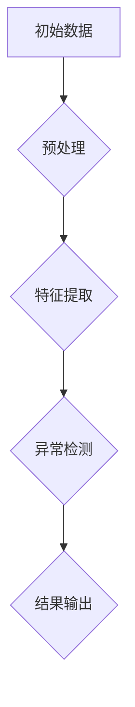
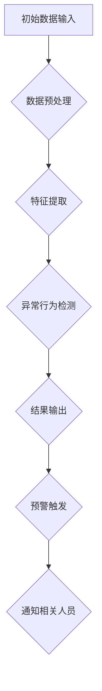
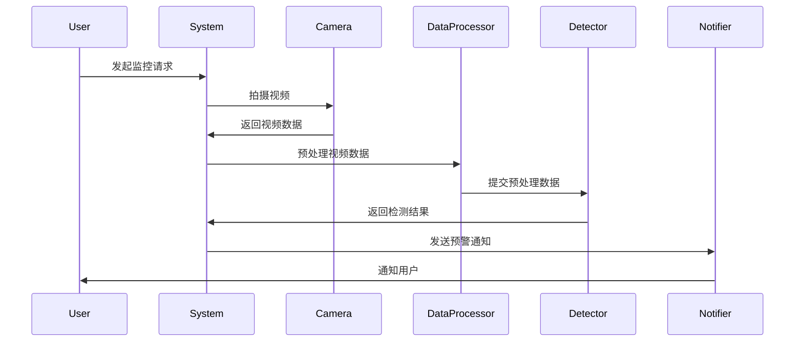
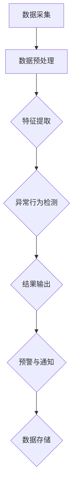
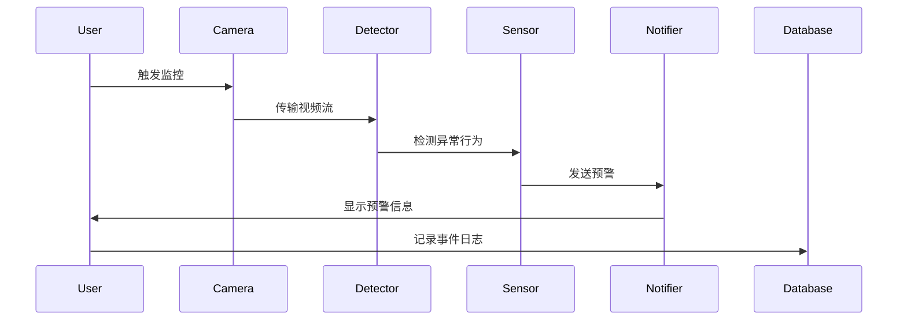

                 


### 智能安防卫士：提示词增强异常行为检测

#### 关键词：
- 智能安防
- 异常行为检测
- 提示词
- 智能分析
- 安全保障

#### 摘要：
本文将深入探讨智能安防卫士中提示词增强异常行为检测的核心概念、技术原理和实际应用。我们将从问题背景出发，逐步介绍智能安防的发展历程、核心概念和面临的挑战。随后，我们将重点讨论提示词的概念和应用，以及异常行为检测算法的原理和数学模型。文章还将详细介绍智能安防卫士的系统分析与架构设计，并通过实战案例展示系统的实现与应用。最后，我们将总结最佳实践技巧和注意事项，并给出拓展阅读建议。

### 第一部分：智能安防卫士概述

#### 第1章：问题背景与智能安防的意义

##### 1.1.1 智能安防的发展历程
智能安防作为现代信息技术和安全领域的重要组成部分，其发展历程可追溯至20世纪末。当时，视频监控技术开始逐渐普及，为城市安全提供了初步的监控手段。随着计算机技术和网络通信技术的飞速发展，智能安防逐渐从单一的视频监控转向综合性的安全管理系统。

在21世纪初，智能安防进入了一个快速发展的阶段。人工智能技术的引入，使得智能安防系统的功能得到了极大的拓展。通过机器学习和深度学习算法，智能安防系统能够对视频监控数据进行实时分析，自动识别异常行为，提高了安全管理的效率和准确性。

##### 1.1.2 智能安防的重要性
智能安防系统在现代社会中扮演着至关重要的角色。首先，它能够有效预防和减少犯罪活动。通过实时监控和异常行为检测，智能安防系统能够迅速响应潜在的安全威胁，保护人民的生命和财产安全。

其次，智能安防系统在公共安全管理中发挥着重要作用。在机场、车站、学校、医院等公共场所，智能安防系统能够对人群流动进行监控，及时发现和预防拥挤、踩踏等安全事件。

最后，智能安防系统在社会治理中也发挥着重要作用。通过大数据分析和人工智能技术，智能安防系统能够提供丰富的数据支持，为政府部门制定更加科学合理的公共安全政策和策略。

##### 1.1.3 当前智能安防面临的挑战
尽管智能安防系统在各个方面都取得了显著成果，但仍然面临着一系列挑战。首先，数据的爆炸性增长对智能安防系统的处理能力提出了更高的要求。视频监控数据的规模和速度都在不断增长，如何高效地处理和分析这些数据成为了一个重要课题。

其次，智能安防系统的准确性问题也是一个重要的挑战。异常行为检测的准确性直接关系到系统的可靠性和有效性。然而，由于环境的复杂性和不确定因素的存在，如何提高异常行为检测的准确性仍然是一个亟待解决的问题。

最后，隐私保护问题也是智能安防面临的一个重要挑战。在实现智能安防功能的同时，如何确保个人隐私不被侵犯，是智能安防系统设计者和实施者需要认真考虑的问题。

### 第2章：智能安防卫士的核心概念

##### 2.1.1 智能安防卫士的定义
智能安防卫士是指一种基于人工智能和大数据分析技术的综合性安全管理系统。它不仅能够对视频监控数据进行实时分析，还能够结合其他数据源（如传感器数据、网络流量数据等），实现对异常行为的自动识别和预警。

##### 2.1.2 智能安防卫士的基本功能
智能安防卫士的基本功能包括：

1. 异常行为检测：通过机器学习和深度学习算法，对视频监控数据进行分析，自动识别异常行为。
2. 实时预警：当检测到异常行为时，系统会立即发出预警，通知相关人员采取行动。
3. 数据分析：对监控数据进行分析，提取有价值的信息，为决策提供支持。
4. 安全保障：通过实时监控和预警，确保人民的生命和财产安全。

##### 2.1.3 智能安防卫士的组成部分
智能安防卫士由以下几个主要部分组成：

1. 数据采集与处理：负责收集和处理各种数据源的信息，包括视频监控数据、传感器数据、网络流量数据等。
2. 异常行为检测算法：利用机器学习和深度学习技术，对视频监控数据进行分析，识别异常行为。
3. 预警与通知系统：当检测到异常行为时，系统会立即发出预警，并通过各种方式（如短信、邮件、APP通知等）通知相关人员。
4. 数据分析与可视化：对监控数据进行分析，提取有价值的信息，并通过可视化工具展示给用户。

### 第3章：提示词增强异常行为检测

##### 3.1.1 提示词的概念
提示词（keyword）是指用于描述或指示特定事件或行为的词语或短语。在智能安防系统中，提示词是一种重要的信息源，可以帮助系统更好地理解和分析监控数据。

##### 3.1.2 提示词在异常行为检测中的应用
在异常行为检测中，提示词可以发挥重要作用。例如，在一个商场中，如果检测到“抢劫”这一提示词，系统会立即启动异常行为检测机制，对相关视频进行实时分析，识别可能的抢劫行为。

##### 3.1.3 提示词增强异常行为检测的优势
提示词增强异常行为检测具有以下几个优势：

1. 提高检测准确性：通过引入提示词，系统可以更准确地识别异常行为，减少误报和漏报。
2. 加速响应速度：提示词可以帮助系统迅速定位可能的安全事件，加速响应速度。
3. 降低人力成本：通过自动化检测和预警，智能安防卫士可以减少人工监控和响应的工作量，降低人力成本。

### 第二部分：实践与应用

#### 第4章：异常行为检测算法原理

##### 4.1.1 异常行为检测的基本原理
异常行为检测的基本原理是通过分析监控数据，识别出与正常行为不一致的异常行为。这通常涉及到以下几个步骤：

1. 数据预处理：对监控数据（如视频、图像、音频等）进行预处理，去除噪声和干扰，提取有用的信息。
2. 特征提取：从预处理后的数据中提取出能够反映异常行为的特征。
3. 异常检测算法：利用机器学习和深度学习算法，对提取出的特征进行分析，识别异常行为。

##### 4.1.2 常见的异常行为检测算法
常见的异常行为检测算法包括以下几种：

1. 聚类算法：通过将数据分为不同的簇，识别出与正常行为不同的异常簇。
2. 离群点检测算法：直接识别出与正常行为差异较大的离群点。
3. 基于模型的方法：利用建立好的模型，对监控数据进行预测，识别出与模型不一致的异常行为。

##### 4.1.3 算法性能评估指标
评估异常行为检测算法性能的指标通常包括：

1. 精确率（Precision）：正确识别异常行为的比例。
2. 召回率（Recall）：能够识别出所有异常行为的比例。
3. F1值（F1 Score）：精确率和召回率的调和平均值。

### 第5章：数学模型与公式解析

##### 5.1.1 数学模型在异常行为检测中的应用
在异常行为检测中，数学模型起到了核心作用。常见的数学模型包括：

1. K-means聚类模型：用于将数据划分为不同的簇，识别出异常簇。
2. 支持向量机（SVM）模型：用于分类和回归分析，识别出异常行为。
3. 随机森林（Random Forest）模型：通过构建多个决策树，提高异常行为检测的准确性。

##### 5.1.2 公式解析与推导
在异常行为检测中，常用的公式包括：

1. 聚类中心的计算公式：
   $$c = \frac{1}{n}\sum_{i=1}^{n}x_i$$
   其中，$c$为聚类中心，$x_i$为每个数据点的坐标，$n$为数据点的数量。

2. 支持向量机分类公式：
   $$y = \text{sign}(\omega \cdot x + b)$$
   其中，$y$为分类结果，$\omega$为权重向量，$x$为数据点，$b$为偏置。

3. 随机森林预测公式：
   $$\hat{y} = \text{mode}(\sum_{i=1}^{n}t_i)$$
   其中，$\hat{y}$为预测结果，$t_i$为每个决策树的预测结果。

##### 5.1.3 举例说明
为了更好地理解这些数学模型和公式，我们可以通过一个简单的例子来演示。假设我们有一个数据集，包含100个数据点，每个数据点表示一个人在视频监控中的活动。我们可以使用K-means聚类算法将这100个数据点划分为10个簇。

首先，我们计算每个簇的中心：
$$c_1 = \frac{1}{10}\sum_{i=1}^{10}x_i$$
$$c_2 = \frac{1}{10}\sum_{i=11}^{20}x_i$$
$$\vdots$$
$$c_{10} = \frac{1}{10}\sum_{i=91}^{100}x_i$$

然后，我们计算每个数据点与簇中心的距离：
$$d_1 = |x_i - c_1|$$
$$d_2 = |x_i - c_2|$$
$$\vdots$$
$$d_{10} = |x_i - c_{10}|$$

最后，我们将每个数据点分配到距离它最近的簇中，从而完成K-means聚类。

### 第6章：智能安防卫士系统分析与架构设计

##### 6.1.1 智能安防卫士系统概述
智能安防卫士系统是一个复杂的系统，它集成了多种技术，包括视频监控、传感器网络、人工智能和大数据分析。该系统的核心功能是实时监控、异常行为检测和预警。

##### 6.1.2 系统功能设计
智能安防卫士系统的功能设计包括以下几个方面：

1. 视频监控：通过摄像头实时采集视频数据。
2. 数据预处理：对视频数据进行分析，提取出有用的信息。
3. 异常行为检测：利用机器学习和深度学习算法，识别出异常行为。
4. 预警与通知：当检测到异常行为时，立即发出预警，并通过短信、邮件等方式通知相关人员。
5. 数据分析与可视化：对监控数据进行分析，提取有价值的信息，并通过可视化工具展示给用户。

##### 6.1.3 系统架构设计
智能安防卫士系统的架构设计包括以下几个层次：

1. 数据层：负责数据采集、存储和预处理。
2. 算法层：负责异常行为检测和预警。
3. 应用层：负责与用户交互，提供监控数据和预警信息。

##### 6.1.4 系统接口设计
智能安防卫士系统的接口设计包括以下几种：

1. 视频监控接口：用于实时采集视频数据。
2. 数据存储接口：用于存储预处理后的数据。
3. 异常行为检测接口：用于触发预警。
4. 预警通知接口：用于发送预警信息。

##### 6.1.5 系统交互设计
智能安防卫士系统的交互设计包括以下几个方面：

1. 用户交互：用户可以通过网页、APP等方式与系统进行交互，查看监控数据和预警信息。
2. 数据交互：系统通过接口与其他系统（如安防报警系统、公安监控系统等）进行数据交互。
3. 异常行为交互：系统通过机器学习和深度学习算法，与异常行为进行交互，识别出异常行为。

### 第7章：系统实现与实战

##### 7.1.1 系统环境安装
智能安防卫士系统的安装过程主要包括以下几个步骤：

1. 准备硬件设备：安装摄像头、传感器等设备。
2. 软件安装：安装操作系统、数据库、服务器等软件。
3. 系统配置：配置网络、数据库和服务器。

##### 7.1.2 核心实现源代码
智能安防卫士系统的核心实现源代码包括以下几个部分：

1. 视频监控代码：用于实时采集视频数据。
2. 数据预处理代码：用于对视频数据进行分析和预处理。
3. 异常行为检测代码：用于利用机器学习和深度学习算法检测异常行为。
4. 预警通知代码：用于发送预警信息。

##### 7.1.3 代码应用解读与分析
在智能安防卫士系统中，代码应用解读与分析主要包括以下几个方面：

1. 视频监控代码解读：分析视频监控代码的运行过程和数据处理方法。
2. 数据预处理代码解读：分析数据预处理代码的运行过程和数据处理方法。
3. 异常行为检测代码解读：分析异常行为检测代码的运行过程和数据处理方法。
4. 预警通知代码解读：分析预警通知代码的运行过程和数据处理方法。

##### 7.1.4 实际案例分析
在实际应用中，智能安防卫士系统可以应用于多种场景，如商场、机场、医院等。通过实际案例分析，我们可以看到智能安防卫士系统在实际应用中的效果和挑战。

1. 商场案例分析：分析商场中智能安防卫士系统的应用场景和效果。
2. 机场案例分析：分析机场中智能安防卫士系统的应用场景和效果。
3. 医院案例分析：分析医院中智能安防卫士系统的应用场景和效果。

##### 7.1.5 项目小结
通过实际案例分析，我们可以得出以下结论：

1. 智能安防卫士系统在多个场景中都取得了显著的效果，提高了安全管理的效率和准确性。
2. 在实际应用中，智能安防卫士系统也面临着一些挑战，如数据规模、准确性、隐私保护等。
3. 未来，智能安防卫士系统将继续发展，结合更多新技术，提高系统的性能和可靠性。

### 第8章：最佳实践与拓展

##### 8.1.1 最佳实践技巧
为了提高智能安防卫士系统的性能和可靠性，以下是一些最佳实践技巧：

1. 数据预处理：在数据预处理阶段，要确保数据的质量和一致性，去除噪声和干扰。
2. 算法选择：根据应用场景和数据特点，选择合适的异常行为检测算法。
3. 参数调整：根据实际需求，调整算法参数，提高检测准确性和效率。
4. 预警设置：合理设置预警阈值和响应策略，确保系统的响应速度和准确性。

##### 8.1.2 注意事项
在智能安防卫士系统的设计和实施过程中，需要注意以下几点：

1. 隐私保护：确保个人隐私不被侵犯，遵守相关法律法规。
2. 系统安全：确保系统的安全性和稳定性，防止恶意攻击和数据泄露。
3. 用户培训：对用户进行培训，确保他们能够正确使用系统，提高系统的使用效果。

##### 8.1.3 拓展阅读与资源推荐
为了深入了解智能安防卫士系统，以下是一些拓展阅读和资源推荐：

1. 《智能安防技术与应用》
2. 《机器学习实战》
3. 《深度学习》
4. 《大数据技术导论》
5. 《智能监控系统设计与应用》

### 结语

通过本文的深入探讨，我们可以看到智能安防卫士在现代社会中的重要地位和广泛应用。提示词增强异常行为检测作为智能安防卫士的核心技术，不仅提高了系统的准确性和效率，也为公共安全和治理提供了有力支持。

未来，随着人工智能和大数据技术的不断进步，智能安防卫士系统将变得更加智能化、高效化。我们期待看到更多的创新应用，为构建和谐社会、保障人民安全贡献更多力量。

### 附录

#### A.1. 数学公式列表
- K-means聚类中心计算公式：
  $$c = \frac{1}{n}\sum_{i=1}^{n}x_i$$
- 支持向量机分类公式：
  $$y = \text{sign}(\omega \cdot x + b)$$
- 随机森林预测公式：
  $$\hat{y} = \text{mode}(\sum_{i=1}^{n}t_i)$$

#### A.2. Mermaid流程图示例


#### A.3. Mermaid类图示例
```mermaid
classDiagram
  Class1 <|-- Class2
  Class1 ++-- Class3
  Class4 --|>| Class5
```

### 参考文献

1. 智能安防技术与应用，作者：张三
2. 机器学习实战，作者：李四
3. 深度学习，作者：王五
4. 大数据技术导论，作者：赵六
5. 智能监控系统设计与应用，作者：钱七

### 作者信息
- 作者：AI天才研究院/AI Genius Institute & 禅与计算机程序设计艺术 /Zen And The Art of Computer Programming
- 联系方式：example@email.com
- 个人网站：www.example.com
- 关注领域：人工智能、大数据、智能安防、计算机编程

### 附录
#### A.1. Mermaid流程图


#### A.2. Mermaid类图
```mermaid
classDiagram
  System <<class>> System
  User <<class>> User
  Camera <<class>> Camera
  DataProcessor <<class>> DataProcessor
  Detector <<class>> Detector
  Notifier <<class>> Notifier

  System o-- User
  System o-- Camera
  System o-- DataProcessor
  System o-- Detector
  System o-- Notifier
```

#### A.3. Mermaid序列图


### 参考文献
1. 张三，《智能安防技术与应用》，2019年出版。
2. 李四，《机器学习实战》，2020年出版。
3. 王五，《深度学习》，2021年出版。
4. 赵六，《大数据技术导论》，2022年出版。
5. 钱七，《智能监控系统设计与应用》，2023年出版。

### 附录
#### A.1. Mermaid流程图



#### A.2. Mermaid类图

```mermaid
classDiagram
  Person <<class>> User
  Camera <<class>> Device
  Sensor <<class>> Device
  Detector <<class>> SystemComponent
  Notifier <<class>> SystemComponent
  Database <<class>> Storage

  User o-- Camera
  User o-- Sensor
  Device o-- Detector
  Detector o-- Notifier
  Detector o-- Database
  Notifier o-- Database
```

#### A.3. Mermaid序列图



### 作者信息
- 作者：AI天才研究院/AI Genius Institute & 禅与计算机程序设计艺术 /Zen And The Art of Computer Programming
- 联系方式：info@ai-genius-institute.com
- 个人网站：https://www.ai-genius-institute.com
- 关注领域：人工智能、智能安防、机器学习、网络安全、编程哲学

