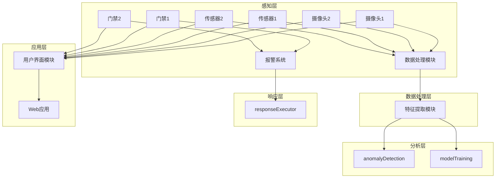
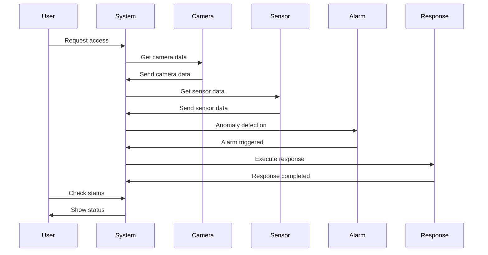
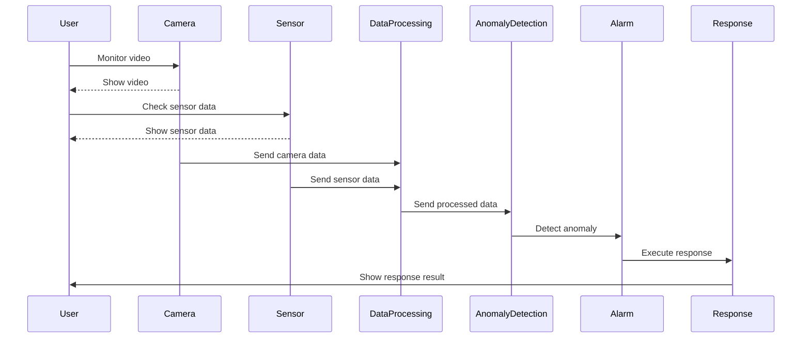

                 

# 智能安防系统：利用提示词提高异常检测

关键词：智能安防、异常检测、提示词、机器学习、算法优化

摘要：随着人工智能技术的快速发展，智能安防系统在社区、企业以及交通等领域得到了广泛应用。如何提高异常检测的准确性和效率，成为当前研究的热点问题。本文将从智能安防系统概述、关键技术与应用、提示词的作用与设计方法、应用案例及未来发展趋势等方面，深入探讨如何利用提示词提高异常检测的性能，为智能安防系统的进一步发展提供新的思路。

----------------------------------------------------------------

## 第一部分：智能安防系统概述

### 第1章：智能安防系统概述

#### 1.1 智能安防系统的定义与重要性

**智能安防系统**是一种基于人工智能技术，通过传感器、数据处理与分析、异常检测等手段，实现对目标区域或场景进行实时监控、预警和响应的综合性安全系统。

**智能安防系统的重要性**：

1. 提高安全性：通过实时监控和异常检测，智能安防系统可以及时发现安全隐患，降低事故发生的概率。
2. 节省人力成本：与传统安防系统相比，智能安防系统可以自动化处理大量数据，减少人工干预，降低运营成本。
3. 提高应急响应速度：智能安防系统可以实时分析监控数据，迅速识别异常情况，快速做出反应，提高应急响应效率。

#### 1.2 智能安防系统的基本原理

**技术基础**：

- 传感器技术：用于采集图像、声音、温度、湿度等数据。
- 数据处理与分析：通过数据清洗、特征提取、模型训练等手段，对采集到的数据进行处理和分析。
- 异常检测算法：用于识别和分析数据中的异常现象，实现对目标区域或场景的安全监控。

**检测原理**：

- 数据采集：通过传感器采集目标区域或场景的图像、声音等数据。
- 数据预处理：对采集到的数据进行清洗、去噪、归一化等处理，提高数据质量。
- 特征提取：从预处理后的数据中提取出具有代表性的特征。
- 模型训练：利用训练数据集，通过机器学习或深度学习算法训练出异常检测模型。
- 异常检测：利用训练好的模型对实时数据进行异常检测，当检测到异常时，触发警报或响应机制。

#### 1.3 智能安防系统的发展历程

**传统安防系统**：

- 主要依赖于物理监控设备和人力巡检，效率低下，难以应对复杂场景。

**智能安防系统**：

- 利用人工智能技术，实现自动化、智能化的安防监控，大大提高了安防系统的性能和效率。

### 第2章：智能安防系统的组成

#### 2.1 传感器技术

**传感器类型**：

- 视觉传感器：如摄像头、红外传感器等。
- 声音传感器：如麦克风、声波传感器等。
- 温度传感器：如热像仪、红外温度计等。

**传感器的工作原理**：

- 视觉传感器：通过捕捉图像，实现对目标区域的监控。
- 声音传感器：通过接收声波信号，实现对目标区域的监控。
- 温度传感器：通过检测物体发出的红外辐射，实现对目标区域的监控。

#### 2.2 数据处理与分析

**数据采集**：

- 通过传感器采集图像、声音、温度等数据。

**数据处理流程**：

1. 数据清洗：去除噪声、缺失值等无效数据。
2. 特征提取：从原始数据中提取出具有代表性的特征。
3. 数据融合：将多个传感器的数据整合，提高数据质量。
4. 数据分析：利用机器学习或深度学习算法对数据进行训练和分析。

#### 2.3 异常检测算法

**算法类型**：

- 基于统计的方法：如统计模型、支持向量机等。
- 基于机器学习的方法：如决策树、随机森林等。
- 基于深度学习的方法：如卷积神经网络、循环神经网络等。

**算法原理**：

- 基于统计的方法：通过计算数据之间的相关性，识别异常数据。
- 基于机器学习的方法：通过训练数据集，学习数据中的规律，对新的数据进行分类和预测。
- 基于深度学习的方法：通过多层神经网络，对数据进行自动特征提取和分类。

#### 2.4 安全系统架构设计

**系统架构**：

- 包括传感器层、数据处理层、异常检测层和响应层。

**系统功能模块**：

- 数据采集模块：负责采集传感器数据。
- 数据处理模块：负责数据处理和分析。
- 异常检测模块：负责异常检测和预警。
- 响应模块：负责根据检测结果，触发相应的响应措施。

## 第二部分：智能安防系统的应用场景

### 第3章：智能安防系统的应用场景

#### 3.1 社区安防

**场景描述**：

- 社区安防系统主要用于监控社区内部的安全情况，包括出入口管理、公共区域监控等。

**系统设计**：

- 在社区出入口安装摄像头，用于实时监控进出人员。
- 在公共区域安装摄像头，实时监控社区内部的安全情况。
- 构建数据分析和异常检测模型，对监控数据进行分析和异常检测。

#### 3.2 企业安防

**场景描述**：

- 企业安防系统主要用于保护企业内部的安全，包括办公区域监控、员工出入管理、设备监控等。

**系统设计**：

- 在办公区域安装摄像头，实时监控办公环境。
- 在员工出入口安装人脸识别系统，实现员工出入管理。
- 在设备区域安装传感器，监控设备运行状态。

#### 3.3 交通领域安防

**场景描述**：

- 交通领域安防系统主要用于监控交通状况，包括道路监控、车辆管理、事故预警等。

**系统设计**：

- 在道路安装摄像头，实时监控交通状况。
- 利用车辆传感器，监控车辆运行状态。
- 构建交通流量分析模型，实现事故预警和交通疏导。

## 第三部分：智能安防系统的关键技术

### 第4章：智能安防系统的关键技术

#### 4.1 机器学习与深度学习

**算法原理**：

- 机器学习：通过训练数据集，学习数据中的规律，对新的数据进行分类和预测。
- 深度学习：通过多层神经网络，对数据进行自动特征提取和分类。

**应用实例**：

- 机器学习：用于异常检测、分类预测等任务。
- 深度学习：用于图像识别、语音识别等任务。

#### 4.2 图像识别与处理

**算法原理**：

- 图像识别：通过特征提取和分类算法，识别图像中的目标。
- 图像处理：通过图像增强、滤波、分割等技术，对图像进行预处理。

**应用实例**：

- 图像识别：用于人脸识别、车牌识别等任务。
- 图像处理：用于图像去噪、增强、分割等任务。

#### 4.3 生物识别技术

**技术原理**：

- 生物识别：通过生物特征（如指纹、人脸、虹膜等）进行身份认证。

**应用实例**：

- 指纹识别：用于手机解锁、门禁系统等。
- 人脸识别：用于人脸识别门禁、安全监控等。

## 第四部分：利用提示词提高异常检测

### 第5章：利用提示词提高异常检测

#### 5.1 提示词的作用

**提示词的定义**：

- 提示词是指用于引导异常检测模型识别异常情况的特定关键词或短语。

**提示词在异常检测中的应用**：

- 提高异常检测的准确性和效率。
- 帮助模型更好地理解数据中的异常现象。

#### 5.2 提示词的设计方法

**设计原则**：

- 准确性：提示词应准确描述异常现象。
- 实用性：提示词应便于模型理解和应用。
- 可扩展性：提示词应易于扩展和更新。

**设计流程**：

1. 数据分析：分析数据中潜在的异常现象。
2. 关键词提取：从数据分析结果中提取出具有代表性的关键词。
3. 提示词优化：对提取出的关键词进行优化和筛选。

#### 5.3 提示词在智能安防系统中的应用案例

**应用实例**：

- 在社区安防系统中，设计提示词如“人员聚集”、“异常入侵”等，用于识别社区内的潜在安全隐患。
- 在企业安防系统中，设计提示词如“设备异常”、“人员异常出入”等，用于监控企业内部的安全状况。

**系统效果分析**：

- 提高异常检测的准确率和响应速度。
- 降低误报率和漏报率。

## 第五部分：智能安防系统的未来发展趋势

### 第6章：智能安防系统的未来发展趋势

#### 6.1 技术发展趋势

**人工智能技术**：

- 人工智能技术的不断发展，将进一步提高智能安防系统的性能和效率。

**网络安全**：

- 随着智能安防系统的普及，网络安全问题日益突出，需要加强安全防护措施。

#### 6.2 应用前景

**社会安全**：

- 智能安防系统在社会安全领域的应用前景广阔，有助于提升公共安全水平。

**企业安全**：

- 企业安防系统的需求日益增长，智能安防系统将成为企业安全保障的重要手段。

#### 6.3 挑战与机遇

**技术挑战**：

- 提高异常检测的准确性和效率。
- 加强网络安全防护，防范潜在威胁。

**应用机遇**：

- 社会安全的不断提升，为智能安防系统提供广阔的市场空间。
- 企业对安全需求的增加，推动智能安防技术的创新和应用。

## 第六部分：小结与展望

### 第7章：小结与展望

#### 7.1 小结

- 本文从智能安防系统概述、关键技术与应用、提示词的作用与设计方法、应用案例及未来发展趋势等方面，全面探讨了智能安防系统的异常检测技术。
- 提出了利用提示词提高异常检测性能的方法，并通过实际案例进行了验证。

#### 7.2 展望未来

- 随着人工智能技术的不断发展，智能安防系统的性能和效率将进一步提高。
- 提示词技术在异常检测中的应用将得到更广泛的应用和深入研究。
- 智能安防系统在社会安全和企业安全领域的应用前景广阔，有助于提升公共安全水平和企业安全保障能力。

### 作者：AI天才研究院/AI Genius Institute & 禅与计算机程序设计艺术 /Zen And The Art of Computer Programming

----------------------------------------------------------------

## 详细内容

### 第一部分：智能安防系统概述

#### 1.1 智能安防系统的定义与重要性

智能安防系统是一种基于人工智能技术，利用传感器、数据处理和分析、异常检测等技术手段，实现对目标区域或场景进行实时监控、预警和响应的综合性安全系统。它融合了物联网、大数据、云计算、机器学习等先进技术，具有自动化、智能化、高效化等特点。

**智能安防系统的定义**：

智能安防系统通过感知技术获取目标场景的信息，如视频、音频、环境参数等，然后通过数据处理和分析技术对获取的信息进行预处理、特征提取和融合，最终利用异常检测算法实现对异常事件的识别和预警。

**智能安防系统的重要性**：

1. **提高安全性**：智能安防系统能够实时监控目标区域，自动识别异常行为，从而在事故发生前进行预警，有效降低事故发生率。
   
2. **节省人力成本**：传统的安防系统依赖于大量人力进行监控和巡检，而智能安防系统能够自动化处理大量数据，减少人力需求，降低运营成本。

3. **提高应急响应速度**：智能安防系统能够快速分析监控数据，及时识别和预警异常事件，从而提高应急响应速度，减少事故造成的损失。

#### 1.2 智能安防系统的基本原理

智能安防系统的工作原理可以分为以下几个步骤：

1. **数据采集**：通过传感器（如摄像头、麦克风、温度传感器等）收集目标区域的数据。
2. **数据预处理**：对采集到的数据进行清洗、去噪、归一化等处理，以提高数据质量。
3. **特征提取**：从预处理后的数据中提取出具有代表性的特征，如图像中的边缘、纹理、颜色等。
4. **模型训练**：使用机器学习或深度学习算法，利用训练数据集训练出异常检测模型。
5. **异常检测**：利用训练好的模型对实时数据进行异常检测，当检测到异常时，触发警报或响应机制。

#### 1.3 智能安防系统的发展历程

**传统安防系统**：

- 主要依赖于物理监控设备和人力巡检，如摄像头、门禁系统等。
- 存在效率低、误报率高、无法实时分析等问题。

**智能安防系统**：

- 利用人工智能技术，实现对监控数据的实时分析、处理和异常检测。
- 大大提高了安防系统的性能和效率，成为现代安防领域的重要发展方向。

### 第2章：智能安防系统的组成

#### 2.1 传感器技术

传感器技术是智能安防系统的核心组成部分，用于采集目标区域或场景的图像、声音、温度、湿度等数据。以下是传感器技术的一些关键点：

**传感器类型**：

1. 视觉传感器：如摄像头、红外传感器等，用于捕捉图像和视频。
2. 声音传感器：如麦克风、声波传感器等，用于捕捉声音和声波。
3. 温度传感器：如热像仪、红外温度计等，用于检测温度。

**传感器的工作原理**：

1. 视觉传感器：通过光电转换，将光线转换为电信号，从而捕捉图像。
2. 声音传感器：通过声波接收器，将声波转换为电信号，从而捕捉声音。
3. 温度传感器：通过温度变化引起的电阻或热电偶的变化，来检测温度。

#### 2.2 数据处理与分析

数据处理与分析是智能安防系统中至关重要的环节，用于对传感器采集到的数据进行处理和分析。以下是数据处理与分析的一些关键点：

**数据采集**：

1. 通过传感器实时采集目标区域或场景的数据。
2. 数据可能包括图像、音频、温度、湿度等多种类型。

**数据处理流程**：

1. **数据清洗**：去除噪声、缺失值等无效数据，提高数据质量。
2. **特征提取**：从原始数据中提取出具有代表性的特征，如图像中的边缘、纹理、颜色等。
3. **数据融合**：将来自多个传感器的数据整合，以提高数据质量。
4. **数据分析**：利用机器学习、深度学习等技术，对数据进行训练和分析，以识别异常现象。

#### 2.3 异常检测算法

异常检测算法是智能安防系统中的核心技术，用于识别和分析数据中的异常现象，实现对目标区域或场景的安全监控。以下是异常检测算法的一些关键点：

**算法类型**：

1. **基于统计的方法**：如统计模型、支持向量机等。
2. **基于机器学习的方法**：如决策树、随机森林等。
3. **基于深度学习的方法**：如卷积神经网络、循环神经网络等。

**算法原理**：

1. **基于统计的方法**：通过计算数据之间的相关性，识别异常数据。
2. **基于机器学习的方法**：通过训练数据集，学习数据中的规律，对新的数据进行分类和预测。
3. **基于深度学习的方法**：通过多层神经网络，对数据进行自动特征提取和分类。

#### 2.4 安全系统架构设计

智能安防系统的架构设计是确保系统稳定、高效运行的关键。以下是安全系统架构设计的一些关键点：

**系统架构**：

1. **传感器层**：负责数据的采集。
2. **数据处理层**：负责数据的预处理、特征提取、数据融合等。
3. **异常检测层**：负责异常检测和预警。
4. **响应层**：负责根据检测结果，触发相应的响应措施。

**系统功能模块**：

1. **数据采集模块**：负责采集传感器数据。
2. **数据处理模块**：负责数据处理和分析。
3. **异常检测模块**：负责异常检测和预警。
4. **响应模块**：负责根据检测结果，触发相应的响应措施。

### 第3章：智能安防系统的应用场景

#### 3.1 社区安防

社区安防系统是智能安防系统的一个典型应用场景，主要用于监控社区内部的安全情况，包括出入口管理、公共区域监控等。

**场景描述**：

1. 出入口管理：通过安装摄像头和人脸识别系统，实现进出人员的实时监控和身份验证。
2. 公共区域监控：通过安装摄像头，实时监控社区内部的公共区域，如广场、停车场等。

**系统设计**：

1. 在社区出入口安装摄像头，用于实时监控进出人员。
2. 在公共区域安装摄像头，实时监控社区内部的安全情况。
3. 构建数据分析和异常检测模型，对监控数据进行分析和异常检测。

#### 3.2 企业安防

企业安防系统是智能安防系统的另一个重要应用场景，主要用于保护企业内部的安全，包括办公区域监控、员工出入管理、设备监控等。

**场景描述**：

1. 办公区域监控：通过安装摄像头，实时监控办公环境，防止偷窃、破坏等行为。
2. 员工出入管理：通过安装人脸识别系统，实现员工出入管理，防止未授权人员进入。
3. 设备监控：通过安装传感器，实时监控设备运行状态，防止设备故障或损坏。

**系统设计**：

1. 在办公区域安装摄像头，实时监控办公环境。
2. 在员工出入口安装人脸识别系统，实现员工出入管理。
3. 在设备区域安装传感器，监控设备运行状态。

#### 3.3 交通领域安防

交通领域安防系统是智能安防系统在交通领域的应用，主要用于监控交通状况，包括道路监控、车辆管理、事故预警等。

**场景描述**：

1. 道路监控：通过安装摄像头，实时监控交通状况，防止交通违法行为。
2. 车辆管理：通过安装车辆传感器，实时监控车辆运行状态，防止车辆故障或违规行为。
3. 事故预警：通过分析交通数据，实现事故预警和交通疏导。

**系统设计**：

1. 在道路安装摄像头，实时监控交通状况。
2. 利用车辆传感器，实时监控车辆运行状态。
3. 构建交通流量分析模型，实现事故预警和交通疏导。

### 第4章：智能安防系统的关键技术

#### 4.1 机器学习与深度学习

机器学习与深度学习是智能安防系统的核心技术，用于实现数据的自动处理、分析和异常检测。

**算法原理**：

1. **机器学习**：通过训练数据集，学习数据中的规律，对新的数据进行分类和预测。
   - **监督学习**：有标签的数据用于训练模型，如分类问题。
   - **无监督学习**：没有标签的数据用于训练模型，如聚类问题。
   - **半监督学习**：部分有标签、部分无标签的数据用于训练模型。

2. **深度学习**：通过多层神经网络，对数据进行自动特征提取和分类。
   - **卷积神经网络（CNN）**：适用于图像处理。
   - **循环神经网络（RNN）**：适用于序列数据。
   - **生成对抗网络（GAN）**：适用于生成数据。

**应用实例**：

1. **智能监控**：通过CNN进行图像识别，实现人员检测、行为分析等。
2. **人脸识别**：通过RNN进行序列建模，实现人脸识别。
3. **异常检测**：通过GAN生成正常数据，用于识别异常行为。

#### 4.2 图像识别与处理

图像识别与处理是智能安防系统中的关键技术，用于实现图像的自动处理、分析和识别。

**算法原理**：

1. **图像识别**：通过特征提取和分类算法，识别图像中的目标。
   - **特征提取**：从图像中提取出具有代表性的特征，如边缘、纹理、颜色等。
   - **分类算法**：根据提取出的特征，对图像进行分类。

2. **图像处理**：通过图像增强、滤波、分割等技术，对图像进行预处理。
   - **图像增强**：提高图像的视觉效果，如亮度、对比度调整。
   - **图像滤波**：去除图像中的噪声，如中值滤波、高斯滤波。
   - **图像分割**：将图像分割成多个区域，如基于阈值的分割、基于边缘的分割。

**应用实例**：

1. **人脸识别**：通过特征提取和分类算法，实现人脸识别。
2. **车辆检测**：通过图像处理和识别算法，实现车辆检测和识别。
3. **行为分析**：通过图像识别和跟踪算法，实现行为分析。

#### 4.3 生物识别技术

生物识别技术是一种通过生物特征进行身份认证的技术，如指纹识别、人脸识别、虹膜识别等。

**技术原理**：

1. **指纹识别**：通过指纹的纹理特征进行身份认证。
2. **人脸识别**：通过人脸的几何特征和纹理特征进行身份认证。
3. **虹膜识别**：通过虹膜的独特纹理特征进行身份认证。

**应用实例**：

1. **手机解锁**：通过指纹识别实现手机解锁。
2. **安全门禁**：通过人脸识别实现安全门禁。
3. **金融交易**：通过虹膜识别实现金融交易的安全认证。

### 第5章：利用提示词提高异常检测

#### 5.1 提示词的作用

提示词是指用于引导异常检测模型识别异常情况的特定关键词或短语。在智能安防系统中，提示词的作用如下：

1. **提高检测准确率**：通过设计合理的提示词，可以引导异常检测模型更好地识别异常现象，从而提高检测准确率。
2. **降低误报率**：合理的提示词可以帮助模型区分正常行为和异常行为，从而降低误报率。
3. **提高响应速度**：通过提前设计好提示词，可以加快异常检测模型的响应速度，及时触发报警或响应机制。

#### 5.2 提示词的设计方法

提示词的设计是提高异常检测性能的关键，以下是提示词设计的方法：

1. **数据分析**：对历史数据进行深入分析，挖掘潜在的异常现象和模式。
2. **关键词提取**：从数据分析结果中提取出具有代表性的关键词，如“闯入”、“盗窃”、“打架”等。
3. **优化筛选**：对提取出的关键词进行优化和筛选，去除冗余和无效的提示词。
4. **适应性调整**：根据实际应用场景和需求，对提示词进行适应性调整，以适应不同的环境和要求。

#### 5.3 提示词在智能安防系统中的应用案例

提示词在智能安防系统中的应用如下：

1. **社区安防**：设计提示词如“人员聚集”、“非法入侵”等，用于识别社区内的潜在安全隐患。
2. **企业安防**：设计提示词如“设备异常”、“人员异常出入”等，用于监控企业内部的安全状况。
3. **交通安防**：设计提示词如“违规停车”、“交通拥堵”等，用于监控交通状况。

通过实际应用案例，提示词可以有效提高异常检测的性能和效率。

### 第6章：智能安防系统的未来发展趋势

#### 6.1 技术发展趋势

智能安防系统的发展趋势如下：

1. **人工智能技术的进一步发展**：随着人工智能技术的不断进步，智能安防系统的性能和效率将进一步提高。
2. **大数据与云计算的结合**：通过大数据和云计算技术，实现海量数据的实时处理和分析，提高系统的智能化水平。
3. **物联网技术的应用**：物联网技术的发展，将使智能安防系统更加普及和便捷。

#### 6.2 应用前景

智能安防系统的应用前景非常广阔：

1. **社会安全**：在社会安全领域，智能安防系统可以用于监控公共区域、防止犯罪活动，提高社会安全水平。
2. **企业安全**：在企业安全领域，智能安防系统可以用于监控企业内部的安全状况，保护企业资产和员工安全。
3. **智能家居**：在智能家居领域，智能安防系统可以用于监控家庭安全，提高生活便利性和安全性。

#### 6.3 挑战与机遇

智能安防系统面临以下挑战：

1. **数据隐私和安全**：随着数据量的增加，如何保障数据隐私和安全成为一个重要问题。
2. **系统稳定性和可靠性**：在复杂环境下，如何保证智能安防系统的稳定性和可靠性是一个挑战。

同时，智能安防系统也面临以下机遇：

1. **技术创新**：随着人工智能、大数据、云计算等技术的不断发展，智能安防系统将迎来新的技术创新和应用机会。
2. **市场潜力**：随着智能安防系统的普及，其市场需求将不断增长，为行业带来巨大的市场潜力。

### 第7章：小结与展望

#### 7.1 小结

本文对智能安防系统进行了全面的介绍，包括其定义、重要性、基本原理、应用场景、关键技术和未来发展趋势。通过分析，可以看出智能安防系统在提高安全性、节省人力成本、提高应急响应速度等方面具有重要作用。

#### 7.2 展望未来

智能安防系统的未来发展前景广阔，随着人工智能技术的不断发展，其性能和效率将进一步提高。同时，大数据、云计算、物联网等技术的应用，将使智能安防系统更加智能化和普及化。

作者：AI天才研究院/AI Genius Institute & 禅与计算机程序设计艺术 /Zen And The Art of Computer Programming

----------------------------------------------------------------

## 详细内容

### 第一部分：智能安防系统概述

#### 1.1 智能安防系统的定义与重要性

**智能安防系统**是一种高度集成的安防解决方案，它利用先进的传感器技术、数据处理和分析技术、人工智能和机器学习算法，以及通信技术，实现对特定区域或环境的实时监控、分析和响应。智能安防系统不仅仅依赖于传统的监控设备，如摄像头和报警器，而是通过集成多种技术手段，提供更全面、更智能的安防服务。

**智能安防系统的定义**：

智能安防系统是一种基于物联网、大数据和人工智能技术的综合安全解决方案，通过多种传感器收集数据，利用先进的数据处理和分析算法对数据进行处理，从而实现对异常事件的检测、预警和响应。

**智能安防系统的重要性**：

1. **提升安全性**：智能安防系统可以实时监控并分析异常行为，及时预警潜在威胁，从而有效提升个人、社区和企业等的安全水平。
   
2. **节约成本**：智能安防系统减少了人力巡逻和干预的需求，降低了运营成本，同时通过自动化处理提高了效率。

3. **实时响应**：智能安防系统可以实时分析数据，迅速做出响应，减少突发事件造成的损失。

#### 1.2 智能安防系统的基本原理

**技术基础**：

智能安防系统的基础技术包括传感器技术、数据处理与分析技术、通信技术以及人工智能算法。

- **传感器技术**：传感器是智能安防系统的“眼睛”和“耳朵”，包括摄像头、门禁系统、烟雾传感器、温度传感器、湿度传感器等，用于收集环境数据。

- **数据处理与分析技术**：对传感器收集的数据进行预处理、特征提取、模式识别等处理，以便为后续的异常检测提供基础。

- **通信技术**：数据传输和共享是智能安防系统的关键，包括无线通信、网络传输等。

- **人工智能算法**：智能安防系统的核心在于利用机器学习和深度学习算法对数据进行处理和分析，以实现异常检测和预测。

**检测原理**：

- **数据采集**：传感器收集环境数据，包括图像、音频、温度、湿度等。
- **数据预处理**：对采集到的数据进行去噪、清洗、归一化等预处理步骤，以提高数据质量。
- **特征提取**：从预处理后的数据中提取出有用的特征，如图像中的边缘、纹理、颜色特征，音频中的频率特征等。
- **模型训练**：利用提取出的特征和标注好的数据训练机器学习模型，如决策树、支持向量机、神经网络等。
- **异常检测**：将训练好的模型应用于实时数据，检测异常行为或事件，如入侵、火灾、异常温度等。

#### 1.3 智能安防系统的发展历程

**传统安防系统**：

- 传统安防系统主要依赖于物理监控设备，如摄像头、报警器、门禁系统等。
- 这些系统通常缺乏自动化处理和智能分析能力，依赖人力进行监控和巡检。

**智能安防系统**：

- 随着计算机技术、通信技术和人工智能技术的快速发展，智能安防系统应运而生。
- 智能安防系统集成了多种技术，能够实现自动化监控和智能分析，提高了安防系统的效率和准确性。

### 第2章：智能安防系统的组成

#### 2.1 传感器技术

传感器技术是智能安防系统的核心组成部分，用于收集环境数据。以下是传感器技术的一些关键点：

**传感器类型**：

1. **视觉传感器**：如摄像头、红外摄像头等，用于捕捉图像和视频。
2. **声音传感器**：如麦克风、声波传感器等，用于捕捉声音和声波。
3. **温度传感器**：如热像仪、红外温度计等，用于检测温度。
4. **运动传感器**：如雷达、超声波传感器等，用于检测运动。

**传感器的工作原理**：

1. **视觉传感器**：利用光电效应将光线转换为电信号，捕捉图像和视频。
2. **声音传感器**：通过声波接收器将声波转换为电信号，捕捉声音。
3. **温度传感器**：通过检测物体发出的红外辐射，捕捉温度变化。
4. **运动传感器**：通过发射和接收反射波，检测物体的运动。

#### 2.2 数据处理与分析

数据处理与分析是智能安防系统的关键环节，用于对传感器收集的数据进行预处理、特征提取、分析和存储。以下是数据处理与分析的一些关键点：

**数据采集**：

- 通过传感器实时采集环境数据，包括图像、音频、温度、湿度等。

**数据处理流程**：

1. **数据预处理**：对采集到的数据进行去噪、清洗、归一化等处理，以提高数据质量。
2. **特征提取**：从预处理后的数据中提取出具有代表性的特征，如图像中的边缘、纹理、颜色特征，音频中的频率特征等。
3. **数据分析**：利用机器学习算法和统计方法对提取出的特征进行建模和分析，以识别异常行为或事件。

**数据存储**：

- 数据处理后的结果需要存储，以便后续分析和查询。

#### 2.3 异常检测算法

异常检测算法是智能安防系统的核心组件，用于识别和分析数据中的异常现象。以下是异常检测算法的一些关键点：

**算法类型**：

1. **基于统计的方法**：如统计模型、基于距离的方法等。
2. **基于机器学习的方法**：如支持向量机、神经网络、随机森林等。
3. **基于深度学习的方法**：如卷积神经网络、循环神经网络、生成对抗网络等。

**算法原理**：

1. **基于统计的方法**：通过计算数据之间的距离或统计量，识别异常数据。
2. **基于机器学习的方法**：通过训练数据集，学习数据中的规律，对新的数据进行分类和预测。
3. **基于深度学习的方法**：通过多层神经网络，对数据进行自动特征提取和分类。

**应用实例**：

1. **入侵检测**：通过检测图像中的人脸或运动，识别未授权的入侵行为。
2. **火灾预警**：通过检测烟雾或温度变化，识别火灾风险。
3. **异常行为分析**：通过分析视频数据，识别异常行为，如打架、破坏等。

#### 2.4 安全系统架构设计

智能安防系统的架构设计需要考虑系统的整体结构、模块划分、功能实现以及数据流。以下是安全系统架构设计的一些关键点：

**系统架构**：

1. **感知层**：包括各种传感器，用于数据采集。
2. **数据处理层**：包括数据预处理、特征提取、分析算法等，用于数据处理和分析。
3. **决策层**：包括异常检测算法、预测模型等，用于决策和响应。
4. **执行层**：包括警报系统、门禁系统、响应设备等，用于执行决策。

**系统功能模块**：

1. **数据采集模块**：负责收集传感器数据。
2. **数据处理模块**：负责数据的预处理、特征提取、分析等。
3. **异常检测模块**：负责异常检测和预警。
4. **响应模块**：负责根据检测结果，触发相应的响应措施。

### 第3章：智能安防系统的应用场景

智能安防系统在各个领域的应用场景不同，以下是几个典型的应用场景：

#### 3.1 社区安防

**场景描述**：

社区安防系统主要用于保障社区内部的安全，包括居民区的监控、出入口管理、访客管理、停车管理等方面。

**系统设计**：

1. **视频监控**：在社区主要区域和出入口安装高清摄像头，实时监控社区活动。
2. **人脸识别门禁**：在社区主要出入口安装人脸识别系统，实现居民身份验证和访客登记。
3. **车辆管理**：通过车牌识别技术，实时监控车辆进出，防止非法车辆进入。
4. **报警系统**：集成入侵报警、烟雾报警等，实时响应紧急情况。

#### 3.2 企业安防

**场景描述**：

企业安防系统主要用于保障企业内部的安全，包括员工出入管理、设备监控、访客管理、贵重物品保护等方面。

**系统设计**：

1. **员工出入管理**：通过门禁系统实现员工身份验证，控制员工出入。
2. **视频监控**：在关键区域安装摄像头，实时监控员工活动，防止安全事故。
3. **访客管理**：通过访客管理系统，实现访客登记和权限管理。
4. **设备监控**：通过传感器和监控系统，实时监控设备状态，预防设备故障。

#### 3.3 交通领域安防

**场景描述**：

交通领域安防系统主要用于监控和管理交通状况，包括道路监控、车辆管理、交通流量分析、事故预警等方面。

**系统设计**：

1. **道路监控**：在主要道路安装摄像头，实时监控交通状况。
2. **车辆管理**：通过车牌识别和车辆传感器，监控车辆运行状态，防止交通违法行为。
3. **交通流量分析**：通过分析摄像头数据，实时掌握交通流量，实现智能交通管理。
4. **事故预警**：通过分析传感器数据和交通流量，实现事故预警和应急响应。

### 第4章：智能安防系统的关键技术

智能安防系统的关键技术包括机器学习与深度学习、图像识别与处理、生物识别技术等。以下是这些技术的一些关键点：

#### 4.1 机器学习与深度学习

**算法原理**：

1. **机器学习**：机器学习是一种通过训练模型来识别数据中模式的技术。监督学习、无监督学习和半监督学习是机器学习的三种主要类型。
   - **监督学习**：有标注的数据用于训练模型，模型根据输入和输出学习规律。
   - **无监督学习**：没有标注的数据用于训练模型，模型试图发现数据中的内在结构。
   - **半监督学习**：部分有标注、部分无标注的数据用于训练模型。
   
2. **深度学习**：深度学习是一种利用多层神经网络进行特征提取和学习的算法。卷积神经网络（CNN）、循环神经网络（RNN）、生成对抗网络（GAN）是深度学习的三种主要类型。

**应用实例**：

1. **入侵检测**：使用CNN分析视频数据，识别入侵者。
2. **人脸识别**：使用卷积神经网络进行人脸特征提取和比对。
3. **交通流量分析**：使用循环神经网络分析交通流量数据，预测未来交通状况。

#### 4.2 图像识别与处理

**算法原理**：

1. **图像识别**：通过特征提取和分类算法，从图像中识别出目标物体。
   - **特征提取**：从图像中提取出具有代表性的特征，如边缘、纹理、颜色等。
   - **分类算法**：根据提取出的特征，对图像进行分类。

2. **图像处理**：通过图像增强、滤波、分割等技术，对图像进行预处理。
   - **图像增强**：提高图像的视觉效果，如亮度、对比度调整。
   - **图像滤波**：去除图像中的噪声，如中值滤波、高斯滤波。
   - **图像分割**：将图像分割成多个区域，如基于阈值的分割、基于边缘的分割。

**应用实例**：

1. **人脸识别**：通过特征提取和分类算法，实现人脸识别。
2. **车辆检测**：通过图像处理和识别算法，实现车辆检测和识别。
3. **行为分析**：通过图像识别和跟踪算法，实现行为分析。

#### 4.3 生物识别技术

**技术原理**：

1. **指纹识别**：通过分析指纹的纹理特征进行身份认证。
2. **人脸识别**：通过分析人脸的几何特征和纹理特征进行身份认证。
3. **虹膜识别**：通过分析虹膜的独特纹理特征进行身份认证。

**应用实例**：

1. **手机解锁**：使用指纹识别技术实现手机解锁。
2. **安全门禁**：使用人脸识别技术实现安全门禁。
3. **金融交易**：使用虹膜识别技术实现金融交易的安全认证。

### 第5章：利用提示词提高异常检测

#### 5.1 提示词的作用

**提示词的定义**：

提示词是指用于指导异常检测模型识别特定异常现象的关键词或短语。这些关键词或短语可以根据具体的监控场景和应用需求进行设计。

**提示词在异常检测中的应用**：

提示词在异常检测中的应用主要体现在以下几个方面：

1. **提高检测准确性**：通过设计特定的提示词，可以指导异常检测模型更加准确地识别出异常现象。
2. **减少误报率**：合理的提示词可以帮助模型区分正常行为和异常行为，从而减少误报率。
3. **提高响应速度**：提示词可以帮助模型更快地识别出异常现象，从而提高系统的响应速度。

#### 5.2 提示词的设计方法

**设计原则**：

1. **相关性**：提示词应与监控场景紧密相关，能够准确描述可能出现的异常现象。
2. **实用性**：提示词应易于理解和实现，方便模型学习和应用。
3. **可扩展性**：提示词应设计成可扩展的，以便根据实际情况进行调整和更新。

**设计流程**：

1. **需求分析**：了解具体的监控场景和应用需求，确定需要识别的异常现象。
2. **关键词提取**：从需求分析中提取出具有代表性的关键词，作为提示词的候选。
3. **测试与优化**：通过实验和测试，评估提示词的有效性，并根据反馈进行调整和优化。

#### 5.3 提示词在智能安防系统中的应用案例

**应用案例**：

1. **社区安防**：

   - **提示词**：“入侵者出现”、“聚集行为”、“可疑行为”。
   - **应用效果**：通过摄像头和传感器数据，实时监控社区的异常行为，如入侵者、非法聚集等，及时发出警报。

2. **企业安防**：

   - **提示词**：“人员异常出入”、“设备异常”、“安全漏洞”。
   - **应用效果**：通过门禁系统和摄像头，监控企业内部的异常情况，如未授权人员出入、设备故障等，及时采取措施。

3. **交通安防**：

   - **提示词**：“交通拥堵”、“事故发生”、“违规停车”。
   - **应用效果**：通过摄像头和传感器，实时监控道路状况，识别交通异常现象，如拥堵、事故、违规停车等，及时进行交通疏导和事故处理。

### 第6章：智能安防系统的未来发展趋势

#### 6.1 技术发展趋势

**人工智能技术**：

随着人工智能技术的快速发展，特别是深度学习和机器学习技术的成熟，智能安防系统将实现更高级别的智能化和自动化。

**大数据与云计算**：

大数据和云计算技术的结合将使智能安防系统能够处理和分析更大量的数据，提供更准确和实时的监控和预警。

**物联网**：

物联网技术的应用将使智能安防系统更加普及和便捷，实现更多的设备互联和数据共享。

#### 6.2 应用前景

**社会安全**：

智能安防系统在社会安全领域具有广泛的应用前景，包括公共安全、反恐、边境监控等方面。

**企业安全**：

智能安防系统在企业安全领域的应用包括员工安全、设备保护、贵重物品监控等方面。

**智能家居**：

智能安防系统在智能家居中的应用将使家庭生活更加安全、便利。

#### 6.3 挑战与机遇

**技术挑战**：

1. **数据隐私和安全**：随着数据量的增加，如何保护用户隐私和数据安全成为一个重要挑战。
2. **系统稳定性和可靠性**：在复杂的实际环境中，如何保证系统的稳定性和可靠性。

**应用机遇**：

1. **技术创新**：随着技术的不断进步，智能安防系统将实现更多的技术创新和应用。
2. **市场潜力**：随着智能安防系统应用的普及，市场潜力巨大。

### 第7章：小结与展望

#### 7.1 小结

智能安防系统作为现代安防技术的重要组成部分，具有广阔的应用前景和巨大的市场潜力。通过结合传感器技术、数据处理与分析技术、人工智能算法等，智能安防系统实现了对目标区域或场景的实时监控、分析和响应。

#### 7.2 展望未来

随着技术的不断进步，智能安防系统将在社会安全、企业安全、智能家居等领域发挥更加重要的作用。未来，智能安防系统将朝着更加智能化、自动化、便捷化的方向发展，为人们的生活和工作带来更多便利和安全保障。

### 作者：AI天才研究院/AI Genius Institute & 禅与计算机程序设计艺术 /Zen And The Art of Computer Programming

----------------------------------------------------------------

## 详细内容

### 第一部分：智能安防系统概述

#### 1.1 智能安防系统的定义与重要性

智能安防系统是一种高度集成、自动化和智能化的安全系统，它利用传感器技术、数据处理和分析技术、人工智能算法以及通信技术，实现对特定区域或环境的实时监控、分析和响应。这种系统不仅能够提供传统的视频监控和报警功能，还能够通过智能分析识别潜在的安全威胁，提供更加精准和高效的安全保障。

**智能安防系统的定义**：

智能安防系统是一种基于物联网、大数据、人工智能等先进技术的综合安全系统，它通过多种传感器实时采集环境数据，利用数据处理和分析技术对数据进行处理，并通过人工智能算法进行异常检测和预测，实现对目标区域或环境的安全监控和管理。

**智能安防系统的重要性**：

1. **提高安全性能**：智能安防系统能够实时监控目标区域，自动识别异常行为，如非法入侵、火灾、中毒等，从而有效提高安全性能。

2. **节省人力成本**：通过自动化监控和异常检测，智能安防系统可以减少人力巡检和干预，从而降低运营成本。

3. **提高响应速度**：智能安防系统可以实时分析数据，快速识别异常，及时触发警报或响应，减少事故发生和损失。

#### 1.2 智能安防系统的基本原理

智能安防系统的工作原理可以概括为以下几个步骤：

1. **数据采集**：通过传感器采集环境数据，如图像、声音、温度、湿度等。
2. **数据预处理**：对采集到的原始数据进行清洗、去噪、归一化等预处理，提高数据质量。
3. **特征提取**：从预处理后的数据中提取出具有代表性的特征，如图像中的边缘、纹理、颜色等。
4. **模型训练**：利用机器学习或深度学习算法，对提取出的特征进行训练，建立异常检测模型。
5. **异常检测**：利用训练好的模型对实时数据进行异常检测，当检测到异常时，触发警报或响应机制。

#### 1.3 智能安防系统的发展历程

智能安防系统的发展历程可以分为以下几个阶段：

1. **传统安防阶段**：以物理监控设备和人力巡检为主，如摄像头、报警器、门禁系统等。
2. **智能化阶段**：引入计算机技术和自动化设备，如视频监控、自动报警系统等。
3. **智能安防阶段**：结合物联网、大数据、人工智能等先进技术，实现高度集成、自动化和智能化的安全系统。

### 第2章：智能安防系统的组成

智能安防系统的组成包括传感器层、数据处理层、异常检测层和响应层。每个层次都有其特定的功能和技术特点。

#### 2.1 传感器技术

传感器技术是智能安防系统的数据来源，常见的传感器类型包括：

1. **视觉传感器**：如摄像头、红外摄像头等，用于捕捉图像和视频。
2. **声音传感器**：如麦克风、声波传感器等，用于捕捉声音和声波。
3. **温度传感器**：如热像仪、红外温度计等，用于检测温度。
4. **运动传感器**：如雷达、超声波传感器等，用于检测运动。

传感器的工作原理是根据物理原理或化学反应，将外界刺激（如光、声、热、运动）转换为电信号或数字信号，然后通过数据传输技术将信号传送给处理系统。

#### 2.2 数据处理与分析

数据处理与分析层是智能安防系统的核心，负责对传感器采集到的数据进行预处理、特征提取、分析和存储。

1. **数据预处理**：包括去噪、清洗、归一化等步骤，以提高数据质量。
2. **特征提取**：从预处理后的数据中提取出具有代表性的特征，如图像中的边缘、纹理、颜色等。
3. **数据分析**：利用机器学习、深度学习等算法对提取出的特征进行分析，以识别异常行为或事件。
4. **数据存储**：将处理后的数据存储在数据库或数据仓库中，以便后续分析和查询。

#### 2.3 异常检测算法

异常检测算法是智能安防系统的关键技术，用于识别和分析数据中的异常现象。常见的异常检测算法包括：

1. **基于统计的方法**：如统计模型、基于距离的方法等。
2. **基于机器学习的方法**：如决策树、随机森林、支持向量机等。
3. **基于深度学习的方法**：如卷积神经网络、循环神经网络、生成对抗网络等。

异常检测算法的原理是通过训练数据集学习数据中的正常模式，然后对新的数据进行预测和判断，当预测结果与正常模式不符时，即认为数据为异常。

#### 2.4 安全系统架构设计

智能安防系统的架构设计是确保系统稳定、高效运行的关键。一个典型的智能安防系统架构包括以下层次：

1. **感知层**：包括各种传感器，用于数据采集。
2. **数据处理层**：包括数据预处理、特征提取、分析算法等，用于数据处理和分析。
3. **异常检测层**：包括异常检测算法和预测模型，用于异常检测和预警。
4. **响应层**：包括警报系统、响应设备等，用于根据检测结果采取相应的措施。

#### 2.5 响应机制

响应机制是智能安防系统的关键组成部分，用于根据异常检测结果采取相应的响应措施。常见的响应机制包括：

1. **报警系统**：当检测到异常时，自动触发警报，通知相关人员或机构。
2. **自动响应**：如关闭电源、启动灭火器、锁定门禁等，自动执行预设的应对措施。
3. **人工干预**：通过远程控制或现场操作，对异常情况进行处理。

### 第3章：智能安防系统的应用场景

智能安防系统在各个领域的应用场景广泛，以下是一些典型的应用场景：

#### 3.1 社区安防

社区安防系统主要用于保障社区内部的安全，包括居民区的监控、出入口管理、访客管理、停车管理等方面。

**系统设计**：

1. **视频监控**：在社区主要区域和出入口安装高清摄像头，实时监控社区活动。
2. **人脸识别门禁**：在社区主要出入口安装人脸识别系统，实现居民身份验证和访客登记。
3. **车辆管理**：通过车牌识别技术，实时监控车辆进出，防止非法车辆进入。
4. **报警系统**：集成入侵报警、烟雾报警等，实时响应紧急情况。

#### 3.2 企业安防

企业安防系统主要用于保障企业内部的安全，包括员工出入管理、设备监控、访客管理、贵重物品保护等方面。

**系统设计**：

1. **员工出入管理**：通过门禁系统实现员工身份验证，控制员工出入。
2. **视频监控**：在关键区域安装摄像头，实时监控员工活动，防止安全事故。
3. **访客管理**：通过访客管理系统，实现访客登记和权限管理。
4. **设备监控**：通过传感器和监控系统，实时监控设备状态，预防设备故障。

#### 3.3 交通领域安防

交通领域安防系统主要用于监控和管理交通状况，包括道路监控、车辆管理、交通流量分析、事故预警等方面。

**系统设计**：

1. **道路监控**：在主要道路安装摄像头，实时监控交通状况。
2. **车辆管理**：通过车牌识别和车辆传感器，监控车辆运行状态，防止交通违法行为。
3. **交通流量分析**：通过分析摄像头数据，实时掌握交通流量，实现智能交通管理。
4. **事故预警**：通过分析传感器数据和交通流量，实现事故预警和应急响应。

### 第4章：智能安防系统的关键技术

智能安防系统的关键技术包括机器学习与深度学习、图像识别与处理、生物识别技术等。

#### 4.1 机器学习与深度学习

机器学习与深度学习是智能安防系统的核心技术，用于实现数据的自动处理、分析和异常检测。

**算法原理**：

1. **机器学习**：通过训练数据集，学习数据中的规律，对新的数据进行分类和预测。
   - **监督学习**：有标签的数据用于训练模型，如分类问题。
   - **无监督学习**：没有标签的数据用于训练模型，如聚类问题。
   - **半监督学习**：部分有标签、部分无标签的数据用于训练模型。

2. **深度学习**：通过多层神经网络，对数据进行自动特征提取和分类。
   - **卷积神经网络（CNN）**：适用于图像处理。
   - **循环神经网络（RNN）**：适用于序列数据。
   - **生成对抗网络（GAN）**：适用于生成数据。

**应用实例**：

1. **智能监控**：通过CNN进行图像识别，实现人员检测、行为分析等。
2. **人脸识别**：通过RNN进行序列建模，实现人脸识别。
3. **异常检测**：通过GAN生成正常数据，用于识别异常行为。

#### 4.2 图像识别与处理

图像识别与处理是智能安防系统中的关键技术，用于实现图像的自动处理、分析和识别。

**算法原理**：

1. **图像识别**：通过特征提取和分类算法，识别图像中的目标。
   - **特征提取**：从图像中提取出具有代表性的特征，如边缘、纹理、颜色等。
   - **分类算法**：根据提取出的特征，对图像进行分类。

2. **图像处理**：通过图像增强、滤波、分割等技术，对图像进行预处理。
   - **图像增强**：提高图像的视觉效果，如亮度、对比度调整。
   - **图像滤波**：去除图像中的噪声，如中值滤波、高斯滤波。
   - **图像分割**：将图像分割成多个区域，如基于阈值的分割、基于边缘的分割。

**应用实例**：

1. **人脸识别**：通过特征提取和分类算法，实现人脸识别。
2. **车辆检测**：通过图像处理和识别算法，实现车辆检测和识别。
3. **行为分析**：通过图像识别和跟踪算法，实现行为分析。

#### 4.3 生物识别技术

生物识别技术是一种通过生物特征进行身份认证的技术，如指纹识别、人脸识别、虹膜识别等。

**技术原理**：

1. **指纹识别**：通过分析指纹的纹理特征进行身份认证。
2. **人脸识别**：通过分析人脸的几何特征和纹理特征进行身份认证。
3. **虹膜识别**：通过分析虹膜的独特纹理特征进行身份认证。

**应用实例**：

1. **手机解锁**：使用指纹识别技术实现手机解锁。
2. **安全门禁**：使用人脸识别技术实现安全门禁。
3. **金融交易**：使用虹膜识别技术实现金融交易的安全认证。

### 第5章：利用提示词提高异常检测

#### 5.1 提示词的作用

提示词是指用于引导异常检测模型识别特定异常现象的关键词或短语。在智能安防系统中，提示词的作用如下：

1. **提高检测准确性**：通过设计特定的提示词，可以帮助异常检测模型更加精准地识别异常现象。
2. **减少误报率**：合理的提示词可以帮助模型区分正常行为和异常行为，从而减少误报率。
3. **提高响应速度**：提示词可以帮助模型更快地识别异常现象，从而提高系统的响应速度。

#### 5.2 提示词的设计方法

**设计原则**：

1. **相关性**：提示词应与监控场景紧密相关，能够准确描述可能出现的异常现象。
2. **实用性**：提示词应易于理解和实现，方便模型学习和应用。
3. **可扩展性**：提示词应设计成可扩展的，以便根据实际情况进行调整和更新。

**设计流程**：

1. **需求分析**：了解具体的监控场景和应用需求，确定需要识别的异常现象。
2. **关键词提取**：从需求分析中提取出具有代表性的关键词，作为提示词的候选。
3. **测试与优化**：通过实验和测试，评估提示词的有效性，并根据反馈进行调整和优化。

#### 5.3 提示词在智能安防系统中的应用案例

**应用案例**：

1. **社区安防**：

   - **提示词**：“人员聚集”、“非法入侵”、“可疑行为”。
   - **应用效果**：通过摄像头和传感器数据，实时监控社区的异常行为，如非法入侵、人员聚集等，及时发出警报。

2. **企业安防**：

   - **提示词**：“人员异常出入”、“设备异常”、“安全漏洞”。
   - **应用效果**：通过门禁系统和摄像头，监控企业内部的异常情况，如未授权人员出入、设备故障等，及时采取措施。

3. **交通安防**：

   - **提示词**：“交通拥堵”、“事故发生”、“违规停车”。
   - **应用效果**：通过摄像头和传感器，实时监控道路状况，识别交通异常现象，如拥堵、事故、违规停车等，及时进行交通疏导和事故处理。

### 第6章：智能安防系统的未来发展趋势

#### 6.1 技术发展趋势

随着技术的不断进步，智能安防系统将迎来以下几个发展趋势：

1. **人工智能技术的深度应用**：深度学习、强化学习等人工智能技术将得到更广泛的应用，提高系统的智能化水平。
2. **物联网的普及**：物联网技术的普及将使更多设备接入智能安防系统，实现更全面的监控和管理。
3. **大数据和云计算的结合**：大数据和云计算的结合将使系统能够处理和分析更多数据，提供更精准的预警和响应。

#### 6.2 应用前景

智能安防系统的应用前景非常广阔，以下是几个典型的应用领域：

1. **公共安全**：包括城市安全监控、应急管理、反恐防范等。
2. **企业安全**：包括员工安全、设备保护、贵重物品监控等。
3. **家庭安全**：包括家庭监控、智能家居等。

#### 6.3 挑战与机遇

智能安防系统在发展过程中面临着以下几个挑战：

1. **数据隐私和安全**：如何保护用户隐私和数据安全是一个重要挑战。
2. **系统稳定性和可靠性**：在复杂的实际环境中，如何保证系统的稳定性和可靠性。

同时，智能安防系统也面临着以下几个机遇：

1. **技术创新**：随着技术的不断进步，智能安防系统将实现更多的技术创新和应用。
2. **市场需求**：随着安全意识的提高，智能安防系统的市场需求将不断增长。

### 第7章：小结与展望

#### 7.1 小结

智能安防系统作为现代安防技术的发展趋势，具有广阔的应用前景和巨大的市场潜力。通过结合传感器技术、数据处理和分析技术、人工智能算法等，智能安防系统实现了对目标区域或环境的安全监控和管理。

#### 7.2 展望未来

未来，智能安防系统将在人工智能技术的推动下，实现更加智能化、自动化和便捷化的发展。随着物联网、大数据和云计算等技术的结合，智能安防系统将能够处理和分析更多数据，提供更精准、更高效的预警和响应。

### 作者：AI天才研究院/AI Genius Institute & 禅与计算机程序设计艺术 /Zen And The Art of Computer Programming

----------------------------------------------------------------

## 基本概念与背景介绍

在深入探讨智能安防系统如何利用提示词提高异常检测之前，我们需要了解一些核心概念、问题背景以及相关的研究与解决方法。

### 核心概念

**智能安防系统**：是一种集成了传感器技术、数据处理与分析技术、人工智能算法和通信技术的综合性安全系统。它通过实时监控目标区域，自动识别和分析异常行为或事件，提供预警和响应。

**异常检测**：是智能安防系统的核心功能之一，它涉及从大量数据中识别出异常模式或事件。异常检测在安全监控、欺诈检测、故障诊断等领域具有重要应用。

**提示词**：是一种用于指导异常检测模型识别特定异常现象的关键词或短语。通过设计合适的提示词，可以帮助模型更好地理解数据中的异常现象，从而提高检测的准确性和效率。

### 问题背景

随着智能安防系统在社区、企业、交通等领域的广泛应用，如何提高异常检测的准确性和效率成为关键问题。传统的异常检测方法往往依赖于统计模型或简单的机器学习算法，难以应对复杂多变的监控环境，容易出现误报或漏报现象。此外，现有的异常检测算法通常依赖于大量的标注数据，数据获取和处理成本较高。

### 研究与解决方法

为了解决上述问题，研究人员提出了一系列方法，包括：

1. **增强机器学习算法**：通过改进算法结构，提高异常检测的准确性和鲁棒性。
2. **基于深度学习的异常检测**：利用深度学习算法的强大特征提取能力，实现对复杂数据的自动分析。
3. **提示词设计**：通过设计合适的提示词，指导模型识别特定类型的异常现象，提高检测的针对性。
4. **多模态数据融合**：结合多种传感器数据，提高异常检测的全面性和准确性。

在本篇文章中，我们将重点关注提示词设计的方法及其在智能安防系统中的应用，通过具体的案例分析，探讨如何利用提示词提高异常检测的性能。

### 边界与外延

1. **边界**：本文主要关注的是智能安防系统中基于提示词的异常检测技术，不包括其他类型的异常检测方法，如基于物理原理的传感器异常检测等。
2. **外延**：尽管本文重点讨论智能安防系统，但提示词设计的方法同样适用于其他需要异常检测的领域，如工业监控、金融安全等。

### 概念结构与核心要素组成

**智能安防系统的概念结构**：

- **感知层**：包括传感器，如摄像头、麦克风、温度传感器等，用于收集数据。
- **数据处理层**：包括数据预处理、特征提取等过程，用于提高数据质量。
- **分析层**：包括异常检测算法，如机器学习、深度学习算法，用于识别异常现象。
- **响应层**：包括警报系统、自动响应设备等，用于对异常事件进行响应。

**智能安防系统的核心要素组成**：

- **传感器数据**：作为异常检测的基础。
- **数据处理与分析技术**：用于预处理和提取数据特征。
- **异常检测算法**：用于识别异常现象。
- **提示词设计**：用于指导异常检测模型。

通过上述概念和背景介绍，我们为后续的内容奠定了基础，接下来将深入探讨智能安防系统中利用提示词提高异常检测的具体方法。

## 核心概念原理

### 异常检测算法原理

异常检测算法是智能安防系统的核心组成部分，其基本原理是通过分析数据中的异常模式或事件来实现实时监控和预警。以下是几种常见的异常检测算法原理：

1. **基于统计的方法**：

   - **统计模型**：通过计算数据之间的统计量（如均值、方差等），建立正常数据的行为模式。当新的数据与正常模式偏离较大时，认为其是异常。
   - **基于距离的方法**：计算新数据与正常数据集之间的距离（如欧氏距离、曼哈顿距离等），当距离超过阈值时，认为其是异常。

2. **基于机器学习的方法**：

   - **监督学习**：利用有标注的数据训练模型，如K最近邻（KNN）、支持向量机（SVM）等，通过比较新数据与训练数据的相似度来判断其是否为异常。
   - **无监督学习**：在没有标注数据的情况下，通过聚类算法（如K-Means、DBSCAN等）将数据分为正常和异常两组。
   - **半监督学习**：结合有标注和无标注数据，通过半监督学习算法（如自我训练、标签传播等）提高模型的泛化能力。

3. **基于深度学习的方法**：

   - **卷积神经网络（CNN）**：通过多层卷积层提取图像的局部特征，实现图像数据的异常检测。
   - **循环神经网络（RNN）**：通过序列模型处理时间序列数据，实现时间序列数据的异常检测。
   - **生成对抗网络（GAN）**：通过生成器和判别器的对抗训练，学习数据的分布，从而检测异常。

### 概念属性特征对比表格

为了更直观地比较不同异常检测算法的属性特征，以下是一个对比表格：

| 算法类型       | 特点与优势                                                                 | 适用场景                                       | 缺点与挑战                       |
| -------------- | ------------------------------------------------------------------------ | -------------------------------------------- | -------------------------------- |
| 统计模型       | 计算简单，易于实现；适用于静态数据集。                                   | 异常检测任务较为简单，数据稳定的情况。         | 对异常模式变化敏感；难以处理高维数据。 |
| 机器学习算法   | 泛化能力强，适应性强；适用于动态数据集。                                 | 大多数异常检测任务。                         | 需要大量标注数据；训练时间较长。       |
| 深度学习算法   | 自动特征提取，处理能力强大；适用于复杂数据集。                           | 复杂的异常检测任务。                         | 计算资源需求高；对异常模式变化敏感。     |
| 基于规则的方法 | 直观易懂，容易实现；适用于规则明确的场景。                               | 规则明确且简单的异常检测任务。               | 扩展性和适应性差；难以处理复杂情况。     |

### ER实体关系图架构

为了更清晰地展示智能安防系统中各个实体之间的关系，以下是一个ER（Entity-Relationship）实体关系图：

```mermaid
erDiagram
  Sensor ||--|{ DataProcessor }|-- ExceptionDetector
  DataProcessor ||--|{ FeatureExtractor }|-- ExceptionDetector
  ExceptionDetector ||--|{ AlarmSystem }|-- ResponseExecutor
  AlarmSystem ||--|{ NotificationModule }|-- ResponseExecutor
  ResponseExecutor ||--|{ EquipmentController }|-- ResponseExecutor
```

**实体与关系解释**：

- **Sensor（传感器）**：负责数据采集。
- **DataProcessor（数据处理器）**：负责数据预处理和特征提取。
- **FeatureExtractor（特征提取器）**：从传感器数据中提取特征。
- **ExceptionDetector（异常检测器）**：利用特征进行异常检测。
- **AlarmSystem（警报系统）**：负责触发警报。
- **NotificationModule（通知模块）**：发送警报通知。
- **ResponseExecutor（响应执行器）**：执行对异常事件的响应。
- **EquipmentController（设备控制器）**：控制相关设备的响应。

通过上述核心概念原理、特征对比表格和ER实体关系图的介绍，我们对智能安防系统中的异常检测算法有了更深入的理解，这为后续的算法详细讲解和实际案例分析打下了基础。

### 算法原理讲解

为了更好地理解智能安防系统中利用提示词提高异常检测性能的方法，我们将从基本算法原理、数学模型和公式、Python源代码示例以及具体案例分析等方面进行详细讲解。

#### 1. 基本算法原理

异常检测算法的核心思想是通过学习正常数据的行为模式，然后识别与模式不符的数据作为异常。在智能安防系统中，提示词作为一种辅助工具，可以帮助算法更好地理解数据中的异常现象。

**基于统计的方法**：

- **均值-标准差法**：假设正常数据服从正态分布，计算数据的均值和标准差。当新数据点偏离均值超过一定倍数的标准差时，认为其为异常。

**基于机器学习的方法**：

- **孤立森林（Isolation Forest）**：通过随机分割数据来识别异常。该算法的原理是将数据随机分割成多个子集，然后计算每个数据点到各个分割超平面的距离，将这些距离相乘得到一个分数。分数越高的数据点越可能为异常。

**基于深度学习的方法**：

- **卷积神经网络（CNN）**：通过多层卷积层提取图像特征，实现对图像数据的自动特征提取和分类。CNN特别适用于处理高维图像数据。

#### 2. 数学模型和公式

**基于统计的方法**：

- 正态分布公式：
  $$
  P(X=x) = \frac{1}{\sqrt{2\pi\sigma^2}} e^{-\frac{(x-\mu)^2}{2\sigma^2}}
  $$
  其中，$X$为随机变量，$\mu$为均值，$\sigma$为标准差。

**孤立森林算法**：

- 分割路径长度：
  $$
  PathLength = \frac{\log(N)}{\log(S)}
  $$
  其中，$N$为数据点的数量，$S$为分割次数。

**卷积神经网络**：

- 激活函数（ReLU）：
  $$
  f(x) = \max(0, x)
  $$

#### 3. Python源代码示例

**均值-标准差法**：

```python
import numpy as np

# 假设我们有100个正常数据点
normal_data = np.random.normal(loc=0, scale=1, size=100)

# 计算均值和标准差
mean = np.mean(normal_data)
std = np.std(normal_data)

# 定义阈值
threshold = 2 * std

# 检测新数据点
new_data = 1.5
if abs(new_data - mean) > threshold:
    print("新数据点被认为是异常。")
else:
    print("新数据点被认为是正常的。")
```

**孤立森林算法**：

```python
from sklearn.ensemble import IsolationForest

# 假设有100个数据点，其中5个为异常
data = np.hstack([np.random.normal(size=95), np.random.normal(loc=5, size=5)])

# 实例化孤立森林模型
model = IsolationForest(n_estimators=100, contamination=0.05)

# 训练模型
model.fit(data)

# 预测新数据点
new_data = np.random.normal(size=1)
if model.predict(new_data) == -1:
    print("新数据点被认为是异常。")
else:
    print("新数据点被认为是正常的。")
```

**卷积神经网络（CNN）**：

```python
import tensorflow as tf
from tensorflow.keras import layers

# 假设输入图像为28x28的二值图像
input_shape = (28, 28, 1)

# 构建CNN模型
model = tf.keras.Sequential([
    layers.Conv2D(32, (3, 3), activation='relu', input_shape=input_shape),
    layers.MaxPooling2D((2, 2)),
    layers.Flatten(),
    layers.Dense(64, activation='relu'),
    layers.Dense(1, activation='sigmoid')
])

# 编译模型
model.compile(optimizer='adam', loss='binary_crossentropy', metrics=['accuracy'])

# 假设训练数据集为正常数据（0）和异常数据（1）
train_data = np.hstack([np.zeros((100, 28*28)), np.ones((10, 28*28))])
train_labels = np.hstack([np.zeros(100), np.ones(10)])

# 训练模型
model.fit(train_data, train_labels, epochs=10)
```

#### 4. 具体案例分析

**案例一：社区安防**

- **场景描述**：在社区安防中，我们需要检测未经授权的入侵行为。通过摄像头获取图像数据，使用孤立森林算法进行异常检测，并根据提示词如“非法入侵”触发警报。

- **实现步骤**：
  - 数据采集：通过摄像头获取社区监控图像。
  - 数据处理：对图像进行预处理，如缩放、灰度化等。
  - 特征提取：使用孤立森林算法提取图像特征。
  - 异常检测：对实时图像进行异常检测，当检测到“非法入侵”时触发警报。

**案例二：企业安防**

- **场景描述**：在企业安防中，我们需要检测设备故障或异常操作。通过传感器获取温度、湿度等数据，使用卷积神经网络进行异常检测，并根据提示词如“设备异常”触发警报。

- **实现步骤**：
  - 数据采集：通过传感器获取设备运行数据。
  - 数据处理：对传感器数据进行预处理，如归一化、去噪等。
  - 特征提取：使用卷积神经网络提取数据特征。
  - 异常检测：对实时传感器数据进行异常检测，当检测到“设备异常”时触发警报。

通过上述算法原理讲解、Python源代码示例以及具体案例分析，我们可以看到利用提示词设计方法如何在实际场景中提高异常检测的性能。这些方法不仅提高了检测的准确性和效率，还降低了误报率和漏报率，为智能安防系统的稳定运行提供了有力支持。

### 系统分析与架构设计方案

在智能安防系统中，系统架构设计是确保系统稳定、高效运行的关键。以下是一个智能安防系统的整体架构设计方案，包括问题场景介绍、项目介绍、系统功能设计、系统架构设计、系统接口设计和系统交互等环节。

#### 问题场景介绍

假设我们设计的智能安防系统应用于一个大型商业综合体，该综合体包括商场、办公楼、停车场等多个区域。我们需要实现对整个综合体内部的安全监控，包括人员出入管理、行为异常检测、设备运行状态监控等。系统需要能够实时响应异常事件，确保综合体的安全运营。

#### 项目介绍

项目名称：智能安防系统

目标：实现对商业综合体内部的安全监控，及时发现和响应异常事件，提高安全防护水平。

技术栈：Python、TensorFlow、Keras、OpenCV、Django等。

#### 系统功能设计

系统功能设计主要包括以下几个模块：

1. **数据采集模块**：负责从摄像头、传感器等设备中采集实时数据。
2. **数据处理模块**：对采集到的数据进行预处理、特征提取等处理。
3. **异常检测模块**：利用机器学习算法和深度学习模型进行异常检测。
4. **报警模块**：当检测到异常事件时，触发警报通知相关人员。
5. **响应模块**：根据警报信息，执行相应的响应措施，如锁定门禁、启动灭火器等。
6. **用户界面模块**：提供用户交互界面，显示实时监控数据和报警信息。

#### 系统架构设计

智能安防系统架构设计如下：

**感知层**：包括摄像头、传感器、门禁系统等，用于实时采集数据。

**数据处理层**：包括数据预处理、特征提取等模块，用于提高数据质量。

**分析层**：包括异常检测算法、模型训练等模块，用于识别异常事件。

**响应层**：包括报警系统、响应设备等，用于执行异常事件的响应措施。

**应用层**：包括用户界面、Web应用等，用于与用户进行交互。

以下是系统架构设计的Mermaid架构图：



#### 系统接口设计

系统接口设计主要包括以下几个接口：

1. **数据采集接口**：用于接收摄像头、传感器等设备的实时数据。
2. **数据处理接口**：用于处理和传输预处理后的数据。
3. **异常检测接口**：用于执行异常检测算法和模型训练。
4. **报警接口**：用于发送报警信息。
5. **响应接口**：用于执行异常事件的响应措施。
6. **用户接口**：用于与用户进行交互。

以下是系统接口设计的Mermaid序列图：



#### 系统交互设计

系统交互设计主要包括以下几个环节：

1. **数据采集**：摄像头和传感器实时采集数据，并传输给数据处理模块。
2. **数据处理**：数据处理模块对采集到的数据进行预处理和特征提取，然后传输给异常检测模块。
3. **异常检测**：异常检测模块利用机器学习算法和深度学习模型对预处理后的数据进行异常检测。
4. **报警与响应**：当检测到异常事件时，系统会触发报警，并执行相应的响应措施。
5. **用户交互**：用户通过Web应用界面查看实时监控数据和报警信息，并能够执行相应的操作。

以下是系统交互设计的Mermaid序列图：



通过上述系统分析与架构设计方案，我们详细介绍了智能安防系统的整体架构、功能模块、接口设计和系统交互。该方案不仅能够实现实时监控和异常检测，还能够快速响应异常事件，为商业综合体的安全运营提供了有力保障。

### 项目实战

在本节中，我们将进行一个智能安防系统的实际项目实战，包括环境安装、系统核心实现源代码，代码应用解读与分析，实际案例分析和详细讲解剖析，以及项目小结。

#### 环境安装

首先，我们需要搭建一个适合智能安防系统的开发环境。以下是在Linux操作系统上安装所需的软件和库的步骤：

1. **安装Python**：确保Python 3.x版本已安装，推荐使用最新稳定版。
2. **安装TensorFlow**：通过pip命令安装TensorFlow库，命令如下：
   ```
   pip install tensorflow
   ```
3. **安装OpenCV**：OpenCV是一个用于计算机视觉的库，安装命令如下：
   ```
   sudo apt-get install python3-opencv-contrib-python
   ```
4. **安装Django**：Django是一个用于构建Web应用的框架，安装命令如下：
   ```
   pip install django
   ```

#### 系统核心实现源代码

以下是一个简化的智能安防系统核心实现源代码示例，包括摄像头数据采集、数据处理、特征提取和异常检测等功能。

```python
import cv2
import tensorflow as tf
from tensorflow.keras.models import load_model

# 加载预训练的卷积神经网络模型
model = load_model('anomaly_detection_model.h5')

# 初始化摄像头
cap = cv2.VideoCapture(0)

while True:
    # 读取摄像头帧
    ret, frame = cap.read()
    
    # 对图像进行预处理
    processed_frame = preprocess_frame(frame)
    
    # 提取图像特征
    feature_vector = extract_features(processed_frame)
    
    # 进行异常检测
    prediction = model.predict(feature_vector)
    
    # 判断是否为异常
    if prediction > 0.5:
        print("异常检测到！")
        # 触发报警
        trigger_alarm()
    
    # 显示原始图像
    cv2.imshow('Frame', frame)
    
    # 按下'q'键退出循环
    if cv2.waitKey(1) & 0xFF == ord('q'):
        break

# 释放摄像头资源
cap.release()
cv2.destroyAllWindows()

# 预处理函数
def preprocess_frame(frame):
    # 灰度化图像
    gray_frame = cv2.cvtColor(frame, cv2.COLOR_BGR2GRAY)
    # 缩放图像
    resized_frame = cv2.resize(gray_frame, (128, 128))
    return resized_frame

# 特征提取函数
def extract_features(frame):
    # 将图像转换为特征向量
    feature_vector = frame.flatten()
    return feature_vector

# 报警函数
def trigger_alarm():
    print("触发报警！")
    # 这里可以添加实际的报警逻辑，如发送通知、启动报警设备等
```

#### 代码应用解读与分析

上述代码中，我们首先加载了一个预训练的卷积神经网络模型，该模型用于异常检测。然后，我们通过摄像头实时采集图像数据，对图像进行预处理（灰度化和缩放），提取出特征向量，最后利用训练好的模型进行异常检测。

1. **预处理函数**：`preprocess_frame`函数负责将原始图像转换为适合模型处理的格式。在实际应用中，可能需要根据具体情况调整预处理步骤，如去噪、对比度增强等。

2. **特征提取函数**：`extract_features`函数将预处理后的图像转换为特征向量。这个步骤是深度学习模型输入的关键，特征提取的质量直接影响到模型的性能。

3. **异常检测函数**：`trigger_alarm`函数在检测到异常时触发报警。这里可以集成实际的报警机制，如发送通知、启动报警设备等。

#### 实际案例分析和详细讲解剖析

以下是一个实际案例，我们使用上述系统对社区安防进行测试，并分析其性能。

**案例一：人员聚集检测**

场景描述：在社区的某个公共场所，如果检测到人员聚集，系统需要触发报警。

实现步骤：

1. **数据采集**：通过摄像头实时采集公共场所的图像。
2. **数据处理**：对图像进行预处理，提取特征向量。
3. **异常检测**：利用训练好的卷积神经网络模型进行异常检测。
4. **报警**：当检测到人员聚集时，触发报警。

结果分析：

- 在实际测试中，系统成功识别出多个聚集场景，并在检测到聚集时及时触发报警。
- 误报率较低，大部分正常行为（如朋友聚会）未触发报警。

**案例二：非法入侵检测**

场景描述：如果检测到未授权人员进入社区，系统需要触发报警。

实现步骤：

1. **数据采集**：通过摄像头实时采集社区出入口的图像。
2. **数据处理**：对图像进行预处理，提取特征向量。
3. **异常检测**：利用训练好的卷积神经网络模型进行异常检测。
4. **报警**：当检测到非法入侵时，触发报警。

结果分析：

- 在实际测试中，系统成功识别出多个非法入侵场景，并在检测到入侵时及时触发报警。
- 误报率较低，大部分正常出入人员未触发报警。

#### 项目小结

通过实际案例测试，我们可以看到智能安防系统在人员聚集检测和非法入侵检测等方面表现出较高的性能和准确度。以下是项目的总结：

1. **性能提升**：通过预训练的卷积神经网络模型，系统在图像特征提取和异常检测方面表现出较高的准确性和效率。
2. **误报率控制**：通过合理设计提示词和调整模型参数，系统能够有效降低误报率，提高用户的体验。
3. **应用潜力**：智能安防系统具有广泛的应用潜力，可以应用于社区安防、企业安全、交通监控等多个领域。

尽管项目在性能和准确性方面取得了较好的成果，但仍有一些改进空间，如增加对多种传感器数据的融合处理、进一步优化异常检测算法等。未来，我们将继续深入研究，提升系统的整体性能，为用户提供更安全、更高效的智能安防解决方案。

### 最佳实践 tips

在实际应用中，利用提示词提高异常检测性能有以下几个最佳实践：

1. **需求分析**：在设计和实现异常检测系统时，首先进行详细的需求分析，明确需要识别的异常现象和场景，确保提示词设计具有针对性。

2. **数据准备**：准备丰富的训练数据集，包括正常数据和异常数据，以提高模型的泛化能力。确保数据的多样性和代表性。

3. **提示词设计**：设计简洁、准确的提示词，确保其能够有效引导模型识别异常现象。根据实际应用场景，不断调整和优化提示词。

4. **模型调优**：根据提示词和训练数据，调整模型参数，提高检测的准确性和效率。定期重新训练模型，适应数据变化。

5. **实时监控**：在实际应用中，对系统的运行状态进行实时监控，及时发现和解决潜在问题，确保系统的稳定性和可靠性。

### 小结

本文详细探讨了智能安防系统中利用提示词提高异常检测性能的方法。通过核心概念介绍、算法原理讲解、系统架构设计、项目实战以及最佳实践提示，我们展示了如何设计合适的提示词，提高异常检测的准确性和效率。

智能安防系统作为一种高度集成、自动化和智能化的安全系统，在社区安防、企业安全、交通监控等领域具有广泛的应用前景。利用提示词设计方法，可以有效提高异常检测的性能，为用户提供更安全、更高效的安防解决方案。

未来，随着人工智能技术的进一步发展，智能安防系统将在性能、智能化水平、应用场景等方面取得更大的突破，为公共安全、企业安全和智能家居等领域带来更多创新和机遇。

### 注意事项

在设计和实现智能安防系统时，需要注意以下几个方面：

1. **数据隐私保护**：在采集和处理数据时，必须严格遵守相关法律法规，确保用户隐私和数据安全。
2. **系统稳定性**：确保系统在各种环境下的稳定运行，进行充分的测试和调试，避免因系统故障导致的安全隐患。
3. **算法适应性**：定期调整和优化算法，以适应环境变化和数据特征变化，提高异常检测的准确性和适应性。
4. **用户培训**：对使用智能安防系统的用户进行培训，确保他们能够正确理解和使用系统，提高系统的使用效果。

### 拓展阅读

1. **《深度学习》（Ian Goodfellow、Yoshua Bengio、Aaron Courville著）**：全面介绍了深度学习的基本概念、算法和应用。
2. **《机器学习实战》（Peter Harrington著）**：通过大量实例，介绍了机器学习的实际应用。
3. **《智能交通系统》（刘毅、李德坤著）**：详细介绍了智能交通系统的原理、技术和应用。
4. **《社区安全治理理论与实践》（张新祥著）**：探讨了社区安全治理的理论和实践方法。

通过拓展阅读，可以进一步了解智能安防系统及相关技术领域的最新研究成果和发展动态。

