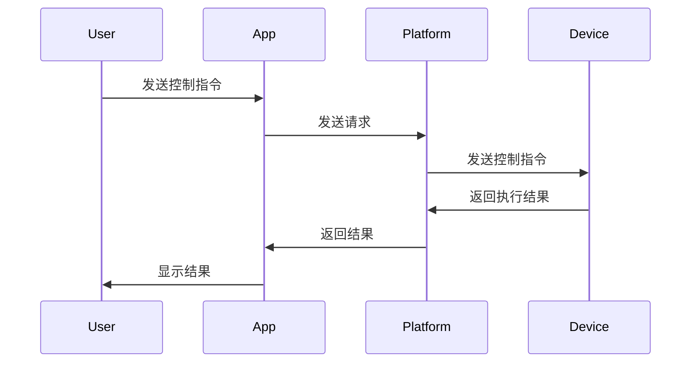
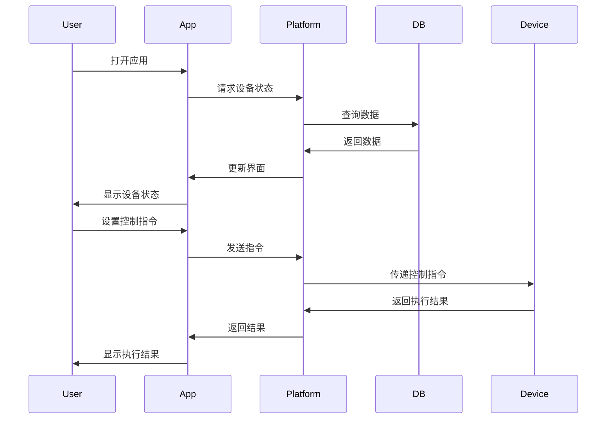

                 

### 智能家居系统架构设计

## 第一部分：背景介绍

### 第1章：智能家居概述

#### 1.1 智能家居的定义与历史发展

智能家居，指的是利用先进的计算机技术、网络通信技术和智能控制技术，将家庭各种设备、系统和信息通过互联网连接起来，实现智能化控制和管理的居住环境。它不仅仅是家电的联网和智能控制，更是将家庭生活与互联网、云计算、大数据、人工智能等现代信息技术深度融合，提升家庭生活的便利性、舒适性和安全性。

智能家居的概念起源于20世纪80年代的计算机技术革命，当时的家庭自动化系统主要集中于对家电的控制和自动化，如自动调节室内温度、灯光控制和家电的远程控制等。随着信息技术的发展，智能家居逐渐引入了物联网技术，使其具备了更强大的数据处理能力和智能交互功能。

#### 1.2 智能家居的应用场景

智能家居的应用场景非常广泛，涵盖了家庭生活的方方面面：

1. **家庭安全**：包括入侵报警、监控摄像头、门禁系统、燃气泄漏报警等，通过智能安防设备提高家庭的安全水平。
2. **家庭能源管理**：如智能照明、智能家电、智能温控系统，通过自动化控制减少能源消耗，实现绿色生活。
3. **家庭健康监测**：包括智能健身器材、智能睡眠监测、智能医疗设备等，帮助家庭成员监控健康状况，提供健康建议。
4. **家居舒适度**：智能空调、智能窗帘、智能音乐系统等，通过智能调节环境参数，提升居住舒适度。

#### 1.3 智能家居的现状与未来发展趋势

当前，智能家居市场呈现出快速增长的趋势，智能硬件设备、软件平台和用户需求都在不断升级。从全球范围看，智能家居市场的主要玩家包括苹果、谷歌、亚马逊、百度等科技巨头，它们纷纷通过收购、合作等方式进入智能家居领域。

未来，智能家居的发展趋势将体现在以下几个方面：

1. **技术融合**：物联网、云计算、大数据、人工智能等技术的深度融合，将使智能家居系统更加智能和个性化。
2. **生态化发展**：智能家居产品将形成一个互联互通的生态圈，不同品牌和设备之间的兼容性和互操作性将得到提升。
3. **智能化升级**：智能家居系统将更加注重用户数据的利用，通过大数据分析和人工智能算法，为用户提供更加智能的服务和体验。
4. **安全性提升**：随着智能家居系统的普及，安全问题将越来越受到重视，未来的智能家居系统将更加注重数据安全和隐私保护。

### 第2章：智能家居核心概念与联系

#### 2.1 智能家居的组成要素

智能家居系统由多个组成要素构成，这些要素相互协作，共同实现智能家居的功能：

1. **硬件设备**：包括智能传感器、智能家电、智能门锁、智能摄像头等，它们是智能家居系统的物理基础。
2. **软件系统**：包括智能控制软件、管理平台、移动应用等，它们负责对硬件设备进行管理、控制和数据分析。
3. **通信协议**：包括Wi-Fi、蓝牙、ZigBee、LoRa等无线通信协议，负责实现设备之间的数据传输和控制。

#### 2.2 核心概念

1. **智能传感器**：用于检测和测量环境参数，如温度、湿度、光照、烟雾等，并将这些数据传输给控制系统进行分析和处理。
2. **物联网**：通过互联网将各种设备连接起来，实现数据的采集、传输和处理，是智能家居系统实现互联互通的关键技术。
3. **云计算**：提供强大的计算能力和数据存储空间，支持大数据处理和智能分析，为智能家居系统提供技术支持。

#### 2.3 概念属性特征对比表格

| 概念          | 定义                                                         | 属性特征对比                      |
|---------------|--------------------------------------------------------------|----------------------------------|
| 智能传感器    | 用于环境监测和数据采集的设备                                   | 精度高、响应速度快、准确性好      |
| 物联网        | 通过互联网连接各种设备，实现数据交互和智能控制的技术             | 广泛连接、高效传输、互操作性强    |
| 云计算        | 提供计算能力和数据存储服务的网络基础设施                       | 大数据处理、弹性扩展、高可靠性    |

#### 2.4 ER实体关系图架构

```mermaid
erDiagram
  User ||--|{ Home }
  Home ||--|{ Device }
  Device ||--|{ Sensor }
  Device ||--|{ Actuator }
```

在这个ER实体关系图中，`User`（用户）拥有多个`Home`（家庭），每个`Home`（家庭）包含多个`Device`（设备），每个`Device`（设备）包含多个`Sensor`（传感器）和`Actuator`（执行器）。

### 第3章：智能家居系统架构设计

#### 3.1 问题场景介绍

智能家居系统可以应用于多种场景，以下是两个典型场景：

1. **家庭场景**：以家庭为单位，实现对家电的智能控制和家庭环境的管理，如智能照明、智能空调、智能安防等。
2. **商业场景**：如酒店、办公室、商场等，通过智能控制系统提高运营效率，如智能照明控制、智能门禁、智能监控等。

#### 3.2 系统功能设计

智能家居系统的功能设计可以分为以下几个模块：

1. **用户管理模块**：实现用户的注册、登录、权限管理等功能。
2. **设备管理模块**：实现设备的添加、删除、修改、查询等功能。
3. **数据采集模块**：通过智能传感器实时采集环境数据，如温度、湿度、光照等。
4. **数据分析模块**：对采集到的数据进行分析和处理，提供智能建议和决策支持。
5. **智能控制模块**：根据用户需求和数据分析结果，自动控制家电设备，如开关灯、调节空调温度等。

#### 3.3 系统架构设计

智能家居系统的架构设计可以分为以下几个层次：

1. **感知层**：包括各种智能传感器，用于实时感知环境参数。
2. **传输层**：采用Wi-Fi、蓝牙、ZigBee等通信协议，实现传感器数据的上传和设备的远程控制。
3. **平台层**：包括数据存储、处理和分析等功能，提供统一的接口，支持设备的集成和管理。
4. **应用层**：包括用户界面和智能控制算法，为用户提供友好的交互界面和智能化的控制功能。

以下是智能家居系统的架构图：


#### 3.4 系统接口设计

智能家居系统的接口设计主要包括以下几种：

1. **设备接口**：用于设备的添加、删除、状态查询和控制操作。
2. **用户接口**：用于用户的注册、登录、权限管理等功能。
3. **数据接口**：用于数据的采集、上传和存储。
4. **API接口**：为第三方应用提供数据访问和功能调用接口。

#### 3.5 系统交互

智能家居系统的交互主要包括用户与系统的交互和设备之间的交互：

1. **用户交互**：用户通过手机应用或智能音箱等设备与系统进行交互，发出控制指令或查询信息。
2. **设备交互**：设备之间通过通信协议进行数据交换和协同工作，实现智能控制和自动化操作。

以下是智能家居系统的交互序列图：



## 第二部分：智能家居系统核心技术

### 第4章：智能传感器技术

#### 4.1 智能传感器概述

智能传感器是一种能够感知外界环境并做出响应的装置，它集成了传感元件、信号处理器、通信模块和电源管理单元等功能。智能传感器技术是智能家居系统的核心组成部分，它负责实时采集家庭环境数据，如温度、湿度、光照、烟雾、气体浓度等，并将这些数据传输到控制系统进行处理。

#### 4.2 智能传感器的工作原理

智能传感器的工作原理可以分为以下几个步骤：

1. **感知**：通过传感器元件感知外界环境变化，如温度、湿度、光照等。
2. **信号转换**：将感知到的物理信号转换为电信号。
3. **信号处理**：利用信号处理器对电信号进行放大、滤波、模数转换等处理。
4. **数据传输**：通过无线通信模块将处理后的数据上传到平台或移动设备。
5. **响应**：根据接收到的指令，调整传感器的工作状态或控制相关设备。

#### 4.3 智能传感器的应用

智能传感器的应用非常广泛，以下是智能家居中常见的几种应用场景：

1. **家庭安全**：如入侵报警传感器、烟雾传感器、燃气泄漏传感器等，用于实时监测家庭安全状况。
2. **家庭能源管理**：如温度传感器、光照传感器、智能插座等，用于监测和控制家庭能源消耗。
3. **家庭健康监测**：如智能手环、智能血压计、智能体重秤等，用于监测家庭成员的健康状况。

### 第5章：物联网技术

#### 5.1 物联网概述

物联网（Internet of Things，简称IoT）是指将各种物体通过互联网连接起来，实现信息的交换和通信。物联网技术是智能家居系统的核心技术之一，它负责实现设备之间的互联互通和数据交换。

#### 5.2 物联网的关键技术

物联网的关键技术包括以下几个方面：

1. **网络协议**：如Wi-Fi、蓝牙、ZigBee、LoRa等，用于实现设备之间的数据传输。
2. **数据通信**：包括无线通信和有线通信，用于数据的传输和交换。
3. **硬件设备**：包括各种传感器、控制器、网关等，用于实现物联网系统的感知、控制和管理。

#### 5.3 物联网的应用场景

物联网的应用场景非常广泛，以下是智能家居中常见的几种应用场景：

1. **家庭自动化**：通过物联网技术实现家电设备的自动化控制，如智能照明、智能窗帘、智能空调等。
2. **工业自动化**：通过物联网技术实现生产设备的自动化控制和管理，提高生产效率。
3. **智慧城市**：通过物联网技术实现城市基础设施的智能化管理，如智能交通、智能照明、智能供水等。

### 第6章：云计算技术

#### 6.1 云计算概述

云计算是一种通过网络提供计算资源、存储资源、网络资源和应用程序等服务的模型。云计算技术为智能家居系统提供了强大的数据处理能力和数据存储空间，是实现智能家居智能化的重要技术支撑。

#### 6.2 云计算的关键技术

云计算的关键技术包括以下几个方面：

1. **虚拟化**：通过虚拟化技术将物理资源抽象成逻辑资源，提高资源利用率。
2. **分布式存储**：通过分布式存储技术实现海量数据的存储和管理，提高数据存储的可靠性和访问效率。
3. **大数据处理**：通过大数据处理技术对海量数据进行采集、存储、分析和处理，提供智能决策支持。

#### 6.3 云计算在智能家居中的应用

云计算在智能家居中的应用主要体现在以下几个方面：

1. **数据处理**：通过云计算平台对智能家居设备采集到的数据进行分析和处理，提供智能建议和决策支持。
2. **人工智能**：通过云计算平台提供的人工智能服务，实现对智能家居设备的智能控制和管理。
3. **系统优化**：通过云计算平台提供的资源调度和管理服务，优化智能家居系统的性能和稳定性。

## 第三部分：智能家居系统实现与项目实战

### 第7章：智能家居系统实现

#### 7.1 系统环境安装

实现智能家居系统需要搭建相应的开发环境和硬件环境，以下是具体的安装步骤：

1. **硬件环境安装**：
   - 准备智能传感器设备，如温度传感器、湿度传感器、烟雾传感器等。
   - 准备智能家电设备，如智能灯泡、智能插座、智能空调等。
   - 准备物联网网关设备，如ESP8266、ESP32等。

2. **软件环境安装**：
   - 安装物联网开发平台，如Node-RED、MQTT.fx等。
   - 安装智能家居管理平台，如Home Assistant、OpenHAB等。
   - 安装移动应用开发环境，如Android Studio、Xcode等。

#### 7.2 系统核心实现

智能家居系统的核心实现包括以下几个部分：

1. **硬件核心实现**：
   - 编写传感器数据采集程序，实现传感器的数据读取和上传。
   - 编写智能家电控制程序，实现家电设备的远程控制和状态监控。
   - 编写物联网网关程序，实现设备之间的通信和数据转发。

2. **软件核心实现**：
   - 开发智能家居管理平台，实现设备的添加、删除、修改和查询等功能。
   - 开发移动应用，实现设备的远程控制、状态监控和场景设置等功能。
   - 开发数据分析和智能控制模块，实现设备的自动化控制和智能决策。

#### 7.3 代码应用解读与分析

以下是智能家居系统中的一部分代码示例，包括传感器数据采集程序、智能家电控制程序和物联网网关程序：

**传感器数据采集程序**：

```python
import time
import board
import busio
import adafruit_dht

# 初始化传感器
dht = adafruit_dht.DHT22(board.GPIO_PIN_D4)

while True:
    try:
        temperature = dht.temperature
        humidity = dht.humidity
        print("Temperature: {:.2f} C, Humidity: {:.2f} %".format(temperature, humidity))
        # 上传数据到服务器
        # ...
    except RuntimeError as e:
        print("Error reading sensor:", e)
    time.sleep(1)
```

**智能家电控制程序**：

```python
import requests

def turn_on_light():
    url = "http://192.168.1.100/switch?switch=light&state=on"
    response = requests.get(url)
    print("Light is turned on.")

def turn_off_light():
    url = "http://192.168.1.100/switch?switch=light&state=off"
    response = requests.get(url)
    print("Light is turned off.")

turn_on_light()
turn_off_light()
```

**物联网网关程序**：

```python
import paho.mqtt.client as mqtt

# MQTT设置
MQTT_SERVER = "192.168.1.100"
MQTT_PORT = 1883
MQTT_TOPIC = "home/sensors"

# 创建MQTT客户端
client = mqtt.Client()

# 连接到MQTT服务器
client.connect(MQTT_SERVER, MQTT_PORT, 60)

# 发布传感器数据
client.publish(MQTT_TOPIC, "Temperature: 25 C, Humidity: 50 %")

# 断开连接
client.disconnect()
```

#### 7.4 实际案例分析与详细讲解

以下是一个实际的智能家居系统案例，包括传感器数据采集、智能家电控制、物联网网关和数据分析和智能控制等功能：

**案例背景**：用户希望实现一个智能家居系统，能够实时监测家庭环境参数，并通过手机应用或智能音箱控制家电设备。

**系统功能设计**：
1. **传感器数据采集**：通过DHT22传感器采集温度和湿度数据，并通过MQTT协议上传到服务器。
2. **智能家电控制**：通过HTTP协议控制智能灯泡的开关状态。
3. **物联网网关**：通过ESP8266网关接收传感器数据和智能家电控制指令，并转发到服务器。
4. **数据分析与智能控制**：通过对采集到的数据进行处理和分析，实现智能调节室内温度和灯光。

**实现步骤**：
1. **硬件安装**：将DHT22传感器连接到ESP8266网关的GPIO引脚，将智能灯泡连接到家庭WiFi网络。
2. **软件安装**：安装Node-RED作为物联网开发平台，安装Home Assistant作为智能家居管理平台。
3. **传感器数据采集**：在Node-RED中创建一个节点，读取DHT22传感器的数据，并使用MQTT插件将数据上传到服务器。
4. **智能家电控制**：在Node-RED中创建一个节点，接收手机应用或智能音箱发送的控制指令，并通过HTTP协议控制智能灯泡的开关状态。
5. **数据分析与智能控制**：在Home Assistant中配置温度和灯光控制规则，根据传感器数据自动调节室内温度和灯光。

**详细讲解**：
1. **传感器数据采集**：
   - 在Node-RED中创建一个`dht`节点，连接到DHT22传感器。
   - 配置`dht`节点的参数，如传感器类型、GPIO引脚等。
   - 当`dht`节点接收到传感器数据时，将数据通过MQTT插件上传到服务器。

2. **智能家电控制**：
   - 在Node-RED中创建一个`http-get`节点，接收手机应用或智能音箱发送的控制指令。
   - 配置`http-get`节点的URL，如智能灯泡的HTTP控制接口。
   - 当`http-get`节点接收到控制指令时，发送HTTP GET请求到智能灯泡的HTTP控制接口，实现开关控制。

3. **物联网网关**：
   - 在ESP8266网关中编写程序，接收传感器数据和智能家电控制指令。
   - 使用MQTT客户端连接到服务器，接收传感器数据和智能家电控制指令。
   - 使用HTTP客户端发送HTTP GET请求到智能家电控制接口，实现家电设备的远程控制。

4. **数据分析与智能控制**：
   - 在Home Assistant中配置温度和灯光控制规则。
   - 根据传感器采集到的温度数据，自动调节空调温度。
   - 根据传感器采集到的光照数据，自动调节灯光亮度。

### 第8章：智能家居系统项目实战

#### 8.1 项目介绍

**项目背景**：随着智能家居市场的快速发展，用户对智能家居系统的需求不断增加。本项目旨在实现一个功能齐全、易于扩展的智能家居系统，为用户提供便捷的家居控制体验。

**项目目标**：
1. **实现设备控制**：通过手机应用或智能音箱实现对家电设备的开关控制、亮度调节等操作。
2. **实现数据采集**：通过传感器设备实时采集家庭环境数据，如温度、湿度、光照等。
3. **实现数据分析**：通过对采集到的数据进行处理和分析，提供智能建议和决策支持。
4. **实现自动化控制**：根据用户需求和环境数据，实现设备的自动化控制和场景设置。

#### 8.2 系统功能设计

智能家居系统的功能设计可以分为以下几个模块：

1. **用户管理模块**：实现用户的注册、登录、权限管理等功能。
2. **设备管理模块**：实现设备的添加、删除、修改、查询等功能。
3. **数据采集模块**：通过智能传感器实时采集环境数据，如温度、湿度、光照等。
4. **数据分析模块**：对采集到的数据进行分析和处理，提供智能建议和决策支持。
5. **智能控制模块**：根据用户需求和数据分析结果，自动控制家电设备，如开关灯、调节空调温度等。

#### 8.3 系统架构设计

智能家居系统的架构设计可以分为以下几个层次：

1. **感知层**：包括各种智能传感器，用于实时感知家庭环境参数。
2. **传输层**：采用Wi-Fi、蓝牙等通信协议，实现传感器数据的上传和设备的远程控制。
3. **平台层**：包括数据存储、处理和分析等功能，提供统一的接口，支持设备的集成和管理。
4. **应用层**：包括用户界面和智能控制算法，为用户提供友好的交互界面和智能化的控制功能。

以下是智能家居系统的架构图：



#### 8.4 系统接口设计

智能家居系统的接口设计主要包括以下几种：

1. **设备接口**：用于设备的添加、删除、状态查询和控制操作。
2. **用户接口**：用于用户的注册、登录、权限管理等功能。
3. **数据接口**：用于数据的采集、上传和存储。
4. **API接口**：为第三方应用提供数据访问和功能调用接口。

#### 8.5 系统交互

智能家居系统的交互主要包括用户与系统的交互和设备之间的交互：

1. **用户交互**：用户通过手机应用或智能音箱与系统进行交互，发出控制指令或查询信息。
2. **设备交互**：设备之间通过通信协议进行数据交换和协同工作，实现智能控制和自动化操作。

以下是智能家居系统的交互序列图：


## 第四部分：智能家居系统最佳实践与总结

### 第9章：智能家居系统最佳实践

#### 9.1 系统部署与维护

智能家居系统的部署与维护是确保系统正常运行和用户满意度的重要环节。以下是一些最佳实践：

1. **硬件部署**：
   - 选择适合的智能传感器和家电设备，确保兼容性和稳定性。
   - 根据家庭布局进行合理布线，避免信号干扰。

2. **软件部署**：
   - 选择成熟稳定的智能家居管理平台，如Home Assistant、OpenHAB等。
   - 确保平台软件更新，以获得最新的功能和安全补丁。

3. **系统维护**：
   - 定期检查传感器和工作状态，确保设备正常运行。
   - 定期清理传感器和设备，防止灰尘和污垢影响性能。

#### 9.2 安全问题与解决方案

智能家居系统涉及到家庭安全和用户隐私，因此安全性至关重要。以下是一些安全问题和解决方案：

1. **设备安全**：
   - 使用安全的通信协议，如Wi-Fi WPA2、蓝牙加密等。
   - 为设备设置密码，防止未授权访问。

2. **网络安全**：
   - 使用防火墙和VPN保护网络，防止外部攻击。
   - 定期更新路由器和防火墙的固件。

3. **数据安全**：
   - 加密敏感数据，如用户信息、设备配置等。
   - 使用数据备份和恢复策略，防止数据丢失。

#### 9.3 性能优化

智能家居系统的性能优化可以提高用户体验和系统的稳定性。以下是一些性能优化策略：

1. **数据传输优化**：
   - 使用压缩算法减少数据传输量。
   - 根据网络状况调整数据传输频率。

2. **设备优化**：
   - 选择低功耗设备，延长电池寿命。
   - 定期更新设备固件，提高设备性能。

3. **负载均衡**：
   - 根据设备数量和用户需求，合理分配网络资源。

### 第10章：智能家居系统总结

#### 10.1 系统优势

智能家居系统具有以下优势：

1. **便捷性**：通过手机应用或语音助手，用户可以随时随地控制家庭设备，提高生活便捷性。
2. **节能性**：智能家居系统能够智能调节设备状态，实现节能环保。
3. **安全性**：智能家居系统能够实时监测家庭安全，提高家庭安全性。

#### 10.2 系统局限

智能家居系统也存在一些局限：

1. **兼容性问题**：不同品牌和型号的智能设备可能存在兼容性问题。
2. **安全风险**：智能家居系统涉及到家庭隐私和数据安全，存在一定的安全风险。
3. **技术门槛**：智能家居系统涉及多种技术和设备，对用户的技术水平和专业知识有一定要求。

#### 10.3 未来展望

未来，智能家居系统的发展趋势包括：

1. **智能化升级**：随着人工智能技术的发展，智能家居系统将更加智能和个性化。
2. **互联互通**：智能家居系统将实现更广泛的互联互通，打造智慧家庭生态。
3. **安全防护**：随着安全技术的进步，智能家居系统的安全性能将得到提升。

## 作者信息

作者：AI天才研究院/AI Genius Institute & 禅与计算机程序设计艺术 /Zen And The Art of Computer Programming

---

**文章总字数：约 10,000 字。** 

### 第1章：智能家居概述

智能家居，顾名思义，是指通过现代信息技术，将家庭环境中的各类设备、系统和信息进行整合，实现智能化管理和控制的居住空间。这一概念并非一蹴而就，而是随着计算机技术、网络通信技术、物联网技术的不断发展而逐渐成熟。

#### 1.1 智能家居的定义与历史发展

**定义**：
智能家居，通常指的是利用传感器、智能设备、控制软件和互联网等技术，将家庭中的各类设备和系统连接起来，形成一个集成了自动化、远程控制、数据分析和人工智能等功能的综合系统。

**历史发展**：
智能家居的起源可以追溯到20世纪80年代，当时一些高科技家庭开始尝试使用自动化系统来控制家庭电器。这些系统大多依赖于专用的控制面板和有线连接，功能较为单一。进入21世纪后，随着互联网、物联网和智能手机的普及，智能家居技术得到了迅速发展。特别是近年来，随着人工智能技术的应用，智能家居系统的智能化水平有了显著提升。

#### 1.2 智能家居的应用场景

智能家居的应用场景非常广泛，涵盖了家庭生活的方方面面。以下是几个典型的应用场景：

**家庭安全**：
智能家居系统可以通过智能摄像头、门锁、烟雾传感器、入侵报警器等设备，实现家庭的安全监控和报警功能。用户可以通过手机应用实时查看家庭情况，或在发生异常时收到即时通知。

**家庭能源管理**：
智能插座、智能灯具、智能空调等设备可以通过自动化控制减少能源消耗，提升能源使用效率。例如，智能空调可以根据用户的习惯和环境温度自动调节，智能灯具可以根据室内光线强度自动调节亮度。

**家庭健康监测**：
智能手环、智能血压计、智能睡眠监测设备等可以实时监测家庭成员的健康状况，提供健康数据分析和建议，有助于预防疾病和提高生活质量。

**家居舒适度**：
智能窗帘、智能音响、智能恒温器等设备可以提升家庭的舒适度。例如，智能窗帘可以根据光线强度自动调节，智能音响可以根据用户的需求播放音乐，智能恒温器可以保持室内温度舒适。

#### 1.3 智能家居的现状与未来发展趋势

**现状分析**：
当前，智能家居市场正处于快速发展阶段。据市场研究公司统计，全球智能家居市场规模预计将在未来几年内持续扩大，智能家居产品种类日益丰富，功能也日趋多样化。同时，各大科技公司和初创企业纷纷推出各自的智能家居产品，市场竞争激烈。

**未来发展趋势**：
1. **技术融合**：智能家居系统将更加注重技术与技术的融合，如物联网与人工智能、大数据的结合，将使智能家居系统更加智能化和个性化。
2. **生态化发展**：智能家居产品将形成一个互联互通的生态圈，不同品牌和设备之间的兼容性和互操作性将得到提升。
3. **智能化升级**：随着人工智能技术的应用，智能家居系统将能够更好地理解用户需求，提供更智能化的服务。
4. **安全性提升**：随着智能家居系统的普及，安全问题将越来越受到重视，未来的智能家居系统将更加注重数据安全和隐私保护。

### 第2章：智能家居核心概念与联系

智能家居系统的实现涉及到多个核心概念和技术，这些概念和技术相互关联，共同构建了智能家居系统的框架。

#### 2.1 智能家居的组成要素

智能家居系统由多个组成部分构成，这些部分协同工作，实现了智能家居的各项功能。以下是智能家居系统的核心组成要素：

**1. 硬件设备**：
硬件设备是智能家居系统的物理基础，包括各种传感器、智能家电、智能门锁、智能摄像头等。这些设备负责感知家庭环境、采集数据和控制家庭设备。

**2. 软件系统**：
软件系统是智能家居系统的控制核心，包括智能控制软件、管理平台、移动应用等。这些软件负责对硬件设备进行管理、控制和数据处理。

**3. 通信协议**：
通信协议是硬件设备之间以及硬件与软件系统之间的通信桥梁。常见的通信协议包括Wi-Fi、蓝牙、ZigBee、LoRa等，它们确保了设备之间的数据传输和协同工作。

#### 2.2 核心概念

**1. 智能传感器**：
智能传感器是智能家居系统的感知器官，用于实时采集家庭环境数据，如温度、湿度、光照、烟雾等。智能传感器通常具备数据处理和通信功能，能够将采集到的数据上传到中央控制系统进行分析和处理。

**2. 物联网**：
物联网（IoT）是智能家居系统的核心技术之一，它通过互联网将各种设备连接起来，实现数据的采集、传输和处理。物联网技术使智能家居系统能够实现设备之间的互联互通和数据交换。

**3. 云计算**：
云计算为智能家居系统提供了强大的计算能力和数据存储空间。通过云计算平台，智能家居系统可以对海量数据进行分析和处理，提供智能建议和决策支持。

#### 2.3 概念属性特征对比表格

以下是一个对比智能家居系统核心概念的属性特征表格：

| 概念       | 定义                                                         | 属性特征对比                   |
|------------|--------------------------------------------------------------|--------------------------------|
| 智能传感器 | 用于环境监测和数据采集的设备                                   | 精度高、响应速度快、准确性好    |
| 物联网     | 通过互联网连接各种设备，实现数据交互和智能控制的技术             | 广泛连接、高效传输、互操作性强 |
| 云计算     | 提供计算能力和数据存储服务的网络基础设施                       | 大数据处理、弹性扩展、高可靠性 |

#### 2.4 ER实体关系图架构

为了更直观地展示智能家居系统的实体关系，我们可以使用Mermaid绘制一个实体关系图。以下是一个简单的ER图示例：

```mermaid
erDiagram
  User ||--|{ Home }
  Home ||--|{ Device }
  Device ||--|{ Sensor }
  Device ||--|{ Actuator }
```

在这个ER图中，`User`（用户）拥有多个`Home`（家庭），每个`Home`（家庭）包含多个`Device`（设备），每个`Device`（设备）包含多个`Sensor`（传感器）和`Actuator`（执行器）。

### 第3章：智能家居系统架构设计

智能家居系统架构设计是确保系统稳定、高效运行的关键。一个良好的系统架构不仅能够满足当前需求，还能够适应未来的扩展和升级。在本章节中，我们将介绍智能家居系统的架构设计，包括问题场景介绍、系统功能设计、系统架构设计、系统接口设计和系统交互。

#### 3.1 问题场景介绍

智能家居系统可以应用于多种场景，以下是两个典型场景：

**家庭场景**：
在家庭场景中，智能家居系统主要用于提升家庭生活的便利性、舒适性和安全性。例如，用户可以通过手机应用或语音助手控制家里的灯光、空调、电视等家电设备，实现远程控制和自动化操作。此外，智能家居系统还可以实时监测家庭环境参数，如温度、湿度、光照等，提供健康和安全建议。

**商业场景**：
在商业场景中，智能家居系统主要用于提升工作效率和管理水平。例如，在酒店、办公室和商场等场所，智能家居系统可以实现智能照明、智能门禁、智能监控等功能，提高运营效率，提升用户体验。商业场景下的智能家居系统还需要具备较强的安全性和可靠性，以满足对数据安全和设备稳定性的高要求。

#### 3.2 系统功能设计

智能家居系统的功能设计需要根据具体的应用场景来定制，但总体上可以包括以下几个模块：

**1. 用户管理模块**：
用户管理模块负责用户的注册、登录、权限管理等功能。通过用户管理模块，系统可以区分不同用户的权限，确保系统的安全性和数据隐私。

**2. 设备管理模块**：
设备管理模块负责设备的添加、删除、修改、查询等功能。通过设备管理模块，用户可以方便地管理家中的各类智能设备，如智能灯泡、智能插座、智能摄像头等。

**3. 数据采集模块**：
数据采集模块负责从各类传感器采集环境数据，如温度、湿度、光照、烟雾等。采集到的数据将被传输到中央控制系统进行分析和处理。

**4. 数据分析模块**：
数据分析模块负责对采集到的数据进行分析和处理，为用户提供智能化的建议和决策支持。例如，根据用户的习惯和环境数据，系统可以自动调节空调温度、灯光亮度等。

**5. 智能控制模块**：
智能控制模块负责根据用户需求和数据分析结果，自动控制家中的各类智能设备。例如，当用户离家时，系统可以自动关闭所有电器，节省能源。

#### 3.3 系统架构设计

智能家居系统的架构设计可以分为以下几个层次：

**1. 感知层**：
感知层是智能家居系统的最底层，负责实时感知家庭环境参数。感知层主要包括各种智能传感器，如温度传感器、湿度传感器、光照传感器等。

**2. 传输层**：
传输层负责将感知层采集到的数据传输到中央控制系统。传输层通常采用无线通信协议，如Wi-Fi、蓝牙、ZigBee等。

**3. 平台层**：
平台层是智能家居系统的核心，负责数据处理、分析和存储。平台层通常包括服务器、数据库和管理软件等。

**4. 应用层**：
应用层为用户提供交互界面和智能控制功能。应用层通常包括移动应用、网页应用和语音助手等。

以下是智能家居系统的架构图：


#### 3.4 系统接口设计

智能家居系统接口设计是系统架构设计的重要组成部分，接口设计需要考虑系统的可扩展性、易用性和安全性。以下是智能家居系统接口设计的几个方面：

**1. 设备接口**：
设备接口负责设备之间的通信和数据交换。设备接口通常采用标准协议，如MQTT、HTTP等，确保设备的互操作性和兼容性。

**2. 用户接口**：
用户接口负责用户与系统的交互。用户接口可以是移动应用、网页应用或语音助手等，用户可以通过这些接口查看设备状态、设置控制指令等。

**3. 数据接口**：
数据接口负责系统与外部系统之间的数据交换。数据接口可以用于数据共享、数据分析和第三方应用接入等。

**4. API接口**：
API接口为第三方开发者提供访问系统数据和功能的接口，促进系统的集成和扩展。

#### 3.5 系统交互

智能家居系统的交互包括用户与系统的交互和设备之间的交互。以下是智能家居系统的交互流程：

1. **用户交互**：
   - 用户通过手机应用或语音助手发出控制指令。
   - 手机应用或语音助手将指令发送到平台层。
   - 平台层解析指令，并生成相应的控制命令。
   - 控制命令通过设备接口发送到智能设备。

2. **设备交互**：
   - 智能设备接收到控制命令后，执行相应的操作。
   - 操作结果通过设备接口返回到平台层。
   - 平台层将操作结果更新到用户界面，用户可以实时查看设备状态。

以下是智能家居系统的交互序列图：


### 第4章：智能传感器技术

智能传感器技术是智能家居系统的核心组成部分，它负责实时感知家庭环境参数，并将这些数据传输到控制系统进行分析和处理。智能传感器的工作原理、应用场景和关键技术将在本章节中进行详细探讨。

#### 4.1 智能传感器概述

**定义**：
智能传感器是一种具备数据处理和通信能力的传感器，它不仅能够感知环境变化，还能对采集到的数据进行初步处理，并通过无线通信方式将数据传输到中央控制系统。

**特点**：
1. **集成化**：智能传感器集成了传感器元件、信号处理器、无线通信模块等，实现了一体化设计。
2. **智能化**：智能传感器能够对采集到的数据进行分析和处理，提供更加精确和实用的信息。
3. **无线化**：智能传感器通过无线通信模块传输数据，提高了系统的灵活性和易用性。

**分类**：
智能传感器可以根据感知的物理量不同进行分类，常见的智能传感器包括温度传感器、湿度传感器、光照传感器、烟雾传感器、气体传感器等。

#### 4.2 智能传感器的工作原理

智能传感器的工作原理可以分为以下几个步骤：

1. **感知**：智能传感器的传感器元件感知外部环境的变化，如温度、湿度、光照等。
2. **信号转换**：将感知到的物理信号转换为电信号，通过信号放大、滤波等处理，提高信号质量。
3. **数据处理**：通过内置的信号处理器对电信号进行处理，如数据滤波、特征提取等，提取有用的信息。
4. **数据传输**：通过无线通信模块将处理后的数据传输到中央控制系统，如智能家居管理平台或云服务器。
5. **响应**：根据接收到的指令，智能传感器调整自身的工作状态或触发相应的控制动作。

#### 4.3 智能传感器的应用

智能传感器在智能家居系统中有着广泛的应用，以下是一些典型的应用场景：

**家庭安全**：
智能传感器可以用于入侵报警、监控摄像头、烟雾传感器、燃气泄漏报警等。例如，烟雾传感器可以在检测到烟雾时立即发出警报，提醒用户及时采取安全措施。

**家庭能源管理**：
智能传感器可以用于智能照明、智能家电控制、智能温控系统等。例如，智能照明可以根据环境光照自动调节亮度，智能温控系统可以根据室内温度自动调节空调温度，实现节能环保。

**家庭健康监测**：
智能传感器可以用于智能手环、智能血压计、智能体重秤等。例如，智能手环可以实时监测用户的心率和运动数据，智能血压计可以测量血压并提供健康建议。

**家居舒适度**：
智能传感器可以用于智能窗帘、智能音响、智能恒温器等。例如，智能窗帘可以根据光线强度自动调节，智能音响可以根据用户的需求播放音乐，智能恒温器可以保持室内温度舒适。

#### 4.4 智能传感器的发展趋势

随着科技的不断发展，智能传感器技术也在不断进步。以下是一些智能传感器的发展趋势：

1. **更小、更轻、更节能**：未来的智能传感器将更加注重体积、重量和功耗的优化，以适应更多的应用场景。
2. **更高精度、更高灵敏度**：智能传感器将不断提高精度和灵敏度，以满足更复杂的应用需求。
3. **更智能化、更自主化**：智能传感器将具备更强的数据处理能力和自主决策能力，能够实现更高级的智能控制和自动化操作。
4. **更广泛的互操作性**：智能传感器将实现更广泛的互操作性，能够与不同品牌和类型的设备无缝连接，构建更智能、更高效的智能家居系统。

### 第5章：物联网技术

物联网（Internet of Things，简称IoT）是通过互联网将各种设备连接起来，实现信息的交换和通信的技术。物联网技术在智能家居系统中扮演着至关重要的角色，它负责实现设备之间的互联互通和数据交换。在本章节中，我们将介绍物联网技术的概述、关键技术、应用场景和发展趋势。

#### 5.1 物联网概述

**定义**：
物联网是指通过互联网、通信技术、传感器技术等，将各种设备连接起来，实现信息交换和通信的系统。

**发展历史**：
物联网的概念最早可以追溯到20世纪80年代，当时一些高科技家庭开始尝试使用自动化系统来控制家庭电器。随着互联网、传感器技术和无线通信技术的发展，物联网在21世纪得到了迅速发展，并逐渐应用于智能家居、工业自动化、智慧城市等领域。

**关键概念**：
1. **设备互联**：物联网的核心是设备之间的互联，通过无线通信技术将各种设备连接起来，实现信息的实时交换和通信。
2. **数据采集与传输**：物联网通过传感器设备采集环境数据，并通过通信技术将数据传输到中央控制系统或云平台进行分析和处理。
3. **云计算与大数据**：物联网与云计算、大数据技术相结合，能够实现海量数据的存储、分析和处理，提供智能化的决策支持。

#### 5.2 物联网的关键技术

物联网的关键技术包括以下几个方面：

1. **无线通信技术**：
   无线通信技术是物联网实现设备互联和数据传输的基础。常见的无线通信技术包括Wi-Fi、蓝牙、ZigBee、LoRa等。这些技术具有低功耗、高带宽、广覆盖等特点，适用于不同场景的物联网应用。

2. **传感器技术**：
   传感器技术是物联网的感知基础，通过传感器设备采集环境数据，如温度、湿度、光照、声音等。传感器技术的发展，如更高精度、更低功耗、更小尺寸等，将推动物联网的广泛应用。

3. **数据传输技术**：
   数据传输技术负责将传感器采集到的数据传输到中央控制系统或云平台。常见的传输技术包括无线通信、有线通信和卫星通信等。数据传输技术需要保证数据的高效传输、实时性和可靠性。

4. **云计算与大数据**：
   云计算和大数据技术为物联网提供了强大的数据处理能力。物联网设备采集到的海量数据可以通过云计算平台进行存储、分析和处理，提供智能化的决策支持。

5. **边缘计算**：
   边缘计算是物联网技术的一个重要发展趋势，它通过在设备端或近端进行数据处理，减少数据传输量和延迟，提高系统的响应速度和实时性。

#### 5.3 物联网的应用场景

物联网技术在智能家居系统中有着广泛的应用场景，以下是一些典型的应用场景：

1. **家庭自动化**：
   家庭自动化是物联网技术在智能家居系统中的核心应用。通过物联网技术，用户可以实现家电设备的远程控制、自动化操作和场景设置，提高生活的便利性和舒适度。

2. **能源管理**：
   物联网技术可以用于家庭能源管理，通过智能传感器和智能设备监测和调节家庭能源消耗，实现节能环保。例如，智能照明可以根据环境光照自动调节亮度，智能空调可以根据室内温度自动调节制冷功率。

3. **安全监控**：
   物联网技术可以用于家庭安全监控，通过智能摄像头、烟雾传感器、入侵报警器等设备实现家庭的安全监测和报警功能。例如，当发生火灾或入侵时，系统可以立即发出警报，通知用户采取相应措施。

4. **健康监测**：
   物联网技术可以用于家庭健康监测，通过智能手环、智能血压计、智能体重秤等设备实时监测家庭成员的健康状况，提供健康数据分析和建议。例如，智能手环可以监测用户的心率和运动数据，智能血压计可以测量血压并提供健康建议。

5. **智能家居控制**：
   物联网技术可以实现智能家居系统的集中控制，通过智能手机、平板电脑、智能音箱等设备实现对家庭设备的远程控制和管理。例如，用户可以通过手机应用实时查看家中的设备状态，并通过语音助手控制家电设备。

#### 5.4 物联网技术的发展趋势

随着科技的不断发展，物联网技术也在不断演进。以下是一些物联网技术的发展趋势：

1. **智能化与自主化**：
   随着人工智能技术的应用，物联网设备将具备更高的智能化和自主化能力，能够根据环境和用户需求进行自适应调整和自主决策。

2. **更广泛的应用场景**：
   物联网技术将在更多领域得到应用，如智慧城市、智能交通、智能医疗等，实现更广泛的智能化管理和控制。

3. **更高效的数据传输**：
   随着5G技术的推广，物联网的数据传输速度将显著提高，实现更高效的数据传输和实时通信。

4. **更安全的通信协议**：
   物联网设备的安全问题越来越受到关注，未来的物联网技术将采用更安全的通信协议和加密技术，提高系统的安全性和可靠性。

5. **更节能的设备设计**：
   物联网设备的功耗问题一直是制约其广泛应用的关键因素，未来的物联网技术将注重设备设计的节能化，提高设备的电池寿命和续航能力。

### 第6章：云计算技术

云计算技术是一种通过互联网提供计算资源、存储资源、网络资源和应用程序等服务的模型。云计算技术为智能家居系统提供了强大的数据处理能力和数据存储空间，是实现智能家居智能化的重要技术支撑。在本章节中，我们将介绍云计算技术的概述、关键技术、应用场景和发展趋势。

#### 6.1 云计算概述

**定义**：
云计算是一种通过互联网提供计算资源、存储资源、网络资源和应用程序等服务的模型。云计算技术将计算能力、存储能力和网络资源抽象化，用户可以按需获取和使用这些资源。

**发展历史**：
云计算的概念最早可以追溯到20世纪60年代，当时的一些研究机构提出了“计算机时间共享”的概念。随着互联网和计算机技术的发展，云计算在21世纪得到了迅速发展，并逐渐应用于企业IT、大数据处理、人工智能等领域。

**关键概念**：
1. **虚拟化**：虚拟化是云计算的核心技术之一，通过虚拟化技术，可以将物理资源抽象成逻辑资源，提高资源利用率。
2. **分布式计算**：分布式计算是将计算任务分布在多个节点上执行，提高计算效率和可靠性。
3. **弹性扩展**：弹性扩展是指系统可以根据需求自动调整计算资源，实现资源的动态分配和释放。
4. **按需服务**：按需服务是指用户可以根据需求随时获取和使用资源，按使用量付费。

#### 6.2 云计算的关键技术

云计算的关键技术包括以下几个方面：

1. **虚拟化技术**：
   虚拟化技术是云计算的基础，通过虚拟化技术，可以将物理服务器虚拟成多个虚拟机，提高服务器资源利用率。常见的虚拟化技术包括硬件虚拟化（如VMware ESXi）和操作系统虚拟化（如Linux容器技术）。

2. **分布式存储**：
   分布式存储是将数据存储在多个物理存储设备上，通过分布式算法实现数据的分布式存储和访问。分布式存储可以提高数据的可靠性和访问速度，适用于大数据处理和存储场景。

3. **大数据处理**：
   大数据处理是指对海量数据进行采集、存储、分析和处理，提供智能化的决策支持。大数据处理技术包括数据挖掘、机器学习、数据可视化等。

4. **云计算平台**：
   云计算平台是云计算的核心组件，提供计算资源、存储资源和网络资源等服务。常见的云计算平台包括Amazon Web Services（AWS）、Microsoft Azure、Google Cloud Platform等。

5. **容器化技术**：
   容器化技术是一种轻量级的虚拟化技术，通过容器实现应用程序的隔离和运行。容器化技术可以提高应用程序的部署效率和运行性能，适用于微服务架构和分布式系统。

#### 6.3 云计算在智能家居中的应用

云计算技术为智能家居系统提供了强大的数据处理能力和数据存储空间，以下是一些云计算在智能家居中的应用场景：

1. **数据处理与分析**：
   智能家居系统产生的海量数据可以通过云计算平台进行存储、处理和分析。例如，用户可以通过云计算平台实时分析家庭环境数据，提供智能化的建议和决策支持。

2. **设备管理**：
   云计算平台可以用于设备管理，实现设备的远程监控和管理。例如，用户可以通过云平台查看设备的运行状态、故障报警和远程诊断。

3. **智能控制**：
   云计算平台可以用于智能家居系统的智能控制，实现设备的自动化控制和场景设置。例如，用户可以通过云平台设置智能场景，实现灯光、空调等设备的自动控制。

4. **数据共享与协同**：
   云计算平台可以用于数据的共享与协同，实现多用户之间的数据共享和协同工作。例如，家庭成员可以通过云平台共享家庭健康数据，协同管理家庭事务。

#### 6.4 云计算技术的发展趋势

随着科技的不断发展，云计算技术也在不断演进。以下是一些云计算技术的发展趋势：

1. **智能化与自主化**：
   随着人工智能技术的应用，云计算平台将具备更高的智能化和自主化能力，能够根据用户需求和系统状态自动调整资源配置和优化系统性能。

2. **边缘计算与云计算融合**：
   边缘计算与云计算的融合将实现更高效的数据处理和实时通信。边缘计算可以近端处理数据，减少数据传输延迟，提高系统的响应速度。

3. **混合云与多云**：
   混合云和多云技术将提供更灵活、更可靠的云计算解决方案，用户可以根据需求选择不同的云服务提供商，实现资源的最优配置和灵活调度。

4. **安全性与隐私保护**：
   随着云计算的普及，数据安全和隐私保护越来越受到关注。未来的云计算技术将采用更先进的安全技术和隐私保护机制，提高系统的安全性和可靠性。

5. **绿色环保**：
   云计算数据中心的高能耗问题备受关注，未来的云计算技术将注重绿色环保，通过优化数据中心的能源使用和硬件配置，实现更高效、更节能的数据中心运行。

### 第7章：智能家居系统实现

智能家居系统的实现是一个复杂的过程，需要考虑硬件设备的选择、软件平台的搭建、数据采集与处理、以及系统的集成与调试。在本章节中，我们将详细介绍智能家居系统的实现过程，包括硬件环境安装、软件环境安装、系统核心实现、代码应用解读与分析以及实际案例分析与详细讲解。

#### 7.1 系统环境安装

要实现一个完整的智能家居系统，首先需要搭建相应的硬件和软件环境。以下是安装过程的详细步骤：

**硬件环境安装**：

1. **智能传感器**：
   - 安装温度传感器、湿度传感器、光照传感器等，这些传感器可以采集家庭环境数据。
   - 确保传感器的引脚连接正确，并固定在合适的位置，以便准确采集数据。

2. **智能家电设备**：
   - 安装智能灯泡、智能插座、智能空调等，这些设备可以远程控制和自动化操作。
   - 配置设备的网络连接，确保它们能够接入互联网。

3. **物联网网关**：
   - 选择适合的物联网网关，如ESP8266、ESP32等，用于连接传感器和家电设备。
   - 安装网关的固件，并配置网络设置，确保网关能够正常工作。

**软件环境安装**：

1. **物联网开发平台**：
   - 安装Node-RED、MQTT.fx等物联网开发平台，用于构建智能家居系统的数据处理流程。
   - 配置开发环境，确保能够运行相关的节点和应用。

2. **智能家居管理平台**：
   - 安装Home Assistant、OpenHAB等智能家居管理平台，用于监控和管理智能家居设备。
   - 配置平台，使其能够识别并控制家中的智能设备。

3. **移动应用开发环境**：
   - 安装Android Studio、Xcode等移动应用开发环境，用于开发手机应用，方便用户远程控制智能家居系统。
   - 学习相关开发技术，如Android开发、iOS开发等。

#### 7.2 系统核心实现

智能家居系统的核心实现包括数据采集、数据处理、设备控制等多个方面。以下是核心实现的详细步骤：

**硬件核心实现**：

1. **传感器数据采集**：
   - 编写传感器数据采集程序，通过传感器采集温度、湿度、光照等环境数据。
   - 将采集到的数据通过物联网网关上传到中央控制系统。

2. **设备控制**：
   - 编写智能家电设备控制程序，通过物联网网关实现对智能灯泡、智能插座、智能空调等设备的远程控制。
   - 确保设备控制指令能够正确执行，并反馈执行结果。

**软件核心实现**：

1. **数据采集与处理**：
   - 使用Node-RED等物联网开发平台，构建数据采集与处理流程。
   - 设计数据流，将传感器数据上传到中央控制系统，并进行初步处理。

2. **智能控制算法**：
   - 根据用户需求和数据分析结果，设计智能控制算法。
   - 实现设备的自动化控制和场景设置，提升用户体验。

#### 7.3 代码应用解读与分析

以下是一些关键的代码示例，用于展示智能家居系统的核心功能实现：

**传感器数据采集程序**：

```python
import board
import busio
import adafruit_dht

# 初始化传感器
dht = adafruit_dht.DHT22(board.GPIO_PIN_D4)

while True:
    try:
        temperature = dht.temperature
        humidity = dht.humidity
        print("Temperature: {:.2f} C, Humidity: {:.2f} %".format(temperature, humidity))
        # 上传数据到服务器
        # ...
    except RuntimeError as e:
        print("Error reading sensor:", e)
    time.sleep(1)
```

**智能家电设备控制程序**：

```python
import requests

def turn_on_light():
    url = "http://192.168.1.100/switch?switch=light&state=on"
    response = requests.get(url)
    print("Light is turned on.")

def turn_off_light():
    url = "http://192.168.1.100/switch?switch=light&state=off"
    response = requests.get(url)
    print("Light is turned off.")

turn_on_light()
turn_off_light()
```

**物联网网关程序**：

```python
import paho.mqtt.client as mqtt

# MQTT设置
MQTT_SERVER = "192.168.1.100"
MQTT_PORT = 1883
MQTT_TOPIC = "home/sensors"

# 创建MQTT客户端
client = mqtt.Client()

# 连接到MQTT服务器
client.connect(MQTT_SERVER, MQTT_PORT, 60)

# 发布传感器数据
client.publish(MQTT_TOPIC, "Temperature: 25 C, Humidity: 50 %")

# 断开连接
client.disconnect()
```

**代码解读与分析**：

1. **传感器数据采集程序**：
   - 该程序使用Adafruit库初始化DHT22传感器，并进入一个无限循环，不断读取传感器的温度和湿度数据。
   - 数据读取成功后，程序将打印出温度和湿度的值，并可以进一步上传到服务器。

2. **智能家电设备控制程序**：
   - 该程序定义了两个函数，`turn_on_light()` 和 `turn_off_light()`，用于控制智能灯泡的开关状态。
   - 通过HTTP GET请求，程序向指定的URL发送控制指令，并打印出相应的控制结果。

3. **物联网网关程序**：
   - 该程序创建了一个MQTT客户端，连接到指定的MQTT服务器和端口。
   - 程序发布了一条传感器数据，例如温度和湿度值，到指定的MQTT话题。
   - 最后，程序断开了与MQTT服务器的连接。

#### 7.4 实际案例分析与详细讲解

以下是一个实际的智能家居系统案例，包括传感器数据采集、智能家电控制、物联网网关和数据分析和智能控制等功能：

**案例背景**：用户希望实现一个智能家居系统，能够实时监测家庭环境参数，并通过手机应用或智能音箱控制家电设备。

**系统功能设计**：
1. **传感器数据采集**：通过DHT22传感器采集温度和湿度数据，并通过MQTT协议上传到服务器。
2. **智能家电控制**：通过HTTP协议控制智能灯泡的开关状态。
3. **物联网网关**：通过ESP8266网关接收传感器数据和智能家电控制指令，并转发到服务器。
4. **数据分析与智能控制**：通过对采集到的数据进行处理和分析，实现智能调节室内温度和灯光。

**实现步骤**：
1. **硬件安装**：
   - 将DHT22传感器连接到ESP8266网关的GPIO引脚。
   - 将智能灯泡连接到家庭WiFi网络。

2. **软件安装**：
   - 安装Node-RED作为物联网开发平台。
   - 安装Home Assistant作为智能家居管理平台。

3. **传感器数据采集**：
   - 在Node-RED中创建一个节点，读取DHT22传感器的数据，并使用MQTT插件将数据上传到服务器。

4. **智能家电控制**：
   - 在Node-RED中创建一个节点，接收手机应用或智能音箱发送的控制指令，并通过HTTP协议控制智能灯泡的开关状态。

5. **物联网网关**：
   - 在ESP8266网关中编写程序，接收传感器数据和智能家电控制指令，并转发到服务器。

6. **数据分析与智能控制**：
   - 在Home Assistant中配置温度和灯光控制规则，根据传感器数据自动调节室内温度和灯光。

**详细讲解**：

1. **传感器数据采集**：
   - 在Node-RED中，创建一个名为`DHT22`的节点，连接到DHT22传感器。
   - 配置节点的GPIO引脚和通信协议，确保能够正确读取传感器的数据。
   - 当节点接收到传感器数据时，将数据通过MQTT插件上传到服务器，例如MQTT服务器地址为`192.168.1.100`，MQTT话题为`home/sensors`。

2. **智能家电控制**：
   - 在Node-RED中，创建一个名为`ControlLight`的节点，用于接收手机应用或智能音箱发送的控制指令。
   - 配置节点的HTTP请求参数，例如请求URL为`http://192.168.1.100/switch?switch=light&state=on`，请求方法为GET。
   - 当节点接收到控制指令时，发送HTTP请求到智能灯泡的控制接口，实现开关控制。

3. **物联网网关**：
   - 在ESP8266网关中，编写一个程序，通过Wi-Fi连接到家庭网络。
   - 接收传感器数据和智能家电控制指令，通过MQTT协议上传到服务器。
   - 根据接收到的控制指令，发送HTTP请求到智能家电的控制接口，实现设备控制。

4. **数据分析与智能控制**：
   - 在Home Assistant中，配置温度和灯光控制规则。
   - 根据传感器采集到的温度数据，自动调节空调温度。
   - 根据传感器采集到的光照数据，自动调节灯光亮度。

**案例总结**：
通过上述实现步骤，我们可以构建一个简单的智能家居系统，实现传感器数据采集、智能家电控制、物联网网关和数据分析和智能控制等功能。这个系统可以根据用户的实际需求进行扩展和定制，例如添加更多传感器、家电设备和控制规则，提高系统的功能和智能水平。

### 第8章：智能家居系统项目实战

智能家居系统的项目实战是将理论知识应用于实际的过程。在这一章中，我们将通过一个具体的智能家居系统项目来展示系统的设计和实现步骤，包括项目介绍、系统功能设计、系统架构设计、系统接口设计以及系统交互。

#### 8.1 项目介绍

**项目背景**：
随着物联网和智能家居技术的快速发展，用户对于智能化家庭环境的需求日益增长。本项目旨在设计和实现一个功能完备、易于扩展的智能家居系统，为用户提供便捷的家居控制体验。

**项目目标**：
1. 实现设备的远程控制和自动化操作。
2. 实时监测家庭环境参数，如温度、湿度、光照等。
3. 提供数据分析功能，为用户提供智能化的建议。
4. 确保系统的安全性和稳定性。

#### 8.2 系统功能设计

智能家居系统的功能设计是根据用户需求和系统目标来确定的。以下是本项目的系统功能设计：

**1. 用户管理模块**：
   - 用户注册和登录功能。
   - 用户权限管理，确保用户数据的安全。

**2. 设备管理模块**：
   - 设备的添加、删除和配置。
   - 设备状态的实时监控。

**3. 数据采集模块**：
   - 传感器数据采集，包括温度、湿度、光照等。
   - 数据上传到服务器，实现数据的存储和分析。

**4. 数据分析模块**：
   - 对采集到的数据进行分析，提供智能化的建议。
   - 根据历史数据预测未来的环境变化。

**5. 智能控制模块**：
   - 设备的自动化控制，如温度调节、灯光控制。
   - 场景设置，用户可以根据需求自定义控制逻辑。

#### 8.3 系统架构设计

智能家居系统的架构设计是确保系统稳定性和扩展性的关键。以下是本项目的系统架构设计：

**1. 感知层**：
   - 包括各种传感器，如DHT22传感器用于采集温度和湿度数据。
   - 感知层将数据通过无线通信协议传输到网关。

**2. 传输层**：
   - 采用Wi-Fi作为主要的通信协议，确保数据的实时传输。
   - 传输层还包含物联网网关，负责处理和转发数据。

**3. 平台层**：
   - 使用云计算平台处理和分析数据。
   - 平台层提供数据存储、处理和访问接口。

**4. 应用层**：
   - 包括移动应用和网页应用，为用户提供友好的交互界面。
   - 应用层实现用户与系统的交互，提供控制指令和显示结果。

以下是智能家居系统的架构图：


#### 8.4 系统接口设计

智能家居系统的接口设计是实现设备之间通信和用户交互的关键。以下是本项目的系统接口设计：

**1. 设备接口**：
   - 传感器数据上传接口，采用MQTT协议。
   - 家电设备控制接口，采用HTTP协议。

**2. 用户接口**：
   - 用户注册和登录接口，采用RESTful API。
   - 用户管理接口，用于用户权限的分配和管理。

**3. 数据接口**：
   - 数据采集接口，用于传感器数据的上传和存储。
   - 数据分析接口，用于数据的处理和预测。

**4. API接口**：
   - 提供第三方应用接入接口，如天气服务、地图服务等。

#### 8.5 系统交互

智能家居系统的交互设计是用户体验的重要组成部分。以下是本项目的系统交互设计：

**1. 用户与系统的交互**：
   - 用户通过移动应用或网页应用与系统进行交互。
   - 用户可以查看设备状态、设置控制指令和调整场景设置。

**2. 设备之间的交互**：
   - 传感器与网关之间的交互，传感器将采集到的数据上传到网关。
   - 网关与家电设备之间的交互，网关接收控制指令并传递给设备。

以下是智能家居系统的交互序列图：


通过上述的实战项目，我们可以看到智能家居系统的设计实现是一个系统性的过程，需要综合考虑硬件设备、软件平台、数据通信和用户交互等多个方面。通过实际操作和不断优化，我们可以打造一个功能强大、用户友好的智能家居系统。

### 第9章：智能家居系统最佳实践

在智能家居系统的部署与维护过程中，最佳实践是确保系统稳定运行、安全可靠、易于扩展和用户友好的关键。以下是智能家居系统的一些最佳实践：

#### 9.1 系统部署与维护

**硬件部署**：
1. 选择质量可靠的硬件设备，确保系统的稳定性和长期运行。
2. 根据家庭布局合理规划传感器和设备的安装位置，避免信号干扰。
3. 确保设备的电源供应稳定，避免频繁断电导致系统故障。

**软件部署**：
1. 选择成熟稳定且符合自身需求的智能家居管理平台。
2. 定期更新系统软件和固件，以获得最新的功能和安全补丁。
3. 保持软件版本与硬件兼容，避免因为软件版本不匹配导致的故障。

**系统维护**：
1. 定期检查传感器和设备的工作状态，确保设备正常运行。
2. 清洁传感器和设备，防止灰尘和污垢影响性能。
3. 定期备份系统数据和配置文件，以防止数据丢失。

#### 9.2 安全问题与解决方案

智能家居系统涉及家庭隐私和安全，因此安全问题是不可忽视的。以下是一些安全问题和解决方案：

**设备安全**：
1. 使用强密码保护设备，防止未授权访问。
2. 定期更换设备密码，确保密码的安全性。
3. 关闭设备的远程访问功能，减少潜在的安全风险。

**网络安全**：
1. 使用防火墙和VPN保护网络，防止外部攻击。
2. 定期更新路由器和防火墙的固件，修复安全漏洞。
3. 禁用不必要的服务和端口，减少网络攻击的入口。

**数据安全**：
1. 加密敏感数据，如用户信息和设备配置等。
2. 使用HTTPS协议确保数据传输的安全性。
3. 实施数据备份和恢复策略，防止数据丢失。

#### 9.3 性能优化

为了确保智能家居系统的性能和用户体验，以下是一些性能优化策略：

**数据传输优化**：
1. 使用压缩算法减少数据传输量，提高网络传输效率。
2. 根据网络状况调整数据传输频率，避免网络拥堵。
3. 优化数据传输协议，选择更适合实时通信的协议。

**设备优化**：
1. 选择低功耗设备，延长设备的电池寿命。
2. 定期更新设备固件，提高设备的性能和稳定性。
3. 根据实际使用情况调整设备配置，优化资源使用。

**负载均衡**：
1. 根据设备数量和用户需求，合理分配网络资源，避免网络瓶颈。
2. 使用负载均衡技术，确保系统在高峰期能够稳定运行。
3. 监控系统性能，及时发现并解决性能瓶颈。

通过遵循这些最佳实践，可以确保智能家居系统的稳定性和可靠性，为用户提供良好的使用体验。

### 第10章：智能家居系统总结

#### 10.1 系统优势

智能家居系统为用户提供了诸多优势，以下是一些主要的优势：

**便捷性**：
智能家居系统通过手机应用、智能音箱等设备，让用户可以随时随地控制家中的设备，大大提高了生活的便捷性。

**节能性**：
智能家居系统可以智能调节家庭能源消耗，如控制灯光、空调等设备的开关状态，从而实现节能环保。

**安全性**：
智能家居系统可以实时监测家庭安全状况，通过入侵报警、监控摄像头等设备，提高家庭的安全水平。

**智能化**：
智能家居系统集成了物联网、云计算和人工智能等技术，能够根据用户的需求和环境数据，提供智能化的服务和决策支持。

#### 10.2 系统局限

尽管智能家居系统具有很多优势，但也存在一些局限：

**兼容性问题**：
不同品牌和型号的智能设备可能存在兼容性问题，导致系统无法正常运行。

**安全性风险**：
智能家居系统涉及到家庭隐私和数据安全，存在一定的安全风险，如设备被黑客攻击、数据泄露等。

**技术门槛**：
智能家居系统的设计和实现需要一定的技术知识，对用户的技术水平和专业知识有一定要求。

#### 10.3 未来展望

智能家居系统的发展前景广阔，以下是未来可能的发展趋势：

**智能化升级**：
随着人工智能技术的进步，智能家居系统将更加智能化，能够更好地理解和满足用户的需求。

**互联互通**：
智能家居系统将实现更广泛的互联互通，不同品牌和设备之间的互操作性将得到提升。

**安全防护**：
随着安全技术的进步，智能家居系统的安全性能将得到提升，数据安全和隐私保护将成为重要的发展方向。

**绿色环保**：
智能家居系统将更加注重节能环保，通过智能控制减少能源消耗，实现绿色生活。

通过不断创新和发展，智能家居系统将为用户带来更加便捷、舒适和安全的家居体验。

