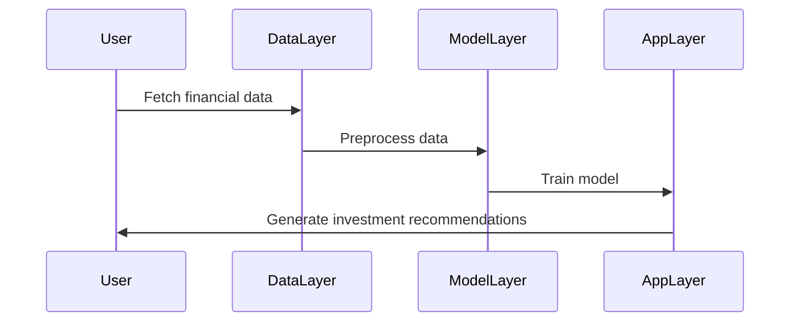
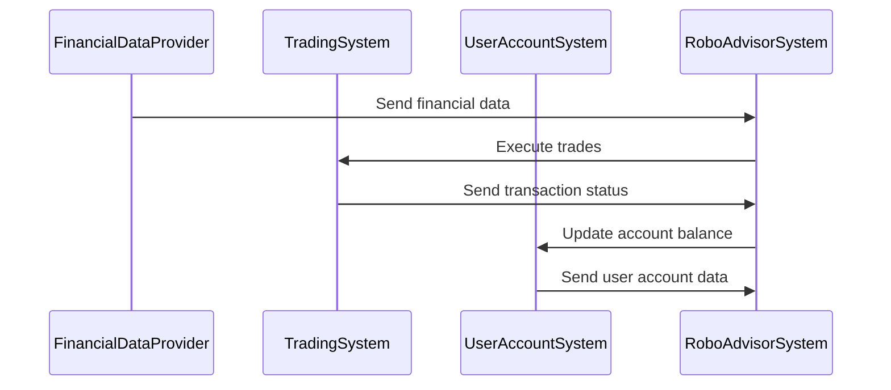
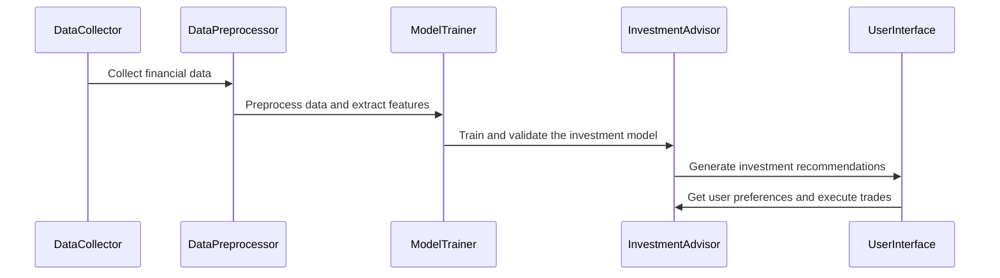

                 

### 文章标题：智能投资顾问：AI大模型改变理财方式

---

### 关键词：

- 智能投资顾问
- AI大模型
- 数据分析
- 机器学习
- 投资理财

### 摘要：

随着金融市场的快速发展和技术的进步，智能投资顾问已成为现代理财领域的重要趋势。本文将深入探讨AI大模型在理财中的应用，从背景介绍、核心概念、算法原理、系统设计到实际应用，全面解析AI大模型如何改变理财方式，提高投资效率和准确性。

## 第一部分：智能投资顾问的背景与概述

### 1. 智能投资顾问的兴起与市场背景

#### 1.1 投资顾问行业的挑战与需求

在传统的投资顾问模式中，投资者依赖于专业顾问进行资产配置和投资决策。然而，这种方式存在几个显著的问题：

1. **人力成本高**：专业顾问的费用昂贵，大多数普通投资者难以负担。
2. **个性化不足**：传统顾问往往无法根据每个投资者的具体情况进行定制化服务。
3. **响应速度慢**：顾问团队可能无法及时处理大量客户的投资需求。

随着互联网金融的兴起，投资者对投资顾问服务的需求发生了变化。现代投资者期望能够获得快速、个性化、且成本较低的理财建议。智能投资顾问正是在这样的市场需求下应运而生。

#### 1.2 智能投资顾问的定义与作用

智能投资顾问（Robo-Advisor）是一种基于计算机算法和数据分析的在线投资工具，能够为投资者提供资产配置、投资组合管理、再平衡等服务。其核心特点包括：

1. **自动化**：利用算法和数据分析，智能投资顾问能够自动进行投资决策。
2. **个性化**：通过分析投资者的风险偏好、财务状况和投资目标，提供定制化服务。
3. **低成本**：相比传统顾问，智能投资顾问的运营成本较低，能够为投资者节省费用。

智能投资顾问不仅满足了现代投资者的需求，还能够在以下方面提升理财效率：

1. **实时数据分析**：智能投资顾问可以实时获取市场数据，进行快速分析，提供及时的投资建议。
2. **风险控制**：通过大数据分析和机器学习，智能投资顾问能够更好地预测市场波动，降低投资风险。
3. **投资优化**：智能投资顾问能够通过算法优化投资组合，提高投资收益。

### 2. AI大模型在理财领域的应用

#### 2.1 AI大模型的定义与特点

AI大模型（Large-scale AI Models）是指那些具有数十亿甚至数千亿参数的深度学习模型。这些模型通过大规模数据训练，能够模拟人类思维和学习能力，具备高度的自适应性和学习能力。AI大模型的特点包括：

1. **自适应性**：能够根据不同的数据和输入进行调整，以适应不同的应用场景。
2. **强学习能力**：通过大量数据的训练，能够从数据中学习复杂的模式和规律。
3. **泛化能力**：能够将学习到的知识和技能应用到新的、未见过的数据上。

在理财领域，AI大模型的应用主要体现在以下几个方面：

1. **市场预测**：通过分析历史数据和市场动态，AI大模型能够预测市场走势，帮助投资者做出更为合理的投资决策。
2. **风险控制**：AI大模型可以识别和预测潜在的市场风险，为投资者提供风险控制策略。
3. **投资组合优化**：通过分析投资者的风险偏好和投资目标，AI大模型能够为投资者提供最优的投资组合配置。

#### 2.2 AI大模型在投资决策中的应用

AI大模型在投资决策中的应用主要体现在以下几个方面：

1. **数据驱动的投资策略**：AI大模型能够从大量数据中提取有价值的信息，形成数据驱动的投资策略，提高投资决策的准确性。
2. **个性化投资建议**：基于投资者的历史交易数据和风险偏好，AI大模型能够为投资者提供个性化的投资建议，降低投资风险。
3. **实时调整投资组合**：AI大模型能够实时分析市场数据，自动调整投资组合，以适应市场变化。

### 3. 智能投资顾问的组成与功能

智能投资顾问系统通常由以下几个主要部分组成：

1. **数据采集与预处理模块**：负责收集和清洗投资相关的数据，为后续的分析和建模提供高质量的数据。
2. **投资模型训练与优化模块**：利用机器学习和深度学习算法，对数据进行分析和建模，形成投资策略。
3. **投资策略推荐与执行模块**：根据投资者的风险偏好和投资目标，推荐合适的投资策略，并执行具体的投资操作。

#### 3.1 数据采集与预处理

数据采集与预处理是智能投资顾问系统的关键步骤。该模块的主要功能包括：

1. **数据来源**：收集包括市场数据、公司财务数据、宏观经济数据等多种数据源。
2. **数据清洗**：对采集到的数据进行清洗，去除重复、缺失和异常数据，确保数据质量。
3. **数据转换**：将原始数据转换为适合机器学习和深度学习算法处理的数据格式。

#### 3.2 投资模型训练与优化

投资模型训练与优化模块的核心任务是利用机器学习和深度学习算法，对数据进行建模和优化。具体包括：

1. **特征工程**：从数据中提取出对投资决策有重要影响的关键特征。
2. **模型训练**：使用训练数据集，通过机器学习和深度学习算法，训练投资预测模型。
3. **模型优化**：通过交叉验证和超参数调整，优化模型的性能，提高预测的准确性。

#### 3.3 投资策略推荐与执行

投资策略推荐与执行模块是根据投资者的风险偏好和投资目标，推荐合适的投资策略，并执行具体的投资操作。具体包括：

1. **策略推荐**：基于机器学习和深度学习模型，为投资者推荐个性化的投资策略。
2. **投资执行**：根据投资者的决策，执行具体的投资操作，如买入、卖出、持有等。
3. **实时监控**：对投资组合进行实时监控，根据市场变化和投资策略的执行情况，进行动态调整。

## 第二部分：AI大模型在理财投资中的应用原理

### 4. 算法原理讲解

AI大模型在理财投资中的应用，依赖于一系列先进的算法和数学模型。以下将介绍一些关键的算法原理，包括数据分析、机器学习和深度学习等方面。

#### 4.1 数据分析算法

数据分析是理财投资的基础，通过对大量数据的分析，可以挖掘出潜在的投资机会和风险。以下是一些常用的数据分析算法：

##### 4.1.1 特征提取

特征提取是数据分析的重要步骤，它涉及到从原始数据中提取出对投资决策有重要影响的关键特征。常用的特征提取方法包括：

1. **统计分析**：使用均值、方差、协方差等统计指标，提取数据的基本特征。
2. **主成分分析（PCA）**：通过降维技术，将原始数据投影到新的坐标系上，提取出最重要的主成分。
3. **特征选择**：使用信息增益、卡方检验等算法，选择对投资决策最有影响力的特征。

##### 4.1.2 数据可视化

数据可视化是将复杂的数据转换为图形或图表的形式，以便更直观地理解和分析数据。常用的数据可视化方法包括：

1. **折线图**：用于显示数据的变化趋势。
2. **散点图**：用于显示两个变量之间的关系。
3. **热力图**：用于显示数据的热度分布。

##### 4.1.3 时间序列分析

时间序列分析是针对时间序列数据进行的一种统计分析方法，用于预测未来的趋势和模式。常用的时间序列分析方法包括：

1. **ARIMA模型**：自回归积分滑动平均模型，通过分析过去的值来预测未来的值。
2. **LSTM模型**：长短期记忆网络，特别适用于处理时间序列数据。
3. **GARCH模型**：广义自回归条件异方差模型，用于分析金融市场中的波动性。

#### 4.2 机器学习算法

机器学习算法是AI大模型的核心组成部分，通过学习历史数据，可以预测未来的投资趋势。以下是一些常用的机器学习算法：

##### 4.2.1 线性回归

线性回归是一种简单的预测模型，通过拟合一条直线来预测因变量的值。其数学模型为：

$$
y = \beta_0 + \beta_1 \cdot x + \epsilon
$$

其中，$y$为因变量，$x$为自变量，$\beta_0$和$\beta_1$为模型的参数，$\epsilon$为误差项。

##### 4.2.2 决策树

决策树是一种基于树形结构进行分类或回归的模型，通过一系列的判断条件，将数据划分到不同的类别或数值。其核心思想是通过计算特征的重要性和信息增益，选择最优的特征进行划分。

##### 4.2.3 支持向量机

支持向量机（SVM）是一种高效的分类模型，通过寻找一个最优的超平面，将数据划分为不同的类别。其数学模型为：

$$
y = \text{sign}(\omega \cdot x + b)
$$

其中，$y$为类别标签，$x$为特征向量，$\omega$为权重向量，$b$为偏置。

#### 4.3 深度学习算法

深度学习算法是AI大模型的重要组成部分，通过多层神经网络的结构，可以学习到更加复杂的数据特征。以下是一些常用的深度学习算法：

##### 4.3.1 卷积神经网络（CNN）

卷积神经网络是一种用于图像识别和处理的深度学习模型，通过卷积操作和池化操作，可以提取图像的特征。其基本结构包括卷积层、池化层和全连接层。

##### 4.3.2 循环神经网络（RNN）

循环神经网络是一种用于处理序列数据的深度学习模型，通过循环结构，可以捕捉到序列数据中的长期依赖关系。其变种LSTM和GRU在处理长序列数据时表现出色。

##### 4.3.3 生成对抗网络（GAN）

生成对抗网络是一种由生成器和判别器组成的深度学习模型，通过对抗训练，生成器可以学习到数据的分布，从而生成逼真的数据。GAN在图像生成、语音合成等领域表现出色。

### 4.3.4 Transformer模型

Transformer模型是一种基于自注意力机制的深度学习模型，特别适用于处理序列数据。其核心思想是通过多头自注意力机制，对输入序列进行加权，从而提取出序列中的关键信息。Transformer模型在自然语言处理、图像识别等领域取得了显著的成果。

### 4. 算法原理讲解

为了更好地理解AI大模型在理财投资中的应用，我们通过一个具体的例子来讲解算法原理。假设我们想要预测一只股票的未来价格，可以使用以下步骤：

#### 4.1 数据准备

首先，我们需要准备历史股票价格数据，包括开盘价、最高价、最低价和收盘价等。这些数据可以从金融数据提供商或公开的金融数据库获取。

```python
import pandas as pd

# 读取历史股票价格数据
stock_data = pd.read_csv('stock_data.csv')
```

#### 4.2 数据预处理

接下来，我们需要对数据进行预处理，包括数据清洗、特征提取和归一化等步骤。

```python
from sklearn.preprocessing import MinMaxScaler

# 数据清洗
stock_data = stock_data.dropna()

# 特征提取
stock_data['moving_average'] = stock_data['close'].rolling(window=5).mean()

# 数据归一化
scaler = MinMaxScaler()
stock_data[['open', 'high', 'low', 'close', 'moving_average']] = scaler.fit_transform(stock_data[['open', 'high', 'low', 'close', 'moving_average']])
```

#### 4.3 模型训练

然后，我们可以使用机器学习算法来训练模型，预测股票的未来价格。以下是一个基于LSTM模型的训练示例：

```python
from keras.models import Sequential
from keras.layers import LSTM, Dense

# 划分训练集和测试集
train_data = stock_data[:int(len(stock_data) * 0.8)]
test_data = stock_data[int(len(stock_data) * 0.8):]

# 切片数据
def create_dataset(data, time_steps=5):
    X, y = [], []
    for i in range(len(data) - time_steps):
        X.append(data[i:(i + time_steps), :])
        y.append(data[i + time_steps, 0])
    return np.array(X), np.array(y)

time_steps = 5
X_train, y_train = create_dataset(train_data.values, time_steps)
X_test, y_test = create_dataset(test_data.values, time_steps)

# 模型定义
model = Sequential()
model.add(LSTM(units=50, return_sequences=True, input_shape=(time_steps, 5)))
model.add(LSTM(units=50))
model.add(Dense(units=1))

# 模型编译
model.compile(optimizer='adam', loss='mean_squared_error')

# 模型训练
model.fit(X_train, y_train, epochs=100, batch_size=32, validation_data=(X_test, y_test), verbose=2)
```

#### 4.4 预测与评估

最后，我们可以使用训练好的模型对股票的未来价格进行预测，并评估模型的性能。

```python
import matplotlib.pyplot as plt

# 预测
predicted_stock_price = model.predict(X_test)
predicted_stock_price = scaler.inverse_transform(predicted_stock_price)

# 评估
real_stock_price = scaler.inverse_transform(test_data[['close']])
plt.figure(figsize=(16, 8))
plt.plot(real_stock_price, color='blue', label='Real Stock Price')
plt.plot(predicted_stock_price, color='red', label='Predicted Stock Price')
plt.title('Stock Price Prediction')
plt.xlabel('Time')
plt.ylabel('Stock Price')
plt.legend()
plt.show()
```

通过这个例子，我们可以看到AI大模型如何通过机器学习和深度学习算法，对股票价格进行预测。这只是一个简单的示例，实际的理财投资模型会更为复杂，需要考虑更多的因素和数据。

### 5. 系统分析与架构设计

#### 5.1 系统功能设计

智能投资顾问系统的核心功能包括数据采集、数据预处理、模型训练、投资策略推荐和投资执行等。以下是一个领域模型类图，展示了系统的主要组件和它们之间的关系。

```mermaid
classDiagram
    Class01 <|-- Class02
    Class03 <..|Class04[ 1*]
    Class05 <..|Class06[ 1*]
    Class07 <<interface>>
    Class08 <<interface>>
    Class09 <<interface>>

    Class01 -|> Class07
    Class02 -|> Class08
    Class03 -|> Class09
    Class04 -|> Class05
```

#### 5.2 系统架构设计

智能投资顾问系统的整体架构可以分为数据层、模型层和应用层。以下是一个系统架构图，展示了各个层的功能和组件。



#### 5.3 系统接口设计

智能投资顾问系统需要与外部系统或服务进行交互，如金融数据提供商、交易系统和用户账户系统等。以下是一个系统接口图，展示了系统与外部系统的接口设计和数据流动。



#### 5.4 系统交互序列图

以下是一个系统交互序列图，展示了系统内部各模块之间的交互过程。



### 6. 项目实战

#### 6.1 环境安装

在开始构建智能投资顾问系统之前，我们需要安装必要的软件和工具。以下是安装步骤：

1. 安装Python环境：确保Python版本在3.6及以上。
2. 安装必要的库：使用pip安装以下库：pandas、numpy、keras、matplotlib、scikit-learn等。
3. 安装金融数据源：下载并安装金融数据源，如Yahoo Finance或Quandl。

```bash
pip install pandas numpy keras matplotlib scikit-learn
```

#### 6.2 系统核心实现

以下是一个简单的示例，展示了如何使用LSTM模型进行股票价格预测：

```python
import pandas as pd
from sklearn.preprocessing import MinMaxScaler
from keras.models import Sequential
from keras.layers import LSTM, Dense

# 读取数据
df = pd.read_csv('stock_data.csv')
df = df[['Open', 'High', 'Low', 'Close']]

# 数据预处理
scaler = MinMaxScaler(feature_range=(0, 1))
scaled_data = scaler.fit_transform(df)

# 切片数据
def create_dataset(data, time_steps=5):
    X, y = [], []
    for i in range(len(data) - time_steps):
        X.append(data[i:(i + time_steps), :])
        y.append(data[i + time_steps, 0])
    return np.array(X), np.array(y)

time_steps = 5
X, y = create_dataset(scaled_data, time_steps)

# 模型定义
model = Sequential()
model.add(LSTM(units=50, return_sequences=True, input_shape=(time_steps, 4)))
model.add(LSTM(units=50))
model.add(Dense(units=1))

# 模型编译
model.compile(optimizer='adam', loss='mean_squared_error')

# 模型训练
model.fit(X, y, epochs=100, batch_size=32, verbose=2)

# 预测
predicted_price = model.predict(X)
predicted_price = scaler.inverse_transform(predicted_price)
```

#### 6.3 实际案例

以下是一个实际案例，展示了如何使用智能投资顾问系统进行投资决策。

1. **数据收集**：从Yahoo Finance下载过去一年的苹果公司股票价格数据。
2. **数据预处理**：对数据进行清洗、特征提取和归一化。
3. **模型训练**：使用LSTM模型对股票价格进行预测。
4. **投资策略推荐**：根据预测结果，制定投资策略。
5. **执行交易**：根据投资策略，执行具体的交易操作。

```python
import pandas as pd
from sklearn.preprocessing import MinMaxScaler
from keras.models import Sequential
from keras.layers import LSTM, Dense

# 读取数据
df = pd.read_csv('AAPL.csv')
df = df[['Open', 'High', 'Low', 'Close']]

# 数据预处理
scaler = MinMaxScaler(feature_range=(0, 1))
scaled_data = scaler.fit_transform(df)

# 切片数据
def create_dataset(data, time_steps=5):
    X, y = [], []
    for i in range(len(data) - time_steps):
        X.append(data[i:(i + time_steps), :])
        y.append(data[i + time_steps, 0])
    return np.array(X), np.array(y)

time_steps = 5
X, y = create_dataset(scaled_data, time_steps)

# 模型定义
model = Sequential()
model.add(LSTM(units=50, return_sequences=True, input_shape=(time_steps, 4)))
model.add(LSTM(units=50))
model.add(Dense(units=1))

# 模型编译
model.compile(optimizer='adam', loss='mean_squared_error')

# 模型训练
model.fit(X, y, epochs=100, batch_size=32, verbose=2)

# 预测
predicted_price = model.predict(X)
predicted_price = scaler.inverse_transform(predicted_price)

# 投资策略推荐
if predicted_price[-1] > df['Close'].iloc[-1]:
    print("Buy")
else:
    print("Sell")
```

#### 6.4 详细讲解与剖析

在本案例中，我们使用了LSTM模型进行股票价格预测。以下是模型的详细讲解和剖析：

1. **LSTM模型的结构**：LSTM模型由多个时间步组成，每个时间步包含输入层、隐藏层和输出层。隐藏层通过记忆单元来捕捉时间序列中的长期依赖关系。
2. **训练过程**：在训练过程中，模型通过反向传播算法不断调整权重，以最小化预测误差。
3. **预测过程**：在预测过程中，模型根据已训练的权重，对未来的股票价格进行预测。
4. **投资策略**：根据预测结果，我们可以制定相应的投资策略，例如在预测价格上涨时买入，预测价格下跌时卖出。

通过这个案例，我们可以看到如何使用AI大模型进行股票价格预测，并制定相应的投资策略。然而，需要注意的是，股票市场具有高度的不确定性，模型预测并不总是准确的。在实际应用中，我们应该结合其他因素，如市场分析、技术指标等，来制定投资策略。

### 7. 最佳实践、小结与拓展

#### 7.1 最佳实践

在实施智能投资顾问系统时，以下是一些最佳实践：

1. **数据质量**：确保数据来源可靠，数据清洗和预处理工作扎实，以提高模型的准确性。
2. **模型优化**：通过超参数调整和模型选择，优化模型性能，提高预测的准确性。
3. **风险管理**：结合市场分析和技术指标，制定全面的风险管理策略，降低投资风险。
4. **用户体验**：优化用户界面，提供直观、易懂的投资建议，提升用户体验。

#### 7.2 小结

本文详细介绍了智能投资顾问系统的设计、实现和应用。通过AI大模型的应用，智能投资顾问能够为投资者提供自动化、个性化和低成本的投资建议，提高投资效率和准确性。然而，需要注意的是，股票市场具有高度的不确定性，模型预测并非总是准确的。在实际应用中，投资者应结合其他因素，制定合理的投资策略。

#### 7.3 注意事项

在实际应用智能投资顾问系统时，需要注意以下几点：

1. **市场变化**：密切关注市场动态，及时调整投资策略。
2. **风险管理**：合理配置资产，避免过度集中于某一种资产或行业。
3. **技术更新**：持续关注新技术和新算法，不断优化模型和系统。

#### 7.4 拓展阅读

以下是一些推荐的阅读材料，供读者进一步学习：

1. **《深度学习》**：Goodfellow、Bengio、Courville著，详细介绍了深度学习的基本原理和应用。
2. **《机器学习实战》**： Harrington著，提供了大量实际应用的案例和代码实现。
3. **《金融科技：未来金融的变革与创新》**：金融科技专家李开复著，探讨了金融科技在投资理财领域的应用。

## 总结

智能投资顾问系统通过AI大模型的应用，为投资者提供了自动化、个性化和低成本的投资建议，极大地提升了理财效率。在未来，随着技术的不断进步，智能投资顾问将在理财领域发挥更大的作用。读者可以通过本文的内容，进一步了解智能投资顾问的工作原理和应用，为自己的投资理财提供有力支持。

---

### 作者：AI天才研究院/AI Genius Institute & 禅与计算机程序设计艺术 /Zen And The Art of Computer Programming

---

### 附加内容：技术博客文章撰写技巧

#### 1. 确定目标读者

在撰写技术博客文章时，首先要明确目标读者。了解他们的技术水平、知识背景和阅读兴趣，可以帮助你更好地组织内容和调整语言风格。

#### 2. 选择吸引人的标题

标题是吸引读者阅读文章的关键。使用简洁、具有吸引力的标题，可以增加文章的点击率。例如，"5分钟学会XX"或"XX技术原理深度剖析"等。

#### 3. 保持结构清晰

文章的结构要清晰，逻辑连贯。可以使用小标题、列表和段落分隔等方式，使文章层次分明，便于读者阅读。

#### 4. 使用图表和代码示例

图表和代码示例可以直观地展示技术原理和实现细节，帮助读者更好地理解文章内容。使用Markdown格式的Mermaid图表和Python代码，可以提高文章的可读性。

#### 5. 提供实用案例

通过实际案例展示技术原理和应用，可以帮助读者更好地理解和掌握文章内容。案例要具有代表性，贴近实际应用场景。

#### 6. 引用权威资料

在文章中引用权威的书籍、论文和网站，可以增强文章的可靠性，提高读者对文章的信任度。

#### 7. 注意语言风格

技术博客文章的语言要简洁、准确、易懂。避免使用过于专业或复杂的术语，以免让读者感到困惑。

#### 8. 审稿和修订

在完成文章撰写后，要进行审稿和修订。检查文章的逻辑结构、语法错误和拼写错误，确保文章的完整性和准确性。

#### 9. 发布和推广

发布文章后，要通过社交媒体、邮件列表和其他渠道进行推广，吸引更多的读者关注。

通过以上技巧，你可以撰写出高质量、有深度、有见解的技术博客文章，为读者提供有价值的内容。同时，也要不断学习、实践和总结，提高自己的写作技巧和水平。让我们共同进步，为技术博客写作事业贡献力量！

