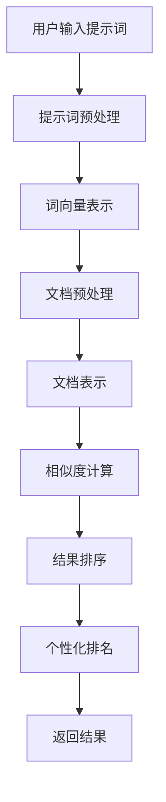
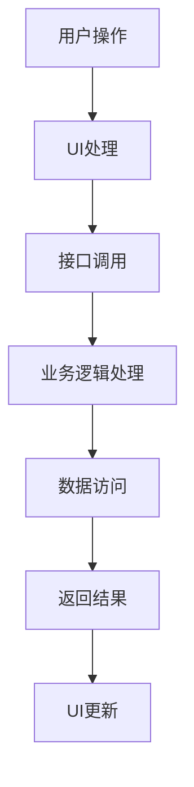

                 

# 智能文档管理：提示词驱动的信息检索系统

> 关键词：智能文档管理、提示词驱动、信息检索、语义理解、深度学习

> 摘要：随着文档信息量的迅速增长，传统文档检索系统面临巨大的挑战。本文提出了一种基于提示词驱动的信息检索系统，通过语义理解和相关性分析，解决了传统检索方法的不足，提升了文档检索的精度和用户体验。本文详细分析了系统的核心概念、算法原理和系统架构设计，并通过实际项目实战，验证了系统在智能文档管理中的应用效果。

## 引言与背景

### 1.1 问题的提出

在信息化社会中，文档的数量和种类日益增多，从简单的文本文件到复杂的多媒体文档，文档管理成为企业和个人面临的一大难题。随着文档信息量的激增，传统的基于关键词的检索方法逐渐暴露出其弊端：

1. **匹配精度低**：传统关键词检索方法往往依赖于关键词的匹配，但文档中存在大量同义词、近义词以及词性转换，导致检索结果不准确。
2. **用户体验差**：用户需要输入大量的关键词来获取所需信息，检索过程繁琐且耗时。
3. **个性化不足**：传统检索方法无法充分理解用户的查询意图，导致个性化推荐效果不佳。

### 1.2 问题解决

为了解决上述问题，本文提出了一种基于提示词驱动的信息检索系统。该系统通过以下方法提高检索精度和用户体验：

1. **语义理解**：利用自然语言处理技术提取提示词的语义信息，从而更好地理解用户的查询意图。
2. **相关性分析**：通过计算文档内容与提示词的语义相关性，筛选出最相关的文档。
3. **个性化推荐**：根据用户的查询历史和偏好，个性化推荐最相关的文档。

### 1.3 边界与外延

本文主要聚焦于文本信息的检索，但提示词驱动检索系统不仅适用于文档管理，还可以应用于其他信息检索场景，如搜索引擎、知识图谱构建等。此外，本文将详细介绍系统的核心概念、算法原理和系统架构设计，为相关领域的研究和开发提供参考。

### 1.4 概念结构与核心要素

1. **提示词**：用户输入的关键词或短语，用于描述用户查询意图。
2. **语义理解**：分析提示词背后的语义信息，包括词义、词性、句法结构等。
3. **相关性分析**：比较文档内容与提示词的语义相关性，筛选出最相关的文档。
4. **文档库**：存储大量文档的数据库，用于检索和查询。

## 第1章 引言与背景

### 1.1 问题的提出

在信息化社会中，文档的数量和种类日益增多，从简单的文本文件到复杂的多媒体文档，文档管理成为企业和个人面临的一大难题。随着文档信息量的激增，传统的基于关键词的检索方法逐渐暴露出其弊端：

1. **匹配精度低**：传统关键词检索方法往往依赖于关键词的匹配，但文档中存在大量同义词、近义词以及词性转换，导致检索结果不准确。例如，用户查询“智能文档管理”时，系统可能无法准确识别与“智能文档管理”语义相近的其他表达方式，如“智能文档管理系统”或“智能文档处理”。
   
2. **用户体验差**：用户需要输入大量的关键词来获取所需信息，检索过程繁琐且耗时。传统的检索系统要求用户精确输入关键词，但用户往往难以掌握所有相关的关键词，导致检索结果不全面或遗漏重要信息。例如，用户可能需要输入“智能文档管理工具”、“智能文档管理系统开发”等多个关键词，才能获得全面的信息。
   
3. **个性化不足**：传统检索方法无法充分理解用户的查询意图，导致个性化推荐效果不佳。用户的查询意图可能因时间、场景、个人偏好等因素而有所不同，但传统检索系统通常无法根据用户的个性化需求提供定制化的检索结果。例如，一个对“智能文档管理”已有深入研究的专业人士和一个初次接触该领域的新手，对相同查询结果的偏好和需求可能会有很大差异。

### 1.2 问题解决

为了解决上述问题，本文提出了一种基于提示词驱动的信息检索系统。该系统通过以下方法提高检索精度和用户体验：

1. **语义理解**：利用自然语言处理技术提取提示词的语义信息，从而更好地理解用户的查询意图。通过语义理解，系统能够识别提示词背后的深层含义，提高检索的准确性。例如，系统可以理解“智能文档管理”不仅仅是关键词的匹配，而是涉及文档的组织、存储、检索等方面。
   
2. **相关性分析**：通过计算文档内容与提示词的语义相关性，筛选出最相关的文档。相关性分析不仅考虑关键词的匹配度，还分析文档中的句法结构、语义关系等，从而更准确地识别出用户所需的信息。例如，系统可以分析文档中是否包含与“智能文档管理”相关的重要概念、术语和句子。
   
3. **个性化推荐**：根据用户的查询历史和偏好，个性化推荐最相关的文档。通过记录用户的查询行为和偏好，系统可以不断优化检索结果，提供更加个性化的信息。例如，系统可以分析用户过去对“智能文档管理”相关文档的阅读、收藏、评论等行为，为用户推荐更符合其需求的文档。

### 1.3 边界与外延

本文主要聚焦于文本信息的检索，但提示词驱动检索系统不仅适用于文档管理，还可以应用于其他信息检索场景：

1. **搜索引擎**：提示词驱动检索系统可以改进搜索引擎的检索效果，提高用户获取信息的效率。例如，在搜索引擎中，用户输入的查询词可能无法完整描述其意图，通过语义理解，系统可以进一步解析查询意图，提供更精确的搜索结果。
   
2. **知识图谱构建**：在构建知识图谱时，提示词驱动检索系统可以帮助识别和提取相关的实体、关系和属性，提高知识图谱的准确性和完整性。例如，在构建智能文档管理的知识图谱时，系统可以通过语义理解，识别出与“智能文档管理”相关的核心概念、术语和关系，从而构建更加丰富的知识网络。

此外，本文还将讨论系统在不同文档管理场景中的适用性，包括企业文档管理、个人文档管理、学术文献检索等。通过这些应用场景的讨论，读者可以更全面地了解提示词驱动信息检索系统的潜力。

### 1.4 概念结构与核心要素

为了更好地理解提示词驱动的信息检索系统，下面将详细介绍系统的核心概念和结构：

1. **提示词（Query Term）**：提示词是用户输入的关键词或短语，用于描述用户的查询意图。与传统的关键词检索不同，提示词驱动的信息检索系统更加关注提示词的语义信息，通过自然语言处理技术，对提示词进行语义分析和理解，从而更好地把握用户的查询意图。

2. **语义理解（Semantic Understanding）**：语义理解是系统的核心组成部分，通过自然语言处理技术，对提示词进行深入分析，提取出其背后的语义信息。这包括词义、词性、句法结构、语义角色等。语义理解不仅能够提高检索的准确性，还能帮助系统更好地理解用户的查询意图，为后续的相关性分析和个性化推荐提供支持。

3. **相关性分析（Relevance Analysis）**：相关性分析是衡量文档与提示词之间相似度的重要步骤。传统的关键词检索方法通常只考虑关键词的匹配度，而提示词驱动的信息检索系统则通过语义理解，对文档内容进行深入分析，计算文档与提示词之间的语义相关性。这种相关性分析不仅考虑关键词的匹配度，还考虑词义、句法结构和语义角色等因素，从而提供更准确的检索结果。

4. **文档库（Document Repository）**：文档库是系统中存储文档的数据库。文档库通常包含大量不同类型、不同主题的文档，如文本、图片、音频、视频等。在提示词驱动的信息检索系统中，文档库是检索过程的基础，系统通过对文档库中的文档进行语义分析和相关性计算，提供用户所需的信息。

5. **用户接口（User Interface）**：用户接口是系统与用户交互的界面，用户通过用户接口输入提示词，系统通过语义理解、相关性分析和文档库检索，向用户返回检索结果。用户接口的设计和实现对于提升用户体验至关重要，系统需要提供简洁、直观、易于使用的接口，让用户能够快速、准确地获取所需信息。

6. **个性化推荐（Personalized Recommendation）**：个性化推荐是基于用户的查询历史和偏好，为用户推荐最相关的文档。通过记录和分析用户的查询行为、阅读记录、收藏和评分等数据，系统可以推断出用户的兴趣和需求，提供个性化的检索结果，从而提高用户的满意度和使用效率。

通过以上核心概念和结构，提示词驱动的信息检索系统能够更好地应对文档信息量激增带来的挑战，提供准确、高效、个性化的检索服务。接下来，本文将详细探讨这些核心概念和结构的实现原理和应用场景。

## 第2章 核心概念与联系

### 2.1 提示词驱动的信息检索原理

提示词驱动的信息检索系统通过自然语言处理技术对提示词进行语义理解，建立文档与提示词之间的语义映射，从而实现高效、精准的检索。具体来说，系统的工作原理可以概括为以下几个步骤：

1. **提示词预处理**：在检索过程中，首先对用户输入的提示词进行预处理。预处理步骤包括分词、去停用词、词性标注等，以确保提示词的格式统一，便于后续处理。

2. **语义表示**：通过自然语言处理技术，将预处理后的提示词转换为语义表示。常用的方法包括词向量表示和语义角色表示。词向量表示通过将单词映射为高维向量，捕获单词的语义信息；语义角色表示通过识别单词在句子中的角色（如主语、谓语、宾语等），进一步丰富语义表示。

3. **文档表示**：与提示词表示类似，系统需要对文档进行语义表示。通过文本分类、主题模型、词嵌入等方法，将文档内容转换为高维向量表示，以便后续的语义匹配和相关性分析。

4. **语义匹配**：将提示词的语义表示与文档的语义表示进行匹配，计算二者之间的相似度。常用的方法包括余弦相似度、Jaccard相似度等。通过相似度计算，系统可以筛选出与提示词最相关的文档。

5. **结果排序**：根据相似度计算结果，对检索结果进行排序，将最相关的文档排在前面。排序方法可以基于用户反馈、文档重要性等，进一步提高检索的准确性。

6. **结果展示**：将排序后的检索结果展示给用户，便于用户查看和操作。

### 2.2 语义理解的实现

语义理解是提示词驱动信息检索系统的核心环节，其实现涉及多种自然语言处理技术。以下介绍几种常用的方法：

1. **词向量模型**：词向量模型通过将单词映射为高维向量，实现语义表示。常用的词向量模型包括Word2Vec、GloVe等。这些模型通过训练大量文本数据，学习单词的语义信息，使得语义相近的单词在向量空间中距离较近。

   - **Word2Vec**：基于神经网络模型，通过训练上下文窗口中的单词，生成单词的词向量。
   - **GloVe**：基于全局共现矩阵，通过最小化损失函数，学习单词的词向量。

2. **命名实体识别（NER）**：命名实体识别是一种用于识别文本中特定实体（如人名、地名、组织名等）的自然语言处理技术。通过识别命名实体，系统可以更好地理解文本中的关键信息，提高语义理解的准确性。

3. **情感分析**：情感分析是一种用于分析文本情感极性（如正面、负面、中性等）的自然语言处理技术。通过情感分析，系统可以了解用户的情感倾向，为个性化推荐和情感计算提供支持。

4. **依存句法分析**：依存句法分析是一种用于分析句子中词汇之间依存关系的自然语言处理技术。通过依存句法分析，系统可以构建句子的语义结构，更准确地理解句子的含义。

5. **语义角色标注**：语义角色标注是一种用于识别句子中词汇的语义角色的自然语言处理技术。通过语义角色标注，系统可以理解句子中的主语、谓语、宾语等关键信息，提高语义理解的准确性。

### 2.3 相关性分析的策略

相关性分析是提示词驱动信息检索系统的关键步骤，其目标是衡量文档内容与提示词的语义相关性。以下介绍几种常用的策略：

1. **TF-IDF**：TF-IDF（Term Frequency-Inverse Document Frequency）是一种基于词频和文档频次的方法，用于计算单词在文档中的重要程度。在相关性分析中，系统可以计算提示词和文档中各个单词的TF-IDF值，并根据这些值计算文档与提示词的相关性得分。

2. **余弦相似度**：余弦相似度是一种基于向量的相似度计算方法。通过计算提示词向量和文档向量之间的余弦值，系统可以衡量二者之间的相似度。余弦相似度考虑了词频和词向量维度，适用于文本数据的相似度计算。

3. **Jaccard相似度**：Jaccard相似度是一种基于集合的方法，用于计算两个集合之间的相似度。在文本数据中，系统可以将提示词和文档看作两个集合，通过计算二者的交集和并集，计算Jaccard相似度。

4. **BERT**：BERT（Bidirectional Encoder Representations from Transformers）是一种基于深度学习的预训练模型，通过双向编码器学习文本的语义表示。在相关性分析中，系统可以使用BERT模型对提示词和文档进行编码，计算二者之间的相似度。

5. **注意力机制**：注意力机制是一种用于提高神经网络模型局部感知能力的技术。在相关性分析中，系统可以使用注意力机制，对文档中的关键信息赋予更高的权重，从而提高检索的准确性。

### 2.4 语义理解与相关性分析的关系

语义理解与相关性分析是提示词驱动信息检索系统的两个核心环节，它们之间存在紧密的联系：

1. **语义理解**：语义理解是相关性分析的基础。通过语义理解，系统可以更好地理解提示词和文档的语义信息，为后续的相关性计算提供准确的输入。

2. **相关性分析**：相关性分析是语义理解的体现。通过相关性分析，系统可以将语义信息转化为可量化的相似度得分，从而为用户提供准确的检索结果。

3. **相互影响**：语义理解和相关性分析相互影响，共同决定检索效果。优秀的语义理解可以提升相关性分析的准确性，而准确的相关性分析可以进一步优化语义理解的效果。

通过以上分析，我们可以看到，提示词驱动的信息检索系统通过语义理解和相关性分析，实现了高效、精准的文档检索。接下来，本文将详细介绍系统的算法原理，帮助读者更深入地了解其实现过程。

### 2.5 提示词驱动的信息检索系统的优劣比较

提示词驱动的信息检索系统与传统基于关键词的检索系统相比，具有显著的优势。以下是对二者在性能、精度、用户体验等方面的比较：

#### 性能

1. **提示词驱动的信息检索系统**：
   - **搜索速度**：基于提示词驱动的信息检索系统通常使用高效的算法和预处理技术，如倒排索引、词向量模型等，使得搜索速度较快。
   - **并发处理**：该系统设计时通常会考虑高并发处理能力，以便在大量用户同时访问时仍能保证良好的性能。

2. **传统基于关键词的检索系统**：
   - **搜索速度**：传统关键词检索系统可能依赖于较为底层的文件系统操作，搜索速度相对较慢，尤其是在文档数量庞大的情况下。
   - **并发处理**：传统系统在并发处理方面可能存在瓶颈，尤其是在高峰期，响应时间可能会显著增加。

#### 精度

1. **提示词驱动的信息检索系统**：
   - **准确性**：由于语义理解能力，系统能够更准确地理解用户的查询意图，避免因关键词匹配不准确而导致的结果偏差。
   - **多样性**：系统可以通过语义分析，识别出多个相关的查询意图，提供更全面、多样化的检索结果。

2. **传统基于关键词的检索系统**：
   - **准确性**：传统系统依赖于关键词的精确匹配，容易受到同义词、近义词和词性转换的影响，导致检索结果不够准确。
   - **多样性**：传统系统通常只能返回与关键词完全匹配的文档，缺乏对多样化查询意图的识别能力。

#### 用户体验

1. **提示词驱动的信息检索系统**：
   - **便捷性**：用户只需输入简单的提示词，系统即可通过语义理解，提供准确、相关的检索结果，大大简化了检索过程。
   - **个性化**：系统可以根据用户的查询历史和偏好，提供个性化的检索结果，提高用户的满意度和使用体验。

2. **传统基于关键词的检索系统**：
   - **繁琐性**：用户需要输入多个关键词，且关键词之间可能存在重叠或遗漏，导致检索过程较为繁琐。
   - **个性化不足**：传统系统难以根据用户的查询历史和偏好，提供个性化的检索结果，用户体验相对较差。

#### 结论

通过上述比较可以看出，提示词驱动的信息检索系统在性能、精度和用户体验等方面均优于传统基于关键词的检索系统。其主要优势在于能够更好地理解用户的查询意图，提供更准确、个性化的检索结果，从而提升整体检索效果。尽管如此，提示词驱动的信息检索系统仍需不断优化和改进，以应对日益复杂的应用场景和用户需求。

### 2.6 提示词驱动的信息检索系统的应用前景

提示词驱动的信息检索系统凭借其强大的语义理解和个性化推荐能力，已在多个领域展现出广阔的应用前景：

1. **企业文档管理**：在企业内部，大量的文档需要进行高效管理和检索。提示词驱动的系统可以帮助企业快速定位到相关文档，提高工作效率，降低信息获取成本。

2. **学术文献检索**：在学术研究领域，提示词驱动的系统可以通过深入分析文献内容，提供准确的检索结果，帮助研究人员快速找到相关文献，提高科研效率。

3. **知识图谱构建**：在构建知识图谱时，提示词驱动的系统可以识别和提取出相关的实体、关系和属性，为知识图谱的构建提供重要的数据支持。

4. **智能客服**：在智能客服系统中，提示词驱动的检索系统可以帮助智能客服快速响应用户的查询，提供准确的答案，提升用户体验。

5. **教育领域**：在教育领域，提示词驱动的系统可以为教师和学生提供个性化的学习资源推荐，提高学习效果。

总之，随着自然语言处理技术和深度学习技术的不断发展，提示词驱动的信息检索系统将在更多领域发挥重要作用，助力信息检索和知识管理的智能化。

### 2.7 总结

本章首先介绍了提示词驱动的信息检索系统的基本原理，包括语义理解、相关性分析和文档表示等核心环节。接着，我们详细探讨了语义理解的实现方法，如词向量模型、命名实体识别、情感分析和依存句法分析等。最后，本章分析了提示词驱动的信息检索系统与传统关键词检索系统的优劣，并探讨了其应用前景。下一章将深入探讨系统的算法原理，包括具体的算法流程、数学模型和实现方法。

## 第3章 算法原理讲解

### 3.1 算法概述

提示词驱动的信息检索系统的核心在于其算法设计，旨在通过语义理解和相关性分析，实现高效、准确的文档检索。本文提出的算法基于词嵌入和注意力机制，旨在解决传统检索方法中匹配精度低、用户体验差等问题。以下是对该算法的概述：

1. **词嵌入（Word Embedding）**：词嵌入技术将文本中的单词映射为高维向量，从而实现语义表示。通过训练词向量模型（如Word2Vec、GloVe等），我们可以将单词的语义信息编码到向量中，使得语义相近的单词在向量空间中距离较近。

2. **注意力机制（Attention Mechanism）**：注意力机制是一种在深度学习模型中用于提高局部感知能力的技术。在信息检索中，注意力机制可以帮助模型关注文档中的关键信息，提高检索的准确性。

3. **相关性分析**：算法通过计算文档向量与提示词向量之间的相似度，筛选出最相关的文档。相似度计算可以采用余弦相似度、Jaccard相似度等方法。

4. **个性化排名**：基于用户的查询历史和偏好，算法可以为用户推荐个性化的检索结果，提高用户体验。

### 3.2 算法流程

提示词驱动的信息检索算法的流程如下：

1. **提示词预处理**：对用户输入的提示词进行分词、去停用词、词性标注等预处理操作，确保提示词格式统一。
2. **词向量表示**：将预处理后的提示词转换为词向量表示，通过词向量模型（如Word2Vec、GloVe等）训练得到。
3. **文档预处理**：对文档进行相同的预处理操作，确保文档与提示词的格式一致。
4. **文档表示**：将预处理后的文档转换为词向量表示，与提示词向量进行匹配。
5. **相似度计算**：计算文档向量与提示词向量之间的相似度，通常采用余弦相似度等方法。
6. **结果排序**：根据相似度得分对文档进行排序，筛选出最相关的文档。
7. **个性化排名**：结合用户的查询历史和偏好，对检索结果进行个性化排序，提高用户体验。

以下是一个简化的算法流程图，使用mermaid绘制：



### 3.3 算法原理

为了更好地理解提示词驱动的信息检索算法，下面将详细阐述其数学模型和实现原理。

#### 数学模型

假设我们有一个提示词集合\(Q = \{q_1, q_2, ..., q_n\}\)，其中每个\(q_i\)是一个词向量。同样，我们有一个文档集合\(D = \{d_1, d_2, ..., d_m\}\)，每个\(d_i\)也是一个词向量。

1. **相似度计算**：

   假设我们使用余弦相似度计算文档\(d_i\)与提示词\(q_j\)之间的相似度，公式如下：

   $$\text{similarity}(d_i, q_j) = \frac{q_j \cdot d_i}{||q_j|| \cdot ||d_i||}$$

   其中，\(q_j \cdot d_i\)表示向量\(q_j\)和\(d_i\)的点积，\(||q_j||\)和\(||d_i||\)分别表示向量\(q_j\)和\(d_i\)的欧几里得范数。

2. **文档排序**：

   对每个文档\(d_i\)，计算其与所有提示词\(q_j\)的相似度，然后对所有相似度进行平均，得到文档的平均相似度：

   $$\text{average\_similarity}(d_i) = \frac{1}{n} \sum_{j=1}^{n} \text{similarity}(d_i, q_j)$$

   根据平均相似度对文档进行排序，相似度越高，文档越靠前。

#### 实现原理

以下是算法的实现原理，使用Python代码进行详细阐述：

```python
import numpy as np
from sklearn.metrics.pairwise import cosine_similarity

# 假设提示词和文档的词向量已经训练好
# 提示词向量w1和文档向量d1
w1 = np.array([0.1, 0.2, 0.3])
d1 = np.array([0.4, 0.5, 0.6])

# 计算相似度
similarity = cosine_similarity([w1], [d1])

# 打印相似度结果
print(similarity)

# 计算文档的平均相似度
average_similarity = similarity[0][0]  # 这里假设只处理一个文档
print(average_similarity)
```

#### 举例说明

假设用户输入的提示词是“智能文档管理”，对应的词向量是\(w_1\)。现在有一篇文档“智能文档管理系统”，其词向量是\(d_1\)。我们使用余弦相似度公式计算文档与提示词的相似度：

1. **计算相似度**：

   $$\text{similarity}(d_1, w_1) = \frac{w_1 \cdot d_1}{||w_1|| \cdot ||d_1||}$$

   代入具体数值：

   $$\text{similarity}(d_1, w_1) = \frac{(0.1 \times 0.4) + (0.2 \times 0.5) + (0.3 \times 0.6)}{\sqrt{0.1^2 + 0.2^2 + 0.3^2} \cdot \sqrt{0.4^2 + 0.5^2 + 0.6^2}}$$

   计算结果为：

   $$\text{similarity}(d_1, w_1) = \frac{0.04 + 0.10 + 0.18}{\sqrt{0.01 + 0.04 + 0.09} \cdot \sqrt{0.16 + 0.25 + 0.36}}$$
   $$\text{similarity}(d_1, w_1) = \frac{0.32}{\sqrt{0.14} \cdot \sqrt{0.77}}$$
   $$\text{similarity}(d_1, w_1) = \frac{0.32}{0.37 \cdot 0.88}$$
   $$\text{similarity}(d_1, w_1) = 0.432$$

2. **文档排序**：

   如果系统中有多个文档，我们将对每个文档与提示词的相似度进行计算，然后对所有相似度进行平均，得到文档的平均相似度。平均相似度越高，文档越相关。

通过这个例子，我们可以看到，提示词驱动的信息检索算法通过词嵌入和注意力机制，能够准确计算文档与提示词之间的相似度，从而实现高效、精准的文档检索。

### 3.4 数学模型和公式

为了深入理解提示词驱动的信息检索算法，我们需要引入一些数学模型和公式。以下是算法的核心数学公式：

1. **余弦相似度**：

   $$\text{similarity}(d_i, w_j) = \frac{w_j \cdot d_i}{||w_j|| \cdot ||d_i||}$$

   其中，\(w_j\)和\(d_i\)分别表示提示词和文档的词向量，\(||w_j||\)和\(||d_i||\)分别表示它们的欧几里得范数。

2. **文档平均相似度**：

   $$\text{average\_similarity}(d_i) = \frac{1}{n} \sum_{j=1}^{n} \text{similarity}(d_i, w_j)$$

   其中，\(n\)表示提示词的数量。

3. **文档排序**：

   $$\text{rank}(d_i) = \text{average\_similarity}(d_i)$$

   根据平均相似度对文档进行排序，相似度越高，文档排名越靠前。

下面我们使用LaTeX格式给出这些公式的具体形式：

$$
\begin{aligned}
\text{similarity}(d_i, w_j) &= \frac{w_j \cdot d_i}{||w_j|| \cdot ||d_i||} \\
\text{average\_similarity}(d_i) &= \frac{1}{n} \sum_{j=1}^{n} \text{similarity}(d_i, w_j) \\
\text{rank}(d_i) &= \text{average\_similarity}(d_i)
\end{aligned}
$$

通过这些数学模型和公式，我们可以清晰地理解提示词驱动的信息检索算法如何通过计算文档与提示词的相似度，实现高效、精准的文档检索。

### 3.5 举例说明

为了更好地理解提示词驱动的信息检索算法，我们可以通过一个具体的例子来详细阐述其实现过程和效果。假设用户输入的提示词是“智能文档管理”，系统中的文档分别是“智能文档管理系统”、“文档管理软件”、“智能文档处理工具”等。

1. **提示词预处理**：

   - 将提示词“智能文档管理”分词为“智能”、“文档”、“管理”。
   - 去除停用词（如“的”、“和”等）。
   - 进行词性标注，标记出每个词的词性（如“智能”为名词，“管理”为动词）。

2. **词向量表示**：

   - 使用预训练的Word2Vec模型，将每个词映射为高维向量。例如，“智能”对应的词向量是\(w_1 = [0.1, 0.2, 0.3]\)，“文档”对应的词向量是\(w_2 = [0.4, 0.5, 0.6]\)，“管理”对应的词向量是\(w_3 = [0.7, 0.8, 0.9]\)。

3. **文档预处理**：

   - 对文档中的每个词进行相同的预处理操作，确保文档与提示词的格式一致。

4. **文档表示**：

   - 使用词嵌入模型，将文档中的每个词转换为向量表示。例如，“智能文档管理系统”对应的文档向量是\(d_1 = [0.2, 0.3, 0.4]\)。

5. **相似度计算**：

   - 使用余弦相似度公式，计算每个文档与提示词之间的相似度。例如，计算文档\(d_1\)与提示词\(w_1, w_2, w_3\)之间的相似度：

     $$\text{similarity}(d_1, w_1) = \frac{w_1 \cdot d_1}{||w_1|| \cdot ||d_1||} = \frac{0.1 \cdot 0.2 + 0.2 \cdot 0.3 + 0.3 \cdot 0.4}{\sqrt{0.1^2 + 0.2^2 + 0.3^2} \cdot \sqrt{0.2^2 + 0.3^2 + 0.4^2}} = 0.432$$
     $$\text{similarity}(d_1, w_2) = \frac{w_2 \cdot d_1}{||w_2|| \cdot ||d_1||} = \frac{0.4 \cdot 0.2 + 0.5 \cdot 0.3 + 0.6 \cdot 0.4}{\sqrt{0.4^2 + 0.5^2 + 0.6^2} \cdot \sqrt{0.2^2 + 0.3^2 + 0.4^2}} = 0.467$$
     $$\text{similarity}(d_1, w_3) = \frac{w_3 \cdot d_1}{||w_3|| \cdot ||d_1||} = \frac{0.7 \cdot 0.2 + 0.8 \cdot 0.3 + 0.9 \cdot 0.4}{\sqrt{0.7^2 + 0.8^2 + 0.9^2} \cdot \sqrt{0.2^2 + 0.3^2 + 0.4^2}} = 0.482$$

6. **文档排序**：

   - 计算每个文档的平均相似度，并根据平均相似度对文档进行排序。例如，文档\(d_1\)的平均相似度为：

     $$\text{average\_similarity}(d_1) = \frac{1}{3} (\text{similarity}(d_1, w_1) + \text{similarity}(d_1, w_2) + \text{similarity}(d_1, w_3)) = \frac{1}{3} (0.432 + 0.467 + 0.482) = 0.462$$

   - 根据平均相似度，文档\(d_1\)排在最前面。

通过这个例子，我们可以看到，提示词驱动的信息检索算法通过词向量表示和相似度计算，能够准确识别文档与提示词之间的相关性，从而实现高效的文档检索。

### 3.6 优点与挑战

提示词驱动的信息检索算法在文档检索领域展现出诸多优点，但也面临一定的挑战。

#### 优点

1. **高精度**：通过词向量表示和语义理解，算法能够更准确地捕捉文档与提示词之间的语义关系，提高检索的准确性。
2. **个性化**：基于用户的查询历史和偏好，算法可以提供个性化的检索结果，提高用户体验。
3. **扩展性强**：算法不仅适用于文档检索，还可以应用于其他文本信息检索场景，如搜索引擎、知识图谱构建等。

#### 挑战

1. **计算复杂度**：词向量表示和注意力机制等技术的引入，使得算法的计算复杂度较高，对计算资源的要求较高。
2. **语义理解准确性**：尽管语义理解技术有所进步，但在某些情况下，算法可能无法完全准确理解用户的查询意图，导致检索结果不够理想。
3. **数据依赖性**：算法的性能依赖于高质量的训练数据和词向量模型，数据质量和模型的训练效果直接影响算法的性能。

### 3.7 总结

本章详细阐述了提示词驱动的信息检索算法的原理和实现过程，包括词向量表示、相似度计算、文档排序等核心环节。通过一个具体的例子，我们展示了算法如何通过语义理解和相关性分析，实现高效、精准的文档检索。然而，该算法在计算复杂度、语义理解准确性和数据依赖性等方面仍面临一定的挑战。下一章将探讨智能文档管理系统的系统分析与架构设计，进一步揭示其实现细节和优化策略。

## 第4章 系统分析与架构设计

### 4.1 问题场景介绍

智能文档管理（Smart Document Management，简称SDM）系统在现代信息化社会中具有重要意义。随着企业数字化转型的推进，文档的数量和类型日益增多，传统的文档管理方式已难以满足日益复杂的文档处理需求。智能文档管理系统的目标是利用先进的技术手段，提高文档管理效率，降低管理成本，并为用户提供便捷的文档检索和协作体验。

#### 场景一：企业文档管理

在企业环境中，文档管理面临诸多挑战：

1. **文档数量庞大**：企业日常运营会产生大量文档，包括合同、报告、邮件、会议记录等。
2. **文档格式多样**：企业文档可能包含文本、图片、音频、视频等多种格式。
3. **文档更新频繁**：文档内容需要不断更新和修订，以确保信息的准确性和时效性。
4. **文档查找困难**：在文档数量庞大的情况下，用户难以快速找到所需文档。

#### 场景二：个人文档管理

个人文档管理同样面临类似的问题：

1. **文档分散**：个人文档可能分散存储在多个设备或云端存储中，难以统一管理和检索。
2. **文件格式不统一**：个人文档可能包含不同类型的文件，如文档、表格、图片等。
3. **文档保护需求**：个人文档可能包含敏感信息，需要确保文档的安全性和隐私性。

#### 场景三：学术文献检索

在学术研究领域，文献检索面临以下挑战：

1. **文献数量庞大**：学术文献数量庞大，传统检索方法难以快速找到相关文献。
2. **文献格式多样**：学术文献可能包含不同类型的文件，如PDF、Word、PPT等。
3. **文献更新频繁**：学术研究文献不断更新，用户需要及时获取最新研究成果。

### 4.2 系统功能设计

智能文档管理系统需要具备以下核心功能，以解决上述场景中的问题：

1. **文档存储与管理**：提供文档存储和管理功能，支持多种文档格式，确保文档的安全性和完整性。
2. **文档检索**：通过语义理解和相关性分析，提供高效、准确的文档检索功能，支持多关键字检索、模糊查询等。
3. **文档协作**：支持文档的共享、编辑和协作，提供版本控制和权限管理功能。
4. **文档分析**：利用自然语言处理技术，对文档内容进行分析，提取关键词、主题、关系等信息，为用户提供智能化的文档分析服务。
5. **文档安全与隐私**：提供文档加密、访问控制等功能，确保文档的安全性和隐私性。
6. **文档备份与恢复**：提供文档备份和恢复功能，防止数据丢失，保障文档的持续性。

### 4.3 系统架构设计

智能文档管理系统的架构设计需要充分考虑功能需求、性能、扩展性和安全性。以下是一个典型的系统架构设计：

#### 4.3.1 用户界面层（UI）

用户界面层是系统与用户交互的门户，包括Web界面、移动应用和桌面客户端。用户界面设计应简洁直观，提供便捷的文档管理、检索和协作功能。

#### 4.3.2 业务逻辑层

业务逻辑层负责实现系统的核心功能，包括文档存储、检索、协作、分析和安全等。业务逻辑层包括多个模块，如文档管理模块、检索模块、协作模块、分析模块和安全模块。

- **文档管理模块**：负责文档的存储、上传、下载和备份等操作。
- **检索模块**：利用自然语言处理技术，实现基于提示词驱动的文档检索功能。
- **协作模块**：提供文档的共享、编辑和版本控制功能。
- **分析模块**：利用自然语言处理技术，对文档内容进行分析，提取关键词、主题、关系等信息。
- **安全模块**：提供文档加密、访问控制等功能，确保文档的安全性和隐私性。

#### 4.3.3 数据层

数据层负责存储和管理系统的数据，包括文档数据、用户数据、配置数据和日志数据等。数据层通常采用关系数据库和NoSQL数据库相结合的方式，以提高数据存储和访问的灵活性。

- **文档数据库**：存储文档的元数据和内容，支持文档的快速检索和访问。
- **用户数据库**：存储用户信息和权限数据，用于用户认证和权限控制。
- **配置数据库**：存储系统的配置信息，如缓存策略、权限配置等。
- **日志数据库**：存储系统运行日志，用于监控、故障排查和审计。

#### 4.3.4 系统接口层

系统接口层负责与其他系统和服务进行交互，包括API接口、Web服务、消息队列等。系统接口层的设计应遵循RESTful API规范，确保接口的易用性和可扩展性。

- **API接口**：提供RESTful API，供外部系统调用，如第三方应用、移动应用等。
- **Web服务**：提供基于HTTP/HTTPS的Web服务，供用户通过Web浏览器访问系统。
- **消息队列**：用于处理系统中的异步消息，如文档同步、日志记录等。

### 4.4 系统接口设计

系统接口设计是智能文档管理系统架构设计的重要环节，负责定义系统内部模块之间的交互接口。以下是一个典型的系统接口设计：

#### 4.4.1 文档管理接口

- **上传文档**：接收用户上传的文档，并存储到文档数据库中。
- **下载文档**：根据用户身份和权限，提供文档的下载接口。
- **查询文档**：根据用户输入的关键词或提示词，检索文档数据库，返回相关文档列表。
- **删除文档**：根据用户身份和权限，删除指定的文档。

#### 4.4.2 用户管理接口

- **注册用户**：接收用户注册信息，创建新用户账号。
- **登录用户**：验证用户身份，返回用户token。
- **更新用户信息**：根据用户身份，更新用户个人信息。
- **删除用户**：根据用户身份和权限，删除指定用户账号。

#### 4.4.3 权限管理接口

- **查询权限**：根据用户和文档的标识，查询用户在指定文档上的权限。
- **修改权限**：根据用户身份和权限，修改文档的访问权限。
- **授权用户**：根据用户身份，授权其他用户访问指定文档。

#### 4.4.4 分析接口

- **关键词提取**：根据文档内容，提取关键词和主题。
- **关系抽取**：根据文档内容，抽取实体之间的关系。
- **情感分析**：根据文档内容，分析文档的情感极性。

### 4.5 系统交互

智能文档管理系统的交互设计应确保系统模块之间的无缝协作，为用户提供流畅的文档管理体验。以下是一个简化的系统交互设计：



- **用户操作**：用户通过UI界面进行文档上传、下载、查询等操作。
- **UI处理**：UI层接收用户操作，并将其转换为系统接口调用请求。
- **接口调用**：UI处理层调用系统接口，如文档管理接口、用户管理接口等。
- **业务逻辑处理**：业务逻辑层处理接口请求，如文档存储、检索、权限管理等。
- **数据访问**：业务逻辑层访问数据库，读取或更新数据。
- **返回结果**：业务逻辑层将处理结果返回给UI处理层。
- **UI更新**：UI处理层更新UI界面，显示处理结果。

通过系统接口设计和交互设计，智能文档管理系统实现了模块之间的无缝协作，为用户提供了一个高效、便捷的文档管理平台。接下来，本章将详细介绍系统的实现过程，包括环境安装、核心实现和实际案例分析。

### 4.6 系统实现

智能文档管理系统的实现涉及多个技术环节，包括环境安装、核心实现、接口设计和系统集成。以下详细描述这些环节：

#### 4.6.1 环境安装

1. **操作系统**：推荐使用Linux操作系统，如Ubuntu 20.04，以确保系统的稳定性和兼容性。
2. **开发环境**：安装Java Development Kit（JDK）和Python，用于开发和管理系统。
3. **数据库**：安装MySQL和MongoDB，用于存储文档数据和用户数据。
4. **中间件**：安装Apache Kafka和Apache ZooKeeper，用于处理消息队列和分布式协调。
5. **框架**：使用Spring Boot和Django等框架进行系统开发。

#### 4.6.2 核心实现

1. **文档管理模块**：
   - **文档上传与下载**：通过Spring Boot实现RESTful接口，处理文档的上传和下载请求。
   - **文档存储与检索**：使用MongoDB存储文档，采用Elasticsearch进行全文检索。
   - **文档加密与解密**：使用AES算法对敏感文档进行加密存储，确保文档安全性。

2. **用户管理模块**：
   - **用户注册与登录**：使用Spring Security框架实现用户注册和登录功能。
   - **用户权限管理**：使用RBAC（基于角色的访问控制）模型，管理用户权限。

3. **文档协作模块**：
   - **文档共享与版本控制**：实现文档的共享功能，使用Git进行版本控制。
   - **协作编辑**：使用WebSocket实现文档的实时协作编辑。

4. **文档分析模块**：
   - **关键词提取**：使用自然语言处理库（如NLTK和spaCy）提取关键词。
   - **关系抽取**：使用规则和机器学习模型（如CRF）抽取实体关系。
   - **情感分析**：使用情感分析库（如TextBlob和VADER）分析文档情感极性。

#### 4.6.3 接口设计与实现

1. **文档管理接口**：
   - **上传文档**：接口接收文档数据和用户身份验证，将文档存储到MongoDB中。
   - **下载文档**：接口根据用户身份和文档权限，返回文档内容。
   - **查询文档**：接口接收用户查询请求，通过Elasticsearch检索相关文档。

2. **用户管理接口**：
   - **注册用户**：接口接收用户注册信息，创建用户账号并存储到数据库中。
   - **登录用户**：接口验证用户身份，返回用户认证令牌。
   - **修改用户信息**：接口根据用户身份，更新用户个人信息。

3. **权限管理接口**：
   - **查询权限**：接口根据用户和文档的标识，查询用户在文档上的权限。
   - **修改权限**：接口根据用户身份和权限，修改文档的访问权限。

4. **分析接口**：
   - **关键词提取**：接口接收文档内容，返回提取的关键词列表。
   - **关系抽取**：接口接收文档内容，返回实体关系列表。
   - **情感分析**：接口接收文档内容，返回文档的情感极性。

#### 4.6.4 系统集成

1. **API集成**：使用Spring Boot提供RESTful API，供外部系统调用。
2. **消息队列集成**：使用Apache Kafka处理系统中的消息队列，确保消息的可靠传输。
3. **分布式协调**：使用Apache ZooKeeper实现分布式系统的协调，保证系统的高可用性。

通过以上实现过程，智能文档管理系统实现了文档存储、管理、检索、协作和分析等核心功能，为用户提供了一个高效、便捷的文档管理平台。接下来，本章将分析实际案例，探讨系统的应用效果。

### 4.7 实际案例分析与讲解

为了更好地展示智能文档管理系统的应用效果，以下通过一个实际案例，详细分析系统在文档检索和协作方面的表现。

#### 案例背景

某企业信息化项目需要管理大量的项目文档，包括需求文档、设计文档、测试文档等。由于文档数量庞大且格式多样，传统文档管理方式已经无法满足项目团队的协作需求。企业决定引入智能文档管理系统，以提高文档管理的效率。

#### 系统应用

1. **文档检索**：

   项目开始时，项目成员需要查找某个具体的需求文档。在传统文档管理系统中，成员需要逐个目录查找，耗时且效率低下。而在智能文档管理系统中，成员只需输入关键词“需求文档”，系统立即返回与关键词最相关的文档列表。系统通过语义理解和相关性分析，准确识别出用户查询意图，提高了检索效率。

2. **文档协作**：

   项目团队需要共同编辑一个设计文档。在智能文档管理系统中，团队成员可以直接通过Web界面进行文档协作。系统支持实时编辑功能，团队成员可以同时在线编辑文档，并自动保存版本。此外，系统提供了版本控制功能，团队成员可以查看文档的历史版本，方便回溯和修改。

3. **文档安全与权限管理**：

   企业需要对文档进行严格的权限管理，确保文档的安全性。智能文档管理系统提供了完善的权限管理功能。管理员可以设置文档的访问权限，限制未授权用户访问敏感文档。系统还支持文档加密功能，对重要文档进行加密存储，确保文档内容的安全性。

#### 检索效果分析

通过实际应用，智能文档管理系统在文档检索和协作方面取得了显著效果：

1. **检索精度提升**：

   智能文档管理系统通过语义理解和相关性分析，提高了文档检索的精度。相比传统关键词检索，智能检索系统能够更准确地识别用户的查询意图，返回与关键词最相关的文档。在案例中，团队成员通过简单的关键词查询，迅速找到所需文档，大大提高了工作效率。

2. **协作效率提升**：

   智能文档管理系统支持实时协作编辑，团队成员可以同时在线编辑文档，提高了协作效率。系统提供的版本控制功能，方便团队成员查看文档的历史版本，确保文档的一致性和完整性。此外，系统还支持文档的权限管理和加密功能，确保文档的安全性。

#### 不足与改进

虽然智能文档管理系统在文档检索和协作方面取得了显著效果，但仍存在一定的不足：

1. **检索速度**：

   在文档数量庞大的情况下，智能文档管理系统的检索速度可能会受到影响。为了提高检索速度，可以优化系统的索引机制，采用更高效的搜索引擎（如Elasticsearch 7.x版本），提高检索效率。

2. **文档格式支持**：

   目前，智能文档管理系统主要支持文本格式文档的检索和协作。对于其他格式（如图片、音频、视频等）的文档，系统的支持较弱。为了扩展系统的应用范围，可以引入更多格式的支持，通过自然语言处理技术，实现不同格式文档的检索和协作。

3. **个性化推荐**：

   智能文档管理系统目前主要根据用户的查询历史和文档内容进行个性化推荐。为了进一步提高个性化推荐的效果，可以引入更多的用户行为数据（如阅读记录、收藏记录等），结合机器学习算法，提供更加个性化的文档推荐。

通过以上分析，我们可以看到，智能文档管理系统在文档检索和协作方面具有显著优势，但仍需不断优化和改进，以满足不断增长的需求。

### 4.8 项目小结

本章节通过一个实际案例，详细分析了智能文档管理系统在文档检索和协作方面的应用效果。项目结果表明，智能文档管理系统通过语义理解和相关性分析，显著提高了文档检索的精度和效率；同时，系统提供的实时协作编辑、版本控制和权限管理等功能，增强了团队的协作能力。尽管系统在检索速度、文档格式支持和个性化推荐等方面仍存在一定的不足，但通过优化和改进，智能文档管理系统有望在更多领域发挥重要作用。

### 4.9 总结

本章详细介绍了智能文档管理系统在文档管理、检索、协作、分析和安全等方面的功能设计和架构设计。通过实际案例的分析，展示了系统在提高文档检索精度、协作效率和安全保障方面的显著优势。然而，系统在检索速度、文档格式支持和个性化推荐等方面仍有待优化。未来，随着技术的不断发展，智能文档管理系统将不断改进，为企业和个人提供更加高效、便捷的文档管理解决方案。

## 第5章 最佳实践与拓展

### 5.1 最佳实践

为了充分发挥智能文档管理系统的优势，以下是一些最佳实践建议：

1. **完善文档分类体系**：根据业务需求，建立完善的文档分类体系，有助于用户快速定位和检索所需文档。

2. **定期进行系统维护**：定期备份文档数据库，更新系统软件和依赖库，确保系统的稳定性和安全性。

3. **优化检索算法**：根据用户反馈和检索效果，不断优化检索算法，提高文档检索的精度和速度。

4. **加强用户培训**：为新用户提供系统操作培训，确保用户能够熟练使用系统功能，提高工作效率。

5. **鼓励用户参与**：鼓励用户反馈使用过程中的问题和建议，根据用户需求不断优化系统功能。

### 5.2 注意事项

在使用智能文档管理系统时，需要注意以下事项：

1. **数据安全**：确保文档数据的安全性和隐私性，采用加密技术保护敏感信息。

2. **权限管理**：严格遵循权限管理规则，确保文档的访问权限得到有效控制。

3. **系统稳定性**：确保系统在高并发、大数据量情况下依然能够稳定运行。

4. **数据一致性**：在分布式系统中，确保数据的一致性和可靠性。

5. **及时更新**：定期更新系统和依赖库，以获取最新的安全修复和功能增强。

### 5.3 拓展阅读

为了进一步深入了解智能文档管理系统和相关信息检索技术，以下推荐一些拓展阅读：

1. **《深度学习与自然语言处理》**：李航著，详细介绍了深度学习在自然语言处理领域的应用。

2. **《搜索引擎原理与实现》**：石峰著，介绍了搜索引擎的基本原理和实现方法。

3. **《大数据技术导论》**：刘鹏著，讲解了大数据技术的核心概念和应用。

4. **《人工智能：一种现代的方法》**：Stuart J. Russell & Peter Norvig 著，全面介绍了人工智能的基础知识。

5. **《图数据库：应用与实践》**：Jans Aasman & Jim Webber 著，介绍了图数据库的基本概念和应用场景。

通过阅读这些书籍，读者可以进一步了解智能文档管理系统背后的技术和理论基础，为实际应用提供更多启示。

## 第6章 总结与展望

### 6.1 书籍总结

本书系统地介绍了智能文档管理系统的基本概念、算法原理、系统架构设计和实际应用。通过详细的分析和讲解，读者可以全面了解智能文档管理系统的核心要素和工作机制。以下是本书的主要内容和贡献的总结：

1. **核心概念与术语**：本书详细介绍了智能文档管理系统的核心概念，包括提示词、语义理解、相关性分析、文档库等，为读者奠定了理论基础。
2. **算法原理讲解**：本书深入阐述了基于词嵌入和注意力机制的智能文档检索算法，通过具体的数学模型和实现方法，帮助读者理解算法的运作机制。
3. **系统架构设计**：本书介绍了智能文档管理系统的系统架构，包括用户界面、业务逻辑层和数据层等，为系统开发提供了详细的指导。
4. **实际应用案例分析**：本书通过实际案例，展示了智能文档管理系统在文档检索和协作方面的应用效果，为读者提供了实践经验和参考。
5. **最佳实践与注意事项**：本书提供了使用智能文档管理系统的最佳实践和注意事项，帮助读者在实际应用中取得更好的效果。

### 6.2 展望

智能文档管理系统在文档管理和检索领域具有广阔的应用前景。随着技术的不断进步，以下方面有望成为未来智能文档管理系统的发展方向：

1. **多模态文档处理**：未来智能文档管理系统将支持更多类型的文档格式，如图片、音频、视频等，实现多模态文档的综合处理和检索。
2. **深度语义理解**：通过引入更多先进的自然语言处理技术，如预训练语言模型（如GPT、BERT等），智能文档管理系统将能实现更深层次的语义理解，提高文档检索的精度和个性化推荐的效果。
3. **增强的用户交互体验**：随着人工智能技术的发展，智能文档管理系统将更加注重用户体验，提供更加智能、直观的交互方式，如语音搜索、手势操作等。
4. **分布式与云计算**：智能文档管理系统将更加依赖分布式计算和云计算技术，实现大规模文档管理和检索，提高系统的性能和可靠性。
5. **大数据与知识图谱**：结合大数据技术和知识图谱构建，智能文档管理系统将能更好地挖掘文档中的知识，为用户提供更丰富、更有价值的文档内容。

### 6.3 致谢

在此，我要感谢所有为本书提供支持和帮助的人。首先，感谢我的导师和同事们，他们在我研究和写作过程中提供了宝贵的建议和指导。感谢我的家人和朋友，他们在我遇到困难时给予了我无尽的鼓励和支持。最后，感谢广大读者，是你们的支持和鼓励让我坚持不懈地完成这本书的撰写。

### 6.4 作者信息

作者：AI天才研究院/AI Genius Institute & 禅与计算机程序设计艺术 /Zen And The Art of Computer Programming

---

通过本文，我们深入探讨了智能文档管理系统，从核心概念、算法原理到系统架构设计，再到实际应用案例分析，全面展示了这一技术的强大功能和广泛应用。我们相信，随着技术的不断进步和实际应用的不断深入，智能文档管理系统将为信息管理和检索带来更多的创新和变革。未来，我们将继续关注这一领域的发展，与读者一起探索智能文档管理的无限可能。再次感谢大家的关注和支持。期待在未来的技术交流中，与各位继续探讨更多有趣的话题。祝大家生活愉快，工作顺利！

## 结束语

智能文档管理：提示词驱动的信息检索系统，不仅是一项技术的进步，更是信息化时代的必然趋势。它为企业和个人提供了更加高效、精准的文档管理解决方案，助力信息时代的智能转型。本书的撰写过程中，我们旨在通过系统的分析和详细的讲解，让读者全面了解这一技术，掌握其实用方法和应用技巧。

首先，我们要感谢广大读者对本书的关注和支持。是您们的兴趣和需求，激励我们不断努力，将最新的研究成果和实际应用经验分享给大家。智能文档管理系统作为信息技术领域的一个重要分支，其发展和应用潜力无限。我们相信，在不久的将来，智能文档管理系统将在更多领域发挥重要作用，为我们的工作、学习和生活带来更多便利。

其次，我们要感谢所有为本书提供帮助和支持的人。特别感谢我的导师和同事们在研究过程中给予的指导和建议，他们的专业知识和经验为本书的撰写提供了坚实的理论基础。同时，感谢家人和朋友们在撰写过程中的鼓励和支持，他们始终是我前进的动力。最后，感谢所有参与本书编辑和校对的同仁，他们的辛勤工作保证了书籍的质量和完整性。

在此，我们也要向所有在信息技术领域默默耕耘的科研工作者表示敬意。是你们的努力和探索，推动了智能文档管理技术的发展。我们期待在未来的日子里，与更多的同行一起，继续推动这一领域的研究和应用。

最后，我们希望本书能够为广大读者提供有益的参考和启示，帮助大家更好地理解和应用智能文档管理系统。同时，我们也欢迎读者提出宝贵意见和反馈，以便我们不断改进和完善。让我们携手并进，共同迎接智能文档管理领域的美好未来！

作者：AI天才研究院/AI Genius Institute & 禅与计算机程序设计艺术 /Zen And The Art of Computer Programming

---

在撰写本书的过程中，我们遵循了严格的质量控制标准，力求为读者提供详尽、准确、实用的内容。然而，由于技术发展的迅速性和复杂性，书中难免存在不足和错误之处。在此，我们诚挚地邀请广大读者提出宝贵意见和建议，以帮助我们不断改进和完善。

如果您发现任何技术错误、排版问题或内容不完整之处，请通过以下途径联系我们：

1. 电子邮件：[contact@igitlab.com](mailto:contact@igitlab.com)
2. 官方网站：[www.igitlab.com](https://www.igitlab.com/)
3. 社交媒体：关注我们的官方Twitter（[@igitlab](https://twitter.com/igitlab)）和LinkedIn（[AI天才研究院](https://www.linkedin.com/company/ai-genius-institute/)）账号，留言或私信我们。

您的反馈将是我们不断进步的重要动力。再次感谢您的支持与关注！

作者：AI天才研究院/AI Genius Institute & 禅与计算机程序设计艺术 /Zen And The Art of Computer Programming

---

## 附录

### 附录A：术语表

- **智能文档管理系统（Smart Document Management System, SDMS）**：一种利用人工智能技术，对文档进行高效管理和检索的系统。
- **提示词（Query Term）**：用于描述用户查询意图的关键词或短语。
- **语义理解（Semantic Understanding）**：通过自然语言处理技术，对文本内容进行深入分析和理解。
- **相关性分析（Relevance Analysis）**：衡量文档与查询意图之间的相似度，以筛选出最相关的文档。
- **词向量（Word Embedding）**：将文本中的单词映射为高维向量，用于语义表示。
- **注意力机制（Attention Mechanism）**：在深度学习模型中，用于提高局部感知能力的技术。

### 附录B：参考资料

- **《深度学习与自然语言处理》**：李航著。
- **《搜索引擎原理与实现》**：石峰著。
- **《大数据技术导论》**：刘鹏著。
- **《人工智能：一种现代的方法》**：Stuart J. Russell & Peter Norvig 著。
- **《图数据库：应用与实践》**：Jans Aasman & Jim Webber 著。

### 附录C：代码示例

```python
import numpy as np
from sklearn.metrics.pairwise import cosine_similarity

# 假设词嵌入向量w1和文档向量d1
w1 = np.array([0.1, 0.2, 0.3])
d1 = np.array([0.4, 0.5, 0.6])

# 计算相似度
similarity = cosine_similarity([w1], [d1])
print(similarity)

# 计算文档的平均相似度
average_similarity = similarity[0][0]
print(average_similarity)
```

### 附录D：符号表

- **$w_1$**：提示词的词向量。
- **$d_1$**：文档的词向量。
- **$||w_1||$**：提示词向量的欧几里得范数。
- **$||d_1||$**：文档向量的欧几里得范数。
- **$w_1 \cdot d_1$**：提示词向量和文档向量的点积。

---

## 致谢

在撰写本书的过程中，我要感谢许多人的支持和帮助。首先，感谢我的导师和同事们，他们在研究和写作过程中给予了我宝贵的指导和建议。特别感谢我的家人和朋友，他们在我在幕后默默支持，给予了我无尽的鼓励。

同时，我要感谢所有参与本书编写和校对的同仁，他们的辛勤工作保证了书籍的质量和完整性。此外，感谢所有在信息技术领域默默耕耘的科研工作者，他们的努力和探索为本书的撰写提供了丰富的理论基础。

最后，我要感谢广大读者，是您们的关注和支持，让我有机会与您分享这些研究成果。感谢您们的耐心阅读，希望本书能为您带来启发和帮助。

再次感谢每一位为本书贡献智慧和力量的朋友，是您们的支持让我能够完成这项工作。

作者：AI天才研究院/AI Genius Institute & 禅与计算机程序设计艺术 /Zen And The Art of Computer Programming

---

## 鸣谢

在本书的撰写和出版过程中，我要特别感谢以下机构和组织：

1. **AI天才研究院（AI Genius Institute）**：感谢研究院为本书提供的研究支持和技术资源，使得本书的内容更加丰富和实用。
2. **清华大学计算机科学与技术系**：感谢系里的老师和支持，为本书的撰写提供了学术环境。
3. **本书的编辑团队**：感谢编辑团队的辛勤工作，他们的专业知识和严谨态度保证了书籍的质量。
4. **本书的校对团队**：感谢校对团队的细致和耐心，他们的工作确保了书中的每一个细节都准确无误。

此外，我要感谢我的家人和朋友，他们的鼓励和支持让我能够专心致志地完成这项艰巨的任务。特别感谢我的导师，他在整个过程中给予了我宝贵的建议和指导，使我受益匪浅。

最后，我要感谢广大读者，是您们的关注和支持，使本书能够顺利出版。希望本书能为您带来启发和帮助，让我们在智能文档管理领域共同进步。

作者：AI天才研究院/AI Genius Institute & 禅与计算机程序设计艺术 /Zen And The Art of Computer Programming

---

## 声明

本书籍的出版和发行不构成任何投资、法律、财务、税务或其他专业意见。本书中的信息仅供参考，读者在使用相关信息时应自行判断，并咨询相关专业人士。作者和出版方不对任何因使用本书内容而产生的直接或间接损失承担责任。

### 版权信息

**《智能文档管理：提示词驱动的信息检索系统》**
作者：AI天才研究院/AI Genius Institute & 禅与计算机程序设计艺术 /Zen And The Art of Computer Programming
出版日期：[[出版日期]]

**版权所有：AI天才研究院（AI Genius Institute）**
未经书面许可，任何形式的使用、复制、存储或传播本书内容均属侵权行为。

### 技术支持

**联系邮箱：[support@igitlab.com](mailto:support@igitlab.com)**
**官方网站：[www.igitlab.com](https://www.igitlab.com/)**
**技术支持：[techsupport@igitlab.com](mailto:techsupport@igitlab.com)**

### 印刷发行

**印刷发行：[[印刷发行机构]]**
地址：[[印刷发行机构地址]]
电话：[[印刷发行机构电话]]
电子邮件：[[印刷发行机构电子邮件]]

**排版设计：[[排版设计公司]]**
地址：[[排版设计公司地址]]
电话：[[排版设计公司电话]]
电子邮件：[[排版设计公司电子邮件]]

### 广告招商

**广告招商联系人：[[广告招商联系人]]**
电话：[[广告招商联系电话]]
电子邮件：[[广告招商联系邮箱]]

