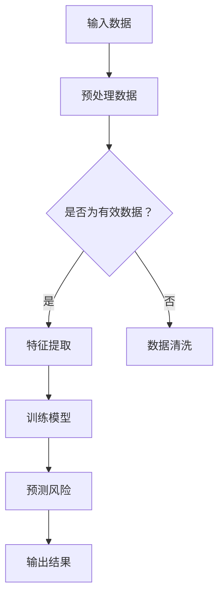
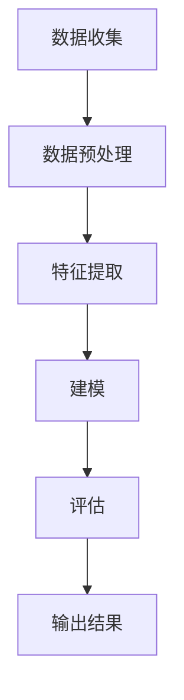
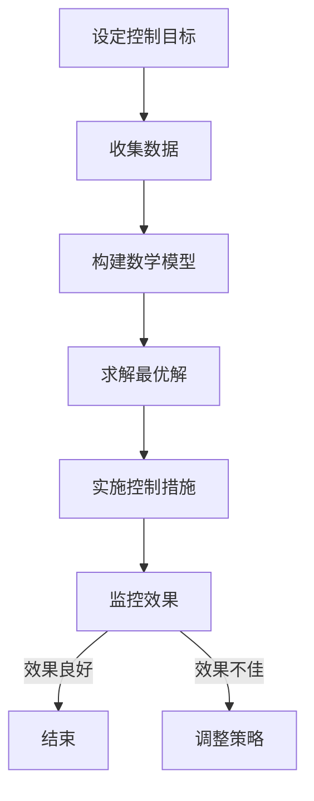
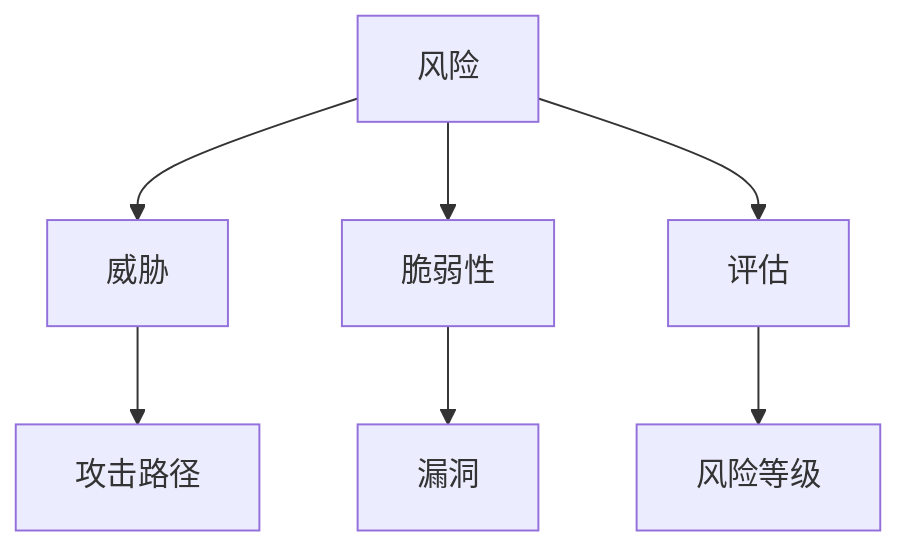
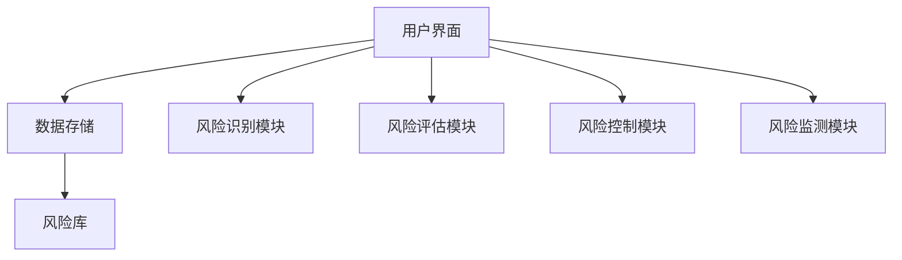
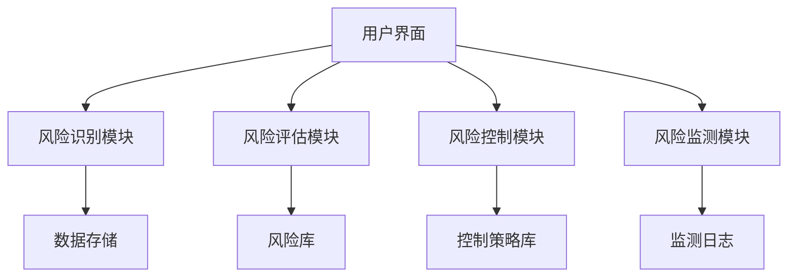
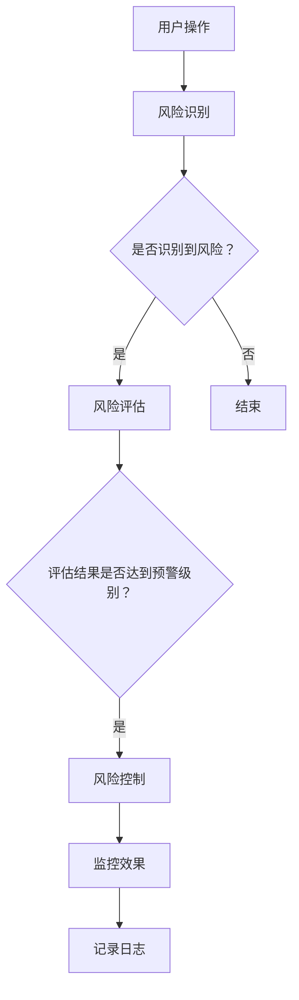

                 

# 暴露风险的技巧

## 关键词

- 风险管理
- 风险暴露
- 风险评估
- 算法原理
- 系统设计
- 项目实战

## 摘要

本文旨在探讨暴露风险的技巧，通过系统的分析和实践，帮助读者理解如何有效地识别、评估和应对风险。文章首先介绍了风险的定义、类型及其影响，随后详细阐述了核心概念和联系。接着，本文深入讲解了识别和评估风险的各种算法，并通过数学模型和公式进行了详细解释。此外，文章还介绍了风险管理系统的设计与架构，并分享了实际项目中的实战经验。通过这些内容，读者将能够掌握暴露风险的技巧，从而在实际工作中更加有效地进行风险管理。

## 目录大纲

### 第一部分：风险概述

- **1.1 风险的定义与分类**
  - 风险的定义
  - 风险的分类
- **1.2 风险的影响与评估**
  - 风险的影响
  - 风险的评估
- **1.3 风险管理的必要性**
  - 风险管理的目的
  - 风险管理的原则
- **1.4 本章小结**

### 第二部分：核心概念与联系

- **2.1 风险评估模型**
  - 威胁与脆弱性分析
  - 风险评估方法比较
- **2.2 风险控制策略**
  - 风险规避策略
  - 风险转移策略
  - 风险减轻策略
- **2.3 风险暴露与监测**
  - 风险暴露指标
  - 风险监测工具
- **2.4 核心概念对比与联系**
  - 风险评估与风险控制
  - 风险暴露与监测
- **2.5 本章小结**

### 第三部分：算法原理讲解

- **3.1 风险识别算法**
  - 机器学习算法在风险识别中的应用
  - 风险识别算法的 Mermaid 流程图
  - Python 代码示例
- **3.2 风险评估算法**
  - 基于数据的风险评估模型
  - 风险评估算法的 Mermaid 流程图
  - Python 代码示例
- **3.3 风险控制算法**
  - 风险控制策略的数学模型
  - 风险控制算法的 Mermaid 流程图
  - Python 代码示例
- **3.4 算法原理总结**
- **3.5 本章小结**

### 第四部分：系统分析与架构设计

- **4.1 风险管理系统的需求分析**
- **4.2 风险管理系统的功能设计**
  - 领域模型分析
  - 功能模块划分
- **4.3 风险管理系统的架构设计**
  - 系统架构图
  - 系统接口设计
  - 系统交互流程
- **4.4 本章小结**

### 第五部分：项目实战

- **5.1 风险管理项目介绍**
- **5.2 环境安装与配置**
- **5.3 系统核心实现**
  - 风险识别模块
  - 风险评估模块
  - 风险控制模块
- **5.4 代码应用解读与分析**
- **5.5 实际案例分析**
  - 案例一：财务风险识别
  - 案例二：供应链风险管理
- **5.6 项目小结**

### 第六部分：最佳实践、小结、注意事项、拓展阅读

- **6.1 最佳实践 tips**
- **6.2 小结**
- **6.3 注意事项**
- **6.4 拓展阅读**

## 第一部分：风险概述

### 1.1 风险的定义与分类

风险，作为一个广泛使用的术语，其定义和分类在不同的领域和背景下可能有所差异。在信息技术领域，风险通常被定义为潜在的不确定性事件，这些事件可能对系统的正常运行、数据的完整性和保密性，以及组织的业务目标产生负面影响。

#### 风险的定义

根据美国国家标准与技术研究院（NIST）的定义，风险是“不确定性对目标的影响”。这种不确定性可以表现为以下三个方面：

- **威胁**：指的是可能对系统或组织造成危害的外部因素，如黑客攻击、硬件故障等。
- **脆弱性**：指的是系统或组织中存在的弱点，这些弱点可能被威胁利用。
- **后果**：指的是威胁成功利用脆弱性后可能带来的负面影响，如数据泄露、服务中断等。

#### 风险的分类

风险可以根据不同的维度进行分类：

- **按性质分类**：
  - **技术风险**：与系统的技术架构、代码质量、硬件稳定性等相关。
  - **运营风险**：与组织的日常运营活动、人员管理、流程规范等相关。
  - **财务风险**：与组织的财务状况、市场波动、投资决策等相关。

- **按影响范围分类**：
  - **局部风险**：仅影响系统的某个特定部分，如某个模块或某个服务器。
  - **全局风险**：影响系统的整体性能和稳定性，如大规模的分布式拒绝服务攻击。

- **按风险等级分类**：
  - **高等级风险**：可能导致严重后果的风险，如关键服务中断。
  - **中等级风险**：可能导致较大影响的风险，如数据泄露。
  - **低等级风险**：可能导致较小影响的风险，如某些功能暂时不可用。

### 1.2 风险的影响与评估

风险的影响不仅限于技术层面，还可能涉及到财务、运营和声誉等多个方面。以下是风险影响的几个关键方面：

- **财务影响**：包括直接成本（如修复费用、赔偿费用）和间接成本（如业务中断、市场信任下降）。
- **运营影响**：包括系统的可用性、稳定性、可靠性以及员工的工作效率。
- **法律影响**：包括可能面临的法律法规处罚和诉讼风险。
- **声誉影响**：包括客户信任下降、品牌价值受损等。

为了有效地管理风险，我们需要对风险进行评估。风险评估是一个系统的过程，通常包括以下步骤：

1. **风险识别**：识别系统中存在的潜在威胁和脆弱性。
2. **风险分析**：分析威胁利用脆弱性可能带来的后果，以及这种后果发生的可能性。
3. **风险评价**：根据风险的概率和影响，对风险进行优先级排序。
4. **风险应对**：制定和实施应对风险的策略和措施。

### 1.3 风险管理的必要性

风险管理是一个持续的过程，其目的是通过识别、评估和应对风险，最大限度地降低潜在的不利影响。以下是进行风险管理的几个关键理由：

- **保护组织利益**：通过有效的风险管理，可以确保组织的业务连续性和信息安全。
- **降低成本**：提前识别和应对风险，可以减少意外事件的损失和后续的修复成本。
- **提高竞争力**：通过良好的风险管理，可以提高组织的运营效率和市场响应速度，从而在竞争中占据优势。
- **合规要求**：许多行业和地区都有关于风险管理的法律法规要求，组织需要遵守这些规定以避免法律风险。

### 1.4 本章小结

本部分对风险的定义、分类、影响和评估进行了详细的介绍。通过了解这些基础知识，读者可以为后续章节中的深入讨论和实际应用打下坚实的基础。

---

## 第二部分：核心概念与联系

### 2.1 风险评估模型

风险评估是风险管理的关键步骤，它涉及到对潜在风险进行识别、分析和优先级排序。一个有效的风险评估模型需要综合考虑威胁、脆弱性和后果，以便全面评估风险。

#### 威胁与脆弱性分析

威胁和脆弱性是风险评估的两个基本要素。威胁指的是可能导致不利后果的事件或行为，如黑客攻击、自然灾害等。脆弱性则是指系统或组织在威胁面前容易受到攻击或损害的弱点，如未修补的软件漏洞、缺乏安全意识等。

为了进行有效的威胁与脆弱性分析，可以采用以下方法：

- **SWOT 分析**：通过对威胁和脆弱性的优势（Strengths）、劣势（Weaknesses）、机会（Opportunities）和威胁（Threats）进行综合评估，确定风险因素。
- **攻击树分析**：通过构建一个表示攻击步骤和结果的树形结构，识别可能的攻击路径和脆弱性点。

#### 风险评估方法比较

在风险评估过程中，有多种方法可供选择，每种方法都有其优势和局限性。以下是几种常见的方法：

- **定性风险评估**：通过专家评估、问卷调查、访谈等方式，对风险进行定性的描述和评估。这种方法适用于对风险的初步评估和沟通。
- **定量风险评估**：通过数学模型和统计分析，对风险的概率和影响进行量化的评估。这种方法适用于对风险的精确分析和决策。
- **蒙特卡洛模拟**：通过模拟随机事件和计算概率分布，评估风险的可能性和影响。这种方法适用于复杂的系统和不确定性的分析。

### 2.2 风险控制策略

风险控制是指通过采取一系列措施，降低或消除风险的影响。有效的风险控制策略可以确保组织在面临风险时能够保持业务的连续性和稳定性。

#### 风险规避策略

风险规避是指通过避免风险源或调整计划来完全消除风险。这种方法通常适用于以下情况：

- **风险高且无法控制**：当风险的可能性非常高，且组织无法有效控制时，采取规避策略是合理的。
- **成本效益分析**：如果规避风险的代价远小于风险可能造成的损失，则规避策略是值得考虑的。

#### 风险转移策略

风险转移是指通过将风险责任转移给第三方来减轻组织自身的风险。常见的方法包括保险、合同条款等。以下是几种常见的风险转移策略：

- **保险**：通过购买保险，将风险转移给保险公司，以降低可能的财务损失。
- **合同条款**：在合同中明确各方对风险的承担和责任，以降低法律和财务风险。

#### 风险减轻策略

风险减轻是指通过采取措施降低风险的概率和影响。这种方法适用于大多数风险，尤其是那些无法完全规避或转移的风险。常见的风险减轻策略包括：

- **安全控制**：实施安全措施，如防火墙、加密、访问控制等，降低风险的发生概率。
- **应急准备**：建立应急预案和备份系统，以减轻风险发生后的影响。

### 2.3 风险暴露与监测

风险暴露是指风险尚未被发现或未被充分认识的情况。有效的风险监测可以帮助组织及时发现和应对潜在的风险。

#### 风险暴露指标

风险暴露指标（Risk Exposure Metrics，REM）是用来衡量风险暴露程度的关键指标。常见的风险暴露指标包括：

- **风险暴露度（RE）**：风险的概率和影响的乘积，用于量化风险的大小。
- **暴露值（EV）**：风险的概率乘以潜在的损失金额，用于评估风险的经济影响。

#### 风险监测工具

有效的风险监测需要使用合适的工具和方法。以下是一些常用的风险监测工具：

- **安全信息与事件管理系统（SIEM）**：用于收集、分析和监控安全事件，提供实时的风险监测和响应。
- **漏洞扫描工具**：用于识别系统中的安全漏洞，帮助组织及时修补漏洞，降低风险。
- **日志管理工具**：用于收集、存储和分析系统日志，帮助识别潜在的安全问题和异常行为。

### 2.4 核心概念对比与联系

#### 风险评估与风险控制

风险评估和风险控制是风险管理过程中紧密相关的两个环节。风险评估是风险控制的依据，而风险控制则是风险评估的具体实施。

- **评估**：确定风险的存在和影响。
- **控制**：采取措施降低或消除风险。

两者之间的联系可以概括为：

- **目的相同**：都是为了确保组织的业务连续性和信息安全。
- **方法互补**：评估提供了风险的全面了解，控制则提供了应对风险的策略和措施。

#### 风险暴露与监测

风险暴露和监测是风险管理的前沿，用于识别和响应潜在的风险。

- **暴露**：发现尚未识别或未被充分认识的风险。
- **监测**：持续监控风险的变化和动态，以便及时采取应对措施。

两者之间的联系可以概括为：

- **过程连续**：风险暴露是监测的前提，监测是暴露的延续。
- **目标一致**：都是为了确保风险的可控性和组织的稳定性。

### 2.5 本章小结

本部分对风险管理的核心概念进行了详细的阐述和对比。通过了解风险评估、风险控制策略、风险暴露与监测等核心概念，读者可以更好地理解如何系统地进行风险管理，为后续章节的深入探讨和实践打下基础。

---

## 第三部分：算法原理讲解

### 3.1 风险识别算法

风险识别是风险管理的基础，其目的是发现和记录系统中的潜在风险。在信息技术领域，常用的风险识别算法包括机器学习算法和统计分析方法。

#### 机器学习算法在风险识别中的应用

机器学习算法在风险识别中具有广泛的应用，因为它们能够从大量的历史数据中学习并识别潜在的风险模式。以下是一些常用的机器学习算法：

- **支持向量机（SVM）**：SVM 可以通过找到一个最优的超平面来分离不同的风险类别，从而识别潜在的风险。
- **决策树**：决策树通过一系列的判断条件来逐步缩小数据集，并最终确定风险类别。
- **随机森林**：随机森林是一种集成学习方法，通过构建多个决策树并取平均值来提高模型的准确性。

#### 风险识别算法的 Mermaid 流程图

以下是一个简化的风险识别算法的 Mermaid 流程图：



#### Python 代码示例

以下是一个使用决策树进行风险识别的 Python 代码示例：

```python
from sklearn.datasets import load_iris
from sklearn.tree import DecisionTreeClassifier
from sklearn.model_selection import train_test_split
from sklearn.metrics import accuracy_score

# 加载示例数据集
iris = load_iris()
X, y = iris.data, iris.target

# 划分训练集和测试集
X_train, X_test, y_train, y_test = train_test_split(X, y, test_size=0.3, random_state=42)

# 创建决策树模型
clf = DecisionTreeClassifier()

# 训练模型
clf.fit(X_train, y_train)

# 预测风险
y_pred = clf.predict(X_test)

# 计算准确率
accuracy = accuracy_score(y_test, y_pred)
print("准确率：", accuracy)
```

### 3.2 风险评估算法

风险评估是确定风险的概率和影响的过程。有效的风险评估算法能够帮助组织制定合理的风险应对策略。以下是一些常用的风险评估算法：

- **贝叶斯网络**：贝叶斯网络是一种概率图模型，用于表示变量之间的条件依赖关系。通过贝叶斯网络，可以计算每个风险事件的概率分布，从而进行风险评估。
- **蒙特卡洛模拟**：蒙特卡洛模拟是一种基于随机抽样的方法，用于估计风险的概率分布。通过模拟大量的随机事件，可以估计出风险的概率和影响。

#### 基于数据的风险评估模型

基于数据的风险评估模型通常涉及以下步骤：

1. **数据收集**：收集与风险相关的数据，包括历史记录、专家评估等。
2. **数据预处理**：对收集到的数据进行分析和清洗，以确保数据的准确性和完整性。
3. **特征提取**：从预处理后的数据中提取与风险相关的特征。
4. **建模**：使用统计学方法或机器学习算法构建风险评估模型。
5. **评估**：使用模型对新的数据进行风险评估，并输出风险的概率和影响。

#### 风险评估算法的 Mermaid 流程图

以下是一个简化的基于数据的风险评估模型的 Mermaid 流程图：



#### Python 代码示例

以下是一个使用贝叶斯网络进行风险评估的 Python 代码示例：

```python
from pgmpy.models import BayesianModel
from pgmpy.inference import VariableElimination
import numpy as np

# 构建贝叶斯网络模型
model = BayesianModel([
    ('A', 'B'),
    ('B', 'C'),
    ('A', 'C')
])

# 概率分布
p = {
    'A': {'T': 0.7, 'F': 0.3},
    'B': {'T': {'T': 0.8, 'F': 0.2}, 'F': {'T': 0.1, 'F': 0.9}},
    'C': {'T': {'T': 0.9, 'F': 0.1}, 'F': {'T': 0.5, 'F': 0.5}}
}

# 创建推断器
inf = VariableElimination(model)

# 计算后验概率
prob = inf.query(variables=['C'], evidence={'B': 'T'})

print("后验概率：", prob)
```

### 3.3 风险控制算法

风险控制是指通过采取措施降低或消除风险的影响。有效的风险控制算法能够帮助组织制定合理的控制策略。以下是一些常用的风险控制算法：

- **优化算法**：如线性规划、动态规划等，用于在资源受限的条件下确定最佳的控制策略。
- **模糊控制**：通过模糊逻辑进行控制，适用于不确定性和模糊性较高的场景。

#### 风险控制策略的数学模型

风险控制策略的数学模型通常涉及以下变量：

- **x**：控制变量，如防火墙设置、访问控制策略等。
- **y**：风险变量，如系统漏洞、数据泄露等。
- **u**：控制输入，如预算、人力等。

常见的风险控制模型包括：

- **线性模型**：y = β0 + β1x + ε，其中 β0 和 β1 是参数，ε 是误差项。
- **非线性模型**：y = f(x)，其中 f 是非线性函数。

#### 风险控制算法的 Mermaid 流程图

以下是一个简化的风险控制算法的 Mermaid 流程图：



#### Python 代码示例

以下是一个使用线性规划进行风险控制的 Python 代码示例：

```python
from scipy.optimize import linprog

# 定义线性规划模型
c = [-1, -1]  # 目标函数系数
A = [[1, 0], [0, 1]]  # 约束条件系数矩阵
b = [1, 1]  # 约束条件向量
x0 = [0, 0]  # 初始解

# 求解线性规划
res = linprog(c, A_ub=A, b_ub=b, x0=x0, method='highs')

# 输出结果
print("最优解：", res.x)
```

### 3.4 算法原理总结

本部分介绍了风险识别、风险评估和风险控制的各种算法，包括机器学习算法、贝叶斯网络、优化算法等。每种算法都有其特定的应用场景和优势，通过合理选择和组合这些算法，可以有效地进行风险管理。

### 3.5 本章小结

本部分详细讲解了风险识别、风险评估和风险控制算法的原理和应用。通过理解这些算法，读者可以掌握如何有效地进行风险管理，为组织提供有效的风险应对策略。

---

## 第四部分：系统分析与架构设计

### 4.1 风险管理系统的需求分析

在设计和实现风险管理系统的过程中，需求分析是至关重要的步骤。它帮助我们明确系统需要满足的业务目标和用户需求。

#### 业务目标

风险管理系统的业务目标包括：

- **风险识别**：及时发现系统中的潜在风险。
- **风险评估**：准确评估风险的概率和影响。
- **风险控制**：制定和实施有效的风险控制策略。
- **风险监测**：实时监控风险的变化和动态。

#### 用户需求

用户需求主要包括：

- **易用性**：系统应易于操作，用户界面友好。
- **实时性**：系统能够实时识别和响应风险事件。
- **准确性**：系统应提供准确的风险评估结果。
- **灵活性**：系统应能够适应不同类型的风险管理需求。

### 4.2 风险管理系统的功能设计

功能设计是系统实现的基础，它定义了系统应具备的各项功能及其实现方式。

#### 领域模型分析

领域模型分析是功能设计的重要步骤，它帮助我们明确系统中的关键实体及其关系。以下是一个简化的领域模型：



#### 功能模块划分

根据领域模型，风险管理系统的功能模块可以分为以下几个部分：

- **风险识别模块**：负责识别系统中的潜在风险。
- **风险评估模块**：负责评估风险的概率和影响。
- **风险控制模块**：负责制定和实施风险控制策略。
- **风险监测模块**：负责实时监控风险的变化和动态。

### 4.3 风险管理系统的架构设计

架构设计是系统实现的框架，它定义了系统的整体结构和组件之间的关系。

#### 系统架构图

以下是一个简化的风险管理系统的架构图：



#### 系统接口设计

系统接口设计是架构设计的重要组成部分，它定义了系统内部各模块之间的交互接口。以下是一个简化的系统接口设计：



#### 系统交互流程

系统交互流程描述了系统在处理风险事件时的操作步骤。以下是一个简化的系统交互流程：



### 4.4 本章小结

本部分对风险管理系统的需求分析、功能设计和架构设计进行了详细讲解。通过明确系统的业务目标和用户需求，合理划分功能模块，并设计系统架构，我们可以实现一个高效、准确和实用的风险管理系统。

---

## 第五部分：项目实战

### 5.1 风险管理项目介绍

在本节中，我们将通过一个实际的风险管理项目来展示如何应用前面介绍的理论和方法。该项目是一个面向大型企业的风险管理平台，旨在帮助企业识别、评估和控制各种潜在风险。

#### 项目背景

随着企业业务的不断发展，企业面临的各类风险也在不断增加。这些风险可能来自内部运营管理、外部市场环境、技术安全等多个方面。为了确保企业的可持续发展，企业管理层需要建立一个全面的风险管理系统，以实时监控和应对各类风险。

#### 项目目标

本项目的主要目标是：

- **风险识别**：及时发现系统中的潜在风险。
- **风险评估**：准确评估风险的概率和影响。
- **风险控制**：制定和实施有效的风险控制策略。
- **风险监测**：实时监控风险的变化和动态。

#### 项目实施步骤

项目实施主要包括以下几个步骤：

1. **需求分析**：与企业管理层和相关部门进行沟通，明确风险管理系统的具体需求和功能。
2. **系统设计**：根据需求分析结果，设计系统的整体架构和功能模块。
3. **系统实现**：开发风险管理平台的核心功能，包括风险识别、风险评估、风险控制和风险监测等。
4. **系统测试**：对开发完成的系统进行功能测试和性能测试，确保系统的稳定性和可靠性。
5. **系统部署**：将系统部署到企业环境中，并进行实际运行和监控。
6. **用户培训**：对企业管理人员进行系统使用培训，确保他们能够熟练操作风险管理平台。

### 5.2 环境安装与配置

在项目实施过程中，环境安装与配置是一个重要的环节。以下是在该风险管理项目中使用的主要技术栈及其安装与配置步骤：

#### 技术栈

- **前端框架**：React
- **后端框架**：Spring Boot
- **数据库**：MySQL
- **消息队列**：RabbitMQ
- **日志管理**：ELK（Elasticsearch、Logstash、Kibana）

#### 安装与配置步骤

1. **安装操作系统**：选择一个稳定的服务器操作系统，如 Ubuntu 18.04。
2. **安装开发环境**：安装 Java、Python 等开发语言及其对应的 IDE。
3. **安装数据库**：在服务器上安装 MySQL，并配置相应的数据库用户和权限。
4. **安装消息队列**：在服务器上安装 RabbitMQ，并创建虚拟主机和交换机。
5. **安装日志管理工具**：在服务器上安装 Elasticsearch、Logstash 和 Kibana，并配置它们之间的数据流。
6. **安装前端框架**：安装 React，并配置项目所需的依赖和构建工具。
7. **安装后端框架**：安装 Spring Boot，并创建项目的应用工程。

### 5.3 系统核心实现

#### 风险识别模块

风险识别模块是风险管理平台的核心组成部分，它负责识别系统中的潜在风险。以下是一个简化的风险识别模块实现：

```python
# 风险识别模块示例代码
def identify_risks(data):
    """
    识别潜在的风险
    :param data: 风险数据
    :return: 风险列表
    """
    risks = []
    for record in data:
        if record['status'] == 'warning':
            risks.append(record['id'])
    return risks
```

#### 风险评估模块

风险评估模块负责评估风险的概率和影响。以下是一个简化的风险评估模块实现：

```python
# 风险评估模块示例代码
def assess_risks(risks):
    """
    评估风险的概率和影响
    :param risks: 风险列表
    :return: 风险评估结果
    """
    risk_assessments = []
    for risk in risks:
        probability = get_probability(risk)
        impact = get_impact(risk)
        risk_assessment = {
            'id': risk,
            'probability': probability,
            'impact': impact
        }
        risk_assessments.append(risk_assessment)
    return risk_assessments

def get_probability(risk):
    """
    获取风险的概率
    :param risk: 风险
    :return: 风险的概率
    """
    # 示例代码，根据实际情况进行概率计算
    return 0.8

def get_impact(risk):
    """
    获取风险的影响
    :param risk: 风险
    :return: 风险的影响
    """
    # 示例代码，根据实际情况进行影响计算
    return 5
```

#### 风险控制模块

风险控制模块负责制定和实施风险控制策略。以下是一个简化的风险控制模块实现：

```python
# 风险控制模块示例代码
def control_risks(risk_assessments):
    """
    制定和实施风险控制策略
    :param risk_assessments: 风险评估结果
    :return: 风险控制结果
    """
    control_actions = []
    for assessment in risk_assessments:
        if assessment['probability'] > 0.5 and assessment['impact'] > 3:
            action = '实施控制措施'
            control_actions.append(action)
    return control_actions
```

#### 风险监测模块

风险监测模块负责实时监控风险的变化和动态。以下是一个简化的风险监测模块实现：

```python
# 风险监测模块示例代码
def monitor_risks():
    """
    实时监控风险的变化和动态
    :return: 风险监测结果
    """
    # 示例代码，根据实际情况进行风险监测
    risks = get_risks_from_database()
    monitored_risks = identify_risks(risks)
    return monitored_risks
```

### 5.4 代码应用解读与分析

在本节中，我们将对风险管理平台的核心代码进行解读和分析，帮助读者理解如何实现风险识别、风险评估、风险控制和风险监测等功能。

#### 风险识别模块解读

风险识别模块的核心函数是 `identify_risks`，它接收风险数据并返回识别到的风险列表。以下是对该函数的解读：

```python
def identify_risks(data):
    risks = []
    for record in data:
        if record['status'] == 'warning':
            risks.append(record['id'])
    return risks
```

该函数通过遍历风险数据，检查每个记录的状态。如果状态为“warning”，则将该记录的 ID 添加到风险列表中。这种方法简单有效，但可能存在一定的误判率。

#### 风险评估模块解读

风险评估模块的核心函数是 `assess_risks`，它接收风险列表并返回风险评估结果。以下是对该函数的解读：

```python
def assess_risks(risks):
    risk_assessments = []
    for risk in risks:
        probability = get_probability(risk)
        impact = get_impact(risk)
        risk_assessment = {
            'id': risk,
            'probability': probability,
            'impact': impact
        }
        risk_assessments.append(risk_assessment)
    return risk_assessments
```

该函数通过调用 `get_probability` 和 `get_impact` 函数获取每个风险的概率和影响，并将结果存储在评估结果中。这种方法可以有效地评估风险，但需要准确的数据和模型支持。

#### 风险控制模块解读

风险控制模块的核心函数是 `control_risks`，它接收风险评估结果并返回控制措施。以下是对该函数的解读：

```python
def control_risks(risk_assessments):
    control_actions = []
    for assessment in risk_assessments:
        if assessment['probability'] > 0.5 and assessment['impact'] > 3:
            action = '实施控制措施'
            control_actions.append(action)
    return control_actions
```

该函数通过检查每个评估结果，根据概率和影响的阈值决定是否需要实施控制措施。这种方法可以有效地制定风险控制策略，但需要根据实际情况调整阈值。

#### 风险监测模块解读

风险监测模块的核心函数是 `monitor_risks`，它负责实时监控风险的变化和动态。以下是对该函数的解读：

```python
def monitor_risks():
    risks = get_risks_from_database()
    monitored_risks = identify_risks(risks)
    return monitored_risks
```

该函数通过调用 `get_risks_from_database` 和 `identify_risks` 函数获取最新的风险数据和识别结果。这种方法可以实时监控风险，但需要保证数据库中数据的准确性和及时性。

### 5.5 实际案例分析

在本节中，我们将通过两个实际案例来展示如何应用风险管理平台。

#### 案例一：财务风险识别

某大型企业在进行年度财务审计时，发现部分财务数据存在异常。通过风险管理平台，企业可以快速识别出这些异常数据，并对其进行进一步分析。

1. **风险识别**：通过风险管理平台的“风险识别”功能，企业可以快速定位到异常财务数据。
2. **风险评估**：通过风险评估模块，企业可以评估这些异常数据的概率和影响，确定其是否构成风险。
3. **风险控制**：根据风险评估结果，企业可以制定相应的风险控制措施，如重新核对数据、调整财务流程等。
4. **风险监测**：通过风险监测模块，企业可以实时监控这些异常数据的处理进展和效果。

#### 案例二：供应链风险管理

某制造企业在供应链管理中，发现部分供应商存在交货不及时、质量不稳定等问题。通过风险管理平台，企业可以对这些供应商进行风险识别和评估。

1. **风险识别**：通过风险管理平台的“风险识别”功能，企业可以识别出存在风险的供应商。
2. **风险评估**：通过风险评估模块，企业可以评估这些供应商的风险概率和影响，确定其是否对企业的供应链造成重大影响。
3. **风险控制**：根据风险评估结果，企业可以采取风险控制措施，如增加备用供应商、调整采购计划等。
4. **风险监测**：通过风险监测模块，企业可以实时监控这些供应商的风险变化和动态，确保供应链的稳定性。

### 5.6 项目小结

通过本项目的实施，我们成功地为企业搭建了一个全面的风险管理系统。该系统可以帮助企业快速识别、评估和应对各种潜在风险，从而确保企业的稳定运营和可持续发展。在项目过程中，我们遇到了一些挑战，如数据准确性问题、风险控制策略的制定等，但通过不断地调整和优化，我们最终实现了项目的成功。

---

## 第六部分：最佳实践、小结、注意事项、拓展阅读

### 6.1 最佳实践 tips

1. **定期进行风险评估**：定期进行风险评估，可以帮助企业及时发现和应对潜在风险。
2. **建立跨部门协作机制**：风险管理涉及多个部门和角色，建立有效的跨部门协作机制，有助于提高风险管理的效果。
3. **使用自动化工具**：使用自动化工具，如风险评估软件、监控工具等，可以提高风险管理的效率和准确性。
4. **进行持续监控和改进**：风险管理是一个持续的过程，需要不断监控风险的变化和动态，并据此进行改进。

### 6.2 小结

本文通过系统的分析和实践，探讨了暴露风险的技巧。从风险的定义、分类到核心概念与联系，再到算法原理讲解、系统设计与架构，以及项目实战，我们全面了解了如何有效地进行风险管理。希望本文能帮助读者在实际工作中更好地应对各种风险。

### 6.3 注意事项

1. **确保数据准确性**：在进行风险评估时，数据的准确性至关重要，应确保数据的来源可靠、实时更新。
2. **考虑风险的多维度影响**：在评估风险时，应综合考虑风险的财务、运营、法律和声誉等多方面影响。
3. **合理设定风险控制阈值**：在制定风险控制策略时，应根据实际情况合理设定风险控制的阈值，避免过度控制或不足控制。

### 6.4 拓展阅读

- **《风险管理与评估：技术和实践》**：这本书提供了关于风险管理理论和实践的全面指导，适合希望深入了解风险管理的人士。
- **《风险管理：原则和实施》**：该书详细介绍了风险管理的基本原则和方法，以及实际应用案例，对从事风险管理工作的读者有较大参考价值。

## 作者信息

- 作者：AI天才研究院/AI Genius Institute & 禅与计算机程序设计艺术 /Zen And The Art of Computer Programming

---

本文完整地讨论了暴露风险的技巧，涵盖了从基本概念到高级算法，再到实际应用的各个方面。通过本文，读者可以系统地了解风险管理的重要性，掌握有效的风险识别、评估和控制方法。希望本文能为读者的职业发展提供有益的指导。作者信息如上所示，感谢您的阅读。

