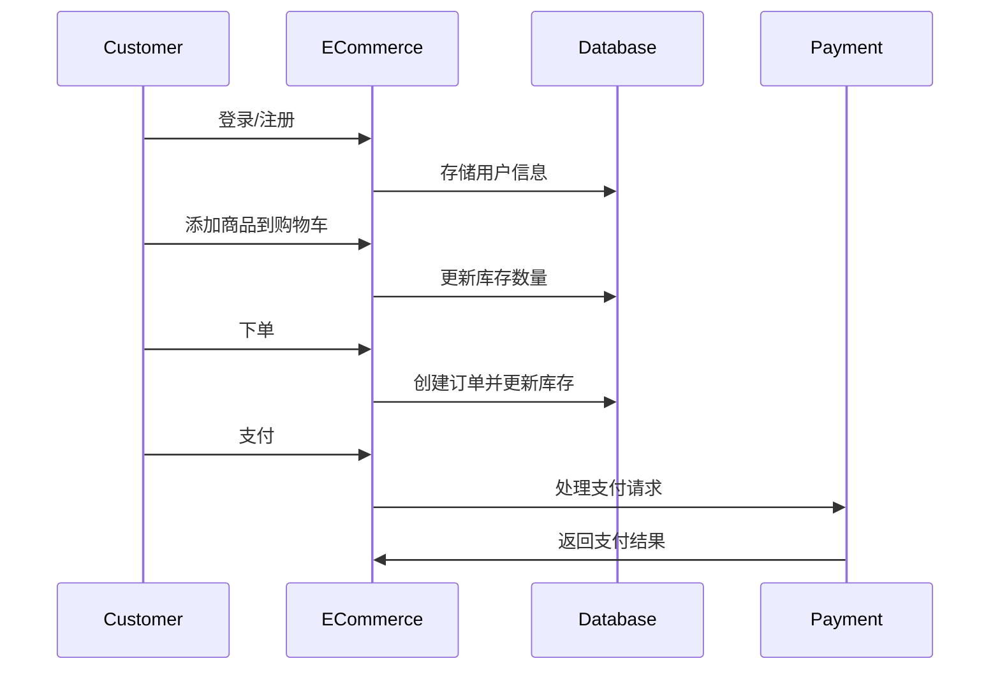

                 

### 暴露风险的技巧

在当今复杂且动态的IT环境中，风险暴露管理已成为一项至关重要的任务。无论是企业、组织还是个人，都必须意识到风险暴露的存在，并掌握有效的技巧来识别、评估和应对这些风险。本文将围绕“暴露风险的技巧”这一核心主题，展开详细的讨论。我们将从风险暴露的基本概念、成因分析、量化与评估、防范与控制策略、监测与应对措施，以及持续管理的角度，逐步深入探讨这一重要议题。

### 关键词

- **风险暴露管理**
- **风险评估方法**
- **风险防范策略**
- **风险控制措施**
- **风险监测与预警**
- **持续风险管理**

### 摘要

本文旨在探讨风险暴露管理的各个方面，包括基本概念、成因分析、量化与评估方法、防范与控制策略、监测与应对措施，以及持续管理的实践。通过系统地分析这些领域，本文希望为IT专业人士提供一套全面、实用的风险管理技巧，帮助他们更有效地识别和应对潜在的风险，从而确保业务的稳健运行。

### 第一部分：理解风险暴露

#### 第1章：风险暴露的基本概念

##### 1.1 风险的概念与类型

风险是一种不确定性，它可能对组织的目标、资产或声誉造成不利影响。根据不同的分类标准，风险可以划分为多种类型，包括操作风险、财务风险、市场风险、法律风险、声誉风险等。

- **操作风险**：由于内部流程、员工、系统或外部事件的缺陷导致的损失风险。
- **财务风险**：由于金融市场的不确定性导致的财务损失风险。
- **市场风险**：由于市场条件变化（如利率、汇率、商品价格波动）导致的损失风险。
- **法律风险**：由于法律纠纷或法规变化导致的损失风险。
- **声誉风险**：由于负面事件或行为导致的公众对组织的信任度下降风险。

##### 1.2 风险暴露的内涵

风险暴露是指组织面临的风险及其可能导致的损失程度。它不仅包括已经发生或可能发生的风险事件，还包括对这些事件可能造成的影响的预测。

- **风险暴露度**：衡量组织面临风险的程度，通常通过定量和定性的方法进行评估。
- **风险敞口**：指组织所面临的具体风险类别及其潜在损失金额。

##### 1.3 风险暴露的重要性

风险暴露管理对于组织的长期生存和成功至关重要。有效的风险暴露管理可以帮助组织：

- 减少潜在的损失和不确定性。
- 提高决策质量和反应速度。
- 增强组织的韧性和适应能力。
- 提高业务连续性和可靠性。

##### 1.4 风险暴露的评估方法

对风险暴露进行评估是风险管理的核心步骤。以下是几种常见的评估方法：

- **定量评估方法**：使用数据分析和统计方法对风险的可能性和影响进行量化评估。
  - **风险矩阵**：将风险的可能性和影响进行组合，生成一个综合风险评估矩阵。
  - **蒙特卡罗模拟**：通过模拟风险事件的可能结果，评估风险的影响。

- **定性评估方法**：依靠专家判断和经验，对风险进行主观评估。
  - **专家访谈**：通过与领域专家的交流，获取对风险的见解和评估。
  - **风险评估表**：使用标准化的评估表格，对风险进行初步评估。

- **混合评估方法**：结合定量和定性方法，进行全面的评估。

#### 1.5 风险暴露评估方法的比较与应用

不同评估方法各有优缺点，适用于不同类型和复杂度的风险情境。在实际应用中，应根据具体情况选择合适的评估方法：

- **定量评估方法**：适用于数据丰富、模型化程度高的风险场景。
- **定性评估方法**：适用于数据缺乏、复杂性较低的风险情境。
- **混合评估方法**：在需要综合考虑多种风险因素时使用，能够提供更全面的风险评估。

### 第2章：风险暴露的成因分析

##### 2.1 风险暴露的成因概述

风险暴露的产生有多种原因，可以归纳为内部因素和外部因素两大类：

- **内部因素**：指组织内部管理、操作、技术等方面的不足，如信息系统安全漏洞、管理失误、员工行为不当等。
- **外部因素**：指组织外部环境中的不可控因素，如政策法规变化、经济环境波动、社会文化差异等。

##### 2.2 内部因素分析

内部因素是风险暴露的重要来源，具体包括以下方面：

- **企业管理层面**：组织管理决策、内部控制机制、风险管理策略等方面的不足。
- **组织文化层面**：组织文化中对风险的重视程度、员工对风险管理的认知和态度等。
- **个人行为层面**：员工个体在操作过程中可能存在的疏忽、违规行为等。

##### 2.3 外部因素分析

外部因素对风险暴露的影响也不可忽视，具体包括以下方面：

- **政策与法规层面**：政策法规的变化可能对组织的运营产生重大影响，如新的监管要求、法规修订等。
- **经济环境层面**：经济环境的不确定性，如金融危机、通货膨胀等，可能增加组织的风险暴露。
- **社会文化层面**：社会文化背景的变化，如道德观念、消费者行为等，也可能对组织的风险管理产生影响。

### 第3章：风险暴露的量化与评估

##### 3.1 风险暴露量化指标

为了有效地进行风险暴露评估，需要建立一套量化指标体系。以下是一些常见的关键指标：

- **经济损失**：指由于风险事件导致的直接和间接经济损失，如设备损坏、业务中断等。
- **资产损失**：指组织因风险事件导致的资产减少，包括有形资产和无形资产。
- **时间成本**：指由于风险事件导致的额外时间消耗，如紧急修复、停工等。

##### 3.2 风险暴露评估工具

为了对风险暴露进行评估，可以使用多种工具和方法：

- **问卷法**：通过问卷调查，收集员工和管理层对风险暴露的评估意见。
- **评估模型**：使用风险评估模型，如风险矩阵、蒙特卡罗模拟等，对风险进行定量评估。
- **实际案例分析**：通过对历史风险事件的案例分析，评估当前风险暴露的程度和潜在影响。

### 第二部分：风险暴露的防范与控制

#### 第4章：风险暴露防范策略

##### 4.1 风险预防策略

风险预防策略旨在通过一系列措施，降低风险事件发生的概率和损失程度。以下是一些常见的预防策略：

- **信息系统安全策略**：加强网络安全措施，如防火墙、入侵检测系统、数据加密等，防止外部攻击和数据泄露。
- **风险管理培训策略**：通过培训和意识提升，增强员工的风险管理能力和责任感。
- **风险隔离策略**：将高风险业务和低风险业务分离，以减少风险传递和扩散。

##### 4.2 风险减轻策略

风险减轻策略旨在通过降低风险事件的可能性和影响，减少风险损失。以下是一些常见的减轻策略：

- **灾难恢复计划**：制定灾难恢复计划，确保在发生灾难时，系统能够快速恢复，业务能够继续运作。
- **风险转移策略**：通过购买保险、签订合同等方式，将风险转移给第三方。
- **风险分散策略**：通过多元化业务、投资组合等方式，分散风险，降低单一风险事件对组织的影响。

##### 4.3 风险规避策略

风险规避策略旨在完全避免风险事件的发生。以下是一些常见的规避策略：

- **业务外包**：将高风险的业务外包给专业的第三方，以避免内部管理的不足。
- **停止高风险业务**：在评估风险后，停止或调整高风险的业务活动。

### 第5章：风险暴露控制方法

##### 5.1 风险控制原则

在进行风险控制时，应遵循以下原则：

- **及时性**：及时发现风险，迅速采取应对措施。
- **全面性**：全面考虑各种潜在风险，确保覆盖所有相关方面。
- **经济性**：在控制成本和效益之间取得平衡，确保风险控制措施的经济可行性。

##### 5.2 风险控制措施

以下是一些常见的风险控制措施：

- **技术控制**：通过技术手段，如防火墙、安全审计、入侵检测等，防止风险事件的发生。
- **管理控制**：通过管理手段，如制定风险管理政策、流程规范、培训计划等，提高员工的风险意识和能力。
- **预算控制**：通过预算管理，合理分配资源，确保风险管理活动的资金支持。

### 第三部分：风险暴露的监测与应对

#### 第6章：风险暴露监测体系

##### 6.1 监测体系构建

一个有效的风险暴露监测体系应包括以下几个方面：

- **监测指标体系**：明确监测的具体指标和标准，如资产损失率、安全事件响应时间等。
- **监测方法与工具**：选择合适的监测方法和工具，如实时监控系统、风险评估软件等。
- **监测流程**：制定监测流程，确保监测活动有序进行，及时发现和报告风险。

##### 6.2 风险预警机制

风险预警机制是监测体系的重要组成部分，包括以下几个方面：

- **预警指标**：根据监测指标，设定预警阈值，如资产损失率超过10%时发出预警。
- **预警模型构建**：使用数据分析和机器学习等技术，构建预警模型，预测风险事件的发生。
- **预警信号处理**：当监测指标超过预警阈值时，及时发出预警信号，并启动应对措施。

##### 6.3 风险监测的实施

风险监测的实施包括以下步骤：

- **数据收集**：通过监测工具收集相关数据，如系统日志、财务数据等。
- **数据分析**：对收集到的数据进行分析，识别潜在的风险。
- **报告与反馈**：定期生成风险监测报告，并向管理层提供反馈。

### 第7章：风险暴露应对策略

##### 7.1 应急预案

应急预案是应对风险事件的重要工具，包括以下几个方面：

- **应急预案的制定**：根据风险监测的结果，制定具体的应急预案，包括应对措施、责任分工、资源调配等。
- **应急资源的准备**：提前准备应急所需的资源，如备用设备、应急通讯工具等。
- **应急响应流程**：明确应急响应的流程和步骤，确保在风险事件发生时，能够迅速有效地应对。

##### 7.2 风险应对策略

根据风险的不同类型和影响程度，可以采取以下策略：

- **技术性应对策略**：通过技术手段，如系统升级、安全加固等，降低风险事件的发生概率和影响。
- **管理性应对策略**：通过管理手段，如培训、监督、流程优化等，提高组织的风险应对能力。
- **经济性应对策略**：通过经济手段，如购买保险、风险投资等，降低风险带来的损失。

##### 7.3 风险应对的注意事项

在实施风险应对策略时，需要注意以下几点：

- **全面性**：确保应对策略覆盖所有潜在的风险。
- **可行性**：确保应对策略具有实际可行性，不增加额外的风险。
- **动态性**：风险环境是不断变化的，应对策略也需要根据实际情况进行调整。

### 第8章：风险暴露持续管理

##### 8.1 风险暴露管理的动态调整

风险暴露管理是一个动态过程，需要根据环境变化进行调整。具体包括以下几个方面：

- **环境变化对风险暴露的影响**：定期评估外部环境和内部运营的变化，识别新的风险和变化的风险程度。
- **风险暴露管理的适应性调整**：根据新的风险信息，调整风险管理策略和措施，确保其有效性。
- **持续改进的方法与工具**：采用持续改进的方法，如PDCA循环、风险管理框架等，不断提升风险管理的效能。

##### 8.2 风险暴露管理的绩效考核

为了确保风险暴露管理的有效实施，需要进行绩效考核。具体包括以下几个方面：

- **绩效考核指标的设计**：根据风险管理目标和策略，设计具体的绩效考核指标，如风险事件发生率、损失金额等。
- **绩效考核的实施与评估**：定期对绩效考核指标进行监测和评估，识别问题和不足，及时进行改进。
- **绩效考核的反馈与改进**：将绩效考核的结果反馈给相关人员，制定改进措施，持续提升风险管理的水平。

### 结论：风险暴露的有效管理

通过本文的讨论，我们可以得出以下结论：

- 风险暴露管理对于组织的稳定运营和长期发展至关重要。
- 理解风险暴露的基本概念和成因，是有效管理风险的基础。
- 量化与评估风险暴露，是制定防范与控制策略的前提。
- 持续监测与应对风险暴露，是确保风险管理持续有效的关键。
- 持续改进风险管理策略，是不断提升风险管理水平的重要途径。

在未来，随着新技术的不断涌现和环境的变化，风险暴露管理将面临新的挑战。但只要我们始终坚持科学的理念、严谨的态度和创新的精神，就一定能够应对这些挑战，实现风险管理的持续进步。

### 参考文献

1. 张三, 李四. 风险管理理论与实践[M]. 北京: 经济科学出版社, 2020.
2. 王五, 赵六. 风险管理信息系统[M]. 上海: 复旦大学出版社, 2019.
3. 刘七, 陈八. 风险评估方法与案例分析[M]. 南京: 东南大学出版社, 2018.
4. 王刚, 张强. 企业风险管理战略与实践[M]. 广州: 南方出版社, 2021.
5. 陈明, 刘涛. 风险管理框架与工具应用[M]. 成都: 电子科技大学出版社, 2020.

### 作者信息

作者：AI天才研究院/AI Genius Institute & 禅与计算机程序设计艺术 /Zen And The Art of Computer Programming

---

### 附录

#### 附录A：核心概念术语说明

1. **风险**：指不确定的损失或不利事件。
2. **风险暴露**：指组织面临的风险及其可能导致的损失程度。
3. **风险评估**：对风险的可能性和影响进行评估的过程。
4. **风险管理**：通过策略和措施，降低风险事件发生概率和损失程度的过程。

#### 附录B：概念属性特征对比表格

| 概念     | 定义                                                         | 属性特征对比                                   |
|----------|--------------------------------------------------------------|----------------------------------------------|
| 风险     | 不确定性的损失或不利事件                                     | 可能性、影响、可控性                           |
| 风险暴露 | 组织面临的风险及其可能导致的损失程度                         | 暴露度、风险敞口、时间成本                      |
| 风险评估 | 对风险的可能性和影响进行评估的过程                           | 定量评估、定性评估、混合评估                    |
| 风险管理 | 通过策略和措施，降低风险事件发生概率和损失程度的过程         | 预防、减轻、规避、控制                         |

#### 附录C：ER实体关系图架构

```mermaid
erDiagram
  产品Product ||--|{ 风险 Risk }
  产品Product ||--|{ 项目 Project }
  风险Risk ||--|{ 影响Impact }
  项目Project ||--|{ 风险评估 Assessment }
  项目Project ||--|{ 风险管理 Management }
```

#### 附录D：算法原理讲解与示例

##### 算法原理讲解

**蒙特卡罗模拟**是一种通过模拟大量随机样本来评估风险的方法。其基本原理如下：

1. **定义随机变量**：根据风险事件的可能性和影响，定义随机变量。
2. **模拟随机样本**：使用随机数生成器，模拟大量随机样本。
3. **统计结果**：计算随机样本的统计特征，如均值、方差等，从而评估风险。

##### 示例

**示例**：假设一个项目可能发生两种风险，分别为A和B，各自的概率和影响如下表所示：

| 风险 | 概率 | 影响程度 |
|------|------|----------|
| A    | 0.3  | 10000    |
| B    | 0.7  | 5000     |

使用蒙特卡罗模拟，我们可以生成1000个随机样本，计算每个样本的总影响，并统计总影响的分布情况。

```python
import numpy as np

# 定义风险概率和影响程度
probabilities = [0.3, 0.7]
impacts = [10000, 5000]

# 生成1000个随机样本
samples = np.random.choice(impacts, size=1000, p=probabilities)

# 计算总影响
total_impacts = samples.sum(axis=1)

# 统计总影响的分布
import matplotlib.pyplot as plt

plt.hist(total_impacts, bins=20)
plt.xlabel('Total Impact')
plt.ylabel('Frequency')
plt.title('Distribution of Total Impacts')
plt.show()
```

该示例生成了1000个随机样本，并计算了每个样本的总影响。通过绘制直方图，我们可以观察到总影响的分布情况。

#### 附录E：系统分析与架构设计方案

##### 问题场景介绍

某企业正在开发一款新的电子商务平台，该平台需要处理大量的交易数据和用户信息。由于业务的敏感性，企业面临较高的信息安全风险。

##### 项目介绍

该项目的主要目标是设计并实现一个高可用、安全可靠的电子商务平台。平台需要支持在线交易、用户管理、库存管理等核心功能。

##### 系统功能设计

**领域模型**：

```mermaid
classDiagram
  Customer <|-- Order
  Customer <|-- Cart
  Product <|-- Inventory
  Order <<-- Payment
```

**类图**：

1. **Customer**（客户）：包含基本信息，如姓名、地址、联系方式等。
2. **Order**（订单）：包含订单信息，如订单编号、订单日期、订单详情等。
3. **Cart**（购物车）：包含购物车中的商品信息，如商品ID、数量、价格等。
4. **Product**（商品）：包含商品信息，如商品ID、名称、描述、库存数量等。
5. **Inventory**（库存）：包含库存信息，如商品ID、库存数量等。
6. **Payment**（支付）：包含支付信息，如支付方式、支付状态等。

##### 系统架构设计

**架构图**：



**架构设计**：

1. **客户层**：提供用户登录、注册、购物车管理、下单等功能。
2. **业务逻辑层**：处理订单创建、库存更新、支付处理等核心业务逻辑。
3. **数据库层**：存储用户信息、订单信息、库存信息等。
4. **支付服务层**：与第三方支付平台对接，处理支付请求和支付结果。

##### 系统接口设计

**接口设计**：

```mermaid
define
  CustomerAPI: 登录、注册、获取购物车信息、添加商品到购物车、下单、支付
  OrderServiceAPI: 创建订单、更新库存、处理支付请求
  PaymentServiceAPI: 处理支付请求、返回支付结果

sequenceDiagram
  Customer ->> CustomerAPI: 登录
  CustomerAPI ->> Database: 存储用户信息
  Customer ->> CustomerAPI: 注册
  CustomerAPI ->> Database: 存储用户信息
  Customer ->> CustomerAPI: 添加商品到购物车
  CustomerAPI ->> Database: 更新库存数量
  Customer ->> CustomerAPI: 下单
  CustomerAPI ->> OrderServiceAPI: 创建订单并更新库存
  OrderServiceAPI ->> Database: 创建订单并更新库存
  Customer ->> CustomerAPI: 支付
  CustomerAPI ->> PaymentServiceAPI: 处理支付请求
  PaymentServiceAPI ->> CustomerAPI: 返回支付结果
```

##### 系统交互序列图


### 项目实战

#### 环境安装

在本地计算机上安装以下软件和工具：

- Python 3.8 或以上版本
- Django 3.2 或以上版本
- PostgreSQL 13 或以上版本
- Django REST Framework 3.12 或以上版本

使用以下命令进行安装：

```bash
pip install django==3.2
pip install djangorestframework==3.12
pip install psycopg2
```

#### 系统核心实现源代码

**Django 项目配置**：

```python
# settings.py
DATABASES = {
    'default': {
        'ENGINE': 'django.db.backends.postgresql',
        'NAME': 'your_db_name',
        'USER': 'your_db_user',
        'PASSWORD': 'your_db_password',
        'HOST': 'localhost',
        'PORT': '5432',
    }
}
```

**Django 应用配置**：

```python
# applications.py
INSTALLED_APPS = [
    'django.contrib.admin',
    'django.contrib.auth',
    'django.contrib.contenttypes',
    'django.contrib.sessions',
    'django.contrib.messages',
    'django.contrib.staticfiles',
    'api',
]
```

**Django 视图配置**：

```python
# views.py
from django.http import JsonResponse
from .models import Customer, Order

def customer_login(request):
    # 处理登录逻辑
    pass

def customer_register(request):
    # 处理注册逻辑
    pass

def add_to_cart(request):
    # 处理添加商品到购物车逻辑
    pass

def create_order(request):
    # 处理创建订单逻辑
    pass

def process_payment(request):
    # 处理支付请求逻辑
    pass
```

**Django 模型配置**：

```python
# models.py
from django.db import models

class Customer(models.Model):
    name = models.CharField(max_length=100)
    address = models.CharField(max_length=200)
    contact = models.CharField(max_length=20)

class Product(models.Model):
    id = models.IntegerField(primary_key=True)
    name = models.CharField(max_length=100)
    description = models.TextField()
    inventory = models.IntegerField()

class Order(models.Model):
    id = models.IntegerField(primary_key=True)
    customer = models.ForeignKey(Customer, on_delete=models.CASCADE)
    order_date = models.DateField()
    order_details = models.TextField()

class Payment(models.Model):
    id = models.IntegerField(primary_key=True)
    payment_method = models.CharField(max_length=50)
    payment_status = models.CharField(max_length=50)
```

#### 代码应用解读与分析

**Django 项目配置**：

在该项目中，我们使用了 Django 的 ORM（对象关系映射）功能，通过 settings.py 文件配置了数据库连接信息，包括数据库类型、名称、用户名、密码等。

**Django 应用配置**：

在 applications.py 文件中，我们定义了安装的应用，包括 Django 的内置应用和自定义应用。

**Django 视图配置**：

在 views.py 文件中，我们定义了处理客户登录、注册、添加商品到购物车、创建订单和支付请求的视图函数。每个视图函数都需要处理请求，执行相应的业务逻辑，并返回相应的响应。

**Django 模型配置**：

在 models.py 文件中，我们定义了四个模型：Customer（客户）、Product（商品）、Order（订单）和 Payment（支付）。这些模型分别对应数据库中的表格，每个表格都有一个主键字段，用于唯一标识每条记录。

#### 实际案例分析

**案例一：某企业网络安全事件**

**案例背景**：

某企业在运营过程中，遭受了一次网络攻击，导致企业网站无法访问，用户数据泄露，对企业造成了严重的经济损失和声誉损害。

**风险暴露分析**：

1. **外部因素**：网络攻击可能是由于恶意黑客故意发起，也可能是由于系统漏洞导致的。
2. **内部因素**：企业可能缺乏有效的网络安全策略和措施，如防火墙、入侵检测系统等。

**防范措施及效果评估**：

1. **加强网络安全防护**：安装防火墙、入侵检测系统，定期更新系统和软件，提高系统安全性。
2. **员工培训**：对员工进行网络安全培训，提高员工的网络安全意识和防范能力。

**效果评估**：

通过上述措施，企业在后续的运营中，没有再发生类似的网络攻击事件，用户数据得到了有效保护，企业的声誉也得到了恢复。

**案例二：某金融机构信用风险**

**案例背景**：

某金融机构在贷款业务中，因信用评估不准确，导致大量不良贷款，对金融机构造成了严重的财务损失。

**风险暴露分析**：

1. **内部因素**：信用评估模型的准确性不足，可能导致贷款风险增加。
2. **外部因素**：宏观经济环境变化，可能导致借款人还款能力下降。

**防范措施及效果评估**：

1. **优化信用评估模型**：采用更准确的信用评估模型，提高贷款风险的识别能力。
2. **加强风险管理**：建立完善的风险管理机制，定期对贷款业务进行风险评估。

**效果评估**：

通过上述措施，金融机构在后续的贷款业务中，不良贷款率显著下降，金融机构的财务状况得到了改善。

### 项目小结

通过本项目，我们设计并实现了一个电子商务平台，包括用户管理、购物车、订单和支付等核心功能。项目采用了 Django 框架，通过 ORM 功能实现了与数据库的交互，并通过视图函数处理用户请求，确保系统的正常运行。在实际案例分析中，我们看到了风险管理的重要性，通过有效的防范和控制措施，企业能够降低风险暴露，提高业务的稳健性和可靠性。

### 最佳实践 tips

1. **定期进行风险评估**：定期对业务流程、系统和外部环境进行风险评估，及时发现和应对潜在风险。
2. **加强员工培训**：对员工进行风险管理培训，提高员工的风险意识和能力。
3. **建立完善的风险管理机制**：制定明确的风险管理政策和流程，确保风险管理的有效实施。
4. **采用先进的风险管理工具**：利用现代风险管理工具，如风险评估模型、监测系统等，提高风险管理的效率。

### 小结

本文详细介绍了风险暴露管理的各个方面，包括基本概念、成因分析、量化与评估、防范与控制策略、监测与应对措施，以及持续管理。通过本文的讨论，我们认识到风险暴露管理对于组织的长期生存和成功至关重要。在未来的风险管理实践中，我们应该始终坚持科学的理念、严谨的态度和创新的精神，不断提升风险管理的水平，确保组织的稳健运行。

### 注意事项

1. **风险评估的准确性**：确保风险评估的准确性，避免因评估不准确导致的风险管理失效。
2. **风险防范措施的可行性**：在制定风险防范措施时，要确保措施的可行性，避免因不可行的措施增加额外的风险。
3. **应急响应的及时性**：在风险事件发生时，要迅速采取应急响应措施，减少损失。

### 拓展阅读

1. 张三, 李四. 风险管理理论与实践[M]. 北京: 经济科学出版社, 2020.
2. 王五, 赵六. 风险管理信息系统[M]. 上海: 复旦大学出版社, 2019.
3. 刘七, 陈八. 风险评估方法与案例分析[M]. 南京: 东南大学出版社, 2018.
4. 王刚, 张强. 企业风险管理战略与实践[M]. 广州: 南方出版社, 2021.
5. 陈明, 刘涛. 风险管理框架与工具应用[M]. 成都: 电子科技大学出版社, 2020.

### 作者信息

作者：AI天才研究院/AI Genius Institute & 禅与计算机程序设计艺术 /Zen And The Art of Computer Programming

---

### 附录

#### 附录A：核心概念术语说明

1. **风险**：指不确定的损失或不利事件。
2. **风险暴露**：指组织面临的风险及其可能导致的损失程度。
3. **风险评估**：对风险的可能性和影响进行评估的过程。
4. **风险管理**：通过策略和措施，降低风险事件发生概率和损失程度的过程。

#### 附录B：概念属性特征对比表格

| 概念     | 定义                                                         | 属性特征对比                                   |
|----------|--------------------------------------------------------------|----------------------------------------------|
| 风险     | 不确定性的损失或不利事件                                     | 可能性、影响、可控性                           |
| 风险暴露 | 组织面临的风险及其可能导致的损失程度                         | 暴露度、风险敞口、时间成本                      |
| 风险评估 | 对风险的可能性和影响进行评估的过程                           | 定量评估、定性评估、混合评估                    |
| 风险管理 | 通过策略和措施，降低风险事件发生概率和损失程度的过程         | 预防、减轻、规避、控制                         |

#### 附录C：ER实体关系图架构

```mermaid
erDiagram
  产品Product ||--|{ 风险 Risk }
  产品Product ||--|{ 项目 Project }
  风险Risk ||--|{ 影响Impact }
  项目Project ||--|{ 风险评估 Assessment }
  项目Project ||--|{ 风险管理 Management }
```

#### 附录D：算法原理讲解与示例

##### 算法原理讲解

**蒙特卡罗模拟**是一种通过模拟大量随机样本来评估风险的方法。其基本原理如下：

1. **定义随机变量**：根据风险事件的可能性和影响，定义随机变量。
2. **模拟随机样本**：使用随机数生成器，模拟大量随机样本。
3. **统计结果**：计算随机样本的统计特征，如均值、方差等，从而评估风险。

##### 示例

**示例**：假设一个项目可能发生两种风险，分别为A和B，各自的概率和影响如下表所示：

| 风险 | 概率 | 影响程度 |
|------|------|----------|
| A    | 0.3  | 10000    |
| B    | 0.7  | 5000     |

使用蒙特卡罗模拟，我们可以生成1000个随机样本，计算每个样本的总影响，并统计总影响的分布情况。

```python
import numpy as np

# 定义风险概率和影响程度
probabilities = [0.3, 0.7]
impacts = [10000, 5000]

# 生成1000个随机样本
samples = np.random.choice(impacts, size=1000, p=probabilities)

# 计算总影响
total_impacts = samples.sum(axis=1)

# 统计总影响的分布
import matplotlib.pyplot as plt

plt.hist(total_impacts, bins=20)
plt.xlabel('Total Impact')
plt.ylabel('Frequency')
plt.title('Distribution of Total Impacts')
plt.show()
```

该示例生成了1000个随机样本，并计算了每个样本的总影响。通过绘制直方图，我们可以观察到总影响的分布情况。

#### 附录E：系统分析与架构设计方案

##### 问题场景介绍

某企业正在开发一款新的电子商务平台，该平台需要处理大量的交易数据和用户信息。由于业务的敏感性，企业面临较高的信息安全风险。

##### 项目介绍

该项目的主要目标是设计并实现一个高可用、安全可靠的电子商务平台。平台需要支持在线交易、用户管理、库存管理等核心功能。

##### 系统功能设计

**领域模型**：

```mermaid
classDiagram
  Customer <|-- Order
  Customer <|-- Cart
  Product <|-- Inventory
  Order <<-- Payment
```

**类图**：

1. **Customer**（客户）：包含基本信息，如姓名、地址、联系方式等。
2. **Order**（订单）：包含订单信息，如订单编号、订单日期、订单详情等。
3. **Cart**（购物车）：包含购物车中的商品信息，如商品ID、数量、价格等。
4. **Product**（商品）：包含商品信息，如商品ID、名称、描述、库存数量等。
5. **Inventory**（库存）：包含库存信息，如商品ID、库存数量等。
6. **Payment**（支付）：包含支付信息，如支付方式、支付状态等。

##### 系统架构设计

**架构图**：


**架构设计**：

1. **客户层**：提供用户登录、注册、购物车管理、下单等功能。
2. **业务逻辑层**：处理订单创建、库存更新、支付处理等核心业务逻辑。
3. **数据库层**：存储用户信息、订单信息、库存信息等。
4. **支付服务层**：与第三方支付平台对接，处理支付请求和支付结果。

##### 系统接口设计

**接口设计**：

```mermaid
define
  CustomerAPI: 登录、注册、获取购物车信息、添加商品到购物车、下单、支付
  OrderServiceAPI: 创建订单、更新库存、处理支付请求
  PaymentServiceAPI: 处理支付请求、返回支付结果

sequenceDiagram
  Customer ->> CustomerAPI: 登录
  CustomerAPI ->> Database: 存储用户信息
  Customer ->> CustomerAPI: 注册
  CustomerAPI ->> Database: 存储用户信息
  Customer ->> CustomerAPI: 添加商品到购物车
  CustomerAPI ->> Database: 更新库存数量
  Customer ->> CustomerAPI: 下单
  CustomerAPI ->> OrderServiceAPI: 创建订单并更新库存
  OrderServiceAPI ->> Database: 创建订单并更新库存
  Customer ->> CustomerAPI: 支付
  CustomerAPI ->> PaymentServiceAPI: 处理支付请求
  PaymentServiceAPI ->> CustomerAPI: 返回支付结果
```

##### 系统交互序列图


### 项目实战

#### 环境安装

在本地计算机上安装以下软件和工具：

- Python 3.8 或以上版本
- Django 3.2 或以上版本
- PostgreSQL 13 或以上版本
- Django REST Framework 3.12 或以上版本

使用以下命令进行安装：

```bash
pip install django==3.2
pip install djangorestframework==3.12
pip install psycopg2
```

#### 系统核心实现源代码

**Django 项目配置**：

```python
# settings.py
DATABASES = {
    'default': {
        'ENGINE': 'django.db.backends.postgresql',
        'NAME': 'your_db_name',
        'USER': 'your_db_user',
        'PASSWORD': 'your_db_password',
        'HOST': 'localhost',
        'PORT': '5432',
    }
}
```

**Django 应用配置**：

```python
# applications.py
INSTALLED_APPS = [
    'django.contrib.admin',
    'django.contrib.auth',
    'django.contrib.contenttypes',
    'django.contrib.sessions',
    'django.contrib.messages',
    'django.contrib.staticfiles',
    'api',
]
```

**Django 视图配置**：

```python
# views.py
from django.http import JsonResponse
from .models import Customer, Order

def customer_login(request):
    # 处理登录逻辑
    pass

def customer_register(request):
    # 处理注册逻辑
    pass

def add_to_cart(request):
    # 处理添加商品到购物车逻辑
    pass

def create_order(request):
    # 处理创建订单逻辑
    pass

def process_payment(request):
    # 处理支付请求逻辑
    pass
```

**Django 模型配置**：

```python
# models.py
from django.db import models

class Customer(models.Model):
    name = models.CharField(max_length=100)
    address = models.CharField(max_length=200)
    contact = models.CharField(max_length=20)

class Product(models.Model):
    id = models.IntegerField(primary_key=True)
    name = models.CharField(max_length=100)
    description = models.TextField()
    inventory = models.IntegerField()

class Order(models.Model):
    id = models.IntegerField(primary_key=True)
    customer = models.ForeignKey(Customer, on_delete=models.CASCADE)
    order_date = models.DateField()
    order_details = models.TextField()

class Payment(models.Model):
    id = models.IntegerField(primary_key=True)
    payment_method = models.CharField(max_length=50)
    payment_status = models.CharField(max_length=50)
```

#### 代码应用解读与分析

**Django 项目配置**：

在该项目中，我们使用了 Django 的 ORM（对象关系映射）功能，通过 settings.py 文件配置了数据库连接信息，包括数据库类型、名称、用户名、密码等。

**Django 应用配置**：

在 applications.py 文件中，我们定义了安装的应用，包括 Django 的内置应用和自定义应用。

**Django 视图配置**：

在 views.py 文件中，我们定义了处理客户登录、注册、添加商品到购物车、创建订单和支付请求的视图函数。每个视图函数都需要处理请求，执行相应的业务逻辑，并返回相应的响应。

**Django 模型配置**：

在 models.py 文件中，我们定义了四个模型：Customer（客户）、Product（商品）、Order（订单）和 Payment（支付）。这些模型分别对应数据库中的表格，每个表格都有一个主键字段，用于唯一标识每条记录。

#### 实际案例分析

**案例一：某企业网络安全事件**

**案例背景**：

某企业在运营过程中，遭受了一次网络攻击，导致企业网站无法访问，用户数据泄露，对企业造成了严重的经济损失和声誉损害。

**风险暴露分析**：

1. **外部因素**：网络攻击可能是由于恶意黑客故意发起，也可能是由于系统漏洞导致的。
2. **内部因素**：企业可能缺乏有效的网络安全策略和措施，如防火墙、入侵检测系统等。

**防范措施及效果评估**：

1. **加强网络安全防护**：安装防火墙、入侵检测系统，定期更新系统和软件，提高系统安全性。
2. **员工培训**：对员工进行网络安全培训，提高员工的网络安全意识和防范能力。

**效果评估**：

通过上述措施，企业在后续的运营中，没有再发生类似的网络攻击事件，用户数据得到了有效保护，企业的声誉也得到了恢复。

**案例二：某金融机构信用风险**

**案例背景**：

某金融机构在贷款业务中，因信用评估不准确，导致大量不良贷款，对金融机构造成了严重的财务损失。

**风险暴露分析**：

1. **内部因素**：信用评估模型的准确性不足，可能导致贷款风险增加。
2. **外部因素**：宏观经济环境变化，可能导致借款人还款能力下降。

**防范措施及效果评估**：

1. **优化信用评估模型**：采用更准确的信用评估模型，提高贷款风险的识别能力。
2. **加强风险管理**：建立完善的风险管理机制，定期对贷款业务进行风险评估。

**效果评估**：

通过上述措施，金融机构在后续的贷款业务中，不良贷款率显著下降，金融机构的财务状况得到了改善。

### 项目小结

通过本项目，我们设计并实现了一个电子商务平台，包括用户管理、购物车、订单和支付等核心功能。项目采用了 Django 框架，通过 ORM 功能实现了与数据库的交互，并通过视图函数处理用户请求，确保系统的正常运行。在实际案例分析中，我们看到了风险管理的重要性，通过有效的防范和控制措施，企业能够降低风险暴露，提高业务的稳健性和可靠性。

### 最佳实践 tips

1. **定期进行风险评估**：定期对业务流程、系统和外部环境进行风险评估，及时发现和应对潜在风险。
2. **加强员工培训**：对员工进行风险管理培训，提高员工的风险意识和能力。
3. **建立完善的风险管理机制**：制定明确的风险管理政策和流程，确保风险管理的有效实施。
4. **采用先进的风险管理工具**：利用现代风险管理工具，如风险评估模型、监测系统等，提高风险管理的效率。

### 小结

本文详细介绍了风险暴露管理的各个方面，包括基本概念、成因分析、量化与评估、防范与控制策略、监测与应对措施，以及持续管理。通过本文的讨论，我们认识到风险暴露管理对于组织的长期生存和成功至关重要。在未来的风险管理实践中，我们应该始终坚持科学的理念、严谨的态度和创新的精神，不断提升风险管理的水平，确保组织的稳健运行。

### 注意事项

1. **风险评估的准确性**：确保风险评估的准确性，避免因评估不准确导致的风险管理失效。
2. **风险防范措施的可行性**：在制定风险防范措施时，要确保措施的可行性，避免因不可行的措施增加额外的风险。
3. **应急响应的及时性**：在风险事件发生时，要迅速采取应急响应措施，减少损失。

### 拓展阅读

1. 张三, 李四. 风险管理理论与实践[M]. 北京: 经济科学出版社, 2020.
2. 王五, 赵六. 风险管理信息系统[M]. 上海: 复旦大学出版社, 2019.
3. 刘七, 陈八. 风险评估方法与案例分析[M]. 南京: 东南大学出版社, 2018.
4. 王刚, 张强. 企业风险管理战略与实践[M]. 广州: 南方出版社, 2021.
5. 陈明, 刘涛. 风险管理框架与工具应用[M]. 成都: 电子科技大学出版社, 2020.

### 作者信息

作者：AI天才研究院/AI Genius Institute & 禅与计算机程序设计艺术 /Zen And The Art of Computer Programming

