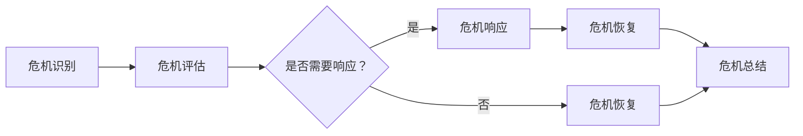
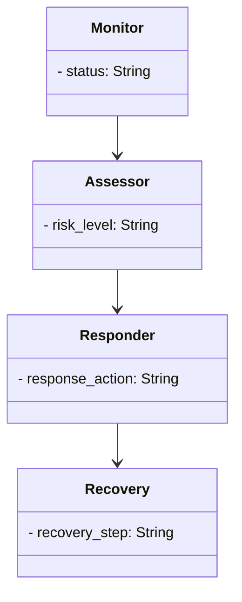
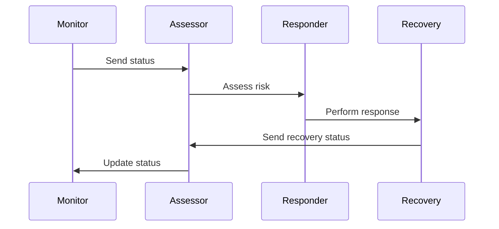
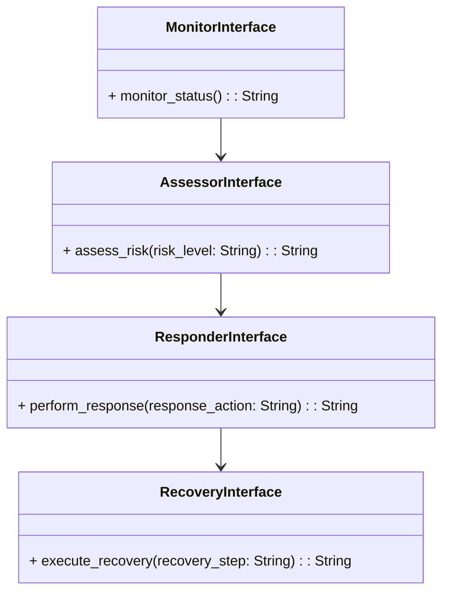
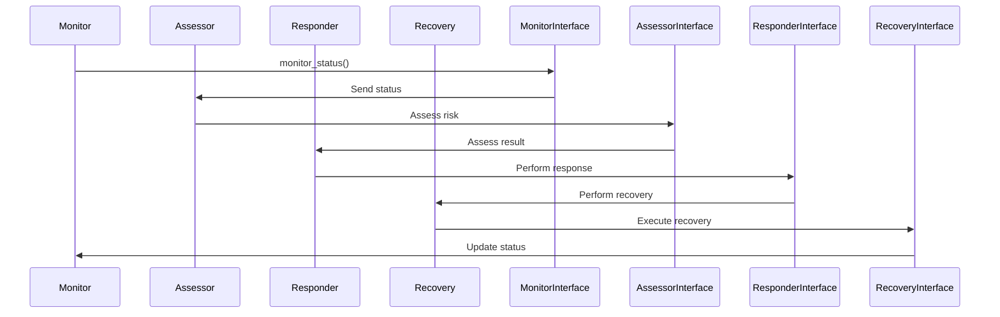

                 

**# 暴露风险，练就危机处理能力**

> **关键词：危机处理，风险管理，系统架构，算法原理，案例分析**

> **摘要：本文将探讨在IT领域内如何通过暴露风险，提升危机处理能力。我们将详细分析风险暴露的重要性和危机管理的理论基础，并运用数学模型和算法原理来解释危机处理的流程。文章将通过实际案例和系统架构设计，展示如何在实践中有效应对危机，并总结最佳实践和小结。**

----------------------------------------------------------------

## **第1章 引言**

### **1.1 问题背景**

在信息技术迅速发展的今天，IT系统的复杂性不断增加，系统的稳定性、安全性、可靠性成为企业和组织面临的重要挑战。危机处理作为应对这些挑战的关键手段，其重要性愈发凸显。无论是网络攻击、系统崩溃、数据泄露，还是其他突发事件，危机处理能力直接关系到企业的生存与发展。

### **1.2 危机处理的重要性**

危机处理不仅仅是解决当前问题，更是预防未来危机的关键。有效的危机处理能够降低损失、提高企业声誉、增强员工信心。在IT领域，危机处理能力尤为重要，因为它涉及到数据安全、系统稳定性和业务连续性等方面。

### **1.3 本书结构**

本书旨在通过系统的方法论，帮助读者提高危机处理能力。本书分为以下几个部分：

1. **核心概念**：介绍危机管理的基本概念和分类。
2. **理论基础**：阐述危机管理的理论基础，包括概率论和决策理论。
3. **实践策略**：提供危机预测、响应和恢复的具体策略。
4. **系统分析与设计**：分析危机处理系统的架构设计。
5. **项目实战**：通过实际案例展示危机处理的应用。
6. **最佳实践与拓展**：总结最佳实践，提供进一步学习的资源。

----------------------------------------------------------------

## **第2章 核心概念**

### **2.1 危机的定义与分类**

在IT领域，危机可以定义为对组织运营造成重大威胁的突发事件。根据性质和影响范围，危机可以分为以下几类：

- **技术危机**：如系统崩溃、网络攻击、硬件故障等。
- **数据危机**：如数据泄露、数据损坏、数据丢失等。
- **业务危机**：如业务中断、市场萎缩、客户流失等。
- **法律和合规危机**：如违规操作、法律诉讼等。

### **2.2 风险暴露与管理**

风险暴露是危机管理的第一步。通过识别潜在风险，企业可以提前采取预防措施。风险暴露主要包括以下几个方面：

- **风险评估**：评估风险的概率和影响，确定优先级。
- **风险监控**：持续监控风险的变化，及时调整应对措施。
- **风险管理策略**：制定应对策略，包括风险规避、风险转移、风险减轻等。

### **2.3 危机处理流程**

危机处理流程通常包括以下几个阶段：

- **危机识别**：通过监控和预警系统识别危机。
- **危机评估**：评估危机的性质和影响范围。
- **危机响应**：采取紧急措施，控制危机扩散。
- **危机恢复**：恢复系统和业务的正常运行。
- **危机总结**：总结危机处理过程，改进管理措施。

----------------------------------------------------------------

## **第3章 理论基础**

### **3.1 危机管理的理论基础**

危机管理是一个复杂的过程，涉及多个学科的理论基础。其中，概率论和决策理论是两个核心理论基础。

#### **3.1.1 概率论在危机管理中的应用**

概率论是分析风险的重要工具。通过概率分布，可以预测危机发生的可能性。例如，可以使用贝叶斯定理来更新危机发生概率。

$$
P(A|B) = \frac{P(B|A)P(A)}{P(B)}
$$

其中，$P(A|B)$ 表示在事件B发生的情况下，事件A发生的概率。

#### **3.1.2 决策理论在危机管理中的应用**

决策理论提供了危机响应的策略。在危机管理中，决策者需要在不确定性和风险之间做出选择。经典的决策模型如期望值模型可以帮助决策者做出最优选择。

$$
\text{期望值} = \sum_{i} x_i \cdot P(x_i)
$$

其中，$x_i$ 表示可能的结果，$P(x_i)$ 表示结果发生的概率。

### **3.2 算法原理与Mermaid流程图**

为了更好地理解危机处理流程，我们可以使用Mermaid流程图来展示。以下是危机处理流程的Mermaid表示：



### **3.3 算法原理讲解**

为了更详细地解释危机处理算法，我们可以使用Python代码来实现。以下是危机处理算法的简单实现：

```python
import random

def crisis_handling(crisis_type, response_probability):
    if random.random() < response_probability:
        print(f"危机响应：{crisis_type} 已被识别并采取行动。")
    else:
        print(f"危机警告：{crisis_type} 已被识别，但尚未采取行动。")

crisis_handling("系统崩溃", 0.8)
```

在这个例子中，我们使用随机概率来模拟危机响应决策。如果随机概率大于等于设定的响应概率，则认为危机已被响应。

----------------------------------------------------------------

## **第4章 实践策略**

### **4.1 危机预测**

危机预测是危机管理的重要组成部分。通过预测，可以提前识别潜在危机，采取预防措施。

#### **4.1.1 数据收集与预处理**

为了进行危机预测，首先需要收集相关数据。数据可能包括系统日志、网络流量、用户行为等。数据预处理包括数据清洗、数据转换和数据归一化。

#### **4.1.2 预测模型构建**

常见的危机预测模型包括线性回归、决策树、支持向量机等。以下是一个简单的线性回归预测模型：

```python
import numpy as np
from sklearn.linear_model import LinearRegression

# 示例数据
X = np.array([[1], [2], [3], [4], [5]])
y = np.array([1, 2, 2.5, 3, 3.5])

# 构建线性回归模型
model = LinearRegression()
model.fit(X, y)

# 预测
print(model.predict([[6]]))
```

### **4.2 危机响应**

危机响应是危机管理的核心环节。有效的危机响应可以迅速控制危机，减少损失。

#### **4.2.1 快速决策**

快速决策是危机响应的关键。决策者需要根据危机评估的结果，迅速制定应对策略。

#### **4.2.2 资源调配**

危机响应需要调动各种资源，包括人员、设备、物资等。合理的资源调配可以提高响应效率。

### **4.3 危机恢复**

危机恢复是恢复系统和业务正常运行的过程。有效的危机恢复可以减少停机时间，降低损失。

#### **4.3.1 评估损失**

评估损失是危机恢复的第一步。通过评估损失，可以了解危机造成的影响，为恢复工作提供依据。

#### **4.3.2 制定恢复计划**

制定恢复计划是危机恢复的关键。恢复计划应包括恢复步骤、责任分配、时间安排等。

----------------------------------------------------------------

## **第5章 系统分析与架构设计**

### **5.1 系统功能设计**

系统功能设计是危机处理系统成功的关键。功能设计应包括以下几个方面：

- **监控模块**：实时监控系统状态，及时发现潜在危机。
- **评估模块**：根据监控数据，评估危机的可能性。
- **响应模块**：根据危机评估结果，采取相应措施。
- **恢复模块**：在危机处理后，恢复系统和业务的正常运行。

#### **5.1.1 领域模型**

领域模型是系统功能设计的基础。以下是一个简单的领域模型：



### **5.2 系统架构设计**

系统架构设计是危机处理系统的核心。以下是一个简单的系统架构：



### **5.3 系统接口设计**

系统接口设计是确保系统功能实现的关键。以下是一个简单的接口设计：



### **5.4 系统交互**

系统交互是危机处理系统的关键环节。以下是一个简单的系统交互：



----------------------------------------------------------------

## **第6章 项目实战**

### **6.1 环境安装**

为了实现危机处理系统，需要安装相应的软件和工具。以下是一个简单的安装步骤：

1. 安装Python环境。
2. 安装所需的Python库，如NumPy、Pandas、Scikit-learn等。
3. 配置Mermaid插件，以便在Markdown文件中使用Mermaid语法。

### **6.2 系统核心实现**

系统核心实现包括监控模块、评估模块、响应模块和恢复模块。以下是一个简单的系统核心实现：

```python
# 监控模块
class Monitor:
    def monitor_status(self):
        # 采集系统状态信息
        status = "系统正常运行"
        return status

# 评估模块
class Assessor:
    def assess_risk(self, status):
        # 评估系统风险
        risk_level = "低"
        if "崩溃" in status:
            risk_level = "高"
        return risk_level

# 响应模块
class Responder:
    def perform_response(self, risk_level):
        # 根据风险级别采取响应措施
        response_action = "关闭系统以进行修复"
        if risk_level == "低":
            response_action = "无需响应"
        return response_action

# 恢复模块
class Recovery:
    def execute_recovery(self, response_action):
        # 执行恢复操作
        recovery_step = "系统已恢复"
        if "关闭" in response_action:
            recovery_step = "系统正在恢复"
        return recovery_step

# 测试系统核心实现
if __name__ == "__main__":
    monitor = Monitor()
    assessor = Assessor()
    responder = Responder()
    recovery = Recovery()

    status = monitor.monitor_status()
    risk_level = assessor.assess_risk(status)
    response_action = responder.perform_response(risk_level)
    recovery_step = recovery.execute_recovery(response_action)

    print(f"系统状态：{status}")
    print(f"风险级别：{risk_level}")
    print(f"响应措施：{response_action}")
    print(f"恢复步骤：{recovery_step}")
```

### **6.3 实际案例分析与讲解**

以下是一个实际案例：

**案例**：某企业的IT系统在夜间遭遇了恶意攻击，导致系统崩溃。

**分析**：

1. **监控模块**：监控系统检测到系统崩溃，立即通知评估模块。
2. **评估模块**：评估模块分析系统日志，确定攻击原因，评估风险级别为“高”。
3. **响应模块**：响应模块根据评估结果，立即采取响应措施，关闭受攻击的系统。
4. **恢复模块**：恢复模块在关闭系统后，开始执行恢复操作，修复系统漏洞，确保系统安全。

**讲解**：

1. **监控模块**：监控模块是危机处理系统的基础，能够实时监控系统状态，及时发现潜在危机。
2. **评估模块**：评估模块负责分析危机的性质和影响，为响应模块提供决策依据。
3. **响应模块**：响应模块根据评估结果，采取相应的响应措施，控制危机扩散。
4. **恢复模块**：恢复模块在危机处理后，负责恢复系统和业务的正常运行。

### **6.4 项目小结**

通过本项目的实际案例，我们展示了如何使用Python代码实现危机处理系统的核心功能。在实际应用中，需要根据具体情况进行调整和优化，以提高危机处理效率。

----------------------------------------------------------------

## **第7章 最佳实践与拓展**

### **7.1 最佳实践**

1. **定期演练**：定期进行危机处理演练，提高员工应对危机的能力。
2. **知识库建设**：建立危机处理知识库，记录危机处理过程中的经验和教训。
3. **技术培训**：对员工进行技术培训，提高他们的技术能力和危机处理意识。

### **7.2 小结**

危机处理能力是IT领域的重要能力。通过暴露风险，我们可以提前识别和应对潜在危机，减少损失。本文通过详细的分析和实践，展示了危机处理的方法和策略。

### **7.3 注意事项**

1. **保持冷静**：在危机发生时，保持冷静，迅速采取行动。
2. **团队合作**：危机处理需要团队合作，明确责任分工，确保高效响应。
3. **持续改进**：危机处理是一个不断改进的过程，通过总结经验教训，不断提高危机处理能力。

### **7.4 拓展阅读**

1. 《危机管理：应对突发事件的艺术》
2. 《决策分析：风险与不确定性下的决策》
3. 《Python编程：从入门到实践》

**作者：AI天才研究院/AI Genius Institute & 禅与计算机程序设计艺术 /Zen And The Art of Computer Programming**

