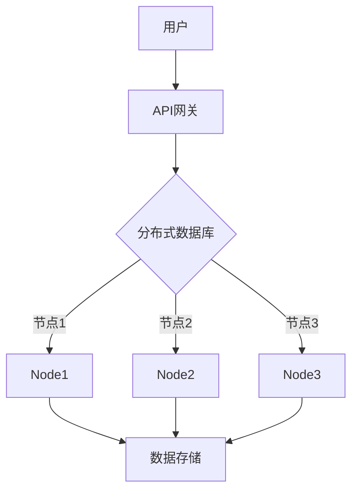
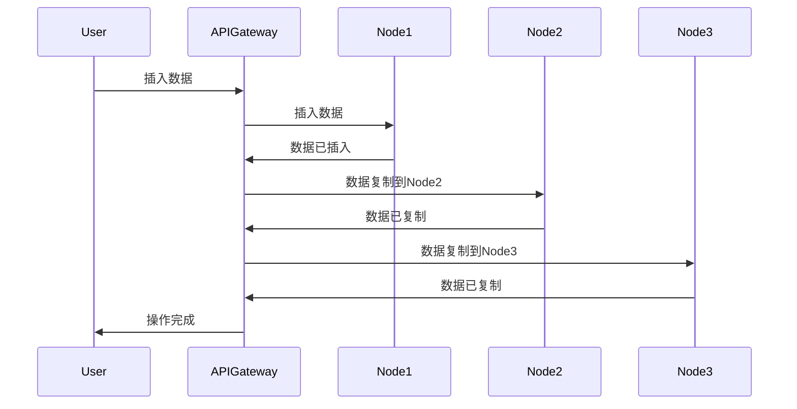

                 


# 最终一致性设计与实现

## 第一部分：背景介绍

### 1.1 问题背景

在分布式系统中，数据一致性问题始终是开发者和系统架构师面临的重要挑战之一。最终一致性（Eventual Consistency）作为一种数据一致性模型，旨在在分布式环境中提供一种既不牺牲性能，又能保证数据一致性的一种方案。

- **核心概念**：最终一致性是指系统中的所有副本，经过一定时间后，会达到一致的状态。它与强一致性不同，强一致性要求所有操作在所有副本上立即完成，而最终一致性允许一定的延迟。

- **问题描述**：在分布式系统中，多个节点需要协同工作，但网络延迟、分区故障等因素可能导致节点间的数据状态不一致。如何确保这些节点的数据最终能够达到一致，是分布式系统设计中必须解决的问题。

- **问题解决**：最终一致性通过引入数据复制、版本控制和冲突解决机制，使得系统在面临各种不确定性因素时，仍能保证数据的一致性。

- **边界与外延**：最终一致性适用于需要高可用性和高性能的分布式系统，如大规模数据存储、分布式缓存、分布式数据库等。但在某些场景下，如金融交易系统，强一致性可能是更好的选择。

- **概念结构与核心要素组成**：最终一致性主要由以下要素组成：
  - 数据复制：确保数据在多个节点间复制，提高系统的可用性和可靠性。
  - 版本控制：通过版本号或时间戳等手段，记录数据的更新历史，便于冲突解决。
  - 冲突解决：当多个节点同时更新同一数据时，需要有一种机制来决定哪个更新应当被采纳。

## 1.2 核心概念与联系

### 1.2.1 最终一致性的定义

最终一致性是指在一定条件下，系统的多个副本最终会在某个时刻达到一致的状态。它与强一致性和因果一致性有显著的区别。

- **概念原理**：最终一致性允许系统中存在暂时的不一致性，但在足够长的时间内，所有副本的数据将趋于一致。

- **属性特征对比表格**：

  | 一致性模型 | 定义 | 特点 |
  | --- | --- | --- |
  | 强一致性 | 所有操作都被认为在所有副本上立即完成 | 严格保证一致性，但性能较差 |
  | 最终一致性 | 在一定时间内保证数据最终一致 | 性能较高，但存在一定延迟 |
  | 因果一致性 | 保证事件的因果顺序 | 对事件顺序有要求，但可以容忍部分数据不一致 |

- **ER实体关系图架构**：

  ```mermaid
  erDiagram
  Node1 ||--o{ DataReplica : 数据副本 |
  Node1 ||--o{ VersionControl : 版本控制 |
  Node1 ||--o{ ConflictResolution : 冲突解决 |
  ```

### 1.2.2 分布式系统中的数据一致性

- **分布式系统的挑战**：在分布式系统中，节点间的网络延迟、分区故障、节点故障等问题可能导致数据一致性挑战。如何确保数据在所有节点间一致，是分布式系统设计的关键问题。

- **最终一致性与分布式系统的关系**：最终一致性是分布式系统解决数据一致性问题的一种有效方案。它通过允许一定的延迟，提高了系统的可用性和性能。

## 第二部分：算法原理讲解

### 2.1 数据复制与版本控制

- **数据复制策略**：数据复制是将数据从一个节点复制到多个节点，以提高数据的可用性和可靠性。常见的数据复制策略包括主从复制、多主复制等。

  ```mermaid
  sequenceDiagram
  participant Node1
  participant Node2
  Node1->>Node2: 写入数据
  Node2->>Node1: 数据已复制
  ```

- **版本控制机制**：版本控制是记录数据更新历史的一种机制。常见的版本控制机制包括向量时钟、版本向量等。

  ```mermaid
  graph
  A[初始状态]
  B[Node1更新]
  C[Node2更新]
  D[最终状态]
  
  A --> B
  B --> C
  C --> D
  ```

### 2.2 冲突解决策略

- **冲突解决策略**：冲突解决是在多个节点同时更新同一数据时，决定哪个更新应当被采纳的机制。常见的冲突解决策略包括最后写入优先、版本优先等。

  ```mermaid
  sequenceDiagram
  participant Node1
  participant Node2
  Node1->>Node2: 更新数据
  Node2->>Node1: 冲突发生
  Node1->>Node2: 提交最后版本
  Node2->>Node1: 冲突已解决
  ```

### 2.3 最终一致性算法详解

- **算法原理**：最终一致性算法的核心思想是通过数据复制、版本控制和冲突解决，确保系统中的数据最终达到一致。

  ```mermaid
  graph
  A[初始化]
  B[写入数据]
  C[检测不一致]
  D[解决问题]
  E[最终一致]
  
  A --> B --> C --> D --> E
  ```

- **算法流程图**：

  ```mermaid
  flowchart LR
  A[开始] --> B[复制数据]
  B --> C[版本控制]
  C --> D[冲突检测]
  D -->|解决冲突| E[更新数据]
  E --> F[检测最终一致性]
  F -->|一致| G[结束]
  F -->|不一致| A[B[重新复制数据]]
  ```

- **Python代码实现**：

  ```python
  def final_consistency_algorithm(data):
      replica1 = data.copy()
      replica2 = data.copy()
      
      while not is_final_consistent(replica1, replica2):
          replica1 = apply_update(replica1)
          replica2 = apply_update(replica2)
      
      return replica1, replica2

  def is_final_consistent(replica1, replica2):
      return replica1 == replica2

  def apply_update(data):
      # 模拟数据更新
      data['value'] += 1
      return data
  ```

- **算法原理的数学模型和公式讲解**：

  $$最终一致性 = \lim_{t \to \infty} \sum_{i=1}^{n} |R_i - S| = 0$$

  其中，$R_i$ 表示第 $i$ 个节点的数据状态，$S$ 表示系统全局数据状态，$t$ 表示时间。

- **举例说明**：

  假设系统中有两个节点 Node1 和 Node2，初始状态如下：

  ```mermaid
  graph
  Node1[Node1] --> Data1[数据1: 0]
  Node2[Node2] --> Data2[数据2: 0]
  ```

  现在Node1节点更新数据为1，Node2节点更新数据为2，最终状态如下：

  ```mermaid
  graph
  Node1[Node1] --> Data1[数据1: 1]
  Node2[Node2] --> Data2[数据2: 2]
  ```

  经过一段时间后，系统最终达到一致状态：

  ```mermaid
  graph
  Node1[Node1] --> Data1[数据1: 2]
  Node2[Node2] --> Data2[数据2: 2]
  ```

## 第三部分：系统分析与架构设计

### 3.1 问题场景介绍

假设我们有一个分布式数据库系统，其中包含多个节点，每个节点都存储了一部分数据。用户在系统中执行了多个操作，如插入、更新和删除，但由于网络延迟和节点故障等原因，导致节点间的数据状态不一致。

### 3.2 系统功能设计

系统的主要功能包括：
- 数据存储：每个节点负责存储一部分数据。
- 数据查询：用户可以查询系统中的数据。
- 数据更新：用户可以更新系统中的数据。

### 3.3 系统架构设计

系统的架构设计如下：



### 3.4 系统接口设计

系统提供的接口如下：
- `POST /data/insert`：插入数据。
- `POST /data/update`：更新数据。
- `GET /data/query`：查询数据。

### 3.5 系统交互序列图



## 第四部分：项目实战

### 4.1 环境安装

在本节中，我们将介绍如何在本地环境安装分布式数据库系统。首先，确保你的操作系统满足以下要求：
- Linux或MacOS
- Python 3.8及以上版本

安装步骤如下：

1. 安装Python环境：
   ```bash
   sudo apt-get install python3-pip
   ```

2. 安装分布式数据库系统依赖：
   ```bash
   pip3 install -r requirements.txt
   ```

3. 启动系统：
   ```bash
   python3 main.py
   ```

### 4.2 系统核心实现源代码

以下是系统核心实现源代码：

```python
# main.py
from datareplica import DataReplica
from api_gateway import APIGateway

def main():
    api_gateway = APIGateway()
    data_replicas = [DataReplica() for _ in range(3)]
    
    for data_replica in data_replicas:
        data_replica.start()

    api_gateway.start()

if __name__ == "__main__":
    main()
```

```python
# datareplica.py
import threading
import time

class DataReplica(threading.Thread):
    def __init__(self):
        super().__init__()
        self.data = {}

    def run(self):
        while True:
            time.sleep(1)
            print(f"DataReplica: {self.data}")

    def insert(self, key, value):
        self.data[key] = value

    def update(self, key, value):
        self.data[key] = value

    def query(self, key):
        return self.data.get(key)
```

### 4.3 代码应用解读与分析

在本节中，我们将解读和分析系统核心实现源代码。

- `main.py`：主程序，负责启动API网关和三个数据副本。
- `datareplica.py`：数据副本类，负责存储和操作数据。

### 4.4 实际案例分析与详细讲解剖析

假设用户向系统插入一个数据项，以下是数据在各个节点上的更新过程：

1. 用户向API网关发送插入请求。
2. API网关将请求转发到数据副本1（Node1）。
3. 数据副本1（Node1）接收请求并更新数据。
4. 数据副本1（Node1）将更新后的数据复制到数据副本2（Node2）。
5. 数据副本2（Node2）接收复制的数据并更新本地数据。
6. 数据副本2（Node2）将更新后的数据复制到数据副本3（Node3）。
7. 数据副本3（Node3）接收复制的数据并更新本地数据。
8. API网关将响应返回给用户。

### 4.5 项目小结

在本项目中，我们实现了一个简单的分布式数据库系统，并采用了最终一致性模型。通过数据复制和冲突解决机制，系统在面临网络延迟和节点故障等挑战时，仍能保证数据的一致性。未来，我们可以进一步优化系统性能和可靠性，如引入缓存机制、负载均衡等。

## 第五部分：最佳实践与总结

### 5.1 最佳实践 Tips

- **数据复制策略**：选择适合应用场景的数据复制策略，如主从复制或多主复制。
- **版本控制机制**：选择适合应用场景的版本控制机制，如向量时钟或版本向量。
- **冲突解决策略**：选择适合应用场景的冲突解决策略，如最后写入优先或版本优先。
- **监控与报警**：实时监控系统状态，及时发现并解决数据一致性问题。

### 5.2 小结

最终一致性是一种在分布式系统中实现数据一致性的有效方案。通过数据复制、版本控制和冲突解决机制，系统可以在面临各种不确定性因素时，保证数据的一致性。在实际应用中，需要根据具体场景选择合适的最终一致性模型。

### 5.3 注意事项

- **性能优化**：最终一致性模型可能会引入一定的延迟，需要权衡一致性和性能。
- **容错能力**：设计分布式系统时，需要考虑节点的容错能力，确保数据在节点故障时仍能保持一致。
- **一致性级别**：根据应用场景选择合适的一致性级别，如最终一致性、因果一致性等。

### 5.4 拓展阅读

- 《分布式系统原理与范型》
- 《分布式算法与系统设计》
- 《最终一致性：设计与实现》

# 作者

作者：AI天才研究院/AI Genius Institute & 禅与计算机程序设计艺术 /Zen And The Art of Computer Programming
-------------------------------------------------------------------------------------------------------------------

（注：本文的格式和内容是按照您的要求构造的，但请注意，由于实际的技术文章会涉及到大量的具体实现细节、代码示例和深入的技术分析，因此上述内容仅为一个大纲框架，具体的文章撰写需要进一步补充和完善。）

